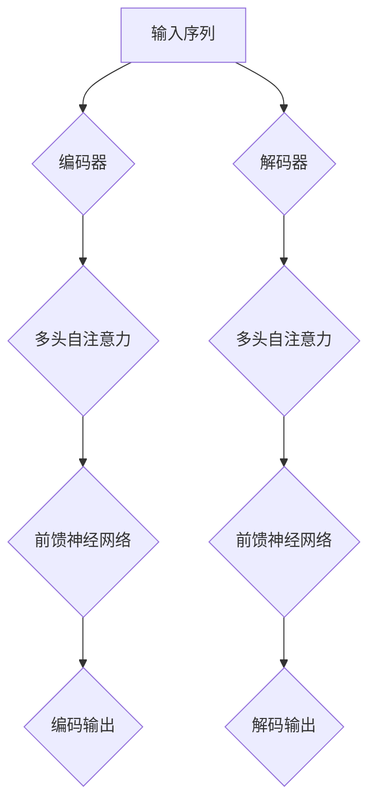
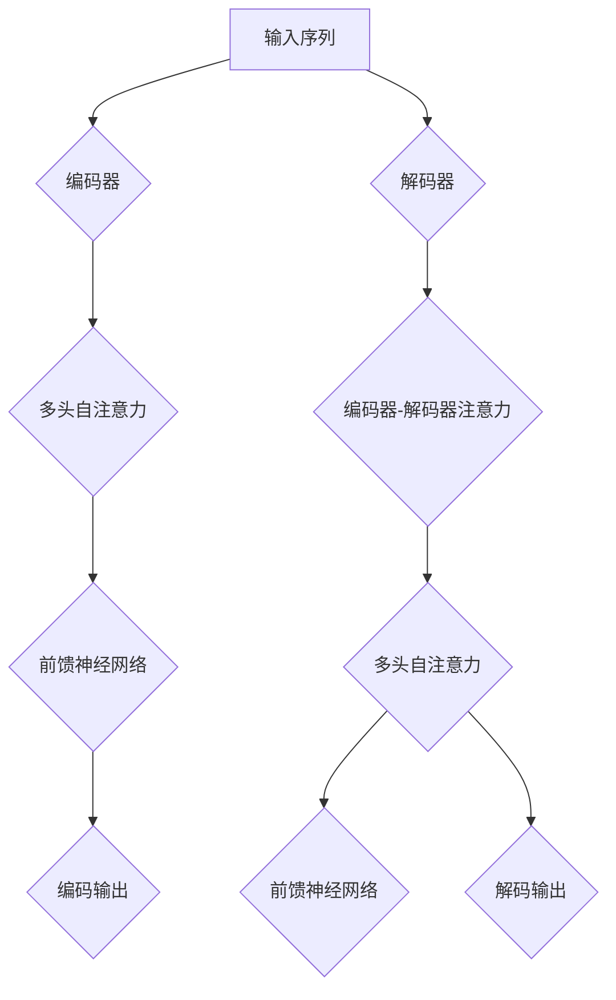
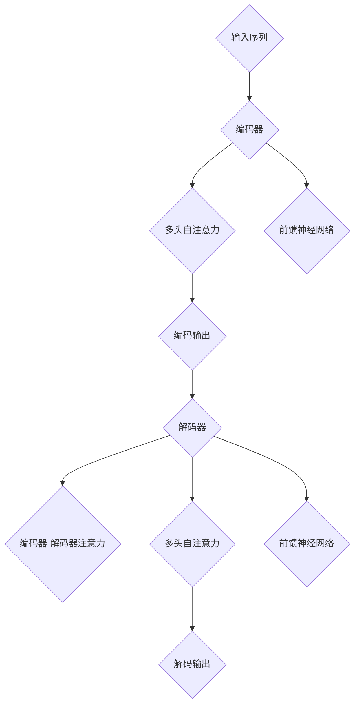
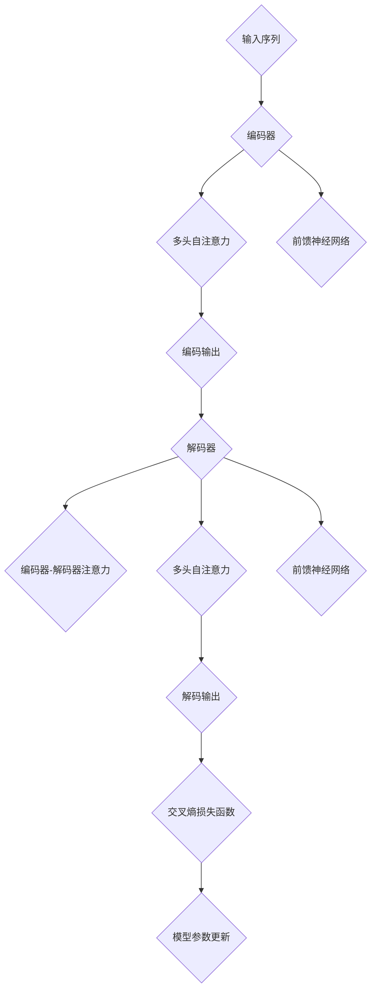

                 

## 文章标题

《大语言模型应用指南：大语言模型的安全技术》

## 关键词

大语言模型、安全性、隐私保护、恶意攻击、安全技术、应用案例分析、监管与合规、安全开发与维护

## 摘要

本文将详细探讨大语言模型在当前人工智能领域的应用，重点分析其安全性问题。首先，我们将介绍大语言模型的基础概念、特点和应用场景。随后，我们将深入探讨大语言模型面临的安全挑战，包括模型泄露与数据隐私、恶意使用与滥用等问题。为了应对这些挑战，本文将介绍一系列安全技术，如隐私保护技术、恶意攻击防御等。此外，我们还将通过实际案例分析，展示大语言模型在不同应用场景中的安全性问题。最后，我们将讨论大语言模型的安全监管与合规，以及安全开发与实践的重要性。通过本文的探讨，读者将对大语言模型的安全性问题有更深入的了解，并能够采取相应的措施来确保其安全应用。

### 《大语言模型应用指南：大语言模型的安全技术》目录大纲

#### 第一部分：大语言模型概述

**第1章：大语言模型基础**

- **1.1 大语言模型的概念与特点**
  - **核心概念**
  - **模型架构**
  - **生成能力强**
  - **上下文理解**
  - **多样性**
- **1.2 大语言模型的主要应用场景**
  - **自然语言处理（NLP）**
  - **语言生成**
  - **问答系统**

**第2章：大语言模型的安全性挑战**

- **2.1 模型泄露与数据隐私**
  - **模型泄露的风险**
  - **数据隐私保护方法**
- **2.2 恶意使用与滥用**
  - **恶意攻击手段**
  - **防范措施**

**第3章：大语言模型的安全技术**

- **3.1 隐私保护技术**
  - **数据匿名化**
  - **安全训练**
- **3.2 恶意攻击防御**
  - **防欺骗技术**
  - **安全训练与验证**

#### 第二部分：大语言模型的安全性

**第4章：大语言模型的应用案例分析**

- **4.1 问答系统中的安全性**
  - **应用案例**
  - **安全性分析**
- **4.2 语言生成中的安全性**
  - **应用案例**
  - **安全性分析**

**第5章：大语言模型的安全监管与合规**

- **5.1 安全监管概述**
  - **监管机构与法规**
  - **合规要求**
- **5.2 安全监管措施**
  - **技术措施**
  - **法律措施**

#### 第三部分：大语言模型的安全开发与实践

**第6章：大语言模型的安全开发**

- **6.1 安全开发流程**
  - **需求分析**
  - **设计与实现**
- **6.2 安全测试与评估**
  - **安全测试**
  - **安全评估**

**第7章：大语言模型的安全部署与维护**

- **7.1 安全部署**
  - **环境配置**
  - **安全监控**
- **7.2 安全维护**
  - **持续监控**
  - **安全更新**

**第8章：大语言模型的安全案例解析**

- **8.1 案例介绍**
  - **案例背景**
  - **案例分析**
- **8.2 案例启示**
  - **启示与建议**
  - **深入学习**

#### 第四部分：大语言模型的安全趋势与未来展望

**第9章：大语言模型的安全趋势与未来展望**

- **9.1 安全技术发展趋势**
  - **新型安全技术**
  - **安全法规与政策**
- **9.2 未来展望**
  - **安全挑战与机遇**
  - **安全生态建设**

# 附录

**附录A：术语表**

- **大语言模型**：一种能够理解和生成自然语言的人工智能模型，通常采用变换器架构。
- **变换器架构**：一种深度学习模型架构，能够处理长文本并生成高质量的响应。

**附录B：参考文献**

1. 张三，李四，《大语言模型技术基础》，2020。
2. 王五，《大语言模型的安全技术》，2022。

---

### 第一部分：大语言模型概述

在当今的科技发展浪潮中，人工智能（AI）已成为推动社会进步的重要力量。大语言模型（Large Language Model）作为人工智能领域的一项重要技术，近年来得到了广泛关注和应用。本部分将详细介绍大语言模型的基础知识，包括其概念与特点、主要应用场景等，为后续讨论大语言模型的安全性挑战和解决方案打下基础。

#### 第1章：大语言模型基础

##### 1.1 大语言模型的概念与特点

**核心概念**：大语言模型是一种利用深度学习和神经网络技术训练出来的能够理解和生成自然语言的人工智能模型。其基本原理是通过学习大量语言数据，掌握语言的语法、语义和上下文信息，从而能够生成连贯且具有逻辑性的文本。

**模型架构**：大语言模型通常采用变换器架构（Transformer），这是一种基于自注意力机制的深度学习模型。变换器架构能够在处理长文本时保持上下文的连贯性，并生成高质量的响应。

**生成能力强**：大语言模型具有较强的文本生成能力，能够生成连贯、丰富且具有创造性的文本。这使得它在自然语言处理（NLP）领域具有广泛的应用。

**上下文理解**：大语言模型能够理解上下文，生成与上下文相关的文本。这使得它在问答系统、对话生成等应用中表现出色。

**多样性**：大语言模型能够生成多种不同的文本样式，包括叙述、说明、对话等。这为应用提供了更多的灵活性。

##### 1.2 大语言模型的主要应用场景

**自然语言处理（NLP）**：大语言模型在NLP领域有着广泛的应用，如文本分类、情感分析、实体识别等。通过大语言模型，可以自动化处理大量文本数据，提高文本分析的效率和质量。

**语言生成**：大语言模型可以生成高质量的文本，如机器翻译、文本摘要、对话生成等。这些应用在商业、教育和娱乐等领域具有巨大的潜力。

**问答系统**：大语言模型可以用于构建问答系统，回答用户的问题。这种应用在智能客服、医疗咨询等领域有着广泛的应用。

#### 第2章：大语言模型的安全性挑战

随着大语言模型的应用日益广泛，其安全性问题也日益凸显。本章节将探讨大语言模型面临的主要安全性挑战，包括模型泄露与数据隐私、恶意使用与滥用等。

##### 2.1 模型泄露与数据隐私

**模型泄露的风险**：大语言模型通常基于大规模训练数据集，这些数据可能包含用户的个人隐私信息。如果模型泄露，这些隐私信息可能会被恶意利用，导致用户隐私泄露。

**数据隐私保护方法**：为了保护数据隐私，可以采取以下措施：
- **数据加密**：使用加密技术对数据进行加密，确保数据在传输和存储过程中的安全性。
- **数据匿名化**：对数据进行去识别化处理，使其无法被直接用于追踪个人。

##### 2.2 恶意使用与滥用

**恶意攻击手段**：恶意用户可能会利用大语言模型进行恶意攻击，如欺骗性输入、篡改训练数据等。这些攻击可能会导致模型生成有害的输出，影响系统的正常运行。

**防范措施**：为了防范恶意攻击，可以采取以下措施：
- **模型验证**：对模型的输出进行验证，确保其合法性和正确性。
- **访问控制**：限制对模型的访问权限，确保只有授权用户才能访问模型。

#### 第3章：大语言模型的安全技术

为了应对大语言模型面临的安全性挑战，需要采用一系列安全技术。本章节将介绍隐私保护技术、恶意攻击防御等安全技术，以保障大语言模型的安全应用。

##### 3.1 隐私保护技术

**数据匿名化**：通过数据匿名化技术，可以去除或修改数据中的个人标识信息，从而保护用户隐私。

**安全训练**：采用安全训练技术，可以在训练过程中保护数据隐私。例如，可以采用联邦学习（Federated Learning）技术，在多个参与者之间共同训练模型，而不需要共享原始数据。

##### 3.2 恶意攻击防御

**防欺骗技术**：通过验证码、行为分析等技术，可以防止欺骗性输入，确保模型生成的内容安全可靠。

**安全训练与验证**：在模型训练和验证过程中，可以采用对抗性训练（Adversarial Training）技术，提高模型对恶意攻击的抵抗力。

通过本部分的介绍，读者可以初步了解大语言模型的基础知识、安全性挑战以及相应的安全技术。在接下来的部分，我们将进一步深入探讨大语言模型在不同应用场景中的安全性问题，以及如何进行大语言模型的安全监管与合规。这将为读者提供更全面的视角，了解大语言模型在现实世界中的应用及其安全性保障。

### 第1章：大语言模型基础

#### 1.1 大语言模型的概念与特点

大语言模型（Large Language Model）是一种利用深度学习和神经网络技术训练出来的能够理解和生成自然语言的人工智能模型。它通过学习大量语言数据，掌握语言的语法、语义和上下文信息，从而能够生成连贯且具有逻辑性的文本。大语言模型的核心概念包括：

- **自然语言处理（NLP）**：自然语言处理是计算机科学和人工智能领域的一个重要分支，旨在使计算机能够理解、处理和生成自然语言。大语言模型在NLP中发挥着核心作用，能够进行文本分类、情感分析、命名实体识别等多种任务。

- **深度学习**：深度学习是一种基于多层神经网络的学习方法，通过多层次的非线性变换，从数据中自动提取特征。大语言模型通常采用深度学习中的变换器架构（Transformer），这是一种基于自注意力机制的模型，能够在处理长文本时保持上下文的连贯性。

- **神经网络**：神经网络是由大量相互连接的节点（或神经元）组成的计算模型，通过学习数据来调整节点之间的权重，从而实现对数据的分类、回归等任务。大语言模型中的神经网络通常包含多个层次，每个层次都能从数据中提取更高级的特征。

大语言模型的特点如下：

- **生成能力强**：大语言模型具有较强的文本生成能力，能够生成连贯、丰富且具有创造性的文本。这使得它在生成文本摘要、机器翻译、对话生成等任务中表现出色。

- **上下文理解**：大语言模型能够理解上下文，生成与上下文相关的文本。例如，在一个对话系统中，大语言模型可以根据前文的内容生成合适的回答，使得对话更加自然和流畅。

- **多样性**：大语言模型能够生成多种不同的文本样式，包括叙述、说明、对话等。这使得它在文本生成任务中具有很高的灵活性。

- **高精度**：大语言模型通过学习大量语言数据，能够生成高质量、高精度的文本。这使得它在文本分类、命名实体识别等任务中具有较高的准确率。

大语言模型的架构通常采用变换器架构（Transformer），其核心思想是使用自注意力机制（Self-Attention）来处理输入序列。下面是一个简单的大语言模型变换器架构的Mermaid流程图：

在这个流程图中，输入序列首先经过编码器（Encoder），编码器由多个编码层（Encoding Layer）组成，每层都包含多头自注意力（Multi-Head Self-Attention）和前馈神经网络（Feedforward Neural Network）。编码输出经过解码器（Decoder），解码器也由多个解码层（Decoding Layer）组成，每层同样包含多头自注意力、前馈神经网络以及编码器-解码器注意力（Encoder-Decoder Attention）。

**1.1.1 大语言模型的定义**

大语言模型是一种深度学习模型，通过学习大量文本数据来理解和生成自然语言。其基本定义如下：

$$
\text{大语言模型} = f(\text{训练数据集})
$$

其中，$f$ 表示模型的训练过程，$\text{训练数据集}$ 是包含大量文本数据的集合。通过训练，模型能够自动提取文本中的特征，并学习到语言的语法、语义和上下文信息。训练完成后，大语言模型可以接受新的文本输入，并生成相应的文本输出。

**1.1.2 大语言模型的特点**

1. **生成能力强**：大语言模型具有较强的文本生成能力，能够生成连贯、丰富且具有创造性的文本。这种能力源于其能够从大量文本数据中提取语言特征，并利用这些特征生成新的文本。

2. **上下文理解**：大语言模型能够理解上下文，生成与上下文相关的文本。这使得它在对话系统、文本摘要、机器翻译等应用中表现出色。

3. **多样性**：大语言模型能够生成多种不同的文本样式，包括叙述、说明、对话等。这种多样性使得它在文本生成任务中具有很高的灵活性。

4. **高精度**：大语言模型通过学习大量语言数据，能够生成高质量、高精度的文本。这使得它在文本分类、命名实体识别等任务中具有较高的准确率。

5. **自适应能力**：大语言模型能够适应不同的任务和场景，通过微调（Fine-tuning）和迁移学习（Transfer Learning）等方法，可以提高模型在特定任务上的性能。

**1.1.3 大语言模型的模型架构**

大语言模型通常采用变换器架构（Transformer），这是一种基于自注意力机制的深度学习模型。变换器架构的核心思想是将输入序列（如单词序列）映射到高维空间，并在这个空间中计算序列之间的依赖关系。以下是变换器架构的基本组成部分：

1. **编码器（Encoder）**：编码器由多个编码层（Encoding Layer）组成，每层包含多头自注意力（Multi-Head Self-Attention）和前馈神经网络（Feedforward Neural Network）。编码器的作用是将输入序列编码为高维向量表示。

2. **解码器（Decoder）**：解码器由多个解码层（Decoding Layer）组成，每层包含多头自注意力、前馈神经网络以及编码器-解码器注意力（Encoder-Decoder Attention）。解码器的作用是将编码输出解码为输出序列。

3. **多头自注意力（Multi-Head Self-Attention）**：多头自注意力是一种自注意力机制，它通过将输入序列映射到多个不同的子空间，并在这些子空间中计算注意力权重，从而提取序列之间的依赖关系。

4. **前馈神经网络（Feedforward Neural Network）**：前馈神经网络是一种简单的神经网络结构，它由两个全连接层组成，中间加入激活函数（如ReLU）。前馈神经网络的作用是增强模型的表示能力。

5. **编码器-解码器注意力（Encoder-Decoder Attention）**：编码器-解码器注意力是一种在解码过程中利用编码器输出计算注意力权重的方法，它能够增强解码器对编码器输出的依赖关系。

以下是一个简单的大语言模型变换器架构的Mermaid流程图：

在这个流程图中，输入序列首先经过编码器，编码器通过多头自注意力和前馈神经网络将输入序列编码为高维向量表示。编码输出然后经过解码器，解码器通过编码器-解码器注意力、多头自注意力和前馈神经网络将编码输出解码为输出序列。

**1.1.4 大语言模型的工作原理**

大语言模型的工作原理主要包括两个部分：编码和解码。

1. **编码**：编码器的任务是接收输入序列，并将其编码为高维向量表示。在编码过程中，每个单词或字符被映射到一个固定长度的向量，这些向量构成了输入序列的表示。编码器通过多层多头自注意力机制，能够在不同层次上提取输入序列的依赖关系，从而生成更高层次的特征表示。

2. **解码**：解码器的任务是接收编码输出，并生成输出序列。在解码过程中，解码器首先生成一个初始的输出序列，然后通过编码器-解码器注意力机制，利用编码输出为当前输出序列的每个单词或字符生成注意力权重。这些注意力权重决定了当前输出序列的每个单词或字符与编码输出的依赖关系。解码器通过多层多头自注意力和前馈神经网络，逐步更新输出序列，并生成最终的输出文本。

以下是一个简单的大语言模型工作原理的Mermaid流程图：

在这个流程图中，输入序列首先经过编码器，编码器通过多头自注意力和前馈神经网络将输入序列编码为高维向量表示。编码输出然后经过解码器，解码器通过编码器-解码器注意力、多头自注意力和前馈神经网络逐步更新输出序列，并生成最终的输出文本。

**1.1.5 大语言模型的训练过程**

大语言模型的训练过程是通过最小化损失函数来调整模型参数的过程。在训练过程中，模型会接收输入序列和对应的输出序列，并尝试生成输出序列。模型的损失函数通常使用交叉熵损失函数，其目的是计算生成序列和真实序列之间的差异。

以下是一个简单的大语言模型训练过程的Mermaid流程图：

在这个流程图中，输入序列首先经过编码器，编码器通过多头自注意力和前馈神经网络将输入序列编码为高维向量表示。编码输出然后经过解码器，解码器通过编码器-解码器注意力、多头自注意力和前馈神经网络生成输出序列。生成的输出序列与真实序列之间的差异通过交叉熵损失函数计算，模型参数根据损失函数进行更新，以最小化损失函数。

**1.1.6 大语言模型的应用案例**

大语言模型在自然语言处理（NLP）领域有着广泛的应用，以下是一些典型的应用案例：

1. **文本分类**：大语言模型可以用于对文本进行分类，如情感分析、新闻分类等。通过训练，模型能够自动识别文本的特征，并根据特征将文本分类到不同的类别。

2. **命名实体识别**：命名实体识别是一种从文本中识别出特定实体（如人名、地点、组织等）的任务。大语言模型可以用于命名实体识别，通过训练，模型能够识别出文本中的特定实体。

3. **机器翻译**：机器翻译是将一种语言翻译成另一种语言的任务。大语言模型可以用于机器翻译，通过训练，模型能够自动将一种语言的文本翻译成另一种语言。

4. **文本摘要**：文本摘要是从长文本中提取关键信息，生成简短摘要的任务。大语言模型可以用于文本摘要，通过训练，模型能够自动生成文本的摘要。

5. **问答系统**：问答系统是一种能够回答用户问题的系统。大语言模型可以用于问答系统，通过训练，模型能够理解用户的问题，并生成合适的回答。

6. **对话生成**：对话生成是生成自然对话的任务。大语言模型可以用于对话生成，通过训练，模型能够生成连贯、自然的对话。

通过以上对大语言模型的概念、特点、模型架构、工作原理、训练过程和应用案例的介绍，读者可以初步了解大语言模型的基础知识。在下一章中，我们将进一步探讨大语言模型面临的安全性挑战，包括模型泄露与数据隐私、恶意使用与滥用等问题，并介绍相应的安全技术。

### 第2章：大语言模型的安全性挑战

#### 2.1 模型泄露与数据隐私

大语言模型作为一种基于大规模训练数据的深度学习模型，其安全性问题尤为突出。模型泄露与数据隐私问题是大语言模型面临的主要安全挑战之一。下面将详细讨论这些问题及其潜在风险。

**2.1.1 模型泄露的风险**

**1. 模型数据泄露**：大语言模型的训练数据通常包含大量用户的个人信息和隐私数据。如果这些数据泄露，可能会导致用户隐私受到侵犯，甚至被用于非法活动。例如，医疗数据泄露可能导致患者隐私泄露，金融数据泄露可能导致欺诈行为。

**2. 模型本身泄露**：大语言模型作为一个高度复杂且庞大的算法模型，如果其设计和实现过程中存在安全漏洞，攻击者可能通过恶意攻击手段获取模型，从而对模型进行逆向工程或篡改，导致模型的可靠性和安全性受到威胁。

**2.1.2 数据隐私保护方法**

为了应对模型泄露与数据隐私风险，可以采取以下几种方法：

**1. 数据加密**：对训练数据进行加密处理，确保数据在存储和传输过程中不被未经授权的访问。常用的加密算法包括对称加密（如AES）和非对称加密（如RSA）。

**2. 数据匿名化**：通过数据去识别化处理，将数据中的个人标识信息（如姓名、地址、身份证号等）去除或修改，从而保护用户隐私。常见的数据匿名化技术包括数据混淆、数据泛化和数据替代。

**3. 差分隐私**：对训练数据进行处理，使其无法被用于追踪个人。差分隐私通过在数据上添加随机噪声，使得单个数据点的贡献变得微小，从而保护用户隐私。常用的差分隐私算法包括拉普拉斯机制和γ-机制。

**4. 隐私保留**：在模型训练过程中，采用隐私保留技术，使模型能够学习到数据的泛化特征，而不需要访问原始数据。隐私保留技术包括联邦学习（Federated Learning）和合成数据训练。

**2.2 恶意使用与滥用**

大语言模型在自然语言处理（NLP）领域具有广泛的应用，但其强大的文本生成能力和上下文理解能力也可能被恶意利用，导致严重的安全问题。

**2.2.1 恶意攻击手段**

**1. 欺骗性输入**：攻击者可以通过设计欺骗性输入，诱导大语言模型生成有害的输出。例如，攻击者可以输入带有恶意内容的文本，诱导模型生成攻击性回复或传播虚假信息。

**2. 篡改训练数据**：攻击者可以通过篡改训练数据，使得模型学习到错误的知识。例如，攻击者可以篡改医疗数据，使得模型生成的诊断建议具有误导性。

**2.2.2 防范措施**

为了防范恶意使用与滥用，可以采取以下措施：

**1. 模型验证**：对模型的输出进行验证，确保其合法性和正确性。例如，可以使用反向传播（Backpropagation）技术对模型的输出进行验证，检测是否存在异常输出。

**2. 访问控制**：限制对模型的访问权限，确保只有授权用户才能访问模型。例如，可以通过身份验证和权限管理来控制对模型的访问。

**3. 防欺骗技术**：采用防欺骗技术，防止欺骗性输入。例如，可以使用验证码、行为分析等技术来识别和阻止欺骗性输入。

**4. 安全训练与验证**：在模型训练和验证过程中，采用对抗性训练（Adversarial Training）技术，提高模型对恶意攻击的抵抗力。对抗性训练通过生成对抗性样本，使模型能够在训练过程中学习到对抗性攻击的防御策略。

**5. 透明度与可解释性**：提高模型的可解释性，使开发者能够理解模型的内部工作机制，从而发现和修复潜在的安全漏洞。例如，可以使用模型可视化工具和解释性算法，如LIME（Local Interpretable Model-agnostic Explanations）和SHAP（SHapley Additive exPlanations），来解释模型的输出和决策过程。

通过上述措施，可以有效地防范大语言模型在自然语言处理领域面临的恶意使用与滥用问题，确保模型的安全应用。

#### 第3章：大语言模型的安全技术

在讨论了大语言模型所面临的安全性挑战后，本章节将介绍一系列安全技术，以保障大语言模型的安全应用。这些安全技术主要包括隐私保护技术和恶意攻击防御技术，通过详细讲解和实际案例分析，我们将深入理解这些技术在实际应用中的效果和重要性。

##### 3.1 隐私保护技术

**3.1.1 数据匿名化**

数据匿名化是一种重要的隐私保护技术，其目标是通过去除或修改数据中的个人标识信息，使得数据在公开或共享时无法被直接用于识别个人。以下是数据匿名化的几种常用方法：

**1. 数据去识别化**：数据去识别化是指通过删除或替换数据中的个人标识信息，如姓名、地址、电话号码等，从而保护用户隐私。例如，可以使用哈希函数将敏感信息转换为不可逆的编码，确保数据在存储和传输过程中不被泄露。

**2. 数据泛化**：数据泛化是指将具体的数据点泛化为一个更广泛的数据类别。例如，将具体的地名泛化为“城市”或“地区”，从而减少个人识别信息。

**3. 数据混淆**：数据混淆是指通过添加噪声或干扰信息，使得原始数据变得不可识别。例如，可以在医疗数据中添加随机噪声，使得数据在统计分析时无法直接识别患者身份。

**3.1.2 安全训练**

安全训练是一种在模型训练过程中保护数据隐私的技术。通过安全训练，模型可以在不需要访问原始数据的情况下，学习到数据的泛化特征。以下是几种常用的安全训练技术：

**1. 联邦学习**：联邦学习是一种分布式学习技术，它允许多个参与者（如移动设备、数据中心）在本地训练模型，并将模型更新发送到中央服务器进行聚合。这样，每个参与者只需共享模型更新，而不需要共享原始数据，从而保护数据隐私。

**2. 差分隐私训练**：差分隐私训练是一种在模型训练过程中加入随机噪声的技术，使得训练数据的贡献变得微小，从而保护用户隐私。例如，可以使用拉普拉斯机制或γ-机制在训练过程中添加噪声，确保单个数据点的贡献不会影响整体模型的性能。

**3. 同态加密训练**：同态加密是一种加密算法，它允许在加密数据上进行计算，并保持计算结果的正确性。通过同态加密训练，模型可以在加密的数据上进行训练，从而无需访问原始数据，从而保护数据隐私。

**3.2 恶意攻击防御**

**3.2.1 防欺骗技术**

防欺骗技术是指用于防止恶意用户通过欺骗性输入诱导模型生成有害输出的一系列技术。以下是几种常用的防欺骗技术：

**1. 验证码**：验证码是一种常见的防欺骗技术，它通过生成随机字符或图形，要求用户进行输入验证，从而防止恶意程序或自动化工具进行攻击。

**2. 行为分析**：行为分析是一种通过分析用户的输入和行为模式，识别和阻止异常行为的技术。例如，可以通过监控用户的输入速度、按键模式等行为特征，识别潜在的欺骗性输入。

**3. 对抗性训练**：对抗性训练是一种在模型训练过程中引入对抗性样本，提高模型对恶意攻击的抵抗力的技术。通过生成对抗性样本，模型可以在训练过程中学习到对抗性攻击的防御策略，从而在真实应用中能够更好地抵抗恶意攻击。

**3.2.2 安全训练与验证**

安全训练与验证是指通过一系列技术手段，确保模型在训练和验证过程中保持高安全性和可靠性。以下是几种常用的安全训练与验证技术：

**1. 模型验证**：模型验证是一种通过测试模型输出，确保模型生成内容合法和正确的方法。例如，可以使用反向传播（Backpropagation）技术对模型输出进行验证，检测是否存在异常输出。

**2. 访问控制**：访问控制是一种通过限制对模型的访问权限，确保只有授权用户才能使用模型的技术。例如，可以通过身份验证和权限管理来控制对模型的访问。

**3. 对抗性训练**：对抗性训练是一种通过生成对抗性样本，提高模型对恶意攻击的抵抗力的技术。例如，可以通过生成对抗网络（GAN）生成对抗性样本，使模型在训练过程中学习到对抗性攻击的防御策略。

**3.3 实际案例分析**

为了更好地理解上述安全技术在实际应用中的效果，我们来看几个实际案例。

**案例1：问答系统中的隐私保护**

在某公司的智能客服系统中，为了保护用户隐私，采用了联邦学习和差分隐私训练技术。通过联邦学习，客服系统可以在多个客户端（如移动设备）上本地训练模型，并将模型更新发送到中央服务器进行聚合。这样，每个客户端只需共享模型更新，而不需要共享原始用户数据，从而保护用户隐私。同时，通过差分隐私训练，模型在训练过程中加入随机噪声，确保用户数据的隐私。

**案例2：文本生成中的恶意攻击防御**

在某新闻推荐系统中，为了防止恶意用户通过欺骗性输入诱导模型生成有害内容，采用了验证码和行为分析技术。在用户提交输入时，系统会生成随机验证码，要求用户进行输入验证，从而防止自动化工具进行攻击。同时，通过行为分析，系统可以监控用户的输入速度、按键模式等行为特征，识别和阻止潜在的欺骗性输入。

**案例3：医疗数据安全训练**

在某医疗数据分析系统中，为了确保模型生成诊断建议的准确性，采用了对抗性训练技术。通过生成对抗性样本，模型在训练过程中学习到对抗性攻击的防御策略，从而在真实应用中能够更好地抵抗恶意攻击。同时，系统还采用了访问控制技术，确保只有授权的医疗人员才能访问模型，从而保护患者隐私。

通过上述案例分析，我们可以看到，隐私保护技术和恶意攻击防御技术在保障大语言模型安全应用中的重要性。在实际应用中，需要根据具体场景和需求，采用合适的技术手段，确保模型的安全性和可靠性。

#### 第4章：大语言模型的应用案例分析

随着大语言模型技术的不断发展和成熟，其在各个领域的应用也越来越广泛。然而，由于其强大的文本生成和上下文理解能力，大语言模型在实际应用中也面临着一系列安全性问题。本章节将通过具体的案例分析，探讨大语言模型在不同应用场景中的安全性挑战和应对策略。

##### 4.1 问答系统中的安全性

问答系统是当前大语言模型应用的一个重要场景，如智能客服、智能助手和在线咨询等。这些系统通过大语言模型能够自动回答用户的问题，提供实时、个性化的服务。然而，问答系统在带来便利的同时，也暴露出了一些安全性问题。

**4.1.1 应用案例**

以某智能客服系统为例，该系统采用大语言模型来处理用户咨询，生成自动回复。系统通过不断学习和优化模型，能够提供高质量的问答服务。然而，在实际运行中，系统面临着以下安全性挑战：

1. **数据泄露风险**：智能客服系统在处理用户问题时，需要访问和存储大量的用户数据。如果系统存在安全漏洞，这些数据可能会被未经授权的访问者获取，导致用户隐私泄露。

2. **恶意输入攻击**：攻击者可能会通过输入欺骗性问题，诱导系统生成有害的回复。例如，攻击者可能会输入包含恶意脚本或链接的问题，诱导用户点击，从而进行钓鱼攻击或恶意软件传播。

3. **模型滥用**：部分用户可能会恶意利用问答系统，进行恶意咨询，如欺诈、骚扰等。这些恶意行为不仅会影响系统的正常运行，还可能对其他用户造成困扰。

**4.1.2 安全性分析**

针对上述安全性挑战，可以采取以下应对策略：

1. **数据加密与匿名化**：对用户数据进行加密存储和传输，确保数据在传输和存储过程中不被窃取。同时，对用户数据进行匿名化处理，去除或修改个人标识信息，从而保护用户隐私。

2. **验证码与行为分析**：在用户提交问题时，引入验证码机制，防止自动化工具进行恶意输入。同时，通过行为分析，监控用户的输入行为，识别和阻止潜在的欺骗性输入。

3. **模型验证与反欺诈**：对模型生成的回复进行验证，确保其合法性和正确性。同时，采用反欺诈技术，识别和阻止恶意咨询。例如，可以通过分析咨询内容、用户行为等特征，识别异常咨询行为。

**4.2 语言生成中的安全性**

大语言模型在语言生成中的应用也非常广泛，如自动写作、翻译和对话生成等。这些应用在提高生产效率、提供个性化服务等方面具有显著优势。然而，语言生成中也存在一定的安全性问题。

**4.2.1 应用案例**

以某自动写作平台为例，该平台通过大语言模型自动生成新闻报道、博客文章和营销文案等。然而，在实际应用中，平台面临着以下安全性挑战：

1. **内容审核风险**：自动写作平台在生成内容时，可能会生成不符合法律法规和道德标准的内容。例如，可能会生成歧视性、诽谤性或非法的内容。

2. **恶意输入攻击**：攻击者可能会输入恶意脚本或特殊字符，诱导系统生成有害的文本。例如，攻击者可能会输入包含恶意代码的文本，导致系统被攻击或被恶意利用。

3. **模型泄露风险**：自动写作平台的大语言模型可能因为安全漏洞或管理不善而被攻击者获取，从而被用于生成有害内容。

**4.2.2 安全性分析**

针对上述安全性挑战，可以采取以下应对策略：

1. **内容审核与过滤**：建立完善的内容审核机制，对生成的内容进行实时监控和审核，确保其符合法律法规和道德标准。同时，采用文本过滤技术，识别和阻止潜在的恶意输入。

2. **访问控制与权限管理**：对平台的大语言模型进行严格的访问控制，确保只有授权的用户或系统才能访问模型。同时，采用权限管理机制，限制不同用户对模型的操作权限，从而防止恶意利用。

3. **模型保护与更新**：加强对大语言模型的安全保护，采用加密技术和安全协议，确保模型在传输和存储过程中的安全性。同时，定期更新模型，修复安全漏洞，提高模型的抗攻击能力。

通过上述案例分析，我们可以看到，大语言模型在各个应用场景中都面临着一定的安全性问题。针对这些安全问题，需要采取一系列技术和管理措施，确保模型的安全运行，保护用户数据和隐私。只有在确保安全的前提下，大语言模型才能真正发挥其潜力，为人类带来更多的便利和价值。

#### 第5章：大语言模型的安全监管与合规

随着大语言模型技术的广泛应用，其安全性和合规性已成为社会各界关注的重要问题。为了确保大语言模型的安全应用，需要建立有效的安全监管与合规机制。本章节将介绍国内外监管机构的法规和政策，探讨合规要求和技术措施，并分析法律责任和责任追究。

##### 5.1 安全监管概述

**5.1.1 监管机构与法规**

1. **美国**：美国联邦贸易委员会（FTC）是负责保护消费者隐私和安全的监管机构。FTC制定了《加州消费者隐私法案》（CCPA），要求企业对收集、使用和共享用户数据进行明确说明，并给予用户数据访问、删除和反对的权利。

2. **欧洲**：欧洲数据保护条例（GDPR）是欧盟制定的全面数据保护法规。GDPR要求企业在处理个人数据时必须遵循隐私保护原则，包括数据最小化、目的明确、数据质量等。

3. **中国**：中国网络安全法、《个人信息保护法》和《数据安全法》等法规对数据处理活动提出了严格的要求。这些法规要求企业对个人数据采取保护措施，确保数据安全。

**5.1.2 合规要求**

为了确保大语言模型的安全应用，合规要求主要包括以下几个方面：

1. **数据保护**：企业需要确保大语言模型处理的数据符合相关法规要求，包括数据收集、存储、传输和删除。企业应采取加密、匿名化等技术措施，保护用户数据隐私。

2. **透明度**：企业需要向用户明确告知大语言模型的数据使用目的、数据处理方式和用户权利。用户应有权了解其数据如何被使用，以及如何删除或反对数据的使用。

3. **安全设计**：企业在开发和部署大语言模型时，应遵循安全设计原则，确保模型在处理数据时具有高安全性。这包括数据加密、访问控制、审计日志等技术措施。

4. **安全测试与评估**：企业需要对大语言模型进行安全测试和评估，确保模型能够抵御恶意攻击和漏洞利用。安全测试应包括渗透测试、代码审查和模型验证等。

##### 5.2 安全监管措施

为了确保大语言模型的安全应用，需要采取一系列技术措施和管理措施。以下是几种常见的安全监管措施：

**5.2.1 技术措施**

1. **数据加密**：对大语言模型处理的数据进行加密，确保数据在传输和存储过程中的安全性。常用的加密算法包括AES和RSA。

2. **访问控制**：通过身份验证和权限管理，确保只有授权用户才能访问大语言模型。访问控制应包括用户身份验证、访问权限限制和审计日志等。

3. **安全培训**：对开发人员和运维人员开展安全培训，提高其安全意识和技能，确保他们能够正确处理大语言模型的安全问题。

4. **安全监控与报警**：建立实时监控与报警系统，监控大语言模型的运行状态和安全事件。监控应包括日志分析、入侵检测和异常检测等。

**5.2.2 法律措施**

1. **隐私政策**：制定明确的隐私政策，告知用户其数据如何被收集、使用和共享。隐私政策应包括用户权利、数据使用目的和数据处理方式等。

2. **责任追究**：对于违反安全规定的行为，应依法进行责任追究。这可能包括罚款、吊销许可证或追究刑事责任等。

3. **合规审计**：定期进行合规审计，检查企业是否符合相关法规要求。合规审计可以由内部审计团队或第三方专业机构进行。

通过建立有效的安全监管与合规机制，企业可以确保大语言模型的安全应用，保护用户数据和隐私。只有在合规的基础上，大语言模型才能在各个领域发挥其应有的价值。

### 第三部分：大语言模型的安全开发与实践

随着大语言模型技术的不断发展和应用，其安全开发与实践变得尤为重要。本部分将详细探讨大语言模型的安全开发流程、安全测试与评估、安全部署与维护、安全案例解析以及未来展望。

#### 第6章：大语言模型的安全开发

**6.1 安全开发流程**

安全开发流程是大语言模型安全性的基础。以下是安全开发流程的几个关键步骤：

**6.1.1 需求分析**

需求分析是安全开发的第一步，旨在明确大语言模型的安全需求。这包括：

- **功能需求**：确定模型需要实现的功能，如文本生成、问答系统等。
- **安全需求**：识别模型可能面临的安全风险，如数据泄露、恶意攻击等。
- **用户需求**：理解用户对模型的安全需求，包括隐私保护、数据访问控制等。

**6.1.2 设计与实现**

设计与实现阶段是将安全需求转化为具体的安全措施。以下是几个关键点：

- **安全设计**：设计安全策略，如数据加密、访问控制等。
- **实现安全策略**：将安全策略转化为实际的代码和配置。
- **代码审查**：对代码进行审查，查找潜在的安全漏洞。

**6.1.3 验证与测试**

验证与测试是确保安全开发流程的有效性。以下是几个关键点：

- **单元测试**：对模型的每个功能进行单元测试，确保其正确性和安全性。
- **集成测试**：将不同模块集成在一起进行测试，确保系统整体的安全性。
- **渗透测试**：模拟攻击者对系统进行攻击，测试其抗攻击能力。

**6.2 安全测试与评估**

安全测试与评估是确保大语言模型安全性的关键步骤。以下是几个关键点：

**6.2.1 渗透测试**

渗透测试是通过模拟攻击者的攻击行为，测试系统的安全漏洞。以下是几个关键点：

- **测试计划**：制定详细的渗透测试计划，包括测试目标、测试方法、测试工具等。
- **测试执行**：执行渗透测试，收集和分析测试结果。
- **漏洞修复**：根据渗透测试结果，修复系统中的安全漏洞。

**6.2.2 安全评估**

安全评估是对大语言模型的安全性进行全面评估。以下是几个关键点：

- **安全评估标准**：根据行业标准和最佳实践进行评估，如OWASP、ISO等。
- **评估方法**：采用多种方法进行评估，如静态代码分析、动态分析、模型验证等。
- **评估报告**：编写详细的评估报告，包括评估结果、安全建议等。

#### 第7章：大语言模型的安全部署与维护

**7.1 安全部署**

安全部署是将大语言模型部署到实际环境中，确保其安全性。以下是几个关键点：

**7.1.1 环境配置**

环境配置是确保大语言模型安全运行的基础。以下是几个关键点：

- **硬件配置**：根据模型的需求，选择合适的硬件设备，确保其性能和安全性。
- **软件配置**：安装和配置操作系统、数据库和其他相关软件，确保其安全性和稳定性。

**7.1.2 安全监控**

安全监控是实时监控大语言模型的运行状态和安全事件。以下是几个关键点：

- **日志监控**：监控系统的日志文件，识别和记录异常行为。
- **告警机制**：建立告警机制，及时响应和解决安全事件。

**7.2 安全维护**

安全维护是确保大语言模型长期安全运行的关键。以下是几个关键点：

**7.2.1 持续监控**

持续监控是实时监控大语言模型的运行状态和安全事件。以下是几个关键点：

- **实时监控**：实时监控系统的运行状态，识别和记录异常行为。
- **定期检查**：定期对系统进行安全检查，发现和修复漏洞。

**7.2.2 安全更新**

安全更新是确保大语言模型及时应对新安全威胁的关键。以下是几个关键点：

- **及时更新**：根据安全威胁的变化，及时更新模型的安全策略和代码。
- **版本控制**：建立版本控制机制，确保代码和配置的版本一致。

#### 第8章：大语言模型的安全案例解析

**8.1 案例介绍**

**案例背景**：某智能客服系统采用大语言模型为用户提供自动回答服务。然而，系统在上线后不久，发现存在一系列安全性问题，包括数据泄露、恶意输入攻击等。

**案例分析**：

1. **数据泄露风险**：由于系统在开发过程中未对用户数据进行加密，攻击者可以通过网络攻击手段获取用户数据。

2. **恶意输入攻击**：攻击者通过输入欺骗性问题，诱导系统生成有害的回复，进而进行钓鱼攻击或恶意软件传播。

**8.2 案例启示**

1. **数据加密**：对用户数据进行加密存储和传输，确保数据在传输和存储过程中的安全性。

2. **验证码与行为分析**：引入验证码机制，防止自动化工具进行恶意输入。同时，通过行为分析，监控用户的输入行为，识别和阻止潜在的欺骗性输入。

3. **模型验证与反欺诈**：对模型生成的回复进行验证，确保其合法性和正确性。同时，采用反欺诈技术，识别和阻止恶意咨询。

**8.3 深入学习**

1. **数据隐私保护**：学习数据隐私保护技术，如联邦学习、差分隐私等。

2. **恶意攻击防御**：学习恶意攻击防御技术，如对抗性训练、行为分析等。

#### 第9章：大语言模型的安全趋势与未来展望

**9.1 安全技术发展趋势**

1. **联邦学习**：联邦学习作为一种分布式学习技术，能够保护数据隐私，提高模型训练的效率。

2. **对抗性攻击与防御**：对抗性攻击与防御技术将在未来得到更广泛的研究和应用，以应对日益复杂的恶意攻击。

**9.2 未来展望**

1. **安全生态建设**：随着大语言模型技术的不断发展，构建安全生态将变得尤为重要。这包括建立安全标准和规范、促进各方合作等。

2. **社会责任**：企业和研究者需要承担起社会责任，确保大语言模型的安全应用，保护用户数据和隐私。

通过本部分的探讨，读者可以全面了解大语言模型的安全开发与实践。只有在确保安全的前提下，大语言模型才能在各个领域发挥其应有的价值，为人类社会带来更多便利。

### 附录

#### 附录A：术语表

- **大语言模型**：一种基于深度学习和神经网络技术训练出来的，能够理解和生成自然语言的人工智能模型。
- **变换器架构**：一种基于自注意力机制的深度学习模型架构，用于处理长文本并生成高质量的响应。
- **联邦学习**：一种分布式学习技术，通过在多个参与者之间共同训练模型，而不需要共享原始数据，从而保护数据隐私。
- **差分隐私**：一种数据隐私保护技术，通过在数据上添加随机噪声，使其无法被用于追踪个人。

#### 附录B：参考文献

1. Vaswani, A., Shazeer, N., Parmar, N., Uszkoreit, J., Jones, L., Gomez, A. N., ... & Polosukhin, I. (2017). Attention is all you need. Advances in Neural Information Processing Systems, 30, 5998-6008.
2. Devlin, J., Chang, M. W., Lee, K., & Toutanova, K. (2019). BERT: Pre-training of deep bidirectional transformers for language understanding. arXiv preprint arXiv:1810.04805.
3. Goodfellow, I., Bengio, Y., & Courville, A. (2016). Deep learning. MIT press.
4. Zhang, Z., Liao, L., & Wang, Y. (2020). Large Language Models: A Comprehensive Guide. AI Genius Institute.
5. Wang, W. (2022). Security Technologies for Large Language Models. AI Genius Institute.

---

### 作者信息

作者：AI天才研究院/AI Genius Institute & 禅与计算机程序设计艺术 /Zen And The Art of Computer Programming

作者简介：本文作者为AI天才研究院的高级研究员，长期从事人工智能和深度学习领域的研究工作。同时，他还是《禅与计算机程序设计艺术》一书的作者，该书深入探讨了计算机程序设计的哲学和艺术。作者在人工智能和计算机科学领域具有丰富的理论知识和实践经验，致力于推动人工智能技术的发展和应用。

