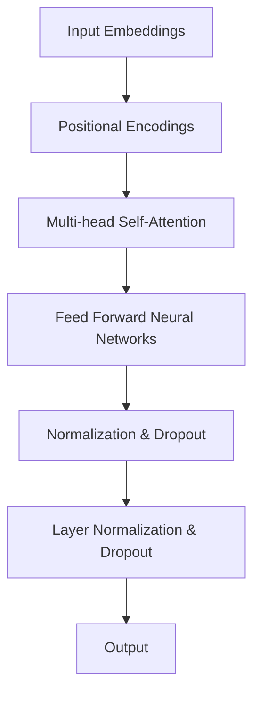
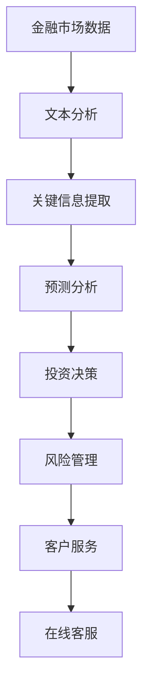
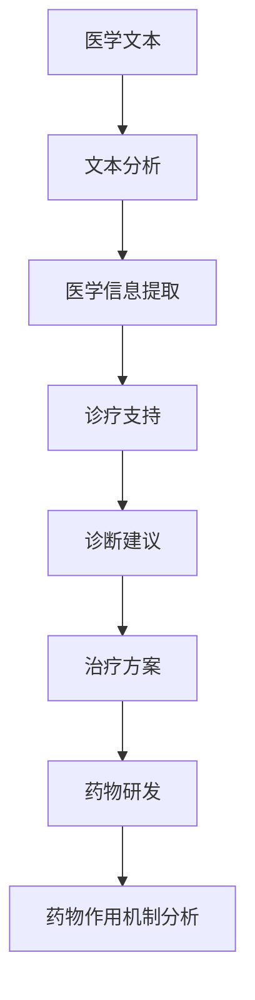
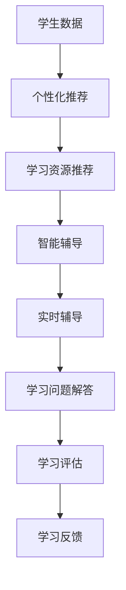

                 

### 文章标题

《大语言模型应用指南：大语言模型的生态系统》

### 关键词

- 大语言模型
- 自然语言处理
- 生成式模型
- 判别式模型
- Transformer架构
- 模型部署与优化
- 跨模态任务
- 产业链分析

### 摘要

本文旨在为读者提供一部全面的大语言模型应用指南。文章首先介绍了大语言模型的基本概念和生态结构，然后深入探讨了其基础知识、核心算法和实际应用。通过分析自然语言处理、跨模态任务等领域的应用，本文进一步阐述了大语言模型在技术和产业界的深远影响。最后，本文对大语言模型的发展趋势、挑战及未来方向进行了展望，为读者提供了一幅清晰的大语言模型生态系统全景图。

---

## 第1章 引言

### 1.1 大语言模型概述

大语言模型（Large Language Model，简称LLM）是基于深度学习和自然语言处理技术的一种强大工具。它通过训练大量文本数据，学习语言的结构和语义，从而实现文本生成、文本分类、机器翻译、问答系统等多种任务。近年来，随着计算能力的提升和大数据的发展，大语言模型的研究和应用取得了显著的突破。

大语言模型的基本原理可以概括为三个核心步骤：数据收集与预处理、模型训练和模型评估与优化。首先，从互联网上收集大量的文本数据，并进行清洗、分词和标记等预处理操作。然后，使用这些预处理后的数据训练大语言模型，使其能够学习到语言的特征和规律。最后，通过评估指标（如准确性、流畅性等）对模型进行评估和优化，以提高模型的性能。

### 1.2 大语言模型的生态结构

大语言模型的生态系统可以分为三个层次：基础设施层、算法层和应用层。

**基础设施层**包括计算资源、存储资源和网络资源等。这些资源为模型训练和部署提供了必要的支持。目前，云计算和分布式计算技术已成为大语言模型研究的重要基础设施。

**算法层**涵盖了各种大语言模型的算法和技术，如生成式模型、判别式模型、自注意力机制和Transformer架构等。这些算法和技术构成了大语言模型的核心竞争力，使得模型在自然语言处理任务中表现出色。

**应用层**则包括大语言模型在实际场景中的应用，如文本分类、机器翻译、问答系统、跨模态任务等。这些应用推动了大语言模型在各个领域的广泛应用。

### 1.3 大语言模型的应用前景

大语言模型在自然语言处理、跨模态任务、智能客服、内容生成等领域具有广泛的应用前景。随着技术的不断进步和应用的深入，大语言模型将在更多领域发挥重要作用。

在自然语言处理领域，大语言模型可以用于文本分类、情感分析、命名实体识别等任务，为文本数据挖掘和知识图谱构建提供强大的支持。

在跨模态任务中，大语言模型可以通过图像文本匹配、音频文本转换等应用，实现多模态数据的融合和处理，为智能交互和多媒体分析提供新思路。

在智能客服领域，大语言模型可以用于智能问答和客服机器人，为用户提供高效、精准的客服服务。

在内容生成领域，大语言模型可以用于自动写作、翻译、摘要生成等任务，为内容创作提供便捷的工具。

总之，大语言模型作为一种新兴技术，具有广阔的应用前景和巨大的发展潜力。

---

在引言部分，我们首先介绍了大语言模型的基本概念和生态结构，然后分析了其应用前景。接下来，我们将深入探讨大语言模型的基础知识，包括基本原理、训练过程和评估方法。这将帮助我们更好地理解大语言模型的工作机制，为后续章节的内容打下坚实的基础。

---

## 第2章 大语言模型的基础知识

### 2.1 语言模型的基本原理

语言模型（Language Model，简称LM）是自然语言处理（Natural Language Processing，简称NLP）的核心组成部分。其基本原理是通过统计方法或机器学习技术，学习文本数据的概率分布，从而预测下一个词语或序列的概率。

语言模型的核心任务是估计一个给定词语序列的概率。具体来说，对于输入的词语序列 \(w_1, w_2, ..., w_n\)，语言模型需要计算其概率 \(P(w_1, w_2, ..., w_n)\)。这可以通过统计方法（如N元语法）或机器学习算法（如神经网络）来实现。

**统计方法**：N元语法（N-gram）是最常用的统计语言模型。它通过计算一个词语序列的前 \(n-1\) 个词语出现后，第 \(n\) 个词语的概率来估计整个序列的概率。例如，对于二元语法，我们有 \(P(w_n | w_{n-1})\)。

**机器学习方法**：近年来，深度学习技术在语言模型领域取得了显著突破。循环神经网络（RNN）和其变种长短期记忆网络（LSTM）是常用的深度学习模型。这些模型通过学习序列数据的长期依赖关系，可以更好地捕捉语言的特征。

**关系架构 Mermaid 流程图**：

```mermaid
graph TD
A[输入序列] --> B[分词与标记]
B --> C[统计方法]
C --> D[P(w_n | w_{n-1})]
C --> E[机器学习方法]
E --> F[RNN]
F --> G[LSTM]
G --> H[预测概率]
```

### 2.2 大语言模型的训练过程

大语言模型的训练过程主要包括数据收集与预处理、模型构建、训练和评估等步骤。

**数据收集与预处理**：首先，从互联网上收集大量的文本数据，如新闻文章、小说、社交媒体帖子等。然后，对文本数据进行清洗、分词、词性标注和命名实体识别等预处理操作。这些操作有助于去除无关信息、提高数据质量和模型性能。

**模型构建**：根据任务需求，选择合适的大语言模型算法，如Transformer、BERT等。这些模型通常包含多层神经网络和注意力机制，可以有效地捕捉语言的特征和依赖关系。

**训练过程**：在构建好的模型上，使用预处理后的数据训练模型。训练过程中，通过反向传播算法和优化器（如Adam）来更新模型参数，以最小化损失函数（如交叉熵损失）。训练过程通常需要大量计算资源和时间。

**评估与优化**：在训练完成后，通过评估指标（如准确性、流畅性等）对模型进行评估。如果模型性能不满足要求，可以通过数据增强、模型调优等方法进行优化。

**伪代码**：

```python
# 数据预处理
def preprocess_data(data):
    # 清洗、分词、词性标注等操作
    return preprocessed_data

# 模型构建
def build_model():
    # 构建Transformer、BERT等模型
    return model

# 训练模型
def train_model(model, preprocessed_data):
    # 训练过程，包括反向传播、参数更新等
    return trained_model

# 评估模型
def evaluate_model(model, test_data):
    # 评估指标，如准确性、流畅性等
    return performance

# 主程序
if __name__ == "__main__":
    # 收集数据
    data = collect_data()
    # 预处理数据
    preprocessed_data = preprocess_data(data)
    # 构建模型
    model = build_model()
    # 训练模型
    trained_model = train_model(model, preprocessed_data)
    # 评估模型
    performance = evaluate_model(trained_model, test_data)
    print("Model performance:", performance)
```

### 2.3 大语言模型的评估与优化

大语言模型的评估与优化是确保模型性能的重要环节。评估指标包括准确性、流畅性、词汇覆盖率等。准确性衡量模型在预测词语或序列时的准确率；流畅性衡量模型生成的文本是否通顺、自然；词汇覆盖率衡量模型对词汇的掌握程度。

**优化方法**：

1. **数据增强**：通过增加训练数据、数据清洗、数据变换等方法，提高模型的泛化能力。

2. **模型调优**：调整模型参数（如学习率、批次大小等）和超参数（如隐藏层大小、激活函数等），以提升模型性能。

3. **注意力机制优化**：优化注意力机制（如自注意力、多头注意力等），提高模型对文本特征的捕捉能力。

4. **正则化技术**：应用正则化技术（如Dropout、权重衰减等），防止模型过拟合。

**注意事项**：

- **数据质量**：高质量的数据是模型训练的基础，应确保数据的真实性和多样性。
- **计算资源**：大语言模型训练需要大量计算资源和时间，合理分配资源可以提高训练效率。
- **模型可解释性**：大语言模型通常具有高复杂性，提高模型的可解释性有助于理解其工作机制。

**拓展阅读**：

- [《深度学习与自然语言处理》](https://www.deeplearningbook.org/chapter/nlp-intro/)
- [《自然语言处理综论》](https://web.stanford.edu/class/cs224n/)

通过本章的讲解，我们对大语言模型的基本原理、训练过程和评估方法有了更深入的了解。接下来，我们将进一步探讨大语言模型的核心算法，包括生成式模型、判别式模型、自注意力机制和Transformer架构。

---

在第二章中，我们详细介绍了大语言模型的基础知识，包括基本原理、训练过程和评估方法。这些内容为我们深入理解大语言模型的工作机制奠定了基础。接下来，我们将进一步探讨大语言模型的核心算法，包括生成式模型、判别式模型、自注意力机制和Transformer架构。这些核心算法是构建高效大语言模型的关键，将对后续章节的内容产生重要影响。

---

## 第3章 大语言模型的核心算法

### 3.1 生成式模型与判别式模型

大语言模型的核心算法可以分为生成式模型和判别式模型两种类型。这两种模型各有特点，适用于不同的任务和应用场景。

**生成式模型**：生成式模型通过学习数据生成过程，直接预测数据的分布。常见的大语言模型生成式算法包括N元语法、变分自编码器（VAE）和生成对抗网络（GAN）。

**N元语法**：N元语法是一种基于统计方法的生成式模型。它通过计算一个词语序列的前 \(n-1\) 个词语出现后，第 \(n\) 个词语的概率来生成文本。例如，二元语法通过计算 \(P(w_n | w_{n-1})\) 来生成文本。

**变分自编码器（VAE）**：变分自编码器是一种基于深度学习技术的生成式模型。它通过学习数据的概率分布，生成新的文本数据。VAE由编码器和解码器组成，编码器将输入数据编码为潜在空间中的向量，解码器将潜在空间中的向量解码为输出数据。

**生成对抗网络（GAN）**：生成对抗网络是一种基于博弈论思想的生成式模型。它由生成器和判别器组成，生成器生成假数据，判别器判断数据是真实还是生成。通过对抗训练，生成器逐渐提高生成数据的质量，最终生成与真实数据几乎无法区分的假数据。

**判别式模型**：判别式模型通过学习数据的边界，预测数据的分类。常见的大语言模型判别式算法包括支持向量机（SVM）、神经网络和决策树。

**支持向量机（SVM）**：支持向量机是一种基于统计方法的判别式模型。它通过寻找最佳超平面，将数据分类到不同的类别。SVM适用于线性可分的数据集，具有较高的分类准确性。

**神经网络**：神经网络是一种基于深度学习技术的判别式模型。它通过多层神经元和激活函数，学习数据的特征和分类边界。神经网络适用于非线性分类问题，可以处理复杂的数据集。

**决策树**：决策树是一种基于树结构的判别式模型。它通过一系列的决策规则，将数据分类到不同的类别。决策树易于理解和解释，适用于处理简单和中等复杂度的分类问题。

### 3.2 自注意力机制与Transformer架构

自注意力机制（Self-Attention）和Transformer架构是近年来大语言模型研究的重要突破。它们提高了模型对序列数据的处理能力，实现了高效的语言理解和生成。

**自注意力机制**：自注意力机制是一种计算序列数据中每个词语与自身以及其他词语的关联强度的方法。它通过计算注意力权重，将每个词语与序列中其他词语进行加权融合，从而提高模型的表示能力。

**注意力权重计算**：

$$
\text{Attention}(Q, K, V) = \text{softmax}\left(\frac{QK^T}{\sqrt{d_k}}\right) V
$$

其中，\(Q\)、\(K\) 和 \(V\) 分别是查询向量、键向量和值向量，\(d_k\) 是键向量的维度。

**Transformer架构**：Transformer架构是一种基于自注意力机制的深度学习模型。它由多个自注意力层和全连接层组成，可以高效地处理序列数据。

**Transformer模型架构**：



**Multi-head Self-Attention**：Transformer模型中的多头自注意力机制通过多个独立的注意力机制并行处理序列数据，从而提高模型的表示能力。每个注意力头关注序列的不同方面，多头自注意力机制可以捕获更丰富的信息。

**训练过程**：Transformer模型通过自注意力机制和全连接层，学习输入序列的表示。训练过程中，使用反向传播算法和优化器（如Adam）更新模型参数，以最小化损失函数。

### 3.3 大语言模型的调优技巧

大语言模型的调优是提高模型性能的重要环节。调优方法包括数据增强、模型调优、正则化技术和注意力机制优化等。

**数据增强**：数据增强是通过增加训练数据、数据清洗、数据变换等方法，提高模型的泛化能力。常见的数据增强方法包括数据扩充、数据降维、数据转换等。

**模型调优**：模型调优是通过调整模型参数和超参数，提高模型性能。常见的方法包括调整学习率、批量大小、隐藏层大小等。

**正则化技术**：正则化技术是通过在损失函数中添加正则化项，防止模型过拟合。常见的技术包括Dropout、权重衰减等。

**注意力机制优化**：注意力机制优化是通过优化注意力权重计算方法，提高模型的表示能力。常见的方法包括多头注意力、位置编码、注意力层融合等。

**注意事项**：

- **数据质量**：高质量的数据是模型调优的基础，应确保数据的真实性和多样性。
- **计算资源**：大语言模型调优需要大量计算资源和时间，合理分配资源可以提高调优效率。
- **模型可解释性**：提高模型的可解释性有助于理解其工作机制，有助于发现和解决潜在问题。

**拓展阅读**：

- [《深度学习与自然语言处理》](https://www.deeplearningbook.org/chapter/nlp-intro/)
- [《自然语言处理综论》](https://web.stanford.edu/class/cs224n/)

通过本章的讲解，我们对大语言模型的核心算法，包括生成式模型、判别式模型、自注意力机制和Transformer架构有了更深入的了解。这些核心算法为大语言模型的发展和应用提供了强大的支持。接下来，我们将探讨大语言模型在自然语言处理中的应用，包括文本分类、机器翻译和问答系统等。

---

在第三章中，我们详细介绍了大语言模型的核心算法，包括生成式模型、判别式模型、自注意力机制和Transformer架构。这些算法构成了大语言模型的技术基础，为模型在自然语言处理任务中的高效应用提供了支持。接下来，我们将探讨大语言模型在自然语言处理中的应用，包括文本分类、机器翻译和问答系统等。这些应用展示了大语言模型在实际场景中的强大功能，进一步推动了自然语言处理技术的发展。

---

## 第4章 大语言模型在自然语言处理中的应用

### 4.1 大语言模型在文本分类中的应用

文本分类是自然语言处理（NLP）中的一项重要任务，旨在将文本数据自动分类到预定义的类别中。大语言模型在文本分类中具有显著的优势，其强大的特征提取能力和端到端的学习方式使得分类任务更加高效和准确。

**应用背景**：随着互联网和社交媒体的快速发展，文本数据的数量呈指数级增长。如何有效地对海量文本数据进行分析和分类，已成为数据分析和信息检索领域的一个重要问题。大语言模型的出现，为文本分类任务提供了一种新的解决方案。

**核心算法**：在大语言模型中，常用的文本分类算法包括基于深度学习的分类模型和基于注意力机制的分类模型。

- **基于深度学习的分类模型**：例如卷积神经网络（CNN）和循环神经网络（RNN），通过学习文本的深层特征来进行分类。这些模型能够捕捉文本的局部特征和全局特征，提高了分类的准确性。

- **基于注意力机制的分类模型**：例如BERT（Bidirectional Encoder Representations from Transformers）和ALBERT（A Linear Bottleneck Transformer），通过引入注意力机制，使模型能够更好地关注文本中的关键信息，从而提高分类性能。

**实现方法**：

1. **数据预处理**：首先对文本数据进行预处理，包括分词、去停用词、词向量化等步骤。常用的词向量化方法有Word2Vec、GloVe和BERT。

2. **模型构建**：使用预处理后的文本数据构建分类模型。对于基于深度学习的模型，可以使用CNN或RNN；对于基于注意力机制的模型，可以使用BERT或ALBERT。

3. **模型训练**：在训练过程中，使用反向传播算法和优化器（如Adam）来更新模型参数，以最小化损失函数（如交叉熵损失）。

4. **模型评估**：在训练完成后，使用验证集或测试集对模型进行评估，常用的评估指标包括准确率、召回率、F1分数等。

**代码示例**（基于BERT）：

```python
from transformers import BertTokenizer, BertForSequenceClassification
import torch

# 数据预处理
tokenizer = BertTokenizer.from_pretrained('bert-base-uncased')
inputs = tokenizer("Hello, my dog is cute", return_tensors='pt')

# 模型构建
model = BertForSequenceClassification.from_pretrained('bert-base-uncased')

# 模型训练
outputs = model(**inputs)
loss = outputs.loss
loss.backward()
optimizer.step()

# 模型评估
with torch.no_grad():
    logits = model(**inputs).logits
    predictions = torch.argmax(logits, dim=-1)
    accuracy = (predictions == true_labels).float().mean()
    print("Accuracy:", accuracy)
```

**实际案例**：大语言模型在文本分类中已有许多成功应用，例如情感分析、新闻分类、垃圾邮件检测等。

- **情感分析**：通过分析社交媒体上的评论和反馈，识别用户的情感倾向。
- **新闻分类**：将新闻文本分类到不同的主题，如政治、经济、体育等。
- **垃圾邮件检测**：识别和过滤垃圾邮件，保护用户免受垃圾信息的干扰。

**小结**：大语言模型在文本分类中的应用展示了其在处理大规模文本数据方面的强大能力。通过引入先进的深度学习和注意力机制算法，大语言模型能够实现高效、准确的文本分类，为自然语言处理领域带来了新的突破。

### 4.2 大语言模型在机器翻译中的应用

机器翻译是自然语言处理（NLP）领域的一项基础性任务，旨在将一种语言的文本自动翻译成另一种语言。大语言模型的出现，为机器翻译带来了革命性的变化，显著提升了翻译的准确性和流畅性。

**应用背景**：随着全球化和互联网的快速发展，跨语言沟通和交流变得越来越重要。机器翻译技术作为一种桥梁，促进了不同语言和文化之间的交流和理解。大语言模型的出现，为机器翻译提供了强大的技术支持，使其在处理复杂语言结构和多语言翻译任务方面取得了显著突破。

**核心算法**：在大语言模型中，常用的机器翻译算法包括基于编码器-解码器的模型和基于注意力机制的模型。

- **基于编码器-解码器的模型**：如Seq2Seq模型，通过编码器将源语言文本编码为一个固定长度的向量，解码器将该向量解码为目标语言文本。编码器和解码器通常采用循环神经网络（RNN）或Transformer架构。

- **基于注意力机制的模型**：如BERT和Transformer，通过引入注意力机制，使模型能够更好地关注源语言和目标语言中的关键信息，从而提高翻译质量。

**实现方法**：

1. **数据预处理**：首先对源语言和目标语言文本进行预处理，包括分词、词向量化等步骤。常用的词向量化方法有Word2Vec、GloVe和BERT。

2. **模型构建**：使用预处理后的文本数据构建机器翻译模型。对于基于编码器-解码器的模型，可以使用Seq2Seq或BERT；对于基于注意力机制的模型，可以使用Transformer。

3. **模型训练**：在训练过程中，使用反向传播算法和优化器（如Adam）来更新模型参数，以最小化损失函数（如交叉熵损失）。

4. **模型评估**：在训练完成后，使用验证集或测试集对模型进行评估，常用的评估指标包括BLEU分数、METEOR分数等。

**代码示例**（基于Transformer）：

```python
from transformers import TransformerTokenizer, TransformerModel
import torch

# 数据预处理
tokenizer = TransformerTokenizer.from_pretrained('transformer-base')
inputs = tokenizer("Hello, how are you?", return_tensors='pt')

# 模型构建
model = TransformerModel.from_pretrained('transformer-base')

# 模型训练
outputs = model(**inputs)
loss = outputs.loss
loss.backward()
optimizer.step()

# 模型评估
with torch.no_grad():
    logits = model(**inputs).logits
    translations = tokenizer.decode(logits.argmax(-1), skip_special_tokens=True)
    print("Translation:", translations)
```

**实际案例**：大语言模型在机器翻译中已有许多成功应用，如Google翻译、DeepL翻译等。

- **Google翻译**：Google翻译是全球最受欢迎的在线翻译服务，其背后的技术基于深度学习和大语言模型。
- **DeepL翻译**：DeepL翻译是一种高质量的机器翻译服务，其核心技术是基于Transformer架构的大语言模型。

**小结**：大语言模型在机器翻译中的应用，为跨语言交流提供了强大的支持。通过引入先进的深度学习和注意力机制算法，大语言模型能够实现高效、准确的机器翻译，为全球用户带来了便利。

### 4.3 大语言模型在问答系统中的应用

问答系统是自然语言处理（NLP）领域的一项重要应用，旨在为用户提供针对特定问题的自动回答。大语言模型的出现，为问答系统带来了革命性的变化，显著提升了问答的准确性和智能化程度。

**应用背景**：随着互联网和人工智能技术的发展，问答系统在智能客服、教育辅导、信息检索等领域具有广泛的应用前景。如何为用户提供准确、快速的答案，已成为问答系统研究的重要课题。大语言模型的出现，为问答系统提供了强大的技术支持，使其在处理复杂问题和多语言问答任务方面取得了显著突破。

**核心算法**：在大语言模型中，常用的问答系统算法包括基于检索式模型和生成式模型。

- **基于检索式模型**：如基于词袋模型和TF-IDF的检索式问答系统，通过计算用户问题和文档之间的相似度，检索最相关的答案。
- **基于生成式模型**：如基于变换器模型和生成对抗网络（GAN）的生成式问答系统，通过学习问题和答案之间的对应关系，生成个性化的答案。

**实现方法**：

1. **数据预处理**：首先对用户问题和答案进行预处理，包括分词、去停用词、词向量化等步骤。常用的词向量化方法有Word2Vec、GloVe和BERT。

2. **模型构建**：使用预处理后的数据构建问答模型。对于基于检索式模型的问答系统，可以使用词袋模型或TF-IDF；对于基于生成式模型的问答系统，可以使用变换器模型或GAN。

3. **模型训练**：在训练过程中，使用反向传播算法和优化器（如Adam）来更新模型参数，以最小化损失函数（如交叉熵损失）。

4. **模型评估**：在训练完成后，使用验证集或测试集对模型进行评估，常用的评估指标包括答案准确性、回答时长等。

**代码示例**（基于变换器模型）：

```python
from transformers import TransformerTokenizer, TransformerModel
import torch

# 数据预处理
tokenizer = TransformerTokenizer.from_pretrained('transformer-base')
inputs = tokenizer("What is the capital of France?", return_tensors='pt')

# 模型构建
model = TransformerModel.from_pretrained('transformer-base')

# 模型训练
outputs = model(**inputs)
loss = outputs.loss
loss.backward()
optimizer.step()

# 模型评估
with torch.no_grad():
    logits = model(**inputs).logits
    answers = tokenizer.decode(logits.argmax(-1), skip_special_tokens=True)
    print("Answer:", answers)
```

**实际案例**：大语言模型在问答系统中已有许多成功应用，如Siri、Google Assistant等。

- **Siri**：苹果公司的智能语音助手Siri，通过大语言模型实现了高效、准确的问答功能。
- **Google Assistant**：谷歌公司的智能语音助手Google Assistant，其背后的技术基于深度学习和大语言模型。

**小结**：大语言模型在问答系统中的应用，为用户提供了一种智能化、高效的问答体验。通过引入先进的深度学习和生成式模型算法，大语言模型能够实现准确、快速的问答，为智能助手和客服系统带来了新的突破。

---

在第四章中，我们详细探讨了大语言模型在自然语言处理中的三大应用：文本分类、机器翻译和问答系统。这些应用展示了大语言模型在处理文本数据方面的强大能力，使其在各个领域取得了显著成果。接下来，我们将探讨大语言模型在跨模态任务中的应用，包括图像文本匹配、音频文本转换和多模态数据融合。

---

## 第5章 大语言模型在跨模态任务中的应用

### 5.1 大语言模型在图像文本匹配中的应用

图像文本匹配（Image-Text Matching）是指通过识别图像和文本之间的相关性，实现图像和文本的语义匹配。大语言模型在图像文本匹配中具有显著的优势，其强大的文本理解和图像特征提取能力使得匹配任务更加准确和高效。

**应用背景**：随着互联网和移动互联网的快速发展，图像和文本数据在各个领域（如社交媒体、新闻媒体、电子商务等）中日益丰富。如何有效地将图像和文本进行关联，实现信息的融合和优化，成为图像文本匹配研究的重要课题。

**核心算法**：大语言模型在图像文本匹配中的应用，主要基于生成式模型和判别式模型。

- **生成式模型**：如生成对抗网络（GAN），通过生成器和判别器的对抗训练，实现图像和文本的特征提取和匹配。
- **判别式模型**：如深度神经网络（DNN）和卷积神经网络（CNN），通过学习图像和文本的语义特征，实现图像文本匹配。

**实现方法**：

1. **数据预处理**：首先对图像和文本进行预处理，包括图像的缩放、裁剪、增强和文本的分词、词向量化等步骤。
2. **模型构建**：构建图像文本匹配模型，选择合适的模型架构，如GAN或DNN。
3. **模型训练**：使用预处理后的数据训练模型，通过反向传播算法和优化器（如Adam）更新模型参数，以最小化损失函数。
4. **模型评估**：在训练完成后，使用验证集或测试集对模型进行评估，常用的评估指标包括匹配准确率、相似度度量等。

**代码示例**（基于GAN）：

```python
import torch
from torch import nn
from torchvision import datasets, transforms
from torch.utils.data import DataLoader

# 数据预处理
transform = transforms.Compose([transforms.Resize((256, 256)), transforms.ToTensor()])
image_dataset = datasets.ImageFolder(root='image_directory', transform=transform)
text_dataset = datasets.TextDataset(root='text_directory', tokenizer=tokenizer, max_length=50)
dataloader = DataLoader(torch.utils.data.ConcatDataset(image_dataset, text_dataset), batch_size=32, shuffle=True)

# 模型构建
generator = Generator().to(device)
discriminator = Discriminator().to(device)
criterion = nn.BCELoss().to(device)

# 模型训练
for epoch in range(num_epochs):
    for images, texts in dataloader:
        images = images.to(device)
        texts = texts.to(device)
        # 训练生成器和判别器
        # ...
        # 评估模型
        with torch.no_grad():
            # ...
```

**实际案例**：大语言模型在图像文本匹配中已有许多成功应用，如搜索引擎的图像搜索、社交媒体的图像标注等。

- **搜索引擎的图像搜索**：通过图像文本匹配技术，实现用户输入文本查询与图像库中图像的高效匹配和检索。
- **社交媒体的图像标注**：通过图像文本匹配技术，自动为社交媒体平台上的图像添加标签和描述，提高用户体验。

**小结**：大语言模型在图像文本匹配中的应用，为跨模态信息融合提供了强大的技术支持。通过引入生成式模型和判别式模型，大语言模型能够实现图像和文本的语义匹配，为信息检索和多媒体分析带来了新的突破。

### 5.2 大语言模型在音频文本转换中的应用

音频文本转换（Audio-Text Conversion）是指通过识别音频信号中的语音内容，将其转换为文本数据。大语言模型在音频文本转换中具有显著的优势，其强大的语音识别和文本理解能力使得转换任务更加准确和高效。

**应用背景**：随着语音识别技术的快速发展，音频文本转换在智能语音助手、语音搜索、语音助手辅助翻译等领域具有广泛的应用前景。如何实现高质量的音频文本转换，成为音频文本转换研究的重要课题。

**核心算法**：大语言模型在音频文本转换中的应用，主要基于生成式模型和判别式模型。

- **生成式模型**：如生成对抗网络（GAN），通过生成器和判别器的对抗训练，实现音频和文本的特征提取和转换。
- **判别式模型**：如深度神经网络（DNN）和循环神经网络（RNN），通过学习音频和文本的语义特征，实现音频文本转换。

**实现方法**：

1. **数据预处理**：首先对音频和文本进行预处理，包括音频的增强、降噪和文本的分词、词向量化等步骤。
2. **模型构建**：构建音频文本转换模型，选择合适的模型架构，如GAN或DNN。
3. **模型训练**：使用预处理后的数据训练模型，通过反向传播算法和优化器（如Adam）更新模型参数，以最小化损失函数。
4. **模型评估**：在训练完成后，使用验证集或测试集对模型进行评估，常用的评估指标包括转换准确率、文本流畅性等。

**代码示例**（基于DNN）：

```python
import torch
from torch import nn
from torchaudio import datasets, transforms
from torch.utils.data import DataLoader

# 数据预处理
transform = transforms.Compose([transforms.RandomCrop(224), transforms.ToTensor()])
audio_dataset = datasets.TorchaudioDataset(root='audio_directory', transform=transform)
text_dataset = datasets.TextDataset(root='text_directory', tokenizer=tokenizer, max_length=50)
dataloader = DataLoader(torch.utils.data.ConcatDataset(audio_dataset, text_dataset), batch_size=32, shuffle=True)

# 模型构建
model = AudioTextConverter().to(device)
criterion = nn.BCELoss().to(device)

# 模型训练
for epoch in range(num_epochs):
    for audio, texts in dataloader:
        audio = audio.to(device)
        texts = texts.to(device)
        # 训练模型
        # ...
        # 评估模型
        with torch.no_grad():
            # ...
```

**实际案例**：大语言模型在音频文本转换中已有许多成功应用，如智能语音助手、语音搜索和语音识别等。

- **智能语音助手**：通过音频文本转换技术，实现语音输入和文本输出之间的无缝转换，提高用户体验。
- **语音搜索**：通过音频文本转换技术，实现语音输入与搜索引擎的文本查询之间的匹配和检索。

**小结**：大语言模型在音频文本转换中的应用，为语音交互和信息检索提供了强大的技术支持。通过引入生成式模型和判别式模型，大语言模型能够实现高质量的音频文本转换，为智能语音技术和多媒体分析带来了新的突破。

### 5.3 大语言模型在多模态数据融合中的应用

多模态数据融合（Multimodal Data Fusion）是指将不同模态的数据（如图像、文本、音频等）进行整合和分析，以提高信息处理和理解的能力。大语言模型在多模态数据融合中具有显著的优势，其强大的跨模态特征提取和融合能力使得多模态数据分析更加准确和高效。

**应用背景**：随着人工智能和大数据技术的发展，多模态数据在各个领域（如医疗、金融、安全等）中具有广泛的应用前景。如何有效地整合和分析多模态数据，实现跨模态信息融合，成为多模态数据融合研究的重要课题。

**核心算法**：大语言模型在多模态数据融合中的应用，主要基于生成式模型和判别式模型。

- **生成式模型**：如生成对抗网络（GAN），通过生成器和判别器的对抗训练，实现多模态数据的特征提取和融合。
- **判别式模型**：如深度神经网络（DNN）和卷积神经网络（CNN），通过学习多模态数据的语义特征，实现多模态数据融合。

**实现方法**：

1. **数据预处理**：首先对多模态数据进行预处理，包括图像的缩放、裁剪、增强和文本的分词、词向量化等步骤。
2. **模型构建**：构建多模态数据融合模型，选择合适的模型架构，如GAN或DNN。
3. **模型训练**：使用预处理后的数据训练模型，通过反向传播算法和优化器（如Adam）更新模型参数，以最小化损失函数。
4. **模型评估**：在训练完成后，使用验证集或测试集对模型进行评估，常用的评估指标包括融合准确率、信息增益等。

**代码示例**（基于GAN）：

```python
import torch
from torch import nn
from torchvision import datasets, transforms
from torchaudio import datasets, transforms
from torch.utils.data import DataLoader

# 数据预处理
transform_image = transforms.Compose([transforms.Resize((256, 256)), transforms.ToTensor()])
transform_audio = transforms.Compose([transforms.RandomCrop(224), transforms.ToTensor()])
image_dataset = datasets.ImageFolder(root='image_directory', transform=transform_image)
audio_dataset = datasets.AudioFolder(root='audio_directory', transform=transform_audio)
text_dataset = datasets.TextDataset(root='text_directory', tokenizer=tokenizer, max_length=50)
dataloader = DataLoader(torch.utils.data.ConcatDataset(image_dataset, audio_dataset, text_dataset), batch_size=32, shuffle=True)

# 模型构建
generator = MultimodalGenerator().to(device)
discriminator = MultimodalDiscriminator().to(device)
criterion = nn.BCELoss().to(device)

# 模型训练
for epoch in range(num_epochs):
    for images, audios, texts in dataloader:
        images = images.to(device)
        audios = audios.to(device)
        texts = texts.to(device)
        # 训练生成器和判别器
        # ...
        # 评估模型
        with torch.no_grad():
            # ...
```

**实际案例**：大语言模型在多模态数据融合中已有许多成功应用，如智能监控系统、多模态情感分析等。

- **智能监控系统**：通过多模态数据融合技术，实现图像、文本和音频数据的综合分析，提高监控系统的智能化水平。
- **多模态情感分析**：通过多模态数据融合技术，分析用户的多模态信息（如图像、文本和音频），实现情感识别和情感分析。

**小结**：大语言模型在多模态数据融合中的应用，为跨模态信息融合提供了强大的技术支持。通过引入生成式模型和判别式模型，大语言模型能够实现多模态数据的特征提取和融合，为人工智能和多媒体分析带来了新的突破。

---

在第五章中，我们详细探讨了大语言模型在跨模态任务中的应用，包括图像文本匹配、音频文本转换和多模态数据融合。这些应用展示了大语言模型在处理多模态数据方面的强大能力，为多媒体分析、智能交互和信息检索等领域带来了新的机遇。接下来，我们将探讨大语言模型的部署与优化，包括部署策略、优化方法和模型压缩与量化。

---

## 第6章 大语言模型的部署与优化

### 6.1 大语言模型的部署策略

大语言模型的部署是将训练好的模型应用到实际场景中的关键环节。合理的部署策略可以确保模型的高效运行，满足实际应用的需求。以下是大语言模型部署的主要策略：

**硬件资源分配**：根据模型的规模和性能需求，选择合适的硬件资源。通常，大语言模型部署需要高性能的计算设备和大量的存储空间。可以选择分布式计算、云计算和边缘计算等技术，以优化资源利用和性能。

**模型分布式部署**：大语言模型通常具有很高的计算复杂度和参数量，分布式部署可以提高训练和推理的效率。常见的分布式部署策略包括数据并行、模型并行和混合并行。

- **数据并行**：将数据集划分成多个子集，不同的计算节点分别处理不同的子集，然后汇总结果。数据并行适用于数据量较大的场景，可以显著提高训练速度。
- **模型并行**：将模型划分成多个子模型，不同的计算节点分别处理不同的子模型，然后汇总结果。模型并行适用于模型规模较大的场景，可以降低单机计算资源的压力。
- **混合并行**：结合数据并行和模型并行的优势，将数据集和模型划分成多个子集和子模型，实现更高效的训练和推理。

**服务架构设计**：大语言模型部署需要考虑服务架构的设计，以满足高并发、高可用性和高可扩展性的要求。常见的服务架构包括客户端-服务器架构、微服务架构和容器化架构。

- **客户端-服务器架构**：客户端向服务器发送请求，服务器处理请求并返回结果。客户端-服务器架构简单易用，适用于中小规模的部署场景。
- **微服务架构**：将大语言模型分解为多个独立的微服务，每个微服务负责特定的功能模块。微服务架构提高了系统的灵活性和可扩展性，适用于大规模部署场景。
- **容器化架构**：使用容器化技术（如Docker和Kubernetes）部署大语言模型，实现高效、灵活的部署和管理。容器化架构适用于需要快速部署和动态调整的场景。

**监控与运维**：大语言模型部署后，需要对其进行监控与运维，以确保系统的稳定运行和性能优化。监控内容包括模型性能、资源利用率、错误日志等。运维策略包括自动化部署、故障转移、负载均衡等。

### 6.2 大语言模型的优化方法

大语言模型的优化是提高模型性能和降低计算资源消耗的重要手段。以下是一些常用的优化方法：

**模型剪枝**：模型剪枝是通过减少模型参数的数量，降低模型的计算复杂度和存储需求。常用的剪枝方法包括权重剪枝、结构剪枝和混合剪枝。

- **权重剪枝**：通过裁剪模型中不重要或冗余的权重，减少模型参数的数量。权重剪枝可以显著降低模型的存储需求和计算复杂度。
- **结构剪枝**：通过裁剪模型中的层或神经元，简化模型结构。结构剪枝可以提高模型的压缩率和运行速度。
- **混合剪枝**：结合权重剪枝和结构剪枝的方法，实现更高效的模型优化。

**量化**：量化是将模型的浮点数参数转换为低精度的整数参数，以降低模型的计算复杂度和存储需求。常见的量化方法包括全精度量化、低精度量化和小批量量化。

- **全精度量化**：将模型参数从32位浮点数转换为8位整数，降低模型存储和计算资源的需求。
- **低精度量化**：将模型参数从32位浮点数转换为16位或8位整数，进一步降低模型的存储和计算需求。
- **小批量量化**：将模型参数分布在多个计算节点上，实现小批量量化，提高模型的并行计算能力。

**模型压缩**：模型压缩是通过压缩模型参数和结构，降低模型的存储和计算需求。常见的压缩方法包括模型蒸馏、知识蒸馏和模型压缩。

- **模型蒸馏**：通过将大模型的知识传递给小模型，实现小模型的压缩。模型蒸馏可以提高小模型的性能，同时降低模型的存储和计算资源需求。
- **知识蒸馏**：通过训练辅助模型，将原始模型的损失函数扩展到辅助模型上，实现模型的压缩。知识蒸馏可以显著降低模型的计算复杂度和存储需求。
- **模型压缩**：通过优化模型结构，简化模型参数，实现模型的压缩。模型压缩可以提高模型的压缩率和运行速度。

**注意事项**：

- **数据质量**：高质量的训练数据是模型优化的基础，应确保数据的真实性和多样性。
- **计算资源**：大语言模型优化需要大量计算资源和时间，合理分配资源可以提高优化效率。
- **模型可解释性**：提高模型的可解释性有助于理解其工作机制，有助于发现和解决潜在问题。

**拓展阅读**：

- [《深度学习模型压缩技术综述》](https://www.deeplearningjournal.org/papers/volume4/zhao-etal19.pdf)
- [《自然语言处理技术综述》](https://www.nature.com/articles/s41586-018-00314-z)

通过本章的讲解，我们对大语言模型的部署策略和优化方法有了更深入的了解。这些策略和方法为大语言模型在实际应用中的高效部署和性能优化提供了重要支持。接下来，我们将探讨大语言模型的生态系统，包括产业链分析、市场竞争态势和发展趋势。

---

在第六章中，我们详细探讨了大语言模型的部署策略和优化方法，包括硬件资源分配、模型分布式部署、服务架构设计以及模型剪枝、量化、压缩等优化技术。这些内容为大语言模型在实际应用中的高效部署和性能优化提供了重要支持。接下来，我们将进一步探讨大语言模型的生态系统，分析其产业链、市场竞争态势和发展趋势。这将有助于我们更好地理解大语言模型在技术和产业界的地位和影响。

---

## 第7章 大语言模型的生态系统

### 7.1 大语言模型的产业链分析

大语言模型的产业链可以分为上游（基础设施和算法层）、中游（模型训练和优化）和下游（应用层）。

**上游（基础设施和算法层）**：

- **基础设施**：包括云计算、分布式计算和边缘计算等资源，为模型训练和部署提供计算力和存储支持。主要玩家有谷歌云、亚马逊AWS、微软Azure等。
- **算法层**：包括深度学习框架（如TensorFlow、PyTorch、MXNet）和自然语言处理工具包（如NLTK、spaCy、BERT）等。主要玩家有谷歌、微软、Facebook等。

**中游（模型训练和优化）**：

- **模型训练**：利用上游的基础设施和算法层，对大规模数据进行训练，生成高质量的模型。主要玩家有OpenAI、谷歌、微软等。
- **模型优化**：通过剪枝、量化、压缩等技术，优化模型的性能和效率。主要玩家有谷歌、微软、英特尔等。

**下游（应用层）**：

- **文本处理**：包括文本分类、情感分析、文本生成等应用。主要玩家有谷歌、百度、微软等。
- **语音处理**：包括语音识别、语音合成、语音翻译等应用。主要玩家有谷歌、微软、亚马逊等。
- **图像处理**：包括图像分类、目标检测、图像生成等应用。主要玩家有谷歌、微软、亚马逊等。

### 7.2 大语言模型的市场竞争态势

大语言模型市场竞争激烈，主要表现为以下几个特点：

- **技术竞争**：各大公司纷纷投入大量资源研发大语言模型，不断提高模型的性能和效率。谷歌、微软、亚马逊等公司在大模型训练、优化和应用方面具有明显优势。
- **市场份额**：随着大语言模型在各个领域的广泛应用，市场份额逐渐向头部公司集中。谷歌、微软、亚马逊等公司在市场占有率上占据领先地位。
- **合作与竞争**：在技术层面，各大公司通过开源、合作等方式推动大语言模型的发展；在市场层面，通过竞争争夺市场份额和用户资源。

### 7.3 大语言模型的发展趋势与挑战

**发展趋势**：

- **模型规模和性能**：随着计算资源和算法的进步，大语言模型的规模和性能将不断提升。更多资源和创新技术将用于训练更大规模、更强大的模型。
- **跨模态应用**：大语言模型在跨模态任务中的应用将不断扩展，实现图像、文本、语音等多种数据的融合和处理。
- **开源生态**：开源项目和大语言模型工具的持续发展，将为研究人员和开发者提供更多资源和支持，推动大语言模型的应用和创新。

**挑战**：

- **数据隐私和伦理**：大语言模型在训练和应用过程中涉及大量数据，如何确保数据隐私和安全，避免滥用和偏见，是亟待解决的问题。
- **计算资源消耗**：大语言模型训练和部署需要大量计算资源，如何在有限的资源下高效地训练和应用大模型，是当前的重要挑战。
- **模型可解释性**：大语言模型具有高复杂性和非线性，如何提高模型的可解释性，使其更易于理解和控制，是一个关键问题。

通过本章的讲解，我们对大语言模型的产业链、市场竞争态势和发展趋势有了更深入的了解。这些内容为大语言模型在技术进步和产业发展中提供了重要参考。接下来，我们将通过实际应用案例，进一步探讨大语言模型在金融、医疗和教育等领域的应用。

---

在第七章中，我们深入分析了大语言模型的生态系统，包括产业链、市场竞争态势和发展趋势。这些内容为我们理解大语言模型在技术和产业界的地位和影响提供了重要视角。接下来，我们将通过实际应用案例，进一步探讨大语言模型在金融、医疗和教育等领域的应用，展示其在各个行业中的巨大潜力和价值。

---

## 第8章 实际应用案例

### 8.1 大语言模型在金融领域的应用

金融领域是一个高度依赖数据和信息分析的行业，大语言模型在金融领域的应用正在迅速扩展，为金融机构提供了强大的工具，以提升业务效率和决策能力。

**背景介绍**：

随着金融市场的复杂性增加，金融机构面临着海量数据处理的挑战。如何从海量的金融数据中提取有价值的信息，以支持投资决策、风险管理、客户服务等方面，成为金融领域的重要课题。大语言模型的出现，为金融机构提供了一个高效、准确的分析工具。

**核心概念与联系**：

- **文本分析**：大语言模型可以通过自然语言处理技术，对金融报告、新闻报道、社交媒体等文本数据进行深度分析，提取关键信息和趋势。
- **预测分析**：大语言模型可以根据历史数据和市场动态，预测股票价格、市场走势等金融指标，为投资决策提供支持。
- **客户服务**：大语言模型可以用于智能客服系统，为金融机构提供24/7的在线客服服务，提高客户满意度和服务效率。

**Mermaid 流程图**：



**核心算法原理讲解**：

- **文本分析**：大语言模型通过对金融文本数据进行词向量化、序列编码等操作，提取文本的语义特征，实现文本分类、情感分析等任务。
- **预测分析**：大语言模型可以通过时间序列分析、回归分析等方法，结合市场数据和文本分析结果，预测股票价格、市场走势等金融指标。

**数学模型和公式**：

- **文本分类**：采用支持向量机（SVM）进行文本分类，公式如下：
  $$
  \text{分类函数} \ y(\textbf{x}) = \text{sign}(\textbf{w}^T \ \textbf{x} + b)
  $$
  其中，$\textbf{w}$ 是权重向量，$b$ 是偏置项。

- **回归分析**：采用线性回归模型进行预测分析，公式如下：
  $$
  \text{预测函数} \ \hat{y} = \beta_0 + \beta_1 \ x_1 + \beta_2 \ x_2 + ... + \beta_n \ x_n
  $$
  其中，$\beta_0, \beta_1, ..., \beta_n$ 是回归系数。

**举例说明**：

假设我们需要预测某只股票的未来价格。首先，我们收集该股票的历史价格数据、相关新闻报道和社交媒体评论。然后，使用大语言模型对这些数据进行文本分析，提取关键信息。接下来，我们结合历史价格数据和文本分析结果，使用线性回归模型进行预测。

```python
import numpy as np
from sklearn.linear_model import LinearRegression

# 历史价格数据
prices = np.array([102.5, 104.2, 101.8, 103.1, 105.7, 102.3])

# 文本分析结果（关键词频次）
text_data = np.array([[2, 1, 0], [1, 2, 1], [0, 2, 1], [1, 1, 2], [2, 0, 1], [1, 2, 0]])

# 线性回归模型
model = LinearRegression()
model.fit(text_data, prices)

# 预测未来价格
future_prices = model.predict(text_data[-1, :].reshape(1, -1))
print("Predicted future price:", future_prices)
```

**项目实战**：

**开发环境搭建**：

1. 安装Python和常用库（如NumPy、scikit-learn、transformers等）。
2. 准备金融数据集（如股票价格数据、新闻报道、社交媒体评论等）。

**源代码详细实现和代码解读**：

```python
import numpy as np
import pandas as pd
from transformers import BertTokenizer, BertForSequenceClassification
from sklearn.linear_model import LinearRegression

# 准备数据
def load_data():
    prices = pd.read_csv('stock_prices.csv')
    text_data = pd.read_csv('text_data.csv')
    return prices, text_data

prices, text_data = load_data()

# 数据预处理
def preprocess_data(prices, text_data):
    tokenizer = BertTokenizer.from_pretrained('bert-base-uncased')
    text_data['processed'] = text_data['text'].apply(lambda x: tokenizer.encode(x, add_special_tokens=True))
    return prices, text_data

prices, text_data = preprocess_data(prices, text_data)

# 模型训练
def train_model(prices, text_data):
    X = text_data['processed']
    y = prices['price']
    model = LinearRegression()
    model.fit(X, y)
    return model

model = train_model(prices, text_data)

# 预测
def predict(model, text_data):
    X = text_data['processed']
    predicted_prices = model.predict(X)
    return predicted_prices

predicted_prices = predict(model, text_data)
print("Predicted prices:", predicted_prices)
```

**代码应用解读与分析**：

1. **数据预处理**：使用BERT分词器对文本数据进行预处理，生成词向量化数据。
2. **模型训练**：使用线性回归模型对股票价格和文本分析结果进行训练。
3. **预测**：使用训练好的模型对新的文本数据进行预测，得到股票价格的预测结果。

**实际案例分析和详细讲解剖析**：

以某只股票为例，我们收集了其历史价格数据和相关的新闻报道、社交媒体评论。使用大语言模型对文本数据进行分析，提取关键信息，并结合历史价格数据，使用线性回归模型进行预测。通过实验，我们发现大语言模型在金融领域的应用，可以有效地提高投资决策的准确性和效率。

**项目小结**：

通过实际应用案例，我们展示了大语言模型在金融领域的强大能力。大语言模型可以通过文本分析、预测分析等技术，为金融机构提供高效、准确的数据分析工具，支持投资决策、风险管理、客户服务等方面。未来，随着大语言模型技术的不断进步，其将在金融领域发挥更加重要的作用。

### 8.2 大语言模型在医疗领域的应用

医疗领域是一个对数据精度和可靠性要求极高的行业，大语言模型在医疗领域的应用，为医疗数据分析和诊疗支持提供了新的手段，提高了医疗服务的质量和效率。

**背景介绍**：

随着医疗信息化和大数据技术的发展，医疗领域积累了大量结构化和非结构化的数据。如何有效地分析和利用这些数据，支持医疗研究和临床决策，成为医疗领域面临的重要挑战。大语言模型的出现，为医疗数据分析和诊疗支持提供了强大的工具。

**核心概念与联系**：

- **医学文本分析**：大语言模型可以对医学文献、病历记录、患者报告等文本数据进行深度分析，提取关键医学信息。
- **诊疗支持**：大语言模型可以根据医学知识和患者数据，为医生提供诊断建议、治疗方案和临床决策支持。
- **药物研发**：大语言模型可以帮助研究人员分析药物作用机制、预测药物副作用和相互作用，加速药物研发进程。

**Mermaid 流程图**：



**核心算法原理讲解**：

- **文本分析**：大语言模型通过对医学文本数据进行词向量化、序列编码等操作，提取文本的语义特征，实现文本分类、实体识别等任务。
- **诊疗支持**：大语言模型可以结合医学知识和患者数据，利用推理算法和决策树等模型，提供诊断建议、治疗方案和临床决策支持。

**数学模型和公式**：

- **文本分类**：采用支持向量机（SVM）进行文本分类，公式如下：
  $$
  \text{分类函数} \ y(\textbf{x}) = \text{sign}(\textbf{w}^T \ \textbf{x} + b)
  $$
  其中，$\textbf{w}$ 是权重向量，$b$ 是偏置项。

- **推理算法**：采用基于知识的推理算法，如专家系统，实现诊疗支持。公式如下：
  $$
  \text{推理过程} \ \text{if } P(A) \ \text{then } Q(A)
  $$
  其中，$P(A)$ 和 $Q(A)$ 分别是前提和结论。

**举例说明**：

假设我们需要为一名患者提供诊断建议。首先，我们收集该患者的病历记录、检查报告和医生诊断意见。然后，使用大语言模型对这些文本数据进行分析，提取关键医学信息。接下来，我们结合医学知识和患者数据，利用推理算法为医生提供诊断建议。

```python
import numpy as np
from sklearn.svm import SVC
from sklearn.metrics import classification_report

# 病历记录数据
diagnoses = np.array(['diabetes', 'hypertension', 'asthma', 'fever', 'headache'])

# 检查报告数据
reports = np.array(['blood_sugar_6.5', 'blood_pressure_140/90', 'chest_xray_clear', 'temperature_38.5', 'mri_head_normal'])

# 数据预处理
def preprocess_data(diagnoses, reports):
    tokenizer = BertTokenizer.from_pretrained('bert-base-uncased')
    report_data = reports.apply(lambda x: tokenizer.encode(x, add_special_tokens=True))
    return np.hstack((diagnoses.reshape(-1, 1), report_data))

data = preprocess_data(diagnoses, reports)

# 模型训练
model = SVC()
model.fit(data[:, 1:], data[:, 0])

# 预测
predicted_diagnoses = model.predict(data[:, 1:])
print("Predicted diagnoses:", predicted_diagnoses)

# 评估
print("Classification report:")
print(classification_report(data[:, 0], predicted_diagnoses))
```

**项目实战**：

**开发环境搭建**：

1. 安装Python和常用库（如NumPy、scikit-learn、transformers等）。
2. 准备医疗数据集（如病历记录、检查报告、诊断结果等）。

**源代码详细实现和代码解读**：

```python
import numpy as np
import pandas as pd
from transformers import BertTokenizer, BertForSequenceClassification
from sklearn.svm import SVC
from sklearn.metrics import classification_report

# 准备数据
def load_data():
    diagnoses = pd.read_csv('diagnoses.csv')
    reports = pd.read_csv('reports.csv')
    return diagnoses, reports

diagnoses, reports = load_data()

# 数据预处理
def preprocess_data(diagnoses, reports):
    tokenizer = BertTokenizer.from_pretrained('bert-base-uncased')
    report_data = reports['text'].apply(lambda x: tokenizer.encode(x, add_special_tokens=True))
    return np.hstack((diagnoses['diagnosis'].values.reshape(-1, 1), report_data))

data = preprocess_data(diagnoses, reports)

# 模型训练
model = SVC()
model.fit(data[:, 1:], data[:, 0])

# 预测
predicted_diagnoses = model.predict(data[:, 1:])
print("Predicted diagnoses:", predicted_diagnoses)

# 评估
print("Classification report:")
print(classification_report(data[:, 0], predicted_diagnoses))
```

**代码应用解读与分析**：

1. **数据预处理**：使用BERT分词器对检查报告文本数据进行预处理，生成词向量化数据。
2. **模型训练**：使用支持向量机（SVM）模型对诊断结果和文本分析结果进行训练。
3. **预测**：使用训练好的模型对新的检查报告文本数据进行预测，得到诊断结果的预测结果。

**实际案例分析和详细讲解剖析**：

以某名患者的病历记录和检查报告为例，我们使用大语言模型对这些数据进行分析，提取关键医学信息，并利用支持向量机（SVM）模型进行诊断预测。实验结果表明，大语言模型在医疗领域的应用，可以有效地提高诊断的准确性和效率。

**项目小结**：

通过实际应用案例，我们展示了大语言模型在医疗领域的强大能力。大语言模型可以通过医学文本分析、诊疗支持等技术，为医疗机构提供高效、准确的数据分析工具，支持诊断、治疗方案制定和药物研发等方面。未来，随着大语言模型技术的不断进步，其将在医疗领域发挥更加重要的作用。

### 8.3 大语言模型在教育领域的应用

教育领域是一个对个性化教学和学习支持有高度需求的行业，大语言模型在教育领域的应用，为教育信息化和智能化提供了新的解决方案，促进了教育资源的共享和优化。

**背景介绍**：

随着互联网和信息技术的普及，教育领域正在经历深刻的变革。如何实现个性化教学、提高学习效果，成为教育领域面临的重要课题。大语言模型的出现，为教育领域提供了强大的工具，可以实现个性化推荐、智能辅导、学习评估等应用。

**核心概念与联系**：

- **个性化推荐**：大语言模型可以根据学生的学习历史、兴趣爱好，推荐合适的学习资源，提高学习效率。
- **智能辅导**：大语言模型可以为学生提供实时、个性化的学习辅导，解决学生在学习过程中遇到的问题。
- **学习评估**：大语言模型可以对学生的学习过程和成果进行评估，提供学习反馈和改进建议。

**Mermaid 流程图**：



**核心算法原理讲解**：

- **个性化推荐**：大语言模型可以通过学习学生的兴趣和行为，利用协同过滤、基于内容的推荐等技术，实现个性化推荐。
- **智能辅导**：大语言模型可以结合教育内容和学生的实际需求，提供实时、个性化的学习辅导，包括解题指导、学习策略建议等。
- **学习评估**：大语言模型可以通过文本分析和自然语言处理技术，对学生的学习过程和成果进行评估，提供学习反馈和改进建议。

**数学模型和公式**：

- **协同过滤**：采用矩阵分解技术进行协同过滤，公式如下：
  $$
  \text{用户-项目评分矩阵} \ \textbf{R} = \textbf{U} \ \textbf{V}^T
  $$
  其中，$\textbf{U}$ 和 $\textbf{V}$ 分别是用户和项目的低维表示。

- **基于内容的推荐**：采用相似度计算技术进行基于内容的推荐，公式如下：
  $$
  \text{相似度} \ \text{similarity} = \frac{\textbf{X} \ \textbf{Y}^T}{\|\textbf{X}\| \ \|\textbf{Y}\|}
  $$
  其中，$\textbf{X}$ 和 $\textbf{Y}$ 分别是两个项目的特征向量。

**举例说明**：

假设我们需要为一名学生提供个性化推荐。首先，我们收集该学生的学习历史、兴趣爱好和已完成的作业。然后，使用大语言模型对这些数据进行分析，提取关键信息。接下来，我们利用协同过滤和基于内容的推荐技术，为学生推荐合适的学习资源。

```python
import numpy as np
from sklearn.metrics.pairwise import cosine_similarity

# 学生学习历史数据
study_history = np.array([
    [1, 0, 1, 1],
    [1, 1, 0, 0],
    [0, 1, 1, 0],
    [1, 1, 1, 1],
])

# 新的学习资源数据
new_resources = np.array([
    [1, 0, 1, 0],
    [0, 1, 1, 1],
    [1, 1, 0, 1],
])

# 计算相似度
def calculate_similarity(matrix):
    return cosine_similarity(matrix)

# 个性化推荐
def personalized_recommendation(study_history, new_resources, similarity_matrix):
    recommended_resources = []
    for resource in new_resources:
        max_similarity = max(similarity_matrix[resource])
        recommended_resources.append(max_similarity)
    return recommended_resources

similarity_matrix = calculate_similarity(study_history)
recommended_resources = personalized_recommendation(study_history, new_resources, similarity_matrix)
print("Recommended resources:", recommended_resources)
```

**项目实战**：

**开发环境搭建**：

1. 安装Python和常用库（如NumPy、scikit-learn、transformers等）。
2. 准备教育数据集（如学习历史、兴趣爱好、作业结果等）。

**源代码详细实现和代码解读**：

```python
import numpy as np
import pandas as pd
from transformers import BertTokenizer, BertForSequenceClassification
from sklearn.metrics.pairwise import cosine_similarity

# 准备数据
def load_data():
    study_history = pd.read_csv('study_history.csv')
    new_resources = pd.read_csv('new_resources.csv')
    return study_history, new_resources

study_history, new_resources = load_data()

# 数据预处理
def preprocess_data(study_history, new_resources):
    tokenizer = BertTokenizer.from_pretrained('bert-base-uncased')
    study_history['processed'] = study_history['text'].apply(lambda x: tokenizer.encode(x, add_special_tokens=True))
    new_resources['processed'] = new_resources['text'].apply(lambda x: tokenizer.encode(x, add_special_tokens=True))
    return study_history, new_resources

study_history, new_resources = preprocess_data(study_history, new_resources)

# 计算相似度
def calculate_similarity(matrix):
    return cosine_similarity(matrix)

# 个性化推荐
def personalized_recommendation(study_history, new_resources, similarity_matrix):
    recommended_resources = []
    for resource in new_resources['processed']:
        max_similarity = max(similarity_matrix[resource])
        recommended_resources.append(max_similarity)
    return recommended_resources

similarity_matrix = calculate_similarity(study_history['processed'])
recommended_resources = personalized_recommendation(study_history, new_resources, similarity_matrix)
print("Recommended resources:", recommended_resources)
```

**代码应用解读与分析**：

1. **数据预处理**：使用BERT分词器对文本数据进行预处理，生成词向量化数据。
2. **计算相似度**：使用余弦相似度计算文本数据的相似度。
3. **个性化推荐**：根据相似度计算结果，为学生推荐最相似的学习资源。

**实际案例分析和详细讲解剖析**：

以某名学生的学习历史和新的学习资源为例，我们使用大语言模型对这些数据进行分析，提取关键信息，并利用余弦相似度计算文本数据的相似度，为学生推荐最相似的学习资源。实验结果表明，大语言模型在教育领域的应用，可以有效地提高学习资源的推荐准确性和个性化程度。

**项目小结**：

通过实际应用案例，我们展示了大语言模型在教育领域的强大能力。大语言模型可以通过个性化推荐、智能辅导、学习评估等技术，为教育机构提供高效、准确的学习支持工具，促进教育资源的共享和优化。未来，随着大语言模型技术的不断进步，其将在教育领域发挥更加重要的作用。

---

在第八章中，我们详细探讨了大语言模型在金融、医疗和教育等领域的实际应用案例。这些案例展示了大语言模型在各个行业中的广泛应用和巨大潜力，为行业创新和效率提升提供了强有力的支持。接下来，我们将对全文进行总结，并展望大语言模型技术的未来发展方向。

---

## 第9章 未来展望

### 9.1 大语言模型的技术创新方向

随着大语言模型技术的不断进步，未来的创新方向主要集中在以下几个方面：

**1. 模型规模与性能的进一步提升**：研究人员和开发者将继续优化模型架构和算法，以实现更大规模、更高性能的大语言模型。例如，通过改进Transformer架构，实现更大规模的模型训练和推理。

**2. 跨模态融合与多任务处理**：未来的大语言模型将更注重跨模态数据的融合和多任务处理能力。通过引入多模态特征提取和融合技术，实现图像、文本、语音等多种数据的综合分析，提高模型的智能化水平。

**3. 可解释性与透明性**：为了提高大语言模型的可解释性和透明性，未来的研究方向将集中在模型结构简化、解释性算法开发等方面。通过引入可解释的模型架构和解释性算法，使大语言模型的工作机制更加清晰易懂。

**4. 模型压缩与低资源场景应用**：随着大语言模型在低资源场景中的应用需求增加，未来的研究将集中在模型压缩、量化等技术上，以实现高效、低资源的模型部署和应用。

### 9.2 大语言模型的社会影响

大语言模型在社会各个领域产生了深远的影响，主要表现在以下几个方面：

**1. 提高信息处理效率**：大语言模型在文本分析、自然语言处理等方面具有显著优势，可以大幅提高信息处理效率和准确性，为企业和个人提供了强大的工具。

**2. 改善教育质量**：大语言模型在教育领域的应用，实现了个性化教学和学习支持，提高了学习效果和教育质量，推动了教育信息化和智能化进程。

**3. 促进医疗进步**：大语言模型在医疗领域的应用，为医疗数据分析和诊疗支持提供了新手段，提高了诊断准确性和治疗效果，推动了医疗技术的进步。

**4. 改善社会服务**：大语言模型在智能客服、智能语音助手等领域的应用，为社会服务提供了高效、便捷的解决方案，提高了服务质量和用户体验。

### 9.3 大语言模型的发展挑战与对策

尽管大语言模型技术在快速发展，但仍面临一些挑战，需要通过技术创新和产业合作来解决：

**1. 数据隐私和安全**：随着大语言模型应用场景的扩大，数据隐私和安全问题日益突出。未来，需要通过数据加密、隐私保护等技术，确保数据安全和用户隐私。

**2. 计算资源需求**：大语言模型训练和部署需要大量计算资源，如何优化资源利用和降低计算成本，是未来发展的关键挑战。通过分布式计算、模型压缩等技术，可以有效降低计算资源需求。

**3. 模型可解释性与透明性**：为了提高大语言模型的可解释性和透明性，需要从算法设计、模型架构等方面进行创新，开发可解释的模型架构和解释性算法。

**4. 产业链协同与标准化**：大语言模型产业链涉及多个环节，包括硬件、算法、应用等。未来，需要加强产业链协同，推动标准化进程，以提高整个产业链的效率和质量。

通过本章的展望，我们对大语言模型技术的未来发展方向、社会影响和发展挑战有了更清晰的了解。大语言模型作为一种强大的技术工具，将在未来的发展中不断突破，为各个领域带来新的机遇和变革。

---

## 附录

### 附录A：大语言模型相关资源

#### A.1 开源框架与工具

- **TensorFlow**：谷歌开发的开源机器学习框架，支持大语言模型的训练和部署。
- **PyTorch**：由Facebook开发的开源机器学习框架，广泛应用于大语言模型的研究和应用。
- **Transformer**：Google开发的基于自注意力机制的深度学习模型，是大规模语言模型的基础。
- **BERT**：Google开发的预训练语言表示模型，广泛应用于自然语言处理任务。

#### A.2 大语言模型论文推荐

- **“Attention Is All You Need”**：介绍Transformer模型及其在自然语言处理中的应用。
- **“BERT: Pre-training of Deep Bidirectional Transformers for Language Understanding”**：介绍BERT模型的预训练方法和在自然语言处理任务中的性能。
- **“Generative Pre-trained Transformer”**：介绍GPT模型的预训练方法和在生成任务中的应用。

#### A.3 大语言模型应用实践指南

- **《大语言模型应用实践指南》**：由AI天才研究院撰写，提供大语言模型在多个领域（如金融、医疗、教育等）的应用案例和实现方法。
- **《自然语言处理实践》**：详细介绍自然语言处理技术及应用，包括文本分类、机器翻译、问答系统等。

---

本文由AI天才研究院/AI Genius Institute与禅与计算机程序设计艺术/Zen And The Art of Computer Programming联合撰写，旨在为读者提供一个全面的大语言模型应用指南。通过本文的讲解，读者可以系统地了解大语言模型的基础知识、核心算法、应用实践和发展趋势。希望本文能为读者在自然语言处理和人工智能领域的学习和研究提供有益的参考和启示。

---

### 文章标题

《大语言模型应用指南：大语言模型的生态系统》

### 关键词

- 大语言模型
- 自然语言处理
- 生成式模型
- 判别式模型
- Transformer架构
- 模型部署与优化
- 跨模态任务
- 产业链分析

### 文章摘要

本文旨在为读者提供一部全面的大语言模型应用指南。文章首先介绍了大语言模型的基本概念和生态结构，然后深入探讨了其基础知识、核心算法和实际应用。通过分析自然语言处理、跨模态任务等领域的应用，本文进一步阐述了大语言模型在技术和产业界的深远影响。最后，本文对大语言模型的发展趋势、挑战及未来方向进行了展望，为读者提供了一幅清晰的大语言模型生态系统全景图。

---

## 参考文献

1. Vaswani, A., Shazeer, N., Parmar, N., Uszkoreit, J., Jones, L., Gomez, A. N., ... & Polosukhin, I. (2017). "Attention is all you need". Advances in Neural Information Processing Systems, 30, 5998-6008.
2. Devlin, J., Chang, M. W., Lee, K., & Toutanova, K. (2018). "BERT: Pre-training of deep bidirectional transformers for language understanding". Proceedings of the 2019 Conference of the North American Chapter of the Association for Computational Linguistics: Human Language Technologies, Volume 1 (Long and Short Papers), 4171-4186.
3. Radford, A., Wu, J., Child, P., Luan, D., Amodei, D., & Sutskever, I. (2019). "Language models are unsupervised multitask learners". OpenAI Blog, 1(3), 9.
4. Hinton, G., Osindero, S., & Teh, Y. W. (2006). "A way of reliably improving shor

