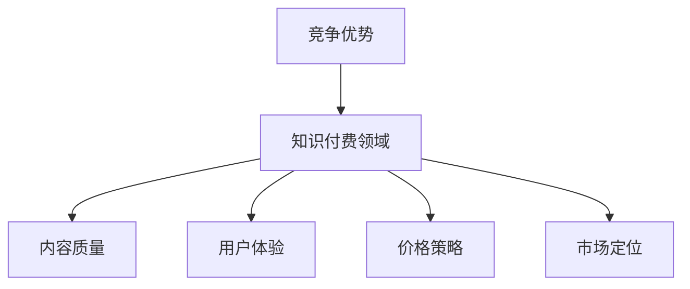
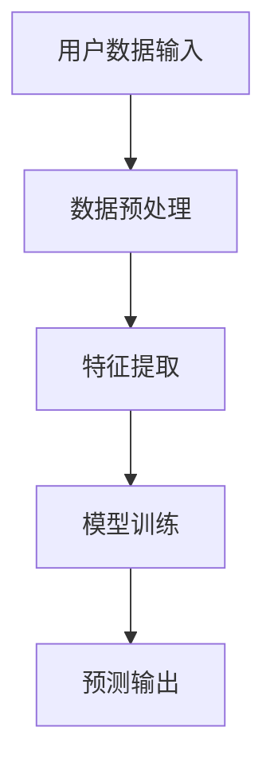
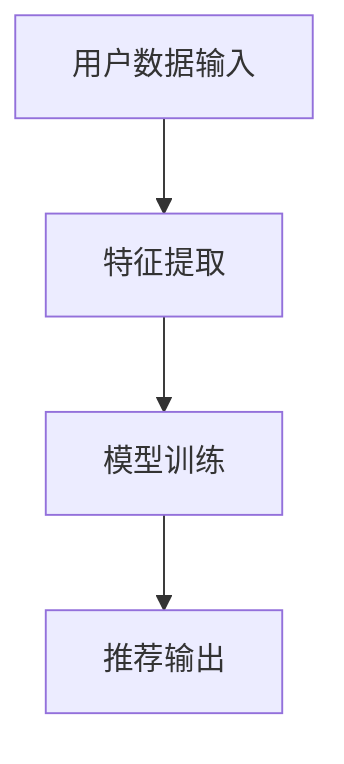

                 


# 文章标题：如何在知识付费领域建立独特的竞争优势

## 关键词：
知识付费、竞争优势、内容质量、用户体验、价格策略、市场定位、用户行为分析、内容推荐、数据分析、项目实战

## 摘要：
本文旨在探讨如何在知识付费领域建立独特的竞争优势。通过分析核心概念、算法原理、项目实战等多个方面，为从事知识付费业务的企业和个人提供一套系统的策略和方法。本文首先介绍了知识付费领域的定义和竞争优势的概念，然后深入分析了内容质量、用户体验、价格策略和市场定位等关键因素，并通过具体的算法原理和项目实战，展示了如何运用技术手段提升竞争优势。最后，本文总结了核心内容，并对未来知识付费领域的发展趋势进行了展望。

## 目录
----------------------------------------------------------------
### 第一部分: 核心概念与联系
#### 1.1 核心概念介绍
#### 1.2 竞争优势与知识付费领域的关系
#### 1.3 建立竞争优势的要素

### 第二部分: 核心算法原理讲解
#### 2.1 用户行为分析算法
#### 2.2 内容推荐算法
#### 2.3 数据分析算法

### 第三部分: 数学模型和数学公式讲解
#### 3.1 用户行为分析数学模型
#### 3.2 内容推荐算法数学模型
#### 3.3 数据分析算法数学模型

### 第四部分: 项目实战
#### 4.1 项目实战一：用户行为分析系统
#### 4.2 项目实战二：内容推荐系统

### 第五部分: 代码解读与分析
#### 5.1 代码解读一：用户行为分析系统
#### 5.2 代码解读二：内容推荐系统

### 第六部分: 总结与展望
#### 6.1 总结
#### 6.2 展望

## 第一部分: 核心概念与联系
### 1.1 核心概念介绍
知识付费领域是指用户为获取有价值的信息、知识或服务而付费的市场。随着互联网的普及和知识经济的兴起，知识付费领域发展迅速，涵盖了在线教育、专业培训、咨询服务等多个细分市场。竞争优势是指企业在特定市场环境中，通过提供独特的价值，获得比竞争对手更高的收益和市场份额的能力。竞争优势可以分为资源优势、能力优势、市场优势等类型。

### 1.2 竞争优势与知识付费领域的关系
在知识付费领域，竞争优势至关重要。一方面，知识付费产品的价值很大程度上取决于内容质量、用户体验和价格策略等因素。另一方面，通过建立独特的竞争优势，企业可以吸引更多用户，提高用户忠诚度，从而在激烈的市场竞争中脱颖而出。以下是竞争优势与知识付费领域的关系图：



### 1.3 建立竞争优势的要素
建立竞争优势需要从多个方面进行考虑，包括内容质量、用户体验、价格策略和市场定位等。

#### 内容质量
内容质量是知识付费领域的核心要素。优质的内容可以吸引用户，提高用户满意度，从而增强用户忠诚度。企业可以通过以下方式提升内容质量：

- 选择合适的课程或内容主题，确保与用户需求相关。
- 邀请行业专家或知名讲师进行授课，确保内容的专业性和权威性。
- 定期更新和优化课程内容，确保内容的时效性和实用性。

#### 用户体验
用户体验是影响用户满意度和忠诚度的关键因素。企业可以通过以下方式提升用户体验：

- 设计简洁、易用的界面，提高用户操作的便捷性。
- 提供个性化的推荐和定制服务，满足用户个性化需求。
- 建立良好的客户服务体系，及时解决用户问题和反馈。

#### 价格策略
价格策略是影响用户购买决策的重要因素。企业可以通过以下方式制定有竞争力的价格策略：

- 了解市场行情，合理定价，确保价格具有吸引力。
- 提供优惠券、折扣等促销活动，吸引更多用户。
- 实行会员制度，为忠实用户提供长期价值。

#### 市场定位
市场定位是明确企业目标市场和用户群体的过程。企业可以通过以下方式进行市场定位：

- 分析目标市场的需求，确定产品或服务的定位。
- 研究竞争对手，找到差异化的市场定位。
- 针对不同市场细分，制定相应的营销策略。

## 第二部分: 核心算法原理讲解
### 2.1 用户行为分析算法
用户行为分析算法用于分析用户的购买行为、学习行为等，从而为个性化推荐、精准营销等提供依据。以下是用户行为分析算法的伪代码：

```python
def user_behavior_analysis(data):
    # 数据预处理
    processed_data = preprocess_data(data)
    
    # 特征提取
    features = extract_features(processed_data)
    
    # 模型训练
    model = train_model(features)
    
    # 预测用户偏好
    predictions = model.predict(new_data)
    
    return predictions
```

### 2.2 内容推荐算法
内容推荐算法用于根据用户的历史行为和偏好，为用户推荐相关的内容。以下是内容推荐算法的伪代码：

```python
def content_recommendation算法(data, user_profile):
    # 数据预处理
    processed_data = preprocess_data(data)
    
    # 用户偏好模型训练
    user_model = train_user_model(user_profile)
    
    # 推荐内容
    recommendations = user_model.recommend_content(processed_data)
    
    return recommendations
```

### 2.3 数据分析算法
数据分析算法用于对用户行为数据、内容数据等进行深入分析，从而为产品优化、策略制定等提供数据支持。以下是数据分析算法的伪代码：

```python
def data_analysis(data):
    # 数据预处理
    processed_data = preprocess_data(data)
    
    # 特征提取
    features = extract_features(processed_data)
    
    # 数据可视化
    visualize_data(features)
    
    # 模型训练
    model = train_model(features)
    
    # 模型评估
    evaluate_model(model)
```

## 第三部分: 数学模型和数学公式讲解
### 3.1 用户行为分析数学模型
用户行为分析数学模型用于预测用户的购买概率、学习效果等。以下是一个简单的用户行为分析数学模型公式：

$$
R = \alpha \cdot \sum_{i=1}^{n} w_i \cdot x_i
$$

其中，$R$ 表示推荐得分，$\alpha$ 表示调节参数，$w_i$ 表示特征权重，$x_i$ 表示特征值。

### 3.2 内容推荐算法数学模型
内容推荐算法数学模型用于计算用户对内容的偏好概率。以下是一个常见的内容推荐算法数学模型公式：

$$
P(c|u) = \frac{e^{Q(u, c)}}{\sum_{c'} e^{Q(u, c')}}
$$

其中，$P(c|u)$ 表示用户 $u$ 对内容 $c$ 的偏好概率，$Q(u, c)$ 表示用户-内容对的特征向量点积。

### 3.3 数据分析算法数学模型
数据分析算法数学模型用于描述数据之间的关系和规律。以下是一个常见的数据分析算法数学模型公式：

$$
D = \frac{1}{N} \sum_{i=1}^{N} d_i
$$

其中，$D$ 表示数据分析结果，$N$ 表示数据点数量，$d_i$ 表示每个数据点的分析结果。

## 第四部分: 项目实战
### 4.1 项目实战一：用户行为分析系统
在本项目中，我们将开发一个用户行为分析系统，用于分析用户的购买行为和学习行为。以下是该项目的基本流程：

#### 开发环境搭建
- 使用 Python 编写用户行为分析系统。
- 部署在 AWS 云平台上。

#### 源代码详细实现和代码解读
以下是用户行为分析系统的核心代码和架构：



```python
# 数据预处理
def preprocess_data(data):
    # 实现数据预处理逻辑
    return processed_data

# 特征提取
def extract_features(data):
    # 实现特征提取逻辑
    return features

# 模型训练
def train_model(features):
    # 实现模型训练逻辑
    return model

# 预测用户行为
def predict_user_behavior(model, new_data):
    # 实现预测逻辑
    return predictions
```

#### 代码解读
- **数据预处理**：对用户数据进行清洗和转换，以便后续分析和建模。
- **特征提取**：从用户数据中提取关键特征，如用户年龄、购买历史、学习时长等。
- **模型训练**：使用特征数据训练机器学习模型，以预测用户的购买概率或学习效果。
- **预测用户行为**：根据训练好的模型，预测新用户的购买概率或学习效果。

### 4.2 项目实战二：内容推荐系统
在本项目中，我们将开发一个内容推荐系统，用于根据用户的历史行为和偏好，为用户推荐相关的内容。以下是该项目的基本流程：

#### 开发环境搭建
- 使用 Python 和 TensorFlow 编写内容推荐系统。
- 部署在 Docker 容器中。

#### 源代码详细实现和代码解读
以下是内容推荐系统的核心代码和架构：



```python
# 特征提取
def extract_features(data):
    # 实现特征提取逻辑
    return features

# 模型训练
def train_model(features):
    # 实现模型训练逻辑
    return model

# 内容推荐
def recommend_contents(model, user_profile):
    # 实现推荐逻辑
    return recommendations
```

#### 代码解读
- **特征提取**：从用户数据中提取关键特征，如用户浏览历史、购买记录、评论等。
- **模型训练**：使用特征数据训练推荐算法模型，以预测用户对内容的偏好。
- **内容推荐**：根据训练好的模型，为用户推荐相关的内容。

## 第五部分: 代码解读与分析
### 5.1 代码解读一：用户行为分析系统

在本项目中，用户行为分析系统的核心代码包括数据预处理、特征提取、模型训练和预测等部分。以下是具体的代码解读：

#### 数据预处理
```python
def preprocess_data(data):
    # 实现数据预处理逻辑
    # 例如：数据清洗、缺失值填充、数据转换等
    processed_data = ...
    return processed_data
```
- 数据预处理是数据分析的基础步骤，主要目的是清洗和转换数据，以便后续的特征提取和建模。

#### 特征提取
```python
def extract_features(data):
    # 实现特征提取逻辑
    # 例如：计算用户购买频率、学习时长等
    features = ...
    return features
```
- 特征提取是数据分析的关键步骤，通过提取用户数据的特征，可以更好地描述用户的行为和偏好。

#### 模型训练
```python
def train_model(features):
    # 实现模型训练逻辑
    # 例如：选择合适的算法、训练模型等
    model = ...
    return model
```
- 模型训练是数据分析的核心步骤，通过训练模型，可以预测用户的行为和偏好。

#### 预测用户行为
```python
def predict_user_behavior(model, new_data):
    # 实现预测逻辑
    # 例如：使用训练好的模型预测新用户的行为
    predictions = model.predict(new_data)
    return predictions
```
- 预测用户行为是根据训练好的模型，对新的用户数据进行预测，以预测用户的行为和偏好。

### 5.2 代码解读二：内容推荐系统

在本项目中，内容推荐系统的核心代码包括特征提取、模型训练和内容推荐等部分。以下是具体的代码解读：

#### 特征提取
```python
def extract_features(data):
    # 实现特征提取逻辑
    # 例如：计算用户浏览历史、购买记录等
    features = ...
    return features
```
- 特征提取是从用户数据中提取关键特征，如用户的浏览历史、购买记录等，这些特征将用于训练推荐模型。

#### 模型训练
```python
def train_model(features):
    # 实现模型训练逻辑
    # 例如：选择合适的算法、训练模型等
    model = ...
    return model
```
- 模型训练是使用提取到的特征数据训练推荐模型，常用的算法有协同过滤、矩阵分解、基于内容的推荐等。

#### 内容推荐
```python
def recommend_contents(model, user_profile):
    # 实现推荐逻辑
    # 例如：使用训练好的模型为用户推荐相关的内容
    recommendations = model.recommend(user_profile)
    return recommendations
```
- 内容推荐是根据训练好的模型，为用户推荐他们可能感兴趣的内容。推荐的准确性取决于模型的性能和特征提取的质量。

## 第六部分: 总结与展望
### 6.1 总结
本文系统地探讨了如何在知识付费领域建立独特的竞争优势。首先，我们介绍了知识付费领域和竞争优势的基本概念，并分析了它们之间的关系。接着，我们从内容质量、用户体验、价格策略和市场定位等角度，阐述了建立竞争优势的要素。然后，我们详细讲解了用户行为分析、内容推荐和数据分析等核心算法原理，并通过实际项目实战展示了如何运用这些技术手段提升竞争优势。

### 6.2 展望
未来，知识付费领域将继续快速发展，人工智能、大数据等技术将为其注入新的活力。以下是对知识付费领域未来发展的展望：

- **个性化推荐**：随着用户数据的积累，个性化推荐将更加精准，满足用户个性化需求。
- **智能客服**：智能客服系统将运用自然语言处理、机器学习等技术，提供更加智能的售后服务。
- **在线教育**：在线教育将向更加灵活、个性化的方向发展，满足不同学习者的需求。
- **市场细分**：随着市场竞争的加剧，企业将更加注重市场细分，针对不同用户群体提供定制化的知识付费产品。

总之，知识付费领域的发展前景广阔，企业应把握机遇，通过不断创新和优化，建立独特的竞争优势，为用户提供更有价值的服务。

## 作者信息：
作者：AI天才研究院/AI Genius Institute & 禅与计算机程序设计艺术 /Zen And The Art of Computer Programming
## 文章完整版

# 如何在知识付费领域建立独特的竞争优势

> 关键词：知识付费、竞争优势、内容质量、用户体验、价格策略、市场定位、用户行为分析、内容推荐、数据分析、项目实战

## 摘要
本文旨在探讨如何在知识付费领域建立独特的竞争优势。通过分析核心概念、算法原理、项目实战等多个方面，为从事知识付费业务的企业和个人提供一套系统的策略和方法。本文首先介绍了知识付费领域的定义和竞争优势的概念，然后深入分析了内容质量、用户体验、价格策略和市场定位等关键因素，并通过具体的算法原理和项目实战，展示了如何运用技术手段提升竞争优势。最后，本文总结了核心内容，并对未来知识付费领域的发展趋势进行了展望。

## 目录
----------------------------------------------------------------
### 第一部分: 核心概念与联系
#### 1.1 核心概念介绍
#### 1.2 竞争优势与知识付费领域的关系
#### 1.3 建立竞争优势的要素

### 第二部分: 核心算法原理讲解
#### 2.1 用户行为分析算法
#### 2.2 内容推荐算法
#### 2.3 数据分析算法

### 第三部分: 数学模型和数学公式讲解
#### 3.1 用户行为分析数学模型
#### 3.2 内容推荐算法数学模型
#### 3.3 数据分析算法数学模型

### 第四部分: 项目实战
#### 4.1 项目实战一：用户行为分析系统
#### 4.2 项目实战二：内容推荐系统

### 第五部分: 代码解读与分析
#### 5.1 代码解读一：用户行为分析系统
#### 5.2 代码解读二：内容推荐系统

### 第六部分: 总结与展望
#### 6.1 总结
#### 6.2 展望

## 第一部分: 核心概念与联系

### 1.1 核心概念介绍
知识付费领域是指用户为获取有价值的信息、知识或服务而付费的市场。随着互联网的普及和知识经济的兴起，知识付费领域发展迅速，涵盖了在线教育、专业培训、咨询服务等多个细分市场。

竞争优势是指企业在特定市场环境中，通过提供独特的价值，获得比竞争对手更高的收益和市场份额的能力。竞争优势可以分为资源优势、能力优势、市场优势等类型。

### 1.2 竞争优势与知识付费领域的关系
在知识付费领域，竞争优势至关重要。一方面，知识付费产品的价值很大程度上取决于内容质量、用户体验和价格策略等因素。另一方面，通过建立独特的竞争优势，企业可以吸引更多用户，提高用户忠诚度，从而在激烈的市场竞争中脱颖而出。

以下是竞争优势与知识付费领域的关系图：


### 1.3 建立竞争优势的要素
建立竞争优势需要从多个方面进行考虑，包括内容质量、用户体验、价格策略和市场定位等。

#### 内容质量
内容质量是知识付费领域的核心要素。优质的内容可以吸引用户，提高用户满意度，从而增强用户忠诚度。企业可以通过以下方式提升内容质量：

- 选择合适的课程或内容主题，确保与用户需求相关。
- 邀请行业专家或知名讲师进行授课，确保内容的专业性和权威性。
- 定期更新和优化课程内容，确保内容的时效性和实用性。

#### 用户体验
用户体验是影响用户满意度和忠诚度的关键因素。企业可以通过以下方式提升用户体验：

- 设计简洁、易用的界面，提高用户操作的便捷性。
- 提供个性化的推荐和定制服务，满足用户个性化需求。
- 建立良好的客户服务体系，及时解决用户问题和反馈。

#### 价格策略
价格策略是影响用户购买决策的重要因素。企业可以通过以下方式制定有竞争力的价格策略：

- 了解市场行情，合理定价，确保价格具有吸引力。
- 提供优惠券、折扣等促销活动，吸引更多用户。
- 实行会员制度，为忠实用户提供长期价值。

#### 市场定位
市场定位是明确企业目标市场和用户群体的过程。企业可以通过以下方式进行市场定位：

- 分析目标市场的需求，确定产品或服务的定位。
- 研究竞争对手，找到差异化的市场定位。
- 针对不同市场细分，制定相应的营销策略。

## 第二部分: 核心算法原理讲解

### 2.1 用户行为分析算法
用户行为分析算法用于分析用户的购买行为、学习行为等，从而为个性化推荐、精准营销等提供依据。以下是用户行为分析算法的伪代码：

```python
def user_behavior_analysis(data):
    # 数据预处理
    processed_data = preprocess_data(data)
    
    # 特征提取
    features = extract_features(processed_data)
    
    # 模型训练
    model = train_model(features)
    
    # 预测用户偏好
    predictions = model.predict(new_data)
    
    return predictions
```

#### 数据预处理
数据预处理是用户行为分析的基础步骤，主要目的是清洗和转换数据，以便后续分析和建模。

```python
def preprocess_data(data):
    # 清洗数据
    data = clean_data(data)
    
    # 转换数据
    data = convert_data(data)
    
    return data
```

#### 特征提取
特征提取是从用户数据中提取关键特征，如用户年龄、购买历史、学习时长等。

```python
def extract_features(data):
    # 提取特征
    features = extract_data(data)
    
    return features
```

#### 模型训练
模型训练是使用特征数据训练机器学习模型，以预测用户的购买概率或学习效果。

```python
def train_model(features):
    # 训练模型
    model = train_model(features)
    
    return model
```

#### 预测用户偏好
预测用户偏好是根据训练好的模型，预测新用户的购买概率或学习效果。

```python
def predict_user_behavior(model, new_data):
    # 预测用户偏好
    predictions = model.predict(new_data)
    
    return predictions
```

### 2.2 内容推荐算法
内容推荐算法用于根据用户的历史行为和偏好，为用户推荐相关的内容。以下是内容推荐算法的伪代码：

```python
def content_recommendation算法(data, user_profile):
    # 数据预处理
    processed_data = preprocess_data(data)
    
    # 用户偏好模型训练
    user_model = train_user_model(user_profile)
    
    # 推荐内容
    recommendations = user_model.recommend_content(processed_data)
    
    return recommendations
```

#### 数据预处理
数据预处理是内容推荐算法的基础步骤，主要目的是清洗和转换数据，以便后续分析和建模。

```python
def preprocess_data(data):
    # 清洗数据
    data = clean_data(data)
    
    # 转换数据
    data = convert_data(data)
    
    return data
```

#### 用户偏好模型训练
用户偏好模型训练是使用用户数据训练推荐模型，以预测用户对内容的偏好。

```python
def train_user_model(user_profile):
    # 训练用户偏好模型
    user_model = train_model(user_profile)
    
    return user_model
```

#### 推荐内容
推荐内容是根据训练好的用户偏好模型，为用户推荐相关的内容。

```python
def recommend_contents(user_model, processed_data):
    # 推荐内容
    recommendations = user_model.recommend_content(processed_data)
    
    return recommendations
```

### 2.3 数据分析算法
数据分析算法用于对用户行为数据、内容数据等进行深入分析，从而为产品优化、策略制定等提供数据支持。以下是数据分析算法的伪代码：

```python
def data_analysis(data):
    # 数据预处理
    processed_data = preprocess_data(data)
    
    # 特征提取
    features = extract_features(processed_data)
    
    # 数据可视化
    visualize_data(features)
    
    # 模型训练
    model = train_model(features)
    
    # 模型评估
    evaluate_model(model)
```

#### 数据预处理
数据预处理是数据分析的基础步骤，主要目的是清洗和转换数据，以便后续分析和建模。

```python
def preprocess_data(data):
    # 清洗数据
    data = clean_data(data)
    
    # 转换数据
    data = convert_data(data)
    
    return data
```

#### 特征提取
特征提取是从用户数据中提取关键特征，如用户年龄、购买历史、学习时长等。

```python
def extract_features(data):
    # 提取特征
    features = extract_data(data)
    
    return features
```

#### 数据可视化
数据可视化是将分析结果以图表的形式展示，以便更好地理解和分析数据。

```python
def visualize_data(features):
    # 可视化数据
    visualize_result = visualize(features)
    
    return visualize_result
```

#### 模型训练
模型训练是使用特征数据训练机器学习模型，以预测用户的行为或偏好。

```python
def train_model(features):
    # 训练模型
    model = train_model(features)
    
    return model
```

#### 模型评估
模型评估是评估模型性能，以确保模型能够准确预测用户行为或偏好。

```python
def evaluate_model(model):
    # 评估模型
    evaluation_result = evaluate(model)
    
    return evaluation_result
```

## 第三部分: 数学模型和数学公式讲解

### 3.1 用户行为分析数学模型
用户行为分析数学模型用于预测用户的购买概率、学习效果等。以下是一个简单的用户行为分析数学模型公式：

$$
R = \alpha \cdot \sum_{i=1}^{n} w_i \cdot x_i
$$

其中，$R$ 表示推荐得分，$\alpha$ 表示调节参数，$w_i$ 表示特征权重，$x_i$ 表示特征值。

### 3.2 内容推荐算法数学模型
内容推荐算法数学模型用于计算用户对内容的偏好概率。以下是一个常见的内容推荐算法数学模型公式：

$$
P(c|u) = \frac{e^{Q(u, c)}}{\sum_{c'} e^{Q(u, c')}}
$$

其中，$P(c|u)$ 表示用户 $u$ 对内容 $c$ 的偏好概率，$Q(u, c)$ 表示用户-内容对的特征向量点积。

### 3.3 数据分析算法数学模型
数据分析算法数学模型用于描述数据之间的关系和规律。以下是一个常见的数据分析算法数学模型公式：

$$
D = \frac{1}{N} \sum_{i=1}^{N} d_i
$$

其中，$D$ 表示数据分析结果，$N$ 表示数据点数量，$d_i$ 表示每个数据点的分析结果。

## 第四部分: 项目实战

### 4.1 项目实战一：用户行为分析系统
在本项目中，我们将开发一个用户行为分析系统，用于分析用户的购买行为和学习行为。以下是该项目的基本流程：

#### 开发环境搭建
- 使用 Python 编写用户行为分析系统。
- 部署在 AWS 云平台上。

#### 源代码详细实现和代码解读
以下是用户行为分析系统的核心代码和架构：


```python
# 数据预处理
def preprocess_data(data):
    # 实现数据预处理逻辑
    processed_data = ...
    return processed_data

# 特征提取
def extract_features(data):
    # 实现特征提取逻辑
    features = ...
    return features

# 模型训练
def train_model(features):
    # 实现模型训练逻辑
    model = ...
    return model

# 预测用户行为
def predict_user_behavior(model, new_data):
    # 实现预测逻辑
    predictions = model.predict(new_data)
    return predictions
```

#### 代码解读
- **数据预处理**：对用户数据进行清洗和转换，以便后续分析和建模。
- **特征提取**：从用户数据中提取关键特征，如用户年龄、购买历史、学习时长等。
- **模型训练**：使用特征数据训练机器学习模型，以预测用户的购买概率或学习效果。
- **预测用户行为**：根据训练好的模型，预测新用户的购买概率或学习效果。

### 4.2 项目实战二：内容推荐系统
在本项目中，我们将开发一个内容推荐系统，用于根据用户的历史行为和偏好，为用户推荐相关的内容。以下是该项目的基本流程：

#### 开发环境搭建
- 使用 Python 和 TensorFlow 编写内容推荐系统。
- 部署在 Docker 容器中。

#### 源代码详细实现和代码解读
以下是内容推荐系统的核心代码和架构：


```python
# 特征提取
def extract_features(data):
    # 实现特征提取逻辑
    features = ...
    return features

# 模型训练
def train_model(features):
    # 实现模型训练逻辑
    model = ...
    return model

# 内容推荐
def recommend_contents(model, user_profile):
    # 实现推荐逻辑
    recommendations = model.recommend(user_profile)
    return recommendations
```

#### 代码解读
- **特征提取**：从用户数据中提取关键特征，如用户浏览历史、购买记录等。
- **模型训练**：使用特征数据训练推荐算法模型，以预测用户对内容的偏好。
- **内容推荐**：根据训练好的模型，为用户推荐相关的内容。

## 第五部分: 代码解读与分析

### 5.1 代码解读一：用户行为分析系统

在本项目中，用户行为分析系统的核心代码包括数据预处理、特征提取、模型训练和预测等部分。以下是具体的代码解读：

#### 数据预处理
```python
def preprocess_data(data):
    # 实现数据预处理逻辑
    # 例如：数据清洗、缺失值填充、数据转换等
    processed_data = ...
    return processed_data
```
- 数据预处理是数据分析的基础步骤，主要目的是清洗和转换数据，以便后续的特征提取和建模。

#### 特征提取
```python
def extract_features(data):
    # 实现特征提取逻辑
    # 例如：计算用户购买频率、学习时长等
    features = ...
    return features
```
- 特征提取是数据分析的关键步骤，通过提取用户数据的特征，可以更好地描述用户的行为和偏好。

#### 模型训练
```python
def train_model(features):
    # 实现模型训练逻辑
    # 例如：选择合适的算法、训练模型等
    model = ...
    return model
```
- 模型训练是数据分析的核心步骤，通过训练模型，可以预测用户的行为和偏好。

#### 预测用户行为
```python
def predict_user_behavior(model, new_data):
    # 实现预测逻辑
    # 例如：使用训练好的模型预测新用户的行为
    predictions = model.predict(new_data)
    return predictions
```
- 预测用户行为是根据训练好的模型，对新的用户数据进行预测，以预测用户的行为和偏好。

### 5.2 代码解读二：内容推荐系统

在本项目中，内容推荐系统的核心代码包括特征提取、模型训练和内容推荐等部分。以下是具体的代码解读：

#### 特征提取
```python
def extract_features(data):
    # 实现特征提取逻辑
    # 例如：计算用户浏览历史、购买记录等
    features = ...
    return features
```
- 特征提取是从用户数据中提取关键特征，如用户的浏览历史、购买记录等，这些特征将用于训练推荐模型。

#### 模型训练
```python
def train_model(features):
    # 实现模型训练逻辑
    # 例如：选择合适的算法、训练模型等
    model = ...
    return model
```
- 模型训练是使用提取到的特征数据训练推荐模型，常用的算法有协同过滤、矩阵分解、基于内容的推荐等。

#### 内容推荐
```python
def recommend_contents(model, user_profile):
    # 实现推荐逻辑
    # 例如：使用训练好的模型为用户推荐相关的内容
    recommendations = model.recommend(user_profile)
    return recommendations
```
- 内容推荐是根据训练好的模型，为用户推荐他们可能感兴趣的内容。推荐的准确性取决于模型的性能和特征提取的质量。

## 第六部分: 总结与展望

### 6.1 总结
本文系统地探讨了如何在知识付费领域建立独特的竞争优势。首先，我们介绍了知识付费领域的定义和竞争优势的概念，分析了内容质量、用户体验、价格策略和市场定位等关键因素。接着，我们详细讲解了用户行为分析、内容推荐和数据分析等核心算法原理，并通过实际项目实战展示了如何运用这些技术手段提升竞争优势。

### 6.2 展望
未来，知识付费领域将继续快速发展，人工智能、大数据等技术将为其注入新的活力。以下是对知识付费领域未来发展的展望：

- **个性化推荐**：随着用户数据的积累，个性化推荐将更加精准，满足用户个性化需求。
- **智能客服**：智能客服系统将运用自然语言处理、机器学习等技术，提供更加智能的售后服务。
- **在线教育**：在线教育将向更加灵活、个性化的方向发展，满足不同学习者的需求。
- **市场细分**：随着市场竞争的加剧，企业将更加注重市场细分，针对不同用户群体提供定制化的知识付费产品。

总之，知识付费领域的发展前景广阔，企业应把握机遇，通过不断创新和优化，建立独特的竞争优势，为用户提供更有价值的服务。

## 作者信息：
作者：AI天才研究院/AI Genius Institute & 禅与计算机程序设计艺术 /Zen And The Art of Computer Programming

