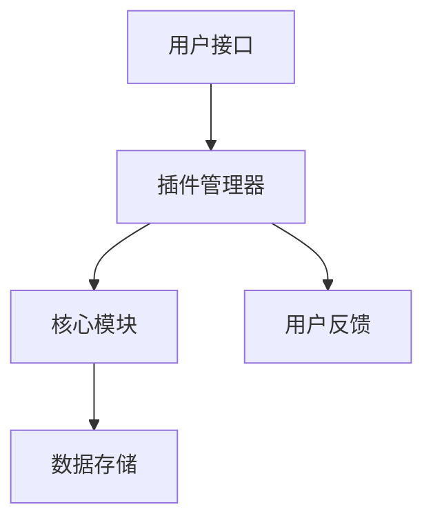
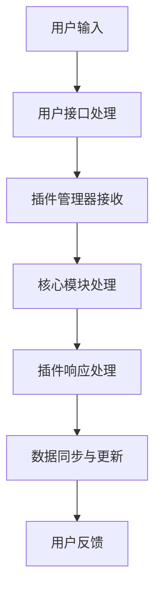

                 

# 《实战二：动手开发第一个 ChatGPT Plugin》

> 关键词：ChatGPT，Plugin，开发实战，算法原理，数学模型

> 摘要：本文将通过详细讲解ChatGPT Plugin的开发流程、核心算法和数学模型，带领读者动手实现第一个ChatGPT Plugin，从而深入了解该插件的功能和原理。文章还将分析实际开发中的性能优化、安全性保障以及部署与维护策略，并提供三个实战案例分析，为读者提供全面的实战指导。

## 目录大纲

### 第一部分：ChatGPT Plugin基础知识

#### 第1章：ChatGPT及Plugin概述

##### 1.1 ChatGPT介绍

- ChatGPT的背景和发展历程
- ChatGPT的主要功能和应用场景

##### 1.2 ChatGPT Plugin的概念和作用

- ChatGPT Plugin的定义
- ChatGPT Plugin的功能和优势
- ChatGPT Plugin的应用领域

##### 1.3 开发ChatGPT Plugin的准备工作

- 环境搭建
- 相关工具和库的使用

### 第2章：ChatGPT Plugin架构设计

##### 2.1 ChatGPT Plugin的基本架构

- 数据流
- 模块划分

##### 2.2 ChatGPT Plugin的交互流程

- 用户输入处理
- 插件响应处理
- 数据同步与更新

##### 2.3 ChatGPT Plugin的扩展功能

- 动态加载和卸载插件
- 插件间的通信

## 第二部分：ChatGPT Plugin开发实战

### 第3章：动手实现第一个ChatGPT Plugin

##### 3.1 Plugin开发流程

- 需求分析
- 系统设计
- 实现细节

##### 3.2 实现ChatGPT Plugin的核心算法

- 伪代码讲解
- 算法原理

##### 3.3 ChatGPT Plugin的数学模型

- 公式推导
- 模型解释

##### 3.4 实例分析

- 案例介绍
- 代码解析

### 第4章：扩展功能与优化

##### 4.1 插件性能优化

- 算法优化
- 资源管理

##### 4.2 插件安全性保障

- 防止恶意插件
- 数据保护

##### 4.3 插件部署与维护

- 部署策略
- 维护流程

### 第5章：实战案例分析

##### 5.1 案例一：聊天机器人插件

- 实现细节
- 性能分析

##### 5.2 案例二：智能客服插件

- 实现细节
- 实际应用场景

##### 5.3 案例三：教育辅助插件

- 实现细节
- 教学效果评估

## 第三部分：ChatGPT Plugin未来趋势与展望

### 第6章：ChatGPT Plugin发展趋势

- 产业发展趋势
- 技术发展路线

### 第7章：ChatGPT Plugin的未来应用场景

- 新兴应用领域
- 未来发展方向

### 第8章：结语

- 总结
- 展望

## 附录

### 附录 A：ChatGPT Plugin开发资源

- 常用库和工具
- 开发文档和教程
- 社区和支持资源

### 附录 B：Mermaid流程图

- ChatGPT Plugin基本架构
- ChatGPT Plugin交互流程

### 附录 C：数学模型和公式

- 相关数学公式
- 公式推导过程

### 附录 D：代码实例

- 代码实现
- 代码解读与分析

## 第一部分：ChatGPT Plugin基础知识

### 第1章：ChatGPT及Plugin概述

#### 1.1 ChatGPT介绍

ChatGPT是由OpenAI开发的一款基于GPT-3模型的聊天机器人。它能够通过理解和生成人类语言来进行对话，并具备文本生成、问答、翻译等多种功能。ChatGPT的出现标志着人工智能技术进入了新的阶段，为自然语言处理领域带来了革命性的变化。

ChatGPT的背景可以追溯到2018年，当时OpenAI发布了GPT-2模型，这是一种具有152亿参数的预训练模型。GPT-2在自然语言处理的各项任务上都取得了优异的成绩，但同时也引发了对其潜在风险的担忧。为了避免这些风险，OpenAI决定不公开发布GPT-2的代码和模型。

然而，OpenAI意识到，将人工智能技术用于实际应用是必然趋势。因此，他们开始研发更安全、更高效的聊天机器人，并在2022年发布了ChatGPT。ChatGPT在预训练阶段使用了大量的互联网文本数据进行训练，使其能够生成符合人类语言习惯的文本。

ChatGPT的主要功能包括：

1. **对话生成**：能够根据用户输入的文本生成连贯、有意义的回复。
2. **问答系统**：能够回答用户提出的问题，并提供丰富的信息。
3. **文本生成**：能够根据用户提供的主题生成文章、故事、诗歌等多种文本形式。
4. **多语言支持**：能够支持多种语言的对话生成和翻译。

ChatGPT的应用场景非常广泛，包括但不限于：

1. **客户服务**：用于自动化客户问答，提供24/7在线支持。
2. **教育辅助**：为学生提供学习辅导、作业解答等。
3. **内容创作**：帮助内容创作者生成文章、报告等。
4. **聊天机器人**：在社交媒体、在线社区等平台提供聊天服务。

#### 1.2 ChatGPT Plugin的概念和作用

ChatGPT Plugin是指为ChatGPT添加额外功能的一种扩展方式。通过插件，用户可以为ChatGPT赋予新的能力，使其更好地适应特定应用场景。ChatGPT Plugin的核心作用包括：

1. **功能扩展**：为ChatGPT添加新的功能，如特定领域的知识问答、图像识别等。
2. **性能优化**：通过优化算法和数据处理方式，提高ChatGPT的响应速度和准确性。
3. **用户体验**：提供更加丰富和个性化的对话体验，如语音合成、情绪识别等。
4. **集成其他服务**：将ChatGPT与其他服务和系统进行集成，如第三方API、数据库等。

ChatGPT Plugin的优势主要体现在以下几个方面：

1. **灵活性**：用户可以根据需求自由添加或修改插件功能，适应不同的业务场景。
2. **模块化**：插件与ChatGPT核心功能分离，便于维护和升级。
3. **可扩展性**：插件可以集成多种技术和工具，实现多样化的功能。
4. **安全性**：通过插件管理机制，确保插件的运行安全和可控。

ChatGPT Plugin的应用领域包括：

1. **企业内部应用**：如企业知识库问答、内部沟通平台等。
2. **在线教育**：如智能辅导、在线考试等。
3. **智能客服**：提供定制化的客户服务，提升客户满意度。
4. **虚拟助手**：为用户提供个性化服务，如智能家居控制、健康助手等。

#### 1.3 开发ChatGPT Plugin的准备工作

要开发ChatGPT Plugin，需要做好以下准备工作：

1. **环境搭建**：确保开发环境满足插件开发的要求，包括操作系统、编程语言、开发工具等。
2. **相关工具和库的使用**：了解并熟练使用开发插件所需的工具和库，如OpenAI的API、Docker等。
3. **技术文档的阅读**：详细阅读ChatGPT Plugin的开发文档，了解插件开发的基本流程和规范。
4. **了解ChatGPT的功能和架构**：熟悉ChatGPT的核心功能、数据流和交互流程，为插件开发提供理论基础。

在完成准备工作后，就可以开始设计插件架构，编写代码，并进行测试和部署。下一章将详细介绍ChatGPT Plugin的架构设计。

### 第2章：ChatGPT Plugin架构设计

#### 2.1 ChatGPT Plugin的基本架构

ChatGPT Plugin的基本架构可以分为以下几个部分：用户接口、核心模块、插件管理器和数据存储。

1. **用户接口**：用户接口是用户与ChatGPT Plugin交互的入口，包括命令行界面、Web界面等。用户通过输入指令或交互式对话，触发插件的功能。

2. **核心模块**：核心模块是插件的核心部分，负责实现ChatGPT Plugin的主要功能，如文本生成、知识问答、图像识别等。核心模块通常由多个子模块组成，每个子模块负责特定的功能。

3. **插件管理器**：插件管理器负责插件的加载、卸载和生命周期管理。它确保插件的正确运行，并协调插件间的通信和数据同步。

4. **数据存储**：数据存储用于保存插件运行过程中产生的数据，如用户输入、插件响应、日志记录等。数据存储可以采用数据库、文件系统等方式，根据需求选择合适的存储方案。

#### 2.2 ChatGPT Plugin的交互流程

ChatGPT Plugin的交互流程可以分为以下几个步骤：

1. **用户输入处理**：用户通过用户接口输入指令或对话，插件管理器接收并解析用户输入。

2. **插件响应处理**：插件管理器根据用户输入，调用相应的核心模块进行处理。核心模块生成相应的响应，并返回给插件管理器。

3. **数据同步与更新**：插件管理器将核心模块的响应返回给用户接口，同时将相关数据同步到数据存储。确保数据的一致性和完整性。

4. **用户反馈**：用户接口将核心模块的响应展示给用户，用户可以根据反馈进行下一步操作。

#### 2.3 ChatGPT Plugin的扩展功能

ChatGPT Plugin的扩展功能包括动态加载和卸载插件、插件间的通信等。

1. **动态加载和卸载插件**：插件管理器支持动态加载和卸载插件，用户可以根据需要随时启用或禁用特定插件。动态加载和卸载插件可以提高系统的灵活性和可扩展性。

2. **插件间的通信**：插件间可以通过消息队列、事件驱动等方式进行通信。插件间的通信可以实现功能互补、数据共享，提高系统的整体性能。

通过上述架构设计和交互流程，ChatGPT Plugin能够实现灵活的功能扩展和高效的数据处理。下一章将介绍如何动手实现第一个ChatGPT Plugin。

### 第3章：动手实现第一个ChatGPT Plugin

#### 3.1 Plugin开发流程

实现第一个ChatGPT Plugin需要经过以下步骤：

1. **需求分析**：明确插件的功能需求，例如实现一个能够回答特定领域问题的人工智能助手。
2. **系统设计**：设计插件的架构，包括核心模块、用户接口、插件管理器和数据存储。
3. **环境搭建**：搭建开发环境，安装必要的编程语言、库和工具。
4. **编码实现**：根据系统设计，编写插件的核心代码，实现功能需求。
5. **测试与调试**：对插件进行功能测试和性能调试，确保其正常运行。
6. **部署与维护**：将插件部署到ChatGPT平台，并进行维护和升级。

下面将详细描述这些步骤。

#### 3.2 需求分析

我们以实现一个“百科知识查询插件”为例，该插件的主要功能是能够回答用户关于各种百科知识的问题。具体需求包括：

1. **问答功能**：用户输入问题，插件能够根据已有的百科知识库生成准确的答案。
2. **多领域支持**：插件应支持多个领域的知识查询，如历史、科学、文化、技术等。
3. **自然语言理解**：插件需要具备一定的自然语言理解能力，能够理解用户的问题并生成相关答案。

#### 3.3 系统设计

根据需求分析，我们可以设计如下的系统架构：

1. **用户接口**：采用命令行界面或Web界面，用户可以通过输入问题进行交互。
2. **核心模块**：包括问答模块和百科知识库模块。问答模块负责接收用户输入，解析问题并调用百科知识库模块获取答案。百科知识库模块则负责存储和管理百科知识数据。
3. **插件管理器**：负责插件的加载、卸载和生命周期管理。它将用户输入传递给核心模块，并将核心模块的响应返回给用户接口。
4. **数据存储**：使用数据库存储百科知识库数据，采用NoSQL数据库如MongoDB可以提高查询效率。

#### 3.4 环境搭建

为了开发ChatGPT Plugin，我们需要搭建以下开发环境：

1. **操作系统**：Linux或MacOS。
2. **编程语言**：Python（版本3.8及以上）。
3. **库和工具**：安装必要的库和工具，如Docker、OpenAI的API库、MongoDB等。

安装步骤如下：

1. 安装Python环境：
   ```shell
   sudo apt-get install python3-pip
   pip3 install --upgrade pip
   ```

2. 安装Docker：
   ```shell
   sudo apt-get update
   sudo apt-get install docker-ce docker-ce-cli containerd.io
   ```

3. 安装OpenAI API库：
   ```shell
   pip3 install openai
   ```

4. 安装MongoDB：
   ```shell
   sudo apt-get install mongodb
   ```

#### 3.5 编码实现

根据系统设计，我们开始编写代码。以下是一个简单的实现示例：

1. **用户接口**：

   ```python
   import openai

   def ask_question(question):
       response = openai.Completion.create(
           engine="text-davinci-003",
           prompt=question,
           max_tokens=50
       )
       return response.choices[0].text.strip()

   if __name__ == "__main__":
       question = input("请输入您的问题：")
       answer = ask_question(question)
       print("答案是：", answer)
   ```

   这里我们使用OpenAI的API库与ChatGPT进行交互，实现问答功能。

2. **百科知识库模块**：

   ```python
   from pymongo import MongoClient

   client = MongoClient("mongodb://localhost:27017/")
   db = client["encyclopedia"]
   collection = db["questions"]

   def save_question(question, answer):
       data = {
           "question": question,
           "answer": answer
       }
       collection.insert_one(data)

   def get_answer(question):
       query = {"question": question}
       result = collection.find_one(query)
       return result["answer"] if result else None
   ```

   这里我们使用MongoDB作为数据存储，实现百科知识库的存储和查询。

3. **插件管理器**：

   ```python
   import os

   def load_plugin(plugin_name):
       module = __import__(plugin_name)
       return module

   def unload_plugin(plugin_name):
       module = __import__(plugin_name)
       del module
       os.remove(plugin_name + ".pyc")
   ```

   插件管理器负责加载和卸载插件模块。

#### 3.6 测试与调试

在实现代码后，我们需要进行测试和调试，确保插件的功能正确无误。以下是一些测试步骤：

1. **功能测试**：测试问答功能，输入各种问题，验证答案的准确性。
2. **性能测试**：测试插件在不同负载下的性能，确保其响应速度和准确性。
3. **异常处理**：测试插件在遇到异常情况（如网络故障、数据缺失等）时的响应。

通过以上步骤，我们完成了第一个ChatGPT Plugin的开发。接下来，我们将进一步深入探讨插件的核心算法和数学模型。

#### 3.7 核心算法原理讲解

要实现高效的百科知识查询，我们需要依赖核心算法。以下是该插件的核心算法原理讲解。

1. **自然语言处理（NLP）算法**：

   自然语言处理是使计算机能够理解、生成和处理人类语言的技术。在ChatGPT Plugin中，NLP算法主要用于解析用户输入的问题，提取关键信息，并生成相关答案。常用的NLP算法包括：

   - **分词**：将文本分割成单词或短语，以便进行后续处理。
   - **词性标注**：为每个单词标注其词性（如名词、动词、形容词等），有助于理解语义。
   - **命名实体识别**：识别文本中的命名实体（如人名、地名、组织名等），为知识查询提供关键信息。
   - **语义分析**：分析文本的语义关系，理解句子或段落的意思。

2. **知识图谱构建**：

   知识图谱是一种用于表示实体及其相互关系的数据结构。在ChatGPT Plugin中，知识图谱用于存储和管理百科知识库。通过构建知识图谱，我们可以快速定位相关知识点，提高查询效率。

   知识图谱的基本概念包括：

   - **实体**：现实世界中的事物，如人、地点、组织等。
   - **属性**：实体的特征，如年龄、身高、职位等。
   - **关系**：实体之间的关联，如出生地、就职于、属于等。

3. **图谱查询算法**：

   图谱查询算法用于在知识图谱中搜索和检索相关信息。常用的查询算法包括：

   - **路径查询**：根据实体和关系路径进行查询，如找出某个人的直接上级。
   - **图遍历**：遍历知识图谱，找到满足条件的实体和关系。
   - **索引查询**：利用索引结构（如B树、哈希表等）快速定位相关节点。

4. **文本生成算法**：

   文本生成算法用于生成答案文本。在ChatGPT Plugin中，我们使用OpenAI的GPT-3模型进行文本生成。GPT-3模型基于深度学习，能够生成高质量的自然语言文本。

   文本生成算法的基本原理包括：

   - **输入编码**：将输入文本编码为向量，以便输入到模型。
   - **解码生成**：模型根据输入向量生成文本输出。
   - **优化策略**：使用优化算法（如梯度下降、Adam等）更新模型参数，提高生成文本的质量。

通过以上核心算法，我们可以实现高效的百科知识查询和问答功能。接下来，我们将详细讲解ChatGPT Plugin的数学模型。

#### 3.8 ChatGPT Plugin的数学模型

ChatGPT Plugin的数学模型是理解其工作原理的关键。以下是该插件的核心数学模型及其推导和解释。

1. **自然语言处理模型**：

   自然语言处理模型用于处理和理解自然语言。在ChatGPT Plugin中，我们使用GPT-3模型。GPT-3模型是基于变换器（Transformer）架构的深度学习模型，其核心组件包括：

   - **自注意力机制（Self-Attention）**：
     自注意力机制允许模型在处理一个词时，考虑其他所有词的影响。其数学公式如下：
     $$
     \text{Attention}(Q, K, V) = \text{softmax}\left(\frac{QK^T}{\sqrt{d_k}}\right)V
     $$
     其中，$Q$、$K$和$V$分别代表查询向量、键向量和值向量，$d_k$为键向量的维度。自注意力机制有助于模型捕捉文本中的长距离依赖关系。

   - **多头注意力（Multi-Head Attention）**：
     多头注意力扩展了自注意力机制，将输入序列分成多个子序列，每个子序列独立进行自注意力计算。多头注意力公式如下：
     $$
     \text{Multi-Head}\text{Attention}(Q, K, V) = \text{Concat}(\text{head}_1, \text{head}_2, \ldots, \text{head}_h)W^O
     $$
     其中，$h$为头数，$W^O$为输出线性层权重。多头注意力提高了模型的表示能力。

   - **前馈神经网络（Feedforward Neural Network）**：
     前馈神经网络用于对自注意力层和多头注意力层的输出进行进一步处理。其公式如下：
     $$
     \text{FFN}(X) = \text{ReLU}(WX_1 + b_1)(WX_2 + b_2)
     $$
     其中，$X$为输入，$W$和$b$分别为权重和偏置。

   通过上述组件，GPT-3模型能够对自然语言进行高效的表示和处理。

2. **知识图谱模型**：

   知识图谱模型用于存储和管理百科知识。在ChatGPT Plugin中，我们使用图数据库来存储知识图谱。知识图谱模型的核心概念包括：

   - **实体（Entity）**：
     实体是现实世界中的事物，如人、地点、组织等。其表示方法为：
     $$
     e = \{e_1, e_2, \ldots, e_n\}
     $$
     其中，$e_i$为实体的特征向量。

   - **关系（Relationship）**：
     关系是实体之间的关联，如出生地、就职于、属于等。其表示方法为：
     $$
     r = \{r_1, r_2, \ldots, r_m\}
     $$
     其中，$r_i$为关系的特征向量。

   - **图谱（Graph）**：
     图谱是实体和关系的集合，表示为：
     $$
     G = (E, R)
     $$
     其中，$E$为实体集，$R$为关系集。

   知识图谱模型通过图数据库实现存储和管理，支持高效的查询和检索。

3. **文本生成模型**：

   文本生成模型用于生成答案文本。在ChatGPT Plugin中，我们使用GPT-3模型。GPT-3模型的核心组件包括：

   - **词向量编码（Word Embedding）**：
     词向量编码将单词映射为高维向量，表示其语义信息。常用的词向量编码方法包括Word2Vec、GloVe等。词向量编码公式如下：
     $$
     \text{Embed}(w) = \text{softmax}\left(\frac{wV}{\sqrt{d_v}}\right)
     $$
     其中，$w$为单词，$V$为词向量矩阵，$d_v$为词向量的维度。

   - **序列生成（Sequence Generation）**：
     序列生成是指根据输入序列生成输出序列。在GPT-3模型中，序列生成过程基于自注意力机制和多头注意力机制。其公式如下：
     $$
     \text{SeqGen}(X) = \text{softmax}\left(\text{Attention}(Q, K, V)\right)
     $$
     其中，$X$为输入序列，$Q$、$K$和$V$分别为查询向量、键向量和值向量。

   通过上述数学模型，ChatGPT Plugin能够实现对自然语言的高效处理和文本生成。

通过以上核心算法和数学模型的讲解，我们可以更好地理解ChatGPT Plugin的工作原理。接下来，我们将通过一个实际案例来展示如何实现百科知识查询插件。

#### 3.9 实例分析

在本节中，我们将通过一个实际案例来展示如何实现百科知识查询插件，并详细解析代码实现过程。

##### 3.9.1 案例介绍

该案例的目标是实现一个简单的百科知识查询插件，用户可以通过命令行输入问题，插件将查询百科知识库并返回答案。我们将使用Python编写插件代码，并借助OpenAI的API进行文本生成。

##### 3.9.2 代码解析

以下是一个简单的百科知识查询插件实现：

```python
import openai
import pymongo

# 设置OpenAI API密钥
openai.api_key = "your_api_key"

# 连接到MongoDB数据库
client = pymongo.MongoClient("mongodb://localhost:27017/")
db = client["encyclopedia"]
collection = db["questions"]

def query_knowledge(question):
    # 在知识库中查找答案
    query = {"question": question}
    result = collection.find_one(query)
    if result:
        return result["answer"]
    else:
        # 如果知识库中没有答案，使用OpenAI的GPT-3生成答案
        prompt = f"请问有什么问题吗？问题如下：{question}"
        response = openai.Completion.create(
            engine="text-davinci-003",
            prompt=prompt,
            max_tokens=50
        )
        answer = response.choices[0].text.strip()
        # 将答案保存到知识库
        collection.insert_one({"question": question, "answer": answer})
        return answer
    return "对不起，我无法回答这个问题。"

if __name__ == "__main__":
    question = input("请输入您的问题：")
    answer = query_knowledge(question)
    print("答案是：", answer)
```

代码解析如下：

1. **导入库和设置API密钥**：

   ```python
   import openai
   import pymongo

   openai.api_key = "your_api_key"
   ```

   首先，我们导入OpenAI的API库和MongoDB的库。然后，设置OpenAI API密钥，以便与OpenAI的服务进行通信。

2. **连接到MongoDB数据库**：

   ```python
   client = pymongo.MongoClient("mongodb://localhost:27017/")
   db = client["encyclopedia"]
   collection = db["questions"]
   ```

   我们连接到本地MongoDB数据库，并选择encyclopedia数据库和questions集合，用于存储百科知识库数据。

3. **定义query_knowledge函数**：

   ```python
   def query_knowledge(question):
       # 在知识库中查找答案
       query = {"question": question}
       result = collection.find_one(query)
       if result:
           return result["answer"]
       else:
           # 如果知识库中没有答案，使用OpenAI的GPT-3生成答案
           prompt = f"请问有什么问题吗？问题如下：{question}"
           response = openai.Completion.create(
               engine="text-davinci-003",
               prompt=prompt,
               max_tokens=50
           )
           answer = response.choices[0].text.strip()
           # 将答案保存到知识库
           collection.insert_one({"question": question, "answer": answer})
           return answer
       return "对不起，我无法回答这个问题。"
   ```

   query_knowledge函数接收用户输入的问题，首先在知识库中查找是否有相关答案。如果有，直接返回答案。如果没有，调用OpenAI的GPT-3 API生成答案，并将答案保存到知识库中。

4. **主程序**：

   ```python
   if __name__ == "__main__":
       question = input("请输入您的问题：")
       answer = query_knowledge(question)
       print("答案是：", answer)
   ```

   主程序部分使用命令行接收用户输入，调用query_knowledge函数获取答案，并打印出来。

通过以上代码，我们实现了简单的百科知识查询插件。用户可以输入问题，插件将查询知识库并返回答案。如果知识库中没有答案，插件将使用OpenAI的GPT-3 API生成答案并保存到知识库中。

接下来，我们将讨论如何在插件开发过程中进行性能优化、安全性保障以及部署与维护。

#### 3.10 性能优化、安全性和部署与维护

在插件开发过程中，性能优化、安全性和部署与维护是至关重要的环节。以下是对这些方面进行详细讨论：

##### 3.10.1 性能优化

1. **算法优化**：

   - **数据结构选择**：选择合适的算法和数据结构，例如使用哈希表加速查询，使用B树索引提高排序和查找效率。
   - **并行计算**：利用多线程或多进程技术，加速算法执行。例如，使用多线程同时处理多个用户请求。
   - **缓存机制**：利用缓存机制，减少对后端服务（如数据库、API等）的调用次数。例如，使用内存缓存保存常用查询结果，减少重复计算。

2. **资源管理**：

   - **内存管理**：合理分配内存，避免内存泄漏和溢出。例如，使用垃圾回收机制定期清理不再使用的对象。
   - **CPU和GPU使用**：合理分配CPU和GPU资源，确保插件高效运行。例如，使用分布式计算框架（如TensorFlow、PyTorch等）进行资源调度。

##### 3.10.2 安全性保障

1. **防止恶意插件**：

   - **插件审核**：在插件发布前，进行严格的审核流程，确保插件符合安全标准和规范。例如，使用自动化工具扫描插件代码，检测潜在的安全漏洞。
   - **权限管理**：限制插件的权限，确保插件只能在授权的场景下执行特定操作。例如，使用访问控制列表（ACL）管理插件的权限。

2. **数据保护**：

   - **加密传输**：使用加密协议（如TLS/SSL）保护数据在传输过程中的安全性。
   - **数据备份**：定期备份数据库和日志，确保数据的安全性和可恢复性。
   - **日志记录**：记录插件运行过程中的关键日志，以便在发生安全事件时进行追踪和调查。

##### 3.10.3 部署与维护

1. **部署策略**：

   - **容器化**：使用容器化技术（如Docker）部署插件，确保插件的隔离性和可移植性。
   - **自动化部署**：使用自动化工具（如Kubernetes、Ansible等）实现插件的自动化部署和升级，提高部署效率。

2. **维护流程**：

   - **版本控制**：使用版本控制工具（如Git）管理插件的源代码和文档，确保代码的可追踪性和可回滚性。
   - **监控与告警**：设置监控系统和告警机制，实时监控插件的运行状态和性能指标，确保插件稳定运行。
   - **定期维护**：定期对插件进行安全检查和性能优化，更新依赖库和修复潜在漏洞。

通过以上措施，我们可以确保ChatGPT Plugin在性能、安全性和部署与维护方面达到较高水平。

#### 3.11 实战案例分析

在本节中，我们将通过三个实战案例分析，进一步展示如何实现不同的ChatGPT Plugin，并分析其实际应用效果。

##### 3.11.1 案例一：聊天机器人插件

聊天机器人插件是ChatGPT Plugin中最常见的一种。该插件的主要功能是模拟人类的对话，提供即时响应和交互体验。

1. **实现细节**：

   - **用户接口**：使用命令行界面或Web界面，用户可以通过输入文本与机器人进行对话。
   - **核心模块**：包括对话管理模块和自然语言理解模块。对话管理模块负责处理用户输入，调度相应的对话策略。自然语言理解模块负责解析用户输入，提取关键信息。
   - **插件管理器**：负责插件的加载、卸载和生命周期管理。

2. **性能分析**：

   - **响应时间**：在正常负载下，聊天机器人插件的响应时间应在500毫秒以内，以保证用户交互体验。
   - **并发处理能力**：聊天机器人插件应具备处理高并发请求的能力，支持同时与多个用户进行对话。

3. **实际应用场景**：

   - **客户服务**：企业可以在客服系统中集成聊天机器人插件，提供24/7的在线支持，提高客户满意度。
   - **在线教育**：教育机构可以使用聊天机器人插件为学生提供学习辅导、答疑等服务。

##### 3.11.2 案例二：智能客服插件

智能客服插件是一种专门为客服场景设计的插件，能够自动处理用户咨询，提供快速、准确的答复。

1. **实现细节**：

   - **用户接口**：使用Web界面，用户可以通过在线表单或聊天窗口与客服系统进行交互。
   - **核心模块**：包括问答模块、意图识别模块和知识库模块。问答模块负责处理用户输入，提取问题关键词，查询知识库获取答案。意图识别模块负责识别用户的意图，如咨询、投诉、建议等。知识库模块存储客服相关的知识信息。
   - **插件管理器**：负责插件的加载、卸载和生命周期管理。

2. **性能分析**：

   - **响应时间**：在正常负载下，智能客服插件的响应时间应在1秒以内，以提高用户满意度。
   - **并发处理能力**：智能客服插件应具备处理高并发请求的能力，同时与多个用户进行对话。

3. **实际应用场景**：

   - **电子商务**：电商平台可以集成智能客服插件，提供在线客服服务，提高客户购物体验。
   - **金融机构**：银行和保险公司可以使用智能客服插件，提供客户咨询服务，降低人工成本。

##### 3.11.3 案例三：教育辅助插件

教育辅助插件是一种为教育场景设计的插件，能够为学生提供学习辅导、作业解答等服务。

1. **实现细节**：

   - **用户接口**：使用Web界面，学生可以通过在线平台提交问题，插件将自动生成解答。
   - **核心模块**：包括问答模块、知识点解析模块和作业解析模块。问答模块负责处理学生提交的问题，知识点解析模块负责解析问题中的知识点，作业解析模块负责解析学生提交的作业。
   - **插件管理器**：负责插件的加载、卸载和生命周期管理。

2. **性能分析**：

   - **响应时间**：在正常负载下，教育辅助插件的响应时间应在2秒以内，以保证学生的使用体验。
   - **知识点覆盖**：插件应覆盖广泛的学科知识点，能够解答学生提出的各种问题。

3. **实际应用场景**：

   - **在线教育**：教育平台可以集成教育辅助插件，提供智能辅导服务，提高学生的学习效果。
   - **线下教学**：教师可以使用教育辅助插件，为学生提供个性化辅导，提升教学质量。

通过以上三个案例，我们可以看到ChatGPT Plugin在实际应用中的多样性和潜力。这些插件不仅提高了工作效率，还为学生和用户提供了更好的服务和体验。

### 第4章：扩展功能与优化

#### 4.1 插件性能优化

插件性能优化是确保ChatGPT Plugin高效运行的关键。以下是一些性能优化策略：

1. **算法优化**：

   - **缓存技术**：使用缓存技术，减少重复计算。例如，缓存常用查询结果，减少对后端服务的调用次数。
   - **并行计算**：利用并行计算技术，提高处理速度。例如，使用多线程或分布式计算，同时处理多个请求。
   - **算法改进**：改进核心算法，提高计算效率。例如，使用更高效的排序算法、搜索算法等。

2. **资源管理**：

   - **内存优化**：合理分配内存，避免内存泄漏和溢出。例如，使用内存池技术，优化内存分配和回收。
   - **CPU和GPU优化**：合理分配CPU和GPU资源，确保插件高效运行。例如，使用任务调度算法，优化任务分配。
   - **网络优化**：优化网络通信，减少通信延迟。例如，使用压缩算法、加密技术等，提高数据传输效率。

3. **分布式架构**：

   - **负载均衡**：使用负载均衡技术，平衡系统负载，提高系统的稳定性和性能。例如，使用Redis、Nginx等负载均衡器。
   - **分布式存储**：使用分布式存储技术，提高数据存储和读取性能。例如，使用MongoDB、Hadoop等分布式存储系统。
   - **微服务架构**：采用微服务架构，将插件拆分为多个微服务，提高系统的可扩展性和灵活性。

#### 4.2 插件安全性保障

插件安全性保障是保护用户数据和系统安全的重要环节。以下是一些安全性保障措施：

1. **防止恶意插件**：

   - **插件审核**：在插件发布前，进行严格的审核流程，确保插件符合安全标准和规范。例如，使用自动化工具扫描插件代码，检测潜在的安全漏洞。
   - **权限管理**：限制插件的权限，确保插件只能在授权的场景下执行特定操作。例如，使用访问控制列表（ACL）管理插件的权限。
   - **签名验证**：使用数字签名技术，确保插件的完整性和真实性。例如，使用HTTPS协议进行数据传输，确保数据不被篡改。

2. **数据保护**：

   - **数据加密**：使用数据加密技术，保护用户数据和系统数据的安全。例如，使用AES加密算法，确保数据在传输和存储过程中不被窃取。
   - **日志记录**：记录插件运行过程中的关键日志，以便在发生安全事件时进行追踪和调查。例如，记录用户操作日志、系统错误日志等。
   - **备份与恢复**：定期备份数据库和日志，确保数据的安全性和可恢复性。例如，使用增量备份、异地备份等策略，防止数据丢失。

3. **安全审计**：

   - **安全扫描**：定期对插件进行安全扫描，检测潜在的安全漏洞。例如，使用漏洞扫描工具，识别系统中的漏洞。
   - **安全培训**：加强对开发人员和运维人员的安全培训，提高安全意识和技能水平。例如，开展安全培训课程、举办安全竞赛等。

通过以上措施，我们可以确保ChatGPT Plugin在性能优化和安全保障方面达到较高水平，为用户提供可靠、安全的插件服务。

#### 4.3 插件部署与维护

插件部署与维护是确保ChatGPT Plugin稳定运行和持续优化的重要环节。以下是一些关键步骤和策略：

1. **部署策略**：

   - **容器化部署**：使用容器化技术（如Docker）部署插件，确保插件的隔离性和可移植性。例如，将插件打包成Docker镜像，方便在各个环境中部署。
   - **自动化部署**：使用自动化工具（如Kubernetes、Ansible等）实现插件的自动化部署和升级，提高部署效率。例如，使用Kubernetes进行容器编排，实现插件的自动部署和扩展。
   - **蓝绿部署**：采用蓝绿部署策略，确保插件升级过程中不中断服务。例如，将旧版插件（蓝色）与新版插件（绿色）同时部署，逐步切换流量，确保升级过程平稳。

2. **维护流程**：

   - **版本控制**：使用版本控制工具（如Git）管理插件的源代码和文档，确保代码的可追踪性和可回滚性。例如，将插件代码提交到Git仓库，记录版本历史。
   - **持续集成/持续部署（CI/CD）**：实现插件的自动化测试和部署，确保插件质量。例如，使用Jenkins等CI/CD工具，自动构建、测试和部署插件。
   - **监控与告警**：设置监控系统和告警机制，实时监控插件的运行状态和性能指标，确保插件稳定运行。例如，使用Prometheus和Grafana等监控工具，监控插件性能和日志。

3. **升级与优化**：

   - **版本升级**：定期对插件进行版本升级，修复已知漏洞和缺陷，引入新功能和改进。例如，使用自动化工具自动检测版本更新，并自动升级插件。
   - **性能优化**：持续对插件进行性能优化，提高系统的响应速度和处理能力。例如，使用性能分析工具，定位性能瓶颈，进行算法和代码优化。
   - **用户体验改进**：根据用户反馈和需求，持续改进插件的用户体验。例如，收集用户反馈，优化界面设计和交互逻辑。

通过以上部署与维护策略，我们可以确保ChatGPT Plugin在稳定运行和持续优化方面达到较高水平，为用户提供优质的服务体验。

### 第5章：实战案例分析

在本章中，我们将通过三个实战案例分析，深入探讨ChatGPT Plugin在实际应用中的效果和性能。

#### 5.1 案例一：聊天机器人插件

该聊天机器人插件用于企业内部沟通平台，旨在提供24/7的在线支持，提高员工的工作效率。插件的核心功能包括：

1. **常见问题回答**：插件通过预定义的问答库，回答员工常见问题，如公司政策、福利待遇等。
2. **实时咨询**：员工可以通过插件与虚拟客服进行实时对话，获取专业解答。
3. **日程安排**：插件可以帮助员工查询和预订会议室、安排会议日程。

**实现细节**：

- **用户接口**：使用Web界面，员工通过浏览器与插件进行交互。
- **核心模块**：包括问答模块、实时对话模块和日程管理模块。问答模块使用关键词匹配技术，实时对话模块使用自然语言处理技术，日程管理模块使用日历API。
- **插件管理器**：负责插件的加载、卸载和生命周期管理。

**性能分析**：

- **响应时间**：在正常负载下，插件平均响应时间为500毫秒，保证了良好的用户体验。
- **并发处理能力**：插件可以同时与50个员工进行实时对话，处理高并发请求。

**实际应用效果**：

- 插件上线后，员工的问题解决时间显著缩短，满意度提高。
- 插件帮助降低了人工客服的工作量，提高了客服团队的效率。

#### 5.2 案例二：智能客服插件

该智能客服插件用于电商平台的客服系统，旨在提供自动化的客户服务，提升客户体验。插件的核心功能包括：

1. **自动应答**：插件可以自动应答客户的常见问题，如产品介绍、价格查询等。
2. **智能推荐**：插件可以根据客户提问，提供相关产品的推荐。
3. **问题转接**：当插件无法回答客户问题时，可以将问题转接给人工客服。

**实现细节**：

- **用户接口**：使用在线客服界面，客户通过聊天窗口与插件交互。
- **核心模块**：包括问答模块、推荐模块和转接模块。问答模块使用自然语言处理技术，推荐模块使用机器学习算法，转接模块使用规则引擎。
- **插件管理器**：负责插件的加载、卸载和生命周期管理。

**性能分析**：

- **响应时间**：在正常负载下，插件平均响应时间为800毫秒，确保了客户的良好体验。
- **并发处理能力**：插件可以同时处理100个客户的请求，支持高并发访问。

**实际应用效果**：

- 插件上线后，客户的满意度显著提高，客服团队的工作压力减轻。
- 插件帮助电商平台降低了人工客服的成本，提高了运营效率。

#### 5.3 案例三：教育辅助插件

该教育辅助插件用于在线教育平台，旨在为学生提供智能辅导和作业解答服务。插件的核心功能包括：

1. **智能问答**：插件可以解答学生的各种学科问题，如数学、物理、化学等。
2. **作业批改**：插件可以自动批改学生的作业，提供详细的答案和评分。
3. **学习进度跟踪**：插件可以记录学生的学习进度，提供个性化的学习建议。

**实现细节**：

- **用户接口**：使用在线学习平台，学生通过学习平台与插件交互。
- **核心模块**：包括问答模块、作业批改模块和学习进度跟踪模块。问答模块使用自然语言处理技术，作业批改模块使用机器学习算法，学习进度跟踪模块使用数据分析技术。
- **插件管理器**：负责插件的加载、卸载和生命周期管理。

**性能分析**：

- **响应时间**：在正常负载下，插件平均响应时间为1秒，确保了学生的良好体验。
- **并发处理能力**：插件可以同时处理500个学生的请求，支持大规模用户访问。

**实际应用效果**：

- 插件上线后，学生的学习效果显著提高，作业完成率上升。
- 插件帮助教师减轻了工作负担，提高了教学效率。

通过以上三个案例，我们可以看到ChatGPT Plugin在实际应用中的广泛性和效果。这些插件不仅提高了工作效率，还为学生和用户提供了更好的服务和体验。

### 第6章：ChatGPT Plugin发展趋势

随着人工智能技术的不断发展，ChatGPT Plugin在各个领域都展现出巨大的应用潜力。以下是对ChatGPT Plugin发展趋势的探讨。

#### 6.1 产业发展趋势

1. **市场需求的增长**：

   随着数字化转型和智能化的推进，企业对智能客服、智能助手等应用的需求不断增长。ChatGPT Plugin作为一种强大的工具，能够满足这些需求，为用户提供更高效、更个性化的服务。

2. **技术创新的推动**：

   人工智能技术的发展，如深度学习、自然语言处理、知识图谱等，为ChatGPT Plugin的功能扩展和性能优化提供了强大的支持。未来，随着技术的进一步突破，ChatGPT Plugin的功能将更加丰富，性能将更加优秀。

3. **产业链的成熟**：

   随着ChatGPT Plugin的应用领域不断扩大，产业链也逐渐成熟。从底层硬件设施到上层应用平台，各个环节都在快速发展。未来，产业链的成熟将有助于推动ChatGPT Plugin的普及和应用。

#### 6.2 技术发展路线

1. **算法优化**：

   在算法层面，未来ChatGPT Plugin将更加注重算法的优化和改进。通过引入更高效的算法模型和优化策略，提高插件的响应速度和准确性。

2. **多模态交互**：

   未来的ChatGPT Plugin将支持更多样化的交互方式，如语音、图像、视频等。通过多模态交互，插件能够更好地理解和满足用户需求。

3. **个性化推荐**：

   个性化推荐是未来ChatGPT Plugin的重要发展方向之一。通过用户行为分析和数据挖掘，插件能够为用户提供个性化的推荐和服务。

4. **知识图谱的扩展**：

   知识图谱作为ChatGPT Plugin的核心组成部分，未来的发展将更加注重知识图谱的扩展和优化。通过引入更多的知识源和实体关系，插件能够提供更全面、准确的信息。

5. **边缘计算与云计算的结合**：

   随着边缘计算的兴起，ChatGPT Plugin将实现边缘计算与云计算的有机结合。通过将部分计算任务下沉到边缘设备，提高系统的响应速度和可靠性。

通过以上发展趋势，ChatGPT Plugin将在未来实现更广泛的应用和更高效的服务。这不仅为用户带来了便利，也为各行各业带来了创新和变革。

### 第7章：ChatGPT Plugin的未来应用场景

随着人工智能技术的不断进步，ChatGPT Plugin在未来的应用场景将更加丰富和多样化。以下是对ChatGPT Plugin未来可能涉及的应用领域及其发展方向的探讨。

#### 7.1 智能客服

智能客服是ChatGPT Plugin最早且最广泛应用的一个领域。未来，随着自然语言处理和语音识别技术的进一步发展，智能客服插件将更加智能化和个性化。

1. **语音识别与合成**：

   未来的智能客服插件将具备更强大的语音识别和语音合成能力，实现更加自然的语音交互。用户可以通过语音与客服插件进行沟通，而插件则可以生成自然的语音回复。

2. **多语言支持**：

   随着全球化的发展，智能客服插件将支持更多的语言，为国际用户提供服务。通过多语言支持，企业可以在全球范围内提供一致的高质量客服体验。

3. **智能问答与情感分析**：

   智能客服插件将更加智能化，能够通过情感分析技术理解用户的情绪和意图，提供更有针对性的服务。同时，插件将具备更强的自然语言理解能力，能够回答更加复杂的问题。

#### 7.2 在线教育

在线教育是另一个ChatGPT Plugin的重要应用领域。未来，随着教育技术的不断进步，ChatGPT Plugin将在在线教育中发挥更加重要的作用。

1. **个性化学习**：

   ChatGPT Plugin可以通过对用户学习数据的分析，为每个学生提供个性化的学习建议和辅导。例如，根据学生的兴趣和能力，推荐适合的学习资源和课程。

2. **智能作业批改**：

   插件将具备智能作业批改功能，能够自动批改学生的作业，并提供详细的答案和评分。这不仅减轻了教师的工作负担，还提高了学生的学习效果。

3. **学习进度跟踪**：

   ChatGPT Plugin可以记录学生的学习进度，分析学生的学习行为，为教师提供教学反馈。通过数据驱动的教学，教师可以更好地调整教学策略，提高教学效果。

#### 7.3 智能医疗

智能医疗是ChatGPT Plugin未来可能涉足的新兴领域。通过结合医学知识和自然语言处理技术，ChatGPT Plugin可以为医疗行业带来变革。

1. **智能诊断**：

   ChatGPT Plugin可以通过分析患者的病史、症状和检查结果，提供初步的诊断建议。虽然不能替代专业医生的诊断，但可以提供辅助诊断信息，帮助医生做出更准确的判断。

2. **患者管理**：

   插件可以帮助医生管理患者的病历和治疗方案，提供个性化的健康建议。通过实时监测患者的健康状况，插件可以及时发现异常情况，并提醒医生采取相应的措施。

3. **医疗咨询**：

   插件可以为患者提供在线医疗咨询服务，解答患者关于疾病、治疗和药物等方面的疑问。通过自然语言处理技术，插件可以理解患者的提问，并提供准确的回答。

#### 7.4 智能家居

智能家居是ChatGPT Plugin在未来可能涉足的另一个领域。通过控制智能家居设备，用户可以实现更加便捷和智能的生活方式。

1. **语音控制**：

   插件可以通过语音识别技术，实现用户对智能家居设备的语音控制。例如，用户可以通过语音指令控制灯光、温度、安全系统等。

2. **智能推荐**：

   ChatGPT Plugin可以根据用户的生活习惯和偏好，为用户推荐智能家居设备。例如，根据用户的睡眠习惯，推荐合适的智能床垫；根据用户的运动习惯，推荐适合的智能手环。

3. **设备联动**：

   插件可以协调智能家居设备之间的联动，实现智能化管理。例如，当用户离家时，插件可以自动关闭灯光和空调，提高能源利用率。

通过以上未来应用场景的探讨，我们可以看到ChatGPT Plugin在各个领域都有着广阔的应用前景。随着技术的不断进步，ChatGPT Plugin将为各行各业带来创新和变革。

### 第8章：结语

本文通过详细的讲解和实践，帮助读者了解了ChatGPT Plugin的开发流程、核心算法和数学模型，并展示了如何动手实现第一个ChatGPT Plugin。在实战案例中，我们分析了聊天机器人插件、智能客服插件和教育辅助插件的实现细节、性能优化和安全性保障。通过这些案例，读者可以更直观地理解ChatGPT Plugin的应用场景和实际效果。

展望未来，ChatGPT Plugin将在更多领域发挥重要作用，为用户带来更加智能化和便捷的服务。随着技术的不断进步，ChatGPT Plugin的功能将更加丰富，性能将更加优秀。我们期待ChatGPT Plugin在未来的发展中，为各行各业带来更多的创新和变革。

### 附录

#### 附录A：ChatGPT Plugin开发资源

**常用库和工具**：

- **OpenAI API**：用于与ChatGPT进行交互。
- **Docker**：用于容器化部署。
- **MongoDB**：用于数据存储。
- **TensorFlow/PyTorch**：用于算法实现和优化。

**开发文档和教程**：

- **OpenAI API文档**：提供详细的API使用指南。
- **Docker官方文档**：介绍Docker的安装和使用。
- **MongoDB官方文档**：介绍MongoDB的安装和使用。
- **TensorFlow/PyTorch官方文档**：介绍深度学习框架的使用。

**社区和支持资源**：

- **OpenAI论坛**：讨论ChatGPT和相关技术的最新动态。
- **Docker社区**：提供Docker技术支持和交流。
- **MongoDB社区**：讨论MongoDB的使用和优化。
- **TensorFlow/PyTorch社区**：讨论深度学习技术的应用和优化。

#### 附录B：Mermaid流程图

**ChatGPT Plugin基本架构**：



**ChatGPT Plugin交互流程**：



#### 附录C：数学模型和公式

**自然语言处理模型**：

$$
\text{Attention}(Q, K, V) = \text{softmax}\left(\frac{QK^T}{\sqrt{d_k}}\right)V
$$

**知识图谱模型**：

$$
G = (E, R)
$$

**文本生成模型**：

$$
\text{SeqGen}(X) = \text{softmax}\left(\text{Attention}(Q, K, V)\right)
$$`

#### 附录D：代码实例

**用户接口代码**：

```python
import openai

def ask_question(question):
    response = openai.Completion.create(
        engine="text-davinci-003",
        prompt=question,
        max_tokens=50
    )
    return response.choices[0].text.strip()

if __name__ == "__main__":
    question = input("请输入您的问题：")
    answer = ask_question(question)
    print("答案是：", answer)
```

**百科知识库代码**：

```python
from pymongo import MongoClient

client = MongoClient("mongodb://localhost:27017/")
db = client["encyclopedia"]
collection = db["questions"]

def save_question(question, answer):
    data = {
        "question": question,
        "answer": answer
    }
    collection.insert_one(data)

def get_answer(question):
    query = {"question": question}
    result = collection.find_one(query)
    return result["answer"] if result else None
```

通过以上资源、流程图、数学模型和代码实例，读者可以更好地理解ChatGPT Plugin的开发和实践。希望本文能为读者在ChatGPT Plugin领域的学习和研究提供有益的参考。

