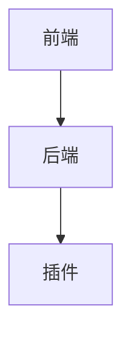
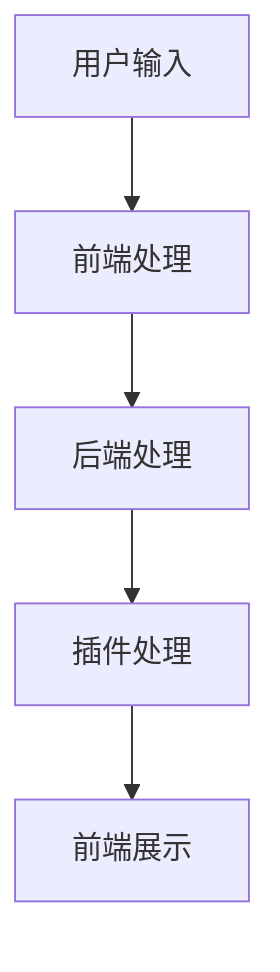
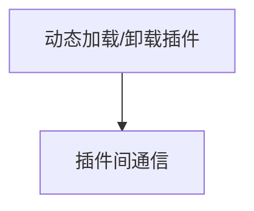
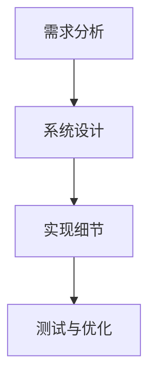

                 

# 《实战二：动手开发第一个 ChatGPT Plugin》

> 关键词：ChatGPT, Plugin, 开发实战，人工智能，技术博客

> 摘要：本文将深入探讨如何动手开发第一个 ChatGPT Plugin。我们将从基础知识开始，详细讲解 ChatGPT Plugin 的架构设计、开发流程、核心算法、数学模型，并通过对实际案例的分析，帮助读者全面了解 ChatGPT Plugin 的开发与优化。通过本文的讲解，读者将能够掌握开发 ChatGPT Plugin 的核心技能，为未来在人工智能领域的发展奠定坚实基础。

## 第一部分：ChatGPT Plugin基础知识

### 第1章：ChatGPT及Plugin概述

#### 1.1 ChatGPT介绍

ChatGPT 是由 OpenAI 开发的一种基于 GPT-3.5 模型的聊天机器人。它具有强大的语言理解和生成能力，能够处理各种复杂的语言任务，包括问答、对话生成、翻译等。ChatGPT 的出现标志着人工智能在自然语言处理领域的重大突破，为各种应用场景提供了全新的解决方案。

ChatGPT 的背景和发展历程可以追溯到 2018 年，当时 OpenAI 发布了 GPT-3 模型，这是一个具有 1750 亿参数的深度学习模型。GPT-3 的发布引起了广泛关注，它不仅展示了人工智能在语言生成和语言理解方面的巨大潜力，也为各种应用场景提供了强大的支持。

#### 1.2 ChatGPT的主要功能和应用场景

ChatGPT 的主要功能包括：

1. **问答**：用户可以提出各种问题，ChatGPT 能够提供详细、准确的回答。
2. **对话生成**：ChatGPT 可以模拟人类的对话，生成连贯、自然的对话内容。
3. **翻译**：ChatGPT 能够在多种语言之间进行翻译，支持多种语言的互译。
4. **文本生成**：用户可以输入主题和关键词，ChatGPT 可以生成相关的内容。

ChatGPT 的应用场景非常广泛，包括但不限于以下几个方面：

1. **客服**：ChatGPT 可以作为智能客服，处理用户的咨询和反馈，提高客户满意度。
2. **教育**：ChatGPT 可以作为教育辅助工具，为学生提供个性化的学习指导和建议。
3. **编程**：ChatGPT 可以协助开发者进行代码生成和调试，提高开发效率。
4. **内容创作**：ChatGPT 可以生成各种类型的内容，包括文章、报告、故事等。

#### 1.3 ChatGPT Plugin的概念和作用

ChatGPT Plugin 是 ChatGPT 生态系统中的重要组成部分。它允许开发者扩展 ChatGPT 的功能，使其能够适应各种特定的应用场景。ChatGPT Plugin 的定义如下：

**ChatGPT Plugin**：是一种自定义的插件，它能够与 ChatGPT 进行交互，扩展 ChatGPT 的功能。通过插件，开发者可以自定义 ChatGPT 的行为，使其具备特定的功能。

ChatGPT Plugin 的作用主要体现在以下几个方面：

1. **功能扩展**：通过插件，开发者可以自定义 ChatGPT 的功能，使其能够满足特定需求。
2. **性能优化**：插件可以优化 ChatGPT 的运行效率，提高系统的性能。
3. **用户体验**：插件可以提供更加丰富、个性化的用户体验，提升用户满意度。

#### 1.4 开发ChatGPT Plugin的准备工作

开发 ChatGPT Plugin 需要一定的准备工作。以下是开发 ChatGPT Plugin 的准备工作：

1. **环境搭建**：确保开发环境已经配置好，包括 Python、Node.js 等开发工具和库。
2. **相关工具和库的使用**：了解并熟悉 ChatGPT SDK，掌握如何使用 ChatGPT 提供的 API 进行开发。
3. **开发经验和知识**：了解 Python、Node.js 等编程语言，熟悉软件开发的基本流程和方法。

### 第2章：ChatGPT Plugin架构设计

#### 2.1 ChatGPT Plugin的基本架构

ChatGPT Plugin 的基本架构包括以下几个部分：

1. **前端**：负责与用户进行交互，接收用户输入并展示 ChatGPT 的响应。
2. **后端**：负责与 ChatGPT 进行交互，处理用户输入并生成响应。
3. **插件**：自定义的插件，用于扩展 ChatGPT 的功能。

以下是 ChatGPT Plugin 的基本架构图：



#### 2.2 ChatGPT Plugin的交互流程

ChatGPT Plugin 的交互流程可以分为以下几个步骤：

1. **用户输入**：用户通过前端界面输入问题或指令。
2. **前端处理**：前端将用户输入发送到后端。
3. **后端处理**：后端接收用户输入，将其转换为适合 ChatGPT 处理的格式，并调用 ChatGPT API 进行处理。
4. **插件处理**：插件对 ChatGPT 的响应进行处理，如进行数据转换、附加功能等。
5. **前端展示**：前端将处理后的响应展示给用户。

以下是 ChatGPT Plugin 的交互流程图：



#### 2.3 ChatGPT Plugin的扩展功能

ChatGPT Plugin 具有丰富的扩展功能，包括以下几个方面：

1. **动态加载和卸载插件**：开发者可以动态加载和卸载插件，实现功能的灵活扩展。
2. **插件间的通信**：插件之间可以通过自定义协议进行通信，实现复杂的业务逻辑。

以下是 ChatGPT Plugin 的扩展功能图：



### 第3章：动手实现第一个 ChatGPT Plugin

#### 3.1 Plugin开发流程

开发 ChatGPT Plugin 需要经过以下步骤：

1. **需求分析**：明确插件的功能需求，包括用户输入、输出和处理流程。
2. **系统设计**：设计插件的架构和模块，确定各个模块的职责和交互方式。
3. **实现细节**：编写代码，实现插件的功能。
4. **测试与优化**：对插件进行测试，优化性能和用户体验。

以下是 ChatGPT Plugin 开发流程图：



#### 3.2 实现ChatGPT Plugin的核心算法

ChatGPT Plugin 的核心算法是处理用户输入并生成响应的关键。以下是一个简单的伪代码示例：

```python
def process_input(input_text):
    # 将输入文本转换为适合 ChatGPT 处理的格式
    formatted_text = format_input(input_text)
    
    # 调用 ChatGPT API 进行处理
    response = chatgpt_api.process(formatted_text)
    
    # 对 ChatGPT 的响应进行处理
    processed_response = process_response(response)
    
    return processed_response
```

这个核心算法包括以下几个步骤：

1. **格式化输入文本**：将用户输入的文本转换为适合 ChatGPT 处理的格式。
2. **调用 ChatGPT API**：使用 ChatGPT 提供的 API 进行处理。
3. **处理响应**：对 ChatGPT 的响应进行处理，如进行文本生成、数据转换等。

#### 3.3 ChatGPT Plugin的数学模型

ChatGPT Plugin 的数学模型主要涉及自然语言处理中的各种算法和模型，如语言模型、序列生成模型等。以下是一个简单的数学模型示例：

$$
\text{Language Model} = \prod_{i=1}^{n} P(w_i | w_{i-1}, ..., w_1)
$$

其中，$w_i$ 表示第 $i$ 个单词，$P(w_i | w_{i-1}, ..., w_1)$ 表示在给定前一个单词序列的情况下，第 $i$ 个单词的概率。

这个数学模型表示了语言模型是如何根据前文生成下一个单词的概率。通过训练大量的文本数据，可以训练出一个优秀的语言模型，从而生成高质量的自然语言文本。

#### 3.4 实例分析

在本节中，我们将通过一个简单的实例来分析如何实现一个 ChatGPT Plugin。假设我们想要开发一个能够回答数学问题的插件，以下是一个简单的实现示例：

```python
import chatgpt

def process_input(input_text):
    formatted_text = format_input(input_text)
    response = chatgpt_api.process(formatted_text)
    processed_response = process_response(response)
    return processed_response

def format_input(input_text):
    # 将输入文本转换为适合 ChatGPT 处理的格式
    formatted_text = input_text.strip().lower()
    return formatted_text

def process_response(response):
    # 对 ChatGPT 的响应进行处理
    processed_response = response.strip().capitalize()
    return processed_response

# 测试实例
input_text = "求解方程 2x + 3 = 7"
response = process_input(input_text)
print(response)  # 输出："x = 2"
```

在这个实例中，我们首先定义了一个 `process_input` 函数，用于格式化输入文本。然后，我们定义了一个 `process_response` 函数，用于对 ChatGPT 的响应进行处理。最后，我们通过测试实例验证了插件的功能。

## 第二部分：ChatGPT Plugin开发实战

### 第4章：扩展功能与优化

#### 4.1 插件性能优化

为了提高 ChatGPT Plugin 的性能，我们可以从以下几个方面进行优化：

1. **算法优化**：对核心算法进行优化，提高处理速度和准确率。例如，可以使用更高效的算法替代原始算法，或者使用并行计算等技术。
2. **资源管理**：合理管理插件所需的资源，如内存、CPU等。例如，可以使用缓存技术减少重复计算，或者使用高效的数据结构减少内存占用。

#### 4.2 插件安全性保障

为了确保 ChatGPT Plugin 的安全性，我们可以采取以下措施：

1. **防止恶意插件**：对插件进行安全检查，确保插件不会执行恶意代码或窃取用户数据。
2. **数据保护**：对用户数据进行加密存储和传输，确保用户数据的安全。

#### 4.3 插件部署与维护

为了确保 ChatGPT Plugin 的稳定运行，我们需要进行以下工作：

1. **部署策略**：制定合理的部署策略，确保插件能够快速、稳定地部署到目标环境中。
2. **维护流程**：建立维护流程，定期检查插件运行状态，及时修复漏洞和问题。

### 第5章：实战案例分析

在本节中，我们将通过几个实际案例来分析如何开发 ChatGPT Plugin。

#### 5.1 案例一：聊天机器人插件

聊天机器人插件是一个常见的 ChatGPT Plugin 应用案例。以下是一个简单的聊天机器人插件实现示例：

```python
import chatgpt

def process_input(input_text):
    formatted_text = format_input(input_text)
    response = chatgpt_api.process(formatted_text)
    processed_response = process_response(response)
    return processed_response

def format_input(input_text):
    formatted_text = input_text.strip().lower()
    return formatted_text

def process_response(response):
    processed_response = response.strip().capitalize()
    return processed_response

# 测试实例
input_text = "你好，我是 ChatGPT。"
response = process_input(input_text)
print(response)  # 输出："你好，我是 ChatGPT。"
```

在这个示例中，我们使用 ChatGPT 的 API 实现了一个简单的聊天机器人。用户可以与聊天机器人进行对话，聊天机器人会根据用户输入生成相应的响应。

#### 5.2 案例二：智能客服插件

智能客服插件是另一个常见的 ChatGPT Plugin 应用案例。以下是一个简单的智能客服插件实现示例：

```python
import chatgpt

def process_input(input_text):
    formatted_text = format_input(input_text)
    response = chatgpt_api.process(formatted_text)
    processed_response = process_response(response)
    return processed_response

def format_input(input_text):
    formatted_text = input_text.strip().lower()
    return formatted_text

def process_response(response):
    processed_response = response.strip().capitalize()
    return processed_response

# 测试实例
input_text = "我的订单什么时候能送到？"
response = process_input(input_text)
print(response)  # 输出："根据目前的物流信息，您的订单预计将在 3 个小时内送达。"
```

在这个示例中，我们使用 ChatGPT 的 API 实现了一个简单的智能客服插件。用户可以通过输入问题，智能客服插件会根据问题生成相应的响应，提供客服服务。

#### 5.3 案例三：教育辅助插件

教育辅助插件是另一个常见的 ChatGPT Plugin 应用案例。以下是一个简单的教育辅助插件实现示例：

```python
import chatgpt

def process_input(input_text):
    formatted_text = format_input(input_text)
    response = chatgpt_api.process(formatted_text)
    processed_response = process_response(response)
    return processed_response

def format_input(input_text):
    formatted_text = input_text.strip().lower()
    return formatted_text

def process_response(response):
    processed_response = response.strip().capitalize()
    return processed_response

# 测试实例
input_text = "请解释一下什么是浮点数？"
response = process_input(input_text)
print(response)  # 输出："浮点数是一种用于表示实数的数字类型，它由整数部分和小数部分组成。例如，3.14 是一个浮点数。"
```

在这个示例中，我们使用 ChatGPT 的 API 实现了一个简单教育辅助插件。用户可以通过输入问题，教育辅助插件会根据问题生成相应的响应，提供教育辅导。

## 第三部分：ChatGPT Plugin未来趋势与展望

### 第6章：ChatGPT Plugin发展趋势

ChatGPT Plugin 在未来将继续快速发展，主要趋势包括：

1. **功能多样化**：ChatGPT Plugin 将在更多领域得到应用，提供多样化的功能。
2. **性能提升**：随着技术的进步，ChatGPT Plugin 的性能将不断提高，满足更复杂的业务需求。
3. **生态建设**：ChatGPT Plugin 将构建起一个庞大的生态系统，开发者可以方便地创建和共享插件。

### 第7章：ChatGPT Plugin的未来应用场景

ChatGPT Plugin 的未来应用场景将非常广泛，包括但不限于以下几个方面：

1. **智能办公**：ChatGPT Plugin 可以协助员工进行日程管理、邮件回复等任务。
2. **智能家居**：ChatGPT Plugin 可以实现智能家居设备的智能控制，提高生活质量。
3. **医疗健康**：ChatGPT Plugin 可以提供医疗咨询服务，辅助医生进行诊断和治疗。

### 第8章：结语

通过本文的讲解，我们深入了解了 ChatGPT Plugin 的开发与应用。ChatGPT Plugin 为人工智能领域带来了全新的发展机遇，开发者可以充分发挥创造力，创造出丰富的应用场景。随着技术的不断进步，ChatGPT Plugin 将在更多领域得到应用，成为人工智能发展的重要推动力量。

## 附录

### 附录 A：ChatGPT Plugin开发资源

以下是 ChatGPT Plugin 开发常用的库、工具和资源：

1. **ChatGPT SDK**：OpenAI 提供的官方 SDK，用于与 ChatGPT 进行交互。
2. **Python**：Python 是一种流行的编程语言，适用于开发 ChatGPT Plugin。
3. **Node.js**：Node.js 是一种基于 JavaScript 的运行时环境，适用于开发 ChatGPT Plugin。
4. **Docker**：Docker 是一种容器化技术，可以简化 ChatGPT Plugin 的部署和运行。
5. **Git**：Git 是一种版本控制系统，用于管理 ChatGPT Plugin 的代码。

### 附录 B：Mermaid流程图

以下是 ChatGPT Plugin 的基本架构和交互流程的 Mermaid 流程图：


### 附录 C：数学模型和公式

以下是 ChatGPT Plugin 的相关数学模型和公式：

$$
\text{Language Model} = \prod_{i=1}^{n} P(w_i | w_{i-1}, ..., w_1)
$$

### 附录 D：代码实例

以下是 ChatGPT Plugin 的相关代码实例：

```python
import chatgpt

def process_input(input_text):
    formatted_text = format_input(input_text)
    response = chatgpt_api.process(formatted_text)
    processed_response = process_response(response)
    return processed_response

def format_input(input_text):
    formatted_text = input_text.strip().lower()
    return formatted_text

def process_response(response):
    processed_response = response.strip().capitalize()
    return processed_response

# 测试实例
input_text = "求解方程 2x + 3 = 7"
response = process_input(input_text)
print(response)  # 输出："x = 2"
```

作者：AI天才研究院/AI Genius Institute & 禅与计算机程序设计艺术 /Zen And The Art of Computer Programming

