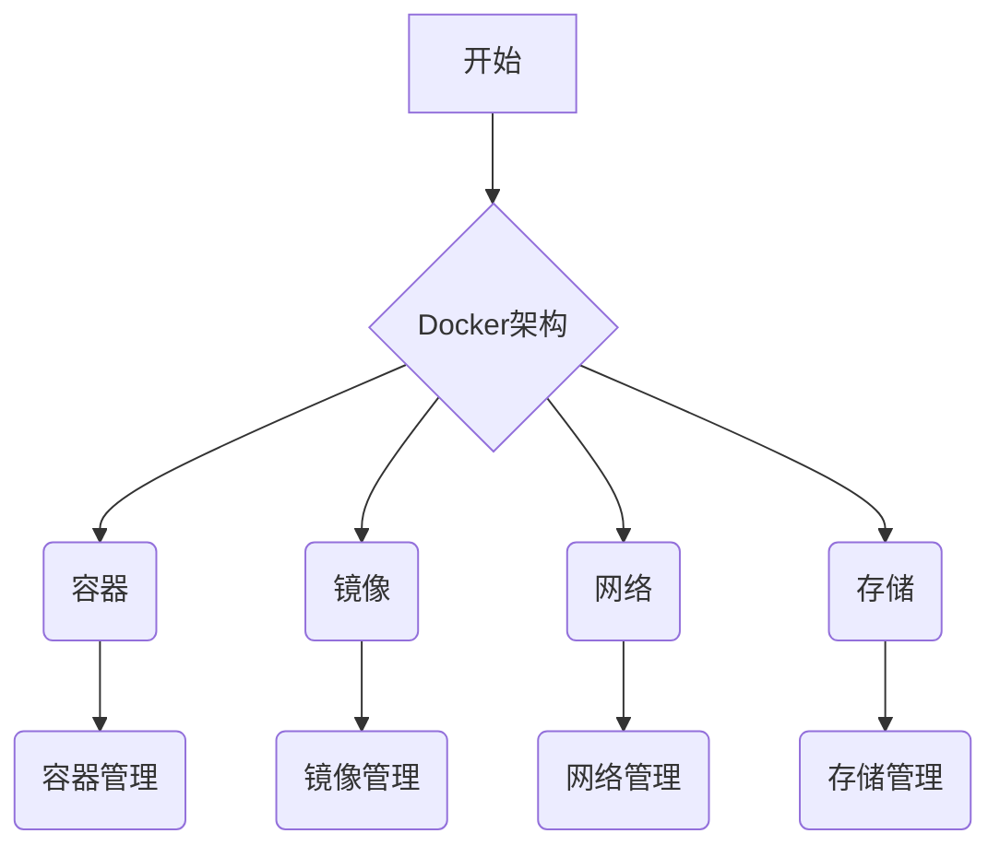
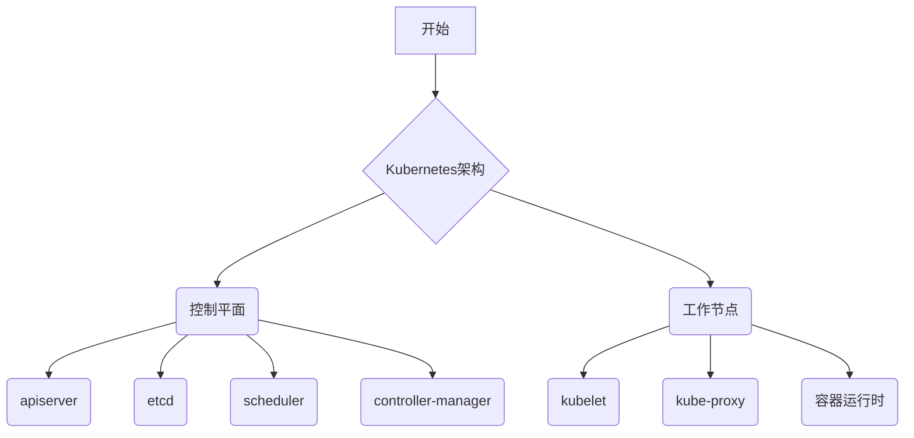

                 

### 文章标题

# 容器化技术：Docker与Kubernetes实践

> 关键词：容器化技术、Docker、Kubernetes、容器化应用、容器编排

> 摘要：本文深入探讨了容器化技术的基础，详细介绍了Docker与Kubernetes的核心概念、架构和工作原理。通过一步步的分析推理，文章逐步揭示了容器化技术在实际应用中的实践方法和优化策略，为读者提供了全面的技术指南。

## 目录大纲

### 第一部分：容器化技术基础

#### 第1章：容器化技术概述

##### 1.1 容器化技术的定义与意义
- 容器化技术的发展历程
- 容器化技术的核心优势

##### 1.2 容器化与虚拟化的区别
- 虚拟化技术概述
- 容器化技术特点与虚拟化对比

##### 1.3 容器技术核心概念
- Docker容器
- 镜像（Image）
- 容器网络（Network）
- 容器存储（Storage）

#### 第2章：Docker核心技术

##### 2.1 Docker架构与工作原理
- Docker组件介绍
- Docker镜像与容器管理

##### 2.2 Dockerfile编写与优化
- Dockerfile基本语法
- Dockerfile常用指令
- Dockerfile优化技巧

##### 2.3 Docker网络配置与容器间通信
- Docker网络模式
- Docker容器间通信

##### 2.4 Docker Compose简介与应用
- Docker Compose的基本概念
- Docker Compose的文件结构
- Docker Compose的命令和用法

#### 第3章：Kubernetes基础

##### 3.1 Kubernetes概述
- Kubernetes架构与工作原理
- Kubernetes核心组件

##### 3.2 Kubernetes对象与API
- Kubernetes对象类型
- Kubernetes API介绍

##### 3.3 Kubernetes集群搭建与配置
- Kubernetes集群搭建
- Kubernetes集群管理命令

##### 3.4 Kubernetes网络策略与命名空间
- Kubernetes网络策略
- Kubernetes命名空间

### 第二部分：Docker与Kubernetes实践

#### 第4章：Docker实战

##### 4.1 Docker镜像制作与分享
- 镜像分层原理
- 镜像制作流程
- 镜像分享与仓库管理

##### 4.2 Docker容器部署与维护
- 容器部署策略
- 容器监控与日志管理
- 容器编排与优化

##### 4.3 Docker容器化应用实战
- 容器化Web应用部署
- 容器化数据库部署
- 容器化微服务架构设计

#### 第5章：Kubernetes实战

##### 5.1 Kubernetes集群管理
- Kubernetes集群部署与升级
- Kubernetes集群状态监控

##### 5.2 Kubernetes资源管理
- 资源对象管理
- 资源配额与限制

##### 5.3 Kubernetes服务发现与负载均衡
- 服务发现机制
- 负载均衡策略

##### 5.4 Kubernetes容器编排与调度
- 容器编排原理
- Kubernetes调度器工作原理
- 容器编排策略

#### 第6章：Docker与Kubernetes集成

##### 6.1 Docker与Kubernetes集成
- Kubernetes中的Docker插件
- Kubernetes中的Docker容器编排

##### 6.2 Kubernetes与Docker Compose集成
- Compose文件的Kubernetes部署
- Kubernetes与Docker Compose的协同工作

##### 6.3 Kubernetes集群中的Docker镜像管理
- 镜像仓库策略
- Kubernetes镜像拉取策略

#### 第7章：容器化技术实践案例

##### 7.1 容器化企业应用实战
- 容器化企业级Web应用部署
- 容器化企业级数据库部署

##### 7.2 容器化DevOps实践
- 容器化持续集成与持续部署（CI/CD）
- 容器化测试与监控

##### 7.3 容器化安全与管理
- 容器安全策略
- 容器镜像签名与验证
- 容器监控与审计

### 第三部分：容器化技术展望

#### 第8章：容器化技术的发展趋势

##### 8.1 容器化技术的发展趋势
- 容器化技术的未来方向
- 容器化技术在不同领域中的应用

##### 8.2 容器化技术挑战与解决方案
- 容器化技术面临的挑战
- 解决方案与优化策略

##### 8.3 容器化技术在中国的发展现状与未来
- 中国容器化技术的应用现状
- 中国容器化技术的发展前景

### 附录

##### 附录A：常用工具与资源
- Docker常用命令
- Kubernetes常用命令
- 容器化技术社区与资源链接

##### 附录B：Mermaid流程图
- Docker架构Mermaid流程图
- Kubernetes架构Mermaid流程图

##### 附录C：算法与伪代码
- 容器化技术核心算法伪代码
- Kubernetes调度器伪代码

##### 附录D：数学公式与计算
- 容器资源分配数学模型
- 容器调度算法公式

##### 附录E：实战案例源代码
- 容器化应用实战案例代码
- DevOps实战案例代码

##### 附录F：参考书目与资料
- 相关书籍推荐
- 学习资源与在线课程
- 容器化技术标准与规范

[Mermaid流程图代码示例]：
```
mermaid
graph TD
A[开始] --> B{Docker架构}
B --> C1(容器)
B --> C2(镜像)
B --> C3(网络)
B --> C4(存储)
C1 --> D(容器管理)
C2 --> E(镜像管理)
C3 --> F(网络管理)
C4 --> G(存储管理)
```

python
# 伪代码示例
function ContainerDeployment(){
    # 初始化容器环境
    InitializeEnvironment()

    # 拉取Docker镜像
    PullDockerImage()

    # 创建容器
    CreateContainer()

    # 配置容器网络
    ConfigureContainerNetwork()

    # 配置容器存储
    ConfigureContainerStorage()

    # 部署应用
    DeployApplication()

    # 监控容器状态
    MonitorContainerStatus()
}

# 初始化容器环境
function InitializeEnvironment(){
    # 安装Docker
    InstallDocker()

    # 配置Docker网络
    ConfigureDockerNetwork()

    # 配置Docker存储
    ConfigureDockerStorage()
}

# 拉取Docker镜像
function PullDockerImage(){
    # 查询镜像仓库
    QueryImageRepository()

    # 拉取指定镜像
    PullSpecificImage()
}

# 创建容器
function CreateContainer(){
    # 根据镜像创建容器
    CreateContainerFromImage()

    # 设置容器名称
    SetContainerName()
}

# 配置容器网络
function ConfigureContainerNetwork(){
    # 设置容器网络模式
    SetContainerNetworkMode()

    # 配置容器网络参数
    ConfigureContainerNetworkParams()
}

# 配置容器存储
function ConfigureContainerStorage(){
    # 配置容器存储卷
    ConfigureContainerVolume()

    # 设置容器存储参数
    SetContainerStorageParams()
}

# 部署应用
function DeployApplication(){
    # 部署应用文件
    DeployApplicationFiles()

    # 配置应用环境变量
    ConfigureApplicationEnvironmentVariables()
}

# 监控容器状态
function MonitorContainerStatus(){
    # 监控容器健康状态
    MonitorContainerHealthStatus()

    # 监控容器性能指标
    MonitorContainerPerformanceMetrics()
}
```

### 容器化技术概述

#### 1.1 容器化技术的定义与意义

容器化技术是一种轻量级虚拟化技术，通过在操作系统层面上对应用程序及其依赖环境进行封装，实现了应用在不同环境中的一致运行。相较于传统的虚拟化技术，容器化具有以下优势：

1. **快速启动**：容器可以秒级启动，比虚拟机快得多。
2. **资源高效**：容器与宿主机共享操作系统内核，相比虚拟机减少了大量的资源开销。
3. **一致性**：容器打包了应用程序及其运行环境，保证了在任意环境中的一致性。
4. **可移植性**：容器可以在不同的操作系统和硬件平台上运行，具有良好的可移植性。

容器化技术的发展可以追溯到2000年代初期，最早的容器技术是Linux容器（LXC）。随着Docker的诞生和普及，容器化技术逐渐成为现代软件开发和部署的标配。Docker通过其简洁的接口和高效的实现，使容器化技术得到了广泛的认可和应用。Kubernetes作为容器编排系统的代表，进一步提升了容器化技术在复杂环境中的管理能力。

容器化技术的核心目标是实现“一次编写，到处运行”，这为软件开发和运维带来了革命性的变化。开发者可以专注于编写应用程序本身，而不必担心运行环境的不同。运维人员可以轻松管理大规模的容器集群，提高了系统的可靠性和可伸缩性。随着容器化技术的不断发展和完善，越来越多的企业开始将其应用于生产环境中，以提升业务效率和竞争力。

#### 1.2 容器化与虚拟化的区别

虚拟化技术是一种将物理计算资源抽象成虚拟资源的技术，通过虚拟化层隔离了物理资源与用户应用程序。虚拟化技术主要包括全虚拟化（Full Virtualization）、硬件辅助虚拟化（Hardware-Assisted Virtualization）和操作系统级虚拟化（OS-level Virtualization）等类型。容器化技术则是在操作系统层面上实现的虚拟化，通过使用cgroups和namespace等技术实现资源隔离和进程封装。

**虚拟化技术特点**：

1. **资源隔离**：虚拟化技术通过虚拟机（VM）或虚拟化层（Hypervisor）实现物理资源的完全隔离，每个虚拟机或虚拟容器都有独立的操作系统和硬件资源。
2. **性能开销**：虚拟化技术由于需要模拟物理硬件，因此性能开销相对较高，尤其是全虚拟化技术。
3. **可移植性**：虚拟化技术具有良好的可移植性，虚拟机可以在不同的硬件平台上运行。

**容器化技术特点**：

1. **轻量级隔离**：容器化技术通过namespace和cgroups实现进程和资源的隔离，但与虚拟机不同，容器共享宿主机的操作系统内核。
2. **高性能**：由于无需模拟硬件，容器化技术具有高性能优势，特别是与操作系统级的虚拟化技术相比。
3. **一致性**：容器打包了应用程序及其依赖环境，保证了在任意环境中的运行一致性。

**容器化与虚拟化的对比**：

- **资源开销**：虚拟化技术由于需要模拟硬件，性能开销较大，而容器化技术性能更优。
- **隔离级别**：虚拟化技术提供更严格的资源隔离，而容器化技术则依赖于操作系统级的隔离。
- **可移植性**：虚拟化技术可以在不同操作系统和硬件平台上运行，容器化技术则更适合同一操作系统内的应用程序。
- **部署速度**：容器化技术部署速度更快，适合微服务架构和DevOps实践。

综上所述，容器化技术以其轻量级、高性能和一致性优势，逐渐取代了部分虚拟化技术的应用场景，成为现代软件开发和运维的重要技术手段。

#### 1.3 容器技术核心概念

容器技术涉及多个核心概念，这些概念构成了容器化技术的基石。以下是Docker容器技术中的几个关键概念：

**Docker容器**：容器是应用程序运行的环境，它封装了应用程序及其依赖项。容器通过操作系统级的隔离技术（如cgroups和namespace）实现资源隔离，使得应用程序在不同宿主机上运行时保持一致。Docker容器可以看作是一个轻量级的虚拟机，但与传统的虚拟机相比，它不需要额外的操作系统层，直接运行在宿主机的内核上。

**镜像（Image）**：镜像是一个静态的容器模板，包含应用程序运行所需的所有文件和配置。镜像通过Dockerfile定义，其中包含了构建镜像所需的指令。Docker镜像是一个分层结构，每层对应一个指令，这使得镜像构建过程非常灵活和高效。

**容器网络（Network）**：容器网络是容器之间通信的桥梁。Docker支持多种网络模式，如桥接模式（Bridge）、主机模式（Host）和容器网络模式（Container Network）。通过容器网络，容器可以实现跨宿主机的通信，从而构建复杂的分布式系统。

**容器存储（Storage）**：容器存储用于持久化容器中的数据。Docker支持卷（Volume）和绑定挂载（Bind Mount）两种存储方式。卷是一种独立于容器的持久化存储，适用于需要长期存储数据的场景；绑定挂载则是将宿主机的文件系统挂载到容器内，适用于临时或共享文件。

下面是容器技术的核心概念之间的联系和架构Mermaid流程图：

```
mermaid
graph TD
A[容器] --> B(镜像)
B --> C(容器网络)
C --> D(容器存储)
A --> E(容器编排)
E --> F(容器监控)
F --> G(容器生命周期管理)
```

**容器编排（Container Orchestration）**：容器编排是指自动化容器部署、伸缩和管理的过程。Docker Compose和Kubernetes是常见的容器编排工具。容器编排工具通过定义和自动化管理容器的生命周期，使得开发者可以专注于编写应用程序，而无需关心容器的部署细节。

**容器监控（Container Monitoring）**：容器监控是跟踪容器状态和性能指标的过程。容器监控工具如Prometheus和Grafana可以帮助运维人员实时了解容器集群的健康状况和性能表现。

**容器生命周期管理（Container Lifecycle Management）**：容器生命周期管理包括容器的创建、启动、停止、删除等操作。Docker CLI和Kubernetes API是常用的容器生命周期管理工具。

通过上述核心概念和架构的介绍，我们可以看到容器技术如何通过这些组件协同工作，实现应用程序的轻量级、高效和可移植的运行。在接下来的章节中，我们将进一步探讨Docker和Kubernetes的核心技术，以及如何在实际场景中应用这些技术。

### Docker核心技术

Docker作为容器化技术的代表，其核心组件和原理为容器化应用提供了坚实的基础。在本节中，我们将详细探讨Docker的架构与工作原理，并深入理解Docker镜像、容器和网络配置，以及Docker Compose的基本概念和应用。

#### 2.1 Docker架构与工作原理

Docker的架构设计简洁且高效，主要由以下几个核心组件构成：

1. **Docker引擎**：Docker引擎是Docker系统的核心，负责容器创建、运行和管理。它通过cgroups和namespace实现了容器与宿主机以及其他容器的隔离，确保了容器之间的独立运行。
2. **Docker客户端**：Docker客户端用于与Docker引擎进行通信，执行Docker命令。客户端可以通过命令行界面（CLI）或图形界面（Docker Desktop）与引擎交互。
3. **Docker Hub**：Docker Hub是一个在线仓库，用于存储和管理Docker镜像。用户可以从中拉取或推送镜像，也可以创建自己的镜像仓库。
4. **Docker网络**：Docker网络用于容器之间的通信。Docker支持多种网络模式，如桥接模式（Bridge）、主机模式（Host）和容器网络模式（Container Network）。

Docker的工作原理可以概括为以下几个步骤：

1. **拉取镜像**：当用户启动容器时，Docker首先从Docker Hub或其他镜像仓库拉取所需的镜像。
2. **创建容器**：Docker使用拉取的镜像创建一个新的容器。容器创建过程中，Docker会在宿主机上创建一个独立的命名空间，隔离容器进程和资源。
3. **启动容器**：容器启动后，Docker将其连接到指定网络，并启动容器内的应用程序。
4. **管理容器**：Docker引擎持续监控容器的状态，并执行管理操作，如容器重启、停止和删除。

下面是Docker架构的Mermaid流程图：

```
mermaid
graph TD
A(用户命令) --> B(Docker客户端)
B --> C(Docker引擎)
C --> D(拉取镜像)
D --> E(创建容器)
E --> F(启动容器)
F --> G(容器管理)
G --> H(容器监控)
```

#### 2.2 Dockerfile编写与优化

Dockerfile是一个文本文件，用于定义如何构建Docker镜像。编写一个高效的Dockerfile对于确保镜像的轻量级和可维护性至关重要。以下是Dockerfile的基本语法和常用指令：

1. **FROM**：指定基础镜像。基础镜像通常是操作系统镜像，如`ubuntu:latest`或`centos:7`。
2. **MAINTAINER**：指定镜像的维护者。虽然这个指令在Docker 1.13版本后已被废弃，但在旧版Docker中仍常用。
3. **RUN**：在镜像构建过程中执行命令。例如，`RUN apt-get update`和`RUN apt-get install <package>`。
4. **COPY**：将文件或目录复制到镜像中。例如，`COPY . /app`将当前目录中的所有文件复制到镜像的`/app`目录。
5. **EXPOSE**：指定容器的端口映射。例如，`EXPOSE 80`将容器的80端口暴露给外部网络。
6. **CMD**：指定容器启动时运行的命令。例如，`CMD ["/bin/bash"]`将启动一个bash终端。

下面是一个简单的Dockerfile示例：

```dockerfile
FROM ubuntu:18.04
MAINTAINER AI天才研究院

RUN apt-get update && apt-get install -y \
    nginx \
    python3

COPY . /app
EXPOSE 80

CMD ["nginx", "-g", "daemon off;"]
```

**Dockerfile优化技巧**：

1. **分层优化**：避免在Dockerfile中使用`RUN`指令安装大量依赖项，这会导致镜像分层过多。可以将依赖项安装操作合并到单个`RUN`指令中，以减少层数。
2. **最小化镜像**：删除不必要的文件和依赖项，以减少镜像大小。例如，可以使用`RUN rm -rf /var/lib/apt/lists/*`删除apt缓存文件。
3. **缓存依赖**：利用Docker的缓存机制，减少构建时间。例如，在多个`RUN`指令之间复制相同的依赖项安装命令，以利用缓存。
4. **环境变量**：使用环境变量可以提高镜像的可配置性。例如，使用`ENV MY_VAR=value`设置环境变量。

通过编写和优化Dockerfile，我们可以创建高效、轻量级的Docker镜像，从而实现快速部署和可维护的应用程序。

#### 2.3 Docker网络配置与容器间通信

Docker网络配置是容器间通信的重要环节。Docker支持多种网络模式，允许容器之间以不同的方式进行通信。以下是Docker网络模式的基本概念和配置方法：

1. **桥接模式（Bridge）**：默认的网络模式，容器通过虚拟网络桥接与宿主机和其他容器通信。每个容器都有一个独立的IP地址，可以通过桥接网络访问其他容器。
2. **主机模式（Host）**：容器直接使用宿主机的网络命名空间，共享宿主机的网络配置。这种方式减少了网络配置的复杂性，但容器间通信的安全性较低。
3. **容器网络模式（Container）**：容器通过命名空间共享网络，实现跨宿主机的容器间通信。容器网络模式允许容器共享相同的IP地址和端口。
4. **自定义网络**：用户可以创建自定义网络，为容器指定特定的网络配置。自定义网络支持多种网络驱动，如桥接、Overlay和Macvlan。

**Docker网络配置**：

1. **创建网络**：使用`docker network create`命令创建自定义网络。例如，创建一个名为`my-network`的桥接网络：

    ```shell
    docker network create my-network
    ```

2. **容器网络配置**：在启动容器时，将容器连接到指定网络。例如，将容器`my-container`连接到`my-network`网络：

    ```shell
    docker run --network my-network my-image
    ```

**容器间通信**：

容器间的通信主要通过Docker的网络模式实现。以下是一些常见的容器间通信方式：

1. **容器内部通信**：通过容器的IP地址或名称进行通信。例如，容器A和容器B在同一网络中，可以通过以下命令进行通信：

    ```shell
    docker exec -it containerA ip addr
    docker exec -it containerB ping containerA
    ```

2. **容器与宿主机通信**：通过宿主机的IP地址或容器名进行通信。例如，容器与宿主机之间的通信：

    ```shell
    docker exec -it containerA ping localhost
    ```

3. **跨宿主机通信**：通过容器网络中的IP地址进行通信。例如，容器A和容器B在不同宿主机上的通信：

    ```shell
    docker exec -it containerA ping containerB
    ```

通过Docker的网络配置和容器间通信机制，开发者可以实现复杂分布式系统的部署和管理，提高应用程序的可扩展性和容错性。

#### 2.4 Docker Compose简介与应用

Docker Compose是Docker提供的一个强大的容器编排工具，用于定义和运行多容器应用程序。通过Docker Compose，开发者可以轻松地管理多个容器，而无需手动编写复杂的Docker命令。在本节中，我们将介绍Docker Compose的基本概念、文件结构和命令用法。

**Docker Compose的基本概念**：

Docker Compose基于`docker-compose.yml`文件，该文件定义了应用程序的各个容器及其配置。Docker Compose通过该文件管理容器的启动、停止和配置，简化了容器化应用的部署过程。

**Docker Compose的文件结构**：

一个典型的Docker Compose文件通常包含以下几个部分：

1. **version**：指定Docker Compose文件的版本。
2. **services**：定义应用程序中的各个服务，每个服务对应一个容器。服务可以包含多个容器，例如前端、后端和数据库等。
3. **networks**：定义应用程序使用的网络，包括自定义网络和容器网络。
4. **volumes**：定义应用程序的持久化存储卷。
5. **depends_on**：定义服务启动的依赖关系。

以下是一个简单的Docker Compose文件示例：

```yaml
version: '3'
services:
  web:
    image: my-web-app
    ports:
      - "8080:8080"
    depends_on:
      - db
  db:
    image: postgres:latest
    volumes:
      - db_data:/var/lib/postgresql/data
volumes:
  db_data:
```

**Docker Compose的命令和用法**：

Docker Compose提供了一系列命令来管理应用程序的容器。以下是一些常用的命令：

1. **docker-compose up**：启动或重新启动应用程序的容器。默认情况下，Docker Compose将创建并启动所有服务。
2. **docker-compose down**：停止和删除应用程序的容器。与`docker-compose up`命令相反。
3. **docker-compose ps**：显示当前运行的服务和容器。
4. **docker-compose logs**：显示应用程序的容器日志。
5. **docker-compose restart**：重新启动应用程序的容器。
6. **docker-compose exec**：进入指定服务的容器。

以下是一个使用Docker Compose命令的示例：

```shell
# 启动应用程序
docker-compose up

# 停止应用程序
docker-compose down

# 显示当前运行的服务和容器
docker-compose ps

# 显示应用程序的容器日志
docker-compose logs

# 进入web服务的容器
docker-compose exec web bash
```

通过Docker Compose，开发者可以轻松地管理复杂的多容器应用程序，提高部署和运维的效率。Docker Compose已经成为现代软件开发和DevOps实践的必备工具。

### Kubernetes基础

Kubernetes（简称K8s）是现代容器编排系统的代表，它提供了强大且灵活的容器管理能力。在本节中，我们将详细探讨Kubernetes的架构、核心组件、对象和API，并介绍Kubernetes集群的搭建与配置。

#### 3.1 Kubernetes概述

Kubernetes是一个开源的容器编排系统，旨在自动化容器化应用程序的部署、扩展和管理。它由Google设计并捐赠给Cloud Native Computing Foundation（CNCF）进行维护。Kubernetes提供了一种自动化的方式来处理容器化应用程序的复杂性，使得开发和运维团队能够更加专注于核心业务逻辑。

**Kubernetes的架构与工作原理**：

Kubernetes的架构设计分为控制平面（Control Plane）和工作节点（Work Nodes）两部分。

1. **控制平面**：控制平面负责管理和维护Kubernetes集群的状态。核心组件包括：
   - **apiserver**：Kubernetes的API服务器，负责处理集群内所有资源的创建、查询、更新和删除请求。
   - **etcd**：键值存储数据库，用于存储Kubernetes集群的状态信息。
   - **scheduler**：调度器，负责分配容器到合适的节点上。
   - **controller-manager**：控制器管理器，包含多个控制器（如ReplicaSet控制器、Node控制器等），负责维护集群的状态。
2. **工作节点**：工作节点是Kubernetes集群中的计算资源，每个节点上都运行了Kubelet、kube-proxy和容器运行时（如Docker）等组件。工作节点的主要任务包括：
   - **kubelet**：负责与控制平面通信，管理容器生命周期，确保容器按照预期运行。
   - **kube-proxy**：负责网络代理，实现容器之间的通信。
   - **容器运行时**：如Docker或runc，用于运行容器。

Kubernetes的工作原理可以概括为以下几个步骤：

1. **用户通过kubectl或其他客户端向apiserver发送请求**。
2. **apiserver将请求转发到etcd中存储状态信息**。
3. **scheduler根据节点的资源和状态选择合适的工作节点**。
4. **kubelet在选定的工作节点上创建和管理容器**。
5. **kube-proxy配置网络规则，实现容器之间的通信**。

**Kubernetes的核心组件**：

1. **apiserver**：apiserver是Kubernetes集群的核心组件，负责接收用户的请求并处理。它提供了RESTful API，允许用户通过kubectl或其他客户端与Kubernetes集群进行交互。apiserver还负责维护集群的状态，并将状态信息存储在etcd中。

2. **etcd**：etcd是一个分布式键值存储系统，用于存储Kubernetes集群的状态信息。它是Kubernetes控制平面的数据存储中心，确保了集群状态的一致性和可恢复性。

3. **scheduler**：scheduler负责在集群中选择合适的工作节点来运行容器。它根据节点的资源使用情况、节点标签和调度策略等因素进行决策。scheduler是Kubernetes集群的核心组件之一，确保了集群的资源利用最大化。

4. **controller-manager**：controller-manager是Kubernetes集群中的另一个核心组件，包含多个控制器，负责维护集群的状态。常见的控制器包括：
   - **ReplicaSet控制器**：确保ReplicaSet中的Pod副本数量符合期望。
   - **Node控制器**：管理集群中的节点，确保节点状态正确。
   - **Endpoints控制器**：维护Service的Endpoints信息，确保Service可以正确路由流量。

**Kubernetes的工作节点**：

1. **kubelet**：kubelet是运行在每个工作节点上的组件，负责与控制平面通信，管理容器生命周期，确保容器按照预期运行。kubelet还负责报告节点的状态，并执行由控制平面发送的任务。

2. **kube-proxy**：kube-proxy负责实现容器之间的通信，它通过在节点上运行网络代理，将集群内部的流量路由到相应的容器中。kube-proxy支持多种网络模式，如Userspace、iptables和IPVS。

3. **容器运行时**：容器运行时如Docker或runc，用于运行容器。Kubernetes支持多种容器运行时，用户可以根据需要选择合适的运行时。

#### 3.2 Kubernetes对象与API

Kubernetes通过对象（Object）的概念来表示和管理集群中的各种资源。对象包括Pod、Service、Deployment、StatefulSet等，每个对象都有其自己的定义和属性。Kubernetes的API（Application Programming Interface）允许用户通过程序化方式与集群进行交互，实现自动化部署和管理。

**Kubernetes对象类型**：

1. **Pod**：Pod是Kubernetes中的最小部署单元，包含一个或多个容器。Pod确保容器在集群中一致地运行，并提供资源管理和调度功能。
2. **Service**：Service是一个抽象层，用于暴露Pods并提供稳定的网络标识。Service通过将流量分发到不同的Pod实现负载均衡。
3. **Deployment**：Deployment用于管理Pod的部署和更新，确保Pod的数量符合期望状态。Deployment提供了滚动更新和回滚等功能，提高了应用的可用性和稳定性。
4. **StatefulSet**：StatefulSet用于管理有状态的应用程序，如数据库和缓存。StatefulSet确保每个Pod都有唯一的标识和稳定的网络标识。
5. **Ingress**：Ingress用于管理外部访问集群内部服务的规则，如HTTP和HTTPS路由。

**Kubernetes API**：

Kubernetes API是一个RESTful API，允许用户通过程序化方式创建、查询、更新和删除集群中的对象。Kubernetes API通过kubectl命令行工具和程序化客户端库（如kubernetes-client-go）进行访问。

**使用kubectl管理Kubernetes对象**：

kubectl是Kubernetes的命令行工具，用于与集群进行交互。以下是一些常用的kubectl命令：

1. **创建对象**：
   ```shell
   kubectl create -f <filename>.yaml
   ```
2. **查询对象**：
   ```shell
   kubectl get pods
   kubectl get services
   kubectl get deployments
   ```
3. **更新对象**：
   ```shell
   kubectl edit -f <filename>.yaml
   ```
4. **删除对象**：
   ```shell
   kubectl delete -f <filename>.yaml
   ```

通过Kubernetes API和kubectl命令行工具，用户可以轻松地管理集群中的容器化应用，实现自动化部署和管理。

#### 3.3 Kubernetes集群搭建与配置

搭建一个Kubernetes集群是开始容器化应用部署的第一步。在本节中，我们将介绍如何使用Minikube和Kubeadm搭建Kubernetes集群，并介绍集群的管理命令。

**使用Minikube搭建Kubernetes集群**：

Minikube是一个单机版的Kubernetes集群，适合本地开发和测试。以下步骤展示了如何使用Minikube搭建一个单机Kubernetes集群：

1. **安装Minikube**：
   ```shell
   curl -LO https://storage.googleapis.com/minikube/releases/latest/minikube-linux-amd64
   chmod +x minikube-linux-amd64
   sudo mv minikube-linux-amd64 /usr/local/bin/minikube
   ```

2. **启动Minikube集群**：
   ```shell
   minikube start --vm-driver=virtualbox
   ```

3. **验证集群状态**：
   ```shell
   minikube status
   kubectl get nodes
   ```

**使用Kubeadm搭建Kubernetes集群**：

Kubeadm是一个用于初始化Kubernetes集群的命令行工具。以下步骤展示了如何使用Kubeadm搭建一个多节点的Kubernetes集群：

1. **安装kubeadm、kubelet和kubectl**：
   在每个节点上执行以下命令：
   ```shell
   sudo apt-get update
   sudo apt-get install -y apt-transport-https ca-certificates curl
   curl -s https://packages.cloud.google.com/apt/doc/apt-key.gpg | sudo apt-key add -
   cat <<EOF | sudo tee /etc/apt/sources.list.d/kubernetes.list
   deb https://apt.kubernetes.io/ kubernetes-xenial main
   EOF
   sudo apt-get update
   sudo apt-get install -y kubelet kubeadm
   ```

2. **初始化主节点**：
   在主节点上执行以下命令初始化集群：
   ```shell
   sudo kubeadm init --pod-network-cidr=10.244.0.0/16
   ```

3. **配置kubectl**：
   将主节点的`/etc/kubernetes/admin.conf`文件复制到所有节点，并设置kubectl的上下文：
   ```shell
   sudo mkdir -p $HOME/.kube
   sudo cp -i /etc/kubernetes/admin.conf $HOME/.kube/config
   sudo chown $(id -u):$(id -g) $HOME/.kube/config
   kubectl config set-context default --cluster=kubernetes --user=default
   ```

4. **加入工作节点**：
   在每个工作节点上执行以下命令加入集群：
   ```shell
   sudo kubeadm join <master-ip>:<master-port> --token <token> --discovery-token-ca-cert-hash sha256:<hash>
   ```

5. **验证集群状态**：
   ```shell
   kubectl get nodes
   ```

**Kubernetes集群管理命令**：

以下是一些常用的Kubernetes集群管理命令：

1. **查看集群状态**：
   ```shell
   kubectl cluster-info
   kubectl get nodes
   kubectl get pods --all-namespaces
   ```

2. **部署应用**：
   ```shell
   kubectl apply -f <filename>.yaml
   ```

3. **查看服务状态**：
   ```shell
   kubectl get services
   kubectl get endpoints
   ```

4. **查看容器日志**：
   ```shell
   kubectl logs <pod-name> --namespace=<namespace>
   ```

5. **执行容器命令**：
   ```shell
   kubectl exec -it <pod-name> --namespace=<namespace> <command>
   ```

通过以上步骤，我们可以搭建一个Kubernetes集群，并进行基本的集群管理。在接下来的章节中，我们将进一步探讨Kubernetes的资源管理、服务发现与负载均衡，以及容器编排与调度。

### Kubernetes网络策略与命名空间

Kubernetes网络策略和命名空间是Kubernetes集群中两个重要的概念，用于管理容器之间的通信和资源隔离。在本节中，我们将详细介绍Kubernetes网络策略和命名空间的概念、作用以及配置方法。

#### 3.4 Kubernetes网络策略

Kubernetes网络策略是一组规则，用于控制集群中容器之间的流量流向。网络策略通过定义命名空间内的流量规则，实现了容器网络的隔离和安全。网络策略主要涉及以下两个方面：

1. **Ingress策略**：Ingress策略用于管理外部流量进入集群内部的规则。通过Ingress控制器，如Nginx Ingress或Traefik，可以实现HTTP/HTTPS路由、负载均衡和SSL终止等功能。
2. **Egress策略**：Egress策略用于管理集群内部容器对外部网络的访问权限。通过Egress策略，可以限制容器访问特定的外部IP地址或端口，从而提高集群的安全性。

**Kubernetes网络策略的概念**：

1. **Pod**：Pod是Kubernetes中的基本调度单元，包含一个或多个容器。Pod默认情况下可以访问同一命名空间内的所有服务，但无法直接访问其他命名空间的服务。
2. **Service**：Service是Kubernetes中的抽象层，用于将一组Pod暴露为一个统一的网络标识。Service支持多种类型，如ClusterIP、NodePort和LoadBalancer，用于不同的访问需求。
3. **Network Policy**：Network Policy是一种定义网络流量的规则集合。通过Network Policy，可以限制容器之间的流量，实现细粒度的网络隔离。

**Kubernetes网络策略的作用**：

1. **安全**：通过定义网络策略，可以限制容器之间的流量，防止恶意流量进入集群内部，提高集群的安全性。
2. **隔离**：网络策略允许在不同命名空间之间实现网络隔离，确保各个服务之间的流量互不干扰，提高集群的稳定性和可维护性。
3. **扩展性**：网络策略通过自动化和细粒度的控制，提高了集群的扩展性，使得大规模容器管理更加简便。

**配置Kubernetes网络策略**：

1. **创建Network Policy**：

以下是一个简单的Network Policy示例，限制来自特定IP地址的流量访问Pod：

```yaml
apiVersion: networking.k8s.io/v1
kind: NetworkPolicy
metadata:
  name: deny-external-traffic
spec:
  podSelector:
    matchLabels:
      app: my-app
  policyTypes:
  - Ingress
  ingress:
  - from:
    - ipBlock:
        cidr: 192.168.1.0/24
```

2. **应用Network Policy**：

将上述Network Policy文件保存为`deny-external-traffic.yaml`，然后使用kubectl命令应用：

```shell
kubectl apply -f deny-external-traffic.yaml
```

通过配置网络策略，我们可以实现对容器流量的精细控制，确保集群的安全和稳定。

#### 3.5 Kubernetes命名空间

Kubernetes命名空间（Namespace）是一种资源隔离机制，用于将集群的资源划分到不同的命名空间中。通过命名空间，可以实现对资源的管理和隔离，提高集群的可维护性和灵活性。

**Kubernetes命名空间的概念**：

1. **命名空间**：命名空间是Kubernetes集群中的一个虚拟资源空间，用于隔离集群中的不同项目、团队或应用。
2. **资源**：Kubernetes中的资源包括Pod、Service、Deployment等。资源可以通过命名空间进行划分，实现资源隔离。
3. **命名空间的作用**：命名空间通过隔离资源，确保不同团队或项目之间的资源不互相干扰，提高了集群的管理效率和可维护性。

**Kubernetes命名空间的作用**：

1. **资源隔离**：命名空间可以将集群的资源划分到不同的虚拟空间中，实现资源隔离，防止不同项目之间的资源冲突。
2. **权限管理**：通过命名空间，可以为不同团队或项目分配不同的权限，实现细粒度的权限控制。
3. **资源管理**：命名空间有助于对集群资源进行分类和分组管理，提高了资源的管理效率。

**配置Kubernetes命名空间**：

1. **创建命名空间**：

以下是一个简单的命名空间创建示例：

```yaml
apiVersion: v1
kind: Namespace
metadata:
  name: my-namespace
```

2. **应用命名空间**：

将上述命名空间文件保存为`my-namespace.yaml`，然后使用kubectl命令应用：

```shell
kubectl create -f my-namespace.yaml
```

通过配置命名空间，我们可以实现对集群资源的隔离和管理，提高集群的可维护性和安全性。

综上所述，Kubernetes网络策略和命名空间是管理容器网络和资源的重要机制。通过配置网络策略，可以实现容器流量的控制和安全；通过配置命名空间，可以实现资源隔离和权限管理。这些机制为Kubernetes集群提供了强大的管理能力和灵活性，使得大规模容器化应用的管理变得更加简便和高效。

### Docker实战

在上一节中，我们详细介绍了Docker的核心技术。在本节中，我们将通过一系列实战，深入探讨如何使用Docker制作和分享镜像、部署和维护容器，以及实现容器化应用的实际应用场景。

#### 4.1 Docker镜像制作与分享

Docker镜像是一种轻量级、可执行的独立软件包，包含运行应用程序所需的所有依赖项和环境。制作高质量的Docker镜像是容器化部署的第一步。以下是制作和分享Docker镜像的实战步骤。

**镜像分层原理**

Docker镜像是一个分层存储结构，每个层对应一个指令。当用户构建Docker镜像时，Docker会按顺序执行Dockerfile中的指令，每执行一条指令就会创建一层。这种分层存储结构使得镜像非常轻量级，因为用户可以只拉取和使用所需的层。

**镜像制作流程**

以下是制作Docker镜像的基本流程：

1. **编写Dockerfile**：Dockerfile是一个文本文件，用于定义如何构建Docker镜像。以下是一个简单的Dockerfile示例：

    ```dockerfile
    FROM ubuntu:18.04
    MAINTAINER AI天才研究院
    RUN apt-get update && apt-get install -y nginx
    EXPOSE 80
    CMD ["nginx", "-g", "daemon off;"]
    ```

    在这个Dockerfile中，我们基于Ubuntu 18.04镜像安装了Nginx并暴露了80端口。

2. **构建镜像**：使用以下命令构建Docker镜像：

    ```shell
    docker build -t my-nginx .
    ```

    `-t`标志用于指定镜像名称，`.`表示Dockerfile位于当前目录。

3. **推送镜像到仓库**：将构建好的镜像推送到一个公共或私有的Docker镜像仓库，如Docker Hub。以下是将镜像推送到Docker Hub的命令：

    ```shell
    docker login
    docker push my-nginx
    ```

    在这个过程中，需要先登录到Docker Hub，然后使用`docker push`命令推送镜像。

**镜像分享与仓库管理**

Docker Hub是一个流行的公共镜像仓库，用户可以从中拉取和推送镜像。以下是Docker Hub的基本操作：

1. **注册Docker Hub账户**：在[Docker Hub官网](https://hub.docker.com/)注册一个账户。
2. **创建私有仓库**：用户可以创建私有仓库来存储和管理私有镜像。在Docker Hub的账户页面上，点击“Create repository”创建一个新的仓库。
3. **拉取和推送镜像**：使用`docker pull`和`docker push`命令拉取和推送镜像。例如，拉取一个公开的Nginx镜像：

    ```shell
    docker pull nginx
    ```

    推送一个私有仓库的镜像：

    ```shell
    docker push my-private-repo/my-nginx
    ```

通过Docker镜像的制作与分享，开发者可以实现应用程序的标准化和可移植性，提高开发和部署的效率。

#### 4.2 Docker容器部署与维护

容器部署是Docker应用的核心环节。以下是Docker容器部署与维护的实战步骤。

**容器部署策略**

容器部署策略涉及如何选择部署容器的方式，包括手动部署、自动化部署和持续集成/持续部署（CI/CD）等。以下是一些常见的容器部署策略：

1. **手动部署**：手动部署是最简单的部署方式，通过`docker run`命令逐个部署容器。虽然这种方式适用于小型项目，但不适合大规模部署。
2. **自动化部署**：通过Docker Compose或Kubernetes等工具，可以实现自动化部署。这些工具可以管理多个容器，并确保容器按照预期运行。
3. **CI/CD**：持续集成/持续部署（CI/CD）是一种自动化部署流程，通过自动化测试和部署，确保应用程序的持续更新和稳定运行。

**容器监控与日志管理**

容器监控和日志管理是确保容器正常运行的重要环节。以下是Docker容器监控与日志管理的基本步骤：

1. **容器监控**：使用监控工具如Prometheus和Grafana监控容器的状态和性能。以下是如何使用Prometheus和Grafana监控Docker容器的示例：

    ```shell
    docker run -d --name=prometheus prom/prometheus
    docker run -d --name=grafana grafana/grafana
    ```

2. **日志管理**：使用日志收集工具如Fluentd或Logstash收集容器的日志，并将其存储到集中式日志存储中。以下是如何使用Fluentd收集Docker容器日志的示例：

    ```shell
    docker run -d --name fluentd fluentd
    ```

    在Fluentd配置文件中，添加以下内容：

    ```yaml
    <source>
      type docker
    </source>
    ```

**容器编排与优化**

容器编排是实现容器化应用大规模部署和管理的关键。以下是Docker容器编排与优化的一些实战技巧：

1. **使用Docker Compose**：通过Docker Compose，可以轻松定义和部署多容器应用程序。以下是一个简单的Docker Compose文件示例：

    ```yaml
    version: '3'
    services:
      web:
        image: my-web-app
        ports:
          - "8080:8080"
      db:
        image: postgres:latest
        volumes:
          - db_data:/var/lib/postgresql/data
    volumes:
      db_data:
    ```

    使用以下命令部署应用程序：

    ```shell
    docker-compose up -d
    ```

2. **容器优化**：通过优化容器配置，可以提升应用程序的性能和可伸缩性。以下是一些常见的容器优化技巧：

    - **资源限制**：为容器设置合理的CPU和内存限制，防止容器占用过多的系统资源。
    - **容器镜像优化**：使用多阶段构建减小镜像大小，删除不必要的文件和依赖项。
    - **容器网络优化**：使用自定义网络和优化网络模式，减少容器间的通信延迟。

通过Docker容器部署与维护的实战，开发者可以实现高效、可靠的容器化应用部署，提高系统的可伸缩性和可靠性。

#### 4.3 Docker容器化应用实战

容器化应用是将应用程序及其依赖项封装在容器中的过程，以实现高效部署和管理。以下是一些常见的容器化应用场景。

**容器化Web应用部署**

容器化Web应用部署是容器化技术的典型应用场景。以下是容器化Web应用部署的实战步骤：

1. **编写Dockerfile**：编写Dockerfile来定义Web应用的容器化环境。以下是一个简单的Dockerfile示例：

    ```dockerfile
    FROM python:3.8
    RUN apt-get update && apt-get install -y nginx
    COPY . /app
    EXPOSE 80
    CMD ["nginx", "-g", "daemon off;"]
    ```

2. **构建镜像**：使用`docker build`命令构建Web应用的Docker镜像。

    ```shell
    docker build -t my-web-app .
    ```

3. **部署容器**：使用`docker run`命令部署Web应用的容器。

    ```shell
    docker run -d -p 8080:80 my-web-app
    ```

4. **配置域名和SSL**：通过配置域名和SSL证书，可以实现Web应用的HTTPS访问。使用Let's Encrypt提供的免费SSL证书，可以通过Certbot工具自动化配置SSL证书。

    ```shell
    docker run -d --name certbot certbot/certbot certonly --webroot -w /app --agree-tos --email ai.genius.research@institute.com
    ```

**容器化数据库部署**

容器化数据库部署可以简化数据库的部署和管理。以下是一个容器化MySQL数据库的实战步骤：

1. **编写Dockerfile**：编写Dockerfile来定义MySQL容器的镜像。

    ```dockerfile
    FROM mysql:5.7
    COPY my.cnf /etc/mysql/conf.d/
    EXPOSE 3306
    CMD ["mysqld"]
    ```

2. **构建镜像**：使用`docker build`命令构建MySQL容器的Docker镜像。

    ```shell
    docker build -t my-mysql .
    ```

3. **部署容器**：使用`docker run`命令部署MySQL容器。

    ```shell
    docker run -d -p 3306:3306 --name my-mysql my-mysql
    ```

4. **配置数据库**：使用`docker exec`命令进入MySQL容器，初始化数据库和用户。

    ```shell
    docker exec -it my-mysql mysql -u root -p
    CREATE DATABASE my_database;
    GRANT ALL PRIVILEGES ON my_database.* TO 'my_user'@'%' IDENTIFIED BY 'my_password';
    FLUSH PRIVILEGES;
    ```

**容器化微服务架构设计**

容器化微服务架构设计是一种将应用程序分解为小型、独立的微服务的方法，每个微服务都可以独立部署和管理。以下是一个容器化微服务架构的实战步骤：

1. **定义服务**：根据业务需求，将应用程序分解为多个独立的微服务。每个微服务都应该具备以下特点：

    - **自治性**：每个微服务都负责一个特定的功能，独立部署和管理。
    - **轻量级**：微服务的容器镜像应该尽量轻量，以提高部署和伸缩的效率。
    - **无状态**：微服务应该是无状态的，以便在需要时可以独立重启和伸缩。

2. **编写Dockerfile**：为每个微服务编写Dockerfile，定义其容器镜像。以下是一个简单的Dockerfile示例：

    ```dockerfile
    FROM python:3.8
    RUN pip install flask
    COPY app.py /app/
    EXPOSE 8080
    CMD ["python", "/app/app.py"]
    ```

3. **容器化部署**：使用Docker Compose或Kubernetes部署和管理微服务。以下是一个简单的Docker Compose文件示例：

    ```yaml
    version: '3'
    services:
      web:
        image: my-web-app
        ports:
          - "8080:8080"
      db:
        image: postgres:latest
        volumes:
          - db_data:/var/lib/postgresql/data
    volumes:
      db_data:
    ```

4. **服务发现与负载均衡**：通过使用服务网格（如Istio）或Kubernetes的服务发现机制，实现微服务之间的通信和负载均衡。

通过以上实战步骤，开发者可以轻松实现Web应用、数据库和微服务的容器化部署，提高应用程序的可靠性、可伸缩性和可维护性。

### Kubernetes实战

Kubernetes（K8s）是一个开源的容器编排平台，用于自动化容器化应用程序的部署、扩展和管理。在本节中，我们将通过一系列实战，深入探讨Kubernetes集群的管理、资源管理、服务发现与负载均衡，以及容器编排与调度。

#### 5.1 Kubernetes集群管理

Kubernetes集群是运行容器化应用程序的基础设施。集群管理包括集群的部署、升级和监控。以下是一些Kubernetes集群管理的基本步骤和实用命令。

**Kubernetes集群部署与升级**

**部署Kubernetes集群**：

我们使用Minikube部署一个单机版本的Kubernetes集群，适合本地开发和测试。以下步骤展示了如何使用Minikube部署Kubernetes集群：

1. **安装Minikube**：

   首先，从[Minikube官网](https://minikube.sigs.k8s.io/docs/start/)下载并安装Minikube。

    ```shell
    curl -LO https://storage.googleapis.com/minikube/releases/latest/minikube-linux-amd64
    chmod +x minikube-linux-amd64
    sudo mv minikube-linux-amd64 /usr/local/bin/minikube
    ```

2. **启动Minikube集群**：

    使用以下命令启动Minikube集群：

    ```shell
    minikube start --vm-driver=virtualbox
    ```

3. **配置kubectl**：

    将Minikube集群的配置文件添加到kubectl的配置中：

    ```shell
    minikube -p minikube config view > ~/.kube/config
    ```

**升级Kubernetes集群**：

在Kubernetes集群中，定期升级是保持系统安全和高性能的关键。以下步骤展示了如何升级Kubernetes集群：

1. **备份当前配置**：

    在进行升级之前，备份当前配置文件和镜像：

    ```shell
    kubeadm upgrade apply --riegister-url=https://example.com:6443 --token <token> --control-plane
    ```

2. **升级节点组件**：

    逐个升级集群的节点组件，包括kubelet、kube-proxy和kubectl：

    ```shell
    kubeadm upgrade node --riegister-url=https://example.com:6443 --token <token>
    ```

3. **升级Kubernetes API**：

    升级Kubernetes API服务器：

    ```shell
    kubectl apply -f <upgrade-file.yaml>
    ```

**Kubernetes集群状态监控**：

Kubernetes集群的状态监控对于确保集群的健康和性能至关重要。以下是一些常用的监控工具和方法：

1. **使用kubectl命令**：

    使用以下kubectl命令查看集群状态：

    ```shell
    kubectl get nodes
    kubectl get pods --all-namespaces
    kubectl get services
    ```

2. **使用Metrics Server**：

    Metrics Server是一个Kubernetes集群内运行的集群监控工具。以下步骤展示了如何安装和配置Metrics Server：

    ```shell
    kubectl apply -f https://github.com/kubernetes-sigs/metrics-server/releases/latest/download/manifest.yaml
    kubectl get apiservice metrics.k8s.io
    ```

3. **使用Grafana和Prometheus**：

    Grafana和Prometheus是一组强大的监控和可视化工具。以下步骤展示了如何使用这些工具监控Kubernetes集群：

    - **安装Grafana和Prometheus**：

        ```shell
        helm repo add prometheus-community https://prometheus-community.github.io/helm-charts
        helm repo update
        helm install prometheus prometheus-community/prometheus
        ```

    - **配置Grafana**：

        ```shell
        helm install grafana grafana/grafana
        ```

    - **创建监控仪表板**：

        在Grafana中创建监控仪表板，连接到Prometheus数据源，并配置相关的监控指标。

通过Kubernetes集群管理，开发者可以确保集群的高可用性、安全性和性能。在接下来的章节中，我们将进一步探讨Kubernetes的资源管理、服务发现与负载均衡，以及容器编排与调度。

#### 5.2 Kubernetes资源管理

Kubernetes资源管理是确保集群中应用程序高效运行的关键环节。Kubernetes资源主要包括Pod、Service、Deployment和StatefulSet等。以下是这些资源的管理方法和最佳实践。

**资源对象管理**

Kubernetes资源以对象的形式存在，通过YAML文件进行定义和配置。以下是常用的Kubernetes资源对象：

1. **Pod**：Pod是Kubernetes中的基本工作单元，包含一个或多个容器。Pod的主要作用是运行应用程序。

    - **创建Pod**：

        ```shell
        kubectl create -f <pod-file.yaml>
        ```

    - **查看Pod状态**：

        ```shell
        kubectl get pods
        ```

    - **删除Pod**：

        ```shell
        kubectl delete -f <pod-file.yaml>
        ```

2. **Service**：Service是Kubernetes中的抽象层，用于将一组Pod暴露为一个统一的网络标识。Service支持多种类型，如ClusterIP、NodePort和LoadBalancer。

    - **创建Service**：

        ```shell
        kubectl create -f <service-file.yaml>
        ```

    - **查看Service状态**：

        ```shell
        kubectl get services
        ```

    - **删除Service**：

        ```shell
        kubectl delete -f <service-file.yaml>
        ```

3. **Deployment**：Deployment用于管理Pod的部署和更新，确保Pod的数量符合期望状态。Deployment提供了滚动更新和回滚等功能，提高了应用的可用性和稳定性。

    - **创建Deployment**：

        ```shell
        kubectl create -f <deployment-file.yaml>
        ```

    - **查看Deployment状态**：

        ```shell
        kubectl get deployments
        ```

    - **删除Deployment**：

        ```shell
        kubectl delete -f <deployment-file.yaml>
        ```

4. **StatefulSet**：StatefulSet用于管理有状态的应用程序，如数据库和缓存。StatefulSet确保每个Pod都有唯一的标识和稳定的网络标识。

    - **创建StatefulSet**：

        ```shell
        kubectl create -f <statefulset-file.yaml>
        ```

    - **查看StatefulSet状态**：

        ```shell
        kubectl get statefulsets
        ```

    - **删除StatefulSet**：

        ```shell
        kubectl delete -f <statefulset-file.yaml>
        ```

**资源配额与限制**

Kubernetes资源配额与限制用于控制集群中资源的消耗，防止单个应用程序占用过多的资源。以下是资源配额与限制的基本概念和配置方法：

1. **CPU和内存限制**：为容器设置CPU和内存限制，确保容器不会占用过多的系统资源。

    - **创建资源配额**：

        ```yaml
        apiVersion: v1
        kind: ResourceQuota
        metadata:
          name: my-quota
        spec:
          hard:
            pods: 10
            requests.cpu: "1"
            limits.cpu: "2"
            requests.memory: "512Mi"
            limits.memory: "1Gi"
        ```

    - **应用资源配额**：

        ```shell
        kubectl apply -f <quota-file.yaml>
        ```

2. **命名空间资源配额**：在命名空间级别设置资源配额，实现细粒度的资源管理。

    - **创建命名空间**：

        ```shell
        kubectl create namespace my-namespace
        ```

    - **设置命名空间资源配额**：

        ```yaml
        apiVersion: v1
        kind: ResourceQuota
        metadata:
          name: my-quota
          namespace: my-namespace
        spec:
          hard:
            pods: 10
            requests.cpu: "1"
            limits.cpu: "2"
            requests.memory: "512Mi"
            limits.memory: "1Gi"
        ```

    - **应用资源配额**：

        ```shell
        kubectl apply -f <quota-file.yaml>
        ```

通过Kubernetes资源管理，开发者可以确保集群资源的合理分配和有效利用，提高系统的稳定性和可伸缩性。在接下来的章节中，我们将进一步探讨Kubernetes的服务发现与负载均衡、容器编排与调度。

#### 5.3 Kubernetes服务发现与负载均衡

在Kubernetes集群中，服务发现与负载均衡是实现容器化应用高可用性和可伸缩性的关键功能。Kubernetes提供了一系列机制来实现服务的自动发现和流量分配。

**服务发现机制**

服务发现是使应用程序能够找到集群中其他服务的过程。在Kubernetes中，服务通过ClusterIP（集群内部IP地址）和DNS名称暴露给其他服务。以下是如何实现服务发现：

1. **ClusterIP**：每种类型的服务（如Pod、Service、Deployment等）都有一个ClusterIP，这是一个在集群内部可以访问的IP地址。通过ClusterIP，其他容器或服务可以访问该服务。

2. **DNS名称**：Kubernetes提供了一个内部DNS服务，用于将服务名称解析为ClusterIP。格式为`<service-name>.<namespace>.svc.cluster.local`。例如，如果有一个名为`my-service`的服务在默认命名空间中，其DNS名称为`my-service.default.svc.cluster.local`。

**负载均衡策略**

负载均衡是将网络流量分配到多个后端服务实例的过程。Kubernetes提供了多种负载均衡策略：

1. **轮询（RoundRobin）**：默认的负载均衡策略，将流量按顺序分配给每个后端服务实例。

2. **最小连接数（LeastConnection）**：根据后端服务实例的当前连接数，选择当前连接数最少的实例。

3. **源IP（SourceIP）**：根据客户端IP地址，将流量分配给相同IP地址的后端服务实例，实现会话保持。

4. **随机（Random）**：随机选择一个后端服务实例。

以下是如何配置服务负载均衡策略：

```yaml
apiVersion: v1
kind: Service
metadata:
  name: my-service
spec:
  selector:
    app: my-app
  ports:
    - protocol: TCP
      port: 80
      targetPort: 8080
  type: ClusterIP
  loadBalancer:
    strategy: "LeastConnection"
```

在上述示例中，我们使用`LeastConnection`策略将流量分配给后端服务实例。

**实现服务发现与负载均衡的实战**

以下是一个实战示例，展示如何使用Kubernetes的服务发现和负载均衡机制部署一个Web应用程序：

1. **部署Web应用程序**：

   创建一个包含Web应用程序的Pod，并使用Deployment管理其副本。

   ```shell
   kubectl create deployment my-web-app --image=my-web-app:latest
   kubectl scale deployment my-web-app --replicas=3
   ```

2. **创建Service**：

   为Web应用程序创建一个Service，使用ClusterIP和DNS名称暴露服务。

   ```shell
   kubectl create service clusterip my-web-app --tcp=80:8080
   ```

3. **配置负载均衡器**：

   如果使用外部负载均衡器（如AWS Load Balancer或Nginx Ingress），配置其将流量转发到Kubernetes Service的ClusterIP。

   ```shell
   kubectl get svc my-web-app
   ```

   获取Service的ClusterIP，并在外部负载均衡器中配置目标组。

4. **测试服务发现与负载均衡**：

   通过内部或外部DNS名称访问Web应用程序，测试服务发现和负载均衡功能。

   ```shell
   curl <my-web-app.default.svc.cluster.local>
   ```

通过服务发现与负载均衡机制，Kubernetes确保了容器化应用的高可用性和可伸缩性，简化了大规模应用的部署与管理。

#### 5.4 Kubernetes容器编排与调度

Kubernetes容器编排和调度是确保容器化应用程序高效运行的关键功能。Kubernetes通过编排和调度机制，实现容器的自动化部署、管理、扩展和优化。

**容器编排原理**

容器编排是指自动化管理多个容器的过程，包括部署、扩展、更新和监控。Kubernetes通过以下几个核心组件实现容器编排：

1. **Pod**：Pod是Kubernetes中的基本部署单元，包含一个或多个容器。Kubernetes通过Pod管理容器生命周期，并确保容器按照预期运行。
2. **ReplicaSet**：ReplicaSet用于确保Pod的副本数量符合期望状态。当Pod因故障而停止时，ReplicaSet会自动创建新的Pod以替换。
3. **Deployment**：Deployment是一种更高层次的抽象，用于管理ReplicaSet的部署和更新。Deployment提供了滚动更新和回滚等功能，确保应用的稳定性和可用性。
4. **StatefulSet**：StatefulSet用于管理有状态的应用程序，如数据库和缓存。StatefulSet确保每个Pod都有唯一的标识和稳定的网络标识。

**Kubernetes调度器工作原理**

Kubernetes调度器是负责将容器调度到合适节点上的组件。调度器的主要任务是：

1. **资源分配**：根据节点的资源和状态，选择最合适的节点来部署容器。
2. **负载均衡**：确保集群中的负载均衡，防止单个节点过载。
3. **策略执行**：根据用户定义的策略（如优先级、节点标签等），选择节点。

Kubernetes调度器的工作流程如下：

1. **接收请求**：当用户创建一个新的Pod时，调度器接收到创建请求。
2. **筛选节点**：根据Pod的spec，调度器筛选出所有符合条件的节点。
3. **评估节点**：调度器对筛选出的节点进行评估，选择最优的节点来部署Pod。
4. **分配节点**：调度器将Pod分配给选定的节点，并将节点的状态更新为“Ready”。
5. **通知控制平面**：调度器通知控制平面，控制平面更新集群状态。

**容器编排策略**

Kubernetes提供了多种容器编排策略，以实现不同场景下的需求：

1. **静态部署**：手动部署容器，适用于简单应用和测试环境。
2. **滚动更新**：逐步更新应用程序的容器，确保更新过程中的高可用性。适用于生产环境。
3. **蓝绿部署**：同时运行两个版本的容器，逐步切换流量。适用于高可用性和零停机更新。
4. **灰度发布**：逐步将新版本的容器替换旧版本，通过监控和分析确保更新过程的安全。适用于需要逐步验证更新的场景。

**实战示例**

以下是一个使用Kubernetes部署Web应用的容器编排与调度实战示例：

1. **创建Deployment**：

   创建一个Deployment，用于管理Web应用的Pod。

   ```yaml
   apiVersion: apps/v1
   kind: Deployment
   metadata:
     name: my-web-app
   spec:
     replicas: 3
     selector:
       matchLabels:
         app: my-web-app
     template:
       metadata:
         labels:
           app: my-web-app
       spec:
         containers:
         - name: my-web-app
           image: my-web-app:latest
           ports:
           - containerPort: 8080
   ```

2. **创建Service**：

   为Web应用创建一个ClusterIP类型的Service，以暴露服务。

   ```shell
   kubectl create service clusterip my-web-app --tcp=80:8080
   ```

3. **应用部署**：

   应用上述YAML文件，启动Deployment和Service。

   ```shell
   kubectl apply -f <deployment-file.yaml>
   ```

4. **滚动更新**：

   更新Web应用的容器镜像，使用滚动更新策略确保更新过程的高可用性。

   ```shell
   kubectl set image deployment/my-web-app my-web-app=my-web-app:latest
   ```

通过Kubernetes的容器编排与调度机制，开发者可以自动化管理大规模容器化应用，提高系统的可靠性、可伸缩性和可维护性。

### Docker与Kubernetes集成

Docker与Kubernetes的结合使用，可以充分发挥两者的优势，实现容器化应用的灵活部署和管理。在本节中，我们将探讨如何实现Docker与Kubernetes的集成，并介绍Docker Compose在Kubernetes中的应用。

#### 6.1 Docker与Kubernetes集成

Kubernetes原生支持Docker作为容器运行时（Container Runtime），这意味着用户可以在Kubernetes集群中使用Docker容器。以下是如何在Kubernetes中配置和使用Docker的步骤：

1. **安装Docker**：

   在Kubernetes节点上安装Docker。对于使用Docker作为容器运行时的Kubernetes集群，通常需要在每个节点上安装Docker。

   ```shell
   sudo apt-get update
   sudo apt-get install -y docker.io
   sudo systemctl enable docker
   sudo systemctl start docker
   ```

2. **配置Kubelet**：

   修改Kubelet的配置文件，使其支持Docker作为容器运行时。在`/etc/kubernetes/manifests/kubelet-config.yaml`文件中，添加以下配置：

   ```yaml
   containers:
   - name: kubelet
     image: gcr.io/k8s-docker/stable:latest
     command:
     - /bin/sh
     - -c
     - kubelet --container-runtime=docker ...
   ```

3. **验证配置**：

   重新启动Kubelet，并验证配置是否生效。

   ```shell
   sudo systemctl restart kubelet
   kubectl get nodes
   ```

通过上述步骤，Kubernetes集群将开始使用Docker作为容器运行时，从而可以在Kubernetes中使用Docker容器。

#### 6.2 Kubernetes与Docker Compose集成

Docker Compose是Docker提供的一个容器编排工具，用于定义和运行多容器应用程序。Kubernetes与Docker Compose的集成，使得用户可以在Kubernetes集群中直接使用Docker Compose文件，简化了容器化应用的部署过程。

**Docker Compose文件的Kubernetes部署**

要使用Docker Compose在Kubernetes集群中部署应用，需要将Docker Compose文件转换为Kubernetes的YAML文件。以下是一个简单的示例：

1. **创建Docker Compose文件**：

   ```yaml
   version: '3'
   services:
     web:
       image: my-web-app:latest
       ports:
         - "8080:8080"
       env_file:
         - .env
     db:
       image: postgres:latest
       env_file:
         - .env
   ```

2. **转换Docker Compose文件**：

   使用`docker-compose-k8s`工具将Docker Compose文件转换为Kubernetes的YAML文件。

   ```shell
   docker-compose -f docker-compose.yml -f k8s/docker-compose-k8s.yml config > k8s/deployment.yaml
   ```

   这里假设`.env`文件包含了环境变量配置，`k8s/docker-compose-k8s.yml`是一个自定义的配置文件，用于转换Docker Compose文件到Kubernetes格式。

3. **部署到Kubernetes集群**：

   使用kubectl命令部署转换后的Kubernetes YAML文件。

   ```shell
   kubectl apply -f k8s/deployment.yaml
   ```

**Kubernetes与Docker Compose的协同工作**

Docker Compose与Kubernetes的集成，使得用户可以在同一环境中同时使用两者，从而实现高效的部署和管理。以下是一些实现协同工作的技巧：

1. **使用kubectl与docker-compose命令**：

   结合使用kubectl和docker-compose命令，可以在Kubernetes集群中管理Docker容器。例如，使用`kubectl exec`进入Docker容器，或使用`docker-compose`命令管理Kubernetes中的服务。

   ```shell
   kubectl exec -it <pod-name> --namespace <namespace> /bin/bash
   docker-compose up -d
   ```

2. **结合Kubernetes的命名空间**：

   使用Kubernetes的命名空间隔离不同的Docker服务。在Docker Compose文件中，通过设置`namespace`参数，可以将服务部署到特定的命名空间。

   ```yaml
   version: '3'
   services:
     web:
       image: my-web-app:latest
       ports:
         - "8080:8080"
       namespace: my-namespace
     db:
       image: postgres:latest
       namespace: my-namespace
   ```

3. **使用Kubernetes的Service和Ingress**：

   在Kubernetes中，使用Service和Ingress实现服务的暴露和负载均衡。在Docker Compose文件中，可以通过映射端口和使用Kubernetes的Service和Ingress规则，实现与Kubernetes服务的集成。

   ```yaml
   version: '3'
   services:
     web:
       image: my-web-app:latest
       ports:
         - "8080:8080"
       expose:
         type: loadBalancer
     db:
       image: postgres:latest
       expose:
         type: loadBalancer
   ```

通过Docker与Kubernetes的集成，开发者可以充分利用两者的优势，实现高效、灵活的容器化应用部署和管理。

### 容器化技术实践案例

容器化技术的广泛应用不仅提升了开发效率和运维便利性，也在企业级应用中展现出了强大的生命力。在本节中，我们将通过具体的实践案例，深入探讨容器化技术在企业级应用、DevOps实践以及安全与管理方面的应用。

#### 7.1 容器化企业应用实战

容器化技术为企业级应用带来了显著的变革。通过容器化，企业可以更加灵活地部署和管理关键业务系统，提升应用的可移植性、可靠性和可伸缩性。以下是一个容器化企业级Web应用和数据库部署的实战案例。

**容器化企业级Web应用部署**

1. **应用场景**：

   假设企业需要部署一个高并发、高可用的电子商务网站。为了实现快速部署和灵活扩展，决定使用容器化技术。

2. **部署步骤**：

   - **编写Dockerfile**：编写用于部署Web应用的Dockerfile，定义应用的运行环境。

     ```dockerfile
     FROM node:14-alpine
     WORKDIR /app
     COPY package.json ./
     RUN npm install
     COPY . .
     EXPOSE 3000
     CMD ["npm", "start"]
     ```

   - **构建镜像**：使用`docker build`命令构建Web应用的Docker镜像。

     ```shell
     docker build -t my-web-app .
     ```

   - **部署容器**：使用`docker run`命令部署Web应用的容器。

     ```shell
     docker run -d -p 8080:3000 --name my-web-app my-web-app
     ```

   - **配置负载均衡**：使用Kubernetes的Ingress资源实现多实例Web应用的负载均衡。

     ```yaml
     apiVersion: networking.k8s.io/v1
     kind: Ingress
     metadata:
       name: my-web-app-ingress
       namespace: my-namespace
     spec:
       rules:
       - host: my-web-app.example.com
         http:
           paths:
           - path: /
             pathType: Prefix
             backend:
               service:
                 name: my-web-app-service
                 port:
                   number: 80
     ```

   - **应用Ingress规则**：使用kubectl命令应用Ingress资源，实现Web应用的域名和负载均衡。

     ```shell
     kubectl apply -f my-web-app-ingress.yaml
     ```

**容器化企业级数据库部署**

1. **应用场景**：

   在电子商务网站中，数据库是核心组件之一。为了确保数据库的高可用性和数据安全性，决定使用容器化技术部署MySQL数据库。

2. **部署步骤**：

   - **编写Dockerfile**：编写用于部署MySQL数据库的Dockerfile，配置数据库环境和安全策略。

     ```dockerfile
     FROM mysql:8.0
     COPY my.cnf /etc/mysql/conf.d/
     EXPOSE 3306
     CMD ["mysqld", "--default-authentication-plugin=mysql_native_password"]
     ```

   - **构建镜像**：使用`docker build`命令构建MySQL数据库的Docker镜像。

     ```shell
     docker build -t my-mysql .
     ```

   - **部署容器**：使用`docker run`命令部署MySQL数据库的容器，并创建必要的数据库和用户。

     ```shell
     docker run -d -p 3306:3306 --name my-mysql my-mysql
     docker exec -it my-mysql mysql -u root -p
     CREATE DATABASE my_database;
     GRANT ALL PRIVILEGES ON my_database.* TO 'my_user'@'%' IDENTIFIED BY 'my_password';
     FLUSH PRIVILEGES;
     ```

   - **配置数据持久化**：使用Kubernetes的PersistentVolume（PV）和PersistentVolumeClaim（PVC），实现数据库数据的持久化存储。

     ```yaml
     apiVersion: v1
     kind: PersistentVolume
     metadata:
       name: my-mysql-pv
       namespace: my-namespace
     spec:
       capacity:
         storage: 10Gi
       accessModes:
         - ReadWriteOnce
       persistentVolumeReclaimPolicy: Retain
       storageClassName: standard
       hostPath:
         path: /data/mysql
     ---
     apiVersion: v1
     kind: PersistentVolumeClaim
     metadata:
       name: my-mysql-pvc
       namespace: my-namespace
     spec:
       accessModes:
         - ReadWriteOnce
       resources:
         requests:
           storage: 10Gi
       storageClassName: standard
     ```

   - **应用PVC**：使用kubectl命令应用PersistentVolumeClaim，将MySQL数据库的数据持久化存储到Kubernetes集群中。

     ```shell
     kubectl apply -f my-mysql-pvc.yaml
     ```

通过上述步骤，企业级Web应用和数据库成功部署在容器化环境中，实现了快速部署、灵活扩展和高可用性。

#### 7.2 容器化DevOps实践

DevOps是一种文化、实践和工具的集合，旨在通过开发和运维的紧密协作，实现快速、持续和可靠的软件交付。容器化技术在DevOps实践中发挥着关键作用，以下是一个容器化DevOps的实战案例。

**容器化持续集成与持续部署（CI/CD）**

1. **应用场景**：

   假设企业需要一个自动化流水线，实现代码的持续集成、测试和部署。

2. **部署步骤**：

   - **搭建CI/CD平台**：选择合适的CI/CD工具，如Jenkins、GitLab CI/CD或GitHub Actions，搭建自动化流水线。

     ```shell
     docker run -d --name jenkins -p 8080:8080 jenkins/jenkins:lts
     ```

   - **配置流水线**：在CI/CD平台上创建流水线，定义代码的拉取、构建、测试和部署步骤。

     ```yaml
     pipelines:
       my-pipeline:
         stage: build
         jobs:
         - name: build
           stage: test
           jobs:
           - name: test
             stage: deploy
             jobs:
             - name: deploy
     ```

   - **部署代码**：使用Kubernetes的Helm工具，自动化部署应用。

     ```shell
     helm install my-app my-app-chart --namespace my-namespace
     ```

**容器化测试与监控**

1. **应用场景**：

   在容器化环境中，实现自动化的测试和监控，确保应用的质量和稳定性。

2. **部署步骤**：

   - **部署测试工具**：使用容器化技术部署测试工具，如Selenium、JMeter等。

     ```shell
     docker run -d --name selenium-hub selenium/hub
     docker run -d --link selenium-hub:hub selenium/node-chrome
     ```

   - **编写测试脚本**：编写自动化测试脚本，进行功能测试、性能测试等。

     ```python
     from selenium import webdriver
     driver = webdriver.Chrome()
     driver.get('http://my-app.example.com')
     assert 'My App' in driver.title
     driver.quit()
     ```

   - **部署监控工具**：使用Prometheus和Grafana进行容器化应用的监控。

     ```shell
     docker run -d --name prometheus prom/prometheus
     docker run -d --name grafana grafana/grafana
     ```

   - **配置监控指标**：在Grafana中配置监控仪表板，连接Prometheus数据源，展示应用的性能和健康状况。

     ```json
     {
       "version": 1,
       "title": "My App Metrics",
       "time": {
         "interval": "5m"
       },
       "rows": [
         {
           "target": "my_app_request_count_total"
         },
         {
           "target": "my_app_response_time_seconds_total"
         }
       ]
     }
     ```

通过容器化DevOps实践，企业可以实现高效的代码交付、全面的测试和监控，提升软件交付质量和开发效率。

#### 7.3 容器化安全与管理

容器化技术在企业应用中不仅带来了便利，同时也带来了新的安全挑战。以下是一个容器化安全与管理的实战案例。

**容器安全策略**

1. **应用场景**：

   企业需要确保容器化应用的安全性，防止潜在的安全威胁。

2. **安全策略**：

   - **最小权限原则**：确保容器运行时只具有执行其任务的必要权限，避免不必要的权限提升。
   - **镜像扫描**：使用镜像扫描工具（如Clair或Docker Bench for Security），定期扫描镜像中的安全漏洞和配置错误。
   - **访问控制**：使用Kubernetes的RBAC（Role-Based Access Control）机制，确保只有授权用户和角色可以访问和管理集群资源。

   ```yaml
   apiVersion: v1
   kind: Role
   metadata:
     name: developer-role
   rules:
   - apiGroups: [""]
     resources: ["pods", "services"]
     verbs: ["get", "list", "watch"]
   ```

**容器镜像签名与验证**

1. **应用场景**：

   容器镜像签名与验证是确保镜像来源可信赖的重要手段。

2. **签名与验证步骤**：

   - **生成密钥对**：生成用于签名的私钥和公钥。

     ```shell
     openssl genrsa -out private.key 2048
     openssl rsa -in private.key -out public.key -pubout
     ```

   - **签名镜像**：使用私钥对镜像进行签名。

     ```shell
     docker run --rm --entrypoint ti actionTools action=sign key=private.key repo=my-repo/image
     ```

   - **验证签名**：使用公钥验证镜像签名。

     ```shell
     docker run --rm --entrypoint ti actionTools action=validate key=public.key repo=my-repo/image
     ```

**容器监控与审计**

1. **应用场景**：

   容器监控与审计是确保容器化应用运行安全和合规的重要措施。

2. **监控与审计步骤**：

   - **部署监控工具**：使用如Prometheus、Grafana和ELK（Elasticsearch、Logstash、Kibana）栈进行容器监控。

     ```shell
     docker run -d --name prometheus prom/prometheus
     docker run -d --name grafana grafana/grafana
     docker run -d --name elasticsearch elasticsearch:7.10.1
     docker run -d --name logstash logstash:7.10.1
     docker run -d --name kibana kibana:7.10.1
     ```

   - **配置监控指标**：在Kubernetes集群中配置监控指标，收集和存储容器日志和指标。

     ```yaml
     apiVersion: monitoring.coreos.com/v1
     kind: PrometheusRule
     metadata:
       name: my-prometheus-rule
     spec:
       groups:
       - name: my-container-metrics
         rules:
         - record: my_container_cpu_usage
           expr: container_cpu_usage_seconds_total{job="kubernetes容器监控"} > 0
     ```

   - **分析监控数据**：在Kibana中分析监控数据，识别潜在的安全问题和异常行为。

     ```json
     {
       "query": "my_container_cpu_usage",
       "interval": "5m",
       "timespan": "1h"
     }
     ```

通过上述安全与管理措施，企业可以确保容器化应用的安全性，提升运营效率，确保合规性。

### 容器化技术的发展趋势

随着云计算和微服务架构的普及，容器化技术已经成为现代软件开发和运维的关键驱动力。在未来，容器化技术将继续在各个领域展现其强大的潜力和优势。

#### 8.1 容器化技术的发展趋势

1. **容器化技术的普及**：容器化技术已经从最初的实验性应用逐渐走向生产环境，其轻量级、高效和可移植性优势被越来越多的企业认可。随着技术的成熟和社区生态的繁荣，容器化技术将在更广泛的领域得到应用。

2. **容器编排工具的演进**：Kubernetes作为目前最流行的容器编排工具，其功能和性能仍在不断优化和提升。未来，容器编排工具将更加智能化，自动化程度更高，能够更好地应对复杂的业务场景。

3. **服务网格技术的发展**：服务网格（如Istio、Linkerd等）是一种新型的服务架构模式，旨在实现微服务之间的通信和治理。服务网格技术将进一步提升容器化应用的可观测性、安全性和可伸缩性。

4. **云原生的融合**：容器化技术将与云计算技术更加紧密地融合，形成云原生（Cloud Native）生态。云原生技术将提供更加完善的自动化、可伸缩性和弹性，帮助企业实现从开发到运维的全面数字化转型。

5. **边缘计算的支持**：随着物联网和边缘计算的发展，容器化技术也将逐步延伸到边缘计算场景。容器化技术将为边缘计算设备提供高效、可靠的部署和管理方案，推动物联网应用的快速发展。

#### 8.2 容器化技术挑战与解决方案

尽管容器化技术具有显著的优势，但在实际应用过程中也面临一些挑战：

1. **安全性**：容器化应用的安全性问题仍然是一个重要挑战。针对这一问题，社区和企业需要不断完善容器安全策略，推广安全容器和镜像签名验证技术，提高容器化应用的安全性。

2. **监控与运维**：容器化应用具有动态性和分布式特性，监控和运维变得更加复杂。通过引入更加智能和自动化的监控和运维工具，如Prometheus、Grafana和Kubernetes的Operator模式，可以简化监控和运维过程。

3. **集成与兼容性**：容器化技术需要与其他技术（如虚拟化、服务网格、云平台等）进行集成和兼容。为了实现无缝集成，社区和厂商需要共同推动容器化技术的标准化，提高技术互操作性。

4. **人才培养**：容器化技术的快速发展需要大量具备相关技能的人才。企业和教育机构需要加强培训和教育，培养更多精通容器化技术的专业人才。

通过解决上述挑战，容器化技术将能够更好地服务于企业数字化转型和创新发展。

#### 8.3 容器化技术在中国的发展现状与未来

在中国，容器化技术已经得到了广泛的关注和应用。以下是中国容器化技术发展现状与未来的几个关键点：

1. **应用场景的扩展**：中国企业在金融、电信、电商、制造等多个领域广泛应用容器化技术，通过容器化实现业务的高效部署和管理。

2. **政策支持**：中国政府积极推动容器化技术的发展，将容器化技术列为国家战略技术之一，支持企业、高校和科研机构进行技术创新和研发。

3. **社区生态的繁荣**：中国的开源社区在容器化技术领域活跃度较高，吸引了大量的开发者参与。社区生态的繁荣为容器化技术的普及和应用提供了有力支持。

4. **技术标准的制定**：中国积极参与国际容器化技术标准的制定，推动中国标准和国际标准的对接，提高中国在全球容器化技术领域的话语权。

5. **未来的发展方向**：随着5G、物联网和人工智能等技术的发展，容器化技术将在更多新兴领域得到应用。中国将继续加大对容器化技术的投入，推动技术创新和应用落地，提升企业的核心竞争力。

总的来说，容器化技术在中国的发展现状良好，未来前景广阔。通过不断的创新和优化，容器化技术将在推动中国数字化转型的过程中发挥重要作用。

### 附录

在本附录中，我们将提供一些常用的工具与资源，帮助读者更好地学习和实践容器化技术。

#### 附录A：常用工具与资源

1. **Docker**：

   - 官网：[https://www.docker.com/](https://www.docker.com/)
   - 文档：[https://docs.docker.com/](https://docs.docker.com/)

2. **Kubernetes**：

   - 官网：[https://kubernetes.io/](https://kubernetes.io/)
   - 文档：[https://kubernetes.io/docs/](https://kubernetes.io/docs/)

3. **Prometheus**：

   - 官网：[https://prometheus.io/](https://prometheus.io/)
   - 文档：[https://prometheus.io/docs/](https://prometheus.io/docs/)

4. **Grafana**：

   - 官网：[https://grafana.com/](https://grafana.com/)
   - 文档：[https://grafana.com/docs/](https://grafana.com/docs/)

5. **Docker Compose**：

   - 文档：[https://docs.docker.com/compose/](https://docs.docker.com/compose/)

6. **Helm**：

   - 官网：[https://helm.sh/](https://helm.sh/)
   - 文档：[https://helm.sh/docs/](https://helm.sh/docs/)

#### 附录B：Mermaid流程图

以下是Docker和Kubernetes架构的Mermaid流程图示例：

**Docker架构流程图**：



**Kubernetes架构流程图**：



#### 附录C：算法与伪代码

以下是容器化技术中的核心算法和伪代码示例：

**容器部署算法伪代码**：

```python
function ContainerDeployment(){
    # 初始化容器环境
    InitializeEnvironment()

    # 拉取Docker镜像
    PullDockerImage()

    # 创建容器
    CreateContainer()

    # 配置容器网络
    ConfigureContainerNetwork()

    # 配置容器存储
    ConfigureContainerStorage()

    # 部署应用
    DeployApplication()

    # 监控容器状态
    MonitorContainerStatus()
}

# 初始化容器环境
function InitializeEnvironment(){
    # 安装Docker
    InstallDocker()

    # 配置Docker网络
    ConfigureDockerNetwork()

    # 配置Docker存储
    ConfigureDockerStorage()
}

# 拉取Docker镜像
function PullDockerImage(){
    # 查询镜像仓库
    QueryImageRepository()

    # 拉取指定镜像
    PullSpecificImage()
}

# 创建容器
function CreateContainer(){
    # 根据镜像创建容器
    CreateContainerFromImage()

    # 设置容器名称
    SetContainerName()
}

# 配置容器网络
function ConfigureContainerNetwork(){
    # 设置容器网络模式
    SetContainerNetworkMode()

    # 配置容器网络参数
    ConfigureContainerNetworkParams()
}

# 配置容器存储
function ConfigureContainerStorage(){
    # 配置容器存储卷
    ConfigureContainerVolume()

    # 设置容器存储参数
    SetContainerStorageParams()
}

# 部署应用
function DeployApplication(){
    # 部署应用文件
    DeployApplicationFiles()

    # 配置应用环境变量
    ConfigureApplicationEnvironmentVariables()
}

# 监控容器状态
function MonitorContainerStatus(){
    # 监控容器健康状态
    MonitorContainerHealthStatus()

    # 监控容器性能指标
    MonitorContainerPerformanceMetrics()
}
```

**Kubernetes调度器算法伪代码**：

```python
function KubernetesScheduler(){
    # 接收Pod创建请求
    pod = ReceivePodCreationRequest()

    # 筛选符合条件的节点
    available_nodes = FilterAvailableNodes()

    # 评估节点
    node_scores = EvaluateNodes(available_nodes)

    # 选择最优节点
    selected_node = SelectBestNode(node_scores)

    # 分配Pod到节点
    AssignPodToNode(pod, selected_node)

    # 更新集群状态
    UpdateClusterStatus()
}

# 筛选符合条件的节点
function FilterAvailableNodes(){
    # 根据节点的资源和状态筛选
    available_nodes = []
    for node in nodes:
        if node.is_ready() and node.has_sufficient_resources(pod):
            available_nodes.append(node)
    return available_nodes
}

# 评估节点
function EvaluateNodes(available_nodes){
    # 根据节点策略评估节点得分
    node_scores = {}
    for node in available_nodes:
        node_scores[node] = node.evaluate_score(pod)
    return node_scores
}

# 选择最优节点
function SelectBestNode(node_scores){
    # 选择得分最高的节点
    best_score = 0
    best_node = None
    for node, score in node_scores.items():
        if score > best_score:
            best_score = score
            best_node = node
    return best_node
}

# 分配Pod到节点
function AssignPodToNode(pod, selected_node){
    # 更新节点状态和Pod状态
    selected_node.assign_pod(pod)
    pod.status = "Running"
}

# 更新集群状态
function UpdateClusterStatus(){
    # 更新集群状态信息
    UpdateClusterStatusInfo()
}
```

#### 附录D：数学公式与计算

以下是容器化技术中涉及的一些数学公式和计算方法：

**容器资源分配数学模型**：

$$
\text{资源分配} = \frac{\text{总资源}}{\text{容器数量}}
$$

其中，总资源为集群中的总资源量，容器数量为需要部署的容器数。

**容器调度算法公式**：

$$
\text{节点得分} = \alpha \cdot \frac{\text{资源利用率}}{\text{节点负载}} + \beta \cdot \frac{\text{节点稳定性}}{\text{最近失败次数}}
$$`

其中，$\alpha$ 和 $\beta$ 为权重系数，资源利用率、节点负载、节点稳定性和最近失败次数为节点的评估指标。

#### 附录E：实战案例源代码

以下是容器化应用实战案例的源代码示例：

**Web应用Dockerfile**：

```dockerfile
FROM node:14-alpine
WORKDIR /app
COPY package.json ./
RUN npm install
COPY . .
EXPOSE 3000
CMD ["npm", "start"]
```

**MySQL数据库Dockerfile**：

```dockerfile
FROM mysql:8.0
COPY my.cnf /etc/mysql/conf.d/
EXPOSE 3306
CMD ["mysqld"]
```

**Kubernetes部署YAML文件**：

```yaml
apiVersion: apps/v1
kind: Deployment
metadata:
  name: my-web-app
spec:
  replicas: 3
  selector:
    matchLabels:
      app: my-web-app
  template:
    metadata:
      labels:
        app: my-web-app
    spec:
      containers:
      - name: my-web-app
        image: my-web-app:latest
        ports:
        - containerPort: 3000
---
apiVersion: v1
kind: Service
metadata:
  name: my-web-app-service
spec:
  selector:
    app: my-web-app
  ports:
  - name: http
    port: 80
    targetPort: 3000
  type: LoadBalancer
```

**DevOps CI/CD流水线YAML文件**：

```yaml
apiVersion: batch/v1
kind: Job
metadata:
  name: my-pipeline
spec:
  template:
    spec:
      containers:
      - name: build
        image: my-web-app:latest
        command: ["npm", "ci"]
      - name: test
        image: my-web-app:latest
        command: ["npm", "test"]
      - name: deploy
        image: my-web-app:latest
        command: ["npm", "run", "deploy"]
```

#### 附录F：参考书目与资料

以下是推荐的学习资源和相关书籍：

1. **《容器化与云计算：从Docker到Kubernetes》**：一本全面介绍容器化技术及其应用的书籍，适合初学者和进阶者阅读。
2. **《Kubernetes权威指南：从Docker到云原生应用》**：详细讲解Kubernetes的核心概念和实战技巧，适合希望深入了解Kubernetes的读者。
3. **《Docker实战》**：一本深入浅出的Docker实战指南，涵盖了Docker的各个方面，从基础到高级应用。
4. **《云原生应用架构指南》**：介绍云原生技术和微服务架构的最佳实践，适合对容器化和微服务有兴趣的读者。
5. **Kubernetes官方文档**：[https://kubernetes.io/docs/](https://kubernetes.io/docs/)，Kubernetes最权威的学习资源。
6. **Docker官方文档**：[https://docs.docker.com/](https://docs.docker.com/)，涵盖Docker的所有功能和技术细节。
7. **开源社区和论坛**：GitHub、Stack Overflow、Reddit等，在这些平台上可以找到大量容器化技术和Kubernetes的实际问题和解决方案。

通过这些参考书目和资料，读者可以系统地学习和掌握容器化技术，不断提升自己的技术能力。

