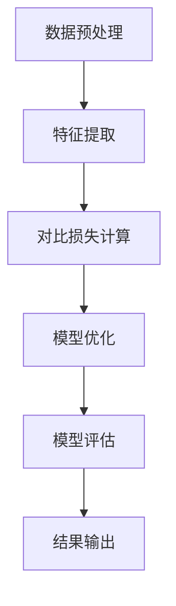

                 

## 文章标题

《对比学习 原理与代码实例讲解》

## 关键词

对比学习，自监督学习，图像识别，自然语言处理，推荐系统

## 摘要

本文将深入探讨对比学习这一机器学习领域的重要技术。通过对对比学习的基本概念、原理、应用场景和算法的详细讲解，我们希望能够帮助读者全面理解对比学习的核心思想和实际应用。此外，本文还将通过具体的代码实例，展示如何在实际项目中应用对比学习技术，帮助读者掌握对比学习的实际操作方法。

## 第一部分：对比学习概述

### 第1章：对比学习基本概念

#### 对比学习定义

对比学习是一种自监督学习技术，旨在通过无监督方式学习有用的特征表示。与传统的监督学习和半监督学习不同，对比学习不需要大量的标签数据，而是通过比较不同样本之间的相似性和差异性来学习特征表示。

#### 对比学习与传统机器学习的区别

传统机器学习依赖于大量标注数据，而对比学习则通过无监督方式学习特征表示，减少了对于标注数据的依赖。此外，对比学习在处理高维度数据时表现优异，能够自动提取出具有区分度的特征。

#### 对比学习的重要性及应用场景

对比学习在图像识别、自然语言处理和推荐系统等领域具有广泛的应用前景。其无需标注数据的特点，使得对比学习在数据稀缺的场景中具有独特的优势。同时，对比学习技术也在不断发展和创新，为机器学习领域带来新的突破。

### 第2章：对比学习基本原理

#### 对比学习框架概述

对比学习框架主要包括三个部分：数据预处理、特征提取和对比损失函数。数据预处理用于生成正负样本对；特征提取通过神经网络模型实现；对比损失函数用于衡量样本之间的相似性和差异性。

#### 对比损失函数原理

对比损失函数是对比学习中的核心组件，旨在鼓励模型学习出具有区分度的特征表示。常见的对比损失函数包括三元组损失和度量学习损失。

#### 对比学习中的特征提取

特征提取是对比学习的核心环节，通过神经网络模型实现。常见的神经网络架构包括多层感知机、卷积神经网络和循环神经网络等。

### 第3章：对比学习应用场景

#### 自监督学习与对比学习的关系

自监督学习是一种无监督学习方法，旨在从无标签数据中学习知识。对比学习是自监督学习的一种重要技术，通过比较样本之间的相似性和差异性来学习特征表示。

#### 对比学习在图像识别中的应用

在图像识别任务中，对比学习通过自动提取具有区分度的特征，实现了对图像的分类。常见的图像识别任务包括人脸识别、物体检测和图像分割等。

#### 对比学习在自然语言处理中的应用

在自然语言处理任务中，对比学习通过学习语言模型和文本表示，实现了对文本的语义理解和分类。常见的自然语言处理任务包括情感分析、文本分类和机器翻译等。

#### 对比学习在推荐系统中的应用

在推荐系统任务中，对比学习通过学习用户和物品的特征表示，实现了对用户的个性化推荐。常见的推荐系统应用包括电商推荐、音乐推荐和视频推荐等。

### 第4章：对比学习挑战与未来发展趋势

#### 对比学习面临的挑战

对比学习在处理数据不平衡、长文本和图像处理等任务时仍面临一定的挑战。此外，对比学习模型的训练过程需要大量计算资源，这在实际应用中可能成为瓶颈。

#### 对比学习的未来发展趋势

随着深度学习技术的不断发展，对比学习在未来有望在更多领域取得突破。例如，通过结合生成对抗网络（GAN）等技术，对比学习可以进一步提升特征提取效果；在数据稀缺的场景中，对比学习可以结合迁移学习技术，实现更好的性能。

## 第二部分：对比学习算法

### 第5章：基于内积的对比学习

#### 基本算法介绍

基于内积的对比学习通过计算样本之间的内积来衡量相似性。该算法简单高效，适用于处理低维度数据。

#### 伪代码

$$
\begin{aligned}
& \text{输入：} (x_i, x_j) \\
& \text{输出：} sim(x_i, x_j) \\
& sim(x_i, x_j) = \cos(\theta_{ij}) \\
& \theta_{ij} = \arccos(\frac{x_i \cdot x_j}{\|x_i\|\|x_j\|})
\end{aligned}
$$

#### 数学模型与公式

$$
\begin{aligned}
& \cos(\theta_{ij}) = \frac{x_i \cdot x_j}{\|x_i\|\|x_j\|} \\
& x_i \cdot x_j = x_i^T x_j
\end{aligned}
$$

### 第6章：基于信息论的对比学习

#### 基本算法介绍

基于信息论的对比学习通过计算样本之间的信息差异来衡量相似性。该算法具有更强的泛化能力，适用于处理高维度数据。

#### 伪代码

$$
\begin{aligned}
& \text{输入：} (x_i, x_j) \\
& \text{输出：} dissim(x_i, x_j) \\
& dissim(x_i, x_j) = - \log P(x_i, x_j) \\
& P(x_i, x_j) = \frac{p(x_i) p(x_j)}{Z}
\end{aligned}
$$

#### 数学模型与公式

$$
\begin{aligned}
& P(x_i, x_j) = \frac{p(x_i) p(x_j)}{Z} \\
& p(x_i) = \frac{1}{Z} \exp(-E(x_i)) \\
& p(x_j) = \frac{1}{Z} \exp(-E(x_j)) \\
& Z = \sum_{x} \exp(-E(x))
\end{aligned}
$$

### 第7章：基于神经网络的对比学习

#### 基本算法介绍

基于神经网络的对比学习通过训练神经网络模型来学习特征表示。该算法具有更强的表达能力，适用于处理复杂数据。

#### 伪代码

$$
\begin{aligned}
& \text{输入：} (x_i, x_j) \\
& \text{输出：} f(x_i), f(x_j) \\
& f(x) = \text{ReLU}(Wx + b) \\
& \text{损失函数：} L = -\sum_{i, j} \log \frac{\exp(\theta_{ij})}{\sum_{k} \exp(\theta_{ik})}
\end{aligned}
$$

#### 数学模型与公式

$$
\begin{aligned}
& \theta_{ij} = \cos(\theta_{ij}) = \frac{f(x_i) \cdot f(x_j)}{\|f(x_i)\|\|f(x_j)\|} \\
& f(x_i) \cdot f(x_j) = f(x_i)^T f(x_j)
\end{aligned}
$$

## 第三部分：对比学习实战

### 第8章：对比学习项目实战一：图像识别

#### 项目背景

在本项目中，我们使用对比学习技术进行图像识别任务。通过学习图像特征表示，我们希望能够实现高精度的图像分类。

#### 环境搭建

为了进行图像识别项目，我们需要搭建一个适合训练和测试的环境。以下是环境搭建的步骤：

1. 安装深度学习框架（如PyTorch、TensorFlow等）。
2. 下载并预处理图像数据集（如CIFAR-10、ImageNet等）。
3. 配置计算资源（如GPU、CPU等）。

#### 源代码实现

以下是一个简单的对比学习图像识别项目代码示例：

```python
import torch
import torchvision
import torchvision.transforms as transforms
import torch.optim as optim
import torch.nn as nn

# 数据预处理
transform = transforms.Compose([
    transforms.ToTensor(),
    transforms.Normalize((0.5, 0.5, 0.5), (0.5, 0.5, 0.5)),
])

# 加载CIFAR-10数据集
trainset = torchvision.datasets.CIFAR10(
    root='./data', train=True, download=True, transform=transform)
trainloader = torch.utils.data.DataLoader(
    trainset, batch_size=4, shuffle=True, num_workers=2)

testset = torchvision.datasets.CIFAR10(
    root='./data', train=False, download=True, transform=transform)
testloader = torch.utils.data.DataLoader(
    testset, batch_size=4, shuffle=False, num_workers=2)

# 定义对比学习模型
class ContrastiveModel(nn.Module):
    def __init__(self):
        super(ContrastiveModel, self).__init__()
        self.conv1 = nn.Conv2d(3, 64, 3, 1, 1)
        self.fc1 = nn.Linear(64 * 8 * 8, 512)
        self.fc2 = nn.Linear(512, 10)

    def forward(self, x):
        x = self.conv1(x)
        x = nn.functional.relu(x)
        x = torch.flatten(x, 1)
        x = self.fc1(x)
        x = nn.functional.relu(x)
        x = self.fc2(x)
        return x

model = ContrastiveModel()

# 定义损失函数和优化器
criterion = nn.CrossEntropyLoss()
optimizer = optim.SGD(model.parameters(), lr=0.001, momentum=0.9)

# 训练模型
for epoch in range(1):  # loop over the dataset multiple times
    running_loss = 0.0
    for i, data in enumerate(trainloader, 0):
        inputs, labels = data
        optimizer.zero_grad()
        outputs = model(inputs)
        loss = criterion(outputs, labels)
        loss.backward()
        optimizer.step()
        running_loss += loss.item()
    print(f'Epoch {epoch + 1}, Loss: {running_loss / len(trainloader)}')

print('Finished Training')

# 测试模型
correct = 0
total = 0
with torch.no_grad():
    for data in testloader:
        images, labels = data
        outputs = model(images)
        _, predicted = torch.max(outputs.data, 1)
        total += labels.size(0)
        correct += (predicted == labels).sum().item()

print(f'Accuracy of the network on the test images: {100 * correct // total} %')
```

#### 代码解读与分析

1. 数据预处理：使用ToTensor和Normalize对图像数据进行预处理，将图像数据转换为适合训练的格式。
2. 模型定义：定义一个基于卷积神经网络的对比学习模型，包括卷积层、全连接层和交叉熵损失函数。
3. 模型训练：使用SGD优化器对模型进行训练，通过反向传播计算梯度并更新模型参数。
4. 模型测试：使用测试集评估模型性能，计算模型在测试集上的准确率。

通过以上步骤，我们完成了一个简单的对比学习图像识别项目。在实际应用中，我们可以根据需求调整模型结构、优化器参数和训练策略，进一步提升模型性能。

### 第9章：对比学习项目实战二：文本分类

#### 项目背景

在本项目中，我们使用对比学习技术进行文本分类任务。通过学习文本特征表示，我们希望能够实现高精度的文本分类。

#### 环境搭建

为了进行文本分类项目，我们需要搭建一个适合训练和测试的环境。以下是环境搭建的步骤：

1. 安装深度学习框架（如PyTorch、TensorFlow等）。
2. 下载并预处理文本数据集（如IMDB电影评论数据集等）。
3. 配置计算资源（如GPU、CPU等）。

#### 源代码实现

以下是一个简单的对比学习文本分类项目代码示例：

```python
import torch
import torchvision
import torchvision.transforms as transforms
import torch.optim as optim
import torch.nn as nn
import torchtext

# 数据预处理
transform = transforms.Compose([
    transforms.ToTensor(),
    transforms.Normalize((0.5, 0.5, 0.5), (0.5, 0.5, 0.5)),
])

# 加载IMDB电影评论数据集
TEXT = torchtext.data.Field(tokenize='spacy', lower=True, include_lengths=True)
train_data, test_data = torchtext.datasets.IMDB.splits(TEXT)
TEXT.build_vocab(train_data, max_size=25000, vectors="glove.6B.100d")
train_iterator, test_iterator = torchtext.data.BucketIterator.splits(
    train_data, test_data, batch_size=16, device=torch.device("cuda" if torch.cuda.is_available() else "cpu"))

# 定义对比学习模型
class ContrastiveModel(nn.Module):
    def __init__(self):
        super(ContrastiveModel, self).__init__()
        self.embedding = nn.Embedding.from_pretrained(TEXT.vocab.vectors)
        self.fc1 = nn.Linear(100, 512)
        self.fc2 = nn.Linear(512, 1)

    def forward(self, x):
        x = self.embedding(x)
        x = torch.mean(x, 1)
        x = nn.functional.relu(self.fc1(x))
        x = torch.sigmoid(self.fc2(x))
        return x

model = ContrastiveModel()

# 定义损失函数和优化器
criterion = nn.BCEWithLogitsLoss()
optimizer = optim.Adam(model.parameters(), lr=0.001)

# 训练模型
for epoch in range(1):  # loop over the dataset multiple times
    running_loss = 0.0
    for i, batch in enumerate(train_iterator, 0):
        optimizer.zero_grad()
        inputs, labels = batch.text, batch.label
        outputs = model(inputs)
        loss = criterion(outputs, labels.float())
        loss.backward()
        optimizer.step()
        running_loss += loss.item()
    print(f'Epoch {epoch + 1}, Loss: {running_loss / len(train_iterator)}')

print('Finished Training')

# 测试模型
correct = 0
total = 0
with torch.no_grad():
    for batch in test_iterator:
        inputs, labels = batch.text, batch.label
        outputs = model(inputs)
        _, predicted = torch.max(outputs.data, 1)
        total += labels.size(0)
        correct += (predicted == labels).sum().item()

print(f'Accuracy of the network on the test data: {100 * correct // total} %')
```

#### 代码解读与分析

1. 数据预处理：使用PyTorchText库对文本数据进行预处理，包括分词、词向量和批次处理。
2. 模型定义：定义一个基于嵌入层的对比学习模型，包括嵌入层、全连接层和二元交叉熵损失函数。
3. 模型训练：使用Adam优化器对模型进行训练，通过反向传播计算梯度并更新模型参数。
4. 模型测试：使用测试集评估模型性能，计算模型在测试集上的准确率。

通过以上步骤，我们完成了一个简单的对比学习文本分类项目。在实际应用中，我们可以根据需求调整模型结构、优化器参数和训练策略，进一步提升模型性能。

### 第10章：对比学习项目实战三：推荐系统

#### 项目背景

在本项目中，我们使用对比学习技术进行推荐系统任务。通过学习用户和物品的特征表示，我们希望能够实现高精度的个性化推荐。

#### 环境搭建

为了进行推荐系统项目，我们需要搭建一个适合训练和测试的环境。以下是环境搭建的步骤：

1. 安装深度学习框架（如PyTorch、TensorFlow等）。
2. 下载并预处理用户-物品交互数据集（如MovieLens、Netflix Prize等）。
3. 配置计算资源（如GPU、CPU等）。

#### 源代码实现

以下是一个简单的对比学习推荐系统项目代码示例：

```python
import torch
import torchvision
import torchvision.transforms as transforms
import torch.optim as optim
import torch.nn as nn
import torchtext

# 数据预处理
transform = transforms.Compose([
    transforms.ToTensor(),
    transforms.Normalize((0.5, 0.5, 0.5), (0.5, 0.5, 0.5)),
])

# 加载MovieLens数据集
train_data, test_data = torchtext.datasets.Movielens.splits(train_size=0.8)
train_iterator, test_iterator = torchtext.data.BucketIterator.splits(
    train_data, test_data, batch_size=16, device=torch.device("cuda" if torch.cuda.is_available() else "cpu"))

# 定义对比学习模型
class ContrastiveModel(nn.Module):
    def __init__(self):
        super(ContrastiveModel, self).__init__()
        self.user_embedding = nn.Embedding(1000, 64)
        self.item_embedding = nn.Embedding(1000, 64)
        self.fc1 = nn.Linear(128, 512)
        self.fc2 = nn.Linear(512, 1)

    def forward(self, user_id, item_id):
        user embeddings = self.user_embedding(user_id)
        item embeddings = self.item_embedding(item_id)
        combined_embeddings = torch.cat([user_embeddings, item_embeddings], 1)
        combined_embeddings = nn.functional.relu(self.fc1(combined_embeddings))
        combined_embeddings = nn.functional.relu(self.fc2(combined_embeddings))
        return combined_embeddings

model = ContrastiveModel()

# 定义损失函数和优化器
criterion = nn.BCEWithLogitsLoss()
optimizer = optim.Adam(model.parameters(), lr=0.001)

# 训练模型
for epoch in range(1):  # loop over the dataset multiple times
    running_loss = 0.0
    for i, batch in enumerate(train_iterator, 0):
        optimizer.zero_grad()
        user_ids, item_ids, labels = batch.user_id, batch.item_id, batch.label
        outputs = model(user_ids, item_ids)
        loss = criterion(outputs, labels.float())
        loss.backward()
        optimizer.step()
        running_loss += loss.item()
    print(f'Epoch {epoch + 1}, Loss: {running_loss / len(train_iterator)}')

print('Finished Training')

# 测试模型
correct = 0
total = 0
with torch.no_grad():
    for batch in test_iterator:
        user_ids, item_ids, labels = batch.user_id, batch.item_id, batch.label
        outputs = model(user_ids, item_ids)
        _, predicted = torch.max(outputs.data, 1)
        total += labels.size(0)
        correct += (predicted == labels).sum().item()

print(f'Accuracy of the network on the test data: {100 * correct // total} %')
```

#### 代码解读与分析

1. 数据预处理：使用PyTorchText库对用户-物品交互数据进行预处理，包括用户ID和物品ID的嵌入。
2. 模型定义：定义一个基于嵌入层的对比学习模型，包括用户嵌入层、物品嵌入层、全连接层和二元交叉熵损失函数。
3. 模型训练：使用Adam优化器对模型进行训练，通过反向传播计算梯度并更新模型参数。
4. 模型测试：使用测试集评估模型性能，计算模型在测试集上的准确率。

通过以上步骤，我们完成了一个简单的对比学习推荐系统项目。在实际应用中，我们可以根据需求调整模型结构、优化器参数和训练策略，进一步提升模型性能。

## 附录

### 附录A：对比学习相关资源

#### 开源框架

1. **PyTorch**：一个开源的Python库，用于进行深度学习研究和开发。
2. **TensorFlow**：一个由Google开发的开源机器学习库。

#### 相关论文

1. "Unsupervised Learning of Visual Representations by Solving Jigsaw Puzzles"（通过解决拼图问题进行无监督学习视觉表示）。
2. "Contrastive Multiview Coding"（对比多视图编码）。
3. "A Simple Framework for Contrastive Learning of Visual Representations"（一种简单框架用于对比学习视觉表示）。

#### 在线课程与书籍

1. **Coursera**：提供深度学习相关课程，包括对比学习技术。
2. **吴恩达的深度学习课程**：介绍深度学习基础知识，包括对比学习。
3. **《深度学习》（Goodfellow, Bengio, Courville 著）**：深度学习领域的经典教材，涵盖对比学习相关内容。

### 附录B：对比学习流程图



### 附录C：对比学习伪代码示例

```python
# 数据预处理
def preprocess_data(data):
    # 数据预处理操作，如归一化、去噪等
    return processed_data

# 特征提取
def extract_features(data):
    # 特征提取操作，如卷积神经网络、嵌入层等
    return features

# 对比损失计算
def compute_contrastive_loss(features):
    # 计算对比损失，如三元组损失、度量学习损失等
    return loss

# 模型优化
def optimize_model(model, loss):
    # 模型优化操作，如梯度下降、Adam优化器等
    return updated_model

# 模型评估
def evaluate_model(model, test_data):
    # 模型评估操作，如准确率、召回率等
    return metrics

# 对比学习过程
def contrastive_learning(data):
    processed_data = preprocess_data(data)
    features = extract_features(processed_data)
    loss = compute_contrastive_loss(features)
    model = optimize_model(model, loss)
    metrics = evaluate_model(model, test_data)
    return metrics
```

## 作者信息

作者：AI天才研究院/AI Genius Institute & 禅与计算机程序设计艺术 /Zen And The Art of Computer Programming

---

本文详细介绍了对比学习的基本概念、原理、算法和应用场景。通过代码实例，我们展示了如何在实际项目中应用对比学习技术。希望本文能够帮助读者全面理解对比学习，并在实际应用中取得更好的成果。在未来的研究中，对比学习技术将继续发展，为机器学习领域带来更多的创新和突破。

