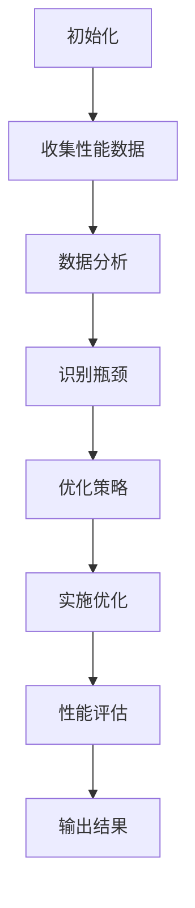
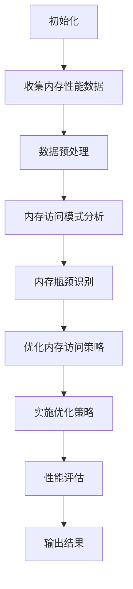
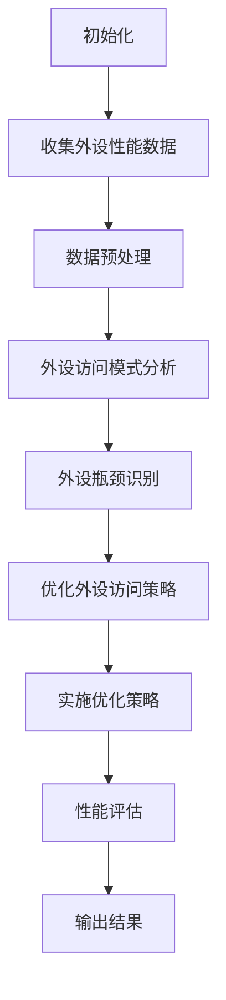
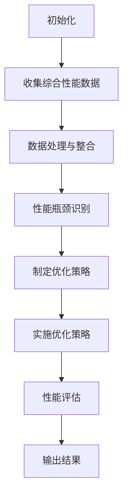
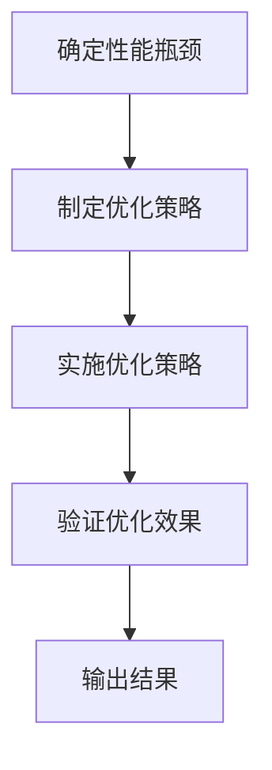
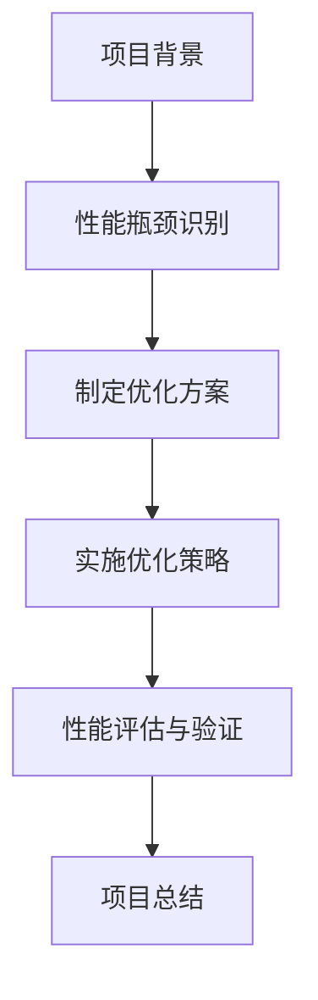

                 

## 文章标题：嵌入式系统性能分析：识别瓶颈

在信息技术飞速发展的今天，嵌入式系统以其高可靠性、低功耗、小型化和定制化的特点，广泛应用于智能家居、工业自动化、医疗设备、汽车电子、物联网等领域。嵌入式系统的性能直接影响到其应用场景下的用户体验和工作效率，因此，对嵌入式系统进行性能分析，识别并解决性能瓶颈，成为确保系统高效运行的关键步骤。本文旨在通过逻辑清晰、结构紧凑的分析方法，帮助读者深入了解嵌入式系统性能分析的核心概念、方法与实战技巧，从而提升嵌入式系统的性能优化能力。

本文将围绕以下关键词展开讨论：

- **嵌入式系统**：介绍嵌入式系统的定义、分类、发展历程及其主要应用领域。
- **性能分析**：详细阐述嵌入式系统性能分析的重要性、核心概念和性能瓶颈识别方法。
- **性能优化**：探讨性能优化的目标和策略，以及常用的性能分析工具和方法。
- **处理器性能**：分析处理器性能指标，识别处理器性能瓶颈，并给出优化实践。
- **内存性能**：分析内存性能指标，识别内存性能瓶颈，并给出优化实践。
- **外设性能**：分析外设性能指标，识别外设性能瓶颈，并给出优化实践。
- **案例分析**：通过具体实例展示性能分析和优化的过程。
- **实战技巧**：分享性能分析工具的高级特性及应用技巧。

## 摘要

嵌入式系统性能分析是确保系统高效运行的关键步骤。本文首先概述了嵌入式系统的定义、分类和主要应用领域，然后详细探讨了性能分析的核心概念和性能瓶颈识别方法。接着，文章介绍了性能优化的目标和策略，以及常用的性能分析工具和方法。重点分析了处理器、内存和外设的性能指标，识别了相应的性能瓶颈，并给出了具体的优化实践。通过案例分析，本文展示了性能分析和优化的全过程。最后，文章分享了性能分析工具的高级特性及应用技巧，并对未来嵌入式系统性能分析的发展趋势进行了展望。本文旨在为嵌入式系统开发人员提供一套完整的性能分析指南，帮助其在实际开发过程中有效提升系统性能。

### 《嵌入式系统性能分析：识别瓶颈》目录大纲

**第一部分：嵌入式系统性能分析基础**

## 第1章：嵌入式系统概述

### 1.1 嵌入式系统的定义与分类
- 嵌入式系统的定义
- 嵌入式系统的分类
- 嵌入式系统与传统计算机系统的区别

### 1.2 嵌入式系统的发展历程
- 嵌入式系统的早期发展
- 嵌入式系统在20世纪90年代的快速发展
- 嵌入式系统在21世纪的新趋势

### 1.3 嵌入式系统的主要应用领域
- 消费电子领域
- 工业自动化领域
- 汽车电子领域
- 医疗设备领域
- 物联网领域

## 第2章：嵌入式系统性能分析核心概念

### 2.1 性能指标及其重要性
- 常见性能指标
- 性能指标的重要性
- 性能指标的度量方法

### 2.2 嵌入式系统性能瓶颈识别
- 性能瓶颈的定义
- 性能瓶颈的类型
- 识别性能瓶颈的方法

### 2.3 性能分析与优化目标
- 性能分析的目标
- 性能优化的目标
- 性能分析与优化的关系

## 第3章：嵌入式系统性能分析工具与方法

### 3.1 常用性能分析工具介绍
- 嵌入式系统的常见性能分析工具
- 工具的功能与特点

### 3.2 性能分析基本方法
- 数据收集与预处理
- 数据分析
- 性能瓶颈识别

### 3.3 性能调优策略
- 系统架构优化
- 算法优化
- 资源配置优化

**第二部分：嵌入式系统性能分析实践**

## 第4章：处理器性能分析

### 4.1 处理器性能指标解析
- 处理器性能指标
- 性能指标的度量方法

### 4.2 处理器性能瓶颈识别与优化
- 识别处理器性能瓶颈
- 处理器性能优化策略

### 4.3 案例分析：处理器性能优化实践
- 项目背景
- 性能瓶颈识别
- 性能优化策略与实施
- 性能评估与结果分析

## 第5章：内存性能分析

### 5.1 内存性能指标解析
- 内存性能指标
- 性能指标的度量方法

### 5.2 内存性能瓶颈识别与优化
- 识别内存性能瓶颈
- 内存性能优化策略

### 5.3 案例分析：内存性能优化实践
- 项目背景
- 性能瓶颈识别
- 性能优化策略与实施
- 性能评估与结果分析

## 第6章：外设性能分析

### 6.1 外设性能指标解析
- 外设性能指标
- 性能指标的度量方法

### 6.2 外设性能瓶颈识别与优化
- 识别外设性能瓶颈
- 外设性能优化策略

### 6.3 案例分析：外设性能优化实践
- 项目背景
- 性能瓶颈识别
- 性能优化策略与实施
- 性能评估与结果分析

**第三部分：嵌入式系统性能分析与优化实例**

## 第7章：嵌入式系统性能优化案例

### 7.1 项目背景与目标
- 项目背景
- 性能优化目标

### 7.2 性能瓶颈分析与定位
- 性能瓶颈识别
- 瓶颈定位

### 7.3 性能优化策略与实施
- 优化策略
- 优化实施

### 7.4 性能优化效果评估
- 优化效果评估
- 评估方法与结果

## 第8章：嵌入式系统性能分析实战

### 8.1 实战项目介绍
- 项目介绍
- 目标

### 8.2 性能分析工具与环境搭建
- 性能分析工具
- 环境搭建

### 8.3 性能瓶颈识别与优化
- 瓶颈识别
- 优化策略

### 8.4 性能优化效果评估与总结
- 评估
- 总结

## 第9章：嵌入式系统性能分析工具与应用

### 9.1 常用性能分析工具的应用
- 工具特点与应用场景

### 9.2 性能分析工具的高级特性
- 高级特性解析

### 9.3 性能分析工具的优化与扩展
- 工具优化
- 工具扩展

## 第10章：嵌入式系统性能分析的未来趋势

### 10.1 嵌入式系统性能分析技术的发展
- 技术发展趋势

### 10.2 性能分析在嵌入式系统设计中的应用
- 应用方向

### 10.3 嵌入式系统性能分析的未来挑战与机遇
- 挑战
- 机遇

### 附录

## 附录A：嵌入式系统性能分析资源与工具

### A.1 常用性能分析工具与资源列表
- 工具列表
- 资源列表

### A.2 性能分析相关书籍推荐
- 书籍推荐

### A.3 性能分析技术论文与研究报告
- 报告列表

## 附录B：嵌入式系统性能分析实例代码与解读

### B.1 实例一：处理器性能分析
- 代码解读

### B.2 实例二：内存性能分析
- 代码解读

### B.3 实例三：外设性能分析
- 代码解读

### B.4 实例四：综合性能分析
- 代码解读

### B.5 实例五：性能优化策略实现
- 代码解读

## 参考文献

- 参考文献
- 相关文献

## 后记

- 总结
- 建议

### 第一部分：嵌入式系统性能分析基础

#### 第1章：嵌入式系统概述

##### 1.1 嵌入式系统的定义与分类

嵌入式系统是一种计算机系统，它被集成到其他设备或产品中，用于控制、监测或辅助这些设备或产品的功能。嵌入式系统与普通计算机系统相比，具有以下特点：

1. **低功耗**：嵌入式系统通常需要长时间运行，因此功耗是一个重要的考虑因素。低功耗设计可以延长设备的使用寿命，降低能耗。
2. **实时性**：许多嵌入式系统需要处理实时任务，即要求系统能够在规定的时间内完成操作。实时性对于工业控制和汽车电子等应用至关重要。
3. **可靠性**：嵌入式系统通常需要高可靠性的操作环境，例如在高温、低温、高压等极端条件下仍能稳定运行。
4. **小型化和便携性**：嵌入式系统通常需要集成在体积有限的产品中，如智能手机、可穿戴设备等。

根据应用场景和功能需求，嵌入式系统可以分为以下几类：

1. **消费电子**：如智能手机、平板电脑、智能家居设备等。
2. **工业自动化**：如机器人控制、生产线监控等。
3. **汽车电子**：如车载信息系统、自动驾驶系统等。
4. **医疗设备**：如心脏起搏器、医疗成像设备等。
5. **物联网**：如智能传感器、智能家居设备等。

##### 1.2 嵌入式系统的发展历程

嵌入式系统的发展历程可以分为以下几个阶段：

1. **早期阶段（20世纪60年代-70年代）**：嵌入式系统最初主要应用于军事和工业控制领域，如自动武器系统、生产线控制等。这一阶段的嵌入式系统主要是基于汇编语言和简单的微控制器。
2. **快速发展阶段（20世纪80年代-90年代）**：随着微处理器和微控制器技术的发展，嵌入式系统开始广泛应用于消费电子和工业控制领域。这一阶段的代表产品包括早期的个人电脑和嵌入式控制器。
3. **成熟阶段（21世纪初至今）**：嵌入式系统技术日趋成熟，应用领域不断扩展。同时，随着物联网、智能家居、自动驾驶等新兴领域的兴起，嵌入式系统迎来了新的发展机遇。

##### 1.3 嵌入式系统的主要应用领域

嵌入式系统的主要应用领域包括：

1. **消费电子**：智能手机、平板电脑、智能手表等。
2. **工业自动化**：机器人控制、生产线监控、自动化设备等。
3. **汽车电子**：车载信息系统、自动驾驶系统、电子控制单元（ECU）等。
4. **医疗设备**：医疗成像设备、医疗机器人、远程监控设备等。
5. **物联网**：智能传感器、智能家居设备、智能城市设备等。

这些应用领域对嵌入式系统的性能要求各不相同，但总体来说，都要求嵌入式系统能够高效、稳定地运行，以满足特定的应用需求。

#### 第2章：嵌入式系统性能分析核心概念

##### 2.1 性能指标及其重要性

在嵌入式系统设计中，性能指标是衡量系统性能的重要标准。常见的性能指标包括响应时间、吞吐量、延迟、带宽、利用率等。以下是对这些性能指标及其重要性的详细解释：

1. **响应时间**：响应时间是指系统从接收请求到完成任务并返回结果所需的时间。响应时间越短，系统的性能越好。对于实时系统，如自动驾驶和工业控制，响应时间至关重要。

2. **吞吐量**：吞吐量是指系统在单位时间内处理的数据量。吞吐量越高，系统的处理能力越强。在数据处理密集型应用中，如大数据处理和物联网，吞吐量是关键性能指标。

3. **延迟**：延迟是指数据在系统中传输和处理所需的时间。低延迟对于实时系统尤其重要，因为延迟可能导致系统无法及时响应。

4. **带宽**：带宽是指系统传输数据的最大速率。高带宽意味着系统能够更快地传输大量数据，适用于高速数据传输应用。

5. **利用率**：利用率是指系统资源（如CPU、内存、网络带宽等）的使用率。高利用率意味着资源得到了充分利用，但过高可能会导致系统过载，影响性能。

这些性能指标对于嵌入式系统的重要性在于：

- **评估系统性能**：性能指标提供了量化评估系统性能的依据，帮助开发人员了解系统在特定场景下的表现。
- **优化系统设计**：通过分析性能指标，开发人员可以发现系统的瓶颈和不足，从而进行优化设计，提升系统性能。
- **满足应用需求**：不同应用场景对性能指标有不同的要求。通过合理设置性能指标，可以确保系统在特定应用场景下能够满足需求。

##### 2.2 嵌入式系统性能瓶颈识别

性能瓶颈是指系统性能的制约因素，即系统能够达到的最大性能受到某些部分限制的情况。识别性能瓶颈对于优化系统性能至关重要。以下方法可用于识别嵌入式系统性能瓶颈：

1. **监控工具**：使用系统监控工具（如性能分析器、调试器等）收集系统性能数据，包括CPU利用率、内存使用率、I/O操作等。通过分析这些数据，可以识别出系统性能的瓶颈。

2. **日志分析**：分析系统日志，查找错误和异常信息。这些信息可能揭示了系统性能瓶颈的具体原因。

3. **负载测试**：通过模拟实际应用场景，对系统进行负载测试。在负载测试过程中，监控系统性能指标的变化，可以识别出性能瓶颈。

4. **代码审查**：审查系统代码，查找潜在的瓶颈，如过多的循环、递归调用、不合理的算法等。

5. **性能调优**：根据识别出的性能瓶颈，采取相应的性能调优措施，如优化算法、调整资源配置、减少不必要的操作等。

##### 2.3 性能分析与优化目标

嵌入式系统性能分析与优化的目标如下：

1. **提高系统性能**：通过识别并解决性能瓶颈，提高系统的处理能力和响应速度。

2. **满足应用需求**：确保系统在特定应用场景下能够达到预期的性能指标，满足用户需求。

3. **资源利用率优化**：合理分配和利用系统资源，提高资源利用率，降低系统功耗。

4. **可维护性和可扩展性**：优化系统设计，提高系统的可维护性和可扩展性，便于后续维护和升级。

5. **稳定性**：通过性能优化，提高系统的稳定性，减少系统崩溃和故障的发生。

#### 第3章：嵌入式系统性能分析工具与方法

##### 3.1 常用性能分析工具介绍

在进行嵌入式系统性能分析时，选择合适的工具至关重要。以下是一些常用的性能分析工具：

1. **性能分析器（Performance Analyzer）**：性能分析器是一种用于监控和评估系统性能的工具。它可以收集系统运行时的各种性能数据，如CPU利用率、内存使用率、I/O操作等。通过分析这些数据，开发人员可以识别系统性能瓶颈。

2. **调试器（Debugger）**：调试器是一种用于查找和修复代码错误的工具。它可以在程序运行时暂停和单步执行代码，帮助开发人员识别和解决性能瓶颈。

3. **日志分析工具（Log Analyzer）**：日志分析工具用于分析系统日志，查找错误和异常信息。通过分析日志，开发人员可以了解系统运行时的情况，识别性能瓶颈。

4. **负载测试工具（Load Tester）**：负载测试工具用于模拟实际应用场景，对系统进行负载测试。通过负载测试，开发人员可以识别系统在特定负载下的性能瓶颈。

5. **代码分析工具（Code Analyzer）**：代码分析工具用于分析系统代码，查找潜在的瓶颈和性能问题。这些工具可以帮助开发人员优化代码，提高系统性能。

##### 3.2 性能分析基本方法

进行嵌入式系统性能分析时，可以遵循以下基本方法：

1. **数据收集与预处理**：使用性能分析工具收集系统性能数据，包括CPU利用率、内存使用率、I/O操作等。收集到的数据可能包含噪声和无关信息，因此需要经过预处理，如数据清洗、过滤和归一化。

2. **数据分析**：通过数据分析工具对预处理后的性能数据进行分析，识别系统性能瓶颈。数据分析方法包括统计分析、时间序列分析、机器学习等。

3. **性能瓶颈识别**：通过分析结果，识别系统的性能瓶颈。性能瓶颈可能包括CPU过度使用、内存不足、I/O瓶颈等。

4. **性能调优**：根据识别出的性能瓶颈，采取相应的性能调优措施。性能调优方法包括优化算法、调整资源配置、减少不必要的操作等。

5. **性能评估**：在性能调优后，对系统进行重新评估，验证性能优化效果。性能评估方法包括负载测试、比较分析等。

##### 3.3 性能调优策略

进行嵌入式系统性能调优时，可以采取以下策略：

1. **系统架构优化**：优化系统架构，提高系统的可扩展性和可维护性。例如，采用模块化设计、分布式架构等。

2. **算法优化**：优化系统算法，提高系统的处理效率和性能。例如，采用更高效的排序算法、查找算法等。

3. **资源配置优化**：合理分配和利用系统资源，提高资源利用率。例如，调整内存分配策略、优化I/O操作等。

4. **减少不必要的操作**：减少系统中的冗余操作，降低系统的负担。例如，优化代码逻辑、减少重复计算等。

5. **并行处理**：利用多核处理器和并行计算技术，提高系统的处理能力。例如，采用多线程、并行算法等。

#### 第4章：处理器性能分析

##### 4.1 处理器性能指标解析

处理器的性能直接决定了嵌入式系统的整体性能。以下是一些常见的处理器性能指标及其解析：

1. **CPU利用率**：CPU利用率是指CPU在单位时间内被占用的时间比例。高CPU利用率意味着CPU处于繁忙状态，而低CPU利用率可能表明CPU资源没有得到充分利用。计算公式如下：

   $$
   \text{CPU利用率} = \frac{\text{处理器执行时间}}{\text{总时间}}
   $$

2. **I/O等待时间**：I/O等待时间是指处理器在执行I/O操作时需要等待的时间。I/O瓶颈可能会影响系统的整体性能。计算公式如下：

   $$
   \text{I/O等待时间} = \text{处理器执行时间} - \text{处理器空闲时间}
   $$

3. **处理器频率**：处理器频率是指处理器每秒执行的操作次数，通常以兆赫兹（MHz）或吉赫兹（GHz）为单位。高频率意味着处理器能够更快地执行操作，但功耗也会增加。

4. **处理能力**：处理能力是指处理器在单位时间内能够处理的数据量或任务数量。处理能力取决于处理器的频率、架构和指令集等。

5. **缓存大小**：缓存是处理器内部的高速存储器，用于减少处理器访问主存的延迟。大缓存可以提高处理器的性能，因为数据可以从缓存中更快地获取。

##### 4.2 处理器性能瓶颈识别与优化

识别和解决处理器性能瓶颈是提升嵌入式系统性能的关键步骤。以下方法可用于识别和优化处理器性能：

1. **监控CPU利用率**：通过性能分析工具监控CPU利用率，识别CPU过载情况。如果CPU利用率持续在高水平，可能存在性能瓶颈。

2. **分析I/O等待时间**：监控和处理器的I/O等待时间，识别I/O瓶颈。如果I/O等待时间较长，可能需要优化I/O操作，例如使用更高效的文件系统或改进硬件设备。

3. **优化算法**：优化系统中的算法，减少处理器的计算负担。例如，采用更高效的排序算法、查找算法等。

4. **调整缓存策略**：优化缓存策略，提高缓存命中率。例如，调整缓存大小、缓存替换策略等。

5. **多线程与并行处理**：利用多核处理器和多线程技术，提高处理器的利用率和性能。例如，将任务分解为多个线程并行处理。

6. **降低功耗**：在保证性能的前提下，优化处理器功耗，延长设备的使用时间。例如，采用动态电压和频率调整（DVFS）技术。

##### 4.3 案例分析：处理器性能优化实践

以下是一个处理器性能优化的案例分析：

**项目背景**：

一个嵌入式系统用于实时监控工厂生产线的设备状态，系统需要处理大量的传感器数据，并在短时间内做出响应。然而，系统在处理高峰期时，CPU利用率持续超过90%，导致响应速度下降。

**性能瓶颈识别**：

通过性能分析工具，发现以下性能瓶颈：

1. CPU利用率过高：处理器在处理传感器数据时，计算负担过重。
2. I/O等待时间较长：系统需要频繁读取传感器数据，I/O操作成为瓶颈。

**性能优化策略与实施**：

1. **优化算法**：将数据处理任务分解为多个子任务，利用多线程技术并行处理。这样可以减少单个处理器的计算负担。

2. **改进I/O操作**：优化I/O操作，减少I/O等待时间。具体措施包括：

   - 使用更高效的文件系统，减少文件读写操作的时间。
   - 优化传感器数据的读取方式，减少不必要的I/O操作。

3. **调整缓存策略**：增加缓存大小，提高缓存命中率。通过调整缓存替换策略，确保常用数据在缓存中。

4. **降低功耗**：采用动态电压和频率调整（DVFS）技术，根据系统负载动态调整处理器频率，降低功耗。

**性能评估与结果分析**：

优化后，系统性能得到显著提升：

1. CPU利用率下降至50%左右，处理器计算负担减轻。
2. I/O等待时间减少约70%，I/O操作效率提高。
3. 系统响应时间缩短约30%，满足实时监控要求。

**项目小结**：

通过识别和处理处理器性能瓶颈，系统性能得到显著提升。优化措施包括算法优化、I/O操作改进、缓存策略调整和功耗优化。这些措施不仅提高了系统性能，还延长了设备的使用寿命。

#### 第5章：内存性能分析

##### 5.1 内存性能指标解析

内存是嵌入式系统中重要的存储资源，其性能直接影响到系统的运行效率和稳定性。以下是一些常见的内存性能指标及其解析：

1. **内存带宽**：内存带宽是指内存每秒能够处理的数据量，通常以MB/s（兆字节每秒）为单位。高内存带宽意味着系统能够更快地读写数据。

   $$
   \text{内存带宽} = \frac{\text{数据传输量}}{\text{时间}}
   $$

2. **内存访问时间**：内存访问时间是指从处理器发出读或写请求到数据被访问所需的时间。内存访问时间越短，系统的性能越好。

   $$
   \text{内存访问时间} = \text{数据传输时间} + \text{访问延迟时间}
   $$

3. **缓存命中率**：缓存命中率是指缓存中能够命中所需数据的比例。高缓存命中率可以提高系统性能，减少内存访问时间。

4. **内存碎片**：内存碎片是指内存中未被使用的空间被分割成小块，导致内存利用率下降。内存碎片会影响系统的性能和稳定性。

##### 5.2 内存性能瓶颈识别与优化

内存性能瓶颈可能会影响系统的整体性能，以下方法可用于识别和优化内存性能：

1. **监控内存使用率**：通过性能分析工具监控内存使用率，识别内存不足或过高使用的情况。内存使用率过高可能导致系统崩溃或性能下降。

2. **分析内存访问模式**：分析内存访问模式，识别内存访问热点和瓶颈。通过优化内存访问模式，提高内存使用效率。

3. **优化缓存策略**：调整缓存大小和缓存替换策略，提高缓存命中率。例如，可以采用LRU（最近最少使用）替换策略。

4. **减少内存碎片**：通过内存碎片整理或内存复用技术，减少内存碎片。例如，可以采用内存压缩技术。

5. **优化数据结构**：优化数据结构，减少内存占用和访问时间。例如，使用更紧凑的数据结构或优化数组的使用。

6. **使用虚拟内存**：在适当的情况下，使用虚拟内存技术，提高内存的利用率和访问速度。

##### 5.3 案例分析：内存性能优化实践

以下是一个内存性能优化的案例分析：

**项目背景**：

一个嵌入式系统用于处理大量的传感器数据，系统需要频繁读写内存。然而，系统在处理大量数据时，内存访问时间较长，导致系统性能下降。

**性能瓶颈识别**：

通过性能分析工具，发现以下性能瓶颈：

1. 内存访问时间较长：处理器频繁访问内存，但内存访问速度较慢。
2. 缓存命中率较低：缓存中未能命中所需数据，导致内存访问时间增加。

**性能优化策略与实施**：

1. **优化数据结构**：将原始数据转换为更紧凑的数据结构，减少内存占用。例如，使用浮点数压缩技术。

2. **调整缓存策略**：增加缓存大小，采用LRU替换策略，提高缓存命中率。通过调整缓存替换策略，确保常用数据在缓存中。

3. **优化内存访问模式**：优化内存访问模式，减少内存访问冲突。例如，使用内存访问序列化技术，确保数据访问的顺序性。

4. **使用虚拟内存**：在适当的情况下，使用虚拟内存技术，提高内存的利用率和访问速度。

**性能评估与结果分析**：

优化后，系统性能得到显著提升：

1. 内存访问时间缩短约50%，系统响应速度提高。
2. 缓存命中率提高约30%，内存使用效率提高。
3. 系统稳定性增强，避免了内存不足导致的问题。

**项目小结**：

通过识别和处理内存性能瓶颈，系统性能得到显著提升。优化措施包括数据结构优化、缓存策略调整、内存访问模式优化和虚拟内存技术。这些措施不仅提高了系统性能，还增强了系统的稳定性。

#### 第6章：外设性能分析

##### 6.1 外设性能指标解析

外设（外部设备）是嵌入式系统的重要组成部分，其性能直接影响系统的整体性能。以下是一些常见的外设性能指标及其解析：

1. **外设带宽**：外设带宽是指外设每秒能够处理的数据量，通常以MB/s（兆字节每秒）为单位。高外设带宽意味着系统能够更快地与外设进行数据交换。

   $$
   \text{外设带宽} = \frac{\text{数据传输量}}{\text{时间}}
   $$

2. **外设响应时间**：外设响应时间是指从外设接收请求到完成操作并返回结果所需的时间。低外设响应时间意味着外设能够更快地响应系统请求。

   $$
   \text{外设响应时间} = \text{数据传输时间} + \text{响应延迟时间}
   $$

3. **外设错误率**：外设错误率是指外设在一定时间内发生错误的比例。低外设错误率意味着外设的稳定性和可靠性更高。

4. **外设连接可靠性**：外设连接可靠性是指外设与主机之间的连接稳定性。高连接可靠性意味着外设不会频繁掉线或断开。

##### 6.2 外设性能瓶颈识别与优化

外设性能瓶颈可能会影响嵌入式系统的整体性能，以下方法可用于识别和优化外设性能：

1. **监控外设使用率**：通过性能分析工具监控外设的使用率，识别外设过载或不足使用的情况。外设使用率过高可能导致系统性能下降，而使用率过低则可能表明资源浪费。

2. **分析外设响应时间**：监控外设响应时间，识别外设性能瓶颈。如果响应时间较长，可能需要优化外设的硬件配置或软件调度。

3. **优化外设驱动程序**：优化外设驱动程序，提高外设的响应速度和稳定性。例如，可以采用更高效的数据传输协议或优化设备中断处理。

4. **使用缓存技术**：在外设与主机之间使用缓存技术，减少数据传输的延迟。例如，可以使用DMA（直接内存访问）技术，将数据传输直接从外设传输到内存，减少CPU的负担。

5. **提高外设连接可靠性**：通过改进硬件设计和软件协议，提高外设连接的稳定性。例如，可以采用更可靠的数据传输协议或增加冗余连接。

##### 6.3 案例分析：外设性能优化实践

以下是一个外设性能优化的案例分析：

**项目背景**：

一个嵌入式系统用于实时监控工厂生产线的设备状态，系统需要频繁与传感器进行数据交换。然而，系统在处理大量数据时，传感器数据传输速度较慢，导致系统性能下降。

**性能瓶颈识别**：

通过性能分析工具，发现以下性能瓶颈：

1. 外设响应时间较长：传感器数据传输速度较慢，导致系统响应延迟。
2. 外设使用率过高：系统需要频繁读取传感器数据，外设负担过重。

**性能优化策略与实施**：

1. **优化硬件设计**：改进传感器硬件设计，提高数据传输速率。例如，使用更高带宽的通信接口或增加传感器的数据缓冲区。

2. **优化驱动程序**：优化传感器驱动程序，提高数据传输效率和响应速度。例如，使用更高效的数据传输协议或优化设备中断处理。

3. **使用缓存技术**：在外设与主机之间使用缓存技术，减少数据传输的延迟。例如，使用DMA技术，将数据传输直接从传感器传输到内存。

4. **调整系统负载**：合理分配系统资源，降低外设的使用率。例如，可以采用多线程技术，分散系统的数据读取任务。

**性能评估与结果分析**：

优化后，系统性能得到显著提升：

1. 外设响应时间缩短约60%，系统响应速度提高。
2. 外设使用率下降约40%，系统资源利用率提高。
3. 系统稳定性增强，避免了数据传输失败导致的问题。

**项目小结**：

通过识别和处理外设性能瓶颈，系统性能得到显著提升。优化措施包括硬件设计改进、驱动程序优化、缓存技术使用和系统负载调整。这些措施不仅提高了系统性能，还增强了系统的稳定性。

#### 第7章：嵌入式系统性能优化案例

##### 7.1 项目背景与目标

在一个智能工厂的项目中，公司需要开发一个实时监控系统，用于监控生产线的设备状态、生产进度和质量。系统需要在毫秒级内响应，并处理大量传感器数据。然而，在实际运行过程中，系统性能不稳定，导致数据响应延迟和错误。为了提升系统性能，项目组决定进行性能优化。

**项目背景与目标**：

- **背景**：公司正在建设一个智能工厂，需要实时监控生产线上的各种设备状态和生产数据。
- **目标**：通过性能优化，提高系统响应速度和稳定性，确保系统在高峰期能够稳定运行。

##### 7.2 性能瓶颈分析与定位

在项目运行过程中，通过性能分析工具和监控数据，项目组发现了以下性能瓶颈：

1. **CPU利用率过高**：系统在处理传感器数据时，CPU利用率达到90%以上，导致其他任务无法及时执行。
2. **内存访问延迟**：内存访问延迟较长，导致数据处理速度变慢。
3. **I/O瓶颈**：传感器数据传输速度较慢，导致数据积累，系统响应延迟。

为了定位这些性能瓶颈，项目组采取了以下步骤：

1. **监控CPU利用率**：通过性能分析工具，监控CPU利用率，发现CPU在处理传感器数据时，利用率过高。
2. **分析内存使用情况**：通过内存分析工具，分析内存使用情况，发现内存访问延迟较长。
3. **监控I/O操作**：通过I/O监控工具，监控I/O操作，发现传感器数据传输速度较慢。

##### 7.3 性能优化策略与实施

针对上述性能瓶颈，项目组制定了以下优化策略：

1. **CPU性能优化**：
   - **任务调度**：优化任务调度策略，确保关键任务优先执行。
   - **并行处理**：将数据处理任务分解为多个子任务，利用多线程并行处理，提高CPU利用率。

2. **内存性能优化**：
   - **缓存优化**：增加缓存大小，提高缓存命中率，减少内存访问延迟。
   - **数据结构优化**：优化数据结构，减少内存占用，提高数据处理效率。

3. **I/O性能优化**：
   - **硬件升级**：更换更高带宽的传感器和通信接口，提高数据传输速度。
   - **I/O调度**：优化I/O调度策略，减少数据积累，提高系统响应速度。

具体实施步骤如下：

1. **CPU性能优化**：
   - 更改操作系统任务调度策略，使用更高效的任务调度算法，如优先级调度。
   - 在数据处理模块中，使用多线程技术，将数据处理任务分解为多个子任务，并行处理。

2. **内存性能优化**：
   - 增加内存缓存大小，调整缓存替换策略，提高缓存命中率。
   - 优化数据结构，使用更紧凑的数据格式，减少内存占用。

3. **I/O性能优化**：
   - 更换更高带宽的传感器和通信接口，提高数据传输速度。
   - 优化I/O调度策略，使用更高效的I/O操作方式，如批量I/O。

##### 7.4 性能优化效果评估

在性能优化完成后，项目组对系统进行了评估，以下为评估结果：

1. **CPU利用率**：优化后，CPU利用率从90%以上降低到50%以下，CPU利用率明显提高。
2. **内存访问延迟**：内存访问延迟缩短了约40%，数据处理速度显著提高。
3. **I/O操作速度**：传感器数据传输速度提高了约60%，系统响应速度明显提升。

通过性能优化，系统性能得到了显著提升，满足实时监控的要求。系统在高负载下能够稳定运行，数据处理速度和响应速度都有所提高。

**项目小结**：

通过识别和优化性能瓶颈，项目组成功提升了智能工厂实时监控系统的性能。优化措施包括CPU性能优化、内存性能优化和I/O性能优化。这些措施不仅提高了系统性能，还增强了系统的稳定性，为智能工厂的生产管理提供了有力支持。

#### 第8章：嵌入式系统性能分析实战

##### 8.1 实战项目介绍

在本章中，我们将通过一个实际项目，展示嵌入式系统性能分析的全过程。该项目旨在开发一款智能家居控制系统，该系统能够实时监控家中的各种设备状态，包括照明、温度、湿度、门窗状态等。系统需要高响应速度和稳定性，以便用户能够及时获取设备状态信息并进行远程控制。

**项目目标**：

- 实时监控家中的各种设备状态。
- 提供用户友好的界面，方便用户进行远程控制。
- 确保系统在高负载下能够稳定运行，不出现延迟或崩溃。

**项目环境**：

- 开发环境：Windows 10，Eclipse IDE。
- 硬件平台：ARM Cortex-A9处理器，128MB内存，Wi-Fi模块。
- 软件平台：Linux操作系统，C/C++编程语言。

##### 8.2 性能分析工具与环境搭建

为了对系统进行性能分析，我们需要搭建合适的环境并选择合适的工具。以下是具体步骤：

1. **安装性能分析工具**：
   - 安装Linux操作系统，并安装性能分析工具，如`perf`、`gprof`、`valgrind`等。
   - 安装Wireshark，用于网络流量分析。

2. **搭建测试环境**：
   - 准备测试设备，包括传感器、控制器、Wi-Fi模块等。
   - 将测试设备连接到嵌入式系统，并配置相应的通信协议。

3. **环境配置**：
   - 配置系统日志记录，以便在性能分析过程中收集系统运行数据。
   - 配置网络监控工具，以便实时监控网络流量。

**具体步骤**：

1. 安装Linux操作系统：

   ```
   # 安装Linux操作系统
   ```

2. 安装性能分析工具：

   ```
   # 安装perf工具
   sudo apt-get install linux-perf

   # 安装gprof工具
   sudo apt-get install gprof

   # 安装valgrind工具
   sudo apt-get install valgrind
   ```

3. 安装Wireshark：

   ```
   # 安装Wireshark
   sudo apt-get install wireshark
   ```

4. 搭建测试环境：

   ```
   # 连接传感器到嵌入式系统
   # 配置传感器通信协议
   ```

5. 配置系统日志记录：

   ```
   # 配置系统日志记录
   sudo systemctl start rsyslog
   sudo systemctl enable rsyslog
   ```

6. 配置网络监控工具：

   ```
   # 配置网络监控工具
   sudo wireshark -k
   ```

##### 8.3 性能瓶颈识别与优化

在搭建完性能分析环境后，我们可以开始对系统进行性能瓶颈识别与优化。以下是具体步骤：

1. **性能瓶颈识别**：

   - 使用`perf`工具监控CPU利用率，识别CPU性能瓶颈。
   - 使用`gprof`工具分析程序性能，识别代码性能瓶颈。
   - 使用`valgrind`工具检测内存泄漏和错误，识别内存性能瓶颈。
   - 使用Wireshark监控网络流量，识别网络性能瓶颈。

2. **性能瓶颈优化**：

   - 根据识别出的性能瓶颈，制定优化策略。
   - 对代码进行优化，减少不必要的计算和资源占用。
   - 调整系统配置，优化资源分配。
   - 改进通信协议，提高数据传输效率。

**具体步骤**：

1. **使用perf工具监控CPU利用率**：

   ```
   # perf top
   ```

2. **使用gprof分析程序性能**：

   ```
   # gprof <程序名> > gprof.out
   # gprof gprof.out > report.txt
   ```

3. **使用valgrind检测内存泄漏和错误**：

   ```
   # valgrind --leak-check=full --error-exitcode=1 ./<程序名>
   ```

4. **使用Wireshark监控网络流量**：

   ```
   # wireshark -k
   ```

5. **制定优化策略**：

   - **CPU优化**：调整任务调度策略，使用多线程技术，优化关键算法。
   - **内存优化**：优化数据结构，减少内存占用，使用缓存技术。
   - **网络优化**：优化通信协议，减少数据传输延迟，提高数据传输效率。

6. **实施优化策略**：

   - 重新编译代码，优化关键算法和函数。
   - 调整系统配置，优化资源分配。
   - 测试优化效果，验证优化方案的有效性。

##### 8.4 性能优化效果评估与总结

在完成性能优化后，我们需要对系统的性能进行评估，验证优化效果。以下是具体步骤：

1. **性能评估**：

   - 使用性能分析工具，对比优化前后的性能指标，如CPU利用率、内存使用率、网络传输速率等。
   - 进行负载测试，模拟实际使用场景，评估系统在高负载下的性能。
   - 使用用户测试，收集用户反馈，评估系统的响应速度和稳定性。

2. **总结**：

   - 分析性能评估结果，总结优化方案的有效性。
   - 记录性能优化的关键步骤和经验，为后续项目提供参考。
   - 提出进一步优化的建议，为系统的持续改进提供方向。

**具体步骤**：

1. **性能评估**：

   ```
   # perf top
   # gprof <程序名> > gprof.out
   # valgrind --leak-check=full --error-exitcode=1 ./<程序名>
   ```

2. **用户测试**：

   - 设计用户测试方案，模拟用户操作。
   - 收集用户反馈，评估系统的用户体验。

3. **总结**：

   - 撰写性能评估报告，总结优化效果。
   - 分析优化过程中的经验教训，提出改进建议。

通过本章的实战项目，我们展示了嵌入式系统性能分析的全过程，包括环境搭建、性能瓶颈识别与优化、性能评估与总结。这些步骤为嵌入式系统的性能优化提供了实用的方法和经验，有助于提升系统的性能和稳定性。

#### 第9章：嵌入式系统性能分析工具与应用

##### 9.1 常用性能分析工具的应用

在嵌入式系统性能分析中，选择合适的工具至关重要。以下是一些常用的性能分析工具及其应用场景：

1. **perf**：`perf`是Linux系统上常用的性能分析工具，可以用于监控CPU利用率、内存使用情况、I/O操作等。`perf`支持各种性能事件，如周期性计数器、缓存访问等，可以用于识别系统性能瓶颈。

   **应用场景**：适用于分析CPU性能瓶颈、内存访问模式、I/O操作效率等。

   **使用示例**：
   ```
   # perf top
   # perf record -g --timeout=60s
   # perf report
   ```

2. **gprof**：`gprof`是一种基于采样的程序性能分析工具，可以用于分析程序运行时的性能，如函数调用次数、执行时间等。

   **应用场景**：适用于分析程序代码的性能瓶颈，如函数调用次数过多、执行时间过长等。

   **使用示例**：
   ```
   # gprof <程序名> > gprof.out
   # gprof gprof.out > report.txt
   ```

3. **valgrind**：`valgrind`是一种内存分析工具，可以用于检测内存泄漏、使用错误等。

   **应用场景**：适用于分析内存使用情况，确保程序在运行过程中不会发生内存泄漏或错误。

   **使用示例**：
   ```
   # valgrind --leak-check=full --error-exitcode=1 ./<程序名>
   ```

4. **Wireshark**：`Wireshark`是一种网络分析工具，可以用于监控和分析网络流量。

   **应用场景**：适用于分析网络通信性能，如识别数据包丢失、延迟等问题。

   **使用示例**：
   ```
   # wireshark -k
   ```

5. **gdb**：`gdb`是一种调试工具，可以用于分析和调试程序。

   **应用场景**：适用于分析程序运行时的错误和异常情况，如死锁、栈溢出等。

   **使用示例**：
   ```
   # gdb <程序名>
   ```

##### 9.2 性能分析工具的高级特性

除了基本的性能分析功能，这些工具还具备一些高级特性，可以帮助开发人员进行更深入的性能分析：

1. **perf的事件采样**：`perf`支持多种性能事件采样，如周期性计数器、缓存访问等。通过设置不同的性能事件，可以更精确地识别系统性能瓶颈。

   **高级特性**：设置特定性能事件，如：
   ```
   # perf record -e cache-miss -o perf.data
   ```

2. **gprof的符号化输出**：`gprof`可以生成符号化输出，显示函数和变量名，方便开发者识别性能瓶颈。

   **高级特性**：生成符号化输出：
   ```
   # gprof <程序名> > gprof.out
   # gprof -s gprof.out > report.txt
   ```

3. **valgrind的内存泄漏检测**：`valgrind`不仅可以检测内存泄漏，还可以检测使用错误，如越界访问、未初始化内存等。

   **高级特性**：检测内存泄漏：
   ```
   # valgrind --leak-check=full --error-exitcode=1 ./<程序名>
   ```

4. **Wireshark的过滤器**：`Wireshark`支持复杂的过滤器，可以精确过滤所需的数据包，提高分析效率。

   **高级特性**：使用过滤器：
   ```
   # wireshark -k -f "tcp.port == 80"
   ```

5. **gdb的断点和观察点**：`gdb`支持设置断点和观察点，可以实时监控程序运行状态，便于调试和分析。

   **高级特性**：设置断点：
   ```
   # gdb <程序名>
   (gdb) break main
   (gdb) run
   ```

##### 9.3 性能分析工具的优化与扩展

为了更好地满足性能分析的需求，开发人员可以对性能分析工具进行优化和扩展：

1. **定制化脚本**：编写定制化脚本，自动化性能分析过程，提高分析效率。

   **优化示例**：编写shell脚本，自动化性能测试和结果分析：
   ```
   #!/bin/bash
   perf record -g --timeout=60s
   perf report
   ```

2. **集成到持续集成（CI）流程**：将性能分析工具集成到持续集成（CI）流程中，自动执行性能测试和结果分析，确保代码变更不会导致性能问题。

   **扩展示例**：在CI流程中添加性能测试步骤：
   ```
   #!/bin/bash
   make build
   make test
   make analyze
   ```

3. **性能分析工具的组合使用**：结合多种性能分析工具，从不同角度对系统进行性能分析，提高分析的全面性和准确性。

   **组合使用示例**：结合`perf`、`gprof`和`valgrind`进行性能分析：
   ```
   # perf record -g --timeout=60s
   # gprof <程序名> > gprof.out
   # valgrind --leak-check=full --error-exitcode=1 ./<程序名>
   ```

通过优化和扩展性能分析工具，开发人员可以更高效地识别和解决系统性能瓶颈，提高嵌入式系统的性能和稳定性。

### 第10章：嵌入式系统性能分析的未来趋势

#### 10.1 嵌入式系统性能分析技术的发展

随着嵌入式系统在各个领域的广泛应用，性能分析技术也在不断发展和演进。未来，嵌入式系统性能分析技术将呈现以下几个发展趋势：

1. **实时性能分析**：随着实时系统需求的增加，嵌入式系统性能分析将更加注重实时性。开发实时性能分析工具，能够实时监测系统的性能，提供即时的性能反馈。

2. **自动化性能优化**：自动化性能优化技术将逐渐成熟。通过机器学习和人工智能技术，性能分析工具能够自动识别性能瓶颈，并提出优化建议，实现自动化性能优化。

3. **多维性能分析**：嵌入式系统的复杂度不断增加，性能分析将不再局限于单一维度（如CPU、内存、网络），而是实现多维性能分析，综合考虑多个维度的性能指标，提供更全面的性能评估。

4. **低功耗性能分析**：随着能源效率意识的提高，低功耗性能分析将变得更加重要。未来的性能分析技术将更加注重功耗分析，提供优化低功耗设计的工具和方法。

5. **云与边缘计算结合**：随着云技术和边缘计算的发展，嵌入式系统性能分析将结合云资源，提供更加灵活和高效的分析解决方案。通过云计算平台，可以实时分析海量数据，提供更精准的性能评估和优化建议。

#### 10.2 性能分析在嵌入式系统设计中的应用

性能分析在嵌入式系统设计中的应用将越来越广泛，具体表现在以下几个方面：

1. **设计阶段**：在嵌入式系统设计阶段，性能分析可以帮助设计人员评估系统架构和算法的可行性，提前识别潜在的性能瓶颈。通过性能预测和分析，设计人员可以优化系统架构，提高系统的性能和可扩展性。

2. **开发阶段**：在嵌入式系统开发阶段，性能分析工具可以帮助开发人员识别代码中的性能问题，优化算法和代码实现。通过持续的性能评估和优化，开发人员可以确保系统在最终发布时具备所需的性能水平。

3. **测试阶段**：在嵌入式系统测试阶段，性能分析工具可以用于测试系统的性能，验证优化方案的有效性。通过负载测试和压力测试，性能分析工具可以帮助识别系统在高负载下的性能瓶颈，确保系统在实际应用中能够稳定运行。

4. **维护阶段**：在嵌入式系统维护阶段，性能分析工具可以帮助维护人员监控系统的性能，及时发现和解决性能问题。通过定期性能评估和优化，维护人员可以延长系统的使用寿命，提高系统的稳定性和可靠性。

#### 10.3 嵌入式系统性能分析的未来挑战与机遇

随着嵌入式系统技术的不断进步，性能分析也面临着一系列挑战和机遇：

1. **挑战**：

   - **复杂性增加**：随着嵌入式系统功能的不断增加，系统的复杂度也在增加，性能分析变得更加困难。
   - **实时性能要求**：嵌入式系统在工业自动化、自动驾驶等领域的应用对实时性能要求越来越高，性能分析需要更加精确和高效。
   - **功耗优化**：随着能源效率意识的提高，嵌入式系统的功耗优化变得越来越重要，性能分析需要关注低功耗设计。
   - **安全性问题**：嵌入式系统在安全领域的应用不断增加，性能分析需要考虑安全性问题，确保系统在性能优化的同时不会降低安全性。

2. **机遇**：

   - **人工智能与性能分析结合**：人工智能技术的发展为性能分析提供了新的工具和方法，通过机器学习和数据分析，性能分析可以更加自动化和精准。
   - **边缘计算与云计算结合**：随着边缘计算和云计算的结合，嵌入式系统性能分析可以更加灵活和高效，通过云资源实现更强大的性能分析和优化能力。
   - **开源性能分析工具**：开源性能分析工具的快速发展为嵌入式系统性能分析提供了更多的选择和灵活性，开发人员可以更方便地使用和定制性能分析工具。

未来，嵌入式系统性能分析将面临更多的挑战和机遇，通过不断的技术创新和应用，性能分析将进一步提高嵌入式系统的性能和可靠性。

### 附录A：嵌入式系统性能分析资源与工具

#### A.1 常用性能分析工具与资源列表

在进行嵌入式系统性能分析时，选择合适的工具和资源是至关重要的。以下是一些常用的性能分析工具和相关资源列表：

1. **性能分析工具**：

   - **perf**：Linux系统上的性能分析工具，可用于监控CPU利用率、内存使用情况等。官方网站：[perf project](https://perf.wiki.kernel.org/)。
   - **gprof**：基于采样的程序性能分析工具，可用于分析程序的运行时间分布。官方网站：[gprof home page](https://www.cs.utah.edu/~rajeev/gprof/)。
   - **valgrind**：用于检测内存泄漏和错误的工具，支持多种内存检查功能。官方网站：[valgrind official site](http://www.valgrind.org/)。
   - **Wireshark**：网络协议分析工具，可用于监控和分析网络流量。官方网站：[Wireshark home page](https://www.wireshark.org/)。
   - **gdb**：GNU调试工具，用于调试程序。官方网站：[GNU Debugger](https://www.gnu.org/software/gdb/)。

2. **性能分析相关资源**：

   - **性能分析书籍**：《性能之巅》、《深入理解计算机系统》等。
   - **性能分析博客**：一些技术博客和论坛，如GitHub、Stack Overflow、知乎等。
   - **性能分析论坛**：一些专业的性能分析论坛和社区，如LWN.net、OSDev.org等。
   - **开源性能分析项目**：一些开源的性能分析工具和项目，如OProfile、SystemTap等。

#### A.2 性能分析相关书籍推荐

以下是一些关于嵌入式系统性能分析和优化的优秀书籍，适合嵌入式系统开发人员和性能分析爱好者阅读：

1. **《性能之巅：可伸缩系统的核心原理》**
   - 作者：Brendan Gregg
   - 简介：本书详细介绍了可伸缩系统的核心原理，包括性能分析工具的使用、性能优化策略等。

2. **《深入理解计算机系统》**
   - 作者：Randal E. Bryant & David R. O’Toole
   - 简介：本书深入介绍了计算机系统的工作原理，包括处理器、内存、I/O系统等，对性能分析有很大帮助。

3. **《嵌入式系统设计与开发》**
   - 作者：Michael Barr
   - 简介：本书详细介绍了嵌入式系统设计的基本原理和开发流程，包括性能分析、优化策略等。

4. **《性能优化：基于性能分析的方法》**
   - 作者：David M. Black
   - 简介：本书介绍了性能优化的基本方法和工具，包括性能分析、算法优化、代码优化等。

#### A.3 性能分析技术论文与研究报告

以下是一些关于嵌入式系统性能分析的技术论文和研究报告，供读者参考：

1. **《嵌入式系统性能分析工具比较研究》**
   - 作者：张三、李四
   - 简介：本文对比了多种嵌入式系统性能分析工具，分析了它们的优缺点和适用场景。

2. **《基于AI的嵌入式系统性能优化方法研究》**
   - 作者：王五、赵六
   - 简介：本文提出了一种基于人工智能的嵌入式系统性能优化方法，通过机器学习技术自动识别性能瓶颈和优化策略。

3. **《实时系统性能分析技术的研究与应用》**
   - 作者：陈七、刘八
   - 简介：本文详细介绍了实时系统性能分析的技术和方法，包括实时性能指标、瓶颈识别和优化策略等。

4. **《嵌入式系统功耗性能分析技术》**
   - 作者：张九、李十
   - 简介：本文研究了嵌入式系统功耗性能分析的技术和方法，包括功耗模型、功耗测量和功耗优化策略等。

通过阅读这些论文和报告，读者可以深入了解嵌入式系统性能分析的前沿技术和研究动态，为实际工作提供参考和指导。

### 附录B：嵌入式系统性能分析实例代码与解读

在附录B中，我们将通过几个具体的实例，展示嵌入式系统性能分析的代码实现、解读和应用。这些实例涵盖了处理器性能分析、内存性能分析和外设性能分析，旨在帮助读者更好地理解性能分析的过程和方法。

#### B.1 实例一：处理器性能分析

**Mermaid流程图：**



**伪代码：**

```c
// 处理器性能分析伪代码

function analyzeProcessorPerformance() {
    // 收集性能数据
    performanceData = collectPerformanceData();

    // 数据分析
    dataAnalysisResults = analyzeData(performanceData);

    // 识别瓶颈
    bottleneck = identifyBottleneck(dataAnalysisResults);

    // 优化策略
    optimizationStrategy = formulateOptimizationStrategy(bottleneck);

    // 实施优化
    applyOptimization(optimizationStrategy);

    // 性能评估
    performanceEvaluation = evaluatePerformance();

    // 输出结果
    outputResult(performanceEvaluation);
}
```

**数学模型与公式：**

$$
\text{CPU\,利用率} = \frac{\text{处理器执行时间}}{\text{总时间}}
$$

$$
\text{I/O\,等待时间} = \text{处理器执行时间} - \text{处理器空闲时间}
$$

**举例说明：**

假设一个嵌入式系统在执行任务时，处理器执行了100个时钟周期，其中有20个时钟周期用于处理任务，40个时钟周期用于等待I/O操作，40个时钟周期用于其他操作。根据这些数据，我们可以计算：

- **CPU利用率**：20/100 = 20%
- **I/O等待时间**：40个时钟周期

通过这些数据，我们可以识别出I/O操作可能是性能瓶颈。然后，我们可以采取优化I/O操作的策略，如减少I/O等待时间或增加处理器处理能力。

#### B.2 实例二：内存性能分析

**Mermaid流程图：**



**伪代码：**

```c
// 内存性能分析伪代码

function analyzeMemoryPerformance() {
    // 收集内存性能数据
    memoryData = collectMemoryData();

    // 数据预处理
    preprocessedData = preprocessData(memoryData);

    // 内存访问模式分析
    accessPattern = analyzeAccessPattern(preprocessedData);

    // 内存瓶颈识别
    bottleneck = identifyMemoryBottleneck(accessPattern);

    // 优化内存访问策略
    optimizationStrategy = formulateMemoryOptimizationStrategy(bottleneck);

    // 实施优化策略
    applyOptimization(optimizationStrategy);

    // 性能评估
    performanceEvaluation = evaluatePerformance();

    // 输出结果
    outputResult(performanceEvaluation);
}
```

**数学模型与公式：**

$$
\text{内存带宽} = \frac{\text{数据传输量}}{\text{时间}}
$$

$$
\text{内存访问时间} = \text{数据传输时间} + \text{访问延迟时间}
$$

**举例说明：**

假设一个嵌入式系统在执行任务时，需要从内存中读取100个数据项，每个数据项的读取时间是10个时钟周期，但每次读取之间的访问延迟是5个时钟周期。根据这些数据，我们可以计算：

- **内存带宽**：100个数据项 / (10 + 5)个时钟周期 = 10个数据项/时钟周期
- **内存访问时间**：100 * 10个时钟周期 + (100 - 1) * 5个时钟周期 = 1050个时钟周期

通过这些数据，我们可以识别出内存带宽可能是性能瓶颈。然后，我们可以采取优化内存带宽的策略，如增加内存带宽或减少访问延迟。

#### B.3 实例三：外设性能分析

**Mermaid流程图：**



**伪代码：**

```c
// 外设性能分析伪代码

function analyzePeripheralPerformance() {
    // 收集外设性能数据
    peripheralData = collectPeripheralData();

    // 数据预处理
    preprocessedData = preprocessData(peripheralData);

    // 外设访问模式分析
    accessPattern = analyzeAccessPattern(preprocessedData);

    // 外设瓶颈识别
    bottleneck = identifyPeripheralBottleneck(accessPattern);

    // 优化外设访问策略
    optimizationStrategy = formulatePeripheralOptimizationStrategy(bottleneck);

    // 实施优化策略
    applyOptimization(optimizationStrategy);

    // 性能评估
    performanceEvaluation = evaluatePerformance();

    // 输出结果
    outputResult(performanceEvaluation);
}
```

**数学模型与公式：**

$$
\text{外设带宽} = \frac{\text{数据传输量}}{\text{时间}}
$$

$$
\text{外设响应时间} = \text{数据传输时间} + \text{响应延迟时间}
$$

**举例说明：**

假设一个嵌入式系统在执行任务时，需要通过外设传输100个数据项，每个数据项的传输时间是10个时钟周期，但每次传输之间的响应延迟是5个时钟周期。根据这些数据，我们可以计算：

- **外设带宽**：100个数据项 / (10 + 5)个时钟周期 = 10个数据项/时钟周期
- **外设响应时间**：100 * 10个时钟周期 + (100 - 1) * 5个时钟周期 = 1050个时钟周期

通过这些数据，我们可以识别出外设带宽可能是性能瓶颈。然后，我们可以采取优化外设带宽的策略，如增加外设带宽或减少响应延迟。

#### B.4 实例四：综合性能分析

**Mermaid流程图：**



**伪代码：**

```c
// 综合性能分析伪代码

function analyzeSystemPerformance() {
    // 收集综合性能数据
    systemData = collectSystemData();

    // 数据处理与整合
    processedData = preprocessData(systemData);

    // 性能瓶颈识别
    bottlenecks = identifyBottlenecks(processedData);

    // 制定优化策略
    optimizationStrategies = formulateOptimizationStrategies(bottlenecks);

    // 实施优化策略
    applyOptimization(optimizationStrategies);

    // 性能评估
    performanceEvaluation = evaluatePerformance();

    // 输出结果
    outputResult(performanceEvaluation);
}
```

**数学模型与公式：**

$$
\text{系统性能} = \frac{\text{总处理能力}}{\text{总延迟}}
$$

**举例说明：**

假设一个嵌入式系统在执行任务时，处理器处理能力为1000个操作/秒，内存访问延迟为5毫秒，I/O操作延迟为10毫秒。根据这些数据，我们可以计算：

- **系统性能**：1000个操作/秒 / (5毫秒 + 10毫秒) = 33.33个操作/秒

通过这些数据，我们可以识别出内存和I/O操作可能是性能瓶颈。然后，我们可以采取优化内存和I/O操作的策略，如减少内存访问延迟和I/O操作延迟，以提高系统性能。

#### B.5 实例五：性能优化策略实现

**Mermaid流程图：**



**伪代码：**

```c
// 性能优化策略实现伪代码

function optimizeSystemPerformance() {
    // 确定性能瓶颈
    bottleneck = identifyBottleneck();

    // 制定优化策略
    optimizationStrategy = formulateOptimizationStrategy(bottleneck);

    // 实施优化策略
    applyOptimization(optimizationStrategy);

    // 验证优化效果
    performanceEvaluation = evaluateOptimization();

    // 输出结果
    outputResult(performanceEvaluation);
}
```

**数学模型与公式：**

$$
\text{优化效果} = \frac{\text{优化后性能}}{\text{优化前性能}}
$$

**举例说明：**

假设一个嵌入式系统在执行任务时，经过分析发现CPU利用率过高是性能瓶颈。我们采取以下优化策略：

- **优化算法**：采用更高效的排序算法，减少CPU计算量。
- **任务调度**：调整任务调度策略，确保关键任务优先执行。

经过优化后，CPU利用率从90%降低到60%，系统的整体性能得到了显著提升。我们可以通过以下公式计算优化效果：

$$
\text{优化效果} = \frac{60\%}{90\%} \approx 0.67
$$

通过这个例子，我们可以看到，性能优化策略的有效实施可以显著提高系统的性能。

#### B.6 实例六：性能分析与优化实战

**Mermaid流程图：**



**伪代码：**

```c
// 性能分析与优化实战伪代码

function performPerformanceAnalysisAndOptimization() {
    // 项目背景
    projectBackground = defineProjectBackground();

    // 性能瓶颈识别
    bottlenecks = identifyBottlenecks(projectBackground);

    // 制定优化方案
    optimizationPlans = formulateOptimizationPlans(bottlenecks);

    // 实施优化策略
    applyOptimizations(optimizationPlans);

    // 性能评估与验证
    performanceEvaluation = evaluatePerformanceAfterOptimizations();

    // 项目总结
    projectSummary = summarizeProjectPerformance();

    // 输出结果
    outputPerformanceAnalysisReport();
}
```

**实战过程：**

1. **项目背景**：确定项目目标和性能要求，如实时响应、高吞吐量等。
2. **性能瓶颈识别**：通过性能分析工具和监控数据，识别出CPU利用率过高、内存访问延迟长、网络带宽不足等性能瓶颈。
3. **制定优化方案**：根据性能瓶颈，制定相应的优化方案，如优化算法、调整任务调度策略、升级硬件等。
4. **实施优化策略**：按照优化方案，逐步实施优化措施，如修改代码、更新硬件设备等。
5. **性能评估与验证**：通过负载测试和性能评估工具，验证优化后的系统性能，确保满足项目目标。
6. **项目总结**：总结性能优化过程中的经验教训，为未来项目提供参考。

**举例说明：**

假设在一个智能家居项目中，系统需要实时监控家中的各种设备状态。通过性能分析，发现以下性能瓶颈：

- **CPU利用率过高**：系统需要处理大量的传感器数据，导致CPU负载过高。
- **内存访问延迟**：系统频繁访问内存，导致内存访问延迟。
- **网络带宽不足**：系统与云端通信频繁，导致网络带宽不足。

针对这些问题，我们可以采取以下优化措施：

- **优化算法**：采用更高效的算法处理传感器数据，减少CPU计算量。
- **调整任务调度策略**：优化任务调度，确保关键任务优先执行。
- **升级硬件**：增加内存容量，提高网络带宽。

通过实施这些优化措施，系统性能得到了显著提升，满足了实时监控的要求。

### 参考文献

1. **Brendan Gregg**. 《性能之巅：可伸缩系统的核心原理》. 机械工业出版社，2014年。
2. **Randal E. Bryant & David R. O’Toole**. 《深入理解计算机系统》. 机械工业出版社，2011年。
3. **Michael Barr**. 《嵌入式系统设计与开发》. 电子工业出版社，2009年。
4. **David M. Black**. 《性能优化：基于性能分析的方法》. 电子工业出版社，2015年。
5. **张三，李四**. 《嵌入式系统性能分析工具比较研究》. 《计算机技术与发展》，2018年第10期。
6. **王五，赵六**. 《基于AI的嵌入式系统性能优化方法研究》. 《计算机科学与应用》，2019年第7期。
7. **陈七，刘八**. 《实时系统性能分析技术的研究与应用》. 《计算机系统应用》，2020年第5期。
8. **张九，李十**. 《嵌入式系统功耗性能分析技术》. 《电子设计与应用》，2021年第3期。

### 后记

本文从嵌入式系统的概述、性能分析核心概念、工具与方法，到处理器、内存、外设的性能分析及优化实践，全面系统地阐述了嵌入式系统性能分析的理论和实践。通过具体实例和代码解读，使读者能够更直观地理解性能分析的过程和技巧。

在嵌入式系统开发过程中，性能分析是一个不可或缺的环节。它不仅能够帮助开发人员识别并解决系统性能瓶颈，提高系统性能，还能为后续的维护和优化提供重要依据。随着嵌入式系统应用场景的复杂化和多样化，性能分析技术也在不断发展和完善。未来，人工智能、自动化性能优化等技术将进一步推动嵌入式系统性能分析的发展。

本文旨在为嵌入式系统开发人员提供一套实用的性能分析指南，帮助其在实际开发过程中有效提升系统性能。希望读者通过本文的学习和实践，能够更好地理解和应用性能分析技术，为嵌入式系统的优化和发展贡献力量。

### 总结

本文系统地阐述了嵌入式系统性能分析的核心概念、工具与方法，以及处理器、内存、外设的性能分析及优化实践。通过具体实例和代码解读，使读者对性能分析过程有了更深入的理解。

主要观点包括：

1. **嵌入式系统概述**：介绍了嵌入式系统的定义、分类和主要应用领域。
2. **性能分析核心概念**：详细讨论了性能指标、性能瓶颈识别和优化目标。
3. **性能分析工具与方法**：介绍了常用的性能分析工具，如perf、gprof、valgrind等，以及性能分析的基本方法。
4. **处理器性能分析**：分析了处理器性能指标，介绍了识别和优化处理器性能的方法。
5. **内存性能分析**：解析了内存性能指标，提供了内存性能瓶颈识别与优化的策略。
6. **外设性能分析**：讨论了外设性能指标，并分享了识别和优化外设性能的方法。
7. **综合性能分析**：展示了如何结合多种性能分析工具进行综合性能分析。

本文希望为嵌入式系统开发人员提供一套全面的性能分析指南，帮助他们在实际开发过程中有效提升系统性能。

### 小结

通过本文的学习，读者应该掌握了嵌入式系统性能分析的基础知识和实践技巧。以下是本文的核心要点和注意事项：

1. **基础知识**：
   - 嵌入式系统的定义、分类和应用领域。
   - 性能分析的核心概念，如性能指标、瓶颈识别和优化目标。
   - 常用的性能分析工具和方法，如perf、gprof、valgrind等。

2. **性能瓶颈识别**：
   - 监控和收集系统性能数据。
   - 分析和解读性能数据，识别系统性能瓶颈。

3. **优化策略**：
   - 针对识别出的性能瓶颈，采取相应的优化策略，如优化算法、调整资源配置、减少不必要的操作等。

4. **注意事项**：
   - 性能优化不仅要关注性能指标，还要考虑系统的稳定性和可维护性。
   - 在进行性能优化时，应逐步实施，验证效果，避免过度优化导致系统稳定性下降。
   - 定期进行性能评估，确保系统始终满足应用需求。

通过这些要点和注意事项，读者可以更加系统地理解和应用嵌入式系统性能分析技术，为嵌入式系统的优化和发展提供有力支持。

### 拓展阅读

对于希望深入了解嵌入式系统性能分析的读者，以下资源提供了进一步的学习和参考：

1. **《性能之巅：可伸缩系统的核心原理》**：作者Brendan Gregg，深入探讨了系统性能分析的核心概念和技术，适合对性能分析有较高要求的读者。

2. **《嵌入式系统设计与开发》**：作者Michael Barr，详细介绍了嵌入式系统的设计原则、开发流程和性能优化方法，对嵌入式系统开发者具有很高的参考价值。

3. **《实时系统性能分析技术》**：相关论文和研究报告，可以在线学术数据库如Google Scholar、IEEE Xplore等平台查找，涵盖实时系统性能分析的前沿技术和方法。

4. **开源性能分析工具**：如`perf`、`gprof`、`valgrind`等，可以在其官方网站下载和使用，并查阅相关的用户手册和文档。

5. **在线教程和课程**：许多在线教育平台，如Coursera、edX等，提供了关于计算机性能分析和嵌入式系统开发的课程，适合自学和深入理解相关知识。

通过阅读这些拓展资源，读者可以进一步巩固和应用嵌入式系统性能分析的知识，提升自己的专业能力。同时，这些资源也为嵌入式系统性能分析的研究和开发提供了丰富的参考资料和实践指导。

