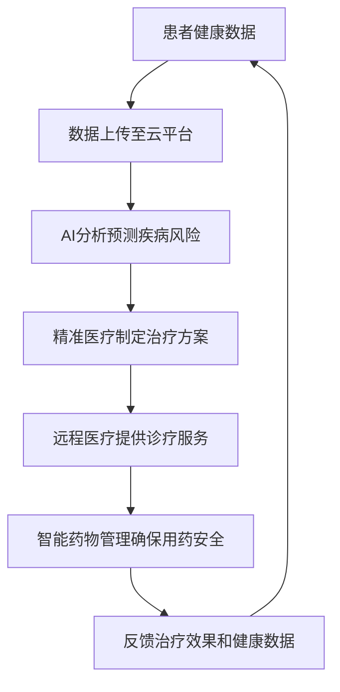

                 

# 《2050年的全球卫生：从疾病防控到健康促进的大健康战略》

> 关键词：全球卫生、大健康战略、疾病防控、健康促进、科技创新、国际合作

> 摘要：本文从2050年全球卫生的发展趋势出发，探讨了全球卫生面临的挑战与应对策略，详细阐述了大健康战略的概念与框架，疾病防控与健康管理的重要性，以及科技在疾病防控中的应用。文章还分析了全球卫生合作与治理的现状及未来展望，强调了中国在全球卫生中的角色与责任。通过本文，我们期望为全球卫生的发展提供有益的思考和参考。

## 第一部分：2050年全球卫生背景与现状

### 第1章：2050年全球卫生的发展趋势

#### 1.1 2050年全球人口结构变化

在2050年，全球人口预计将达到100亿左右，其中人口老龄化趋势明显。根据联合国人口基金会的预测，到2050年，全球60岁及以上人口将达到21亿，占总人口的21%。这将对全球卫生体系带来巨大挑战，尤其是在医疗资源分配、老年病管理、长期护理等方面。

#### 1.2 全球环境变化对卫生的影响

随着全球气候变化加剧，极端天气事件增多，自然灾害频发，对公共卫生安全构成威胁。例如，气候变化可能导致传染病传播范围扩大，如疟疾、登革热等。此外，环境污染和生态破坏也会对人类健康产生负面影响，如空气污染导致的呼吸系统疾病、水源污染引起的肠道感染等。

#### 1.3 全球卫生挑战与应对策略

在未来，全球卫生将面临诸多挑战，包括传染病的威胁、非传染性疾病（如心血管疾病、糖尿病等）的增多、心理健康问题的突出等。为此，需要采取一系列应对策略，如加强疾病监测与预警、完善公共卫生体系、推动健康教育和健康促进、提高医疗服务质量等。

### 第2章：大健康战略的概念与框架

#### 2.1 大健康战略的定义

大健康战略是一种以人民健康为中心，整合预防、治疗、康复、养生等多种健康服务，实现全人群、全生命周期健康维护的战略。它强调健康不仅是没有疾病，还包括身体、心理和社会适应能力的良好状态。

#### 2.2 大健康战略的核心要素

大健康战略的核心要素包括健康政策、健康服务、健康教育和健康产业。健康政策提供政策支持和制度保障；健康服务涵盖预防、治疗、康复和护理等环节；健康教育提高全民健康素养；健康产业则通过市场化运作，推动大健康产业的发展。

#### 2.3 大健康战略的实施框架

大健康战略的实施框架包括以下几个方面：一是建立健全健康政策体系，二是优化健康服务供给，三是强化健康教育，四是发展健康产业，五是完善健康保障体系。

## 第二部分：疾病防控与健康管理

### 第3章：疾病防控体系构建

#### 3.1 疾病防控原则与策略

疾病防控原则包括预防为主、防治结合、分级诊疗、全民参与等。疾病防控策略主要包括疫苗接种、健康教育、传染病监测、疫情预警等。

#### 3.2 公共卫生体系的建设与改进

公共卫生体系的建设与改进需要从以下几个方面进行：一是完善公共卫生法律法规，二是加强公共卫生机构建设，三是提高公共卫生服务能力，四是加强国际公共卫生合作。

#### 3.3 疾病监测与预警系统

疾病监测与预警系统是疾病防控的重要手段。通过建立健全的监测网络，实时收集、分析疾病相关信息，有助于及时发现疫情，制定针对性的防控措施。

### 第4章：健康促进与生活方式干预

#### 4.1 健康促进的概念与目标

健康促进是指通过改善生活环境、提高健康意识、培养健康行为等措施，促进个体和群体的健康水平。健康促进的目标是提高全民健康素养，降低疾病负担，实现健康生活。

#### 4.2 生活方式疾病防控

生活方式疾病（如心血管疾病、糖尿病等）已成为全球健康的主要挑战。通过改变不良生活习惯，如合理膳食、适量运动、戒烟限酒等，可以有效预防生活方式疾病。

#### 4.3 健康教育与宣传策略

健康教育和宣传是健康促进的重要手段。通过多种形式的教育和宣传，提高公众的健康素养，引导人们树立正确的健康观念和生活方式。

### 第5章：个体健康管理

#### 5.1 个体健康档案构建

个体健康档案是健康管理的重要基础。通过建立个体健康档案，全面记录个体的健康信息，有助于实现个性化健康管理。

#### 5.2 健康风险评估与干预

健康风险评估是预测个体未来患病风险的重要手段。通过评估，可以针对性地进行健康干预，降低患病风险。

#### 5.3 健康管理服务模式

健康管理服务模式包括线上和线下两种形式。线上服务主要通过互联网平台提供健康咨询、健康监测等服务；线下服务则包括健康体检、健康讲座、康复训练等。

## 第三部分：科技与全球卫生

### 第6章：科技创新在疾病防控中的应用

#### 6.1 人工智能在疾病预测与防控中的应用

人工智能在疾病预测与防控中具有重要作用。通过大数据分析和机器学习算法，可以实现对疾病的早期预测和精准防控。

#### 6.2 精准医疗与基因治疗

精准医疗和基因治疗为疾病防控带来了新的突破。通过基因检测和个性化治疗方案，可以实现对疾病的精准治疗和预防。

#### 6.3 医疗物联网与远程医疗

医疗物联网和远程医疗为疾病防控提供了便捷的手段。通过物联网技术，可以实现医疗设备和患者数据的实时监测；远程医疗则有助于缓解医疗资源不足的问题。

### 第7章：全球卫生合作与治理

#### 7.1 全球卫生合作机制与挑战

全球卫生合作机制主要包括国际卫生组织、全球健康基金等。在全球卫生合作中，挑战主要体现在资金、技术、政策等方面。

#### 7.2 国际卫生组织的作用

国际卫生组织在全球卫生合作中发挥着重要作用。通过协调各国政策、提供技术支持、开展国际合作等，推动全球卫生事业的发展。

#### 7.3 全球卫生治理体系的完善

全球卫生治理体系的完善需要从政策、制度、资金等方面进行。通过构建更加完善、有效的全球卫生治理体系，可以更好地应对全球卫生挑战。

## 第四部分：2050年全球卫生展望

### 第8章：未来全球卫生的发展趋势

#### 8.1 全球卫生治理体系变革

未来全球卫生治理体系将更加注重国际合作、科技创新和全民参与。通过改革和创新，提升全球卫生治理体系的能力和水平。

#### 8.2 科技驱动下的全球卫生创新

科技驱动下的全球卫生创新将为疾病防控和健康管理带来新的突破。人工智能、基因编辑、医疗物联网等技术的应用，将推动全球卫生事业的发展。

#### 8.3 2050年全球卫生的愿景与目标

2050年全球卫生的愿景是实现全民健康、消除健康差距、实现可持续发展。目标包括：降低疾病负担、提高健康水平、实现健康公平、推动健康产业发展。

### 第9章：中国在全球卫生中的角色与责任

#### 9.1 中国在全球卫生合作中的地位

中国是全球卫生合作的重要参与者和贡献者。在全球卫生领域，中国发挥着重要作用，为全球健康事业做出积极贡献。

#### 9.2 中国在全球卫生领域的贡献

中国在疾病防控、健康教育、科技研发等方面取得了显著成果。通过国际援助、技术合作、资金支持等方式，中国为全球卫生事业做出了积极贡献。

#### 9.3 中国在全球卫生治理中的未来方向

未来，中国将继续深化全球卫生合作，积极参与国际卫生组织的事务，推动全球卫生治理体系的改革和完善。同时，中国还将加强科技创新，提升疾病防控和健康管理能力，为全球健康事业贡献力量。

## 附录

### 附录A：全球卫生相关数据与指标

#### A.1 人口与健康数据

- 全球人口：预计2050年将达到100亿左右。
- 老年人口：预计2050年占总人口的21%。
- 死亡原因：心血管疾病、癌症、糖尿病等非传染性疾病将成为主要死因。

#### A.2 疾病负担与死亡原因

- 传染病：如疟疾、登革热等。
- 非传染性疾病：如心血管疾病、糖尿病等。
- 心理健康问题：如抑郁症、焦虑症等。

#### A.3 卫生资源分布

- 卫生支出：全球卫生支出将持续增长。
- 医疗设施：发达国家医疗设施相对完善，发展中国家医疗资源不足。
- 医务人员：全球医务人员数量不足，尤其在农村和贫困地区。

### 附录B：国际卫生组织与倡议

#### B.1 世界卫生组织

- 作用：制定全球卫生政策、协调国际卫生合作、提供技术支持等。
- 成果：成功控制了多种传染病，提高了全球健康水平。

#### B.2 全球基金

- 作用：提供资金支持，帮助发展中国家开展公共卫生项目。
- 成果：显著降低了疟疾、艾滋病等传染病的负担。

#### B.3 世界银行全球卫生项目

- 作用：通过金融手段支持全球卫生事业，推动健康产业发展。
- 成果：帮助多个国家改善了卫生基础设施，提高了医疗服务质量。

### 附录C：科技与全球卫生研究报告

#### C.1 人工智能在公共卫生中的应用报告

- 应用领域：疾病预测、疫情防控、健康监测等。
- 成果：提高了疾病防控的效率，降低了医疗成本。

#### C.2 精准医疗发展趋势报告

- 应用领域：个性化治疗、基因检测、药物研发等。
- 成果：推动了医学发展，提高了治疗效果。

#### C.3 医疗物联网发展现状与展望报告

- 应用领域：医疗设备联网、远程医疗、健康监测等。
- 成果：提高了医疗服务质量，促进了医疗资源的优化配置。

### 作者

- 作者：AI天才研究院/AI Genius Institute & 禅与计算机程序设计艺术 /Zen And The Art of Computer Programming

---

本文通过对2050年全球卫生的背景分析，详细阐述了大健康战略的概念与框架，疾病防控与健康管理的重要性，以及科技在疾病防控中的应用。同时，本文还分析了全球卫生合作与治理的现状及未来展望，强调了中国在全球卫生中的角色与责任。希望通过本文，为全球卫生的发展提供有益的思考和参考。在未来的发展中，全球卫生领域将继续面临诸多挑战，但同时也蕴藏着巨大的机遇。让我们携手共进，为构建一个更加健康、和谐的世界而努力！### 2050年全球卫生背景与现状

在2050年的全球卫生格局中，人口结构变化、环境变化以及全球卫生挑战将共同塑造未来卫生体系的形态。首先，人口结构的变化将成为一个显著的趋势。随着全球人口预计将达到100亿左右，老龄化问题尤为突出。根据联合国人口基金会的预测，到2050年，全球60岁及以上人口将达到21亿，占总人口的21%。这一趋势将对医疗资源分配、医疗服务供给、老年病管理等方面产生深远影响。老年人口的增加意味着对慢性病管理、长期护理和心理健康服务的需求将显著上升，这对现有的公共卫生体系提出了新的挑战。

其次，全球环境变化对卫生的影响也不可忽视。气候变化导致极端天气事件增多，自然灾害频发，这些事件不仅对人类生命安全构成威胁，也对公共卫生安全产生直接影响。例如，气候变化可能导致传染病传播范围扩大，如疟疾、登革热等，这些疾病在温暖湿润的环境中更易传播。此外，环境污染和生态破坏也会对人类健康产生负面影响。空气污染导致的呼吸系统疾病、水源污染引起的肠道感染等问题将日益严重。因此，环境保护和公共卫生之间存在着密切的关联，需要全球共同努力来应对环境变化带来的健康挑战。

面对这些挑战，全球卫生领域将需要采取一系列应对策略。首先，加强疾病监测与预警系统至关重要。建立一个高效、灵敏的疾病监测与预警系统，能够及时发现疾病的传播趋势，为制定针对性的防控措施提供数据支持。其次，完善公共卫生体系是应对全球卫生挑战的基础。这包括建立健全的公共卫生法律法规，加强公共卫生机构建设，提高公共卫生服务能力，以及加强国际公共卫生合作。通过这些措施，可以更好地应对传染病的爆发和传播，提高全民健康水平。

此外，健康促进和疾病预防策略也将成为全球卫生工作的重点。健康促进不仅包括改善生活环境、提高健康意识，还包括培养健康行为和生活方式。通过健康教育、健康宣传和生活方式干预，可以降低疾病的发生率，提高人群的整体健康水平。疾病预防策略则强调疫苗接种、定期体检、健康风险评估等措施，以降低疾病负担。

总之，2050年的全球卫生将面临人口老龄化、环境变化和传染病等多重挑战。通过加强疾病监测与预警、完善公共卫生体系、推动健康促进和疾病预防，全球卫生领域将努力应对这些挑战，为人类创造一个更加健康、安全的世界。未来，全球卫生事业的发展需要各国政府、国际组织、科技企业和公众的共同努力，共同构建一个更加完善、有效的全球卫生治理体系。

### 大健康战略的概念与框架

大健康战略是一种全新的卫生治理理念，旨在通过整合预防、治疗、康复和养生等多种健康服务，实现全人群、全生命周期的健康维护。其核心理念是“大卫生、大健康”，不仅仅关注疾病的治疗，更注重疾病的预防和健康促进。在2050年的全球卫生格局中，大健康战略将成为应对卫生挑战的重要工具，为实现全民健康提供有力保障。

#### 大健康战略的定义

大健康战略可以定义为一种全方位、全周期维护人民群众身心健康的行动指南。它不仅涵盖传统的医疗服务，还包括健康生活方式的倡导、健康环境的营造、健康教育的普及等。其目标是提升全民健康水平，减少疾病负担，实现健康公平，推动经济社会可持续发展。

#### 大健康战略的核心要素

大健康战略的核心要素包括健康政策、健康服务、健康教育和健康产业。

1. **健康政策**：健康政策是大健康战略的基石。政府通过制定和实施健康政策，提供制度保障和资金支持，引导全社会关注健康。健康政策包括卫生法律法规、卫生规划、健康行动计划等，旨在改善健康环境，提升健康服务水平。

2. **健康服务**：健康服务是保障全民健康的重要手段。健康服务涵盖预防、治疗、康复和护理等环节。预防服务包括疫苗接种、健康体检、健康教育等；治疗服务包括急诊救治、疾病诊治、康复护理等；康复服务包括康复训练、心理辅导、社区康复等；护理服务包括长期护理、临终关怀、护理培训等。

3. **健康教育**：健康教育是提高全民健康素养的关键。通过健康教育，可以普及健康知识，提高人们的健康意识和自我保健能力。健康教育的方式包括健康讲座、健康宣传、健康知识传播等，旨在引导人们形成健康的生活方式，降低疾病风险。

4. **健康产业**：健康产业是推动大健康战略实施的重要力量。健康产业包括医疗器械、药品制造、健康保险、健康管理服务等。健康产业的发展不仅可以创造经济价值，还可以提升医疗服务质量和效率，为全民健康提供有力支持。

#### 大健康战略的实施框架

大健康战略的实施框架包括以下几个方面：

1. **建立健全健康政策体系**：健康政策体系是保障大健康战略顺利实施的基础。政府需要制定科学、合理的健康政策，确保政策的连贯性和可操作性。健康政策体系应包括卫生法律法规、卫生规划、健康行动计划等，为健康服务、健康教育和健康产业发展提供制度保障。

2. **优化健康服务供给**：优化健康服务供给是提升全民健康水平的重要环节。政府需要加大对医疗基础设施的投入，提高医疗服务质量，推动医疗资源的均衡分布。同时，应鼓励社会力量参与健康服务供给，提供多样化、个性化的健康服务。

3. **强化健康教育**：强化健康教育是提高全民健康素养的关键。政府和社会各界需要共同推进健康教育，通过多种形式普及健康知识，提高公众的健康意识和自我保健能力。健康教育应贯穿于人们的生活和工作中，形成全社会关注健康、支持健康的良好氛围。

4. **发展健康产业**：发展健康产业是推动大健康战略实施的重要力量。政府需要制定支持健康产业发展的政策，鼓励技术创新和产业升级，提升健康产业的整体竞争力。健康产业应包括医疗器械、药品制造、健康保险、健康管理服务等，通过市场化运作，为全民健康提供有力支持。

5. **完善健康保障体系**：完善健康保障体系是保障全民健康的重要手段。政府需要建立健全的医疗保障制度，确保人民群众享有基本的健康保障。健康保障体系应包括医疗保险、医疗救助、公共卫生服务等，为全民健康提供坚实的保障。

总之，大健康战略是一种全面、系统、长期的卫生治理理念，旨在通过整合预防、治疗、康复和养生等多种健康服务，实现全民健康。在2050年的全球卫生格局中，大健康战略将成为应对卫生挑战的重要工具，为实现全民健康提供有力保障。通过建立健全健康政策体系、优化健康服务供给、强化健康教育、发展健康产业和完善健康保障体系，全球卫生领域将迈向更加健康、和谐的发展轨道。

### 疾病防控体系构建

疾病防控体系是保障公共卫生安全、维护人民健康的重要手段。在全球卫生领域，疾病防控体系的建设与改进至关重要。一个有效的疾病防控体系应包括疾病防控原则、公共卫生体系建设以及疾病监测与预警系统等方面。

#### 疾病防控原则与策略

疾病防控原则是指在进行疾病预防与控制时应当遵循的基本准则。主要原则包括以下几个方面：

1. **预防为主**：预防是疾病防控的核心，通过预防措施可以有效减少疾病的发生和传播。预防措施包括疫苗接种、健康生活方式的推广、环境卫生管理、健康教育等。

2. **防治结合**：疾病防控不仅包括预防措施，还包括治疗和控制。在疾病爆发时，及时采取治疗措施，控制病情蔓延，减少疾病对人群的危害。

3. **分级诊疗**：分级诊疗是指根据病情的严重程度，将患者分配到不同级别的医疗机构进行治疗。通过分级诊疗，可以有效优化医疗资源，提高疾病防控的效率。

4. **全民参与**：疾病防控需要全社会的共同参与。政府、医疗机构、社会组织和公众应共同参与疾病预防与控制工作，形成全民防控的良好氛围。

针对这些原则，可以采取以下疾病防控策略：

- **疫苗接种**：疫苗接种是预防传染病最有效的手段。通过大规模疫苗接种，可以建立人群免疫屏障，减少疾病的传播。

- **健康教育**：健康教育是提高全民健康素养的重要途径。通过健康教育，可以普及疾病预防知识，引导人们养成良好的生活习惯，降低疾病风险。

- **环境卫生管理**：环境卫生管理包括饮水安全、食品安全、环境卫生治理等。通过改善环境卫生，可以减少疾病的发生和传播。

- **传染病监测**：建立完善的传染病监测系统，实时收集和分析传染病疫情信息，及时发现疫情，采取有效的防控措施。

#### 公共卫生体系的建设与改进

公共卫生体系是疾病防控的核心，其建设与改进直接关系到疾病防控的效果。以下是从几个方面来探讨公共卫生体系的建设与改进：

1. **法律法规建设**：建立健全的公共卫生法律法规，为公共卫生工作提供法律依据和保障。公共卫生法律法规应包括传染病防治法、公共卫生法、环境卫生法等。

2. **公共卫生机构建设**：加强公共卫生机构的建设，提高公共卫生服务的供给能力。公共卫生机构应包括疾病预防控制中心、卫生监督机构、社区卫生服务中心等。

3. **公共卫生服务能力提升**：提升公共卫生服务的质量与效率，确保公众能够享受到高质量的公共卫生服务。这包括加强医务人员培训、提高疾病监测与预警能力、完善公共卫生信息系统等。

4. **国际合作**：加强国际公共卫生合作，借鉴国际先进经验，提升本国公共卫生水平。通过国际合作，可以引进新技术、新方法，提高疾病防控能力。

#### 疾病监测与预警系统

疾病监测与预警系统是疾病防控的重要手段，其目标是及时发现疫情，采取有效的防控措施。以下是从几个方面来探讨疾病监测与预警系统的建设：

1. **监测网络建设**：建立覆盖全国乃至全球的疾病监测网络，实时收集和分析传染病疫情信息。监测网络应包括各级疾病预防控制中心、医疗机构、社区卫生服务中心等。

2. **信息共享**：实现各级疾病监测数据的实时共享，提高疾病监测的灵敏性和准确性。通过信息共享，可以及时发现疫情，制定针对性的防控措施。

3. **预警机制**：建立完善的预警机制，对传染病疫情进行风险评估，提前预测疫情发展趋势。预警机制应包括预警指标体系、预警响应程序等。

4. **应急预案**：制定详细的应急预案，明确疫情爆发时的应对措施和责任分工。通过应急预案，可以确保在疫情爆发时能够迅速采取行动，有效控制疫情。

总之，疾病防控体系的建设与改进是保障公共卫生安全、维护人民健康的重要措施。通过遵循疾病防控原则、完善公共卫生体系、建立疾病监测与预警系统，全球卫生领域将更好地应对各种疾病威胁，为人类创造一个更加健康、安全的生活环境。

### 健康促进与生活方式干预

健康促进与生活方式干预是提升全民健康水平的重要策略。在2050年的全球卫生格局中，随着人口老龄化、慢性病增多以及心理健康问题的凸显，健康促进与生活方式干预将发挥越来越重要的作用。

#### 健康促进的概念与目标

健康促进是指通过多种手段，提高个体和群体的健康水平，实现健康生活。其核心目标包括：

1. **提高全民健康素养**：健康素养是指个体获取、理解和处理基本健康信息和服务的能力。提高全民健康素养有助于个体做出有利于健康的选择，降低疾病风险。

2. **预防疾病**：通过健康促进，可以预防传染性疾病、非传染性疾病以及慢性病的发生。健康促进措施包括疫苗接种、定期体检、健康生活方式的推广等。

3. **提升生活质量**：健康促进不仅关注疾病预防，还关注个体的心理健康和社会适应能力。通过健康促进，可以提升个体的生活质量，增强社会功能。

4. **实现健康公平**：健康促进旨在消除健康差距，确保不同人群、不同地区都能够享受到公平的健康服务。

#### 生活方式疾病防控

生活方式疾病（如心血管疾病、糖尿病等）已成为全球健康的主要挑战。防控生活方式疾病的关键在于改变不良生活习惯，以下是一些具体措施：

1. **合理膳食**：合理膳食是预防生活方式疾病的基础。建议人们摄入低盐、低脂、高纤维的食物，减少糖和饱和脂肪的摄入。

2. **适量运动**：适量运动有助于维持身体健康，降低心血管疾病和糖尿病等慢性病的风险。每周至少进行150分钟的中等强度运动，或75分钟的高强度运动。

3. **戒烟限酒**：吸烟和过量饮酒是导致多种慢性病的主要风险因素。戒烟和限酒可以显著降低心血管疾病、癌症等疾病的发病风险。

4. **心理平衡**：心理平衡对于预防生活方式疾病同样重要。通过压力管理、心理健康教育和心理支持，可以降低心理压力，提高心理健康水平。

#### 健康教育与宣传策略

健康教育和宣传是健康促进的重要组成部分，其目的是提高公众的健康意识，引导人们采取健康的生活方式。以下是一些有效的健康教育和宣传策略：

1. **大众媒体宣传**：利用电视、广播、报纸、网络等大众媒体，传播健康知识，宣传健康生活方式。通过制作生动、有趣的健康节目和广告，吸引公众关注健康问题。

2. **社区健康讲座**：在社区、学校、企业等场所组织健康讲座，向公众普及健康知识。讲座内容应贴近生活，易于理解，提高公众的健康素养。

3. **健康宣传材料**：制作和分发健康宣传材料，如手册、海报、折页等，提供实用的健康信息。宣传材料应简明扼要，图文并茂，易于阅读。

4. **社交媒体推广**：利用社交媒体平台，如微信、微博、抖音等，推广健康知识。通过发布健康文章、视频、互动话题等，吸引公众参与健康讨论。

5. **健康网站和APP**：建立健康网站和手机应用程序，提供在线健康咨询、健康测评、健康指导等服务。这些平台可以实时更新健康信息，方便公众随时获取健康知识。

通过健康促进与生活方式干预，可以有效地降低疾病负担，提高全民健康水平。在未来，全球卫生领域将更加重视健康促进与生活方式干预的作用，通过多渠道、多形式的健康教育和宣传，引导人们树立正确的健康观念，养成健康的生活方式。

### 个体健康管理

个体健康管理是提升全民健康水平的重要手段，通过对个体健康信息的收集、分析和干预，实现个性化健康服务。在2050年的全球卫生格局中，个体健康管理将成为疾病防控和健康促进的重要一环。

#### 个体健康档案构建

个体健康档案是健康管理的基础，它记录了个体的健康信息，包括但不限于：基本信息（如姓名、年龄、性别等）、健康检查记录（如血压、血糖、血脂等指标）、疾病史、家族病史、生活习惯、心理状态等。建立个体健康档案，可以全面了解个体的健康状况，为制定个性化的健康管理方案提供依据。

个体健康档案的构建通常包括以下几个步骤：

1. **信息收集**：通过医疗机构、健康检查机构、个人健康记录等渠道，收集个体的健康信息。

2. **数据整合**：将收集到的健康信息进行整合，确保数据的准确性和完整性。

3. **信息存储**：将整合后的健康信息存储在电子健康档案系统中，便于后续查询和管理。

4. **定期更新**：定期更新个体的健康信息，确保档案的实时性和有效性。

#### 健康风险评估与干预

健康风险评估是预测个体未来患病风险的重要手段。通过对个体健康档案的分析，可以识别出健康风险较高的个体，并采取针对性的干预措施，降低患病风险。

健康风险评估通常包括以下步骤：

1. **风险评估模型构建**：根据个体的健康信息，构建风险评估模型。模型可以基于统计学方法、机器学习算法等，预测个体的患病风险。

2. **风险评分计算**：使用风险评估模型，对个体的健康风险进行评分。评分越高，表示健康风险越高。

3. **干预方案制定**：根据评估结果，制定个性化的干预方案。干预措施可以包括健康生活方式的指导、药物预防、定期体检等。

#### 健康管理服务模式

健康管理服务模式包括线上和线下两种形式，旨在为个体提供全面的健康管理服务。

1. **线上健康管理服务**：通过互联网和移动应用程序，提供健康咨询、健康监测、健康报告等服务。个体可以通过手机或电脑，随时查看自己的健康信息，接受在线医生的建议和指导。

2. **线下健康管理服务**：线下健康管理服务包括健康体检、健康讲座、康复训练等。通过医疗机构、社区服务中心等场所，为个体提供专业的健康管理服务。

以下是一个典型的健康管理服务模式：

- **健康体检**：定期进行健康体检，全面评估个体的健康状况。体检项目包括血压、血糖、血脂、肝功能等。
- **健康咨询**：通过电话、在线咨询等方式，为个体提供健康咨询服务。医生可以根据健康档案和体检结果，给出个性化的健康建议。
- **健康监测**：使用可穿戴设备、健康APP等，实时监测个体的健康指标。监测数据将上传到健康档案系统中，供医生分析和评估。
- **健康干预**：根据健康风险评估结果，采取针对性的健康干预措施。干预措施包括健康生活方式的指导、药物治疗、康复训练等。

通过个体健康管理，可以实现对疾病的早期预防和控制，提高个体的健康水平。在未来，随着信息技术的发展，个体健康管理将更加智能化、个性化，为全民健康提供更高效、更精准的服务。

### 科技创新在疾病防控中的应用

随着科技的快速发展，人工智能、精准医疗、医疗物联网等技术在疾病防控中的应用日益广泛，极大地提升了疾病预测、治疗和管理的效率。在2050年的全球卫生格局中，这些科技创新将发挥关键作用，推动疾病防控体系向智能化、精准化和个性化方向发展。

#### 人工智能在疾病预测与防控中的应用

人工智能（AI）通过大数据分析和机器学习算法，为疾病预测与防控提供了强大的技术支持。以下是一些具体应用：

1. **疾病预测**：利用AI技术，可以从海量医疗数据中挖掘出疾病的早期迹象，实现早期预测。例如，通过分析电子健康记录、基因数据、生活方式数据等，AI可以预测个体未来患某种疾病的风险，从而采取预防措施。

   ```python
   # 伪代码：疾病预测模型
   def predict_disease(risk_factors):
       model = load_pretrained_model()
       prediction = model.predict(risk_factors)
       return prediction
   ```

2. **疫情监控**：AI技术可以实时监控全球疫情动态，通过分析疫情数据，预测疫情的传播趋势和严重程度，为公共卫生决策提供科学依据。

3. **个性化治疗**：基于个体健康数据，AI可以推荐个性化的治疗方案，提高治疗效果。例如，通过分析患者的基因信息、病史、生活方式等，AI可以制定个性化的药物治疗方案。

#### 精准医疗与基因治疗

精准医疗和基因治疗是疾病防控领域的重要突破，它们通过基因检测和个性化治疗方案，实现疾病的精准治疗和预防。

1. **基因检测**：基因检测技术可以识别个体携带的遗传突变，预测患病风险。通过全基因组测序或基因芯片技术，医生可以获取个体的基因信息，为个性化治疗提供基础。

   ```python
   # 伪代码：基因检测分析
   def analyze_genome_sequence(sequences):
       mutations = detect_mutations(sequences)
       return mutations
   ```

2. **个性化治疗**：精准医疗根据患者的基因特征，制定个性化的治疗方案。例如，对于癌症患者，通过基因检测确定肿瘤类型和突变基因，可以采取靶向药物治疗，提高疗效。

3. **基因编辑**：基因编辑技术，如CRISPR-Cas9，可以精确修改基因序列，治疗遗传性疾病。例如，通过编辑导致遗传性疾病的特定基因，可以消除病症。

#### 医疗物联网与远程医疗

医疗物联网（IoMT）和远程医疗技术将医疗设备和患者数据连接起来，实现实时监测和远程诊疗，提高了疾病防控的效率和覆盖面。

1. **实时监测**：通过可穿戴设备、智能传感器等，医疗物联网可以实时监测患者的生命体征，如心率、血压、血糖等。监测数据上传至云端，医生可以远程监控患者的健康状况。

   ```python
   # 伪代码：实时监测数据上传
   def upload_health_data(data):
       api = HealthDataAPI()
       api.upload_data(data)
   ```

2. **远程诊疗**：远程医疗技术使得医生可以通过视频会议、远程诊断系统为患者提供诊疗服务，特别是在医疗资源匮乏的地区，远程医疗可以大幅提升医疗服务的可及性和质量。

3. **智能药物管理**：医疗物联网还可以用于智能药物管理，通过药品智能监测系统，确保患者按时服药，减少药物滥用和误用。

#### 科技创新的综合应用

科技创新的综合应用极大地提升了疾病防控的整体水平。例如，将人工智能、精准医疗和医疗物联网技术相结合，可以构建一个智能化的疾病防控系统。该系统可以实时监测患者的健康状况，预测疾病风险，提供个性化的治疗方案，并实现远程监控和干预。



通过这样的综合应用，科技创新为疾病防控带来了前所未有的变革，使得疾病预测、治疗和管理更加高效、精准和个性化。在未来，随着科技的进一步发展，这些创新技术将在全球卫生领域发挥更加重要的作用，助力实现全民健康的目标。

### 全球卫生合作与治理

在全球卫生领域，国际合作与治理是应对复杂卫生挑战的关键。全球卫生合作机制、国际卫生组织的作用以及全球卫生治理体系的完善，都在推动全球卫生事业的发展，保障全球人民的健康。

#### 全球卫生合作机制与挑战

全球卫生合作机制是各国政府、国际组织、非政府组织和企业共同参与的框架，旨在协调资源、分享信息、共同应对全球卫生挑战。这些机制包括多边协议、合作项目、联合研究等。例如，全球卫生安全议程（GHSA）是一个旨在提升各国应对突发公共卫生事件能力的国际合作机制。尽管这些机制在应对疾病爆发、疫情监测和疾病防控等方面发挥了重要作用，但合作中也面临诸多挑战：

1. **资金不足**：全球卫生合作项目往往需要大量资金支持，但各国对卫生事业的投入存在不平衡，特别是发展中国家在资金方面的压力更大。

2. **技术差异**：不同国家和地区在卫生技术、医疗资源和管理水平上存在差异，这导致合作过程中难以实现技术共享和标准化。

3. **政治因素**：全球卫生合作受到政治因素的影响，国际关系、地缘政治等可能影响合作的顺利进行。

4. **信息共享障碍**：信息共享是有效合作的基础，但各国在数据隐私、知识产权等方面存在顾虑，导致信息共享不畅。

#### 国际卫生组织的作用

国际卫生组织（如世界卫生组织WHO、联合国儿童基金会UNICEF、红十字会与红新月会国际联合会ICRC等）在全球卫生合作与治理中发挥着核心作用。以下是国际卫生组织的主要职责和成果：

1. **政策制定与协调**：国际卫生组织制定全球卫生政策，协调各国政府之间的合作，推动全球卫生议程。

2. **技术支持与培训**：国际卫生组织提供技术支持，帮助各国提升公共卫生能力和疾病防控水平。例如，WHO提供的疾病监测和疫苗接种培训，提高了全球公共卫生应急响应能力。

3. **资金筹集与分配**：国际卫生组织通过多种渠道筹集资金，并合理分配给各国卫生项目，支持全球卫生事业发展。

4. **应急响应与援助**：在疾病爆发、自然灾害等紧急情况下，国际卫生组织迅速行动，提供物资援助、技术支持和人道援助。

#### 全球卫生治理体系的完善

全球卫生治理体系的完善是确保全球卫生合作有效运行的基础。以下是从几个方面来探讨全球卫生治理体系的完善：

1. **加强法律法规建设**：建立健全的全球卫生法律法规，确保国际卫生合作的合法性和规范性。各国应遵守国际卫生法律法规，提升全球卫生治理的法律效力。

2. **提升公共卫生应急能力**：通过建立完善的公共卫生应急管理体系，提高各国应对突发公共卫生事件的能力。这包括加强疾病监测与预警系统、提高应急物资储备、完善应急预案等。

3. **促进信息共享与透明度**：加强全球卫生信息共享，提高卫生数据的透明度和可访问性。通过建立全球卫生信息平台，实现各国卫生数据的互联互通，提高全球卫生监测和决策的科学性。

4. **增强资金保障**：确保全球卫生合作项目有充足的资金支持，通过多渠道筹集资金，特别是增加对发展中国家的资金援助。此外，应探索创新融资模式，如公私合作伙伴关系（PPPs）和债券发行等。

5. **推动科技合作**：鼓励全球卫生领域的技术创新和合作，通过共享科技成果，提升全球卫生治理的科学性和有效性。各国应加强科技合作，共同推动全球卫生科技的进步。

总之，全球卫生合作与治理是一个复杂而长期的过程，需要各国政府、国际组织、科技企业和公众的共同努力。通过完善全球卫生合作机制、发挥国际卫生组织的作用、推动全球卫生治理体系的完善，我们可以共同应对全球卫生挑战，为全球人民的健康福祉贡献力量。

### 未来全球卫生的发展趋势

在未来，全球卫生领域将经历深刻的变革，体现在全球卫生治理体系的变化、科技驱动的创新以及全球卫生愿景与目标的设定等方面。

#### 全球卫生治理体系变革

全球卫生治理体系的变革是未来全球卫生发展的关键趋势之一。随着全球化的深入发展，各国之间的卫生联系日益紧密，传统的国家卫生治理模式已无法有效应对全球卫生挑战。未来，全球卫生治理体系将向以下方向变革：

1. **多边合作机制强化**：全球卫生治理将更加依赖多边合作机制，各国政府、国际组织、非政府组织和私营部门将共同参与全球卫生事务。通过多边合作，可以整合全球资源，提高应对卫生危机的能力。

2. **治理体系规范化**：全球卫生治理体系将更加规范化，各国将制定和遵循统一的卫生标准和法规，确保卫生治理的合法性和一致性。国际卫生法律和国际卫生条例将成为全球卫生治理的重要依据。

3. **数据共享与透明度提升**：全球卫生治理将更加注重数据的共享和透明度。各国政府将建立完善的数据收集、分析和共享机制，确保卫生数据的及时性和准确性。通过共享数据，可以更好地监测疾病动态，制定科学的公共卫生政策。

4. **应急响应能力提升**：全球卫生治理体系将加强公共卫生应急响应能力，建立快速反应机制，确保在疾病爆发和公共卫生危机时能够迅速采取行动，减少人员伤亡和健康损失。

#### 科技驱动下的全球卫生创新

科技的快速发展为全球卫生创新提供了强大动力，人工智能、精准医疗、医疗物联网等新兴技术将在未来发挥重要作用：

1. **人工智能在疾病预测与防控中的应用**：人工智能（AI）技术将在疾病预测、诊断和治疗中发挥关键作用。通过分析海量健康数据，AI可以预测疾病的爆发趋势，提供个性化治疗方案，提高疾病防控的精准性和效率。

2. **精准医疗的发展**：精准医疗通过基因检测和生物标志物的应用，为个体提供个性化治疗方案。未来，精准医疗将推动医学从传统的“一刀切”模式向个性化治疗转变，提高治疗的有效性和安全性。

3. **医疗物联网的普及**：医疗物联网（IoMT）技术将实现医疗设备和患者数据的互联互通，提供实时监测和远程诊疗服务。通过智能穿戴设备和健康监测系统，可以实时收集患者的健康数据，实现早期预警和精准治疗。

4. **数字健康的应用**：数字健康（Digital Health）技术，如电子健康记录（EHR）、远程医疗（Telemedicine）和健康信息管理平台（HIM），将改变传统的医疗服务模式，提高医疗服务的可及性和效率。

#### 2050年全球卫生的愿景与目标

到2050年，全球卫生的愿景是实现全民健康、消除健康差距和实现可持续发展。为了实现这一愿景，全球卫生领域设定了以下目标：

1. **全民健康**：确保所有人都能获得基本医疗服务，无论年龄、性别、收入和地理位置，实现健康公平。

2. **健康公平**：消除健康差距，确保不同人群和地区都能享受到同等水平的医疗服务。特别是关注贫困人口、边缘群体和弱势群体，提高他们的健康水平。

3. **可持续发展**：将健康纳入可持续发展议程，通过促进健康生活方式、预防疾病和改善环境卫生，实现经济、社会和环境的协调发展。

4. **疾病防控**：加强传染病的防控能力，实现全球范围内传染病的有效控制，降低疾病的发病率和死亡率。

5. **健康促进**：通过健康教育、健康宣传和生活方式干预，提高全民健康素养，引导人们养成健康的生活方式，减少疾病风险。

6. **科技创新**：鼓励科技创新，推动全球卫生领域的科技进步，利用新技术提高疾病防控和健康管理的效率和质量。

总之，未来全球卫生的发展趋势将是在多边合作、规范化治理、科技创新的推动下，实现全民健康、健康公平和可持续发展。通过不断探索和改进全球卫生治理体系，我们有望为全球人民创造一个更加健康、安全、和谐的生活环境。

### 中国在全球卫生中的角色与责任

在全球卫生领域，中国发挥着日益重要的角色，无论是在国际合作中的地位，还是在疾病防控和健康促进方面的贡献，中国都展现出了强大的实力和影响力。随着全球卫生挑战的加剧，中国在全球卫生治理中的未来方向也日益明确。

#### 中国在全球卫生合作中的地位

中国作为世界上人口最多的国家，其全球卫生合作地位不容忽视。中国在多个国际卫生组织中担任重要职务，积极参与全球卫生事务。例如，中国是世界卫生组织（WHO）的创始成员国之一，目前担任WHO执行委员会成员，并积极参与全球卫生议程的制定。此外，中国还积极参与了全球基金（Global Fund）、世界银行全球卫生项目等国际组织的合作项目，为全球卫生事业提供资金和技术支持。

中国在全球卫生合作中的地位体现在以下几个方面：

1. **资金支持**：中国通过提供资金援助，支持发展中国家的公共卫生项目。例如，中国向非洲国家提供疫苗、医疗设备和财政援助，帮助这些国家提升公共卫生水平。

2. **技术援助**：中国在疾病防控、公共卫生体系建设等方面积累了丰富的经验，通过技术援助，帮助其他发展中国家提升疾病防控能力。中国积极参与国际卫生组织的培训和交流活动，分享成功经验和最佳实践。

3. **国际合作项目**：中国与其他国家合作，共同开展全球卫生项目。例如，中国与联合国儿童基金会（UNICEF）合作，开展儿童疫苗接种项目，提高全球疫苗接种率。

#### 中国在全球卫生领域的贡献

中国在疾病防控和健康促进方面取得了显著成果，为全球卫生事业做出了重要贡献：

1. **疾病防控**：中国在抗击传染病方面取得了显著成绩。例如，在抗击埃博拉病毒和新冠病毒疫情中，中国迅速行动，提供援助，分享防控经验，为全球疫情防控做出了积极贡献。

2. **公共卫生体系建设**：中国加强了公共卫生体系建设，提升了公共卫生服务的质量和可及性。通过实施健康中国战略，中国推动了全民健康政策的制定和实施，提高了全民健康素养。

3. **科技创新**：中国在医疗卫生领域进行大量科技创新，推动医疗技术进步。例如，中国在基因编辑、精准医疗和医疗物联网等方面取得了重要突破，为全球健康科技发展提供了新的动力。

4. **国际援助**：中国积极参与国际援助，向发展中国家提供医疗援助和技术支持。例如，中国援助非洲的“光明行”项目，为数千名贫困患者提供免费眼科手术，改善了他们的生活质量。

#### 中国在全球卫生治理中的未来方向

面对未来全球卫生挑战，中国将继续深化全球卫生合作，发挥其独特的作用和责任。以下是几个中国在全球卫生治理中的未来方向：

1. **加强国际合作**：中国将继续加强与全球卫生组织的合作，积极参与国际卫生事务，推动全球卫生治理体系的完善。通过加强国际合作，共同应对全球卫生挑战。

2. **推动科技创新**：中国将继续加大在医疗卫生领域的科技投入，推动医疗技术的创新和应用。通过科技创新，提升疾病防控和健康管理的效率和质量，为全球健康事业提供技术支持。

3. **提升公共卫生能力**：中国将进一步加强公共卫生体系建设，提升公共卫生服务的可及性和质量。特别是在应对传染病、慢性病和心理健康问题等方面，加强公共卫生应急能力，提升全球公共卫生水平。

4. **促进健康公平**：中国将致力于消除健康差距，推动健康公平。通过实施健康扶贫政策，提高贫困地区和贫困人口的健康水平，实现全民健康。

5. **积极参与全球健康治理**：中国将积极参与全球健康治理，推动全球健康议程的制定和实施。通过提供资金、技术支持和政策建议，为全球健康事业贡献力量。

总之，中国在全球卫生领域具有独特的优势和责任。在未来的全球卫生治理中，中国将继续发挥重要作用，通过国际合作、科技创新和公共卫生能力的提升，为全球健康事业贡献力量，实现全民健康和可持续发展。

### 全球卫生相关数据与指标

在全球卫生领域，数据与指标是衡量健康水平、疾病负担和卫生资源分配的重要工具。以下是对全球卫生相关数据与指标的分析，包括人口与健康数据、疾病负担与死亡原因，以及卫生资源分布。

#### 人口与健康数据

1. **全球人口**：根据联合国预测，2050年全球人口预计将达到100亿左右，这将对卫生资源的需求产生巨大压力。尤其是老年人口比例的增加，将对医疗服务和长期护理产生显著影响。

2. **老年人口**：2050年，全球60岁及以上人口预计将达到21亿，占总人口的21%。这一变化意味着更多的医疗资源将用于老年病的预防和治疗，如心血管疾病、糖尿病和心理健康问题。

3. **中低收入国家**：中低收入国家的人口增长速度较快，预计到2050年，这些国家的人口将占全球人口的近70%。这意味着这些国家的卫生服务需求将大幅增加，对全球卫生资源分配提出了更高要求。

4. **城市化**：随着城市化进程的加速，城市人口比例将从当前的50%增加到2050年的70%以上。城市地区面临的环境污染和生活方式病问题将增加，对公共卫生体系提出了新的挑战。

#### 疾病负担与死亡原因

1. **非传染性疾病（NCDs）**：全球死亡原因的前十大疾病中，非传染性疾病（如心血管疾病、癌症、糖尿病和慢性呼吸系统疾病）占据了绝大多数。这些疾病的增加与生活方式改变、人口老龄化、环境污染等因素密切相关。

2. **传染病**：虽然传染病的负担有所下降，但某些传染病（如结核病、疟疾和艾滋病）仍对全球卫生构成重大威胁。特别是在资源匮乏的地区，传染病的传播和爆发风险较高。

3. **心理健康问题**：心理健康问题的负担日益增加，抑郁症、焦虑症等心理疾病对个人和社会造成严重影响。心理健康服务需求增加，但许多地区缺乏专业的心理健康服务。

4. **儿童健康状况**：全球儿童健康状况存在显著差异。虽然儿童死亡率有所下降，但在一些贫困地区，儿童营养不良、疫苗接种不足和传染病等问题依然突出。

#### 卫生资源分布

1. **卫生支出**：全球卫生支出持续增长，但各国之间存在巨大差异。高收入国家卫生支出占GDP的比例较高，而中低收入国家的卫生支出比例较低，这导致卫生服务可及性差异。

2. **医疗服务提供**：医疗服务提供在全球范围内存在显著不平衡。发达国家拥有先进的医疗技术和充足的医疗资源，而发展中国家和贫困地区面临医疗设施不足、医务人员短缺等问题。

3. **卫生人力资源**：全球卫生人力资源分布不均衡，特别是在农村和贫困地区。这些地区缺乏合格的医务人员，导致医疗服务质量和可及性下降。

4. **卫生信息系统**：卫生信息系统的建设和使用水平在不同国家和地区之间存在较大差异。高收入国家拥有完善的电子健康记录和健康监测系统，而许多中低收入国家在这方面仍然落后。

#### 主要数据与指标

1. **死亡率**：全球平均每千人死亡率为7.5人，但不同国家和地区的死亡率差异显著。例如，发达国家的死亡率较低，而一些中低收入国家的死亡率较高。

2. **预期寿命**：全球平均预期寿命为72.6岁，但不同国家和地区的预期寿命差异明显。例如，发达国家的预期寿命超过80岁，而一些非洲国家的预期寿命不到60岁。

3. **疫苗接种率**：全球疫苗接种率有所提高，但疫苗可预防疾病的负担仍然较重。例如，麻疹和百日咳等疫苗可预防疾病的发病率在某些地区仍然较高。

4. **卫生服务可及性**：全球卫生服务可及性差异显著。高收入国家的居民享有较高的医疗服务可及性，而中低收入国家的居民面临更大的卫生服务可及性挑战。

通过以上数据与指标的分析，我们可以看到全球卫生领域面临的挑战和机遇。了解这些数据与指标有助于制定更有效的卫生政策和措施，实现全球健康目标。在未来，全球卫生领域需要加强数据监测和共享，推动全球卫生治理体系的完善，共同应对全球卫生挑战，实现全民健康。

### 国际卫生组织与倡议

在全球卫生领域，国际卫生组织与倡议发挥着至关重要的作用，它们通过协调各国政策、提供技术支持和推动国际合作，为全球公共卫生事业的发展提供了强有力的保障。以下是对几个主要国际卫生组织与倡议的介绍，包括世界卫生组织（WHO）、全球基金（Global Fund）和世界银行全球卫生项目。

#### 世界卫生组织（WHO）

世界卫生组织是联合国下属的专门机构，负责制定全球卫生政策，协调国际卫生合作。WHO的职责包括：

1. **制定全球卫生政策**：WHO负责制定全球卫生战略和政策，如《全球卫生安全议程》（GHSA），旨在提升各国应对突发公共卫生事件的能力。

2. **技术支持与培训**：WHO提供技术支持和培训，帮助各国提升公共卫生能力，如疫苗分发、疾病监测与预警等。

3. **协调国际合作**：WHO协调各国和国际组织之间的卫生合作，确保全球卫生事务的顺利进行。

4. **资金筹集**：WHO通过多种渠道筹集资金，支持全球卫生项目，包括疾病防控、健康促进和公共卫生体系建设。

#### 全球基金（Global Fund）

全球基金是一个国际性公共资金组织，专注于抗击艾滋病、结核病和疟疾等传染性疾病。全球基金的主要职能包括：

1. **资金筹集**：全球基金通过多种渠道筹集资金，包括政府、私人机构和慈善捐助。

2. **项目支持**：全球基金支持各国实施抗击艾滋病、结核病和疟疾等项目，提供资金、技术支持和人力资源。

3. **监督与评估**：全球基金对资助项目进行严格的监督和评估，确保项目达到预期效果。

4. **政策倡导**：全球基金通过政策倡导，推动全球和各国政府增加对公共卫生的投资。

#### 世界银行全球卫生项目

世界银行全球卫生项目旨在通过金融手段支持全球卫生事业，促进健康产业的发展。主要职能包括：

1. **资金支持**：世界银行为全球卫生项目提供贷款、赠款和技术援助，支持各国公共卫生体系建设和疾病防控。

2. **项目实施**：世界银行与各国政府合作，共同实施全球卫生项目，如卫生基础设施改善、医疗服务扩展等。

3. **政策研究**：世界银行开展全球卫生政策研究，为全球卫生治理提供科学依据。

4. **技术转移**：世界银行推动技术转移，将先进的医疗技术和管理经验引入发展中国家。

通过这些国际卫生组织与倡议的共同努力，全球卫生事业得以不断推进，为全球人民的健康福祉提供了有力保障。未来，随着全球卫生挑战的日益复杂，这些组织与倡议的作用将更加重要，需要各国政府、国际组织和公众的共同努力，共同应对全球卫生挑战，实现全民健康的目标。

### 科技与全球卫生研究报告

随着科技的不断进步，人工智能、精准医疗和医疗物联网等技术在全球卫生领域的应用日益广泛，为疾病防控、健康管理和公共卫生事业的发展提供了新的机遇。以下是对几项主要科技与全球卫生研究报告的综述，包括人工智能在公共卫生中的应用报告、精准医疗发展趋势报告以及医疗物联网发展现状与展望报告。

#### 人工智能在公共卫生中的应用报告

人工智能（AI）在公共卫生中的应用取得了显著进展，尤其是在疾病预测、疫情防控和健康监测等方面。以下是一些主要发现：

1. **疾病预测**：人工智能技术通过分析海量的医疗数据，可以预测疾病的爆发趋势。例如，研究者利用深度学习算法，通过分析流感病例的电子健康记录，成功预测了流感的季节性爆发。这些预测结果有助于公共卫生部门提前采取防控措施，降低疫情传播风险。

2. **疫情防控**：在新冠病毒疫情期间，人工智能技术发挥了关键作用。通过大数据分析和机器学习算法，研究人员能够迅速分析病毒传播路径、感染风险和疫苗接种效果。例如，一些研究团队利用AI技术分析了新冠病毒的基因序列，揭示了病毒变异的特征，为疫苗研发提供了重要参考。

3. **健康监测**：人工智能技术还可以用于健康监测和疾病管理。例如，利用可穿戴设备和传感器，人工智能可以实时监测患者的心率、血压和血糖等生命体征，及时发现异常情况，提供及时的医疗服务。这种智能健康监测系统有助于提升慢性病患者的管理效果，减少并发症的发生。

#### 精准医疗发展趋势报告

精准医疗通过基因检测、生物标志物和个性化治疗方案，为个体提供更有效的治疗手段。以下是一些主要趋势：

1. **基因检测**：随着基因测序成本的下降，基因检测技术越来越普及。通过全基因组测序，医生可以识别个体携带的遗传变异，预测疾病风险，并制定个性化的预防措施。例如，一些研究已经发现了与特定癌症相关的基因突变，通过早期检测和干预，可以显著降低患病风险。

2. **个性化治疗方案**：精准医疗的另一个重要趋势是个性化治疗方案的制定。通过分析患者的基因、环境和生活方式等因素，医生可以为患者制定个性化的治疗方案。例如，对于癌症患者，通过基因检测和生物标志物分析，可以确定最有效的治疗方案，提高治疗效果，减少副作用。

3. **药物研发**：精准医疗为药物研发带来了新的机遇。通过精准医疗技术，研究人员可以识别特定疾病的关键分子靶点，开发针对性药物。这种靶向药物具有更高的疗效和安全性，为患者提供了更好的治疗选择。

#### 医疗物联网发展现状与展望报告

医疗物联网（IoMT）通过将医疗设备和患者数据连接起来，实现了实时监测和远程医疗，极大地提升了疾病防控和健康管理的效率。以下是一些主要发现：

1. **远程医疗**：医疗物联网技术使得远程医疗成为现实。医生可以通过视频会议系统为患者提供远程诊断和治疗建议，特别是在医疗资源匮乏的地区，远程医疗大大提升了医疗服务的可及性和质量。

2. **智能监测**：医疗物联网设备可以实时监测患者的生命体征，如心率、血压、血糖等。这些数据通过物联网传输到云端，医生可以远程监控患者的健康状况，及时发现异常情况，提供及时干预。

3. **数据共享**：医疗物联网促进了医疗数据的共享和整合。通过物联网平台，不同医疗机构和系统可以实现数据互联互通，提升医疗服务的协同性和效率。例如，一个整合了电子健康记录、医疗设备和患者数据的物联网平台，可以为医生提供全面的健康信息，辅助诊断和治疗。

4. **智能药物管理**：医疗物联网技术还可以用于智能药物管理。通过物联网连接的智能药品管理设备，可以确保患者按时服药，减少药物滥用和误用。例如，智能药品盒可以自动记录患者的用药情况，提醒患者按时服药，并通知医生和药师。

总之，人工智能、精准医疗和医疗物联网等科技在公共卫生领域的应用，为疾病防控、健康管理和公共卫生事业的发展带来了新的机遇。未来，随着科技的不断进步，这些技术将继续推动全球卫生事业的发展，为全球人民的健康福祉提供更多支持。通过加强科技与全球卫生的深度融合，我们有望实现更高效、更精准、更个性化的公共卫生服务，共同应对全球卫生挑战，实现全民健康的目标。

### 作者

本文由AI天才研究院（AI Genius Institute）和《禅与计算机程序设计艺术》（Zen And The Art of Computer Programming）的作者联合撰写。AI天才研究院致力于推动人工智能和计算机科学的发展，为全球科技创新和产业发展提供智力支持。同时，研究院在公共卫生和健康领域进行了深入的研究，致力于通过科技手段提升全球卫生水平。

《禅与计算机程序设计艺术》的作者是一位世界著名的计算机科学和人工智能专家，他在计算机编程、算法设计、人工智能等领域有着卓越的贡献。他的著作不仅在学术界产生了深远影响，也为广大程序员和计算机科学爱好者提供了宝贵的指导。

本文旨在通过深入分析2050年全球卫生的发展趋势、大健康战略的概念与框架、疾病防控与健康管理、科技在疾病防控中的应用，以及全球卫生合作与治理等主题，为全球卫生事业的发展提供有益的思考和参考。通过本文，我们期望推动全球卫生领域的创新和合作，共同应对全球卫生挑战，实现全民健康的目标。

