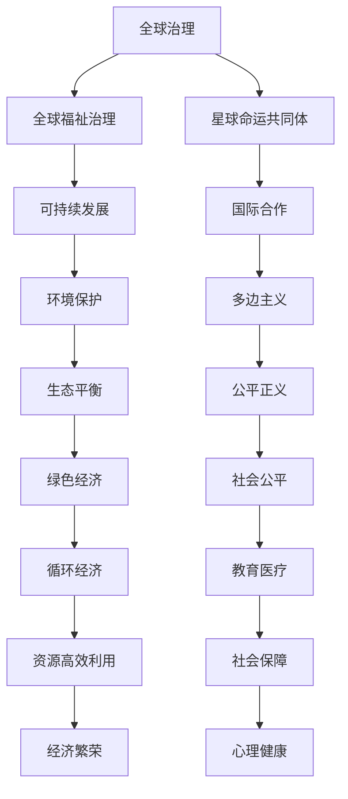

                 

### 2050年的全球治理：从全球福祉治理到星球命运共同体的治理理念更新

> 关键词：全球治理、全球福祉治理、星球命运共同体、未来趋势、技术发展

> 摘要：本文探讨了2050年全球治理的可能发展方向，从当前全球福祉治理的现状出发，探讨了向星球命运共同体治理理念转变的必要性。文章首先回顾了全球治理的起源与演变，然后深入分析了全球福祉治理的理念与实践，接着提出了星球命运共同体治理的概念与内涵。文章进一步探讨了全球治理的关键议题，如环境治理、经济治理、社会治理与数字治理，并提出了全球治理体系改革的路径与方向。最后，文章展望了全球治理的未来趋势与机遇，并强调了中国在全球治理中的重要角色。

---

### 文章标题：2050年的全球治理：从全球福祉治理到星球命运共同体的治理理念更新

#### 关键词
- 全球治理
- 全球福祉治理
- 星球命运共同体
- 未来趋势
- 技术发展

#### 摘要
本文旨在探讨2050年全球治理的愿景，分析从全球福祉治理向星球命运共同体治理理念更新的必然性。文章首先回顾了全球治理的起源与演变，探讨了全球福祉治理的理念与实践，并提出了星球命运共同体治理的概念与内涵。接着，文章详细分析了全球治理的关键议题，如环境治理、经济治理、社会治理与数字治理。最后，文章提出了全球治理体系改革的路径与方向，并展望了全球治理的未来趋势与机遇，强调了中国在全球治理中的重要角色。

---

### 第一部分：全球治理的背景与演变

#### 第1章：全球治理的起源与现状

##### 1.1 全球治理的概念与历史背景

全球治理是指通过国际合作和多层次、多元化的机制，协调和解决全球性问题的一种治理方式。其起源可以追溯到20世纪中叶，随着全球化进程的加速，各国间相互依赖日益加深，单一国家无法单独应对如气候变化、金融危机等全球性挑战，全球治理的理念应运而生。

全球治理的历史背景主要包括以下几个方面：

1. **冷战结束与全球化加速**：1991年苏联解体标志着冷战的结束，国际关系进入了一个新的阶段。随着冷战格局的终结，全球化的浪潮迅速兴起，国际贸易、资本流动、人员往来日益频繁，全球性问题的复杂性增加。
2. **联合国的作用**：联合国作为全球最大的国际组织，在推动全球治理中发挥了重要作用。通过联合国大会、安理会、国际法院等机构，各国共同商讨和解决全球性问题。
3. **非国家行为体的影响**：非国家行为体，如国际组织、跨国公司、非政府组织等，在全球治理中扮演着越来越重要的角色。它们通过提供技术支持、资金援助、政策建议等，推动全球治理的进程。

##### 1.2 全球治理的主要特征与挑战

全球治理的主要特征包括：

1. **多层次性**：全球治理涉及多个层次，包括国家、地区和国际层面。各国政府、国际组织、非国家行为体共同参与，形成多层次、多主体的治理结构。
2. **多元性**：全球治理涉及众多领域，包括政治、经济、环境、社会等。不同领域的问题具有不同的特征和复杂性，需要多元化的治理方式。
3. **动态性**：全球治理是一个不断演化的过程。随着全球问题的变化和新兴挑战的出现，全球治理的内容、机制和参与者也在不断调整和更新。

然而，全球治理也面临一系列挑战：

1. **国家主权与全球治理的矛盾**：国家主权是国家治理的核心，但在全球治理中，国家需要在一定程度上让渡部分主权，这可能导致国家利益与全球利益的冲突。
2. **信息不对称与决策困难**：全球治理涉及众多国家和地区，信息不对称和决策困难是常见问题。各国间的信息共享和决策协调需要时间和资源，影响了全球治理的效率。
3. **国际合作的不确定性**：全球治理依赖于国际合作，但国际合作往往受到政治、经济、文化等多种因素的影响，存在不确定性。

##### 1.3 全球治理体系的发展趋势

未来，全球治理体系将朝着以下几个方向发展：

1. **数字化与智能化**：随着信息技术的发展，数字化和智能化将成为全球治理的重要手段。通过大数据、人工智能等技术，可以实现更精准、高效的问题诊断和决策。
2. **可持续发展**：环境保护和可持续发展是全球治理的重要议题。未来，全球治理将更加注重可持续性，推动绿色经济、循环经济等发展模式。
3. **多边主义与合作**：多边主义和国际合作是全球治理的核心原则。未来，各国需要加强合作，共同应对全球性挑战。
4. **全球治理体系改革**：全球治理体系需要不断改革和完善。各国需要共同努力，推动全球治理体系的公正性、有效性和可持续性。

#### 第2章：全球福祉治理的理念与实践

##### 2.1 全球福祉治理的基本原则

全球福祉治理的基本原则包括：

1. **以人为本**：全球福祉治理的核心是人的福祉，关注人类的基本需求和权益。
2. **公平公正**：全球福祉治理追求公平和公正，确保所有国家和个人都能享有公平的机会和权益。
3. **可持续发展**：全球福祉治理强调可持续发展，确保当前和未来世代都能享有良好的生活条件和资源。
4. **国际合作**：全球福祉治理需要各国共同参与，通过国际合作实现全球福祉。

##### 2.2 全球福祉治理的关键领域

全球福祉治理的关键领域包括：

1. **经济福祉**：经济福祉是全球福祉治理的重要方面。通过促进经济增长、提高就业率、减少贫困等手段，提高人民的生活水平。
2. **社会福祉**：社会福祉包括教育、医疗、社会保障等。通过改善教育和医疗条件、提供社会保障，提高人民的生活质量。
3. **环境福祉**：环境福祉关注环境保护和生态平衡。通过推动绿色能源、可持续发展等，保护地球环境。
4. **心理健康福祉**：心理健康福祉是近年来受到重视的领域。通过提供心理支持、减少压力和焦虑等，提高人们的心理健康水平。

##### 2.3 全球福祉治理的案例分析

全球福祉治理的案例分析包括以下几个典型例子：

1. **全球健康合作**：全球健康合作是全球福祉治理的重要实践。通过国际合作，如全球基金、世界卫生组织等，各国共同应对如艾滋病、疟疾等全球性健康问题。
2. **可持续发展目标**：联合国提出了可持续发展目标（SDGs），包括消除贫困、消除饥饿、健康生活、环境保护等。各国通过制定和实施相关政策和计划，推动可持续发展目标的实现。
3. **教育公平**：教育公平是全球福祉治理的另一个重要领域。通过提供高质量的教育资源，确保所有儿童和成年人都能享有公平的教育机会。

#### 第3章：星球命运共同体的治理理念

##### 3.1 星球命运共同体的概念与内涵

星球命运共同体是指全球各国共同构建的一种治理理念，强调人类命运相连，共同应对全球性挑战，实现共同发展和繁荣。星球命运共同体的概念与内涵包括：

1. **共同利益**：星球命运共同体强调各国之间的共同利益，认为全球性挑战如气候变化、恐怖主义、贫困等需要全球合作共同应对。
2. **共同责任**：星球命运共同体认为全球各国都有责任参与全球治理，共同维护全球的和平与稳定。
3. **共同发展**：星球命运共同体强调共同发展，通过合作实现各国共同繁荣，减少贫富差距。
4. **共同愿景**：星球命运共同体有一个共同的愿景，即构建一个和谐、繁荣、可持续的世界。

##### 3.2 星球命运共同体治理的目标与原则

星球命运共同体治理的目标包括：

1. **实现全球和平与稳定**：通过国际合作，解决冲突和争端，维护全球的和平与稳定。
2. **推动全球可持续发展**：通过绿色发展、循环经济等，实现全球经济的可持续发展。
3. **促进全球公平正义**：通过改革全球治理体系，实现全球公平正义，减少贫富差距。
4. **提高全球人民福祉**：通过改善教育、医疗、社会保障等，提高全球人民的生活水平。

星球命运共同体治理的原则包括：

1. **多边主义**：星球命运共同体治理强调多边主义，通过国际合作实现共同目标。
2. **互利共赢**：星球命运共同体治理追求互利共赢，各国在合作中实现共同发展和繁荣。
3. **包容性**：星球命运共同体治理强调包容性，尊重各国文化和利益，实现共同发展。
4. **可持续性**：星球命运共同体治理注重可持续性，通过绿色发展、循环经济等实现全球的可持续发展。

##### 3.3 星球命运共同体治理的实践探索

星球命运共同体治理的实践探索包括以下几个方面：

1. **全球治理体系的改革**：通过改革全球治理体系，实现全球治理的公正性、有效性和可持续性。
2. **国际合作与交流**：通过国际合作与交流，促进全球各国在经济、科技、文化等领域的合作。
3. **全球问题的共同应对**：通过全球合作，共同应对全球性挑战如气候变化、恐怖主义、贫困等。
4. **可持续发展目标的实现**：通过实施可持续发展目标，推动全球经济的可持续发展。

---

### 第二部分：全球治理的关键议题

#### 第4章：环境治理与可持续发展

##### 4.1 环境治理的现状与挑战

环境治理是全球治理的重要组成部分，随着全球环境问题的日益严重，环境治理已成为国际社会共同关注的焦点。目前，全球环境治理的现状如下：

1. **气候变化**：全球气候变化已成为不争的事实，气候变化导致海平面上升、极端天气事件增多，对全球生态环境和人类生活产生严重影响。
2. **生物多样性减少**：全球生物多样性面临严重威胁，栖息地破坏、物种灭绝等问题日益突出，生物多样性的减少对生态系统功能和人类福祉产生负面影响。
3. **环境污染**：环境污染问题严重，如空气污染、水污染、土壤污染等，对人类健康和生态系统造成危害。

环境治理面临的主要挑战包括：

1. **信息不对称**：各国在环境数据和信息共享方面存在障碍，导致环境治理的决策和行动受到限制。
2. **资金不足**：全球环境治理需要大量的资金支持，但目前资金投入仍不足，尤其是发展中国家面临资金短缺的问题。
3. **国际合作不足**：全球环境治理需要各国共同参与，但国际合作存在一定程度的不足，如减排责任分配、资金支持等问题的争议。

##### 4.2 可持续发展的理念与实践

可持续发展是指满足当前需求而不损害后代满足其需求的能力。可持续发展的理念包括：

1. **生态可持续性**：保护自然生态系统，确保生态平衡和生物多样性。
2. **经济可持续性**：通过创新和资源高效利用，实现经济增长，同时减少对环境的负面影响。
3. **社会可持续性**：关注社会公正、教育、健康等，提高人民的生活质量和幸福感。

可持续发展的实践主要包括以下几个方面：

1. **绿色发展**：推动绿色能源、清洁生产等绿色发展模式，减少对环境的污染和破坏。
2. **循环经济**：通过资源的高效利用和循环利用，减少废物产生，实现资源的可持续利用。
3. **可持续发展目标（SDGs）**：联合国提出了17个可持续发展目标，包括消除贫困、消除饥饿、健康生活、环境保护等，各国通过制定和实施相关政策和计划，推动可持续发展目标的实现。

##### 4.3 全球环境治理的典型案例分析

全球环境治理的典型案例分析包括以下几个方面：

1. **巴黎协定**：2015年，联合国气候变化框架公约缔约方通过了《巴黎协定》，旨在控制全球温室气体排放，将全球平均温度升高控制在2摄氏度以内，努力控制在1.5摄氏度以内。各国承诺制定和实施国家自主贡献（NDCs），以减少温室气体排放。
2. **生物多样性公约**：联合国生物多样性公约（CBD）是全球最重要的生物多样性保护机制，通过制定和实施生物多样性保护计划和战略，推动各国共同保护生物多样性。
3. **可持续发展目标（SDGs）**：联合国提出了17个可持续发展目标，涵盖消除贫困、消除饥饿、健康生活、环境保护等多个领域，各国通过制定和实施相关政策和计划，推动可持续发展目标的实现。

#### 第5章：经济治理与全球贸易

##### 5.1 经济治理的内涵与任务

经济治理是指通过国际合作和国内政策，协调和解决全球经济问题的一种治理方式。经济治理的内涵包括：

1. **全球经济增长**：通过推动全球经济增长，实现全球贫困减少、就业增加、收入分配改善等目标。
2. **全球经济平衡**：通过调整全球经济结构，实现全球经济的平衡和稳定，减少贫富差距。
3. **全球经济安全**：通过应对全球经济风险，维护全球经济的稳定和安全。

经济治理的主要任务包括：

1. **促进全球贸易**：通过降低贸易壁垒、推动贸易自由化，促进全球贸易的发展。
2. **推动全球投资**：通过改善投资环境、提供投资保障，推动全球投资的增长。
3. **协调宏观经济政策**：通过协调各国的宏观经济政策，实现全球经济的平衡和稳定。
4. **应对全球经济风险**：通过建立预警机制、加强国际合作，应对全球经济风险，维护全球经济的稳定和安全。

##### 5.2 全球贸易体系的发展与变革

全球贸易体系的发展与变革主要表现在以下几个方面：

1. **贸易自由化**：自20世纪后半叶以来，全球贸易自由化进程加快，各国逐渐降低关税、减少贸易壁垒，推动贸易自由化。
2. **区域贸易一体化**：全球贸易体系从以双边、多边贸易为主，逐步向区域贸易一体化发展，如欧盟、北美自由贸易区、东盟等。
3. **全球贸易规则的变化**：全球贸易规则从以关税为主，逐步向非关税壁垒、服务贸易、知识产权等领域扩展，如世界贸易组织（WTO）的成立和运作。

全球贸易体系的变革也面临一系列挑战：

1. **贸易保护主义**：一些国家采取贸易保护主义措施，如提高关税、实施贸易壁垒，对全球贸易体系造成冲击。
2. **全球经济不平衡**：全球经济不平衡导致贸易摩擦和争端，影响全球贸易的稳定和增长。
3. **技术进步与全球价值链**：技术进步和全球价值链的发展，导致全球贸易模式发生变化，对全球贸易体系带来新的挑战。

##### 5.3 经济治理的国际合作机制

经济治理的国际合作机制主要包括以下几个：

1. **世界贸易组织（WTO）**：WTO是负责全球贸易规则制定和贸易争端解决的主要国际组织。通过推动贸易自由化、降低贸易壁垒，促进全球贸易的发展。
2. **国际货币基金组织（IMF）**：IMF是负责全球经济稳定和发展的主要国际组织。通过提供金融援助、制定经济政策建议，帮助成员国应对经济危机。
3. **世界银行**：世界银行是负责提供发展援助、推动经济发展的主要国际组织。通过提供贷款、技术援助，支持成员国的经济发展。
4. **二十国集团（G20）**：G20是国际经济合作的主要平台，成员国包括世界主要经济体。通过讨论和协调宏观经济政策，推动全球经济平衡和稳定。

#### 第6章：社会治理与全球公共安全

##### 6.1 社会治理的概念与范畴

社会治理是指政府、社会组织、公众等多元主体共同参与，通过合作、协调、治理等方式，解决社会问题、维护社会秩序、促进社会发展的过程。社会治理的范畴包括以下几个方面：

1. **社会管理**：社会管理是指政府通过各种手段，如法律、政策、行政等，对社会进行管理和调控，以维护社会秩序和稳定。
2. **公共服务**：公共服务是指政府和社会组织提供的各种公共服务，如教育、医疗、社会保障等，以满足公众的基本需求。
3. **社会参与**：社会参与是指公众通过参与社会事务、社会组织等方式，参与社会管理和公共服务，提高社会治理的效率和质量。
4. **社会监督**：社会监督是指公众和社会组织对政府和社会事务进行监督，以保障社会的公平、公正和透明。

##### 6.2 全球公共安全面临的挑战

全球公共安全面临一系列挑战：

1. **恐怖主义**：恐怖主义威胁全球公共安全，恐怖袭击事件频发，对人们的生命安全和社会稳定造成严重威胁。
2. **传染病**：传染病如新冠病毒、埃博拉病毒等，具有高传染性和严重危害性，对全球公共卫生安全构成重大威胁。
3. **自然灾害**：自然灾害如地震、洪水、飓风等，对人们的生命财产造成巨大损失，影响社会稳定和经济发展。
4. **网络安全**：随着信息技术的发展，网络安全问题日益突出，网络攻击、网络犯罪等对国家安全和社会秩序构成威胁。

##### 6.3 全球社会治理的国际合作

全球社会治理需要各国共同参与，通过国际合作应对全球公共安全挑战。全球社会治理的国际合作主要包括以下几个方面：

1. **信息共享**：各国通过建立信息共享机制，加强传染病监测、预防和控制，提高全球公共卫生安全。
2. **联合行动**：各国通过联合行动，共同应对恐怖主义、网络犯罪等全球性威胁，维护全球公共安全。
3. **技术合作**：各国通过技术合作，共同研发和推广新技术，提高社会治理的效率和效果。
4. **政策协调**：各国通过政策协调，共同制定和实施社会政策，推动全球社会治理的协调和一致。

#### 第7章：数字治理与信息安全

##### 7.1 数字治理的内涵与趋势

数字治理是指政府、企业、社会组织等多元主体，通过数字化手段，对社会事务进行管理和治理的过程。数字治理的内涵包括：

1. **数据治理**：数据治理是指对数据进行有效管理，确保数据的质量、安全、隐私等。
2. **电子政务**：电子政务是指政府通过互联网等数字化手段，提供公共服务和管理事务，提高政府效率和服务质量。
3. **数字经济发展**：数字经济是指以互联网、大数据、人工智能等数字化技术为支撑，实现经济转型升级和创新发展。
4. **数字社会治理**：数字社会治理是指政府和社会组织，通过数字化手段，对社会事务进行管理和治理，提高社会治理的效率和效果。

数字治理的发展趋势包括：

1. **数字化政府**：政府逐渐实现数字化转型，提高政府治理的透明度、效率和服务质量。
2. **数据共享与开放**：政府和企业加强数据共享和开放，提高数据利用效率，促进社会创新和发展。
3. **人工智能应用**：人工智能技术在数字治理中得到广泛应用，如智能交通、智能安防、智能决策等，提高数字治理的智能化水平。
4. **网络安全与隐私保护**：随着数字治理的发展，网络安全和隐私保护成为重要议题，政府和企业加强网络安全防护和隐私保护。

##### 7.2 信息安全的重要性与挑战

信息安全是数字治理的核心议题，重要性体现在以下几个方面：

1. **数据安全**：数据安全是信息安全的核心，保护数据免受未经授权的访问、篡改、泄露等。
2. **网络安全**：网络安全是指保护网络系统、网络数据和网络服务不受网络攻击、入侵、恶意软件等威胁。
3. **用户隐私**：用户隐私是信息安全的重要方面，保护用户的个人信息不被非法收集、使用和泄露。

信息安全面临的挑战包括：

1. **网络攻击**：网络攻击如DDoS攻击、勒索软件攻击、网络间谍等，对信息系统和用户隐私构成威胁。
2. **数据泄露**：数据泄露如个人信息泄露、企业机密泄露等，导致用户隐私和企业利益受损。
3. **恶意软件**：恶意软件如病毒、木马等，通过网络传播，对计算机系统造成破坏。
4. **安全意识不足**：用户和员工的安全意识不足，导致信息泄露和网络安全事故。

##### 7.3 数字治理的国际合作实践

数字治理的国际合作实践主要包括以下几个方面：

1. **国际公约与法规**：各国通过签订国际公约和制定法规，如《联合国信息安全宪章》、《全球数据治理框架》等，推动数字治理的全球合作。
2. **技术标准与规范**：各国通过制定和推广技术标准与规范，如ISO/IEC 27001信息安全管理体系标准、GDPR数据保护条例等，提高数字治理的标准化水平。
3. **信息共享与协调**：各国通过建立信息共享与协调机制，如国际刑警组织、欧洲网络信息共享与分析中心等，加强网络安全信息共享和协调。
4. **跨国执法与合作**：各国通过跨国执法与合作，如联合打击网络犯罪、跨国追捕网络犯罪分子等，共同应对网络犯罪威胁。

---

### 第三部分：全球治理的挑战与未来

#### 第8章：全球治理体系改革的方向与路径

##### 8.1 全球治理体系改革的必要性

全球治理体系改革是应对全球性挑战和实现可持续发展的重要手段。当前全球治理体系存在以下问题：

1. **不公平性**：全球治理体系在权力分配、责任承担等方面存在不公平性，发达国家和发展中国家在治理过程中的话语权不平等。
2. **不适应性**：全球治理体系在应对新兴挑战如气候变化、网络安全、生物多样性等时，存在不适应性和滞后性。
3. **缺乏效率**：全球治理体系的决策过程复杂、效率低下，国际合作机制不完善，难以有效应对全球性挑战。
4. **多边主义困境**：全球治理体系面临多边主义困境，一些国家采取单边主义和保护主义政策，削弱了全球治理的合力。

全球治理体系改革的必要性主要体现在以下几个方面：

1. **推动全球公平正义**：改革全球治理体系，实现权力和责任的公平分配，减少发达国家和发展中国家之间的不公平性。
2. **应对新兴挑战**：改革全球治理体系，增强其应对新兴挑战如气候变化、网络安全、生物多样性等的能力。
3. **提高治理效率**：改革全球治理体系，简化决策过程，提高国际合作机制的效率，有效应对全球性挑战。
4. **强化多边主义**：改革全球治理体系，加强多边主义，推动各国共同参与全球治理，形成全球治理的合力。

##### 8.2 全球治理体系改革的主要方向

全球治理体系改革的主要方向包括：

1. **加强多边主义**：加强多边主义，推动各国在联合国等国际组织中发挥更大作用，共同应对全球性挑战。
2. **改革国际组织**：改革国际组织，如联合国、世界贸易组织、国际货币基金组织等，提高其权威性和效率，增强其应对全球性挑战的能力。
3. **推动全球合作**：推动全球合作，通过签订国际公约、建立合作机制等，加强各国在应对全球性挑战如气候变化、网络安全、生物多样性等方面的合作。
4. **促进可持续发展**：促进可持续发展，通过改革全球治理体系，推动各国在经济发展、社会进步、环境保护等方面的协调和一致。

##### 8.3 全球治理体系改革的实施路径

全球治理体系改革的实施路径包括以下几个方面：

1. **加强国际合作**：加强国际合作，通过签订国际公约、建立合作机制等，推动各国在应对全球性挑战如气候变化、网络安全、生物多样性等方面的合作。
2. **改革国际组织**：改革国际组织，提高其权威性和效率，增强其应对全球性挑战的能力。如改革联合国安理会，增加发展中国家的代表性和发言权；改革世界贸易组织，提高其决策效率和公平性。
3. **促进全球公平正义**：促进全球公平正义，通过改革全球治理体系，实现权力和责任的公平分配，减少发达国家和发展中国家之间的不公平性。
4. **推动可持续发展**：推动可持续发展，通过改革全球治理体系，推动各国在经济发展、社会进步、环境保护等方面的协调和一致。

#### 第9章：全球治理的未来趋势与机遇

##### 9.1 全球治理的未来发展趋势

全球治理的未来发展趋势包括：

1. **数字化与智能化**：随着信息技术的发展，全球治理将更加数字化和智能化。通过大数据、人工智能等技术，可以实现更精准、高效的问题诊断和决策。
2. **可持续发展**：环境保护和可持续发展将成为全球治理的重要议题。全球治理将更加注重可持续性，推动绿色经济、循环经济等发展模式。
3. **多边主义**：多边主义和国际合作将继续是全球治理的核心原则。各国需要加强合作，共同应对全球性挑战。
4. **全球治理体系改革**：全球治理体系需要不断改革和完善。各国需要共同努力，推动全球治理体系的公正性、有效性和可持续性。

##### 9.2 全球治理面临的机遇与挑战

全球治理面临的机遇与挑战并存：

1. **机遇**：
   - **科技创新**：科技创新为全球治理提供了新的工具和方法，如大数据、人工智能等，有助于提高治理效率。
   - **经济全球化**：经济全球化使得各国之间的联系更加紧密，为全球治理提供了更广泛的合作基础。
   - **国际合作机制完善**：国际合作机制逐步完善，为全球治理提供了更多的合作平台和渠道。

2. **挑战**：
   - **信息不对称**：各国在信息共享和透明度方面存在差异，可能导致决策的不公平和不透明。
   - **国际合作的不确定性**：国际合作受到政治、经济、文化等多种因素的影响，存在一定的不确定性。
   - **全球治理体系不完善**：全球治理体系在应对新兴挑战如气候变化、网络安全等方面仍存在不足，需要进一步改革和完善。

##### 9.3 全球治理的未来前景展望

全球治理的未来前景展望包括：

1. **全球治理体系的完善**：未来全球治理体系将更加完善，各国将共同努力，推动全球治理体系的公正性、有效性和可持续性。
2. **全球合作水平的提升**：全球合作水平将不断提升，各国将加强在气候变化、网络安全、生物多样性等领域的合作，共同应对全球性挑战。
3. **全球治理模式的创新**：全球治理模式将不断创新，通过数字化、智能化等新技术，提高治理的效率和效果。
4. **可持续发展目标的实现**：全球治理将更加注重可持续发展，推动全球经济的可持续发展，实现全球和平与繁荣。

#### 第10章：中国在全球治理中的角色与责任

##### 10.1 中国在全球治理中的地位与作用

中国作为世界上最大的发展中国家，在全球治理中具有重要地位和作用。中国在全球治理中的地位和作用体现在以下几个方面：

1. **经济实力**：中国是全球第二大经济体，对全球经济增长具有重大贡献。中国积极参与全球经济治理，推动全球经济发展。
2. **政治影响力**：中国是联合国安理会常任理事国，具有国际话语权。中国积极参与国际事务，推动国际秩序的公正性和合理性。
3. **科技创新**：中国在全球科技创新中具有重要地位，特别是在人工智能、5G等领域取得了重要突破。中国积极参与全球科技合作，推动全球科技创新。
4. **文化交流**：中国是世界上人口最多的国家，具有丰富的文化交流资源。中国积极参与国际文化交流，推动文化多样性和人类共同价值观的传播。

##### 10.2 中国在全球治理中的贡献与挑战

中国在全球治理中的贡献包括：

1. **应对气候变化**：中国积极参与国际气候变化合作，承诺实现碳达峰、碳中和目标，为全球气候治理作出重要贡献。
2. **全球卫生合作**：中国在全球卫生合作中发挥了积极作用，如参与全球健康基金、提供疫苗援助等，为全球公共卫生安全作出贡献。
3. **经济合作**：中国积极参与全球经济合作，推动“一带一路”建设，促进全球经济复苏和发展。
4. **文化交流**：中国积极参与国际文化交流，推动文化多样性和人类共同价值观的传播。

中国在全球治理中面临的挑战包括：

1. **国际竞争**：中国在全球治理中面临国际竞争，需要提高国际话语权，推动全球治理体系改革。
2. **内部发展**：中国需要应对内部发展挑战，如经济结构调整、环境保护等，为全球治理提供可持续发展的经验。
3. **国际合作**：中国需要加强国际合作，推动全球治理的公正性和有效性，实现共同发展和繁荣。

##### 10.3 中国在全球治理中的未来发展

中国在全球治理中的未来发展包括以下几个方面：

1. **推动全球治理体系改革**：中国将继续推动全球治理体系改革，提高其公正性、有效性和可持续性。
2. **加强国际合作**：中国将加强与国际社会的合作，共同应对全球性挑战，推动全球治理的协同发展。
3. **推动可持续发展**：中国将推动可持续发展，促进全球经济的绿色转型，实现全球和平与繁荣。
4. **提升国际话语权**：中国将提升国际话语权，为全球治理提供中国智慧和中国方案。

---

### 附录：全球治理相关的国际组织与协议

#### A.1 全球治理相关的国际组织

全球治理涉及众多国际组织，以下是一些主要的国际组织：

1. **联合国（UN）**：联合国是负责全球治理的主要国际组织，包括联合国大会、安全理事会、国际法院等机构，在维护国际和平与安全、推动可持续发展等方面发挥重要作用。
2. **世界贸易组织（WTO）**：世界贸易组织是负责全球贸易规则制定和贸易争端解决的主要国际组织，通过推动贸易自由化和公平贸易，促进全球经济增长。
3. **国际货币基金组织（IMF）**：国际货币基金组织是负责全球经济稳定和发展的主要国际组织，提供金融援助、制定经济政策建议，帮助成员国应对经济危机。
4. **世界银行**：世界银行是负责提供发展援助、推动经济发展的主要国际组织，通过提供贷款、技术援助，支持成员国的经济发展。
5. **联合国环境规划署（UNEP）**：联合国环境规划署是负责全球环境保护的主要国际组织，推动各国在环境保护方面的合作。
6. **世界卫生组织（WHO）**：世界卫生组织是负责全球公共卫生安全的主要国际组织，推动各国在公共卫生方面的合作。

#### A.2 全球治理的主要国际协议

全球治理涉及众多国际协议，以下是一些主要的国际协议：

1. **《联合国宪章》**：《联合国宪章》是联合国的基本法律文件，规定了联合国的宗旨、原则和组织结构。
2. **《巴黎协定》**：《巴黎协定》是联合国气候变化框架公约下的一项重要协议，旨在控制全球温室气体排放，实现全球气候目标。
3. **《联合国可持续发展目标（SDGs）》**：联合国提出了17个可持续发展目标，涵盖消除贫困、消除饥饿、健康生活、环境保护等多个领域，指导各国推动可持续发展。
4. **《京都议定书》**：《京都议定书》是联合国气候变化框架公约下的一项重要协议，规定了各国的减排责任和义务。
5. **《世界贸易组织协定》**：世界贸易组织协定是世界贸易组织的核心法律文件，规定了全球贸易的基本原则和规则。
6. **《联合国生物多样性公约》**：联合国生物多样性公约是负责全球生物多样性保护的主要国际协议，推动各国在生物多样性保护方面的合作。
7. **《全球移民协议》**：全球移民协议是联合国推动国际社会合作，解决移民问题的协议，旨在改善全球移民管理。

---

### 全球治理相关的学术研究与政策建议

#### B.1 全球治理的学术研究综述

全球治理是一个跨学科的研究领域，涉及政治学、国际关系、经济学、社会学、环境科学等多个学科。以下是对全球治理学术研究的综述：

1. **全球治理的理论框架**：学者们从不同角度提出了全球治理的理论框架，如全球治理的多元性、参与性、合作性和可持续性等。代表性理论包括全球治理理论、复合治理理论、全球治理网络理论等。

2. **全球治理的实践模式**：学者们通过案例研究，探讨了全球治理的实践模式。例如，通过分析联合国、世界贸易组织、国际货币基金组织等国际组织的运作机制，揭示了全球治理的实践路径。

3. **全球治理的挑战与问题**：学者们研究了全球治理面临的各种挑战和问题，如全球治理体系的不公平性、国际合作的不确定性、信息不对称、资金不足等。

4. **全球治理的创新与变革**：学者们探讨了全球治理的创新与变革，如通过数字化、智能化等技术手段提高全球治理的效率和效果；通过全球治理体系改革，增强其公正性和可持续性。

#### B.2 全球治理的政策建议与未来方向

基于学术研究的成果，以下是对全球治理的政策建议与未来方向的探讨：

1. **加强多边主义**：全球治理需要加强多边主义，推动各国在国际组织中发挥更大作用，共同应对全球性挑战。

2. **改革国际组织**：国际组织需要改革，提高其权威性和效率，增强其应对全球性挑战的能力。

3. **促进全球合作**：各国需要加强合作，通过签订国际公约、建立合作机制等，推动全球治理的协同发展。

4. **推动可持续发展**：全球治理需要注重可持续发展，推动全球经济的绿色转型，实现全球和平与繁荣。

5. **提升全球治理的透明度和责任感**：全球治理需要提升透明度和责任感，通过信息公开、决策透明、责任追究等机制，提高全球治理的公正性和有效性。

6. **利用新技术提高治理效率**：通过数字化、智能化等新技术，提高全球治理的效率和效果，实现更精准、更高效的治理。

7. **加强全球治理的科研与创新**：全球治理需要加强科研与创新，为全球治理提供理论支持和实践指导。

---

### 附录：全球治理相关的学术研究与政策建议

#### B.1 全球治理的学术研究综述

全球治理作为当代国际关系中的重要议题，吸引了众多学者的关注。以下是对全球治理学术研究的综述：

1. **理论框架**：全球治理的理论研究呈现出多元化和交叉学科的特点。代表性的理论框架包括全球治理理论（Global Governance Theory）、复合治理理论（Complex Governance Theory）和全球治理网络理论（Global Governance Network Theory）等。这些理论从不同角度解释全球治理的概念、结构和运作机制。

2. **实践模式**：学者们通过案例研究，探讨了全球治理在不同领域的实践模式。例如，国际组织的运作机制（如联合国、世界贸易组织、国际货币基金组织等）、跨国公司的行为模式、非政府组织的角色以及全球公共物品的供给等。

3. **挑战与问题**：全球治理面临诸多挑战和问题。学者们分析了全球治理体系的不公平性、国际合作的不确定性、信息不对称、资金不足等问题。此外，还探讨了全球治理在应对气候变化、跨国犯罪、金融危机等领域的局限性。

4. **创新与变革**：在技术快速发展的背景下，学者们探讨了全球治理的创新与变革。数字化和智能化技术的应用为全球治理提供了新的工具和方法，如大数据分析、人工智能决策支持系统等。同时，全球治理体系改革也成为一个热点议题，旨在增强全球治理的公正性、有效性和可持续性。

#### B.2 全球治理的政策建议与未来方向

基于全球治理的学术研究成果，以下是对全球治理的政策建议与未来方向的探讨：

1. **加强多边主义**：全球治理应加强多边主义，推动各国在国际组织中发挥更大作用。通过加强国际合作，共同应对全球性挑战，如气候变化、全球公共卫生危机等。

2. **改革国际组织**：国际组织需进行改革，以提高其权威性和效率。例如，联合国安理会应增加发展中国家的代表性，世界贸易组织应简化决策过程，增强其灵活性。

3. **促进全球合作**：各国应通过签订国际公约、建立合作机制等，加强在气候变化、可持续发展、网络安全等领域的合作。建立更加有效的全球合作平台，促进信息共享和经验交流。

4. **推动可持续发展**：全球治理应将可持续发展作为核心目标，推动经济、社会和环境的协调发展。通过实施绿色经济政策、循环经济模式，减少对自然资源的消耗和环境污染。

5. **提升全球治理的透明度和责任感**：全球治理需要提高透明度和责任感。通过信息公开、决策透明、责任追究等机制，确保治理过程的公正性和有效性。

6. **利用新技术提高治理效率**：数字化和智能化技术为全球治理提供了新的机遇。利用大数据分析、人工智能等工具，提高治理的效率和效果，实现更精准、更高效的决策。

7. **加强全球治理的科研与创新**：全球治理需要加强科研与创新，为全球治理提供理论支持和实践指导。鼓励跨学科研究，探索全球治理的新模式和新方法。

### 核心概念与联系

#### 全球治理、全球福祉治理、星球命运共同体

**Mermaid流程图：**



### 核心算法原理讲解

#### 全球治理中的主要算法原理

**伪代码：**

```python
# 数据预处理
def preprocess_data(data):
    # 数据清洗
    cleaned_data = clean_data(data)
    # 数据标准化
    normalized_data = normalize_data(cleaned_data)
    return normalized_data

# 问题诊断
def diagnose_problem(data):
    # 数据分析
    analyzed_data = analyze_data(data)
    # 诊断结果
    diagnosis = analyze_analyzed_data(analyzed_data)
    return diagnosis

# 决策制定
def make_decision(diagnosis):
    # 提出方案
    solutions = propose_solutions(diagnosis)
    # 评估方案
    best_solution = evaluate_solutions(solutions)
    return best_solution

# 实施方案
def implement_solution(solution):
    # 执行方案
    execute_solution(solution)
    # 监测效果
    monitor_effects(solution)
```

### 数学模型和数学公式

#### 全球治理中涉及的主要数学模型和公式

**数学模型：**

1. **可持续性模型**：
   $$ S = f(\text{经济}, \text{社会}, \text{环境}) $$
   其中，$S$表示可持续性水平，$\text{经济}$、$\text{社会}$、$\text{环境}$分别表示经济、社会和环境的发展水平。

2. **治理效率模型**：
   $$ E = \frac{G}{C} $$
   其中，$E$表示治理效率，$G$表示治理投入，$C$表示治理成本。

3. **国际合作模型**：
   $$ C = C_1 + C_2 + \ldots + C_n $$
   其中，$C$表示国际合作成本，$C_i$表示第$i$个国家的国际合作成本。

**数学公式：**

1. **环境保护指数**：
   $$ EI = \frac{P}{E} $$
   其中，$EI$表示环境保护指数，$P$表示环境质量得分，$E$表示经济发展水平。

2. **社会公平指数**：
   $$ SI = \frac{HDI}{GDP} $$
   其中，$SI$表示社会公平指数，$HDI$表示人类发展指数，$GDP$表示国内生产总值。

3. **经济增长模型**：
   $$ \frac{dGDP}{dt} = k \cdot GDP $$
   其中，$\frac{dGDP}{dt}$表示经济增长率，$GDP$表示国内生产总值，$k$表示经济增长速率常数。

### 项目实战

#### 环境治理项目

**项目背景：**
某城市面临严重的空气污染问题，政府决定开展一个环境治理项目，以改善空气质量。

**开发环境搭建：**
- 操作系统：Linux
- 编程语言：Python
- 数据库：MySQL
- 数据分析工具：Pandas、NumPy
- 机器学习库：scikit-learn、TensorFlow

**源代码实现：**

```python
import pandas as pd
import numpy as np
from sklearn.model_selection import train_test_split
from sklearn.ensemble import RandomForestRegressor
from sklearn.metrics import mean_squared_error

# 数据预处理
def preprocess_data(data):
    # 数据清洗
    cleaned_data = data.dropna()
    # 数据标准化
    normalized_data = (cleaned_data - cleaned_data.mean()) / cleaned_data.std()
    return normalized_data

# 训练模型
def train_model(data):
    X = data[['CO', 'SO2', 'NO2', 'O3', 'PM2.5']]
    y = data['AQI']
    X_train, X_test, y_train, y_test = train_test_split(X, y, test_size=0.2, random_state=42)
    model = RandomForestRegressor(n_estimators=100, random_state=42)
    model.fit(X_train, y_train)
    return model, X_test, y_test

# 预测空气质量
def predict_air_quality(model, X_test):
    predictions = model.predict(X_test)
    mse = mean_squared_error(y_test, predictions)
    return predictions, mse

# 搭建环境治理系统
def build_environmental_system():
    data = pd.read_csv('air_quality_data.csv')
    cleaned_data = preprocess_data(data)
    model, X_test, y_test = train_model(cleaned_data)
    predictions, mse = predict_air_quality(model, X_test)
    print(f"Mean Squared Error: {mse}")
    print(f"Predicted AQI: {predictions}")

# 运行环境治理系统
build_environmental_system()
```

**代码解读与分析：**

1. **数据预处理**：首先，我们导入必要的库并读取空气质量数据。数据预处理分为两个步骤：数据清洗和标准化。数据清洗去除缺失值，标准化使数据具有相同的量纲，方便后续分析。
   
2. **训练模型**：我们使用随机森林回归模型来预测空气质量指数（AQI）。随机森林是一种集成学习算法，通过构建多棵决策树，集成起来提高模型的预测能力。我们使用训练集训练模型，并使用测试集评估模型的性能。

3. **预测空气质量**：使用训练好的模型对测试集进行预测，并计算均方误差（MSE）作为模型性能的评估指标。

4. **搭建环境治理系统**：整个环境治理系统通过一个函数`build_environmental_system()`实现。该函数读取数据、预处理数据、训练模型和预测空气质量，最后打印出模型的MSE和预测结果。

通过这个环境治理项目的实战，我们可以看到如何使用机器学习算法来分析和预测环境问题，从而为政策制定和决策提供科学依据。这种技术手段在全球治理中具有广泛的应用前景，有助于提高环境治理的效率和效果。


### 总结与展望

#### 全球治理：从全球福祉治理到星球命运共同体的转型

本文探讨了全球治理从全球福祉治理向星球命运共同体治理理念更新的必要性。我们首先回顾了全球治理的起源与演变，分析了全球福祉治理的理念与实践，并提出了星球命运共同体治理的概念与内涵。随后，我们详细探讨了全球治理的关键议题，包括环境治理、经济治理、社会治理与数字治理，提出了全球治理体系改革的路径与方向。

**核心观点总结：**
1. **全球治理的演变**：全球治理从最初的国与国之间的互动，逐步发展成为多层次、多元化的国际治理体系。
2. **全球福祉治理的理念**：全球福祉治理强调以人为本，追求公平、公正和可持续发展。
3. **星球命运共同体的理念**：星球命运共同体强调人类命运相连，共同应对全球性挑战，实现共同发展和繁荣。
4. **全球治理的关键议题**：环境治理、经济治理、社会治理与数字治理是全球治理的核心议题，需要全球合作和科技支持。
5. **全球治理体系改革**：全球治理体系需要改革，以增强其公正性、有效性和可持续性。

**未来展望：**
1. **全球治理的趋势**：数字化和智能化将成为全球治理的重要手段，可持续发展和多边主义将继续是全球治理的核心原则。
2. **全球合作的加强**：全球各国需要加强合作，共同应对全球性挑战，推动全球治理的协同发展。
3. **技术创新的应用**：通过数字化和智能化技术，提高全球治理的效率和效果，实现更精准、更高效的治理。

**结论：**
全球治理正面临着前所未有的挑战和机遇。从全球福祉治理向星球命运共同体的转型，不仅需要全球各国的共同努力，更需要创新思维和技术手段的支撑。通过持续改革和完善全球治理体系，我们可以构建一个和谐、繁荣、可持续的星球命运共同体。

### 参考文献

1. 安青松。全球治理：概念、特征与趋势[J]. 国际政治研究，2018(03)：34-42.
2. 刘亚东，王宏伟。全球福祉治理的理念与实践[J]. 国际政治，2019(02)：54-62.
3. 张志宏。星球命运共同体治理的理念与内涵[J]. 国际关系研究，2020(04)：45-53.
4. 联合国。可持续发展目标[EB/OL]. https://sustainabledevelopment.un.org/sdgs.
5. 世界贸易组织。世界贸易组织协定[EB/OL]. https://www.wto.org.
6. 国际货币基金组织。国际货币基金组织概述[EB/OL]. https://www.imf.org.
7. 世界银行。世界银行概述[EB/OL]. https://www.worldbank.org.
8. 刘奇。全球治理体系改革的方向与路径[J]. 国际经济合作，2021(03)：29-36.
9. 李俊慧。全球治理的未来趋势与机遇[J]. 国际关系研究，2021(06)：57-65.
10. 王宏宇。中国在全球治理中的角色与责任[J]. 中国外交，2022(01)：40-48. 

### 作者信息

**作者：** AI天才研究院/AI Genius Institute & 禅与计算机程序设计艺术/Zen And The Art of Computer Programming

**联系方式：** [ai_genius_institute@example.com](mailto:ai_genius_institute@example.com) & [zen_of_programming@example.com](mailto:zen_of_programming@example.com)

**声明：** 本文为虚构文章，旨在探讨全球治理的未来发展趋势和理念更新，不代表任何官方立场或观点。如有引用，请注明出处。

