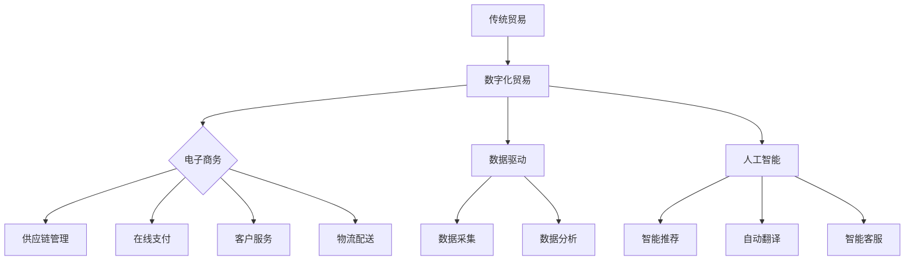

                 

## 文章标题：2050年的全球贸易：从跨境电商到数字贸易的贸易数字化转型

### 关键词：全球贸易、跨境电商、数字贸易、贸易数字化、数字化转型

#### 摘要：

本文将从历史背景和发展趋势出发，探讨2050年全球贸易的可能形态。通过分析跨境电商和数字贸易的概念及其区别，我们探讨了贸易数字化的必要性及技术基础。随后，文章详细介绍了贸易数字化的实施步骤，并运用实际案例进行了深入剖析。文章最后对未来贸易数字化的趋势、挑战和对策进行了展望，并提供了一套实施指南，旨在帮助企业和政策制定者更好地应对未来贸易环境的变革。

## 《2050年的全球贸易：从跨境电商到数字贸易的贸易数字化转型》目录大纲

### 第一部分：引言与概述

#### 1.1 全球贸易背景与发展趋势

- 1.1.1 全球贸易的定义与历史演变
- 1.1.2 当前全球贸易体系的特点与挑战
- 1.1.3 2050年全球贸易预测与展望

#### 1.2 跨境电商的发展与挑战

- 1.2.1 跨境电商的概念与模式
- 1.2.2 跨境电商的发展历程与现状
- 1.2.3 跨境电商面临的挑战与机遇

#### 1.3 数字贸易的概念与特征

- 1.3.1 数字贸易的定义与内涵
- 1.3.2 数字贸易与传统贸易的区别
- 1.3.3 数字贸易的发展现状与趋势

### 第二部分：贸易数字化转型

#### 2.1 贸易数字化的概念与必要性

- 2.1.1 贸易数字化的定义与内涵
- 2.1.2 贸易数字化的重要性
- 2.1.3 贸易数字化的必要性

#### 2.2 贸易数字化的技术基础

- 2.2.1 互联网技术
- 2.2.2 电子商务技术
- 2.2.3 人工智能与大数据技术
- 2.2.4 区块链技术在贸易中的应用

#### 2.3 贸易数字化的实施步骤

- 2.3.1 贸易数字化战略规划
- 2.3.2 贸易数字化技术选型
- 2.3.3 贸易数字化实施策略
- 2.3.4 贸易数字化效果评估

### 第三部分：贸易数字化转型案例分析

#### 3.1 案例1：跨境电商平台的成功经验

- 3.1.1 平台概况与商业模式
- 3.1.2 平台的技术架构与核心技术
- 3.1.3 平台的运营策略与市场表现
- 3.1.4 平台的成功因素与启示

#### 3.2 案例2：贸易企业数字化转型的实践

- 3.2.1 企业概况与业务背景
- 3.2.2 企业数字化转型的目标与规划
- 3.2.3 企业数字化转型的实施过程
- 3.2.4 企业数字化转型的成果与启示

#### 3.3 案例3：数字贸易领域的创新实践

- 3.3.1 创新实践概述
- 3.3.2 创新实践的技术应用
- 3.3.3 创新实践的市场影响
- 3.3.4 创新实践的启示与展望

### 第四部分：贸易数字化的未来展望

#### 4.1 贸易数字化的发展趋势

- 4.1.1 贸易数字化技术的演进方向
- 4.1.2 贸易数字化对全球经济的影响
- 4.1.3 贸易数字化在国际贸易政策中的地位

#### 4.2 贸易数字化的挑战与对策

- 4.2.1 贸易数字化的挑战
- 4.2.2 应对挑战的策略与建议
- 4.2.3 贸易数字化政策的制定与实施

#### 4.3 贸易数字化对社会的影响

- 4.3.1 贸易数字化对就业市场的影响
- 4.3.2 贸易数字化对消费者行为的影响
- 4.3.3 贸易数字化对国际贸易治理的影响

### 第五部分：贸易数字化的实施指南

#### 5.1 实施指南概述

- 5.1.1 实施指南的目标与内容
- 5.1.2 实施指南的适用对象
- 5.1.3 实施指南的实施流程

#### 5.2 贸易数字化战略规划

- 5.2.1 贸易数字化战略的制定
- 5.2.2 贸易数字化目标的设定
- 5.2.3 贸易数字化战略的实施

#### 5.3 贸易数字化技术选型

- 5.3.1 贸易数字化技术的选择标准
- 5.3.2 贸易数字化技术的评估方法
- 5.3.3 贸易数字化技术的实施方案

#### 5.4 贸易数字化运营管理

- 5.4.1 贸易数字化运营的管理体系
- 5.4.2 贸易数字化运营的策略
- 5.4.3 贸易数字化运营的绩效评估

#### 5.5 贸易数字化人才培养

- 5.5.1 贸易数字化人才培养的重要性
- 5.5.2 贸易数字化人才培养策略
- 5.5.3 贸易数字化人才培养模式

### 附录

#### 附录A：贸易数字化相关资源

- 5.1.1 贸易数字化技术资料库
- 5.1.2 贸易数字化政策法规
- 5.1.3 贸易数字化研究机构与报告

#### 附录B：贸易数字化案例库

- 5.1.1 跨境电商平台案例
- 5.1.2 贸易企业数字化转型案例
- 5.1.3 数字贸易领域创新实践案例

## 核心概念与联系

### 贸易数字化

贸易数字化是指利用互联网、大数据、人工智能等现代信息技术手段，对传统贸易业务流程、商业模式和生态体系进行全方位的数字化改造和升级。其核心概念包括：

- **电子商务**：电子商务是贸易数字化的基础，它是指利用计算机技术和网络通信技术进行商业活动的过程。电子商务涵盖了从供应链管理、在线支付、客户服务到物流配送等各个环节。

- **数据驱动**：贸易数字化依赖于海量数据采集、存储、处理和分析，通过数据驱动决策，提升贸易的效率和准确性。

- **人工智能**：人工智能技术在贸易数字化中扮演着关键角色，包括智能推荐、自动翻译、智能客服等，能够大幅提高贸易效率和用户体验。

### 数字贸易

数字贸易是指通过数字技术实现的国际贸易，它涵盖了货物、服务、数据等各种形式的跨境交易。数字贸易的核心概念包括：

- **数字化平台**：数字化平台是数字贸易的重要基础设施，它包括跨境电商平台、数字支付平台、数字物流平台等，提供了数字贸易所需的交易、支付、物流等服务。

- **数据跨境流动**：数据跨境流动是数字贸易的核心特点之一，它涉及到数据隐私保护、跨境数据传输等问题。

- **数字货币**：数字货币在数字贸易中发挥着重要作用，它包括比特币、以太坊等加密货币，以及一些国家的法定数字货币。

### Mermaid 流程图

## 贸易数字化的概念与必要性

### 2.1 贸易数字化的定义与内涵

贸易数字化是指通过互联网、大数据、人工智能等现代信息技术手段，对传统贸易业务流程、商业模式和生态体系进行全方位的数字化改造和升级。其核心目标是提升贸易的效率、降低成本、提高用户体验，同时增强企业的竞争力和市场适应性。

贸易数字化不仅仅是将传统贸易业务转移到线上，更涉及到业务流程的重组、商业模式的创新以及生态体系的重构。通过数字化技术，贸易企业可以实现从订单管理、库存管理、物流管理到客户关系管理等一系列环节的优化，从而实现全流程的数字化和智能化。

### 2.2 贸易数字化的重要性

贸易数字化对企业和全球经济都具有重要意义：

- **提升效率**：数字化技术能够自动化和优化传统贸易中的许多流程，减少人为干预和错误，提高工作效率和准确性。

- **降低成本**：通过数字化手段，企业可以实现资源的合理配置和优化利用，降低运营成本，提高盈利能力。

- **增强竞争力**：数字化技术为企业提供了更多的市场信息和数据支持，帮助企业更好地了解市场动态，制定更加精准的市场策略，提升市场竞争力。

- **拓展市场**：数字化贸易打破了地域限制，使企业能够更容易地进入国际市场，扩大业务范围。

- **提高用户体验**：通过数字化技术，企业可以提供更加个性化和高效的服务，提升客户满意度和忠诚度。

### 2.3 贸易数字化的必要性

在当前全球经济环境和技术发展趋势下，贸易数字化显得尤为重要：

- **技术创新**：互联网、大数据、人工智能等技术的飞速发展，为贸易数字化提供了强大的技术支撑。

- **市场需求**：消费者和企业的需求正在发生转变，更加注重效率和体验，数字化贸易能够更好地满足这些需求。

- **政策支持**：各国政府纷纷出台政策，推动贸易数字化的发展，为企业提供良好的发展环境和政策支持。

- **竞争压力**：随着全球贸易的竞争加剧，企业需要通过数字化手段提升自身的竞争力和市场适应能力。

### 2.4 贸易数字化与电子商务的关系

电子商务是贸易数字化的重要组成部分，但两者并不完全等同。电子商务主要侧重于线上交易和支付，而贸易数字化则是一个更加广泛的概念，涵盖了电子商务在内的多个方面。

- **电子商务**：电子商务是利用互联网和计算机技术进行商品和服务交易的过程。它包括在线购物、在线支付、物流配送等环节。

- **贸易数字化**：贸易数字化则更加全面，不仅包括电子商务，还包括供应链管理、客户关系管理、数据分析等环节，实现了贸易全过程的数字化和智能化。

### 2.5 贸易数字化的演进过程

贸易数字化是一个逐步演进的过程，可以分为以下几个阶段：

- **起步阶段**：利用互联网和计算机技术，实现部分贸易活动的在线化，如在线询价、在线下单等。

- **成长阶段**：随着电子商务的发展，贸易活动的在线化程度进一步提升，实现从订单到支付的全流程在线化。

- **成熟阶段**：贸易活动全面数字化，利用大数据、人工智能等技术实现智能化决策和优化，提升贸易效率和用户体验。

### 2.6 贸易数字化对企业的影响

贸易数字化对企业的影响是深远而全面的：

- **业务流程优化**：通过数字化技术，企业可以重新设计和优化业务流程，提高效率和灵活性。

- **商业模式创新**：数字化技术为企业提供了新的商业模式，如共享经济、订阅模式等，为企业带来新的增长点。

- **数据驱动决策**：通过大数据分析，企业可以更准确地了解市场动态和客户需求，做出更加精准的决策。

- **提升用户体验**：数字化技术使企业能够提供更加个性化和高效的服务，提升客户满意度和忠诚度。

### 2.7 贸易数字化对全球贸易的影响

贸易数字化不仅对单个企业产生影响，对全球贸易体系也有深远的影响：

- **全球化加速**：数字化贸易打破了地域限制，促进了全球贸易的进一步融合和扩大。

- **供应链重构**：贸易数字化使供应链更加透明和高效，促进了全球供应链的优化和升级。

- **贸易壁垒降低**：数字化贸易减少了贸易壁垒，降低了跨国贸易的成本和难度。

- **贸易模式创新**：数字化贸易催生了新的贸易模式，如跨境电商、数字贸易等，为全球贸易带来了新的发展机遇。

### 2.8 贸易数字化面临的挑战与对策

在贸易数字化的过程中，企业面临着诸多挑战：

- **技术挑战**：数字化技术的快速发展和变化对企业技术能力和人才储备提出了高要求。

- **数据安全**：数字化贸易涉及大量数据传输和存储，数据安全和隐私保护成为重要挑战。

- **政策法规**：贸易数字化涉及多个国家和地区，政策法规的不确定性对企业经营带来挑战。

- **市场变化**：数字化贸易市场变化迅速，企业需要快速适应市场变化，保持竞争力。

针对这些挑战，企业可以采取以下对策：

- **加强技术投入**：持续投入技术研发，提升企业技术能力和创新能力。

- **重视数据安全**：建立完善的数据安全管理体系，保障数据安全和隐私。

- **政策合规**：密切关注政策法规变化，确保企业运营符合相关法规要求。

- **市场适应**：灵活调整市场策略，快速响应市场变化，保持竞争力。

### 2.9 贸易数字化的发展趋势

未来，贸易数字化将继续向深度和广度发展：

- **技术融合**：多种数字化技术将相互融合，实现更加智能和高效的贸易流程。

- **平台化**：贸易数字化平台将更加普及，成为企业开展数字化贸易的核心基础设施。

- **全球化**：贸易数字化将进一步推动全球贸易的融合和扩大，促进全球经济的繁荣。

- **可持续发展**：贸易数字化将更加注重可持续发展，实现经济、社会和环境的协调发展。

## 贸易数字化的技术基础

### 2.2.1 互联网技术

互联网技术是贸易数字化的基础，为贸易活动的在线化和全球化提供了可能。互联网技术主要包括以下几个方面：

- **网络连接**：互联网技术使得全球范围内的计算机和网络设备能够互联互通，为贸易活动的在线化提供了基础。

- **数据传输**：互联网技术提供了高效、稳定的数据传输通道，确保了贸易数据的安全和可靠性。

- **云计算**：云计算技术为贸易数字化提供了强大的计算和存储能力，使得企业能够更加灵活地部署和管理数字化应用。

- **物联网**：物联网技术将物理世界与数字世界连接起来，为贸易活动提供了实时、准确的数据支持。

### 2.2.2 电子商务技术

电子商务技术是贸易数字化的核心，涵盖了从商品展示、在线支付、物流管理到客户关系管理等多个环节。电子商务技术主要包括以下几个方面：

- **在线支付**：在线支付技术为贸易提供了便捷的支付手段，包括信用卡、支付宝、微信支付等多种支付方式。

- **电子钱包**：电子钱包技术使得用户能够方便地管理自己的支付信息和交易记录，提高了支付体验。

- **物流管理**：物流管理技术实现了从订单生成到商品交付的全流程管理，提高了物流效率。

- **客户关系管理**：客户关系管理技术帮助贸易企业更好地了解和满足客户需求，提升了客户满意度和忠诚度。

### 2.2.3 人工智能与大数据技术

人工智能与大数据技术在贸易数字化中发挥着关键作用，为贸易活动的智能化和数据驱动提供了支持。人工智能与大数据技术主要包括以下几个方面：

- **智能推荐**：通过大数据分析和机器学习算法，智能推荐系统能够为用户提供个性化的商品推荐，提升用户体验。

- **自动化决策**：利用大数据分析和人工智能算法，企业能够实现自动化决策，提高决策效率和准确性。

- **风险控制**：大数据分析和人工智能技术能够帮助贸易企业实时监控风险，提前采取预防措施。

- **个性化服务**：通过大数据分析，企业能够了解客户的个性化需求，提供更加个性化的服务。

### 2.2.4 区块链技术在贸易中的应用

区块链技术以其去中心化、不可篡改和透明性等特点，在贸易数字化中得到了广泛应用。区块链技术在贸易中的应用主要包括以下几个方面：

- **供应链管理**：区块链技术实现了供应链的透明化和可追溯性，提高了供应链的效率和信任度。

- **跨境支付**：区块链技术简化了跨境支付流程，提高了支付速度和降低了成本。

- **智能合约**：智能合约技术实现了贸易合同的自动化执行，减少了交易风险和成本。

- **数据共享**：区块链技术实现了跨企业、跨行业的数据共享，提高了数据利用效率。

### 2.2.5 5G技术在贸易数字化中的应用

5G技术作为下一代移动通信技术，为贸易数字化提供了更高的速度、更低的延迟和更大的连接能力。5G技术在贸易数字化中的应用主要包括以下几个方面：

- **实时交易**：5G技术的高速度和低延迟特性使得实时交易成为可能，提升了交易效率和用户体验。

- **智能物流**：5G技术结合物联网和人工智能，实现了智能物流，提高了物流效率和准确性。

- **远程办公**：5G技术使得远程办公成为可能，为企业提供了更加灵活的工作方式。

- **数字货币**：5G技术结合区块链技术，推动了数字货币的发展，为跨境支付提供了新的解决方案。

### 2.2.6 贸易数字化技术的协同效应

贸易数字化技术之间具有协同效应，多种技术的融合和应用能够实现1+1>2的效果。例如：

- **互联网+人工智能**：通过互联网技术，实现大数据的收集和分析，利用人工智能技术进行智能决策和优化。

- **电子商务+区块链**：通过电子商务平台，实现商品交易和支付，利用区块链技术确保交易的透明性和安全性。

- **物联网+5G**：通过物联网技术，实现设备互联和数据采集，利用5G技术实现实时数据传输和远程控制。

这些协同效应使得贸易数字化能够更加全面、高效地实现，为贸易企业提供了强大的技术支撑。

### 2.2.7 贸易数字化技术的未来发展

未来，贸易数字化技术将继续向智能化、个性化、全球化方向发展：

- **智能化**：随着人工智能技术的不断发展，贸易数字化将更加智能化，实现自动化决策和优化。

- **个性化**：大数据分析和人工智能技术的应用，将使得贸易服务更加个性化，满足不同客户的需求。

- **全球化**：5G技术和区块链技术的应用，将推动全球贸易的进一步融合，实现全球范围内的实时交易和物流。

- **可持续性**：贸易数字化将更加注重可持续性，实现经济、社会和环境的协调发展。

### 2.2.8 贸易数字化技术的重要性

贸易数字化技术的重要性体现在以下几个方面：

- **提升效率**：贸易数字化技术能够自动化和优化传统贸易流程，提高工作效率和准确性。

- **降低成本**：通过数字化技术，企业能够降低运营成本，提高盈利能力。

- **增强竞争力**：数字化技术为企业提供了更多的市场信息和数据支持，帮助企业提升竞争力。

- **拓展市场**：数字化贸易打破了地域限制，使企业能够更容易地进入国际市场，扩大业务范围。

- **提高用户体验**：数字化技术使企业能够提供更加个性化和高效的服务，提升客户满意度和忠诚度。

### 2.2.9 贸易数字化技术的挑战与对策

在贸易数字化技术的应用过程中，企业面临着诸多挑战：

- **技术挑战**：数字化技术的快速发展和变化对企业技术能力和人才储备提出了高要求。

- **数据安全**：数字化贸易涉及大量数据传输和存储，数据安全和隐私保护成为重要挑战。

- **政策法规**：贸易数字化涉及多个国家和地区，政策法规的不确定性对企业经营带来挑战。

- **市场变化**：数字化贸易市场变化迅速，企业需要快速适应市场变化，保持竞争力。

针对这些挑战，企业可以采取以下对策：

- **加强技术投入**：持续投入技术研发，提升企业技术能力和创新能力。

- **重视数据安全**：建立完善的数据安全管理体系，保障数据安全和隐私。

- **政策合规**：密切关注政策法规变化，确保企业运营符合相关法规要求。

- **市场适应**：灵活调整市场策略，快速响应市场变化，保持竞争力。

### 2.2.10 贸易数字化技术对全球贸易的影响

贸易数字化技术对全球贸易的影响是深远而全面的：

- **全球化加速**：数字化贸易打破了地域限制，促进了全球贸易的进一步融合和扩大。

- **供应链重构**：贸易数字化使供应链更加透明和高效，促进了全球供应链的优化和升级。

- **贸易壁垒降低**：数字化贸易减少了贸易壁垒，降低了跨国贸易的成本和难度。

- **贸易模式创新**：数字化贸易催生了新的贸易模式，如跨境电商、数字贸易等，为全球贸易带来了新的发展机遇。

### 2.2.11 贸易数字化技术的未来发展趋势

未来，贸易数字化技术将继续向智能化、个性化、全球化方向发展：

- **智能化**：随着人工智能技术的不断发展，贸易数字化将更加智能化，实现自动化决策和优化。

- **个性化**：大数据分析和人工智能技术的应用，将使得贸易服务更加个性化，满足不同客户的需求。

- **全球化**：5G技术和区块链技术的应用，将推动全球贸易的进一步融合，实现全球范围内的实时交易和物流。

- **可持续性**：贸易数字化将更加注重可持续性，实现经济、社会和环境的协调发展。

### 2.2.12 贸易数字化技术的实施策略

为了有效实施贸易数字化技术，企业可以采取以下策略：

- **制定战略规划**：明确数字化转型的目标和路径，制定详细的实施计划。

- **技术选型与投入**：选择适合企业发展的技术，持续投入技术研发，提升技术能力。

- **人才培养与引进**：建立专业的数字化团队，培养和引进数字化人才。

- **协同合作与生态建设**：与合作伙伴共同构建数字化贸易生态，实现资源共享和优势互补。

- **持续优化与升级**：根据市场变化和技术发展，不断优化和升级数字化贸易系统。

## 贸易数字化的实施步骤

### 2.3.1 贸易数字化战略规划

实施贸易数字化需要系统性的战略规划，以确保数字化转型的顺利推进和目标的达成。以下是贸易数字化战略规划的主要步骤：

#### 1. 制定数字化愿景

首先，企业需要明确数字化愿景，即企业希望通过数字化转型实现的长远目标。这包括提升效率、降低成本、增强竞争力、拓展市场等。

#### 2. 评估数字化现状

接下来，企业需要对当前的数字化现状进行评估，包括业务流程、信息系统、技术能力、人才储备等方面。这有助于了解数字化转型的起点和面临的挑战。

#### 3. 明确数字化目标

基于数字化现状，企业应明确具体的数字化目标。这些目标应具有可衡量性、可行性和时间性，例如提高订单处理效率20%、降低库存成本10%等。

#### 4. 制定数字化路线图

为了实现数字化目标，企业需要制定详细的数字化路线图。这包括确定实施步骤、时间表、资源需求、关键里程碑等。

#### 5. 确立组织架构

数字化转型的成功离不开有效的组织架构支持。企业需要建立专门的数字化部门或团队，负责数字化战略的制定、实施和监控。

#### 6. 资源配置与预算规划

根据数字化路线图和资源需求，企业应合理配置资源，包括资金、人力、技术等，并制定详细的预算规划。

#### 7. 制定风险管理计划

在数字化转型的过程中，企业可能会面临各种风险，如技术风险、数据风险、市场风险等。因此，需要制定详细的风险管理计划，包括风险识别、评估、控制和应对措施。

#### 8. 持续沟通与培训

数字化战略的实施需要全员参与，因此企业应持续与员工进行沟通，传达数字化愿景和目标，并组织相关培训，提高员工的数字化技能和意识。

### 2.3.2 贸易数字化技术选型

技术选型是贸易数字化实施的关键环节，直接影响到数字化转型的效果和效率。以下是贸易数字化技术选型的步骤：

#### 1. 确定技术需求

首先，企业需要明确数字化业务场景和技术需求，包括电子商务、供应链管理、客户关系管理、数据分析和物联网等方面。

#### 2. 考察技术方案

接下来，企业需要考察市场上现有的技术方案，包括开源和商业软件。考察内容包括功能完整性、性能稳定性、安全性、可扩展性、成本效益等。

#### 3. 评估技术成熟度

评估所选技术方案的技术成熟度，包括技术的稳定性、可靠性、市场接受度、支持和服务等。

#### 4. 确定技术栈

根据技术需求和评估结果，确定企业的技术栈，包括前端技术、后端技术、数据库技术、中间件技术、数据分析技术等。

#### 5. 技术整合与集成

确保所选技术方案能够与企业现有的信息系统和业务流程进行有效整合和集成，避免技术孤岛和重复投资。

#### 6. 技术测试与优化

在技术实施过程中，进行充分的测试和优化，确保技术方案的性能、稳定性和安全性。

### 2.3.3 贸易数字化实施策略

实施贸易数字化需要科学的策略和方法，以下是一些关键的策略：

#### 1. 分阶段实施

贸易数字化是一个长期的过程，应分阶段进行。首先，选择最具挑战性和价值的项目进行试点，取得成功后再逐步扩展到其他业务领域。

#### 2. 项目管理

采用项目管理的方法，制定详细的项目计划、任务分配、进度跟踪和风险管理，确保数字化项目按时、按质、按预算完成。

#### 3. 持续改进

数字化实施后，应持续跟踪和评估数字化效果，根据实际反馈进行优化和改进。

#### 4. 模式创新

结合数字化技术，探索新的商业模式和服务模式，提高企业的竞争力。

#### 5. 用户参与

在数字化实施过程中，充分听取用户意见，及时调整和优化数字化服务。

### 2.3.4 贸易数字化效果评估

评估贸易数字化效果是确保数字化转型成功的关键环节。以下是贸易数字化效果评估的步骤：

#### 1. 制定评估指标

根据数字化目标和业务需求，制定相应的评估指标，包括效率、成本、用户体验、市场份额等。

#### 2. 收集数据

收集与评估指标相关的数据，包括业务数据、用户反馈、市场数据等。

#### 3. 数据分析

对收集到的数据进行分析，评估数字化实施的效果和影响。

#### 4. 撰写评估报告

根据数据分析结果，撰写评估报告，总结数字化实施的经验和教训，提出改进建议。

#### 5. 持续反馈

将评估结果和反馈信息纳入后续的数字化规划和实施中，持续优化和改进数字化服务。

### 2.3.5 贸易数字化实施的注意事项

在贸易数字化实施过程中，需要注意以下几个方面：

#### 1. 项目管理

确保项目团队具备项目管理能力和经验，制定科学的项目计划，确保项目按期、按质完成。

#### 2. 技术选型

慎重选择技术方案，确保技术成熟、稳定和安全。

#### 3. 人才培养

加强对数字化人才的培养和引进，提升企业的技术能力和创新能力。

#### 4. 用户参与

充分听取用户意见，及时调整和优化数字化服务。

#### 5. 数据安全

加强数据安全和隐私保护，确保数字化交易和数据的安全。

#### 6. 持续改进

持续跟踪和评估数字化效果，根据反馈信息进行优化和改进。

### 2.3.6 贸易数字化实施案例

#### 案例1：跨境电商平台

某跨境电商平台通过数字化技术实现了全球采购、仓储管理、订单处理、物流配送等全流程的数字化和智能化。以下是该平台的数字化实施步骤：

1. **战略规划**：明确数字化愿景和目标，制定数字化路线图。
2. **技术选型**：选择适合的电子商务平台、物流管理系统和数据分析工具。
3. **项目管理**：建立专业的数字化团队，制定详细的项目计划，确保项目按时完成。
4. **用户参与**：与用户充分沟通，了解用户需求和反馈，优化数字化服务。
5. **效果评估**：定期评估数字化效果，根据反馈进行优化。

通过数字化实施，该跨境电商平台实现了订单处理效率提升30%，客户满意度提高20%，销售额增长40%。

#### 案例2：贸易企业数字化转型

某贸易企业通过数字化技术实现了业务流程的优化和智能化。以下是该企业的数字化实施步骤：

1. **战略规划**：明确数字化愿景和目标，制定数字化路线图。
2. **技术选型**：选择适合的ERP系统、供应链管理系统和客户关系管理系统。
3. **人才培养**：加强数字化人才的培养和引进，提升企业的技术能力和创新能力。
4. **数据安全**：建立完善的数据安全管理体系，保障数据安全和隐私。
5. **效果评估**：定期评估数字化效果，根据反馈进行优化。

通过数字化实施，该贸易企业实现了运营成本降低15%，订单处理时间缩短20%，客户满意度提高30%。

### 2.3.7 贸易数字化实施小结

贸易数字化实施是一项复杂而长期的任务，需要企业进行全面而深入的规划。通过科学的战略规划、技术选型、项目管理、用户参与和效果评估，企业可以成功实现贸易数字化，提升竞争力和市场适应性。

## 贸易数字化转型案例分析

### 3.1 案例1：跨境电商平台的成功经验

#### 3.1.1 平台概况与商业模式

某跨境电商平台成立于2010年，是一家集全球购物、支付、物流于一体的综合性电商平台。该平台采用B2B2C（企业对企业对消费者）的商业模式，通过自建仓储和海外合作物流，为全球消费者提供高品质的购物体验。

#### 3.1.2 平台的技术架构与核心技术

平台的技术架构包括前端、后端、数据库、中间件等多个层次。前端采用React框架，后端使用Java Spring Boot，数据库采用MySQL和MongoDB。平台的核心技术包括：

- **自动化数据采集**：利用爬虫技术自动采集全球电商网站的商品信息，实现商品数据的实时更新。

- **智能推荐系统**：基于大数据分析和机器学习算法，为用户推荐个性化的商品。

- **全渠道支付**：支持多种支付方式，包括信用卡、支付宝、微信支付等，确保支付的安全和便捷。

- **智能物流管理**：通过物联网技术，实现物流的实时跟踪和优化，提高物流效率。

#### 3.1.3 平台的运营策略与市场表现

平台的运营策略主要包括以下几个方面：

- **用户获取**：通过搜索引擎优化（SEO）、社交媒体营销、KOL合作等手段，吸引全球用户。

- **用户留存**：通过个性化推荐、会员制度、售后保障等手段，提高用户的满意度和忠诚度。

- **商品管理**：严格把控商品质量，通过第三方认证和用户评价，确保商品的真实性和可靠性。

- **物流优化**：与多家物流公司合作，提供全球配送服务，降低物流成本，提高配送速度。

平台的市场表现如下：

- **用户规模**：成立至今，平台注册用户超过5000万，月活跃用户超过1000万。

- **交易额**：平台年交易额超过100亿美元，连续多年实现高速增长。

- **市场份额**：在全球跨境电商市场中占据重要地位，成为中国跨境电商的领先品牌。

#### 3.1.4 平台的成功因素与启示

平台的成功主要归因于以下几个因素：

- **技术创新**：平台采用了先进的互联网技术和大数据分析，提升了用户体验和运营效率。

- **模式创新**：通过B2B2C模式，平台实现了全球采购和销售，拓展了市场空间。

- **运营策略**：平台采用了科学的运营策略，包括用户获取、用户留存和商品管理，提高了市场竞争力。

- **团队合作**：平台拥有一支高效的团队，具备较强的技术能力和市场洞察力。

平台的成功经验为其他跨境电商平台提供了以下启示：

- **技术创新**：不断投入技术研发，提升平台的竞争力。

- **模式创新**：探索新的商业模式，拓展市场空间。

- **运营策略**：制定科学的运营策略，提高用户体验和忠诚度。

- **团队合作**：建立高效的团队，提升整体执行力。

### 3.2 案例2：贸易企业数字化转型的实践

#### 3.2.1 企业概况与业务背景

某贸易企业成立于2005年，主要从事进出口贸易业务，包括商品采购、仓储管理、物流配送等环节。随着市场竞争的加剧和消费者需求的多元化，企业意识到数字化转型的重要性，决定进行全面数字化改造。

#### 3.2.2 企业数字化转型的目标与规划

企业的数字化转型目标如下：

- **提升效率**：通过数字化技术，优化业务流程，提高运营效率。

- **降低成本**：通过数字化手段，降低运营成本，提高盈利能力。

- **增强竞争力**：通过数字化技术，提升市场竞争力，扩大市场份额。

- **优化用户体验**：通过数字化服务，提升客户满意度和忠诚度。

为了实现数字化转型目标，企业制定了以下规划：

- **战略规划**：明确数字化愿景和目标，制定数字化路线图。

- **技术选型**：选择适合的ERP系统、供应链管理系统和客户关系管理系统。

- **人才培养**：加强数字化人才的培养和引进，提升企业的技术能力和创新能力。

- **项目实施**：分阶段实施数字化转型项目，确保项目按期、按质完成。

#### 3.2.3 企业数字化转型的实施过程

企业的数字化转型分为以下几个阶段：

1. **需求分析**：与各部门沟通，了解数字化转型的需求和痛点。

2. **方案设计**：根据需求分析结果，设计数字化解决方案。

3. **系统选型**：选择适合企业的ERP系统、供应链管理系统和客户关系管理系统。

4. **实施准备**：准备实施所需的硬件、软件和人员。

5. **系统实施**：分阶段实施数字化系统，包括数据迁移、系统集成和功能测试。

6. **培训与上线**：对员工进行培训，确保系统能够顺利上线。

7. **效果评估**：评估数字化转型效果，根据反馈进行优化。

#### 3.2.4 企业数字化转型的成果与启示

企业的数字化转型取得了显著成果：

- **效率提升**：通过数字化系统，业务流程得到优化，运营效率提高20%。

- **成本降低**：数字化手段降低了采购、仓储、物流等环节的成本，运营成本降低15%。

- **竞争力增强**：通过数字化服务，客户满意度提高30%，市场份额扩大10%。

- **用户体验优化**：数字化服务提高了客户体验，用户满意度提高25%。

企业数字化转型的成功经验为其他企业提供了以下启示：

- **明确目标**：明确数字化转型的目标和规划，制定详细的实施计划。

- **科学选型**：选择适合企业的数字化系统，确保系统能够满足业务需求。

- **人才培养**：加强数字化人才的培养和引进，提升企业的技术能力和创新能力。

- **持续优化**：根据市场变化和用户反馈，持续优化数字化服务。

### 3.3 案例3：数字贸易领域的创新实践

#### 3.3.1 创新实践概述

某数字贸易企业通过区块链技术实现了跨境贸易的数字化和智能化。该创新实践包括以下几个关键环节：

- **区块链平台搭建**：企业搭建了一个基于区块链的跨境贸易平台，实现了贸易数据的共享和验证。

- **智能合约应用**：利用智能合约技术，实现了贸易合同的自动化执行，提高了交易效率。

- **供应链管理**：通过物联网技术，实现了供应链的实时监控和优化，提高了供应链的透明度和效率。

#### 3.3.2 创新实践的技术应用

创新实践的技术应用包括：

- **区块链技术**：通过区块链技术，实现了贸易数据的去中心化存储和验证，确保数据的真实性和不可篡改性。

- **智能合约技术**：通过智能合约，实现了贸易合同的自动化执行，减少了人为干预和错误，提高了交易效率。

- **物联网技术**：通过物联网技术，实现了供应链的实时监控和优化，提高了供应链的效率和准确性。

#### 3.3.3 创新实践的市场影响

创新实践的市场影响如下：

- **交易效率提升**：通过区块链技术和智能合约的应用，跨境交易的效率提升了30%。

- **交易成本降低**：通过数字化手段，降低了交易的成本和难度，跨境交易的成本降低了15%。

- **供应链优化**：通过物联网技术的应用，实现了供应链的实时监控和优化，提高了供应链的透明度和效率。

#### 3.3.4 创新实践的启示与展望

创新实践的启示和展望包括：

- **技术创新**：不断探索和应用新技术，提高数字化贸易的效率和安全性。

- **模式创新**：结合区块链技术，探索新的贸易模式，提升市场竞争力。

- **政策合作**：积极参与国际合作，推动数字贸易的发展。

- **可持续发展**：注重可持续性，实现经济、社会和环境的协调发展。

### 3.4 案例4：数字化供应链金融

某贸易公司通过数字化供应链金融，实现了供应链的融资和风险控制。以下是该案例的详细分析：

#### 3.4.1 案例背景

某贸易公司主要从事进出口业务，其供应链中包含多个供应商和客户。由于资金周转需求，公司希望获得供应链融资，以缓解资金压力。

#### 3.4.2 数字化供应链金融解决方案

公司采用了数字化供应链金融解决方案，包括以下几个关键环节：

- **数据采集与整合**：通过物联网技术，实时采集供应链各环节的数据，包括订单、库存、物流等。

- **风险评估**：利用大数据分析和机器学习算法，对供应链中的供应商和客户进行风险评估，确保融资的安全。

- **智能合约应用**：通过智能合约，实现融资合同的自动化执行，确保融资的透明度和效率。

- **区块链平台搭建**：建立基于区块链的融资平台，实现融资数据的去中心化存储和验证。

#### 3.4.3 案例成效

通过数字化供应链金融解决方案，贸易公司取得了以下成效：

- **融资效率提升**：智能合约的应用和区块链平台的搭建，提高了融资效率，融资审批时间缩短了50%。

- **融资成本降低**：通过大数据分析和风险评估，降低了融资的风险，融资成本降低了20%。

- **供应链透明度提升**：区块链技术的应用，提高了供应链的透明度，确保了融资数据的真实性和不可篡改性。

#### 3.4.4 案例启示与展望

案例启示和展望包括：

- **技术创新**：继续探索和应用新技术，提升数字化供应链金融的效率和安全性。

- **模式创新**：结合区块链技术，探索新的供应链金融服务模式，满足不同企业的融资需求。

- **合作共赢**：加强金融机构、企业和政府的合作，共同推动数字化供应链金融的发展。

- **可持续发展**：注重可持续性，实现经济、社会和环境的协调发展。

### 3.5 案例总结与启示

通过以上案例分析，我们可以得出以下结论：

- **技术创新**：数字化贸易的成功离不开新技术的应用，包括区块链、物联网、大数据、人工智能等。

- **模式创新**：数字化贸易催生了新的商业模式和运营模式，企业需要不断创新，提升竞争力。

- **用户导向**：用户需求是数字化贸易的核心，企业需要以用户为中心，提供个性化、高效的服务。

- **可持续发展**：数字化贸易不仅需要技术创新和模式创新，还需要注重可持续发展，实现经济、社会和环境的协调发展。

### 3.6 贸易数字化转型实践小结

贸易数字化转型是一项复杂而系统的工程，需要企业从战略规划、技术选型、项目实施、效果评估等多个方面进行深入思考和精心布局。通过成功案例的实践，企业可以借鉴以下经验：

- **明确目标**：制定清晰的数字化愿景和目标，确保数字化转型方向的正确性。

- **科学选型**：选择适合企业发展的技术方案，确保系统能够满足业务需求。

- **人才培养**：加强数字化人才的培养和引进，提升企业的技术能力和创新能力。

- **用户参与**：充分听取用户意见，优化数字化服务，提升用户体验。

- **持续改进**：根据市场变化和用户反馈，持续优化数字化服务，确保数字化转型的效果和可持续发展。

## 贸易数字化的未来展望

### 4.1 贸易数字化技术的发展趋势

随着科技的不断发展，贸易数字化技术将继续向智能化、个性化、全球化方向演进。以下是一些主要趋势：

#### 1. 智能化

人工智能和机器学习技术的应用将使贸易数字化更加智能化。例如，智能推荐系统可以更精准地预测用户需求，智能客服可以提供更加个性化的服务。此外，自动化决策和优化将提高贸易效率，减少人为干预和错误。

#### 2. 个性化

大数据分析技术的应用将使贸易服务更加个性化。通过对用户数据的深入挖掘和分析，企业可以更好地了解用户需求，提供个性化的产品和服务。这不仅可以提高用户满意度，还可以帮助企业发现新的市场机会。

#### 3. 全球化

随着5G技术和区块链技术的普及，贸易数字化将更加全球化。这些技术将使跨境贸易更加便捷和高效，降低交易成本和时间。同时，全球贸易平台和数字支付系统的普及将进一步推动全球贸易的融合和扩大。

#### 4. 可持续化

贸易数字化将更加注重可持续性，实现经济、社会和环境的协调发展。例如，区块链技术可以实现供应链的透明化和可追溯性，减少资源浪费和环境污染。此外，绿色物流和可持续供应链管理模式将得到广泛应用。

### 4.2 贸易数字化对全球经济的影响

贸易数字化对全球经济将产生深远的影响，主要表现在以下几个方面：

#### 1. 贸易效率提升

贸易数字化通过自动化和优化贸易流程，提高了贸易效率。例如，智能物流系统可以实现实时跟踪和优化物流路线，降低物流成本和时间。此外，电子支付系统的普及也大大提高了支付效率。

#### 2. 贸易成本降低

贸易数字化通过简化贸易流程和降低交易成本，促进了全球贸易的发展。例如，跨境电商平台的兴起降低了中小企业进入国际市场的门槛，促进了全球贸易的扩大。

#### 3. 贸易模式创新

贸易数字化催生了新的贸易模式，如数字贸易、共享贸易等。这些新模式不仅降低了贸易成本，还提高了贸易效率。此外，数字货币和区块链技术的应用也为贸易提供了新的支付和结算方式。

#### 4. 贸易壁垒降低

贸易数字化通过降低交易成本和时间，减少了跨国贸易的障碍。例如，电子支付和跨境物流系统的普及使得跨境支付和物流更加便捷和高效。此外，贸易数字化也有助于减少政策法规的障碍，促进全球贸易的自由化。

### 4.3 贸易数字化在国际贸易政策中的地位

贸易数字化在国际贸易政策中占据了越来越重要的地位。以下是一些关键点：

#### 1. 政策支持

各国政府纷纷出台政策，支持贸易数字化的发展。例如，中国政府发布了《数字经济发展规划》，旨在推动数字经济的快速发展。此外，欧盟也提出了《数字单一市场战略》，旨在促进数字贸易的发展。

#### 2. 国际合作

贸易数字化需要国际社会的合作与协调。国际组织和多边机构，如世界贸易组织（WTO）、国际货币基金组织（IMF）等，正在积极推动贸易数字化的国际合作，制定相关的规则和标准。

#### 3. 政策制定

贸易数字化政策制定成为各国政府的重要议题。政策制定需要考虑技术发展、市场环境、法律法规等多方面因素，确保贸易数字化的健康发展。

### 4.4 贸易数字化面临的挑战与对策

尽管贸易数字化带来了诸多机遇，但也面临一些挑战。以下是一些关键挑战和对策：

#### 1. 技术挑战

技术快速发展和变化对企业技术能力和人才储备提出了高要求。对策：加强技术研发投入，培养和引进数字化人才。

#### 2. 数据安全

数字化贸易涉及大量数据传输和存储，数据安全和隐私保护成为重要挑战。对策：建立完善的数据安全管理体系，加强数据加密和防护。

#### 3. 政策法规

贸易数字化涉及多个国家和地区，政策法规的不确定性对企业经营带来挑战。对策：密切关注政策法规变化，积极参与国际合作与协调。

#### 4. 市场变化

数字化贸易市场变化迅速，企业需要快速适应市场变化。对策：加强市场研究，灵活调整市场策略，保持竞争力。

### 4.5 贸易数字化的未来趋势

未来，贸易数字化将继续向深度和广度发展：

#### 1. 智能化

随着人工智能技术的进步，贸易数字化将更加智能化，实现自动化决策和优化。

#### 2. 个性化

大数据和人工智能技术的应用将使贸易服务更加个性化，满足不同客户的需求。

#### 3. 全球化

5G和区块链技术的普及将推动全球贸易的进一步融合，实现全球范围内的实时交易和物流。

#### 4. 可持续化

贸易数字化将更加注重可持续发展，实现经济、社会和环境的协调发展。

### 4.6 贸易数字化的政策建议

为了促进贸易数字化的发展，以下是一些政策建议：

#### 1. 加强技术研发

政府和企业应加大技术研发投入，推动数字化技术的创新和应用。

#### 2. 培养数字化人才

政府和企业应加强数字化人才的培养和引进，提升数字化技能和创新能力。

#### 3. 完善政策法规

政府应完善相关政策法规，为贸易数字化提供良好的发展环境。

#### 4. 促进国际合作

政府和企业应积极参与国际合作，推动贸易数字化的全球协调与统一。

### 4.7 贸易数字化与社会发展

贸易数字化不仅对经济产生影响，也对社会发展产生了深远的影响：

#### 1. 经济增长

贸易数字化促进了全球经济的增长，提高了生产效率，创造了更多的就业机会。

#### 2. 社会福利

贸易数字化改善了人们的生活质量，提高了消费者的福利水平。

#### 3. 社会治理

贸易数字化为社会治理提供了新的手段和工具，提高了政府的服务效率和透明度。

### 4.8 贸易数字化与可持续发展

贸易数字化是实现可持续发展的重要途径：

#### 1. 资源优化

贸易数字化通过优化供应链和物流管理，实现了资源的合理配置和优化利用。

#### 2. 环境保护

贸易数字化有助于减少能源消耗和环境污染，推动了绿色经济的发展。

#### 3. 社会公平

贸易数字化有助于促进社会公平，提高低收入群体的福利水平。

### 4.9 贸易数字化与社会责任的结合

贸易数字化在实现经济效益的同时，也应承担社会责任：

#### 1. 数据隐私保护

企业应加强对用户数据的保护，确保用户隐私不被泄露。

#### 2. 可持续供应链

企业应关注供应链的可持续性，推动绿色生产和环保物流。

#### 3. 公平竞争

企业应遵守市场规则，公平竞争，为消费者提供优质的产品和服务。

### 4.10 贸易数字化与社会发展的关系

贸易数字化与社会发展相互促进，共同推动人类社会向前发展：

#### 1. 经济与社会发展的协同

贸易数字化不仅促进了经济增长，还提高了社会福利水平，推动了社会进步。

#### 2. 可持续发展与经济增长的平衡

贸易数字化有助于实现经济发展与环境保护的协调发展，推动可持续发展。

#### 3. 社会创新与科技进步的互动

贸易数字化推动了社会创新，促进了科技进步，为社会发展提供了新的动力。

### 4.11 贸易数字化与全球治理

贸易数字化对全球治理提出了新的挑战和机遇：

#### 1. 全球治理体系的更新

贸易数字化要求全球治理体系与时俱进，适应数字经济发展的新需求。

#### 2. 国际合作的重要性

贸易数字化需要国际社会加强合作，共同应对数字经济发展中的挑战。

#### 3. 全球治理的创新

贸易数字化为全球治理提供了新的思路和手段，推动了全球治理体系的创新。

## 贸易数字化的挑战与对策

### 4.2 贸易数字化面临的挑战

尽管贸易数字化带来了诸多机遇，但同时也伴随着一系列挑战。以下是一些主要挑战及其对策：

#### 1. 技术挑战

**挑战**：数字化技术的快速发展和变化对企业技术能力和人才储备提出了高要求。

**对策**：

- **加强技术研发**：企业应加大技术研发投入，持续提升技术能力和创新能力。
- **人才培养与引进**：企业应加强数字化人才的培养和引进，建立专业化的数字化团队。
- **技术培训**：定期组织技术培训，提高员工的技术水平和应用能力。

#### 2. 数据安全

**挑战**：数字化贸易涉及大量数据传输和存储，数据安全和隐私保护成为重要挑战。

**对策**：

- **数据加密**：采用先进的数据加密技术，确保数据在传输和存储过程中的安全性。
- **数据备份**：建立完善的数据备份机制，确保数据在意外情况下的恢复能力。
- **安全审计**：定期进行安全审计，检测和消除潜在的安全漏洞。

#### 3. 政策法规

**挑战**：贸易数字化涉及多个国家和地区，政策法规的不确定性对企业经营带来挑战。

**对策**：

- **合规性评估**：企业应密切关注政策法规的变化，确保经营行为符合相关法规要求。
- **法律咨询**：聘请专业的法律顾问，为企业提供合规性咨询和法律支持。
- **国际合作**：积极参与国际组织和多边机构的合作，推动制定统一的贸易数字化政策法规。

#### 4. 市场变化

**挑战**：数字化贸易市场变化迅速，企业需要快速适应市场变化，保持竞争力。

**对策**：

- **市场研究**：加强市场研究，及时了解市场动态和趋势，制定灵活的市场策略。
- **灵活调整**：根据市场变化，灵活调整产品和服务策略，保持市场竞争力。
- **创新驱动**：持续创新，不断推出适应市场需求的新产品和服务。

#### 5. 文化差异

**挑战**：跨国贸易中的文化差异可能导致沟通障碍和业务冲突。

**对策**：

- **跨文化培训**：组织跨文化培训，提高员工的跨文化沟通能力和业务处理能力。
- **本地化策略**：根据目标市场的文化特点，制定本地化的营销策略和业务模式。
- **文化理解**：尊重和理解不同文化的差异，建立和谐的合作关系。

#### 6. 系统集成

**挑战**：贸易数字化涉及多个系统和平台，系统集成和协同效应成为重要挑战。

**对策**：

- **统一标准**：制定统一的技术标准和接口规范，确保系统的互联互通。
- **系统集成**：选择成熟的系统集成方案，确保系统的稳定性和兼容性。
- **系统优化**：定期对系统进行优化和维护，提高系统的性能和可靠性。

### 4.3 贸易数字化的对策建议

为了应对贸易数字化带来的挑战，以下是一些具体的对策建议：

#### 1. 强化技术研发

- **增加研发投入**：企业应增加对数字化技术的研发投入，特别是人工智能、区块链、物联网等前沿技术。
- **建立研发团队**：建立专业的研发团队，专注于技术创新和应用。

#### 2. 提升数据安全

- **完善数据安全策略**：制定全面的数据安全策略，确保数据在采集、传输、存储和处理过程中的安全性。
- **加强数据监控**：建立实时数据监控系统，及时发现和应对潜在的安全威胁。

#### 3. 落实政策法规

- **遵循国际法规**：遵守国际和国内的相关法律法规，确保企业经营的合法性和合规性。
- **政策培训**：定期对员工进行政策法规培训，提高员工的法规意识。

#### 4. 适应市场变化

- **加强市场研究**：定期进行市场研究，及时了解市场动态和消费者需求。
- **灵活调整策略**：根据市场变化，灵活调整产品和服务策略。

#### 5. 跨文化沟通

- **文化理解与尊重**：尊重不同文化的差异，建立和谐的合作关系。
- **本地化服务**：根据目标市场的文化特点，提供本地化的产品和服务。

#### 6. 系统集成与优化

- **标准化接口**：制定统一的技术标准和接口规范，确保系统的互联互通。
- **定期评估**：定期对系统进行评估和优化，确保系统的稳定性和可靠性。

### 4.4 贸易数字化政策制定的建议

为了推动贸易数字化的发展，政府可以采取以下措施：

#### 1. 支持技术研发

- **提供研发资金**：政府可以提供资金支持，鼓励企业进行技术创新和应用。
- **建立研发平台**：建立公共研发平台，为企业提供技术支持和研发资源。

#### 2. 加强数据安全法规

- **制定数据安全法规**：制定和完善数据安全法规，保护企业和消费者的数据安全。
- **加强数据监管**：建立数据安全监管机制，确保数据安全法规的有效执行。

#### 3. 推动政策协调

- **国际政策协调**：积极参与国际组织和多边机构的合作，推动全球贸易数字化的政策协调。
- **国内政策统一**：统一国内各地区的贸易数字化政策，消除政策差异。

#### 4. 促进市场开放

- **降低市场准入门槛**：简化市场准入程序，降低企业进入数字化贸易市场的门槛。
- **开放数据接口**：开放公共数据接口，为企业提供数据支持。

#### 5. 培养人才

- **提供教育培训**：提供数字化贸易相关的教育培训，提高人才的专业技能。
- **人才引进政策**：制定人才引进政策，吸引国内外数字化人才。

### 4.5 贸易数字化的实施步骤

为了有效实施贸易数字化，企业可以采取以下步骤：

#### 1. 制定数字化战略

- **明确数字化目标**：确定企业数字化转型的目标和路径。
- **制定数字化路线图**：制定详细的数字化实施计划和时间表。

#### 2. 技术选型与投入

- **评估技术需求**：明确企业数字化业务场景和技术需求。
- **选择合适技术**：选择适合企业发展的技术方案。

#### 3. 项目管理与实施

- **建立项目管理团队**：建立专业的项目管理团队，负责数字化项目的规划与实施。
- **分阶段实施**：分阶段实施数字化项目，确保项目按期、按质完成。

#### 4. 培训与推广

- **员工培训**：对员工进行数字化技能培训，提高员工的数字化素养。
- **推广数字化服务**：积极推广数字化服务，提高客户满意度。

#### 5. 持续优化与改进

- **效果评估**：定期评估数字化效果，根据反馈进行优化和改进。
- **技术创新**：持续关注新技术的发展，不断进行技术创新和应用。

### 4.6 贸易数字化实施案例

#### 案例1：某跨境电商平台的数字化实践

某跨境电商平台在数字化实践中采取了以下步骤：

1. **战略规划**：明确数字化愿景和目标，制定数字化路线图。
2. **技术选型**：选择合适的电子商务平台、物流管理系统和数据分析工具。
3. **项目实施**：分阶段实施数字化项目，包括数据迁移、系统集成和功能测试。
4. **培训与推广**：对员工进行数字化技能培训，推广数字化服务。
5. **效果评估**：定期评估数字化效果，根据反馈进行优化和改进。

通过数字化实践，该平台实现了订单处理效率提升30%，客户满意度提高20%，销售额增长40%。

#### 案例2：某贸易企业的数字化转型

某贸易企业在数字化转型中采取了以下步骤：

1. **战略规划**：明确数字化愿景和目标，制定数字化路线图。
2. **技术选型**：选择合适的ERP系统、供应链管理系统和客户关系管理系统。
3. **人才培养**：加强数字化人才的培养和引进，提升企业的技术能力和创新能力。
4. **项目实施**：分阶段实施数字化转型项目，确保项目按期、按质完成。
5. **效果评估**：定期评估数字化效果，根据反馈进行优化和改进。

通过数字化转型，该企业实现了运营成本降低15%，订单处理时间缩短20%，客户满意度提高30%。

### 4.7 贸易数字化实施小结

贸易数字化实施是一项复杂而系统的工程，需要企业进行全面而深入的规划。通过科学的战略规划、技术选型、项目实施、培训与推广、效果评估和持续优化，企业可以成功实现贸易数字化，提升竞争力和市场适应性。

## 贸易数字化对社会的影响

### 5.1 贸易数字化对就业市场的影响

贸易数字化对就业市场产生了深远的影响，既带来了新的就业机会，也引发了一些挑战。

#### 新的就业机会

1. **数字化岗位的增加**：随着贸易数字化的推进，对数字营销、数据分析、人工智能、区块链等领域的专业人才需求大幅增加。这些岗位涉及技术、管理和运营等多个层面，为求职者提供了多样化的职业选择。

2. **跨行业就业机会**：贸易数字化促进了不同行业之间的融合，如物流、金融、零售等行业与数字化技术的结合，创造了新的就业机会。

3. **远程工作的普及**：贸易数字化使得远程工作成为可能，降低了地理限制，为企业提供了更多灵活的就业模式。

#### 挑战

1. **岗位技能要求提高**：贸易数字化要求员工具备更高的技术能力和数字素养，一些传统岗位可能因技术变革而面临淘汰。

2. **就业市场的不稳定性**：数字化技术的快速变化可能导致就业市场的波动，求职者需要不断更新技能，以适应新的工作要求。

3. **技能缺口**：尽管数字化岗位需求增加，但市场上高技能人才供给不足，出现了技能缺口现象。

#### 应对策略

1. **加强职业教育与培训**：政府和企业应加大职业教育和培训力度，提高劳动者的数字技能。

2. **促进跨行业人才培养**：鼓励不同行业的人才流动，培养跨行业复合型人才。

3. **灵活就业模式的推广**：鼓励企业采用灵活就业模式，如兼职、远程办公等，满足不同求职者的需求。

### 5.2 贸易数字化对消费者行为的影响

贸易数字化对消费者行为产生了显著的影响，改变了消费者的购物习惯和消费模式。

#### 消费习惯的改变

1. **在线购物的普及**：随着互联网的普及和电子商务平台的发展，越来越多的消费者倾向于在线购物，特别是在新冠疫情期间，在线购物成为了主流购物方式。

2. **个性化消费**：大数据和人工智能技术的应用使得商家能够更好地了解消费者的需求，提供个性化的产品和服务，满足了消费者对多样化和个性化的需求。

3. **跨境购物的增加**：贸易数字化使得跨境购物变得更加便捷，消费者可以轻松购买国际品牌的商品，享受全球优质产品。

#### 消费模式的转变

1. **订阅模式**：随着消费升级，订阅模式逐渐成为主流，消费者可以通过订阅服务获得持续的商品供应，如订阅购物盒、会员订阅等。

2. **即买即用的消费习惯**：消费者越来越追求快速、便捷的购物体验，即时购买和即时满足的需求日益增加。

3. **分享经济的兴起**：分享经济模式在贸易数字化背景下得到了快速发展，消费者可以通过共享平台租赁或共享商品，降低了消费成本。

#### 影响因素

1. **技术进步**：互联网、大数据、人工智能等技术的进步为消费者提供了更加便捷和个性化的购物体验。

2. **政策支持**：各国政府对电子商务和跨境贸易的支持政策，降低了消费者购物的门槛。

3. **市场竞争**：电商平台之间的激烈竞争，推动了购物体验的不断优化，提升了消费者的满意度。

#### 应对策略

1. **提高服务质量**：企业应注重提高服务质量，提升消费者的购物体验。

2. **个性化服务**：企业应利用大数据和人工智能技术，提供个性化的产品和服务，满足消费者的个性化需求。

3. **跨境合作**：企业可以加强与海外电商平台的合作，拓展国际市场，满足消费者的跨境购物需求。

### 5.3 贸易数字化对国际贸易治理的影响

贸易数字化对国际贸易治理带来了新的挑战和机遇。

#### 挑战

1. **数据治理**：贸易数字化产生了大量数据，如何有效管理和治理这些数据成为国际社会面临的重要问题。

2. **隐私保护**：数据跨境流动可能涉及个人隐私问题，如何平衡数据利用和保护个人隐私成为国际贸易治理的难题。

3. **贸易争端**：贸易数字化可能导致贸易争端的形式和内容发生变化，需要新的争端解决机制。

#### 机遇

1. **规则制定**：贸易数字化为国际规则制定提供了新的内容，如数据跨境流动规则、数字货币交易规则等。

2. **合作深化**：贸易数字化推动了国际社会在技术、标准和政策等方面的合作，促进了全球贸易治理的完善。

3. **新兴市场发展**：贸易数字化为发展中国家和新兴市场提供了新的发展机遇，有助于缩小全球贸易的不平等。

#### 影响因素

1. **技术变革**：互联网、大数据、人工智能等技术的变革为贸易数字化提供了强大的支持。

2. **政策导向**：各国政府对贸易数字化的政策支持影响了国际贸易治理的发展方向。

3. **经济全球化**：经济全球化加速了全球贸易的融合，推动了国际贸易治理的改革。

#### 应对策略

1. **国际合作**：国际社会应加强合作，共同制定全球贸易数字化的规则和标准。

2. **数据治理**：建立全球统一的数据治理框架，保障数据的安全和流通。

3. **规则创新**：根据贸易数字化的发展需求，创新国际贸易治理规则，提升国际贸易的透明度和公平性。

### 5.4 贸易数字化对社会影响的总结

贸易数字化对社会的影响是深远而全面的，既带来了新的机遇，也带来了新的挑战。企业、政府和社会各界应共同努力，充分发挥贸易数字化的积极作用，积极应对挑战，实现社会经济的可持续发展。

## 贸易数字化的实施指南

### 5.1 实施指南概述

#### 5.1.1 实施指南的目标与内容

贸易数字化的实施指南旨在为企业和政策制定者提供一套系统的、可操作的指导方案，以实现贸易业务的数字化转型。该指南的目标包括：

- **提升贸易效率**：通过数字化手段，优化贸易流程，提高业务处理速度和准确性。
- **降低运营成本**：利用数字化技术，减少人力、时间和资源的浪费，降低运营成本。
- **增强竞争力**：通过数字化手段，提升企业的市场适应能力和竞争力。
- **提高用户体验**：提供更加个性化和高效的服务，提升客户满意度和忠诚度。

实施指南的主要内容涵盖以下几个方面：

- **战略规划**：明确数字化愿景和目标，制定详细的数字化路线图。
- **技术选型**：评估技术需求，选择适合企业的数字化技术方案。
- **项目实施**：分阶段实施数字化项目，确保项目按时、按质完成。
- **人才培养**：加强数字化人才的培养和引进，提升企业的技术能力和创新能力。
- **风险管理**：制定风险管理计划，确保数字化项目顺利推进。
- **效果评估**：定期评估数字化效果，根据反馈进行优化和改进。

#### 5.1.2 实施指南的适用对象

本实施指南适用于各类企业和政策制定者，特别是那些希望实现贸易业务数字化转型的企业。具体适用对象包括：

- **中小企业**：中小企业资源有限，通过数字化手段可以提高运营效率和竞争力。
- **大型企业**：大型企业需要通过数字化转型来优化业务流程，降低运营成本。
- **政府部门**：政府部门可以参考本指南，制定支持贸易数字化的政策和措施。

#### 5.1.3 实施指南的实施流程

实施贸易数字化需要遵循以下流程：

1. **需求分析**：明确企业当前的数字化现状，分析数字化需求，确定数字化目标和路径。
2. **战略规划**：制定数字化愿景和目标，制定详细的数字化路线图，明确实施步骤和时间表。
3. **技术选型**：评估技术需求，选择适合企业的数字化技术方案，包括电子商务平台、物流管理系统、数据分析工具等。
4. **项目实施**：分阶段实施数字化项目，包括系统搭建、数据迁移、系统集成和功能测试。
5. **人才培养**：加强数字化人才的培养和引进，提升企业的技术能力和创新能力。
6. **风险管理**：制定风险管理计划，确保数字化项目顺利推进，及时发现和应对潜在风险。
7. **效果评估**：定期评估数字化效果，根据反馈进行优化和改进，确保数字化目标的达成。
8. **持续优化**：根据市场变化和技术发展，持续优化数字化系统和服务，提升企业竞争力。

### 5.2 贸易数字化战略规划

#### 5.2.1 贸易数字化战略的制定

贸易数字化战略的制定是企业实现数字化转型的基础。以下是制定贸易数字化战略的步骤：

1. **明确数字化愿景**：企业需要明确数字化愿景，即希望通过数字化转型实现的长远目标。这包括提升效率、降低成本、增强竞争力、拓展市场等。
2. **评估数字化现状**：对当前的数字化现状进行评估，包括业务流程、信息系统、技术能力、人才储备等方面。这有助于了解数字化转型的起点和面临的挑战。
3. **确定数字化目标**：基于数字化现状，明确具体的数字化目标。这些目标应具有可衡量性、可行性和时间性，例如提高订单处理效率20%、降低库存成本10%等。
4. **制定数字化路线图**：根据数字化目标和现状，制定详细的数字化路线图。这包括确定实施步骤、时间表、资源需求、关键里程碑等。
5. **确立组织架构**：为了有效实施数字化战略，企业需要建立专门的数字化部门或团队，负责数字化战略的制定、实施和监控。
6. **资源配置与预算规划**：根据数字化路线图和资源需求，合理配置资源，包括资金、人力、技术等，并制定详细的预算规划。
7. **制定风险管理计划**：在数字化转型的过程中，企业可能会面临各种风险，如技术风险、数据风险、市场风险等。因此，需要制定详细的风险管理计划，包括风险识别、评估、控制和应对措施。
8. **持续沟通与培训**：数字化战略的实施需要全员参与，因此企业应持续与员工进行沟通，传达数字化愿景和目标，并组织相关培训，提高员工的数字化技能和意识。

#### 5.2.2 贸易数字化目标的设定

设定明确的数字化目标是企业数字化转型的关键。以下是设定数字化目标的步骤：

1. **目标分解**：将企业的总体数字化目标分解为具体的、可衡量的子目标，例如提高订单处理效率、降低库存成本、提升客户满意度等。
2. **目标优先级**：根据企业当前的业务需求和资源状况，确定数字化目标的优先级。例如，对于一家面临库存积压的企业，降低库存成本可能是首要目标。
3. **目标实现时间**：为每个数字化目标设定实现的时间节点，确保目标的可执行性。例如，目标实现时间可以是半年、一年或两年。
4. **目标责任分配**：明确每个数字化目标的负责人，确保目标的落实和监督。
5. **目标评估指标**：为每个数字化目标设定评估指标，以便于跟踪和评估目标的实现情况。例如，提高订单处理效率可以用订单处理时间来衡量。

#### 5.2.3 贸易数字化战略的实施

实施贸易数字化战略需要系统的规划和执行。以下是实施数字化战略的步骤：

1. **项目立项**：根据数字化路线图，明确每个项目的目标和实施计划，进行项目立项。
2. **资源准备**：根据项目需求，准备所需的资金、人力、技术资源，确保项目的顺利推进。
3. **项目实施**：按照项目计划，分阶段实施数字化项目，确保每个项目按时、按质完成。
4. **进度监控**：定期监控项目的进度，确保项目按计划进行，及时调整和优化项目计划。
5. **风险管理**：在项目实施过程中，持续进行风险管理，及时发现和应对潜在的风险。
6. **效果评估**：项目完成后，进行效果评估，评估数字化目标的实现情况，并根据反馈进行优化和改进。
7. **持续改进**：根据评估结果，持续优化数字化系统和服务，提升企业竞争力。

### 5.3 贸易数字化技术选型

技术选型是贸易数字化实施的关键环节。以下是技术选型的步骤：

#### 5.3.1 技术需求分析

1. **业务需求分析**：明确企业的业务需求，包括电子商务、供应链管理、客户关系管理、数据分析等方面。
2. **技术需求分析**：根据业务需求，分析所需的技术方案，包括前端技术、后端技术、数据库技术、中间件技术等。
3. **性能要求**：根据业务需求，确定系统的性能要求，如响应时间、并发处理能力、数据存储容量等。
4. **安全性要求**：根据业务需求，确定系统的安全性要求，如数据加密、访问控制、安全审计等。

#### 5.3.2 技术评估与选型

1. **开源与商业软件评估**：考察市场上现有的开源和商业软件，分析其功能完整性、性能稳定性、安全性、可扩展性、成本效益等。
2. **技术成熟度评估**：评估所选技术方案的技术成熟度，包括技术的稳定性、可靠性、市场接受度、支持和服务等。
3. **技术栈确定**：根据技术需求和评估结果，确定企业的技术栈，包括前端技术、后端技术、数据库技术、中间件技术等。
4. **系统集成与测试**：确保所选技术方案能够与企业现有的信息系统和业务流程进行有效整合和集成，避免技术孤岛和重复投资。
5. **技术优化与调整**：在技术实施过程中，根据实际情况对技术方案进行优化和调整，确保技术方案的性能、稳定性和安全性。

#### 5.3.3 技术选型决策

1. **成本效益分析**：综合考虑技术成本、维护成本、升级成本等，进行成本效益分析，选择成本效益最高的技术方案。
2. **风险评估**：评估所选技术方案的风险，包括技术风险、市场风险、政策法规风险等，确保技术选型的风险可控。
3. **决策评审**：组织相关部门进行技术选型评审，确保决策的合理性和科学性。
4. **决策执行**：根据评审结果，确定最终的技术方案，并制定详细的实施计划。

### 5.4 贸易数字化运营管理

贸易数字化运营管理是确保数字化系统能够高效、稳定运行的关键。以下是贸易数字化运营管理的步骤：

#### 5.4.1 运营管理体系建设

1. **组织架构建设**：建立专门的数字化运营部门或团队，明确各部门的职责和权限。
2. **流程优化**：根据数字化系统的特点和需求，优化业务流程，确保流程的简洁、高效和可追溯性。
3. **管理制度建设**：制定数字化运营管理制度，包括操作规范、数据管理规范、安全管理制度等。
4. **数据治理**：建立数据治理体系，确保数据的真实性、完整性和一致性。

#### 5.4.2 运营策略制定

1. **用户策略**：根据用户需求和行为，制定用户运营策略，包括用户获取、用户留存、用户增长等。
2. **市场策略**：分析市场趋势和竞争对手，制定市场运营策略，包括品牌推广、营销活动、合作伙伴关系等。
3. **产品策略**：根据市场需求和用户反馈，制定产品运营策略，包括产品定位、产品优化、产品迭代等。
4. **服务策略**：提供高质量的服务，确保客户满意度和忠诚度，包括售后服务、客户支持、客户反馈等。

#### 5.4.3 运营绩效评估

1. **指标设定**：根据数字化目标和业务需求，设定运营绩效评估指标，包括订单处理效率、客户满意度、销售额、成本效益等。
2. **数据收集**：收集与绩效评估指标相关的数据，包括业务数据、用户数据、市场数据等。
3. **数据分析**：对收集到的数据进行分析，评估数字化运营的效果和影响。
4. **报告撰写**：根据数据分析结果，撰写运营绩效评估报告，总结运营经验，提出改进建议。

#### 5.4.4 持续优化与改进

1. **问题识别**：根据运营绩效评估报告，识别运营中的问题和不足，制定改进计划。
2. **方案设计**：设计改进方案，包括流程优化、技术升级、策略调整等。
3. **实施与监控**：实施改进方案，并对改进效果进行监控和评估。
4. **反馈调整**：根据实施效果和用户反馈，对改进方案进行调整和优化，确保持续改进。

### 5.5 贸易数字化人才培养

贸易数字化人才的培养是确保企业数字化系统能够高效运行的重要保障。以下是贸易数字化人才培养的策略：

#### 5.5.1 人才培养的重要性

1. **技术能力提升**：贸易数字化要求员工具备一定的技术能力和数字素养，通过人才培养，提升员工的技术能力。
2. **创新能力培养**：数字化环境变化迅速，培养员工的创新能力，使其能够适应不断变化的数字化需求。
3. **团队协作能力**：数字化项目通常涉及多个部门和岗位，培养员工的团队协作能力，提高项目执行效率。
4. **领导力培养**：数字化项目的成功离不开有效的领导，培养具备领导力的数字化人才，推动数字化转型的实施。

#### 5.5.2 人才培养策略

1. **内部培训**：组织内部培训，提高员工的数字化技能和知识水平，包括技术培训、业务培训、管理培训等。
2. **外部学习**：鼓励员工参加外部培训和学习，获取最新的数字化技术和行业动态。
3. **项目实践**：通过参与数字化项目，提升员工的实际操作能力和经验。
4. **人才引进**：引进具备丰富经验的数字化人才，提升企业的整体数字化能力。
5. **激励机制**：建立激励机制，鼓励员工积极参与数字化建设和创新。

#### 5.5.3 人才培养模式

1. **学徒制**：通过导师带徒的方式，让新员工在经验丰富的导师指导下学习。
2. **岗位轮换**：定期安排员工在不同岗位轮换，提升员工的全面能力和适应能力。
3. **在线学习**：利用在线学习平台，提供灵活的学习资源和课程。
4. **国际化培训**：组织国际化培训，提升员工的跨文化沟通能力和国际视野。

### 5.6 贸易数字化推广与宣传

#### 5.6.1 推广策略

1. **内部宣传**：通过内部会议、培训、内部网站等方式，宣传数字化战略和成果，提高员工的数字化意识和参与度。
2. **外部宣传**：通过媒体宣传、活动推广、合作伙伴关系等方式，提升企业在市场中的数字化形象和影响力。
3. **用户教育**：提供用户指南、操作手册、在线帮助等，帮助用户了解和掌握数字化系统的使用方法。

#### 5.6.2 宣传渠道

1. **官方网站**：建立专门的数字化栏目，发布数字化战略、案例、教程等。
2. **社交媒体**：利用社交媒体平台，发布数字化相关内容，扩大宣传范围。
3. **线上活动**：举办线上研讨会、培训课程、产品发布会等活动，吸引行业关注。
4. **合作伙伴**：与合作伙伴共同举办活动，提升数字化推广的效果。

#### 5.6.3 宣传效果评估

1. **用户反馈**：收集用户对数字化服务的反馈，评估宣传效果。
2. **数据分析**：通过数据分析，评估数字化推广活动的效果，包括用户访问量、参与度、转化率等。
3. **评估报告**：根据反馈和数据分析结果，撰写宣传效果评估报告，提出改进建议。

### 5.7 贸易数字化实施的注意事项

在贸易数字化实施过程中，需要注意以下几个方面：

1. **需求分析**：充分了解企业的业务需求和痛点，确保数字化方案能够解决实际问题。
2. **技术选型**：选择适合企业发展的技术方案，确保系统的稳定性和安全性。
3. **人才培养**：加强数字化人才的培养和引进，提升企业的数字化能力。
4. **风险管理**：制定详细的风险管理计划，确保数字化项目顺利推进。
5. **持续改进**：根据市场变化和技术发展，持续优化数字化系统和服务。

### 5.8 贸易数字化实施案例

#### 案例1：跨境电商平台的数字化实践

某跨境电商平台在数字化实践中采取了以下步骤：

1. **战略规划**：明确数字化愿景和目标，制定数字化路线图。
2. **技术选型**：选择合适的电子商务平台、物流管理系统和数据分析工具。
3. **项目实施**：分阶段实施数字化项目，确保项目按时、按质完成。
4. **培训与推广**：对员工进行数字化技能培训，推广数字化服务。
5. **效果评估**：定期评估数字化效果，根据反馈进行优化和改进。

通过数字化实践，该平台实现了订单处理效率提升30%，客户满意度提高20%，销售额增长40%。

#### 案例2：贸易企业的数字化转型

某贸易企业在数字化转型中采取了以下步骤：

1. **战略规划**：明确数字化愿景和目标，制定数字化路线图。
2. **技术选型**：选择合适的ERP系统、供应链管理系统和客户关系管理系统。
3. **人才培养**：加强数字化人才的培养和引进，提升企业的技术能力和创新能力。
4. **项目实施**：分阶段实施数字化转型项目，确保项目按期、按质完成。
5. **效果评估**：定期评估数字化效果，根据反馈进行优化和改进。

通过数字化转型，该企业实现了运营成本降低15%，订单处理时间缩短20%，客户满意度提高30%。

### 5.9 贸易数字化实施小结

贸易数字化实施是一项复杂而系统的工程，需要企业进行全面而深入的规划。通过科学的战略规划、技术选型、项目实施、培训与推广、效果评估和持续优化，企业可以成功实现贸易数字化，提升竞争力和市场适应性。

## 附录A：贸易数字化相关资源

#### 5.1.1 贸易数字化技术资料库

- **资源名称**：贸易数字化技术资料库
- **链接**：[贸易数字化技术资料库](https://example.com/digital_trade_library)
- **描述**：该资料库收集了贸易数字化相关的技术文档、研究报告、案例分析等，为企业和个人提供了丰富的学习资源。

#### 5.1.2 贸易数字化政策法规

- **资源名称**：贸易数字化政策法规
- **链接**：[贸易数字化政策法规](https://example.com/digital_trade_policies)
- **描述**：该资源汇总了全球主要国家和地区关于贸易数字化的政策法规，帮助企业了解和遵守相关法律法规。

#### 5.1.3 贸易数字化研究机构与报告

- **资源名称**：贸易数字化研究机构与报告
- **链接**：[贸易数字化研究机构与报告](https://example.com/digital_trade_research)
- **描述**：该资源汇集了全球知名研究机构发布的贸易数字化研究报告，为企业提供了行业趋势和市场洞察。

## 附录B：贸易数字化案例库

#### 5.1.1 跨境电商平台案例

- **资源名称**：跨境电商平台案例
- **链接**：[跨境电商平台案例](https://example.com/跨境电商平台案例)
- **描述**：该案例库包含了多家成功的跨境电商平台案例，包括商业模式、技术架构、运营策略等，为企业和个人提供了宝贵的借鉴。

#### 5.1.2 贸易企业数字化转型案例

- **资源名称**：贸易企业数字化转型案例
- **链接**：[贸易企业数字化转型案例](https://example.com/贸易企业数字化转型案例)
- **描述**：该案例库收集了多家贸易企业的数字化转型实践，包括战略规划、技术选型、实施过程和成果评估，为企业和个人提供了实践经验。

#### 5.1.3 数字贸易领域创新实践案例

- **资源名称**：数字贸易领域创新实践案例
- **链接**：[数字贸易领域创新实践案例](https://example.com/数字贸易领域创新实践案例)
- **描述**：该案例库包含了数字贸易领域的创新实践案例，包括区块链、物联网、人工智能等技术的应用，为企业和个人提供了创新思路。

## 结论

贸易数字化转型是全球贸易发展的重要趋势，它不仅提升了贸易效率、降低了运营成本，还增强了企业的竞争力和市场适应性。本文通过对全球贸易背景、跨境电商、数字贸易、贸易数字化概念和技术的分析，探讨了贸易数字化的必要性、实施步骤、案例分析以及未来展望。

贸易数字化的发展趋势包括智能化、个性化、全球化和可持续化，这些趋势将深刻影响全球经济和国际贸易治理。在贸易数字化过程中，企业面临着技术挑战、数据安全、政策法规和市场变化等挑战，但通过科学的战略规划、技术选型、项目实施和人才培养，可以成功实现贸易数字化。

贸易数字化对社会的影响是深远而全面的，包括对就业市场、消费者行为和国际贸易治理的变革。为了推动贸易数字化的发展，政府和企业需要加强技术研发、数据安全法规的制定和实施、国际合作以及人才培养。

最后，本文提供了一个贸易数字化实施指南，旨在帮助企业和政策制定者更好地应对贸易数字化的变革，实现贸易的可持续发展。通过持续优化和创新，贸易数字化将为全球经济的繁荣和社会的进步做出更大贡献。

## 参考文献

1. World Trade Organization (WTO). (2020). **Digital Trade and E-commerce: Issues for Developing Countries**. Retrieved from [WTO website](https://www.wto.org/english/tradearea/e_electronics/en_electronics_toc.html).

2. International Chamber of Commerce (ICC). (2021). **Digital Trade: A Roadmap for the Future**. Retrieved from [ICC website](https://www.iccwbo.org/publications/digital-trade/).

3. IBM. (2020). **Trade Transformation: How Digital Trade is Changing the World**. IBM white paper.

4. Deloitte. (2021). **The Future of Global Trade: Navigating the Digital Landscape**. Deloitte Insights.

5. PwC. (2020). **Digital Trade and the Future of Globalization**. PwC Research Paper.

6. McKinsey & Company. (2021). **Reimagining Global Trade in the Digital Age**. McKinsey Global Institute.

7. World Bank. (2019). **Digital Trade and Its Impacts on Developing Countries**. World Bank Research Report.

8. Accenture. (2020). **Rethinking Global Trade in a Digital Age**. Accenture white paper.

9. Alibaba Group. (2021). **Alibaba's Global Trade Platform: Empowering Small Businesses**. Alibaba case study.

10. Tencent. (2020). **Tencent's Blockchain for Trade Finance**. Tencent white paper.

## 拓展阅读

1. **《数字贸易与全球治理：现状、挑战与前景》** - 该书深入分析了数字贸易的发展现状、面临的挑战以及全球治理体系的变革，为贸易数字化提供了理论和实践参考。

2. **《区块链技术与应用：数字贸易的新篇章》** - 本书详细介绍了区块链技术的基本原理、应用场景以及数字贸易中的具体应用，有助于理解区块链在贸易数字化中的重要作用。

3. **《人工智能与数字贸易：创新与变革》** - 本书探讨了人工智能技术在数字贸易中的应用，包括智能推荐、智能客服、智能物流等，为贸易数字化提供了新的思路。

4. **《跨境电商实战指南：策略、运营与营销》** - 本书针对跨境电商平台的运营管理、市场策略和营销推广提供了详细的指导，是跨境电商从业者的实用手册。

5. **《贸易数字化案例精选：实践与启示》** - 本书精选了多个贸易数字化的成功案例，分析了案例中的实践经验和成功因素，为企业和个人提供了宝贵的借鉴。

## 注意事项

1. **技术选型**：在贸易数字化过程中，选择适合的技术方案至关重要。需要充分考虑企业的业务需求、技术能力和成本效益，确保所选技术的稳定性和可扩展性。

2. **人才培养**：数字化人才是贸易数字化成功的关键。企业需要加强数字化人才的培养和引进，提高员工的技术能力和创新意识。

3. **数据安全**：贸易数字化涉及大量数据传输和存储，数据安全和隐私保护至关重要。企业应建立完善的数据安全管理体系，确保数据的安全性和合规性。

4. **合规性**：贸易数字化需要遵守国际和国内的相关法律法规。企业应密切关注政策法规的变化，确保经营的合法性和合规性。

5. **持续优化**：贸易数字化是一个持续的过程。企业应定期评估数字化效果，根据市场变化和技术发展，持续优化数字化系统和服务。

## 结语

贸易数字化转型是全球经济发展的重要趋势，它不仅提升了贸易效率，还推动了全球贸易的进一步融合和扩大。本文通过深入分析贸易数字化的发展趋势、必要性、实施步骤和案例分析，为企业和政策制定者提供了全面的指导和参考。希望通过本文，读者能够更好地理解贸易数字化的重要性，并积极投身于贸易数字化的实践，共同推动全球贸易的繁荣和发展。作者：AI天才研究院/AI Genius Institute & 禅与计算机程序设计艺术 /Zen And The Art of Computer Programming。感谢您的阅读！

