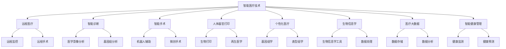

                 

### 文章标题

# 2050年的医疗健康：从远程手术到人体器官打印的智能医疗

---

### 关键词

- 智能医疗
- 远程手术
- 人体器官打印
- 个性化医疗
- 医疗大数据
- 人工智能

---

### 摘要

随着科技的飞速发展，医疗健康领域正迎来前所未有的变革。本文将从多个维度探讨2050年医疗健康的前沿趋势，包括远程手术、人体器官打印、个性化医疗和智能健康管理。通过逐步分析这些技术的演进与应用，本文旨在展示智能医疗如何深刻改变我们的健康管理和疾病治疗方式。

### 目录大纲设计

#### 第一部分：智能医疗技术概述

- **第1章：智能医疗的演进与趋势**
  - **1.1 智能医疗的定义与基本概念**
    - **1.1.1 智能医疗的起源与发展**
    - **1.1.2 智能医疗的关键技术与趋势**
  - **1.2 2050年的医疗健康展望**
    - **1.2.1 医疗技术的未来革新**
    - **1.2.2 社会影响与政策变革**

#### 第二部分：远程医疗与智能诊断

- **第2章：远程医疗技术**
  - **2.1 远程医疗的基本原理**
    - **2.1.1 远程医疗的技术架构**
    - **2.1.2 远程医疗的应用场景**
  - **2.2 智能诊断系统**
    - **2.2.1 人工智能在医学影像中的应用**
    - **2.2.2 人工智能辅助诊断案例**

#### 第三部分：智能手术与机器人辅助

- **第3章：智能手术技术**
  - **3.1 智能手术的概念与流程**
    - **3.1.1 智能手术系统的工作原理**
    - **3.1.2 智能手术的优势与挑战**
  - **3.2 机器人辅助手术**
    - **3.2.1 机器人手术的应用范围**
    - **3.2.2 机器人手术的优势与挑战**

#### 第四部分：人体器官打印与再生医学

- **第4章：人体器官打印技术**
  - **4.1 器官打印的基本原理**
    - **4.1.1 生物打印技术**
    - **4.1.2 生物墨水与打印材料**
  - **4.2 再生医学的应用前景**
    - **4.2.1 再生医学的关键技术**
    - **4.2.2 再生医学在器官修复与移植中的应用**

#### 第五部分：个性化医疗与生物信息学

- **第5章：个性化医疗技术**
  - **5.1 个性化医疗的定义与原理**
    - **5.1.1 基因组学与个性化医疗**
    - **5.1.2 表型组学与个性化医疗**
  - **5.2 生物信息学在医疗健康中的应用**
    - **5.2.1 生物信息学的基本工具**
    - **5.2.2 生物信息学在疾病预测与治疗中的应用**

#### 第六部分：医疗大数据与人工智能

- **第6章：医疗大数据的处理与分析**
  - **6.1 医疗大数据的基本概念**
    - **6.1.1 医疗数据的来源与类型**
    - **6.1.2 医疗大数据的挑战与机遇**
  - **6.2 人工智能在医疗健康数据分析中的应用**
    - **6.2.1 机器学习在疾病预测中的应用**
    - **6.2.2 人工智能在医疗诊断中的应用**

#### 第七部分：智能健康管理

- **第7章：智能健康管理系统**
  - **7.1 智能健康管理的概念与架构**
    - **7.1.1 智能健康管理的核心要素**
    - **7.1.2 智能健康管理的应用场景**
  - **7.2 智能健康数据的收集与分析**
    - **7.2.1 健康数据的收集与存储**
    - **7.2.2 健康数据分析的方法与工具**

#### 附录：技术扩展与未来展望

- **附录A：智能医疗技术扩展**
  - **A.1 量子医疗技术的探索**
  - **A.2 脑机接口在医疗健康中的应用**
  - **A.3 智能医疗技术的未来发展趋势**
  - **A.4 全球智能医疗政策动态与影响**

### 目录大纲设计完成。请您确认是否满足要求，并请告知是否需要进一步细化或调整。

---

### 核心概念与联系

在探讨2050年的医疗健康时，我们首先需要明确几个核心概念，这些概念之间相互关联，共同构成了智能医疗的生态系统。以下是智能医疗的关键技术架构的 Mermaid 流程图，用以展示这些核心概念之间的关系：

通过上述流程图，我们可以清晰地看到各个核心概念在智能医疗技术中的位置和作用。接下来，我们将逐步深入探讨这些技术，并分析它们在2050年医疗健康中的潜在应用和影响。

### 第1章：智能医疗的演进与趋势

#### 1.1 智能医疗的定义与基本概念

**1.1.1 智能医疗的起源与发展**

智能医疗，也称为数字医疗或智能健康，是指利用计算机技术、人工智能、物联网、大数据等先进技术来提升医疗服务的效率和质量。智能医疗的起源可以追溯到20世纪80年代，当时计算机技术开始应用于医疗数据处理和疾病预测。随着技术的不断进步，智能医疗逐步发展成为现代医疗的重要组成部分。

在初期，智能医疗主要应用于医疗信息的数字化管理，如电子病历（Electronic Health Records, EHRs）和医疗图像处理。进入21世纪后，随着互联网和移动通信技术的普及，远程医疗和智能诊断系统逐渐兴起，为患者提供了更加便捷和高效的医疗服务。

近年来，人工智能（AI）和大数据分析技术的突破为智能医疗带来了新的发展机遇。AI在医学影像分析、疾病预测和个性化治疗等方面展现了巨大的潜力，而大数据则为医疗研究提供了丰富的数据资源，使得个性化医疗和精准医疗成为可能。

**1.1.2 智能医疗的关键技术与趋势**

智能医疗的关键技术包括：

- **人工智能（AI）**：AI技术，尤其是深度学习和机器学习，被广泛应用于医学影像分析、疾病诊断和治疗方案的个性化制定。例如，AI可以通过分析大量的医学影像数据，帮助医生更准确地诊断疾病，并预测患者的治疗效果。

- **大数据分析**：医疗大数据的规模庞大且复杂，通过大数据分析技术，可以提取出有价值的信息，用于疾病预测、流行病学研究和个人健康管理。

- **物联网（IoT）**：物联网技术使得医疗设备和系统可以实现智能化、自动化和远程控制。例如，智能手环和智能血压计等可穿戴设备可以实时监测患者的健康状况，并将数据上传到云端进行分析和处理。

- **生物信息学**：生物信息学是智能医疗的重要基础，它利用计算机技术对生物数据进行处理和分析，为基因测序、基因组学和个性化医疗提供支持。

- **远程医疗**：远程医疗利用互联网和通信技术，实现医生与患者之间的远程诊断、治疗和监控。远程医疗不仅提高了医疗服务的可及性，也为偏远地区的患者提供了高质量的医疗服务。

未来，智能医疗的发展趋势将更加多元化，技术将更加集成和智能。以下是几个可能的发展方向：

- **个性化医疗**：基于基因组和表型组学，智能医疗将能够为患者提供更加个性化的治疗方案，从而提高治疗效果和患者满意度。

- **预防医学**：通过大数据和人工智能技术，智能医疗将能够预测疾病的爆发和传播，提前采取预防措施，减少疾病的发生和传播。

- **智能健康管理**：智能健康管理系统将结合物联网技术和移动应用，实现全天候的健康监测和个性化健康指导。

- **跨学科融合**：智能医疗将与其他领域，如生物工程、材料科学和信息技术等，实现跨学科的深度融合，推动医疗技术的创新和突破。

#### 1.2 2050年的医疗健康展望

**1.2.1 医疗技术的未来革新**

在2050年，医疗技术将迎来前所未有的革新。首先，人工智能将在医疗领域的各个方面发挥关键作用。AI将不仅用于疾病诊断和治疗，还将被应用于健康预测、个性化医疗和智能健康管理。通过深度学习和机器学习算法，AI能够从大量的医疗数据中提取有价值的信息，为医生提供更加准确的诊断和治疗方案。

其次，生物打印技术将实现重大突破。未来，生物打印将能够打印出具有复杂结构的器官和组织，为器官移植和再生医学提供新的解决方案。例如，利用生物打印技术，医生可以打印出与患者自身组织相匹配的器官，从而避免免疫排斥反应，提高移植成功率。

此外，量子医疗技术也可能在未来得到广泛应用。量子计算机和量子传感技术将使得生物数据分析和医疗影像诊断变得更加精准和高效。例如，量子计算机可以处理大量的基因组数据，帮助医生更准确地诊断遗传性疾病。

**1.2.2 社会影响与政策变革**

随着智能医疗技术的发展，社会和医疗体系也将面临巨大的变革。首先，智能医疗将大大提高医疗服务的效率和质量，减少医疗资源的浪费。远程医疗和智能健康管理系统的普及将使得医疗服务更加便捷和高效，尤其对偏远地区和行动不便的患者具有重要意义。

其次，智能医疗将推动医疗体系的数字化转型。医疗机构将更多地依赖于数字化的医疗设备和系统，实现数据的互联互通和资源共享。这将有助于提高医疗决策的科学性和准确性，同时降低医疗成本。

政策方面，各国政府将需要制定相应的政策和法规，以确保智能医疗的健康发展。例如，需要建立数据隐私和安全保护机制，确保患者的医疗数据不被滥用。此外，政府还需要投入大量资源，支持智能医疗技术的研发和应用，推动医疗行业的创新和升级。

总之，2050年的医疗健康将受到智能医疗技术的深刻影响。通过人工智能、生物打印和量子医疗等技术的应用，医疗健康领域将实现前所未有的突破和发展，为人类带来更加健康和幸福的生活。

### 第2章：远程医疗技术

#### 2.1 远程医疗的基本原理

**2.1.1 远程医疗的技术架构**

远程医疗，也称为虚拟医疗，是通过互联网、移动通信和物联网等技术，实现医生与患者之间远程诊断、治疗和健康管理的技术体系。其基本架构主要包括以下几个关键组成部分：

- **网络基础设施**：远程医疗依赖于稳定的网络连接，包括有线和无线网络。高速互联网和5G网络的普及，为远程医疗提供了可靠的数据传输通道。

- **医疗信息系统**：医疗信息系统是远程医疗的核心，包括电子病历系统（EHRs）、远程监测系统和医疗数据管理系统等。这些系统能够存储、传输和处理患者的健康数据，支持医生进行远程诊断和治疗。

- **通信系统**：通信系统是远程医疗的关键环节，包括视频通话、即时消息和远程控制等。高质量的通信系统能够保证医生和患者之间的实时互动，提高诊断和治疗的效率。

- **医疗设备**：远程医疗需要各种医疗设备，如远程监控设备、可穿戴设备、远程手术设备和医疗影像设备等。这些设备能够实时收集患者的生理数据，并传输给医生进行分析和诊断。

- **数据安全与隐私保护**：数据安全与隐私保护是远程医疗的重要保障。通过数据加密、访问控制和身份验证等技术，确保患者的医疗数据在传输和存储过程中得到有效保护。

**2.1.2 远程医疗的应用场景**

远程医疗的应用场景非常广泛，涵盖了预防、诊断、治疗和康复等多个环节。以下是几个典型的应用场景：

- **远程诊断**：远程诊断是远程医疗最基本的应用，通过视频通话和即时消息，医生可以与患者进行远程面对面诊断，提供专业的医疗建议和治疗方案。远程诊断特别适合于慢性病管理、心理健康咨询和儿科服务。

- **远程治疗**：远程治疗通过远程医疗系统，医生可以远程监控患者的健康状况，并根据实时数据调整治疗方案。例如，远程心脏监测和远程胰岛素注射管理等。

- **远程手术**：远程手术利用先进的医疗设备和通信技术，医生可以在异地远程控制手术设备，完成复杂的手术操作。远程手术适用于多种外科手术，如心脏病手术、脑部手术和骨科手术等。

- **健康管理**：健康管理是远程医疗的重要组成部分，通过可穿戴设备和远程监测系统，医生可以实时监测患者的生理数据，提供个性化的健康建议和预警服务。健康管理适用于慢性病管理、老年人护理和运动健康等领域。

#### 2.2 智能诊断系统

**2.2.1 人工智能在医学影像中的应用**

人工智能（AI）在医学影像诊断中发挥了重要作用，通过深度学习和图像处理技术，AI能够快速、准确地分析医学影像数据，帮助医生进行疾病诊断。以下是人工智能在医学影像中应用的几个方面：

- **图像分割**：AI可以自动分割医学影像中的不同组织结构，如肿瘤、血管和肺部等，提高医生的诊断精度。

- **病灶检测**：AI可以自动识别医学影像中的异常病灶，如肿瘤、结石和骨折等，为医生提供重要的诊断信息。

- **疾病预测**：AI可以通过分析大量的医学影像数据，建立疾病预测模型，帮助医生提前预测疾病的发展和变化。

- **辅助诊断**：AI可以作为医生的辅助工具，分析医学影像数据，提供诊断建议，减轻医生的工作负担，提高诊断效率。

**2.2.2 人工智能辅助诊断案例**

以下是几个典型的AI辅助诊断案例：

- **肺癌筛查**：AI系统通过分析CT影像，可以检测出微小的肺结节，提高早期肺癌筛查的准确性。例如，Google的DeepMind AI系统已经成功应用于肺癌筛查，显著提高了诊断准确率。

- **乳腺癌诊断**：AI系统通过分析乳腺X光片，可以自动识别乳腺癌的早期征兆，为医生提供辅助诊断。例如，IBM的Watson for Oncology系统已经在全球范围内应用于乳腺癌诊断。

- **心脏病诊断**：AI系统可以通过分析心脏超声影像，检测心脏疾病，如心肌病和心脏瓣膜疾病等。例如，Siemens Healthineers的AI系统HeartVision已经成功应用于心脏病的诊断和预测。

- **神经系统疾病诊断**：AI系统可以通过分析MRI和CT影像，检测神经系统疾病，如脑卒中和脑肿瘤等。例如，NVIDIA的AI系统Marvin已经在神经影像分析中取得了显著成果。

#### 2.2.3 人工智能辅助诊断的优势与挑战

**优势：**

- **提高诊断准确性**：AI可以通过分析大量的医学影像数据，提供更加准确的诊断结果，减少误诊和漏诊。

- **减轻医生负担**：AI可以帮助医生处理大量的医学影像数据，减轻医生的工作负担，提高诊断效率。

- **降低医疗成本**：通过自动化和远程诊断，AI可以降低医疗成本，提高医疗资源的利用率。

- **提高医疗可及性**：远程医疗和AI辅助诊断可以打破地域和时间的限制，为偏远地区和行动不便的患者提供高质量的医疗服务。

**挑战：**

- **数据隐私和安全**：医疗数据涉及到患者的隐私，如何确保数据的安全和隐私是远程医疗和AI辅助诊断面临的挑战。

- **算法偏见**：AI算法可能存在偏见，导致诊断结果不准确，特别是在处理种族、性别等敏感问题时。

- **技术成熟度**：虽然AI在医学影像诊断中取得了显著进展，但仍然需要进一步提高技术成熟度，以确保诊断结果的可靠性和稳定性。

- **法律法规**：远程医疗和AI辅助诊断需要相应的法律法规支持，以确保其合法合规运行。

#### 2.2.4 人工智能辅助诊断的未来发展趋势

随着人工智能技术的不断进步，AI辅助诊断将在未来医疗健康领域发挥更加重要的作用。以下是几个可能的发展趋势：

- **多模态影像分析**：未来，AI将能够结合不同类型的医学影像，如CT、MRI和PET等，实现多模态影像分析，提高疾病诊断的准确性和全面性。

- **个性化诊断**：基于患者的基因组信息和病史数据，AI将能够为患者提供个性化的诊断和治疗方案，实现精准医疗。

- **远程协作**：AI将支持医生之间的远程协作，实现全球范围内的医疗资源整合和共享，提高医疗服务的效率和质量。

- **无监督学习和自我进化**：AI将能够通过无监督学习，从海量医疗数据中自动提取特征，并不断自我进化，提高诊断和预测的准确性。

- **监管和合规**：随着AI辅助诊断的普及，将需要建立更加完善的监管和合规机制，确保AI系统的可靠性和安全性。

#### 2.3 人工智能辅助诊断案例分析

**案例一：IBM Watson for Oncology**

IBM Watson for Oncology是一款基于AI的癌症诊断和治疗方案推荐系统。该系统通过分析海量的医学文献、临床试验数据和临床指南，为医生提供准确的诊断和个性化的治疗方案。

案例一展示了AI在癌症诊断和治疗中的巨大潜力。通过Watson for Oncology，医生可以快速获取最新的癌症治疗信息，提高诊断和治疗的准确性。此外，该系统还可以帮助医生识别潜在的治疗方案，从而提高患者的治疗效果和生活质量。

**案例二：Google DeepMind AI系统**

Google DeepMind AI系统是一款应用于医学影像分析的AI系统。该系统通过深度学习和图像处理技术，可以自动检测和分割医学影像中的异常病灶，如肺结节、乳腺癌和脑肿瘤等。

案例二展示了AI在医学影像分析中的强大能力。DeepMind AI系统已经成功应用于多个医疗机构，提高了早期癌症筛查的准确性，并帮助医生更早地发现和治疗疾病。

**案例三：NVIDIA Marvin系统**

NVIDIA Marvin系统是一款应用于神经影像分析的AI系统。该系统通过分析MRI和CT影像，可以检测和诊断神经系统疾病，如脑卒中和脑肿瘤等。

案例三展示了AI在神经系统疾病诊断中的重要作用。Marvin系统不仅提高了诊断的准确性，还减轻了医生的工作负担，为患者提供了更快速和准确的诊断服务。

通过以上案例，我们可以看到AI辅助诊断在提高诊断准确性、减轻医生负担和改善患者生活质量方面的巨大潜力。随着技术的不断进步，AI辅助诊断将在未来医疗健康领域发挥更加重要的作用。

### 第3章：智能手术技术

#### 3.1 智能手术的概念与流程

**3.1.1 智能手术系统的工作原理**

智能手术系统是一种集成先进技术，如计算机辅助、机器人技术和人工智能的综合性手术平台。其工作原理通常包括以下几个关键步骤：

1. **术前规划**：医生首先利用先进的成像技术（如CT、MRI、PET等）对患者进行详细成像，获取精确的三维图像。这些图像将被上传至智能手术规划系统，医生利用这些数据制定详细的手术计划。

2. **数据输入与处理**：智能手术系统会接收手术规划中的三维图像和手术参数，通过计算机辅助软件进行三维重建和模拟，生成手术路径和操作步骤。

3. **机器人辅助**：在手术过程中，医生通过手术规划系统发送的实时反馈，指导机器人进行手术操作。机器人可以根据医生的指令，执行精确的切割、缝合和植入等操作。

4. **实时监控与反馈**：智能手术系统会实时监控手术过程，包括患者的心率、血压、呼吸等生命体征，以及手术部位的图像和参数。这些数据将被实时传输至手术室内的大屏幕，供医生参考。

5. **术后评估**：手术完成后，智能手术系统会生成详细的手术报告，包括手术时间、操作步骤、术中出血量和术后恢复建议等。这些数据将有助于医生评估手术效果和制定后续治疗方案。

**3.1.2 智能手术的优势与挑战**

智能手术技术具有许多显著的优势：

- **提高手术精度**：智能手术系统能够精确模拟和执行复杂的手术操作，减少了传统手术中的误差和创伤。

- **降低手术风险**：通过机器人辅助，医生可以避免直接接触手术部位，减少了感染和其他并发症的风险。

- **缩短康复时间**：智能手术通常创伤较小，手术时间更短，有助于患者更快恢复。

- **提升手术成功率**：智能手术系统能够提供实时监控和反馈，帮助医生更好地控制手术过程，提高手术成功率。

尽管智能手术技术具有众多优势，但也面临着一些挑战：

- **高昂的成本**：智能手术系统设备昂贵，需要专业的维护和操作人员，导致初期投资成本较高。

- **技术依赖性**：智能手术系统对技术依赖较大，设备故障或数据传输中断可能导致手术中断。

- **培训难度**：医生需要接受专业的培训，才能熟练操作智能手术系统，这对医疗资源和技术水平提出了更高要求。

- **法律和伦理问题**：智能手术技术可能引发一系列法律和伦理问题，如责任归属、隐私保护和手术自主权等，需要制定相应的法规和规范。

#### 3.2 机器人辅助手术

**3.2.1 机器人手术的应用范围**

机器人辅助手术已经在多个医疗领域得到了广泛应用，以下是一些典型应用：

- **心脏外科**：机器人辅助手术在心脏外科手术中应用广泛，如心脏瓣膜修复、冠状动脉旁路移植和先天性心脏病手术等。机器人能够精确地缝合和组织处理，提高手术的成功率和患者的生活质量。

- **神经外科**：机器人辅助手术在神经外科手术中应用，如脑肿瘤切除、脑动脉瘤夹闭和脊髓手术等。机器人能够精确地定位和操作，减少手术风险和创伤。

- **骨科手术**：机器人辅助手术在骨科手术中应用，如关节置换、脊柱手术和骨折修复等。机器人能够精确地调整手术器械和操作路径，提高手术的精度和成功率。

- **泌尿外科**：机器人辅助手术在泌尿外科手术中应用，如肾肿瘤切除、前列腺癌根治和膀胱癌手术等。机器人能够精准地处理复杂解剖结构，减少出血和创伤。

- **妇产科**：机器人辅助手术在妇产科手术中应用，如妇科肿瘤切除、剖宫产和宫腔镜手术等。机器人能够提供清晰的手术视野和精确的操作，提高手术的效率和安全性。

**3.2.2 机器人手术的优势与挑战**

机器人辅助手术具有显著的优势：

- **提高手术精度**：机器人能够精确控制手术器械，减少手动操作的误差，提高手术的精度和成功率。

- **减少创伤和出血**：机器人手术通常创伤较小，出血量较少，有助于患者更快恢复。

- **增强可视化效果**：机器人手术系统配备高清晰度的摄像头和光学放大设备，提供更清晰的手术视野，有助于医生更好地观察和处理手术部位。

- **减少术后并发症**：机器人手术通常创伤较小，手术时间更短，有助于降低术后并发症的发生率。

尽管机器人辅助手术具有众多优势，但也面临一些挑战：

- **技术依赖性**：机器人辅助手术对技术依赖较大，设备故障或数据传输中断可能导致手术中断。

- **初期投资成本高**：机器人手术设备昂贵，需要专业的维护和操作人员，导致初期投资成本较高。

- **操作难度**：医生需要接受专业的培训，才能熟练操作机器人手术系统，这对医疗资源和技术水平提出了更高要求。

- **伦理和法律问题**：机器人辅助手术可能引发一系列伦理和法律问题，如责任归属、隐私保护和手术自主权等，需要制定相应的法规和规范。

#### 3.2.3 机器人手术案例分析

**案例一：达芬奇手术系统**

达芬奇手术系统是当前应用最广泛的机器人辅助手术系统之一。该系统通过精确的机器人操作和高清的3D视觉系统，为医生提供了强大的辅助工具，广泛应用于心脏外科、神经外科和泌尿外科等领域。

案例一展示了机器人手术在复杂手术中的应用。通过达芬奇手术系统，医生能够进行微创手术，减少手术创伤和并发症，提高手术成功率。同时，达芬奇手术系统还支持远程手术，医生可以在异地进行手术操作，为偏远地区的患者提供高质量的医疗服务。

**案例二：雅培手术机器人**

雅培手术机器人是一款专注于骨科手术的机器人系统。该系统通过精确的机器人操作和实时反馈，为医生提供了强大的辅助工具，提高了骨科手术的精度和安全性。

案例二展示了机器人手术在骨科手术中的应用。通过雅培手术机器人，医生能够进行关节置换、脊柱手术和骨折修复等复杂手术，提高手术的成功率和患者的生活质量。此外，雅培手术机器人还支持远程手术，医生可以在异地进行手术操作，为偏远地区的患者提供优质的医疗服务。

**案例三：梅奥诊所机器人手术**

梅奥诊所机器人手术系统是一款应用于神经外科的机器人系统。该系统通过高精度的机器人操作和实时反馈，为医生提供了强大的辅助工具，提高了神经外科手术的成功率和安全性。

案例三展示了机器人手术在神经外科手术中的应用。通过梅奥诊所机器人手术系统，医生能够进行脑肿瘤切除、脑动脉瘤夹闭和脊髓手术等复杂手术，减少手术风险和并发症，提高手术成功率。此外，梅奥诊所机器人手术系统还支持远程手术，医生可以在异地进行手术操作，为偏远地区的患者提供高质量的医疗服务。

通过以上案例，我们可以看到机器人辅助手术在提高手术精度、减少手术创伤和降低手术风险方面的巨大潜力。随着技术的不断进步，机器人手术将在未来医疗健康领域发挥更加重要的作用。

### 第4章：人体器官打印技术

#### 4.1 器官打印的基本原理

**4.1.1 生物打印技术**

生物打印技术，也称为生物制造或器官打印，是一种利用生物材料、细胞和组织工程方法，通过逐层添加材料来构建生物结构和器官的技术。生物打印的基本原理包括以下几个关键步骤：

1. **材料选择**：生物打印的材料需要具备良好的生物相容性、机械性能和细胞生长能力。常见的生物打印材料包括天然生物材料（如胶原蛋白、透明质酸等）和合成材料（如聚己内酯、聚乙烯醇等）。

2. **打印过程**：生物打印过程通常包括以下步骤：

   - **设计模型**：利用计算机辅助设计（CAD）软件，设计出所需器官的三维模型。
   - **打印路径规划**：根据设计模型，生成打印路径和打印参数，如打印速度、打印层厚和打印材料等。
   - **生物墨水制备**：将生物材料和细胞混合制成生物墨水，确保其具有良好的流动性和生物活性。
   - **逐层打印**：生物打印设备根据打印路径和参数，逐层添加生物墨水，构建出三维生物结构。

3. **细胞培养与生长**：打印完成后，生物结构需要在培养环境中进行细胞培养和生长，以确保细胞能够存活并形成功能性组织。

**4.1.2 生物墨水与打印材料**

生物墨水是生物打印的核心材料，其性能直接影响打印过程和打印器官的功能。生物墨水通常由生物材料、细胞和生物因子等成分组成，需要具备以下特点：

- **流动性**：生物墨水需要具有良好的流动性，以便通过打印设备的喷嘴逐层打印。
- **生物相容性**：生物墨水需要与人体组织具有良好的生物相容性，避免引起免疫反应或毒性。
- **机械性能**：生物墨水需要具备一定的机械性能，以支持打印结构的稳定性和功能。
- **细胞生长能力**：生物墨水需要能够提供适宜的细胞生长环境，促进细胞的存活和增殖。

常见的生物打印材料包括：

- **天然生物材料**：如胶原蛋白、透明质酸、藻酸盐和壳聚糖等，具有良好的生物相容性和细胞生长能力。
- **合成材料**：如聚己内酯、聚乙烯醇和聚乳酸等，具有良好的机械性能和生物降解性。
- **复合材料**：将多种生物材料和细胞混合，制备出具有特定性能的生物墨水，以满足不同打印需求。

#### 4.2 再生医学的应用前景

**4.2.1 再生医学的关键技术**

再生医学，也称为再生生物学或再生医学工程，是一门利用生物、工程学和材料科学等技术，修复、再生或替代受损或缺失的组织和器官的医学领域。再生医学的关键技术包括：

1. **细胞治疗**：细胞治疗是再生医学的核心技术之一，通过移植健康的细胞，促进受损组织的修复和再生。常见的细胞治疗包括干细胞治疗、免疫细胞治疗和间充质干细胞治疗等。

2. **组织工程**：组织工程是再生医学的重要分支，通过结合生物材料、细胞和生长因子，构建具有特定功能的生物组织或器官。组织工程的应用包括人造皮肤、软骨和血管等。

3. **生物打印**：生物打印技术是再生医学的重要手段，通过逐层打印生物墨水，构建出具有复杂结构的生物组织或器官。生物打印技术正在推动再生医学向个性化治疗和器官移植方向迈进。

4. **基因编辑**：基因编辑技术，如CRISPR-Cas9，可以精确地修改目标基因，修复基因突变和缺陷，从而治疗遗传性疾病和某些非遗传性疾病。

**4.2.2 再生医学在器官修复与移植中的应用**

再生医学在器官修复与移植中的应用前景广阔，以下是一些关键应用：

1. **器官修复**：再生医学技术可以用于修复受损的器官和组织。例如，利用干细胞和生物材料构建的人造皮肤，可以用于烧伤患者的皮肤修复；利用生物打印技术构建的人造骨骼和软骨，可以用于骨折和关节损伤的修复。

2. **器官再生**：通过细胞治疗和组织工程技术，可以实现受损器官的再生。例如，利用干细胞治疗和生物打印技术，可以再生受损的心脏、肝脏和肾脏等器官。

3. **器官移植**：再生医学为器官移植提供了新的可能性。利用生物打印技术，可以打印出与患者自身组织相匹配的器官，从而避免免疫排斥反应。此外，基因编辑技术可以帮助修复移植器官中的基因缺陷，提高移植成功率。

4. **个性化治疗**：再生医学可以根据患者的具体病情和基因信息，定制个性化的治疗方法和治疗方案，提高治疗效果和患者生活质量。

**4.2.3 再生医学面临的挑战与未来趋势**

虽然再生医学在器官修复与移植方面展示了巨大潜力，但仍面临一些挑战：

1. **技术成熟度**：再生医学技术尚未完全成熟，需要进一步提高技术水平和临床验证。

2. **伦理问题**：再生医学涉及到伦理和道德问题，如基因编辑、克隆技术和器官移植等，需要制定相应的法规和规范。

3. **成本问题**：再生医学技术成本较高，如何降低成本以实现广泛应用是一个重要挑战。

未来，再生医学将继续向以下趋势发展：

1. **个性化治疗**：再生医学将更加注重个性化治疗，根据患者的具体需求和基因信息，定制个性化的治疗方法和治疗方案。

2. **多学科融合**：再生医学将与其他领域，如生物工程、材料科学和信息技术等，实现跨学科的深度融合，推动技术的创新和突破。

3. **全球合作**：再生医学研究需要全球范围内的合作与交流，共同推动技术的进步和应用。

总之，再生医学将在未来医疗健康领域发挥重要作用，通过器官修复、再生和移植等技术的应用，为人类带来更加健康和幸福的生活。

### 第5章：个性化医疗技术

#### 5.1 个性化医疗的定义与原理

**5.1.1 基因组学与个性化医疗**

基因组学是研究生物体基因组（即全部遗传信息）的结构、功能、变异和演化的一门科学。在个性化医疗中，基因组学发挥着关键作用，通过分析患者的基因组信息，可以为个体提供精准的医疗服务和治疗方案。以下是基因组学在个性化医疗中的几个关键应用：

1. **遗传性疾病诊断**：基因组学可以帮助识别患者可能携带的遗传突变，从而诊断出遗传性疾病。例如，通过全基因组测序，可以检测出导致囊性纤维化的基因突变。

2. **癌症基因组学**：癌症基因组学通过分析癌症患者的基因组数据，了解癌症的起源和进展机制。这些信息有助于制定个性化的癌症治疗方案，包括靶向治疗和免疫治疗。

3. **药物基因组学**：药物基因组学研究基因变异如何影响个体对药物的反应，从而指导临床用药。例如，某些基因变异可能导致患者对特定药物产生耐药性，通过药物基因组学分析，可以避免不必要的药物副作用。

**5.1.2 表型组学与个性化医疗**

表型组学是研究个体在基因和环境因素共同作用下表现出的全部表型特征的科学。表型组学在个性化医疗中的应用，主要包括以下几个方面：

1. **遗传表型关联研究**：通过分析基因与表型之间的关系，可以帮助识别影响疾病风险的遗传因素。这些信息有助于早期筛查和预防疾病。

2. **环境因素与疾病关联研究**：表型组学还可以研究环境因素，如饮食、生活方式和污染物等，对个体健康的影响，从而为个性化健康管理提供依据。

3. **个性化药物剂量和治疗方案**：通过表型组学分析，可以了解患者对药物的反应差异，为个体提供最佳药物剂量和治疗方案。

**5.1.3 个性化医疗的原理**

个性化医疗的原理主要基于对个体差异的认识和应用。以下是其核心原理：

1. **个体化诊断**：通过基因组学、表型组学和其他生物信息学方法，分析患者的基因、环境和表型特征，为患者提供精确的诊断。

2. **个性化治疗**：根据患者的具体特征，制定个性化的治疗方案，包括药物治疗、手术治疗和生活方式调整等。

3. **动态监测**：通过实时监测患者的生理、生化指标，动态调整治疗方案，提高治疗效果和患者满意度。

4. **全程管理**：个性化医疗不仅关注疾病的治疗，还注重疾病的预防和康复，提供全程健康管理服务。

#### 5.2 生物信息学在医疗健康中的应用

**5.2.1 生物信息学的基本工具**

生物信息学是研究生物数据（如基因组、蛋白质组、代谢组等）的获取、存储、分析和解释的一门学科。以下是生物信息学在医疗健康中应用的一些基本工具：

1. **数据库**：生物信息学数据库是存储生物数据的资源库，包括基因组序列、蛋白质结构和药物信息等。常见的生物信息学数据库有NCBI、Ensembl和UniProt等。

2. **算法和软件**：生物信息学算法和软件用于处理和分析生物数据，如序列比对、基因注释和蛋白质结构预测等。常见的生物信息学软件有BLAST、Clustal Omega和HMMER等。

3. **云计算平台**：云计算平台提供了强大的计算资源和存储空间，用于处理大规模生物数据。常见的云计算平台有Amazon Web Services（AWS）和Google Cloud Platform（GCP）等。

**5.2.2 生物信息学在疾病预测与治疗中的应用**

生物信息学在疾病预测和治疗中具有广泛应用，以下是其几个关键应用：

1. **疾病预测**：通过分析患者的基因组、表型组和临床数据，可以预测个体患某种疾病的风险。这些信息有助于早期筛查和预防疾病。

2. **药物筛选和设计**：生物信息学可以帮助识别潜在的药物靶点，优化药物分子结构，从而提高药物的研发效率和成功率。

3. **个性化治疗方案制定**：通过分析患者的基因组、表型数据和药物反应，可以为个体制定最佳的治疗方案，提高治疗效果和减少副作用。

4. **基因组医学研究**：生物信息学为基因组医学研究提供了强大的工具，如基因组变异检测、基因组关联分析和基因网络分析等，有助于揭示疾病的发病机制和寻找新的治疗方法。

#### 5.2.3 生物信息学案例分析

**案例一：Cancer Genome Atlas（TCGA）**

Cancer Genome Atlas（TCGA）项目是一个大规模的基因组医学研究项目，旨在通过分析不同类型癌症的基因组数据，揭示癌症的分子特征和发病机制。TCGA项目利用生物信息学工具，对数千个肿瘤样本进行了基因组测序和数据分析，发现了许多与癌症发生和发展相关的基因变异和分子通路。

案例一展示了生物信息学在癌症研究和治疗中的重要作用。通过TCGA项目，研究人员发现了许多新的癌症治疗靶点，为开发新的治疗方法和个性化治疗方案提供了重要依据。

**案例二：Personalized Medicine Coalition（PMC）**

Personalized Medicine Coalition（PMC）是一个倡导个性化医疗的全球性组织，致力于推动个性化医疗的发展和应用。PMC通过组织研讨会、发布报告和提供培训等手段，促进生物信息学、基因组学和个性化医疗领域的交流与合作。

案例二展示了生物信息学在推动个性化医疗发展中的作用。PMC通过倡导和推广个性化医疗，提高了公众对个性化医疗的认识和接受度，促进了个性化医疗技术的发展和应用。

**案例三：Google Genomics**

Google Genomics是Google开发的一款生物信息学工具，用于存储、处理和分析大规模基因组数据。Google Genomics提供了强大的计算和存储能力，支持基因组数据的快速分析和共享，为基因组医学研究和个性化医疗提供了重要支持。

案例三展示了云计算平台在生物信息学中的应用。通过Google Genomics，研究人员可以方便地存储、处理和分析基因组数据，提高了研究效率和数据共享水平，为个性化医疗技术的发展和应用提供了有力支持。

通过以上案例，我们可以看到生物信息学在个性化医疗中的重要地位和广泛应用。随着生物信息学技术的不断进步，个性化医疗将在未来医疗健康领域发挥更加重要的作用。

### 第6章：医疗大数据的处理与分析

#### 6.1 医疗大数据的基本概念

**6.1.1 医疗数据的来源与类型**

医疗大数据是指从各种医疗活动中收集、存储和处理的庞大数据集，这些数据涵盖了患者的健康记录、医疗行为、生物标志物和临床研究等多种类型。以下是医疗数据的主要来源和类型：

- **电子健康记录（EHR）**：电子健康记录是医疗数据的重要来源，包括患者的病历、诊断记录、处方信息、手术记录等。EHR数据可以提供全面的医疗历史和健康状态信息。

- **医学影像**：医学影像数据包括X光、CT、MRI、超声等，这些影像数据可以揭示人体内部的病理变化，对于疾病诊断和监测具有重要意义。

- **基因组数据**：基因组数据是通过基因测序技术获得的，包括全基因组序列、单核苷酸多态性（SNP）和拷贝数变异（CNV）等信息。基因组数据有助于了解疾病的遗传基础和个体差异。

- **临床研究数据**：临床研究数据来自各种临床试验和流行病学研究，包括疾病发生率、治疗方法效果和患者生存率等。这些数据有助于疾病预防和治疗效果评估。

- **可穿戴设备数据**：随着可穿戴设备的普及，如智能手表、健身追踪器和智能手环等，可以收集患者的日常生理数据，如心率、血压、睡眠质量等。

**6.1.2 医疗大数据的挑战与机遇**

医疗大数据的规模庞大且复杂，带来了诸多挑战和机遇：

- **数据量巨大**：医疗数据以TB甚至PB级别增长，存储和处理这些海量数据是一项巨大挑战。

- **数据多样性**：医疗数据类型多样，包括结构化数据、半结构化数据和非结构化数据，如何统一管理和分析这些数据是一个挑战。

- **数据质量**：医疗数据质量参差不齐，存在缺失值、噪声数据和错误记录等问题，需要通过数据清洗和预处理来提高数据质量。

- **数据隐私与安全**：医疗数据涉及到患者的隐私和敏感信息，如何确保数据的安全性和隐私性是医疗大数据面临的重大挑战。

- **计算能力**：医疗大数据的处理和分析需要强大的计算能力，传统的计算方法可能无法满足海量数据的计算需求。

- **数据应用**：医疗大数据为个性化医疗、疾病预测和公共卫生研究提供了丰富的数据资源，但如何将这些数据进行有效应用，实现实际价值，是一个重要机遇。

#### 6.2 人工智能在医疗健康数据分析中的应用

**6.2.1 机器学习在疾病预测中的应用**

机器学习技术在疾病预测中发挥了重要作用，通过构建预测模型，可以从大量的医疗数据中提取有价值的信息，帮助医生进行早期诊断和预防。以下是机器学习在疾病预测中应用的几个关键方面：

1. **数据预处理**：在构建疾病预测模型之前，需要对数据进行预处理，包括数据清洗、数据集成和数据归一化等。这些预处理步骤有助于提高数据质量和模型的预测性能。

2. **特征选择**：特征选择是构建疾病预测模型的重要步骤，通过选择与疾病预测相关的关键特征，可以提高模型的准确性和效率。常见的特征选择方法包括过滤方法、包装方法和嵌入式方法等。

3. **模型构建**：基于预处理的特征数据，可以构建各种机器学习模型进行疾病预测。常见的机器学习算法包括逻辑回归、决策树、随机森林、支持向量机（SVM）和深度学习等。每种算法都有其独特的优缺点，可以根据具体应用场景选择合适的算法。

4. **模型评估与优化**：构建疾病预测模型后，需要通过交叉验证、ROC曲线和AUC值等方法进行模型评估，以确定模型的预测性能。此外，还可以通过超参数调优和模型集成等技术，进一步提高模型的预测准确性。

**6.2.2 人工智能在医疗诊断中的应用**

人工智能在医疗诊断中的应用，主要通过计算机视觉和自然语言处理技术，实现医学影像分析和临床文本分析，以提高诊断的准确性和效率。以下是人工智能在医疗诊断中应用的几个关键方面：

1. **医学影像分析**：计算机视觉技术在医学影像分析中发挥了重要作用，如图像分割、病灶检测和疾病分类等。通过深度学习和卷积神经网络（CNN）等技术，AI可以自动分析医学影像数据，提供准确的诊断结果。

2. **临床文本分析**：自然语言处理（NLP）技术在临床文本分析中应用广泛，如疾病命名实体识别、症状分析、诊断和治疗方案提取等。通过NLP技术，AI可以自动提取和处理临床文本数据，辅助医生进行诊断和治疗。

3. **多模态数据融合**：医疗诊断通常需要结合多种数据源，如医学影像、电子健康记录和基因组数据等。多模态数据融合技术可以将不同类型的数据进行整合，提供更加全面的诊断信息。

4. **实时诊断与辅助决策**：人工智能可以实时分析患者的临床数据和医疗影像，提供快速、准确的诊断结果，并辅助医生制定治疗方案。这对于提高诊断效率和降低误诊率具有重要意义。

#### 6.2.3 人工智能在医疗诊断中的案例

**案例一：谷歌DeepMind AI系统**

谷歌DeepMind AI系统在医疗诊断中取得了显著成果。通过深度学习和计算机视觉技术，DeepMind AI系统可以自动分析医学影像数据，提供准确的疾病诊断。例如，在眼科疾病诊断中，DeepMind AI系统可以检测出糖尿病视网膜病变的早期征兆，帮助医生进行早期干预。

案例一展示了人工智能在医学影像诊断中的强大能力。通过AI系统，医生可以更加快速和准确地诊断疾病，提高医疗服务的效率和质量。

**案例二：IBM Watson for Oncology**

IBM Watson for Oncology是一款基于人工智能的癌症诊断和治疗建议系统。通过分析海量的医学文献、临床试验数据和临床指南，Watson for Oncology可以为医生提供个性化的癌症诊断和治疗方案。

案例二展示了人工智能在临床文本分析中的应用。通过Watson for Oncology，医生可以快速获取最新的癌症治疗信息，提高诊断和治疗的准确性，从而提高患者的治疗效果和生存率。

**案例三：微软 Healthcare AI**

微软 Healthcare AI 是一款综合人工智能医疗解决方案，包括医学影像分析、电子健康记录分析和临床决策支持等。通过深度学习和自然语言处理技术，微软 Healthcare AI 可以辅助医生进行疾病诊断和治疗。

案例三展示了人工智能在多模态数据融合和实时诊断中的应用。通过微软 Healthcare AI，医生可以实时分析患者的临床数据和医疗影像，提供快速、准确的诊断结果，并制定个性化的治疗方案，从而提高医疗服务的效率和质量。

通过以上案例，我们可以看到人工智能在医疗诊断中的广泛应用和巨大潜力。随着技术的不断进步，人工智能将在未来医疗健康领域发挥更加重要的作用。

### 第7章：智能健康管理系统

#### 7.1 智能健康管理的概念与架构

**7.1.1 智能健康管理的核心要素**

智能健康管理是指利用先进的技术手段，如人工智能、物联网、大数据和生物信息学等，对个人的健康数据进行收集、处理、分析和应用，以实现个性化健康管理和疾病预防的目标。智能健康管理的核心要素包括：

1. **数据收集**：通过可穿戴设备、移动应用、医疗设备等，实时收集用户的健康数据，如心率、血压、睡眠质量、活动量等。

2. **数据处理**：利用大数据分析和人工智能技术，对收集到的健康数据进行处理和分析，提取有价值的信息，如健康趋势、潜在疾病风险等。

3. **数据存储**：建立高效的数据存储系统，确保健康数据的长期存储和安全，以便进行进一步的数据分析和应用。

4. **数据分析**：通过机器学习和数据挖掘技术，对健康数据进行分析和建模，预测健康趋势、识别潜在疾病风险，并为用户提供个性化的健康建议。

5. **决策支持**：根据数据分析结果，为用户提供健康干预建议，如调整饮食、增加运动量、改变生活习惯等，帮助用户改善健康状况。

6. **实时监控**：通过物联网技术和实时数据传输，实现对用户健康状况的实时监控，及时发现异常情况，提供紧急医疗服务。

**7.1.2 智能健康管理的架构**

智能健康管理系统通常包括以下几个关键组成部分：

1. **数据采集层**：包括各种可穿戴设备、移动应用和医疗设备等，负责收集用户的健康数据。

2. **数据传输层**：通过互联网和通信技术，将数据从数据采集层传输到数据中心。

3. **数据处理与分析层**：利用大数据技术和人工智能算法，对传输到数据中心的数据进行处理和分析，提取有价值的信息。

4. **数据存储与访问层**：建立高效的数据存储系统，确保健康数据的长期存储和安全，并提供便捷的数据访问接口。

5. **用户界面层**：通过移动应用、网页端和智能音箱等，为用户提供实时的健康数据和个性化健康建议。

6. **健康干预与决策支持层**：根据数据分析结果，为用户提供健康干预建议和决策支持，帮助用户改善健康状况。

#### 7.2 智能健康数据的收集与分析

**7.2.1 健康数据的收集与存储**

健康数据的收集是智能健康管理的基础，其数据来源主要包括以下几种：

1. **可穿戴设备**：如智能手环、智能手表和健康监测设备等，可以实时监测用户的心率、血压、睡眠质量、运动量等生理指标。

2. **移动应用**：用户通过移动应用输入健康信息，如饮食记录、生活习惯、运动数据等。

3. **医疗设备**：如智能血压计、血糖仪和智能体检设备等，可以为用户提供详细的健康数据。

4. **远程医疗系统**：通过远程医疗系统，医生可以获取患者的病历、诊断记录和治疗方案等医疗数据。

收集到的健康数据需要通过可靠的数据传输协议传输到数据中心，并进行存储。常用的数据存储技术包括：

1. **关系型数据库**：如MySQL、PostgreSQL等，适用于存储结构化数据，如电子病历和诊断记录。

2. **非关系型数据库**：如MongoDB、Cassandra等，适用于存储半结构化数据和非结构化数据，如健康监测数据和临床文本数据。

3. **分布式文件系统**：如Hadoop HDFS和Google File System（GFS）等，适用于存储大规模的健康数据。

**7.2.2 健康数据分析的方法与工具**

健康数据的分析是智能健康管理的核心环节，其分析方法主要包括：

1. **描述性分析**：通过对健康数据进行统计分析，描述用户的健康状态和趋势，如均值、中位数、标准差等。

2. **预测性分析**：利用机器学习和数据挖掘技术，对健康数据进行分析和建模，预测用户的健康趋势和疾病风险，如时间序列分析、回归分析和决策树等。

3. **关联性分析**：通过分析健康数据中的关联关系，识别可能的致病因素和健康影响因素，如聚类分析、关联规则挖掘等。

4. **可视化分析**：通过数据可视化技术，将健康数据分析结果以图表、仪表盘等形式展示，帮助用户直观地了解自己的健康状况，如条形图、折线图、热力图等。

常用的健康数据分析工具包括：

1. **数据挖掘工具**：如Weka、RapidMiner、Python的Scikit-learn等，用于数据预处理、特征选择和模型训练等。

2. **大数据分析平台**：如Hadoop、Spark等，适用于大规模健康数据的存储和处理。

3. **机器学习框架**：如TensorFlow、PyTorch、Keras等，适用于构建和训练复杂的机器学习模型。

4. **数据可视化工具**：如Tableau、Power BI、D3.js等，用于展示健康数据分析结果。

通过健康数据的收集和分析，智能健康管理系统可以为用户提供个性化的健康建议和干预措施，帮助用户改善健康状况，预防疾病发生。

### 附录：技术扩展与未来展望

#### A.1 量子医疗技术的探索

量子医疗技术是利用量子物理学原理，如量子纠缠和量子计算等，进行医疗诊断、治疗和康复的一种新兴技术。以下是一些量子医疗技术的探索：

1. **量子传感技术**：量子传感技术具有极高的灵敏度和精确度，可以用于检测和监测生物分子和细胞变化。例如，利用量子点传感器可以实时监测癌细胞在体内的生长和扩散。

2. **量子计算在基因组学中的应用**：量子计算具有并行处理能力，可以大幅加速基因组数据分析，为个性化医疗提供更快速和准确的诊断和治疗方案。

3. **量子成像技术**：量子成像技术可以生成高分辨率的生物分子和细胞图像，帮助医生更准确地诊断疾病。

#### A.2 脑机接口在医疗健康中的应用

脑机接口（BMI）是一种直接连接大脑和外部设备的技术，可用于改善神经疾病患者的生命质量。以下是一些脑机接口在医疗健康中的应用：

1. **神经修复和康复**：通过BMI技术，可以刺激受损的神经元，促进神经修复和康复，如帮助中风患者恢复运动功能。

2. **脑疾病诊断**：BMI可以记录大脑活动，帮助医生诊断脑部疾病，如癫痫、阿尔茨海默病等。

3. **意识控制**：对于无法自主移动或说话的重度瘫痪患者，BMI技术可以让他们通过大脑信号控制外部设备，如轮椅、电脑等，实现与外界的交流。

#### A.3 智能医疗技术的未来发展趋势

随着技术的不断进步，智能医疗技术将继续朝着以下方向发展：

1. **个性化与精准医疗**：基于基因组学和生物信息学，智能医疗技术将实现更精准的疾病诊断和个性化治疗方案。

2. **跨学科融合**：智能医疗技术将与其他领域，如生物工程、材料科学、信息技术等，实现深度融合，推动医疗技术的创新和突破。

3. **远程医疗和移动医疗**：随着5G和物联网技术的发展，远程医疗和移动医疗将更加普及，为患者提供更加便捷和高效的医疗服务。

4. **智能化健康管理**：智能健康管理系统将整合多种健康数据，提供个性化的健康监测和干预建议，帮助用户实现健康生活方式。

5. **隐私保护和数据安全**：随着医疗数据规模的不断扩大，数据隐私保护和数据安全将成为智能医疗技术发展的重要议题。

#### A.4 全球智能医疗政策动态与影响

智能医疗技术的发展需要政策的支持和引导。以下是全球智能医疗政策的动态和影响：

1. **美国**：美国FDA积极推动智能医疗技术的发展，通过加速审批程序，鼓励创新医疗设备和技术进入市场。

2. **欧洲**：欧洲各国政府通过制定智能医疗战略，支持医疗技术创新，并加强医疗数据的隐私保护和数据安全。

3. **中国**：中国政府高度重视智能医疗技术的发展，通过制定相关政策和法规，推动智能医疗技术的研发和应用。

智能医疗技术的发展将深刻改变医疗健康领域，提高医疗服务质量和效率，为患者带来更好的治疗体验和健康结果。同时，智能医疗技术也面临诸多挑战，如技术成熟度、数据安全和隐私保护等，需要全球范围内的合作与协调，共同推动智能医疗技术的健康发展。

