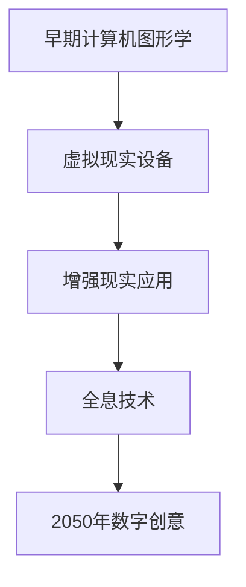
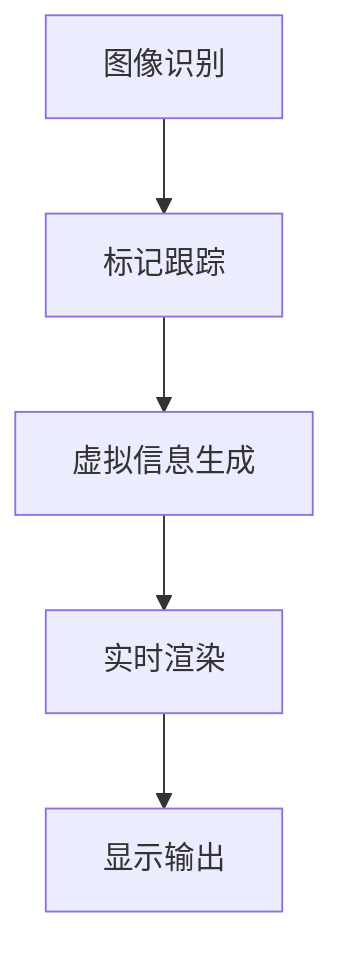
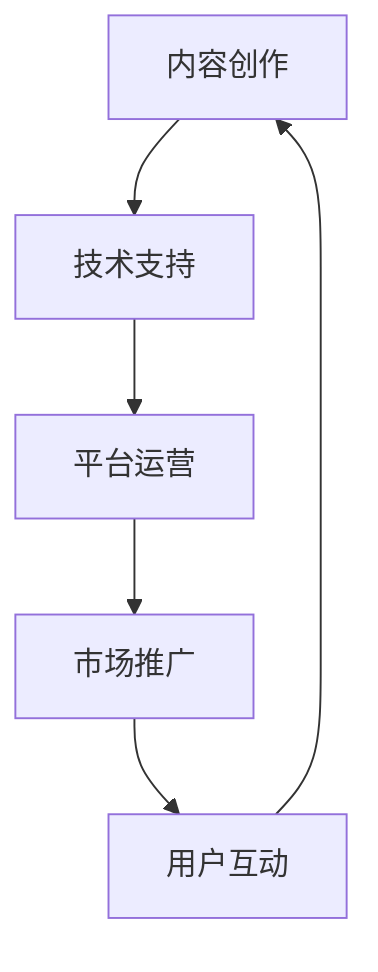
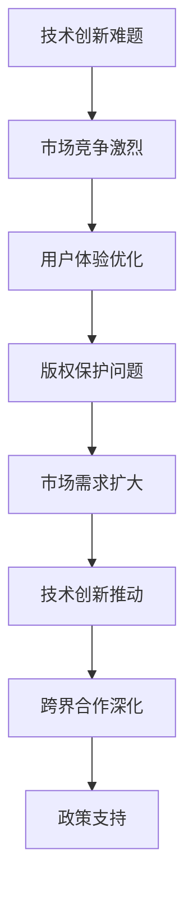
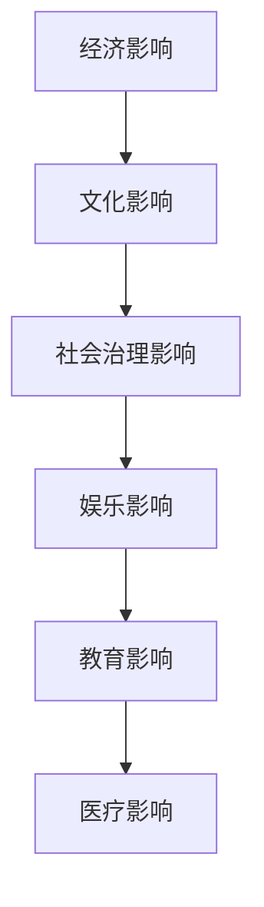
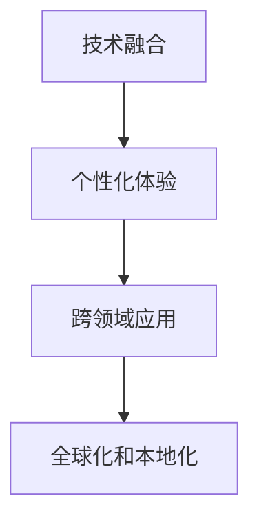
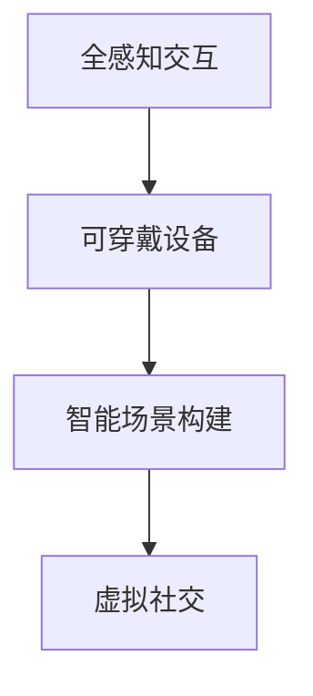

                 

### 文章标题

# 2050年的数字创意：从虚拟直播到全息互动表演的数字创意娱乐

### 关键词

- 数字创意
- 2050年愿景
- 虚拟直播
- 增强现实
- 全息互动表演

### 摘要

随着科技的不断进步，数字创意领域正经历着前所未有的变革。本文旨在探讨2050年数字创意的发展趋势，包括虚拟直播、全息互动表演等前沿技术的应用。通过深入分析数字创意的核心概念、技术原理和实践案例，本文将展现数字创意在未来娱乐产业中的巨大潜力，以及其对生活方式和社会影响的深远影响。本文不仅为业内人士提供宝贵的理论指导和实践参考，也激发读者对数字创意未来的无限想象。

---

### 第一部分：理解数字创意与2050年的愿景

#### 第1章：数字创意的起源与演变

##### 1.1 数字创意的定义与核心要素

数字创意，是指通过数字技术，尤其是虚拟现实（VR）、增强现实（AR）和全息技术等，创造和呈现具有创意性和互动性的内容和体验。数字创意的核心要素包括以下几个方面：

1. **虚拟现实（VR）**：通过计算机模拟生成一个三维的虚拟环境，用户可以在其中进行沉浸式的互动体验。
2. **增强现实（AR）**：在现实世界中叠加数字信息，通过增强用户对现实世界的感知和理解。
3. **全息技术**：通过利用激光和光的干涉原理，生成三维立体的影像，提供高度真实的视觉体验。

这些技术的结合，使得数字创意不仅限于二维的视觉和音频体验，更能够实现三维空间和互动体验的融合。

##### 1.2 数字创意的起源与演变

数字创意的起源可以追溯到计算机图形学和交互技术的发展。早期的VR设备如VR头盔和AR应用如手机上的增强现实游戏，为数字创意的发展奠定了基础。随着硬件技术的进步和算法的优化，数字创意逐渐从实验室走向市场，成为娱乐、教育、医疗等领域的重要应用。

**图1.1 数字创意的起源与演变**



##### 1.3 数字创意的技术基础

数字创意的技术基础主要包括以下几个方面：

1. **深度学习与图像识别**：深度学习算法在图像识别和分类中表现出色，为数字创意提供了强大的数据处理能力。
2. **实时渲染技术**：实时渲染技术使得虚拟环境和增强现实的场景能够流畅地呈现给用户。
3. **全息投影技术**：全息投影技术通过光的干涉和衍射原理，生成三维立体的影像，为用户提供了高度真实的视觉体验。

**伪代码示例：深度学习图像识别算法**

```python
def image_recognition(image):
    # 初始化神经网络模型
    model = NeuralNetwork()

    # 加载预训练的权重
    model.load_weights("pretrained_weights.h5")

    # 进行图像预处理
    processed_image = preprocess_image(image)

    # 进行图像识别
    prediction = model.predict(processed_image)

    # 获取识别结果
    result = interpret_prediction(prediction)

    return result
```

**LaTeX数学模型示例：线性代数在数字创意中的应用**

$$
\begin{aligned}
    \mathbf{X} &= \mathbf{W}\mathbf{X} + \mathbf{b} \\
    \text{其中，} \mathbf{X} &= \text{输入图像矩阵，}\mathbf{W}=\text{权重矩阵，}\mathbf{b}=\text{偏置向量}
\end{aligned}
$$

通过上述技术和算法，数字创意能够在2050年实现从虚拟直播到全息互动表演的多样化应用，为人们带来前所未有的沉浸式体验。

---

在接下来的章节中，我们将深入探讨虚拟直播、增强现实和全息互动表演的具体技术原理和实践案例，进一步揭示数字创意在未来的巨大潜力。

#### 第2章：虚拟直播的技术原理与实践

##### 2.1 虚拟直播的兴起与特点

虚拟直播是一种通过数字技术实现沉浸式直播体验的方式。它不仅限于传统的直播场景，还能够模拟出一个虚拟的三维场景，使观众能够以更加沉浸的方式进行互动。虚拟直播的兴起可以追溯到社交媒体和直播平台的快速发展。随着用户对互动体验的需求不断增加，虚拟直播逐渐成为直播领域的重要分支。

虚拟直播具有以下几个显著特点：

1. **沉浸式体验**：虚拟直播通过虚拟场景的构建，使得观众能够身临其境地参与直播活动。
2. **互动性**：虚拟直播提供了多种互动方式，如实时聊天、投票、抽奖等，增强了观众的参与感。
3. **多样化场景**：虚拟直播可以模拟出各种场景，如演唱会现场、旅游胜地、虚拟商场等，丰富了直播的内容和形式。

##### 2.2 虚拟直播的实现方法

虚拟直播的实现方法涉及多个技术环节，以下将详细讨论其中几个关键部分：

1. **360度全景拍摄**：360度全景拍摄是虚拟直播的基础，通过多个摄像头同时捕捉周围场景的图像，生成全景视频。这些图像需要经过拼接和处理，以消除摄像头的视野盲区。

2. **实时视频传输**：实时视频传输是保证观众能够实时观看直播的关键。常见的传输技术包括HTTP Live Streaming（HLS）和Real-Time Messaging Protocol（RTMP）。HLS通过将视频分割成多个小文件进行传输，适用于各种设备和网络环境；而RTMP则提供了一种低延迟的视频传输方式，适用于对实时性要求较高的场景。

3. **虚拟场景构建**：虚拟直播中的虚拟场景通常是通过三维建模和渲染技术实现的。三维模型可以是基于现实场景的重建，也可以是纯虚拟的创造。这些模型通过实时渲染技术，以三维形式呈现给观众。

**伪代码示例：360度全景拍摄数据拼接算法**

```python
def stitch_panoramic_images(images):
    # 初始化全景图像矩阵
    panorama = np.zeros((height, width, channels))

    # 遍历每个图像
    for image in images:
        # 计算图像的中心点
        center = calculate_center(image)

        # 调整图像的位置，使其与全景图像对齐
        aligned_image = align_image(image, center)

        # 拼接图像到全景图像矩阵中
        panorama = stitch_images(panorama, aligned_image)

    return panorama
```

**LaTeX数学模型示例：图像渲染中的线性变换**

$$
\begin{aligned}
    \mathbf{I'} &= \mathbf{R}\mathbf{I} + \mathbf{t} \\
    \text{其中，} \mathbf{I'} &= \text{渲染后的图像，}\mathbf{R}=\text{旋转矩阵，}\mathbf{I}=\text{原始图像，}\mathbf{t}=\text{平移向量}
\end{aligned}
$$

通过上述技术和算法，虚拟直播能够提供高质量、低延迟的沉浸式直播体验，满足观众对互动和体验的需求。

##### 2.3 虚拟直播案例解析

以下是一个虚拟直播项目的实战案例，包括开发环境搭建、源代码实现和代码解读：

**案例：虚拟旅游直播平台**

**开发环境搭建：**

1. **硬件环境**：配置高性能的计算机和多个360度全景摄像头。
2. **软件环境**：安装Unity游戏引擎、Unity的360度全景视频插件和视频编码工具。

**源代码实现：**

```csharp
// 脚本用于控制摄像头的运动和360度全景视频的录制

using UnityEngine;

public class PanoramaRecorder : MonoBehaviour
{
    public Camera[] cameras;
    public VideoRecorder videoRecorder;

    // 记录视频的方法
    public void StartRecording()
    {
        videoRecorder.StartRecording();
        foreach (var camera in cameras)
        {
            camera.enabled = true;
        }
    }

    // 停止视频记录的方法
    public void StopRecording()
    {
        videoRecorder.StopRecording();
        foreach (var camera in cameras)
        {
            camera.enabled = false;
        }
    }
}
```

**代码解读与分析：**

- **摄像机控制**：脚本中定义了多个摄像机（`cameras`），每个摄像机负责拍摄一个方向的全景图像。
- **视频录制**：通过调用`VideoRecorder`组件的`StartRecording`和`StopRecording`方法，实现视频的录制和停止。

**实际案例分析和详细讲解剖析：**

- **案例分析**：通过虚拟旅游直播平台，用户可以体验不同地点的虚拟旅游，如在虚拟场景中漫步、查看景点介绍等。
- **详细讲解剖析**：虚拟旅游直播平台使用了360度全景拍摄技术，通过多个摄像机的组合，实现了全方位的视角呈现。同时，平台还集成了虚拟现实交互技术，使得用户能够与虚拟场景进行互动。

**项目小结：**

虚拟直播项目通过整合多种数字技术，实现了高质量的沉浸式直播体验。该项目不仅提供了新颖的直播方式，也为未来的虚拟直播应用提供了宝贵的经验和参考。

---

通过本章的讨论，我们了解了虚拟直播的兴起背景、实现方法和技术原理。在下一章中，我们将进一步探讨增强现实技术及其在数字创意中的应用。

#### 第3章：增强现实与全息互动表演

##### 3.1 增强现实技术原理

增强现实（Augmented Reality，AR）是一种将虚拟信息与现实世界融合的技术。通过在现实场景中叠加数字信息，增强用户对现实世界的感知和理解，AR技术为用户提供了更加丰富和互动的体验。

AR技术的基本原理包括以下几个方面：

1. **图像识别与跟踪**：图像识别技术用于识别现实场景中的特定标记或物体。通过跟踪这些标记或物体，系统能够将其作为虚拟信息叠加的参照物。

2. **虚拟信息叠加**：基于图像识别和跟踪的结果，系统将虚拟信息（如文字、图像、动画等）叠加到现实场景中。这些虚拟信息可以动态变化，以适应不同的场景和用户需求。

3. **实时渲染与显示**：实时渲染技术用于生成虚拟信息的三维模型，并通过显示设备（如智能手机、AR眼镜等）实时呈现给用户。

**核心概念与联系**

为了更好地理解增强现实技术，我们可以通过以下Mermaid流程图展示其核心概念及其相互联系：



**伪代码示例：图像识别与标记跟踪算法**

```python
def ar_tracking(image, markers):
    # 初始化标记识别模型
    model = MarkerRecognitionModel()

    # 加载预训练的模型权重
    model.load_weights("pretrained_weights.h5")

    # 进行图像识别
    detected_markers = model.predict(image)

    # 跟踪识别的标记
    tracked_markers = track_markers(detected_markers, markers)

    return tracked_markers
```

通过上述核心概念和技术的结合，增强现实技术能够实现现实与虚拟的深度融合，为用户带来全新的互动体验。

##### 3.2 全息互动表演的应用

全息互动表演是增强现实技术的一个高级应用，通过全息投影技术，将三维影像投射到空气中，形成高度真实的立体视觉效果。这种表演形式不仅能够呈现虚拟角色和场景，还能够实现与观众的实时互动。

全息互动表演的应用场景包括：

1. **娱乐表演**：如全息音乐会、戏剧表演等，通过全息影像呈现虚拟艺术家和表演内容，增强观众的沉浸体验。
2. **商业展示**：如全息产品展示、品牌推广等，通过全息投影技术展示产品的三维模型，提升品牌形象和市场竞争力。
3. **教育培训**：如全息教学、虚拟实验室等，通过全息技术提供生动直观的教育资源，提高教学效果和学生的学习兴趣。

**实现方法**

全息互动表演的实现方法主要包括以下几个步骤：

1. **全息投影设备**：选择适合全息表演的全息投影设备，如全息投影仪、激光投影仪等。这些设备能够产生高质量的三维影像。
2. **场景布局**：根据表演内容和需求，设计并布置全息投影的舞台场景，确保影像的投射效果和观众视角的覆盖。
3. **虚拟内容制作**：通过三维建模和动画技术，制作全息表演的虚拟内容。这些内容需要与场景和表演动作相匹配，以实现流畅的互动效果。
4. **实时互动系统**：开发实时互动系统，允许观众通过手势、语音等交互方式与全息影像进行互动。该系统需要与全息投影设备无缝集成，以提供流畅的互动体验。

**数学模型与公式**

全息投影技术的数学模型主要涉及光的干涉和衍射原理。以下是一个简单的数学模型示例，用于描述全息影像的形成：

$$
\begin{aligned}
    \mathbf{I'} &= \frac{1}{2\pi} \int_{-\infty}^{\infty} \int_{-\infty}^{\infty} \mathbf{E}_s(\mathbf{r}', \omega') e^{i(\mathbf{k}\cdot\mathbf{r}')} d\mathbf{r}' d\omega' \\
    \text{其中，} \mathbf{I'} &= \text{全息影像的光强分布，}\mathbf{E}_s &= \text{光源的光场，}\mathbf{k} &= \text{波矢量}
\end{aligned}
$$

通过上述模型，全息投影设备能够生成三维立体的影像，为观众提供高度真实的视觉体验。

##### 3.3 增强现实与全息互动表演案例研究

**案例1：全息音乐会**

全息音乐会是一种通过全息技术呈现虚拟艺术家的表演形式。以下是全息音乐会的实现方法、效果分析和项目小结：

**实现方法：**

1. **全息投影设备**：使用高性能的全息投影仪，确保影像的清晰度和立体感。
2. **虚拟艺术家制作**：通过三维建模和动画技术，制作虚拟艺术家的形象和表演动作。
3. **实时互动系统**：开发实时互动系统，允许观众通过手势和语音与虚拟艺术家互动。

**效果分析：**

- **沉浸式体验**：观众能够近距离观看虚拟艺术家的表演，感受到真实的音乐氛围。
- **互动性**：观众可以通过互动系统与虚拟艺术家互动，增加表演的趣味性和参与感。

**项目小结：**

全息音乐会通过融合全息技术和互动系统，成功实现了虚拟与现实的深度融合，为观众带来了全新的音乐体验。

**案例2：全息产品展示**

全息产品展示是一种通过全息投影技术展示产品三维模型的形式。以下是全息产品展示的实现方法、效果分析和项目小结：

**实现方法：**

1. **全息投影设备**：使用激光投影仪，确保投影的精度和立体感。
2. **三维模型制作**：通过三维建模软件，制作产品的三维模型。
3. **场景布局**：根据展示需求，设计并布置展示场景，确保投影效果和观众的观看视角。

**效果分析：**

- **立体感**：产品三维模型能够清晰呈现，使观众能够从不同角度了解产品细节。
- **互动性**：观众可以通过互动系统与产品模型互动，增加展示的趣味性和信息获取的效率。

**项目小结：**

全息产品展示通过三维建模和全息投影技术的结合，成功提升了产品展示的视觉效果和互动性，为企业提供了新颖的展示方式。

通过以上案例研究，我们可以看到增强现实和全息互动表演在娱乐、商业和教育等领域的广泛应用。这些应用不仅提升了用户体验，也为数字创意产业带来了新的发展机遇。

---

在下一部分，我们将探讨数字创意的未来发展，包括人工智能在数字创意中的应用和数字创意产业的生态体系构建。

#### 第4章：人工智能在数字创意中的应用

人工智能（AI）技术在数字创意领域的应用正迅速扩展，为内容创作、用户体验和市场推广带来了前所未有的变革。通过深度学习、自然语言处理（NLP）和计算机视觉等AI技术，数字创意产业正在实现自动化、个性化和高效化的内容生成和呈现。

##### 4.1 人工智能与数字创意的结合

人工智能与数字创意的结合主要体现在以下几个方面：

1. **内容创作自动化**：AI技术能够自动生成图像、视频和音乐等内容。例如，GAN（生成对抗网络）可以生成逼真的图像和视频，而自然语言处理技术可以自动生成故事情节和剧本。

2. **用户个性化体验**：通过用户行为分析和偏好预测，AI技术能够为用户提供个性化的内容推荐和服务。例如，推荐系统可以根据用户的观看历史和互动行为，推荐个性化的虚拟直播节目和全息互动表演。

3. **智能交互与反馈**：AI技术使得虚拟角色和全息影像能够与用户进行自然对话和互动。通过语音识别和自然语言处理技术，虚拟助手能够理解用户的指令，提供实时反馈和交互体验。

4. **市场推广自动化**：AI技术可以自动分析市场趋势和用户反馈，优化市场推广策略。例如，通过分析社交媒体数据和用户评论，AI可以预测未来的流行趋势，帮助企业制定有效的市场推广计划。

##### 4.2 人工智能在数字创意领域的应用案例

**案例1：AI生成音乐**

AI生成音乐是一种利用AI技术自动创作音乐的方法。通过深度学习模型，AI可以分析大量的音乐数据，学习音乐风格和创作技巧，然后生成新的音乐作品。例如，OpenAI的MuseNet项目利用生成对抗网络，能够生成各种风格的音乐片段，为音乐创作提供了新的可能性。

**实现方法：**

1. **数据收集与处理**：收集大量的音乐数据，包括不同风格和类型的乐曲。
2. **深度学习模型训练**：使用生成对抗网络（GAN）或变分自编码器（VAE）等模型，对音乐数据进行训练。
3. **音乐生成与优化**：通过训练好的模型，生成新的音乐片段，并根据用户反馈进行优化。

**效果分析：**

- **创意性**：AI生成的音乐具有独特的风格和创意，能够为音乐创作带来新的灵感。
- **效率**：通过AI自动化生成音乐，提高了音乐创作的效率，缩短了创作周期。

**项目小结**：

AI生成音乐不仅为音乐创作者提供了新的工具，也为用户体验带来了多样化的音乐选择。这种技术的应用，使得音乐创作更加个性化和多样化。

**案例2：个性化虚拟直播**

个性化虚拟直播是一种根据用户兴趣和行为，自动生成和推荐虚拟直播内容的方法。通过用户行为分析和AI算法，平台能够为每个用户推荐个性化的直播节目。

**实现方法：**

1. **用户行为收集**：收集用户的观看历史、互动行为和偏好数据。
2. **行为分析**：使用机器学习算法分析用户行为，预测用户兴趣。
3. **内容推荐**：根据用户兴趣预测，推荐个性化的直播内容。

**效果分析：**

- **个性化**：用户能够看到更加符合自己兴趣的直播内容，提高了观看体验。
- **互动性**：个性化虚拟直播使得用户与直播内容之间的互动更加紧密。

**项目小结**：

个性化虚拟直播通过AI技术的应用，提升了用户满意度，同时也为直播平台带来了更多的用户粘性和商业价值。

**案例3：智能互动全息影像**

智能互动全息影像是一种通过AI技术，实现全息影像与用户自然互动的方法。通过语音识别和自然语言处理技术，全息影像能够理解用户的指令，进行相应的动作和反馈。

**实现方法：**

1. **语音识别**：使用语音识别技术，将用户的语音转换为文字。
2. **自然语言处理**：使用自然语言处理技术，理解用户指令的含义。
3. **动作生成**：根据用户指令，生成相应的全息影像动作和反馈。

**效果分析：**

- **自然性**：用户与全息影像的互动更加自然，提升了用户体验。
- **多样性**：智能互动全息影像能够根据不同的指令，提供多样化的互动体验。

**项目小结**：

智能互动全息影像通过AI技术的应用，实现了虚拟与现实的深度融合，为用户提供了一种全新的互动体验。

通过上述案例，我们可以看到人工智能在数字创意领域的广泛应用和巨大潜力。未来，随着AI技术的不断进步，数字创意产业将迎来更多创新和变革。

---

在下一章中，我们将探讨数字创意产业的跨界合作与未来趋势，以及数字创意产业的生态体系构建。

#### 第5章：跨界合作与数字创意的未来趋势

数字创意产业的快速发展离不开各行业的跨界合作。跨界合作不仅推动了数字创意技术的创新，也拓展了其应用场景，为未来的数字创意产业带来了无限的想象空间。在本章中，我们将探讨数字创意产业与各行业的跨界合作模式，分析成功案例，并探讨其未来趋势。

##### 5.1 跨界合作在数字创意中的应用

跨界合作在数字创意产业中的应用体现在多个方面，主要包括以下几种模式：

1. **技术与艺术的融合**：数字创意产业与艺术领域的融合，将艺术创作与数字技术相结合，创造出全新的艺术形式。例如，数字艺术家利用VR和AR技术，创作出沉浸式的艺术作品，使观众能够身临其境地体验艺术作品的魅力。

2. **教育与技术的结合**：数字创意产业与教育领域的结合，通过虚拟现实、增强现实等技术，提供更加生动、直观的教育资源。例如，虚拟实验室和全息教学场景，让学生能够更加深入地理解复杂的科学概念。

3. **商业与创意的融合**：数字创意产业与商业领域的跨界合作，通过创意内容和数字技术，提升品牌形象和市场竞争力。例如，全息营销活动、虚拟直播发布会等，使品牌与消费者之间的互动更加有趣和生动。

4. **文化与旅游的融合**：数字创意产业与文化旅游领域的融合，通过数字技术重现历史文化遗产，提供虚拟旅游体验。例如，全息博物馆和虚拟景区，让游客能够远程感受文化魅力和历史场景。

##### 5.2 跨界合作的成功案例

以下是一些跨界合作的成功案例，展示了数字创意产业在不同领域的创新应用：

**案例1：数字艺术展览**

数字艺术展览通过VR和AR技术，将艺术作品呈现在虚拟空间中，使观众能够从不同角度和维度欣赏艺术作品。例如，法国巴黎的“数字艺术展览”利用VR技术，让观众能够进入艺术家创作的虚拟世界，感受艺术的魅力。

**实现方法：**

1. **艺术作品数字化**：将艺术作品数字化，制作成虚拟模型。
2. **VR场景搭建**：利用VR技术，搭建虚拟展览空间。
3. **AR互动体验**：通过AR技术，使观众能够与艺术作品进行互动。

**效果分析：**

- **沉浸式体验**：观众能够身临其境地欣赏艺术作品，提高观赏的趣味性和深度。
- **互动性**：观众可以通过互动，与艺术作品进行互动，增加参与感和体验感。

**项目小结**：

数字艺术展览通过VR和AR技术的应用，成功地将艺术创作与数字技术相结合，为观众带来了全新的观赏体验。

**案例2：虚拟实验室**

虚拟实验室通过虚拟现实技术，为学生提供虚拟的实验环境，模拟真实的实验过程。例如，北京师范大学的虚拟实验室项目，利用VR技术，让学生能够在虚拟环境中进行化学实验，提高实验教学的趣味性和安全性。

**实现方法：**

1. **实验室场景搭建**：利用VR技术，搭建虚拟的实验室场景。
2. **实验过程模拟**：模拟真实的实验过程，使学生能够进行虚拟实验。
3. **交互功能开发**：开发交互功能，使学生能够与虚拟实验环境进行互动。

**效果分析：**

- **安全性**：虚拟实验室避免了真实实验中的风险，提高了实验的安全性。
- **趣味性**：虚拟实验过程增加了学生的兴趣和参与度，提高了教学效果。

**项目小结**：

虚拟实验室通过VR技术的应用，成功地将实验教学与数字技术相结合，为教育领域带来了创新的教学模式。

**案例3：全息营销活动**

全息营销活动通过全息投影技术，将品牌形象和产品信息以全息影像的形式呈现给消费者。例如，某知名化妆品品牌在大型商场举办的全息秀，通过全息投影展示了产品的独特卖点和使用效果，吸引了大量消费者。

**实现方法：**

1. **全息影像制作**：制作品牌形象和产品信息的全息影像。
2. **全息投影设备**：使用全息投影设备，将全息影像投射到空中。
3. **互动体验开发**：开发互动功能，使消费者能够与全息影像进行互动。

**效果分析：**

- **视觉冲击力**：全息影像的视觉效果吸引了消费者的注意力，提高了品牌曝光度。
- **互动性**：消费者通过互动体验，加深了对品牌和产品的了解和好感。

**项目小结**：

全息营销活动通过全息投影技术的应用，成功地将品牌形象与数字创意相结合，提高了市场推广的效果。

**案例4：虚拟旅游**

虚拟旅游通过VR和AR技术，让游客能够在虚拟环境中体验不同的旅游场景。例如，中国的“虚拟景区”项目，利用VR技术，让游客能够远程参观世界各地的著名景点，提供了一种全新的旅游体验。

**实现方法：**

1. **虚拟场景搭建**：利用VR技术，搭建虚拟的旅游场景。
2. **AR导航系统**：开发AR导航系统，帮助游客在现实环境中找到虚拟景点的位置。
3. **互动体验开发**：开发互动功能，使游客能够与虚拟环境进行互动。

**效果分析：**

- **便捷性**：游客无需前往实际景点，即可在虚拟环境中体验景点，提供了便利的旅游方式。
- **趣味性**：虚拟旅游增加了旅游的趣味性和互动性，提升了用户体验。

**项目小结**：

虚拟旅游通过VR和AR技术的应用，成功地将旅游与数字创意相结合，为旅游行业带来了创新的发展模式。

##### 5.3 数字创意产业的未来趋势

随着科技的不断进步和跨界合作的深入，数字创意产业正朝着以下几个方向发展：

1. **技术创新**：数字创意产业将继续推动技术创新，如5G通信技术、边缘计算和人工智能等，为数字创意应用提供更快的传输速度、更低的延迟和更高的处理能力。

2. **内容多样化**：数字创意产业将提供更加多样化的内容，满足不同用户群体的需求。通过AI技术，个性化内容和推荐系统将更加成熟，为用户带来更加个性化的体验。

3. **商业模式创新**：数字创意产业将与各行业深度融合，形成新的商业模式。例如，虚拟直播电商、全息广告和智能教育等，将创造新的市场机会和商业价值。

4. **生态体系建设**：数字创意产业将建立更加完善的生态体系，包括内容创作者、技术提供者、平台运营者和用户等，形成一个良性循环的生态系统。

通过跨界合作和创新应用，数字创意产业将在未来发挥更大的作用，为社会带来更多的价值。

---

在下一章中，我们将深入探讨数字创意产业的生态体系构建，分析其核心环节、挑战和机遇。

#### 第6章：数字创意产业的生态体系构建

数字创意产业的生态体系构建是一个复杂而多维的过程，涉及内容创作、技术支持、平台运营、市场推广等多个核心环节。在这个生态体系中，各环节相互依存、协同发展，共同推动数字创意产业的繁荣。在本章中，我们将详细分析数字创意产业生态体系的核心环节、面临的挑战和机遇。

##### 6.1 数字创意产业的核心环节

数字创意产业的生态体系包括以下核心环节：

1. **内容创作**：内容创作是数字创意产业的基础，涵盖了从创意构思、剧本编写到最终内容制作的全过程。高质量的内容是吸引观众和用户的关键，因此，内容创作者的专业能力和创新意识至关重要。

2. **技术支持**：技术支持是数字创意产业的重要支柱，涵盖了从硬件设备、软件工具到算法模型的各个方面。先进的技术支持能够提升内容创作的效率和品质，同时为用户体验提供更好的保障。

3. **平台运营**：平台运营是数字创意产业的核心环节之一，涵盖了从内容发布、用户管理到数据分析的各个方面。一个高效、稳定的运营平台能够为用户提供优质的数字创意体验，同时为内容创作者提供良好的创作环境。

4. **市场推广**：市场推广是数字创意产业的重要手段，涵盖了从广告宣传、渠道拓展到品牌建设等多个方面。有效的市场推广能够提升数字创意产品的知名度和市场占有率，为产业带来更多的商业机会。

5. **用户互动**：用户互动是数字创意产业的重要组成部分，涵盖了从用户反馈、互动体验到用户忠诚度管理等多个方面。通过有效的用户互动，数字创意产业能够更好地了解用户需求，提升用户体验，增强用户粘性。

**图6.1 数字创意产业生态体系的核心环节**



##### 6.2 数字创意产业的挑战

尽管数字创意产业具有巨大的发展潜力，但在发展过程中也面临着一系列挑战：

1. **技术创新难题**：数字创意产业依赖于先进的技术支持，但技术创新往往面临研发成本高、周期长等难题。如何在保证技术创新的同时，控制成本和风险，是数字创意产业需要面对的重要问题。

2. **版权保护问题**：数字创意产业的产品易于复制和传播，版权保护成为一大挑战。如何建立有效的版权保护机制，保护内容创作者的合法权益，是产业健康发展的重要保障。

3. **用户体验优化**：随着用户需求的多样化，数字创意产业需要不断优化用户体验。如何在海量的内容中，为用户提供个性化、高质量的内容，是产业需要持续解决的问题。

4. **市场竞争激烈**：数字创意产业市场竞争激烈，企业需要不断创新和优化产品，以获得竞争优势。如何在激烈的市场竞争中脱颖而出，是每个企业都需要思考的问题。

##### 6.3 数字创意产业的机遇

面对挑战，数字创意产业也迎来了诸多机遇：

1. **技术创新推动**：随着5G、人工智能、虚拟现实等新技术的不断发展，数字创意产业将迎来技术革新和产业升级的机遇。先进技术的应用，将为数字创意产业带来更多的创新可能和应用场景。

2. **市场需求扩大**：随着互联网的普及和用户对数字娱乐需求的增加，数字创意产业的市场需求不断扩大。无论是虚拟直播、增强现实还是全息互动表演，都拥有广阔的市场前景。

3. **跨界合作深化**：数字创意产业与各行业的跨界合作将不断深化，带来更多的商业机会和创新模式。例如，教育与数字创意的结合、文化娱乐与数字创意的结合等，都将为产业带来新的发展机遇。

4. **政策支持**：政府对数字创意产业的支持力度不断加大，提供了良好的政策环境和市场空间。政策支持将为数字创意产业的发展提供有力的保障。

**图6.2 数字创意产业的挑战与机遇**



##### 6.4 数字创意产业的生态体系构建策略

为了构建健康、可持续发展的数字创意产业生态体系，以下策略可供参考：

1. **技术创新驱动**：加强技术研发和投入，推动数字创意产业的技术创新。通过建立研发中心和产学研合作，提升产业的科技实力。

2. **版权保护机制**：建立完善的版权保护机制，保护内容创作者的合法权益。通过法律、技术和管理等多方面的措施，打击侵权行为，营造良好的版权保护环境。

3. **用户体验优化**：关注用户需求，不断提升用户体验。通过数据分析、用户调研等方式，深入了解用户喜好，优化产品设计和功能，提供个性化、高质量的内容。

4. **跨界合作**：积极拓展跨界合作，深化产业融合。通过跨界合作，拓宽市场空间，创新商业模式，提升产业的整体竞争力。

5. **人才培养**：加强人才培养，提升产业人才素质。通过教育培训、人才引进等方式，培养一支懂技术、懂创意、懂市场的高素质人才队伍。

6. **政策支持**：积极争取政策支持，营造良好的产业发展环境。通过政策引导、资金扶持等方式，为数字创意产业发展提供有力保障。

通过以上策略，数字创意产业将能够更好地应对挑战，把握机遇，实现持续健康发展。

---

在下一章中，我们将探讨数字创意对未来生活方式的改变，以及数字创意与可持续发展的结合。

#### 第7章：2050年数字创意的社会影响

随着数字创意技术的不断进步，2050年的数字创意将对我们的生活方式产生深远的影响。在这一章中，我们将探讨数字创意对娱乐、教育、医疗等领域的改变，并分析数字创意与可持续发展的结合。

##### 7.1 数字创意对生活方式的改变

数字创意技术已经深刻改变了我们的生活方式，而在2050年，这种改变将变得更加显著和全面。

1. **娱乐**：在2050年，虚拟现实（VR）和增强现实（AR）技术将使娱乐体验更加沉浸和互动。例如，虚拟演唱会、全息电影和AR游戏将让用户在家中就能体验到现场般的娱乐氛围。此外，数字创意技术还将创造全新的娱乐形式，如全息互动剧场和虚拟主题公园，为用户提供前所未有的娱乐体验。

2. **教育**：数字创意技术将在教育领域发挥重要作用。虚拟现实和增强现实技术将提供更加生动、直观的教育资源，使学生能够身临其境地学习历史事件、科学实验和艺术作品。同时，个性化学习平台将根据学生的兴趣和学习习惯，提供定制化的教学内容和学习路径，提高学习效果。

3. **医疗**：数字创意技术在医疗领域的应用将极大地改善医疗服务的质量和效率。例如，虚拟现实技术可用于医疗培训和模拟手术，提高医生的操作技能。增强现实技术则可用于手术辅助，实时显示手术过程和关键数据，帮助医生做出更准确的判断。此外，全息影像技术可用于远程医疗，让医生能够为偏远地区的患者提供高质量的医疗服务。

##### 7.2 数字创意与可持续发展的结合

数字创意不仅改变了我们的生活方式，还在环境保护和经济发展的平衡点找到了一条新的路径。

1. **环境监测与保护**：数字创意技术可用于环境监测和保护。例如，利用无人机和卫星影像技术，可以实时监控森林覆盖变化、水质污染和野生动物栖息地状况。这些数据将为环境保护决策提供科学依据。同时，增强现实和虚拟现实技术可用于环境教育和宣传，提高公众对环境保护的意识。

2. **资源优化利用**：数字创意技术有助于优化资源的利用，减少浪费。例如，通过虚拟现实和增强现实技术，企业可以进行虚拟设计和制造，减少物理样品的制作和测试，从而降低成本和资源消耗。此外，数字创意技术还可用于供应链管理和物流优化，提高资源利用效率。

3. **经济可持续发展**：数字创意产业本身就是一个高附加值、低排放的行业，对经济发展的贡献显著。同时，数字创意技术可以促进传统产业的转型升级，推动经济可持续发展。例如，通过数字创意技术，农业可以实现精准种植和养殖，提高产量和质量，同时减少对环境的负面影响。

##### 7.3 数字创意对社会的深远影响

数字创意技术对社会的深远影响不仅体现在娱乐、教育和医疗等领域，还涉及经济、文化和政治等多个层面。

1. **经济影响**：数字创意产业具有巨大的经济潜力，可以创造大量的就业机会和经济增长点。随着数字创意技术的普及和应用，传统产业将逐步转型为数字创意驱动型产业，推动经济的可持续发展。

2. **文化影响**：数字创意技术为文化传播和交流提供了新的途径和平台。虚拟现实和增强现实技术可以重现历史文化遗产，让更多人了解和体验不同文化的魅力。同时，数字创意技术还可以促进文化创意产业的发展，为文化多样性贡献力量。

3. **政治影响**：数字创意技术对政治决策和社会治理也产生了重要影响。通过大数据分析和人工智能技术，政府可以更科学地制定政策和规划，提高社会治理的效率和效果。同时，数字创意技术也为公众提供了参与政治决策和表达意见的新渠道。

**图7.1 数字创意对社会的深远影响**



通过数字创意技术的不断发展和创新，2050年的社会将变得更加智能、互联和可持续。数字创意不仅改变了我们的生活方式，也为我们提供了一个更美好的未来。

---

在下一章中，我们将展望2050年数字创意的长期趋势，探讨创新方向及其面临的挑战。

#### 第8章：2050年数字创意的未来展望

随着科技的不断进步和数字创意技术的不断创新，2050年的数字创意领域将迎来前所未有的发展机遇和挑战。在这一章中，我们将深入探讨数字创意的长期趋势，分析未来的创新方向，并探讨可能面临的挑战及其应对策略。

##### 8.1 数字创意的长期趋势

1. **技术融合**：未来的数字创意将不仅仅是单一技术的应用，而是多种技术的深度融合。例如，虚拟现实（VR）、增强现实（AR）、人工智能（AI）、大数据和物联网（IoT）等技术将相互融合，创造出更加丰富和互动的数字体验。

2. **个性化体验**：随着用户数据的积累和分析技术的进步，数字创意将更加注重个性化体验。通过个性化推荐系统、虚拟角色和智能交互技术，用户将能够获得更加符合自己需求和兴趣的内容和服务。

3. **跨领域应用**：数字创意技术将在更多领域得到应用，不仅限于娱乐和教育，还将深入到医疗、金融、制造、能源等传统行业。数字创意技术将帮助这些行业实现数字化转型，提高效率和创新能力。

4. **全球化和本地化**：数字创意产业将实现全球化和本地化的双重发展。在全球范围内，数字创意产品和服务将跨越国界，实现全球化传播。同时，本地化策略将帮助数字创意企业更好地适应不同地区的文化和市场需求。

**图8.1 数字创意的长期趋势**



##### 8.2 创新方向

1. **全感知交互**：未来的数字创意将实现全感知交互，通过多种传感器和人工智能技术，用户将能够与数字世界进行更加自然和直观的交互。例如，语音、手势、眼动和情感识别等技术将使交互体验更加智能化和个性化。

2. **可穿戴设备**：可穿戴设备将在数字创意领域发挥重要作用。随着技术的发展，可穿戴设备将更加轻便、智能和舒适，成为数字创意体验的重要载体。例如，智能眼镜、智能手表和智能服装等设备将提供全新的交互方式和体验。

3. **智能场景构建**：智能场景构建技术将使数字创意能够更真实地模拟现实世界。通过人工智能和大数据分析，智能场景构建技术将能够实时分析和响应用户行为和环境变化，提供更加个性化和自适应的数字体验。

4. **虚拟社交**：随着虚拟现实和增强现实技术的发展，虚拟社交将成为未来数字创意的重要方向。虚拟社交平台将提供沉浸式的社交体验，用户可以在虚拟世界中建立社交关系、参与活动和互动，体验与现实世界相似的社交氛围。

**图8.2 数字创意的创新方向**



##### 8.3 未来挑战与应对策略

尽管数字创意领域具有巨大的发展潜力，但在未来发展中也将面临一系列挑战：

1. **技术挑战**：数字创意技术的发展需要不断突破技术瓶颈。例如，如何在保持高质量和低延迟的同时，提升虚拟现实和增强现实技术的计算性能和用户体验。应对策略包括加强技术研发和投入，推动跨学科合作，以及引入新的计算架构和算法。

2. **隐私和安全**：随着数字创意技术的普及，个人隐私和数据安全成为重要问题。应对策略包括建立完善的隐私保护机制，加强数据加密和安全认证，以及制定相关法律法规，保障用户隐私和数据安全。

3. **社会影响**：数字创意技术对社会的影响需要得到充分的关注和评估。例如，数字创意技术可能对就业、教育和文化产生深远影响。应对策略包括加强社会研究和政策制定，推动数字创意技术与传统产业的融合，以及开展公众教育和宣传活动，提高公众对数字创意技术的认知和理解。

4. **可持续发展**：数字创意技术的发展需要考虑环境保护和可持续发展。应对策略包括推动绿色技术创新，优化资源利用，以及制定可持续发展的战略和规划。

通过应对这些挑战，数字创意领域将能够在未来的发展中实现持续创新和可持续发展，为社会带来更多的价值和福祉。

---

在本章的最后，我们期待2050年的数字创意能够带来更加丰富、多样和智能的体验，推动人类社会的进步和发展。

### 附录

#### 附录A：数字创意开发工具与资源

数字创意的开发离不开一系列专业的工具和资源。以下将介绍一些主流的数字创意开发工具和推荐的资源，帮助读者深入了解和学习数字创意技术。

##### A.1 主流数字创意开发工具

1. **Unity**：Unity是一个功能强大的游戏和虚拟现实开发平台，支持3D和2D游戏开发，以及VR和AR应用开发。它提供了丰富的开发工具、资源和社区支持，是数字创意开发者的首选工具之一。

2. **Blender**：Blender是一个开源的3D创作套件，支持建模、雕刻、渲染、动画和视频编辑等功能。它适合于虚拟现实和增强现实内容的制作，具有极高的灵活性和自由度。

3. **Adobe系列软件**：包括Adobe Photoshop、Adobe Illustrator、Adobe After Effects等，这些软件在图像处理、图形设计和动画制作方面具有极高的专业水平，广泛应用于数字创意领域。

4. **Unreal Engine**：Unreal Engine是一个高端的3D游戏和虚拟现实开发引擎，以其出色的图形渲染能力和丰富的开发工具，广泛应用于游戏开发、建筑可视化、电影制作等领域。

##### A.2 数字创意资源汇总

1. **书籍**：
   - 《虚拟现实技术与应用》
   - 《增强现实技术：理论与实践》
   - 《全息投影技术：原理与应用》
   - 《计算机图形学：原理及实践》

2. **在线课程**：
   - Coursera上的“Virtual Reality”课程
   - Udemy上的“Augmented Reality Development”课程
   - Edx上的“Introduction to 3D Graphics”课程

3. **论文和报告**：
   - IEEE Xplore数据库中的相关论文和研究报告
   - ACM Digital Library中的最新研究成果
   - 相关技术公司的白皮书和年度报告

4. **开源项目和社区**：
   - GitHub上的VR/AR开源项目
   - VR/AR社区论坛，如VRChat和Unity论坛
   - 专业会议和研讨会，如SIGGRAPH和VRST

通过上述工具和资源的支持，读者可以深入学习和掌握数字创意技术，为未来的数字创意项目打下坚实的基础。

### 作者信息

**作者：AI天才研究院/AI Genius Institute & 禅与计算机程序设计艺术 /Zen And The Art of Computer Programming**

