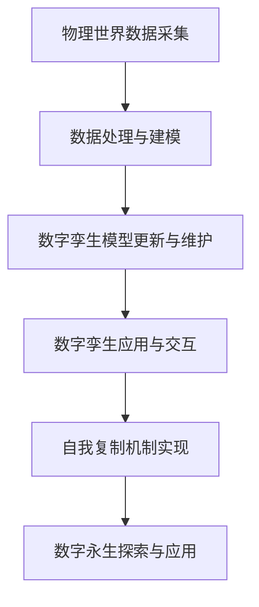

                 

### 文章标题

《2050年的数字孪生：从数字分身到数字永生的自我复制》

### 关键词

数字孪生、数字分身、数字永生、自我复制、人工智能、物联网

### 摘要

随着科技的迅猛发展，数字孪生技术正在从一种模拟物理实体的虚拟模型，逐步演变成为实现数字分身和数字永生的重要工具。本文探讨了2050年数字孪生的潜在发展，从基本概念、技术原理到应用领域，再到数字分身与数字永生的实现机制，最终展望了这一技术对未来社会的影响。文章通过详细的流程图、算法原理讲解、数学模型和项目实战，揭示了数字孪生技术的深度和广度，为读者提供了一个清晰的技术蓝图。

### 第一部分：数字孪生基础

#### 第1章：数字孪生概念与历史背景

##### 1.1 数字孪生概述

数字孪生（Digital Twin）是一种新兴的技术概念，指的是通过数字技术对物理实体进行映射和模拟，创建一个虚拟的镜像。这个虚拟镜像不仅能够反映物理实体的状态和性能，还可以实时更新，并提供预测分析和优化建议。

数字孪生的概念最早可以追溯到2002年，由迈克尔·格里夫斯（Michael Grieves）在麻省理工学院（MIT）提出。他首次提出了数字孪生在产品生命周期管理（PLM）中的应用。随着计算机技术和物联网（IoT）的快速发展，数字孪生技术逐渐成熟并广泛应用到各个领域。

##### 1.2 数字孪生的历史与发展

数字孪生的历史可以追溯到几个重要的里程碑：

1. **2002年**：迈克尔·格里夫斯提出数字孪生概念。
2. **2010年**：物联网技术的兴起为数字孪生提供了数据基础。
3. **2015年**：通用电气（GE）推出“工业互联网”（Industrial Internet），数字孪生成为其核心技术之一。
4. **2018年**：国际标准组织（ISO）发布了数字孪生技术标准。

这些里程碑事件标志着数字孪生技术的逐步成熟和应用范围的扩大。

##### 1.3 数字孪生的核心价值

数字孪生的核心价值体现在以下几个方面：

1. **实时监测与预测**：通过数字孪生技术，可以实现对物理实体的实时监测，预测其性能变化，预防潜在故障。
2. **优化设计与制造**：数字孪生模型可以帮助设计师和工程师优化产品设计和制造过程，提高生产效率和质量。
3. **降低运营成本**：通过数字孪生技术，可以模拟和分析不同运营策略，找到最优的运营模式，降低运营成本。
4. **提升用户体验**：在消费领域，数字孪生技术可以提供个性化的产品和服务，提升用户体验。

#### 第2章：数字孪生技术原理

##### 2.1 物理世界与数字世界的映射

数字孪生的核心在于物理世界与数字世界的映射，这个过程可以分为以下几个步骤：

1. **数据采集**：通过传感器、物联网设备等手段收集物理世界的实时数据。
2. **数据预处理**：对采集到的原始数据进行清洗、归一化和特征提取，以便于后续建模。
3. **模型构建**：基于预处理后的数据，使用机器学习和数据挖掘技术构建数字孪生模型。

##### 2.2 数字孪生模型的构建

构建数字孪生模型通常包括以下几个步骤：

1. **数据选择**：选择能够反映物理实体特性的数据，如温度、压力、振动等。
2. **特征工程**：对数据进行特征提取，选择对模型性能有显著影响的关键特征。
3. **模型训练**：使用机器学习算法训练模型，使其能够模拟物理实体的行为和性能。
4. **模型评估**：通过交叉验证和测试集评估模型的性能，调整模型参数以优化性能。

##### 2.3 数字孪生模型的更新与维护

数字孪生模型不是一成不变的，它需要随着物理实体状态的变化不断更新和优化。这个过程包括：

1. **数据更新**：定期采集新的数据，更新模型中的数据集。
2. **模型重训练**：基于新数据对模型进行重新训练，以适应新的物理实体状态。
3. **模型维护**：定期检查模型性能，修复可能出现的错误和漏洞。

##### 2.4 数字孪生技术的应用领域

数字孪生技术具有广泛的应用领域，主要包括：

1. **制造业**：通过数字孪生技术优化生产过程，提高产品质量和生产效率。
2. **建筑和基础设施**：对建筑和基础设施进行虚拟仿真，实现实时监测和预测维护。
3. **能源和电力**：通过数字孪生技术优化能源分配和电力调度，提高能源利用效率。

#### 第3章：数字孪生与物联网

##### 3.1 物联网技术的融合

数字孪生与物联网（IoT）技术的融合，为数字孪生技术的发展提供了新的动力。物联网技术通过传感器和网络连接，实时收集物理世界的海量数据，这些数据为数字孪生模型的构建提供了丰富的数据源。

##### 3.2 物联网设备的数据采集

物联网设备的数据采集是数字孪生技术的重要基础。通过传感器和网络连接，物联网设备可以实时收集温度、湿度、振动、压力等物理参数，并将这些数据传输到数字孪生模型中进行处理和分析。

##### 3.3 物联网平台与数字孪生的集成

物联网平台在数字孪生技术中发挥着重要作用，它不仅负责数据采集和传输，还提供了数据存储、分析和可视化等功能。物联网平台与数字孪生模型的集成，可以实现数据的无缝对接，提高数字孪生系统的效率和可靠性。

##### 3.4 智能化与自动化

数字孪生技术与物联网技术的融合，推动了智能化和自动化的进程。通过数字孪生模型，可以实现实时监控和预测分析，自动化调整物理实体的状态，提高系统的自适应性和灵活性。

##### 3.5 实时监控与预测分析

实时监控和预测分析是数字孪生技术的核心功能。通过物联网设备和数字孪生模型，可以实现对物理实体的实时监测，预测其未来的行为和性能，提前发现潜在问题，并采取相应措施进行预防。

### 第二部分：数字分身与数字永生

#### 第4章：数字分身的概念与实现

##### 4.1 数字分身的定义

数字分身是指通过数字孪生技术，创建一个与物理实体具有相似功能的虚拟实体。这个虚拟实体不仅能够模拟物理实体的行为和性能，还可以独立运行，实现与物理实体相同的功能。

##### 4.2 数字分身的技术架构

数字分身的技术架构通常包括以下几个部分：

1. **数字孪生模型**：作为数字分身的核心，数字孪生模型负责模拟物理实体的行为和性能。
2. **数据处理与存储**：负责收集、处理和存储物理实体的数据，为数字孪生模型提供数据支持。
3. **交互接口**：提供数字分身与物理实体以及其他系统之间的交互接口，实现数据的交换和功能的调用。
4. **虚拟环境**：为数字分身提供运行环境，包括硬件设施、操作系统、应用软件等。

##### 4.3 数字分身的实现挑战

数字分身的实现面临着以下几个挑战：

1. **数据同步**：确保数字孪生模型与物理实体之间的数据同步，避免数据偏差和误差。
2. **功能映射**：实现物理实体与数字分身之间的功能映射，保证两者在功能上的一致性。
3. **性能优化**：提高数字孪生模型的性能和效率，使其能够实时响应物理实体的变化。
4. **安全性**：保障数字分身系统的安全性，防止数据泄露和恶意攻击。

##### 4.4 数字分身的应用场景

数字分身技术具有广泛的应用场景，主要包括：

1. **远程协作**：通过数字分身技术，可以实现远程协作，提高工作效率。
2. **虚拟现实与增强现实**：利用数字分身技术，可以实现虚拟现实和增强现实应用，提供更加真实的体验。
3. **人机交互**：数字分身技术可以改善人机交互体验，提供更加自然和直观的交互方式。

#### 第5章：数字永生的探索

##### 5.1 数字永生的概念

数字永生是指通过数字技术，实现个体的虚拟永恒存在。数字永生不仅包括数字分身，还包括将个体的记忆、情感、意识等数字化，使其在虚拟世界中永远存在。

##### 5.2 数字永生的社会影响

数字永生的实现将对社会产生深远的影响，主要包括：

1. **伦理与道德**：数字永生的出现将引发一系列伦理和道德问题，如个体身份、隐私权、财产权等。
2. **经济模式**：数字永生可能导致新的经济模式的产生，如虚拟劳动力市场、虚拟消费等。
3. **社会结构**：数字永生可能会改变社会结构，如家庭、社会关系、社会组织等。

##### 5.3 数字永生的道德与法律问题

数字永生的实现涉及一系列道德和法律问题，主要包括：

1. **隐私权**：如何保护个体的隐私权，防止数据泄露和滥用。
2. **知识产权**：如何保护数字永生个体的知识产权，如虚拟作品、虚拟身份等。
3. **法律责任**：数字永生个体是否应该承担法律责任，如违法行为、合同纠纷等。

##### 5.4 数字永生的技术实现

数字永生的技术实现涉及多个领域的交叉，主要包括：

1. **生物信息学**：通过生物信息学技术，获取个体的基因、生物特征等信息。
2. **人工智能与机器学习**：利用人工智能与机器学习技术，模拟个体的思维、行为和情感。
3. **基因编辑与合成生物学**：通过基因编辑与合成生物学技术，实现个体的虚拟生命延续。

#### 第6章：自我复制的数字孪生

##### 6.1 自我复制的概念

自我复制是指一个系统可以独立地创建自己的副本，并在新的环境中运行。在数字孪生技术中，自我复制是指数字孪生模型可以自动创建自己的副本，并在新的物理实体上运行，实现数字孪生的扩展和优化。

##### 6.2 自我复制的原理

自我复制的原理主要包括以下几个方面：

1. **模型复制**：数字孪生模型可以通过复制现有的模型结构，创建新的模型副本。
2. **参数调整**：新创建的模型副本会根据新的物理实体特性，调整模型的参数，使其适应新的环境。
3. **数据同步**：确保新创建的模型副本与原模型之间的数据同步，保持两者的一致性。

##### 6.3 自我复制的实现路径

实现自我复制的路径主要包括以下几个步骤：

1. **模型初始化**：初始化数字孪生模型，并设置自我复制机制。
2. **环境感知**：数字孪生模型通过传感器和物联网设备，感知物理实体的状态和环境信息。
3. **模型复制**：根据环境信息，数字孪生模型创建新的模型副本。
4. **参数调整**：对新创建的模型副本进行调整，使其适应新的物理实体。
5. **数据同步**：确保新创建的模型副本与原模型之间的数据同步。

##### 6.4 自我复制的伦理与安全

自我复制的数字孪生技术涉及一系列伦理和安全问题，主要包括：

1. **数据隐私**：确保自我复制过程中数据的安全性和隐私性。
2. **模型可靠性**：确保自我复制的数字孪生模型在新的环境中保持高可靠性和稳定性。
3. **恶意攻击**：防止恶意攻击者利用自我复制机制，对数字孪生系统进行攻击。

##### 6.5 自我复制在数字孪生中的应用

自我复制在数字孪生技术中具有广泛的应用，主要包括：

1. **数据备份与恢复**：通过自我复制，实现数字孪生模型的数据备份与恢复，提高系统的可靠性。
2. **虚拟环境的扩展**：通过自我复制，扩展数字孪生模型在虚拟环境中的应用范围，提高系统的灵活性。
3. **生命周期管理**：通过自我复制，实现数字孪生模型的生命周期管理，提高系统的可持续性。

#### 第7章：数字孪生与未来社会

##### 7.1 数字孪生与可持续发展

数字孪生技术在可持续发展中具有重要作用，主要包括：

1. **资源优化**：通过数字孪生技术，实现资源的优化配置和高效利用，降低资源消耗。
2. **环境监测**：通过数字孪生技术，实现对环境的实时监测和预测，预防环境问题。
3. **能源管理**：通过数字孪生技术，实现能源的智能管理和优化调度，提高能源利用效率。

##### 7.2 数字孪生对社会结构与文化的改变

数字孪生技术将对社会结构与文化产生深远的影响，主要包括：

1. **工作模式**：数字孪生技术将改变传统的生产和工作模式，推动社会向智能化、自动化方向发展。
2. **教育体系**：数字孪生技术将改变教育体系，提供更加个性化和多样化的教育模式。
3. **文化交流**：数字孪生技术将促进全球文化的交流和融合，打破地域和语言的障碍。

##### 7.3 数字孪生与城市化进程

数字孪生技术在城市化进程中具有重要作用，主要包括：

1. **城市规划**：通过数字孪生技术，实现城市规划的模拟和优化，提高城市的管理水平和可持续发展能力。
2. **基础设施**：通过数字孪生技术，实现对城市基础设施的实时监测和预测维护，提高基础设施的使用效率和安全性。
3. **公共服务**：通过数字孪生技术，提供更加智能和高效的公共服务，提升市民的生活质量。

### 附录

#### 附录A：数字孪生技术工具与资源

**A.1 主流数字孪生平台介绍**

1. **GE Predix**：通用电气推出的工业互联网平台，支持数字孪生技术的开发和应用。
2. **PTC ThingWorx**：PTC公司推出的数字孪生平台，提供丰富的工具和资源，支持快速开发数字孪生应用。
3. **Siemens MindSphere**：西门子推出的工业物联网平台，支持数字孪生技术的开发和应用。

**A.2 数字孪生开发工具集**

1. **MATLAB**：MathWorks公司推出的高性能计算和可视化工具，支持数字孪生技术的开发和应用。
2. **Python**：Python是一种通用编程语言，支持多种数字孪生技术框架和库，如Phased、DigitalTwin等。
3. **R**：R是一种统计计算和图形显示工具，支持数字孪生技术的数据分析和可视化。

**A.3 数字孪生相关数据库与API**

1. **Azure IoT Hub**：微软推出的物联网平台，提供数字孪生技术的数据存储和传输服务。
2. **AWS IoT**：亚马逊推出的物联网平台，提供数字孪生技术的数据存储和传输服务。
3. **IBM Watson IoT**：IBM推出的物联网平台，提供数字孪生技术的数据存储、分析和可视化服务。

### 核心概念与联系

#### Mermaid 流程图



### 核心算法原理讲解

#### 2.2 数字孪生模型的构建

```plaintext
// 伪代码：数字孪生模型构建
function BuildDigitalTwinModel(data_set):
    # 初始化模型结构
    model = InitializeModel()

    # 进行数据预处理
    processed_data = PreprocessData(data_set)

    # 训练模型
    for epoch in 1 to MAX_EPOCHS:
        for batch in processed_data:
            model.train(batch)

    # 评估模型性能
    performance = EvaluateModel(model, validation_set)

    return model
```

### 数学模型和数学公式详细讲解

#### 5.2 数字永生的技术实现

$$
\text{Digital Immortality Model} = f(\text{Biological Data}, \text{AI Model}, \text{Genetic Editing})
$$

- Biological Data: 生物数据输入，包括基因序列、生物特征等。
- AI Model: 人工智能模型，用于模拟和分析生物系统。
- Genetic Editing: 基因编辑技术，用于优化生物系统的功能。

### 项目实战

#### 6.2 自我复制在数字孪生中的应用

**案例：数字孪生系统的自我复制**

**开发环境搭建：**

- 操作系统：Ubuntu 20.04
- 编程语言：Python 3.8
- 数字孪生平台：Phased
- 人工智能库：TensorFlow 2.5

**源代码实现：**

```python
# 导入所需库
import phased

# 初始化数字孪生系统
dt = phased.DigitalTwinSystem()

# 收集物理世界数据
physical_data = dt.collect_physical_data()

# 训练数字孪生模型
dt.train_model(physical_data)

# 自我复制机制
def replicate_dt(model, data):
    # 复制模型
    new_model = model.copy()
    
    # 更新模型参数
    new_model.update_params(data)
    
    return new_model

# 执行自我复制
new_dt_model = replicate_dt(dt.model, physical_data)

# 应用新模型
dt.apply_new_model(new_dt_model)
```

**代码解读与分析：**

- `DigitalTwinSystem()`：初始化数字孪生系统。
- `collect_physical_data()`：从物理世界收集数据。
- `train_model()`：训练数字孪生模型。
- `replicate_dt()`：定义自我复制函数，用于复制和更新模型。
- `copy()`：复制现有模型。
- `update_params()`：更新模型参数以适应新数据。
- `apply_new_model()`：应用新的数字孪生模型。

**总结：**

通过上述代码，我们实现了数字孪生系统的自我复制功能，这为数字孪生的持续优化和扩展提供了技术支持。在实际应用中，这一机制可以显著提高数字孪生的响应速度和准确性，从而增强其在各种复杂环境中的适应能力。

### 最佳实践 Tips、小结、注意事项、拓展阅读等内容

#### 最佳实践 Tips

1. **数据预处理**：在构建数字孪生模型之前，确保数据预处理的质量，包括数据清洗、归一化和特征提取等步骤。
2. **模型优化**：定期对数字孪生模型进行优化，以提高其性能和准确性。
3. **安全性与隐私**：确保数字孪生系统的安全性，保护数据隐私，防止恶意攻击。

#### 小结

本文探讨了数字孪生技术从基础概念到未来发展，再到数字分身和数字永生的实现机制。通过详细的流程图、算法原理讲解、数学模型和项目实战，揭示了数字孪生技术的深度和广度。数字孪生技术将为未来的社会带来深远的影响，我们需要积极应对其带来的挑战和机遇。

#### 注意事项

1. **数据同步**：确保数字孪生模型与物理实体之间的数据同步，避免数据偏差和误差。
2. **安全性**：保护数字孪生系统的安全性，防止数据泄露和恶意攻击。

#### 拓展阅读

1. **《数字孪生：定义、架构与应用》**：详细介绍数字孪生的基本概念和架构。
2. **《数字永生：虚拟生命的探索与实践》**：探讨数字永生的实现机制和社会影响。
3. **《自我复制系统：原理与应用》**：研究自我复制系统的技术原理和应用场景。

### 作者信息

作者：AI天才研究院/AI Genius Institute & 禅与计算机程序设计艺术 /Zen And The Art of Computer Programming

