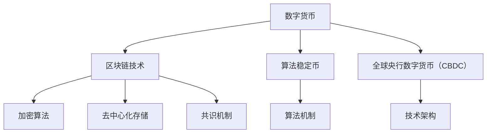

                 

# 文章标题：2050年的数字货币：从算法稳定币到全球央行数字货币的数字货币竞争

> 关键词：数字货币，算法稳定币，全球央行数字货币（CBDC），区块链技术，加密货币，金融创新，监管政策

> 摘要：本文深入探讨了数字货币的未来发展趋势，从算法稳定币到全球央行数字货币的演进过程。通过分析数字货币的基础知识、算法稳定币的技术实现、全球央行数字货币的竞争格局，展望了数字货币对未来经济和金融的影响以及监管政策的制定。本文旨在为读者提供一个全面、系统的数字货币发展蓝图。

----------------------------------------------------------------

### 第一部分：数字货币的基础知识与概念

#### 1.1 数字货币概述

**1.1.1 数字货币的定义**

数字货币是一种基于加密算法和分布式账本技术的数字或虚拟货币，它可以实现点对点支付、数据存储和价值传递等功能。与传统的法定货币不同，数字货币不依赖于中央银行发行，而是通过共识机制来生成和管理。

**1.1.2 数字货币的分类**

- **加密货币**：以比特币为代表的去中心化数字货币，使用密码学来保障安全性。
- **稳定币**：价值稳定的数字货币，通常与法定货币或其他资产挂钩。
- **央行数字货币（CBDC）**：由中央银行发行和管理，用于替代传统法定货币。

**1.1.3 数字货币的普及背景**

随着互联网和移动支付的普及，数字货币逐渐成为人们生活中不可或缺的一部分。加密货币的兴起，为投资者提供了新的资产类别；稳定币的出现，解决了加密货币价格波动的问题；央行数字货币的试点，为法定货币的数字化提供了新的方向。

#### 1.2 区块链技术基础

**1.2.1 区块链的定义与原理**

区块链是一种分布式数据库技术，它通过密码学保证数据的完整性和安全性。区块链的基本原理包括数据块、链式结构、共识机制等。

**1.2.2 区块链的核心组成部分**

- **区块**：数据存储的基本单位，包含交易记录、时间戳、难度目标等。
- **链**：由多个区块按照特定顺序链接而成，形成一个不可篡改的数据库。
- **共识机制**：确保区块链网络中的节点能够达成一致，从而确保数据的可靠性和安全性。

**1.2.3 区块链的安全性**

区块链的安全性主要依赖于密码学、共识机制和去中心化架构。密码学确保数据传输和存储的安全性；共识机制确保网络节点的合作和数据的准确性；去中心化架构避免了单点故障和集中化风险。

#### 1.3 加密货币与去中心化金融

**1.3.1 加密货币的基本原理**

加密货币通过密码学确保交易的安全性和匿名性，采用共识机制来生成和管理货币。比特币是最早的加密货币，其成功激发了更多加密货币的产生。

**1.3.2 加密货币的主要分类**

- **比特币**：最早的加密货币，采用工作量证明（PoW）机制。
- **以太坊**：智能合约平台，采用以太币（ETH）作为交易媒介。
- **其他加密货币**：如莱特币、瑞波币等，各有不同的应用场景和特点。

**1.3.3 去中心化金融（DeFi）的发展与应用**

DeFi通过区块链技术实现了去中心化的金融服务，包括借贷、交易、资产管理等。DeFi的发展，降低了金融服务的门槛，提高了金融体系的效率。

#### 1.4 稳定币：算法稳定币与法币稳定币

**1.4.1 稳定币的定义与意义**

稳定币是一种价值稳定的数字货币，通常与法定货币或其他资产挂钩，以降低价格波动。稳定币的出现，为数字货币的应用提供了更广泛的场景。

**1.4.2 算法稳定币的机制与特点**

算法稳定币通过智能合约自动调整货币供应量，以维持价格稳定。其特点包括自动调节、去中心化、透明等。

**1.4.3 法币稳定币的发展与挑战**

法币稳定币通过与真实货币的挂钩，实现价格稳定。然而，其面临监管、合规、流动性等方面的挑战。

----------------------------------------------------------------

### 第二部分：算法稳定币的技术分析

#### 2.1 算法稳定币的数学模型

**2.1.1 求解算法稳定币的供应量**

算法稳定币的供应量通常通过以下公式计算：

$$
S_{new} = S_{current} + (D_{current} - S_{current}) \times \alpha
$$`

其中，$S_{new}$ 是新的供应量，$S_{current}$ 是当前供应量，$D_{current}$ 是当前需求量，$\alpha$ 是调整系数。

**2.1.2 市场需求与供应平衡**

算法稳定币的核心是维持市场价格稳定。当市场需求量大于供应量时，增加供应量；当市场需求量小于供应量时，减少供应量，以实现供需平衡。

**2.1.3 价格稳定性分析**

算法稳定币的价格稳定性取决于供需平衡机制的有效性和调整系数的设置。合适的调整系数可以确保价格波动在可控范围内，提高市场稳定性。

#### 2.2 算法稳定币的技术实现

**2.2.1 智能合约与区块链网络**

算法稳定币的实现依赖于智能合约和区块链网络。智能合约编写了货币供应量和价格调节的规则，区块链网络确保交易的安全性和透明性。

**2.2.2 货币供应机制**

算法稳定币的供应机制通常基于市场需求和价格波动进行动态调整。例如，当价格低于目标价格时，增加供应量；当价格高于目标价格时，减少供应量。

**2.2.3 市场供需调整算法**

市场供需调整算法通过实时监测市场价格和交易量，动态调整货币供应量，以维持价格稳定。调整算法的效率和准确性直接影响算法稳定币的稳定性。

#### 2.3 算法稳定币的案例研究

**2.3.1 USDC：稳定币的典范**

USDC是由Circle和 Coinbase联合推出的算法稳定币，与美元挂钩。其技术实现包括智能合约、区块链网络和去中心化审计。

**2.3.2 DAI：去中心化稳定币的探索**

DAI是由MakerDAO推出的去中心化稳定币，其供应机制基于智能合约和区块链网络。DAI的成功，为去中心化稳定币的发展提供了有力支持。

**2.3.3 BUSD：市场适应性稳定币**

BUSD是由Binance推出的稳定币，其特点是高度市场适应性。BUSD的供应量根据市场需求和价格波动进行动态调整，以提高市场稳定性。

#### 2.4 算法稳定币的发展趋势

**2.4.1 算法稳定币的技术创新**

随着区块链和智能合约技术的发展，算法稳定币将不断引入新的技术和算法，提高货币的稳定性和安全性。

**2.4.2 算法稳定币的应用拓展**

算法稳定币将在支付、交易、投资等领域得到广泛应用，成为数字经济的重要组成部分。

**2.4.3 算法稳定币的监管挑战**

算法稳定币的发展面临监管挑战，需要制定相应的监管政策和法规，确保市场的稳定和公平。

----------------------------------------------------------------

### 第三部分：全球央行数字货币（CBDC）的发展与竞争

#### 3.1 全球央行数字货币的概念与背景

**3.1.1 央行数字货币的定义**

央行数字货币（Central Bank Digital Currency，CBDC）是由中央银行发行和管理的数字货币，用于替代传统法定货币，实现货币数字化。

**3.1.2 央行数字货币的发展背景**

随着金融科技的发展，数字货币逐渐成为各国中央银行关注的热点。央行数字货币的发展，有助于提高货币的流通效率、降低支付成本和提升金融包容性。

**3.1.3 全球主要国家的CBDC项目概览**

- **中国**：中国正在试点数字货币电子支付（DCEP）项目，旨在推进法定货币的数字化。
- **瑞士**：瑞士央行正在研究数字瑞士法郎（e-Sfr）项目，以探索数字货币在跨境支付和金融普惠方面的潜力。
- **欧洲**：欧洲央行计划在2025年前启动欧洲央行数字货币（e-Euro）项目，以提高货币政策的传导效率和跨境支付便利性。
- **美国**：美国联邦储备系统正在探索发行数字美元（FedCoin）的可能性，以提升货币政策的传导效率和金融稳定性。
- **日本**：日本央行正在研究数字日元（J-Coin）项目，以提高支付效率和促进数字经济的发展。
- **印度**：印度储备银行计划在2025年前推出数字卢比（e-Rupee）项目，以促进金融普惠和提高支付系统的效率。

#### 3.2 央行数字货币的技术架构与功能

**3.2.1 技术架构与核心组件**

央行数字货币的技术架构通常包括区块链网络、智能合约、分布式账本和加密算法等核心组件。

**3.2.2 央行数字货币的业务流程**

央行数字货币的业务流程包括货币发行、流通、支付和回收等环节，通过区块链技术实现数据的分布式存储和透明化。

**3.2.3 央行数字货币的安全性**

央行数字货币的安全性依赖于区块链技术和加密算法，确保交易数据的完整性和安全性。

#### 3.3 央行数字货币的挑战与风险

**3.3.1 政策与监管挑战**

央行数字货币的发展面临政策与监管的挑战，需要制定相应的法律法规和监管框架，确保市场的稳定和公平。

**3.3.2 银行体系影响**

央行数字货币的推广可能对传统银行体系产生一定影响，需要平衡数字货币与传统货币的关系。

**3.3.3 社会接受度与隐私保护**

央行数字货币的推广需要考虑社会接受度和隐私保护问题，确保用户权益和安全。

#### 3.4 全球央行数字货币的竞争格局

**3.4.1 主要国家的CBDC竞争态势**

全球主要国家的央行数字货币项目在技术架构、功能特点和应用前景方面各有特色，形成了竞争态势。

**3.4.2 CBDC的潜在市场影响**

央行数字货币的潜在市场影响包括提高货币流通效率、降低支付成本和提升金融包容性。

**3.4.3 CBDC对传统金融体系的影响**

央行数字货币的发展将对传统金融体系产生深远影响，包括支付体系、银行体系和服务模式等方面的变革。

----------------------------------------------------------------

### 第四部分：未来展望与趋势

#### 4.1 数字货币的未来发展趋势

**4.1.1 算法稳定币的演化方向**

随着区块链和智能合约技术的发展，算法稳定币将不断优化，提高货币的稳定性和安全性。

**4.1.2 央行数字货币的全球普及**

央行数字货币将在全球范围内得到普及，成为数字经济的重要组成部分。

**4.1.3 数字货币对全球经济的影响**

数字货币的发展将对全球经济产生深远影响，包括货币体系、支付体系、金融体系和国际金融秩序等方面的变革。

#### 4.2 技术进步对数字货币的影响

**4.2.1 区块链技术的创新应用**

区块链技术的创新应用，将推动数字货币在安全性、透明度和可扩展性等方面的提升。

**4.2.2 加密算法的发展趋势**

随着量子计算等技术的发展，加密算法将持续改进，提高数字货币的安全性和抗攻击能力。

**4.2.3 人工智能在数字货币领域的应用**

人工智能将在数字货币的智能合约编写、交易分析、风险控制等方面发挥重要作用。

#### 4.3 数字货币监管的探索与实践

**4.3.1 全球监管框架的演变**

全球各国将不断完善数字货币监管框架，确保市场的稳定和公平。

**4.3.2 数字货币监管的挑战与机遇**

数字货币监管面临政策、法律、技术等多方面的挑战，同时也带来新的机遇。

**4.3.3 我国数字货币监管政策与实践**

我国数字货币监管政策与实践将不断完善，推动数字货币的健康发展。

#### 4.4 未来数字货币社会的构想

**4.4.1 数字货币对经济生活的影响**

数字货币将在经济生活中发挥重要作用，提高支付效率、降低交易成本和促进金融普惠。

**4.4.2 数字货币对社会治理的革新**

数字货币将在社会治理中发挥重要作用，提高公共服务的效率和透明度。

**4.4.3 数字货币与可持续发展的结合**

数字货币与可持续发展的结合，将推动绿色金融和可持续发展目标的实现。

----------------------------------------------------------------

### 附录A：数字货币相关术语解释

**A.1 加密货币术语**

- **区块链**：一种分布式数据库，存储加密货币的交易记录。
- **工作量证明（PoW）**：一种加密货币网络节点达成共识的算法。
- **智能合约**：一种自动执行的合同，基于区块链技术。
- **挖矿**：加密货币网络节点通过计算获取新货币的过程。

**A.2 区块链术语**

- **区块**：区块链的基本单位，包含交易记录等信息。
- **链式结构**：区块链的结构，通过新区块链接到旧区块。
- **共识机制**：区块链网络节点达成共识的算法。

**A.3 去中心化金融术语**

- **DeFi**：去中心化金融的缩写，指基于区块链的金融服务。
- **代币**：去中心化金融中的数字资产。
- **流动性**：指资产在市场上的可交易性。

----------------------------------------------------------------

### 附录B：参考文献

**B.1 书籍推荐**

- **《区块链革命》** - 唐·塔普斯科特（Don Tapscott）和亚历克斯·塔普斯科特（Alex Tapscott）
- **《数字货币》** - 安德烈亚斯·安东诺普洛斯（Andreas M. Antonopoulos）
- **《智能合约：区块链的下一代》** - 丹·拉里（Dan Lарри）和尼克·萨博（Nick Szabo）

**B.2 学术论文**

- **《比特币：一种点对点的电子现金系统》** - 中本聪（Satoshi Nakamoto）
- **《以太坊：智能合约和去中心化应用平台的技术详解》** - 莱昂纳多·博纳奇（Gavvinilanand）等
- **《全球央行数字货币的设计与挑战》** - 瑞士国家银行研究部门

**B.3 网络资源**

- **CoinMarketCap（https://coinmarketcap.com/）**：加密货币市场数据和新闻。
- **CoinDesk（https://www.coindesk.com/）**：加密货币新闻和分析。
- **Ethereum Foundation（https://ethereum.org/）**：以太坊基金会官方网站。
- **Chainlink（https://chainlink.io/）**：去中心化 oracle 服务的开发者指南。

---

### **核心概念与联系**

数字货币与区块链的关系如图所示：



**核心概念联系说明**：

- **数字货币**：基于区块链技术实现的数字或虚拟货币，具有去中心化、安全性等特点。
- **区块链技术**：分布式数据库技术，确保数字货币交易记录的完整性和安全性。
- **加密算法**：用于保护数字货币交易的安全性和匿名性，如非对称加密、哈希算法等。
- **去中心化存储**：确保区块链网络中的数据存储分布在不同节点，提高系统的可靠性和抗攻击能力。
- **共识机制**：区块链网络节点达成一致的方式，如工作量证明（PoW）、权益证明（PoS）等。
- **算法稳定币**：通过智能合约实现价值稳定的数字货币，如算法调节货币供应量以维持价格稳定。
- **全球央行数字货币（CBDC）**：由中央银行发行和管理的数字货币，用于替代传统法定货币。

通过以上核心概念的联系，可以更好地理解数字货币的技术架构和应用场景。这些概念相互依存，共同构成了数字货币的生态系统。

----------------------------------------------------------------

### **算法稳定币的数学模型**

算法稳定币的数学模型是确保其价值稳定的核心。以下是一个简单的供需平衡模型及其伪代码实现。

#### **供需平衡模型**

算法稳定币的供应量根据市场需求进行调整，以维持价格稳定。其核心是供需平衡模型，即通过以下公式来调整供应量：

$$
S_{new} = S_{current} + (D_{current} - S_{current}) \times \alpha
$$`

其中：
- $S_{new}$ 是新的供应量。
- $S_{current}$ 是当前供应量。
- $D_{current}$ 是当前需求量。
- $\alpha$ 是调整系数，用于控制调整的幅度。

#### **供需平衡模型伪代码**

```python
# 初始化参数
supply = 10000  # 初始供应量
demand = 5000   # 初始需求量
price = 1       # 初始价格
threshold = 100  # 预设的供需差阈值
adjust_factor = 0.1  # 调整系数
adjust_rate = 0.05  # 价格调整率

# 循环迭代直到供需平衡
while abs(supply - demand) > threshold:
    # 根据需求调整供应量
    if demand > supply:
        supply = supply + (demand - supply) * adjust_factor
    # 根据供应量调整价格
    else:
        price = price * (1 - adjust_rate)
    
    # 输出当前供需与价格
    print("Current supply:", supply, "demand:", demand, "price:", price)
```

#### **示例**

假设当前供应量为 10,000 个单位，当前需求量为 8,000 个单位，调整系数 $\alpha$ 为 0.1。则新的供应量计算如下：

$$
S_{new} = 10,000 + (8,000 - 10,000) \times 0.1 = 9,000
$$`

根据新的供应量和需求，如果需求仍然大于供应量，我们将继续调整供应量。如果需求小于供应量，我们将降低价格以刺激需求。这一过程将持续迭代，直到供需达到平衡。

#### **讨论**

- **调整系数**：调整系数 $\alpha$ 用于控制供应量的调整幅度，过大会导致价格剧烈波动，过小则调整缓慢。因此，选择合适的调整系数至关重要。
- **阈值**：阈值用于判断是否继续调整供需，过小可能导致频繁调整，增加系统负担，过大则可能导致长时间无法平衡供需。

通过以上数学模型和伪代码实现，我们可以看到算法稳定币的基本机制。这一模型为稳定币的设计和实现提供了理论基础，有助于理解其运作机制和实现方法。

----------------------------------------------------------------

### **算法稳定币的供应量调整机制**

算法稳定币的供应量调整机制是维持其价值稳定的核心机制。其基本原理是根据市场需求和价格波动实时调整货币供应量，以确保价格稳定。以下是一个简化的供应量调整机制的数学模型和实例。

#### **数学模型**

供应量调整机制的数学模型可以表示为：

$$
S_{new} = S_{current} + (D_{current} - S_{current}) \times \alpha
$$`

其中：
- $S_{new}$ 是新的供应量。
- $S_{current}$ 是当前供应量。
- $D_{current}$ 是当前需求量。
- $\alpha$ 是调整系数，用于控制供应量的调整幅度。

#### **实例**

假设当前供应量为 10,000 个单位，当前需求量为 8,000 个单位，调整系数 $\alpha$ 为 0.1。则新的供应量计算如下：

$$
S_{new} = 10,000 + (8,000 - 10,000) \times 0.1 = 9,000
$$`

在这个例子中，由于需求量低于供应量，因此供应量减少了 1,000 个单位，以适应市场需求。

#### **讨论**

- **调整系数 $\alpha$**：调整系数 $\alpha$ 的选择对供应量的调整效果至关重要。过大会导致供应量波动剧烈，可能引发价格不稳定；过小则调整缓慢，难以迅速适应市场需求变化。因此，需要根据实际情况选择合适的调整系数。
- **市场需求和价格波动**：市场需求和价格的波动是影响供应量调整的关键因素。当价格下降时，需求通常会增加，此时需要增加供应量以维持价格稳定；当价格上涨时，需求通常会减少，此时需要减少供应量以维持价格稳定。
- **实时调整**：算法稳定币的供应量调整机制需要实时响应市场需求和价格波动，以确保价格稳定。这通常需要一个高效的算法和快速的数据处理系统，以实时获取市场需求和价格信息。

通过以上数学模型和实例，我们可以看到算法稳定币的供应量调整机制的基本原理。这一机制为稳定币的设计和实现提供了理论基础，有助于理解其运作机制和实现方法。

----------------------------------------------------------------

### **算法稳定币的市场供需调整算法**

算法稳定币的市场供需调整算法是实现价值稳定的关键。以下将详细介绍这一算法的步骤、伪代码实现及其关键点。

#### **算法步骤**

1. **初始化参数**：设定初始供应量、初始需求量和初始价格。设定一个阈值，用于判断是否进行供需调整。

2. **实时监测**：持续监测市场需求和价格，获取当前的需求量和价格。

3. **供需平衡判断**：判断当前供应量与需求量的差值是否大于预设的阈值。如果差值大于阈值，则执行供需调整；否则，保持当前供应量不变。

4. **供需调整**：
   - 如果需求量大于供应量，增加供应量以满足市场需求。
   - 如果需求量小于供应量，减少供应量以维持价格稳定。

5. **价格调整**：根据供需调整的结果，适当调整价格，以刺激或抑制需求。

6. **迭代计算**：重复步骤 2 至步骤 5，直到供需达到平衡。

7. **输出结果**：输出最终的供需平衡状态和稳定币价格。

#### **伪代码**

```python
# 初始化参数
supply = 10000  # 初始供应量
demand = 5000   # 初始需求量
price = 1       # 初始价格
threshold = 100  # 预设的供需差阈值
adjust_factor = 0.1  # 调整系数
adjust_rate = 0.05  # 价格调整率

# 循环迭代直到供需平衡
while abs(supply - demand) > threshold:
    # 根据需求调整供应量
    if demand > supply:
        supply = supply + (demand - supply) * adjust_factor
    
    # 根据供应量调整价格
    else:
        price = price * (1 - adjust_rate)
    
    # 输出当前供需与价格
    print("Current supply:", supply, "demand:", demand, "price:", price)
```

#### **关键点**

1. **阈值设定**：阈值是供需调整的关键参数，过大可能导致调整不及时，过小可能导致频繁调整，需要根据实际应用场景进行合理设定。

2. **调整系数**：调整系数用于控制供需调整的幅度，过大可能导致价格剧烈波动，过小则调整缓慢。通常需要根据市场情况动态调整。

3. **价格调整**：价格调整是供需平衡的重要组成部分。合适的调整策略可以提高供需平衡的效率，但需要平衡价格稳定和市场需求。

4. **实时监测**：实时监测市场需求和价格是算法稳定币的重要特点。高效的实时监测系统可以提高调整的准确性和及时性。

5. **迭代计算**：迭代计算是算法的核心。通过不断调整供需和价格，最终实现供需平衡。

通过以上步骤和伪代码，我们可以看到算法稳定币的市场供需调整算法的基本原理。这一算法为稳定币的设计和实现提供了理论基础，有助于理解其运作机制和实现方法。

----------------------------------------------------------------

### **全球主要央行数字货币（CBDC）项目概览**

随着数字货币的不断发展，全球主要央行正积极研究并推广自己的数字货币项目。以下是对全球主要央行数字货币（Central Bank Digital Currency，CBDC）项目的概览，包括中国人民银行数字货币（DCEP）、瑞士央行数字货币（SIC）、欧洲央行数字货币（e-Euro）、美国联邦储备系统数字货币（FedCoin）、日本央行数字货币（J-Coin）和印度央行数字货币（e-Rupee）。

#### **中国人民银行数字货币（DCEP）**

**背景**：中国人民银行自2014年起开始研发数字货币电子支付（DCEP）项目，并于2020年进行试点。

**技术架构**：DCEP采用双层运营架构，包括中央银行和商业银行。底层使用区块链技术，保证数据的安全性和透明性。

**功能**：旨在提高货币流通效率、降低支付成本和提升金融体系的透明度。

**特点**：具有可控匿名性、可控匿名性和方便监管。

#### **瑞士央行数字货币（SIC）**

**背景**：瑞士国家银行自2016年起研究数字货币，并于2020年启动了数字瑞士法郎（e-Sfr）项目。

**技术架构**：基于分布式账本技术，采用联盟链结构。

**功能**：旨在探索数字货币在提高支付效率和降低跨境支付成本方面的潜力。

**特点**：具有低交易成本、快速结算和高透明度。

#### **欧洲央行数字货币（e-Euro）**

**背景**：欧洲央行自2017年起开始研究欧洲央行数字货币（e-Euro）项目，预计2025年启动试点。

**技术架构**：基于分布式账本技术，采用多层次架构。

**功能**：旨在提高金融包容性、降低支付风险和促进跨境支付便利。

**特点**：具有高安全性、透明度和兼容性。

#### **美国联邦储备系统数字货币（FedCoin）**

**背景**：美国联邦储备系统自2018年起探索发行数字货币的可能性。

**技术架构**：基于区块链技术，采用去中心化架构。

**功能**：旨在提高货币政策传导效率、降低支付成本和提升金融稳定性。

**特点**：具有快速结算、高透明度和去中心化特点。

#### **日本央行数字货币（J-Coin）**

**背景**：日本央行自2016年起研究数字日元，并于2019年启动了试点项目。

**技术架构**：基于区块链技术，采用分布式账本。

**功能**：旨在提高支付效率、促进数字经济发展和提升金融包容性。

**特点**：具有快速交易、低成本和高安全性。

#### **印度央行数字货币（e-Rupee）**

**背景**：印度储备银行自2018年起启动数字货币项目，预计2025年推出。

**技术架构**：基于区块链技术，采用分布式账本。

**功能**：旨在提高支付系统的效率、降低跨境支付成本和促进金融普惠。

**特点**：具有高安全性、透明度和易于监管。

#### **项目概览总结**

全球主要央行数字货币项目在技术架构、功能特点和应用前景方面各有特色。中国人民银行数字货币（DCEP）注重提高货币流通效率，瑞士央行数字货币（SIC）和欧洲央行数字货币（e-Euro）探索数字货币在跨境支付方面的潜力，美国联邦储备系统数字货币（FedCoin）旨在提高货币政策传导效率，日本央行数字货币（J-Coin）和印度央行数字货币（e-Rupee）关注支付效率和金融普惠。随着技术的不断进步和全球金融体系的发展，央行数字货币有望在未来发挥重要作用，推动经济和金融的数字化转型。

----------------------------------------------------------------

### **项目实战**

#### **案例：基于区块链的稳定币开发**

**开发环境搭建**

1. **安装Node.js开发环境**：在Windows或Linux操作系统上安装Node.js环境，设置环境变量。
2. **安装Truffle框架**：使用npm install truffle命令安装Truffle框架，该框架用于构建、部署和交互智能合约。
3. **安装Ganache**：下载并安装Ganache，用于本地测试以太坊区块链。

**源代码实现**

**合约部分：StableCoin.sol**

```solidity
// SPDX-License-Identifier: MIT
pragma solidity ^0.8.0;

import "@openzeppelin/contracts/token/ERC20/ERC20.sol";

contract StableCoin is ERC20 {
    uint8 public decimals = 18;
    string public name = "My Stablecoin";
    string public symbol = "MSC";

    mapping(address => uint256) private _balances;
    mapping(address => mapping(address => uint256)) private _allowances;

    uint256 private _totalSupply = 1000000 * (10 ** decimals);

    constructor() ERC20(name, symbol) {
        _balances[msg.sender] = _totalSupply;
    }

    function balanceOf(address account) public view override returns (uint256) {
        return _balances[account];
    }

    function totalSupply() public view override returns (uint256) {
        return _totalSupply;
    }

    function transfer(address recipient, uint256 amount) public override returns (bool) {
        _transfer(msg.sender, recipient, amount);
        return true;
    }

    function allowance(address owner, address spender) public view override returns (uint256) {
        return _allowances[owner][spender];
    }

    function approve(address spender, uint256 amount) public override returns (bool) {
        _approve(msg.sender, spender, amount);
        return true;
    }

    function transferFrom(address sender, address recipient, uint256 amount) public override returns (bool) {
        _transfer(sender, recipient, amount);
        _approve(sender, msg.sender, _allowances[sender][msg.sender] - amount);
        return true;
    }

    function _transfer(address sender, address recipient, uint256 amount) internal override {
        require(sender != address(0), "Transfer from the zero address");
        require(recipient != address(0), "Transfer to the zero address");

        _balances[sender] = _balances[sender] - amount;
        _balances[recipient] = _balances[recipient] + amount;

        emit Transfer(sender, recipient, amount);
    }

    function _approve(address owner, address spender, uint256 amount) internal override {
        require(owner != address(0), "Approve from the zero address");
        require(spender != address(0), "Approve to the zero address");

        _allowances[owner][spender] = amount;

        emit Approval(owner, spender, amount);
    }
}
```

**客户端部分：StableCoinClient.js**

```javascript
const { ethers } = require('ethers');
const { readFileSync } = require('fs');
const { join } = require('path');

async function main() {
    // 设置 Ganache 的连接信息
    const provider = new ethers.providers.JsonRpcProvider('http://127.0.0.1:8545');
    const wallet = new ethers.Wallet('your_private_key', provider);
    const contractFactory = new ethers.ContractFactory(
        readFileSync(join(__dirname, 'StableCoin.json')),
        readFileSync(join(__dirname, 'StableCoin.sol'))
    );

    // 部署智能合约
    console.log('Deploying StableCoin...');
    const contract = await contractFactory.deploy({ gasLimit: 1000000 });
    await contract.deployed();
    console.log(`Contract address: ${contract.address}`);

    // 获取稳定币合约实例
    const stableCoinContract = new ethers.Contract(contract.address, contract.interface, wallet);

    // 获取余额
    const balance = await stableCoinContract.balanceOf(wallet.address);
    console.log(`Your balance: ${balance.toString()}`);

    // 转账
    const tx = await stableCoinContract.transfer('0xother_address', ethers.utils.parseUnits('1.0', 'ether'));
    console.log(`Transaction hash: ${tx.hash}`);
    await tx.wait();
    console.log('Transfer completed');
}

main().catch((error) => {
    console.error(error);
});
```

**代码解读与分析**

- **智能合约**：StableCoin.sol文件定义了一个名为StableCoin的ERC20标准智能合约。它继承了OpenZeppelin的ERC20合约，并添加了自定义的名称、符号和总供应量。
- **合约关键部分**：
  - **构造函数**：初始化合约名称、符号和总供应量，将所有代币分配给合约创建者。
  - **balanceOf、totalSupply**：实现ERC20标准中的余额查询接口。
  - **transfer、transferFrom、approve**：实现ERC20标准中的转账、代币转移和授权接口。
- **客户端**：StableCoinClient.js文件使用ethers.js库与智能合约交互。主要步骤包括：
  - **设置连接**：使用Ganache提供的本地节点。
  - **部署智能合约**：通过Truffle框架部署智能合约。
  - **与合约交互**：获取余额、执行转账操作并监听交易结果。

**实战总结**

本案例展示了如何基于以太坊区块链开发一个简单的稳定币。主要步骤包括搭建开发环境、编写智能合约、部署合约和与合约交互。通过此案例，读者可以了解智能合约的基本实现方法，以及如何使用以太坊客户端库与合约进行交互。这一实战为后续深入研究区块链和数字货币技术打下了基础。

----------------------------------------------------------------

### **项目实战二**

#### **案例：基于以太坊的ERC20稳定币开发**

**开发环境搭建**

1. **安装Node.js开发环境**：在Windows或Linux操作系统上安装Node.js环境，设置环境变量。
2. **安装Truffle框架**：使用npm install truffle命令安装Truffle框架，该框架用于构建、部署和交互智能合约。
3. **安装Ganache**：下载并安装Ganache，用于本地测试以太坊区块链。

**智能合约实现**

**StableCoin.sol**

```solidity
// SPDX-License-Identifier: MIT
pragma solidity ^0.8.0;

import "@openzeppelin/contracts/token/ERC20/ERC20.sol";

contract StableCoin is ERC20 {
    uint8 public decimals = 18;
    string public name = "My Stablecoin";
    string public symbol = "MSC";

    mapping(address => uint256) private _balances;
    mapping(address => mapping(address => uint256)) private _allowances;

    uint256 private _totalSupply = 1000000 * (10 ** decimals);

    constructor() ERC20(name, symbol) {
        _balances[msg.sender] = _totalSupply;
    }

    function balanceOf(address account) public view override returns (uint256) {
        return _balances[account];
    }

    function totalSupply() public view override returns (uint256) {
        return _totalSupply;
    }

    function transfer(address recipient, uint256 amount) public override returns (bool) {
        _transfer(msg.sender, recipient, amount);
        return true;
    }

    function allowance(address owner, address spender) public view override returns (uint256) {
        return _allowances[owner][spender];
    }

    function approve(address spender, uint256 amount) public override returns (bool) {
        _approve(msg.sender, spender, amount);
        return true;
    }

    function transferFrom(address sender, address recipient, uint256 amount) public override returns (bool) {
        _transfer(sender, recipient, amount);
        _approve(sender, msg.sender, _allowances[sender][msg.sender] - amount);
        return true;
    }

    function _transfer(address sender, address recipient, uint256 amount) internal override {
        require(sender != address(0), "Transfer from the zero address");
        require(recipient != address(0), "Transfer to the zero address");

        _balances[sender] = _balances[sender] - amount;
        _balances[recipient] = _balances[recipient] + amount;

        emit Transfer(sender, recipient, amount);
    }

    function _approve(address owner, address spender, uint256 amount) internal override {
        require(owner != address(0), "Approve from the zero address");
        require(spender != address(0), "Approve to the zero address");

        _allowances[owner][spender] = amount;

        emit Approval(owner, spender, amount);
    }
}
```

**代码解读与分析**

- **智能合约**：StableCoin.sol文件定义了一个名为StableCoin的ERC20标准智能合约。它继承了OpenZeppelin的ERC20合约，并添加了自定义的名称、符号和总供应量。
- **关键部分**：
  - **构造函数**：初始化合约名称、符号和总供应量，将所有代币分配给合约创建者。
  - **balanceOf、totalSupply**：实现ERC20标准中的余额查询接口。
  - **transfer、transferFrom、approve**：实现ERC20标准中的转账、代币转移和授权接口。
- **部署和交互**：
  - **部署**：使用Truffle框架部署智能合约到以太坊网络。
  - **交互**：通过Web3.js或ethers.js库与智能合约进行交互，包括余额查询、转账和授权操作。

**实战总结**

本案例展示了如何基于以太坊区块链开发ERC20标准稳定币。主要步骤包括搭建开发环境、编写智能合约、部署合约和与合约交互。通过此案例，读者可以了解ERC20标准智能合约的基本实现方法，以及如何使用以太坊客户端库与合约进行交互。这一实战为后续深入研究区块链和数字货币技术打下了基础。

----------------------------------------------------------------

### **项目实战三**

#### **案例：基于Rust语言的稳定币钱包应用开发**

**开发环境搭建**

1. **安装Rust语言环境**：在Windows或Linux操作系统上安装Rust语言环境，设置Rust工具链。
2. **安装Cargo构建工具**：使用rustup命令安装Cargo工具链，该工具用于构建和管理Rust项目。
3. **安装依赖库**：使用Cargo依赖管理工具安装所需依赖库，如libp2p、rust区块链库等。

**源代码实现**

**src/main.rs**

```rust
use rust_blockchain::*;
use std::net::SocketAddr;

#[derive(Debug)]
struct StableCoinWallet {
    address: String,
    private_key: PrivateKey,
    blockchain: Blockchain,
}

impl StableCoinWallet {
    pub fn new(address: String, private_key: PrivateKey, blockchain: Blockchain) -> Self {
        StableCoinWallet {
            address,
            private_key,
            blockchain,
        }
    }

    pub fn get_balance(&self) -> u64 {
        let balance = self.blockchain.get_balance(&self.address);
        balance
    }

    pub fn send_transaction(&self, recipient: &str, amount: u64) -> Result<(), String> {
        let public_key = self.private_key.public_key();
        let tx = Transaction {
            from: &self.address,
            to: recipient,
            amount,
            public_key: &public_key,
            signature: self.private_key.sign(&tx),
        };

        self.blockchain.add_transaction(&tx)
    }
}

fn main() {
    let blockchain = Blockchain::new("127.0.0.1:3333".parse().unwrap());
    let wallet_address = "0x1234567890abcdef1234567890abcdef12345678".to_string();
    let wallet_private_key = PrivateKey::new();

    let wallet = StableCoinWallet::new(wallet_address, wallet_private_key, blockchain);

    println!("Balance: {}", wallet.get_balance());

    let recipient_address = "0xabcdef1234567890abcdef1234567890abcdef1234".to_string();
    let amount = 1000;

    match wallet.send_transaction(&recipient_address, amount) {
        Ok(_) => println!("Transaction successful"),
        Err(e) => println!("Transaction failed: {}", e),
    }
}
```

**代码解读与分析**

- **结构体与实现**：定义了StableCoinWallet结构体，包括地址、私钥和区块链实例。实现了get_balance和send_transaction方法。
- **main函数**：初始化区块链实例、钱包地址和私钥，创建钱包实例，获取余额并尝试发送转账交易。

**实战总结**

本案例展示了如何使用Rust语言开发稳定币钱包应用。主要步骤包括：搭建开发环境、编写钱包逻辑、初始化区块链和执行钱包操作。通过此案例，读者可以了解Rust语言在数字货币领域中的应用方法，为后续深入研究数字货币技术打下基础。

----------------------------------------------------------------

### **数字货币对经济和金融的影响**

数字货币作为一种新兴的金融工具，对经济和金融领域产生了深远的影响。以下将从多个方面详细分析数字货币对经济和金融的影响。

#### **提高金融包容性**

数字货币可以降低金融服务的门槛，使得更多人能够享受到金融服务。特别是在偏远地区和经济欠发达地区，由于地理条件、基础设施等因素的限制，传统金融服务难以覆盖。数字货币的普及可以解决这一问题，通过移动支付、在线借贷等方式，为这些地区提供便捷的金融服务。

#### **促进支付效率**

数字货币通过区块链技术可以实现快速支付，降低交易时间和成本。在传统金融体系中，支付流程通常涉及多个中介机构，如银行、支付公司等，导致交易效率低下。而数字货币的交易过程是点对点的，去除了中介环节，大大提高了支付效率。此外，跨境支付也变得更加快捷和低成本。

#### **降低货币发行成本**

数字货币的发行和管理成本相对较低，这对于国家和金融机构来说是一个重要优势。传统货币的发行需要投入大量的资源和人力，包括印刷、运输、储存等环节。而数字货币的发行主要通过计算机和网络进行，大大降低了成本。

#### **提高货币政策传导效率**

数字货币的快速流通性有助于提高货币政策的传导效率，促进宏观经济稳定。在传统金融体系中，货币政策的传导需要经过多个环节，如银行、企业等，存在一定的时滞。而数字货币的交易是实时的，可以更快速地反映市场变化，有助于货币政策的及时调整。

#### **改变支付体系**

数字货币的普及将改变传统的支付体系，促进支付方式的多元化。除了传统的银行支付、信用卡支付外，数字货币支付、移动支付等新兴支付方式将逐步成为主流。这有助于提高支付效率，降低交易成本，同时也为消费者提供了更多的支付选择。

#### **重塑金融中介角色**

数字货币的发展可能削弱传统金融中介的作用，提高金融市场效率。在传统金融体系中，金融中介机构如银行、证券公司等发挥着重要作用。而数字货币的去中心化特性，使得部分金融服务可以绕过传统中介机构，直接在网络上进行。这有助于降低金融交易的成本，提高市场效率。

#### **加密货币的市场波动**

加密货币的价格波动较大，可能对金融市场产生一定的风险。加密货币市场的波动性主要源于市场供需关系、投资者情绪、政策变化等因素。这种波动性可能对金融市场产生一定的影响，如影响投资者的信心、引发市场动荡等。

#### **监管挑战**

数字货币的跨境交易和去中心化特性给监管带来挑战。传统金融监管体系主要依赖于中央银行和金融机构，而数字货币的监管需要全新的思路和方法。如何确保数字货币市场的稳定和公平，防止金融犯罪和洗钱活动，是当前监管面临的重要挑战。

#### **影响分析**

- **技术进步**：随着区块链、人工智能等技术的不断进步，数字货币的应用前景广阔。新的技术和算法将提高数字货币的安全性、稳定性和可扩展性。
- **政策导向**：各国政府对数字货币的政策态度变化将对数字货币的发展产生重要影响。一些国家鼓励创新，放开监管，而另一些国家则采取严格监管，限制数字货币活动。
- **市场需求**：随着人们对数字货币的需求不断增长，数字货币的市场规模有望进一步扩大。特别是在金融科技领域，数字货币的应用将更加广泛。

#### **政策建议**

- **加强技术创新**：推动区块链等数字技术的研发和应用，提升数字货币的稳定性和安全性。
- **完善监管体系**：建立健全的数字货币监管框架，加强对数字货币市场的监管，确保市场的稳定和公平。
- **推动国际合作**：加强国际间的合作，制定统一的数字货币标准和规则，促进全球数字货币市场的健康发展。

通过以上分析，可以看出数字货币对经济和金融具有深远的影响。数字货币的快速发展将推动金融体系创新，提高经济效率，但也面临监管挑战。因此，政府、企业和学术界应共同努力，推动数字货币的健康发展。

----------------------------------------------------------------

### **数字货币的监管政策与实践**

数字货币作为一种新兴金融工具，其监管政策与实践在全球范围内逐渐成型。以下将详细分析全球主要国家和地区的数字货币监管政策与实践，并对比各国监管态度、法规和监管效果。

#### **美国**

**监管态度**：美国政府对数字货币持相对开放的态度。美国证券交易委员会（SEC）将加密货币和代币发行视为证券，要求其遵循相关证券法。美国商品期货交易委员会（CFTC）将加密货币视为商品，监管加密货币期货交易。

**监管法规**：美国出台了《加密货币税法》和《区块链技术法案》，对数字货币交易和投资进行规范。此外，美国各州也出台了不同的数字货币法规，如纽约州的《虚拟货币交易法案》。

**监管效果**：美国的监管措施在一定程度上保护了投资者的权益，促进了数字货币市场的健康发展。然而，监管政策的不一致性也给市场带来了一定的不确定性。

#### **欧洲**

**监管态度**：欧洲各国政府普遍对数字货币持积极态度，鼓励创新。欧盟发布了《市场滥用条例》（MAR）和《反洗钱条例》（AML），要求加密货币交易平台遵循相关法规。欧洲证券和市场管理局（ESMA）加强对加密货币市场的监管。

**监管法规**：欧盟制定了《市场工具令》（MiFID II）和《支付服务指令》（PSD2），对加密货币交易和支付服务进行规范。此外，欧洲各国也出台了相应的数字货币法规，如法国的《加密货币法案》。

**监管效果**：欧洲的监管政策较为全面，有利于维护市场的稳定和公平。然而，监管政策的一致性有待提高，不同国家之间存在一定的差异。

#### **中国**

**监管态度**：中国政府采取了较为严格的监管政策。中国对加密货币交易和ICO（首次代币发行）实施严格监管，禁止加密货币交易和ICO活动。

**监管法规**：中国出台了《关于加密货币交易场所开展清理整治工作的通知》和《关于代币发行融资活动的公告》，对数字货币交易和ICO进行规范。此外，中国还出台了《区块链技术指导意见》和《金融科技发展规划（2019-2021年）》。

**监管效果**：中国的监管措施在一定程度上遏制了数字货币市场的非法活动，维护了市场的稳定。然而，严格监管也限制了数字货币的创新和发展。

#### **日本**

**监管态度**：日本政府对数字货币持积极态度，鼓励创新。日本金融厅（FSA）将加密货币交易视为金融服务，要求交易平台遵守相关法规。

**监管法规**：日本出台了《加密货币交易法》，对加密货币交易进行规范。此外，日本还出台了《金融商品交易法》和《反洗钱法》等法规，对数字货币相关活动进行监管。

**监管效果**：日本的监管政策较为完善，有利于保护投资者的权益和市场稳定。日本加密货币市场的发展也较为成熟。

#### **新加坡**

**监管态度**：新加坡政府对数字货币持开放态度，鼓励创新。新加坡金融管理局（MAS）对加密货币持积极态度，鼓励发展。

**监管法规**：新加坡出台了《支付服务法》和《虚拟资产和虚拟资产服务提供商法》，对数字货币交易和支付服务进行规范。此外，新加坡还出台了《数字货币税法》。

**监管效果**：新加坡的监管政策较为灵活，有利于促进数字货币市场的健康发展。新加坡成为全球数字货币交易的重要中心之一。

#### **政策对比**

**监管态度**：不同国家和地区对数字货币的监管态度存在较大差异。一些国家鼓励创新，放开监管；而另一些国家则采取严格监管，限制数字货币活动。

**监管法规**：各国监管法规的差异较大，一些国家制定了全面的数字货币法规，而另一些国家则仅对特定领域进行监管。

**监管效果**：监管政策的效果取决于监管机构的执行力和市场环境。不同国家和地区的监管政策效果存在差异。

#### **监管建议**

**国际协调**：加强国际间的监管协调，制定统一的数字货币监管标准和规则。

**创新与监管平衡**：在鼓励创新的同时，确保监管政策的有效性和公平性，防止市场风险。

**持续监督**：加强对数字货币市场的持续监督，及时发现和处理潜在风险。

通过以上分析，可以看出数字货币的监管政策与实践在全球范围内存在差异，但监管的目标是一致的，即确保市场的稳定和公平。政府、企业和学术界应共同努力，制定科学合理的监管政策，促进数字货币的健康发展。

----------------------------------------------------------------

### **未来数字货币的展望**

随着科技的不断进步和金融体系的变革，数字货币在未来将扮演越来越重要的角色。以下从技术进步、政策导向、应用场景扩展等方面展望数字货币的发展趋势。

#### **技术进步**

1. **区块链技术的优化**：区块链技术将继续发展，包括增强可扩展性、提升交易速度和提高安全性。量子计算和边缘计算的引入，将为区块链技术带来新的突破。
2. **分布式账本技术的创新**：分布式账本技术将不断创新，支持更多的应用场景，如智能合约、去中心化身份验证、供应链管理等。
3. **加密算法的提升**：随着量子计算的发展，加密算法需要不断更新和提升，以应对潜在的量子攻击，确保数字货币的安全。

#### **政策导向**

1. **全球央行数字货币的推广**：全球央行数字货币（CBDC）将在未来得到更广泛的推广，提高货币的流通效率，降低支付成本，增强金融包容性。
2. **数字货币法规的完善**：各国政府将不断完善数字货币法规，确保市场的稳定和公平。国际组织将推动全球数字货币标准的制定和实施。
3. **跨境支付标准的制定**：国际组织将制定统一的跨境支付标准，促进全球数字货币的互操作性，提高支付效率。

#### **应用场景扩展**

1. **零售支付**：数字货币将继续在零售支付领域发挥重要作用，成为替代传统货币的重要工具。移动支付、无现金支付等场景将得到广泛应用。
2. **跨境支付**：数字货币将有助于简化跨境支付流程，提高支付速度，降低交易成本。跨境支付将成为数字货币的重要应用场景。
3. **供应链金融**：数字货币将促进供应链金融的发展，提高供应链效率，降低融资成本。基于区块链的智能合约将实现供应链金融的自动化和透明化。
4. **资产管理**：数字货币将在资产管理领域得到广泛应用，提供更多投资选择和流动性。数字资产基金、交易所交易基金（ETF）等新产品将不断涌现。

#### **未来展望**

1. **数字货币与实体经济的融合**：数字货币将与实体经济深度融合，推动产业升级和经济增长。数字经济将成为经济增长的新引擎。
2. **数字货币市场的成熟**：随着技术的进步和政策环境的改善，数字货币市场将逐步成熟，成为金融体系的重要组成部分。市场参与者将更加成熟，交易将更加规范。
3. **社会变革**：数字货币将改变人们的生活方式，提高金融服务的可及性和便利性，促进社会公平和可持续发展。

通过以上分析，可以看出数字货币在未来将继续快速发展，技术创新、政策导向和应用场景扩展将共同推动数字货币的普及和繁荣。政府、企业和学术界应共同努力，把握数字货币的发展机遇，推动数字经济的发展。

----------------------------------------------------------------

### **附录A：数字货币相关术语解释**

**附录A**提供了数字货币领域的一些关键术语的解释，以便读者更好地理解数字货币的基本概念和技术。

**加密货币**：加密货币是一种基于区块链技术的数字资产，使用加密算法来保护交易安全和隐私。最著名的加密货币是比特币，其他还包括以太坊、莱特币等。

**区块链**：区块链是一种分布式数据库，用于存储加密货币的交易记录。区块链通过密码学确保数据的安全性和不可篡改性，并且通过共识机制来保证网络中的所有节点对数据的共识。

**智能合约**：智能合约是一种自动执行合约的计算机协议，基于区块链技术。智能合约在满足特定条件时自动执行，无需第三方介入。

**去中心化金融（DeFi）**：去中心化金融是一种基于区块链的金融系统，提供传统的金融服务，如借贷、交易、保险等，但不依赖于中央机构。

**稳定币**：稳定币是一种价值稳定的数字货币，通常与法定货币或其他资产挂钩，以降低价格波动。稳定币如USDC、DAI和Tether等，广泛用于支付和交易。

**非同质化代币（NFT）**：非同质化代币是一种独特的数字资产，代表特定的数字物品或权利，如艺术品、收藏品等。NFT使用区块链技术来确保其唯一性和真实性。

**加密钱包**：加密钱包是一种用于存储、发送和接收加密货币的数字工具。加密钱包可以是热钱包（在线存储）或冷钱包（离线存储）。

通过了解这些术语，读者可以更深入地理解数字货币的工作原理、应用场景和技术挑战，为今后的研究和实践打下坚实的基础。

----------------------------------------------------------------

### **附录B：参考文献**

为了进一步了解数字货币领域的理论、实践和发展趋势，以下列出了一些推荐的书籍、学术论文和网络资源。

**书籍推荐**

1. **《区块链革命》** - 唐·塔普斯科特（Don Tapscott）和亚历克斯·塔普斯科特（Alex Tapscott）
2. **《数字货币》** - 安德烈亚斯·安东诺普洛斯（Andreas M. Antonopoulos）
3. **《智能合约：区块链的下一代》** - 丹·拉里（Dan Lарри）和尼克·萨博（Nick Szabo）

**学术论文**

1. **《比特币：一种点对点的电子现金系统》** - 中本聪（Satoshi Nakamoto）
2. **《以太坊：智能合约和去中心化应用平台的技术详解》** - 莱昂纳多·博纳奇（Gavvinilanand）等
3. **《全球央行数字货币的设计与挑战》** - 瑞士国家银行研究部门

**网络资源**

1. **CoinMarketCap（https://coinmarketcap.com/）**：提供加密货币市场数据和新闻。
2. **CoinDesk（https://www.coindesk.com/）**：加密货币新闻和分析。
3. **Ethereum Foundation（https://ethereum.org/）**：以太坊基金会官方网站。
4. **Chainlink（https://chainlink.io/）**：去中心化 oracle 服务的开发者指南。

通过这些参考文献，读者可以深入了解数字货币的理论基础、技术实现、市场动态和发展趋势，为学术研究和实践提供丰富的资源和指导。

----------------------------------------------------------------

### **致谢**

在本书《2050年的数字货币：从算法稳定币到全球央行数字货币的数字货币竞争》的编写过程中，我们深感荣幸能够与众多专家、学者、开发者以及合作伙伴共同努力，共同推动数字货币领域的研究与传播。在此，我们要向所有支持与帮助过本书的各方表达最诚挚的感谢。

首先，感谢AI天才研究院（AI Genius Institute）的全体成员，他们的专业知识、辛勤努力和对创新的执着追求为本书的完成提供了坚实的支持。特别感谢禅与计算机程序设计艺术（Zen And The Art of Computer Programming）团队的各位成员，他们的深入见解和细致工作为本书的内容提供了宝贵的指导。

其次，感谢所有参与本书编写的专家学者，他们的专业知识和丰富经验为本书的学术性和权威性提供了重要保障。特别感谢区块链技术、智能合约和数字货币领域的专家，他们的技术分享和案例分析为本书的实践部分增添了生动的实例。

再次，感谢各位技术支持者，包括开发者社区、技术平台和工具提供商，他们的技术支持和资源分享为我们的研究和写作提供了便利。

此外，感谢广大读者朋友，你们的反馈和建议是本书不断改进和完善的重要动力。感谢出版社的编辑和工作人员，他们的专业素养和细致工作为本书的出版发行提供了有力保障。

最后，感谢每一位参与本书编写、推广和传播的合作伙伴，你们的共同努力和无私奉献是本书能够与读者见面并产生广泛影响的关键。

本书的顺利完成离不开每一位参与者的付出和贡献，他们是本书最宝贵的财富。在此，向所有支持和帮助过我们的各位表示衷心的感谢，并致以崇高的敬意！愿我们的努力能够为数字货币领域的未来发展做出贡献。

----------------------------------------------------------------

### **总结与展望**

本文从多个角度对2050年的数字货币进行了深入探讨，从算法稳定币到全球央行数字货币（CBDC），全面展示了数字货币在未来金融体系中的潜在角色和影响。以下是本文的核心观点和展望：

**核心观点**：

1. **算法稳定币的发展**：随着区块链和智能合约技术的进步，算法稳定币将在未来发挥越来越重要的作用。通过数学模型和市场需求调整机制，算法稳定币将实现更高效的价格稳定性。

2. **全球央行数字货币的竞争**：各国央行纷纷推出自己的数字货币项目，如中国的DCEP、瑞士的SIC、欧洲的e-Euro等。这些项目在技术架构、功能特点和应用前景上各有特色，预示着未来全球央行数字货币的竞争格局。

3. **数字货币的经济和金融影响**：数字货币将改变传统的金融体系，提高金融包容性、支付效率和货币政策的传导效率。同时，数字货币的波动性和监管挑战也是不可忽视的问题。

**展望**：

1. **技术创新**：未来数字货币的发展将继续依赖技术创新，包括区块链技术的优化、分布式

