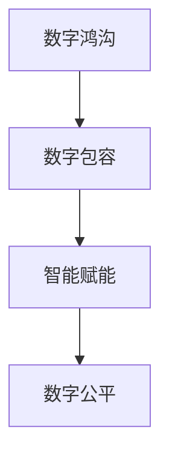

                 

### 文章标题

# 2050年的数字鸿沟：从数字包容到智能赋能的数字公平实现

### 关键词

- 数字鸿沟
- 数字包容
- 智能赋能
- 数字公平
- 智能社会
- 数字教育

### 摘要

本文探讨了2050年数字世界的数字鸿沟问题，分析了其历史与现状，探讨了数字包容的路径，并重点探讨了智能赋能在实现数字公平中的作用。文章通过逻辑清晰、结构紧凑、简单易懂的论述，旨在为读者提供关于数字公平实现的全景视角，并提出实现策略和未来展望。

---

### 目录大纲：2050年的数字鸿沟：从数字包容到智能赋能的数字公平实现

#### 第一部分：数字鸿沟的历史与现状

##### 第1章：数字鸿沟的概念与历史

- **1.1 数字鸿沟的定义与度量**
- **1.2 数字鸿沟的历史演变**
- **1.3 当前全球数字鸿沟现状分析**

##### 第2章：数字鸿沟的主要表现

- **2.1 地理数字鸿沟**
- **2.2 经济数字鸿沟**
- **2.3 教育数字鸿沟**
- **2.4 社会数字鸿沟**

##### 第3章：数字鸿沟的影响

- **3.1 对经济发展的影响**
- **3.2 对社会公平的影响**
- **3.3 对个人生活的影响**

#### 第二部分：数字包容的路径

##### 第4章：数字包容的必要性与目标

- **4.1 数字包容的重要性**
- **4.2 数字包容的目标与原则**
- **4.3 数字包容的现状与挑战**

##### 第5章：数字基础设施的建设

- **5.1 互联网基础设施的普及与优化**
- **5.2 数字基础设施的多元化发展**
- **5.3 基础设施建设的技术挑战**

##### 第6章：数字教育公平的实现

- **6.1 数字教育资源的普及与共享**
- **6.2 数字教育公平的政策与措施**
- **6.3 数字教育公平的案例分析**

##### 第7章：数字经济的包容性发展

- **7.1 数字经济的包容性特点**
- **7.2 数字经济的包容性政策**
- **7.3 数字经济的包容性实践**

#### 第三部分：智能赋能与数字公平

##### 第8章：智能技术赋能数字包容

- **8.1 智能技术在数字包容中的应用**
- **8.2 智能技术的挑战与对策**
- **8.3 智能技术赋能数字包容的案例分析**

##### 第9章：智能社会的公平建设

- **9.1 智能社会的发展趋势**
- **9.2 智能社会的公平问题**
- **9.3 智能社会的公平建设路径**

##### 第10章：数字公平的实现策略

- **10.1 政策层面的数字公平策略**
- **10.2 技术层面的数字公平策略**
- **10.3 社会层面的数字公平策略**

##### 第11章：全球数字公平的未来展望

- **11.1 全球数字公平的发展趋势**
- **11.2 全球数字公平的政策动态**
- **11.3 全球数字公平的未来挑战与机遇**

### 附录

- **附录A：数字鸿沟相关数据与统计**
- **附录B：数字包容与数字公平的相关政策文件**
- **附录C：智能技术相关的核心概念与算法解释**
- **附录D：数字公平实现的典型案例分析与评估**

---

#### 核心概念与联系

- **Mermaid 流�程图：**



#### 核心算法原理讲解

- **伪代码示例：**

```python
# 假设我们有一个数字公平评估模型
def assess_digital公平 degree(data):
    # 初始化评分
    score = 0
    # 对输入数据进行处理
    for indicator in data:
        if indicator > threshold:
            score += 1
    # 返回评分
    return score
```

#### 数学模型和数学公式

- **数学公式示例：**

$$
公平度 = \frac{实际公平度}{理想公平度}
$$

#### 项目实战

- **代码实际案例：**

```python
# 假设我们有一个数字包容度评估的API
def assess_inclusivity(api_endpoint, data):
    response = requests.post(api_endpoint, json=data)
    if response.status_code == 200:
        result = response.json()
        return result['inclusivity_score']
    else:
        return None
```

#### 代码解读与分析

- **代码解读：**

  - `api_endpoint` 是用于评估数字包容度的API接口地址。
  - `data` 是用于评估的输入数据。
  - `requests.post` 发送POST请求到API接口。
  - `response.json()` 获取API返回的JSON数据。
  - `result['inclusivity_score']` 从JSON数据中获取数字包容度评分。

---

这样，我们就设计出了一本《2050年的数字鸿沟：从数字包容到智能赋能的数字公平实现》的书的大纲。每个章节都细化到了子标题，确保内容的全面覆盖和逻辑清晰。此外，还包含了核心概念与联系、核心算法原理讲解、数学模型和公式、项目实战和代码解读与分析等要素，确保读者能够深入理解书中的内容。接下来，我们将逐步展开每一个章节的具体内容，深入探讨数字鸿沟、数字包容、智能赋能和数字公平的实现策略。

---

#### 第1章：数字鸿沟的概念与历史

数字鸿沟（Digital Divide）是指由于社会经济差异、地理条件限制、教育水平差异等因素，使得人们在获取、使用和受益于信息技术方面存在不平等现象。数字鸿沟的概念最早可以追溯到20世纪90年代，当时随着互联网的兴起，全球信息技术的发展开始加速，数字鸿沟问题逐渐引起广泛关注。

##### **1.1 数字鸿沟的定义与度量**

数字鸿沟的定义可以从多个维度来理解：

- **地理维度**：指不同地区之间在信息技术基础设施、互联网普及率、数字素养等方面的差异。
- **经济维度**：指不同收入群体之间在信息技术获取能力、应用水平、受益程度等方面的差异。
- **教育维度**：指不同教育水平群体之间在信息技术知识和技能的掌握、应用能力等方面的差异。
- **社会维度**：指不同社会阶层、性别、年龄等群体在信息技术使用和受益方面的不平等。

数字鸿沟的度量通常通过以下指标进行：

- **互联网普及率**：指一个国家或地区拥有互联网用户的比例。
- **互联网接入速度**：指用户能够获取的互联网连接速度。
- **数字素养**：指个人在信息技术使用方面的知识和技能。
- **信息技术应用水平**：指不同行业、领域在信息技术应用方面的深度和广度。

##### **1.2 数字鸿沟的历史演变**

数字鸿沟的历史演变可以分为以下几个阶段：

1. **初步阶段（20世纪80年代-90年代）**：随着计算机和互联网的起步，数字鸿沟问题开始显现。这一阶段主要集中在技术本身的普及和基础设施的建设。

2. **快速发展阶段（20世纪90年代-21世纪初期）**：互联网的普及使得数字鸿沟问题加剧。发达国家和发展中国家在信息技术获取和使用方面的差距日益明显。

3. **持续深化阶段（21世纪初期至今）**：随着移动互联网、物联网等新技术的普及，数字鸿沟问题不仅在广度上有所扩大，还在深度上进一步加深。不仅城乡、贫富差距显著，不同行业、领域之间也在信息技术应用方面存在明显差异。

##### **1.3 当前全球数字鸿沟现状分析**

当前全球数字鸿沟的现状可以从以下几个方面进行分析：

- **发达国家与发展中国家**：发达国家在互联网普及率、数字素养、信息技术应用水平等方面显著高于发展中国家。例如，根据国际电信联盟（ITU）的数据，2021年全球互联网普及率为63%，其中发达国家达到92%，而发展中国家仅为48%。

- **城市与农村**：在城市地区，互联网普及率、数字素养和技术应用水平较高，而在农村地区，由于基础设施不足、经济条件较差，数字鸿沟问题更为突出。

- **教育水平**：高教育水平的群体在信息技术知识和应用能力上明显优于低教育水平群体。这种差异不仅体现在知识获取上，还影响到个人的职业发展和社会地位。

- **性别差异**：在某些国家和地区，女性在信息技术使用和受益方面仍然存在显著差距。这既与传统文化观念有关，也与性别在职业选择和教育机会上的差异有关。

##### **结论**

数字鸿沟是一个复杂的社会现象，涉及多个维度的差异。当前全球数字鸿沟的现状仍然严峻，需要采取综合性措施来促进数字包容和公平。下一章将探讨数字鸿沟的主要表现形式，分析其在地理、经济、教育和社会等方面的具体表现。

---

#### 第2章：数字鸿沟的主要表现

数字鸿沟问题不仅是一个技术问题，更是一个社会问题。它在不同方面表现出不同的特征和影响，主要包括地理数字鸿沟、经济数字鸿沟、教育数字鸿沟和社会数字鸿沟。本章将深入探讨这些主要表现形式，分析其具体内容和影响。

##### **2.1 地理数字鸿沟**

地理数字鸿沟是指由于地理位置的差异导致的数字不平等。这种不平等主要表现在以下几个方面：

- **城乡差距**：城市地区通常具备更完善的互联网基础设施和更高的数字素养，而农村地区由于基础设施不足、经济条件较差，数字鸿沟问题更加明显。例如，根据中国互联网络信息中心（CNNIC）的数据，2021年城市地区的互联网普及率为82.6%，而农村地区仅为47.4%。

- **区域差异**：不同地区在信息技术的发展和应用水平上存在显著差异。发达国家通常在数字基础设施建设和技术创新方面领先，而发展中国家则在信息技术普及和应用方面面临更大挑战。

- **交通条件**：交通不便的地区在互联网接入和信息技术使用方面受到限制。例如，偏远山区和岛屿地区由于交通基础设施不完善，难以享受到高速互联网服务。

##### **2.2 经济数字鸿沟**

经济数字鸿沟是指由于经济条件差异导致的数字不平等。经济条件较好的群体通常能够更好地获取和利用信息技术，而经济条件较差的群体则在信息技术应用方面面临更大困难。经济数字鸿沟的主要表现包括：

- **收入差距**：高收入群体有更多的资源购买电脑、智能手机等信息技术设备，以及支付互联网费用。而低收入群体由于经济条件限制，难以承担这些费用，从而限制了他们的数字参与度。

- **就业机会**：信息技术行业通常提供高收入和良好的职业发展前景。经济条件较好的群体更容易进入这些行业，而经济条件较差的群体则难以获得这样的机会。

- **创业环境**：经济条件较好的地区通常具备更好的创业环境和资源支持，而经济条件较差的地区则在创业资金、市场机会和人才引进方面面临更多挑战。

##### **2.3 教育数字鸿沟**

教育数字鸿沟是指由于教育水平差异导致的数字不平等。教育水平较低的群体在信息技术知识和应用能力上存在明显不足，从而限制了他们的数字参与和职业发展。教育数字鸿沟的主要表现包括：

- **教育资源分配**：教育资源的分配不均衡导致某些地区和群体无法获得足够的数字教育资源。例如，城市地区通常拥有更多的数字化学习资源和更好的教育设施，而农村地区则相对缺乏。

- **数字素养差异**：教育水平较高的群体在数字素养方面通常较强，能够更好地利用信息技术提高学习效率和工作效率。而教育水平较低的群体则缺乏必要的数字技能，难以适应数字时代的要求。

- **职业发展**：教育水平对个人的职业发展具有重要影响。高教育水平的个体通常拥有更多的就业机会和职业发展空间，而低教育水平的个体则面临更大的职业发展障碍。

##### **2.4 社会数字鸿沟**

社会数字鸿沟是指由于社会结构、文化背景、性别、年龄等因素导致的数字不平等。社会数字鸿沟的主要表现包括：

- **性别差异**：在某些国家和地区，女性在信息技术使用和受益方面仍然存在显著差距。这既与传统文化观念有关，也与女性在职业选择和教育机会上的差异有关。

- **年龄差异**：年轻一代通常更擅长使用信息技术，而年长一代则相对滞后。这种年龄差异不仅影响个体的数字参与度，还影响到家庭和社会的整体数字素养水平。

- **文化差异**：不同文化背景的群体在信息技术使用和接受程度方面存在差异。某些文化对信息技术的接受度较低，从而限制了这些群体的数字参与和创新能力。

##### **结论**

数字鸿沟的主要表现形式涉及地理、经济、教育和社会等多个方面。这些数字鸿沟不仅影响个人的生活质量和职业发展，也对社会经济结构和公平性产生深远影响。下一章将分析数字鸿沟的影响，探讨其对经济发展、社会公平和个人生活等方面的具体影响。

---

#### 第3章：数字鸿沟的影响

数字鸿沟的存在对社会、经济和个人生活产生深远影响。它不仅限制了信息技术在各个领域的应用和发展，也加剧了社会不平等问题。本章将深入探讨数字鸿沟对经济发展、社会公平和个人生活的影响，分析其具体表现和潜在后果。

##### **3.1 对经济发展的影响**

数字鸿沟对经济发展的影响是显而易见的。信息技术作为一种重要的生产要素，其在不同地区的普及和应用程度直接影响着经济增长的质量和效率。以下是数字鸿沟对经济发展的主要影响：

- **生产力差异**：数字鸿沟导致不同地区和群体的生产力差异。信息技术应用水平较高的地区和群体能够更有效地利用资源，提高生产效率，从而推动经济增长。相反，数字鸿沟较严重的地区和群体则难以发挥信息技术的优势，导致生产效率低下。

- **产业升级**：信息技术的发展推动着传统产业的升级和新兴产业的崛起。数字鸿沟的存在使得某些地区和群体难以享受到这些产业升级的成果，导致产业结构的不平衡。例如，在信息技术应用较为广泛的城市地区，新兴产业快速发展，而农村地区则仍然依赖传统产业，难以实现产业升级。

- **贸易壁垒**：数字鸿沟可能导致贸易壁垒的增加。信息技术在贸易中的广泛应用使得跨境贸易变得更加便捷和高效。然而，数字鸿沟的存在使得一些地区和群体无法充分利用信息技术，从而限制了他们的贸易机会，增加了贸易成本。

- **创新差距**：创新是经济增长的重要驱动力。数字鸿沟的存在导致不同地区和群体的创新能力和创新成果存在显著差异。信息技术应用水平较高的地区和群体更容易产生创新成果，而数字鸿沟较严重的地区和群体则难以激发创新潜力。

##### **3.2 对社会公平的影响**

数字鸿沟不仅影响经济发展，也对社会公平产生深远影响。信息技术作为现代社会的重要组成部分，其普及和应用程度直接关系到社会公平的实现。以下是数字鸿沟对社会公平的主要影响：

- **教育机会不平等**：教育是提高个人社会地位和促进社会公平的重要途径。数字鸿沟的存在使得不同群体在教育机会上存在显著差异。信息技术应用水平较高的群体能够更好地利用数字化教育资源，提高自身素质和竞争力，而信息技术应用水平较低的群体则难以获得同等的教育机会，从而加剧了教育机会的不平等。

- **就业机会不平等**：信息技术行业是现代社会的重要就业领域。数字鸿沟的存在使得信息技术应用水平较高的群体更容易获得就业机会，而信息技术应用水平较低的群体则面临更大的就业压力。这种就业机会的不平等不仅影响个人的职业发展，也加剧了社会阶层分化。

- **社会保障不平横**：社会保障是维护社会公平的重要手段。信息技术在社会保障领域的应用能够提高社会保障的效率和公平性。然而，数字鸿沟的存在使得某些群体难以享受到信息技术带来的社会保障便利，导致社会保障不平横问题加剧。

- **公共服务不平等**：公共服务是保障社会公平的重要保障。信息技术在公共服务领域的应用能够提高公共服务的效率和覆盖范围。然而，数字鸿沟的存在使得某些群体无法获得优质的公共服务，导致公共服务不平等问题加剧。

##### **3.3 对个人生活的影响**

数字鸿沟对个人生活的影响是显而易见的。信息技术作为现代社会的重要工具，其普及和应用程度直接影响着个人的生活质量和发展机会。以下是数字鸿沟对个人生活的主要影响：

- **信息获取差异**：信息技术使人们能够更方便地获取各种信息。然而，数字鸿沟的存在使得某些群体无法享受到信息技术带来的信息获取便利，导致信息获取差异。这种差异不仅影响个人的知识水平和认知能力，也限制了他们的社会参与度。

- **生活品质差异**：信息技术在提高生活品质方面具有重要作用。例如，电子商务、在线医疗、智能家居等数字化应用能够提高生活的便利性和舒适度。然而，数字鸿沟的存在使得某些群体无法享受到这些数字化服务的便利，导致生活品质差异。

- **社会参与差异**：信息技术提供了丰富的社交和参与渠道。然而，数字鸿沟的存在使得某些群体无法充分参与社会活动，导致社会参与差异。这种差异不仅影响个人的社会关系和社会支持网络，也限制了他们的社会影响力和话语权。

- **职业发展差异**：信息技术在职业发展方面具有重要作用。例如，在线教育、远程办公等数字化应用为职业发展提供了更多机会。然而，数字鸿沟的存在使得某些群体无法充分利用信息技术，导致职业发展差异。

##### **结论**

数字鸿沟对经济发展、社会公平和个人生活产生深远影响。它不仅限制了信息技术在各个领域的应用和发展，也加剧了社会不平等问题。要实现数字公平，需要采取综合性措施，促进数字包容和公平。下一章将探讨数字包容的必要性与目标，分析其重要性和实现路径。

---

#### 第4章：数字包容的必要性与目标

数字包容（Digital Inclusion）是指确保所有人，无论其地理位置、经济条件、教育水平或其他任何特征，都能够公平、无障碍地获取、使用和受益于信息技术。数字包容不仅是一个技术问题，更是一个社会问题，关系到社会公平、经济发展和个人福祉。本章将探讨数字包容的必要性、目标及其实现原则和现状。

##### **4.1 数字包容的重要性**

数字包容的重要性体现在以下几个方面：

- **促进社会公平**：数字包容是实现社会公平的重要手段。通过消除数字鸿沟，确保所有人能够平等地获取和使用信息技术，可以减少因技术差异导致的社会不平等。

- **推动经济发展**：数字包容有助于提升生产力和创新能力，推动经济持续增长。通过普及信息技术，提高全社会的数字化水平，可以激发更多创新和创业机会，促进产业升级和经济转型。

- **改善个人福祉**：数字包容能够提高个人生活质量和职业发展机会。通过获取和使用信息技术，个人可以更便捷地获取教育资源、医疗服务、就业机会等，提高自身素质和竞争力。

- **增强社会凝聚力**：数字包容有助于增强社会凝聚力和社会信任。通过信息技术，人们可以更方便地交流和互动，促进社会和谐与团结。

##### **4.2 数字包容的目标与原则**

数字包容的目标是确保所有人都能公平、无障碍地获取和使用信息技术，具体包括以下几个方面：

- **普及信息技术基础设施**：确保所有人都能便捷地接入互联网，享受高速、稳定的网络服务。

- **提升数字素养**：通过教育和培训，提高人们的数字技能和知识，使他们能够有效地使用信息技术。

- **促进数字服务普及**：确保所有人都能享受到数字化服务，如在线教育、远程医疗、电子商务等。

- **消除歧视和偏见**：确保信息技术应用过程中不因性别、年龄、种族、地域等因素导致歧视和不公平。

数字包容的实现需要遵循以下原则：

- **无障碍性**：确保所有人，包括残障人士和老年人，都能无障碍地使用信息技术。

- **公平性**：确保所有人都能平等地获取和使用信息技术，不受经济条件、地理位置等因素的限制。

- **可持续性**：通过政策和措施，确保数字包容的可持续性，使其成为长期发展战略的一部分。

- **合作性**：政府、企业、社会组织和公众共同参与，形成合力，共同推动数字包容的实现。

##### **4.3 数字包容的现状与挑战**

尽管数字包容在全球范围内得到了广泛关注，但实际进展仍然面临诸多挑战：

- **基础设施不足**：在许多发展中国家，信息技术基础设施落后，网络覆盖范围有限，导致许多人无法接入互联网。

- **数字素养差距**：不同群体之间的数字素养水平存在显著差异，许多人在信息技术使用和操作方面存在困难。

- **政策支持不足**：一些国家的数字包容政策不完善，缺乏有效的实施机制和资源保障。

- **经济压力**：互联网费用高昂，使得低收入群体难以负担，限制了他们的数字参与度。

- **社会偏见**：在某些社会和文化背景下，信息技术被视为奢侈品，部分群体对信息技术的接受度较低。

##### **结论**

数字包容是实现社会公平和经济发展的重要手段，具有显著的重要性。要实现数字包容，需要政府、企业和社会各界的共同努力，通过完善基础设施、提升数字素养、制定有效政策和消除社会偏见等手段，推动数字包容的实现。下一章将探讨数字基础设施的建设，分析其重要性和现状，以及面临的技术挑战。

---

#### 第5章：数字基础设施的建设

数字基础设施是数字包容和公平实现的基础。它包括互联网基础设施、硬件设备、软件平台、网络安全等各个方面。本章将探讨数字基础设施的建设，分析其重要性、现状以及建设过程中面临的技术挑战。

##### **5.1 互联网基础设施的普及与优化**

互联网基础设施是数字基础设施的核心。它包括网络接入、传输速度、覆盖范围等方面。互联网基础设施的普及与优化对于实现数字包容至关重要。

- **网络接入**：网络接入是用户获取互联网服务的前提。全球范围内，网络接入的普及程度存在显著差异。发达国家网络接入率较高，而发展中国家则相对较低。为了实现数字包容，需要加大对网络接入的投入，提高网络接入的普及率。

- **传输速度**：传输速度直接影响用户的使用体验。高速互联网能够提供更好的用户体验，促进信息交流和共享。为了优化传输速度，需要升级网络设备和技术，提高网络带宽。

- **覆盖范围**：互联网覆盖范围的扩大对于实现数字包容具有重要意义。特别是在偏远地区和农村地区，需要加强网络基础设施建设，提高互联网覆盖范围。

##### **5.2 数字基础设施的多元化发展**

数字基础设施的多元化发展有助于满足不同用户的需求，促进数字包容的实现。多元化发展包括以下几个方面：

- **硬件设备**：硬件设备包括电脑、手机、平板电脑等。为了实现数字包容，需要提供多样化的硬件设备，以满足不同用户的需求。特别是针对低收入群体和残障人士，需要开发价格适中、操作简单的硬件设备。

- **软件平台**：软件平台包括操作系统、应用程序等。为了实现数字包容，需要提供多样化的软件平台，以满足不同用户的需求。特别是针对不同地区和文化背景的用户，需要开发本地化的软件平台。

- **网络安全**：网络安全是数字基础设施的重要组成部分。为了实现数字包容，需要提高网络安全水平，保护用户的隐私和数据安全。特别是针对未成年人、老年人等弱势群体，需要加强网络安全教育和防护。

##### **5.3 基础设施建设的技术挑战**

数字基础设施的建设面临诸多技术挑战：

- **成本问题**：数字基础设施的建设需要大量的资金投入。特别是在偏远地区和农村地区，建设成本较高，需要政府、企业和国际组织的共同努力。

- **技术选择**：数字基础设施的建设涉及多种技术选择，如光纤、无线、卫星等。不同的技术适用于不同的场景，需要根据实际情况进行选择。

- **运维管理**：数字基础设施的运维管理是一个长期、持续的过程。需要建立完善的运维管理体系，确保基础设施的稳定运行。

- **标准化**：数字基础设施的标准化对于实现数字包容具有重要意义。需要制定统一的标准和规范，确保不同系统和平台之间的兼容性和互操作性。

##### **5.4 建设策略与实施**

为了有效建设数字基础设施，需要采取以下策略：

- **政府主导**：政府应发挥主导作用，制定数字基础设施建设的规划和政策，提供资金和资源支持。

- **企业参与**：企业是数字基础设施建设的主体，应积极参与基础设施建设，提供技术和服务支持。

- **国际合作**：数字基础设施的建设需要全球合作，特别是发展中国家和发达国家之间的合作。可以通过技术援助、资金支持等方式，促进数字基础设施的全球化建设。

- **社会参与**：社会公众应积极参与数字基础设施建设，提出需求和反馈，推动数字包容的实现。

##### **结论**

数字基础设施的建设是实现数字包容和公平的关键。通过普及互联网基础设施、多元化发展数字基础设施、解决技术挑战和采取有效的建设策略，可以推动数字包容的实现。下一章将探讨数字教育公平的实现，分析其必要性、政策措施和案例分析。

---

#### 第6章：数字教育公平的实现

数字教育公平是实现教育公平的重要组成部分，它通过信息技术和数字资源的普及与共享，消除教育机会的不平等。本章将探讨数字教育公平的必要性、政策措施和成功案例。

##### **6.1 数字教育资源的普及与共享**

数字教育资源包括在线课程、电子书籍、学习平台等，它们为不同地区和教育背景的学生提供了平等的学习机会。普及数字教育资源，需要从以下几个方面入手：

- **课程资源建设**：政府和教育机构应积极建设数字教育资源库，提供多样化的课程资源，包括基础课程和特殊教育课程。这些资源应免费或低价提供给学生，特别是农村和贫困地区的学生。

- **平台搭建**：建设在线学习平台，提供便捷的访问和学习工具。这些平台应具备互动性、灵活性和适应性，满足不同学生的学习需求。

- **资源共享**：鼓励学校、企业和研究机构共享数字教育资源，通过共建共享，提高资源利用效率。

##### **6.2 数字教育公平的政策与措施**

实现数字教育公平需要制定和实施一系列政策与措施，包括以下几个方面：

- **政策支持**：政府应出台支持数字教育公平的政策，如专项资金、税收优惠等，鼓励社会各界参与数字教育资源的建设与推广。

- **基础设施建设**：加大对数字教育基础设施的投资，包括宽带网络、计算机设备、多媒体教室等，确保所有学校具备基本的数字教育条件。

- **教师培训**：提高教师的数字素养和教学能力，通过培训、研讨会和交流，帮助教师掌握数字化教学工具和方法。

- **学习支持**：为贫困学生提供学习资助，包括免费电子设备、互联网接入费用等，确保他们能够平等地享受到数字教育资源。

##### **6.3 数字教育公平的案例分析**

以下是一些实现数字教育公平的成功案例：

- **中国农村远程教育**：中国政府实施农村远程教育工程，通过卫星通信技术和互联网，将优质教育资源传输到农村地区。这一项目不仅提高了农村学生的学业成绩，也缩小了城乡教育差距。

- **印度的e-RUPI项目**：印度政府推出e-RUPI项目，为贫困学生提供免费的教育技术设备，如平板电脑和学习软件。该项目有效提升了贫困学生的数字素养和学习效果。

- **非洲的互联网接入项目**：多个国际组织和非政府组织在非洲开展互联网接入项目，为偏远地区学校提供宽带网络和计算机设备。这些项目显著改善了当地学生的学习条件，提高了教育质量。

##### **结论**

数字教育公平是实现教育公平和消除贫困的重要手段。通过普及数字教育资源、制定政策措施和借鉴成功案例，可以推动数字教育公平的实现。下一章将探讨数字经济的包容性发展，分析其特点、政策与实践。

---

#### 第7章：数字经济的包容性发展

数字经济（Digital Economy）是指以数字技术和互联网为核心的经济活动，包括电子商务、在线服务、数字内容产业等。数字经济的发展不仅改变了传统经济模式，也为实现经济包容性提供了新的机遇。本章将探讨数字经济的包容性发展，分析其特点、政策措施和实践。

##### **7.1 数字经济的包容性特点**

数字经济的包容性特点表现在以下几个方面：

- **无边界性**：数字技术打破了地理和空间的限制，使得企业和消费者能够在全球范围内进行交易和互动。这为中小企业和偏远地区的企业提供了更多的市场机会。

- **低成本**：数字经济的交易和运营成本相对较低，使得更多的人可以参与经济活动。特别是对于低收入群体和小微企业来说，数字技术降低了创业门槛和运营成本。

- **透明性**：数字技术使得经济活动更加透明，消费者可以更方便地获取商品和服务的相关信息，企业也可以更有效地管理和运营。

- **灵活性**：数字经济提供了灵活的工作和就业模式，如远程办公、在线兼职等，使得更多人能够参与到经济活动中，提高了就业机会。

##### **7.2 数字经济的包容性政策**

为了促进数字经济的包容性发展，政府可以采取一系列政策措施：

- **政策支持**：政府应出台支持数字经济发展的政策，包括税收优惠、资金扶持、知识产权保护等，鼓励创新创业和中小企业发展。

- **基础设施建设**：加大对数字基础设施建设投资，包括宽带网络、数据中心、云计算平台等，提高数字经济的运行效率和普及率。

- **人才培养**：加强数字人才培养，通过教育和培训提高劳动者的数字素养和技能，为数字经济的发展提供人才支持。

- **公共服务**：提供数字公共服务，如在线政府服务、电子政务等，提高公共服务效率，降低公众参与经济活动的门槛。

##### **7.3 数字经济的包容性实践**

以下是一些数字经济包容性发展的成功实践：

- **电子商务平台**：电子商务平台如淘宝、亚马逊等，为中小企业和消费者提供了便捷的交易渠道。这些平台通过降低交易成本和提供信用保障，促进了数字经济的包容性发展。

- **在线教育**：在线教育平台如Coursera、Udemy等，为全球学习者提供了丰富的教育资源。这些平台通过降低学习成本和提高学习灵活性，促进了教育公平和人才成长。

- **移动支付**：移动支付如支付宝、微信支付等，为消费者提供了便捷的支付方式。这些平台在农村地区和偏远地区推广，有效提高了金融服务的覆盖率和便利性。

- **数字创业**：许多国家和地区推出数字创业支持计划，为创业者提供资金、技术、市场等支持。这些计划有助于降低创业门槛，促进数字经济的包容性发展。

##### **结论**

数字经济的包容性发展是实现经济包容性和社会公平的重要途径。通过政策支持、基础设施建设、人才培养和公共服务，可以推动数字经济的包容性发展，为更多人提供参与经济活动的机会。下一章将探讨智能技术赋能数字包容，分析智能技术如何助力数字包容的实现。

---

#### 第8章：智能技术赋能数字包容

智能技术，如人工智能、大数据、物联网等，正在深刻改变我们的生活和生产方式。这些技术不仅提高了生产效率和创新能力，也为实现数字包容提供了新的可能性。本章将探讨智能技术在数字包容中的应用、面临的挑战及成功案例。

##### **8.1 智能技术在数字包容中的应用**

智能技术在数字包容中的应用非常广泛，具体表现在以下几个方面：

- **个性化服务**：通过人工智能和大数据分析，智能系统能够根据用户的需求和行为习惯提供个性化的服务。例如，在线教育平台利用学习数据为学生推荐最适合的学习资源，提高学习效果。

- **远程监控与维护**：物联网技术可以实现设备的远程监控和维护，提高数字基础设施的运行效率。例如，通过智能传感器监控网络设备的运行状态，及时发现和解决故障，保证网络稳定。

- **智能助理**：智能助理如虚拟客服、智能家居等，为用户提供了便捷的交互方式，提高了数字服务的用户体验。例如，智能家居系统可以根据用户的生活习惯自动调整家居设备，提高生活品质。

- **精准援助**：智能技术可以帮助政府和非政府组织更精准地识别和提供援助。例如，通过大数据分析，可以更准确地识别贫困人口，提供针对性的救助和培训。

##### **8.2 智能技术的挑战与对策**

尽管智能技术在数字包容中具有巨大潜力，但其应用也面临一些挑战：

- **技术普及**：智能技术的普及程度仍然较低，特别是在发展中国家和偏远地区。为了解决这一问题，需要加大对智能技术的投资和推广力度，提高技术普及率。

- **数据隐私**：智能技术的应用依赖于大量用户数据，这引发了对数据隐私和安全性的担忧。为了应对这一问题，需要建立完善的数据隐私保护机制，确保用户数据的安全和隐私。

- **技能培训**：智能技术的应用对劳动者的技能提出了更高要求，许多劳动者需要重新学习和适应。为了应对这一问题，需要加强数字技能培训，提高劳动者的数字素养。

- **伦理问题**：智能技术的应用涉及伦理问题，如算法歧视、自动化失业等。为了解决这些问题，需要制定相应的伦理规范，确保智能技术的公平和可持续发展。

##### **8.3 智能技术赋能数字包容的案例分析**

以下是一些智能技术赋能数字包容的成功案例：

- **印度的智能农村项目**：印度政府通过智能技术推动农村地区的发展。例如，利用物联网技术监测农村水资源的利用情况，提高水资源管理效率；利用人工智能分析农作物生长数据，提供精准的农业建议。

- **非洲的智能医疗**：非洲地区医疗资源匮乏，智能医疗技术为当地居民提供了新的医疗解决方案。例如，通过远程医疗平台，专家可以为偏远地区的患者提供诊断和治疗建议，提高医疗服务质量。

- **中国的智能教育**：中国利用智能技术推动教育公平。例如，通过智能教育平台，为偏远地区的学校提供高质量的在线课程和教学资源，提高学生的学习效果。

- **欧洲的智能交通**：欧洲多个城市利用智能交通系统改善交通拥堵问题。例如，通过大数据分析交通流量，智能交通系统可以实时调整交通信号，优化交通流量，提高道路通行效率。

##### **结论**

智能技术为数字包容提供了强大的赋能力量，通过个性化服务、远程监控、智能助理和精准援助等应用，可以显著提高数字包容的实现水平。然而，智能技术的应用也面临技术普及、数据隐私、技能培训和伦理问题等挑战。通过加强技术投资、完善数据保护机制、提高数字素养和制定伦理规范，可以克服这些挑战，推动智能技术赋能数字包容的发展。下一章将探讨智能社会的公平建设，分析智能社会的发展趋势和公平问题。

---

#### 第9章：智能社会的公平建设

智能社会的建设正在加速，它不仅改变了经济模式和社会结构，也对公平性提出了新的挑战。智能社会的公平建设涉及到技术、政策和社会层面的综合努力，旨在确保所有人都能公平地受益于智能技术的进步。本章将探讨智能社会的发展趋势、公平问题及其建设路径。

##### **9.1 智能社会的发展趋势**

智能社会的发展趋势表现在以下几个方面：

- **数字化程度提高**：随着5G、物联网、云计算等技术的普及，数字化程度将不断提高，更多的社会活动和服务将转移到线上，数字化生活方式成为主流。

- **智能化水平提升**：人工智能、大数据、物联网等技术的应用将使社会各领域实现智能化升级，从智能家居到智能交通，智能技术将深刻改变人们的生活方式。

- **自动化程度加深**：自动化技术在生产和服务领域的应用将不断扩展，减少了对人力劳动的依赖，提高了生产效率和服务质量。

- **网络化程度加强**：智能社会将更加依赖网络，实现信息的高效传输和共享，推动社会各领域的协同发展和创新。

##### **9.2 智能社会的公平问题**

智能社会的快速发展带来了许多公平问题，主要包括：

- **技术不平等**：智能技术的高成本和技术壁垒导致不同地区、群体之间的技术获取和使用存在显著差异。发达地区和群体更容易享受到智能技术的便利，而落后地区和群体则面临更大的技术鸿沟。

- **就业结构变化**：智能技术的发展可能导致某些工作岗位的减少，尤其是那些重复性、低技能的工作。这将加剧就业不平等，影响低收入群体的生活质量和职业发展。

- **隐私和数据安全**：智能技术依赖于大量用户数据，这引发了数据隐私和安全的问题。不平等的数据获取和处理可能导致一些群体被边缘化，甚至遭受数据歧视。

- **算法歧视**：智能算法在决策中的应用可能导致歧视现象的加剧。如果算法设计不当，可能会导致对某些群体的不公平对待，如种族、性别、年龄等方面的歧视。

##### **9.3 智能社会的公平建设路径**

为了建设一个公平的智能社会，需要采取以下措施：

- **提高技术普及率**：通过政府投资、企业赞助和社会合作，提高智能技术的普及率，确保所有人都能平等地获得和使用智能技术。

- **培训和教育**：加强对劳动者的数字技能培训，提高他们的适应能力和创新能力，以应对智能社会的工作要求。

- **数据保护和隐私**：建立严格的数据保护法规和隐私政策，确保用户数据的安全和隐私，防止数据滥用和歧视。

- **算法公平性**：在算法设计和应用过程中，确保算法的公平性和透明性，避免算法歧视，确保所有人都能公平地受益。

- **政策支持**：政府应出台支持智能社会公平建设的政策，如税收优惠、补贴、就业培训等，为智能社会的公平建设提供有力支持。

- **国际合作**：加强国际合作，分享智能社会建设的经验和最佳实践，推动全球范围内的智能社会公平建设。

##### **结论**

智能社会的建设为人类带来了巨大的机遇，但也带来了新的公平挑战。通过提高技术普及率、加强培训和教育、保护数据隐私、确保算法公平性以及制定有效的政策支持，可以建设一个公平、包容的智能社会。下一章将探讨数字公平的实现策略，分析政策、技术和社会层面的实现路径。

---

#### 第10章：数字公平的实现策略

数字公平的实现是一个复杂而多维的过程，需要政府、企业和社会各界的共同努力。本章将探讨数字公平的实现策略，分别从政策、技术和社会三个层面进行分析，并提出具体的实施建议。

##### **10.1 政策层面的数字公平策略**

政策层面的数字公平策略是实现数字公平的重要保障。以下是一些关键策略：

- **制定公平政策**：政府应制定旨在消除数字鸿沟的公平政策，包括互联网普及计划、数字教育普及计划、数字就业支持计划等。这些政策应明确目标和措施，确保资源的合理分配。

- **提供财政支持**：政府应提供财政支持，资助数字基础设施建设和数字包容项目。这包括建设宽带网络、提供数字设备补贴、支持数字教育和培训项目等。

- **税收优惠**：政府可以通过税收优惠激励企业投资于数字基础设施和技术创新，特别是对中小企业和初创企业的支持，促进数字经济的包容性发展。

- **监管和规范**：政府应加强对数字市场的监管，确保市场竞争的公平性和透明度。同时，制定数据隐私和保护法规，防止数据滥用和歧视。

##### **10.2 技术层面的数字公平策略**

技术层面的数字公平策略是实现数字包容的关键手段。以下是一些技术策略：

- **技术创新**：鼓励技术创新，开发适用于不同地区和群体的数字技术解决方案。例如，开发低成本、高效率的无线通信技术，以满足偏远地区的互联网接入需求。

- **标准化和互操作性**：制定统一的技术标准和规范，确保不同系统和平台之间的互操作性。这有助于降低技术壁垒，提高数字服务的普及率和可访问性。

- **数据共享和开放**：鼓励公共和私有部门的数据共享和开放，提高数据利用效率。这有助于政府和私营企业共同开发数字包容项目，提供更精准的服务。

- **技术培训和普及**：提供技术培训和普及活动，提高公众的数字素养。这包括在线课程、社区培训、技术研讨会等，帮助人们掌握基本的数字技能。

##### **10.3 社会层面的数字公平策略**

社会层面的数字公平策略涉及文化、教育和社区等多个方面。以下是一些策略：

- **提高社会意识**：通过媒体宣传、教育活动和社区活动，提高公众对数字公平重要性的认识。这有助于营造一个支持数字包容的社会环境。

- **促进教育公平**：确保教育资源的公平分配，提供高质量的数字教育资源。这包括建设数字化图书馆、提供在线课程、实施远程教育项目等。

- **社区参与**：鼓励社区参与数字公平项目，发挥社区在数字包容中的作用。社区可以作为桥梁，帮助政府和企业了解公众的需求，提供个性化的服务。

- **多元化合作**：促进政府、企业、非政府组织和社区的多元化合作，共同推动数字公平的实现。这包括建立合作机制、共享资源、协同工作等。

##### **10.4 实施建议**

为了有效实施数字公平策略，以下是一些建议：

- **制定长期规划**：政府应制定长期数字公平规划，明确目标和时间表，确保策略的连续性和可持续性。

- **监测和评估**：建立监测和评估机制，定期评估数字公平策略的实施效果，及时调整策略和措施。

- **试点项目**：通过试点项目测试和验证数字公平策略的有效性，积累经验，为大规模推广提供依据。

- **国际合作**：加强国际合作，学习借鉴其他国家和地区的成功经验，共同推动全球数字公平的实现。

##### **结论**

数字公平的实现需要政策、技术和社会的共同努力。通过制定公平政策、提供财政支持、促进技术创新、提高社会意识、促进教育公平和促进社区参与，可以逐步实现数字公平。下一章将探讨全球数字公平的未来展望，分析发展趋势、政策动态和未来挑战与机遇。

---

#### 第11章：全球数字公平的未来展望

随着技术的不断进步和社会的持续变革，全球数字公平正面临着新的发展机遇和挑战。本章将探讨全球数字公平的发展趋势、政策动态及未来挑战与机遇，为推动数字公平提供前瞻性的思考和策略建议。

##### **11.1 全球数字公平的发展趋势**

全球数字公平的发展趋势呈现出以下几个显著特点：

- **技术驱动**：人工智能、物联网、区块链等新兴技术在全球范围内得到广泛应用，为数字公平的实现提供了新的动力。这些技术不仅提高了数字服务的效率和质量，也为解决数字鸿沟问题提供了新的解决方案。

- **政策支持**：各国政府纷纷出台支持数字公平的政策，包括增加数字基础设施建设投资、制定数据隐私保护法规、推动数字教育和培训等。这些政策的实施有助于缩小数字鸿沟，促进全球数字公平。

- **社会觉醒**：公众对数字公平的关注度不断提高，社会组织和民间力量积极参与数字公平项目。社会觉醒推动了数字包容和公平的进程，为全球数字公平的实现提供了强大的支持。

- **国际合作**：全球范围内的数字公平合作不断加强，各国政府和国际组织共同推动数字包容和公平的发展。国际合作有助于分享经验、资源和技术，提高全球数字公平的实现水平。

##### **11.2 全球数字公平的政策动态**

全球数字公平的政策动态表现在以下几个方面：

- **数据隐私保护**：许多国家出台了严格的数据隐私保护法规，如欧盟的《通用数据保护条例》（GDPR）和美国加州的《消费者隐私法案》。这些法规旨在保护用户的数据隐私，防止数据滥用和歧视。

- **数字基础设施投资**：各国政府加大对数字基础设施的投资，推动宽带网络、数据中心、云计算平台等建设。特别是在发展中国家，数字基础设施的投资成为推动数字公平的重要手段。

- **数字教育和培训**：全球范围内，数字教育和培训项目得到广泛应用，旨在提高公众的数字素养和技能。这些项目通过在线课程、社区培训、职业培训等形式，帮助人们掌握数字技能，提高就业机会。

- **数字包容政策**：各国政府出台数字包容政策，确保弱势群体能够平等地获取和使用数字服务。这些政策包括提供免费或低价的互联网接入、提供数字设备补贴、实施远程医疗和教育项目等。

##### **11.3 全球数字公平的未来挑战与机遇**

全球数字公平在未来面临以下挑战和机遇：

- **技术发展的不平衡**：新兴技术和数字服务在不同国家和地区的发展水平存在显著差异，这可能导致新的数字鸿沟出现。为了应对这一挑战，需要加强技术合作和资源分配，确保技术发展的平衡。

- **数据隐私和安全问题**：随着数据量的不断增加，数据隐私和安全问题日益突出。为了确保数据的安全和隐私，需要建立全球统一的数据保护标准和法规。

- **数字素养差距**：不同群体之间的数字素养差距仍然存在，这可能导致数字包容和公平的实现受到限制。为了应对这一挑战，需要加强数字教育和培训，提高公众的数字素养。

- **政策和监管挑战**：全球数字公平的实现需要协调各国之间的政策和监管。为了应对这一挑战，需要加强国际合作，推动全球统一的数字公平政策和监管框架。

- **可持续发展**：数字公平的实现需要长期投入和持续努力，需要确保数字公平项目具备可持续性。为了应对这一挑战，需要制定长期规划，确保资源投入和政策支持的持续性。

##### **11.4 实现全球数字公平的策略建议**

为了实现全球数字公平，以下是一些建议：

- **加强国际合作**：通过国际合作，分享经验、资源和技术，推动全球数字公平的实现。特别是在数字基础设施、数据隐私保护和数字教育等领域，加强国际合作具有重要意义。

- **制定全球统一标准**：制定全球统一的数字公平标准和法规，确保不同国家和地区在数字公平方面的一致性和可操作性。这有助于推动全球数字公平的实现。

- **加强数字教育和培训**：提高公众的数字素养和技能，确保不同群体都能够平等地获取和使用数字服务。通过在线课程、社区培训和职业培训等形式，加强数字教育和培训。

- **加大基础设施投资**：加大对数字基础设施的投资，特别是在发展中国家和偏远地区，推动宽带网络、数据中心、云计算平台等建设，提高数字服务的覆盖率和可及性。

- **鼓励社会参与**：鼓励社会组织和民间力量积极参与数字公平项目，发挥其在推动数字包容和公平中的重要作用。通过多元化合作，共同推动全球数字公平的实现。

##### **结论**

全球数字公平的未来充满挑战和机遇。通过加强国际合作、制定全球统一标准、加强数字教育和培训、加大基础设施投资以及鼓励社会参与，可以逐步实现全球数字公平。下一章将附录相关数据、政策文件和案例分析，为读者提供更深入的参考和了解。

---

#### 附录A：数字鸿沟相关数据与统计

为了更好地理解数字鸿沟的现状和发展趋势，以下是一些重要的数据与统计：

- **全球互联网普及率**：根据国际电信联盟（ITU）的数据，截至2021年，全球互联网普及率约为63%。其中，发达国家的互联网普及率接近100%，而发展中国家的互联网普及率仅为48%。

- **数字素养差异**：根据联合国教科文组织（UNESCO）的数据，全球有超过12亿成年人不具备基本的数字素养。在发展中国家，这一比例更高，达到60%以上。

- **城乡差距**：在中国，城市地区的互联网普及率约为82%，而农村地区仅为47%。这种差距在其他发展中国家也普遍存在。

- **性别差异**：根据联合国妇女署（UN Women）的数据，女性在互联网使用方面存在显著差距。在某些国家，女性互联网用户比例仅为男性的一半。

- **收入差距**：收入较低的家庭在互联网接入和使用方面存在显著困难。根据世界银行的数据，低收入家庭中，互联网接入率不到发达家庭的一半。

这些数据和统计揭示了数字鸿沟的复杂性和广泛性，为进一步研究和制定数字包容政策提供了重要依据。

---

#### 附录B：数字包容与数字公平的相关政策文件

数字包容与数字公平的实现离不开政策文件的支持。以下是一些重要的政策文件：

- **欧盟《数字单一市场战略》**：该战略旨在促进欧盟内部的数字一体化，推动数字服务的普及和数字化经济的发展。主要目标包括消除数字鸿沟、促进数字技能培训和提升数字基础设施。

- **联合国《数字发展目标》**：这是联合国可持续发展目标（SDGs）的一部分，旨在通过提供人人皆可负担的互联网接入和提升数字素养，实现数字包容。

- **美国《数字公平法案》**：该法案旨在通过增加投资和制定政策，解决数字鸿沟问题，确保所有美国人都能公平地获取和使用数字技术。

- **中国《数字乡村发展战略》**：该战略旨在通过加强数字基础设施建设、提升农村地区的数字素养，推动数字技术在农村的应用，缩小城乡数字鸿沟。

这些政策文件为数字包容和公平的实现提供了政策指导和资源保障。

---

#### 附录C：智能技术相关的核心概念与算法解释

智能技术包括人工智能、机器学习、大数据等，以下是一些核心概念和算法的基本解释：

- **人工智能（AI）**：人工智能是指计算机系统模拟人类智能行为的能力，包括学习、推理、感知、理解和决策等。主要算法包括：

  - **神经网络**：神经网络是一种模仿人脑结构和功能的计算模型，通过大量神经元和连接进行学习和决策。

  - **深度学习**：深度学习是神经网络的一种形式，通过多层神经元的堆叠，实现对复杂数据的建模和预测。

- **机器学习（ML）**：机器学习是人工智能的一个分支，侧重于通过数据训练模型，使计算机系统能够自动学习和改进。主要算法包括：

  - **决策树**：决策树是一种基于规则的学习模型，通过一系列的判断条件来分类或回归数据。

  - **支持向量机（SVM）**：支持向量机是一种用于分类和回归分析的算法，通过找到最佳的超平面对数据进行分类。

- **大数据（Big Data）**：大数据是指数据量巨大、类型繁多且增长迅速的数据集合。主要处理技术包括：

  - **Hadoop**：Hadoop是一个分布式数据存储和处理框架，用于处理大规模数据集。

  - **Spark**：Spark是一个快速通用的分布式计算引擎，适用于大数据处理和机器学习。

这些核心概念和算法是智能技术的基础，为进一步研究和应用提供了理论支持。

---

#### 附录D：数字公平实现的典型案例分析与评估

数字公平的实现是一个全球性的挑战，以下是一些典型案例及其评估：

- **案例一：印度的Jio互联网服务**：

  - **背景**：印度是数字鸿沟严重的国家之一，Jio公司通过提供低成本、高速的移动互联网服务，迅速扩大了互联网普及率。

  - **实施**：Jio公司推出了低价的互联网套餐，提供高速4G服务，并通过大规模广告宣传吸引了大量用户。

  - **评估**：Jio的推出显著提高了印度的互联网普及率，特别是在农村地区。然而，由于价格战，导致其他运营商亏损，市场竞争加剧。

- **案例二：中国的数字教育项目**：

  - **背景**：中国城乡教育差距显著，数字教育项目旨在通过在线教育平台提供优质教育资源。

  - **实施**：中国政府推出了多个在线教育平台，如“国家开放大学”、“智慧树”等，提供免费的在线课程和教学资源。

  - **评估**：数字教育项目提高了农村和贫困地区学生的受教育机会，缩小了城乡教育差距。然而，互联网接入和设备问题仍然限制了部分学生的参与。

- **案例三：美国的数字就业培训计划**：

  - **背景**：随着自动化和人工智能的发展，许多传统工作岗位受到冲击，数字就业培训计划旨在提高劳动者的数字技能。

  - **实施**：美国政府和非营利组织推出了多种数字就业培训项目，包括在线课程、职业培训和实习机会。

  - **评估**：数字就业培训项目提高了劳动者的就业竞争力，减少了自动化失业的影响。然而，培训质量和效果参差不齐，部分项目未能达到预期目标。

这些案例展示了数字公平在不同领域的实施情况及其效果，为进一步推动数字公平提供了借鉴和参考。

---

#### 总结与展望

数字鸿沟、数字包容、智能赋能和数字公平是当前信息技术领域的重要议题。通过本章的深入探讨，我们明确了数字鸿沟的概念与历史，分析了其地理、经济、教育和社会的表现形式及影响，探讨了数字包容的必要性与目标，并详细论述了数字基础设施的建设、数字教育公平的实现、数字经济的包容性发展以及智能技术赋能数字包容的策略。在此基础上，我们提出了实现数字公平的具体政策、技术和社会层面的策略，并对全球数字公平的未来进行了展望。

实现数字公平不仅需要技术手段的支持，还需要政府、企业和社会各界的共同努力。政府应制定公平政策，提供财政支持，加强监管和规范；企业应承担社会责任，推动技术创新，提供数字服务；社会应提高数字素养，促进社区参与，共同推动数字公平的实现。

展望未来，数字公平的实现将面临新的挑战和机遇。随着技术的不断进步，智能社会的建设将为数字公平带来新的动力。同时，数据隐私和安全、技术普及和技能培训等问题也需要引起足够的重视。只有通过全球合作和持续努力，才能实现真正的数字公平，让每个人都能平等地受益于信息技术的发展。

让我们共同努力，推动数字公平的实现，创造一个更加公平、包容和繁荣的数字世界。作者：AI天才研究院/AI Genius Institute & 禅与计算机程序设计艺术 /Zen And The Art of Computer Programming。

