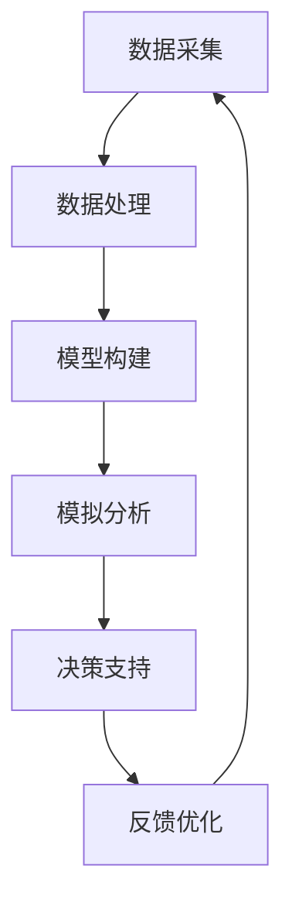

                 

# 第1章：智慧城市的起源与定义

### 1.1 智慧城市的概念与内涵

智慧城市是一种以信息技术为核心，通过数据、知识、智能等手段，实现城市管理的现代化、智能化、绿色化和社会化的发展模式。智慧城市不仅仅是一个技术概念，更是一种城市发展理念，它强调以人为本，通过整合各种资源和信息，提高城市的服务水平和居民的生活质量。

智慧城市的内涵可以从以下几个方面来理解：

- **信息技术应用**：智慧城市充分利用物联网、云计算、大数据、人工智能等先进技术，实现城市管理的智能化。
- **综合管理**：智慧城市强调对城市各个方面的综合管理，包括城市规划、公共安全、交通运输、环境保护、能源管理、公共服务等。
- **可持续发展**：智慧城市追求经济、社会和环境的协调发展，注重资源的合理利用和生态环境的保护。
- **以人为本**：智慧城市以居民的需求为导向，提供个性化的服务，提升居民的生活质量和幸福感。

### 1.2 智慧城市的发展历程

智慧城市的发展历程可以分为以下几个阶段：

- **1.0阶段（物理城市）**：这一阶段主要是物理基础设施的建设，如道路、桥梁、建筑等，还没有充分利用信息技术。
- **2.0阶段（数字化城市）**：这一阶段开始利用信息技术进行城市的管理，如通过计算机系统进行数据处理、信息共享等。
- **3.0阶段（智能城市）**：这一阶段利用物联网、云计算、大数据等技术，实现城市服务的智能化和自动化。
- **4.0阶段（智慧城市）**：这一阶段将人工智能、区块链等新兴技术应用于城市管理和服务，实现城市运行的全过程智能化。

### 1.3 智慧城市的重要性与挑战

智慧城市的重要性体现在以下几个方面：

- **提高城市管理效率**：智慧城市通过大数据、人工智能等技术，可以实时监测城市运行状况，提高城市管理的效率。
- **提升居民生活质量**：智慧城市提供个性化、便捷化的服务，可以提升居民的生活质量。
- **推动经济转型升级**：智慧城市的建设可以带动相关产业的发展，推动经济转型升级。
- **促进社会和谐发展**：智慧城市可以提供更加公平、透明的公共服务，促进社会的和谐发展。

然而，智慧城市也面临一些挑战：

- **数据安全与隐私保护**：智慧城市依赖于大量数据的收集和处理，数据安全与隐私保护成为重要的挑战。
- **技术与人才的缺失**：智慧城市建设需要大量的技术人才，但当前人才储备不足。
- **政策与法规的完善**：智慧城市建设需要完善的政策与法规支持，但目前相关法律法规尚不健全。

### 1.4 智慧城市的未来发展趋势

智慧城市的未来发展趋势体现在以下几个方面：

- **更加智能化的城市管理与服务**：随着人工智能、物联网等技术的发展，智慧城市的智能化水平将进一步提高。
- **跨领域的协同创新**：智慧城市的发展将涉及到多个领域的协同创新，如城市规划、交通运输、能源管理、环境保护等。
- **智慧城市的可持续发展**：智慧城市的建设将更加注重经济、社会和环境的协调发展，实现可持续发展。
- **全球智慧城市的互联互通**：随着全球化的推进，智慧城市之间的互联互通将进一步加强，形成全球智慧城市网络。

## 第1章：智慧城市的起源与定义

### 1.1 智慧城市的概念与内涵

智慧城市（Smart City）这一概念起源于21世纪初，它是一种通过先进的信息技术和互联网技术，实现城市运行、管理、服务和市民生活的全面智能化、高效化和可持续化的发展模式。智慧城市不仅仅是技术应用的集合，更是一种全新的城市发展理念，它强调以人为核心，通过信息技术的创新应用，提升城市的管理效能、服务质量和居民的生活体验。

**智慧城市的概念与内涵可以概括为以下几点：**

1. **信息技术驱动**：智慧城市利用物联网（IoT）、云计算、大数据、人工智能（AI）、区块链等先进技术，构建城市的智能感知、智能决策和智能执行系统。

2. **综合管理**：智慧城市通过对城市基础设施、公共服务、交通、环境、能源等多个方面的全面管理，实现城市运行的协调、高效和可持续发展。

3. **以人为本**：智慧城市以市民的需求为导向，提供个性化、便捷化、高品质的服务，提升市民的生活质量和幸福感。

4. **可持续发展**：智慧城市注重资源的高效利用和环境保护，追求经济、社会和环境的协调发展。

5. **数据驱动**：智慧城市通过数据的收集、处理和分析，为城市管理和决策提供数据支持，实现科学决策和精准服务。

### 1.2 智慧城市的发展历程

智慧城市的发展历程可以分为以下几个阶段：

#### 1.0阶段：物理城市（1990s之前）
在这个阶段，城市的发展主要依赖于物理基础设施的建设，如道路、桥梁、建筑等，信息技术尚未广泛应用。

#### 2.0阶段：数字化城市（1990s-2000s）
随着计算机技术和互联网的发展，数字化城市开始出现。城市开始通过计算机系统进行数据处理和信息共享，实现了城市管理的初步信息化。

#### 3.0阶段：智能城市（2000s-2010s）
在这个阶段，物联网、云计算、大数据等新兴技术逐渐应用于城市管理，城市服务开始向智能化和自动化方向发展。

#### 4.0阶段：智慧城市（2010s至今）
随着人工智能、区块链等技术的快速发展，智慧城市逐渐成为城市发展的主流模式。智慧城市通过数据驱动和智能化管理，实现了城市运行的全过程智能化。

### 1.3 智慧城市的重要性与挑战

**智慧城市的重要性体现在以下几个方面：**

1. **提高城市管理效率**：通过物联网、大数据等技术，城市管理者可以实时监控城市运行状态，快速响应突发事件，提高城市管理的效率。

2. **提升居民生活质量**：智慧城市提供了更加便捷、个性化的公共服务，如智慧交通、智慧医疗、智慧教育等，显著提升了居民的生活质量。

3. **推动经济转型升级**：智慧城市的建设带动了信息技术、智能硬件、云计算、大数据等产业的发展，推动了城市的经济转型升级。

4. **促进社会和谐发展**：智慧城市通过数据共享和透明化，提高了公共服务的公平性和效率，促进了社会的和谐发展。

**智慧城市面临的挑战包括：**

1. **数据安全与隐私保护**：智慧城市依赖于大量数据的收集和处理，数据安全和隐私保护是亟待解决的问题。

2. **技术与人才的缺失**：智慧城市建设需要大量的技术人才，但当前的人才储备不足，特别是在新兴技术领域。

3. **政策与法规的完善**：智慧城市的建设需要政策与法规的支持，但现有的法律法规体系尚不健全。

### 1.4 智慧城市的未来发展趋势

**智慧城市的未来发展趋势包括：**

1. **智能化水平的提升**：随着人工智能、物联网等技术的进一步发展，智慧城市的智能化水平将得到显著提升。

2. **跨领域的协同创新**：智慧城市的发展将涉及到城市规划、交通运输、能源管理、环境保护等多个领域，需要跨领域的协同创新。

3. **可持续发展的追求**：智慧城市的建设将更加注重经济、社会和环境的协调发展，追求城市的可持续发展。

4. **全球智慧城市的互联互通**：随着全球化的推进，智慧城市之间的互联互通将进一步加强，形成全球智慧城市网络。

## 1.1 智慧城市的概念与内涵

智慧城市的概念可以追溯到20世纪末，但真正引起广泛关注是在21世纪初。它是一种利用先进的信息技术和互联网技术，实现城市运行、管理和服务的全面智能化、高效化和可持续化的发展模式。智慧城市不仅仅是一个技术概念，更是一种城市发展理念，强调以人为本，通过信息技术的创新应用，提升城市的管理效能、服务质量和居民的生活体验。

### 智慧城市的核心概念与内涵

**1. 信息技术应用**

智慧城市利用物联网、云计算、大数据、人工智能、区块链等先进技术，构建城市的智能感知、智能决策和智能执行系统。这些技术的应用使得城市能够实现数据的实时采集、处理和分析，从而为城市管理和决策提供科学依据。

**2. 综合管理**

智慧城市强调对城市基础设施、公共服务、交通、环境、能源等多个方面的全面管理，实现城市运行的协调、高效和可持续发展。通过综合管理，城市能够更加有效地利用资源，降低运营成本，提高服务质量。

**3. 以人为本**

智慧城市以市民的需求为导向，提供个性化、便捷化、高品质的服务，提升市民的生活质量和幸福感。智慧城市通过数据分析和服务优化，能够更好地满足市民的个性化需求，提高市民的满意度。

**4. 可持续发展**

智慧城市注重经济、社会和环境的协调发展，追求城市的可持续发展。通过智能化的管理和服务的优化，智慧城市能够实现资源的高效利用，减少环境污染，提高城市的生态效益。

**5. 数据驱动**

智慧城市通过数据的收集、处理和分析，为城市管理和决策提供数据支持，实现科学决策和精准服务。数据是智慧城市的核心资产，通过数据驱动，城市能够更加准确地把握发展趋势，做出科学的决策。

### 智慧城市的概念架构

智慧城市的概念架构可以概括为以下几个层次：

1. **基础设施层**：包括城市的基础设施，如道路、桥梁、建筑、能源系统等。这些基础设施为智慧城市的建设提供了物理支撑。

2. **感知层**：通过物联网技术，实现对城市环境的实时监测和数据的采集，如环境监测设备、交通传感器、智能摄像头等。

3. **传输层**：通过云计算、大数据平台等技术，实现数据的传输、存储和处理。这一层是智慧城市的数据处理和存储核心。

4. **应用层**：包括智慧城市的各种应用场景，如智慧交通、智慧医疗、智慧教育、智慧环保等。这些应用场景为市民提供了便捷、高效、个性化的服务。

5. **决策层**：通过数据分析、人工智能等技术，为城市管理和决策提供支持。这一层是智慧城市的智能决策核心。

### 智慧城市的联系与关系

智慧城市的各个层次和组成部分之间存在紧密的联系和相互作用：

- **基础设施层** 和 **感知层**：基础设施层为感知层提供了物理支撑，感知层通过物联网技术对基础设施进行实时监测和数据的采集。

- **传输层** 和 **应用层**：传输层负责数据的传输、存储和处理，为应用层提供了数据支持和计算能力。应用层通过云计算、大数据平台等技术，实现对各种应用场景的智能管理和优化。

- **决策层** 和 **感知层**、**传输层**、**应用层**：决策层通过数据分析、人工智能等技术，对感知层、传输层和应用层的数据进行分析和处理，为城市管理和决策提供支持。

### 结论

智慧城市的概念与内涵丰富多样，涉及信息技术、城市管理、社会发展等多个方面。通过物联网、云计算、大数据、人工智能等先进技术的应用，智慧城市实现了城市运行、管理和服务的全面智能化、高效化和可持续发展。智慧城市的发展不仅提高了城市的管理效率和居民的生活质量，也为城市的经济转型升级和社会和谐发展提供了新的机遇。在未来，随着技术的不断进步和应用的深入，智慧城市将不断发展和完善，成为城市发展的重要方向。

## 1.2 智慧城市的发展历程

智慧城市的发展历程可以分为几个关键阶段，每个阶段都标志着技术的进步和城市管理的变革。以下是智慧城市的发展历程及其主要特征：

### 1.0阶段：物理城市（1990s之前）

在1990年代之前，城市的发展主要依赖于物理基础设施的建设。这一阶段的城市以大规模的基础设施投资和建设为核心，包括道路、桥梁、建筑、公共设施等。信息技术在这一阶段的应用还非常有限，城市管理的效率相对较低，主要以人工操作和传统管理方式为主。

**主要特征：**

- **重基础设施建设**：城市的发展主要依靠基础设施的扩建和更新。
- **人工管理**：城市管理和运营主要依赖于人工操作，缺乏智能化手段。
- **缺乏数据支持**：城市管理决策主要基于经验，缺乏科学的数据支持。

### 2.0阶段：数字化城市（1990s-2000s）

随着计算机技术和互联网的快速发展，城市开始进入数字化阶段。这一阶段，信息技术开始在城市管理中发挥重要作用，城市的基础设施和公共服务逐渐实现了信息化管理。

**主要特征：**

- **信息技术普及**：计算机、互联网、移动通信等技术的广泛应用，为城市数字化管理提供了技术支持。
- **信息化管理**：通过计算机系统和数据库，实现对城市基础设施、交通、公共服务等方面的信息化管理。
- **初步的数据应用**：城市开始通过数据采集和分析，为城市管理决策提供一定的数据支持。

### 3.0阶段：智能城市（2000s-2010s）

进入21世纪，物联网、云计算、大数据等新兴技术迅速发展，城市开始进入智能化阶段。这一阶段，智慧城市概念逐渐兴起，城市的各项服务和管理开始实现智能化、自动化。

**主要特征：**

- **物联网的应用**：通过物联网技术，实现城市各种设备的互联和数据采集，为城市管理提供了实时、准确的数据。
- **云计算的支持**：云计算技术为城市提供了强大的计算能力和数据存储能力，支持大规模数据的处理和分析。
- **大数据的利用**：城市开始利用大数据技术，对海量数据进行深度挖掘和分析，为城市管理决策提供科学依据。
- **智能化的服务**：城市公共服务和基础设施开始实现智能化管理，如智能交通、智能安防、智能照明等。

### 4.0阶段：智慧城市（2010s至今）

随着人工智能、区块链等新兴技术的进一步发展，城市开始迈向智慧化。这一阶段，智慧城市成为城市发展的主流模式，通过数据驱动和智能化管理，实现了城市运行的全过程智能化。

**主要特征：**

- **人工智能的应用**：人工智能技术开始广泛应用于城市管理的各个领域，如智能交通管理、智能环境监测、智能医疗等。
- **区块链技术的引入**：区块链技术为城市的公共服务和数据管理提供了安全、透明的解决方案，如智慧医疗、智慧金融等。
- **数据驱动的决策**：城市管理和决策更加依赖于数据分析和智能算法，实现了科学决策和精准服务。
- **全过程的智能化**：城市运行、管理、服务、监测等各个环节都实现了智能化，形成了智慧城市生态系统。

### 智慧城市的发展历程总结

智慧城市的发展历程是一个从物理城市到数字化城市、智能城市，最终迈向智慧城市的演进过程。每个阶段都标志着技术的进步和城市管理的变革，推动了城市发展的不断升级。未来，随着新技术的不断涌现，智慧城市将继续发展，实现更加智能化、绿色化、可持续的发展。

## 1.3 智慧城市的重要性与挑战

智慧城市作为一种先进的城市发展模式，具有重要的社会和经济价值。然而，在实现智慧城市的过程中，也面临着一系列挑战。

### 1.3.1 智慧城市的重要性

1. **提高城市管理效率**：智慧城市通过物联网、大数据、人工智能等技术的应用，实现对城市运行的实时监测和智能分析，有助于提高城市管理的效率和响应速度。例如，通过智能交通系统，可以实时调整交通信号灯，缓解交通拥堵。

2. **提升居民生活质量**：智慧城市通过提供个性化的服务和便捷的生活方式，显著提升居民的生活质量。例如，通过智慧医疗系统，居民可以享受到远程医疗服务，提高就医体验。

3. **推动经济转型升级**：智慧城市的建设带动了信息技术、智能硬件、云计算、大数据等产业的发展，促进了经济的转型升级。例如，智慧物流系统的应用，提高了物流效率，降低了企业成本。

4. **促进社会和谐发展**：智慧城市通过数据共享和透明化，提高了公共服务的公平性和效率，促进了社会的和谐发展。例如，通过智慧安防系统，可以有效预防犯罪，提升市民的安全感。

### 1.3.2 智慧城市面临的挑战

1. **数据安全与隐私保护**：智慧城市依赖于大量数据的收集和处理，这些数据包括市民的个人信息、交通状况、环境数据等。如何保障数据安全，防止数据泄露和滥用，是一个重大挑战。

2. **技术与人才的缺失**：智慧城市的建设需要大量的技术人才，包括物联网、大数据、人工智能等领域的专业人才。然而，目前国内这些领域的人才储备不足，难以满足智慧城市建设的需要。

3. **政策与法规的完善**：智慧城市建设需要政策与法规的支持，包括数据管理、网络安全、隐私保护等方面的法律法规。然而，目前这些法律法规尚不健全，需要进一步完善。

4. **技术标准的统一**：智慧城市涉及多个领域和多个技术，如何制定统一的技术标准，实现不同系统和平台之间的互操作性和兼容性，是一个重要挑战。

### 1.3.3 应对挑战的策略

1. **加强数据安全与隐私保护**：建立完善的数据安全管理体系，采用加密技术、访问控制、数据备份等措施，确保数据的安全性和隐私性。

2. **培养技术人才**：通过高校教育、企业培训、国际合作等方式，加大技术人才的培养力度，满足智慧城市建设的需求。

3. **完善政策与法规**：制定和完善相关政策与法规，为智慧城市建设提供法律保障，包括数据管理、网络安全、隐私保护等方面。

4. **制定技术标准**：组织制定统一的技术标准，推动不同系统和平台之间的互操作性和兼容性，促进智慧城市的健康发展。

总之，智慧城市的重要性不容忽视，但同时也面临着诸多挑战。通过有效的策略和措施，可以应对这些挑战，实现智慧城市的可持续发展。

## 1.4 智慧城市的未来发展趋势

智慧城市的发展前景广阔，未来将在多个方面实现突破和进展。以下是智慧城市未来发展趋势的主要方向：

### 1.4.1 智能化水平的提升

随着人工智能技术的快速发展，智慧城市的智能化水平将得到显著提升。未来，城市将更加依赖于人工智能进行智能决策和自动化管理。例如，智能交通系统将能够通过机器学习算法，实时优化交通信号灯，减少拥堵。智能安防系统将能够通过图像识别和自然语言处理技术，自动识别异常行为和潜在安全威胁。

### 1.4.2 跨领域的协同创新

智慧城市的发展将涉及到城市规划、交通运输、能源管理、环境保护等多个领域。未来，不同领域之间的协同创新将成为智慧城市发展的关键。例如，通过智能电网与智能交通系统的结合，可以实现电力的智能调度，减少能源浪费。智慧城市的综合管理平台将能够集成多个领域的应用，实现跨领域的协同管理。

### 1.4.3 可持续发展的追求

智慧城市的建设将更加注重经济、社会和环境的协调发展，追求城市的可持续发展。未来，智慧城市将采用更多的绿色技术和可持续发展的理念，例如智能建筑、绿色能源、智能环保系统等。通过这些技术，智慧城市将能够实现资源的高效利用和环境的保护，推动城市的绿色发展。

### 1.4.4 全球智慧城市的互联互通

随着全球化的推进，智慧城市之间的互联互通将进一步加强。未来，智慧城市将通过网络和通信技术，实现跨国界的互联互通，形成全球智慧城市网络。通过这一网络，城市之间可以共享数据、技术和经验，共同应对全球性挑战，如气候变化、公共卫生危机等。

### 1.4.5 社会创新的推动

智慧城市的建设将推动社会创新，带来新的商业模式和社会服务。未来，智慧城市将鼓励创业和创新，为市民提供更多的就业机会。同时，智慧城市将采用开放的数据平台，鼓励公众参与城市管理和决策，提高公共服务的透明度和参与度。

### 1.4.6 数据安全与隐私保护

随着智慧城市的数据量持续增长，数据安全与隐私保护将成为未来发展的重点。未来，智慧城市将建立更加完善的数据安全体系，采用先进的数据加密和隐私保护技术，确保数据的安全和隐私。同时，智慧城市将制定严格的法律法规，规范数据的使用和管理。

### 1.4.7 技术与政策的深度融合

未来，智慧城市的发展将更加依赖于技术与政策的深度融合。政策将起到引导和推动作用，而技术将提供实现手段。例如，政府在制定智慧城市发展规划时，将更加注重技术的创新和应用，推动智慧城市的可持续发展。

总之，智慧城市的发展前景充满机遇和挑战。通过不断提升智能化水平、推动跨领域协同创新、追求可持续发展、实现全球互联互通、推动社会创新、加强数据安全与隐私保护以及技术与政策的深度融合，智慧城市将迎来更加美好的未来。

## 附录

### 附录A：数字孪生城市的Mermaid流程图

以下是一个简单的Mermaid流程图，展示了数字孪生城市的核心组件和流程：



**流程说明：**

- **A（数据采集）**：通过传感器、摄像头、无人机等设备，收集城市运行的各种数据。
- **B（数据处理）**：对采集到的数据进行清洗、整合和分析，为模型构建提供数据基础。
- **C（模型构建）**：利用数据处理的结果，构建数字孪生城市的虚拟模型。
- **D（模拟分析）**：通过虚拟模型，对城市运行进行模拟和预测，为决策提供科学依据。
- **E（决策支持）**：基于模拟分析的结果，为城市管理者提供决策支持，优化城市运行。
- **F（反馈优化）**：将决策执行的结果反馈到模型中，不断优化和改进数字孪生城市。

### 附录B：物联网与大数据的融合应用伪代码

以下是一个简单的伪代码示例，展示了物联网与大数据融合应用的流程：

```python
# 物联网与大数据融合应用伪代码

# 数据采集
def data_collection():
    traffic_data = collect_traffic_data()  # 采集交通流量数据
    environment_data = collect_environment_data()  # 采集环境质量数据
    public_security_data = collect_public_security_data()  # 采集公共安全数据

# 数据处理
def data_processing():
    processed_traffic_data = process_traffic_data(traffic_data)  # 处理交通流量数据
    processed_environment_data = process_environment_data(environment_data)  # 处理环境质量数据
    processed_public_security_data = process_public_security_data(public_security_data)  # 处理公共安全数据

# 数据分析
def data_analysis():
    traffic_analysis = analyze_traffic_data(processed_traffic_data)  # 分析交通流量数据
    environment_analysis = analyze_environment_data(processed_environment_data)  # 分析环境质量数据
    public_security_analysis = analyze_public_security_data(processed_public_security_data)  # 分析公共安全数据

# 数据可视化
def data_visualization():
    visualize_traffic_data(traffic_analysis)  # 可视化交通流量数据
    visualize_environment_data(environment_analysis)  # 可视化环境质量数据
    visualize_public_security_data(public_security_analysis)  # 可视化公共安全数据

# 数据存储
def data_storage():
    store_traffic_data(traffic_analysis)  # 存储交通流量数据
    store_environment_data(environment_analysis)  # 存储环境质量数据
    store_public_security_data(public_security_analysis)  # 存储公共安全数据
```

**流程说明：**

- **数据采集**：从物联网设备（如传感器、摄像头等）收集交通流量、环境质量、公共安全等数据。
- **数据处理**：对采集到的数据进行清洗、整合和预处理，为后续分析做准备。
- **数据分析**：利用大数据技术对处理后的数据进行分析，提取有价值的信息和洞察。
- **数据可视化**：将分析结果可视化，帮助城市管理者更好地理解数据，支持决策。
- **数据存储**：将分析结果存储到数据库或其他存储系统中，供后续查询和使用。

### 附录C：人工智能与机器学习的融合应用实例代码解读与分析

以下是一个简单的Python代码示例，展示了如何使用机器学习技术进行数据预测：

```python
# 导入所需的库
import pandas as pd
import numpy as np
from sklearn.model_selection import train_test_split
from sklearn.linear_model import LinearRegression
from sklearn.metrics import mean_squared_error

# 读取数据
data = pd.read_csv('house_price_data.csv')

# 数据预处理
X = data[['square_feet', 'location_rating']]
y = data['house_price']

# 数据划分
X_train, X_test, y_train, y_test = train_test_split(X, y, test_size=0.2, random_state=42)

# 创建线性回归模型
model = LinearRegression()

# 模型训练
model.fit(X_train, y_train)

# 模型预测
y_pred = model.predict(X_test)

# 模型评估
mse = mean_squared_error(y_test, y_pred)
print('Mean Squared Error:', mse)
```

**代码解读：**

1. **数据读取与预处理**：
    - 使用`pandas`库读取CSV文件中的数据。
    - 将数据分为特征（`X`）和目标变量（`y`）。

2. **数据划分**：
    - 使用`train_test_split`函数将数据集划分为训练集和测试集，比例为80%的训练集和20%的测试集。

3. **模型创建与训练**：
    - 创建一个线性回归模型。
    - 使用训练集数据训练模型。

4. **模型预测**：
    - 使用训练好的模型对测试集进行预测。

5. **模型评估**：
    - 计算均方误差（MSE），评估模型预测的准确性。

**分析：**

- **数据预处理**：确保数据质量是模型训练成功的关键。在本例中，数据集已经包含了房屋面积和地理位置评级作为特征，这些特征能够反映房屋价格的影响因素。
- **数据划分**：通过将数据划分为训练集和测试集，可以评估模型的泛化能力，确保模型在未知数据上的表现良好。
- **模型选择**：线性回归模型是一个简单但有效的预测模型，适用于线性关系的数据。
- **模型训练**：模型训练是机器学习的核心步骤，它决定了模型的性能。
- **模型评估**：MSE是评估模型预测准确性的常用指标，它能够量化模型预测误差。

### 实际案例与应用

在实际应用中，人工智能与机器学习可以应用于各种领域，如金融、医疗、零售等。以下是一些典型的应用场景：

1. **金融**：利用机器学习模型进行信用评分、欺诈检测、股票预测等。
2. **医疗**：利用机器学习模型进行疾病诊断、预测、个性化治疗等。
3. **零售**：利用机器学习模型进行需求预测、库存管理、顾客行为分析等。

### 注意事项与拓展

- **数据质量**：确保数据质量是模型训练成功的关键。缺失值、异常值、噪声等都会影响模型的性能。
- **模型选择**：根据具体问题选择合适的模型。对于非线性关系，可以考虑使用非线性模型，如决策树、随机森林、神经网络等。
- **模型优化**：通过交叉验证、参数调优等方法，提高模型的性能。
- **可解释性**：对于复杂的模型，如深度学习模型，确保其可解释性，以便理解模型的预测依据。

### 拓展阅读

- **《机器学习实战》**：提供丰富的案例和实用的算法，适合初学者。
- **《深度学习》**：介绍深度学习的基本概念和常见算法，适合有一定基础的学习者。
- **《Python数据科学手册》**：涵盖数据科学领域的多个方面，包括数据处理、分析和可视化等。

通过以上代码示例和解析，读者可以了解人工智能与机器学习的基本原理和应用方法，为后续学习和实践打下基础。

### 附录D：智慧城市相关的技术标准与规范

智慧城市的发展需要一套完善的技术标准与规范来指导建设和运营，以确保系统的互操作性、安全性和高效性。以下是一些关键的智慧城市技术标准和规范：

1. **物联网参考架构（IoT Reference Architecture）**：
   - **标准内容**：定义物联网系统的组件、接口和交互机制，提供一套标准化的物联网架构框架。
   - **应用场景**：适用于智慧交通、智慧能源、智慧环境等物联网应用。

2. **大数据参考架构（Big Data Reference Architecture）**：
   - **标准内容**：定义大数据系统的组件、数据流程和处理机制，包括数据采集、存储、处理、分析和展示。
   - **应用场景**：适用于智慧医疗、智慧物流、智慧城市大数据平台等。

3. **人工智能伦理设计标准（Artificial Intelligence Ethics Design Guideline）**：
   - **标准内容**：提供人工智能系统的伦理设计指导，确保人工智能系统的公正性、透明性和可解释性。
   - **应用场景**：适用于智慧城市中的人工智能应用，如智能交通管理、智能安防等。

4. **智慧城市综合标准（Smart City Integrated Standard）**：
   - **标准内容**：定义智慧城市的总体架构、关键技术、应用场景和服务质量要求。
   - **应用场景**：作为智慧城市建设的基础性标准，指导智慧城市的规划和实施。

5. **物联网接口标准（IoT Interface Standard）**：
   - **标准内容**：定义物联网设备的接口规范，确保不同设备和平台之间的互操作性。
   - **应用场景**：适用于智慧城市中各种物联网设备的互联互通。

6. **数据管理标准（Data Management Standard）**：
   - **标准内容**：提供数据采集、存储、处理、共享和保护的标准方法。
   - **应用场景**：适用于智慧城市中的数据管理，确保数据的安全、可靠和有效利用。

7. **网络安全标准（Cybersecurity Standard）**：
   - **标准内容**：定义智慧城市的网络安全要求，包括数据安全、系统安全和网络安全管理等。
   - **应用场景**：适用于智慧城市的网络安全防护，防止数据泄露和网络攻击。

8. **智慧交通标准（Smart Transportation Standard）**：
   - **标准内容**：定义智慧交通系统的架构、功能和技术要求，包括智能交通信号控制、智能停车场管理、公共交通智能化等。
   - **应用场景**：适用于智慧交通系统的建设和运营。

9. **智慧医疗标准（Smart Health Standard）**：
   - **标准内容**：定义智慧医疗系统的架构、功能和技术要求，包括远程医疗、智能诊断、医疗数据管理等。
   - **应用场景**：适用于智慧医疗系统的建设和运营。

10. **智慧环境标准（Smart Environment Standard）**：
    - **标准内容**：定义智慧环境系统的架构、功能和技术要求，包括环境监测、污染控制、能源管理等。
    - **应用场景**：适用于智慧环境系统的建设和运营。

这些技术标准和规范为智慧城市的建设提供了指导和保障，有助于确保智慧城市的可持续发展、安全运行和高效服务。在实际应用中，应根据具体需求和场景选择合适的标准和规范，并逐步完善和更新，以适应技术发展和应用需求的变化。

