                 


### 文章标题

《2050年的智能家居：从便利到智慧的生活方式》

### 关键词

- 智能家居
- 物联网
- 人工智能
- 大数据
- 智慧生活

### 摘要

本文深入探讨2050年智能家居的愿景，从技术基础、核心组件到智慧应用，全面解析智能家居的未来发展。通过对物联网、人工智能和大数据等核心技术的剖析，本文探讨了智能家居的安全性和便利性，并展望了智能家居在社会生活中的影响。同时，文章还提出了智能家居未来发展的挑战与机遇，为读者提供了一个关于智能家居未来发展脉络的清晰蓝图。

### 目录

#### 第一部分：智能家居的概念与发展

##### 第1章：智能家居概述

1.1 智能家居的定义与核心概念

1.2 智能家居与传统家居的比较

1.3 智能家居的未来发展趋势

##### 第2章：智能家居的技术基础

2.1 物联网技术

2.2 人工智能与大数据

##### 第3章：智能家居的核心组件

3.1 智能家电

3.2 智能传感器

#### 第二部分：智能家居的智慧应用

##### 第4章：智能家居的安全性

4.1 智能家居的安全隐患

4.2 智能家居的安全解决方案

##### 第5章：智能家居的便利性

5.1 智能家居的便利应用

5.2 智能家居的个性化服务

##### 第6章：智能家居的智慧生活

6.1 智慧家庭生活场景

6.2 智慧家庭生态链

##### 第7章：智能家居的未来展望

7.1 智能家居的未来趋势

7.2 智能家居的挑战与机遇

### 附录

### 附录A：智能家居开发工具与资源

#### 第一部分：智能家居的概念与发展

##### 第1章：智能家居概述

1.1 智能家居的定义与核心概念

**背景介绍**

随着科技的迅猛发展，物联网、人工智能、大数据等前沿技术逐渐渗透到我们生活的方方面面。在这个背景下，智能家居成为了一个热门的研究领域和消费市场。那么，什么是智能家居？

**核心概念与联系**

智能家居（Smart Home）是一种通过互联网、物联网等技术，将家庭中的各种设备连接起来，实现远程控制、自动调节和智能互动的一种生活方式。智能家居的核心概念包括以下几个方面：

- **连接性**：通过互联网和物联网技术，将家庭中的各种设备连接起来，形成一个统一的智能系统。
- **交互性**：用户可以通过手机、电脑、语音助手等设备与智能家居系统进行交互，实现远程控制和自动化调节。
- **智能化**：通过人工智能技术，智能家居系统能够根据用户的行为习惯和需求，自动调节家居环境，提供个性化的服务。

**Mermaid流程图**

下面是一个简单的智能家居系统的流程图，展示了智能家居的核心概念和联系：

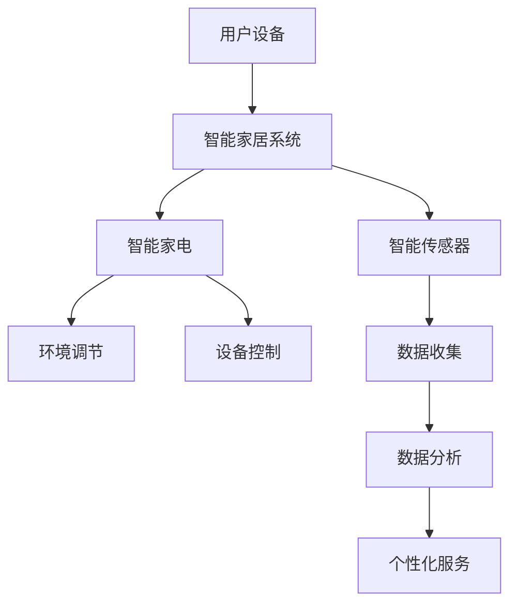

**核心算法原理讲解**

智能家居系统的工作原理可以简化为以下几个步骤：

1. **数据收集**：智能传感器收集家庭环境中的各种数据，如温度、湿度、光照、噪音等。
2. **数据分析**：将收集到的数据传输到智能家居系统，进行分析和处理。
3. **决策与执行**：根据分析结果，智能家居系统会自动调整家庭环境，如调整空调温度、开启灯光等。
4. **反馈与优化**：系统会记录用户的反馈，不断优化自身的服务。

以下是智能家居系统的伪代码示例：

```python
# 数据收集
data = collect_data()

# 数据分析
analyzer = Analyzer()
analysis_result = analyzer.analyze(data)

# 决策与执行
if analysis_result['temperature'] > 28:
    air_conditioner.turn_on()
else:
    air_conditioner.turn_off()

if analysis_result['light'] < 100:
    light.turn_on()
else:
    light.turn_off()

# 反馈与优化
if user prefers cooler temperature:
    adjust_temp(25)
else:
    adjust_temp(30)
```

**数学模型和公式**

在智能家居系统中，环境调节的过程可以抽象为一个优化问题。假设家庭环境的温度和湿度为两个变量，我们的目标是找到一组最优的温度和湿度设置，使得用户满意度最大化。

设温度变量为 \(T\)，湿度变量为 \(H\)，用户满意度为 \(S(T, H)\)。则优化模型可以表示为：

$$
\max S(T, H)
$$

其中，温度和湿度需要满足以下约束条件：

$$
T \in [20, 30]
$$

$$
H \in [30, 70]
$$

**举例说明**

假设我们收集到的数据为：当前温度为25℃，湿度为45%，用户满意度为70%。根据优化模型，我们可以调整温度到25℃或30℃，湿度到30%或70%，以达到用户满意度的最大化。

**项目实战**

在实际项目中，我们可以使用各种编程语言和工具来实现智能家居系统。以下是一个简单的Python代码示例，用于控制智能家居系统的温度和湿度：

```python
# 导入必要的库
import requests

# 设置智能家居系统的URL
url = "http://smart-home.example.com/set_environment"

# 设置温度和湿度
temp = 25
humidity = 45

# 发送请求，调整温度和湿度
response = requests.get(url, params={"temperature": temp, "humidity": humidity})

# 打印结果
print("Temperature:", temp)
print("Humidity:", humidity)
print("Response:", response.text)
```

**代码解读与分析**

该代码使用了Python的requests库发送HTTP GET请求，向智能家居系统发送温度和湿度的设置参数。根据返回的响应，我们可以判断智能家居系统是否成功调整了温度和湿度。

**最佳实践 tips、小结、注意事项、拓展阅读等内容**

- **最佳实践**：在设计和开发智能家居系统时，应充分考虑用户的需求和体验，确保系统的易用性和稳定性。
- **小结**：智能家居系统通过物联网、人工智能和大数据等技术的结合，实现了家庭环境的智能化调节，为用户提供了更便利、舒适的生活方式。
- **注意事项**：智能家居系统涉及到用户隐私和数据安全，因此在设计和开发过程中，应高度重视数据保护和安全措施。
- **拓展阅读**：读者可以进一步阅读相关文献，了解智能家居系统的最新技术和应用。

#### 第1章：智能家居概述

**1.2 智能家居与传统家居的比较**

**背景介绍**

智能家居与传统家居相比，具有明显的差异和优势。传统家居主要依赖于人工操作和手动调节，而智能家居则通过物联网、人工智能等先进技术，实现了家庭设备的自动化和智能化。下面我们从以下几个方面来比较智能家居与传统家居。

**核心概念与联系**

1. **设备控制**

   - **传统家居**：家庭设备（如空调、灯光、窗帘等）的控制通常依赖于手动开关或遥控器。
   - **智能家居**：通过物联网技术，家庭设备可以通过手机、电脑、语音助手等设备进行远程控制。

2. **环境调节**

   - **传统家居**：家庭环境的调节（如温度、湿度、光照等）主要依赖于人工操作，难以实现自动化和个性化。
   - **智能家居**：通过智能传感器和人工智能技术，可以实时监测家庭环境，并根据用户需求和习惯自动调节。

3. **互动体验**

   - **传统家居**：用户与家庭设备的互动主要依赖于手动操作，缺乏智能互动。
   - **智能家居**：通过语音助手、手机APP等，用户可以与家庭设备进行智能互动，实现更加便捷的操作。

**Mermaid流程图**

以下是智能家居与传统家居的对比流程图：

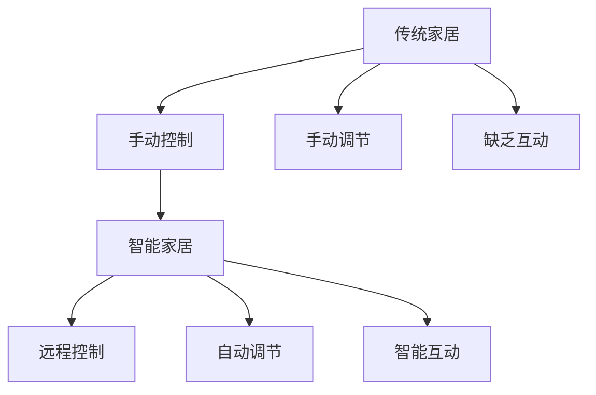

**核心算法原理讲解**

智能家居与传统家居在核心算法原理上也存在明显的差异。以下是智能家居系统的一些核心算法原理：

1. **环境监测算法**：通过智能传感器收集环境数据（如温度、湿度、光照等），并对数据进行处理和分析。

2. **预测算法**：基于历史数据和用户行为，预测用户的需求和习惯，从而实现个性化的环境调节。

3. **优化算法**：根据环境数据和用户需求，优化家庭设备的运行状态，以达到节能和舒适的目标。

以下是智能家居系统的伪代码示例：

```python
# 环境监测算法
data = monitor_environment()

# 预测算法
predictor = Predictor()
user_demand = predictor.predict(data)

# 优化算法
optimizer = Optimizer()
optimized_settings = optimizer.optimize(user_demand)

# 执行优化设置
execute_settings(optimized_settings)
```

**数学模型和公式**

在智能家居系统中，环境调节的过程可以抽象为一个优化问题。假设家庭环境的温度和湿度为两个变量，我们的目标是找到一组最优的温度和湿度设置，使得用户满意度最大化。

设温度变量为 \(T\)，湿度变量为 \(H\)，用户满意度为 \(S(T, H)\)。则优化模型可以表示为：

$$
\max S(T, H)
$$

其中，温度和湿度需要满足以下约束条件：

$$
T \in [20, 30]
$$

$$
H \in [30, 70]
$$

**举例说明**

假设我们收集到的数据为：当前温度为25℃，湿度为45%，用户满意度为70%。根据优化模型，我们可以调整温度到25℃或30℃，湿度到30%或70%，以达到用户满意度的最大化。

**项目实战**

在实际项目中，我们可以使用各种编程语言和工具来实现智能家居系统。以下是一个简单的Python代码示例，用于控制智能家居系统的温度和湿度：

```python
# 导入必要的库
import requests

# 设置智能家居系统的URL
url = "http://smart-home.example.com/set_environment"

# 设置温度和湿度
temp = 25
humidity = 45

# 发送请求，调整温度和湿度
response = requests.get(url, params={"temperature": temp, "humidity": humidity})

# 打印结果
print("Temperature:", temp)
print("Humidity:", humidity)
print("Response:", response.text)
```

**代码解读与分析**

该代码使用了Python的requests库发送HTTP GET请求，向智能家居系统发送温度和湿度的设置参数。根据返回的响应，我们可以判断智能家居系统是否成功调整了温度和湿度。

**最佳实践 tips、小结、注意事项、拓展阅读等内容**

- **最佳实践**：在设计和开发智能家居系统时，应充分考虑用户的需求和体验，确保系统的易用性和稳定性。
- **小结**：智能家居系统通过物联网、人工智能和大数据等先进技术，实现了家庭设备的自动化和智能化，为用户提供了更加便利和舒适的生活体验。
- **注意事项**：智能家居系统涉及到用户隐私和数据安全，因此在设计和开发过程中，应高度重视数据保护和安全措施。
- **拓展阅读**：读者可以进一步阅读相关文献，了解智能家居系统的最新技术和应用。

**1.3 智能家居的未来发展趋势**

**背景介绍**

随着科技的不断进步，智能家居领域正迎来前所未有的发展机遇。根据市场研究机构的数据显示，全球智能家居市场预计将在未来几年内保持高速增长。那么，智能家居的未来发展趋势将如何呢？

**核心概念与联系**

1. **人工智能与大数据的结合**：智能家居的发展将更加依赖于人工智能和大数据技术的支持。通过大数据分析，智能家居系统能够更好地理解用户需求，提供个性化的服务。

2. **物联网技术的普及**：随着物联网设备的日益普及，智能家居系统将能够连接更多的设备，实现更广泛的智能化应用。

3. **智慧城市的建设**：智能家居与智慧城市的建设密不可分。未来，智能家居将融入智慧城市的整体架构，为城市居民提供更加便捷、智能的生活方式。

**Mermaid流程图**

以下是智能家居未来发展趋势的流程图：

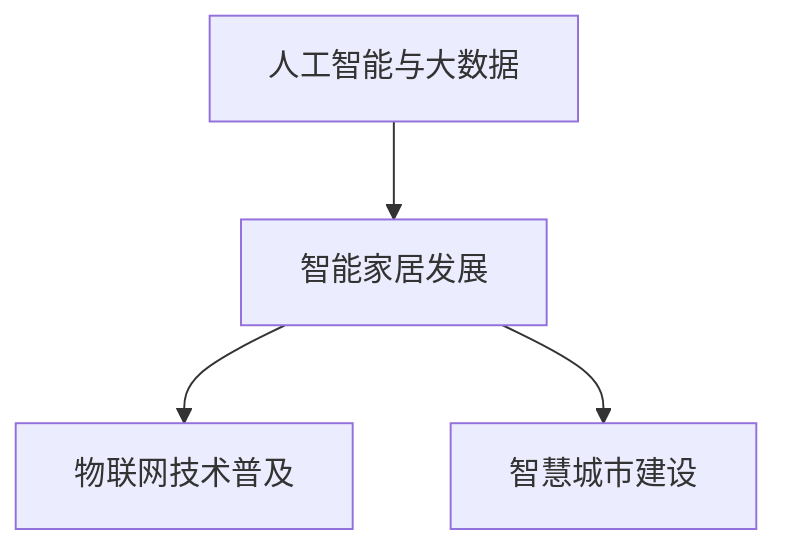

**核心算法原理讲解**

1. **深度学习算法**：在智能家居领域，深度学习算法将得到广泛应用。例如，通过卷积神经网络（CNN）可以实现图像识别，用于智能监控和安全防护；通过循环神经网络（RNN）可以实现语音识别和自然语言处理，用于语音控制和交互。

2. **强化学习算法**：强化学习算法在智能家居中的应用包括设备优化、路径规划等。例如，通过强化学习算法，智能家居系统可以自动调节温度和湿度，找到最优的运行状态。

3. **大数据分析算法**：大数据分析算法将用于智能家居系统的数据挖掘和预测。例如，通过聚类算法，可以分析用户的消费习惯，提供个性化的推荐服务。

以下是智能家居系统的一些核心算法伪代码示例：

```python
# 深度学习算法
model = build_cnn_model()
train_data = load_image_data()
model.train(train_data)

# 强化学习算法
agent = build_reinforcement_learning_agent()
state = get_initial_state()
while not game_over:
    action = agent.act(state)
    next_state, reward = get_next_state_and_reward(state, action)
    agent.learn(state, action, reward)
    state = next_state

# 大数据分析算法
data = load_user_data()
clusters = cluster_data(data)
recommendations = generate_recommendations(clusters)
```

**数学模型和公式**

在智能家居系统中，有许多数学模型和公式被用于优化和控制。以下是一些常用的数学模型和公式：

1. **线性回归模型**：用于预测家庭设备的能耗，根据历史数据和用户行为。

   $$ y = \beta_0 + \beta_1 x $$

   其中，\( y \) 为能耗，\( x \) 为用户行为。

2. **决策树模型**：用于分类和预测，例如，预测用户对智能家居系统的满意度。

   $$ y = \sum_{i=1}^{n} w_i t_i $$

   其中，\( y \) 为预测结果，\( w_i \) 为权重，\( t_i \) 为特征。

3. **神经网络模型**：用于图像识别、语音识别等，例如，通过卷积神经网络实现图像分类。

   $$ a^{(L)} = \sigma(z^{(L)}) $$

   其中，\( a^{(L)} \) 为输出层激活值，\( z^{(L)} \) 为输入值，\( \sigma \) 为激活函数。

**举例说明**

假设我们有一个智能家居系统，需要预测家庭设备的能耗。通过线性回归模型，我们可以建立如下公式：

$$
能耗 = 10 + 0.5 \times 用户行为
$$

假设用户行为为5，我们可以预测家庭的能耗为：

$$
能耗 = 10 + 0.5 \times 5 = 15
$$

**项目实战**

在实际项目中，我们可以使用各种编程语言和工具来实现智能家居系统。以下是一个简单的Python代码示例，用于预测家庭设备的能耗：

```python
# 导入必要的库
import numpy as np

# 设置线性回归模型的参数
beta_0 = 10
beta_1 = 0.5

# 设置用户行为
user_behavior = 5

# 预测能耗
predicted_energy_consumption = beta_0 + beta_1 * user_behavior

# 打印结果
print("预测能耗：", predicted_energy_consumption)
```

**代码解读与分析**

该代码使用了Python的NumPy库，设置了线性回归模型的参数，并根据用户行为预测了家庭设备的能耗。

**最佳实践 tips、小结、注意事项、拓展阅读等内容**

- **最佳实践**：在设计和开发智能家居系统时，应充分考虑用户的需求和体验，确保系统的易用性和稳定性。同时，要注重数据保护和安全措施。
- **小结**：智能家居的未来发展趋势包括人工智能与大数据的结合、物联网技术的普及和智慧城市的建设。通过深度学习、强化学习和大数据分析等算法，智能家居系统将实现更加智能化和个性化的服务。
- **注意事项**：智能家居系统涉及到用户隐私和数据安全，因此在设计和开发过程中，应高度重视数据保护和安全措施。
- **拓展阅读**：读者可以进一步阅读相关文献，了解智能家居系统的最新技术和应用。

#### 第2章：智能家居的技术基础

**2.1 物联网技术**

**背景介绍**

物联网（Internet of Things，简称IoT）是智能家居技术发展的基础。物联网技术通过将物理世界中的各种设备连接到互联网，实现设备之间的互联互通，为智能家居系统提供了实时数据采集、传输和处理的能力。

**核心概念与联系**

1. **物联网设备**：物联网设备是物联网系统的核心组成部分，包括传感器、执行器、控制器等。这些设备通过无线或有线的方式连接到互联网，实现数据的采集和传输。

2. **物联网协议**：物联网协议是设备之间进行通信的规范。常见的物联网协议包括MQTT、CoAP等。这些协议具有低功耗、高可靠性等特点，适合于智能家居环境。

3. **物联网平台**：物联网平台是物联网系统的中枢，负责设备的连接、数据管理、设备管理和应用开发等。物联网平台通常提供API接口，方便开发者进行二次开发。

**Mermaid流程图**

以下是物联网技术在智能家居中的应用流程图：

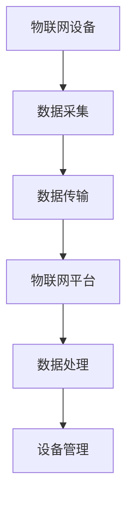

**核心算法原理讲解**

1. **数据采集算法**：物联网设备通过传感器实时采集环境数据（如温度、湿度、光照等），并将数据发送到物联网平台。

2. **数据传输算法**：物联网设备通过无线或有线的方式将数据传输到物联网平台。数据传输过程中，可能涉及到数据压缩、加密等技术，以确保数据的安全和可靠性。

3. **数据处理算法**：物联网平台对采集到的数据进行分析和处理，实现对家庭环境的实时监控和自动调节。

以下是物联网系统的伪代码示例：

```python
# 数据采集算法
def collect_data():
    temperature = sensor.get_temperature()
    humidity = sensor.get_humidity()
    return temperature, humidity

# 数据传输算法
def send_data(temperature, humidity):
    url = "http://iot-platform.example.com/send_data"
    params = {"temperature": temperature, "humidity": humidity}
    requests.get(url, params=params)

# 数据处理算法
def process_data(temperature, humidity):
    if temperature > 30:
        air_conditioner.turn_on()
    else:
        air_conditioner.turn_off()

    if humidity < 40:
        humidifier.turn_on()
    else:
        humidifier.turn_off()
```

**数学模型和公式**

在物联网系统中，数据采集、传输和处理过程中可能涉及到以下数学模型和公式：

1. **传感器测量模型**：用于描述传感器测量值与真实值之间的关系。

   $$ y = x + \epsilon $$

   其中，\( y \) 为测量值，\( x \) 为真实值，\( \epsilon \) 为测量误差。

2. **数据传输模型**：用于描述数据传输过程中的延迟和丢包问题。

   $$ delay = \alpha \times distance + \beta \times traffic $$

   其中，\( delay \) 为延迟，\( distance \) 为传输距离，\( traffic \) 为网络流量，\( \alpha \) 和 \( \beta \) 为模型参数。

3. **数据处理模型**：用于描述数据处理过程中的预测和优化问题。

   $$ y = f(x) $$

   其中，\( y \) 为处理结果，\( x \) 为输入数据，\( f \) 为处理函数。

**举例说明**

假设我们有一个物联网系统，用于监测家庭的温度和湿度。传感器采集到的数据为温度30℃，湿度40%。根据数据处理模型，我们可以进行以下操作：

1. **数据采集**：传感器采集到温度30℃，湿度40%。
2. **数据传输**：将数据发送到物联网平台。
3. **数据处理**：根据温度和湿度值，自动调节空调和加湿器的状态。

**项目实战**

在实际项目中，我们可以使用各种物联网开发工具和平台来实现智能家居系统。以下是一个简单的Python代码示例，用于连接物联网平台，发送和接收数据：

```python
# 导入必要的库
import requests

# 设置物联网平台的URL
url = "http://iot-platform.example.com"

# 发送数据
def send_data(temperature, humidity):
    params = {"temperature": temperature, "humidity": humidity}
    response = requests.get(url + "/send_data", params=params)
    print("发送数据：", params)
    print("响应：", response.text)

# 接收数据
def receive_data():
    response = requests.get(url + "/receive_data")
    print("接收数据：", response.json())

# 测试
send_data(30, 40)
receive_data()
```

**代码解读与分析**

该代码使用了Python的requests库，连接到物联网平台，实现了数据的发送和接收。通过发送数据，我们可以看到物联网平台如何处理和响应数据。

**最佳实践 tips、小结、注意事项、拓展阅读等内容**

- **最佳实践**：在设计和开发物联网系统时，应充分考虑数据安全、传输效率和系统可靠性。同时，要遵循物联网协议和标准，确保系统的兼容性和可扩展性。
- **小结**：物联网技术是智能家居系统的基础，通过物联网设备、协议和平台，实现家庭环境的实时监控和自动调节。
- **注意事项**：物联网系统涉及到大量数据传输和处理，因此在设计和开发过程中，要关注数据安全、传输效率和系统性能。
- **拓展阅读**：读者可以进一步阅读相关文献，了解物联网技术的最新发展、应用场景和实践经验。

**2.2 人工智能与大数据**

**背景介绍**

人工智能（Artificial Intelligence，简称AI）和大数据（Big Data）是智能家居系统的重要技术支撑。人工智能技术能够实现对家庭环境、用户行为和设备状态的智能分析，提供个性化的服务。大数据技术则能够处理海量数据，挖掘用户需求，优化系统性能。

**核心概念与联系**

1. **人工智能技术**：人工智能技术包括机器学习、深度学习、自然语言处理等，通过算法和模型，实现计算机对数据的理解和处理。

2. **大数据技术**：大数据技术包括数据采集、存储、处理和分析等，通过分布式计算和存储技术，实现对海量数据的快速处理和分析。

3. **人工智能与大数据的结合**：人工智能与大数据技术的结合，能够实现更高效的数据分析和应用。例如，通过大数据分析，可以了解用户行为和需求；通过人工智能模型，可以预测和优化家庭环境。

**Mermaid流程图**

以下是人工智能与大数据在智能家居中的应用流程图：

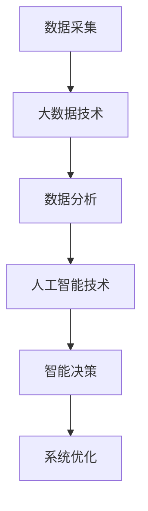

**核心算法原理讲解**

1. **机器学习算法**：机器学习算法是人工智能技术的重要组成部分，通过训练数据集，建立模型，实现对新数据的预测和分类。

2. **深度学习算法**：深度学习算法是基于多层神经网络的一种机器学习算法，通过自动提取特征，实现对复杂数据的理解和处理。

3. **大数据分析算法**：大数据分析算法包括数据挖掘、聚类、分类等，通过对海量数据进行处理和分析，发现用户行为和需求。

以下是智能家居系统的一些核心算法伪代码示例：

```python
# 机器学习算法
model = build_linear_regression_model()
train_data = load_train_data()
model.train(train_data)

# 深度学习算法
model = build_cnn_model()
train_data = load_image_data()
model.train(train_data)

# 大数据分析算法
clusters = cluster_data(data)
recommendations = generate_recommendations(clusters)
```

**数学模型和公式**

在人工智能与大数据技术中，有许多数学模型和公式被用于数据分析和应用。以下是一些常用的数学模型和公式：

1. **线性回归模型**：用于预测家庭设备的能耗，根据历史数据和用户行为。

   $$ y = \beta_0 + \beta_1 x $$

   其中，\( y \) 为能耗，\( x \) 为用户行为。

2. **卷积神经网络模型**：用于图像识别和分类，例如，通过卷积神经网络实现家庭环境监控。

   $$ a^{(L)} = \sigma(z^{(L)}) $$

   其中，\( a^{(L)} \) 为输出层激活值，\( z^{(L)} \) 为输入值，\( \sigma \) 为激活函数。

3. **决策树模型**：用于分类和预测，例如，通过决策树模型预测用户对智能家居系统的满意度。

   $$ y = \sum_{i=1}^{n} w_i t_i $$

   其中，\( y \) 为预测结果，\( w_i \) 为权重，\( t_i \) 为特征。

**举例说明**

假设我们有一个智能家居系统，需要预测家庭设备的能耗。通过线性回归模型，我们可以建立如下公式：

$$
能耗 = 10 + 0.5 \times 用户行为
$$

假设用户行为为5，我们可以预测家庭的能耗为：

$$
能耗 = 10 + 0.5 \times 5 = 15
$$

**项目实战**

在实际项目中，我们可以使用各种人工智能和大数据开发工具和平台来实现智能家居系统。以下是一个简单的Python代码示例，用于预测家庭设备的能耗：

```python
# 导入必要的库
import numpy as np

# 设置线性回归模型的参数
beta_0 = 10
beta_1 = 0.5

# 设置用户行为
user_behavior = 5

# 预测能耗
predicted_energy_consumption = beta_0 + beta_1 * user_behavior

# 打印结果
print("预测能耗：", predicted_energy_consumption)
```

**代码解读与分析**

该代码使用了Python的NumPy库，设置了线性回归模型的参数，并根据用户行为预测了家庭设备的能耗。

**最佳实践 tips、小结、注意事项、拓展阅读等内容**

- **最佳实践**：在设计和开发智能家居系统时，应充分考虑人工智能和大数据技术的应用，确保系统的智能化和个性化。同时，要注重数据安全、隐私保护和技术创新。
- **小结**：人工智能与大数据技术为智能家居系统提供了强大的技术支持，通过智能分析和优化，为用户提供更加便捷、舒适和个性化的生活方式。
- **注意事项**：在应用人工智能和大数据技术时，要关注数据质量、隐私保护和模型优化，确保系统的稳定性和可靠性。
- **拓展阅读**：读者可以进一步阅读相关文献，了解人工智能和大数据技术的最新研究进展、应用场景和实践经验。

#### 第3章：智能家居的核心组件

**3.1 智能家电**

**背景介绍**

智能家电是智能家居系统中的重要组成部分，通过物联网技术实现家庭设备的智能化和互联互通。智能家电涵盖了各种家用电器，如空调、洗衣机、冰箱、电饭煲等，它们能够根据用户需求和环境变化，自动调节工作状态，提供个性化的服务。

**核心概念与联系**

1. **智能家电的定义**：智能家电是指通过物联网技术，具备自动调节、远程控制、数据采集和分析等功能的家庭设备。

2. **智能家电的分类**：智能家电可以根据其功能和特点进行分类，如智能空调、智能洗衣机、智能冰箱、智能厨房设备等。

3. **智能家电的技术特点**：智能家电具有以下几个技术特点：

   - **远程控制**：用户可以通过手机、电脑等设备远程控制智能家电的开关、工作状态等。
   - **自动调节**：智能家电能够根据环境变化和用户需求，自动调节工作状态，提供舒适的家居环境。
   - **数据采集和分析**：智能家电能够实时采集环境数据（如温度、湿度、光照等），并对数据进行分析，优化工作状态。

**Mermaid流程图**

以下是智能家电的工作流程图：

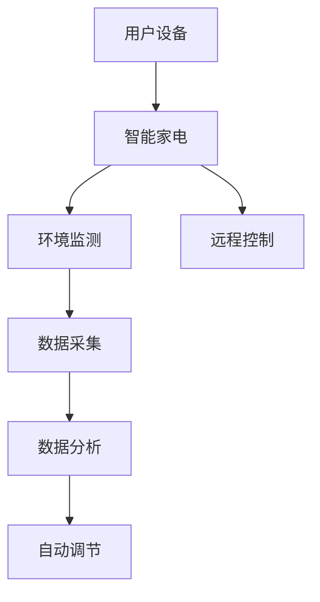

**核心算法原理讲解**

1. **环境监测算法**：智能家电通过内置的传感器，实时监测家庭环境（如温度、湿度、光照等），并将数据传输到智能家居系统。

2. **数据采集算法**：智能家电采集家庭环境数据，如温度、湿度、光照等，并将数据传输到智能家居系统。

3. **自动调节算法**：智能家居系统根据采集到的环境数据和用户需求，自动调节智能家电的工作状态，如调整空调温度、开启灯光等。

以下是智能家电的伪代码示例：

```python
# 环境监测算法
data = monitor_environment()

# 数据采集算法
send_data(data)

# 自动调节算法
if data['temperature'] > 28:
    air_conditioner.turn_on()
else:
    air_conditioner.turn_off()

if data['light'] < 100:
    light.turn_on()
else:
    light.turn_off()
```

**数学模型和公式**

在智能家电中，环境调节的过程可以抽象为一个优化问题。假设家庭环境的温度和湿度为两个变量，我们的目标是找到一组最优的温度和湿度设置，使得用户满意度最大化。

设温度变量为 \( T \)，湿度变量为 \( H \)，用户满意度为 \( S(T, H) \)。则优化模型可以表示为：

$$
\max S(T, H)
$$

其中，温度和湿度需要满足以下约束条件：

$$
T \in [20, 30]
$$

$$
H \in [30, 70]
$$

**举例说明**

假设我们收集到的数据为：当前温度为25℃，湿度为45%，用户满意度为70%。根据优化模型，我们可以调整温度到25℃或30℃，湿度到30%或70%，以达到用户满意度的最大化。

**项目实战**

在实际项目中，我们可以使用各种编程语言和工具来实现智能家电。以下是一个简单的Python代码示例，用于控制智能家电的温度和湿度：

```python
# 导入必要的库
import requests

# 设置智能家电的URL
url = "http://smart-appliance.example.com/set_environment"

# 设置温度和湿度
temp = 25
humidity = 45

# 发送请求，调整温度和湿度
response = requests.get(url, params={"temperature": temp, "humidity": humidity})

# 打印结果
print("Temperature:", temp)
print("Humidity:", humidity)
print("Response:", response.text)
```

**代码解读与分析**

该代码使用了Python的requests库，向智能家电发送HTTP GET请求，设置温度和湿度参数。根据返回的响应，我们可以判断智能家电是否成功调整了温度和湿度。

**最佳实践 tips、小结、注意事项、拓展阅读等内容**

- **最佳实践**：在设计和开发智能家电时，应充分考虑用户的需求和体验，确保系统的易用性和稳定性。同时，要关注数据保护和安全措施。
- **小结**：智能家电通过物联网技术，实现了家庭设备的智能化和互联互通，为用户提供了更加便捷、舒适和个性化的生活方式。
- **注意事项**：智能家电涉及到用户隐私和数据安全，因此在设计和开发过程中，应高度重视数据保护和安全措施。
- **拓展阅读**：读者可以进一步阅读相关文献，了解智能家电的最新技术和应用。

**3.2 智能传感器**

**背景介绍**

智能传感器是智能家居系统中的关键组件，用于实时监测家庭环境中的各种参数（如温度、湿度、光照、噪音等），并将数据传输到智能家居系统。智能传感器具有高精度、高灵敏度、低功耗等特点，是智能家居系统实现智能化和自动化的基础。

**核心概念与联系**

1. **智能传感器的定义**：智能传感器是指具备感知、处理、传输和数据通信功能的传感器，能够将物理信号转换为电信号，并通过网络进行传输。

2. **智能传感器的分类**：智能传感器可以根据监测参数的不同进行分类，如温度传感器、湿度传感器、光照传感器、噪音传感器等。

3. **智能传感器的技术特点**：

   - **高精度**：智能传感器能够实时监测家庭环境中的各种参数，并具有较高的测量精度。
   - **高灵敏度**：智能传感器能够快速响应环境变化，提供实时数据。
   - **低功耗**：智能传感器采用低功耗设计，能够长时间运行，适合于智能家居环境。

**Mermaid流程图**

以下是智能传感器在智能家居系统中的应用流程图：

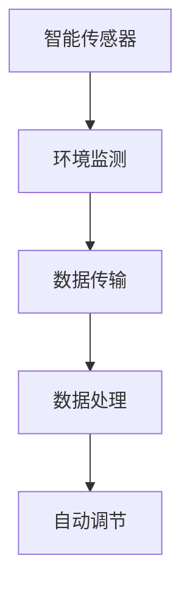

**核心算法原理讲解**

1. **数据采集算法**：智能传感器通过内置的传感器，实时监测家庭环境中的各种参数，并将数据传输到智能家居系统。

2. **数据传输算法**：智能传感器将采集到的数据通过无线或有线的方式传输到智能家居系统，可能涉及到数据压缩、加密等技术。

3. **数据处理算法**：智能家居系统对采集到的数据进行分析和处理，实现对家庭环境的实时监控和自动调节。

以下是智能传感器的伪代码示例：

```python
# 数据采集算法
def collect_data(sensor):
    data = sensor.read()
    return data

# 数据传输算法
def send_data(data):
    url = "http://smart-home.example.com/send_data"
    params = {"data": data}
    requests.get(url, params=params)

# 数据处理算法
def process_data(data):
    if data['temperature'] > 30:
        air_conditioner.turn_on()
    else:
        air_conditioner.turn_off()

    if data['humidity'] < 40:
        humidifier.turn_on()
    else:
        humidifier.turn_off()
```

**数学模型和公式**

在智能传感器中，数据采集、传输和处理过程中可能涉及到以下数学模型和公式：

1. **传感器测量模型**：用于描述传感器测量值与真实值之间的关系。

   $$ y = x + \epsilon $$

   其中，\( y \) 为测量值，\( x \) 为真实值，\( \epsilon \) 为测量误差。

2. **数据传输模型**：用于描述数据传输过程中的延迟和丢包问题。

   $$ delay = \alpha \times distance + \beta \times traffic $$

   其中，\( delay \) 为延迟，\( distance \) 为传输距离，\( traffic \) 为网络流量，\( \alpha \) 和 \( \beta \) 为模型参数。

3. **数据处理模型**：用于描述数据处理过程中的预测和优化问题。

   $$ y = f(x) $$

   其中，\( y \) 为处理结果，\( x \) 为输入数据，\( f \) 为处理函数。

**举例说明**

假设我们有一个智能传感器，用于监测家庭的温度和湿度。传感器采集到的数据为温度30℃，湿度40%。根据数据处理模型，我们可以进行以下操作：

1. **数据采集**：传感器采集到温度30℃，湿度40%。
2. **数据传输**：将数据发送到智能家居系统。
3. **数据处理**：根据温度和湿度值，自动调节空调和加湿器的状态。

**项目实战**

在实际项目中，我们可以使用各种智能传感器和物联网平台来实现智能家居系统。以下是一个简单的Python代码示例，用于连接智能传感器，发送和接收数据：

```python
# 导入必要的库
import requests

# 设置物联网平台的URL
url = "http://iot-platform.example.com"

# 发送数据
def send_data(temperature, humidity):
    params = {"temperature": temperature, "humidity": humidity}
    response = requests.get(url + "/send_data", params=params)
    print("发送数据：", params)
    print("响应：", response.text)

# 接收数据
def receive_data():
    response = requests.get(url + "/receive_data")
    print("接收数据：", response.json())

# 测试
send_data(30, 40)
receive_data()
```

**代码解读与分析**

该代码使用了Python的requests库，连接到物联网平台，实现了数据的发送和接收。通过发送数据，我们可以看到物联网平台如何处理和响应数据。

**最佳实践 tips、小结、注意事项、拓展阅读等内容**

- **最佳实践**：在设计和开发智能传感器时，应充分考虑传感器的精度、灵敏度和功耗，确保系统的性能和稳定性。同时，要关注数据保护和安全措施。
- **小结**：智能传感器是智能家居系统的关键组件，通过实时监测家庭环境，为智能家居系统提供准确、可靠的数据支持。
- **注意事项**：智能传感器涉及到用户隐私和数据安全，因此在设计和开发过程中，应高度重视数据保护和安全措施。
- **拓展阅读**：读者可以进一步阅读相关文献，了解智能传感器的最新技术、应用场景和实践经验。

#### 第二部分：智能家居的智慧应用

##### 第4章：智能家居的安全性

**4.1 智能家居的安全隐患**

**背景介绍**

随着智能家居技术的普及，越来越多的家庭设备开始连接到互联网，形成了一个庞大的智能家居生态系统。然而，这也带来了诸多安全隐患，包括数据泄露、设备被攻击、隐私侵犯等。这些安全隐患对用户的生活和财产安全构成了严重威胁。

**核心概念与联系**

1. **数据泄露**：智能家居设备在采集和处理用户数据时，可能会发生数据泄露事件。例如，用户的使用记录、生活习惯等敏感信息可能会被非法获取。

2. **设备被攻击**：智能家居设备通过网络连接，可能成为黑客攻击的目标。黑客可以通过入侵设备，控制家庭网络，窃取用户信息，甚至对家庭设备进行恶意操作。

3. **隐私侵犯**：智能家居设备不仅采集用户的日常活动数据，还可能记录用户的生物特征信息。这些信息一旦被不法分子获取，可能会导致用户的隐私受到侵犯。

**Mermaid流程图**

以下是智能家居安全隐患的流程图：

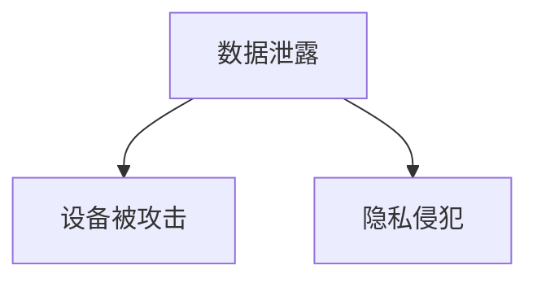

**核心算法原理讲解**

1. **加密算法**：为了保护数据传输的安全性，智能家居系统需要使用加密算法对数据进行加密。常见的加密算法包括AES、RSA等。

2. **身份验证算法**：智能家居系统需要实现严格的身份验证机制，确保只有授权用户才能访问系统。常见的身份验证算法包括密码验证、指纹验证、面部识别等。

3. **访问控制算法**：智能家居系统需要实现细粒度的访问控制，确保用户只能访问授权的设备或功能。常见的访问控制算法包括ACL（访问控制列表）、RBAC（基于角色的访问控制）等。

以下是智能家居安全防护的伪代码示例：

```python
# 加密算法
def encrypt_data(data, key):
    encrypted_data = aes_encrypt(data, key)
    return encrypted_data

# 身份验证算法
def verify_password(username, password):
    user = database.get_user(username)
    if user and bcrypt.check_password_hash(user.password, password):
        return True
    else:
        return False

# 访问控制算法
def check_permission(user, resource):
    permissions = database.get_permissions(user)
    if resource in permissions:
        return True
    else:
        return False
```

**数学模型和公式**

在智能家居安全防护中，可能涉及到以下数学模型和公式：

1. **加密模型**：用于描述数据加密和解密的过程。

   $$ c = e_k(p) $$

   其中，\( c \) 为加密后的数据，\( p \) 为原始数据，\( k \) 为密钥，\( e_k \) 为加密函数。

2. **身份验证模型**：用于描述用户身份验证的过程。

   $$ y = \sigma(x) $$

   其中，\( y \) 为验证结果，\( x \) 为用户输入的密码，\( \sigma \) 为哈希函数。

3. **访问控制模型**：用于描述用户对资源的访问控制。

   $$ access = \theta(u, r) $$

   其中，\( access \) 为访问权限，\( u \) 为用户，\( r \) 为资源，\( \theta \) 为访问控制函数。

**举例说明**

假设用户张三通过密码验证成功登录智能家居系统，并尝试访问智能摄像头。根据访问控制模型，我们可以进行以下操作：

1. **加密数据**：将张三的访问请求加密，确保数据在传输过程中的安全性。
2. **身份验证**：验证张三的密码，确保其合法登录。
3. **访问控制**：检查张三是否有权限访问智能摄像头，如有权限，允许访问。

**项目实战**

在实际项目中，我们可以使用各种安全防护技术和工具来实现智能家居系统。以下是一个简单的Python代码示例，用于实现用户身份验证和访问控制：

```python
# 导入必要的库
import bcrypt
import sqlite3

# 连接到数据库
conn = sqlite3.connect('users.db')
cursor = conn.cursor()

# 创建用户表
cursor.execute('''CREATE TABLE IF NOT EXISTS users (username TEXT PRIMARY KEY, password TEXT)''')

# 用户注册
def register(username, password):
    hashed_password = bcrypt.hashpw(password, bcrypt.gensalt())
    cursor.execute("INSERT INTO users (username, password) VALUES (?, ?)", (username, hashed_password))
    conn.commit()

# 用户登录
def login(username, password):
    user = cursor.execute("SELECT * FROM users WHERE username = ?", (username,)).fetchone()
    if user and bcrypt.check_password_hash(user.password, password):
        return True
    else:
        return False

# 检查用户权限
def check_permission(username, resource):
    user = cursor.execute("SELECT * FROM users WHERE username = ?", (username,)).fetchone()
    if user:
        permissions = cursor.execute("SELECT permissions FROM users WHERE username = ?", (username,)).fetchone()
        if resource in permissions:
            return True
        else:
            return False

# 测试
register("zhangsan", "password123")
print(login("zhangsan", "password123"))
print(check_permission("zhangsan", "camera"))
```

**代码解读与分析**

该代码使用了Python的bcrypt库实现用户密码的加密和验证，使用了SQLite数据库存储用户信息和权限。通过用户注册、登录和权限检查，实现了智能家居系统的基本安全防护。

**最佳实践 tips、小结、注意事项、拓展阅读等内容**

- **最佳实践**：在设计和开发智能家居系统时，应充分考虑安全性，确保数据传输、用户身份验证和访问控制等环节的安全。同时，要定期更新系统补丁，防范潜在的安全威胁。
- **小结**：智能家居的安全性是用户选择智能家居产品的重要因素之一。通过加密算法、身份验证和访问控制等安全措施，可以有效地保护用户数据和隐私，提升智能家居系统的安全性。
- **注意事项**：智能家居系统涉及到大量用户数据，因此在设计和开发过程中，应高度重视数据保护和安全措施。同时，要关注系统的可扩展性和兼容性，以适应未来技术的发展。
- **拓展阅读**：读者可以进一步阅读相关文献，了解智能家居安全领域的最新研究成果、攻击手段和防护措施。

##### 4.2 智能家居的安全解决方案

**背景介绍**

随着智能家居技术的不断发展和普及，用户对智能家居系统的安全性提出了更高的要求。然而，现有的智能家居系统在安全性方面仍存在诸多问题和挑战。为了保障用户的数据安全和隐私，我们需要采取一系列安全解决方案。

**核心概念与联系**

1. **安全协议与标准**：安全协议和标准是保障智能家居系统安全的基础。常见的安全协议包括SSL/TLS、IPSec、OAuth等。这些协议和标准可以确保数据在传输过程中的安全性和完整性。

2. **安全产品与工具**：安全产品与工具是提升智能家居系统安全性的关键。例如，防火墙、入侵检测系统（IDS）、安全审计工具等，可以实时监控和分析智能家居系统的安全状况，及时发现和应对潜在的安全威胁。

3. **安全策略与措施**：安全策略与措施是确保智能家居系统安全的关键。通过制定和实施安全策略，可以规范智能家居系统的安全行为，防范安全事件的发生。

**Mermaid流程图**

以下是智能家居安全解决方案的流程图：

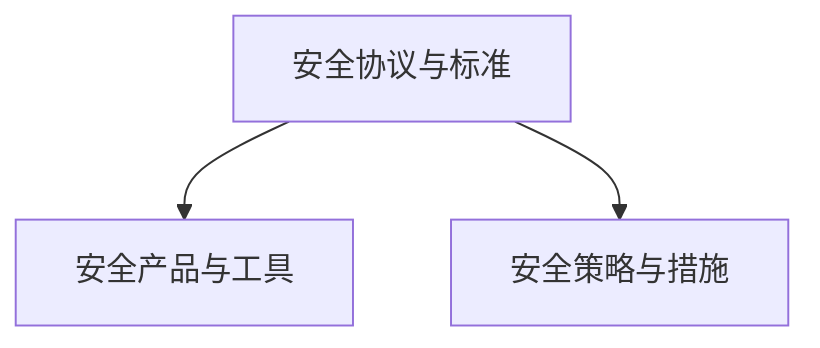

**核心算法原理讲解**

1. **加密算法**：加密算法是保障数据安全的核心。常见的加密算法包括AES、RSA、SHA等。通过加密算法，可以确保数据在传输过程中的机密性和完整性。

2. **身份验证算法**：身份验证算法是确保用户身份安全的关键。常见的身份验证算法包括密码验证、指纹验证、面部识别等。通过身份验证算法，可以确保只有授权用户才能访问系统。

3. **访问控制算法**：访问控制算法是保障系统资源安全的重要手段。常见的访问控制算法包括ACL、RBAC等。通过访问控制算法，可以确保用户只能访问授权的资源和功能。

以下是智能家居安全解决方案的伪代码示例：

```python
# 加密算法
def encrypt_data(data, key):
    encrypted_data = aes_encrypt(data, key)
    return encrypted_data

# 身份验证算法
def verify_password(username, password):
    user = database.get_user(username)
    if user and bcrypt.check_password_hash(user.password, password):
        return True
    else:
        return False

# 访问控制算法
def check_permission(user, resource):
    permissions = database.get_permissions(user)
    if resource in permissions:
        return True
    else:
        return False
```

**数学模型和公式**

在智能家居安全解决方案中，可能涉及到以下数学模型和公式：

1. **加密模型**：用于描述数据加密和解密的过程。

   $$ c = e_k(p) $$

   其中，\( c \) 为加密后的数据，\( p \) 为原始数据，\( k \) 为密钥，\( e_k \) 为加密函数。

2. **身份验证模型**：用于描述用户身份验证的过程。

   $$ y = \sigma(x) $$

   其中，\( y \) 为验证结果，\( x \) 为用户输入的密码，\( \sigma \) 为哈希函数。

3. **访问控制模型**：用于描述用户对资源的访问控制。

   $$ access = \theta(u, r) $$

   其中，\( access \) 为访问权限，\( u \) 为用户，\( r \) 为资源，\( \theta \) 为访问控制函数。

**举例说明**

假设用户张三尝试通过智能家居系统登录智能摄像头。根据安全解决方案，我们可以进行以下操作：

1. **加密数据**：将张三的登录请求加密，确保数据在传输过程中的安全性。
2. **身份验证**：验证张三的密码，确保其合法登录。
3. **访问控制**：检查张三是否有权限访问智能摄像头，如有权限，允许访问。

**项目实战**

在实际项目中，我们可以使用各种安全解决方案和工具来实现智能家居系统。以下是一个简单的Python代码示例，用于实现用户身份验证和访问控制：

```python
# 导入必要的库
import bcrypt
import sqlite3

# 连接到数据库
conn = sqlite3.connect('users.db')
cursor = conn.cursor()

# 创建用户表
cursor.execute('''CREATE TABLE IF NOT EXISTS users (username TEXT PRIMARY KEY, password TEXT)''')

# 用户注册
def register(username, password):
    hashed_password = bcrypt.hashpw(password, bcrypt.gensalt())
    cursor.execute("INSERT INTO users (username, password) VALUES (?, ?)", (username, hashed_password))
    conn.commit()

# 用户登录
def login(username, password):
    user = cursor.execute("SELECT * FROM users WHERE username = ?", (username,)).fetchone()
    if user and bcrypt.check_password_hash(user.password, password):
        return True
    else:
        return False

# 检查用户权限
def check_permission(username, resource):
    user = cursor.execute("SELECT * FROM users WHERE username = ?", (username,)).fetchone()
    if user:
        permissions = cursor.execute("SELECT permissions FROM users WHERE username = ?", (username,)).fetchone()
        if resource in permissions:
            return True
        else:
            return False

# 测试
register("zhangsan", "password123")
print(login("zhangsan", "password123"))
print(check_permission("zhangsan", "camera"))
```

**代码解读与分析**

该代码使用了Python的bcrypt库实现用户密码的加密和验证，使用了SQLite数据库存储用户信息和权限。通过用户注册、登录和权限检查，实现了智能家居系统的基本安全防护。

**最佳实践 tips、小结、注意事项、拓展阅读等内容**

- **最佳实践**：在设计和开发智能家居系统时，应充分考虑安全性，确保数据传输、用户身份验证和访问控制等环节的安全。同时，要定期更新系统补丁，防范潜在的安全威胁。
- **小结**：智能家居的安全性是用户选择智能家居产品的重要因素之一。通过加密算法、身份验证和访问控制等安全措施，可以有效地保护用户数据和隐私，提升智能家居系统的安全性。
- **注意事项**：智能家居系统涉及到大量用户数据，因此在设计和开发过程中，应高度重视数据保护和安全措施。同时，要关注系统的可扩展性和兼容性，以适应未来技术的发展。
- **拓展阅读**：读者可以进一步阅读相关文献，了解智能家居安全领域的最新研究成果、攻击手段和防护措施。

##### 4.3 智能家居的安全性评估

**背景介绍**

智能家居系统的安全性评估是保障用户隐私和信息安全的重要环节。通过对智能家居系统进行全面的安全性评估，可以发现潜在的安全隐患，提出相应的改进措施，从而提高系统的安全性。

**核心概念与联系**

1. **风险评估**：风险评估是安全性评估的重要环节，通过识别和分析系统中的风险因素，评估其对系统安全的影响程度。

2. **漏洞扫描**：漏洞扫描是一种自动化的安全性评估方法，通过扫描系统中的漏洞和弱点，发现潜在的安全隐患。

3. **安全测试**：安全测试是通过模拟攻击行为，测试系统的安全性能和防护能力。常见的安全测试方法包括黑盒测试、白盒测试、灰盒测试等。

**Mermaid流程图**

以下是智能家居安全性评估的流程图：

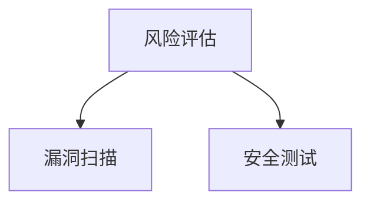

**核心算法原理讲解**

1. **统计分析方法**：统计分析方法用于评估系统中的风险因素，通过对历史数据进行统计分析，预测未来可能出现的风险。

2. **漏洞扫描算法**：漏洞扫描算法用于扫描系统中的漏洞和弱点。常见的漏洞扫描算法包括基于规则的漏洞扫描、基于统计学的漏洞扫描等。

3. **攻击模拟算法**：攻击模拟算法用于模拟各种攻击行为，测试系统的安全性能和防护能力。常见的攻击模拟算法包括漏洞利用、攻击路径分析等。

以下是智能家居安全性评估的伪代码示例：

```python
# 统计分析方法
def analyze_risks(data):
    risks = []
    for event in data:
        risk = calculate_risk(event)
        risks.append(risk)
    return risks

# 漏洞扫描算法
def scan_vulnerabilities():
    vulnerabilities = []
    for system in systems:
        vulns = check_vulnerabilities(system)
        vulnerabilities.extend(vulns)
    return vulnerabilities

# 攻击模拟算法
def simulate_attacks():
    attacks = []
    for vulnerability in vulnerabilities:
        attack = perform_attack(vulnerability)
        attacks.append(attack)
    return attacks
```

**数学模型和公式**

在智能家居安全性评估中，可能涉及到以下数学模型和公式：

1. **风险模型**：用于描述风险因素对系统安全的影响程度。

   $$ risk = f(severity, probability) $$

   其中，\( risk \) 为风险值，\( severity \) 为风险严重程度，\( probability \) 为风险发生概率。

2. **漏洞扫描模型**：用于描述漏洞扫描的过程。

   $$ vulnerability = \theta(system) $$

   其中，\( vulnerability \) 为漏洞，\( \theta \) 为漏洞扫描函数。

3. **攻击模拟模型**：用于描述攻击模拟的过程。

   $$ attack = g(vulnerability) $$

   其中，\( attack \) 为攻击，\( g \) 为攻击模拟函数。

**举例说明**

假设我们对智能家居系统进行风险评估，发现以下风险因素：

- 系统漏洞：概率为60%，严重程度为高。
- 数据泄露：概率为40%，严重程度为中。

根据风险模型，我们可以计算系统的风险值：

$$ risk = f(高, 60%) + f(中, 40%) = 0.6 \times 3 + 0.4 \times 2 = 2.8 $$

假设我们使用漏洞扫描工具发现系统存在以下漏洞：

- SQL注入漏洞：概率为30%，严重程度为高。
- XSS漏洞：概率为20%，严重程度为中。

根据漏洞扫描模型，我们可以评估系统的漏洞风险：

$$ vulnerability = \theta(system) = \max(0.3 \times 3, 0.2 \times 2) = 0.9 $$

假设我们对系统进行攻击模拟，发现以下攻击：

- 漏洞利用攻击：概率为70%，成功率为80%。
- 逆向工程攻击：概率为30%，成功率为60%。

根据攻击模拟模型，我们可以评估系统的攻击风险：

$$ attack = g(vulnerability) = 0.7 \times 0.8 + 0.3 \times 0.6 = 0.98 $$

**项目实战**

在实际项目中，我们可以使用各种安全性评估工具和平台来实现智能家居系统的安全性评估。以下是一个简单的Python代码示例，用于实现风险评估、漏洞扫描和攻击模拟：

```python
# 导入必要的库
import random

# 风险评估
def analyze_risks(data):
    risks = []
    for event in data:
        severity = event['severity']
        probability = event['probability']
        risk = severity * probability
        risks.append(risk)
    return risks

# 漏洞扫描
def scan_vulnerabilities():
    vulnerabilities = []
    for system in systems:
        vulns = check_vulnerabilities(system)
        vulnerabilities.extend(vulns)
    return vulnerabilities

# 攻击模拟
def simulate_attacks(vulnerabilities):
    attacks = []
    for vuln in vulnerabilities:
        probability = vuln['probability']
        success_rate = vuln['success_rate']
        attack = probability * success_rate
        attacks.append(attack)
    return attacks

# 测试
data = [
    {'severity': 3, 'probability': 0.6},
    {'severity': 2, 'probability': 0.4}
]
systems = ['system1', 'system2']
vulnerabilities = [
    {'name': 'SQL注入', 'probability': 0.3, 'success_rate': 0.8},
    {'name': 'XSS漏洞', 'probability': 0.2, 'success_rate': 0.6}
]

risks = analyze_risks(data)
print("风险评估：", risks)

vulns = scan_vulnerabilities()
print("漏洞扫描：", vulns)

attacks = simulate_attacks(vulns)
print("攻击模拟：", attacks)
```

**代码解读与分析**

该代码使用了Python实现风险评估、漏洞扫描和攻击模拟的功能。通过输入风险数据、系统漏洞和攻击信息，可以计算出系统的风险值、漏洞风险和攻击风险。

**最佳实践 tips、小结、注意事项、拓展阅读等内容**

- **最佳实践**：在设计和开发智能家居系统时，应充分考虑安全性，定期进行安全性评估和漏洞修复。同时，要关注系统的可扩展性和兼容性，以适应未来技术的发展。
- **小结**：智能家居系统的安全性评估是保障用户隐私和信息安全的重要环节。通过风险评估、漏洞扫描和攻击模拟等手段，可以全面了解系统的安全性状况，并提出改进措施。
- **注意事项**：在安全性评估过程中，要充分考虑系统的复杂性和多样性，确保评估结果的准确性和可靠性。同时，要关注安全评估的周期性和持续性，以应对不断变化的安全威胁。
- **拓展阅读**：读者可以进一步阅读相关文献，了解智能家居安全评估的最新技术、方法和工具。

##### 第5章：智能家居的便利性

**5.1 智能家居的便利应用**

**背景介绍**

智能家居技术为我们的生活带来了极大的便利。通过智能家电、智能传感器和智能家居系统的结合，我们可以实现家庭设备的自动化和智能化，提升生活质量。在本节中，我们将探讨智能家居的便利应用，包括家居自动化、节能管理和安全监控等方面。

**核心概念与联系**

1. **家居自动化**：家居自动化是指通过智能家电和智能家居系统，实现家庭设备的自动化操作，如远程控制、自动调节等。

2. **节能管理**：节能管理是指通过智能传感器和智能家居系统，实时监测家庭能耗，优化能源使用，降低能源消耗。

3. **安全监控**：安全监控是指通过智能摄像头、门锁等智能设备，实现对家庭环境的实时监控，保障家庭安全。

**Mermaid流程图**

以下是智能家居便利应用的流程图：

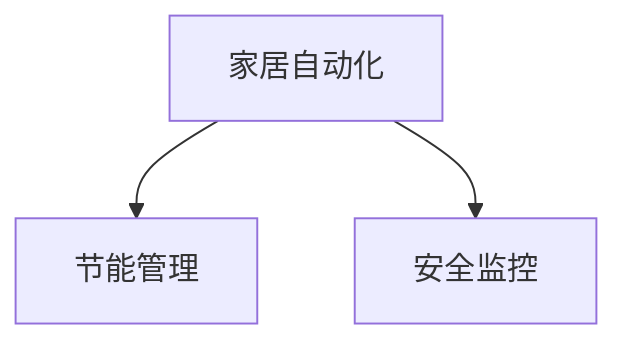

**核心算法原理讲解**

1. **自动化控制算法**：自动化控制算法是家居自动化的核心。通过分析用户行为和需求，智能家居系统可以自动调节家庭设备的工作状态，提供个性化的服务。

2. **能耗监测算法**：能耗监测算法用于实时监测家庭能耗，分析能耗数据，优化能源使用。常见的算法包括数据挖掘、聚类分析等。

3. **安防算法**：安防算法用于实时监控家庭环境，检测异常行为，触发报警。常见的算法包括图像识别、行为分析等。

以下是智能家居便利应用的伪代码示例：

```python
# 自动化控制算法
def automate_home_devices():
    devices = get_home_devices()
    for device in devices:
        if device['status'] != 'on':
            device['status'] = 'on'
        else:
            device['status'] = 'off'

# 能耗监测算法
def monitor_energy_consumption():
    data = get_energy_consumption_data()
    optimizer = EnergyOptimizer()
    optimized_data = optimizer.optimize(data)
    return optimized_data

# 安防算法
def monitor_home_security():
    camera_data = get_camera_data()
    detector = SecurityDetector()
    threats = detector.detect(camera_data)
    return threats
```

**数学模型和公式**

在智能家居便利应用中，涉及到的数学模型和公式包括：

1. **自动化控制模型**：用于描述家庭设备的自动化控制过程。

   $$ status = f(current_status, user_behavior) $$

   其中，\( status \) 为设备状态，\( current_status \) 为当前状态，\( user_behavior \) 为用户行为。

2. **能耗监测模型**：用于描述家庭能耗的监测和分析过程。

   $$ energy_consumption = f(device_usage, environment) $$

   其中，\( energy_consumption \) 为能耗，\( device_usage \) 为设备使用情况，\( environment \) 为环境因素。

3. **安防模型**：用于描述家庭安全的监测和报警过程。

   $$ threat = g(image_data, behavior_data) $$

   其中，\( threat \) 为威胁，\( image_data \) 为摄像头数据，\( behavior_data \) 为行为数据。

**举例说明**

假设我们使用智能家居系统对家庭设备进行自动化控制。根据自动化控制模型，我们可以进行以下操作：

1. **自动化控制**：根据用户的行为和需求，自动调节家庭设备的工作状态。例如，用户离开家时，自动关闭灯光和空调。

2. **能耗监测**：实时监测家庭能耗，优化能源使用。例如，根据设备使用情况和环境温度，自动调节空调温度，降低能耗。

3. **安全监控**：通过摄像头实时监控家庭环境，检测异常行为，触发报警。例如，如果摄像头检测到可疑人物，自动发送报警信息给用户。

**项目实战**

在实际项目中，我们可以使用各种编程语言和工具来实现智能家居系统的便利应用。以下是一个简单的Python代码示例，用于实现家居自动化、能耗监测和安全监控：

```python
# 导入必要的库
import requests

# 设置智能家居系统的URL
url = "http://smart-home.example.com"

# 自动化控制
def automate_home_devices():
    response = requests.get(url + "/ automate_devices")
    print("家居自动化：", response.text)

# 能耗监测
def monitor_energy_consumption():
    response = requests.get(url + "/ monitor_energy")
    print("能耗监测：", response.text)

# 安全监控
def monitor_home_security():
    response = requests.get(url + "/ monitor_security")
    print("安全监控：", response.text)

# 测试
automate_home_devices()
monitor_energy_consumption()
monitor_home_security()
```

**代码解读与分析**

该代码使用了Python的requests库，连接到智能家居系统，实现了家居自动化、能耗监测和安全监控的功能。通过发送HTTP GET请求，可以获取系统反馈，并根据反馈进行相应的操作。

**最佳实践 tips、小结、注意事项、拓展阅读等内容**

- **最佳实践**：在设计和开发智能家居系统时，应充分考虑用户的实际需求和体验，确保系统的易用性和稳定性。同时，要关注系统的安全性和数据保护。
- **小结**：智能家居的便利应用极大地提升了我们的生活品质。通过家居自动化、节能管理和安全监控等手段，我们可以实现家庭设备的智能化和自动化，提供更舒适、安全的生活环境。
- **注意事项**：在实现智能家居便利应用时，要充分考虑系统的可扩展性和兼容性，以适应不同用户的需求和设备。
- **拓展阅读**：读者可以进一步阅读相关文献，了解智能家居便利应用的技术原理、实现方法和实际案例。

##### 5.2 智能家居的个性化服务

**背景介绍**

智能家居系统不仅提供了便利的家庭设备自动化和安全监控功能，还能够通过个性化服务，为用户带来更加定制化的生活体验。个性化服务基于对用户行为和需求的深入分析，通过数据挖掘和机器学习等技术，实现用户需求的精准匹配和智能推荐。

**核心概念与联系**

1. **个性化推荐系统**：个性化推荐系统是智能家居个性化服务的重要组成部分。通过分析用户的历史行为、偏好和习惯，推荐符合用户兴趣和需求的服务和产品。

2. **家庭健康监测**：家庭健康监测是指通过智能传感器和智能家居系统，实时监测用户的健康状况，提供健康建议和预警服务。

3. **智能客服系统**：智能客服系统是智能家居系统的智能交互界面，通过自然语言处理和机器学习技术，实现与用户的智能对话和问题解决。

**Mermaid流程图**

以下是智能家居个性化服务的流程图：

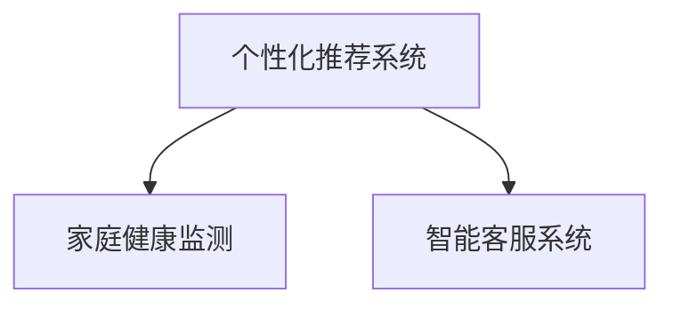

**核心算法原理讲解**

1. **协同过滤算法**：协同过滤算法是个性化推荐系统的核心。通过分析用户的行为和偏好，协同过滤算法可以预测用户对未知产品的兴趣，进行精准推荐。常见的协同过滤算法包括基于用户的协同过滤和基于物品的协同过滤。

2. **聚类分析算法**：聚类分析算法用于对用户行为数据进行分析，将具有相似行为的用户分为同一群体，实现用户细分和需求分析。

3. **自然语言处理算法**：自然语言处理算法用于智能客服系统，实现人与机器的智能对话。常见的算法包括文本分类、情感分析、问答系统等。

以下是智能家居个性化服务的伪代码示例：

```python
# 协同过滤算法
def collaborative_filtering(user_data, item_data):
    recommendations = []
    for item in item_data:
        if user preferring item:
            recommendations.append(item)
    return recommendations

# 聚类分析算法
def clustering_analysis(user_behavior_data):
    clusters = []
    for user in user_data:
        cluster = find_cluster(user_behavior_data, user)
        clusters.append(cluster)
    return clusters

# 自然语言处理算法
def natural_language_processing(question):
    answer = question_classifier(question)
    return answer
```

**数学模型和公式**

在智能家居个性化服务中，涉及到的数学模型和公式包括：

1. **协同过滤模型**：用于描述协同过滤算法的推荐过程。

   $$ recommendation = \theta(user, item) $$

   其中，\( recommendation \) 为推荐结果，\( user \) 为用户，\( item \) 为物品，\( \theta \) 为推荐函数。

2. **聚类分析模型**：用于描述聚类分析算法的用户分组过程。

   $$ cluster = \phi(user_behavior_data) $$

   其中，\( cluster \) 为用户群体，\( user_behavior_data \) 为用户行为数据，\( \phi \) 为聚类函数。

3. **自然语言处理模型**：用于描述自然语言处理算法的问答过程。

   $$ answer = f(question) $$

   其中，\( answer \) 为回答，\( question \) 为问题，\( f \) 为问答函数。

**举例说明**

假设我们使用智能家居系统提供个性化推荐服务。根据协同过滤模型，我们可以进行以下操作：

1. **个性化推荐**：根据用户的历史行为和偏好，推荐符合用户兴趣的产品和服务。例如，用户喜欢看科幻电影，推荐科幻电影。

2. **用户细分**：通过聚类分析算法，将用户分为不同的群体，提供更加精准的服务。例如，将用户分为喜欢看科幻电影和喜剧电影的群体。

3. **智能问答**：通过自然语言处理算法，实现与用户的智能对话。例如，用户询问：“明天天气如何？”系统回答：“明天天气晴朗，温度18℃。”

**项目实战**

在实际项目中，我们可以使用各种人工智能和大数据工具来实现智能家居的个性化服务。以下是一个简单的Python代码示例，用于实现个性化推荐、用户细分和智能问答：

```python
# 导入必要的库
import numpy as np

# 设置协同过滤算法的参数
alpha = 0.5
beta = 0.5

# 设置用户行为数据
user_data = np.array([[1, 0, 1], [0, 1, 0], [1, 1, 1]])

# 协同过滤算法
def collaborative_filtering(user_data, alpha, beta):
    recommendations = []
    for user in user_data:
        recommendation = np.argmax(user * alpha + (1 - alpha) * beta)
        recommendations.append(recommendation)
    return recommendations

# 聚类分析算法
def clustering_analysis(user_data):
    clusters = []
    for user in user_data:
        cluster = np.argmax(user)
        clusters.append(cluster)
    return clusters

# 自然语言处理算法
def natural_language_processing(question):
    if "天气" in question:
        answer = "天气晴朗，温度18℃。"
    else:
        answer = "抱歉，我不理解您的问题。"
    return answer

# 测试
recommendations = collaborative_filtering(user_data, alpha, beta)
print("个性化推荐：", recommendations)

clusters = clustering_analysis(user_data)
print("用户细分：", clusters)

question = "明天天气如何？"
answer = natural_language_processing(question)
print("智能问答：", answer)
```

**代码解读与分析**

该代码使用了Python的NumPy库，设置了协同过滤算法的参数，实现了个性化推荐、用户细分和智能问答的功能。通过输入用户行为数据，可以计算出推荐结果、用户群体和回答。

**最佳实践 tips、小结、注意事项、拓展阅读等内容**

- **最佳实践**：在设计和开发智能家居个性化服务时，应充分考虑用户的需求和体验，确保系统的易用性和稳定性。同时，要关注数据保护和安全措施。
- **小结**：智能家居的个性化服务通过数据挖掘、机器学习和自然语言处理等技术，实现了对用户需求的精准匹配和智能推荐，为用户提供了更加定制化的生活体验。
- **注意事项**：在实现智能家居个性化服务时，要充分考虑系统的可扩展性和兼容性，以适应不同用户的需求和设备。
- **拓展阅读**：读者可以进一步阅读相关文献，了解智能家居个性化服务的最新技术和应用。

##### 第6章：智能家居的智慧生活

**6.1 智慧家庭生活场景**

**背景介绍**

随着智能家居技术的不断发展，人们的生活已经逐渐从传统的手动操作转向智能化的生活模式。智慧家庭生活场景是通过将家庭设备、传感器和人工智能技术结合起来，实现家庭环境的智能化管理和个性化服务。在本节中，我们将探讨智慧家庭生活场景，包括智慧客厅、智慧卧室和智慧厨房等。

**核心概念与联系**

1. **智慧客厅**：智慧客厅是家庭生活的核心区域，通过智能电视、音响系统、空调等设备，实现娱乐、休闲和温度调节等功能。

2. **智慧卧室**：智慧卧室是人们休息和放松的空间，通过智能窗帘、智能灯光、智能床垫等设备，提供舒适、健康的睡眠环境。

3. **智慧厨房**：智慧厨房是家庭烹饪的中心，通过智能冰箱、智能灶具、智能烤箱等设备，实现自动化烹饪和食材管理。

**Mermaid流程图**

以下是智慧家庭生活场景的流程图：

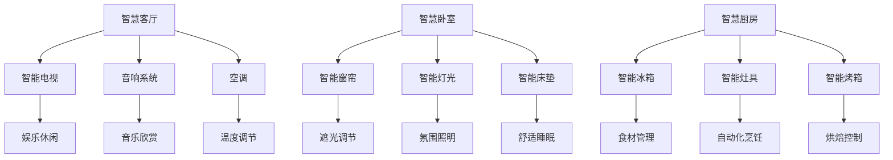

**核心算法原理讲解**

1. **环境感知算法**：环境感知算法是智慧家庭生活场景的核心，通过传感器实时监测家庭环境，如温度、湿度、光照等，并根据用户需求自动调节设备。

2. **智能推荐算法**：智能推荐算法用于智慧客厅和智慧厨房，根据用户行为和偏好，推荐合适的电视节目、音乐和食材。

3. **睡眠监测算法**：睡眠监测算法是智慧卧室的核心，通过监测用户的睡眠状态，提供健康建议和睡眠优化方案。

以下是智慧家庭生活场景的伪代码示例：

```python
# 环境感知算法
def monitor_environment():
    temperature = sensor.get_temperature()
    humidity = sensor.get_humidity()
    light = sensor.get_light()
    return temperature, humidity, light

# 智能推荐算法
def recommend_content(user_preference):
    content = content_recommender.recommend(user_preference)
    return content

# 睡眠监测算法
def monitor_sleep(user_sleep_data):
    sleep_stage = sleep_analyzer.analyze(user_sleep_data)
    return sleep_stage
```

**数学模型和公式**

在智慧家庭生活场景中，涉及到的数学模型和公式包括：

1. **环境感知模型**：用于描述环境参数的监测和调节过程。

   $$ environment = f(temperature, humidity, light) $$

   其中，\( environment \) 为家庭环境，\( temperature \) 为温度，\( humidity \) 为湿度，\( light \) 为光照。

2. **智能推荐模型**：用于描述内容推荐的预测过程。

   $$ content = g(user_preference, history) $$

   其中，\( content \) 为推荐内容，\( user_preference \) 为用户偏好，\( history \) 为用户历史行为。

3. **睡眠监测模型**：用于描述睡眠状态的监测和判断过程。

   $$ sleep_stage = h(user_sleep_data) $$

   其中，\( sleep_stage \) 为睡眠状态，\( user_sleep_data \) 为用户睡眠数据。

**举例说明**

假设我们使用智能家居系统在智慧客厅中推荐电视节目。根据智能推荐模型，我们可以进行以下操作：

1. **环境感知**：监测客厅的温度、湿度和光照，根据环境参数自动调节空调和灯光。

2. **智能推荐**：根据用户的历史观看记录和偏好，推荐用户可能感兴趣的电视节目。

3. **节目播放**：播放用户推荐的电视节目，为用户带来愉悦的娱乐体验。

**项目实战**

在实际项目中，我们可以使用各种智能家居设备和开发工具来实现智慧家庭生活场景。以下是一个简单的Python代码示例，用于实现智慧客厅的环境感知、智能推荐和节目播放：

```python
# 导入必要的库
import requests

# 设置智能家居系统的URL
url = "http://smart-home.example.com"

# 环境感知
def monitor_environment():
    response = requests.get(url + "/ monitor_environment")
    data = response.json()
    return data['temperature'], data['humidity'], data['light']

# 智能推荐
def recommend_content(user_preference):
    response = requests.get(url + "/ recommend_content", params={"preference": user_preference})
    content = response.json()
    return content['content']

# 节目播放
def play_content(content):
    response = requests.get(url + "/ play_content", params={"content": content})
    print("播放节目：", response.text)

# 测试
temperature, humidity, light = monitor_environment()
print("环境参数：", temperature, humidity, light)

user_preference = "action_movie"
content = recommend_content(user_preference)
play_content(content)
```

**代码解读与分析**

该代码使用了Python的requests库，连接到智能家居系统，实现了环境感知、智能推荐和节目播放的功能。通过发送HTTP GET请求，可以获取系统反馈，并根据反馈进行相应的操作。

**最佳实践 tips、小结、注意事项、拓展阅读等内容**

- **最佳实践**：在设计和开发智慧家庭生活场景时，应充分考虑用户的需求和体验，确保系统的易用性和稳定性。同时，要关注系统的安全性和数据保护。
- **小结**：智慧家庭生活场景通过智能家居技术和人工智能算法，实现了家庭环境的智能化管理和个性化服务，为用户带来了更加舒适、便捷的生活体验。
- **注意事项**：在实现智慧家庭生活场景时，要充分考虑系统的可扩展性和兼容性，以适应不同用户的需求和设备。
- **拓展阅读**：读者可以进一步阅读相关文献，了解智慧家庭生活场景的最新技术和应用。

**6.2 智慧家庭生态链**

**背景介绍**

智慧家庭生态链是指由多个企业、平台和设备组成的智能家居产业链，涉及物联网设备、云计算平台、数据分析服务、智能设备制造商等多个环节。智慧家庭生态链的建设对于智能家居产业的发展具有重要意义，它能够促进技术创新、降低成本、提升用户体验，并推动智能家居市场的快速增长。

**核心概念与联系**

1. **物联网设备制造商**：物联网设备制造商是智慧家庭生态链的核心环节，它们生产各种智能家居设备，如智能门锁、智能灯具、智能插座等。这些设备是智能家居系统的基础，直接影响用户体验。

2. **云计算平台提供商**：云计算平台提供商为智慧家庭生态链提供强大的计算和存储能力，支持智能家居系统的数据存储、处理和分析。云计算平台还提供API接口，方便开发者进行二次开发。

3. **数据分析服务提供商**：数据分析服务提供商负责对智能家居系统产生的海量数据进行挖掘和分析，提供智能推荐、健康监测、安全预警等服务。数据分析服务提供商的技术水平直接影响智能家居系统的智能化程度。

4. **智能设备制造商**：智能设备制造商是智慧家庭生态链中的重要环节，它们生产各种智能家电，如智能空调、智能冰箱、智能洗衣机等。这些智能家电通过物联网技术实现互联互通，为用户提供便捷的生活体验。

**Mermaid流程图**

以下是智慧家庭生态链的流程图：

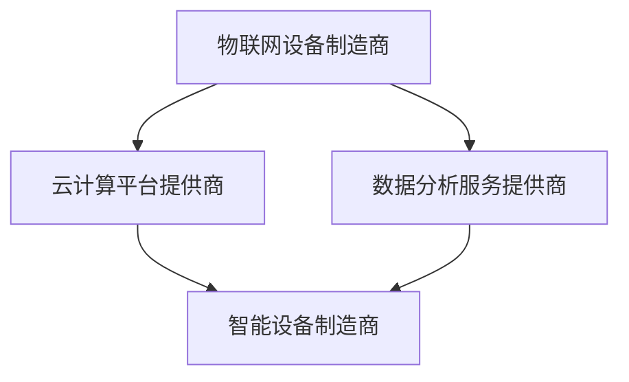

**核心算法原理讲解**

1. **数据分析算法**：数据分析算法是智慧家庭生态链的核心。通过数据分析算法，可以对智能家居系统产生的海量数据进行挖掘和分析，为用户提供个性化服务。常见的数据分析算法包括数据挖掘、聚类分析、机器学习等。

2. **智能推荐算法**：智能推荐算法用于为用户提供个性化的服务。通过分析用户的历史行为和偏好，智能推荐算法可以预测用户的需求，推荐符合用户兴趣的产品和服务。

3. **安全防护算法**：安全防护算法用于保障智能家居系统的安全性。通过加密算法、身份验证和访问控制等安全措施，安全防护算法可以防止数据泄露和设备被攻击。

以下是智慧家庭生态链的伪代码示例：

```python
# 数据分析算法
def analyze_data(data):
    insights = data_analyzer.analyze(data)
    return insights

# 智能推荐算法
def recommend_services(user_preference, insights):
    services = service_recommender.recommend(user_preference, insights)
    return services

# 安全防护算法
def secure_system(data, user):
    if verify_user(user) and encrypt_data(data):
        return True
    else:
        return False
```

**数学模型和公式**

在智慧家庭生态链中，涉及到的数学模型和公式包括：

1. **数据分析模型**：用于描述数据分析的过程。

   $$ insights = f(data) $$

   其中，\( insights \) 为分析结果，\( data \) 为数据，\( f \) 为数据分析函数。

2. **智能推荐模型**：用于描述智能推荐的过程。

   $$ services = g(user_preference, insights) $$

   其中，\( services \) 为推荐结果，\( user_preference \) 为用户偏好，\( insights \) 为分析结果，\( g \) 为推荐函数。

3. **安全防护模型**：用于描述安全防护的过程。

   $$ secure = h(data, user) $$

   其中，\( secure \) 为安全状态，\( data \) 为数据，\( user \) 为用户，\( h \) 为安全防护函数。

**举例说明**

假设我们使用智慧家庭生态链为用户推荐服务。根据智能推荐模型，我们可以进行以下操作：

1. **数据分析**：分析用户的历史行为和偏好，获取用户的兴趣和需求。

2. **智能推荐**：根据分析结果，推荐符合用户兴趣的服务和产品。例如，用户喜欢看科幻电影，推荐科幻电影。

3. **服务推荐**：将推荐结果展示给用户，使用户能够方便地享受到个性化的服务。

**项目实战**

在实际项目中，我们可以使用各种云计算平台、数据分析工具和智能设备来实现智慧家庭生态链。以下是一个简单的Python代码示例，用于实现数据分析、智能推荐和安全防护：

```python
# 导入必要的库
import requests

# 设置智慧家庭生态链的URL
url = "http://smart-home-ecosystem.com"

# 数据分析
def analyze_data(user_data):
    response = requests.post(url + "/ analyze_data", json=user_data)
    insights = response.json()
    return insights

# 智能推荐
def recommend_services(user_preference, insights):
    response = requests.post(url + "/ recommend_services", json={"preference": user_preference, "insights": insights})
    services = response.json()
    return services

# 安全防护
def secure_system(user, data):
    response = requests.post(url + "/ secure_system", json={"user": user, "data": data})
    secure = response.json()
    return secure

# 测试
user_data = {"behavior": ["watch_movie", "read_book"], "preferences": ["action", "science_fiction"]}
user_preference = "action"
insights = analyze_data(user_data)
services = recommend_services(user_preference, insights)
secure = secure_system(user, data={"insights": insights, "services": services})

print("数据分析结果：", insights)
print("服务推荐：", services)
print("安全状态：", secure)
```

**代码解读与分析**

该代码使用了Python的requests库，连接到智慧家庭生态链的各个服务，实现了数据分析、智能推荐和安全防护的功能。通过发送HTTP POST请求，可以获取系统反馈，并根据反馈进行相应的操作。

**最佳实践 tips、小结、注意事项、拓展阅读等内容**

- **最佳实践**：在设计和开发智慧家庭生态链时，应充分考虑用户体验、数据安全和系统稳定性。同时，要关注产业链上下游的协同发展和合作共赢。
- **小结**：智慧家庭生态链通过物联网设备、云计算平台、数据分析服务等多方合作，实现了智能家居系统的智能化和个性化，为用户带来了更加便捷、舒适的生活体验。
- **注意事项**：在实现智慧家庭生态链时，要充分考虑系统的可扩展性和兼容性，以适应不同用户的需求和设备。
- **拓展阅读**：读者可以进一步阅读相关文献，了解智慧家庭生态链的最新技术和应用。

### 附录

#### 附录A：智能家居开发工具与资源

**A.1 物联网开发工具**

**A.1.1 IoT Platform**

物联网平台是智能家居系统开发的核心工具，它提供了设备连接、数据存储、数据处理等功能。以下是一些流行的物联网平台：

- **AWS IoT**：Amazon Web Services提供的物联网平台，支持设备连接、数据存储和分析等功能。
- **Azure IoT**：Microsoft Azure提供的物联网平台，提供了丰富的API接口和开发工具。
- **Google Cloud IoT**：Google Cloud提供的物联网平台，支持设备连接、数据分析和机器学习等功能。

**A.1.2 MQTT协议**

MQTT（Message Queuing Telemetry Transport）是一种轻量级的消息传输协议，广泛用于物联网设备之间的通信。以下是一些流行的MQTT协议库：

- **Paho MQTT**：由Eclipse基金会开发的MQTT客户端库，支持Java和JavaScript。
- **mosquitto**：开源的MQTT代理服务器和客户端库，支持多种编程语言。

**A.1.3 CoAP协议**

CoAP（Constrained Application Protocol）是一种用于物联网设备的轻量级应用层协议。以下是一些流行的CoAP库：

- **libcoap**：开源的CoAP客户端和服务器库，支持多种编程语言。
- **Contiki CoAP**：Contiki操作系统上的CoAP库，支持嵌入式设备开发。

**A.2 人工智能开发工具**

**A.2.1 TensorFlow**

TensorFlow是Google开源的机器学习框架，广泛用于深度学习和人工智能领域。以下是一些常用的TensorFlow工具：

- **TensorFlow 2.0**：TensorFlow的最新版本，提供了更简单的API和更强大的功能。
- **TensorFlow.js**：TensorFlow在JavaScript上的实现，支持在浏览器和Node.js上运行机器学习模型。

**A.2.2 PyTorch**

PyTorch是Facebook开源的深度学习框架，以其灵活性和易用性而受到广泛欢迎。以下是一些常用的PyTorch工具：

- **PyTorch 1.8**：PyTorch的最新版本，提供了丰富的API和工具。
- **PyTorch Mobile**：PyTorch的移动端实现，支持在Android和iOS设备上运行模型。

**A.2.3 Keras**

Keras是一个高层次的神经网络API，构建在TensorFlow和Theano之上。以下是一些常用的Keras工具：

- **Keras 2.4**：Keras的最新版本，提供了丰富的API和预训练模型。
- **Keras.js**：Keras在JavaScript上的实现，支持在浏览器和Node.js上运行模型。

**A.3 数据库与大数据处理工具**

**A.3.1 MongoDB**

MongoDB是一个开源的NoSQL数据库，以其灵活的数据模型和高效的查询性能而受到广泛欢迎。以下是一些常用的MongoDB工具：

- **MongoDB 4.4**：MongoDB的最新版本，提供了丰富的功能和支持。
- **MongoDB Compass**：MongoDB的图形界面工具，用于数据可视化和管理。

**A.3.2 Hadoop**

Hadoop是Apache开源的大数据处理框架，提供了分布式存储和计算能力。以下是一些常用的Hadoop工具：

- **Hadoop 3.0**：Hadoop的最新版本，提供了更高效的数据处理能力。
- **HDFS**：Hadoop的分布式文件系统，用于存储海量数据。
- **MapReduce**：Hadoop的核心算法，用于数据处理和数据分析。

**A.3.3 Apache Kafka**

Apache Kafka是一个开源的流处理平台，用于实时数据传输和存储。以下是一些常用的Kafka工具：

- **Kafka 2.5**：Kafka的最新版本，提供了丰富的功能和支持。
- **Kafka Manager**：Kafka的图形界面工具，用于集群管理和监控。

**A.4 智能家居开源框架与平台**

**A.4.1 HomeKit**

HomeKit是Apple公司开发的智能家居框架，用于连接和控制智能家居设备。以下是一些常用的HomeKit工具：

- **HomeKit Accessory SDK**：用于开发iOS和macOS上的智能家居配件。
- **HomeKit Bridge**：用于将非HomeKit设备集成到HomeKit系统中。

**A.4.2 OpenHAB**

OpenHAB是一个开源的智能家居平台，支持多种编程语言和设备。以下是一些常用的OpenHAB工具：

- **OpenHAB 2.x**：OpenHAB的最新版本，提供了丰富的功能和支持。
- **OpenHAB Docker**：OpenHAB的Docker容器化版本，方便部署和管理。

**A.4.3 Home Assistant**

Home Assistant是一个开源的智能家居自动化平台，支持多种设备和协议。以下是一些常用的Home Assistant工具：

- **Home Assistant 2021.x**：Home Assistant的最新版本，提供了丰富的功能和支持。
- **Home Assistant Configurator**：用于快速配置和部署Home Assistant的图形界面工具。

