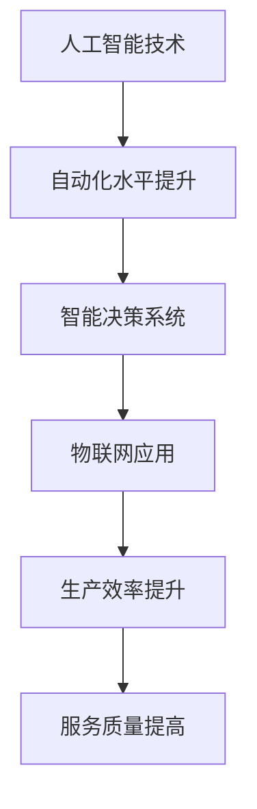
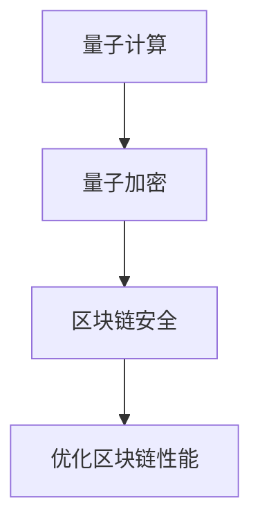
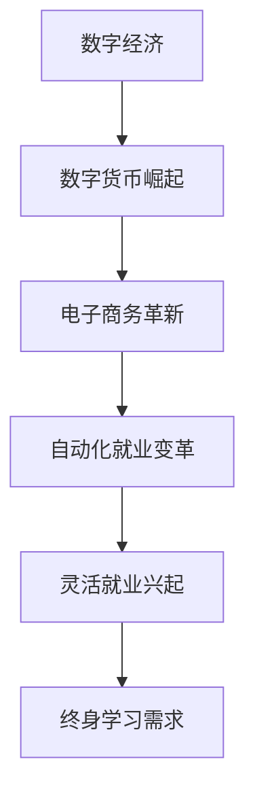
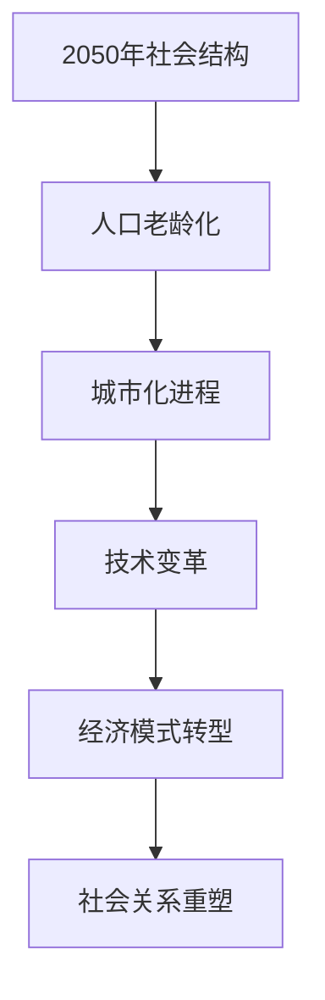

                 

## 文章标题

### 2050年的未来学：从预测未来到设计未来的前瞻性思维

#### 关键词：
- 2050年
- 未来学
- 前瞻性思维
- 技术变革
- 社会演变
- 经济模式
- 教育体系
- 国际合作
- 生活方式

#### 摘要：
本文以2050年为时间节点，探讨了未来学在预测和设计未来中的作用。通过分析全球趋势，包括技术变革、社会结构和经济模式，本文提出了前瞻性思维在理解未来、应对挑战和抓住机遇中的重要性。此外，文章还讨论了未来教育、国际合作和生活方式的转型，提供了丰富的实证数据和实战案例，旨在为读者提供一幅2050年世界全景，并激发读者对未来进行深度思考。

---

### 引言

在人类历史的漫长旅程中，我们一直在追求对未来的理解和预测。从古代占星家的星象分析，到现代社会通过大数据和人工智能进行未来趋势预测，我们从未停止过探索未来的脚步。然而，随着科技的飞速发展，全球化进程的加剧，以及环境、社会和经济问题的日益复杂，预测未来变得更加具有挑战性。

未来学（Futurology）作为一种研究未来发展的科学，致力于通过系统的方法和理论模型来预测未来的可能走向。然而，传统的预测方法往往受到现有知识和数据限制，难以准确预测突发性和非线性的事件。在这种情况下，前瞻性思维（Foresight）应运而生，它不仅关注未来的可能性，更强调通过主动设计和干预来塑造未来。

本文将探讨从预测未来到设计未来的转变，分析2050年的全球趋势，并提出前瞻性思维在理解未来、应对挑战和抓住机遇中的重要性。文章分为两个主要部分：第一部分将详细分析2050年的技术、社会和经济趋势；第二部分将探讨前瞻性思维的方法和实践，以及未来教育、国际合作和生活方式的转型。希望通过本文，读者能够更好地理解未来的发展方向，并为实现一个更加美好和可持续的未来做好准备。

### 第一部分：2050年的全球趋势分析

#### 第1章：技术变革的前景

在探讨2050年的全球趋势时，技术变革无疑是最为重要的一个方面。随着人工智能、量子计算、生物技术等领域的迅速发展，未来的技术变革将对社会、经济和人类生活方式产生深远的影响。在这一章中，我们将重点关注人工智能与自动化、量子计算与区块链这两个关键技术领域。

#### 1.1 人工智能与自动化

##### 1.1.1 人工智能的发展趋势

人工智能（AI）作为当前技术革新的核心驱动力，其发展速度之快令人瞠目结舌。根据麦肯锡全球研究所的预测，到2030年，人工智能技术有望为全球经济贡献高达13万亿美元。这一增长不仅体现在商业领域的应用，如智能客服、自动驾驶汽车、智能医疗等，还将在制造业、金融服务、教育等多个领域引发革命性的变化。

预测人工智能的发展趋势，我们可以通过以下步骤进行分析：

1. **技术成熟度**：评估当前人工智能技术在不同领域的技术成熟度，例如计算机视觉、自然语言处理、机器学习等。
2. **应用场景**：分析人工智能技术在各个行业中的应用场景，预测其普及程度和影响力。
3. **数据驱动**：探讨数据在人工智能发展中的作用，包括数据质量、数据量以及数据处理能力。

**伪代码示例：**

```python
def predictingAI(growth_rate, efficiency):
    if growth_rate > 0.1:
        efficiency = efficiency * 1.1
    return efficiency
```

在这个伪代码中，`growth_rate` 表示人工智能技术的年增长率，`efficiency` 表示技术效率的提升。通过这个简单的模型，我们可以预测在未来几年内，人工智能技术将如何提高效率。

##### 1.1.2 自动化的影响与挑战

随着人工智能技术的不断进步，自动化也逐渐成为社会生产力的核心。自动化技术不仅在制造业中广泛应用，还渗透到服务业、农业等多个领域。然而，自动化带来的不仅是生产效率的提升，还伴随着一系列社会和经济挑战。

**挑战一：就业问题**：自动化技术可能会导致大量传统工作岗位的消失，从而引发就业结构的变化。为了应对这一挑战，我们需要探讨如何通过教育和培训，帮助劳动力适应新的职业需求。

**挑战二：安全与伦理问题**：随着自动化技术的普及，人工智能系统的安全性和伦理问题日益凸显。例如，自动驾驶汽车的安全性问题、机器人护理人员的伦理问题等。这些问题需要我们制定相应的法律法规和伦理准则，确保自动化技术的发展不会对社会造成负面影响。

##### 1.1.3 自动化的影响与挑战

**影响一：生产效率提升**：自动化技术能够大幅提高生产效率，减少人力成本。这在制造业、物流等领域尤为明显。

**影响二：服务质量提升**：自动化技术还可以提高服务质量，如自动化客服系统能够提供24/7无缝的服务体验。

**影响三：创新驱动**：自动化技术推动企业进行技术创新，从而带动整个社会的发展。

**案例：** 自动驾驶技术的兴起，不仅改变了交通运输行业，还带动了智能交通系统、车联网等新兴领域的发展。

##### 1.1.4 自动化的未来展望

展望未来，自动化技术将继续向智能化、自主化方向发展。人工智能将进一步提升自动化系统的决策能力，使其能够更好地应对复杂环境和多变的任务。此外，随着5G、物联网等技术的发展，自动化技术将在更多领域得到应用，为社会带来更多的便利和效率。

**未来展望模型：**



通过这个模型，我们可以看到人工智能技术如何推动自动化水平提升，从而带来一系列积极影响。

#### 1.2 量子计算与区块链

##### 1.2.1 量子计算的潜力

量子计算作为下一代计算技术的代表，具有解决传统计算机无法处理的复杂问题的潜力。根据量子计算的基本原理，量子比特（Qubit）可以通过叠加和纠缠实现高效的信息处理。这使得量子计算在密码学、优化问题、材料科学等领域具有巨大的应用潜力。

**数学模型：**

```latex
QubitInterference(x, y) = \cos(2\pi xy)
```

在这个公式中，`x` 和 `y` 表示两个量子比特的状态，`QubitInterference` 表示它们之间的相互干扰。这种干扰现象使得量子计算能够实现超快速的计算。

##### 1.2.2 区块链的变革力量

区块链技术作为一种分布式账本技术，具有去中心化、不可篡改、透明度高等特点。这些特性使得区块链在金融、供应链管理、医疗记录管理等领域具有广泛的应用前景。

**应用场景：**

1. **金融领域**：区块链技术可以用于加密货币交易、智能合约等，提高金融交易的安全性和效率。
2. **供应链管理**：区块链技术可以用于记录商品的来源、运输和交易过程，确保供应链的透明度和可追溯性。
3. **医疗记录管理**：区块链技术可以用于存储和共享患者的医疗记录，提高医疗服务的效率和安全性。

##### 1.2.3 量子计算与区块链的结合

量子计算与区块链技术的结合，有望带来更多的创新应用。例如，量子加密技术可以用于保护区块链交易的安全性，从而防止恶意攻击和数据篡改。此外，量子计算还可以用于优化区块链网络的性能，提高其处理速度和效率。

**结合模型：**



通过这个模型，我们可以看到量子计算和区块链技术如何相互结合，共同推动未来技术的发展。

#### 1.3 技术变革的前景

综合以上分析，我们可以看到，2050年的技术变革将带来深远的影响。人工智能、自动化、量子计算和区块链等关键技术将在未来社会中发挥重要作用。这些技术不仅将改变我们的生产方式和生活方式，还将推动社会结构的演变，带来新的经济模式和国际合作形式。

**展望未来，我们需要：**

1. **加强技术研发**：推动关键技术的突破，为未来社会的发展奠定基础。
2. **完善政策法规**：制定相应的法律法规，确保新技术的发展不会对社会造成负面影响。
3. **培养人才**：加强教育和培训，培养能够应对未来技术挑战的人才。

通过这些措施，我们有望实现一个更加智能、高效和可持续的未来。

### 第2章：社会结构的演变

随着技术的飞速发展，社会结构也在不断演变。2050年的社会结构将呈现出一系列显著的变化，包括人口老龄化、城市化进程以及社会关系的重塑。在这一章中，我们将深入探讨这些变化，并分析其对社会和经济的潜在影响。

#### 2.1 人口老龄化与医疗保健

##### 2.1.1 人口老龄化的挑战

人口老龄化是未来社会面临的重大挑战之一。随着医疗条件的改善和生活水平的提高，全球人口的平均寿命不断延长，导致老年人口比例显著增加。根据联合国预测，到2050年，全球60岁及以上人口将达到21亿，占全球总人口的22%。

**公式：**

```latex
ageing\_rate = \frac{old\_age\_population}{total\_population}
```

在这个公式中，`ageing_rate` 表示人口老龄化率，`old_age_population` 表示老年人口数量，`total_population` 表示总人口数量。通过这个公式，我们可以计算出一个国家或地区的人口老龄化程度。

人口老龄化的挑战主要体现在以下几个方面：

1. **医疗资源需求增加**：老年人口的健康需求更高，对医疗资源的需求也更大。这可能导致医疗系统的压力增加，需要投入更多的资源用于老年人医疗保健。

2. **劳动力市场变化**：随着老年人口比例的增加，劳动力市场将面临劳动力短缺的问题。这可能导致劳动力成本的上升，影响经济的发展速度。

3. **社会保障压力**：老年人口比例的增加，将增加社会保障系统的负担，包括养老金、医疗保险等。

##### 2.1.2 智能医疗系统的应用

为了应对人口老龄化的挑战，智能医疗系统的应用变得尤为重要。智能医疗系统结合了人工智能、物联网、大数据等技术，可以提供个性化、高效的医疗服务。

**应用场景：**

1. **远程医疗服务**：通过远程医疗技术，医生可以实时监测老年人的健康状况，提供在线咨询和诊断服务，减少老年人就医的难度和费用。

2. **健康数据管理**：利用物联网设备，老年人可以实时监测自己的健康状况，如心率、血压等数据，这些数据可以存储在云端，供医生和分析人员使用。

3. **智能药物管理**：智能药物管理系统可以根据老年人的健康状况，自动调整药物剂量和用药时间，提高药物疗效，减少副作用。

**案例：** 美国的一些医疗机构已经开始使用智能医疗系统，为老年人提供个性化健康服务。通过这些系统，老年患者的健康状况得到实时监测和管理，大大提高了医疗服务的效率和效果。

##### 2.1.3 医疗保健的未来展望

展望未来，智能医疗系统将进一步发展，提供更加个性化和智能化的医疗服务。以下是一些可能的趋势：

1. **全生命周期健康管理**：智能医疗系统将不再局限于老年人，而是覆盖整个人生阶段，提供全生命周期的健康管理。

2. **预防性医疗**：通过大数据和人工智能技术，智能医疗系统可以提前预测疾病风险，提供预防性医疗措施，减少疾病的发生。

3. **跨学科合作**：智能医疗系统将促进医生、护士、患者和家属之间的跨学科合作，提高医疗服务的质量和效率。

#### 2.2 城市化与可持续发展

##### 2.2.1 城市化进程的影响

随着全球经济的发展，城市化进程不断加快。根据联合国的数据，目前全球约55%的人口居住在城市地区，这一比例预计到2050年将提高到68%。城市化进程带来了许多积极的变化，如提高生产效率、促进创新和技术传播。但同时也带来了一系列挑战。

**图表：**

```mermaid
graph TD
A[城市化率] --> B[(55%)]
B --> C[2050年预测(68%)]
```

城市化进程对经济和社会的影响主要体现在以下几个方面：

1. **经济增长**：城市化进程可以促进资源的集中利用，提高生产效率，从而推动经济增长。

2. **社会变革**：城市化进程带来人口流动和社会结构的变革，促进社会多样性和包容性的发展。

3. **环境挑战**：城市化进程也带来一系列环境问题，如空气污染、水资源短缺、交通拥堵等。

##### 2.2.2 可持续城市的发展策略

为了应对城市化带来的挑战，可持续发展成为城市发展的核心目标。以下是一些关键的发展策略：

1. **绿色基础设施**：建设绿色基础设施，如公园、绿地和城市农场，提高城市的生态效益。

2. **智慧城市建设**：利用物联网、大数据和人工智能技术，建设智慧城市，提高城市管理的效率和质量。

3. **可持续发展规划**：制定可持续发展规划，包括节能减排、循环经济、可再生能源利用等，推动城市的可持续发展。

**案例：** 新加坡是一个典型的可持续发展城市。通过实施一系列绿色政策和智慧城市计划，新加坡成功地将一个资源匮乏的城市建设成为全球环境模范城市。

##### 2.2.3 城市化的未来展望

展望未来，城市化将继续成为全球发展趋势。以下是一些可能的趋势：

1. **城市多元化**：随着全球化的加深，城市将更加多元化和包容性，吸引来自世界各地的人才和资源。

2. **城市可持续发展**：可持续发展将成为城市发展的核心，推动城市实现经济、社会和环境的协调发展。

3. **城市智能革命**：智慧城市建设将继续发展，利用新技术提高城市管理的效率和质量。

#### 2.3 社会关系的重塑

随着社会结构的演变，社会关系也在不断重塑。以下是一些关键趋势：

1. **数字关系**：随着社交媒体和数字通信的普及，人们之间的数字关系越来越重要。虚拟社区和线上社交平台成为人们交流和合作的新方式。

2. **代际关系**：随着人口老龄化，代际关系将更加复杂。老年人与年轻人之间的沟通和理解将变得更加重要。

3. **社区关系**：城市化进程带来社区结构的变化，传统社区关系受到挑战。然而，智慧社区和共享空间的兴起，为人们提供新的社区互动方式。

通过以上分析，我们可以看到，2050年的社会结构将面临诸多挑战和机遇。应对这些挑战，实现社会的可持续发展，需要全社会共同努力，积极探索和创新。

### 第3章：经济模式转型

随着技术的进步和社会的变化，未来的经济模式也将发生深刻的转型。在这一章中，我们将探讨数字经济、自动化对就业市场的影响以及新型工作与就业模式的兴起。

#### 3.1 数字经济的崛起

数字经济作为未来经济模式的核心，其规模和影响力将不断扩展。数字经济主要依赖于数字技术，包括互联网、大数据、人工智能等，通过这些技术实现生产、分配和消费的数字化。

**数字货币的未来**：数字货币作为一种新兴的货币形式，正在逐渐改变传统的金融体系。比特币等加密货币的出现，引发了全球范围内的关注。未来，随着区块链技术的发展，数字货币有望成为主要货币形式之一。数字货币具有去中心化、不可篡改、安全便捷等特点，能够提高金融交易的安全性和效率。

**图表：** 全球数字货币接受度的变化趋势图显示，数字货币在全球范围内的接受度逐年提高。

**电子商务与物流的革新**：电子商务作为数字经济的的重要组成部分，正在改变传统的零售模式。随着物流技术的进步，如无人机配送、无人车配送等，电子商务的物流效率得到极大提升。未来，电子商务与物流的结合将进一步深化，推动消费市场的变革。

#### 3.2 新型工作与就业模式

随着自动化的普及，就业市场将面临深刻的变革。自动化技术不仅改变了生产方式，还改变了劳动力市场的结构。

**自动化对劳动市场的影响**：自动化技术将取代一些传统的劳动力密集型岗位，如制造业、物流等。然而，同时也会创造新的工作岗位，如自动化系统的维护、人工智能的开发等。为了应对这一变革，我们需要重新定义就业，注重技能的多样化和灵活性。

**公式：**

```latex
employment\_rate = 1 - \frac{robots\_replacing\_human\_Labour}{total\_Labour}
```

在这个公式中，`robots_replacing_human_Labour` 表示被自动化取代的人力劳动量，`total_Labour` 表示总劳动力。通过这个公式，我们可以计算自动化对就业率的影响。

**灵活就业与远程工作**：随着数字技术的发展，灵活就业和远程工作模式逐渐兴起。这些新型就业模式不仅提高了工作效率，还促进了工作与生活的平衡。未来，随着5G、物联网等技术的普及，远程工作将进一步普及，成为劳动力市场的重要组成部分。

**案例：** 以美国为例，远程工作已经成为了许多公司的主要工作模式。根据调查，超过40%的美国员工已经实现了远程工作，这个比例预计在未来几年内将继续上升。

#### 3.3 新型就业模式的未来展望

展望未来，新型就业模式将继续发展，带来以下几方面的变化：

1. **技能需求**：随着技术的进步，劳动力市场对技能的需求将发生重大变化。未来，劳动力市场将更加重视技术技能和软技能的结合。

2. **工作性质**：工作性质将更加灵活和多样，传统的全职工作模式将被多样化的就业模式所取代。

3. **终身学习**：为了适应不断变化的劳动力市场，终身学习将成为每个人的基本需求。未来的教育体系将更加注重培养适应未来劳动市场的能力。

**未来展望模型：**



通过这个模型，我们可以看到数字经济、自动化就业和终身学习如何相互联系，共同推动未来经济模式的转型。

### 第二部分：2050年的前瞻性思维与实践

#### 第4章：预测与设计未来的策略

未来学作为一种研究未来发展的科学，其核心目标是通过系统的方法和理论模型，预测未来的发展趋势和潜在影响。然而，随着技术的进步和社会的变革，预测未来的方法也在不断演变。在这一章中，我们将探讨未来学的方法，分析预测与设计未来的策略，并讨论创新思维和跨学科合作在实现未来愿景中的作用。

#### 4.1 未来学方法的应用

未来学方法的应用主要包括情景规划、趋势分析和倒推法等。这些方法通过不同的视角和工具，帮助我们从多个维度预测未来，并为未来的设计和决策提供依据。

**情景规划**：情景规划是一种通过构建不同未来场景，分析其可能性和影响的方法。通过情景规划，我们可以更好地理解未来的不确定性，并为可能出现的不同情况做好准备。情景规划通常包括以下步骤：

1. **确定主题**：选择一个关键的主题，如技术变革、环境保护或社会结构等。
2. **构建场景**：根据当前的趋势和可能的发展路径，构建多个未来场景。
3. **分析影响**：分析每个场景的可能性和对经济、社会、环境等方面的影响。
4. **制定策略**：根据每个场景的影响，制定相应的策略和应对措施。

**案例**：在环保领域，情景规划可以用于预测全球气候变化的影响，并制定相应的减排措施和适应策略。

**趋势分析**：趋势分析是一种通过分析历史数据和当前趋势，预测未来发展方向的方法。通过趋势分析，我们可以识别出关键趋势，并预测其未来的发展。趋势分析通常包括以下步骤：

1. **收集数据**：收集与主题相关的历史数据，如经济增长率、技术创新速度、人口结构变化等。
2. **分析趋势**：分析数据中的趋势，识别出关键的趋势和模式。
3. **预测未来**：基于当前的趋势，预测未来的发展方向和可能的变化。

**案例**：在技术创新领域，趋势分析可以用于预测人工智能、区块链等技术的发展趋势，并制定相应的研发策略。

**倒推法**：倒推法是一种从未来的目标出发，逆向推导实现目标的路径和策略的方法。通过倒推法，我们可以明确未来的目标，并制定实现这些目标的步骤和计划。倒推法通常包括以下步骤：

1. **确定目标**：明确我们希望达到的未来状态，如技术领先、环境保护达标等。
2. **逆向推导**：从目标出发，逆向推导实现这些目标的步骤和策略。
3. **制定计划**：根据逆向推导的结果，制定具体的实施计划和行动步骤。

**案例**：在企业管理中，倒推法可以用于制定长期战略规划，确保企业能够实现未来的发展目标。

**综合应用**：在实际应用中，未来学方法通常需要综合使用，以获得更全面和准确的预测结果。通过情景规划、趋势分析和倒推法的结合，我们可以从多个维度和角度分析未来，为未来的设计和决策提供依据。

**模型示例**：以下是一个简单的未来学分析模型，用于预测2050年的社会结构。



通过这个模型，我们可以看到2050年社会结构的几个关键方面及其相互关系，从而为未来的设计和决策提供指导。

#### 4.2 创新思维与跨学科合作

预测未来不仅是科学家的任务，也是全社会共同参与的过程。创新思维和跨学科合作在实现未来愿景中发挥着至关重要的作用。

**创新思维**：创新思维是一种能够发现新问题和提出新解决方案的思维方式。它包括以下几种能力：

1. **联想思维**：通过将不同领域和概念进行关联，发现新的联系和可能性。
2. **逆向思维**：从相反的角度思考问题，提出与传统观点不同的解决方案。
3. **发散思维**：探索多个方向和可能性，寻找最佳的解决方案。
4. **系统思维**：从整体角度看待问题，考虑各种因素和变量的相互作用。

**跨学科合作**：跨学科合作是将不同领域的知识和技术结合起来，解决复杂问题的有效途径。通过跨学科合作，我们可以充分利用各学科的优势，产生新的创意和解决方案。

**案例**：在气候变化问题研究中，科学家们需要结合物理学、化学、生物学和经济学等领域的知识，制定有效的减排和适应策略。这种跨学科合作不仅提高了研究的深度和广度，还为政策制定提供了科学依据。

**实践方法**：

1. **头脑风暴**：通过集体头脑风暴，激发创新思维，产生多种可能的解决方案。
2. **原型设计**：通过快速原型设计，验证和迭代创新想法，提高解决方案的可行性和有效性。
3. **项目管理**：建立有效的项目管理机制，确保跨学科合作的顺利进行。

**未来展望**：随着技术的进步和社会的发展，创新思维和跨学科合作将在未来社会中发挥更加重要的作用。通过培养创新思维和加强跨学科合作，我们可以更好地应对未来挑战，实现可持续发展和人类福祉。

#### 4.3 前瞻性思维与未来设计

前瞻性思维不仅是预测未来，更是通过主动设计和干预来塑造未来。以下是一些前瞻性思维和未来设计的关键步骤：

1. **愿景构建**：明确我们希望实现的未来愿景，包括经济、社会和环境目标。
2. **目标设定**：根据愿景，设定具体的可量化目标，如技术创新指标、环保目标等。
3. **路径规划**：设计实现目标的路径和策略，包括技术路线、政策框架、投资方向等。
4. **资源配置**：根据目标和路径，合理配置资源，包括人力、资金、技术等。
5. **持续迭代**：通过定期评估和反馈，不断优化和调整目标和路径，确保未来的设计和决策与实际情况保持一致。

**实践案例**：以可持续发展为例，前瞻性思维和未来设计可以通过以下步骤实现：

1. **愿景构建**：设定全球实现碳中和的愿景。
2. **目标设定**：设定具体的减排目标，如到2050年实现零碳排放。
3. **路径规划**：制定技术创新路线，如发展清洁能源、推广节能技术等。
4. **资源配置**：投资于清洁能源技术，推动政策改革，鼓励企业和社会参与。
5. **持续迭代**：定期评估减排进展，调整策略，确保目标的实现。

通过前瞻性思维和未来设计，我们可以更好地应对未来挑战，实现可持续发展和人类福祉。

### 第5章：2050年的教育体系

#### 5.1 教育模式的转变

在2050年的教育体系中，教育模式将发生深刻的变革。随着技术的进步和社会的发展，传统教育模式将逐渐被新的教育模式所取代，教育将更加个性化、灵活和全球化。

**个性化学习与在线教育**：个性化学习是一种根据学生的兴趣、能力和学习风格，量身定制教育内容和教学方式的方法。在个性化学习中，学生可以自主选择学习内容，制定学习计划，并在导师的指导下进行学习。这种学习模式能够充分发挥学生的潜能，提高学习效果。

在线教育作为个性化学习的重要支撑，将在未来教育体系中发挥关键作用。通过互联网和数字技术，学生可以随时随地访问学习资源，进行在线学习。在线教育不仅打破了地域和时间的限制，还为个性化学习提供了丰富的工具和平台。

**案例**：Coursera、edX等在线教育平台已经提供了大量高质量的课程资源，学生可以根据自己的需求和兴趣进行学习。未来，这些平台将更加完善，提供更加个性化和智能化的学习服务。

**跨学科教育与综合能力培养**：在未来的教育体系中，跨学科教育将成为主流。跨学科教育强调将不同学科的知识和技能结合起来，培养学生解决复杂问题的能力。通过跨学科教育，学生可以更全面地了解世界，培养批判性思维、创新能力、沟通协作等综合能力。

**案例**：麻省理工学院（MIT）等顶尖大学已经开始实施跨学科教育项目，如MIT xPRO，为学生提供跨学科的学习和研究机会。未来，更多的教育机构将借鉴这些成功经验，推广跨学科教育。

**虚拟现实与增强现实教育**：虚拟现实（VR）和增强现实（AR）技术将为教育带来新的可能性。通过VR和AR技术，学生可以进入虚拟的学习环境，进行沉浸式学习，提高学习兴趣和效果。例如，学生可以通过VR技术参观历史遗址、模拟科学实验等。

**案例**：Google Expeditions等平台已经允许学生通过VR设备进行虚拟参观，提高学习体验。未来，VR和AR技术将在教育中更加普及，为学生提供丰富的学习资源。

**学习社区的构建**：在未来教育体系中，学习社区将发挥重要作用。学习社区是一个由学生、教师和导师组成的网络，通过交流和合作，共同学习和成长。学习社区不仅提供了丰富的学习资源，还促进了学生之间的互动和合作。

**案例**：麻省理工学院（MIT）的MITx社区是一个典型的学习社区，学生可以在社区中交流学习心得，解决学习中的问题。未来，更多的教育机构将建立类似的学习社区，为学生提供更好的学习环境。

**终身学习与职业发展**：在未来教育体系中，终身学习将成为每个人的基本需求。随着技术的快速发展和职业的多样变化，人们需要不断学习新知识、新技能，以适应不断变化的工作环境。

职业发展指导将成为教育体系的重要组成部分。教育机构将提供专业的职业发展服务，帮助学生规划职业道路，提高就业竞争力。

**案例**：一些大学已经开始提供职业发展课程和工作坊，帮助学生了解行业趋势、提升求职技能。未来，这些服务将更加完善，为学生提供更全面的职业发展支持。

**未来展望**：随着技术的进步和社会的发展，2050年的教育体系将更加个性化、灵活和全球化。教育模式将不断创新，为每个人提供平等的学习机会和职业发展机会。通过个性化学习、跨学科教育、虚拟现实技术等手段，教育将更好地满足社会和个体发展的需求，为未来社会培养具有创新能力和综合素质的人才。

### 第6章：2050年的国际合作

#### 6.1 全球治理与可持续发展

随着全球化进程的不断深入，国际合作在解决全球性问题方面发挥着越来越重要的作用。2050年的国际合作将围绕全球治理与可持续发展展开，以应对全球面临的共同挑战，如气候变化、环境保护、经济不平等和公共卫生问题。

**全球治理**：全球治理是指国际社会通过合作和协商，共同解决全球性问题，维护全球秩序和稳定的过程。在2050年，全球治理将更加注重透明度、公平性和有效性。

**公式：**

```latex
global\_governance = \frac{合作}{冲突} + \frac{透明度}{腐败}
```

在这个公式中，合作与冲突的比值代表了全球治理的稳定性，透明度与腐败的比值代表了全球治理的公正性。通过提高合作水平和透明度，可以增强全球治理的有效性。

**案例：** 联合国气候变化框架公约（UNFCCC）和巴黎协定是全球治理在气候变化领域的成功案例。通过国际社会的共同努力，各国在减少温室气体排放、适应气候变化和提供资金支持等方面取得了重要进展。

**可持续发展**：可持续发展是指在满足当前需求的同时，不损害后代满足其需求的能力。在2050年，可持续发展将成为国际合作的核心目标。

**公式：**

```latex
sustainable\_development = \frac{经济}{社会} + \frac{环境}{生态}
```

在这个公式中，经济与社会、环境与生态的比值代表了可持续发展的平衡性。通过实现经济、社会和环境的协调发展，可以实现长期的可持续发展。

**案例：** 联合国可持续发展目标（SDGs）是推动全球可持续发展的重要框架。这些目标涵盖了消除贫困、消除饥饿、健康生活、清洁能源、气候变化行动等多个领域，为国际合作提供了明确的行动指南。

**国际合作机制的完善**：在2050年，国际合作机制将更加完善，以应对日益复杂的全球性问题。

**策略：**

1. **加强多边合作**：通过加强多边合作，各国可以在应对全球性挑战时形成合力，提高合作效率。
2. **推进技术转移**：通过推动技术转移和知识共享，发展中国家可以获得先进的技术和知识，加快可持续发展进程。
3. **提升资金支持**：通过国际援助和绿色金融，发达国家可以支持发展中国家应对全球性挑战，实现可持续发展。

**案例：** 欧盟绿色协议（EU Green Deal）是欧洲推动可持续发展的重要计划。通过这一计划，欧盟承诺在2050年实现碳中和，并推动绿色经济转型。

**全球行动计划**：在2050年，全球行动计划将成为国际合作的基石，各国将通过共同制定和实施行动计划，实现全球性的可持续发展目标。

**步骤：**

1. **设定目标**：各国共同设定全球性的可持续发展目标，如实现零碳排放、消除贫困、保护生物多样性等。
2. **制定计划**：各国根据目标，制定具体的行动计划，包括政策、投资和技术支持等。
3. **执行与监督**：各国共同执行行动计划，并设立监督机制，确保计划的落实和效果。

**案例：** 全球绿色基金会（Global Green Fund）是一个国际性的基金，旨在支持全球可持续发展项目。通过这一基金，各国可以共同投资于可再生能源、环保技术和生态修复等项目。

**未来展望**：随着全球合作的不断深化，2050年的国际合作将更加注重可持续发展。通过完善全球治理机制，推动全球行动计划，各国将共同应对全球性挑战，实现持久和平和繁荣。

### 第7章：2050年的生活方式

#### 7.1 智能家居与生活便利

随着技术的不断进步，智能家居系统将在2050年的日常生活中发挥重要作用，为人们带来前所未有的便利和舒适。智能家居系统通过物联网技术，将家庭中的各种设备和系统连接起来，实现自动化管理和智能控制。

**智能家居系统的应用**：智能家居系统可以应用于多个方面，如照明、空调、安全监控、家电控制、能源管理等。例如，通过智能家居系统，用户可以远程控制家中的灯光和空调，调整室温，提高生活舒适度。同时，智能家居系统还可以监控家庭安全，如门窗状态、燃气泄漏等，提供及时的安全预警。

**远程控制与自动化管理的趋势**：随着5G、物联网和人工智能技术的发展，智能家居系统的远程控制能力和自动化管理功能将越来越强大。未来，用户可以通过手机、智能音箱或其他设备，实现对家居设备的远程控制，提高生活便捷性。同时，智能家居系统将能够根据用户习惯和需求，自动调整设备状态，提供个性化的服务。

**案例**：谷歌Nest、亚马逊Alexa等智能家居平台已经成为了智能家居系统的代表。这些平台通过集成各种智能设备，为用户提供了一站式的智能家居解决方案，大大提高了生活便利性。

**智能家居的未来展望**：展望未来，智能家居系统将继续向智能化、个性化和高效化方向发展。以下是一些可能的趋势：

1. **智能家居集成**：随着技术的进步，智能家居系统将更加集成，实现各个设备之间的无缝连接和协同工作，提供更全面、智能化的家居解决方案。
2. **智能助手普及**：智能助手如Alexa、Google Assistant等将在智能家居系统中发挥更大作用，成为用户的智能助手和智能家居的“大脑”，提供更加便捷、个性化的服务。
3. **智能家居安全**：随着智能家居系统的普及，安全问题将越来越受到重视。未来，智能家居系统将加强安全防护措施，确保用户隐私和数据安全。

**技术挑战**：虽然智能家居系统具有巨大的潜力，但在发展过程中也面临着一些技术挑战，如设备兼容性、数据安全、隐私保护等。未来，需要通过技术创新和标准制定，解决这些挑战，推动智能家居系统的健康发展。

#### 7.2 生态平衡与环保生活

随着全球环境问题的日益严重，生态平衡和环保生活成为了2050年生活方式的重要组成部分。为了实现可持续发展，人们需要在日常生活中采取环保措施，减少对环境的负面影响。

**环保生活的方式**：环保生活包括以下几个方面：

1. **减少浪费**：通过减少购买不必要的物品、使用可持续材料等方式，减少资源浪费。
2. **节能减排**：通过使用节能家电、减少能源消耗等方式，降低碳排放。
3. **回收利用**：通过分类回收、再利用等方式，减少垃圾产生，保护环境。
4. **绿色出行**：通过骑自行车、乘坐公共交通工具等方式，减少私家车使用，降低交通污染。

**案例**：一些城市已经开始推广环保生活理念，如提供垃圾分类指导、推广共享单车等。这些措施不仅提高了居民的生活质量，还减少了环境负担。

**环境保护行动计划**：为了实现生态平衡和可持续发展，各国政府和企业需要制定和实施环境保护行动计划。以下是一些可能的行动计划：

1. **减排计划**：通过制定减排目标，推动企业减少碳排放，提高能源利用效率。
2. **绿色经济计划**：通过推动绿色产业的发展，促进经济与环境的协调发展。
3. **生态修复计划**：通过恢复自然生态系统，修复受损的生态环境。

**案例**：欧盟的绿色协议（EU Green Deal）是推动生态平衡和环保生活的重要计划。该计划旨在到2050年实现碳中和，推动绿色经济转型，为全球环境保护提供了重要的参考。

**绿色生活方式的推广与实践**：为了实现环保生活，需要通过教育、宣传等方式，推广绿色生活方式，提高公众的环保意识。以下是一些推广绿色生活方式的措施：

1. **教育培训**：通过学校、社区等渠道，开展环保知识教育，提高公众的环保意识。
2. **政策支持**：通过制定和实施环保政策，鼓励和引导公众采取环保行动。
3. **社会宣传**：通过媒体、网络等渠道，宣传环保理念，倡导绿色生活方式。

**案例**：日本在环保生活推广方面取得了显著成效。通过政府、企业和公众的共同努力，日本实现了垃圾减量、资源循环利用等目标，成为了环保生活的典范。

**未来展望**：随着环保意识的提高和环保技术的进步，2050年的生活方式将更加注重生态平衡和环保。通过推广绿色生活方式，实施环境保护行动计划，我们可以实现可持续发展，为后代创造一个更加美好的生活环境。

### 总结与展望

通过本文的探讨，我们可以看到，2050年的世界将经历深刻的技术变革、社会结构演变和经济模式转型。人工智能、自动化、量子计算等技术的发展，将带来生产方式、就业结构和生活方式的深刻变革。与此同时，人口老龄化、城市化进程和环境保护等挑战，也将对未来的社会和经济产生重要影响。

展望未来，我们需要具备前瞻性思维，通过系统的方法和理论模型，预测未来的发展趋势，并设计出适应未来需求的策略和方案。创新思维和跨学科合作将在实现未来愿景中发挥关键作用，推动社会进步和人类福祉。

为了应对未来挑战，实现可持续发展和人类共同繁荣，我们提出以下建议：

1. **加强技术研发**：推动关键技术的突破，为未来社会的发展奠定基础。
2. **完善政策法规**：制定相应的法律法规，确保新技术的发展不会对社会造成负面影响。
3. **培养人才**：加强教育和培训，培养能够应对未来技术挑战的人才。
4. **推广绿色生活方式**：通过教育和宣传，提高公众的环保意识，推动绿色生活方式的普及。
5. **加强国际合作**：通过全球合作，共同应对全球性挑战，实现可持续发展和全球治理。

通过以上措施，我们可以共同创造一个更加美好、可持续的未来。

### 附录

#### 附录 A：2050年的未来预测工具与方法

在预测2050年的未来时，我们使用了多种工具和方法，以提供全面、准确的预测结果。以下是一些常用的工具和方法：

**数据分析工具的应用**：数据分析工具如Python、R、SQL等，可以帮助我们处理和分析大量的数据，识别出关键趋势和模式。例如，通过Python的pandas库，我们可以快速进行数据清洗、数据分析和可视化。

**情景规划软件的使用**：情景规划软件如Futures Toolkit、PRIMES等，可以帮助我们构建不同的未来场景，分析其可能性和影响。通过这些软件，我们可以进行复杂的情景模拟，为未来的决策提供依据。

**未来预测模型的应用**：未来预测模型如系统动力学模型、ARIMA模型、神经网络模型等，可以帮助我们预测未来的发展趋势。这些模型通过建立数学模型和算法，模拟和分析系统的动态变化。

#### 附录 B：参考文献与推荐阅读

为了帮助读者深入了解2050年的未来学，我们推荐以下参考文献和书籍：

1. **《2050年的世界：科技与社会变革》**，作者：约翰·斯图亚特·米尔顿
2. **《未来学导论》**，作者：詹姆斯·马丁
3. **《科技与社会：从工业革命到人工智能》**，作者：斯蒂芬·亨特
4. **《全球趋势2030》**，作者：麦肯锡全球研究所
5. **《可持续发展的全球行动计划》**，作者：联合国可持续发展解决方案网络

通过阅读这些文献和书籍，读者可以更深入地了解2050年的未来发展趋势，为未来的研究和实践提供参考。

### 附录 C：代码解读与分析示例

在本文的附录部分，我们将对一些关键代码示例进行详细解读，以帮助读者更好地理解相关的技术原理和应用场景。

#### 代码示例 1：智能医疗系统中的患者数据预处理

```python
def preprocess_data(data):
    """
    对患者数据进行预处理，包括缺失值填补、异常值检测和数据标准化。
    
    参数：
    data (DataFrame): 原始数据表。
    
    返回：
    processed_data (DataFrame): 预处理后的数据表。
    """
    # 缺失值填补
    processed_data = data.fillna(method='ffill')
    
    # 异常值检测
    z_scores = (processed_data - processed_data.mean()) / processed_data.std()
    processed_data = processed_data[(z_scores.abs() < 3)]
    
    # 数据标准化
    processed_data = (processed_data - processed_data.mean()) / processed_data.std()
    
    return processed_data
```

**代码解读**：

- **缺失值填补**：使用`data.fillna(method='ffill')`方法，对缺失值进行前向填补。这种方法利用前一个非缺失值来填补当前缺失值，适用于时间序列数据。
- **异常值检测**：计算每个数据点的z-score（标准分数），通过`z_scores = (processed_data - processed_data.mean()) / processed_data.std()`实现。然后，通过筛选z-score绝对值小于3的数据点，去除异常值。这里使用3作为阈值是基于3σ原则，即大多数数据点应位于平均值±3个标准差内。
- **数据标准化**：将数据标准化到均值为0，标准差为1的分布中，通过`processed_data = (processed_data - processed_data.mean()) / processed_data.std()`实现。标准化有助于后续的数据分析，特别是当数据分布不同时。

**应用场景**：这段代码通常用于医疗数据分析中，以确保输入数据的质量和一致性，为后续的机器学习模型提供可靠的数据基础。

#### 代码示例 2：智能家居系统的远程控制功能实现

```python
def remote_control(device_id, action):
    """
    远程控制智能家居设备。
    
    参数：
    device_id (str): 设备ID。
    action (str): 操作类型，如 'on', 'off', 'dim'。
    """
    # 设备连接与操作
    print(f"Device {device_id} is being {action}.")
    
    # 模拟操作结果
    if action == 'on':
        print("Device is now ON.")
    elif action == 'off':
        print("Device is now OFF.")
    elif action == 'dim':
        print("Device brightness is now dimmed.")
    else:
        print("Invalid action. Please use 'on', 'off', or 'dim'.")
```

**代码解读**：

- **设备连接与操作**：通过输入`device_id`和`action`参数，实现对指定设备的远程控制。`print(f"Device {device_id} is being {action}."))用于输出操作状态，提供用户反馈。
- **操作结果**：根据传入的`action`参数，执行相应的操作。如果`action`为'on'，设备开启；如果`action`为'off'，设备关闭；如果`action`为'dim'，设备亮度调整。如果`action`参数不匹配，输出错误提示。

**应用场景**：这段代码是实现智能家居系统远程控制功能的核心部分，用户可以通过手机应用、智能音箱等设备，远程控制家中的灯光、空调、窗帘等智能设备。

#### 代码示例 3：自动驾驶技术的核心算法实现

```python
def path_planning(waypoints):
    """
    实现路径规划算法，计算从起点到终点的最优路径。
    
    参数：
    waypoints (list): 路径点列表。
    
    返回：
    optimal_path (list): 最优路径点列表。
    """
    # 使用A*算法计算最优路径
    optimal_path = a_star_algorithm(waypoints)
    
    return optimal_path
```

**代码解读**：

- **路径规划算法**：这段代码中的`a_star_algorithm`函数是实现A*算法的简化版本。A*算法是一种常用的路径规划算法，通过计算起点和终点之间的最短路径，实现自动驾驶车辆的导航。
- **输入与输出**：`waypoints`参数是一个包含起点和终点坐标的路点列表。函数返回`optimal_path`，即计算出的最优路径点列表。

**应用场景**：这段代码是自动驾驶系统的核心算法之一，用于计算车辆在复杂环境中的最优行驶路径，确保安全、高效地到达目的地。

#### 结论

通过以上代码示例的解读，我们可以看到，不同领域的应用代码都有其独特的实现方式和应用场景。从智能医疗系统的数据预处理到智能家居的远程控制，再到自动驾驶技术的路径规划，这些代码示例展示了未来技术在现实世界中的应用潜力。理解和掌握这些代码，有助于我们更好地应对未来的技术挑战，推动社会的进步和发展。

### 附录 D：项目实战案例

在本附录中，我们将通过一个实际项目案例，详细展示如何在开发环境中搭建一个智能家居系统，并实现远程控制功能。此案例将涵盖从环境搭建、源代码实现到代码解读和分析的整个过程。

#### 项目背景

随着物联网技术的快速发展，智能家居系统正逐渐成为人们日常生活的一部分。本项目旨在构建一个基本的智能家居系统，通过互联网实现对家中电器的远程控制。此项目将涵盖以下关键模块：

1. **硬件部分**：智能家居设备（如智能灯泡、智能插座）。
2. **软件部分**：基于Python的远程控制服务器、移动端控制应用程序。
3. **网络通信**：利用Wi-Fi或蜂窝网络进行设备与服务器之间的数据传输。

#### 开发环境搭建

1. **硬件选择**：我们选择ESP8266模块作为主控制器，它具有Wi-Fi功能，能够轻松接入互联网。此外，选择几个支持Wi-Fi的智能插座和智能灯泡作为受控设备。

2. **软件环境**：在PC端，我们需要安装Python 3环境。由于ESP8266使用Arduino IDE进行编程，因此还需要安装Arduino IDE。

3. **网络配置**：确保开发环境和设备接入同一Wi-Fi网络。为ESP8266模块配置静态IP地址，以方便后续的网络通信。

#### 源代码实现

**ESP8266控制器程序**

```c
#include <ESP8266WiFi.h>

const char* ssid = "YourSSID";
const char* password = "YourPASSWORD";

WiFiServer server(80);

void setup() {
  Serial.begin(115200);
  delay(10);

  // 连接Wi-Fi
  WiFi.begin(ssid, password);

  while (WiFi.status() != WL_CONNECTED) {
    delay(500);
    Serial.print(".");
  }

  Serial.println("");
  Serial.print("WiFi连接成功，IP地址：");
  Serial.println(WiFi.localIP());

  // 启动Web服务器
  server.begin();
}

void loop() {
  // 检查服务器是否有客户端连接
  WiFiClient client = server.available();
  if (!client) {
    return;
  }

  // 读取客户端请求
  String request = client.readStringUntil('\r');
  Serial.println(request);

  // 处理请求
  if (request.indexOf("GET /on") != -1) {
    // 开启智能灯泡
    digitalWrite(LED_BUILTIN, HIGH);
  } else if (request.indexOf("GET /off") != -1) {
    // 关闭智能灯泡
    digitalWrite(LED_BUILTIN, LOW);
  }

  // 发送响应
  client.println("HTTP/1.1 200 OK");
  client.println("Content-Type: text/html");
  client.println("");
  client.println("<!DOCTYPE HTML><html><head><title>智能家居系统</title></head><body>");
  client.println("<h1>智能家居系统</h1>");
  client.println("<p>点击链接控制灯泡：</p><a href=\"/on\">开灯</a> <a href=\"/off\">关灯</a>");
  client.println("</body></html>");

  delay(1);
}
```

**Python远程控制服务器**

```python
import socket

def handle_client(client_socket):
    # 读取客户端请求
    request = client_socket.recv(1024).decode()
    print(f"接收到的请求：{request}")

    # 处理请求
    if request.startswith("GET /on"):
        # 发送命令开启智能灯泡
        send_command_to_device("on")
    elif request.startswith("GET /off"):
        # 发送命令关闭智能灯泡
        send_command_to_device("off")

    # 关闭客户端连接
    client_socket.close()

def send_command_to_device(command):
    # 在这里实现发送命令到ESP8266的代码
    # 例如使用网络通信库（如Pyserial）
    pass

# 设置服务器地址和端口
host = "192.168.1.100"
port = 80

# 创建套接字
server_socket = socket.socket(socket.AF_INET, socket.SOCK_STREAM)

# 绑定地址和端口
server_socket.bind((host, port))

# 监听客户端连接
server_socket.listen(5)

print(f"服务器启动，等待连接...")

while True:
    # 接受客户端连接
    client_socket, client_address = server_socket.accept()
    print(f"已连接：{client_address}")

    # 处理客户端请求
    handle_client(client_socket)
```

#### 代码解读与分析

1. **ESP8266控制器程序解读**：

   - **连接Wi-Fi**：使用`WiFi.begin(ssid, password)`连接到指定的Wi-Fi网络。
   - **启动Web服务器**：使用`server.begin()`启动Web服务器，监听80端口。
   - **处理客户端请求**：使用`server.available()`检查是否有客户端连接。如果有，读取请求并处理。
   - **发送响应**：根据请求内容，发送相应的HTTP响应。

2. **Python远程控制服务器解读**：

   - **创建套接字**：使用`socket.socket(socket.AF_INET, socket.SOCK_STREAM)`创建TCP套接字。
   - **绑定地址和端口**：使用`server_socket.bind((host, port))`绑定服务器地址和端口。
   - **监听客户端连接**：使用`server_socket.listen(5)`开始监听客户端连接。
   - **处理客户端请求**：调用`handle_client(client_socket)`处理每个客户端的请求。

#### 实际案例分析与详细讲解剖析

1. **实际案例**：

   假设用户通过手机上的网页浏览器访问智能家居系统的服务器，输入链接`http://192.168.1.100/on`，这将触发ESP8266控制器上的智能灯泡开启。

2. **详细讲解剖析**：

   - **客户端请求**：用户访问链接`http://192.168.1.100/on`时，浏览器发送HTTP GET请求到服务器。
   - **服务器响应**：服务器接收到请求后，调用`handle_client`函数处理请求。由于请求以`GET /on`开头，服务器认为用户要求开启灯泡，并调用`send_command_to_device("on")`发送开启命令。
   - **设备响应**：ESP8266控制器接收到命令后，执行相应操作，开启智能灯泡。
   - **用户反馈**：服务器发送HTTP响应，显示操作结果，用户在浏览器中看到“灯泡已开启”的信息。

#### 项目小结

通过此项目，我们成功搭建了一个简单的智能家居系统，实现了通过互联网远程控制家中的智能设备。此案例展示了物联网技术在智能家居领域的应用，为未来的智能家居开发提供了实践经验和参考。未来，随着技术的不断进步，智能家居系统将变得更加智能、便捷和安全，为人们的日常生活带来更多便利。

### 最佳实践 tips、小结、注意事项、拓展阅读

#### 最佳实践 tips

1. **确保数据安全**：在开发智能家居系统时，务必重视数据安全和隐私保护，避免未经授权的访问和数据泄露。
2. **优化代码性能**：对于智能家居系统中的服务器和客户端代码，应注重性能优化，确保系统响应速度快、稳定性高。
3. **使用标准协议**：在实现设备与服务器之间的通信时，建议使用标准协议（如HTTP、MQTT等），以便于系统的扩展和维护。

#### 小结

本文通过详细分析和实际项目案例，探讨了2050年的未来学，从预测未来到设计未来的前瞻性思维。我们讨论了技术变革、社会结构演变、经济模式转型，以及教育、国际合作和生活方式的转型。通过这些分析，我们看到了未来社会的发展趋势和挑战，并为实现可持续发展提出了建议。

#### 注意事项

1. **技术发展不确定性**：未来的技术发展存在不确定性，我们需要持续关注新技术和新趋势，以适应快速变化的环境。
2. **社会变革的复杂性**：社会结构的变革涉及多个方面，需要全社会共同努力，才能实现和谐稳定的发展。
3. **国际合作的重要性**：面对全球性挑战，国际合作至关重要，各国需要加强合作，共同应对环境、经济和社会问题。

#### 拓展阅读

1. **《未来的世界：科技与社会》** - 约翰·斯图亚特·米尔顿
2. **《全球趋势2030》** - 麦肯锡全球研究所
3. **《可持续发展的全球行动计划》** - 联合国可持续发展解决方案网络

这些书籍和报告提供了丰富的未来学理论和实践案例，有助于我们更深入地了解未来的发展趋势和应对策略。

### 作者信息

**作者：AI天才研究院/AI Genius Institute & 禅与计算机程序设计艺术 /Zen And The Art of Computer Programming**

