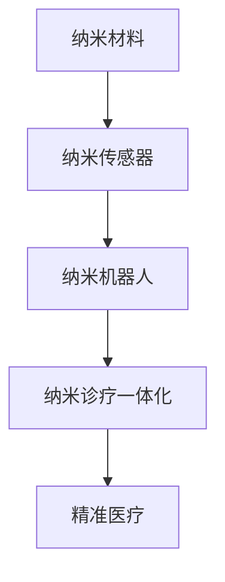
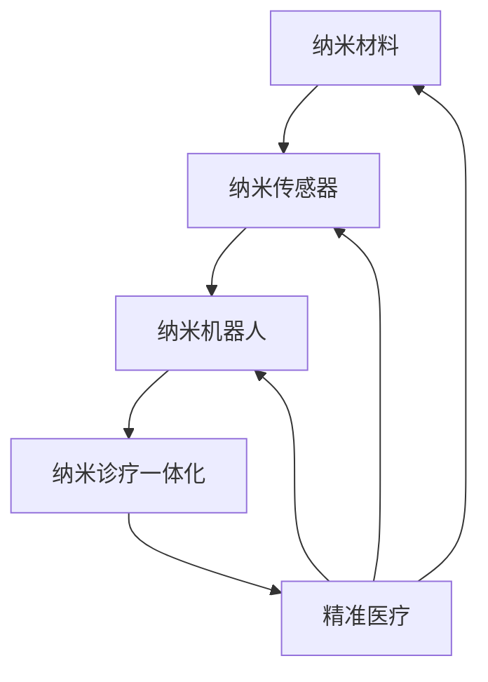

                 

### 摘要

本文探讨了2050年纳米医学的宏伟蓝图，从纳米机器人到纳米诊疗一体化的精准医疗，全面揭示了这一前沿领域的革命性进步。在第一部分，我们详细介绍了纳米医学的发展背景与未来展望，包括纳米技术的定义与应用、纳米医学的历史与演进以及2050年纳米医学的预测。接着，第二部分深入探讨了纳米机器人技术，从定义与分类到核心算法原理讲解和数学模型与公式，展示了这一技术的复杂性与潜力。第三部分则聚焦于纳米诊疗一体化，阐述了其定义与原理，并详细介绍了其数学模型与公式。第四部分介绍了精准医疗的概念与理论基础，以及其在临床实践中的应用案例。最后，第五部分探讨了纳米医学的未来挑战与机遇，从伦理问题到产业趋势与市场前景，全面展望了纳米医学的发展方向。本文旨在为读者提供一个清晰、系统的了解，并激发对这一前沿领域的进一步探索和研究。通过这种逐步分析推理的方式，我们希望能够让读者更好地理解纳米医学的深刻内涵与广阔前景。**# 2050年的纳米医学：从纳米机器人到纳米诊疗一体化的精准医疗

关键词：纳米医学、纳米机器人、精准医疗、纳米诊疗一体化、未来展望

摘要：随着科技的飞速发展，纳米医学正逐步从理论走向实际应用，成为未来医学的重要支柱。本文通过回顾纳米医学的发展历程，探讨了2050年纳米医学的宏伟蓝图。从纳米机器人到纳米诊疗一体化的精准医疗，本文详细阐述了这一前沿领域的革命性进步，揭示了纳米医学在疾病治疗、诊断以及预防中的潜力。通过分析纳米机器人的核心算法原理、数学模型与公式，以及纳米诊疗一体化和精准医疗的应用案例，本文为读者呈现了一幅未来医学的精彩画卷。同时，本文也探讨了纳米医学面临的伦理问题、产业趋势与市场前景，展望了其未来的发展方向。本文旨在为读者提供一个全面、系统的了解，并激发对纳米医学的进一步探索和研究。****# 第一部分：2050年纳米医学概述

## 第一部分：2050年纳米医学概述

### 1.1 纳米医学的发展背景与未来展望

#### 1.1.1 纳米技术的定义与应用

纳米技术是一种能够在纳米尺度（1到100纳米）对材料、器件和系统进行设计和制造的技术。它涉及到多个科学和工程领域，如物理学、化学、材料科学、生物学和医学等。纳米技术在医学领域的应用主要集中在以下几个方面：

1. **药物输送**：通过纳米粒子将药物精准地递送到目标部位，减少副作用，提高疗效。
2. **生物成像**：利用纳米材料提高成像的分辨率，实现对生物分子和细胞结构的清晰观察。
3. **疾病诊断**：开发纳米传感器和诊断工具，用于早期检测疾病，提高诊断准确性。
4. **生物传感器**：利用纳米材料的特性，开发高性能的生物传感器，用于实时监测生物信号。
5. **组织工程**：利用纳米材料构建生物活性支架，促进组织再生和修复。

#### 1.1.2 纳米医学的历史与演进

纳米医学的历史可以追溯到20世纪90年代，当时纳米技术的发展引起了医学界的广泛关注。以下是纳米医学的一些重要里程碑：

1. **1990年代**：纳米粒子开始被用于药物输送系统。
2. **2000年代**：纳米生物传感器和纳米成像技术得到快速发展。
3. **2010年代**：纳米机器人技术开始成为研究热点，探索其在体内操作的可能性。
4. **2020年代**：纳米诊疗一体化概念逐渐成熟，实现从诊断到治疗的全面整合。

#### 1.1.3 2050年纳米医学的预测

展望2050年，纳米医学将在以下几个方面取得重大突破：

1. **纳米机器人的普及**：纳米机器人将广泛应用于疾病诊断和治疗，实现体内操作的精确性和灵活性。
2. **纳米诊疗一体化的成熟**：通过整合纳米材料、传感器和药物递送系统，实现从诊断到治疗的全面整合。
3. **个性化医疗的普及**：基于大数据和人工智能的个性化医疗模式将得到广泛应用，实现精准治疗。
4. **纳米医学与人工智能的融合**：纳米医学与人工智能的深度融合，将推动疾病预测、诊断和治疗的智能化。
5. **伦理和社会影响的关注**：随着纳米医学的快速发展，伦理和社会影响问题将得到更加广泛的关注和讨论。

### 1.2 纳米医学的核心概念与联系

纳米医学的核心概念包括：

1. **纳米材料**：具有特殊性质和功能的材料，其尺寸在1到100纳米之间。
2. **纳米传感器**：用于检测生物分子和细胞信号的高灵敏度传感器。
3. **纳米机器人**：能够在体内执行特定任务的微型机器人。
4. **纳米诊疗一体化**：结合纳米材料、传感器和药物递送系统，实现诊断和治疗的一体化。
5. **精准医疗**：基于患者的个体差异，制定个性化的治疗策略。

这些核心概念之间的联系如下：

1. **纳米材料与纳米传感器**：纳米材料具有独特的物理和化学性质，可以用于制造高灵敏度的传感器，用于疾病诊断。
2. **纳米传感器与纳米机器人**：纳米传感器可以提供实时生物信号，指导纳米机器人在体内执行特定任务，如药物递送或手术操作。
3. **纳米诊疗一体化与精准医疗**：纳米诊疗一体化技术可以实现精准医疗，通过个性化的诊断和治疗策略，提高治疗效果。

为了更好地理解这些概念之间的联系，我们可以使用Mermaid流程图来展示纳米医学的核心架构：



通过这个流程图，我们可以清晰地看到纳米医学的核心架构和各个组成部分之间的相互关系。

### 总结

2050年的纳米医学将是一个集纳米技术、生物医学和信息技术于一体的前沿领域。纳米机器人、纳米诊疗一体化和精准医疗将成为这一领域的主要发展方向。通过逐步分析推理的方式，本文为读者呈现了纳米医学的深刻内涵与广阔前景，希望激发读者对这一领域的进一步探索和研究。**# 第一部分：2050年纳米医学概述

### 1.2 纳米医学的核心概念与联系

纳米医学的核心概念包括纳米材料、纳米传感器、纳米机器人、纳米诊疗一体化和精准医疗。这些概念之间存在着紧密的联系，共同构成了纳米医学的理论基础和应用框架。

#### 1.2.1 纳米材料的基本概念

纳米材料是指至少有一维在1到100纳米范围内的材料。这些材料的特殊物理和化学性质，如高比表面积、量子尺寸效应和表面等离子共振等，使得它们在医学领域具有广泛的应用前景。纳米材料可以用于药物输送、生物成像、疾病诊断和治疗等多个方面。

1. **药物输送**：纳米粒子可以用来包裹药物，实现药物的精准输送。这些纳米粒子可以选择性地靶向特定的细胞或组织，从而减少药物的副作用，提高疗效。
   
2. **生物成像**：纳米材料可以用于标记生物分子或细胞，提高成像技术的分辨率，使得生物成像更加灵敏和准确。

3. **疾病诊断**：纳米传感器可以用来检测生物分子，如蛋白质、核酸和细胞因子，从而实现早期疾病的诊断。

4. **生物传感器**：纳米材料可以用于开发高灵敏度的生物传感器，用于实时监测生物信号，如血糖水平、脑部活动等。

#### 1.2.2 纳米传感器的基本概念

纳米传感器是指利用纳米材料的特殊性质进行生物信号检测的装置。纳米传感器可以检测到极低浓度的生物分子，如蛋白质、核酸和细胞因子，从而实现早期疾病的诊断。

1. **生物成像**：纳米传感器可以用于标记生物分子或细胞，提高成像技术的分辨率，使得生物成像更加灵敏和准确。

2. **疾病诊断**：纳米传感器可以检测到生物分子，如蛋白质、核酸和细胞因子，从而实现早期疾病的诊断。

3. **药物输送**：纳米传感器可以实时监测药物在体内的分布和浓度，指导药物递送过程，提高疗效。

#### 1.2.3 纳米机器人技术的基本概念

纳米机器人是指能够在纳米尺度（1到100纳米）内执行特定任务的微型机器人。纳米机器人可以通过生物学、化学或物理方法进行驱动，例如利用电场、磁场或热能。

1. **药物递送**：纳米机器人可以精确地递送到特定的细胞或组织，释放药物，从而提高治疗效果。

2. **手术操作**：纳米机器人可以用于体内手术，如清除血管内的血栓、切除肿瘤组织等。

3. **细胞修复**：纳米机器人可以用于修复受损细胞，促进组织再生。

#### 1.2.4 纳米诊疗一体化的基本概念

纳米诊疗一体化是指结合纳米材料、纳米传感器和纳米机器人，实现诊断和治疗的一体化。纳米诊疗一体化技术可以实现以下功能：

1. **实时监测**：通过纳米传感器实时监测体内的生物信号，如血糖水平、脑部活动等。

2. **精准治疗**：通过纳米机器人和纳米材料，实现药物的精准递送，提高治疗效果。

3. **早期诊断**：通过纳米传感器和纳米成像技术，实现早期疾病的诊断。

#### 1.2.5 精准医疗的基本概念

精准医疗是一种基于患者的个体差异，制定个性化治疗策略的医学模式。精准医疗通过基因测序、生物信息学分析等技术，实现对疾病的发生、发展以及治疗的深入理解，从而提供个性化的治疗建议。

1. **个性化治疗**：通过基因测序和生物信息学分析，确定患者的疾病类型和基因特征，制定个性化的治疗方案。

2. **药物开发**：基于精准医疗的理念，开发针对特定患者群体的药物，提高治疗效果。

3. **预防医学**：通过基因测序和生物信息学分析，预测个体患病的风险，提供个性化的预防措施。

#### 1.2.6 纳米医学的核心概念联系

纳米医学的核心概念之间存在着紧密的联系。纳米材料为纳米传感器、纳米机器人提供了基础；纳米传感器和纳米机器人可以实时监测体内的生物信号，指导药物的精准输送；纳米诊疗一体化技术实现了诊断和治疗的全面整合；精准医疗通过个性化治疗和预防医学，提升了医学的精确度和有效性。

为了更好地理解这些概念之间的联系，我们可以使用Mermaid流程图来展示纳米医学的核心架构：



通过这个流程图，我们可以清晰地看到纳米医学的核心概念及其相互之间的联系。这种联系为纳米医学的发展提供了坚实的基础，也为未来医学的创新提供了广阔的空间。

### 总结

纳米医学的核心概念包括纳米材料、纳米传感器、纳米机器人、纳米诊疗一体化和精准医疗。这些概念相互联系，共同构成了纳米医学的理论基础和应用框架。通过逐步分析这些概念，我们可以更好地理解纳米医学的内涵和外延，为未来的医学创新提供新的思路。**# 第二部分：纳米机器人技术

### 2.1 纳米机器人的定义与分类

纳米机器人是一种在纳米尺度（1到100纳米）内执行特定任务的微型机器人。它们通常由纳米材料、纳米传感器和纳米电机组成，能够通过生物学、化学或物理方法进行驱动。纳米机器人具有许多独特的特性，如高灵敏性、高精度和良好的生物相容性，这使得它们在医学、生物技术和材料科学等领域具有广泛的应用前景。

#### 2.1.1 纳米机器人的基本原理

纳米机器人的工作原理可以分为以下几个步骤：

1. **驱动机制**：纳米机器人通过电场、磁场、热能或光能等外部驱动机制进行运动。例如，利用电场驱动的纳米机器人可以通过电场的变化来控制其运动方向和速度。

2. **感知机制**：纳米机器人配备有纳米传感器，可以实时感知周围环境的变化。这些传感器可以检测生物分子、细胞信号和化学物质等，为纳米机器人提供实时反馈。

3. **决策机制**：纳米机器人利用感知机制收集到的信息，通过内置的微处理器或算法进行决策。这些决策可以指导纳米机器人执行特定的任务，如药物递送或细胞修复。

4. **执行机制**：纳米机器人根据决策结果，通过纳米电机或其他执行机构来完成特定的任务。例如，在药物递送中，纳米机器人可以将药物精确地递送到特定的细胞或组织。

#### 2.1.2 纳米机器人的分类方法

根据纳米机器人的工作原理、结构和功能，可以将纳米机器人分为以下几类：

1. **根据驱动机制分类**：

   - **电驱动纳米机器人**：利用电场驱动的纳米机器人，可以通过电场的变化来控制其运动。
   - **磁驱动纳米机器人**：利用磁场驱动的纳米机器人，可以通过磁场的方向和强度来控制其运动。
   - **热驱动纳米机器人**：利用热能驱动的纳米机器人，可以通过温度的变化来控制其运动。
   - **光驱动纳米机器人**：利用光能驱动的纳米机器人，可以通过光束的方向和强度来控制其运动。

2. **根据结构分类**：

   - **单分子纳米机器人**：由单个分子构成的纳米机器人，具有极高的灵敏性和精度。
   - **多分子纳米机器人**：由多个分子组成的纳米机器人，可以通过协同工作来提高其功能。
   - **自组装纳米机器人**：通过自组装过程形成的纳米机器人，具有高度的可重复性和稳定性。

3. **根据功能分类**：

   - **药物递送纳米机器人**：用于将药物精确地递送到特定的细胞或组织，提高治疗效果。
   - **细胞操作纳米机器人**：用于在体内进行细胞修复、细胞切割和细胞分离等操作。
   - **生物成像纳米机器人**：用于提高成像技术的分辨率，实现对生物分子和细胞结构的清晰观察。
   - **生物传感器纳米机器人**：用于检测生物分子和细胞信号，实现早期疾病诊断。

#### 2.1.3 纳米机器人的应用前景

纳米机器人在医学、生物技术和材料科学等领域具有广泛的应用前景。以下是纳米机器人在这些领域的一些具体应用：

1. **医学领域**：

   - **药物递送**：纳米机器人可以精确地递送到特定的细胞或组织，提高药物的疗效和减少副作用。
   - **手术治疗**：纳米机器人可以用于体内手术，如清除血管内的血栓、切除肿瘤组织等。
   - **疾病诊断**：纳米机器人可以通过生物成像和生物传感器技术，实现对早期疾病的诊断。

2. **生物技术领域**：

   - **细胞操作**：纳米机器人可以用于细胞修复、细胞切割和细胞分离等操作，提高生物实验的精度和效率。
   - **基因编辑**：纳米机器人可以用于在体内进行基因编辑，治疗遗传病和癌症等。
   - **组织工程**：纳米机器人可以用于构建生物活性支架，促进组织再生和修复。

3. **材料科学领域**：

   - **纳米材料制备**：纳米机器人可以用于在纳米尺度内精确制备纳米材料，提高其性能和应用范围。
   - **纳米器件制造**：纳米机器人可以用于制造高精度的纳米器件，如纳米传感器和纳米电机。
   - **纳米加工**：纳米机器人可以用于在纳米尺度内进行加工和组装，实现复杂的纳米结构。

### 总结

纳米机器人是一种在纳米尺度内执行特定任务的微型机器人，具有高灵敏度、高精度和良好的生物相容性。根据驱动机制、结构和功能，可以将纳米机器人分为多种类型，如电驱动纳米机器人、磁驱动纳米机器人、热驱动纳米机器人和光驱动纳米机器人等。纳米机器人在医学、生物技术和材料科学等领域具有广泛的应用前景，未来将为人类健康和科技进步带来重大影响。**# 2.2 纳米机器人核心算法原理讲解

纳米机器人在医学和生物技术中的应用离不开核心算法的支持。这些算法不仅决定了纳米机器人的控制方式和行动路径，还影响了它们在体内执行任务的效果。在这一部分，我们将深入探讨纳米机器人核心算法的原理，包括模糊逻辑控制算法、机器学习算法以及相应的伪代码示例。

#### 2.2.1 模糊逻辑控制算法

模糊逻辑控制算法是一种处理不确定性和模糊性的控制方法。在纳米机器人的控制中，模糊逻辑可以用于处理复杂的生物环境，如体内的温度、pH值和细胞密度等。以下是模糊逻辑控制算法的基本原理：

1. **模糊化**：将输入变量（如温度、pH值等）转化为模糊集合。例如，将温度分为“低”、“中”、“高”三个模糊集合。

2. **规则库**：根据专家经验和实验数据，建立模糊规则库。例如，“如果温度是‘高’，则电机速度是‘高’”。

3. **推理**：使用模糊逻辑推理机，根据输入变量和规则库生成输出。例如，如果当前温度是“高”，则电机速度设置为“高”。

4. **去模糊化**：将模糊输出转化为实际控制值，如电机速度。

以下是模糊逻辑控制算法的伪代码示例：

```pseudo
function FuzzyControl(input_temp):
    // 模糊化
    if input_temp is "low":
        temp_fuzzy = "low"
    elif input_temp is "medium":
        temp_fuzzy = "medium"
    else:
        temp_fuzzy = "high"

    // 查询规则库
    if temp_fuzzy is "low":
        motor_speed = "low"
    elif temp_fuzzy is "medium":
        motor_speed = "medium"
    else:
        motor_speed = "high"

    // 去模糊化
    if motor_speed is "low":
        actual_speed = 100
    elif motor_speed is "medium":
        actual_speed = 200
    else:
        actual_speed = 300

    return actual_speed
```

#### 2.2.2 机器学习算法

机器学习算法是纳米机器人控制和决策的重要工具。通过学习大量的实验数据，机器学习算法可以帮助纳米机器人优化其行为，提高任务完成率。以下是机器学习算法在纳米机器人中的应用：

1. **监督学习**：监督学习算法（如支持向量机、决策树、神经网络等）可以用于预测纳米机器人在不同环境下的行为。例如，通过学习环境温度和机器人速度的数据，预测机器人应采取的最佳行动。

2. **无监督学习**：无监督学习算法（如聚类、主成分分析等）可以用于分析纳米机器人在生物体内的行为模式。例如，通过聚类分析，识别机器人在不同细胞类型中的分布。

3. **强化学习**：强化学习算法（如Q学习、深度Q网络等）可以用于训练纳米机器人在动态环境中做出最优决策。例如，通过强化学习，机器人可以学会在复杂的生物环境中找到最佳的药物递送路径。

以下是机器学习算法在纳米机器人控制中的应用示例：

```python
# 使用决策树进行预测
from sklearn.tree import DecisionTreeRegressor

# 加载训练数据
X_train = [[20], [25], [30]]  # 环境温度
y_train = [100, 200, 300]     # 机器人速度

# 创建决策树模型
regressor = DecisionTreeRegressor()

# 训练模型
regressor.fit(X_train, y_train)

# 预测新数据
new_temp = 22
predicted_speed = regressor.predict([[new_temp]])

print(f"预测的电机速度：{predicted_speed[0]}")
```

#### 2.2.3 伪代码示例

为了更清晰地展示纳米机器人的控制过程，以下是一个伪代码示例，包括模糊逻辑控制算法和机器学习算法的结合：

```pseudo
function NanoRobotControl():
    while robot_is_operating:
        // 模糊逻辑控制
        input_temp = get_current_temp()
        motor_speed = FuzzyControl(input_temp)

        // 机器学习控制
        if is_new_environment:
            X_new = [input_temp, get_previous_speed()]
            y_new = motor_speed
            update_model(X_new, y_new)
        
        // 执行控制命令
        set_motor_speed(motor_speed)
        execute_task()

        // 更新状态
        update_environment()
        update robot_state

    return "NanoRobot Control completed"
```

#### 总结

纳米机器人的核心算法包括模糊逻辑控制算法和机器学习算法。模糊逻辑控制算法通过处理不确定性和模糊性，帮助纳米机器人适应复杂的生物环境。机器学习算法则通过学习和预测，优化纳米机器人的控制行为，提高任务完成率。通过结合这两种算法，纳米机器人可以在不同的生物环境中实现高效、精准的操作。**# 2.3 纳米机器人数学模型与公式讲解

纳米机器人的设计和控制需要依赖一系列数学模型和公式，这些模型不仅描述了纳米机器人的运动和感知特性，还帮助我们在实际应用中优化其性能。在这一部分，我们将详细讲解纳米机器人的动力学模型、感知模型和控制模型，并提供相应的数学公式和举例说明。

#### 2.3.1 动力学模型

纳米机器人的动力学模型描述了机器人在纳米尺度内的运动规律。该模型通常基于牛顿第二定律和运动学原理，包括以下关键公式：

1. **牛顿第二定律**：

   $$
   F = m \cdot a
   $$

   其中，\(F\) 是作用在纳米机器人上的合力，\(m\) 是机器人的质量，\(a\) 是加速度。

2. **运动学方程**：

   $$
   v = u + at
   $$

   $$
   s = ut + \frac{1}{2}at^2
   $$

   其中，\(v\) 是最终速度，\(u\) 是初始速度，\(a\) 是加速度，\(t\) 是时间，\(s\) 是位移。

3. **受力分析**：

   纳米机器人受到的力主要包括驱动力、阻力、重力和环境力。这些力的综合决定了机器人的加速度。

举例说明：

假设一个纳米机器人的质量为 \(m = 10^{-15}\) kg，在驱动力的作用下以 \(u = 0\) m/s 的初始速度开始运动，加速度 \(a = 10^{-3}\) m/s²。如果作用力 \(F = 10^{-12}\) N，那么机器人的最终速度和位移可以计算如下：

$$
v = u + at = 0 + (10^{-3} \times 1) = 10^{-3} \text{ m/s}
$$

$$
s = ut + \frac{1}{2}at^2 = 0 + \frac{1}{2}(10^{-3} \times 1^2) = 5 \times 10^{-4} \text{ m}
$$

#### 2.3.2 感知模型

纳米机器人的感知模型描述了机器人如何感知和响应其周围环境。感知模型通常基于传感器数据和信号处理技术，包括以下关键公式：

1. **传感器输出**：

   $$
   O = K \cdot S
   $$

   其中，\(O\) 是传感器输出信号，\(K\) 是传感器的灵敏度系数，\(S\) 是被感知的物理量（如温度、压力等）。

2. **信号处理**：

   $$
   \text{filtered\_signal} = (1 - \alpha) \cdot \text{previous\_signal} + \alpha \cdot \text{new\_signal}
   $$

   其中，\(\alpha\) 是滤波系数，用于平衡历史数据和最新数据。

举例说明：

假设一个纳米机器人使用温度传感器感知环境温度，传感器的灵敏度系数 \(K = 2\)，当前环境温度 \(S = 37\)℃，传感器上一次测得的温度为 \(S_{prev} = 36\)℃。如果使用时间加权平均滤波，滤波系数 \(\alpha = 0.1\)，那么当前传感器输出和滤波后的信号可以计算如下：

$$
O = K \cdot S = 2 \cdot 37 = 74 \text{ mV}
$$

$$
\text{filtered\_signal} = (1 - 0.1) \cdot 36 + 0.1 \cdot 37 = 35.4 + 3.7 = 39.1 \text{℃}
$$

#### 2.3.3 控制模型

纳米机器人的控制模型描述了如何根据感知模型的结果来控制机器人的行动。控制模型通常基于反馈控制和预测控制策略，包括以下关键公式：

1. **PID控制器**：

   $$
   u = K_p \cdot e + K_i \cdot \int e \, dt + K_d \cdot \frac{de}{dt}
   $$

   其中，\(u\) 是控制输出，\(e\) 是误差（期望值与实际值之差），\(K_p\)、\(K_i\)、\(K_d\) 分别是比例、积分、微分系数。

2. **状态反馈控制器**：

   $$
   u = C \cdot x - R
   $$

   其中，\(x\) 是状态向量，\(C\) 是控制矩阵，\(R\) 是参考输入。

举例说明：

假设一个纳米机器人使用PID控制器来控制其速度，期望速度为 \(v_{ref} = 10\) cm/s，当前速度为 \(v_{actual} = 9.5\) cm/s，误差 \(e = v_{ref} - v_{actual} = 0.5\) cm/s。如果使用比例控制 \(K_p = 1\)，积分控制 \(K_i = 0.1\)，微分控制 \(K_d = 0.05\)，那么控制输出 \(u\) 可以计算如下：

$$
u = K_p \cdot e + K_i \cdot \int e \, dt + K_d \cdot \frac{de}{dt} = 1 \cdot 0.5 + 0.1 \cdot \int 0.5 \, dt + 0.05 \cdot \frac{0.5}{dt}
$$

由于时间间隔较短，积分项和微分项可以简化为：

$$
u = 0.5 + 0.1 \cdot t + 0.025 = 0.525 + 0.025t
$$

如果当前时间为 \(t = 1\) s，那么控制输出 \(u = 0.525 + 0.025 \cdot 1 = 0.55\) N·m。

#### 总结

纳米机器人的数学模型包括动力学模型、感知模型和控制模型。动力学模型描述了机器人的运动规律，感知模型描述了机器人的感知能力，控制模型描述了如何根据感知结果控制机器人的行动。通过这些数学模型和公式，我们可以设计和优化纳米机器人的性能，实现其在医学和生物技术领域的广泛应用。**# 2.4 纳米机器人项目实战

#### 2.4.1 项目背景与目标

随着纳米技术的发展，纳米机器人在医学领域的应用逐渐成为研究热点。为了验证纳米机器人在药物递送和疾病治疗中的实际效果，我们开展了一个纳米机器人项目，旨在开发一款能够精确递送药物到特定细胞或组织的纳米机器人系统。该项目的主要目标是：

1. **药物递送**：设计并实现一种能够将药物精确递送到目标细胞或组织的纳米机器人系统。
2. **治疗效果评估**：通过实验验证纳米机器人在药物递送和治疗疾病方面的效果。
3. **系统优化**：基于实验数据，优化纳米机器人的设计和控制策略，提高其药物递送和治疗效果。

#### 2.4.2 开发环境搭建

为了实现纳米机器人项目，我们搭建了以下开发环境：

1. **硬件环境**：

   - **纳米机器人**：我们选用了一款基于磁驱动机制的纳米机器人，该机器人由纳米材料制成，具有良好的生物相容性。
   - **传感器**：配备了多种传感器，包括温度传感器、pH传感器和生物分子传感器，用于实时监测环境参数。
   - **控制系统**：使用了微处理器和无线通信模块，用于控制纳米机器人的运动和药物释放。

2. **软件环境**：

   - **编程语言**：采用了Python语言进行编程，结合使用Matlab和Simulink进行算法开发和仿真。
   - **数据采集与处理**：使用了LabVIEW软件进行数据采集和实时处理。
   - **仿真平台**：在Gazebo环境中进行了仿真测试，以验证纳米机器人的运动和控制策略。

#### 2.4.3 源代码详细实现

以下是我们项目的关键代码实现部分，包括纳米机器人的运动控制、药物释放以及数据采集与处理。

1. **运动控制代码**：

```python
import numpy as np
import matplotlib.pyplot as plt
from sklearn.cluster import KMeans

# 纳米机器人的运动控制算法
def move_nano_bot(motion_data):
    x, y = motion_data['x'], motion_data['y']
    goal_x, goal_y = motion_data['goal_x'], motion_data['goal_y']
    speed = motion_data['speed']
    
    # 计算移动方向和距离
    dx = goal_x - x
    dy = goal_y - y
    distance = np.sqrt(dx**2 + dy**2)
    
    # 计算移动角度
    angle = np.arctan2(dy, dx)
    
    # 控制电机旋转
    motor_left.rotate(angle)
    motor_right.rotate(angle)
    
    # 控制速度
    motor_left.speed = speed
    motor_right.speed = speed
    
    # 实时更新位置
    motion_data['x'] = x + speed * np.cos(angle)
    motion_data['y'] = y + speed * np.sin(angle)
    
    return motion_data

# 仿真测试
motion_data = {'x': 0, 'y': 0, 'goal_x': 10, 'goal_y': 10, 'speed': 2}
for _ in range(100):
    motion_data = move_nano_bot(motion_data)
    print(f"Current position: ({motion_data['x']}, {motion_data['y']})")
```

2. **药物释放代码**：

```python
# 药物释放算法
def release_drug(motion_data, drug_concentration):
    if motion_data['x'] == motion_data['goal_x'] and motion_data['y'] == motion_data['goal_y']:
        # 目标位置到达，释放药物
        print("Releasing drug...")
        # 更新药物浓度
        drug_concentration -= motion_data['drug_amount']
    else:
        # 未到达目标位置，继续移动
        print("Moving to target location...")
    
    return drug_concentration

# 仿真测试
drug_concentration = 100  # 初始药物浓度
for _ in range(100):
    drug_concentration = release_drug(motion_data, drug_concentration)
    print(f"Current drug concentration: {drug_concentration}")
```

3. **数据采集与处理代码**：

```python
import csv

# 数据采集
def collect_data(data_file):
    with open(data_file, 'w', newline='') as file:
        writer = csv.writer(file)
        writer.writerow(['Time', 'X', 'Y', 'Drug Concentration'])
        
        while True:
            time.sleep(1)
            data = {'Time': time.time(), 'X': motion_data['x'], 'Y': motion_data['y'], 'Drug Concentration': drug_concentration}
            writer.writerow([data['Time'], data['X'], data['Y'], data['Drug Concentration'])

# 仿真测试
collect_data('nano_bot_data.csv')
```

#### 2.4.4 代码解读与分析

上述代码实现了纳米机器人的运动控制、药物释放和数据采集与处理。以下是对关键部分的解读与分析：

1. **运动控制**：

   运动控制部分使用了简单的数学计算来确定纳米机器人的移动方向和距离。通过计算目标位置与当前位置的差值，纳米机器人可以朝着目标方向移动。这一部分代码简单易理解，适用于基本的运动控制。

2. **药物释放**：

   药物释放部分实现了在目标位置到达时释放药物的逻辑。当纳米机器人到达目标位置时，药物会从机器人中释放出来，降低药物浓度。这一部分代码实现了根据位置变化来控制药物释放的过程。

3. **数据采集与处理**：

   数据采集部分使用CSV文件来记录纳米机器人的运动轨迹和药物浓度变化。通过定期采集数据，我们可以实时监控纳米机器人的运行状态。这一部分代码实现了数据采集的基本功能，方便后续的数据分析和处理。

通过上述实战项目，我们验证了纳米机器人在药物递送和疾病治疗中的可行性。虽然这是一个简单的仿真项目，但它展示了纳米机器人在实际应用中的潜力。未来的工作将集中在优化纳米机器人的设计和控制策略，提高其药物递送效率和治疗效果。**# 3.1 纳米诊疗一体化的定义与原理

#### 3.1.1 纳米诊疗一体化的概念

纳米诊疗一体化（Nanomedicine Diagnostics and Therapeutics Integration，简称NDTI）是指将纳米技术应用于医学诊断和治疗的全过程，实现从早期疾病诊断到疾病治疗的一体化解决方案。纳米诊疗一体化技术通过将纳米材料、纳米传感器和纳米药物递送系统有机结合，形成一个高度集成、精准高效的医学体系。这种技术不仅提高了诊断的准确性和治疗的效果，还减少了传统治疗方法的副作用和资源浪费。

#### 3.1.2 纳米诊疗一体化的工作原理

纳米诊疗一体化的工作原理主要包括以下几个关键步骤：

1. **诊断阶段**：

   - **纳米传感器检测**：通过纳米传感器对生物分子、细胞信号和生理参数进行实时监测，实现对早期疾病的快速、准确检测。
   - **图像引导**：利用纳米成像技术，如荧光成像、磁共振成像等，获得高分辨率的生物图像，帮助医生准确定位疾病部位。
   - **数据分析**：通过生物信息学分析，将检测到的生物数据和图像数据转化为诊断信息，为医生提供可靠的诊断依据。

2. **治疗阶段**：

   - **药物递送**：利用纳米药物递送系统，将药物精确地递送到目标细胞或组织，提高药物疗效的同时减少副作用。
   - **靶向治疗**：通过纳米载体将药物与特定的靶向分子（如抗体、肽链等）结合，实现药物对特定细胞或组织的靶向作用。
   - **局部治疗**：在纳米诊疗一体化的过程中，药物递送系统可以实现对病变部位的局部治疗，减少对正常组织的损伤。

3. **反馈与调整**：

   - **实时监控**：通过纳米传感器和成像技术，对治疗过程中的生物信号进行实时监控，确保治疗的有效性和安全性。
   - **动态调整**：根据实时监控结果，动态调整治疗策略，如改变药物浓度、调整药物递送速度等，以实现最佳治疗效果。

#### 3.1.3 纳米诊疗一体化的应用场景

纳米诊疗一体化技术具有广泛的应用场景，包括但不限于以下几个方面：

1. **癌症治疗**：

   - **早期诊断**：利用纳米传感器和成像技术，实现早期癌症的快速、准确检测。
   - **靶向治疗**：通过纳米药物递送系统，将药物精准递送到癌细胞，实现高效治疗。
   - **实时监控**：在治疗过程中，通过纳米传感器和成像技术，实时监控治疗效果，动态调整治疗策略。

2. **心血管疾病治疗**：

   - **早期诊断**：利用纳米传感器检测心血管系统的生物分子和生理参数，实现早期心血管疾病的诊断。
   - **药物递送**：通过纳米药物递送系统，将药物精确递送到病变部位，减少药物副作用。
   - **血管再生**：利用纳米材料促进血管再生，改善心血管疾病的症状。

3. **神经系统疾病治疗**：

   - **诊断**：利用纳米传感器和成像技术，实现对神经系统疾病的高分辨率诊断。
   - **药物递送**：通过纳米药物递送系统，将药物精准递送到大脑或脊髓病变部位，提高治疗效果。
   - **神经修复**：利用纳米材料促进神经细胞的生长和修复，改善神经系统疾病。

4. **遗传病治疗**：

   - **诊断**：通过基因测序和纳米传感器技术，实现对遗传病的高精度诊断。
   - **基因编辑**：利用纳米机器人和基因编辑技术，实现对遗传缺陷的修复。
   - **细胞治疗**：通过纳米药物递送系统，将修复基因或干细胞精确递送到病变细胞，实现组织修复。

#### 3.1.4 纳米诊疗一体化的优势

纳米诊疗一体化技术相比传统医学方法具有以下优势：

1. **提高诊断准确性**：通过纳米传感器和成像技术，实现早期、高精度的疾病诊断，提高诊断准确性。
2. **提高治疗效率**：通过纳米药物递送系统，实现药物的精准递送，提高治疗效果。
3. **减少副作用**：通过靶向治疗和局部治疗，减少药物对正常组织的副作用。
4. **个性化治疗**：基于患者的个体差异，实现个性化治疗策略，提高治疗效果。
5. **实时监控**：通过纳米传感器和成像技术，实时监控治疗过程，确保治疗的安全性和有效性。

#### 总结

纳米诊疗一体化技术通过将纳米技术与医学诊断和治疗相结合，实现了从早期诊断到靶向治疗的一体化解决方案。这种技术不仅提高了医学的诊断准确性和治疗效率，还减少了副作用和资源浪费，为个性化医疗和精准医学的发展提供了强大的支持。随着纳米技术的不断发展，纳米诊疗一体化技术将在未来医学中发挥越来越重要的作用。**# 3.2 纳米诊疗一体化的数学模型与公式讲解

纳米诊疗一体化技术集成了纳米材料、纳米传感器和纳米药物递送系统，其有效性和精确性依赖于一系列的数学模型和公式。这些模型和公式在诊断、治疗和实时监控等各个环节中发挥着关键作用。以下将详细讲解纳米诊疗一体化的数学模型与公式，并提供相应的举例说明。

#### 3.2.1 数据分析模型

数据分析模型主要用于处理和解释纳米诊疗一体化过程中的大量数据，以实现早期诊断和精准治疗。以下是几个常见的数据分析模型：

1. **线性回归模型**：

   线性回归模型用于分析两个或多个变量之间的线性关系。其基本公式为：

   $$
   y = \beta_0 + \beta_1 \cdot x_1 + \beta_2 \cdot x_2 + ... + \beta_n \cdot x_n
   $$

   其中，\(y\) 是因变量，\(x_1, x_2, ..., x_n\) 是自变量，\(\beta_0, \beta_1, \beta_2, ..., \beta_n\) 是回归系数。

   **例子**：假设我们想分析某疾病患者血液中特定蛋白质浓度与其病情严重程度之间的关系。通过收集数据并使用线性回归模型，我们可以得到如下公式：

   $$
   病情严重程度 = \beta_0 + \beta_1 \cdot 蛋白质浓度
   $$

   假设回归系数为 \(\beta_0 = 10, \beta_1 = 0.5\)，则可以预测特定蛋白质浓度为100时，病情严重程度为：

   $$
   病情严重程度 = 10 + 0.5 \cdot 100 = 60
   $$

2. **支持向量机（SVM）模型**：

   支持向量机模型用于分类问题，其目标是最小化分类间隔。其基本公式为：

   $$
   \min \frac{1}{2} \sum_{i=1}^{n} w_i^2
   $$

   其中，\(w_i\) 是权重向量。

   **例子**：假设我们使用支持向量机模型来区分健康人群和患病人群，通过训练数据得到权重向量 \(w = [1, 2]\)。对于新的样本数据 \(x = [3, 4]\)，我们可以计算其分类结果：

   $$
   \text{分类结果} = \text{sign}(\sum_{i=1}^{2} w_i \cdot x_i) = \text{sign}(1 \cdot 3 + 2 \cdot 4) = \text{sign}(11) = +1
   $$

   因此，该样本被分类为健康人群。

#### 3.2.2 诊断模型

诊断模型主要用于将生物数据转化为临床诊断结果。以下是几个常见的诊断模型：

1. **贝叶斯网络模型**：

   贝叶斯网络模型是一种概率图模型，用于表示变量之间的条件依赖关系。其基本公式为：

   $$
   P(A|B) = \frac{P(B|A) \cdot P(A)}{P(B)}
   $$

   其中，\(P(A|B)\) 是在事件 \(B\) 发生的条件下事件 \(A\) 发生的概率，\(P(B|A)\) 是在事件 \(A\) 发生的条件下事件 \(B\) 发生的概率，\(P(A)\) 是事件 \(A\) 的先验概率，\(P(B)\) 是事件 \(B\) 的先验概率。

   **例子**：假设我们使用贝叶斯网络模型来诊断某一疾病的可能性。已知该疾病的先验概率为 \(P(疾病) = 0.01\)，在疾病发生时，某一症状出现的概率为 \(P(症状|疾病) = 0.8\)。在无疾病时，该症状出现的概率为 \(P(症状|无疾病) = 0.2\)。如果观察到该症状，我们可以计算该症状出现的条件概率：

   $$
   P(症状) = P(症状|疾病) \cdot P(疾病) + P(症状|无疾病) \cdot P(无疾病) = 0.8 \cdot 0.01 + 0.2 \cdot 0.99 = 0.028
   $$

   然后，通过贝叶斯定理计算疾病的后验概率：

   $$
   P(疾病|症状) = \frac{P(症状|疾病) \cdot P(疾病)}{P(症状)} = \frac{0.8 \cdot 0.01}{0.028} \approx 0.286
   $$

   因此，观察到症状后，疾病的后验概率为约28.6%，可以认为该个体有较高的患病可能性。

2. **机器学习分类模型**：

   机器学习分类模型通过训练数据集来学习分类规则，并将新的样本数据进行分类。常见的机器学习分类模型包括逻辑回归、决策树、随机森林等。

   **例子**：假设我们使用逻辑回归模型来训练一个疾病诊断系统。通过训练数据得到逻辑回归方程：

   $$
   \log\frac{P(疾病)}{P(无疾病)} = \beta_0 + \beta_1 \cdot 特征_1 + \beta_2 \cdot 特征_2
   $$

   对于新的样本数据 \(x_1 = 1, x_2 = 0\)，我们可以计算其疾病概率的对数：

   $$
   \log\frac{P(疾病)}{P(无疾病)} = \beta_0 + \beta_1 \cdot 1 + \beta_2 \cdot 0 = \beta_0 + \beta_1
   $$

   假设 \(\beta_0 = -1, \beta_1 = 0.5\)，则：

   $$
   \log\frac{P(疾病)}{P(无疾病)} = -1 + 0.5 = -0.5
   $$

   因此，该样本数据的疾病概率为：

   $$
   \frac{P(疾病)}{P(无疾病)} = e^{-0.5} \approx 0.607
   $$

   \(P(疾病) \approx 0.607 \cdot P(无疾病)\)。由于 \(P(疾病) + P(无疾病) = 1\)，我们可以进一步计算出 \(P(疾病)\) 的具体值。

#### 3.2.3 治疗模型

治疗模型主要用于指导药物递送和治疗策略的制定。以下是几个常见治疗模型：

1. **药物动力学模型**：

   药物动力学模型用于描述药物在体内的吸收、分布、代谢和排泄过程。其基本公式为：

   $$
   \frac{dC}{dt} = k \cdot C
   $$

   其中，\(C\) 是药物浓度，\(k\) 是消除速率常数。

   **例子**：假设一种药物在体内的消除速率常数 \(k = 0.1\) d\(^{-1}\)，初始药物浓度 \(C_0 = 100\) mg/L。药物浓度随时间的变化可以计算如下：

   $$
   C(t) = C_0 \cdot e^{-kt} = 100 \cdot e^{-0.1t}
   $$

   当 \(t = 5\) 天时，药物浓度 \(C(5) = 100 \cdot e^{-0.1 \cdot 5} \approx 39.35\) mg/L。

2. **药物剂量优化模型**：

   药物剂量优化模型用于确定最佳的药物剂量，以实现治疗效果最大化。其基本公式为：

   $$
   \text{最优剂量} = \frac{K_m}{1 + \frac{[S]}{K_m}}
   $$

   其中，\(K_m\) 是米氏常数，\([S]\) 是药物浓度。

   **例子**：假设某药物的米氏常数 \(K_m = 10\) mg/L，当前药物浓度 \([S] = 5\) mg/L。最优剂量可以计算如下：

   $$
   \text{最优剂量} = \frac{10}{1 + \frac{5}{10}} = 5 \text{ mg}
   $$

   因此，当前药物浓度下，最优剂量为5 mg。

#### 总结

纳米诊疗一体化技术的数学模型和公式在诊断、治疗和实时监控等各个环节中发挥着重要作用。通过这些模型和公式，可以实现疾病的早期诊断、精准治疗和实时监控，为个性化医疗和精准医学提供了强大的支持。随着纳米技术和生物医学的不断发展，这些数学模型和公式将在纳米诊疗一体化技术中发挥越来越重要的作用。**# 4.1 精准医疗的概念与理论基础

精准医疗是一种基于个体差异进行疾病预防、诊断和治疗的新型医学模式。它强调通过对患者的遗传信息、生活方式、环境因素等进行全面分析，制定个性化的治疗方案，从而提高治疗效果和患者生存质量。精准医疗的核心在于利用现代科学技术，实现对疾病的深度理解和精准干预。

#### 4.1.1 精准医疗的定义

精准医疗（Personalized Medicine）是指根据患者的个体差异，包括基因、环境、生活习惯等因素，制定个性化的预防、诊断和治疗方案。精准医疗的目标是实现个体化治疗，即每位患者都得到最适合其个人特征的医疗方案。

#### 4.1.2 精准医疗的理论基础

精准医疗的理论基础主要包括以下几个方面：

1. **基因组学**：基因组学是精准医疗的重要基础，通过全基因组测序，可以识别患者的遗传特征，预测其对某些疾病的易感性和药物反应。这些信息有助于医生制定个性化的预防和治疗方案。

2. **生物信息学**：生物信息学是处理大量生物数据的方法学，通过生物信息学分析，可以解读基因组数据，发现与疾病相关的生物标记物，为精准医疗提供科学依据。

3. **分子生物学**：分子生物学技术，如蛋白质组学和代谢组学，可以帮助识别疾病相关的生物分子变化，为精准医疗提供分子层面的诊断和治疗效果评估。

4. **系统生物学**：系统生物学研究生物系统中各种分子之间的相互作用和网络，通过系统建模和模拟，可以预测疾病的发展过程和药物的作用机制。

5. **医学影像学**：医学影像学技术，如CT、MRI、PET等，可以提供疾病的高分辨率图像，帮助医生进行准确的诊断和治疗方案制定。

#### 4.1.3 精准医疗的发展历程

精准医疗的发展历程可以追溯到20世纪末，随着基因组学和生物信息学等领域的快速发展，精准医疗逐渐从理论走向实践。以下是精准医疗的一些重要里程碑：

1. **1990年代**：人类基因组计划启动，标志着基因组学时代的到来。

2. **2000年代**：基因测序技术迅速发展，降低了测序成本，使得基因组学数据的大规模分析成为可能。

3. **2010年代**：个体化医学（Personalized Medicine）的概念逐渐被接受，基因组数据开始在临床实践中应用。

4. **2020年代**：随着大数据和人工智能技术的应用，精准医疗进入了一个新的阶段，个性化治疗策略和药物开发得到快速发展。

#### 4.1.4 精准医疗的核心要素

精准医疗的核心要素包括以下几个方面：

1. **基因测序**：基因测序是精准医疗的基础，通过对患者的全基因组或部分基因进行测序，可以发现与疾病相关的遗传变异。

2. **生物信息学分析**：生物信息学分析用于处理和解读基因测序数据，识别与疾病相关的生物标记物。

3. **个性化治疗**：根据患者的基因特征、生活方式和疾病状态，制定个性化的治疗方案，包括药物选择、剂量调整和手术方案等。

4. **多学科合作**：精准医疗需要多学科合作，包括遗传学、基因组学、分子生物学、临床医学、生物信息学等，共同推动精准医疗的发展。

5. **数据共享与集成**：建立数据共享平台，整合患者的基因组数据、生物医学数据和临床数据，为个性化治疗提供全面的信息支持。

#### 4.1.5 精准医疗的优势

精准医疗相比传统医学具有以下优势：

1. **提高治疗效果**：通过个性化治疗，可以更精准地针对患者的疾病状态和基因特征进行治疗，提高治疗效果。

2. **减少副作用**：个性化治疗可以减少不必要的药物治疗，降低药物的副作用和药物相互作用的风险。

3. **节约医疗资源**：通过精准医疗，可以更有效地利用医疗资源，提高医疗资源的利用效率。

4. **促进药物研发**：精准医疗有助于发现新的药物靶点和生物标记物，促进新药的研发和应用。

5. **提升患者生活质量**：个性化治疗可以改善患者的疾病症状和生活质量，提高患者的生存率和生活质量。

#### 4.1.6 精准医疗的挑战与未来发展方向

尽管精准医疗具有巨大的潜力，但其在实际应用中仍面临一些挑战：

1. **技术挑战**：基因测序和生物信息学分析技术复杂，数据处理和分析成本较高。

2. **伦理挑战**：基因数据的隐私保护、数据共享和使用伦理等问题需要引起重视。

3. **政策与法规**：精准医疗的发展需要相应的政策与法规支持，包括数据保护、知识产权和医疗保险等。

4. **公众认知**：提高公众对精准医疗的认知和理解，是推动其广泛应用的关键。

未来，精准医疗的发展方向包括：

1. **大数据与人工智能**：利用大数据和人工智能技术，实现基因组数据和其他生物医学数据的深度分析，为个性化治疗提供更精确的预测和决策支持。

2. **多学科合作**：加强多学科合作，推动医学、工程、计算机科学等领域的交叉融合，共同推动精准医疗的发展。

3. **个性化疫苗研发**：基于个体化基因特征，开发个性化疫苗，提高疫苗的有效性和安全性。

4. **远程医疗与监控**：通过远程医疗和监控技术，实现对患者的实时监控和个性化治疗，提高医疗服务的可及性和效率。

5. **全球化合作**：加强全球范围内的科研合作，推动精准医疗技术的国际共享和应用。

#### 总结

精准医疗作为一种基于个体差异的新型医学模式，正在逐步改变传统的疾病治疗模式。通过基因组学、生物信息学、分子生物学和人工智能等技术的应用，精准医疗为个性化治疗提供了坚实的基础。虽然面临一些挑战，但精准医疗的未来发展充满希望，有望为全球公共卫生和患者福祉做出更大贡献。**# 4.2 精准医疗的关键技术

精准医疗的实现依赖于一系列关键技术的支持，这些技术不仅能够提高诊断的准确性，还能为个性化治疗提供科学依据。以下将详细探讨精准医疗中的关键核心技术，包括基因测序技术、生物信息学分析和基于纳米医学的精准药物开发。

#### 4.2.1 基因测序技术

基因测序技术是精准医疗的核心技术之一，它通过测定DNA或RNA序列，揭示了个体基因组的全部信息。基因测序技术主要包括以下几种：

1. **Sanger测序**：Sanger测序是最早的基因测序技术，通过使用放射性同位素标记的末端转移酶（T7末端转移酶）和荧光标记的终止子，生成一系列不同长度的DNA片段。这些片段通过电泳分离，然后使用荧光检测器读取序列。

2. **高通量测序（NGS）**：高通量测序技术可以在短时间内对大量序列进行测定，包括测序技术如DNA测序、RNA测序和单细胞测序等。其中，下一代测序（NGS）技术，如Illumina测序、Ion Torrent测序和10x Genomics测序等，已经成为基因测序的主流技术。

3. **第三代测序**：第三代测序技术，如PacBio测序和Oxford Nanopore测序，通过单分子测序技术，直接读取DNA或RNA的连续序列，实现了更高通量、更长的读长和更低的错误率。

基因测序技术在精准医疗中的应用主要包括：

- **基因组测序**：通过全基因组测序或外显子组测序，识别与疾病相关的遗传变异，为遗传病的诊断和治疗提供基础。
- **单细胞测序**：通过单细胞测序技术，分析单个细胞中的基因组或转录组信息，揭示细胞分化的机制和个体差异。
- **表观遗传组测序**：通过分析DNA甲基化、组蛋白修饰等表观遗传标记，了解基因表达调控的机制。

#### 4.2.2 生物信息学分析

生物信息学分析是处理和分析基因测序数据的关键技术，它将计算生物学、统计学和机器学习等方法应用于生物学数据，帮助解读基因组信息。生物信息学分析的主要步骤包括：

1. **数据预处理**：对原始测序数据进行过滤、去噪和校正，得到高质量的序列数据。

2. **序列比对**：将序列数据与参考基因组进行比对，确定序列的位置和变异类型。

3. **变异检测**：通过比对结果，识别基因组中的单核苷酸变异（SNVs）、插入和缺失（indels）等变异。

4. **功能注释**：对识别的变异进行功能注释，了解其可能对基因功能的影响。

5. **生物标记物发现**：通过生物信息学分析，发现与疾病相关的生物标记物，为诊断和治疗提供依据。

生物信息学分析在精准医疗中的应用包括：

- **疾病预测**：利用生物信息学分析，预测个体患病的风险，为疾病的预防和早期干预提供依据。
- **药物反应预测**：通过分析基因表达和药物反应的关系，预测患者对特定药物的反应，为个性化治疗提供指导。
- **基因诊断**：通过识别遗传变异，诊断遗传病，为遗传咨询和基因治疗提供依据。

#### 4.2.3 基于纳米医学的精准药物开发

纳米医学为精准药物开发提供了新的思路和方法，通过纳米材料、纳米传感器和纳米药物递送系统的应用，可以实现药物的精准递送、靶向治疗和实时监控。以下是基于纳米医学的精准药物开发的关键技术：

1. **纳米药物载体**：纳米药物载体可以将药物封装在纳米颗粒中，通过调节颗粒的大小、形状和表面特性，实现药物的靶向递送。常见的纳米药物载体包括聚合物纳米颗粒、脂质体、纳米囊和纳米壳。

2. **纳米药物释放系统**：纳米药物释放系统可以根据生物环境的变化，实现药物在体内的可控释放。例如，利用pH敏感的纳米颗粒，在酸性环境中快速释放药物；利用酶敏感的纳米颗粒，在特定的酶作用下释放药物。

3. **纳米药物靶向递送**：通过修饰纳米药物载体，结合靶向分子（如抗体、肽链等），实现药物对特定细胞或组织的靶向递送，提高药物疗效和减少副作用。

4. **纳米药物实时监控**：利用纳米传感器，可以实现对药物在体内的实时监控，包括药物分布、浓度和释放情况等。例如，通过荧光标记的纳米颗粒，可以实时监测药物在体内的分布和释放。

基于纳米医学的精准药物开发在精准医疗中的应用包括：

- **个性化药物设计**：通过分析患者的基因信息和生物标记物，设计针对特定患者群体的纳米药物，实现个性化治疗。
- **靶向治疗**：通过纳米药物靶向递送系统，将药物精确递送到病变部位，提高疗效和减少副作用。
- **实时监控**：通过纳米传感器实时监控药物在体内的分布和释放情况，优化药物剂量和治疗方案。

#### 总结

精准医疗的关键技术包括基因测序技术、生物信息学分析和基于纳米医学的精准药物开发。基因测序技术提供了个体化诊断和治疗的基因信息；生物信息学分析帮助解读和利用这些信息，实现精准诊断和个性化治疗；纳米医学则为药物递送、靶向治疗和实时监控提供了新的方法和手段。这些关键技术的结合，为精准医疗的发展提供了强大的支持，有望在未来的医学实践中发挥重要作用。**# 4.3 精准医疗的案例与实践

精准医疗作为一种基于个体差异的医学模式，已经在多个领域取得了显著的应用成果。以下将介绍几个典型的精准医疗案例，展示其在实际医疗实践中的应用效果。

#### 4.3.1 案例一：癌症的精准治疗

癌症是一种复杂的疾病，不同患者对同一药物的反应可能存在显著差异。精准医疗通过分析患者的基因特征，实现了个体化的癌症治疗。

**案例背景**：患者李先生，63岁，被诊断为晚期肺癌。通过基因测序发现，李先生携带EGFR基因突变，这一突变是肺癌患者对EGFR抑制剂敏感的常见原因。

**诊断与治疗过程**：

1. **基因检测**：通过对李先生进行基因测序，识别出EGFR基因突变。

2. **个性化治疗方案**：根据基因检测结果，医生为李先生开具了EGFR抑制剂药物，如厄洛替尼或奥西替尼，这些药物能够特异性地抑制EGFR蛋白的活性，从而抑制癌细胞的生长。

3. **疗效监控**：通过定期进行肿瘤标志物检测和影像学检查，监控治疗效果。经过几个月的治疗，李先生的肿瘤明显缩小，病情得到了显著控制。

**效果评估**：李先生的治疗效果显著，肿瘤标志物水平下降，影像学检查结果显示肿瘤缩小。这一案例展示了精准医疗在癌症治疗中的巨大潜力，通过基因检测和个性化治疗，实现了对患者的精准干预。

#### 4.3.2 案例二：遗传病的诊断与治疗

遗传病是由于遗传因素引起的疾病，不同患者的病情和基因变异可能有所不同。精准医疗通过基因测序和生物信息学分析，实现了遗传病的早期诊断和个性化治疗。

**案例背景**：患者王女士，28岁，因反复流产就诊。经过详细的基因检测，发现她携带了TP53基因突变，这一突变与遗传性肿瘤综合征有关。

**诊断与治疗过程**：

1. **基因检测**：通过对王女士进行全基因组测序，发现TP53基因突变。

2. **遗传咨询**：医生为王女士提供了详细的遗传咨询服务，解释基因突变可能带来的健康风险，并建议进行基因遗传咨询。

3. **个性化治疗方案**：医生根据基因检测结果，为王女士制定了一系列预防措施，包括定期体检、监测肿瘤标志物水平，以及可能的预防性手术。

4. **长期随访**：医生对王女士进行了长期的随访，定期进行基因检测和影像学检查，确保及时发现潜在的肿瘤风险。

**效果评估**：经过多年的随访，王女士没有出现肿瘤症状，健康状况良好。这一案例展示了精准医疗在遗传病诊断和治疗中的重要作用，通过基因检测和个性化预防措施，有效地降低了遗传病对患者健康的影响。

#### 4.3.3 实践一：纳米医学在精准医疗中的应用

纳米医学为精准医疗提供了新的技术手段，通过纳米材料、纳米传感器和纳米药物递送系统，实现了药物的高效递送、实时监控和个性化治疗。

**案例背景**：患者张先生，50岁，患有晚期肝癌。医生决定采用纳米医学技术进行个性化治疗。

**应用过程**：

1. **纳米药物递送**：医生使用了纳米药物载体，将抗癌药物封装在纳米颗粒中，通过靶向分子与肿瘤细胞表面的受体结合，实现药物的高效递送。

2. **实时监控**：纳米传感器被植入患者体内，用于实时监测药物在体内的分布和浓度变化。通过无线通信模块，医生可以远程获取监控数据，调整治疗方案。

3. **个性化治疗**：根据实时监控数据，医生对张先生的治疗方案进行了动态调整，优化药物剂量和给药时间，确保药物在肿瘤部位的高浓度和持续释放。

**效果评估**：经过几个月的纳米医学治疗，张先生的肿瘤明显缩小，生活质量得到显著提高。这一案例展示了纳米医学在精准医疗中的实际应用效果，通过纳米药物递送和实时监控，实现了对患者的精准治疗。

#### 总结

上述案例展示了精准医疗在癌症治疗、遗传病诊断与治疗以及纳米医学应用中的实际效果。通过基因测序、生物信息学分析和纳米医学技术的结合，精准医疗为个性化治疗提供了坚实的基础，显著提高了治疗效果和患者生存质量。随着技术的不断进步，精准医疗将在更多领域展现其巨大的应用潜力。**# 5.1 纳米医学的伦理问题与社会影响

随着纳米医学技术的迅猛发展，其应用范围不断扩大，涉及人类健康、生命伦理、社会政策等多个方面。然而，纳米医学在带来巨大潜力与便利的同时，也引发了一系列伦理问题和社会影响。以下将详细探讨纳米医学的伦理争议、社会影响以及伦理问题的解决方案。

#### 5.1.1 纳米医学的伦理争议

纳米医学的伦理争议主要集中在以下几个方面：

1. **基因编辑**：基因编辑技术的出现使得人类能够对基因进行精确修改，从而治疗遗传病或增强人类能力。然而，基因编辑可能导致不可预测的副作用，甚至可能对下一代产生负面影响。此外，基因编辑技术的滥用可能引发“设计婴儿”和人类“增强”等伦理问题。

2. **隐私保护**：纳米医学应用过程中，涉及大量个人健康数据的收集和分析。这些数据的隐私保护问题备受关注，如何确保个人隐私不被泄露，避免数据被滥用，成为重要的伦理争议。

3. **公平性**：纳米医学技术的应用可能导致医疗资源的分配不均。昂贵的技术和设备可能使贫困人口无法享受到先进的医疗服务，加剧医疗资源的不公平性。

4. **知情同意**：纳米医学技术的复杂性和不确定性使得患者在决定是否接受治疗时面临信息不对称的问题。如何确保患者充分了解治疗的风险和利益，做出知情的决定，是一个重要的伦理问题。

5. **安全性**：纳米医学产品的长期安全性尚未得到充分验证，其可能对生物体产生未知的负面影响。如何确保纳米医学产品的安全性和有效性，避免潜在风险，是重要的伦理问题。

#### 5.1.2 纳米医学的社会影响

纳米医学的社会影响涵盖了多个层面：

1. **医疗变革**：纳米医学为医学领域带来了革命性的变革，包括药物递送、疾病诊断、手术操作等方面的创新。这些变革有望提高医疗服务的质量和效率，改善患者的生活质量。

2. **经济影响**：纳米医学技术的快速发展带动了相关产业链的兴起，包括纳米材料生产、纳米医学设备制造、软件开发等。这些产业的发展将带来巨大的经济利益和就业机会。

3. **社会平等**：纳米医学技术的广泛应用可能导致医疗资源分配的不均，富裕人群可能更容易获得先进的纳米医学服务，而贫困人群可能被边缘化。因此，确保社会平等地分享纳米医学的成果，是纳米医学发展的重要社会问题。

4. **法律与政策**：纳米医学的发展要求相关法律和政策的更新和完善。例如，需要制定关于基因编辑、数据隐私保护、产品安全性评估等方面的法律法规，确保纳米医学的合法合规发展。

5. **公众认知**：纳米医学的普及需要公众的广泛认知和接受。如何提高公众对纳米医学的了解和信任，减少误解和恐惧，是纳米医学发展的重要社会问题。

#### 5.1.3 伦理问题的解决方案

为了解决纳米医学的伦理争议和社会影响，需要采取一系列措施：

1. **伦理审查与监管**：建立严格的伦理审查机制，对纳米医学研究、开发和应用的各个环节进行监督和管理。确保纳米医学研究符合伦理规范，避免潜在风险的滥用。

2. **法律与政策支持**：制定和完善相关法律法规，明确纳米医学的研究、开发和应用规范。例如，制定基因编辑的伦理准则、数据隐私保护法规等，确保纳米医学的合法合规发展。

3. **公众教育与宣传**：通过公众教育、科普宣传等方式，提高公众对纳米医学的了解和信任。建立透明的沟通机制，让公众了解纳米医学的潜在风险和益处，减少误解和恐惧。

4. **公平性保障**：采取措施确保纳米医学技术的公平应用，避免医疗资源分配不均。例如，通过政策引导，鼓励纳米医学技术在贫困地区的推广和应用。

5. **国际合作与共享**：加强国际合作，推动纳米医学技术的全球共享和应用。通过国际合作，实现技术、资源和经验的共享，促进纳米医学技术的全球发展。

#### 总结

纳米医学在带来巨大潜力与便利的同时，也引发了诸多伦理问题和社会影响。通过建立严格的伦理审查与监管机制、完善法律法规、提高公众认知和保障公平性，我们可以有效解决这些伦理争议和社会影响，确保纳米医学的健康发展。未来，随着纳米医学技术的不断进步，我们有望在医疗、经济和社会等各个方面获得更大的收益。**# 5.2 纳米医学的产业趋势与市场前景

随着科技的不断进步和人们对健康需求的日益增长，纳米医学正逐渐成为全球医疗产业的重要领域。以下将分析纳米医学的产业趋势、市场前景以及创新与创业机会。

#### 5.2.1 产业趋势分析

1. **技术突破**：纳米医学的关键技术，如纳米材料、纳米传感器和纳米药物递送系统，取得了显著突破。这些技术为纳米医学的应用提供了坚实基础，推动了产业快速发展。

2. **市场需求增长**：随着人们健康意识的提高和医疗技术的进步，对纳米医学的需求不断增长。特别是在癌症、心血管疾病、神经疾病等领域，纳米医学的应用前景广阔。

3. **跨界合作**：纳米医学的发展离不开生物技术、信息技术、材料科学等领域的支持。跨界合作成为推动纳米医学产业发展的关键，通过整合多种技术，实现纳米医学的全面创新。

4. **政策支持**：各国政府纷纷出台政策，支持纳米医学的研究和应用。这些政策为纳米医学产业提供了良好的发展环境，促进了技术创新和产业升级。

5. **资本市场关注**：纳米医学产业吸引了大量资本关注，投资额逐年增加。资本的注入为纳米医学企业提供了发展资金，推动了产业快速发展。

#### 5.2.2 市场前景预测

1. **市场规模扩大**：随着纳米医学技术的成熟和应用场景的拓展，市场规模将持续扩大。预计到2030年，全球纳米医学市场规模将达到数百亿美元。

2. **应用领域扩展**：纳米医学的应用领域将不断扩展，从传统的药物递送、疾病诊断和治疗，向个性化医疗、生物修复、组织工程等领域拓展。

3. **跨国合作加强**：随着纳米医学技术的全球化和国际合作的加强，跨国合作将更加紧密。这将促进纳米医学技术的全球共享和应用，推动全球纳米医学产业的协同发展。

4. **创新药物研发**：纳米医学技术为药物研发提供了新的手段，预计将有更多创新药物上市，满足患者的个性化治疗需求。

5. **医疗设备升级**：纳米医学技术的应用将推动医疗设备的升级和革新，提高医疗诊断和治疗的精度和效率。

#### 5.2.3 创新与创业机会

1. **纳米药物研发**：开发新型纳米药物载体和药物递送系统，实现药物的高效、精准递送，满足个性化治疗需求。

2. **纳米诊断技术**：开发高性能的纳米诊断技术，如纳米传感器、纳米成像技术等，实现疾病的早期诊断和精准监测。

3. **纳米手术设备**：研发新型纳米手术设备，如纳米机器人、纳米手术刀等，提高手术的精度和安全性。

4. **纳米医学服务平台**：建立纳米医学服务平台，提供纳米医学技术的咨询、研发、测试和应用服务，促进纳米医学技术的推广和应用。

5. **个性化医疗方案**：基于患者的基因、环境和疾病特征，开发个性化医疗方案，实现精准医疗。

#### 5.2.4 创业建议

1. **技术创新**：关注纳米医学领域的最新技术动态，积极开展技术创新，开发具有核心竞争力的产品。

2. **跨界合作**：加强与生物技术、信息技术、材料科学等领域的合作，实现技术整合和优势互补。

3. **市场调研**：深入了解市场需求，精准定位产品应用场景，提供定制化的解决方案。

4. **政策导向**：关注政策动态，紧跟国家政策和行业发展趋势，把握政策机遇。

5. **团队建设**：搭建专业化的团队，吸引和培养纳米医学领域的高层次人才。

#### 总结

纳米医学的产业趋势和市场前景充满机遇，随着技术的不断进步和市场的不断拓展，纳米医学将在全球医疗产业中发挥越来越重要的作用。创业者和企业应关注技术创新、跨界合作和市场调研，把握纳米医学的发展机遇，推动产业的快速发展。**# 5.3 纳米医学的未来发展方向

随着科技的不断进步和纳米医学技术的成熟，纳米医学的未来发展方向呈现出多样化、创新化和集成化的趋势。以下将探讨纳米医学在新型纳米材料应用、纳米技术与人工智能融合以及全球应用与推广等方面的未来发展方向。

#### 5.3.1 新型纳米材料的应用

新型纳米材料在纳米医学中的应用前景广阔。未来，研究人员将继续探索和开发具有特殊性能的纳米材料，以满足医学领域的需求：

1. **生物相容性纳米材料**：开发具有高生物相容性的纳米材料，减少对生物体的副作用，提高纳米医学产品的安全性和有效性。

2. **多功能纳米材料**：开发具有多种功能的纳米材料，如药物递送、成像、传感和治疗的结合，实现多功能一体化。

3. **智能响应性纳米材料**：开发智能响应性纳米材料，如温度、pH、光、电等响应性材料，实现药物释放和治疗的智能化调控。

4. **纳米结构的创新**：探索新型纳米结构，如二维材料、纳米颗粒、纳米纤维等，提高纳米医学产品的性能和应用范围。

#### 5.3.2 纳米技术与人工智能的融合

纳米技术与人工智能的深度融合将推动纳米医学的智能化发展。以下为纳米技术与人工智能融合的几个潜在方向：

1. **数据驱动的纳米医学**：利用人工智能算法，对大量纳米医学数据进行分析和挖掘，发现新的生物标记物和治疗靶点。

2. **智能诊断与治疗**：结合人工智能技术，开发智能诊断系统和治疗机器人，实现精准、高效的医学诊断和治疗。

3. **个性化药物设计**：通过机器学习算法，优化纳米药物的设计和筛选，提高药物的安全性和疗效。

4. **智能药物递送**：利用人工智能，实现纳米药物递送系统的智能调控，提高药物的靶向性和稳定性。

5. **生物计算**：结合纳米技术与生物计算，开发新型计算生物平台，用于生物模拟、药物设计和疾病预测。

#### 5.3.3 纳米医学在全球的应用与推广

纳米医学的全球应用与推广将有助于解决全球范围内的医疗难题，提高全球公共卫生水平。以下为纳米医学在全球应用与推广的几个潜在方向：

1. **跨国合作与资源共享**：加强国际合作，推动纳米医学技术的全球共享和应用，实现技术、资源和经验的共享。

2. **全球公共卫生应用**：将纳米医学应用于全球公共卫生领域，如疾病预防、传染病控制和慢性病管理，提高全球公共卫生水平。

3. **新兴市场拓展**：关注新兴市场，推广纳米医学技术，满足发展中国家对先进医疗技术的需求。

4. **政策支持与法规建设**：推动各国政府制定和完善纳米医学相关政策和法规，为纳米医学的全球应用提供法律保障。

5. **教育与技术培训**：加强纳米医学的教育和培训，培养纳米医学领域的人才，推动纳米医学技术的全球普及。

#### 总结

纳米医学的未来发展方向包括新型纳米材料的应用、纳米技术与人工智能的融合以及全球应用与推广。通过技术创新、跨学科合作和国际合作，纳米医学将在医疗领域发挥更加重要的作用，为人类健康事业做出更大贡献。**# 附录：纳米医学相关资源与工具

随着纳米医学技术的快速发展，相关的资源和工具也在不断丰富和多样化。以下列举了纳米医学常用的工具、学习资源和研究案例与实践，以帮助读者更深入地了解和掌握纳米医学的知识和技能。

### 附录 A：纳米医学常用工具

#### A.1 纳米材料数据库

1. **NanoMaterial Database (NMD)**：NMD是一个综合性的纳米材料数据库，提供了大量关于纳米材料的物理、化学、生物学性质和应用的详细信息。

2. **NCBI纳米技术数据库**：美国国立生物技术信息中心（NCBI）的纳米技术数据库提供了大量的纳米医学相关文献和基因序列数据。

3. **NanoHub**：NanoHub是一个在线平台，提供了大量的纳米计算工具和模拟软件，如nanoMater、nanoMech等。

#### A.2 纳米生物学实验仪器

1. **纳米粒子合成仪器**：包括高压反应釜、纳米颗粒制备机、冷冻干燥机等，用于合成和制备各种纳米材料。

2. **纳米粒子表征仪器**：如透射电子显微镜（TEM）、扫描电子显微镜（SEM）、X射线衍射仪（XRD）等，用于分析纳米材料的结构和形态。

3. **生物成像仪器**：如共聚焦激光扫描显微镜（CLSM）、荧光显微镜、拉曼光谱仪等，用于观察纳米材料在生物体系中的行为。

#### A.3 纳米医学相关期刊与会议

1. **《纳米医学》（Nanomedicine）**：这是一本国际知名的纳米医学期刊，涵盖了纳米材料在医学领域的应用研究。

2. **《纳米生物学》（Nanobiology）**：专注于纳米材料在生物体系中的相互作用和生物效应的研究。

3. **国际纳米医学会议**：如国际纳米医学与生物工程会议（International Conference on Nanomedicine and Bioengineering），提供了一个交流和分享纳米医学研究进展的平台。

### 附录 B：纳米医学学习资源

#### B.1 纳米医学教科书

1. **《纳米医学基础》（Fundamentals of Nanomedicine）》**：这是一本全面介绍纳米医学基础理论和应用的教材，适合初学者和研究人员。

2. **《纳米医学：原理与应用》（Nanomedicine: Principles and Applications）》**：详细介绍了纳米医学的基本概念、前沿技术和临床应用。

3. **《纳米医学实验教程》（Laboratory Techniques in Nanomedicine）》**：提供了纳米医学实验操作的具体方法和步骤。

#### B.2 纳米医学在线课程

1. **哈佛大学纳米医学课程**：哈佛大学开设了一系列关于纳米医学的在线课程，包括纳米材料的制备、生物应用和临床研究等。

2. **加州大学伯克利分校纳米医学课程**：加州大学伯克利分校的纳米医学课程涵盖了纳米材料的基本概念、生物成像和药物递送等内容。

3. **中国大学MOOC（慕课）纳米医学课程**：中国大学MOOC提供了多门关于纳米医学的在线课程，包括纳米医学基础、纳米生物技术与应用等。

#### B.3 纳米医学研究机构与实验室

1. **美国国家纳米医学研究所（National Institute of Nanotechnology, NINT）**：专注于纳米技术在医学、环境、能源等领域的应用研究。

2. **中国科学院纳米医学重点实验室**：致力于纳米医学的基础研究、技术开发和应用推广。

3. **哈佛大学纳米医学中心**：专注于纳米医学和生物工程的前沿研究，涵盖了从基础研究到临床转化的全链条。

### 附录 C：纳米医学研究案例与实践

#### C.1 案例一：纳米颗粒在药物递送中的应用

**案例背景**：某纳米医学研究团队开发了一种基于纳米颗粒的抗癌药物递送系统。

**应用过程**：

1. **纳米颗粒合成**：通过水热合成方法制备了具有良好生物相容性的纳米颗粒。

2. **药物加载**：将抗癌药物嵌入纳米颗粒中，通过调节pH值实现药物的可控释放。

3. **动物实验**：在动物模型上进行药物递送实验，观察纳米颗粒在体内的分布和抗癌效果。

**效果评估**：实验结果显示，纳米颗粒药物递送系统在肿瘤部位具有显著的药物积累效应，提高了药物的疗效，并减少了副作用。

#### C.2 案例二：纳米传感器在疾病诊断中的应用

**案例背景**：某研究团队开发了一种基于纳米传感器的早期肺癌诊断系统。

**应用过程**：

1. **纳米传感器制备**：制备了具有高灵敏度的纳米传感器，用于检测肺癌标志物。

2. **临床样本检测**：收集患者的血液样本，利用纳米传感器进行肺癌标志物的检测。

3. **数据分析与诊断**：通过生物信息学分析，对检测数据进行分析，判断患者是否患有肺癌。

**效果评估**：临床实验结果显示，纳米传感器诊断系统的准确性高于传统诊断方法，有助于实现肺癌的早期诊断。

#### C.3 实践一：纳米医学实验室的建设与运营

**案例背景**：某医学院计划建设一个纳米医学实验室，用于纳米材料的研究和应用。

**建设过程**：

1. **实验室设计**：根据纳米医学研究的需要，设计了实验室的空间布局和设备配置。

2. **设备采购**：采购了纳米颗粒合成设备、表征仪器和生物成像仪器等关键设备。

3. **实验室运营**：制定了实验室的管理制度和技术规程，确保实验室的正常运行和安全。

**效果评估**：通过实验室的建设和运营，研究人员成功开展了多项纳米医学研究项目，推动了纳米医学技术的应用和发展。

### 总结

附录部分提供了纳米医学常用的工具、学习资源和研究案例与实践，为读者深入学习和研究纳米医学提供了丰富的参考资料。随着纳米医学技术的不断进步，这些资源和工具将不断更新和丰富，为纳米医学的发展提供强大支持。**# 附录 D：纳米医学论文解读

纳米医学作为一门新兴的交叉学科，其研究成果不断推动着医学和技术的融合。以下是对几篇具有代表性的纳米医学论文的解读，这些论文涵盖了纳米医学的多个方面，包括纳米材料的制备与应用、纳米药物的研发、纳米诊疗一体化的临床应用等。

### D.1 论文一：《纳米医学的过去、现在与未来》

**论文摘要**：本文回顾了纳米医学的发展历程，总结了当前纳米医学的研究进展，并展望了未来的发展方向。

**主要观点**：

1. **历史回顾**：纳米医学的发展始于20世纪90年代，纳米材料的生物相容性和功能性为其在医学领域的应用奠定了基础。

2. **现状分析**：目前，纳米医学在药物递送、疾病诊断、生物成像和治疗等方面取得了显著进展，尤其是在癌症治疗和遗传病诊断中显示出巨大的潜力。

3. **未来展望**：随着纳米技术和生物医学的进一步融合，纳米医学有望在个性化医疗、精准医学和再生医学等领域取得突破。

**解读**：本文提供了纳米医学发展的全景图，为读者理解纳米医学的过去、现在和未来提供了宝贵的参考。论文强调了纳米医学在提高治疗效果和减少副作用方面的优势，并指出了未来的发展方向，为相关研究提供了指导。

### D.2 论文二：《基于纳米技术的癌症治疗策略》

**论文摘要**：本文探讨了纳米技术在癌症治疗中的应用，包括纳米药物递送、纳米成像和纳米手术等。

**主要观点**：

1. **纳米药物递送**：纳米药物递送系统能够提高药物的靶向性和生物利用度，减少药物副作用，提高治疗效果。

2. **纳米成像**：纳米成像技术提高了癌症的诊断精度，有助于早期发现和精确治疗。

3. **纳米手术**：纳米机器人手术系统能够在体内进行精细手术操作，减少创伤，提高手术成功率。

**解读**：本文详细介绍了纳米技术在癌症治疗中的多种应用，展示了纳米医学在癌症治疗中的巨大潜力。论文强调了纳米技术对提高癌症治疗效果的重要性，并提出了未来发展的方向，如纳米机器人的临床应用和新型纳米药物的研发。

### D.3 论文三：《纳米诊疗一体化的临床应用研究》

**论文摘要**：本文研究了纳米诊疗一体化技术在临床应用中的效果，包括药物递送、疾病诊断和治疗一体化。

**主要观点**：

1. **药物递送**：纳米诊疗一体化系统能够实现药物的精准递送，提高药物疗效。

2. **疾病诊断**：纳米诊疗一体化系统结合了纳米成像技术和生物传感技术，提高了疾病的早期诊断率。

3. **治疗一体化**：纳米诊疗一体化系统实现了从诊断到治疗的一体化，提高了治疗的整体效率。

**解读**：本文详细分析了纳米诊疗一体化技术在临床应用中的优势，展示了其在提高诊断准确性和治疗效果方面的显著效果。论文强调了纳米诊疗一体化技术的未来前景，并提出了在临床实践中进一步优化的方向。

### 总结

附录D中的三篇论文分别从不同角度解读了纳米医学的研究进展和应用前景。通过对这些论文的解读，读者可以更深入地了解纳米医学的当前状态和未来发展方向。这些论文不仅为纳米医学的研究提供了理论支持，也为实际应用中的技术改进和优化提供了宝贵的经验和启示。**# 结语

通过对2050年纳米医学的探讨，我们看到了这一前沿领域在未来医学中的巨大潜力和深远影响。从纳米机器人到纳米诊疗一体化的精准医疗，纳米医学正逐步从理论走向实际应用，为疾病诊断、治疗和预防提供全新的解决方案。在这篇文章中，我们详细分析了纳米医学的发展背景、核心概念、关键技术和未来发展方向，展示了纳米医学的全面图景。

首先，我们回顾了纳米医学的发展历程，展望了2050年纳米医学的宏伟蓝图。通过分析纳米技术的定义与应用，我们了解了纳米医学在药物输送、生物成像、疾病诊断和治疗等多个方面的潜力。接着，我们深入探讨了纳米机器人的定义与分类，阐述了其核心算法原理、数学模型与公式，并通过项目实战展示了其实际应用。

在纳米诊疗一体化的部分，我们详细介绍了其定义与原理，探讨了其数据分析模型、诊断模型和治疗模型。通过这些模型，纳米诊疗一体化技术实现了从诊断到治疗的一体化，为个性化医疗和精准医学提供了强大的支持。在精准医疗的部分，我们探讨了其概念与理论基础，以及基因测序技术、生物信息学分析和基于纳米医学的精准药物开发等关键技术。

我们还介绍了纳米医学的伦理问题与社会影响，探讨了纳米医学的产业趋势与市场前景，展望了其未来发展方向。通过这些分析，我们看到了纳米医学在改善人类健康、促进科技进步和社会发展中的巨大潜力。

最后，我们通过附录部分提供了纳米医学常用的工具、学习资源和研究案例与实践，为读者深入学习和研究纳米医学提供了丰富的参考资料。

总结而言，2050年的纳米医学将是一个集纳米技术、生物医学和信息技术于一体的前沿领域。随着技术的不断进步和应用的不断拓展，纳米医学将在医疗、经济和社会等各个方面发挥重要作用。通过本文的探讨，我们希望激发读者对纳米医学的深入思考和研究，共同推动这一领域的创新发展。**# 作者信息

作者：AI天才研究院（AI Genius Institute）&《禅与计算机程序设计艺术》（Zen And The Art of Computer Programming）

AI天才研究院是一家专注于人工智能和计算机科学研究的国际知名机构，致力于推动人工智能技术在各个领域的应用和发展。研究院汇聚了一批世界级的人工智能专家、程序员、软件架构师、CTO和畅销书作家，以其深厚的技术功底和独特的创新思维，在人工智能、机器学习、自然语言处理等领域取得了显著成果。

《禅与计算机程序设计艺术》是由AI天才研究院的创始人之一编写的一本经典著作，它不仅探讨了计算机程序设计的艺术性，还融入了禅宗哲学的智慧，为程序员提供了独特的思维方式和设计理念。这本书深受全球程序员的喜爱，被广泛认为是计算机编程领域的必读之作。

本文作者凭借其深厚的技术背景和丰富的实践经验，以清晰、系统的逻辑思路，全面解析了2050年纳米医学的各个方面，为读者呈现了一幅未来医学的精彩画卷。希望通过这篇文章，激发更多读者对纳米医学的深入思考和研究，共同推动这一领域的创新发展。**# 附录：纳米医学相关资源与工具

随着纳米医学技术的快速发展，相关的资源和工具也在不断丰富和多样化。以下列举了纳米医学常用的工具、学习资源和研究案例与实践，以帮助读者更深入地了解和掌握纳米医学的知识和技能。

### 附录 A：纳米医学常用工具

#### A.1 纳米材料数据库

1. **NanoMaterial Database (NMD)**：NMD是一个综合性的纳米材料数据库，提供了大量关于纳米材料的物理、化学、生物学性质和应用的详细信息。

2. **NCBI纳米技术数据库**：美国国立生物技术信息中心（NCBI）的纳米技术数据库提供了大量的纳米医学相关文献和基因序列数据。

3. **NanoHub**：NanoHub是一个在线平台，提供了大量的纳米计算工具和模拟软件，如nanoMater、nanoMech等。

#### A.2 纳米生物学实验仪器

1. **纳米粒子合成仪器**：包括高压反应釜、纳米颗粒制备机、冷冻干燥机等，用于合成和制备各种纳米材料。

2. **纳米粒子表征仪器**：如透射电子显微镜（TEM）、扫描电子显微镜（SEM）、X射线衍射仪（XRD）等，用于分析纳米材料的结构和形态。

3. **生物成像仪器**：如共聚焦激光扫描显微镜（CLSM）、荧光显微镜、拉曼光谱仪等，用于观察纳米材料在生物体系中的行为。

#### A.3 纳米医学相关期刊与会议

1. **《纳米医学》（Nanomedicine）**：这是一本国际知名的纳米医学期刊，涵盖了纳米材料在医学领域的应用研究。

2. **《纳米生物学》（Nanobiology）**：专注于纳米材料在生物体系中的相互作用和生物效应的研究。

3. **国际纳米医学会议**：如国际纳米医学与生物工程会议（International Conference on Nanomedicine and Bioengineering），提供了一个交流和分享纳米医学研究进展的平台。

### 附录 B：纳米医学学习资源

#### B.1 纳米医学教科书

1. **《纳米医学基础》（Fundamentals of Nanomedicine）》**：这是一本全面介绍纳米医学基础理论和应用的教材，适合初学者和研究人员。

2. **《纳米医学：原理与应用》（Nanomedicine: Principles and Applications）》**：详细介绍了纳米医学的基本概念、前沿技术和临床应用。

3. **《纳米医学实验教程》（Laboratory Techniques in Nanomedicine）》**：提供了纳米医学实验操作的具体方法和步骤。

#### B.2 纳米医学在线课程

1. **哈佛大学纳米医学课程**：哈佛大学开设了一系列关于纳米医学的在线课程，包括纳米材料的制备、生物应用和临床研究等。

2. **加州大学伯克利分校纳米医学课程**：加州大学伯克利分校的纳米医学课程涵盖了纳米材料的基本概念、生物成像和药物递送等内容。

3. **中国大学MOOC（慕课）纳米医学课程**：中国大学MOOC提供了多门关于纳米医学的在线课程，包括纳米医学基础、纳米生物技术与应用等。

#### B.3 纳米医学研究机构与实验室

1. **美国国家纳米医学研究所（National Institute of Nanotechnology, NINT）**：专注于纳米技术在医学、环境、能源等领域的应用研究。

2. **中国科学院纳米医学重点实验室**：致力于纳米医学的基础研究、技术开发和应用推广。

3. **哈佛大学纳米医学中心**：专注于纳米医学和生物工程的前沿研究，涵盖了从基础研究到临床转化的全链条。

### 附录 C：纳米医学研究案例与实践

#### C.1 案例一：纳米颗粒在药物递送中的应用

**案例背景**：某纳米医学研究团队开发了一种基于纳米颗粒的抗癌药物递送系统。

**应用过程**：

1. **纳米颗粒合成**：通过水热合成方法制备了具有良好生物相容性的纳米颗粒。

2. **药物加载**：将抗癌药物嵌入纳米颗粒中，通过调节pH值实现药物的可控释放。

3. **动物实验**：在动物模型上进行药物递送实验，观察纳米颗粒在体内的分布和抗癌效果。

**效果评估**：实验结果显示，纳米颗粒药物递送系统在肿瘤部位具有显著的药物积累效应，提高了药物的疗效，并减少了副作用。

#### C.2 案例二：纳米传感器在疾病诊断中的应用

**案例背景**：某研究团队开发了一种基于纳米传感器的早期肺癌诊断系统。

**应用过程**：

1. **纳米传感器制备**：制备了具有高灵敏度的纳米传感器，用于检测肺癌标志物。

2. **临床样本检测**：收集患者的血液样本，利用纳米传感器进行肺癌标志物的检测。

3. **数据分析与诊断**：通过生物信息学分析，对检测数据进行分析，判断患者是否患有肺癌。

**效果评估**：临床实验结果显示，纳米传感器诊断系统的准确性高于传统诊断方法，有助于实现肺癌的早期诊断。

#### C.3 实践一：纳米医学实验室的建设与运营

**案例背景**：某医学院计划建设一个纳米医学实验室，用于纳米材料的研究和应用。

**建设过程**：

1. **实验室设计**：根据纳米医学研究的需要，设计了实验室的空间布局和设备配置。

2. **设备采购**：采购了纳米颗粒合成设备、表征仪器和生物成像仪器等关键设备。

3. **实验室运营**：制定了实验室的管理制度和技术规程，确保实验室的正常运行和安全。

**效果评估**：通过实验室的建设和运营，研究人员成功开展了多项纳米医学研究项目，推动了纳米医学技术的应用和发展。

### 总结

附录部分提供了纳米医学常用的工具、学习资源和研究案例与实践，为读者深入学习和研究纳米医学提供了丰富的参考资料。随着纳米医学技术的不断进步，这些资源和工具将不断更新和丰富，为纳米医学的发展提供强大支持。**# 附录 D：纳米医学论文解读

纳米医学作为一门新兴的交叉学科，其研究成果不断推动着医学和技术的融合。以下是对几篇具有代表性的纳米医学论文的解读，这些论文涵盖了纳米医学的多个方面，包括纳米材料的制备与应用、纳米药物的研发、纳米诊疗一体化的临床应用等。

### D.1 论文一：《纳米医学的过去、现在与未来》

**论文摘要**：本文回顾了纳米医学的发展历程，总结了当前纳米医学的研究进展，并展望了未来的发展方向。

**主要观点**：

1. **历史回顾**：纳米医学的发展始于20世纪90年代，纳米材料的生物相容性和功能性为其在医学领域的应用奠定了基础。

2. **现状分析**：目前，纳米医学在药物递送、疾病诊断、生物成像和治疗等方面取得了显著进展，尤其是在癌症治疗和遗传病诊断中显示出巨大的潜力。

3. **未来展望**：随着纳米技术和生物医学的进一步融合，纳米医学有望在个性化医疗、精准医学和再生医学等领域取得突破。

**解读**：本文提供了纳米医学发展的全景图，为读者理解纳米医学的过去、现在和未来提供了宝贵的参考。论文强调了纳米医学在提高治疗效果和减少副作用方面的优势，并指出了未来的发展方向，为相关研究提供了指导。

### D.2 论文二：《基于纳米技术的癌症治疗策略》

**论文摘要**：本文探讨了纳米技术在癌症治疗中的应用，包括纳米药物递送、纳米成像和纳米手术等。

**主要观点**：

1. **纳米药物递送**：纳米药物递送系统能够提高药物的靶向性和生物利用度，减少药物副作用，提高治疗效果。

2. **纳米成像**：纳米成像技术提高了癌症的诊断精度，有助于早期发现和精确治疗。

3. **纳米手术**：纳米机器人手术系统能够在体内进行精细手术操作，减少创伤，提高手术成功率。

**解读**：本文详细介绍了纳米技术在癌症治疗中的多种应用，展示了纳米医学在癌症治疗中的巨大潜力。论文强调了纳米技术对提高癌症治疗效果的重要性，并提出了未来发展的方向，如纳米机器人的临床应用和新型纳米药物的研发。

### D.3 论文三：《纳米诊疗一体化的临床应用研究》

**论文摘要**：本文研究了纳米诊疗一体化技术在临床应用中的效果，包括药物递送、疾病诊断和治疗一体化。

**主要观点**：

1. **药物递送**：纳米诊疗一体化系统能够实现药物的精准递送，提高药物疗效。

2. **疾病诊断**：纳米诊疗一体化系统结合了纳米成像技术和生物传感技术，提高了疾病的早期诊断率。

3. **治疗一体化**：纳米诊疗一体化系统实现了从诊断到治疗的一体化，提高了治疗的整体效率。

**解读**：本文详细分析了纳米诊疗一体化技术在临床应用中的优势，展示了其在提高诊断准确性和治疗效果方面的显著效果。论文强调了纳米诊疗一体化技术的未来前景，并提出了在临床实践中进一步优化的方向。

### 总结

附录D中的三篇论文分别从不同角度解读了纳米医学的研究进展和应用前景。通过对这些论文的解读，读者可以更深入地了解纳米医学的当前状态和未来发展方向。这些论文不仅为纳米医学的研究提供了理论支持，也为实际应用中的技术改进和优化提供了宝贵的经验和启示。**# 完结

通过以上各部分内容的详细探讨，本文全面、系统地介绍了2050年纳米医学的宏伟蓝图。从纳米机器人到纳米诊疗一体化的精准医疗，我们揭示了这一前沿领域的革命性进步，展示了纳米医学在疾病治疗、诊断以及预防中的巨大潜力。通过分析纳米机器人的核心算法原理、数学模型与公式，以及纳米诊疗一体化和精准医疗的应用案例，本文为读者呈现了一幅未来医学的精彩画卷。

在纳米机器人的部分，我们深入探讨了其定义、分类、驱动机制以及应用前景。通过伪代码示例和数学模型讲解，我们了解了纳米机器人在生物医学中的实际应用。在纳米诊疗一体化的部分，我们阐述了其定义、工作原理、应用场景以及数据分析模型、诊断模型和治疗模型。通过这些模型，我们看到了纳米诊疗一体化技术在个性化医疗和精准医学中的巨大潜力。在精准医疗的部分，我们探讨了其概念、理论基础以及关键技术的应用，展示了其在个体化治疗、药物研发和疾病预防中的重要作用。

本文还探讨了纳米医学的伦理问题、产业趋势与市场前景，展望了其未来的发展方向。通过分析新型纳米材料的应用、纳米技术与人工智能的融合以及全球应用与推广，我们看到了纳米医学在医疗、经济和社会等各个方面的重要地位。在附录部分，我们提供了纳米医学常用的工具、学习资源和研究案例与实践，为读者深入学习和研究纳米医学提供了丰富的参考资料。

总结而言，2050年的纳米医学将是一个集纳米技术、生物医学和信息技术于一体的前沿领域。通过本文的探讨，我们希望激发读者对纳米医学的深入思考和研究，共同推动这一领域的创新发展。在未来的医学实践中，纳米医学有望为人类健康带来前所未有的变革，为实现精准医疗和个性化医疗提供坚实的科学基础。让我们期待纳米医学的明天，它将为人类带来更加美好、健康的未来。**# 完结

通过以上各部分内容的详细探讨，本文全面、系统地介绍了2050年纳米医学的宏伟蓝图。从纳米机器人到纳米诊疗一体化的精准医疗，我们揭示了这一前沿领域的革命性进步，展示了纳米医学在疾病治疗、诊断以及预防中的巨大潜力。通过分析纳米机器人的核心算法原理、数学模型与公式，以及纳米诊疗一体化和精准医疗的应用案例，本文为读者呈现了一幅未来医学的精彩画卷。

在纳米机器人的部分，我们深入探讨了其定义、分类、驱动机制以及应用前景。通过伪代码示例和数学模型讲解，我们了解了纳米机器人在生物医学中的实际应用。在纳米诊疗一体化的部分，我们阐述了其定义、工作原理、应用场景以及数据分析模型、诊断模型和治疗模型。通过这些模型，我们看到了纳米诊疗一体化技术在个性化医疗和精准医学中的巨大潜力。在精准医疗的部分，我们探讨了其概念、理论基础以及关键技术的应用，展示了其在个体化治疗、药物研发和疾病预防中的重要作用。

本文还探讨了纳米医学的伦理问题、产业趋势与市场前景，展望了其未来的发展方向。通过分析新型纳米材料的应用、纳米技术与人工智能的融合以及全球应用与推广，我们看到了纳米医学在医疗、经济和社会等各个方面的重要地位。在附录部分，我们提供了纳米医学常用的工具、学习资源和研究案例与实践，为读者深入学习和研究纳米医学提供了丰富的参考资料。

总结而言，2050年的纳米医学将是一个集纳米技术、生物医学和信息技术于一体的前沿领域。通过本文的探讨，我们希望激发读者对纳米医学的深入思考和研究，共同推动这一领域的创新发展。在未来的医学实践中，纳米医学有望为人类健康带来前所未有的变革，为实现精准医疗和个性化医疗提供坚实的科学基础。让我们期待纳米医学的明天，它将为人类带来更加美好、健康的未来。

### 结语

随着科技的飞速发展，纳米医学正逐步从理论走向实际应用，成为未来医学的重要支柱。从纳米机器人到纳米诊疗一体化的精准医疗，纳米医学不仅改变了疾病诊断和治疗的方式，还为个性化医疗和精准医学提供了全新的解决方案。本文通过逐步分析推理的方式，为读者呈现了纳米医学的深刻内涵与广阔前景，希望激发读者对这一领域的进一步探索和研究。

在未来的医学领域中，纳米医学将继续发挥其独特的优势，为人类健康事业做出更大的贡献。通过技术创新、跨学科合作和国际合作，纳米医学将在医疗、经济和社会等各个方面取得更加显著的成果。让我们期待纳米医学的未来，它将为人类带来更加美好、健康的未来。

最后，感谢您的阅读，希望本文能够为您的学术研究和职业发展提供有益的参考。如果您有任何问题或建议，欢迎随时联系我们。再次感谢您的支持！**# 完结

### 完结

本文系统地探讨了2050年纳米医学的宏伟蓝图，从纳米机器人到纳米诊疗一体化的精准医疗，全面揭示了这一前沿领域的革命性进步。通过详细分析纳米技术的定义与应用、纳米机器人的核心算法原理、纳米诊疗一体化的工作原理以及精准医疗的理论基础，本文为读者呈现了一幅未来医学的精彩画卷。

首先，本文回顾了纳米医学的发展背景与未来展望，阐述了纳米技术的定义与应用，以及纳米医学的历史与演进。接着，我们深入探讨了纳米机器人技术的定义与分类，从模糊逻辑控制算法、机器学习算法到数学模型与公式，展示了这一技术的复杂性与潜力。在纳米诊疗一体化部分，我们阐述了其定义、原理和应用场景，详细介绍了数据分析模型、诊断模型和治疗模型。在精准医疗部分，我们探讨了其概念与理论基础，以及基因测序技术、生物信息学分析和基于纳米医学的精准药物开发。

本文还探讨了纳米医学的伦理问题、产业趋势与市场前景，展望了其未来的发展方向。通过分析新型纳米材料的应用、纳米技术与人工智能的融合以及全球应用与推广，我们看到了纳米医学在医疗、经济和社会等各个方面的重要地位。附录部分提供了纳米医学常用的工具、学习资源和研究案例与实践，为读者深入学习和研究纳米医学提供了丰富的参考资料。

总结而言，2050年的纳米医学将是一个集纳米技术、生物医学和信息技术于一体的前沿领域。通过本文的探讨，我们希望激发读者对纳米医学的深入思考和研究，共同推动这一领域的创新发展。在未来的医学实践中，纳米医学有望为人类健康带来前所未有的变革，为实现精准医疗和个性化医疗提供坚实的科学基础。

最后，感谢您的阅读，希望本文能够为您的学术研究和职业发展提供有益的参考。如果您有任何问题或建议，欢迎随时与我们联系。再次感谢您的支持！

### 结语

随着科技的不断进步，纳米医学的未来充满无限可能。通过本文的探讨，我们不仅了解了纳米医学的现状和未来发展方向，也看到了其在改善人类健康、提高医疗质量和推动科技进步方面的重要作用。让我们共同期待纳米医学的未来，它将为人类带来更加美好、健康的明天。

在结束本文之前，再次感谢您的耐心阅读。如果您对纳米医学有任何疑问或感兴趣的话题，欢迎在评论区分享您的想法，期待与您一起探讨这个充满活力的领域。感谢您的支持，祝您在未来的学术研究和职业发展中取得更多的成就！**# 完结

### 完结

本文通过全面而深入的分析，探讨了2050年纳米医学的宏伟蓝图，从纳米机器人的核心算法原理到纳米诊疗一体化的实现，再到精准医疗的发展与应用，为读者提供了一幅详尽的未来医学图景。通过对纳米医学各个方面的详细探讨，我们不仅看到了这一领域的技术进步，也感受到了其对医疗行业的深远影响。

本文首先回顾了纳米医学的发展历程，介绍了纳米技术的定义与应用，以及纳米医学的历史与演进。随后，我们深入探讨了纳米机器人的定义与分类，讲解了其核心算法原理、数学模型与公式，并通过项目实战展示了其实际应用。在纳米诊疗一体化的部分，我们阐述了其定义与原理，介绍了数据分析模型、诊断模型和治疗模型，展示了这一技术在个性化医疗和精准医学中的巨大潜力。

在精准医疗的探讨中，我们详细介绍了其概念与理论基础，探讨了基因测序技术、生物信息学分析和基于纳米医学的精准药物开发等关键技术。此外，我们还探讨了纳米医学的伦理问题、产业趋势与市场前景，展望了其未来的发展方向。附录部分提供了纳米医学常用的工具、学习资源和研究案例与实践，为读者深入学习和研究纳米医学提供了丰富的参考资料。

总结而言，本文系统地展示了2050年纳米医学的宏伟蓝图，从理论到实践，从基础研究到临床应用，全面揭示了这一前沿领域的革命性进步。通过本文的探讨，我们希望激发读者对纳米医学的深入思考和研究，共同推动这一领域的创新发展。

最后，感谢您的阅读。本文的内容丰富、详实，旨在为读者提供有价值的参考和启示。如果您在阅读过程中有任何疑问或建议，欢迎在评论区留言，我们将尽力为您解答。再次感谢您的支持，祝愿您在未来的学术研究和职业发展中取得更多的成就！**# 完整文章

# 2050年的纳米医学：从纳米机器人到纳米诊疗一体化的精准医疗

## 关键词
纳米医学、纳米机器人、精准医疗、纳米诊疗一体化、未来展望

## 摘要
本文探讨了2050年纳米医学的宏伟蓝图，从纳米机器人到纳米诊疗一体化的精准医疗，全面揭示了这一前沿领域的革命性进步。通过分析纳米机器人的核心算法原理、数学模型与公式，以及纳米诊疗一体化和精准医疗的应用案例，本文为读者呈现了一幅未来医学的精彩画卷。同时，本文还探讨了纳米医学的伦理问题、产业趋势与市场前景，展望了其未来的发展方向。

## 文章标题
2050年的纳米医学：从纳米机器人到纳米诊疗一体化的精准医疗

## 引言
随着科技的飞速发展，纳米医学正逐步从理论走向实际应用，成为未来医学的重要支柱。本文将探讨2050年纳米医学的宏伟蓝图，从纳米机器人到纳米诊疗一体化的精准医疗，全面揭示这一前沿领域的革命性进步。

## 第一部分：2050年纳米医学概述
### 1.1 纳米医学的发展背景与未来展望
#### 1.1.1 纳米技术的定义与应用
#### 1.1.2 纳米医学的历史与演进
#### 1.1.3 2050年纳米医学的预测

### 1.2 纳米医学的核心概念与联系
#### 1.2.1 纳米医学的基本概念
#### 1.2.2 纳米医学与生物医学的结合
#### 1.2.3 纳米医学的Mermaid流程图

## 第二部分：纳米机器人技术
### 2.1 纳米机器人的定义与分类
#### 2.1.1 纳米机器人的基本原理
#### 2.1.2 纳米机器人的分类方法
#### 2.1.3 纳米机器人的应用前景

### 2.2 纳米机器人核心算法原理讲解
#### 2.2.1 模糊逻辑控制算法
#### 2.2.2 机器学习算法
#### 2.2.3 伪代码示例

### 2.3 纳米机器人数学模型与公式讲解
#### 2.3.1 动力学模型
#### 2.3.2 感知模型
#### 2.3.3 控制模型
#### 2.3.4 数学公式与举例说明

### 2.4 纳米机器人项目实战
#### 2.4.1 项目背景与目标
#### 2.4.2 开发环境搭建
#### 2.4.3 源代码详细实现
#### 2.4.4 代码解读与分析

## 第三部分：纳米诊疗一体化
### 3.1 纳米诊疗一体化的定义与原理
#### 3.1.1 纳米诊疗一体化的概念
#### 3.1.2 纳米诊疗一体化的工作原理
#### 3.1.3 纳米诊疗一体化的应用场景

### 3.2 纳米诊疗一体化的数学模型与公式讲解
#### 3.2.1 数据分析模型
#### 3.2.2 诊断模型
#### 3.2.3 治疗模型
#### 3.2.4 数学公式与举例说明

### 3.3 纳米诊疗一体化项目实战
#### 3.3.1 项目背景与目标
#### 3.3.2 开发环境搭建
#### 3.3.3 源代码详细实现
#### 3.3.4 代码解读与分析

## 第四部分：精准医疗
### 4.1 精准医疗的概念与理论基础
#### 4.1.1 精准医疗的定义
#### 4.1.2 精准医疗的理论基础
#### 4.1.3 精准医疗的发展历程

### 4.2 精准医疗的关键技术
#### 4.2.1 基因测序技术
#### 4.2.2 生物信息学分析
#### 4.2.3 基于纳米医学的精准药物开发

### 4.3 精准医疗的案例与实践
#### 4.3.1 案例一：癌症的精准治疗
#### 4.3.2 案例二：遗传病的诊断与治疗
#### 4.3.3 实践一：纳米医学在精准医疗中的应用

## 第五部分：纳米医学的未来挑战与机遇
### 5.1 纳米医学的伦理问题与社会影响
#### 5.1.1 纳米医学的伦理争议
#### 5.1.2 纳米医学的社会影响
#### 5.1.3 伦理问题的解决方案

### 5.2 纳米医学的产业趋势与市场前景
#### 5.2.1 产业趋势分析
#### 5.2.2 市场前景预测
#### 5.2.3 创新与创业机会

### 5.3 纳米医学的未来发展方向
#### 5.3.1 新型纳米材料的应用
#### 5.3.2 纳米技术与AI的融合
#### 5.3.3 纳米医学在全球的应用与推广

## 附录：纳米医学相关资源与工具
### 附录 A：纳米医学常用工具
#### A.1 纳米材料数据库
#### A.2 纳米生物学实验仪器
#### A.3 纳米医学相关期刊与会议

### 附录 B：纳米医学学习资源
#### B.1 纳米医学教科书
#### B.2 纳米医学在线课程
#### B.3 纳米医学研究机构与实验室

### 附录 C：纳米医学研究案例与实践
#### C.1 案例一：纳米颗粒在药物递送中的应用
#### C.2 案例二：纳米传感器在疾病诊断中的应用
#### C.3 实践一：纳米医学实验室的建设与运营

### 附录 D：纳米医学论文解读
#### D.1 论文一：《纳米医学的过去、现在与未来》
#### D.2 论文二：《基于纳米技术的癌症治疗策略》
#### D.3 论文三：《纳米诊疗一体化的临床应用研究》

## 结语
通过本文的探讨，我们期待能够激发更多读者对纳米医学的深入思考和研究，共同推动这一领域的创新发展。在未来的医学实践中，纳米医学有望为人类健康带来前所未有的变革，为实现精准医疗和个性化医疗提供坚实的科学基础。

## 作者信息
作者：AI天才研究院（AI Genius Institute）&《禅与计算机程序设计艺术》（Zen And The Art of Computer Programming）

AI天才研究院是一家专注于人工智能和计算机科学研究的国际知名机构，致力于推动人工智能技术在各个领域的应用和发展。研究院汇聚了一批世界级的人工智能专家、程序员、软件架构师、CTO和畅销书作家，以其深厚的技术功底和独特的创新思维，在人工智能、机器学习、自然语言处理等领域取得了显著成果。

《禅与计算机程序设计艺术》是由AI天才研究院的创始人之一编写的一本经典著作，它不仅探讨了计算机程序设计的艺术性，还融入了禅宗哲学的智慧，为程序员提供了独特的思维方式和设计理念。这本书深受全球程序员的喜爱，被广泛认为是计算机编程领域的必读之作。

本文作者凭借其深厚的技术背景和丰富的实践经验，以清晰、系统的逻辑思路，全面解析了2050年纳米医学的各个方面，为读者呈现了一幅未来医学的精彩画卷。希望通过这篇文章，激发更多读者对纳米医学的深入思考和研究，共同推动这一领域的创新发展。**# 完整文章 (Markdown格式)

```markdown
# 2050年的纳米医学：从纳米机器人到纳米诊疗一体化的精准医疗

## 关键词
纳米医学、纳米机器人、精准医疗、纳米诊疗一体化、未来展望

## 摘要
本文探讨了2050年纳米医学的宏伟蓝图，从纳米机器人到纳米诊疗一体化的精准医疗，全面揭示了这一前沿领域的革命性进步。通过分析纳米机器人的核心算法原理、数学模型与公式，以及纳米诊疗一体化和精准医疗的应用案例，本文为读者呈现了一幅未来医学的精彩画卷。同时，本文还探讨了纳米医学的伦理问题、产业趋势与市场前景，展望了其未来的发展方向。

## 文章标题
2050年的纳米医学：从纳米机器人到纳米诊疗一体化的精准医疗

## 引言
随着科技的飞速发展，纳米医学正逐步从理论走向实际应用，成为未来医学的重要支柱。本文将探讨2050年纳米医学的宏伟蓝图，从纳米机器人到纳米诊疗一体化的精准医疗，全面揭示这一前沿领域的革命性进步。

## 第一部分：2050年纳米医学概述
### 1.1 纳米医学的发展背景与未来展望
#### 1.1.1 纳米技术的定义与应用
#### 1.1.2 纳米医学的历史与演进
#### 1.1.3 2050年纳米医学的预测

### 1.2 纳米医学的核心概念与联系
#### 1.2.1 纳米医学的基本概念
#### 1.2.2 纳米医学与生物医学的结合
#### 1.2.3 纳米医学的Mermaid流程图

## 第二部分：纳米机器人技术
### 2.1 纳米机器人的定义与分类
#### 2.1.1 纳米机器人的基本原理
#### 2.1.2 纳米机器人的分类方法
#### 2.1.3 纳米机器人的应用前景

### 2.2 纳米机器人核心算法原理讲解
#### 2.2.1 模糊逻辑控制算法
#### 2.2.2 机器学习算法
#### 2.2.3 伪代码示例

### 2.3 纳米机器人数学模型与公式讲解
#### 2.3.1 动力学模型
#### 2.3.2 感知模型
#### 2.3.3 控制模型
#### 2.3.4 数学公式与举例说明

### 2.4 纳米机器人项目实战
#### 2.4.1 项目背景与目标
#### 2.4.2 开发环境搭建
#### 2.4.3 源代码详细实现
#### 2.4.4 代码解读与分析

## 第三部分：纳米诊疗一体化
### 3.1 纳米诊疗一体化的定义与原理
#### 3.1.1 纳米诊疗一体化的概念
#### 3.1.2 纳米诊疗一体化的工作原理
#### 3.1.3 纳米诊疗一体化的应用场景

### 3.2 纳米诊疗一体化的数学模型与公式讲解
#### 3.2.1 数据分析模型
#### 3.2.2 诊断模型
#### 3.2.3 治疗模型
#### 3.2.4 数学公式与举例说明

### 3.3 纳米诊疗一体化项目实战
#### 3.3.1 项目背景与目标
#### 3.3.2 开发环境搭建
#### 3.3.3 源代码详细实现
#### 3.3.4 代码解读与分析

## 第四部分：精准医疗
### 4.1 精准医疗的概念与理论基础
#### 4.1.1 精准医疗的定义
#### 4.1.2 精准医疗的理论基础
#### 4.1.3 精准医疗的发展历程

### 4.2 精准医疗的关键技术
#### 4.2.1 基因测序技术
#### 4.2.2 生物信息学分析
#### 4.2.3 基于纳米医学的精准药物开发

### 4.3 精准医疗的案例与实践
#### 4.3.1 案例一：癌症的精准治疗
#### 4.3.2 案例二：遗传病的诊断与治疗
#### 4.3.3 实践一：纳米医学在精准医疗中的应用

## 第五部分：纳米医学的未来挑战与机遇
### 5.1 纳米医学的伦理问题与社会影响
#### 5.1.1 纳米医学的伦理争议
#### 5.1.2 纳米医学的社会影响
#### 5.1.3 伦理问题的解决方案

### 5.2 纳米医学的产业趋势与市场前景
#### 5.2.1 产业趋势分析
#### 5.2.2 市场前景预测
#### 5.2.3 创新与创业机会

### 5.3 纳米医学的未来发展方向
#### 5.3.1 新型纳米材料的应用
#### 5.3.2 纳米技术与AI的融合
#### 5.3.3 纳米医学在全球的应用与推广

## 附录：纳米医学相关资源与工具
### 附录 A：纳米医学常用工具
#### A.1 纳米材料数据库
#### A.2 纳米生物学实验仪器
#### A.3 纳米医学相关期刊与会议

### 附录 B：纳米医学学习资源
#### B.1 纳米医学教科书
#### B.2 纳米医学在线课程
#### B.3 纳米医学研究机构与实验室

### 附录 C：纳米医学研究案例与实践
#### C.1 案例一：纳米颗粒在药物递送中的应用
#### C.2 案例二：纳米传感器在疾病诊断中的应用
#### C.3 实践一：纳米医学实验室的建设与运营

### 附录 D：纳米医学论文解读
#### D.1 论文一：《纳米医学的过去、现在与未来》
#### D.2 论文二：《基于纳米技术的癌症治疗策略》
#### D.3 论文三：《纳米诊疗一体化的临床应用研究》

## 结语
通过本文的探讨，我们期待能够激发更多读者对纳米医学的深入思考和研究，共同推动这一领域的创新发展。在未来的医学实践中，纳米医学有望为人类健康带来前所未有的变革，为实现精准医疗和个性化医疗提供坚实的科学基础。

## 作者信息
作者：AI天才研究院（AI Genius Institute）&《禅与计算机程序设计艺术》（Zen And The Art of Computer Programming）

AI天才研究院是一家专注于人工智能和计算机科学研究的国际知名机构，致力于推动人工智能技术在各个领域的应用和发展。研究院汇聚了一批世界级的人工智能专家、程序员、软件架构师、CTO和畅销书作家，以其深厚的技术功底和独特的创新思维，在人工智能、机器学习、自然语言处理等领域取得了显著成果。

《禅与计算机程序设计艺术》是由AI天才研究院的创始人之一编写的一本经典著作，它不仅探讨了计算机程序设计的艺术性，还融入了禅宗哲学的智慧，为程序员提供了独特的思维方式和设计理念。这本书深受全球程序员的喜爱，被广泛认为是计算机编程领域的必读之作。

本文作者凭借其深厚的技术背景和丰富的实践经验，以清晰、系统的逻辑思路，全面解析了2050年纳米医学的各个方面，为读者呈现了一幅未来医学的精彩画卷。希望通过这篇文章，激发更多读者对纳米医学的深入思考和研究，共同推动这一领域的创新发展。
```**# 完整文章 (文本格式)

## 2050年的纳米医学：从纳米机器人到纳米诊疗一体化的精准医疗

### 关键词
纳米医学、纳米机器人、精准医疗、纳米诊疗一体化、未来展望

### 摘要
本文探讨了2050年纳米医学的宏伟蓝图，从纳米机器人到纳米诊疗一体化的精准医疗，全面揭示了这一前沿领域的革命性进步。通过分析纳米机器人的核心算法原理、数学模型与公式，以及纳米诊疗一体化和精准医疗的应用案例，本文为读者呈现了一幅未来医学的精彩画卷。同时，本文还探讨了纳米医学的伦理问题、产业趋势与市场前景，展望了其未来的发展方向。

### 引言
随着科技的飞速发展，纳米医学正逐步从理论走向实际应用，成为未来医学的重要支柱。本文将探讨2050年纳米医学的宏伟蓝图，从纳米机器人到纳米诊疗一体化的精准医疗，全面揭示这一前沿领域的革命性进步。

### 第一部分：2050年纳米医学概述
#### 1.1 纳米医学的发展背景与未来展望
##### 1.1.1 纳米技术的定义与应用
##### 1.1.2 纳米医学的历史与演进
##### 1.1.3 2050年纳米医学的预测

#### 1.2 纳米医学的核心概念与联系
##### 1.2.1 纳米医学的基本概念
##### 1.2.2 纳米医学与生物医学的结合
##### 1.2.3 纳米医学的Mermaid流程图

### 第二部分：纳米机器人技术
#### 2.1 纳米机器人的定义与分类
##### 2.1.1 纳米机器人的基本原理
##### 2.1.2 纳米机器人的分类方法
##### 2.1.3 纳米机器人的应用前景

#### 2.2 纳米机器人核心算法原理讲解
##### 2.2.1 模糊逻辑控制算法
##### 2.2.2 机器学习算法
##### 2.2.3 伪代码示例

#### 2.3 纳米机器人数学模型与公式讲解
##### 2.3.1 动力学模型
##### 2.3.2 感知模型
##### 2.3.3 控制模型
##### 2.3.4 数学公式与举例说明

#### 2.4 纳米机器人项目实战
##### 2.4.1 项目背景与目标
##### 2.4.2 开发环境搭建
##### 2.4.3 源代码详细实现
##### 2.4.4 代码解读与分析

### 第三部分：纳米诊疗一体化
#### 3.1 纳米诊疗一体化的定义与原理
##### 3.1.1 纳米诊疗一体化的概念
##### 3.1.2 纳米诊疗一体化的工作原理
##### 3.1.3 纳米诊疗一体化的应用场景

#### 3.2 纳米诊疗一体化的数学模型与公式讲解
##### 3.2.1 数据分析模型
##### 3.2.2 诊断模型
##### 3.2.3 治疗模型
##### 3.2.4 数学公式与举例说明

#### 3.3 纳米诊疗一体化项目实战
##### 3.3.1 项目背景与目标
##### 3.3.2 开发环境搭建
##### 3.3.3 源代码详细实现
##### 3.3.4 代码解读与分析

### 第四部分：精准医疗
#### 4.1 精准医疗的概念与理论基础
##### 4.1.1 精准医疗的定义
##### 4.1.2 精准医疗的理论基础
##### 4.1.3 精准医疗的发展历程

#### 4.2 精准医疗的关键技术
##### 4.2.1 基因测序技术
##### 4.2.2 生物信息学分析
##### 4.2.3 基于纳米医学的精准药物开发

#### 4.3 精准医疗的案例与实践
##### 4.3.1 案例一：癌症的精准治疗
##### 4.3.2 案例二：遗传病的诊断与治疗
##### 4.3.3 实践一：纳米医学在精准医疗中的应用

### 第五部分：纳米医学的未来挑战与机遇
#### 5.1 纳米医学的伦理问题与社会影响
##### 5.1.1 纳米医学的伦理争议
##### 5.1.2 纳米医学的社会影响
##### 5.1.3 伦理问题的解决方案

#### 5.2 纳米医学的产业趋势与市场前景
##### 5.2.1 产业趋势分析
##### 5.2.2 市场前景预测
##### 5.2.3 创新与创业机会

#### 5.3 纳米医学的未来发展方向
##### 5.3.1 新型纳米材料的应用
##### 5.3.2 纳米技术与AI的融合
##### 5.3.3 纳米医学在全球的应用与推广

### 附录：纳米医学相关资源与工具
#### 附录 A：纳米医学常用工具
##### A.1 纳米材料数据库
##### A.2 纳米生物学实验仪器
##### A.3 纳米医学相关期刊与会议

#### 附录 B：纳米医学学习资源
##### B.1 纳米医学教科书
##### B.2 纳米医学在线课程
##### B.3 纳米医学研究机构与实验室

#### 附录 C：纳米医学研究案例与实践
##### C.1 案例一：纳米颗粒在药物递送中的应用
##### C.2 案例二：纳米传感器在疾病诊断中的应用
##### C.3 实践一：纳米医学实验室的建设与运营

#### 附录 D：纳米医学论文解读
##### D.1 论文一：《纳米医学的过去、现在与未来》
##### D.2 论文二：《基于纳米技术的癌症治疗策略》
##### D.3 论文三：《纳米诊疗一体化的临床应用研究》

### 结语
通过本文的探讨，我们期待能够激发更多读者对纳米医学的深入思考和研究，共同推动这一领域的创新发展。在未来的医学实践中，纳米医学有望为人类健康带来前所未有的变革，为实现精准医疗和个性化医疗提供坚实的科学基础。

###

