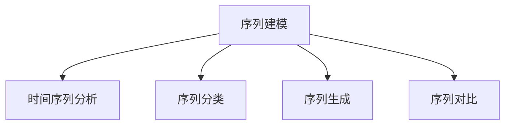

                 


# 序列建模

> 关键词：序列建模、时间序列分析、序列分类、序列生成、序列对比

> 摘要：本文旨在深入探讨序列建模的理论基础、方法和技术，包括时间序列分析、序列分类、序列生成和序列对比等内容。通过详细的步骤分析和案例实践，帮助读者全面了解和掌握序列建模的核心技术和应用。

## 《序列建模》目录大纲

### 第一部分：序列建模基础

#### 第1章：序列建模概述

##### 1.1 序列建模的概念与意义
##### 1.2 序列建模的应用领域
##### 1.3 序列建模的主要类型

#### 第2章：时间序列分析

##### 2.1 时间序列的基本概念
##### 2.2 时间序列数据的预处理
##### 2.3 时间序列分析的方法

#### 第3章：序列分类

##### 3.1 序列分类的基本概念
##### 3.2 序列分类的常见算法
##### 3.3 序列分类的评估指标

#### 第4章：序列生成

##### 4.1 序列生成的概念与意义
##### 4.2 序列生成的算法
##### 4.3 序列生成的应用场景

#### 第5章：序列对比

##### 5.1 序列对比的概念与意义
##### 5.2 序列对比的常见算法
##### 5.3 序列对比的应用场景

### 第二部分：序列建模实践

#### 第6章：序列建模项目实战

##### 6.1 项目背景与需求
##### 6.2 数据收集与预处理
##### 6.3 序列建模模型选择
##### 6.4 模型训练与调优
##### 6.5 模型评估与优化

#### 第7章：序列建模工具与应用

##### 7.1 序列建模工具介绍
##### 7.2 序列建模工具使用技巧
##### 7.3 序列建模工具在实际项目中的应用

#### 第8章：序列建模的未来发展趋势

##### 8.1 序列建模技术的发展趋势
##### 8.2 序列建模在人工智能领域的作用
##### 8.3 序列建模的未来挑战与机遇

### 第三部分：附录

#### 附录A：序列建模相关资源

##### A.1 序列建模的经典论文与书籍推荐
##### A.2 序列建模的在线课程与讲座推荐
##### A.3 序列建模的常用开源库与工具推荐

---

## 图1-1 序列建模的核心概念与联系



---

## 1.1 序列建模的概念与意义

序列建模（Sequence Modeling）是一种利用数学模型和算法对序列数据进行建模和预测的方法。序列数据是指按时间顺序排列的一组数据，如时间序列数据、事件序列数据等。序列建模的主要目标是理解序列数据中的规律性和模式，并利用这些规律性进行预测、分类或生成新的序列数据。

### 概念

- **序列数据**：按时间顺序排列的一组数据，如股票价格、气温变化、文本句子等。
- **序列建模**：使用数学模型和算法对序列数据进行建模和分析，以揭示序列数据中的规律性和模式。

### 意义

序列建模在多个领域具有重要意义，主要包括以下几个方面：

1. **预测与规划**：序列建模可以预测未来时间点的数据值，帮助企业和组织进行战略规划、资源分配和风险管理。
2. **数据分析**：序列建模可以帮助分析序列数据中的周期性、趋势性和随机性，从而深入了解数据特征。
3. **文本生成**：在自然语言处理领域，序列建模可以用于生成新的文本内容，如文章、对话等。
4. **图像生成**：在计算机视觉领域，序列建模可以用于生成新的图像序列，如动画、视频等。
5. **异常检测**：序列建模可以帮助识别序列数据中的异常行为或事件，用于安全监控、欺诈检测等。

### 应用领域

序列建模在多个领域有广泛应用，主要包括：

1. **金融领域**：用于股票市场预测、风险管理、投资组合优化等。
2. **医疗领域**：用于疾病预测、诊断、药物研发等。
3. **工业领域**：用于生产计划、供应链管理、设备维护等。
4. **自然语言处理**：用于文本生成、情感分析、机器翻译等。
5. **计算机视觉**：用于图像生成、目标检测、动作识别等。

---

## 1.2 序列建模的应用领域

序列建模在众多领域都有广泛的应用，以下是几个典型的应用领域及其具体应用场景：

### 金融领域

在金融领域，序列建模主要用于预测股票价格、外汇汇率、市场趋势等。具体应用包括：

- **股票市场预测**：利用历史股价数据，通过时间序列分析和序列生成模型预测未来股价走势，为投资者提供参考。
- **风险管理**：通过序列建模分析金融产品的风险，如信用风险、市场风险等，帮助金融机构进行风险评估和管理。
- **投资组合优化**：利用序列建模优化投资组合，以最大化投资回报或最小化风险。

### 医疗领域

在医疗领域，序列建模可以用于疾病预测、诊断、药物研发等。具体应用包括：

- **疾病预测**：通过分析患者的医疗记录和健康数据，利用时间序列分析和序列分类模型预测疾病的发生概率。
- **诊断辅助**：利用序列建模分析医学图像序列，如CT、MRI等，辅助医生进行疾病诊断。
- **药物研发**：通过序列建模分析药物分子序列，预测药物对特定疾病的疗效和副作用。

### 工业领域

在工业领域，序列建模主要用于生产计划、供应链管理、设备维护等。具体应用包括：

- **生产计划**：通过分析历史生产数据，利用序列建模预测未来的生产需求，优化生产计划。
- **供应链管理**：利用序列建模预测供应链中的需求变化，优化库存水平和供应链流程。
- **设备维护**：通过分析设备运行数据，利用序列建模预测设备故障，提前进行维护和维修。

### 自然语言处理

在自然语言处理领域，序列建模主要用于文本生成、情感分析、机器翻译等。具体应用包括：

- **文本生成**：通过序列生成模型生成新的文本内容，如文章、对话等。
- **情感分析**：通过序列分类模型分析文本中的情感倾向，用于舆情监测、市场分析等。
- **机器翻译**：通过序列建模模型实现文本的自动翻译，如将一种语言翻译成另一种语言。

### 计算机视觉

在计算机视觉领域，序列建模主要用于图像生成、目标检测、动作识别等。具体应用包括：

- **图像生成**：通过序列生成模型生成新的图像序列，如动画、视频等。
- **目标检测**：通过序列分类模型识别图像中的目标物体，用于视频监控、自动驾驶等。
- **动作识别**：通过序列建模模型分析视频中的动作序列，用于人机交互、智能监控等。

总的来说，序列建模在各个领域的应用都离不开对序列数据的理解和分析。通过深入理解序列建模的理论和方法，我们可以更好地应对实际应用中的挑战，为各领域的发展做出贡献。

---

## 1.3 序列建模的主要类型

序列建模技术主要分为时间序列分析、序列分类、序列生成和序列对比等类型，每种类型都有其独特的应用场景和方法。

### 时间序列分析

**时间序列分析**主要用于预测未来的时间点数据，常见的方法包括：

- **ARIMA模型**：自回归积分滑动平均模型，适用于线性时间序列数据。
- **LSTM模型**：长短期记忆网络，适用于非线性时间序列数据。
- ** Prophet**：由Facebook开发的时间序列预测库，适用于具有季节性和趋势性的时间序列数据。

### 序列分类

**序列分类**用于将序列数据分类到预定义的类别中，常见的方法包括：

- **决策树和随机森林**：基于规则的方法，适用于小规模序列数据。
- **朴素贝叶斯**：基于概率的方法，适用于特征较少的序列数据。
- **K最近邻**：基于实例的方法，适用于高维序列数据。
- **神经网络**：如卷积神经网络（CNN）和循环神经网络（RNN），适用于复杂序列数据的分类。

### 序列生成

**序列生成**用于生成新的序列数据，常见的方法包括：

- **生成对抗网络（GAN）**：通过生成器和判别器的对抗训练生成新的序列数据。
- **变分自编码器（VAE）**：通过编码器和解码器学习数据的分布，并生成新的序列数据。
- **循环神经网络（RNN）**：适用于生成具有序列性的数据，如文本和语音。

### 序列对比

**序列对比**用于比较两个或多个序列的相似性或差异性，常见的方法包括：

- **动态时间弯曲（DTW）**：通过最小化序列间的距离来比较序列的相似性。
- **编辑距离**：计算两个序列之间的最小编辑距离，用于序列差异分析。
- **Cosine相似性**：计算两个序列向量之间的余弦相似性，用于序列相似性分析。

### 比较与应用

- **时间序列分析**：主要用于预测，适用于金融、医疗等领域的趋势预测。
- **序列分类**：主要用于分类，适用于文本分类、图像分类等任务。
- **序列生成**：主要用于数据增强和生成，适用于文本生成、图像生成等任务。
- **序列对比**：主要用于序列相似性或差异性分析，适用于异常检测、序列搜索等任务。

每种序列建模类型都有其独特的应用场景和方法，根据具体任务需求选择合适的方法和工具，可以更好地实现序列建模的目标。

---

## 2.1 时间序列的基本概念

时间序列（Time Series）是按照时间顺序排列的一组数据点，通常用于记录某个变量随时间的变化情况。时间序列数据在金融、经济、气象、医疗等多个领域有广泛的应用，能够帮助我们预测未来趋势、分析历史模式、制定策略等。

### 概念定义

时间序列可以形式化地表示为一个函数或序列，通常用 \( X_t \) 表示，其中 \( t \) 代表时间点，而 \( x_{ti} \) 代表在时间点 \( t \) 的第 \( i \) 个观测值。例如，一个股票价格的时间序列可以表示为：

\[ X_t = (x_{t1}, x_{t2}, ..., x_{tn}) \]

其中，\( x_{ti} \) 可能是股票价格的数值，也可能是一个向量，表示在时间点 \( t \) 的多个相关特征。

### 特征分析

时间序列数据通常具有以下特征：

1. **随机性**：时间序列数据受到随机因素的影响，导致数据呈现出一定的随机波动。这意味着即使掌握了全部历史数据，也不能完全准确地预测未来值。

2. **序列性**：时间序列数据具有时间相关性，即当前时间点的数据与过去的时间点数据之间存在一定的相关性。这种相关性是时间序列分析的重要基础。

3. **周期性**：某些时间序列数据可能会受到季节性、趋势性等因素的影响，呈现出周期性波动。例如，气温、销售量等数据通常会随季节变化而波动。

4. **趋势性**：时间序列数据可能会表现出长期的增长或下降趋势，这种趋势可以是线性的或非线性的。

### 数据表示

时间序列数据可以用图表（如折线图、柱状图等）表示，也可以用数值或矩阵表示。在实际应用中，常常使用时间序列分析的软件工具（如R语言、Python中的Pandas库等）进行数据处理和分析。

例如，以下是一个简单的时间序列数据的Python代码表示：

```python
import pandas as pd

# 创建时间序列数据
date_rng = pd.date_range(start='2021-01-01', end='2021-12-31', freq='MS')
ts_data = pd.Series(np.random.randn(len(date_rng)), index=date_rng)

# 可视化时间序列数据
ts_data.plot()
```

通过可视化，我们可以直观地观察到时间序列数据的基本特征，为后续的分析和建模提供基础。

---

## 2.2 时间序列数据的预处理

在时间序列分析中，数据预处理是一个至关重要的步骤。预处理的好坏直接影响到模型的效果和预测的准确性。以下是一些常见的时间序列数据预处理步骤：

### 数据清洗

数据清洗是数据预处理的第一步，其主要目标是去除数据中的噪声和异常值，确保数据的完整性和一致性。常见的清洗操作包括：

- **去除缺失值**：可以通过填充或删除的方式来处理缺失值。常用的填充方法包括均值填充、中值填充、前值填充等。
- **去除异常值**：可以通过统计方法（如箱线图）或机器学习方法（如异常检测算法）来检测并处理异常值。对于异常值，可以选择删除或调整其值。

以下是一个使用Python进行数据清洗的示例：

```python
import pandas as pd
from scipy import stats

# 创建包含缺失值和异常值的时间序列数据
date_rng = pd.date_range(start='2021-01-01', end='2021-12-31', freq='MS')
ts_data = pd.Series(np.random.randn(len(date_rng)), index=date_rng)
ts_data[10:15] = np.nan  # 添加缺失值
ts_data[20:25] = stats.norm.rvs(size=5) * 10 + 50  # 添加异常值

# 数据清洗
ts_data.fillna(ts_data.mean(), inplace=True)  # 均值填充缺失值
ts_data = ts_data[ts_data.between(ts_data.mean() - 3 * ts_data.std(), ts_data.mean() + 3 * ts_data.std())]  # 去除异常值

# 可视化清洗后的时间序列数据
ts_data.plot()
```

### 数据标准化

数据标准化是将不同来源的数据进行统一处理，使其具有相同的数值范围和单位。常见的标准化方法包括：

- **均值标准化**：将数据减去均值后除以标准差，使其服从标准正态分布。
- **极值标准化**：将数据缩放到[0, 1]范围内。
- **Z-Score标准化**：计算每个数据点与均值的差值除以标准差。

以下是一个使用Python进行数据标准化的示例：

```python
# 数据标准化
ts_data_mean = ts_data.mean()
ts_data_std = ts_data.std()
ts_data_stdized = (ts_data - ts_data_mean) / ts_data_std

# 可视化标准化后的时间序列数据
ts_data_stdized.plot()
```

### 数据分割

数据分割是将数据集划分为训练集、验证集和测试集，以便模型训练和评估。常见的方法包括：

- **按时间分割**：将数据按照时间顺序分割为训练集、验证集和测试集。
- **随机分割**：将数据随机分割为训练集和测试集，适用于时间序列数据。

以下是一个使用Python进行数据分割的示例：

```python
# 数据分割
train_size = int(len(ts_data) * 0.8)
train_data, test_data = ts_data[:train_size], ts_data[train_size:]

# 可视化分割后的时间序列数据
plt.figure(figsize=(12, 6))
plt.plot(train_data, label='Train Data')
plt.plot(test_data, label='Test Data')
plt.legend()
plt.show()
```

通过上述步骤，我们可以对时间序列数据进行有效的预处理，为后续的建模和分析打下坚实的基础。

---

## 2.3 时间序列分析的方法

时间序列分析是研究时间序列数据中隐含的模式、趋势和规律性的方法，旨在揭示时间序列数据的内在特征并对其进行预测。以下是几种常见的时间序列分析方法：

### ARIMA模型

**ARIMA模型**（自回归积分滑动平均模型）是一种经典的统计模型，用于分析线性时间序列数据。ARIMA模型由三个部分组成：自回归（AR）、差分（I）和移动平均（MA）。

- **自回归（AR）**：自回归模型利用过去的时间点值来预测当前时间点值，即当前值是过去几个值的线性组合。
- **差分（I）**：差分操作用于消除时间序列数据中的趋势性和季节性，使其变成平稳序列。平稳序列是指序列的统计特性（如均值、方差等）不随时间变化。
- **移动平均（MA）**：移动平均模型利用过去的时间点值的平均值来预测当前时间点值，即当前值是过去几个值的加权平均。

ARIMA模型的伪代码如下：

```python
# 伪代码：ARIMA模型
def arima_model(data, p, d, q):
    # p：自回归项数
    # d：差分阶数
    # q：移动平均项数

    # 差分
    if d > 0:
        data = differencing(data, d)

    # 自回归
    ar_model = AR(order=(p, d, q))
    ar_model.fit(data)

    # 移动平均
    ma_model = MA(order=(p, d, q))
    ma_model.fit(data)

    # 结合AR和MA得到ARIMA模型
    arima_model = ARIMA(order=(p, d, q))
    arima_model.fit(data)

    # 预测
    prediction = arima_model.predict(n_periods)
    return prediction
```

### LSTM模型

**LSTM模型**（长短期记忆网络）是一种循环神经网络（RNN）的变体，特别适合处理时间序列数据。LSTM模型能够有效地捕捉时间序列中的长期依赖关系，避免传统RNN的梯度消失问题。

LSTM模型的伪代码如下：

```python
# 伪代码：LSTM模型
class LSTMModel(nn.Module):
    def __init__(self, input_size, hidden_size, num_layers):
        super(LSTMModel, self).__init__()
        self.hidden_size = hidden_size
        self.num_layers = num_layers
        
        self.lstm = nn.LSTM(input_size, hidden_size, num_layers, batch_first=True)
        self.linear = nn.Linear(hidden_size, 1)

    def forward(self, x):
        h0 = torch.zeros(self.num_layers, x.size(0), self.hidden_size).to(x.device)
        c0 = torch.zeros(self.num_layers, x.size(0), self.hidden_size).to(x.device)
        
        out, _ = self.lstm(x, (h0, c0))
        out = self.linear(out[:, -1, :])
        return out
```

### Prophet模型

**Prophet模型**是由Facebook开发的一种时间序列预测工具，适用于具有季节性和趋势性的数据。Prophet模型能够自动识别和建模季节性、趋势性和节假日效应。

Prophet模型的伪代码如下：

```python
# 伪代码：Prophet模型
from fbprophet import Prophet

# 初始化Prophet模型
model = Prophet()

# 添加季节性
model.add_seasonality(name='month', period=365.25, fourier_order=3)

# 添加趋势性
model.add_regressor('year')

# 添加假期效应
model.add_holiday_seasonality()

# 绑定数据
model.fit(df)

# 预测
future = model.make_future_dataframe(periods=365)
forecast = model.predict(future)

# 可视化
model.plot(forecast)
```

### 方法比较

- **ARIMA模型**：适用于线性时间序列数据，模型参数需要手动选择，适合对模型参数有深刻理解的用户。
- **LSTM模型**：适用于非线性时间序列数据，能够捕捉长期依赖关系，但训练时间较长。
- **Prophet模型**：适用于具有季节性和趋势性的数据，操作简单，自动识别和建模季节性。

选择合适的模型和方法取决于数据的特征和应用场景。通过合理的时间序列分析，我们可以更好地理解数据、预测未来趋势，并为决策提供有力支持。

---

## 3.1 序列分类的基本概念

序列分类（Sequence Classification）是一种将序列数据分类到预定义类别中的任务。在序列分类中，每个类别通常表示一个具体的含义或标签。序列分类广泛应用于自然语言处理、语音识别、生物信息学等多个领域。其基本概念包括：

### 数据表示

序列分类中的数据通常表示为一组有序的数值或符号。一个简单的序列分类例子是文本分类，其中序列数据是一系列单词，每个单词表示为一个向量。例如，一个句子 "I love programming" 可以表示为一系列单词的向量。

### 类别表示

类别表示为预定义的标签，用于指示序列数据的类别。例如，在文本分类任务中，类别可以是“科技”、“娱乐”、“体育”等。

### 分类任务

序列分类任务的目标是学习一个分类器，该分类器能够根据输入序列预测其对应的类别。分类任务通常分为以下几个步骤：

1. **数据预处理**：对序列数据进行清洗、标准化等预处理操作，以便于模型训练。
2. **特征提取**：将序列数据转换成适合分类器训练的向量表示，例如，可以使用词袋模型（Bag of Words）、TF-IDF等特征提取方法。
3. **模型训练**：使用训练数据集对分类模型进行训练，常见的序列分类模型包括朴素贝叶斯、支持向量机（SVM）、决策树、随机森林等。
4. **模型评估**：使用测试数据集评估模型的性能，常用的评估指标包括准确率、精确率、召回率、F1值等。
5. **模型部署**：将训练好的模型部署到实际应用场景中，用于对新序列数据进行分类预测。

### 分类算法

序列分类算法分为基于规则的方法、基于机器学习的方法和基于深度学习的方法。

- **基于规则的方法**：如决策树、随机森林等，通过构建规则树进行分类。
- **基于机器学习的方法**：如朴素贝叶斯、支持向量机（SVM）、K最近邻（KNN）等，通过学习序列数据的统计特征进行分类。
- **基于深度学习的方法**：如循环神经网络（RNN）、卷积神经网络（CNN）、长短期记忆网络（LSTM）等，通过学习序列数据的复杂模式进行分类。

序列分类任务的基本流程可以概括为：数据预处理 → 特征提取 → 模型训练 → 模型评估 → 模型部署。通过合理的序列分类算法和流程，我们可以有效地对序列数据进行分类，为实际应用提供有力支持。

---

## 3.2 序列分类的常见算法

序列分类任务在多个领域都有广泛应用，以下介绍几种常见的序列分类算法，包括基于规则的方法、基于机器学习的方法和基于深度学习的方法。

### 基于规则的方法

#### 决策树

决策树是一种基于规则的方法，通过构建决策树来对序列数据进行分类。决策树的每个节点代表一个特征，每个分支代表该特征的取值。决策树通过递归地划分数据集，将数据划分为越来越纯净的子集，直到达到某个终止条件（如最大深度、最小叶节点数量等）。

决策树的伪代码如下：

```python
# 伪代码：决策树
class DecisionTreeClassifier:
    def fit(self, X, y):
        self.tree = self._build_tree(X, y)

    def _build_tree(self, X, y):
        # 如果满足终止条件，则返回叶节点
        if some_termination_condition:
            return LeafNode(y)
        
        # 选择最优特征和分割点
        best_feature, best_split = self._find_best_split(X, y)
        
        # 根据分割点划分数据集
        left_child = self._build_tree(X[:, best_split < 0], y[best_split < 0])
        right_child = self._build_tree(X[:, best_split >= 0], y[best_split >= 0])
        
        # 返回决策树
        return DecisionNode(best_feature, best_split, left_child, right_child)

    def predict(self, X):
        # 对于每个样本，从根节点开始递归地向下遍历决策树
        return self._predict_sample(X, self.tree)
    
    def _predict_sample(self, X, node):
        if isinstance(node, LeafNode):
            return node.label
        if X[:, node.split_feature] < node.split_value:
            return self._predict_sample(X, node.left_child)
        else:
            return self._predict_sample(X, node.right_child)
```

#### 随机森林

随机森林是一种集成学习方法，通过构建多个决策树并合并它们的预测结果来提高分类性能。随机森林通过随机选择特征和样本子集来构建每个决策树，从而减少过拟合。

随机森林的伪代码如下：

```python
# 伪代码：随机森林
class RandomForestClassifier:
    def fit(self, X, y, n_estimators):
        self.trees = [DecisionTreeClassifier() for _ in range(n_estimators)]
        for tree in self.trees:
            X_subset, y_subset = self._sample_data(X, y)
            tree.fit(X_subset, y_subset)

    def predict(self, X):
        predictions = [tree.predict(X) for tree in self.trees]
        return majority_vote(predictions)
    
    def _sample_data(self, X, y, n_samples=None, n_features=None):
        if n_samples is not None:
            sample_indices = np.random.choice(range(len(X)), size=n_samples, replace=False)
            X_subset = X[sample_indices]
            y_subset = y[sample_indices]
        if n_features is not None:
            feature_indices = np.random.choice(range(X.shape[1]), size=n_features, replace=False)
            X_subset = X[:, feature_indices]
        return X_subset, y_subset

    def majority_vote(self, predictions):
        # 计算每个类别的投票次数
        vote_counts = np.bincount(predictions)
        # 返回投票次数最多的类别
        return vote_counts.argmax()
```

### 基于机器学习的方法

#### 朴素贝叶斯

朴素贝叶斯是一种基于贝叶斯定理的简单分类模型，假设特征之间相互独立。朴素贝叶斯通过计算每个类别的概率，并选择具有最高概率的类别作为预测结果。

朴素贝叶斯的伪代码如下：

```python
# 伪代码：朴素贝叶斯
class NaiveBayesClassifier:
    def fit(self, X, y):
        self.class_probabilities = self._calculate_class_probabilities(y)
        self.feature_probabilities = self._calculate_feature_probabilities(X, y)

    def predict(self, X):
        probabilities = self._calculate_class_probabilities(X)
        return np.argmax(probabilities)

    def _calculate_class_probabilities(self, y):
        unique_classes = np.unique(y)
        class_probabilities = {}
        for class_ in unique_classes:
            count = np.sum(y == class_)
            class_probabilities[class_] = count / len(y)
        return class_probabilities

    def _calculate_feature_probabilities(self, X, y):
        unique_classes = np.unique(y)
        feature_probabilities = {}
        for class_ in unique_classes:
            class_data = X[y == class_]
            feature_counts = np.sum(class_data, axis=0)
            total_counts = np.sum(feature_counts)
            feature_probabilities[class_] = feature_counts / total_counts
        return feature_probabilities

    def _calculate_class_probabilities(self, X):
        probabilities = np.zeros((X.shape[0], len(self.class_probabilities)))
        for i, sample in enumerate(X):
            for class_, class_probability in self.class_probabilities.items():
                feature_probabilities = self.feature_probabilities[class_]
                probabilities[i, class_] = class_probability
                for feature in sample:
                    probabilities[i, class_] *= feature_probabilities[feature]
        return probabilities
```

#### 支持向量机（SVM）

支持向量机是一种基于间隔最大化的分类模型，通过找到一个最优的超平面，将不同类别的样本分隔开来。SVM可以分为线性SVM和核SVM。

线性SVM的伪代码如下：

```python
# 伪代码：线性SVM
class LinearSVC:
    def fit(self, X, y):
        self.w = self._solve_linear_equation(X, y)

    def predict(self, X):
        return np.sign(np.dot(X, self.w))

    def _solve_linear_equation(self, X, y):
        # Solve the linear equation using the normal equation or gradient descent
        # depending on the chosen optimization method
        return np.linalg.inv(X.T @ X).dot(X.T @ y)
```

核SVM的伪代码如下：

```python
# 伪代码：核SVM
class KernelSVC:
    def fit(self, X, y, kernel='rbf'):
        self.kernel = kernel
        self.w, self.b = self._solve_kernel_equation(X, y)

    def predict(self, X):
        return np.sign(self._compute_kernel_matrix(X) @ self.w + self.b)

    def _solve_kernel_equation(self, X, y):
        # Solve the kernel equation using the normal equation or gradient descent
        # depending on the chosen optimization method
        K = self._compute_kernel_matrix(X)
        return np.linalg.inv(K @ K.T).dot(K @ y)
    
    def _compute_kernel_matrix(self, X):
        # Compute the kernel matrix using the chosen kernel function
        if self.kernel == 'linear':
            return np.dot(X, X.T)
        elif self.kernel == 'rbf':
            return np.exp(-gamma * np.linalg.norm(X[:, np.newaxis] - X[np.newaxis, :], axis=2) ** 2)
```

### 基于深度学习的方法

#### 循环神经网络（RNN）

循环神经网络是一种能够处理序列数据的神经网络，通过递归地处理序列中的每个元素，并利用其隐藏状态来捕捉序列中的长期依赖关系。

RNN的伪代码如下：

```python
# 伪代码：RNN
class RNN:
    def __init__(self, input_size, hidden_size):
        self.hidden_size = hidden_size
        self.input_size = input_size
        self.W_h = np.random.randn(hidden_size, hidden_size)
        self.W_x = np.random.randn(hidden_size, input_size)
        self.b_h = np.zeros((hidden_size, 1))
        self.b_x = np.zeros((hidden_size, 1))

    def forward(self, x):
        self.h = np.tanh(np.dot(self.W_h, self.h) + np.dot(self.W_x, x) + self.b_x + self.b_h)
        return self.h

    def init_hidden(self, hidden_state=None):
        if hidden_state is None:
            self.h = np.zeros((self.hidden_size, 1))
        else:
            self.h = hidden_state
```

#### 长短期记忆网络（LSTM）

长短期记忆网络是一种特殊的循环神经网络，通过引入门控机制来有效地捕捉序列中的长期依赖关系。

LSTM的伪代码如下：

```python
# 伪代码：LSTM
class LSTM:
    def __init__(self, input_size, hidden_size):
        self.hidden_size = hidden_size
        self.input_size = input_size
        self.W_i = np.random.randn(hidden_size, input_size)
        self.W_f = np.random.randn(hidden_size, input_size)
        self.W_o = np.random.randn(hidden_size, input_size)
        self.W_g = np.random.randn(hidden_size, input_size)
        self.b_i = np.zeros((hidden_size, 1))
        self.b_f = np.zeros((hidden_size, 1))
        self.b_o = np.zeros((hidden_size, 1))
        self.b_g = np.zeros((hidden_size, 1))

    def forward(self, x, h_prev, c_prev):
        i = np.dot(self.W_i, x) + self.b_i + np.dot(self.W_h, h_prev) + self.b_h
        f = np.dot(self.W_f, x) + self.b_f + np.dot(self.W_h, h_prev) + self.b_h
        o = np.dot(self.W_o, x) + self.b_o + np.dot(self.W_h, h_prev) + self.b_h
        g = np.dot(self.W_g, x) + self.b_g + np.dot(self.W_h, h_prev) + self.b_h

        i = sigmoid(i)
        f = sigmoid(f)
        o = sigmoid(o)
        g = tanh(g)

        c = f * c_prev + i * g
        h = o * tanh(c)

        return h, c
```

通过上述介绍，我们可以看到序列分类任务有多种不同的算法可供选择，每种算法都有其优缺点和适用场景。根据具体任务需求，选择合适的算法和模型，可以有效地实现序列分类任务。

---

## 3.3 序列分类的评估指标

在序列分类任务中，评估指标用于衡量分类模型的表现和准确性。以下是几种常用的评估指标，包括准确率、精确率、召回率、F1值和精度-召回率曲线。

### 准确率（Accuracy）

准确率（Accuracy）是评估分类模型性能的基本指标，表示分类模型预测正确的样本数占总样本数的比例。

\[ \text{Accuracy} = \frac{\text{TP} + \text{TN}}{\text{TP} + \text{TN} + \text{FP} + \text{FN}} \]

其中，\( \text{TP} \) 表示真实为正类且被预测为正类的样本数，\( \text{TN} \) 表示真实为负类且被预测为负类的样本数，\( \text{FP} \) 表示真实为负类但被预测为正类的样本数，\( \text{FN} \) 表示真实为正类但被预测为负类的样本数。

### 精确率（Precision）

精确率（Precision）表示预测为正类的样本中，实际为正类的比例。

\[ \text{Precision} = \frac{\text{TP}}{\text{TP} + \text{FP}} \]

### 召回率（Recall）

召回率（Recall）表示实际为正类的样本中，被预测为正类的比例。

\[ \text{Recall} = \frac{\text{TP}}{\text{TP} + \text{FN}} \]

### F1值（F1-score）

F1值（F1-score）是精确率和召回率的调和平均值，用于综合考虑精确率和召回率。

\[ \text{F1} = 2 \times \frac{\text{Precision} \times \text{Recall}}{\text{Precision} + \text{Recall}} \]

### 精度-召回率曲线（Precision-Recall Curve）

精度-召回率曲线展示了在不同阈值下，精确率和召回率的变化关系。曲线下方面积（Area Under Curve, AUC）可以用来评价模型的整体性能。

### 精度-召回率指标（Area Under Curve, AUC）

精度-召回率指标（AUC）是精度-召回率曲线下方面的面积，用于评价模型的整体性能。

在实际应用中，根据具体任务需求和数据特点，可以选择合适的评估指标来评估模型的性能。例如，在医疗诊断中，可能会更关注召回率，以确保不会遗漏任何真实的正类样本；而在文本分类中，可能会更关注精确率，以避免将非相关的文本分类到正类。

### 代码示例

以下是一个Python代码示例，用于计算上述评估指标：

```python
from sklearn.metrics import accuracy_score, precision_score, recall_score, f1_score, precision_recall_curve

# 预测结果
y_pred = model.predict(X_test)
y_test = target_test

# 准确率
accuracy = accuracy_score(y_test, y_pred)
print("Accuracy:", accuracy)

# 精确率
precision = precision_score(y_test, y_pred)
print("Precision:", precision)

# 召回率
recall = recall_score(y_test, y_pred)
print("Recall:", recall)

# F1值
f1 = f1_score(y_test, y_pred)
print("F1-score:", f1)

# 精度-召回率曲线
precision, recall, _ = precision_recall_curve(y_test, y_pred)
plt.plot(recall, precision)
plt.xlabel('Recall')
plt.ylabel('Precision')
plt.title('Precision-Recall Curve')
plt.show()
```

通过这些评估指标，我们可以全面了解和评估序列分类模型的表现，从而为模型优化和决策提供依据。

---

## 4.1 序列生成的概念与意义

序列生成（Sequence Generation）是一种通过模型生成新的序列数据的过程。序列数据可以是一系列数值、文本或图像，其应用领域广泛，包括自然语言处理、计算机视觉、语音识别等。序列生成在文本生成、图像生成、视频生成等方面具有重要意义。

### 概念

序列生成涉及以下基本概念：

- **序列数据**：按时间顺序排列的数据集合，如文本序列、语音序列、图像序列等。
- **生成模型**：用于生成新序列数据的模型，如生成对抗网络（GAN）、变分自编码器（VAE）等。
- **训练数据**：用于训练生成模型的原始序列数据集。

### 意义

序列生成在多个领域具有重要作用：

1. **数据增强**：通过生成新的序列数据，可以增加训练数据的多样性，提高模型的泛化能力。
2. **文本生成**：序列生成模型可以生成新的文本内容，如文章、对话等，应用于自然语言处理领域。
3. **图像生成**：序列生成模型可以生成新的图像序列，如动画、视频等，应用于计算机视觉领域。
4. **语音合成**：序列生成模型可以生成新的语音序列，用于语音合成和语音识别领域。
5. **数据恢复**：序列生成模型可以用于数据修复和恢复，如音频修复、视频修复等。

### 应用场景

以下是序列生成在几个应用领域的具体应用场景：

1. **自然语言处理**：序列生成模型可以用于生成文章、对话、摘要等，如自动写作、聊天机器人等。
2. **计算机视觉**：序列生成模型可以用于图像生成和视频生成，如生成对抗网络（GAN）在图像生成中的应用。
3. **医学图像处理**：序列生成模型可以用于医学图像的修复和生成，提高医学影像的诊断准确性。
4. **语音识别**：序列生成模型可以用于语音合成和语音生成，如基于循环神经网络（RNN）的语音合成系统。

总的来说，序列生成技术在各个领域的应用不断扩展，通过模型生成新的序列数据，为数据增强、文本生成、图像生成等提供了强有力的支持。

---

## 4.2 序列生成的算法

序列生成算法是构建序列生成模型的关键，旨在学习输入序列的统计特性，并生成具有相似统计特性的新序列。以下是几种常见的序列生成算法及其原理。

### 生成对抗网络（GAN）

**生成对抗网络（GAN）** 是一种由生成器和判别器组成的对抗性模型。生成器尝试生成逼真的数据，而判别器尝试区分生成数据和真实数据。两者通过对抗训练，不断优化，从而生成高质量的数据。

#### 原理

1. **生成器（Generator）**：生成器接收随机噪声作为输入，并生成假数据。其目标是使生成数据尽可能逼真。
2. **判别器（Discriminator）**：判别器接收真实数据和生成数据，并预测数据的真假。其目标是准确地区分真实数据和生成数据。
3. **对抗训练**：生成器和判别器交替训练。生成器尝试生成更逼真的数据，而判别器尝试提高辨别能力。

GAN的伪代码如下：

```python
# 伪代码：GAN
class GAN():
    def __init__(self, generator, discriminator):
        self.generator = generator
        self.discriminator = discriminator

    def train(self, data, num_epochs):
        for epoch in range(num_epochs):
            for batch in data:
                # 生成器生成假数据
                noise = np.random.normal(0, 1, (batch_size, noise_dim))
                generated_samples = self.generator(noise)

                # 训练判别器
                real_data = batch
                real_labels = np.ones((batch_size, 1))
                fake_labels = np.zeros((batch_size, 1))
                d_loss_real = self.discriminator.train_on_batch(real_data, real_labels)
                d_loss_fake = self.discriminator.train_on_batch(generated_samples, fake_labels)

                # 训练生成器
                noise = np.random.normal(0, 1, (batch_size, noise_dim))
                g_loss = self.generator.train_on_batch(noise, real_labels)

                print(f"Epoch {epoch}, D Loss: {d_loss_real + d_loss_fake}, G Loss: {g_loss}")
```

### 变分自编码器（VAE）

**变分自编码器（VAE）** 是一种基于概率生成模型的序列生成算法。VAE通过编码器和解码器来学习数据的分布，并生成新的数据。

#### 原理

1. **编码器（Encoder）**：编码器接收输入序列，并输出其潜在变量表示。
2. **解码器（Decoder）**：解码器接收潜在变量，并生成新的数据序列。
3. **重参数化**：VAE使用重参数化技巧，将潜在变量与噪声结合，使其生成过程具有可变性。

VAE的伪代码如下：

```python
# 伪代码：VAE
class VAE():
    def __init__(self, encoder, decoder):
        self.encoder = encoder
        self.decoder = decoder

    def encode(self, x):
        z_mean, z_log_var = self.encoder(x)
        z = z_mean + np.exp(0.5 * z_log_var) * np.random.normal(size=z_mean.shape)
        return z

    def decode(self, z):
        x_hat = self.decoder(z)
        return x_hat

    def train(self, data, num_epochs):
        for epoch in range(num_epochs):
            for batch in data:
                z = self.encode(batch)
                x_hat = self.decode(z)
                loss = self._vae_loss(batch, x_hat, z_mean, z_log_var)
                self.optimizer.minimize(loss, batch)

                print(f"Epoch {epoch}, Loss: {loss}")
```

### 循环神经网络（RNN）

**循环神经网络（RNN）** 是一种能够处理序列数据的神经网络，适用于生成序列数据。

#### 原理

1. **隐藏状态**：RNN通过递归地更新隐藏状态，捕捉序列中的长期依赖关系。
2. **输入层**：输入层接收序列数据。
3. **隐藏层**：隐藏层通过递归连接更新隐藏状态，用于生成序列中的下一个元素。
4. **输出层**：输出层生成新的序列数据。

RNN的伪代码如下：

```python
# 伪代码：RNN
class RNN():
    def __init__(self, input_dim, hidden_dim):
        self.hidden_dim = hidden_dim
        self.input_dim = input_dim
        self.W_h = np.random.randn(hidden_dim, hidden_dim)
        self.W_x = np.random.randn(hidden_dim, input_dim)
        self.b_h = np.zeros((hidden_dim, 1))
        self.b_x = np.zeros((hidden_dim, 1))

    def forward(self, x):
        self.h = np.tanh(np.dot(self.W_h, self.h) + np.dot(self.W_x, x) + self.b_x + self.b_h)
        return self.h

    def init_hidden(self, hidden_state=None):
        if hidden_state is None:
            self.h = np.zeros((self.hidden_dim, 1))
        else:
            self.h = hidden_state
```

### 长短期记忆网络（LSTM）

**长短期记忆网络（LSTM）** 是一种特殊的RNN，能够有效地捕捉序列中的长期依赖关系。

#### 原理

1. **遗忘门（Forget Gate）**：遗忘门决定哪些信息应该从记忆中遗忘。
2. **输入门（Input Gate）**：输入门决定哪些新信息应该被存储到记忆中。
3. **输出门（Output Gate）**：输出门决定哪些信息应该输出。

LSTM的伪代码如下：

```python
# 伪代码：LSTM
class LSTM():
    def __init__(self, input_dim, hidden_dim):
        self.hidden_dim = hidden_dim
        self.input_dim = input_dim
        self.W_f = np.random.randn(hidden_dim, hidden_dim)
        self.W_i = np.random.randn(hidden_dim, hidden_dim)
        self.W_o = np.random.randn(hidden_dim, hidden_dim)
        self.W_g = np.random.randn(hidden_dim, hidden_dim)
        self.b_f = np.zeros((hidden_dim, 1))
        self.b_i = np.zeros((hidden_dim, 1))
        self.b_o = np.zeros((hidden_dim, 1))
        self.b_g = np.zeros((hidden_dim, 1))

    def forward(self, x, h_prev, c_prev):
        i = np.dot(self.W_i, x) + self.b_i + np.dot(self.W_h, h_prev) + self.b_h
        f = np.dot(self.W_f, x) + self.b_f + np.dot(self.W_h, h_prev) + self.b_h
        o = np.dot(self.W_o, x) + self.b_o + np.dot(self.W_h, h_prev) + self.b_o
        g = np.dot(self.W_g, x) + self.b_g + np.dot(self.W_h, h_prev) + self.b_g

        i = sigmoid(i)
        f = sigmoid(f)
        o = sigmoid(o)
        g = tanh(g)

        c = f * c_prev + i * g
        h = o * tanh(c)

        return h, c
```

通过上述算法，我们可以生成具有相似统计特性的新序列数据，为数据增强、文本生成、图像生成等提供了强有力的支持。

---

## 4.3 序列生成的应用场景

序列生成技术在各个领域都有广泛应用，以下列举几个典型的应用场景：

### 自然语言处理

在自然语言处理领域，序列生成技术主要用于文本生成和翻译。

- **文本生成**：序列生成模型可以生成新闻文章、社交媒体帖子、诗歌等。例如，使用GPT-3模型，我们可以生成高质量的文本内容，从而辅助写作和创作。
- **文本翻译**：序列生成模型可以用于将一种语言的文本翻译成另一种语言。例如，使用Seq2Seq模型，我们可以实现高效的机器翻译。

### 计算机视觉

在计算机视觉领域，序列生成技术主要用于图像生成和视频生成。

- **图像生成**：序列生成模型可以生成逼真的图像。例如，使用GAN模型，我们可以生成具有高质量细节的图像。
- **视频生成**：序列生成模型可以生成新的视频序列。例如，使用视频生成模型，我们可以根据输入的文本或图像生成相关的视频内容。

### 语音合成

在语音合成领域，序列生成技术主要用于生成语音。

- **语音生成**：序列生成模型可以生成自然流畅的语音。例如，使用基于LSTM的语音合成模型，我们可以将文本转换成语音。

### 医学图像处理

在医学图像处理领域，序列生成技术主要用于图像修复和生成。

- **图像修复**：序列生成模型可以用于修复医学图像中的缺失部分。例如，使用GAN模型，我们可以生成缺失部分的图像，从而提高医学图像的诊断准确性。
- **图像生成**：序列生成模型可以生成新的医学图像。例如，使用VAE模型，我们可以生成具有特定特征的医学图像，从而辅助医学研究和诊断。

### 数据增强

在数据增强领域，序列生成技术主要用于生成新的训练数据。

- **数据增强**：序列生成模型可以用于生成新的数据样本，从而增加训练数据的多样性。例如，使用GAN模型，我们可以生成新的图像数据，从而提高模型的泛化能力。

总的来说，序列生成技术在自然语言处理、计算机视觉、语音合成、医学图像处理和数据增强等领域都有广泛应用，通过生成新的序列数据，可以提升模型性能，推动各个领域的发展。

---

## 5.1 序列对比的概念与意义

序列对比（Sequence Comparison）是指对两个或多个序列进行相似性度量或差异性分析的过程。序列对比在多个领域有广泛应用，如文本相似性分析、基因序列比对、时间序列分析等。其基本概念和意义如下：

### 概念

序列对比涉及以下基本概念：

- **序列数据**：按时间顺序排列的一组数据，可以是数值序列、文本序列、图像序列等。
- **相似性度量**：用于计算两个序列之间的相似程度，如动态时间弯曲（DTW）、编辑距离等。
- **差异性分析**：用于分析多个序列之间的差异性，如基于余弦相似性的序列对比。

### 意义

序列对比在多个领域具有重要意义：

1. **文本相似性分析**：序列对比可以用于判断两个文本的相似性，应用于抄袭检测、信息检索等。
2. **基因序列比对**：序列对比可以用于分析不同基因序列之间的相似性，帮助科学家理解基因功能和进化关系。
3. **时间序列分析**：序列对比可以用于分析多个时间序列之间的相似性或差异性，帮助预测和决策。

### 应用领域

以下是序列对比在几个应用领域的具体应用：

1. **文本相似性分析**：通过序列对比，可以识别出相似或抄袭的文本内容，应用于论文查重、版权保护等。
2. **生物信息学**：通过序列对比，可以分析基因序列或蛋白质序列的相似性，帮助科学家理解生物进化关系。
3. **时间序列分析**：通过序列对比，可以分析不同时间序列之间的相关性，帮助预测未来的趋势和变化。
4. **语音识别**：通过序列对比，可以分析输入语音和标准语音之间的相似性，帮助提高语音识别的准确性。

总的来说，序列对比技术通过计算和分析序列数据之间的相似性或差异性，为文本相似性分析、基因序列比对、时间序列分析等多个领域提供了有效的工具和方法。

---

## 5.2 序列对比的常见算法

序列对比算法在自然语言处理、生物信息学、时间序列分析等领域有广泛应用，用于度量两个或多个序列之间的相似性或差异性。以下是几种常见的序列对比算法：

### 动态时间弯曲（Dynamic Time Warping, DTW）

**动态时间弯曲（DTW）** 是一种基于距离度量的序列对比算法，用于计算两个时间序列之间的相似性。DTW通过在时间轴上进行弹性匹配，使得序列中的每个元素都能匹配上，从而实现最佳匹配。

#### 原理

DTW算法通过构建一个动态规划矩阵来计算两个序列 \( X \) 和 \( Y \) 之间的DTW距离。矩阵中的每个元素 \( DTW(i, j) \) 表示序列 \( X \) 的第 \( i \) 个元素和序列 \( Y \) 的第 \( j \) 个元素之间的距离。

DTW的伪代码如下：

```python
# 伪代码：DTW
def dtw(x, y, distance_metric='euclidean'):
    # 初始化动态规划矩阵
    d = [[0 for _ in range(len(y) + 1)] for _ in range(len(x) + 1)]

    # 初始化边界条件
    for i in range(len(x) + 1):
        d[i][0] = float('inf')
    for j in range(len(y) + 1):
        d[0][j] = float('inf')

    # 动态规划计算DTW距离
    for i in range(1, len(x) + 1):
        for j in range(1, len(y) + 1):
            dist = distance_metric(x[i - 1], y[j - 1])
            d[i][j] = dist + min(d[i - 1][j], d[i][j - 1], d[i - 1][j - 1])

    return d[-1][-1]
```

### 编辑距离（Edit Distance）

**编辑距离** 是一种用于计算两个字符串之间差异性的算法，也称为Levenshtein距离。编辑距离表示将一个字符串转换为另一个字符串所需的最少编辑操作次数。

#### 原理

编辑距离通过构建一个动态规划矩阵来计算两个字符串 \( X \) 和 \( Y \) 之间的编辑距离。矩阵中的每个元素 \( d[i][j] \) 表示字符串 \( X \) 的前 \( i \) 个字符和字符串 \( Y \) 的前 \( j \) 个字符之间的编辑距离。

编辑距离的伪代码如下：

```python
# 伪代码：编辑距离
def edit_distance(x, y):
    # 初始化动态规划矩阵
    d = [[0 for _ in range(len(y) + 1)] for _ in range(len(x) + 1)]

    # 初始化边界条件
    for i in range(len(x) + 1):
        d[i][0] = i
    for j in range(len(y) + 1):
        d[0][j] = j

    # 动态规划计算编辑距离
    for i in range(1, len(x) + 1):
        for j in range(1, len(y) + 1):
            if x[i - 1] == y[j - 1]:
                cost = 0
            else:
                cost = 1
            d[i][j] = min(d[i - 1][j] + 1, d[i][j - 1] + 1, d[i - 1][j - 1] + cost)

    return d[-1][-1]
```

### Cosine相似性（Cosine Similarity）

**Cosine相似性** 是一种基于向量的序列对比算法，用于计算两个序列向量之间的相似度。Cosine相似性通过计算两个向量之间的余弦夹角来衡量它们的相似性。

#### 原理

Cosine相似性通过计算两个序列向量 \( X \) 和 \( Y \) 的点积和各自向量的模长来计算相似性。相似性值介于 -1（完全不同）和 1（完全相同）之间。

Cosine相似性的伪代码如下：

```python
# 伪代码：Cosine相似性
def cosine_similarity(x, y):
    dot_product = sum(a * b for a, b in zip(x, y))
    norm_x = sqrt(sum(a * a for a in x))
    norm_y = sqrt(sum(b * b for b in y))
    return dot_product / (norm_x * norm_y)
```

通过上述算法，我们可以有效地计算和比较两个或多个序列的相似性或差异性，为多个领域的应用提供有力支持。

---

## 5.3 序列对比的应用场景

序列对比技术在多个领域都有广泛应用，以下列举几个典型的应用场景：

### 文本相似性分析

在文本相似性分析中，序列对比算法用于判断两个文本之间的相似度，常见于抄袭检测、信息检索等领域。

- **抄袭检测**：通过比较学生论文和已知文献之间的相似度，可以识别出抄袭行为。
- **信息检索**：通过比较用户查询和文档之间的相似度，可以提高信息检索的准确性。

### 基因序列比对

在生物信息学中，序列对比算法用于比较不同基因序列之间的相似性，帮助科学家理解基因功能和进化关系。

- **基因组学研究**：通过比较不同物种的基因序列，可以揭示基因功能和进化关系。
- **疾病诊断**：通过比较患者的基因序列和正常基因序列，可以辅助疾病诊断。

### 时间序列分析

在时间序列分析中，序列对比算法用于分析多个时间序列之间的相似性或差异性，帮助预测和决策。

- **金融市场分析**：通过比较不同股票市场的价格序列，可以预测市场走势和风险。
- **供应链管理**：通过比较不同供应链环节的序列数据，可以优化供应链流程和库存管理。

### 语音识别

在语音识别中，序列对比算法用于分析输入语音和标准语音之间的相似性，提高识别准确性。

- **语音合成**：通过比较生成的语音和标准语音的相似性，可以优化语音合成质量。
- **语音识别**：通过比较输入语音和标准语音的相似性，可以提高语音识别的准确率和稳定性。

总的来说，序列对比技术在文本相似性分析、基因序列比对、时间序列分析、语音识别等领域都有广泛应用，通过计算和比较序列数据之间的相似性或差异性，为各个领域的发展提供了有力支持。

---

## 6.1 项目背景与需求

### 项目背景

某电商平台希望通过序列建模技术来预测商品销量，以便更好地进行库存管理和营销策略制定。电商平台积累了大量的商品销售数据，包括每天的销售额、库存量、季节性因素以及营销活动等信息。通过对这些数据的分析，电商平台希望能够识别出影响商品销量的关键因素，并利用序列建模技术进行销量预测。

### 项目需求

1. **预测准确性**：提高销量预测的准确性，减少预测误差，以便更好地进行库存管理和营销策略制定。
2. **实时性**：能够实现实时销量预测，以便快速响应市场变化，优化库存水平。
3. **可解释性**：模型需要具有较好的可解释性，以便企业能够理解模型预测结果，并基于此制定相应的策略。
4. **扩展性**：模型需要具备良好的扩展性，能够适应新数据和新业务场景。
5. **自动化

