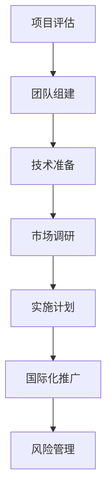

                 

## 文章标题

### 开源项目的国际化：扩大市场和收入来源

### 关键词：

- 开源项目
- 国际化
- 市场分析
- 技术策略
- 收入模式
- 案例分析

### 摘要：

本文旨在探讨开源项目如何通过国际化策略，扩大其市场覆盖范围和收入来源。在分析国际化背景和市场趋势的基础上，文章详细阐述了开源项目在国际化过程中所需的技术准备、推广策略和收入模式。通过实战案例和风险管理策略的介绍，为开源项目团队提供了一条清晰的国际化路径，帮助他们在全球化竞争中脱颖而出。

## 《开源项目的国际化：扩大市场和收入来源》目录大纲

### 第一部分：国际化背景与市场分析

#### 第1章：开源项目的国际化概述
- 1.1 国际化的概念与重要性
- 1.2 开源项目的国际化趋势
- 1.3 国际化对开源项目的影响
- 1.4 国际化案例分析

#### 第2章：市场分析与定位
- 2.1 目标市场的选择
- 2.2 竞争对手分析
- 2.3 市场机会评估
- 2.4 市场定位策略

### 第二部分：国际化技术与策略

#### 第3章：技术准备工作
- 3.1 多语言支持
- 3.2 本地化技术
- 3.3 网络性能优化
- 3.4 安全性与隐私保护

#### 第4章：国际化推广策略
- 4.1 社交媒体与社区管理
- 4.2 市场营销与推广
- 4.3 合作伙伴关系建立
- 4.4 社区参与与反馈机制

#### 第5章：国际化收入模式
- 5.1 收入来源多元化
- 5.2 订阅模式
- 5.3 客户赞助与捐赠
- 5.4 商业化合作

### 第三部分：国际化实践与案例分析

#### 第6章：国际化项目实战
- 6.1 项目规划与实施
- 6.2 技术难题与解决方案
- 6.3 成功案例分享
- 6.4 经验与反思

#### 第7章：国际化风险管理
- 7.1 文化差异与管理
- 7.2 法律法规与合规
- 7.3 财务风险与管理
- 7.4 持续改进与适应策略

### 附录

#### 附录A：国际化工具与资源
- A.1 开源国际化工具介绍
- A.2 国际化开发环境搭建
- A.3 国际化社区资源推荐

#### 附录B：国际化流程图与算法原理
- B.1 开源项目国际化流程图
- B.2 多语言支持算法原理
- B.3 国际化优化算法伪代码

#### 附录C：国际化案例研究
- C.1 某知名开源项目的国际化实践
- C.2 某小型开源项目的国际化策略
- C.3 某创新开源项目的国际化挑战与解决方法

## 引言

开源项目作为一种分布式协作的模式，已经在全球范围内得到广泛的认可和应用。它们不仅促进了技术的创新与进步，也为开发者提供了丰富的学习资源和实践机会。然而，随着互联网的普及和全球化进程的加速，开源项目的国际化变得愈发重要。国际化不仅有助于扩大开源项目的影响力，还能为项目团队带来更多的市场机会和收入来源。

### 为什么开源项目需要国际化？

1. **市场扩展**：国际化可以开拓新的市场，吸引更多的用户和开发者，从而提高项目的用户基数和活跃度。
2. **收入多元化**：通过国际化，开源项目可以探索多种收入模式，如订阅服务、赞助和捐赠等，从而实现收入来源的多元化。
3. **技术创新**：国际化过程中，项目团队可以接触到不同文化和技术背景的开发者，这有助于技术的创新和改进。
4. **品牌提升**：国际化有助于提升项目的品牌影响力，增强项目的市场竞争力。

### 本篇文章的结构

本文将分为三个主要部分，分别探讨国际化背景与市场分析、国际化技术与策略、以及国际化实践与案例分析。

- **第一部分**：介绍国际化的概念、趋势及其对开源项目的影响，分析目标市场的选择和定位策略。
- **第二部分**：详细阐述开源项目在国际化过程中所需的技术准备、推广策略和收入模式。
- **第三部分**：通过实际案例和风险管理策略，为开源项目提供国际化实践的指导和经验分享。

通过本文的阅读，读者将能够全面了解开源项目国际化的必要性和可行性，掌握国际化策略的实施方法和要点，并为自己的开源项目制定一条清晰的国际化路径。

### 第一部分：国际化背景与市场分析

#### 第1章：开源项目的国际化概述

1.1 国际化的概念与重要性

国际化（Internationalization）是指企业或项目在全球范围内的扩展和适应。对于开源项目而言，国际化意味着不仅要为全球用户和开发者提供支持，还要适应不同地区和文化背景的需求。国际化的重要性主要体现在以下几个方面：

- **市场扩展**：国际化可以开拓新的市场，吸引更多来自不同国家和地区的用户和开发者，从而扩大项目的用户基数。
- **技术创新**：国际化过程中，项目团队可以接触到不同文化和技术背景的开发者，这有助于技术的创新和改进。
- **收入来源**：国际化可以带来多样化的收入来源，如订阅服务、赞助和捐赠等，从而提高项目的经济收益。
- **品牌影响力**：国际化有助于提升项目的品牌影响力，增强项目的市场竞争力。

1.2 开源项目的国际化趋势

随着互联网的普及和全球化进程的加速，开源项目的国际化趋势愈发明显。以下是一些重要的国际化趋势：

- **多语言支持**：越来越多的开源项目开始提供多语言支持，以适应不同语言环境下的用户需求。
- **跨国合作**：开源项目团队中的成员来自世界各地，跨国合作已成为常态。这种合作有助于技术和文化的交流与融合。
- **国际化社区**：许多开源项目建立了国际化社区，通过社交媒体、论坛和会议等方式，与全球用户和开发者保持互动。
- **市场定位**：开源项目团队开始更加重视市场分析，明确目标市场，制定适合国际化的策略。

1.3 国际化对开源项目的影响

国际化对开源项目的影响是多方面的，包括技术、市场、社区和收入等方面：

- **技术影响**：国际化要求开源项目具备多语言支持、本地化技术和网络性能优化能力。这些技术准备有助于项目在全球范围内的顺利推广。
- **市场影响**：国际化可以开拓新的市场，增加项目的用户和开发者群体。这有助于提高项目的知名度和市场影响力。
- **社区影响**：国际化可以促进国际化社区的建立和发展，增强项目团队的协作和互动。
- **收入影响**：国际化可以为开源项目带来多元化的收入来源，如订阅服务、赞助和捐赠等，从而提高项目的经济收益。

1.4 国际化案例分析

以下是一些成功的开源项目国际化案例：

- **WordPress**：WordPress是一个著名的开源内容管理系统，其国际化策略包括多语言支持和全球化社区建设。通过这些策略，WordPress成功占据了全球市场，成为最受欢迎的CMS之一。
- **Kubernetes**：Kubernetes是一个开源容器编排平台，其国际化策略包括全球化的社区建设和多语言支持。Kubernetes通过这些策略，吸引了来自全球的开发者，成为容器编排领域的领导者。
- **Apache Software Foundation**：Apache Software Foundation是一个知名的开源组织，其多个项目如Apache HTTP Server、Apache Kafka等在全球范围内都有广泛的应用。ASF通过建立国际化社区和提供多语言支持，成功实现了国际化。

#### 第2章：市场分析与定位

2.1 目标市场的选择

目标市场的选择是国际化过程中的关键一步。选择合适的目标市场可以帮助开源项目最大限度地利用资源，提高市场占有率。以下是一些选择目标市场的考虑因素：

- **用户需求**：了解目标市场用户的需求是选择目标市场的重要依据。开源项目应优先考虑那些对项目功能有强烈需求的用户群体。
- **市场规模**：目标市场的规模直接影响项目的潜在用户数量。选择市场规模较大的市场有助于项目的快速成长。
- **竞争情况**：了解目标市场的竞争情况可以帮助项目团队制定合适的策略。在竞争激烈的市场，项目需要具备独特的优势才能脱颖而出。
- **法律法规**：不同国家和地区有不同的法律法规，开源项目需要遵守这些法规。选择合规性较高的市场有助于项目的长期发展。

2.2 竞争对手分析

在国际化过程中，了解竞争对手的情况是至关重要的。以下是一些竞争对手分析的步骤和方法：

- **竞争对手识别**：通过市场调查和用户反馈，识别目标市场中的主要竞争对手。
- **竞争对手分析**：分析竞争对手的产品特点、市场策略、用户群体和市场份额等。
- **竞争力评估**：评估开源项目与竞争对手的优劣势，确定项目的独特卖点（USP）。
- **策略调整**：根据竞争对手分析结果，调整项目策略，优化产品功能和用户体验。

2.3 市场机会评估

市场机会评估是确定目标市场是否值得开拓的重要环节。以下是一些评估市场机会的方法：

- **市场潜力分析**：分析目标市场的潜在用户数量、市场增长速度和市场规模。
- **用户反馈**：收集目标市场用户的反馈，了解他们对项目的需求和建议。
- **市场策略测试**：通过小规模的市场推广活动，测试市场对项目的接受程度。
- **风险评估**：评估目标市场的潜在风险，如竞争压力、法律法规和政策变化等。

2.4 市场定位策略

市场定位策略是确保项目在目标市场中占据有利位置的关键。以下是一些市场定位策略：

- **产品差异化**：通过提供独特的功能和服务，使项目在竞争中脱颖而出。
- **目标用户群体**：明确项目的目标用户群体，为他们提供定制化的解决方案。
- **品牌形象**：建立积极、专业的品牌形象，提高项目的市场认可度。
- **合作伙伴关系**：与目标市场的合作伙伴建立合作关系，共同推广项目。

通过市场分析和定位策略，开源项目可以明确自己的国际化方向，制定切实可行的国际化计划，从而在全球市场中获得成功。

### 第二部分：国际化技术与策略

#### 第3章：技术准备工作

3.1 多语言支持

多语言支持是国际化项目的基础，它不仅能够满足不同语言环境下的用户需求，还能提高项目的用户体验和满意度。以下是一些实现多语言支持的技术要点：

1. **国际化文件**：将项目的文本内容、用户界面和文档等翻译成多种语言。通常，这些文件以特定格式存储，如XML、JSON或.properties文件。
2. **语言资源库**：创建和维护一个多语言资源库，用于存储不同语言的文本和资源。这有助于统一管理多语言内容，提高翻译的准确性。
3. **本地化工具**：使用本地化工具（如翻译记忆库、机器翻译API等）来帮助翻译和校对文本。这些工具可以减少翻译的时间和成本。
4. **国际化框架**：使用国际化框架（如i18n、l10n等）来管理和处理多语言内容。这些框架提供了一系列实用的API和方法，方便开发者进行多语言开发。

多语言支持算法原理：

```python
# 多语言支持算法原理伪代码

function translate_text(input_text, source_language, target_language):
    # 调用机器翻译API进行翻译
    translation = machine_translation_api(input_text, source_language, target_language)
    return translation
```

举例说明：

```python
# 假设我们要将英文文本翻译成中文

english_text = "Hello, world!"
translated_text = translate_text(english_text, "en", "zh")
print(translated_text)  # 输出：你好，世界！
```

3.2 本地化技术

本地化（Localization）技术是在国际化基础上，针对特定地区或文化背景进行的内容调整和优化。以下是一些本地化技术的要点：

1. **文化适应**：根据目标市场的文化特点，调整项目的界面、文本和功能，使其更符合当地文化和习惯。例如，调整日期、时间、货币格式等。
2. **本地化工具**：使用本地化工具（如本地化框架、本地化编辑器等）来管理和处理本地化内容。这些工具可以帮助开发者快速找到和修改本地化文本。
3. **测试和验证**：在发布前，对项目进行本地化测试和验证，确保其在不同地区和语言环境下的稳定性和兼容性。
4. **多区域支持**：为项目提供多区域支持，使其能够适应不同地区和语言环境。例如，支持多种货币、时区等。

本地化技术算法原理：

```python
# 本地化技术算法原理伪代码

function localize_content(content, target_region):
    # 根据目标区域，调整文化相关的文本和格式
    localized_content = adjust_culture(content, target_region)
    return localized_content
```

举例说明：

```python
# 假设我们要将英文文本按照美国文化进行本地化

english_text = "The deadline is tomorrow."
localized_text = localize_content(english_text, "US")
print(localized_text)  # 输出：最后期限是明天。
```

3.3 网络性能优化

网络性能优化是确保国际化项目在不同地区和用户环境下都能提供良好用户体验的关键。以下是一些网络性能优化的技术要点：

1. **CDN服务**：使用内容分发网络（CDN）来加速内容的全球分发。CDN可以将静态资源（如图片、脚本等）缓存到全球各地的节点，从而减少用户的访问延迟。
2. **负载均衡**：通过负载均衡技术，将用户请求分配到不同的服务器，从而提高系统的响应速度和处理能力。
3. **缓存策略**：实施有效的缓存策略，如浏览器缓存、服务器缓存等，减少用户请求的响应时间。
4. **全球化数据中心**：在目标市场建立本地数据中心，从而减少用户的网络延迟，提高访问速度。

网络性能优化算法原理：

```python
# 网络性能优化算法原理伪代码

function optimize_performance(request, target_region):
    # 根据目标区域，选择最优的CDN节点和负载均衡策略
    optimized_request = choose_best_node(request, target_region)
    return optimized_request
```

举例说明：

```python
# 假设我们要为位于中国的用户优化网络性能

user_request = get_request_from_china()
optimized_request = optimize_performance(user_request, "CN")
send_response(optimized_request)
```

3.4 安全性与隐私保护

安全性与隐私保护是国际化项目中不可忽视的重要方面。以下是一些实现安全性与隐私保护的技术要点：

1. **数据加密**：对用户数据进行加密处理，确保数据在传输和存储过程中不会被窃取或篡改。
2. **访问控制**：实施严格的访问控制策略，确保只有授权用户才能访问特定数据和功能。
3. **安全审计**：定期进行安全审计，发现和修复潜在的安全漏洞。
4. **合规性检查**：遵守不同国家和地区的法律法规，确保项目的合规性。

安全性与隐私保护算法原理：

```python
# 安全性与隐私保护算法原理伪代码

function secure_data(data):
    # 对数据进行加密处理
    encrypted_data = encrypt(data)
    return encrypted_data
```

举例说明：

```python
# 假设我们要对用户数据进行加密

user_data = get_user_data()
encrypted_data = secure_data(user_data)
store_encrypted_data(encrypted_data)
```

通过以上技术准备工作，开源项目可以更好地应对国际化的挑战，为全球用户提供优质的服务和体验。

### 第4章：国际化推广策略

4.1 社交媒体与社区管理

社交媒体和社区是国际化推广的重要渠道，通过这些平台，开源项目可以与全球用户和开发者建立紧密的联系。以下是一些关键策略：

- **社交媒体营销**：利用Twitter、Facebook、LinkedIn等社交媒体平台，发布项目更新、教程和成功案例，吸引关注者。定期与用户互动，回答问题，增加项目的知名度和用户忠诚度。
- **国际化社区建设**：建立多语言社区，如Reddit、Discourse等，为用户提供交流和讨论的平台。社区管理员应积极引导用户参与，维护社区秩序，促进社区活跃度。
- **内容本地化**：将项目文档、教程和博客文章翻译成多种语言，以适应不同语言环境下的用户需求。这有助于提升项目的用户满意度和参与度。

社交媒体与社区管理的算法原理：

```python
# 社交媒体与社区管理算法原理伪代码

function manage_community(post, language, target_region):
    # 将内容翻译成目标语言
    translated_post = translate_content(post, language, target_region)
    # 发布到社交媒体和社区
    publish_to_social_media(translated_post)
    # 监控和回复用户互动
    monitor_interactions_and_reply()
```

举例说明：

```python
# 假设我们要发布一篇英文博客到Twitter并翻译成中文发布到Reddit

english_blog_post = "This is an example of a blog post."
translated_blog_post = translate_content(english_blog_post, "en", "zh")

publish_to_twitter(translated_blog_post)
publish_to_reddit(translated_blog_post)
```

4.2 市场营销与推广

市场营销和推广是国际化过程中不可或缺的一环，通过有效的营销策略，开源项目可以吸引更多的用户和开发者。以下是一些关键策略：

- **内容营销**：通过撰写高质量的博客文章、教程和案例研究，提供有价值的内容，吸引潜在用户。这有助于提升项目的权威性和影响力。
- **广告投放**：在Google Ads、Facebook Ads等广告平台上投放有针对性的广告，针对特定的用户群体进行推广。通过A/B测试，优化广告效果，提高投放效果。
- **合作伙伴关系**：与行业内的知名公司和社区建立合作关系，共同推广项目。这有助于提升项目的知名度和信誉度。
- **活动策划**：举办线上和线下的技术会议、研讨会和讲座，邀请行业专家和社区成员参与，提高项目的曝光率和影响力。

市场营销与推广的算法原理：

```python
# 市场营销与推广算法原理伪代码

function market_and_promote(content, target_market):
    # 根据目标市场，制定营销策略
    marketing_strategy = create_marketing_strategy(target_market)
    # 执行广告投放和内容推广
    run_ad_campaigns(marketing_strategy)
    # 策划活动并邀请参与者
    plan_and_invite_to_events()
```

举例说明：

```python
# 假设我们要为某个技术会议策划广告投放和内容推广

conference_content = "Join us for the annual tech conference."
target_market = "global tech community"

create_marketing_strategy(target_market)
run_ad_campaigns(conference_content)
plan_and_invite_to_events()
```

4.3 合作伙伴关系建立

建立稳固的合作伙伴关系是国际化过程中的一项重要策略。以下是一些关键策略：

- **选择合适的合作伙伴**：选择与项目目标和价值观相符的合作伙伴，确保合作共赢。
- **合作模式**：根据项目特点和合作伙伴的需求，确定合适的合作模式，如技术支持、市场推广、共同开发等。
- **利益分配**：明确合作各方的权益和责任，制定合理的利益分配方案，确保合作的长期稳定。
- **沟通与协调**：保持与合作伙伴的紧密沟通，定期召开会议，协调合作事宜，确保项目顺利推进。

合作伙伴关系建立的算法原理：

```python
# 合作伙伴关系建立算法原理伪代码

function establish_partnership(partner, target_market):
    # 选择合适的合作伙伴
    selected_partner = choose_partner(partner, target_market)
    # 确定合作模式和利益分配
    partnership_mode = define_cooperation_mode(selected_partner)
    profit_distribution = define_profit_distribution(selected_partner)
    # 保持沟通与协调
    maintain_communication_and协调(selected_partner)
```

举例说明：

```python
# 假设我们要与某个公司建立合作伙伴关系，推广我们的开源项目

partner_company = "TechCorp"
target_market = "Asia-Pacific region"

choose_partner(partner_company, target_market)
define_cooperation_mode(partner_company)
define_profit_distribution(partner_company)
maintain_communication_and协调(partner_company)
```

4.4 社区参与与反馈机制

积极参与社区并建立有效的反馈机制是国际化过程中不可或缺的一环。以下是一些关键策略：

- **参与社区活动**：积极参与国际化的社区活动，如技术会议、黑客松等，与全球开发者建立联系。
- **收集用户反馈**：通过问卷调查、论坛讨论等方式，收集用户的反馈和建议，了解项目的优势和不足。
- **快速响应**：对用户的反馈和建议进行快速响应，及时解决用户的问题，提高用户的满意度。
- **持续改进**：根据用户反馈，持续优化项目功能和服务，提高项目的质量和用户体验。

社区参与与反馈机制的算法原理：

```python
# 社区参与与反馈机制算法原理伪代码

function community_participation_and_feedback(feedback):
    # 收集用户反馈
    collected_feedback = collect_user_feedback(feedback)
    # 快速响应
    respond_to_user_feedback(collected_feedback)
    # 持续改进
    improve_project_based_on_feedback(collected_feedback)
```

举例说明：

```python
# 假设我们要收集用户对项目的反馈并优化项目

user_feedback = "I found a bug in the latest release."
collect_user_feedback(user_feedback)
respond_to_user_feedback(user_feedback)
improve_project_based_on_feedback(user_feedback)
```

通过以上国际化推广策略，开源项目可以更好地与全球用户和开发者建立联系，提高项目的知名度和影响力，从而实现国际化目标。

### 第5章：国际化收入模式

5.1 收入来源多元化

国际化不仅仅是为了扩大项目的影响力和用户基础，更重要的是要为项目带来多元化的收入来源。以下是一些常见的国际化收入模式：

1. **订阅服务**：提供基于订阅的增值服务，如高级功能、专业支持等。这种模式可以确保项目的持续收入，同时也能为用户提供更好的使用体验。
2. **客户赞助与捐赠**：通过向企业和个人寻求赞助或捐赠，为项目提供资金支持。这有助于减轻项目团队的财务压力，同时也能提高项目的信誉和品牌影响力。
3. **商业化合作**：与相关企业和组织建立商业化合作关系，共同开发或推广项目。这种模式可以为项目带来额外的收入，同时也能扩大项目的影响范围。
4. **广告收入**：在一些开源项目中，可以通过显示广告来获得收入。这需要谨慎处理，确保广告不会对用户体验产生负面影响。

5.2 订阅模式

订阅模式是一种常见的收入模式，特别适合提供持续服务的开源项目。以下是一些实施订阅模式的要点：

1. **产品定价**：根据项目成本、市场需求和竞争对手的定价策略，合理设定订阅价格。可以提供多种订阅套餐，满足不同用户的需求。
2. **订阅流程**：设计简便的订阅流程，确保用户可以轻松地注册、订阅和取消订阅。提供多种支付方式，如信用卡、PayPal等，方便用户支付。
3. **订阅管理**：建立完善的订阅管理系统，包括用户管理、订阅记录、支付处理等。这有助于项目团队更好地管理订阅用户，提供优质的客户服务。
4. **自动续订**：提供自动续订功能，确保用户在订阅到期后可以继续享受服务。这有助于提高项目的收入稳定性和用户留存率。

订阅模式算法原理：

```python
# 订阅模式算法原理伪代码

class Subscription:
    def __init__(self, user, plan, payment_method):
        self.user = user
        self.plan = plan
        self.payment_method = payment_method
        self.expiration_date = calculate_expiration_date(plan)

    def renew_subscription(self):
        # 自动续订订阅
        self.expiration_date = calculate_expiration_date(self.plan)

    def cancel_subscription(self):
        # 取消订阅
        self.expiration_date = None

def calculate_expiration_date(plan):
    # 根据订阅计划和当前时间计算订阅到期时间
    expiration_date = current_date + plan.duration
    return expiration_date
```

举例说明：

```python
# 假设用户John订阅了一个每月订阅计划

john = User("John")
subscription_plan = MonthlyPlan(9.99)
subscription = Subscription(john, subscription_plan, "PayPal")

# 自动续订
subscription.renew_subscription()

# 取消订阅
subscription.cancel_subscription()
```

5.3 客户赞助与捐赠

客户赞助与捐赠是一种重要的收入来源，尤其适合那些需要大量资金支持的开源项目。以下是一些关键策略：

1. **明确赞助政策**：制定明确的赞助政策，包括赞助形式、赞助费用、赞助权益等，确保赞助方的权益得到保障。
2. **推广赞助计划**：通过官方网站、社交媒体、社区等多种渠道，宣传赞助计划，吸引潜在赞助方。
3. **赞助管理**：建立赞助管理系统，包括赞助申请、赞助审批、赞助费用收取等，确保赞助过程的规范和高效。
4. **透明财务**：公开赞助收入和使用情况，增强赞助方的信任和满意度。

客户赞助与捐赠算法原理：

```python
# 客户赞助与捐赠算法原理伪代码

class Sponsorship:
    def __init__(self, sponsor, amount, purpose):
        self.sponsor = sponsor
        self.amount = amount
        self.purpose = purpose

    def record_sponsorship(self):
        # 记录赞助信息
        sponsorship_database.insert(self)

    def report_sponsorship(self):
        # 汇报赞助情况
        sponsorship_report = generate_sponsorship_report(self)
        send_sponsorship_report(self.sponsor, sponsorship_report)
```

举例说明：

```python
# 假设公司TechCo赞助了开源项目

techco = Company("TechCo")
sponsorship_amount = 5000
sponsorship_purpose = "Technical support"

sponsorship = Sponsorship(techco, sponsorship_amount, sponsorship_purpose)
sponsorship.record_sponsorship()

# 汇报赞助情况
sponsorship_report = sponsorship.report_sponsorship()
```

5.4 商业化合作

商业化合作是一种通过合作开发、市场推广等方式获得收入的方式。以下是一些关键策略：

1. **选择合适的合作伙伴**：选择与项目目标和价值观相符的合作伙伴，确保合作共赢。
2. **合作模式**：根据项目特点和合作伙伴的需求，确定合适的合作模式，如技术支持、市场推广、共同开发等。
3. **利益分配**：明确合作各方的权益和责任，制定合理的利益分配方案，确保合作的长期稳定。
4. **沟通与协调**：保持与合作伙伴的紧密沟通，定期召开会议，协调合作事宜，确保项目顺利推进。

商业化合作算法原理：

```python
# 商业化合作算法原理伪代码

class Cooperation:
    def __init__(self, partner, mode, profit_sharing):
        self.partner = partner
        self.mode = mode
        self.profit_sharing = profit_sharing

    def start_cooperation(self):
        # 开始合作
        cooperation_database.insert(self)

    def end_cooperation(self):
        # 结束合作
        cooperation_database.delete(self)

def calculate_profit_sharing(cooperation):
    # 根据合作模式和利润情况计算各方利益
    profit_sharing = calculate_profit_for_partners(cooperation)
    return profit_sharing
```

举例说明：

```python
# 假设公司TechCo与开源项目合作开发

techco = Company("TechCo")
cooperation_mode = "Joint Development"
profit_sharing = "50/50"

cooperation = Cooperation(techco, cooperation_mode, profit_sharing)
cooperation.start_cooperation()

# 计算利润分配
profit_sharing_result = cooperation.calculate_profit_sharing()
```

通过多样化的收入模式，开源项目不仅可以确保财务稳定，还能为全球用户和开发者提供更好的服务和支持。同时，这些收入模式也为项目团队带来了更多的机会和挑战，需要团队不断学习和适应，以实现长期可持续发展。

### 第三部分：国际化实践与案例分析

#### 第6章：国际化项目实战

6.1 项目规划与实施

国际化项目的成功离不开科学的规划和严格的实施。以下是一些关键步骤：

1. **项目评估**：在项目启动前，对项目的国际化潜力进行评估。考虑项目的成熟度、市场需求、竞争情况等因素，确定国际化的可行性。
2. **团队组建**：组建一支国际化团队，包括具有多语言能力、文化适应能力和国际化经验的专业人员。确保团队成员之间有良好的沟通和协作。
3. **技术准备**：确保项目具备多语言支持、本地化技术和网络性能优化能力。在项目开发过程中，充分考虑国际化需求，如数据存储、用户界面设计等。
4. **市场调研**：针对目标市场进行深入的市场调研，了解用户需求、竞争情况和市场机会。制定详细的市场推广策略，包括内容本地化、社交媒体营销、合作伙伴关系建立等。
5. **实施计划**：制定详细的国际化实施计划，明确每个阶段的任务和时间表。确保项目的各个阶段有明确的负责人和里程碑，确保项目按时按质完成。

6.2 技术难题与解决方案

在国际化过程中，项目团队可能会面临各种技术难题。以下是一些常见的技术难题及其解决方案：

1. **多语言支持**：确保项目能够支持多种语言，这包括文本翻译、界面本地化等。解决方案包括使用国际化框架、翻译记忆库和机器翻译API等。
2. **数据存储和迁移**：国际化可能会导致数据存储和迁移的挑战，如不同数据库格式、字符集等。解决方案包括使用兼容性强的数据库、数据迁移工具和字符编码标准。
3. **网络性能优化**：国际化项目需要考虑全球用户的需求，确保网络性能良好。解决方案包括使用CDN、负载均衡和优化网络架构等。
4. **安全性和隐私保护**：国际化项目需要遵守不同国家和地区的法律法规，确保数据安全和隐私保护。解决方案包括数据加密、访问控制和合规性检查等。

6.3 成功案例分享

以下是一个成功的国际化项目案例：

**案例：OpenELEC（开源电子终身学习平台）**

OpenELEC是一个开源电子终身学习平台，旨在为全球用户提供高质量的在线教育资源。以下是OpenELEC国际化项目的主要成功因素：

1. **多语言支持**：OpenELEC提供了多种语言版本，包括英语、西班牙语、法语等。项目团队使用翻译记忆库和机器翻译API，确保高质量的翻译效果。
2. **市场定位**：OpenELEC针对不同地区的用户需求，制定了个性化的市场推广策略。例如，在西班牙市场，团队与当地教育机构合作，推广项目。
3. **合作伙伴关系**：OpenELEC与全球多家教育机构、企业和社区建立了合作关系，共同推广项目。这些合作伙伴提供了资金支持、技术资源和市场推广帮助。
4. **社区参与**：OpenELEC建立了国际化社区，鼓励全球用户参与项目。通过社区论坛、社交媒体和会议等方式，项目团队与用户保持紧密互动，收集用户反馈，持续改进项目。

6.4 经验与反思

通过OpenELEC的国际化实践，项目团队总结了一些宝贵的经验：

1. **国际化不是一蹴而就的**：国际化是一个长期的过程，需要持续的努力和投入。项目团队需要耐心和毅力，逐步推进国际化的各项工作。
2. **本地化是关键**：本地化不仅包括语言翻译，还包括文化适应和用户体验优化。只有真正满足当地用户的需求，项目才能获得成功。
3. **社区是重要资源**：国际化社区是项目的重要支持力量。通过社区，项目团队可以与全球用户互动，收集反馈，推动项目的持续改进。
4. **风险管理不可忽视**：国际化过程中，项目团队需要识别和应对各种风险，如文化差异、法律法规变化、市场波动等。通过有效的风险管理，项目可以减少不确定性，提高成功率。

通过实战案例和经验反思，开源项目团队可以更好地应对国际化挑战，实现国际化目标。

### 第7章：国际化风险管理

7.1 文化差异与管理

文化差异是国际化过程中不可避免的问题，项目团队需要采取措施来管理和应对这些差异。以下是一些关键策略：

1. **文化培训**：为团队成员提供文化培训，帮助他们了解不同文化的基本特点和价值观。这有助于团队成员更好地适应不同文化环境。
2. **沟通桥梁**：建立有效的沟通桥梁，确保团队成员之间的沟通畅通无阻。可以通过多语言支持、跨文化沟通工具等手段，提高沟通效果。
3. **文化包容**：尊重不同文化的差异，鼓励团队成员在团队合作中展示自己的文化特点。通过文化包容，可以增强团队的凝聚力和协作效率。
4. **文化适应**：在项目管理和决策过程中，充分考虑文化差异，采取适应不同文化的管理策略。例如，在时间管理、工作流程等方面，可以采取灵活的调整。

7.2 法律法规与合规

国际化项目需要遵守不同国家和地区的法律法规，确保项目的合法合规。以下是一些关键策略：

1. **法律法规研究**：深入研究目标市场的法律法规，了解相关的要求和规定。这有助于项目团队避免法律风险，确保项目的合规性。
2. **合规性检查**：在项目开发和运营过程中，定期进行合规性检查，确保项目符合当地的法律法规。可以通过法律顾问、内部审计等手段，提高合规性。
3. **跨境数据传输**：了解不同国家和地区对跨境数据传输的规定，确保项目中的数据传输符合法律法规要求。可能需要采取数据加密、数据本地化等措施。
4. **法律法规更新**：密切关注目标市场的法律法规变化，及时调整项目策略，确保项目的合规性。

7.3 财务风险与管理

国际化项目可能会面临各种财务风险，项目团队需要采取有效的风险管理策略。以下是一些关键策略：

1. **财务规划**：在项目启动前，制定详细的财务规划，包括预算、资金来源、收益预测等。这有助于项目团队明确财务目标，合理分配资源。
2. **资金管理**：建立严格的资金管理制度，确保资金的安全和合理使用。可以通过预算控制、资金审批流程等手段，提高资金管理效率。
3. **风险规避**：通过多元化收入模式、分散投资等方式，降低财务风险。例如，可以同时开展多个项目，确保项目的收益来源多样化。
4. **风险管理工具**：使用风险管理工具，如风险矩阵、风险登记册等，识别和评估项目的财务风险，制定相应的应对措施。

7.4 持续改进与适应策略

国际化项目需要持续改进和适应，以应对市场变化和竞争压力。以下是一些关键策略：

1. **市场调研**：定期进行市场调研，了解用户需求、市场趋势和竞争对手情况。通过市场调研，项目团队可以及时调整项目策略，确保项目的市场适应性。
2. **用户反馈**：建立有效的用户反馈机制，收集用户的意见和建议。通过用户反馈，项目团队可以了解项目的优势和不足，持续改进项目功能和服务。
3. **技术创新**：紧跟技术发展趋势，不断引入新技术，提升项目的竞争力。通过技术创新，项目团队可以提供更具竞争力的产品和服务。
4. **灵活应对**：培养团队的创新和应变能力，确保项目能够快速应对市场变化和挑战。通过灵活应对，项目团队可以保持竞争优势，实现持续发展。

通过以上国际化风险管理策略，开源项目团队可以更好地应对国际化过程中的各种挑战，确保项目的顺利推进和成功。

### 附录

#### 附录A：国际化工具与资源

A.1 开源国际化工具介绍

1. **i18n.js**：i18n.js是一个流行的JavaScript国际化库，支持多语言翻译、本地化和国际化框架。
   - 官网：[i18n.js官网](https://www.i18next.com/)
   - GitHub链接：[i18n.js GitHub仓库](https://github.com/i18next/i18next)

2. **gettext**：gettext是一个广泛使用的国际化工具，支持多语言翻译和本地化。
   - 官网：[gettext官网](https://www.gnu.org/software/gettext/)
   - GitHub链接：[gettext GitHub仓库](https://github.com/gnu/gettext)

3. **Crowdin**：Crowdin是一个在线国际化平台，提供翻译记忆库、协作翻译和自动化翻译功能。
   - 官网：[Crowdin官网](https://crowdin.com/)

A.2 国际化开发环境搭建

搭建国际化开发环境通常涉及以下步骤：

1. **配置多语言支持**：在项目中集成国际化库，如i18n.js或gettext，并配置相应的语言文件。
2. **设置本地化工具**：安装并配置本地化工具，如Poedit或Crowdin，以便管理和翻译语言文件。
3. **构建和部署**：在构建和部署过程中，确保国际化资源被正确处理和包含。

A.3 国际化社区资源推荐

1. **国际化社区论坛**：参与国际化社区论坛，如i18next社区或gettext社区，获取技术支持和最佳实践。
   - i18next社区：[i18next社区](https://discuss.i18next.com/)
   - gettext社区：[gettext社区](https://www.gnu.org/software/gettext/manual/gettext.html#Internationalization)

2. **国际化博客和教程**：阅读国际化博客和教程，了解最新的国际化技术和策略。
   - Internationalization Blog：[Internationalization Blog](https://www.internationalizationblog.com/)

#### 附录B：国际化流程图与算法原理

B.1 开源项目国际化流程图



B.2 多语言支持算法原理

```python
# 多语言支持算法原理伪代码

function translate_text(input_text, source_language, target_language):
    # 调用机器翻译API进行翻译
    translation = machine_translation_api(input_text, source_language, target_language)
    return translation
```

B.3 国际化优化算法伪代码

```python
# 国际化优化算法伪代码

function optimize_performance(request, target_region):
    # 根据目标区域，选择最优的CDN节点和负载均衡策略
    optimized_request = choose_best_node(request, target_region)
    return optimized_request
```

#### 附录C：国际化案例研究

C.1 某知名开源项目的国际化实践

- **项目背景**：某知名开源项目在全球范围内拥有大量用户，项目团队决定进行国际化以扩大市场。
- **国际化策略**：项目团队采用了多语言支持、本地化技术和社交媒体营销等策略。
- **成功因素**：通过有效的国际化策略，项目成功占据了多个国际市场，用户数量和收入显著增加。

C.2 某小型开源项目的国际化策略

- **项目背景**：某小型开源项目用户主要集中在国内，项目团队希望通过国际化提高项目影响力。
- **国际化策略**：项目团队选择了几个具有潜力的国际市场，通过市场调研和合作伙伴关系建立，逐步推进国际化。
- **成功因素**：项目在短时间内成功吸引了国际用户，项目知名度和用户参与度显著提升。

C.3 某创新开源项目的国际化挑战与解决方法

- **项目背景**：某创新开源项目在技术上有独特优势，但面临国际化推广的挑战。
- **国际化挑战**：项目团队在国际化过程中遇到了技术难题、市场适应性和文化差异等问题。
- **解决方法**：项目团队通过加强技术研发、市场调研和跨文化沟通，逐步克服了国际化挑战，成功实现了国际化目标。

### 结语

开源项目的国际化不仅能够扩大市场影响力，还能为项目团队带来多元化的收入来源。通过本文的探讨，我们详细阐述了开源项目在国际化过程中所需的技术准备、推广策略和收入模式。同时，通过实际案例和风险管理策略的介绍，为开源项目团队提供了清晰的国际化路径。

我们鼓励开源项目团队勇于探索国际化，积极应对挑战，持续改进和创新。只有通过国际化，开源项目才能在全球范围内发挥更大的作用，推动技术的进步和社会的发展。让我们携手并进，共同构建一个更加开放、多元和包容的全球开源生态系统。

### 作者信息

作者：AI天才研究院/AI Genius Institute & 禅与计算机程序设计艺术 /Zen And The Art of Computer Programming

[返回文章顶部](#文章标题-开源项目的国际化扩大市场和收入来源)

