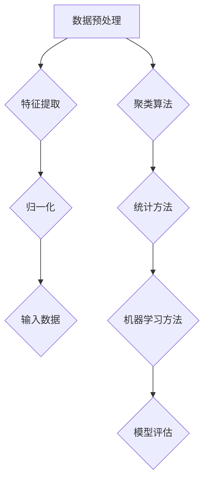

                 

### 文章标题：异常检测 原理与代码实例讲解

### 关键词：异常检测，原理，算法，代码实例，数据分析

> 摘要：本文深入探讨了异常检测的原理、方法及其在实际应用中的重要性。通过详细的算法解析和代码实例，帮助读者理解异常检测的核心概念，掌握常见异常检测算法的应用，并学会如何在实际项目中实施异常检测。

## 第1章 异常检测概述

### 1.1 异常检测的定义和重要性

异常检测（Anomaly Detection）是一种数据处理技术，旨在识别数据集中的异常值或异常模式。异常检测在多个领域具有广泛的应用，例如工业制造、金融风险监控、网络安全、医疗健康等。

#### 异常检测的定义
异常检测的定义可以从不同的角度理解：

- **数据驱动的定义**：异常检测是识别与给定数据分布不一致的数据项或数据模式的过程。
- **目标驱动的定义**：异常检测的目标是找到那些不符合预期行为或规则的观察值。

#### 异常检测在各个领域的应用

- **工业制造**：异常检测可以用于实时监控生产设备的运行状态，预测潜在故障，提高生产效率和设备利用率。
- **金融风险监控**：异常检测可以帮助金融机构识别欺诈交易、可疑行为等，降低金融风险。
- **网络安全**：异常检测是网络安全的重要组成部分，通过检测异常流量和活动，保护网络系统免受攻击。
- **医疗健康**：异常检测可以用于医疗数据的异常值检测，帮助医生诊断疾病、制定治疗方案。

#### 异常检测的重要性

- **提高系统安全性**：在金融和网络安全领域，异常检测是保障系统安全的关键技术。
- **优化运营效率**：在工业制造领域，异常检测可以帮助企业提前发现设备故障，减少停机时间，提高生产效率。
- **改善用户体验**：在电子商务和在线服务领域，异常检测可以识别恶意用户和异常行为，提供更安全的交易环境。

### 1.2 异常检测的分类

根据检测方法和目标的不同，异常检测可以分为以下几类：

- **点异常检测（Point Anomaly Detection）**：识别单个数据点的异常，不考虑数据点之间的关联性。
- **局部异常检测（Local Anomaly Detection）**：识别与邻域数据点差异较大的数据点，考虑数据点之间的相对关系。
- **全局异常检测（Global Anomaly Detection）**：识别整体数据分布的异常，通常用于检测异常数据子集或整体数据分布的突变。

### 1.3 异常检测的挑战和限制

异常检测在应用过程中面临以下挑战和限制：

- **数据量庞大**：处理大规模数据集需要高效的算法和计算资源。
- **数据噪声**：噪声数据会干扰异常检测，降低检测精度。
- **数据不平衡**：异常数据与正常数据在数量和分布上可能存在较大差异，影响算法性能。

## 第2章 异常检测的基本原理

### 2.1 数据预处理

数据预处理是异常检测的基础步骤，包括数据清洗、数据特征提取和数据归一化。

- **数据清洗**：去除重复数据、处理缺失值和异常值，提高数据质量。
- **数据特征提取**：从原始数据中提取有意义的特征，降低数据维度，为后续的异常检测算法提供输入。
- **数据归一化**：将不同特征的范围统一到同一尺度，避免特征间的差异对算法性能的影响。

### 2.2 异常检测算法的基本原理

异常检测算法可以分为以下几类：

- **聚类算法**：通过聚类数据点，识别异常点或异常簇。
- **统计方法**：利用统计学原理，计算数据点的异常度或概率分布。
- **机器学习方法**：基于训练数据，学习数据分布模型，预测新的数据点的异常性。

### 2.3 异常检测的评估指标

评估异常检测算法的性能通常使用以下指标：

- **精确率（Precision）**：识别出的异常点中实际为异常点的比例。
- **召回率（Recall）**：实际为异常点的数据中被正确识别为异常点的比例。
- **F1值（F1 Score）**：精确率和召回率的加权平均，用于综合评估算法性能。
- **ROC曲线（Receiver Operating Characteristic Curve）**：评估不同阈值下的检测性能。
- **AUC值（Area Under Curve）**：ROC曲线下的面积，用于比较不同算法的检测性能。

## 第3章 常见异常检测算法详解

### 3.1 聚类算法

聚类算法是一种无监督学习方法，用于将相似的数据点分组。常见的聚类算法包括：

- **K-均值聚类（K-Means Clustering）**：基于最小化数据点与聚类中心之间的距离平方和。
- **DBSCAN（Density-Based Spatial Clustering of Applications with Noise）**：基于密度连接性，识别高密度区域和异常点。
- **层次聚类（Hierarchical Clustering）**：通过合并或分裂聚类层次结构，逐步构建聚类模型。

### 3.2 统计方法

统计方法利用数学统计原理，对数据进行概率分布建模，识别异常点。常见的方法包括：

- **离群点检测（Outlier Detection）**：基于三倍标准差法、IQR法等，识别离群值。
- **基于统计模型的异常检测**：使用统计模型（如正态分布、高斯混合模型等）预测数据点的异常度。

### 3.3 机器学习方法

机器学习方法通过训练模型，学习数据分布特征，用于检测异常点。常见的机器学习方法包括：

- **监督学习算法**：使用标记数据训练分类模型，预测数据点的类别。
- **无监督学习算法**：直接从未标记的数据中学习数据分布特征，识别异常点。
- **半监督学习算法**：结合标记和未标记数据，提高模型对异常点的识别能力。

## 第4章 异常检测在工业应用中的实践

### 4.1 工业设备故障检测

工业设备故障检测是异常检测在工业领域的重要应用。通过实时监控设备运行状态，识别故障隐患，提前进行预防性维护，降低设备故障率。

- **原理**：基于传感器数据，使用异常检测算法（如K-均值聚类、DBSCAN等）识别异常点，分析设备运行状态。
- **案例分享**：以某工厂生产线设备为例，介绍如何使用异常检测技术进行设备故障检测，提高生产效率和设备可靠性。

### 4.2 金融风险监控

金融风险监控是异常检测在金融领域的重要应用。通过实时监控交易数据，识别欺诈行为、异常交易等，降低金融风险。

- **重要性**：金融风险监控对于金融机构的稳健运营和客户资金安全至关重要。
- **案例分享**：以某银行为例，介绍如何使用异常检测技术进行金融风险监控，提高交易安全性。

### 4.3 网络安全监控

网络安全监控是异常检测在网络安全领域的重要应用。通过实时监控网络流量和用户行为，识别恶意攻击、异常流量等，提高网络安全防护能力。

- **原理**：基于网络流量数据，使用异常检测算法（如统计方法、机器学习方法等）识别异常点，分析网络活动。
- **案例分享**：以某网络安全公司为例，介绍如何使用异常检测技术进行网络安全监控，提升网络安全防护水平。

## 第5章 异常检测在医疗健康领域的应用

### 5.1 医疗数据异常检测

医疗数据异常检测是异常检测在医疗健康领域的重要应用。通过分析电子病历、医疗影像等数据，识别异常数据点和异常模式，为临床诊断和治疗提供支持。

- **特殊性**：医疗数据具有高维度、复杂性和不完整性等特点，给异常检测带来挑战。
- **案例分享**：以某医院为例，介绍如何使用异常检测技术进行医疗数据异常检测，提高医疗质量和患者安全。

### 5.2 健康风险预测

健康风险预测是异常检测在医疗健康领域的另一个重要应用。通过分析健康数据，识别潜在的健康风险，为个体提供个性化的健康建议。

- **数据收集与处理**：收集个体健康数据，如体检数据、生活习惯数据等，进行预处理和特征提取。
- **异常检测**：使用异常检测算法（如K-均值聚类、统计方法等）识别健康数据中的异常点和异常模式。
- **案例分享**：以某健康平台为例，介绍如何使用异常检测技术进行健康风险预测，提高健康服务水平。

## 第6章 异常检测的挑战与未来发展

### 6.1 异常检测的挑战

异常检测在实际应用中面临以下挑战：

- **数据复杂性**：处理大规模、高维度数据，算法复杂度提高。
- **模型泛化能力**：不同领域的异常检测需求差异较大，模型泛化能力有限。
- **模型可解释性**：复杂模型难以解释，影响决策过程的透明度和可理解性。

### 6.2 异常检测的未来发展方向

异常检测的未来发展方向包括：

- **新算法的研究与应用**：探索更高效、更鲁棒的异常检测算法。
- **异常检测与人工智能的结合**：结合深度学习、强化学习等技术，提升异常检测性能。
- **实时异常检测技术**：开发实时异常检测系统，实现实时监控和预警。

## 第7章 异常检测项目实战

### 7.1 项目背景

本项目以某电商平台的用户行为数据为例，利用异常检测技术识别恶意用户和异常交易，提高平台安全性。

### 7.2 环境搭建

- **硬件环境**：配置高性能计算服务器。
- **软件环境**：安装Python、Scikit-learn、Pandas等库。
- **数据集介绍**：使用某电商平台的用户行为数据集，包含用户ID、交易金额、交易时间等特征。

### 7.3 代码实现

```python
import pandas as pd
from sklearn.preprocessing import StandardScaler
from sklearn.cluster import KMeans
from sklearn.metrics import classification_report

# 数据预处理
def preprocess_data(data):
    # 数据清洗、缺失值处理、特征提取等
    pass

# 模型训练与评估
def train_evaluate_model(data):
    # 数据归一化
    scaler = StandardScaler()
    normalized_data = scaler.fit_transform(data)

    # K-均值聚类
    kmeans = KMeans(n_clusters=2, random_state=0)
    kmeans.fit(normalized_data)

    # 模型评估
    predictions = kmeans.predict(normalized_data)
    print(classification_report(data['label'], predictions))

# 主函数
def main():
    # 读取数据集
    data = pd.read_csv('user_behavior_data.csv')

    # 数据预处理
    preprocessed_data = preprocess_data(data)

    # 模型训练与评估
    train_evaluate_model(preprocessed_data)

if __name__ == '__main__':
    main()
```

### 7.4 结果分析

- **模型性能分析**：通过模型评估结果，分析不同聚类数和不同特征对模型性能的影响。
- **实际案例分享**：以实际案例为例，展示如何使用异常检测技术识别恶意用户和异常交易。
- **改进建议**：针对项目中存在的问题，提出改进措施和优化方案。

## 附录

### 附录A：常用异常检测算法Python实现代码

- **K-均值聚类**
- **DBSCAN**
- **离群点检测**
- **ROC曲线与AUC值计算**

### 附录B：异常检测相关资源

- **书籍推荐**：介绍经典异常检测书籍和资料。
- **在线课程**：推荐优质的异常检测在线课程。
- **论文推荐**：推荐近年来的优秀异常检测论文和研究报告。

### 作者信息

- 作者：AI天才研究院/AI Genius Institute & 禅与计算机程序设计艺术 /Zen And The Art of Computer Programming

## Mermaid 流程图



## 异常检测算法伪代码

```python
# 假设使用K-均值聚类算法进行异常检测

# 输入：数据集D，聚类个数k
# 输出：聚类结果C，异常点A

def KMeansClustering(D, k):
    # 初始化聚类中心
    centroids = InitializeCentroids(D, k)
    
    # 初始化聚类结果
    C = [[] for _ in range(k)]
    A = []
    
    # 循环迭代直到聚类中心不再发生变化
    while not Converged(centroids):
        # 分配数据点至最近的聚类中心
        C = AssignPointsToCentroids(D, centroids)
        
        # 更新聚类中心
        centroids = UpdateCentroids(C)
        
        # 找到异常点
        A = FindOutliers(D, C)
    
    return C, A
```

## 数学模型和数学公式

#### 异常点检测的数学模型

$$ 异常度 = \frac{1}{n} \sum_{i=1}^{n} (x_i - \bar{x})^2 $$

其中，$x_i$ 是第 $i$ 个数据点的特征值，$\bar{x}$ 是所有数据点的均值，$n$ 是数据点的总数。

### 举例说明

假设有一个数据集包含三个数据点 $x_1 = 10, x_2 = 20, x_3 = 30$，我们可以计算出这三个数据点的异常度：

$$ 异常度 = \frac{1}{3} \sum_{i=1}^{3} (x_i - \bar{x})^2 = \frac{1}{3} \sum_{i=1}^{3} (x_i - \frac{x_1 + x_2 + x_3}{3})^2 = \frac{1}{3} ((10 - \frac{60}{3})^2 + (20 - \frac{60}{3})^2 + (30 - \frac{60}{3})^2) = \frac{1}{3} (10^2 + 10^2 + 10^2) = \frac{1}{3} \times 30 = 10 $$

因此，这三个数据点的异常度均为10。

