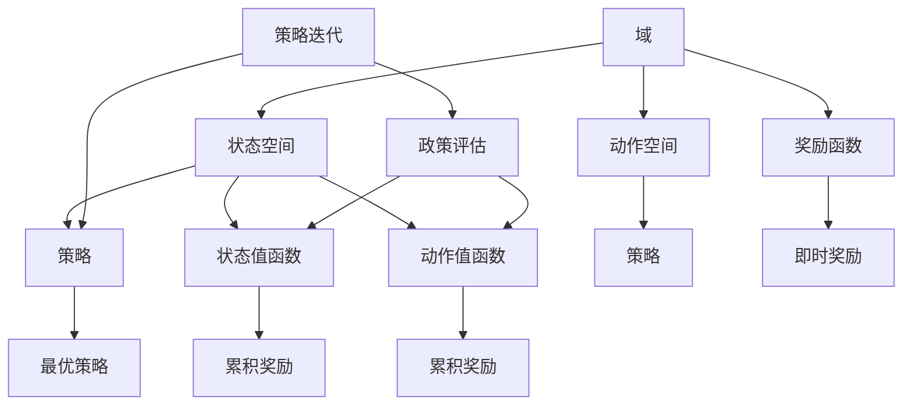

                 

### 文章标题

# 强化学习（Reinforcement Learning）

### 关键词

- 强化学习
- Q-Learning
- 政策梯度
- 自然语言处理
- 计算机视觉
- 游戏控制

### 摘要

本文深入探讨了强化学习这一前沿的机器学习领域，全面介绍了其定义、核心概念、基本算法和模型，以及在不同应用场景中的实际应用。通过详细的逻辑分析和实例讲解，读者将能够理解强化学习的基本原理，掌握其核心算法，并了解到强化学习在自然语言处理、计算机视觉和游戏控制等领域的广泛应用。文章还展望了强化学习的未来发展趋势，并提供了丰富的实践资源和拓展阅读。

----------------------------------------------------------------

### 《强化学习（Reinforcement Learning）》目录大纲

## 第1章 引言

### 1.1 强化学习的定义与背景

强化学习是机器学习的一个重要分支，其核心思想是通过与环境的交互来学习最优策略。本节将介绍强化学习的定义、起源和发展背景。

### 1.2 强化学习与其他机器学习方法的区别

强化学习与其他常见的机器学习方法（如监督学习和无监督学习）在目标和算法上有哪些不同？

### 1.3 强化学习的应用场景

强化学习在游戏、机器人控制、推荐系统等领域有广泛的应用。本节将探讨这些应用场景和实际案例。

## 第2章 强化学习基础

### 2.1 强化学习的核心概念

强化学习的基本概念包括域、策略、奖励和状态。本节将详细解释这些概念，并给出它们之间的关系架构 Mermaid 流程图。

#### 2.1.1 域、策略、奖励和状态

域（Environment）：定义了系统的状态空间、动作空间和奖励函数。

策略（Policy）：定义了从状态到动作的映射。

奖励（Reward）：用于衡量行动带来的效果。

状态（State）：系统所处的环境描述。

#### 2.1.2 Q值函数和值函数

Q值函数（Q-Function）：用于评估策略的好坏。

值函数（Value Function）：用于评估状态的价值。

#### 2.1.3 政策评估与策略迭代

政策评估（Policy Evaluation）：评估当前策略的价值。

策略迭代（Policy Iteration）：通过反复评估和优化策略来找到最优策略。

### 2.2 强化学习的基本算法

强化学习的基本算法包括SARSA算法、Q-Learning算法和实际应用中的策略迭代。本节将介绍这些算法的基本原理和伪代码。

#### 2.2.1 SARSA算法

SARSA（同步采样动作回归）：一种基于值函数的强化学习算法。

#### 2.2.2 Q-Learning算法

Q-Learning：一种基于值函数的强化学习算法。

#### 2.2.3 实际应用中的策略迭代

策略迭代：通过迭代评估和优化策略来找到最优策略。

## 第3章 强化学习模型

### 3.1 状态值函数模型

状态值函数模型是强化学习中最常用的模型之一。本节将介绍基于值函数的强化学习模型，以及值函数的表示方法和估计方法。

#### 3.1.1 基于值函数的强化学习模型

值函数模型的核心是状态值函数（State-Value Function）和动作值函数（Action-Value Function）。

#### 3.1.2 值函数的表示方法

值函数可以用不同的数学方法进行表示，如线性函数、非线性函数等。

#### 3.1.3 值函数的估计方法

值函数的估计方法包括经验回报法、蒙特卡罗法和时序差分法等。

### 3.2 动作值函数模型

动作值函数模型是强化学习中的另一种重要模型。本节将介绍基于动作值函数的强化学习模型，以及动作值函数的表示方法和估计方法。

#### 3.2.1 基于动作值函数的强化学习模型

动作值函数模型的核心是动作值函数（Action-Value Function）。

#### 3.2.2 动作值函数的表示方法

动作值函数可以用不同的数学方法进行表示，如线性函数、非线性函数等。

#### 3.2.3 动作值函数的估计方法

动作值函数的估计方法包括经验回报法、蒙特卡罗法和时序差分法等。

## 第4章 无模型强化学习

### 4.1 无模型强化学习概述

无模型强化学习是指在没有环境模型的情况下进行学习。本节将介绍无模型强化学习的重要性、基本原则和基本算法。

#### 4.1.1 无模型强化学习的重要性

无模型强化学习在现实世界中具有重要意义，因为它能够处理复杂的、不可预测的环境。

#### 4.1.2 无模型强化学习的基本原则

无模型强化学习的基本原则包括探索与利用、状态评估和策略优化。

#### 4.1.3 无模型强化学习的基本算法

无模型强化学习的基本算法包括REINFORCE算法、Q-Learning算法和SARSA算法。

### 4.2 无模型强化学习的算法

本节将详细介绍无模型强化学习的算法，包括探索与利用策略的设计、重要性采样等。

#### 4.2.1 强化学习中的探索与利用

探索与利用是强化学习中的关键问题。如何平衡探索和利用是一个重要的问题。

#### 4.2.2 探索策略的设计

探索策略的设计对于强化学习的效果至关重要。本节将介绍几种常见的探索策略。

#### 4.2.3 重要性采样

重要性采样是一种常用的探索策略，它能够提高学习的效率。

## 第5章 有模型强化学习

### 5.1 有模型强化学习概述

有模型强化学习是指在有环境模型的情况下进行学习。本节将介绍有模型强化学习的优势、基本原则和基本算法。

#### 5.1.1 有模型强化学习的优势

有模型强化学习相对于无模型强化学习具有以下优势：

- 状态和动作的表示更加精确
- 学习速度更快
- 能够处理更复杂的任务

#### 5.1.2 有模型强化学习的基本原则

有模型强化学习的基本原则包括状态评估、策略迭代和模型更新。

#### 5.1.3 有模型强化学习的算法

有模型强化学习的算法包括基于动作值函数的迭代算法、基于值函数的迭代算法和政策梯度算法。

### 5.2 有模型强化学习的算法

本节将详细介绍有模型强化学习的算法，包括动作值迭代算法、值函数迭代算法和政策梯度算法。

#### 5.2.1 动作值迭代算法

动作值迭代算法是一种基于动作值函数的强化学习算法，它通过迭代更新动作值函数来优化策略。

#### 5.2.2 值函数迭代算法

值函数迭代算法是一种基于值函数的强化学习算法，它通过迭代更新值函数来优化策略。

#### 5.2.3 政策梯度算法

政策梯度算法是一种基于策略梯度的强化学习算法，它通过优化策略梯度来优化策略。

## 第6章 强化学习在自然语言处理中的应用

### 6.1 强化学习在语言模型中的应用

语言模型是自然语言处理中的重要组成部分。强化学习如何应用于语言模型？本节将探讨这个问题。

#### 6.1.1 语言模型的基本概念

语言模型是一种预测下一个单词的概率分布的模型。如何基于强化学习构建语言模型？

#### 6.1.2 基于强化学习的语言模型

基于强化学习的语言模型如何通过策略评估和策略迭代来优化？

#### 6.1.3 语言模型的应用场景

强化学习语言模型在文本生成、机器翻译和语音识别等领域的应用。

### 6.2 强化学习在机器翻译中的应用

机器翻译是自然语言处理中的另一个重要领域。强化学习如何应用于机器翻译？

#### 6.2.1 机器翻译的基本概念

机器翻译是指将一种自然语言文本翻译成另一种自然语言文本。如何基于强化学习进行机器翻译？

#### 6.2.2 基于强化学习的机器翻译

基于强化学习的机器翻译如何通过策略评估和策略迭代来优化？

#### 6.2.3 机器翻译的应用场景

强化学习机器翻译在实时翻译、文档翻译和聊天机器人等领域的应用。

## 第7章 强化学习在计算机视觉中的应用

### 7.1 强化学习在图像分类中的应用

图像分类是计算机视觉中的一个基础任务。强化学习如何应用于图像分类？

#### 7.1.1 图像分类的基本概念

图像分类是指将图像分配到不同的类别中。如何基于强化学习进行图像分类？

#### 7.1.2 基于强化学习的图像分类

基于强化学习的图像分类如何通过策略评估和策略迭代来优化？

#### 7.1.3 图像分类的应用场景

强化学习图像分类在人脸识别、车辆检测和医学图像分析等领域的应用。

### 7.2 强化学习在目标检测中的应用

目标检测是计算机视觉中的另一个重要任务。强化学习如何应用于目标检测？

#### 7.2.1 目标检测的基本概念

目标检测是指从图像中检测出感兴趣的目标。如何基于强化学习进行目标检测？

#### 7.2.2 基于强化学习的目标检测

基于强化学习的目标检测如何通过策略评估和策略迭代来优化？

#### 7.2.3 目标检测的应用场景

强化学习目标检测在自动驾驶、视频监控和智能监控等领域的应用。

## 第8章 强化学习在游戏中的应用

### 8.1 强化学习在游戏控制中的应用

游戏控制是强化学习应用中的一个重要领域。如何基于强化学习进行游戏控制？

#### 8.1.1 游戏控制的基本概念

游戏控制是指通过计算机程序控制游戏角色的行为。如何基于强化学习进行游戏控制？

#### 8.1.2 基于强化学习的游戏控制

基于强化学习的游戏控制如何通过策略评估和策略迭代来优化？

#### 8.1.3 游戏控制的应用场景

强化学习游戏控制在电子游戏、机器人竞技和模拟器控制等领域的应用。

### 8.2 强化学习在棋类游戏中的应用

棋类游戏是强化学习应用中的另一个重要领域。如何基于强化学习进行棋类游戏？

#### 8.2.1 棋类游戏的基本概念

棋类游戏是指玩家通过策略选择来控制游戏角色的行为。如何基于强化学习进行棋类游戏？

#### 8.2.2 基于强化学习的棋类游戏

基于强化学习的棋类游戏如何通过策略评估和策略迭代来优化？

#### 8.2.3 棋类游戏的应用场景

强化学习棋类游戏在电子游戏、机器人竞技和人工智能竞赛等领域的应用。

## 第9章 强化学习的未来发展趋势

### 9.1 强化学习在人工智能中的角色

强化学习在人工智能中的应用前景如何？它将在人工智能的发展中扮演什么样的角色？

#### 9.1.1 强化学习在人工智能中的地位

强化学习在人工智能中的重要性和地位。

#### 9.1.2 强化学习在人工智能中的应用前景

强化学习在人工智能领域的潜在应用。

### 9.2 强化学习在新兴领域的发展

强化学习在医疗、能源等新兴领域的应用。

#### 9.2.1 强化学习在医疗领域的应用

强化学习在医疗诊断、治疗方案优化等领域的应用。

#### 9.2.2 强化学习在能源领域的应用

强化学习在电力系统优化、能源管理等方面的应用。

#### 9.2.3 强化学习在其他新兴领域的应用

强化学习在金融、交通等其他新兴领域的应用。

## 参考文献

## 附录

### A.1 强化学习相关资源

#### A.1.1 开源框架和工具

介绍常用的强化学习开源框架和工具，如OpenAI Gym、TensorFlow、PyTorch等。

#### A.1.2 相关论文和书籍

推荐一些经典的强化学习论文和书籍，帮助读者深入了解强化学习。

#### A.1.3 在线课程和讲座

介绍一些高质量的在线课程和讲座，供读者学习强化学习。

### A.2 强化学习代码实现示例

#### A.2.1 基础算法实现

提供强化学习基础算法的代码实现示例，包括SARSA算法、Q-Learning算法等。

#### A.2.2 复杂算法实现

提供强化学习复杂算法的代码实现示例，包括策略迭代、DQN等。

#### A.2.3 实际应用案例

提供强化学习在实际应用中的代码实现示例，如游戏控制、目标检测等。

#### A.2.4 实际案例分析和详细讲解剖析

通过实际案例分析和详细讲解，帮助读者更好地理解强化学习在现实中的应用。

#### A.2.5 项目小结

对项目进行总结，讨论其成功和不足之处，并提出改进建议。

### A.3 强化学习项目实战

#### A.3.1 项目规划与设计

介绍如何规划和设计强化学习项目，包括目标设定、环境构建、算法选择等。

#### A.3.2 开发环境搭建

指导如何搭建强化学习项目的开发环境，包括软件安装、依赖管理等。

#### A.3.3 源代码实现与解读

提供强化学习项目的源代码，并进行详细解读，帮助读者理解代码实现。

#### A.3.4 代码分析与优化

对源代码进行深入分析，并提出优化建议，以提高项目性能。

#### A.3.5 实际案例分析和详细讲解剖析

通过实际案例分析和详细讲解，帮助读者更好地理解强化学习在现实中的应用。

----------------------------------------------------------------

### 第1章 引言

### 1.1 强化学习的定义与背景

强化学习（Reinforcement Learning，简称RL）是机器学习领域的一个重要分支，其核心思想是通过与环境的交互来学习最优策略。在强化学习中，智能体（agent）通过执行动作（action）来获取奖励（reward），并通过奖励来评估其行为的优劣，进而调整其行为策略。

强化学习的起源可以追溯到20世纪50年代，当时心理学家和行为科学家开始研究动物和人类如何通过试错来学习行为。这种学习方式与强化学习的概念高度相似。随着计算机科学和人工智能技术的发展，强化学习逐渐成为机器学习领域的一个重要研究方向。

强化学习的发展经历了几个重要的阶段：

1. **早期探索（1950s-1970s）**：在这一阶段，研究人员开始探索如何通过试错来学习行为。例如，美国心理学家Edward Thorndike提出了“猫打开门”的经典实验，通过多次尝试，猫学会了如何打开门获取食物。

2. **理论框架建立（1980s-1990s）**：在这一阶段，强化学习开始形成一套完整的理论框架。1984年，理查德·萨顿和安德鲁·巴托（Richard Sutton and Andrew Barto）的著作《强化学习：一种关于机器学习的新方法》为强化学习奠定了理论基础。

3. **算法发展与应用（2000s-至今）**：随着计算机性能的不断提升，强化学习算法得到了广泛应用。特别是深度强化学习（Deep Reinforcement Learning，简称DRL）的提出，使得强化学习在复杂环境中的应用成为可能。

### 1.2 强化学习与其他机器学习方法的区别

强化学习与其他常见的机器学习方法（如监督学习和无监督学习）在目标和算法上有显著区别：

- **监督学习（Supervised Learning）**：监督学习是一种通过已知输入和输出数据来训练模型的方法。其目标是最小化模型预测与真实值之间的差距。强化学习则通过与环境的交互来学习最优策略，其目标是在长期内获得最大的累积奖励。

- **无监督学习（Unsupervised Learning）**：无监督学习是通过对未标记的数据进行学习来发现数据中的结构和模式。强化学习则依赖于环境的奖励信号来指导学习过程。

- **强化学习（Reinforcement Learning）**：强化学习的目标是学习一个策略，使得智能体在执行动作时能够最大化累积奖励。与监督学习和无监督学习相比，强化学习更强调智能体与环境的互动。

### 1.3 强化学习的应用场景

强化学习在多个领域都有广泛的应用，以下是一些典型的应用场景：

- **游戏**：强化学习在电子游戏、棋类游戏等领域有广泛的应用。例如，DeepMind的AlphaGo就是基于深度强化学习实现的，它在围棋领域取得了显著的成就。

- **机器人控制**：强化学习可以用于机器人的导航、抓取和操作等任务。例如，机器人可以通过与环境的交互来学习如何完成复杂的任务，如搬运物品或进行清洁。

- **推荐系统**：强化学习可以用于构建推荐系统，通过学习用户的历史行为数据来提供个性化的推荐。例如，电商网站可以使用强化学习来推荐用户可能感兴趣的商品。

- **自动驾驶**：强化学习在自动驾驶领域中具有重要的应用价值。通过模拟和现实环境的交互，自动驾驶系统可以学习如何安全、高效地驾驶。

- **自然语言处理**：强化学习在自然语言处理领域有广泛的应用，如文本生成、机器翻译等。通过学习语言模型，强化学习可以生成高质量的文本。

- **计算机视觉**：强化学习可以用于图像分类、目标检测、人脸识别等计算机视觉任务。通过学习图像的特征表示，强化学习可以实现对复杂图像任务的有效处理。

### 总结

强化学习作为一种基于试错和反馈机制的机器学习方法，在解决复杂、动态环境中的决策问题方面具有独特的优势。通过本文的引言部分，读者可以对强化学习的基本概念、发展历程和应用场景有一个初步的了解。接下来的章节将进一步深入探讨强化学习的核心概念、算法和模型，帮助读者全面掌握这一重要的机器学习技术。

## 第2章 强化学习基础

### 2.1 强化学习的核心概念

强化学习（Reinforcement Learning，简称RL）的基础在于其核心概念。理解这些概念对于掌握强化学习至关重要。以下是强化学习中的几个关键概念及其相互关系。

#### 域（Environment）

域是指强化学习系统的整体环境，它包括智能体（agent）、状态空间（state space）、动作空间（action space）和奖励函数（reward function）。

- **状态空间（State Space）**：状态空间是所有可能状态集合的集合。智能体在环境中的位置可以被视为状态的一个例子。

- **动作空间（Action Space）**：动作空间是所有可能动作集合的集合。智能体可以执行的动作集合。

- **奖励函数（Reward Function）**：奖励函数定义了智能体执行特定动作时获得的奖励值。奖励可以是正数、负数或零。

#### 策略（Policy）

策略是智能体根据当前状态选择动作的规则或函数。策略可以表示为：\[ \pi(s,a) = P(a|s) \]，即给定状态 \( s \)，智能体选择动作 \( a \) 的概率。

- **最优策略（Optimal Policy）**：最优策略是指能够使智能体在长期内获得最大累积奖励的策略。

#### 值函数（Value Function）

值函数用于评估智能体在某个状态下执行最佳策略所能获得的累积奖励。有两个主要的值函数：

- **状态值函数（State-Value Function）**：状态值函数 \( V(s) \) 表示在状态 \( s \) 下执行最佳策略所能获得的累积奖励的期望值。

- **动作值函数（Action-Value Function）**：动作值函数 \( Q(s,a) \) 表示在状态 \( s \) 下执行动作 \( a \) 并遵循最佳策略所能获得的累积奖励的期望值。

#### Q值函数和值函数

Q值函数和状态值函数是强化学习中最核心的量。Q值函数是动作值函数的扩展，它表示在某个状态下执行某个动作的长期效果。Q值函数可以通过以下公式表示：

\[ Q(s,a) = r(s,a) + \gamma \max_{a'} Q(s',a') \]

其中，\( r(s,a) \) 是执行动作 \( a \) 后获得的即时奖励，\( \gamma \) 是折扣因子，用于平衡短期奖励和长期奖励。

#### 政策评估与策略迭代

政策评估（Policy Evaluation）是指通过评估当前策略的值函数来估计策略的性能。策略迭代（Policy Iteration）是一种通过反复评估和优化策略来找到最优策略的方法。策略迭代包括以下两个步骤：

1. **策略评估（Policy Evaluation）**：通过迭代计算值函数，使值函数逐渐收敛到真实值。

2. **策略改进（Policy Improvement）**：在策略评估的基础上，选择一个更好的策略，使其在迭代过程中逐渐接近最优策略。

### 核心概念之间的关系架构 Mermaid 流程图

以下是强化学习核心概念之间的Mermaid流程图：



通过这个流程图，我们可以更清晰地理解强化学习中的核心概念及其相互关系。

### 2.2 强化学习的基本算法

强化学习的基本算法包括SARSA算法、Q-Learning算法和实际应用中的策略迭代。这些算法通过不同的策略评估和策略迭代方法，帮助智能体在环境中学习最优策略。

#### SARSA算法

SARSA（同步采样动作回归）是一种基于值函数的强化学习算法。它的核心思想是同步更新状态值函数。以下是SARSA算法的伪代码：

```python
for each episode:
    Initialize state s
    Initialize policy π
    for each step t:
        Take action a according to policy π(s)
        Observe reward r and next state s'
        Perform action a' according to policy π(s')
        Update Q(s, a) using the following equation:
            Q(s, a) = Q(s, a) + α [r + γ max Q(s', a') - Q(s, a)]
        s = s'
    end for
end for
```

其中，\( α \) 是学习率，\( γ \) 是折扣因子。

#### Q-Learning算法

Q-Learning是一种基于值函数的强化学习算法，其核心思想是通过迭代更新动作值函数来优化策略。以下是Q-Learning算法的伪代码：

```python
for each episode:
    Initialize state s
    Initialize Q-table Q(s, a)
    for each step t:
        Take action a that maximizes Q(s, a)
        Observe reward r and next state s'
        Update Q(s, a) using the following equation:
            Q(s, a) = Q(s, a) + α [r + γ max Q(s', a') - Q(s, a)]
        s = s'
    end for
end for
```

#### 实际应用中的策略迭代

策略迭代是通过反复评估和优化策略来找到最优策略的方法。实际应用中的策略迭代包括以下步骤：

1. **策略评估**：通过迭代计算当前策略的值函数，使值函数逐渐收敛到真实值。

2. **策略改进**：选择一个更好的策略，使其在迭代过程中逐渐接近最优策略。策略改进可以通过以下公式实现：

\[ π'(s) = \arg\max_{a} [Q(s, a) + π(s)] \]

其中，\( π(s) \) 是当前策略。

3. **重复步骤1和步骤2**，直到策略收敛。

### 总结

强化学习的核心概念包括域、策略、奖励、状态和值函数。通过SARSA算法、Q-Learning算法和策略迭代等方法，智能体能够在复杂环境中学习最优策略。接下来，我们将进一步探讨强化学习模型，包括状态值函数模型和动作值函数模型。

## 第3章 强化学习模型

### 3.1 状态值函数模型

状态值函数模型（State-Value Function Model）是强化学习中最常用的模型之一。它通过评估智能体在某个状态下执行最佳策略所能获得的累积奖励来指导学习过程。状态值函数模型的核心是状态值函数（State-Value Function），也称为值函数（Value Function）。

#### 基于值函数的强化学习模型

值函数模型的核心思想是通过学习状态值函数来评估智能体的行为。状态值函数 \( V(s) \) 表示在状态 \( s \) 下执行最佳策略所能获得的累积奖励的期望值。值函数模型包括两个主要部分：状态值函数和策略。

1. **状态值函数**：状态值函数 \( V(s) \) 是一个映射函数，它将状态空间映射到实数值。具体来说，\( V(s) \) 表示在状态 \( s \) 下执行最佳策略所能获得的累积奖励的期望值。

2. **策略**：策略 \( \pi(s) \) 是一个映射函数，它将状态空间映射到动作空间。策略 \( \pi(s) \) 表示在状态 \( s \) 下智能体应该执行的动作。

值函数模型可以通过以下公式表示：

\[ V(s) = \sum_{a} \pi(s) Q(s, a) \]

其中，\( Q(s, a) \) 是动作值函数。

#### 值函数的表示方法

值函数可以用不同的数学方法进行表示，如线性函数、非线性函数等。

1. **线性函数**：线性函数是最简单的一种值函数表示方法，它通过线性组合动作值函数来计算状态值函数。具体来说，线性函数可以表示为：

\[ V(s) = \sum_{a} \pi(s) a \]

其中，\( a \) 是动作值函数，\( \pi(s) \) 是策略。

2. **非线性函数**：非线性函数可以更好地适应复杂环境。常见的方法包括：

   - **神经网络**：使用神经网络作为值函数的近似模型，通过训练神经网络来学习值函数。
   - **特征组合**：通过组合不同特征来构建非线性值函数。

#### 值函数的估计方法

值函数的估计方法包括经验回报法、蒙特卡罗法和时序差分法等。

1. **经验回报法（Experience Replay）**：经验回报法是一种基于经验回放的方法，它通过回放之前收集的经验来估计值函数。具体来说，经验回报法包括以下步骤：

   - 收集经验：智能体在执行动作后收集状态、动作、奖励和下一状态。
   - 回放经验：随机从经验池中抽取经验，用于更新值函数。
   - 更新值函数：使用收集到的经验来更新值函数。

2. **蒙特卡罗法（Monte Carlo）**：蒙特卡罗法是一种基于概率的方法，它通过模拟多次随机过程来估计值函数。具体来说，蒙特卡罗法包括以下步骤：

   - 模拟随机过程：从当前状态开始，按照策略模拟随机过程，直到达到终止状态。
   - 计算回报：计算模拟过程中获得的累积奖励。
   - 更新值函数：使用模拟的回报来更新值函数。

3. **时序差分法（Temporal Difference，TD）**：时序差分法是一种基于时序的方法，它通过比较当前值函数和下一状态值函数的差异来更新值函数。具体来说，时序差分法包括以下步骤：

   - 计算时序差分：计算当前值函数和下一状态值函数的差异。
   - 更新值函数：使用时序差分来更新值函数。

### 3.2 动作值函数模型

动作值函数模型（Action-Value Function Model）是另一种重要的强化学习模型。它通过评估智能体在某个状态下执行某个动作所能获得的累积奖励来指导学习过程。动作值函数模型的核心是动作值函数（Action-Value Function），也称为Q值函数（Q-Function）。

#### 基于动作值函数的强化学习模型

动作值函数模型的核心思想是通过学习动作值函数来评估智能体的行为。动作值函数 \( Q(s, a) \) 表示在状态 \( s \) 下执行动作 \( a \) 并遵循最佳策略所能获得的累积奖励的期望值。动作值函数模型包括两个主要部分：动作值函数和策略。

1. **动作值函数**：动作值函数 \( Q(s, a) \) 是一个映射函数，它将状态和动作的集合映射到实数值。具体来说，\( Q(s, a) \) 表示在状态 \( s \) 下执行动作 \( a \) 并遵循最佳策略所能获得的累积奖励的期望值。

2. **策略**：策略 \( \pi(s) \) 是一个映射函数，它将状态空间映射到动作空间。策略 \( \pi(s) \) 表示在状态 \( s \) 下智能体应该执行的动作。

动作值函数模型可以通过以下公式表示：

\[ Q(s, a) = \sum_{s'} p(s'|s, a) [r + γ \max_{a'} Q(s', a')] \]

其中，\( p(s'|s, a) \) 是状态转移概率，\( r \) 是即时奖励，\( γ \) 是折扣因子，\( \max_{a'} Q(s', a') \) 是在下一状态 \( s' \) 下执行最佳动作的累积奖励的期望值。

#### 动作值函数的表示方法

动作值函数可以用不同的数学方法进行表示，如线性函数、非线性函数等。

1. **线性函数**：线性函数是最简单的一种动作值函数表示方法，它通过线性组合状态转移概率和即时奖励来计算动作值函数。具体来说，线性函数可以表示为：

\[ Q(s, a) = \sum_{s'} p(s'|s, a) r + γ \max_{a'} \sum_{s''} p(s''|s', a') r \]

2. **非线性函数**：非线性函数可以更好地适应复杂环境。常见的方法包括：

   - **神经网络**：使用神经网络作为动作值函数的近似模型，通过训练神经网络来学习动作值函数。
   - **特征组合**：通过组合不同特征来构建非线性动作值函数。

#### 动作值函数的估计方法

动作值函数的估计方法包括经验回报法、蒙特卡罗法和时序差分法等。

1. **经验回报法（Experience Replay）**：经验回报法是一种基于经验回放的方法，它通过回放之前收集的经验来估计动作值函数。具体来说，经验回报法包括以下步骤：

   - 收集经验：智能体在执行动作后收集状态、动作、奖励和下一状态。
   - 回放经验：随机从经验池中抽取经验，用于更新动作值函数。
   - 更新动作值函数：使用收集到的经验来更新动作值函数。

2. **蒙特卡罗法（Monte Carlo）**：蒙特卡罗法是一种基于概率的方法，它通过模拟多次随机过程来估计动作值函数。具体来说，蒙特卡罗法包括以下步骤：

   - 模拟随机过程：从当前状态开始，按照策略模拟随机过程，直到达到终止状态。
   - 计算回报：计算模拟过程中获得的累积奖励。
   - 更新动作值函数：使用模拟的回报来更新动作值函数。

3. **时序差分法（Temporal Difference，TD）**：时序差分法是一种基于时序的方法，它通过比较当前动作值函数和下一状态动作值函数的差异来更新动作值函数。具体来说，时序差分法包括以下步骤：

   - 计算时序差分：计算当前动作值函数和下一状态动作值函数的差异。
   - 更新动作值函数：使用时序差分来更新动作值函数。

### 总结

强化学习模型包括状态值函数模型和动作值函数模型。状态值函数模型通过评估智能体在某个状态下执行最佳策略所能获得的累积奖励来指导学习过程，而动作值函数模型通过评估智能体在某个状态下执行某个动作所能获得的累积奖励来指导学习过程。本章介绍了值函数和动作值函数的表示方法和估计方法，为理解强化学习的核心算法奠定了基础。接下来，我们将进一步探讨无模型强化学习和有模型强化学习，以及它们在实际应用中的算法和模型。

## 第4章 无模型强化学习

### 4.1 无模型强化学习概述

无模型强化学习（Model-Free Reinforcement Learning）是指在没有环境模型的情况下进行学习的强化学习方法。与有模型强化学习（Model-Based Reinforcement Learning）相比，无模型强化学习不需要对环境进行建模，而是通过直接与环境的交互来学习策略。这种方法在现实世界中具有重要意义，因为它能够处理复杂的、不可预测的环境。

#### 无模型强化学习的重要性

无模型强化学习的重要性体现在以下几个方面：

1. **处理复杂环境**：无模型强化学习不需要环境模型，因此能够处理那些难以建模或难以获得环境模型的环境。

2. **适应性强**：无模型强化学习能够直接从经验中学习，因此具有更强的适应性，能够适应不同的环境和任务。

3. **计算效率高**：由于不需要构建环境模型，无模型强化学习通常具有更高的计算效率。

#### 无模型强化学习的基本原则

无模型强化学习的基本原则包括探索与利用、状态评估和策略优化。

1. **探索与利用（Exploration and Exploitation）**：探索（Exploration）是指智能体在执行动作时尝试新的动作，以获取新的信息；利用（Exploitation）是指智能体根据当前的信息选择已知的最佳动作。无模型强化学习的核心问题是如何在探索和利用之间取得平衡。

2. **状态评估（State Evaluation）**：状态评估是指智能体对当前状态进行评估，以确定下一步应该如何行动。

3. **策略优化（Policy Optimization）**：策略优化是指智能体通过调整策略来最大化累积奖励。

#### 无模型强化学习的基本算法

无模型强化学习的基本算法包括REINFORCE算法、Q-Learning算法和SARSA算法。

1. **REINFORCE算法**：REINFORCE算法是一种基于梯度上升的方法，它通过计算策略梯度的反方向来更新策略参数。具体来说，REINFORCE算法的更新规则为：

\[ \theta_{t+1} = \theta_{t} + \alpha \nabla_{\theta} \log \pi_{\theta}(a_t | s_t) r_t \]

其中，\( \theta \) 表示策略参数，\( \alpha \) 表示学习率，\( r_t \) 表示即时奖励，\( \pi_{\theta}(a_t | s_t) \) 表示策略在状态 \( s_t \) 下选择动作 \( a_t \) 的概率。

2. **Q-Learning算法**：Q-Learning算法是一种基于值函数的方法，它通过迭代更新动作值函数来优化策略。具体来说，Q-Learning算法的更新规则为：

\[ Q(s_t, a_t) = Q(s_t, a_t) + \alpha [r_t + \gamma \max_{a'} Q(s_{t+1}, a') - Q(s_t, a_t)] \]

其中，\( Q(s_t, a_t) \) 表示当前动作值函数，\( \alpha \) 表示学习率，\( \gamma \) 表示折扣因子。

3. **SARSA算法**：SARSA算法是一种同步采样动作回归方法，它通过同时更新当前状态和下一状态的动作值函数来优化策略。具体来说，SARSA算法的更新规则为：

\[ Q(s_t, a_t) = Q(s_t, a_t) + \alpha [r_t + \gamma Q(s_{t+1}, a_{t+1}) - Q(s_t, a_t)] \]

其中，\( Q(s_t, a_t) \) 表示当前动作值函数，\( \alpha \) 表示学习率，\( \gamma \) 表示折扣因子。

### 4.2 无模型强化学习的算法

本节将详细介绍无模型强化学习的算法，包括探索与利用策略的设计、重要性采样等。

#### 探索与利用

探索与利用是强化学习中的关键问题，如何平衡探索和利用是一个重要的问题。以下是一些常见的探索策略：

1. **epsilon-greedy策略（ε-greedy policy）**：epsilon-greedy策略是一种简单的探索策略，它以概率 \( \epsilon \) 随机选择动作，以概率 \( 1-\epsilon \) 选择当前最优动作。具体来说，epsilon-greedy策略可以表示为：

\[ a_t = \begin{cases} 
\text{random action} & \text{with probability } \epsilon \\
\arg\max_a Q(s_t, a) & \text{with probability } 1-\epsilon 
\end{cases} \]

其中，\( \epsilon \) 是一个小的常数，通常随着训练的进行逐渐减小。

2. **UCB算法（Upper Confidence Bound）**：UCB算法是一种基于置信区间的探索策略，它通过计算动作的平均奖励和置信区间来选择动作。具体来说，UCB算法可以表示为：

\[ a_t = \arg\max_a \left( \frac{R(a)}{N(a)} + \sqrt{\frac{2 \ln t}{N(a)}} \right) \]

其中，\( R(a) \) 是动作 \( a \) 的总奖励，\( N(a) \) 是动作 \( a \) 的总次数，\( t \) 是总的时间步数。

#### 重要性采样

重要性采样是一种提高学习效率的方法，它通过在样本中赋予不同的权重来调整样本的分布。在强化学习中，重要性采样可以用来处理稀疏奖励问题，即某些状态或动作出现的概率很低。

重要性采样的一般步骤如下：

1. **采样**：从当前策略中采样一个动作 \( a_t \)。
2. **执行动作**：执行采样得到的动作 \( a_t \)，并获取奖励 \( r_t \) 和下一状态 \( s_{t+1} \)。
3. **计算重要性权重**：计算采样得到的动作 \( a_t \) 和当前策略 \( \pi_t \) 之间的差异，并计算重要性权重。具体来说，重要性权重可以表示为：

\[ w_t = \frac{\pi_t(a_t)}{\hat{\pi_t}(a_t)} \]

其中，\( \hat{\pi_t}(a_t) \) 是估计的当前策略。

4. **重放经验**：使用重要性权重对经验进行重放，以调整样本的分布。

#### 总结

无模型强化学习是一种在没有环境模型的情况下进行学习的强化学习方法，它通过探索与利用、状态评估和策略优化来优化智能体的行为。本章介绍了无模型强化学习的基本原则和算法，包括REINFORCE算法、Q-Learning算法、SARSA算法、epsilon-greedy策略和UCB算法。通过这些算法，智能体能够在复杂环境中学习最优策略。接下来，我们将进一步探讨有模型强化学习，以及它在实际应用中的算法和模型。

### 第5章 有模型强化学习

### 5.1 有模型强化学习概述

有模型强化学习（Model-Based Reinforcement Learning）是指在使用环境模型的情况下进行学习的强化学习方法。与无模型强化学习不同，有模型强化学习通过构建环境模型来指导学习过程。这种方法在处理复杂、动态环境时具有显著的优势。

#### 有模型强化学习的优势

有模型强化学习相对于无模型强化学习具有以下优势：

1. **更好的预测能力**：有模型强化学习通过环境模型可以更好地预测未来状态和奖励，从而更有效地指导学习过程。

2. **更快的收敛速度**：由于有模型强化学习可以利用环境模型来预测下一状态和奖励，因此通常具有更快的收敛速度。

3. **处理复杂任务**：有模型强化学习能够处理那些对状态和动作空间进行精确建模非常困难的复杂任务。

#### 有模型强化学习的基本原则

有模型强化学习的基本原则包括状态评估、策略迭代和模型更新。

1. **状态评估（State Evaluation）**：状态评估是指通过迭代计算当前策略的值函数，以评估智能体的行为。状态评估可以通过基于值函数的迭代方法实现。

2. **策略迭代（Policy Iteration）**：策略迭代是指通过反复评估和优化策略来找到最优策略。策略迭代包括策略评估和策略改进两个步骤。

3. **模型更新（Model Update）**：模型更新是指根据观察到的数据更新环境模型。模型更新可以通过基于模型的迭代方法实现。

#### 有模型强化学习的算法

有模型强化学习的算法包括基于动作值函数的迭代算法、基于值函数的迭代算法和政策梯度算法。

1. **基于动作值函数的迭代算法**：基于动作值函数的迭代算法通过迭代更新动作值函数来优化策略。具体来说，基于动作值函数的迭代算法包括以下步骤：

   - 初始化动作值函数 \( Q(s, a) \) 和策略 \( \pi(s) \)。
   - 通过模型生成一系列状态-动作对 \( (s, a, s', a') \)。
   - 更新动作值函数 \( Q(s, a) \) 使用以下公式：

   \[ Q(s, a) = Q(s, a) + \alpha [r + \gamma \max_{a'} Q(s', a') - Q(s, a)] \]

   - 根据更新后的动作值函数 \( Q(s, a) \) 更新策略 \( \pi(s) \)。

2. **基于值函数的迭代算法**：基于值函数的迭代算法通过迭代更新值函数来优化策略。具体来说，基于值函数的迭代算法包括以下步骤：

   - 初始化值函数 \( V(s) \) 和策略 \( \pi(s) \)。
   - 通过模型生成一系列状态-动作对 \( (s, a, s', a') \)。
   - 更新值函数 \( V(s) \) 使用以下公式：

   \[ V(s) = V(s) + \alpha [r + \gamma V(s')] - V(s)] \]

   - 根据更新后的值函数 \( V(s) \) 更新策略 \( \pi(s) \)。

3. **政策梯度算法**：政策梯度算法是一种直接优化策略梯度的方法。具体来说，政策梯度算法包括以下步骤：

   - 初始化策略 \( \pi(s) \)。
   - 通过模型生成一系列状态-动作对 \( (s, a, s', a') \)。
   - 计算策略梯度 \( \nabla_{\pi} J(\pi) \) 使用以下公式：

   \[ \nabla_{\pi} J(\pi) = \sum_{s} \pi(s) \nabla_{\pi(s)} J(s) \]

   其中，\( J(s) = \sum_{a} \pi(s) [r + \gamma V(s')] \)。

   - 根据策略梯度 \( \nabla_{\pi} J(\pi) \) 更新策略 \( \pi(s) \)。

#### 总结

有模型强化学习是一种在使用环境模型的情况下进行学习的强化学习方法，它具有更好的预测能力、更快的收敛速度和更强的处理复杂任务的能力。本章介绍了有模型强化学习的基本原则和算法，包括基于动作值函数的迭代算法、基于值函数的迭代算法和政策梯度算法。通过这些算法，智能体能够在复杂环境中学习最优策略。接下来，我们将进一步探讨无模型强化学习和有模型强化学习的区别，并讨论它们在实际应用中的适用场景。

## 第6章 强化学习在自然语言处理中的应用

### 6.1 强化学习在语言模型中的应用

语言模型（Language Model）是自然语言处理（Natural Language Processing，NLP）中的一个基础任务，它用于预测下一个单词或词组。强化学习在语言模型中的应用通过优化模型生成的文本质量，提高了语言模型的性能。

#### 语言模型的基本概念

语言模型是一种概率模型，它用于预测给定前文序列 \( w_1, w_2, ..., w_{t-1} \) 后的下一个单词或词组 \( w_t \) 的概率。一个简单的语言模型可以使用n-gram模型来实现，它基于过去n个单词的序列来预测下一个单词。

#### 基于强化学习的语言模型

基于强化学习的语言模型通过学习一个策略来生成高质量的文本。强化学习中的策略可以是一个生成模型，如递归神经网络（RNN）或变换器（Transformer），它根据当前的状态（前文序列）生成下一个词。

以下是一个基于强化学习的语言模型的示例：

```python
# 初始化语言模型
model = TransformerModel()

# 初始化策略
policy = EpsilonGreedyPolicy(epsilon=0.1)

# 初始化状态
state = ["The", "cat", "sat", "on", "the", "mat"]

# 生成文本
while True:
    # 根据策略选择下一个词
    next_word = policy.select_next_word(model, state)

    # 更新状态
    state.append(next_word)

    # 判断是否达到终止条件
    if is_termination_condition(state):
        break

# 输出生成的文本
print("Generated Text:", " ".join(state))
```

#### 语言模型的应用场景

强化学习语言模型在多个自然语言处理任务中都有广泛的应用：

1. **文本生成**：强化学习语言模型可以生成高质量的文本，如小说、新闻、文章等。

2. **机器翻译**：强化学习语言模型可以用于机器翻译，通过优化翻译模型的生成策略来提高翻译质量。

3. **语音识别**：强化学习语言模型可以用于语音识别，通过优化语音模型生成文本的策略来提高识别准确性。

### 6.2 强化学习在机器翻译中的应用

机器翻译（Machine Translation）是将一种自然语言文本翻译成另一种自然语言文本的过程。强化学习在机器翻译中的应用通过优化翻译策略，提高了翻译质量和效率。

#### 机器翻译的基本概念

机器翻译包括源语言（Source Language）和目标语言（Target Language）两个部分。一个简单的机器翻译模型可以使用n-gram模型来实现，它基于源语言和目标语言的词汇表来翻译单词。

#### 基于强化学习的机器翻译

基于强化学习的机器翻译通过学习一个策略来优化翻译过程。强化学习中的策略可以是一个翻译模型，如序列到序列（Seq2Seq）模型，它根据源语言的序列生成目标语言的序列。

以下是一个基于强化学习的机器翻译的示例：

```python
# 初始化机器翻译模型
model = Seq2SeqModel()

# 初始化策略
policy = EpsilonGreedyPolicy(epsilon=0.1)

# 初始化源语言状态
source_state = ["The", "cat", "sat", "on", "the", "mat"]

# 生成目标语言文本
while True:
    # 根据策略选择下一个目标语言单词
    next_word = policy.select_next_word(model, source_state)

    # 更新源语言状态
    source_state.append(next_word)

    # 判断是否达到终止条件
    if is_termination_condition(source_state):
        break

# 输出生成的目标语言文本
print("Generated Target Text:", " ".join(source_state))
```

#### 机器翻译的应用场景

强化学习机器翻译在多个领域都有广泛的应用：

1. **实时翻译**：强化学习机器翻译可以用于实时翻译，如在线聊天、视频会议等。

2. **文档翻译**：强化学习机器翻译可以用于将一种语言的文档翻译成另一种语言的文档，如法律文件、医学文档等。

3. **语音识别**：强化学习机器翻译可以用于将语音翻译成文本，如智能语音助手、语音命令控制等。

### 总结

强化学习在自然语言处理中的应用通过优化语言模型和翻译模型，提高了文本生成和机器翻译的质量。本章介绍了强化学习在语言模型和机器翻译中的应用，并展示了如何使用强化学习来生成文本和翻译文本。接下来，我们将进一步探讨强化学习在计算机视觉中的应用。

### 第7章 强化学习在计算机视觉中的应用

强化学习在计算机视觉中的应用越来越广泛，它通过学习如何从图像中提取特征并作出决策，提高了视觉系统的智能水平。本章将重点探讨强化学习在图像分类和目标检测这两个关键计算机视觉任务中的应用。

#### 7.1 强化学习在图像分类中的应用

图像分类（Image Classification）是将图像分配到特定类别中的任务。在传统的图像分类方法中，模型通常使用卷积神经网络（Convolutional Neural Networks，CNN）来提取图像特征，并使用全连接层来分类。强化学习通过优化决策过程，提高了图像分类的性能。

##### 图像分类的基本概念

图像分类包括以下几个基本概念：

- **特征提取**：通过卷积神经网络从图像中提取特征。
- **分类器**：使用提取到的特征对图像进行分类。
- **损失函数**：用于衡量分类器预测结果与真实标签之间的差距。

##### 基于强化学习的图像分类

基于强化学习的图像分类方法通过学习如何优化分类器的决策过程。强化学习模型在这里充当分类器，并通过与环境（图像数据集）的交互来学习最优决策。

以下是一个基于强化学习的图像分类的示例：

```python
# 初始化卷积神经网络
cnn_model = CNNModel()

# 初始化策略
policy = EpsilonGreedyPolicy(epsilon=0.1)

# 初始化状态
state = None

# 循环处理图像
while True:
    # 从数据集中随机抽取图像作为状态
    image, label = data_loader.get_random_image()

    # 将图像作为状态输入到卷积神经网络中
    state = cnn_model.extract_features(image)

    # 根据策略选择分类标签
    predicted_label = policy.select_label(cnn_model, state)

    # 更新策略
    policy.update(cnn_model, state, predicted_label)

    # 判断是否达到终止条件
    if is_termination_condition(state):
        break

# 输出分类结果
print("分类结果：", predicted_label)
```

##### 图像分类的应用场景

强化学习图像分类在以下场景中有广泛应用：

- **人脸识别**：通过学习如何优化人脸特征提取和分类，强化学习可以用于人脸识别系统。
- **车辆检测**：在自动驾驶系统中，强化学习可以用于检测和识别道路上的车辆。
- **医学图像分析**：在医疗诊断中，强化学习可以用于分析医学图像，如X光片、CT扫描等。

#### 7.2 强化学习在目标检测中的应用

目标检测（Object Detection）是从图像中识别和定位多个对象的过程。强化学习通过优化检测算法的决策过程，提高了目标检测的准确性和效率。

##### 目标检测的基本概念

目标检测包括以下几个基本概念：

- **特征提取**：通过卷积神经网络从图像中提取特征。
- **边界框预测**：用于预测目标的边界框位置和大小。
- **分类器**：用于分类边界框内的对象。

##### 基于强化学习的目标检测

基于强化学习的目标检测方法通过学习如何优化边界框预测和分类器的决策过程。强化学习模型在这里充当检测算法，并通过与环境（图像数据集）的交互来学习最优决策。

以下是一个基于强化学习的目标检测的示例：

```python
# 初始化卷积神经网络
cnn_model = CNNModel()

# 初始化策略
policy = EpsilonGreedyPolicy(epsilon=0.1)

# 初始化状态
state = None

# 循环处理图像
while True:
    # 从数据集中随机抽取图像作为状态
    image, bounding_boxes = data_loader.get_random_image()

    # 将图像作为状态输入到卷积神经网络中
    state = cnn_model.extract_features(image)

    # 根据策略选择边界框和分类标签
    selected_bounding_box, selected_label = policy.select_bounding_box_and_label(cnn_model, state)

    # 更新策略
    policy.update(cnn_model, state, selected_bounding_box, selected_label)

    # 判断是否达到终止条件
    if is_termination_condition(state):
        break

# 输出目标检测结果
print("检测结果：", selected_bounding_box, selected_label)
```

##### 目标检测的应用场景

强化学习目标检测在以下场景中有广泛应用：

- **自动驾驶**：在自动驾驶系统中，强化学习可以用于检测道路上的行人、车辆和障碍物。
- **视频监控**：在视频监控系统

