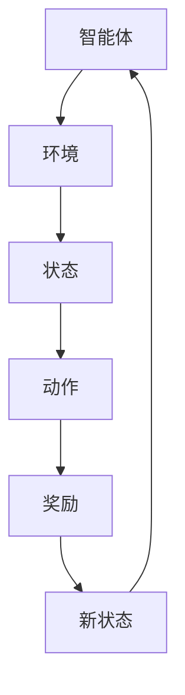

                 

# 强化学习应用

> 关键词：强化学习、Q-learning、SARSA、策略梯度、模型自由强化学习、游戏、机器人控制、自然语言处理、推荐系统

> 摘要：本文从强化学习的基础概念出发，详细介绍了强化学习的核心算法原理，包括Q-learning、SARSA、策略梯度算法和模型自由强化学习算法，并深入探讨了这些算法在游戏、机器人控制、自然语言处理和推荐系统等领域的实际应用。最后，本文还提供了强化学习开发工具和资源，帮助读者深入了解和掌握强化学习。

## 强化学习应用

强化学习（Reinforcement Learning，简称RL）是机器学习的一个重要分支，其主要目标是使机器通过与环境的交互来学习如何采取行动以实现特定目标。强化学习在众多领域都取得了显著的成果，如游戏、机器人控制、自然语言处理和推荐系统等。本文将一步步深入探讨强化学习的应用。

## 第一部分：强化学习基础

### 第1章：强化学习概述

#### 1.1 强化学习的基本概念

强化学习是一种通过试错来学习如何采取最优行动的机器学习方法。在强化学习中，智能体（agent）通过与环境的交互来学习，其目标是获得最大的累积奖励。强化学习的主要组成部分包括智能体、环境、状态、动作和奖励。

#### 1.2 强化学习与监督学习、无监督学习的区别

强化学习与监督学习和无监督学习有本质的区别。监督学习需要提供标签数据，模型通过学习标签数据来预测新数据的标签；无监督学习不需要标签数据，模型通过学习数据的内在结构来发现数据的模式。而强化学习则通过智能体与环境的交互，学习如何获得最大的累积奖励。

#### 1.3 强化学习的架构与流程

强化学习的架构通常包括四个部分：智能体（agent）、环境（environment）、状态（state）和动作（action）。智能体是执行动作的实体，环境是智能体所处的情境，状态是环境的描述，动作是智能体可以采取的行动。强化学习的流程为：智能体根据当前状态选择动作，执行动作后获得奖励和新的状态，然后智能体根据奖励和新状态更新策略。

### 第2章：强化学习中的核心概念与联系

#### 2.1 奖励函数

奖励函数是强化学习中的一个核心概念，它定义了智能体在执行某个动作后获得的奖励。奖励函数的目的是引导智能体采取有利于目标实现的行动。

#### 2.2 状态和动作

状态和动作是强化学习中的两个基本概念。状态是环境的描述，动作是智能体可以采取的行动。状态和动作之间的关系决定了智能体如何学习。

#### 2.3 策略和价值函数

策略和价值函数是强化学习中的两个重要概念。策略定义了智能体在特定状态下应该采取的动作，而价值函数则用于评估智能体在不同状态下的表现。

#### 2.4 强化学习中的 Mermaid 流程图

为了更好地理解强化学习的流程，我们可以使用Mermaid流程图来描述。



## 第二部分：强化学习算法原理

### 第3章：基本强化学习算法

#### 3.1 Q-learning算法

##### 3.1.1 Q-learning算法的基本原理

Q-learning算法是一种基于值迭代的强化学习算法。其基本原理是：智能体通过更新Q值来优化策略，使得Q值函数收敛到最优策略。

##### 3.1.2 Q-learning算法的伪代码实现

```python
Initialize Q(s, a)
for each episode:
    Initialize state s
    while not done:
        Choose action a based on policy π(s)
        Take action a and observe reward r and next state s'
        Update Q(s, a) = Q(s, a) + α [r + γ max(Q(s', a')) - Q(s, a)] 
        s = s'
```

##### 3.1.3 Q-learning算法的数学模型和数学公式

$$
Q(s, a) = Q(s, a) + α [r + γ max(Q(s', a')) - Q(s, a)]
$$

其中，$Q(s, a)$表示状态s和动作a的Q值，$α$表示学习率，$r$表示立即奖励，$γ$表示折扣因子，$max(Q(s', a'))$表示在下一状态下能够获得的最大Q值。

##### 3.1.4 Q-learning算法的举例说明

假设智能体处于状态s1，当前动作a1的Q值为10，学习率为0.1，折扣因子为0.9，下一状态为s2，下一状态下能够获得的最大Q值为12。则：

$$
Q(s1, a1) = Q(s1, a1) + 0.1 [r + 0.9 \times 12 - 10] = 10 + 0.1 [r + 0.9 \times 12 - 10]
$$

#### 3.2 SARSA算法

##### 3.2.1 SARSA算法的基本原理

SARSA算法是一种基于策略迭代的强化学习算法。其基本原理是：智能体通过更新策略来优化Q值函数，使得策略收敛到最优策略。

##### 3.2.2 SARSA算法的伪代码实现

```python
Initialize Q(s, a)
for each episode:
    Initialize state s
    while not done:
        Choose action a based on current policy π(s)
        Take action a and observe reward r and next state s'
        Choose next action a' based on current policy π(s')
        Update Q(s, a) = Q(s, a) + α [r + γ Q(s', a') - Q(s, a)]
        s = s'
```

##### 3.2.3 SARSA算法的数学模型和数学公式

$$
Q(s, a) = Q(s, a) + α [r + γ Q(s', a') - Q(s, a)]
$$

##### 3.2.4 SARSA算法的举例说明

假设智能体处于状态s1，当前动作a1的Q值为10，学习率为0.1，折扣因子为0.9，下一状态为s2，下一状态下能够获得的最大Q值为12。则：

$$
Q(s1, a1) = Q(s1, a1) + 0.1 [r + 0.9 \times 12 - 10] = 10 + 0.1 [r + 0.9 \times 12 - 10]
$$

### 第4章：高级强化学习算法

#### 4.1 强化学习中的策略梯度算法

##### 4.1.1 策略梯度算法的基本原理

策略梯度算法是一种基于策略迭代的强化学习算法。其基本原理是：通过更新策略梯度来优化策略，使得策略收敛到最优策略。

##### 4.1.2 策略梯度算法的伪代码实现

```python
Initialize policy π(s)
for each episode:
    Initialize state s
    while not done:
        Choose action a based on policy π(s)
        Take action a and observe reward r and next state s'
        Compute policy gradient:
            ∇π[a|s] = (r + γ max(Q(s', a')) - Q(s, a)) * 1_{a = π(s)}
        Update policy π(s) = π(s) + η ∇π[a|s]
        s = s'
```

##### 4.1.3 策略梯度算法的数学模型和数学公式

$$
∇π[a|s] = (r + γ max(Q(s', a')) - Q(s, a)) * 1_{a = π(s)}
$$

##### 4.1.4 策略梯度算法的举例说明

假设智能体处于状态s1，当前动作a1的Q值为10，学习率为0.1，折扣因子为0.9，下一状态为s2，下一状态下能够获得的最大Q值为12。则：

$$
∇π[a1|s1] = (r + 0.9 \times 12 - 10) * 1_{a1 = π(s1)} = 0.1
$$

$$
π(s1) = π(s1) + η \times 0.1 = π(s1) + 0.1
$$

#### 4.2 模型自由强化学习算法

##### 4.2.1 模型自由强化学习算法的基本原理

模型自由强化学习算法是一种不依赖于环境模型的强化学习算法。其基本原理是：通过直接学习状态-动作值函数来优化策略，使得策略收敛到最优策略。

##### 4.2.2 模型自由强化学习算法的伪代码实现

```python
Initialize Q(s, a)
for each episode:
    Initialize state s
    while not done:
        Choose action a based on current Q-value function Q(s)
        Take action a and observe reward r and next state s'
        Update Q(s, a) = Q(s, a) + α [r + γ max(Q(s', a')) - Q(s, a)]
        s = s'
```

##### 4.2.3 模型自由强化学习算法的数学模型和数学公式

$$
Q(s, a) = Q(s, a) + α [r + γ max(Q(s', a')) - Q(s, a)]
$$

##### 4.2.4 模型自由强化学习算法的举例说明

假设智能体处于状态s1，当前动作a1的Q值为10，学习率为0.1，折扣因子为0.9，下一状态为s2，下一状态下能够获得的最大Q值为12。则：

$$
Q(s1, a1) = Q(s1, a1) + 0.1 [r + 0.9 \times 12 - 10] = 10 + 0.1 [r + 0.9 \times 12 - 10]
$$

## 第三部分：强化学习在项目中的应用

### 第5章：强化学习在游戏中的应用

#### 5.1 游戏强化学习的原理

游戏强化学习是强化学习在游戏领域的应用。其基本原理是：通过让智能体在游戏中不断进行训练，使其学会如何玩游戏。

#### 5.2 游戏强化学习算法的应用案例

游戏强化学习算法在许多游戏中都有成功应用，如《星际争霸2》、《Dota2》等。

#### 5.3 游戏强化学习算法的性能评估

游戏强化学习算法的性能评估通常包括智能体的胜率、训练时间和收敛速度等方面。

### 第6章：强化学习在机器人控制中的应用

#### 6.1 机器人强化学习的原理

机器人强化学习是强化学习在机器人控制领域的应用。其基本原理是：通过让智能体在机器人环境中进行训练，使其学会如何控制机器人。

#### 6.2 机器人强化学习算法的应用案例

机器人强化学习算法在许多机器人控制任务中都有成功应用，如机器人导航、机器人手臂控制等。

#### 6.3 机器人强化学习算法的性能评估

机器人强化学习算法的性能评估通常包括智能体的控制精度、响应速度等方面。

### 第7章：强化学习在自然语言处理中的应用

#### 7.1 自然语言处理中的强化学习

自然语言处理中的强化学习是强化学习在自然语言处理领域的应用。其基本原理是：通过让智能体在自然语言环境中进行训练，使其学会如何处理自然语言。

#### 7.2 强化学习在自然语言处理中的应用案例

强化学习在自然语言处理领域有许多成功应用，如机器翻译、文本分类等。

#### 7.3 强化学习在自然语言处理中的性能评估

强化学习在自然语言处理中的性能评估通常包括模型的准确性、效率等方面。

### 第8章：强化学习在推荐系统中的应用

#### 8.1 推荐系统中的强化学习

推荐系统中的强化学习是强化学习在推荐系统领域的应用。其基本原理是：通过让智能体在推荐系统中进行训练，使其学会如何为用户推荐商品。

#### 8.2 强化学习在推荐系统中的应用案例

强化学习在推荐系统领域有许多成功应用，如基于内容的推荐、协同过滤推荐等。

#### 8.3 强化学习在推荐系统中的性能评估

强化学习在推荐系统中的性能评估通常包括推荐准确性、用户满意度等方面。

## 附录

### 附录A：强化学习开发工具和资源

#### A.1 强化学习框架介绍

强化学习框架是开发强化学习算法的重要工具。常见的强化学习框架包括DeepQ、Ape-X、Ray等。

#### A.2 强化学习算法的代码实现示例

以下为强化学习算法的代码实现示例：

##### A.2.1 Q-learning算法代码示例

```python
def q_learning(env, learning_rate, discount_factor, episodes):
    Q = {}
    for episode in range(episodes):
        state = env.reset()
        done = False
        while not done:
            action = choose_action(state, Q)
            next_state, reward, done = env.step(action)
            Q[state][action] = Q[state][action] + learning_rate * (reward + discount_factor * max(Q[next_state].values()) - Q[state][action])
            state = next_state
    return Q

def choose_action(state, Q):
    if random.random() < epsilon:
        action = env.action_space.sample()
    else:
        action = np.argmax(Q[state])
    return action
```

##### A.2.2 SARSA算法代码示例

```python
def sarsa(env, learning_rate, discount_factor, episodes):
    Q = {}
    for episode in range(episodes):
        state = env.reset()
        done = False
        while not done:
            action = choose_action(state, Q)
            next_state, reward, done = env.step(action)
            next_action = choose_action(next_state, Q)
            Q[state][action] = Q[state][action] + learning_rate * (reward + discount_factor * Q[next_state][next_action] - Q[state][action])
            state = next_state
            action = next_action
    return Q

def choose_action(state, Q):
    if random.random() < epsilon:
        action = env.action_space.sample()
    else:
        action = np.argmax(Q[state])
    return action
```

##### A.2.3 策略梯度算法代码示例

```python
def policy_gradient(env, learning_rate, episodes):
    policy = {}
    for episode in range(episodes):
        state = env.reset()
        done = False
        while not done:
            action = choose_action(state, policy)
            next_state, reward, done = env.step(action)
            gradient = reward + discount_factor * max(policy[next_state].values()) - policy[state][action]
            policy[state][action] = policy[state][action] + learning_rate * gradient
            state = next_state
    return policy

def choose_action(state, policy):
    action = np.random.choice(list(policy[state].keys()), p=list(policy[state].values()))
    return action
```

##### A.2.4 模型自由强化学习算法代码示例

```python
def model_free_learning(env, learning_rate, discount_factor, episodes):
    Q = {}
    for episode in range(episodes):
        state = env.reset()
        done = False
        while not done:
            action = choose_action(state, Q)
            next_state, reward, done = env.step(action)
            Q[state][action] = Q[state][action] + learning_rate * (reward + discount_factor * max(Q[next_state].values()) - Q[state][action])
            state = next_state
    return Q

def choose_action(state, Q):
    if random.random() < epsilon:
        action = env.action_space.sample()
    else:
        action = np.argmax(Q[state])
    return action
```

### 作者

作者：AI天才研究院/AI Genius Institute & 禅与计算机程序设计艺术 /Zen And The Art of Computer Programming

本文从强化学习的基础概念出发，详细介绍了强化学习的核心算法原理，包括Q-learning、SARSA、策略梯度算法和模型自由强化学习算法，并深入探讨了这些算法在游戏、机器人控制、自然语言处理和推荐系统等领域的实际应用。最后，本文还提供了强化学习开发工具和资源，帮助读者深入了解和掌握强化学习。

