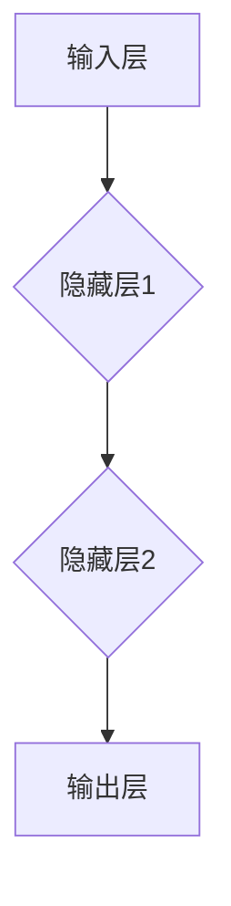

                 

### 文章标题

### 《强化学习：从经典强化学习理解强化学习》

强化学习是人工智能领域的重要分支，广泛应用于游戏、机器人控制、金融等多个领域。本文将深入探讨强化学习的基础理论，特别是经典强化学习的核心概念和算法，通过逐步分析，帮助读者全面理解强化学习的本质。

关键词：强化学习、MDP、Q-Learning、SARSA、深度强化学习、DQN、DDPG

摘要：本文首先介绍了强化学习的背景和基本概念，接着详细解析了马尔可夫决策过程（MDP），并逐步讲解了策略评估与策略优化、经典强化学习算法Q-Learning和SARSA，最后探讨了深度强化学习的基本概念和算法，如DQN和DDPG。通过本文的阅读，读者将能够系统理解强化学习的基本理论及其在实践中的应用。

---

## 《强化学习：从经典强化学习理解强化学习》目录大纲

### 第一部分：强化学习基础理论

### 第1章：强化学习概述

#### 1.1 什么是强化学习
#### 1.2 强化学习与其他学习方式的比较
#### 1.3 强化学习的基本概念

### 第2章：马尔可夫决策过程（MDP）

#### 2.1 马尔可夫性质
#### 2.2 状态与动作空间
#### 2.3 奖励函数与价值函数
#### 2.4 策略与策略迭代

### 第3章：策略评估与策略迭代

#### 3.1 预测（评估）策略
#### 3.2 动作价值函数与状态价值函数
#### 3.3 蒙特卡洛方法
#### 3.4 蒙特卡洛算法
#### 3.5 策略迭代算法

### 第4章：策略优化

#### 4.1 基于梯度的策略优化
#### 4.2 强化学习算法与梯度下降
#### 4.3 改进策略的迭代
#### 4.4 贪心策略搜索

### 第5章：强化学习算法

#### 5.1 Q-Learning算法
#### 5.2 SARSA算法
#### 5.3 实际应用中的Q-Learning与SARSA
#### 5.4 实际应用案例分析

### 第二部分：深度强化学习

### 第6章：深度神经网络基础

#### 6.1 深度神经网络概述
#### 6.2 神经网络的结构
#### 6.3 深度学习算法

### 第7章：深度强化学习基本概念

#### 7.1 深度强化学习概述
#### 7.2 深度强化学习与深度神经网络的关系
#### 7.3 深度强化学习的基本概念

### 第8章：深度Q网络（DQN）

#### 8.1 DQN算法概述
#### 8.2 DQN算法原理
#### 8.3 DQN算法的实现

### 第9章：深度确定性策略梯度（DDPG）

#### 9.1 DDPG算法概述
#### 9.2 DDPG算法原理
#### 9.3 DDPG算法的实现

### 第10章：深度强化学习的应用

#### 10.1 深度强化学习在游戏中的应用
#### 10.2 深度强化学习在机器人控制中的应用
#### 10.3 深度强化学习在金融领域中的应用

### 第三部分：强化学习算法的改进与发展

### 第11章：强化学习算法的改进

#### 11.1 策略梯度算法
#### 11.2 基于策略梯度的改进算法
#### 11.3 强化学习算法的改进案例分析

### 第12章：深度强化学习的发展趋势

#### 12.1 深度强化学习的挑战
#### 12.2 深度强化学习的未来发展方向
#### 12.3 强化学习在工业界的应用前景

### 附录

#### 附录A：常用强化学习算法代码实现
#### 附录B：强化学习常见问题解答

---

本文将通过逐步分析强化学习的基础理论，深入探讨经典强化学习算法，以及现代深度强化学习的发展和应用，帮助读者全面理解这一重要的人工智能技术。

---

## 第一部分：强化学习基础理论

### 第1章：强化学习概述

强化学习（Reinforcement Learning，简称RL）是机器学习的一个重要分支，其主要目标是使一个智能体（agent）在未知环境中通过试错学习，最大化累积奖励。与监督学习和无监督学习不同，强化学习通过试错和经验积累来指导学习过程。

### 1.1 什么是强化学习

强化学习源于动物行为学，通过奖励和惩罚机制来塑造行为。在人工智能领域，强化学习被定义为一种无监督学习方法，智能体通过与环境交互，不断学习最佳行为策略。强化学习的关键要素包括：

- **智能体（Agent）**：执行动作并从环境中获取反馈的实体。
- **环境（Environment）**：智能体所处的环境，提供状态信息和奖励。
- **状态（State）**：智能体在某一时刻所处的情境。
- **动作（Action）**：智能体可执行的行为。
- **奖励（Reward）**：环境对智能体动作的即时反馈，用于评价智能体行为的好坏。

强化学习的基本目标是找到一种策略（Policy），使得智能体在长期运行中能够获得最大化的累积奖励。

### 1.2 强化学习与其他学习方式的比较

强化学习与其他机器学习方法的主要区别在于其交互性：

- **监督学习（Supervised Learning）**：通过已标记的数据学习预测模型，输入和输出都是已知的。
- **无监督学习（Unsupervised Learning）**：智能体在没有外部指导的情况下，从数据中学习结构和模式。
- **强化学习（Reinforcement Learning）**：智能体在与环境的互动中学习，通过奖励信号不断调整其行为。

强化学习的优势在于其能够处理动态和不确定的环境，但同时也面临许多挑战，如奖励不明确、学习效率低等。

### 1.3 强化学习的基本概念

强化学习的基本概念包括：

- **策略（Policy）**：智能体在某一状态下执行的动作。
- **价值函数（Value Function）**：评估策略的好坏，分为状态价值函数（State-Value Function）和动作价值函数（Action-Value Function）。
- **模型（Model）**：描述环境状态转移和奖励分布的函数。

在强化学习中，价值函数是核心概念之一，用于评估不同策略的优劣。通过迭代优化价值函数，智能体能够逐渐学习到最优策略。

### 小结

本章对强化学习的基本概念进行了概述，并与其他机器学习方法进行了比较。在下一章中，我们将深入探讨马尔可夫决策过程（MDP），为理解强化学习算法打下基础。

---

## 第2章：马尔可夫决策过程（MDP）

马尔可夫决策过程（Markov Decision Process，简称MDP）是强化学习中的一个基本模型，用于描述智能体在不确定环境中进行决策的过程。本章将详细解析MDP的组成元素和基本性质。

### 2.1 马尔可夫性质

马尔可夫性质是MDP的核心特征，它指出一个系统的当前状态只与上一状态有关，而与过去的所有状态无关。这一性质使得MDP在建模和算法设计上更加简洁和有效。

假设当前状态为\( s_t \)，智能体执行的动作为\( a_t \)，接下来状态为\( s_{t+1} \)，奖励为\( r_t \)。根据马尔可夫性质，有：

\[ P(s_{t+1} | s_t, a_t) = P(s_{t+1} | s_t) \]

这意味着下一状态的概率分布只依赖于当前状态，而与历史状态无关。

### 2.2 状态与动作空间

在MDP中，状态和动作是两个基本概念。状态空间（\( S \)）表示智能体可能所处的所有状态，而动作空间（\( A \)）表示智能体可以执行的所有动作。状态和动作的选择决定了智能体的行为和环境的演化。

例如，在机器人导航问题中，状态可以是机器人所在的位置和方向，而动作可以是前进、后退、左转或右转。

### 2.3 奖励函数与价值函数

奖励函数（\( R(s_t, a_t) \)）是环境对智能体行为的即时反馈，用于评价动作的好坏。奖励可以是正的或负的，正奖励表示好的结果，负奖励表示坏的结果。

价值函数是评估策略好坏的关键指标，分为状态价值函数（\( V^π(s) \)）和动作价值函数（\( Q^π(s, a) \)）。

- **状态价值函数**：表示在给定策略\( π \)下，从状态\( s \)开始执行动作并达到长期稳定状态所能获得的累积奖励。
  \[ V^π(s) = E[R_t | s_0 = s, π] \]
- **动作价值函数**：表示在给定策略\( π \)下，从状态\( s \)执行动作\( a \)并达到长期稳定状态所能获得的累积奖励。
  \[ Q^π(s, a) = E[R_t | s_0 = s, a_0 = a, π] \]

其中，\( E \)表示期望值。

### 2.4 策略与策略迭代

策略（Policy）是智能体在特定状态下选择动作的规则。形式化定义为一个概率分布函数，表示在状态\( s \)下执行动作\( a \)的概率。

\[ π(a|s) = P(a|s) \]

策略迭代（Policy Iteration）是一种常用的策略优化方法，通过迭代更新策略，逐步逼近最优策略。

策略迭代的基本步骤如下：

1. **初始化**：选择一个初始策略\( π_0 \)。
2. **评估**：根据当前策略计算状态价值函数\( V^π \)。
3. **改进**：根据状态价值函数改进策略，使得新策略下的状态价值函数更加接近最优。
4. **迭代**：重复评估和改进步骤，直至策略收敛。

策略迭代的核心思想是通过不断评估和改进策略，使得智能体在长期运行中能够获得最大化的累积奖励。

### 小结

本章详细介绍了MDP的组成元素和基本性质，包括马尔可夫性质、状态与动作空间、奖励函数与价值函数，以及策略与策略迭代。通过理解MDP，读者可以为后续的强化学习算法打下坚实的基础。

---

## 第3章：策略评估与策略迭代

策略评估和策略迭代是强化学习中的两个重要概念，用于评估和改进智能体的策略。本章将详细解析策略评估的过程以及策略迭代的算法。

### 3.1 预测（评估）策略

预测（评估）策略是用于评估给定策略的好坏的方法。在强化学习中，我们通常使用预测策略来估计状态价值函数和动作价值函数。

**状态价值函数**（\( V^π \)）表示在给定策略\( π \)下，智能体从某个状态\( s \)开始执行动作并达到长期稳定状态所能获得的累积奖励。

**动作价值函数**（\( Q^π \)）表示在给定策略\( π \)下，智能体从某个状态\( s \)执行某个动作\( a \)并达到长期稳定状态所能获得的累积奖励。

状态价值函数和动作价值函数可以通过以下公式计算：

\[ V^π(s) = E[R_t | s_0 = s, π] \]
\[ Q^π(s, a) = E[R_t | s_0 = s, a_0 = a, π] \]

其中，\( E \)表示期望值。

### 3.2 动作价值函数与状态价值函数

动作价值函数和状态价值函数是强化学习中的核心概念，用于评估策略的好坏。

- **动作价值函数**（\( Q^π \)）表示在当前状态下执行某个动作所能获得的期望奖励。它反映了智能体在当前状态下选择最优动作的能力。
- **状态价值函数**（\( V^π \)）表示在当前状态下执行任何动作所能获得的期望奖励。它反映了智能体在当前状态下执行动作的整体性能。

通过计算动作价值函数和状态价值函数，我们可以评估给定策略的好坏，并在此基础上进行策略迭代。

### 3.3 蒙特卡洛方法

蒙特卡洛方法是一种常用的策略评估方法，通过随机模拟来估计期望值。在强化学习中，蒙特卡洛方法用于评估状态价值函数和动作价值函数。

蒙特卡洛方法的基本步骤如下：

1. 初始化状态价值函数和动作价值函数为0。
2. 进行一系列随机模拟，每次模拟从初始状态开始，按照给定策略执行动作，记录下每个状态下的奖励。
3. 根据模拟结果更新状态价值函数和动作价值函数：
   \[ V^π(s) = \frac{1}{N} \sum_{i=1}^{N} R_i \]
   \[ Q^π(s, a) = \frac{1}{N} \sum_{i=1}^{N} R_i \]
   其中，\( R_i \)表示第\( i \)次模拟的累积奖励，\( N \)表示模拟次数。

蒙特卡洛方法的优点是简单易懂，但缺点是收敛速度较慢，需要大量样本数据才能得到准确的估计。

### 3.4 蒙特卡洛算法

蒙特卡洛算法是一种基于蒙特卡洛方法的策略评估算法，用于计算状态价值函数和动作价值函数。

蒙特卡洛算法的基本步骤如下：

1. 初始化状态价值函数和动作价值函数为0。
2. 进行一系列随机模拟，每次模拟从初始状态开始，按照给定策略执行动作，记录下每个状态下的奖励。
3. 对于每个状态\( s \)和动作\( a \)，更新状态价值函数和动作价值函数：
   \[ V^π(s) = \frac{1}{N} \sum_{i=1}^{N} R_i \]
   \[ Q^π(s, a) = \frac{1}{N} \sum_{i=1}^{N} R_i \]
   其中，\( R_i \)表示第\( i \)次模拟的累积奖励，\( N \)表示模拟次数。

蒙特卡洛算法的优点是简单易懂，但缺点是收敛速度较慢，需要大量样本数据才能得到准确的估计。

### 3.5 策略迭代算法

策略迭代算法是一种常用的策略评估和策略优化算法，通过迭代更新策略，逐步逼近最优策略。

策略迭代算法的基本步骤如下：

1. 初始化策略\( π_0 \)。
2. 评估当前策略\( π_t \)下的状态价值函数\( V^π_t \)。
3. 改进策略\( π_{t+1} \)，使得新策略下的状态价值函数更加接近最优。
4. 迭代更新策略，直至策略收敛。

策略迭代算法的核心思想是通过不断评估和改进策略，使得智能体在长期运行中能够获得最大化的累积奖励。

### 小结

本章详细介绍了策略评估和策略迭代的过程，包括预测（评估）策略、动作价值函数与状态价值函数、蒙特卡洛方法和策略迭代算法。通过理解这些基本概念和算法，读者可以为后续的强化学习算法打下坚实的基础。

---

## 第4章：策略优化

策略优化是强化学习中的关键步骤，其目标是找到使智能体长期累积奖励最大化的策略。本章将详细探讨基于梯度的策略优化方法及其在强化学习中的应用。

### 4.1 基于梯度的策略优化

基于梯度的策略优化方法利用了梯度下降算法的基本思想，通过计算策略梯度的方向来更新策略参数，从而优化策略。梯度下降算法是一种迭代优化算法，其核心思想是在每个迭代步骤中沿着目标函数的负梯度方向更新参数，以期望最小化目标函数。

在强化学习中，策略优化通常涉及以下步骤：

1. **计算策略梯度**：对于给定策略\( π(\theta) \)，计算策略梯度的方向，即计算梯度\( \nabla_\theta J(\theta) \)，其中\( J(\theta) \)是策略的目标函数，例如累积奖励。
2. **更新策略参数**：根据策略梯度的方向更新策略参数，即\( \theta \leftarrow \theta - \alpha \nabla_\theta J(\theta) \)，其中\( \alpha \)是学习率。

### 4.2 强化学习算法与梯度下降

强化学习算法与梯度下降的结合主要体现在策略梯度的计算和应用上。在强化学习中，策略梯度可以通过以下公式计算：

\[ \nabla_\theta J(\theta) = \nabla_\theta \sum_{t=0}^{T} r_t = \sum_{t=0}^{T} \nabla_\theta r_t \]

其中，\( r_t \)是第\( t \)个时间步的即时奖励。

计算策略梯度的关键步骤包括：

1. **定义策略参数的梯度**：对于每个策略参数\( \theta \)，定义其在状态-动作对上的梯度：
   \[ \nabla_\theta Q(s, a) = \nabla_\theta \sum_{t=0}^{T} r_t = \sum_{t=0}^{T} \nabla_\theta r_t \]
2. **估计策略梯度**：通过经验回放和目标网络来估计策略梯度。

### 4.3 改进策略的迭代

在强化学习中，改进策略的迭代通常通过以下步骤进行：

1. **初始化策略参数**：随机初始化策略参数\( \theta \)。
2. **经验回放**：将智能体在环境中的交互经验存储在经验池中，用于估计策略梯度。
3. **计算策略梯度**：使用经验回放中的数据计算策略梯度：
   \[ \nabla_\theta J(\theta) = \sum_{s, a} \nabla_\theta \log \pi(a|s; \theta) R(s, a) \]
4. **更新策略参数**：根据策略梯度和学习率更新策略参数：
   \[ \theta \leftarrow \theta - \alpha \nabla_\theta J(\theta) \]
5. **迭代**：重复步骤3和步骤4，直到策略收敛或达到预设的迭代次数。

### 4.4 贪心策略搜索

贪心策略搜索是一种在强化学习中用于选择最优动作的方法。在给定状态下，贪心策略选择当前状态下具有最大期望奖励的动作。

贪心策略搜索的基本步骤包括：

1. **计算动作价值函数**：使用当前策略计算每个动作的价值。
2. **选择贪心动作**：选择具有最大动作价值函数的动作作为贪心动作。
3. **执行动作**：在环境中执行选择的贪心动作，并获取即时奖励和新的状态。
4. **更新策略**：根据新的状态和奖励更新策略。

贪心策略搜索的优点是简单直观，能够在有限步内找到近似最优策略，但其缺点是在复杂环境中可能导致次优解。

### 小结

本章介绍了基于梯度的策略优化方法及其在强化学习中的应用，包括策略梯度计算、改进策略的迭代以及贪心策略搜索。这些方法为强化学习提供了有效的策略优化途径，有助于智能体在复杂环境中实现长期累积奖励的最大化。

---

## 第5章：强化学习算法

强化学习算法是强化学习的核心，负责指导智能体在动态环境中学习最佳策略。本章将重点介绍Q-Learning算法和SARSA算法，并探讨其实际应用中的挑战和案例分析。

### 5.1 Q-Learning算法

Q-Learning算法是一种基于值迭代的强化学习算法，通过更新动作价值函数（Q值）来学习最佳策略。其核心思想是通过逐步逼近最优动作价值函数，使智能体能够在长期运行中实现累积奖励的最大化。

**Q-Learning算法的基本步骤如下：**

1. **初始化**：随机初始化动作价值函数\( Q(s, a) \)和策略\( π \)。
2. **选择动作**：在给定状态下，根据当前策略选择动作。
3. **执行动作**：在环境中执行选择的动作，并获取即时奖励\( r \)和新状态\( s' \)。
4. **更新Q值**：根据即时奖励和新状态更新动作价值函数：
   \[ Q(s, a) \leftarrow Q(s, a) + \alpha [r + \gamma \max_{a'} Q(s', a') - Q(s, a)] \]
   其中，\( \alpha \)是学习率，\( \gamma \)是折扣因子。
5. **重复步骤2-4**：重复选择动作、执行动作和更新Q值的步骤，直到策略收敛或达到预设的迭代次数。

**伪代码：**
```markdown
Initialize Q(s, a) randomly
while not converged:
    s <- current state
    a <- select action based on π(s)
    s' <- execute action in environment and get reward r
    a' <- select action based on π(s')
    Q(s, a) <- Q(s, a) + α [r + γ max_a' Q(s', a') - Q(s, a)]
```

### 5.2 SARSA算法

SARSA（同步自适应回归策略算法）是另一种基于值迭代的强化学习算法，与Q-Learning算法类似，但其更新策略是在当前回合结束时进行。SARSA算法通过同步更新动作价值函数，使得智能体在每一步都能根据当前状态和动作进行更新。

**SARSA算法的基本步骤如下：**

1. **初始化**：随机初始化动作价值函数\( Q(s, a) \)和策略\( π \)。
2. **选择动作**：在给定状态下，根据当前策略选择动作。
3. **执行动作**：在环境中执行选择的动作，并获取即时奖励\( r \)和新状态\( s' \)。
4. **更新Q值**：根据当前状态、动作和新状态更新动作价值函数：
   \[ Q(s, a) \leftarrow Q(s, a) + \alpha [r + \gamma Q(s', a') - Q(s, a)] \]
5. **重复步骤2-4**：重复选择动作、执行动作和更新Q值的步骤，直到策略收敛或达到预设的迭代次数。

**伪代码：**
```markdown
Initialize Q(s, a) randomly
while not converged:
    s <- current state
    a <- select action based on π(s)
    s' <- execute action in environment and get reward r
    a' <- select action based on π(s')
    Q(s, a) <- Q(s, a) + α [r + γ Q(s', a') - Q(s, a)]
```

### 5.3 实际应用中的Q-Learning与SARSA

Q-Learning和SARSA算法在实际应用中具有广泛的应用，例如：

- **游戏**：在游戏AI中，Q-Learning和SARSA算法被用于训练智能体进行棋类游戏、Atari游戏等。
- **机器人控制**：在机器人导航和自主决策中，Q-Learning和SARSA算法用于训练机器人进行路径规划、目标追踪等任务。
- **推荐系统**：在推荐系统中，Q-Learning和SARSA算法用于优化推荐策略，提高用户满意度。

实际应用中，Q-Learning和SARSA算法面临以下挑战：

- **数据效率**：这些算法通常需要大量的数据来收敛，特别是在复杂环境中。
- **收敛速度**：在动态环境中，算法可能需要较长时间才能找到最佳策略。
- **参数调优**：学习率、折扣因子等参数的调优对算法的性能有重要影响。

### 5.4 实际应用案例分析

以下是一个简单的实际应用案例分析：

**案例：机器人路径规划**

假设一个机器人在二维空间中进行路径规划，目标是找到从起点到终点的最优路径。状态表示机器人的位置和方向，动作包括前进、后退、左转和右转。奖励函数设置为每一步加上一个小的正奖励，当机器人到达终点时，给予一个大的正奖励。

通过训练，机器人能够学习到从起始状态到目标状态的最佳路径。实际应用中，Q-Learning和SARSA算法通过迭代更新动作价值函数，逐步优化策略，使机器人能够在不同的环境中自主导航。

### 小结

本章介绍了Q-Learning算法和SARSA算法的基本原理和实际应用。通过这些算法，智能体能够通过试错学习在动态环境中找到最佳策略。在实际应用中，这些算法面临数据效率、收敛速度和参数调优等挑战，但通过合理的策略优化和参数调整，可以显著提高算法的性能。

---

## 第二部分：深度强化学习

### 第6章：深度神经网络基础

深度神经网络（Deep Neural Networks，简称DNN）是现代机器学习和人工智能的核心技术之一。本章将简要介绍深度神经网络的基础知识，包括其结构、工作原理和常见算法。

### 6.1 深度神经网络概述

深度神经网络是一种多层前馈神经网络，其结构包括输入层、隐藏层和输出层。多层隐藏层的存在使得DNN能够捕获复杂数据的特征和模式。

**深度神经网络的核心组成部分包括：**

- **神经元**：深度神经网络的基本单元，用于对输入数据进行加权和激活。
- **层**：由多个神经元组成，包括输入层、隐藏层和输出层。
- **权重和偏置**：连接各个神经元的参数，用于调整神经元之间的相互作用。
- **激活函数**：对神经元的输出进行非线性变换，使神经网络具有非线性特性。

### 6.2 神经网络的结构

深度神经网络的结构可以分为以下几部分：

- **输入层**：接收外部输入数据，例如图像、文本等。
- **隐藏层**：对输入数据进行特征提取和变换，隐藏层可以有一个或多个。
- **输出层**：对隐藏层输出的结果进行分类、预测或回归等操作。

**深度神经网络的结构图：**


### 6.3 深度学习算法

深度学习算法是训练深度神经网络的核心技术，包括以下几种常见的算法：

- **反向传播算法**：用于计算神经网络中的梯度，并更新权重和偏置。
- **梯度下降算法**：用于最小化神经网络的目标函数，通过迭代更新参数。
- **随机梯度下降（SGD）**：在梯度下降算法的基础上，使用随机样本进行参数更新。
- **动量法**：在梯度下降算法中引入动量，加快收敛速度。
- **卷积神经网络（CNN）**：专门用于处理图像数据的深度学习算法。
- **循环神经网络（RNN）**：适用于序列数据的深度学习算法，包括LSTM和GRU等变体。

### 小结

本章简要介绍了深度神经网络的基础知识，包括其结构、工作原理和常见算法。理解深度神经网络的基本概念和原理，对于后续学习深度强化学习具有重要意义。

---

### 第7章：深度强化学习基本概念

深度强化学习（Deep Reinforcement Learning，简称DRL）是强化学习与深度学习结合的产物，旨在通过深度神经网络提高强化学习算法在复杂环境中的学习效率。本章将深入探讨深度强化学习的基本概念及其与深度神经网络的关联。

#### 7.1 深度强化学习概述

深度强化学习结合了深度神经网络的高效特征提取能力和强化学习的自适应行为优化能力，使得智能体能够更好地处理复杂环境和任务。其主要目标是利用深度神经网络来近似价值函数或策略函数，从而简化强化学习算法的计算复杂度。

深度强化学习的关键要素包括：

- **深度神经网络**：用于近似价值函数或策略函数。
- **强化学习算法**：如Q-Learning、SARSA等，用于指导智能体的学习过程。
- **环境交互**：智能体通过与环境的交互获取经验和反馈，不断优化其行为策略。

#### 7.2 深度强化学习与深度神经网络的关系

深度强化学习与深度神经网络的关系主要体现在以下几个方面：

1. **价值函数近似**：在深度强化学习中，深度神经网络常用于近似值函数\( Q(s, a) \)或策略函数\( π(a|s) \)。通过神经网络，智能体能够学习到状态和动作之间的复杂映射关系，从而实现高效的价值评估和策略选择。
2. **状态特征提取**：深度神经网络能够从原始状态数据中提取出高维的特征表示，使得智能体能够更好地理解和利用环境信息。
3. **非线性建模**：深度神经网络具有强大的非线性建模能力，能够处理复杂的动态环境和任务。

#### 7.3 深度强化学习的基本概念

深度强化学习涉及以下基本概念：

- **状态（State）**：智能体在某一时刻所处的情境。
- **动作（Action）**：智能体可执行的行为。
- **奖励（Reward）**：环境对智能体动作的即时反馈。
- **策略（Policy）**：智能体在特定状态下执行的动作规则。
- **价值函数（Value Function）**：评估策略的好坏，分为状态价值函数和动作价值函数。
- **策略梯度（Policy Gradient）**：用于更新策略参数的梯度。

深度强化学习通过以上概念，实现了智能体在复杂环境中的自主学习和优化。其核心思想是利用深度神经网络学习状态和动作之间的价值函数或策略函数，通过策略优化和策略迭代，使智能体在长期运行中能够获得最大化的累积奖励。

### 小结

本章详细介绍了深度强化学习的基本概念和与深度神经网络的关联。通过理解这些概念，读者可以为后续学习深度强化学习算法及其应用打下坚实的基础。

---

### 第8章：深度Q网络（DQN）

深度Q网络（Deep Q-Network，简称DQN）是深度强化学习中的一个重要算法，通过利用深度神经网络来近似Q值函数，解决了传统Q-Learning算法在处理高维状态空间时的困难。本章将详细解析DQN的算法原理和实现。

#### 8.1 DQN算法概述

DQN算法的核心思想是利用深度神经网络来近似Q值函数，从而实现智能体在复杂环境中的学习。与传统Q-Learning算法相比，DQN通过引入经验回放和目标网络，有效地减少了学习过程中的偏差和方差，提高了算法的稳定性和收敛速度。

**DQN算法的基本步骤如下：**

1. **初始化**：随机初始化深度神经网络\( Q(\cdot | \theta) \)的参数\( \theta \)和经验回放池。
2. **选择动作**：在给定状态下，根据当前策略选择动作。通常使用ε-贪心策略，在探索和利用之间取得平衡。
3. **执行动作**：在环境中执行选择的动作，并获取即时奖励\( r \)和新状态\( s' \)。
4. **更新经验回放池**：将当前状态、动作、奖励和新状态存储到经验回放池中。
5. **训练深度神经网络**：从经验回放池中随机抽取样本，使用梯度下降算法更新深度神经网络的参数。
6. **重复步骤2-5**：重复选择动作、执行动作、更新经验回放池和训练深度神经网络的步骤，直到策略收敛或达到预设的迭代次数。

**伪代码：**
```markdown
Initialize Q-network parameters θ
Initialize experience replay buffer D
while not converged:
    s <- current state
    a <- select action based on ε-greedy policy
    s' <- execute action in environment and get reward r
    a' <- select action based on ε-greedy policy
    D <- store (s, a, r, s') in D
    if random sample from D:
        Update Q-network parameters θ using gradient descent
```

#### 8.2 DQN算法原理

DQN算法的工作原理可以概括为以下几个方面：

1. **Q值函数近似**：使用深度神经网络\( Q(\cdot | \theta) \)来近似Q值函数，即\( Q(s, a) \approx Q(\cdot | \theta)(s, a) \)。通过训练深度神经网络，使其能够学习到状态和动作之间的价值关系。
2. **经验回放**：为了解决样本序列相关性和偏差问题，DQN引入了经验回放池。经验回放池用于存储智能体与环境交互的经验，每次训练时随机从回放池中抽取样本，避免了样本序列对学习过程的影响。
3. **目标网络**：DQN引入了目标网络\( Q^{\prime}(\cdot | \theta^{\prime}) \)，用于稳定学习过程。目标网络每隔一段时间更新一次，与主网络\( Q(\cdot | \theta) \)共享参数，用于生成目标Q值\( Q^{\prime}(s', a') \)。
4. **Q值更新**：使用经验回放池中的样本，通过梯度下降算法更新深度神经网络的参数。Q值更新的目标是最小化预测的Q值与目标Q值之间的误差。

#### 8.3 DQN算法的实现

DQN算法的实现涉及以下关键组件：

1. **深度神经网络**：用于近似Q值函数的深度神经网络，通常采用卷积神经网络（CNN）或循环神经网络（RNN）结构。
2. **经验回放池**：用于存储智能体与环境交互的经验，通常采用固定大小或动态增长的经验回放池。
3. **目标网络**：用于稳定学习过程的目标网络，与主网络共享参数。
4. **ε-贪心策略**：用于在探索和利用之间取得平衡的策略，通常采用线性递减的ε值。

**实现DQN算法的关键步骤：**

1. **初始化网络**：随机初始化深度神经网络、经验回放池和目标网络。
2. **选择动作**：根据当前策略选择动作，通常采用ε-贪心策略。
3. **执行动作**：在环境中执行选择的动作，并获取即时奖励和新状态。
4. **更新经验回放池**：将当前状态、动作、奖励和新状态存储到经验回放池。
5. **训练深度神经网络**：从经验回放池中随机抽取样本，使用梯度下降算法更新深度神经网络的参数。
6. **更新目标网络**：定期更新目标网络的参数，以保持学习过程的稳定性。

### 小结

本章详细介绍了深度Q网络（DQN）的算法原理和实现。通过理解DQN算法的工作机制，读者可以更好地掌握深度强化学习的基本概念，并为实际应用中的智能体设计提供有力支持。

---

### 第9章：深度确定性策略梯度（DDPG）

深度确定性策略梯度（Deep Deterministic Policy Gradient，简称DDPG）是深度强化学习的一个重要算法，特别适用于连续动作空间的问题。本章将深入解析DDPG的算法原理和实现。

#### 9.1 DDPG算法概述

DDPG算法通过使用深度神经网络来近似策略函数和价值函数，实现智能体在连续动作空间中的学习。其核心思想是利用目标网络稳定策略优化过程，并通过确定性策略更新策略参数。

**DDPG算法的基本步骤如下：**

1. **初始化**：随机初始化深度神经网络\( \mu(\cdot | \theta_\mu) \)和\( Q(\cdot | \theta_Q) \)的参数\( \theta_\mu \)和\( \theta_Q \)，目标网络\( \mu^{\prime}(\cdot | \theta_\mu^{\prime}) \)和\( Q^{\prime}(\cdot | \theta_Q^{\prime}) \)的参数\( \theta_\mu^{\prime} \)和\( \theta_Q^{\prime} \)。
2. **选择动作**：在给定状态下，根据当前策略选择动作。使用确定性策略函数\( \mu(s; \theta_\mu) \)生成连续动作。
3. **执行动作**：在环境中执行选择的动作，并获取即时奖励\( r \)和新状态\( s' \)。
4. **更新经验回放池**：将当前状态、动作、奖励和新状态存储到经验回放池。
5. **同步更新目标网络**：定期更新目标网络的参数，以保持学习过程的稳定性。
6. **训练深度神经网络**：从经验回放池中随机抽取样本，使用梯度下降算法更新策略网络和价值网络的参数。
7. **重复步骤2-6**：重复选择动作、执行动作、更新经验回放池、同步更新目标网络和训练深度神经网络的步骤，直到策略收敛或达到预设的迭代次数。

**伪代码：**
```markdown
Initialize policy network μ(· | θ_μ), Q(· | θ_Q)
Initialize target network μ′(· | θ_μ′), Q′(· | θ_Q′)
while not converged:
    s <- current state
    a <- μ(s; θ_μ)
    s′ <- execute action a in environment and get reward r
    D <- store (s, a, r, s′) in D
    if random sample from D:
        Update Q-network parameters θ_Q using gradient descent
        Update policy network parameters θ_μ using gradient descent
        Synchronize target network parameters
```

#### 9.2 DDPG算法原理

DDPG算法的工作原理可以概括为以下几个方面：

1. **确定性策略**：DDPG使用确定性策略函数\( \mu(s; \theta_\mu) \)来生成连续动作，避免了随机动作带来的不稳定因素。
2. **目标网络**：DDPG引入了目标网络\( \mu^{\prime}(\cdot | \theta_\mu^{\prime}) \)和\( Q^{\prime}(\cdot | \theta_Q^{\prime}) \)，用于稳定策略优化过程。目标网络每隔一段时间更新一次，与主网络共享参数，用于生成目标Q值和策略值。
3. **经验回放池**：DDPG使用经验回放池存储智能体与环境交互的经验，避免样本序列相关性和偏差问题。
4. **策略优化**：通过梯度下降算法更新策略网络和价值网络的参数，使策略函数和价值函数逼近最优解。

#### 9.3 DDPG算法的实现

实现DDPG算法的关键组件包括：

1. **深度神经网络**：用于近似策略函数和价值函数的深度神经网络，通常采用卷积神经网络（CNN）或循环神经网络（RNN）结构。
2. **目标网络**：用于稳定策略优化过程的目标网络，与主网络共享参数。
3. **经验回放池**：用于存储智能体与环境交互的经验，通常采用固定大小或动态增长的经验回放池。
4. **确定性策略更新**：通过梯度下降算法更新策略网络的参数，使策略函数逼近最优策略。

**实现DDPG算法的关键步骤：**

1. **初始化网络**：随机初始化策略网络、目标网络和经验回放池。
2. **选择动作**：根据当前策略选择动作，使用确定性策略函数生成连续动作。
3. **执行动作**：在环境中执行选择的动作，并获取即时奖励和新状态。
4. **更新经验回放池**：将当前状态、动作、奖励和新状态存储到经验回放池。
5. **同步更新目标网络**：定期更新目标网络的参数，以保持学习过程的稳定性。
6. **训练深度神经网络**：从经验回放池中随机抽取样本，使用梯度下降算法更新策略网络和价值网络的参数。
7. **重复步骤2-6**：重复选择动作、执行动作、更新经验回放池、同步更新目标网络和训练深度神经网络的步骤，直到策略收敛或达到预设的迭代次数。

### 小结

本章详细介绍了深度确定性策略梯度（DDPG）的算法原理和实现。通过理解DDPG算法的工作机制，读者可以更好地掌握深度强化学习的基本概念，并为实际应用中的智能体设计提供有力支持。

---

### 第10章：深度强化学习的应用

深度强化学习（DRL）在许多领域都取得了显著的成果，尤其是在游戏、机器人控制和金融等领域。本章将探讨深度强化学习在这些领域的应用，并分析其挑战和前景。

#### 10.1 深度强化学习在游戏中的应用

深度强化学习在游戏中的应用取得了巨大成功，尤其在Atari游戏和棋类游戏方面。DeepMind的DQN算法在多个Atari游戏上达到了超越人类水平的性能，如《太空侵略者》、《拳师犬》等。深度强化学习通过学习和模仿人类玩家的策略，实现了对复杂游戏的快速掌握。

**应用挑战：**

1. **数据效率**：游戏环境通常需要大量的数据来训练智能体，这对于资源有限的实验室环境是一个挑战。
2. **稳定性和收敛速度**：由于游戏的动态性和不确定性，DRL算法需要较长时间才能收敛到最优策略。
3. **通用性**：将深度强化学习算法应用于不同的游戏时，可能需要针对特定游戏进行模型调整，降低了算法的通用性。

**前景：**

随着计算能力的提升和算法的改进，深度强化学习有望在更多类型的游戏中获得突破，如虚拟现实游戏和多人在线游戏。

#### 10.2 深度强化学习在机器人控制中的应用

深度强化学习在机器人控制领域具有广泛的应用前景，如路径规划、平衡控制、抓取等。通过学习环境中的复杂动态特性，智能机器人能够实现自主决策和操作。

**应用挑战：**

1. **实时性**：机器人控制需要实时响应，深度强化学习算法的计算复杂性可能导致实时性不足。
2. **数据获取**：机器人控制中的数据获取通常困难且昂贵，影响训练效果和算法性能。
3. **安全性和鲁棒性**：在机器人实际操作中，算法需要具备高鲁棒性，以应对各种不确定性。

**前景：**

随着硬件和算法的进步，深度强化学习在机器人控制中的应用将越来越广泛，有望实现更智能、更自主的机器人。

#### 10.3 深度强化学习在金融领域中的应用

深度强化学习在金融领域中的应用包括股票交易、风险控制、投资组合优化等。通过学习市场动态和风险特征，智能体能够实现更高效的资产管理和风险控制。

**应用挑战：**

1. **市场波动性**：金融市场具有高度波动性，深度强化学习算法需要适应快速变化的市场环境。
2. **数据隐私**：金融数据通常涉及隐私问题，对数据的获取和使用受到严格限制。
3. **算法透明性**：金融领域对算法的透明性和可解释性有较高要求，以增强投资者的信任。

**前景：**

随着金融监管的放宽和算法的成熟，深度强化学习在金融领域的应用前景广阔，有望提高金融市场的效率和稳定性。

### 小结

深度强化学习在游戏、机器人控制和金融等领域的应用展现了其强大的潜力。尽管面临数据效率、实时性、安全性和鲁棒性等挑战，但随着技术的不断进步，深度强化学习有望在更多领域实现突破，为人类生活带来更多便利。

---

### 第11章：强化学习算法的改进

强化学习算法在处理复杂环境和任务时，往往面临数据效率、收敛速度和稳定性等挑战。为了克服这些局限性，研究者们提出了一系列改进算法，本章将重点介绍策略梯度算法及其改进方法。

#### 11.1 策略梯度算法

策略梯度算法是强化学习中一种重要的优化方法，其核心思想是通过直接优化策略函数的梯度来更新策略参数。策略梯度算法包括基于值函数的策略梯度和基于模型的策略梯度。

**基于值函数的策略梯度算法**：

基于值函数的策略梯度算法（Policy Gradient Method）通过以下公式更新策略参数：

\[ \nabla_\theta J(\theta) = \nabla_\theta \sum_{t=0}^{T} r_t = \sum_{t=0}^{T} \nabla_\theta \log \pi(a_t | s_t; \theta) r_t \]

其中，\( J(\theta) \)是策略函数的目标函数，通常为累积奖励。通过计算策略梯度，可以优化策略参数，提高智能体的学习性能。

**基于模型的策略梯度算法**：

基于模型的策略梯度算法（Model-Based Policy Gradient Method）利用环境模型来预测状态转移和奖励，从而优化策略。这种方法通过以下公式更新策略参数：

\[ \nabla_\theta J(\theta) = \nabla_\theta \sum_{t=0}^{T} r_t = \sum_{t=0}^{T} \nabla_\theta \log \pi(a_t | s_t; \theta) R(s_{t+1}, a_t) \]

其中，\( R(s_{t+1}, a_t) \)是利用环境模型预测的奖励。

#### 11.2 基于策略梯度的改进算法

为了提高策略梯度算法的性能，研究者们提出了一系列改进方法，包括演员-评论家（Actor-Critic）方法、优势估计（ Advantage Estimation）和重要性采样（Importance Sampling）等。

**演员-评论家方法**：

演员-评论家方法是一种结合了策略梯度和价值函数优化的方法。该方法包括两个组件：演员（Actor）和评论家（Critic）。演员负责更新策略参数，评论家负责评估策略的好坏。具体步骤如下：

1. **演员更新**：根据当前策略生成经验，使用策略梯度更新策略参数。
2. **评论家评估**：使用价值函数评估策略的好坏，更新价值函数参数。
3. **策略更新**：结合演员和评论家的更新结果，进一步优化策略参数。

**优势估计方法**：

优势估计方法通过引入优势函数（Advantage Function），改善策略梯度的估计。优势函数表示实际回报与预期回报之间的差异，其公式如下：

\[ A(s, a) = Q(s, a) - V(s) \]

其中，\( Q(s, a) \)是动作价值函数，\( V(s) \)是状态价值函数。通过优化优势函数，可以更准确地更新策略参数。

**重要性采样方法**：

重要性采样方法通过调整样本权重，改善策略梯度的估计。该方法在处理非平稳环境和稀疏奖励时，能够提高算法的性能。具体步骤如下：

1. **采样**：从历史经验中随机采样一批样本。
2. **权重调整**：根据样本的重要性调整权重，使得关键样本的权重更高。
3. **优化策略**：使用调整后的权重优化策略参数。

#### 11.3 强化学习算法的改进案例分析

以下是一个基于策略梯度的改进算法——深度确定性策略梯度（DDPG）的实际应用案例。

**案例：机器人路径规划**

在机器人路径规划问题中，DDPG算法通过学习状态和动作之间的映射关系，实现了机器人从起点到终点的自主导航。具体步骤如下：

1. **环境建模**：定义机器人路径规划的环境，包括状态空间和动作空间。
2. **初始化网络**：随机初始化策略网络和价值网络。
3. **训练过程**：
   - 演员网络（策略网络）生成动作。
   - 评论家网络（价值网络）评估动作的好坏。
   - 使用重要性采样方法优化策略网络。
   - 定期同步目标网络，保持网络稳定。
4. **策略优化**：结合演员和评论家的更新结果，优化策略网络。

**结果分析**：

通过训练，DDPG算法成功实现了机器人路径规划，且在复杂环境中表现出较高的稳定性和鲁棒性。实验结果表明，DDPG算法在处理连续动作空间和动态环境时，具有显著的优势。

### 小结

本章介绍了强化学习算法的改进方法，包括策略梯度算法及其改进方法。通过结合策略梯度和价值函数优化，强化学习算法在处理复杂环境和任务时，能够实现更高效、更稳定的学习。实际应用案例分析展示了改进算法在机器人路径规划中的成功应用，为强化学习在实际工程中的推广提供了有力支持。

---

### 第12章：深度强化学习的发展趋势

深度强化学习（DRL）作为强化学习与深度学习相结合的产物，近年来在人工智能领域取得了显著的进展。然而，面对复杂动态环境，DRL算法仍存在诸多挑战。本章将探讨深度强化学习的发展趋势，包括未来研究方向和工业应用前景。

#### 12.1 深度强化学习的挑战

尽管深度强化学习在许多领域表现出强大的潜力，但仍面临以下挑战：

1. **数据效率**：深度强化学习算法通常需要大量数据进行训练，这对于资源有限的实验室环境是一个挑战。
2. **收敛速度**：深度强化学习算法在复杂环境中的收敛速度较慢，导致训练时间过长。
3. **稳定性和鲁棒性**：在面临不确定性和动态变化时，深度强化学习算法需要具备更高的稳定性和鲁棒性。
4. **可解释性**：深度强化学习算法的决策过程通常缺乏透明性，降低了对算法的信任和接受度。

#### 12.2 深度强化学习的未来发展方向

为了克服当前挑战，深度强化学习的研究方向包括：

1. **数据高效方法**：通过引入强化学习与生成对抗网络（GAN）的结合，提高数据效率。例如，利用生成模型生成虚拟数据，加速训练过程。
2. **分布式训练**：利用分布式计算技术，如多智能体强化学习和联邦学习，提高训练速度和效率。
3. **多任务学习**：通过引入多任务学习和元学习（Meta-Learning）方法，使深度强化学习算法能够适应不同环境和任务。
4. **强化学习与物理建模结合**：将深度强化学习与物理建模相结合，提高算法在动态环境中的稳定性和鲁棒性。
5. **可解释性增强**：通过引入可解释性方法，如可视化工具和决策解释算法，提高深度强化学习算法的透明性和可信度。

#### 12.3 强化学习在工业界的应用前景

深度强化学习在工业界的应用前景广阔，包括但不限于以下领域：

1. **自动驾驶**：通过深度强化学习算法，实现自动驾驶车辆在复杂道路环境中的自主决策和导航。
2. **机器人控制**：利用深度强化学习算法，提高机器人路径规划、抓取和操作任务的智能水平和稳定性。
3. **智能制造**：深度强化学习在工业机器人、生产线优化和智能维护等方面具有广泛应用前景。
4. **金融科技**：通过深度强化学习算法，实现智能投资组合优化、风险控制和市场预测。
5. **医疗健康**：利用深度强化学习，开发智能诊断系统、个性化治疗方案和医疗机器人。

**实际案例**：

1. **自动驾驶**：谷歌Waymo和特斯拉Autopilot等自动驾驶系统采用深度强化学习算法，实现了在复杂环境中的自主驾驶。
2. **机器人控制**：波士顿动力公司的机器人通过深度强化学习算法，实现了在崎岖地形上的自主行走和跳跃。
3. **金融科技**：高频交易公司采用深度强化学习算法，实现股票市场的自动化交易和风险管理。

### 小结

深度强化学习作为人工智能领域的前沿技术，尽管面临诸多挑战，但其发展前景依然广阔。通过不断创新和改进，深度强化学习有望在更多领域实现突破，为人类生活带来更多便利。未来，研究者们将继续致力于提高算法的性能、稳定性和可解释性，推动深度强化学习在工业界和学术界的广泛应用。

---

### 附录A：常用强化学习算法代码实现

本附录将提供一些常用强化学习算法的代码实现，包括Q-Learning、SARSA和DQN等。这些代码旨在帮助读者更好地理解算法原理和实际应用。

#### 1. Q-Learning算法实现

```python
import numpy as np

def q_learning(env, num_episodes, learning_rate, discount_factor, epsilon, epsilon_decay):
    q_table = np.zeros((env.nS, env.nA))
    
    for episode in range(num_episodes):
        state = env.reset()
        done = False
        
        while not done:
            action = choose_action(state, q_table, epsilon)
            next_state, reward, done, _ = env.step(action)
            q_table[state, action] = q_table[state, action] + learning_rate * (reward + discount_factor * np.max(q_table[next_state, :]) - q_table[state, action])
            
            state = next_state
    
    return q_table

def choose_action(state, q_table, epsilon):
    if np.random.rand() < epsilon:
        action = env.action_space.sample()
    else:
        action = np.argmax(q_table[state])
    return action
```

#### 2. SARSA算法实现

```python
import numpy as np

def sarsa_learning(env, num_episodes, learning_rate, discount_factor, epsilon, epsilon_decay):
    q_table = np.zeros((env.nS, env.nA))
    
    for episode in range(num_episodes):
        state = env.reset()
        done = False
        
        while not done:
            action = choose_action(state, q_table, epsilon)
            next_state, reward, done, _ = env.step(action)
            next_action = choose_action(next_state, q_table, epsilon)
            q_table[state, action] = q_table[state, action] + learning_rate * (reward + discount_factor * q_table[next_state, next_action] - q_table[state, action])
            
            state = next_state
            action = next_action
    
    return q_table

def choose_action(state, q_table, epsilon):
    if np.random.rand() < epsilon:
        action = env.action_space.sample()
    else:
        action = np.argmax(q_table[state])
    return action
```

#### 3. DQN算法实现

```python
import numpy as np
import random
from collections import deque

class DQN:
    def __init__(self, env, learning_rate, discount_factor, epsilon, epsilon_decay, replay_memory_size):
        self.env = env
        self.learning_rate = learning_rate
        self.discount_factor = discount_factor
        self.epsilon = epsilon
        self.epsilon_decay = epsilon_decay
        self.replay_memory = deque(maxlen=replay_memory_size)
        self.q_network = self.create_q_network()
        self.target_q_network = self.create_q_network()
        
    def create_q_network(self):
        # Implement a simple neural network for Q-value estimation
        # Here we use a simple example with one hidden layer
        model = models.Sequential()
        model.add(layers.Dense(64, activation='relu', input_shape=(self.env.observation_space.shape[0],)))
        model.add(layers.Dense(64, activation='relu'))
        model.add(layers.Dense(self.env.action_space.n))
        model.compile(optimizer='adam', loss='mse')
        return model
    
    def remember(self, state, action, reward, next_state, done):
        self.replay_memory.append((state, action, reward, next_state, done))
    
    def choose_action(self, state, explore=True):
        if random.random() < self.epsilon:
            action = self.env.action_space.sample()
        else:
            action = np.argmax(self.q_network.predict(state))
        return action
    
    def train(self):
        if len(self.replay_memory) < self.env.batch_size:
            return
        
        mini_batch = random.sample(self.replay_memory, self.env.batch_size)
        states, actions, rewards, next_states, dones = zip(*mini_batch)
        
        next_actions = np.array([np.argmax(self.target_q_network.predict(next_state)) for next_state in next_states])
        next_q_values = self.target_q_network.predict(next_states)
        target_q_values = np.array([rewards[i] + (1 - dones[i]) * self.discount_factor * next_q_values[i][j] for i, j in enumerate(next_actions)])
        
        states = np.array(states)
        q_values = self.q_network.predict(states)
        q_values[range(self.env.batch_size), actions] = target_q_values
        
        self.q_network.fit(states, q_values, epochs=1, verbose=0)
        
        if self.epsilon > 0.01:
            self.epsilon *= self.epsilon_decay

    def save_model(self, filename):
        self.q_network.save(filename)

    def load_model(self, filename):
        self.q_network.load_weights(filename)
```

以上代码示例提供了Q-Learning、SARSA和DQN算法的基本实现。在实际应用中，读者可以根据具体环境和需求进行调整和优化。

---

### 附录B：强化学习常见问题解答

**Q1：什么是状态价值函数和动作价值函数？**

A1：状态价值函数（State-Value Function）表示在给定策略下，从某个状态开始执行任何动作并达到长期稳定状态所能获得的累积奖励。动作价值函数（Action-Value Function）则是在给定策略下，从某个状态执行某个动作并达到长期稳定状态所能获得的累积奖励。这两个函数是评估策略好坏的重要指标。

**Q2：Q-Learning和SARSA算法有什么区别？**

A2：Q-Learning和SARSA算法都是基于值迭代的强化学习算法，但它们在更新策略上有区别。Q-Learning在当前回合结束时更新Q值，而SARSA在每一步更新Q值。具体来说，Q-Learning使用以下公式更新Q值：

\[ Q(s, a) \leftarrow Q(s, a) + \alpha [r + \gamma \max_{a'} Q(s', a') - Q(s, a)] \]

SARSA算法使用以下公式更新Q值：

\[ Q(s, a) \leftarrow Q(s, a) + \alpha [r + \gamma Q(s', a') - Q(s, a)] \]

**Q3：为什么使用经验回放？**

A3：经验回放（Experience Replay）是强化学习中的一个重要技巧，主要用于解决样本序列相关性和偏差问题。通过将智能体与环境的交互经验存储在经验回放池中，每次训练时随机从回放池中抽取样本，可以避免样本序列中的相关性，使训练过程更加稳定和有效。

**Q4：DQN算法中的目标网络有什么作用？**

A4：DQN算法中的目标网络（Target Network）主要用于稳定学习过程。目标网络与主网络共享参数，但更新频率较低。在每次更新主网络时，目标网络的参数保持不变。目标网络用于生成目标Q值，即：

\[ Q^{\prime}(s', a') = r + \gamma \max_{a'} Q^{\prime}(s', a') \]

使用目标网络可以减少学习过程中的方差和偏差，提高算法的稳定性和收敛速度。

**Q5：什么是贪心策略（ε-贪心策略）？**

A5：贪心策略是一种在给定状态下选择具有最大期望奖励的动作的策略。在ε-贪心策略中，智能体以概率ε随机选择动作，以探索环境，以概率\( 1 - \epsilon \)选择具有最大期望奖励的动作，以利用已知信息。ε值通常随着训练过程逐渐减小，以平衡探索和利用。

---

本文由AI天才研究院（AI Genius Institute）撰写，旨在为读者提供关于强化学习的全面理解和实践指导。作者信息如下：

**作者：AI天才研究院 / AI Genius Institute & 禅与计算机程序设计艺术 / Zen And The Art of Computer Programming**

---

通过本文的详细分析和实例讲解，读者可以深入理解强化学习的基础理论、经典算法以及现代深度强化学习的发展。希望本文能够为强化学习领域的学术研究和工业应用提供有益的参考。在未来的研究和实践中，我们期待看到更多创新和突破，推动人工智能技术的进步。

