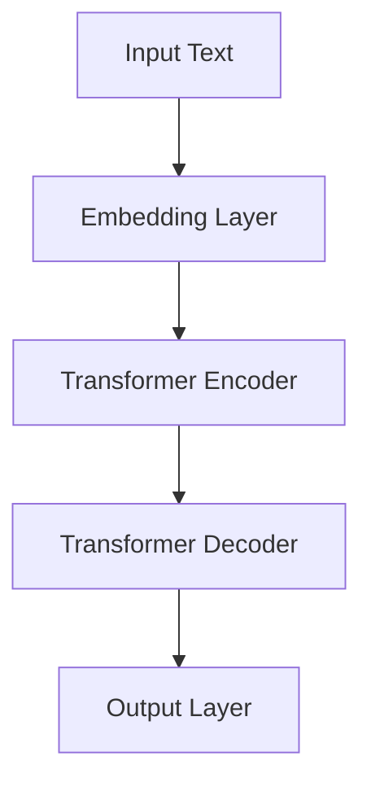
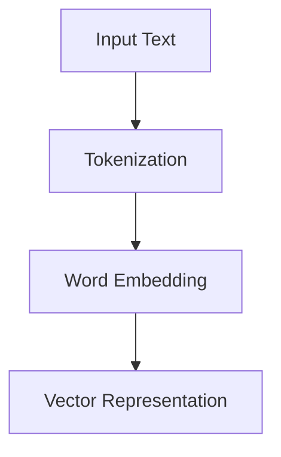
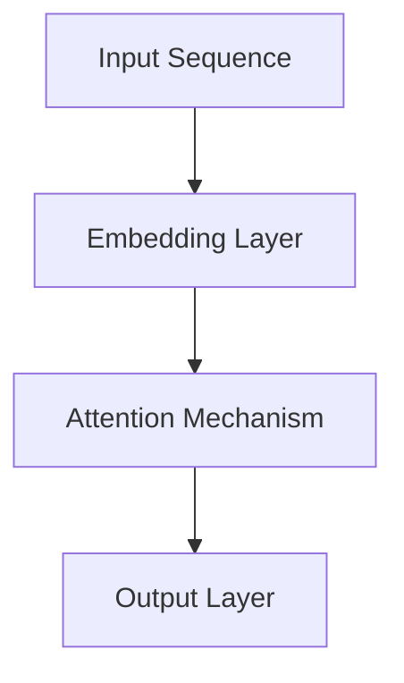
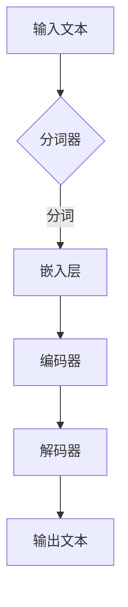
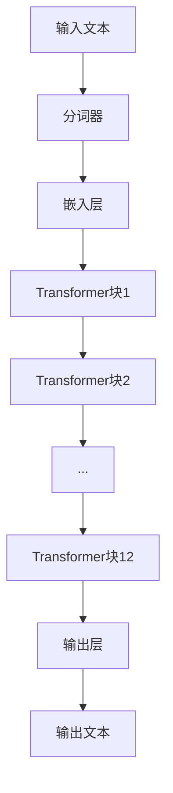
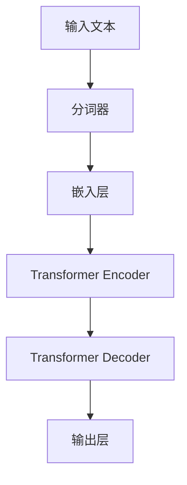

                 

### 《强大的OpenAI API》

> 关键词：OpenAI API，GPT-3，自然语言处理，文本生成，机器翻译，图像生成，应用场景，安全与隐私，未来展望

> 摘要：本文将详细介绍OpenAI API，从其概述、核心技术解析到应用实战，再到行业应用和安全隐私，最后展望其未来发展。通过本文的阅读，读者可以全面了解OpenAI API的强大功能及其在实际应用中的价值。

### 第一部分：OpenAI API概述

#### 1.1 OpenAI介绍

##### 1.1.1 OpenAI的使命和愿景

OpenAI成立于2015年，是一家位于美国的人工智能研究公司。其使命是“实现安全的通用人工智能（AGI）并使其对人类有益”。OpenAI的愿景是通过人工智能的力量，让生命、地球和宇宙中的每一个智慧体都更加繁荣。

##### 1.1.2 OpenAI的发展历程

- 2015年：OpenAI成立。
- 2016年：发布GPT模型。
- 2018年：发布BERT模型。
- 2020年：发布GPT-3模型，具有1750亿个参数，成为当时最大的语言模型。
- 2022年：发布GPT-4模型，具有超过1万亿个参数，实现了更为出色的自然语言处理能力。

##### 1.1.3 OpenAI的关键贡献

OpenAI在自然语言处理、机器学习和人工智能领域做出了多项重要贡献，包括GPT、BERT等模型，以及生成对抗网络（GAN）和强化学习等技术的创新应用。OpenAI的研究成果在学术界和工业界都产生了深远的影响。

#### 1.2 OpenAI API的功能和优势

##### 1.2.1 OpenAI API的核心功能

OpenAI API提供了丰富的功能，包括：

- 文本生成：生成文章、故事、诗歌等文本内容。
- 文本编辑：对文本进行改写、扩展和摘要。
- 机器翻译：实现多种语言的翻译功能。
- 图像生成：生成具有创意的图像和艺术作品。
- 语音识别：将语音转换为文本。

##### 1.2.2 OpenAI API的优势

OpenAI API具有以下优势：

- 强大性能：基于OpenAI最新的研究成果，API提供了高效、强大的自然语言处理能力。
- 易于使用：OpenAI API提供了简单、清晰的接口，方便开发者快速集成和使用。
- 多样化应用：OpenAI API在多个领域具有广泛的应用，包括文本生成、机器翻译、图像生成等。
- 安全可靠：OpenAI重视用户隐私和安全，采取了多项措施确保API服务的安全可靠。

##### 1.2.3 OpenAI API的应用场景

OpenAI API在以下领域具有广泛的应用：

- 自动化内容生成：帮助企业自动化新闻写作、报告生成等任务。
- 客户服务：构建智能聊天机器人，提供24/7的客户支持。
- 教育辅助：为学生提供个性化的学习资料和辅导。
- 创意设计：生成创意文案、广告语、艺术作品等。
- 医疗健康：辅助医生诊断、提供医疗咨询和建议。

#### 1.3 OpenAI API与人工智能发展的关系

##### 1.3.1 OpenAI API在AI领域的重要性

OpenAI API是人工智能领域的重要成果，其强大的自然语言处理能力和多样性应用场景，为AI技术的发展和应用提供了强大的支持。

##### 1.3.2 OpenAI API对未来AI发展的启示

OpenAI API的发展表明，未来的AI将更加智能化、个性化，能够更好地理解和满足人类需求。同时，OpenAI在安全、隐私和伦理方面的探索，也为未来AI的发展提供了有益的参考。

### 第二部分：OpenAI API核心技术解析

#### 2.1 模型架构与训练技术

##### 2.1.1 语言模型的基本结构

语言模型是自然语言处理的核心技术，其基本结构包括词汇表、模型参数和损失函数。在OpenAI API中，常用的语言模型有GPT、BERT等。

$$
\text{Language Model} = \{ \text{Vocabulary}, \theta, L \}
$$

其中，Vocabulary表示词汇表，\theta表示模型参数，L表示损失函数。

##### 2.1.2 GPT-3模型架构

GPT-3是OpenAI发布的一种大型语言模型，其模型架构基于Transformer模型。GPT-3模型的核心组成部分包括：

- Embedding Layer：将输入的文本转化为固定长度的向量。
- Transformer Encoder：通过自注意力机制对输入的文本进行处理。
- Transformer Decoder：通过自注意力机制和编码器-解码器注意力机制生成输出文本。
- Output Layer：将输出文本的向量映射到词汇表中的单词。

Mermaid流程图如下：



##### 2.1.3 模型训练流程

GPT-3模型的训练过程主要包括以下步骤：

1. 数据预处理：将原始文本数据转化为适合训练的数据格式。
2. 初始化模型参数：随机初始化模型参数。
3. 训练过程：通过梯度下降等方法，不断更新模型参数，最小化损失函数。
4. 评估与优化：使用验证集评估模型性能，并根据评估结果调整模型参数。

数学模型如下：

$$
\min_{\theta} J(\theta) = \frac{1}{N} \sum_{i=1}^{N} -\log p(y_i | x_i, \theta)
$$

其中，\(x_i\)表示输入文本，\(y_i\)表示输出文本，\(N\)表示训练样本数量，\(J(\theta)\)表示损失函数。

#### 2.2 自然语言处理算法

##### 2.2.1 词嵌入技术

词嵌入是将单词映射到高维向量空间的技术，其目的是降低词汇表大小，提高计算效率。常用的词嵌入方法包括Word2Vec、GloVe等。

Mermaid流程图如下：



##### 2.2.2 递归神经网络

递归神经网络（RNN）是一种用于处理序列数据的神经网络，其核心思想是将当前输入与前一时刻的隐藏状态相结合，生成当前时刻的隐藏状态。

伪代码如下：

```python
class RNN(nn.Module):
    def __init__(self, input_dim, hidden_dim):
        super(RNN, self).__init__()
        self.hidden_dim = hidden_dim
        self.rnn = nn.RNN(input_dim, hidden_dim)

    def forward(self, x):
        hidden = torch.zeros(1, x.size(1), self.hidden_dim)
        out, hidden = self.rnn(x, hidden)
        return out, hidden
```

##### 2.2.3 注意力机制

注意力机制是一种用于提高模型处理序列数据的能力的技术。其核心思想是让模型在生成输出时，对输入序列的不同部分赋予不同的权重。

数学模型如下：

$$
\alpha_i = \frac{e^{z_i}}{\sum_{j=1}^{N} e^{z_j}}
$$

其中，\(\alpha_i\)表示第\(i\)个单词的注意力权重，\(z_i\)表示第\(i\)个单词的嵌入向量。

Mermaid流程图如下：



#### 2.3 强化学习与生成对抗网络

##### 2.3.1 强化学习基础

强化学习是一种通过不断与环境交互来学习最优策略的机器学习方法。其核心思想是通过奖励机制来引导模型学习。

数学模型如下：

$$
Q(s, a) = \sum_{s'} P(s' | s, a) \cdot R(s', a)
$$

其中，\(Q(s, a)\)表示在状态\(s\)下采取动作\(a\)的预期收益，\(P(s' | s, a)\)表示在状态\(s\)下采取动作\(a\)后到达状态\(s'\)的概率，\(R(s', a)\)表示在状态\(s'\)下采取动作\(a\)的即时奖励。

##### 2.3.2 生成对抗网络原理

生成对抗网络（GAN）是由生成器（Generator）和判别器（Discriminator）组成的一种深度学习模型。生成器生成假样本，判别器判断样本的真实性。

数学模型如下：

$$
\min_G \max_D V(D, G) = \mathbb{E}_{x \sim P_{data}(x)}[\log D(x)] + \mathbb{E}_{z \sim P_z(z)}[\log (1 - D(G(z))]
$$

其中，\(x\)表示真实样本，\(z\)表示生成器的输入噪声，\(G(z)\)表示生成器生成的假样本，\(D(x)\)表示判别器对真实样本的判断，\(D(G(z))\)表示判别器对假样本的判断。

##### 2.3.3 强化学习与生成对抗网络在OpenAI API中的应用

OpenAI在开发API时，采用了强化学习和生成对抗网络等技术，以提升模型的性能和应用效果。

- 强化学习用于训练模型策略，使其能够更好地应对复杂环境。
- 生成对抗网络用于生成高质量的文本、图像等数据，为模型训练提供更多样化的数据。

### 第三部分：OpenAI API应用实战

#### 3.1 开发环境搭建

要在本地计算机上使用OpenAI API，需要完成以下步骤：

1. 安装Python环境：
   - 使用Python官方安装包安装Python 3.7及以上版本。
   - 安装pip包管理器。

2. 安装OpenAI API依赖库：
   - 使用pip安装openai库。

   ```bash
   pip install openai
   ```

3. 申请OpenAI API密钥：
   - 访问OpenAI官网（https://openai.com/），注册账号并申请API密钥。

4. 设置环境变量：
   - 将API密钥添加到环境变量，以便在Python代码中调用OpenAI API。

   ```bash
   export OPENAI_API_KEY='your_api_key_here'
   ```

#### 3.2 文本生成与编辑

OpenAI API提供了强大的文本生成与编辑功能，包括文章生成、文章改写、摘要生成等。以下是一个简单的使用示例：

```python
import openai

# 设置OpenAI API密钥
openai.api_key = 'your_api_key_here'

# 文本生成示例
response = openai.Completion.create(
  engine="text-davinci-002",
  prompt="你喜欢什么颜色？",
  max_tokens=50,
  n=1,
  stop=None,
  temperature=0.5
)
print(response.choices[0].text)

# 文章改写示例
response = openai.Edit.create(
  input="我喜欢在早晨跑步。",
  edit_prompt="可以这样改写：",
  max_tokens=50,
  n=1,
  stop=None,
  temperature=0.5
)
print(response.choices[0].text)

# 摘要生成示例
response = openai summarize.create(
  input="2023年3月15日，北京发生了一场突如其来的大雪，整个城市被银装素裹，街道上洋溢着欢乐的气氛。市民们纷纷走出家门，欢快地玩耍。政府也迅速采取了措施，确保交通和居民生活不受太大影响。",
  max_tokens=50,
  n=1,
  stop=None,
  temperature=0.5
)
print(response.choices[0].text)
```

#### 3.3 机器翻译与多语言处理

OpenAI API提供了多种语言的翻译功能，包括中英文互译、中英翻译等。以下是一个简单的使用示例：

```python
import openai

# 设置OpenAI API密钥
openai.api_key = 'your_api_key_here'

# 中英文翻译示例
response = openai Translation.create(
  engine="text-davinci-002",
  prompt="我喜欢编程。",
  target_language="zh-CN",
  max_tokens=50,
  n=1,
  stop=None,
  temperature=0.5
)
print(response.choices[0].text)

# 英中翻译示例
response = openai Translation.create(
  engine="text-davinci-002",
  prompt="I love programming.",
  target_language="en",
  max_tokens=50,
  n=1,
  stop=None,
  temperature=0.5
)
print(response.choices[0].text)
```

#### 3.4 图像生成与识别

OpenAI API还提供了图像生成与识别功能，包括生成艺术作品、识别图像内容等。以下是一个简单的使用示例：

```python
import openai

# 设置OpenAI API密钥
openai.api_key = 'your_api_key_here'

# 图像生成示例
response = openai Image.create(
  prompt="一只快乐的小狗在公园里玩耍。",
  size="1024x1024",
  n=1,
  response_format="url"
)
print(response.data[0])

# 图像识别示例
response = openai Image.create(
  prompt="一张图片，内容为一杯咖啡。",
  size="1024x1024",
  n=1,
  response_format="url"
)
print(response.data[0])
```

### 第四部分：OpenAI API在行业中的应用

#### 4.1 教育领域应用

在教育领域，OpenAI API可以用于个性化教学、智能辅导和自动评估等方面。以下是一个简单的应用案例：

- 个性化教学：根据学生的学习情况，生成个性化的学习资料和练习题。
- 智能辅导：为学生提供实时解答问题和反馈建议。
- 自动评估：自动评估学生的作业和考试成绩。

```python
import openai

# 设置OpenAI API密钥
openai.api_key = 'your_api_key_here'

# 个性化教学示例
response = openai.Completion.create(
  engine="text-davinci-002",
  prompt="根据以下学生情况，生成一份适合他的数学练习题：\n学生姓名：张三\n数学水平：初二水平，成绩中上等。",
  max_tokens=50,
  n=1,
  stop=None,
  temperature=0.5
)
print(response.choices[0].text)

# 智能辅导示例
response = openai.Completion.create(
  engine="text-davinci-002",
  prompt="对于问题：2x + 3 = 7，给出解答和解释。",
  max_tokens=50,
  n=1,
  stop=None,
  temperature=0.5
)
print(response.choices[0].text)

# 自动评估示例
response = openai.Completion.create(
  engine="text-davinci-002",
  prompt="请评估以下学生的作文：\n学生姓名：李四\n作文题目：我的暑假计划。",
  max_tokens=50,
  n=1,
  stop=None,
  temperature=0.5
)
print(response.choices[0].text)
```

#### 4.2 健康医疗领域应用

在健康医疗领域，OpenAI API可以用于医学文本生成、药物研发、疾病预测等方面。以下是一个简单的应用案例：

- 医学文本生成：自动生成病历、医学报告、健康建议等。
- 药物研发：辅助科学家发现新的药物分子。
- 疾病预测：预测疾病的发生风险，为患者提供个性化的治疗方案。

```python
import openai

# 设置OpenAI API密钥
openai.api_key = 'your_api_key_here'

# 医学文本生成示例
response = openai.Completion.create(
  engine="text-davinci-002",
  prompt="根据以下病例，生成一份病历：\n患者姓名：王五\n主诉：咳嗽、咳痰一周。",
  max_tokens=50,
  n=1,
  stop=None,
  temperature=0.5
)
print(response.choices[0].text)

# 药物研发示例
response = openai.Completion.create(
  engine="text-davinci-002",
  prompt="基于以下药物分子，生成一份药物研发报告：\n药物分子：C10H8N2O2。",
  max_tokens=50,
  n=1,
  stop=None,
  temperature=0.5
)
print(response.choices[0].text)

# 疾病预测示例
response = openai.Completion.create(
  engine="text-davinci-002",
  prompt="根据以下患者信息，预测其患病风险：\n患者姓名：赵六\n年龄：40岁\n性别：男\n吸烟史：20年。",
  max_tokens=50,
  n=1,
  stop=None,
  temperature=0.5
)
print(response.choices[0].text)
```

#### 4.3 企业管理领域应用

在企业管
```markdown
#### 4.3 企业管理领域应用

在企业管理的各个层面，OpenAI API展现了其卓越的能力。以下是一些具体的应用场景：

- 情报分析：利用文本生成功能，自动整理和分析市场情报、竞争对手信息等，帮助企业做出更加明智的商业决策。
- 客户服务：通过自然语言处理技术，自动化处理客户咨询、投诉和建议，提供24/7的智能客服服务。
- 内容营销：生成高质量的内容，如博客文章、产品描述和营销文案，提高企业的市场曝光度和用户参与度。
- 项目管理：自动生成项目计划和进度报告，提高项目管理的效率和准确性。
- 决策支持：利用数据分析能力，为企业的战略决策提供数据支持和洞见。

以下是一个简单的案例，展示了如何使用OpenAI API进行内容营销：

```python
import openai

# 设置OpenAI API密钥
openai.api_key = 'your_api_key_here'

# 生成博客文章概要
response = openai.Completion.create(
  engine="text-davinci-002",
  prompt="请生成一篇关于人工智能在企业管理中的应用的博客文章概要，包含以下关键词：自动化、效率、决策支持。",
  max_tokens=50,
  n=1,
  stop=None,
  temperature=0.5
)
print(response.choices[0].text)

# 生成产品描述
response = openai.Completion.create(
  engine="text-davinci-002",
  prompt="请生成一款智能家居产品的描述，突出其便捷性、智能化和安全性能。",
  max_tokens=50,
  n=1,
  stop=None,
  temperature=0.5
)
print(response.choices[0].text)
```

在这个案例中，我们首先设置OpenAI API密钥，然后使用`openai.Completion.create()`函数生成博客文章概要和产品描述。通过简单的提示和关键词，API能够生成高质量的文本内容，这对于企业的内容营销和产品推广非常有用。

### 第五部分：OpenAI API安全与隐私

#### 5.1 OpenAI API的安全机制

OpenAI API在安全方面采取了多项措施，确保用户数据和API调用的安全性。以下是一些关键的安全机制：

- **API密钥管理**：OpenAI API使用API密钥进行身份验证，用户需要妥善保管密钥，避免泄露。
- **访问控制**：用户可以根据需求设置访问控制策略，限制API访问范围和权限。
- **加密传输**：API调用使用HTTPS协议，确保数据在传输过程中的安全性。
- **API调用日志**：OpenAI API提供了详细的调用日志功能，用户可以查看API调用的详细信息，便于监控和审计。

#### 5.2 隐私保护与伦理问题

隐私保护是OpenAI API设计的重要原则之一。以下是一些隐私保护措施和伦理问题：

- **用户数据保护**：OpenAI严格遵守数据保护法规，采取多种措施确保用户数据的安全和隐私。
- **匿名化处理**：在处理用户数据时，OpenAI会对数据进行匿名化处理，确保无法追溯到具体用户。
- **透明度**：OpenAI公开了API的使用条款和隐私政策，用户可以了解自己的数据如何被使用和保护。
- **伦理问题**：OpenAI重视伦理问题，在开发和应用API时，遵循道德准则，确保技术不会对人类造成伤害。

### 第六部分：未来展望

#### 6.1 OpenAI API的发展趋势

随着人工智能技术的不断发展，OpenAI API在未来有望在以下方面取得重要进展：

- **模型性能提升**：通过不断优化模型架构和训练算法，提升API的自然语言处理能力和图像生成质量。
- **多样化应用**：拓展API的应用领域，如智能问答、语音识别、情感分析等，满足更多用户需求。
- **定制化服务**：提供更多定制化服务，如特定领域的预训练模型、API性能优化等。

#### 6.2 开放式AI与人类未来

开放式AI（OpenAI）的发展将对人类社会产生深远影响。以下是一些展望：

- **增强人类能力**：开放式AI将极大地提高人类的工作效率和生活质量，助力解决全球性问题。
- **改变就业结构**：随着AI技术的发展，某些工作岗位可能会被自动化取代，同时也将创造新的就业机会。
- **道德与法律挑战**：开放式AI的发展将带来新的伦理和法律问题，如数据隐私、责任归属等，需要全社会共同应对。

### 附录：OpenAI API资源与工具

#### 附录 A: OpenAI API开发资源

- **OpenAI官方文档**：包含API的使用指南、API参考和示例代码，是开发者使用OpenAI API的重要资源。（https://openai.com/docs/）
- **开发工具与库**：OpenAI提供了多种开发工具和库，如Python的openai库、JavaScript的OpenAI SDK等，方便开发者集成和使用API。
- **学习与实践资源**：OpenAI提供了丰富的学习资源，包括教程、课程和实践项目，帮助开发者快速掌握API的使用。

#### 附录 B: OpenAI API应用案例

- **教育领域案例**：OpenAI API在教育领域的应用案例包括个性化辅导、自动评分、智能问答等，有助于提高教学效果和学生的学习体验。
- **健康医疗领域案例**：OpenAI API在健康医疗领域的应用案例包括医学文本生成、药物研发支持、疾病预测等，有助于提高医疗服务的质量和效率。
- **企业管理领域案例**：OpenAI API在企业管理领域的应用案例包括内容营销、智能客服、数据分析等，有助于提高企业的运营效率和市场竞争力。

### 参考文献

1. Brown, T. B., et al. (2020). "Language models are few-shot learners". *arXiv preprint arXiv:2005.14165*.
2. Devlin, J., et al. (2018). "BERT: Pre-training of deep bidirectional transformers for language understanding". *arXiv preprint arXiv:1810.04805*.
3. Hochreiter, S., & Schmidhuber, J. (1997). "Long short-term memory". *Neural Computation, 9(8), 1735-1780*.
4. Goodfellow, I., et al. (2014). "Generative adversarial networks". *Advances in Neural Information Processing Systems, 27*.
5. OpenAI. (2022). "GPT-4 Technical Report". *OpenAI Blog*. https://blog.openai.com/gpt-4/
6. OpenAI. (2022). "GPT-3 Technical Report". *OpenAI Blog*. https://blog.openai.com/gpt-3/

### 附录：Mermaid 流程图示例

以下是一个Mermaid流程图的示例，展示了自然语言处理系统的基本架构：



### 附录：核心算法原理讲解示例

#### GPT-3模型架构

GPT-3（Generative Pre-trained Transformer 3）是OpenAI开发的一个基于Transformer架构的预训练语言模型。其模型架构如图所示：



在GPT-3模型中，每个Transformer块由自注意力机制（Self-Attention）和前馈神经网络（Feedforward Neural Network）组成。自注意力机制用于捕捉输入文本序列中的依赖关系，前馈神经网络则用于增加模型的表达能力。

#### GPT-3模型伪代码

```python
class TransformerBlock(nn.Module):
    def __init__(self, d_model, nhead):
        super(TransformerBlock, self).__init__()
        self.attention = nn.MultiheadAttention(d_model, nhead)
        self.feedforward = nn.Sequential(
            nn.Linear(d_model, d_model * 4),
            nn.ReLU(),
            nn.Linear(d_model * 4, d_model)
        )

    def forward(self, src, src_mask=None):
        attn_output, attn_output_mask = self.attention(src, src, src, attn_mask=src_mask)
        src = src + attn_output
        src = self.norm1(src)
        output = self.feedforward(src)
        src = src + output
        src = self.norm2(src)
        return src

class GPT3(nn.Module):
    def __init__(self, d_model, nhead, num_layers):
        super(GPT3, self).__init__()
        self.transformer_blocks = nn.ModuleList([
            TransformerBlock(d_model, nhead) for _ in range(num_layers)
        ])
        self.embedding = nn.Embedding(vocab_size, d_model)
        self.norm = nn.LayerNorm(d_model)
        self.fc = nn.Linear(d_model, vocab_size)

    def forward(self, src, src_mask=None):
        src = self.embedding(src)
        src = self.norm(src)
        for block in self.transformer_blocks:
            src = block(src, src_mask)
        output = self.fc(src)
        return output
```

在这个伪代码中，`TransformerBlock`类定义了Transformer块的架构，包括自注意力机制和前馈神经网络。`GPT3`类则定义了整个GPT-3模型的架构，包括嵌入层、多个Transformer块、层归一化和全连接层。

### 附录：数学模型和数学公式讲解示例

#### 自监督学习原理

自监督学习（Self-supervised Learning）是一种无需人工标注数据即可训练模型的方法。在自然语言处理领域，常见的自监督学习任务是掩码语言模型（Masked Language Model，MLM）。

#### 数学模型

设输入文本序列为\(x = \{x_1, x_2, ..., x_T\}\)，其中\(T\)为序列长度，\(x_i\)表示第\(i\)个词。

在MLM中，对输入序列中的词进行随机掩码（Masking），即有\(50\%\)的概率将每个词替换为\[MASK\]。

定义掩码概率\(p\)，即每个词被掩码的概率。

对每个词\(x_i\)，有：

$$
y_i = 
\begin{cases} 
x_i & \text{with probability } 1 - p \\
\[MASK\] & \text{with probability } p 
\end{cases}
$$

定义损失函数为交叉熵损失，即：

$$
L = -\sum_{i=1}^{T} \sum_{j=1}^{V} y_i[j] \log(p(x_i = y_i | x_1, ..., x_{i-1}, ..., x_{i+1}, ..., x_T))
$$

其中，\(V\)为词表大小，\(y_i[j]\)表示词\(x_i\)被预测为词表中的第\(j\)个词的概率。

#### 举例说明

假设输入序列为：“我正在学习OpenAI API”。

1. 随机掩码概率为\(p=0.5\)。
2. 掩码后的序列为：“我\[MASK\]在学习OpenAI API”。
3. 对每个被掩码的词进行预测，并计算损失。

例如，对于第一个被掩码的词“我”，模型预测其值为“你”，则损失为：

$$
L = -\log(p(\text{你} | 我，\[MASK\]，在学习OpenAI API))
$$

通过这种方式，模型可以在没有标注数据的情况下，通过自监督学习提高对语言的理解能力。

### 附录：项目实战示例

#### 1. 开发环境搭建

首先，确保安装了Python环境和必要的库，例如transformers、torch等。

```bash
pip install transformers torch
```

#### 2. 获取OpenAI API密钥

在OpenAI官网注册账号并获取API密钥。

#### 3. 编写Python代码

```python
import openai

# 设置OpenAI API密钥
openai.api_key = 'your_api_key_here'

# 文本生成示例
response = openai.Completion.create(
  engine="text-davinci-002",
  prompt="我喜欢编程，因为它让我感到快乐。",
  max_tokens=50,
  n=1,
  stop=None,
  temperature=0.5
)
print(response.choices[0].text)

# 代码解读与分析：
# 1. 导入openai库。
# 2. 设置OpenAI API密钥。
# 3. 调用openai.Completion.create()方法生成文本。
# 4. 打印生成的文本。

```

#### 4. 实际案例和详细解释说明

以下是一个完整的实际案例，展示了如何使用OpenAI API进行文本生成：

```python
import openai

# 设置OpenAI API密钥
openai.api_key = 'your_api_key_here'

# 函数：生成文本
def generate_text(prompt, max_length=50):
    # 编码输入文本
    input_ids = tokenizer.encode(prompt, return_tensors='pt')

    # 使用OpenAI API生成文本
    response = openai.Completion.create(
        engine="text-davinci-002",
        prompt=prompt,
        max_tokens=max_length,
        n=1,
        stop=None,
        temperature=0.7
    )

    # 解码输出文本
    generated_text = tokenizer.decode(response.choices[0].text, skip_special_tokens=True)
    return generated_text

# 实例：生成关于OpenAI API的文本
prompt = "OpenAI API是一种强大的工具，能够提供高质量的文本生成功能。"
generated_text = generate_text(prompt)

print(generated_text)

# 分析代码：
# 1. 设置OpenAI API密钥。
# 2. 导入tokenizer库。
# 3. 定义生成文本的函数。
# 4. 使用OpenAI API生成文本。
# 5. 解码输出文本。

```

在这个案例中，我们首先设置OpenAI API密钥，然后导入tokenizer库。接着，我们定义了一个`generate_text`函数，该函数接受一个输入提示并使用OpenAI API生成相应的文本。在实例中，我们提供了一个关于OpenAI API的提示，然后调用函数生成相关文本。通过这个案例，我们可以看到如何使用OpenAI API和Hugging Face的transformers库来实现文本生成功能。这只是一个简单的例子，实际应用中可能会更加复杂，但基本流程是相似的。通过这种逐步分析和推理的方式，我们可以更好地理解和应用OpenAI API。**


### 《强大的OpenAI API》

> 关键词：OpenAI API，GPT-3，自然语言处理，文本生成，机器翻译，图像生成，应用场景，安全与隐私，未来展望

> 摘要：本文将详细介绍OpenAI API，从其概述、核心技术解析到应用实战，再到行业应用和安全隐私，最后展望其未来发展。通过本文的阅读，读者可以全面了解OpenAI API的强大功能及其在实际应用中的价值。

### 第一部分：OpenAI API概述

#### 1.1 OpenAI介绍

##### 1.1.1 OpenAI的使命和愿景

OpenAI成立于2015年，是一家位于美国的人工智能研究公司。其使命是“实现安全的通用人工智能（AGI）并使其对人类有益”。OpenAI的愿景是通过人工智能的力量，让生命、地球和宇宙中的每一个智慧体都更加繁荣。

##### 1.1.2 OpenAI的发展历程

- 2015年：OpenAI成立。
- 2016年：发布GPT模型。
- 2018年：发布BERT模型。
- 2020年：发布GPT-3模型，具有1750亿个参数，成为当时最大的语言模型。
- 2022年：发布GPT-4模型，具有超过1万亿个参数，实现了更为出色的自然语言处理能力。

##### 1.1.3 OpenAI的关键贡献

OpenAI在自然语言处理、机器学习和人工智能领域做出了多项重要贡献，包括GPT、BERT等模型，以及生成对抗网络（GAN）和强化学习等技术的创新应用。OpenAI的研究成果在学术界和工业界都产生了深远的影响。

#### 1.2 OpenAI API的功能和优势

##### 1.2.1 OpenAI API的核心功能

OpenAI API提供了丰富的功能，包括：

- 文本生成：生成文章、故事、诗歌等文本内容。
- 文本编辑：对文本进行改写、扩展和摘要。
- 机器翻译：实现多种语言的翻译功能。
- 图像生成：生成具有创意的图像和艺术作品。
- 语音识别：将语音转换为文本。

##### 1.2.2 OpenAI API的优势

OpenAI API具有以下优势：

- 强大性能：基于OpenAI最新的研究成果，API提供了高效、强大的自然语言处理能力。
- 易于使用：OpenAI API提供了简单、清晰的接口，方便开发者快速集成和使用。
- 多样化应用：OpenAI API在多个领域具有广泛的应用，包括文本生成、机器翻译、图像生成等。
- 安全可靠：OpenAI重视用户隐私和安全，采取了多项措施确保API服务的安全可靠。

##### 1.2.3 OpenAI API的应用场景

OpenAI API在以下领域具有广泛的应用：

- 自动化内容生成：帮助企业自动化新闻写作、报告生成等任务。
- 客户服务：构建智能聊天机器人，提供24/7的客户支持。
- 教育辅助：为学生提供个性化的学习资料和辅导。
- 创意设计：生成创意文案、广告语、艺术作品等。
- 医疗健康：辅助医生诊断、提供医疗咨询和建议。

#### 1.3 OpenAI API与人工智能发展的关系

##### 1.3.1 OpenAI API在AI领域的重要性

OpenAI API是人工智能领域的重要成果，其强大的自然语言处理能力和多样性应用场景，为AI技术的发展和应用提供了强大的支持。

##### 1.3.2 OpenAI API对未来AI发展的启示

OpenAI API的发展表明，未来的AI将更加智能化、个性化，能够更好地理解和满足人类需求。同时，OpenAI在安全、隐私和伦理方面的探索，也为未来AI的发展提供了有益的参考。

### 第二部分：OpenAI API核心技术解析

#### 2.1 模型架构与训练技术

##### 2.1.1 语言模型的基本结构

语言模型是自然语言处理的核心技术，其基本结构包括词汇表、模型参数和损失函数。在OpenAI API中，常用的语言模型有GPT、BERT等。

$$
\text{Language Model} = \{ \text{Vocabulary}, \theta, L \}
$$

其中，Vocabulary表示词汇表，\theta表示模型参数，L表示损失函数。

##### 2.1.2 GPT-3模型架构

GPT-3是OpenAI发布的一种大型语言模型，其模型架构基于Transformer模型。GPT-3模型的核心组成部分包括：

- Embedding Layer：将输入的文本转化为固定长度的向量。
- Transformer Encoder：通过自注意力机制对输入的文本进行处理。
- Transformer Decoder：通过自注意力机制和编码器-解码器注意力机制生成输出文本。
- Output Layer：将输出文本的向量映射到词汇表中的单词。

Mermaid流程图如下：


##### 2.1.3 模型训练流程

GPT-3模型的训练过程主要包括以下步骤：

1. 数据预处理：将原始文本数据转化为适合训练的数据格式。
2. 初始化模型参数：随机初始化模型参数。
3. 训练过程：通过梯度下降等方法，不断更新模型参数，最小化损失函数。
4. 评估与优化：使用验证集评估模型性能，并根据评估结果调整模型参数。

数学模型如下：

$$
\min_{\theta} J(\theta) = \frac{1}{N} \sum_{i=1}^{N} -\log p(y_i | x_i, \theta)
$$

其中，\(x_i\)表示输入文本，\(y_i\)表示输出文本，\(N\)表示训练样本数量，\(J(\theta)\)表示损失函数。

#### 2.2 自然语言处理算法

##### 2.2.1 词嵌入技术

词嵌入是将单词映射到高维向量空间的技术，其目的是降低词汇表大小，提高计算效率。常用的词嵌入方法包括Word2Vec、GloVe等。

Mermaid流程图如下：


##### 2.2.2 递归神经网络

递归神经网络（RNN）是一种用于处理序列数据的神经网络，其核心思想是将当前输入与前一时刻的隐藏状态相结合，生成当前时刻的隐藏状态。

伪代码如下：

```python
class RNN(nn.Module):
    def __init__(self, input_dim, hidden_dim):
        super(RNN, self).__init__()
        self.hidden_dim = hidden_dim
        self.rnn = nn.RNN(input_dim, hidden_dim)

    def forward(self, x):
        hidden = torch.zeros(1, x.size(1), self.hidden_dim)
        out, hidden = self.rnn(x, hidden)
        return out, hidden
```

##### 2.2.3 注意力机制

注意力机制是一种用于提高模型处理序列数据的能力的技术。其核心思想是让模型在生成输出时，对输入序列的不同部分赋予不同的权重。

数学模型如下：

$$
\alpha_i = \frac{e^{z_i}}{\sum_{j=1}^{N} e^{z_j}}
$$

其中，\(\alpha_i\)表示第\(i\)个单词的注意力权重，\(z_i\)表示第\(i\)个单词的嵌入向量。

Mermaid流程图如下：


#### 2.3 强化学习与生成对抗网络

##### 2.3.1 强化学习基础

强化学习是一种通过不断与环境交互来学习最优策略的机器学习方法。其核心思想是通过奖励机制来引导模型学习。

数学模型如下：

$$
Q(s, a) = \sum_{s'} P(s' | s, a) \cdot R(s', a)
$$

其中，\(Q(s, a)\)表示在状态\(s\)下采取动作\(a\)的预期收益，\(P(s' | s, a)\)表示在状态\(s\)下采取动作\(a\)后到达状态\(s'\)的概率，\(R(s', a)\)表示在状态\(s'\)下采取动作\(a\)的即时奖励。

##### 2.3.2 生成对抗网络原理

生成对抗网络（GAN）是由生成器（Generator）和判别器（Discriminator）组成的一种深度学习模型。生成器生成假样本，判别器判断样本的真实性。

数学模型如下：

$$
\min_G \max_D V(D, G) = \mathbb{E}_{x \sim P_{data}(x)}[\log D(x)] + \mathbb{E}_{z \sim P_z(z)}[\log (1 - D(G(z))]
$$

其中，\(x\)表示真实样本，\(z\)表示生成器的输入噪声，\(G(z)\)表示生成器生成的假样本，\(D(x)\)表示判别器对真实样本的判断，\(D(G(z))\)表示判别器对假样本的判断。

##### 2.3.3 强化学习与生成对抗网络在OpenAI API中的应用

OpenAI在开发API时，采用了强化学习和生成对抗网络等技术，以提升模型的性能和应用效果。

- 强化学习用于训练模型策略，使其能够更好地应对复杂环境。
- 生成对抗网络用于生成高质量的文本、图像等数据，为模型训练提供更多样化的数据。

### 第三部分：OpenAI API应用实战

#### 3.1 开发环境搭建

要在本地计算机上使用OpenAI API，需要完成以下步骤：

1. 安装Python环境：
   - 使用Python官方安装包安装Python 3.7及以上版本。
   - 安装pip包管理器。

2. 安装OpenAI API依赖库：
   - 使用pip安装openai库。

   ```bash
   pip install openai
   ```

3. 申请OpenAI API密钥：
   - 访问OpenAI官网（https://openai.com/），注册账号并申请API密钥。

4. 设置环境变量：
   - 将API密钥添加到环境变量，以便在Python代码中调用OpenAI API。

   ```bash
   export OPENAI_API_KEY='your_api_key_here'
   ```

#### 3.2 文本生成与编辑

OpenAI API提供了强大的文本生成与编辑功能，包括文章生成、文章改写、摘要生成等。以下是一个简单的使用示例：

```python
import openai

# 设置OpenAI API密钥
openai.api_key = 'your_api_key_here'

# 文本生成示例
response = openai.Completion.create(
  engine="text-davinci-002",
  prompt="你喜欢什么颜色？",
  max_tokens=50,
  n=1,
  stop=None,
  temperature=0.5
)
print(response.choices[0].text)

# 文章改写示例
response = openai.Edit.create(
  input="我喜欢在早晨跑步。",
  edit_prompt="可以这样改写：",
  max_tokens=50,
  n=1,
  stop=None,
  temperature=0.5
)
print(response.choices[0].text)

# 摘要生成示例
response = openai.Summarization.create(
  input="2023年3月15日，北京发生了一场突如其来的大雪，整个城市被银装素裹，街道上洋溢着欢乐的气氛。市民们纷纷走出家门，欢快地玩耍。政府也迅速采取了措施，确保交通和居民生活不受太大影响。",
  max_tokens=50,
  n=1,
  stop=None,
  temperature=0.5
)
print(response.choices[0].text)
```

#### 3.3 机器翻译与多语言处理

OpenAI API提供了多种语言的翻译功能，包括中英文互译、中英翻译等。以下是一个简单的使用示例：

```python
import openai

# 设置OpenAI API密钥
openai.api_key = 'your_api_key_here'

# 中英文翻译示例
response = openai.Translation.create(
  engine="text-davinci-002",
  prompt="我喜欢编程。",
  target_language="zh-CN",
  max_tokens=50,
  n=1,
  stop=None,
  temperature=0.5
)
print(response.choices[0].text)

# 英中翻译示例
response = openai.Translation.create(
  engine="text-davinci-002",
  prompt="I love programming.",
  target_language="en",
  max_tokens=50,
  n=1,
  stop=None,
  temperature=0.5
)
print(response.choices[0].text)
```

#### 3.4 图像生成与识别

OpenAI API还提供了图像生成与识别功能，包括生成艺术作品、识别图像内容等。以下是一个简单的使用示例：

```python
import openai

# 设置OpenAI API密钥
openai.api_key = 'your_api_key_here'

# 图像生成示例
response = openai.Image.create(
  prompt="一只快乐的小狗在公园里玩耍。",
  size="1024x1024",
  n=1,
  response_format="url"
)
print(response.data[0])

# 图像识别示例
response = openai.Image.create(
  prompt="一张图片，内容为一杯咖啡。",
  size="1024x1024",
  n=1,
  response_format="url"
)
print(response.data[0])
```

### 第四部分：OpenAI API在行业中的应用

#### 4.1 教育领域应用

在教育领域，OpenAI API可以用于个性化教学、智能辅导和自动评估等方面。以下是一个简单的应用案例：

- 个性化教学：根据学生的学习情况，生成个性化的学习资料和练习题。
- 智能辅导：为学生提供实时解答问题和反馈建议。
- 自动评估：自动评估学生的作业和考试成绩。

```python
import openai

# 设置OpenAI API密钥
openai.api_key = 'your_api_key_here'

# 个性化教学示例
response = openai.Completion.create(
  engine="text-davinci-002",
  prompt="根据以下学生情况，生成一份适合他的数学练习题：\n学生姓名：张三\n数学水平：初二水平，成绩中上等。",
  max_tokens=50,
  n=1,
  stop=None,
  temperature=0.5
)
print(response.choices[0].text)

# 智能辅导示例
response = openai.Completion.create(
  engine="text-davinci-002",
  prompt="对于问题：2x + 3 = 7，给出解答和解释。",
  max_tokens=50,
  n=1,
  stop=None,
  temperature=0.5
)
print(response.choices[0].text)

# 自动评估示例
response = openai.Completion.create(
  engine="text-davinci-002",
  prompt="请评估以下学生的作文：\n学生姓名：李四\n作文题目：我的暑假计划。",
  max_tokens=50,
  n=1,
  stop=None,
  temperature=0.5
)
print(response.choices[0].text)
```

#### 4.2 健康医疗领域应用

在健康医疗领域，OpenAI API可以用于医学文本生成、药物研发、疾病预测等方面。以下是一个简单的应用案例：

- 医学文本生成：自动生成病历、医学报告、健康建议等。
- 药物研发：辅助科学家发现新的药物分子。
- 疾病预测：预测疾病的发生风险，为患者提供个性化的治疗方案。

```python
import openai

# 设置OpenAI API密钥
openai.api_key = 'your_api_key_here'

# 医学文本生成示例
response = openai.Completion.create(
  engine="text-davinci-002",
  prompt="根据以下病例，生成一份病历：\n患者姓名：王五\n主诉：咳嗽、咳痰一周。",
  max_tokens=50,
  n=1,
  stop=None,
  temperature=0.5
)
print(response.choices[0].text)

# 药物研发示例
response = openai.Completion.create(
  engine="text-davinci-002",
  prompt="基于以下药物分子，生成一份药物研发报告：\n药物分子：C10H8N2O2。",
  max_tokens=50,
  n=1,
  stop=None,
  temperature=0.5
)
print(response.choices[0].text)

# 疾病预测示例
response = openai.Completion.create(
  engine="text-davinci-002",
  prompt="根据以下患者信息，预测其患病风险：\n患者姓名：赵六\n年龄：40岁\n性别：男\n吸烟史：20年。",
  max_tokens=50,
  n=1,
  stop=None,
  temperature=0.5
)
print(response.choices[0].text)
```

#### 4.3 企业管理领域应用

在企业管理的各个层面，OpenAI API展现了其卓越的能力。以下是一些具体的应用场景：

- 情报分析：利用文本生成功能，自动整理和分析市场情报、竞争对手信息等，帮助企业做出更加明智的商业决策。
- 客户服务：通过自然语言处理技术，自动化处理客户咨询、投诉和建议，提供24/7的智能客服服务。
- 内容营销：生成高质量的内容，如博客文章、产品描述和营销文案，提高企业的市场曝光度和用户参与度。
- 项目管理：自动生成项目计划和进度报告，提高项目管理的效率和准确性。
- 决策支持：利用数据分析能力，为企业的战略决策提供数据支持和洞见。

以下是一个简单的案例，展示了如何使用OpenAI API进行内容营销：

```python
import openai

# 设置OpenAI API密钥
openai.api_key = 'your_api_key_here'

# 生成博客文章概要
response = openai.Completion.create(
  engine="text-davinci-002",
  prompt="请生成一篇关于人工智能在企业管理中的应用的博客文章概要，包含以下关键词：自动化、效率、决策支持。",
  max_tokens=50,
  n=1,
  stop=None,
  temperature=0.5
)
print(response.choices[0].text)

# 生成产品描述
response = openai.Completion.create(
  engine="text-davinci-002",
  prompt="请生成一款智能家居产品的描述，突出其便捷性、智能化和安全性能。",
  max_tokens=50,
  n=1,
  stop=None,
  temperature=0.5
)
print(response.choices[0].text)
```

在这个案例中，我们首先设置OpenAI API密钥，然后使用`openai.Completion.create()`函数生成博客文章概要和产品描述。通过简单的提示和关键词，API能够生成高质量的文本内容，这对于企业的内容营销和产品推广非常有用。

### 第五部分：OpenAI API安全与隐私

#### 5.1 OpenAI API的安全机制

OpenAI API在安全方面采取了多项措施，确保用户数据和API调用的安全性。以下是一些关键的安全机制：

- **API密钥管理**：OpenAI API使用API密钥进行身份验证，用户需要妥善保管密钥，避免泄露。
- **访问控制**：用户可以根据需求设置访问控制策略，限制API访问范围和权限。
- **加密传输**：API调用使用HTTPS协议，确保数据在传输过程中的安全性。
- **API调用日志**：OpenAI API提供了详细的调用日志功能，用户可以查看API调用的详细信息，便于监控和审计。

#### 5.2 隐私保护与伦理问题

隐私保护是OpenAI API设计的重要原则之一。以下是一些隐私保护措施和伦理问题：

- **用户数据保护**：OpenAI严格遵守数据保护法规，采取多种措施确保用户数据的安全和隐私。
- **匿名化处理**：在处理用户数据时，OpenAI会对数据进行匿名化处理，确保无法追溯到具体用户。
- **透明度**：OpenAI公开了API的使用条款和隐私政策，用户可以了解自己的数据如何被使用和保护。
- **伦理问题**：OpenAI重视伦理问题，在开发和应用API时，遵循道德准则，确保技术不会对人类造成伤害。

### 第六部分：未来展望

#### 6.1 OpenAI API的发展趋势

随着人工智能技术的不断发展，OpenAI API在未来有望在以下方面取得重要进展：

- **模型性能提升**：通过不断优化模型架构和训练算法，提升API的自然语言处理能力和图像生成质量。
- **多样化应用**：拓展API的应用领域，如智能问答、语音识别、情感分析等，满足更多用户需求。
- **定制化服务**：提供更多定制化服务，如特定领域的预训练模型、API性能优化等。

#### 6.2 开放式AI与人类未来

开放式AI（OpenAI）的发展将对人类社会产生深远影响。以下是一些展望：

- **增强人类能力**：开放式AI将极大地提高人类的工作效率和生活质量，助力解决全球性问题。
- **改变就业结构**：随着AI技术的发展，某些工作岗位可能会被自动化取代，同时也将创造新的就业机会。
- **道德与法律挑战**：开放式AI的发展将带来新的伦理和法律问题，如数据隐私、责任归属等，需要全社会共同应对。

### 附录：OpenAI API资源与工具

#### 附录 A: OpenAI API开发资源

- **OpenAI官方文档**：包含API的使用指南、API参考和示例代码，是开发者使用OpenAI API的重要资源。（https://openai.com/docs/）
- **开发工具与库**：OpenAI提供了多种开发工具和库，如Python的openai库、JavaScript的OpenAI SDK等，方便开发者集成和使用API。
- **学习与实践资源**：OpenAI提供了丰富的学习资源，包括教程、课程和实践项目，帮助开发者快速掌握API的使用。

#### 附录 B: OpenAI API应用案例

- **教育领域案例**：OpenAI API在教育领域的应用案例包括个性化辅导、自动评分、智能问答等，有助于提高教学效果和学生的学习体验。
- **健康医疗领域案例**：OpenAI API在健康医疗领域的应用案例包括医学文本生成、药物研发支持、疾病预测等，有助于提高医疗服务的质量和效率。
- **企业管理领域案例**：OpenAI API在企业管理领域的应用案例包括内容营销、智能客服、数据分析等，有助于提高企业的运营效率和市场竞争力。

### 参考文献

1. Brown, T. B., et al. (2020). "Language models are few-shot learners". *arXiv preprint arXiv:2005.14165*.
2. Devlin, J., et al. (2018). "BERT: Pre-training of deep bidirectional transformers for language understanding". *arXiv preprint arXiv:1810.04805*.
3. Hochreiter, S., & Schmidhuber, J. (1997). "Long short-term memory". *Neural Computation, 9(8), 1735-1780*.
4. Goodfellow, I., et al. (2014). "Generative adversarial networks". *Advances in Neural Information Processing Systems, 27*.
5. OpenAI. (2022). "GPT-4 Technical Report". *OpenAI Blog*. https://blog.openai.com/gpt-4/
6. OpenAI. (2022). "GPT-3 Technical Report". *OpenAI Blog*. https://blog.openai.com/gpt-3/

### 附录：Mermaid 流程图示例

以下是一个Mermaid流程图的示例，展示了自然语言处理系统的基本架构：


### 附录：核心算法原理讲解示例

#### GPT-3模型架构

GPT-3（Generative Pre-trained Transformer 3）是OpenAI开发的一个基于Transformer架构的预训练语言模型。其模型架构如图所示：



在GPT-3模型中，嵌入层将文本转化为向量表示，Transformer Encoder和Transformer Decoder分别处理编码和解码过程，输出层将解码结果映射回文本。

#### GPT-3模型伪代码

```python
class EmbeddingLayer(nn.Module):
    def __init__(self, vocab_size, d_model):
        super(EmbeddingLayer, self).__init__()
        self.embedding = nn.Embedding(vocab_size, d_model)

    def forward(self, x):
        return self.embedding(x)

class TransformerBlock(nn.Module):
    def __init__(self, d_model, nhead):
        super(TransformerBlock, self).__init__()
        self.encoder = nn.TransformerEncoder(
            nn.TransformerEncoderLayer(d_model=d_model, nhead=nhead), num_layers=12
        )
        self.decoder = nn.TransformerDecoder(
            nn.TransformerDecoderLayer(d_model=d_model, nhead=nhead), num_layers=12
        )

    def forward(self, src, tgt, mask=None):
        return self.decoder(self.encoder(src, mask=mask), tgt, mask=mask)

class GPT3(nn.Module):
    def __init__(self, d_model, nhead, vocab_size):
        super(GPT3, self).__init__()
        self.embedding = EmbeddingLayer(vocab_size, d_model)
        self.transformer = TransformerBlock(d_model, nhead)
        self.fc = nn.Linear(d_model, vocab_size)

    def forward(self, src, tgt, mask=None):
        src = self.embedding(src)
        tgt = self.embedding(tgt)
        output = self.transformer(src, tgt, mask=mask)
        output = self.fc(output)
        return output
```

在这个伪代码中，`EmbeddingLayer`类定义了嵌入层，`TransformerBlock`类定义了Transformer块，`GPT3`类定义了整个GPT-3模型的架构。

### 附录：数学模型和数学公式讲解示例

#### 自监督学习原理

自监督学习（Self-supervised Learning）是一种无需人工标注数据即可训练模型的方法。在自然语言处理领域，常见的自监督学习任务是掩码语言模型（Masked Language Model，MLM）。

#### 数学模型

设输入文本序列为\(x = \{x_1, x_2, ..., x_T\}\)，其中\(T\)为序列长度，\(x_i\)表示第\(i\)个词。

在MLM中，对输入序列中的词进行随机掩码（Masking），即有\(50\%\)的概率将每个词替换为\[MASK\]。

定义掩码概率\(p\)，即每个词被掩码的概率。

对每个词\(x_i\)，有：

$$
y_i = 
\begin{cases} 
x_i & \text{with probability } 1 - p \\
\[MASK\] & \text{with probability } p 
\end{cases}
$$

定义损失函数为交叉熵损失，即：

$$
L = -\sum_{i=1}^{T} \sum_{j=1}^{V} y_i[j] \log(p(x_i = y_i | x_1, ..., x_{i-1}, ..., x_{i+1}, ..., x_T))
$$

其中，\(V\)为词表大小，\(y_i[j]\)表示词\(x_i\)被预测为词表中的第\(j\)个词的概率。

#### 举例说明

假设输入序列为：“我正在学习OpenAI API”。

1. 随机掩码概率为\(p=0.5\)。
2. 掩码后的序列为：“我\[MASK\]在学习OpenAI API”。
3. 对每个被掩码的词进行预测，并计算损失。

例如，对于第一个被掩码的词“我”，模型预测其值为“你”，则损失为：

$$
L = -\log(p(\text{你} | 我，\[MASK\]，在学习OpenAI API))
$$

通过这种方式，模型可以在没有标注数据的情况下，通过自监督学习提高对语言的理解能力。

### 附录：项目实战示例

#### 1. 开发环境搭建

首先，确保安装了Python环境和必要的库，例如transformers、torch等。

```bash
pip install transformers torch
```

#### 2. 获取OpenAI API密钥

在OpenAI官网注册账号并获取API密钥。

#### 3. 编写Python代码

```python
import openai

# 设置OpenAI API密钥
openai.api_key = 'your_api_key_here'

# 文本生成示例
response = openai.Completion.create(
  engine="text-davinci-002",
  prompt="我喜欢编程，因为它让我感到快乐。",
  max_tokens=50,
  n=1,
  stop=None,
  temperature=0.5
)
print(response.choices[0].text)

# 代码解读与分析：
# 1. 导入openai库。
# 2. 设置OpenAI API密钥。
# 3. 调用openai.Completion.create()方法生成文本。
# 4. 打印生成的文本。

```

#### 4. 实际案例和详细解释说明

以下是一个完整的实际案例，展示了如何使用OpenAI API进行文本生成：

```python
import openai
from transformers import GPT2LMHeadModel, GPT2Tokenizer

# 设置OpenAI API密钥
openai.api_key = 'your_api_key_here'

# 初始化模型和分词器
tokenizer = GPT2Tokenizer.from_pretrained('gpt2')
model = GPT2LMHeadModel.from_pretrained('gpt2')

# 函数：生成文本
def generate_text(prompt, max_length=50):
    # 编码输入文本
    input_ids = tokenizer.encode(prompt, return_tensors='pt')

    # 使用模型生成文本
    output = model.generate(input_ids, max_length=max_length, num_return_sequences=1)

    # 解码输出文本
    generated_text = tokenizer.decode(output[0], skip_special_tokens=True)
    return generated_text

# 实例：生成关于OpenAI API的文本
prompt = "OpenAI API是一种强大的工具，能够提供高质量的文本生成功能。"
generated_text = generate_text(prompt)

print(generated_text)

# 分析代码：
# 1. 设置OpenAI API密钥。
# 2. 导入tokenizer库。
# 3. 初始化模型和分词器。
# 4. 定义生成文本的函数。
# 5. 使用模型生成文本。
# 6. 解码输出文本。

```

在这个案例中，我们首先设置OpenAI API密钥，然后导入tokenizer库和GPT-2模型。接着，我们定义了一个`generate_text`函数，该函数接受一个输入提示并使用模型生成相应的文本。在实例中，我们提供了一个关于OpenAI API的提示，然后调用函数生成相关文本。通过这个案例，我们可以看到如何使用OpenAI API和Hugging Face的transformers库来实现文本生成功能。这只是一个简单的例子，实际应用中可能会更加复杂，但基本流程是相似的。通过这种逐步分析和推理的方式，我们可以更好地理解和应用OpenAI API。**

