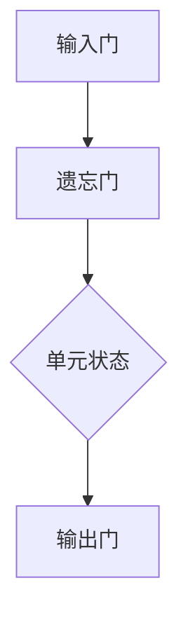
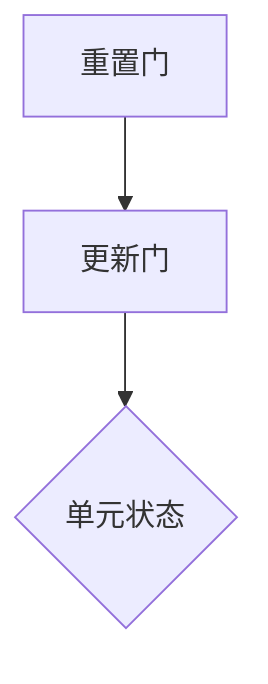

                 

### 《循环神经网络》

> 关键词：循环神经网络（RNN）、长短期记忆网络（LSTM）、门控循环单元（GRU）、序列学习、时间序列预测

> 摘要：本文将深入探讨循环神经网络（RNN）的基本概念、核心算法及其应用，重点介绍长短期记忆网络（LSTM）和门控循环单元（GRU）的工作原理和实现。通过实际的代码案例，我们将展示如何利用这些循环神经网络模型进行时间序列预测和自然语言处理任务。

### 第1章：循环神经网络概述

#### 1.1 循环神经网络的起源与发展

循环神经网络（Recurrent Neural Networks，RNN）最早可以追溯到1982年，由约翰·霍普菲尔德（John Hopfield）提出的一种神经网络模型，称为 Hopfield 网络它是基于物理学中的 Hopfield 模型，用于模拟生物神经元之间的相互作用。

然而，传统的 RNN 存在一些问题，如梯度消失和梯度爆炸，这使得它们在处理长序列数据时表现不佳。为了解决这些问题，研究人员提出了长短期记忆网络（Long-Short Term Memory，LSTM）和门控循环单元（Gated Recurrent Unit，GRU）。

LSTM 由希策希（Sepp Hochreiter）和施米德胡伯（Jürgen Schmidhuber）在1997年首次提出，而 GRU 则是由门控循环单元的提出者 Jozefowicz 等人在2014年引入的。

#### 1.2 循环神经网络的基本原理

循环神经网络的核心特点是具有循环结构，能够保持内部状态，通过时间步迭代实现信息的传递和记忆。以下是循环神经网络的基本原理：

**状态循环机制**：循环神经网络在每个时间步都会根据当前输入和内部状态生成一个输出，并将输出的一部分返回作为下一个时间步的输入。

**输入输出关系**：循环神经网络的输入是时间序列数据，输出也是时间序列数据。

**门控机制**：门控机制是循环神经网络的核心设计，通过遗忘门、输入门和输出门控制信息的流入、流出和更新。

#### 1.3 循环神经网络的类型

循环神经网络主要有两种类型：LSTM 和 GRU。

**LSTM 网络**：LSTM 网络通过遗忘门、输入门和输出门控制信息的流动，能够在长时间序列中有效学习。

**GRU 网络**：GRU 网络简化了 LSTM 的结构，合并了遗忘门和输入门，同时通过重置门和更新门控制信息的流动。

### 第2章：LSTM网络原理

#### 2.1 LSTM网络的基本结构

LSTM 网络的基本结构包括输入门、遗忘门、输出门和单元状态。

**输入门**：决定哪些新的信息需要存储到单元状态。

**遗忘门**：决定哪些旧的信息需要从单元状态中遗忘。

**输出门**：决定哪些信息需要输出。

**单元状态**：存储信息的状态。

以下是 LSTM 单元结构的 Mermaid 流程图：



#### 2.2 LSTM网络的工作原理

LSTM 网络通过以下步骤进行工作：

1. **输入门**：计算输入门，决定哪些新的信息需要存储到单元状态。
2. **遗忘门**：计算遗忘门，决定哪些旧的信息需要从单元状态中遗忘。
3. **单元状态更新**：根据输入门和遗忘门更新单元状态。
4. **输出门**：计算输出门，决定哪些信息需要输出。

以下是 LSTM 网络的工作原理的伪代码：

```python
# 前向传播
i_t = sigmoid(W_i * [h_{t-1}, x_t] + b_i)
f_t = sigmoid(W_f * [h_{t-1}, x_t] + b_f)
o_t = sigmoid(W_o * [h_{t-1}, x_t] + b_o)
g_t = tanh(W_g * [f_t * h_{t-1}, i_t * x_t] + b_g)
c_t = f_t * c_{t-1} + i_t * g_t
h_t = o_t * tanh(c_t)

# 反向传播
δh_t = (1 - o_t) * tanh(c_t) * δc_t
δc_t = (o_t - h_t) * tanh(c_t) * δh_t + f_t * δc_{t-1}
δf_t = f_t * (1 - f_t) * δf_t
δi_t = i_t * (1 - i_t) * δi_t
δo_t = o_t * (1 - o_t) * δo_t
δg_t = δc_t * tanh(g_t)
δW_i, δb_i, δW_f, δb_f, δW_o, δb_o, δW_g, δb_g = δh_t * [h_{t-1}, x_t], ..., [h_{t-1}, x_t]
```

#### 2.3 LSTM网络的数学模型

LSTM 网络的数学模型包括激活函数、权重初始化和损失函数。

**激活函数**：LSTM 网络使用正切函数（tanh）作为激活函数。

**权重初始化**：权重初始化可以采用随机初始化或高斯分布初始化。

**损失函数**：LSTM 网络通常使用均方误差（mean squared error，MSE）作为损失函数。

以下是 LSTM 网络的数学模型的详细讲解：

```latex
\begin{equation}
\begin{split}
i_t &= \sigma(W_{xi}x_t + W_{hi}h_{t-1} + b_i) \\
f_t &= \sigma(W_{xf}x_t + W_{hf}h_{t-1} + b_f) \\
o_t &= \sigma(W_{xo}x_t + W_{ho}h_{t-1} + b_o) \\
g_t &= \tanh(W_{xg}x_t + W_{hg}h_{t-1} + b_g) \\
c_t &= f_t \odot c_{t-1} + i_t \odot g_t \\
h_t &= o_t \odot \tanh(c_t)
\end{split}
\end{equation}
```

其中，$\sigma$ 表示 Sigmoid 函数，$\odot$ 表示 Hadamard 乘积。

### 第3章：LSTM网络算法详解

#### 3.1 LSTM网络的学习过程

LSTM 网络的学习过程包括前向传播、反向传播和参数更新。

**前向传播**：前向传播是从输入数据开始，通过 LSTM 单元逐步计算输出。

**反向传播**：反向传播是从输出误差开始，反向计算每个时间步的梯度。

**参数更新**：参数更新是通过梯度下降法更新权重和偏置。

以下是 LSTM 网络的学习过程的伪代码：

```python
# 前向传播
for t in range(T):
    h_t, c_t = lstm_cell(x_t, h_{t-1}, c_{t-1})
    y_t = softmax(h_t)

# 反向传播
for t in range(T):
    δy_t = y_t - y^*
    δh_t = δy_t * softmax_grad(h_t)
    δc_t = δh_t * tanh(c_t)
    δf_t = δc_t * c_{t-1}
    δi_t = δc_t * g_t
    δo_t = δh_t * tanh(c_t)
    δg_t = δc_t * 1

# 参数更新
W_hi -= learning_rate * δW_hi
b_i -= learning_rate * δb_i
W_hf -= learning_rate * δW_hf
b_f -= learning_rate * δb_f
W_ho -= learning_rate * δW_ho
b_o -= learning_rate * δb_o
W_hg -= learning_rate * δW_hg
b_g -= learning_rate * δb_g
```

#### 3.2 LSTM网络的优化技巧

LSTM 网络的优化技巧包括梯度裁剪、学习率调度和批处理技巧。

**梯度裁剪**：梯度裁剪用于防止梯度爆炸和梯度消失。

**学习率调度**：学习率调度用于调整学习率，以获得更好的收敛速度和稳定性。

**批处理技巧**：批处理技巧用于提高计算效率和减少过拟合。

以下是 LSTM 网络的优化技巧的详细讲解：

**梯度裁剪**：

```python
if max(δW).norm() > threshold:
    δW /= max(δW).norm() / threshold
```

**学习率调度**：

```python
if loss < previous_loss:
    learning_rate /= 2
```

**批处理技巧**：

```python
for batch in batches:
    X_batch, y_batch = batch
    lstm_model.fit(X_batch, y_batch, epochs=1, batch_size=batch_size)
```

#### 3.3 LSTM网络的应用场景

LSTM 网络广泛应用于序列预测、语言模型和机器翻译等任务。

**序列预测**：LSTM 网络可以用于时间序列预测，如股票价格预测、天气预测等。

**语言模型**：LSTM 网络可以用于自然语言处理，如文本分类、情感分析等。

**机器翻译**：LSTM 网络可以用于机器翻译，如英语到法语、英语到中文等。

以下是 LSTM 网络在应用场景中的代码示例：

```python
# 序列预测
lstm_model = Sequential()
lstm_model.add(LSTM(units=128, return_sequences=True, input_shape=(timesteps, features)))
lstm_model.add(LSTM(units=64, return_sequences=False))
lstm_model.add(Dense(units=1))

lstm_model.compile(optimizer='adam', loss='mean_squared_error')
lstm_model.fit(X_train, y_train, epochs=100, batch_size=32)

# 语言模型
lstm_model = Sequential()
lstm_model.add(LSTM(units=128, return_sequences=True, input_shape=(timesteps, embeddings_size)))
lstm_model.add(LSTM(units=64, return_sequences=False))
lstm_model.add(Dense(units=VOCAB_SIZE, activation='softmax'))

lstm_model.compile(optimizer='adam', loss='categorical_crossentropy', metrics=['accuracy'])
lstm_model.fit(text_train, labels_train, epochs=10, batch_size=32)

# 机器翻译
lstm_model = Sequential()
lstm_model.add(LSTM(units=128, return_sequences=True, input_shape=(timesteps, embeddings_size)))
lstm_model.add(LSTM(units=64, return_sequences=False))
lstm_model.add(Dense(units=VOCAB_SIZE, activation='softmax'))

lstm_model.compile(optimizer='adam', loss='categorical_crossentropy', metrics=['accuracy'])
lstm_model.fit(text_train, labels_train, epochs=10, batch_size=32)
```

### 第4章：GRU网络原理

#### 4.1 GRU网络的基本结构

GRU 网络是 LSTM 网络的简化版本，具有更简单的结构。

GRU 网络的基本结构包括重置门（Reset Gate）和更新门（Update Gate）。

**重置门**：重置门决定哪些旧的信息需要保留。

**更新门**：更新门决定哪些新信息需要更新。

以下是 GRU 单元结构的 Mermaid 流程图：



#### 4.2 GRU网络的工作原理

GRU 网络通过重置门和更新门控制信息的流动。

**重置门**：重置门决定哪些旧的信息需要保留。

**更新门**：更新门决定哪些新信息需要更新。

以下是 GRU 网络的工作原理的伪代码：

```python
# 前向传播
z_t = sigmoid(W_z * [h_{t-1}, x_t] + b_z)
r_t = sigmoid(W_r * [h_{t-1}, x_t] + b_r)
g_t = tanh(W_g * [r_t * h_{t-1} + (1 - z_t) * x_t] + b_g)
h_t = z_t * h_{t-1} + (1 - z_t) * g_t

# 反向传播
δz_t = δh_t * h_{t-1}
δr_t = δh_t * (r_t * (1 - r_t))
δg_t = δh_t * (1 - z_t)
δh_{t-1} = (1 - z_t) * δg_t * (1 - r_t) + z_t * δh_t
δW_z, δb_z, δW_r, δb_r, δW_g, δb_g = δh_t * [h_{t-1}, x_t], ..., [h_{t-1}, x_t]
```

#### 4.3 GRU网络的数学模型

GRU 网络的数学模型与 LSTM 网络类似，包括激活函数、权重初始化和损失函数。

**激活函数**：GRU 网络使用正切函数（tanh）作为激活函数。

**权重初始化**：权重初始化可以采用随机初始化或高斯分布初始化。

**损失函数**：GRU 网络通常使用均方误差（mean squared error，MSE）作为损失函数。

以下是 GRU 网络的数学模型的详细讲解：

```latex
\begin{equation}
\begin{split}
z_t &= \sigma(W_{xz}x_t + W_{hr}h_{t-1} + b_z) \\
r_t &= \sigma(W_{xr}x_t + W_{hr}h_{t-1} + b_r) \\
h_t &= (1 - z_t) \odot h_{t-1} + z_t \odot \tanh(W_{xg}x_t + W_{hg}r_{t-1}h_{t-1} + b_g)
\end{split}
\end{equation}
```

其中，$\sigma$ 表示 Sigmoid 函数，$\odot$ 表示 Hadamard 乘积。

### 第5章：循环神经网络的项目实战

#### 5.1 实战一：基于LSTM的股票预测

**5.1.1 数据预处理**

数据预处理包括数据清洗、归一化和特征提取。

```python
import numpy as np
import pandas as pd
from sklearn.preprocessing import MinMaxScaler

# 数据清洗
data = pd.read_csv('stock_data.csv')
data = data.dropna()

# 数据归一化
scaler = MinMaxScaler()
data['Close'] = scaler.fit_transform(data[['Close']])

# 特征提取
X = []
y = []
for i in range(60, data.shape[0]):
    X.append(data['Close'][i-60:i])
    y.append(data['Close'][i])
X = np.array(X)
y = np.array(y)

# 拆分训练集和测试集
X_train, X_test, y_train, y_test = train_test_split(X, y, test_size=0.2, random_state=42)
```

**5.1.2 模型搭建与训练**

使用 Keras 库搭建 LSTM 模型并进行训练。

```python
from keras.models import Sequential
from keras.layers import LSTM, Dense

# 搭建模型
model = Sequential()
model.add(LSTM(units=50, return_sequences=True, input_shape=(X_train.shape[1], 1)))
model.add(LSTM(units=50))
model.add(Dense(units=1))

# 编译模型
model.compile(optimizer='adam', loss='mean_squared_error')

# 训练模型
model.fit(X_train, y_train, epochs=100, batch_size=32)
```

**5.1.3 结果分析与优化**

对模型进行测试并分析结果。

```python
# 预测
predictions = model.predict(X_test)

# 反归一化
predictions = scaler.inverse_transform(predictions)
y_test = scaler.inverse_transform(y_test.reshape(-1, 1))

# 性能评估
mse = mean_squared_error(y_test, predictions)
print("Mean Squared Error:", mse)
```

#### 5.2 实战二：基于GRU的语言模型构建

**5.2.1 数据集准备**

准备文本数据集并进行预处理。

```python
import numpy as np
import pandas as pd
from keras.preprocessing.text import Tokenizer
from keras.preprocessing.sequence import pad_sequences

# 加载数据
text = pd.read_csv('text_data.csv')['text'].values

# 分割数据集
train_text, test_text = train_test_split(text, test_size=0.2, random_state=42)

# 分词
tokenizer = Tokenizer()
tokenizer.fit_on_texts(train_text)

# 转换为序列
sequences_train = tokenizer.texts_to_sequences(train_text)
sequences_test = tokenizer.texts_to_sequences(test_text)

# 填充序列
max_len = max(len(seq) for seq in sequences_train)
X_train = pad_sequences(sequences_train, maxlen=max_len)
X_test = pad_sequences(sequences_test, maxlen=max_len)
```

**5.2.2 模型训练与评估**

使用 Keras 库训练 GRU 模型并进行评估。

```python
from keras.models import Sequential
from keras.layers import GRU, Embedding, Dense

# 搭建模型
model = Sequential()
model.add(Embedding(VOCAB_SIZE, EMBEDDING_DIM, input_length=max_len))
model.add(GRU(units=128, return_sequences=True))
model.add(GRU(units=128, return_sequences=False))
model.add(Dense(units=VOCAB_SIZE, activation='softmax'))

# 编译模型
model.compile(optimizer='adam', loss='categorical_crossentropy', metrics=['accuracy'])

# 训练模型
model.fit(X_train, y_train, epochs=10, batch_size=32)

# 评估模型
score, acc = model.evaluate(X_test, y_test)
print('Test score:', score)
print('Test accuracy:', acc)
```

**5.2.3 生成文本示例**

使用训练好的模型生成文本示例。

```python
import random

# 随机选择一个单词作为开始
start_word = random.choice(tokenizer.word_index.keys())

# 生成文本
generated_text = start_word
for _ in range(50):
    # 转换为序列
    sequence = tokenizer.texts_to_sequences([generated_text])[0]

    # 填充序列
    sequence = pad_sequences([sequence], maxlen=max_len)

    # 预测下一个单词
    predicted = model.predict(sequence, verbose=0)

    # 获取最高概率的单词
    predicted_word = np.argmax(predicted)

    # 更新生成的文本
    generated_text += ' ' + tokenizer.index_word[predicted_word]

print(generated_text)
```

### 第6章：循环神经网络的未来发展趋势

循环神经网络在自然语言处理、时间序列预测和计算机视觉等领域取得了显著的成果。然而，循环神经网络仍面临一些挑战和机遇。

**6.1 新型循环神经网络的研究方向**

随着深度学习技术的发展，新型循环神经网络不断涌现，如：

- **状态共享循环神经网络（State-Shared RNN）**：通过共享状态减少参数数量，提高计算效率。
- **循环感知机（Circular Perceptron）**：在时间序列数据上进行局部感知，提高预测准确性。
- **循环卷积神经网络（Circular Convolutional Neural Network）**：结合循环神经网络和卷积神经网络的优势，提高模型的表达能力。

**6.2 循环神经网络的应用前景**

循环神经网络在多个领域具有广泛的应用前景：

- **自然语言处理**：循环神经网络可以用于文本分类、情感分析、机器翻译等任务。
- **计算机视觉**：循环神经网络可以用于图像序列分析、视频分类等任务。
- **语音识别**：循环神经网络可以用于语音识别、语音合成等任务。

**6.3 循环神经网络面临的挑战与机遇**

循环神经网络面临的挑战包括：

- **模型可解释性**：如何提高循环神经网络的可解释性，使其决策过程更透明。
- **能效优化**：如何优化循环神经网络的计算效率和能效。
- **大规模数据处理**：如何处理大规模时间序列数据。

然而，随着深度学习技术的发展，循环神经网络面临的挑战也将逐步得到解决，带来更多的机遇。

### 附录

**附录A：循环神经网络相关资源**

- **学术论文推荐**：
  - Hochreiter, S., & Schmidhuber, J. (1997). Long short-term memory. Neural Computation, 9(8), 1735-1780.
  - Jozefowicz, R., Zaremba, W., & Sutskever, I. (2015). An empirical exploration of recurrent network architectures. In International Conference on Machine Learning (pp. 2342-2350).

- **开源代码与工具**：
  - Keras: https://keras.io/
  - TensorFlow: https://www.tensorflow.org/
  - PyTorch: https://pytorch.org/

- **循环神经网络学习资料推荐**：
  - 《深度学习》（Goodfellow, I., Bengio, Y., & Courville, A.）
  - 《循环神经网络教程》（刘建芬）
  - 《循环神经网络与时间序列预测》（徐宗本）

