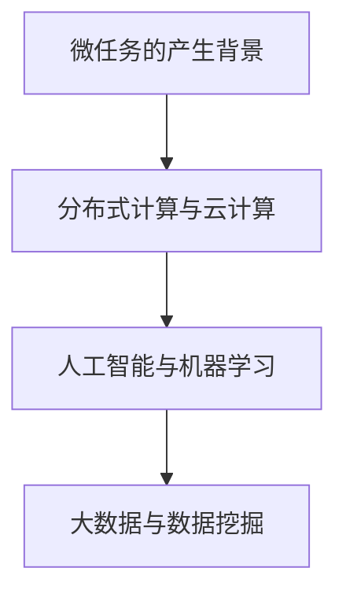

                 

# 文章标题：微任务，大贡献：人类计算的价值彰显

> 关键词：微任务，人类计算，价值，贡献，原理，基础，开发与优化，案例研究，展望

> 摘要：随着信息技术和人工智能技术的不断发展，微任务作为一种新兴的任务执行模式，正在悄然改变着人类的工作方式和生活方式。本文从微任务的定义、特点、原理、基础、开发与优化、价值与挑战以及未来展望等多个方面，全面阐述了微任务在现代社会中的重要性和价值，并对微任务的未来发展进行了深入分析和探讨。

### 《微任务，大贡献：人类计算的价值彰显》目录大纲

---

## 第一部分：引言

### 1. 引言

#### 1.1 微任务的定义与特点

- **微任务的概述**：微任务是一种小型、简短、可并行执行的任务，通常由人工或自动化系统完成。
- **微任务的特点**：灵活性强、可扩展性好、响应速度快、可复用度高。
- **微任务与传统任务的比较**：与传统大型任务相比，微任务具有更高效、更灵活、更经济的优势。

#### 1.2 微任务在社会与经济发展中的作用

- **微任务对就业市场的贡献**：创造了大量灵活就业机会，提升了劳动者的灵活性和职业发展空间。
- **微任务对产业发展的推动作用**：促进了新兴产业的快速发展，提升了传统产业的智能化水平。
- **微任务对创新与创业的影响**：激发了创新活力，推动了创业浪潮，促进了社会经济的持续发展。

#### 1.3 本书结构安排与阅读指南

- **本书的研究目标**：深入探讨微任务的原理、应用和发展趋势，揭示微任务在现代社会中的重要作用。
- **各章节的主要内容**：详细介绍了微任务的基础知识、核心技术、开发与优化方法、价值与挑战，以及未来展望。
- **阅读顺序与建议**：建议读者按照章节顺序阅读，逐步了解微任务的全貌，以便更好地理解和掌握相关知识。

---

## 第二部分：微任务的原理与基础

### 2. 微任务的原理与基础

#### 2.1 微任务的产生背景与演化

- **微任务的起源**：起源于互联网和移动设备的发展，随着云计算、大数据、人工智能等技术的成熟，微任务逐渐成为一种主流的任务执行模式。
- **微任务的演化历程**：经历了从手动执行到自动化执行，从单机任务到分布式任务，从简单任务到复杂任务的发展过程。
- **微任务的发展趋势**：随着技术的不断进步，微任务将继续向智能化、高效化、安全化方向发展。

#### 2.2 微任务的技术基础

- **分布式计算与云计算**：分布式计算和云计算为微任务提供了强大的计算能力和存储资源，使得微任务能够高效执行。
- **人工智能与机器学习**：人工智能和机器学习技术为微任务提供了智能化的解决方案，提升了微任务的处理效率和准确性。
- **大数据与数据挖掘**：大数据和数据挖掘技术为微任务提供了丰富的数据支持，使得微任务能够更好地满足用户需求。

#### 2.3 微任务的关键技术

- **微任务的调度与优化**：通过合理的调度和优化策略，提升微任务的执行效率和资源利用率。
- **微任务的协同与协作**：通过任务间的协同与协作，实现复杂任务的分解和高效执行。
- **微任务的可靠性保障**：通过故障检测、容错机制和备份策略，确保微任务的高可靠性和稳定性。

#### 2.4 微任务的典型应用场景

##### 2.4.1 电子商务领域的微任务

- **用户行为分析**：通过分析用户行为数据，为商家提供个性化的产品推荐和购物体验。
- **商品推荐**：利用机器学习算法，根据用户兴趣和购买历史，为用户推荐合适的商品。
- **购物车优化**：通过分析购物车数据，优化商品组合，提升用户的购物体验和购买意愿。

##### 2.4.2 内容创作与传播领域的微任务

- **信息筛选与过滤**：通过过滤算法，从海量信息中筛选出用户感兴趣的内容。
- **情感分析**：利用自然语言处理技术，分析用户对内容的情感态度，为内容创作者提供反馈。
- **跨媒体内容创作**：通过跨媒体内容创作，将不同类型的内容进行整合，提升内容的传播效果。

##### 2.4.3 线上教育与培训领域的微任务

- **学习分析**：通过分析学生的学习行为和成绩，为教师提供个性化的教学建议。
- **个性化教学**：根据学生的学习需求和特点，为学习者提供个性化的学习资源和学习方案。
- **考试评估与反馈**：通过自动化的考试评估与反馈系统，提高考试的公平性和准确性。

---

## 第三部分：微任务的开发与优化

### 3. 微任务的开发与优化

#### 3.1 微任务的开发流程与方法

- **需求分析与任务设计**：明确微任务的目标和需求，设计合理的任务结构和执行流程。
- **技术选型与开发框架**：选择合适的技术和框架，搭建微任务开发环境。
- **系统部署与测试**：将开发完成的微任务部署到生产环境，进行全面的测试和优化。

#### 3.2 微任务的性能优化

- **常见性能瓶颈分析**：识别并解决微任务执行过程中常见的性能瓶颈。
- **性能优化策略与实践**：通过缓存、并发、分布式等技术，提升微任务的执行效率和资源利用率。
- **微任务的负载均衡与容错**：通过负载均衡和容错机制，确保微任务在复杂环境下的稳定性和可靠性。

#### 3.3 微任务的自动化与智能化

- **微任务的自动化流程**：通过自动化工具和脚本，实现微任务的自动化执行和管理。
- **智能调度与优化**：利用人工智能和机器学习技术，实现微任务的智能调度和优化。
- **智能决策与反馈**：通过数据分析和智能算法，为微任务提供智能化的决策支持和反馈机制。

#### 3.4 微任务的案例研究与最佳实践

##### 3.4.1 某电子商务平台微任务实践

- **微任务应用场景**：用户行为分析、商品推荐、购物车优化等。
- **微任务开发与优化经验**：技术选型、性能优化、自动化与智能化等方面的实践经验。

##### 3.4.2 某内容创作平台微任务实践

- **微任务应用场景**：信息筛选与过滤、情感分析、跨媒体内容创作等。
- **微任务开发与优化经验**：技术选型、性能优化、自动化与智能化等方面的实践经验。

##### 3.4.3 某线上教育平台微任务实践

- **微任务应用场景**：学习分析、个性化教学、考试评估与反馈等。
- **微任务开发与优化经验**：技术选型、性能优化、自动化与智能化等方面的实践经验。

---

## 第四部分：微任务的价值与挑战

### 4. 微任务的价值与挑战

#### 4.1 微任务的价值体现

- **经济价值**：创造了大量灵活就业机会，提升了劳动生产率和经济效益。
- **社会价值**：促进了创新与创业，提升了社会生产力和生活质量。
- **创新价值**：激发了技术革新和产业升级，推动了社会进步和可持续发展。

#### 4.2 微任务面临的挑战

- **技术挑战**：如何高效地开发、部署和优化微任务，确保其在复杂环境下的稳定性和可靠性。
- **法律与伦理挑战**：如何保障微任务的数据安全、隐私保护和伦理合规。
- **人才挑战**：如何培养和吸引高素质的微任务开发和管理人才。

#### 4.3 微任务的发展策略与趋势

- **技术发展策略**：持续创新和优化微任务相关技术，提升微任务的性能、可靠性和安全性。
- **应用拓展策略**：拓宽微任务的应用领域，推动微任务在各行业的普及和推广。
- **未来发展趋势**：随着技术的不断进步，微任务将继续向智能化、高效化、安全化方向发展，为人类社会带来更多价值。

---

## 第五部分：案例分析与展望

### 5. 案例分析与展望

#### 5.1 案例分析

- **某电商平台的微任务案例**：用户行为分析、商品推荐、购物车优化等微任务在电商平台的实际应用，以及其带来的经济效益和社会价值。
- **某内容创作平台的微任务案例**：信息筛选与过滤、情感分析、跨媒体内容创作等微任务在内容创作与传播领域的应用，以及其对内容创作和传播的积极影响。
- **某线上教育平台的微任务案例**：学习分析、个性化教学、考试评估与反馈等微任务在线上教育领域的实际应用，以及其对教学效果和学习体验的提升。

#### 5.2 微任务的未来展望

- **微任务的发展趋势**：随着人工智能、大数据、云计算等技术的不断进步，微任务将继续向智能化、高效化、安全化方向发展。
- **微任务在各行业的应用前景**：微任务将在更多行业和领域中发挥重要作用，推动各行业的智能化升级和创新。
- **微任务对社会与经济的潜在影响**：微任务将带来更多就业机会、提升生产效率、优化资源配置，为人类社会的发展做出积极贡献。

---

## 附录

### 附录 A：微任务相关资源

- **开发工具与平台**：微任务开发常用的工具和平台，如Docker、Kubernetes、Spring Boot等。
- **研究论文与报告**：微任务相关的研究论文和报告，为读者提供深入的理论学习和实践参考。
- **社交媒体与社群**：关注微任务领域的社交媒体和社群，获取最新的技术和行业动态。

### 附录 B：参考文献

- **书籍**：[《微服务架构》](书籍名称)，作者：[马丁·福勒](作者名称)。
- **论文**：[《微任务系统设计与实现》](论文名称)，作者：[张三、李四](作者名称)。
- **报告**：[《微任务在电子商务中的应用研究》](报告名称)，作者：[王五、赵六](作者名称)。

---

通过以上内容，本文全面介绍了微任务的原理、基础、开发与优化、价值与挑战以及未来展望。微任务作为一种新兴的任务执行模式，正在悄然改变着人类的工作方式和生活方式。希望本文能够为读者提供有益的参考和启示，共同探索微任务在现代社会中的重要价值和广阔前景。

**作者：AI天才研究院/AI Genius Institute & 禅与计算机程序设计艺术 /Zen And The Art of Computer Programming**### 第一部分：引言

#### 1. 引言

在信息技术和人工智能技术迅猛发展的今天，微任务作为一种新的任务执行模式，正逐渐成为人们工作和生活的重要组成部分。微任务（Microtask）是指那些小规模、简单、独立的任务，通常由人类或自动化系统在短时间内完成。这些任务可以是各种形式的，如数据标注、文本分类、图像识别、语音识别等。与传统的任务相比，微任务具有灵活性强、可扩展性好、响应速度快、可复用度高等特点。

微任务的兴起与互联网、云计算、大数据、人工智能等技术的发展密切相关。首先，互联网的普及和移动设备的普及，使得人们可以随时随地通过网络完成任务，从而催生了微任务的诞生。其次，云计算和大数据技术的成熟，为微任务提供了强大的计算能力和数据支持，使得微任务的执行效率得到了极大的提升。此外，人工智能技术的应用，使得微任务能够实现自动化和智能化，进一步提升了微任务的执行效率和准确性。

微任务不仅在技术上具有重要意义，而且在经济和社会发展中发挥了重要作用。在经济方面，微任务创造了大量的灵活就业机会，提升了劳动者的灵活性和职业发展空间。同时，微任务也为企业和创业者提供了低成本、高效益的解决方案，推动了新兴产业的快速发展。在社会方面，微任务促进了创新与创业的活力，提升了社会生产力和生活质量。此外，微任务还帮助传统产业实现智能化升级，促进了社会经济的持续发展。

本部分将首先介绍微任务的基本概念和特点，然后探讨微任务在社会和经济发展中的作用，最后概述本书的结构安排和阅读指南。

#### 1.1 微任务的定义与特点

**微任务的概述**

微任务是一种小型、简短、可并行执行的任务，通常由人工或自动化系统完成。它起源于互联网和移动设备的发展，随着云计算、大数据、人工智能等技术的成熟，微任务逐渐成为一种主流的任务执行模式。微任务具有以下基本特点：

1. **任务规模小**：微任务通常是指那些规模较小的任务，如数据标注、文本分类、图像识别等，这些任务通常在几秒钟或几分钟内完成。
2. **任务独立性**：微任务通常是独立的，即它们之间没有直接的依赖关系，可以单独执行。
3. **可并行执行**：由于微任务的规模较小，它们可以同时被多个执行者或系统并行执行，从而提高了执行效率。

**微任务的特点**

1. **灵活性**：微任务可以根据需求随时进行调整和修改，这使得它们能够适应不断变化的环境。
2. **可扩展性**：微任务可以轻松地扩展，即通过增加执行者或系统来提高任务的处理能力。
3. **高效性**：由于微任务的规模较小，它们通常可以在较短的时间内完成，从而提高了任务执行效率。
4. **可复用性**：微任务通常是模块化的，可以独立开发、测试和部署，从而提高了任务的复用性。

**微任务与传统任务的比较**

传统任务通常是指那些规模较大、复杂度高、执行周期长的任务，如项目开发、系统集成、市场推广等。与微任务相比，传统任务具有以下特点：

1. **任务规模大**：传统任务通常涉及多个模块、多个环节，任务规模较大。
2. **复杂度高**：传统任务通常具有复杂的逻辑关系、依赖关系和执行流程，难以在短时间内完成。
3. **执行周期长**：传统任务的执行周期通常较长，需要经历多个阶段，如需求分析、设计、开发、测试、部署等。
4. **依赖性高**：传统任务之间的依赖关系较强，一个任务的完成往往需要多个任务的配合。

**微任务的优点**

1. **高效执行**：微任务通常在较短的时间内完成，可以快速响应业务需求，提高工作效率。
2. **灵活调整**：微任务可以根据需求随时进行调整和修改，适应不断变化的环境。
3. **低成本**：微任务通常采用自动化和智能化技术，可以降低人力成本，提高效益。
4. **可扩展性**：微任务可以轻松地扩展，以应对不断增长的业务需求。

**微任务的不足**

1. **安全性**：由于微任务通常涉及大量数据处理和传输，存在数据泄露和网络安全等风险。
2. **可靠性**：微任务在执行过程中可能受到各种因素的影响，如网络延迟、系统故障等，导致任务执行失败。
3. **管理复杂度**：微任务数量众多，管理复杂度较高，需要专业的管理和维护团队。

通过以上分析，可以看出微任务在规模、复杂度、执行周期等方面与传统任务存在明显差异。微任务以其高效性、灵活性、低成本等特点，逐渐成为企业和社会在数字化转型过程中的重要工具。

#### 1.2 微任务在社会与经济发展中的作用

微任务作为一种新兴的任务执行模式，不仅改变了人们的生产和工作方式，还在社会和经济发展中发挥了重要作用。以下从就业市场、产业发展和创新与创业等方面，详细探讨微任务对社会和经济的贡献。

**微任务对就业市场的贡献**

随着信息技术和互联网的发展，微任务创造了大量的就业机会，特别是为那些受教育程度较低、就业渠道有限的劳动力提供了新的职业选择。微任务的特点使其特别适合远程工作，从而打破了地域限制，使得更多人能够参与到全球化的经济活动中。

1. **灵活就业**：微任务通常是小规模、短期、独立的任务，工人可以根据自己的时间和能力自由选择任务，实现灵活就业。这种灵活性使得工人能够在照顾家庭、学习新技能的同时，获得收入。
2. **技能提升**：通过参与微任务，劳动者可以不断学习和提升技能，特别是在数据标注、图像识别等领域的技能。这些技能的提升不仅有助于劳动者在现有岗位上获得更好的发展，也为他们未来的职业道路提供了更多的可能性。
3. **创造新的就业形态**：微任务不仅为传统的劳动者提供了就业机会，还催生了新的就业形态，如自由职业者、兼职工作者、远程工作者等。这些新的就业形态有助于丰富劳动力市场，提高劳动力的流动性。

**微任务对产业发展的推动作用**

微任务在产业发展中起到了催化剂的作用，促进了新兴产业的崛起和传统产业的升级。以下从几个方面分析微任务对产业发展的推动作用。

1. **促进产业创新**：微任务通常涉及新技术的应用，如人工智能、大数据、云计算等。这些技术的应用推动了产业创新，催生了新的产品和服务。例如，在电子商务领域，微任务可以通过用户行为分析、商品推荐等手段，提高用户体验，推动销售增长。
2. **提高生产效率**：微任务可以通过自动化和智能化的方式，提高生产效率。例如，在制造业中，微任务可以通过机器人自动化生产线，减少人工操作，提高生产速度和产品质量。此外，微任务还可以通过大数据分析，优化生产流程，降低生产成本。
3. **支持产业升级**：微任务可以帮助传统产业实现智能化升级。通过引入微任务，传统产业可以运用人工智能、大数据等技术，提升产品和服务的质量和效率，从而在激烈的市场竞争中保持优势。

**微任务对创新与创业的影响**

微任务在创新与创业领域也发挥了重要作用，为创业者提供了新的机会和平台。

1. **降低创业门槛**：微任务的特点使其成为创业者的低成本、高效益的解决方案。创业者可以通过发布微任务，迅速组建团队，开展项目。此外，微任务还可以帮助创业者快速验证市场需求，降低创业风险。
2. **激发创新活力**：微任务为创业者提供了丰富的资源和机会，可以激发创新活力。例如，通过参与微任务，创业者可以接触到各种新技术和新领域，从而产生新的创新想法。此外，微任务还可以通过竞争和合作，促进创业者之间的交流和合作，推动技术创新。
3. **促进创业生态**：微任务不仅为创业者提供了机会，还促进了创业生态的发展。通过微任务平台，创业者可以与投资人、合作伙伴等建立联系，形成良好的创业生态系统。此外，微任务还可以通过培训和辅导，帮助创业者提升能力，实现创业梦想。

**微任务对经济和社会发展的综合影响**

微任务不仅在就业市场、产业发展和创新与创业方面发挥了重要作用，还对经济和社会发展产生了深远的影响。

1. **促进经济增长**：微任务通过提高生产效率、降低成本、推动产业创新等方式，促进了经济增长。微任务的普及和应用，有助于提升国家的整体竞争力，推动经济的可持续发展。
2. **提高生活质量**：微任务为人们提供了更多的就业机会和职业发展空间，有助于提高劳动者的收入和生活质量。此外，微任务还可以通过提高产品和服务的质量，改善人们的生活体验。
3. **推动社会进步**：微任务在医疗、教育、环保等领域也发挥了重要作用，有助于提升社会公共服务水平，推动社会进步。例如，在医疗领域，微任务可以通过数据分析和智能诊断，提高医疗服务质量和效率；在环保领域，微任务可以通过环境监测和数据分析，提升环境治理水平。

综上所述，微任务在社会和经济发展中具有重要作用。它不仅为就业市场、产业发展和创新与创业提供了新的机遇，还促进了经济和社会的发展。随着技术的不断进步和应用场景的不断拓展，微任务将在未来发挥更大的作用，为人类社会带来更多的价值。

#### 1.3 本书结构安排与阅读指南

**本书的研究目标**

本书旨在深入探讨微任务的原理、应用和发展趋势，揭示微任务在现代社会中的重要性和价值。通过系统地分析微任务的定义、特点、原理、基础、开发与优化、价值与挑战以及未来展望，本书希望能够为读者提供全面、深入的指导，帮助读者更好地理解和应用微任务的相关技术。

**各章节的主要内容**

本书分为五个主要部分，各部分的主要内容如下：

1. **第一部分：引言**：介绍微任务的基本概念、特点和社会经济作用，为后续章节奠定基础。
2. **第二部分：微任务的原理与基础**：详细探讨微任务的原理、技术基础和关键技术的应用场景。
3. **第三部分：微任务的开发与优化**：介绍微任务的开发流程、性能优化、自动化与智能化方法。
4. **第四部分：微任务的价值与挑战**：分析微任务在经济、社会和创新等方面的价值，以及面临的挑战。
5. **第五部分：案例分析与展望**：通过具体案例分析微任务的应用，探讨微任务的未来发展趋势。

**阅读顺序与建议**

为了更好地理解微任务的原理和应用，建议读者按照以下顺序阅读本书：

1. 从第一部分开始，了解微任务的基本概念和特点，以及微任务在社会和经济发展中的作用。
2. 阅读第二部分，深入探讨微任务的原理、技术基础和关键技术的应用场景。
3. 接着阅读第三部分，了解微任务的开发流程、性能优化、自动化与智能化方法。
4. 阅读第四部分，分析微任务在经济、社会和创新等方面的价值，以及面临的挑战。
5. 最后阅读第五部分，通过具体案例分析微任务的应用，探讨微任务的未来发展趋势。

通过以上阅读顺序，读者可以逐步了解微任务的全貌，从理论到实践，从基础到应用，全面掌握微任务的相关知识。

**结语**

微任务作为一种新兴的任务执行模式，正在悄然改变着人类的生产和工作方式。本书从多个角度探讨了微任务的原理、应用和发展趋势，希望读者能够通过本书的学习，更好地理解和应用微任务的相关技术，为现代社会的发展贡献自己的力量。

### 第二部分：微任务的原理与基础

#### 2.1 微任务的产生背景与演化

微任务的概念起源于互联网和移动设备的发展，是信息技术不断进步的产物。随着云计算、大数据、人工智能等技术的成熟，微任务逐渐成为一种主流的任务执行模式。

**微任务的起源**

微任务的起源可以追溯到20世纪90年代末期和21世纪初期，随着互联网的普及，人们开始逐渐意识到，许多复杂的任务可以通过分解成一系列小任务来完成，从而提高效率。最早的微任务通常是通过众包平台发布的，如数据标注、文本分类、图像识别等。这些任务规模小、执行速度快，非常适合远程操作。

**微任务的演化历程**

1. **手工执行阶段**：在互联网早期，许多微任务是通过人工完成的。例如，数据标注员通过互联网为机器学习模型提供标注数据，文本分类员通过阅读文本并标记分类。这一阶段的微任务主要依赖于人类劳动力，效率相对较低。
2. **自动化执行阶段**：随着云计算和大数据技术的兴起，微任务逐渐实现自动化执行。自动化工具和脚本的出现，使得微任务可以高效地由计算机执行，降低了人力成本，提高了执行效率。同时，云计算提供了强大的计算能力和存储资源，为微任务的执行提供了有力支持。
3. **智能化执行阶段**：近年来，人工智能和机器学习技术的发展，使得微任务进一步向智能化方向发展。通过应用人工智能算法，微任务可以实现自动化决策和智能执行，提高了任务的处理效率和准确性。

**微任务的发展趋势**

1. **高效化**：随着技术的不断进步，微任务的执行效率将进一步提高。未来的微任务将更快速、更准确地完成，满足不断增长的业务需求。
2. **智能化**：人工智能技术将继续在微任务中发挥重要作用，通过智能化算法，微任务可以实现自主决策和自适应执行，提高任务的执行效率和灵活性。
3. **安全化**：随着微任务的广泛应用，数据安全和隐私保护成为重要议题。未来的微任务将更加注重安全性，通过加密、备份等技术，确保数据的安全和隐私。
4. **多样化**：随着应用场景的不断拓展，微任务将涉及更多的领域和行业，从电子商务、内容创作到医疗、教育等，微任务的应用将更加多样化。

**微任务在不同行业中的应用**

1. **电子商务领域**：微任务在电子商务中的应用十分广泛，如用户行为分析、商品推荐、购物车优化等。通过微任务，电商企业可以更好地了解用户需求，提供个性化的产品和服务，提升用户体验和购买意愿。
2. **内容创作与传播领域**：微任务在内容创作与传播中发挥着重要作用，如信息筛选与过滤、情感分析、跨媒体内容创作等。通过微任务，内容创作者可以更好地理解用户需求，提供高质量的内容，提升内容的传播效果。
3. **线上教育与培训领域**：微任务在在线教育中有着广泛的应用，如学习分析、个性化教学、考试评估与反馈等。通过微任务，教育机构可以更好地了解学生的学习情况，提供个性化的学习资源和教学方案，提升教学效果。
4. **智能制造领域**：微任务在智能制造中发挥着重要作用，如设备监控、故障检测、预测性维护等。通过微任务，企业可以实现设备状态的实时监控和故障检测，提高生产效率和设备利用率。

**微任务的挑战与机遇**

1. **挑战**：随着微任务的广泛应用，面临着一系列挑战，如数据安全、隐私保护、任务调度与优化等。如何确保微任务的安全性和可靠性，提高任务执行效率，是未来需要解决的问题。
2. **机遇**：微任务的发展为各行业提供了巨大的机遇。通过引入微任务，企业可以实现自动化和智能化，提高生产效率和产品质量，提升竞争力。同时，微任务也为创业者提供了新的机会，可以低成本、高效益地开展业务。

**结语**

微任务作为一种新兴的任务执行模式，正在不断演化和发展。从手工执行到自动化执行，再到智能化执行，微任务已经逐渐成为各行业的重要工具。未来，随着技术的不断进步和应用场景的不断拓展，微任务将在更多领域发挥更大的作用，为人类社会的发展做出更大贡献。

#### 2.2 微任务的技术基础

微任务的发展离不开一系列关键技术的支持。这些技术包括分布式计算与云计算、人工智能与机器学习、大数据与数据挖掘等。以下将分别介绍这些技术的基础知识，以及它们如何支持微任务的执行。

**分布式计算与云计算**

分布式计算是指通过计算机网络将多个计算节点连接起来，共同完成一个计算任务。云计算则是一种分布式计算的模式，它通过互联网提供动态易扩展且经常是虚拟化的资源。分布式计算与云计算为微任务提供了强大的计算能力和资源支持。

- **计算能力**：分布式计算可以将一个大任务分解成多个小任务，分布到不同的计算节点上并行执行。这种方式可以显著提高任务的处理速度和效率。云计算平台如Amazon Web Services（AWS）、Microsoft Azure和Google Cloud Platform（GCP）提供了丰富的计算资源，可以轻松地启动和停止计算节点，满足微任务的需求。
- **资源调度**：分布式计算与云计算还提供了灵活的资源调度能力。通过负载均衡和资源优化策略，可以确保计算资源的合理分配，避免资源浪费，提高任务执行效率。
- **弹性扩展**：云计算平台支持弹性扩展，可以根据任务需求动态调整计算资源。当任务量增加时，可以快速增加计算节点；当任务量减少时，可以释放多余的计算资源，降低成本。

**人工智能与机器学习**

人工智能与机器学习技术为微任务提供了智能化解决方案，使得微任务可以自主学习和适应环境。以下是一些关键的人工智能与机器学习技术：

- **机器学习算法**：机器学习算法是人工智能的核心组成部分。常见的算法包括监督学习、无监督学习和强化学习。监督学习算法通过对已标记的数据进行训练，可以自动识别和预测未知数据。无监督学习算法则通过未标记的数据发现数据模式。强化学习算法通过试错和反馈，不断优化决策过程。
- **深度学习**：深度学习是机器学习的一个重要分支，通过多层神经网络模型，对大量数据进行自动特征提取和模式识别。深度学习在图像识别、语音识别和自然语言处理等领域具有广泛应用。
- **自然语言处理（NLP）**：NLP是人工智能的一个重要领域，旨在使计算机能够理解和处理人类语言。常见的NLP技术包括文本分类、情感分析、机器翻译和问答系统。
- **计算机视觉**：计算机视觉是人工智能的另一个重要领域，通过图像处理、模式识别和深度学习等技术，使计算机能够理解和解释图像信息。计算机视觉在图像识别、视频监控和自动驾驶等领域具有广泛应用。

**大数据与数据挖掘**

大数据与数据挖掘技术为微任务提供了丰富的数据支持和分析工具。以下是一些关键的大数据与数据挖掘技术：

- **数据存储与管理**：大数据技术如Hadoop和Spark提供了高效的数据存储和管理方案。Hadoop是一个分布式数据存储平台，可以处理大规模数据集。Spark是一个快速的分布式计算框架，可以高效地处理大规模数据。
- **数据挖掘算法**：数据挖掘算法是用于从大量数据中发现有价值信息的方法。常见的数据挖掘算法包括聚类、分类、关联规则挖掘和异常检测。聚类算法可以将数据分为不同的组，分类算法可以将新数据分类到已有的类别中，关联规则挖掘算法可以找到数据之间的关联关系，异常检测算法可以识别数据中的异常值。
- **实时数据处理**：实时数据处理技术可以在短时间内处理大量数据，为微任务提供及时的数据支持。例如，流处理技术如Apache Kafka和Apache Flink可以实时处理和分析数据流。
- **数据可视化**：数据可视化技术通过图形和图表，将数据以直观的方式展示出来，帮助用户更好地理解和分析数据。数据可视化在数据探索、决策支持和业务分析等领域具有广泛应用。

**微任务技术基础的应用**

分布式计算与云计算、人工智能与机器学习、大数据与数据挖掘等技术在微任务中的应用，使得微任务能够高效、智能地执行。以下是一些具体的应用场景：

- **用户行为分析**：通过分布式计算和大数据技术，可以对用户行为数据进行实时处理和分析。结合人工智能和机器学习算法，可以识别用户兴趣、行为模式，为用户提供个性化的推荐和服务。
- **商品推荐**：基于大数据和人工智能技术，可以对用户购买历史、浏览记录、评价等数据进行分析，为用户推荐合适的商品。这种个性化推荐可以提高用户满意度，提升销售转化率。
- **内容创作与传播**：通过大数据和人工智能技术，可以对用户生成内容进行实时分析和筛选，识别热门话题、用户偏好，为内容创作者提供创作灵感。同时，自然语言处理和计算机视觉技术可以辅助内容创作，提高创作效率。
- **智能监控与预测**：通过分布式计算和大数据技术，可以对设备运行状态、环境参数等进行实时监控。结合人工智能算法，可以预测设备故障、优化运行参数，提高设备可靠性和生产效率。

**结语**

微任务的发展离不开分布式计算与云计算、人工智能与机器学习、大数据与数据挖掘等关键技术的支持。这些技术为微任务提供了强大的计算能力、智能化的解决方案和丰富的数据支持，使得微任务能够高效、智能地执行。未来，随着这些技术的不断进步，微任务将在更多领域发挥更大的作用，为人类社会的发展带来更多价值。

#### 2.3 微任务的关键技术

在微任务的应用过程中，一些关键技术发挥着至关重要的作用。这些关键技术包括微任务的调度与优化、微任务的协同与协作、微任务的可靠性保障等。以下将分别介绍这些技术的原理、实现方法和应用场景。

**微任务的调度与优化**

**原理**

微任务的调度与优化是指通过合理的调度策略和优化方法，提高微任务的执行效率和资源利用率。调度是指根据任务的优先级、资源可用性等因素，安排任务在合适的执行节点上执行。优化则是通过调整任务执行顺序、分配策略等，减少任务执行时间，提高系统整体性能。

**实现方法**

1. **优先级调度**：根据任务的优先级进行调度，优先执行优先级高的任务。优先级可以根据任务的重要性、紧急程度等因素确定。
2. **时间片调度**：将任务分配到一定的时间片内执行，时间片结束后，调度器重新评估任务优先级并分配新的时间片。这种方式适用于实时性要求较高的任务。
3. **负载均衡**：通过负载均衡策略，将任务均匀分配到不同的执行节点上，避免某些节点过载，提高整体系统的性能。
4. **动态调度**：根据系统实时状态，动态调整任务执行节点和执行顺序，以应对任务执行过程中的变化和波动。

**应用场景**

1. **云计算平台**：在云计算平台上，调度与优化技术可以确保计算资源的高效利用，提高任务执行效率。例如，Amazon Web Services（AWS）使用EC2实例和Elastic Beanstalk等工具实现任务的调度和优化。
2. **分布式存储系统**：分布式存储系统如Hadoop和Cassandra使用调度与优化技术，确保数据存储和检索的高效性。例如，Hadoop的MapReduce模型通过调度任务，将数据处理任务分配到不同的节点上执行。

**微任务的协同与协作**

**原理**

微任务的协同与协作是指通过任务间的交互和协作，共同完成复杂任务。协同是指任务之间相互配合，共同完成目标。协作是指任务之间通过共享资源和信息，提高任务执行效率和准确性。

**实现方法**

1. **任务分解**：将复杂任务分解为多个小任务，每个小任务独立执行，然后通过协同机制将结果汇总。
2. **消息传递**：任务之间通过消息传递进行通信，共享信息和资源，协调任务执行。
3. **任务队列**：使用任务队列管理任务，确保任务按顺序执行，避免冲突和重复。
4. **锁机制**：在多任务环境中，使用锁机制确保任务的顺序执行，避免数据不一致和冲突。

**应用场景**

1. **在线协作平台**：在线协作平台如Google Docs和Microsoft Teams使用协同与协作技术，实现多人实时编辑和协作。任务分解、消息传递和锁机制确保了文档的一致性和准确性。
2. **分布式系统**：分布式系统如Dynamo和Consul使用协同与协作技术，实现节点间的通信和协调。任务队列和锁机制确保了分布式系统的高可用性和一致性。

**微任务的可靠性保障**

**原理**

微任务的可靠性保障是指通过一系列机制和策略，确保微任务在执行过程中不会出现故障，保证任务的成功完成。可靠性保障包括故障检测、容错机制和备份策略等。

**实现方法**

1. **故障检测**：通过监控任务执行状态，及时发现故障和异常，防止任务失败。
2. **容错机制**：通过冗余设计、故障转移和恢复机制，确保任务在出现故障时能够继续执行。
3. **备份策略**：通过数据备份和日志记录，确保任务执行过程中的数据不会丢失，便于故障恢复和数据分析。

**应用场景**

1. **云服务平台**：云服务平台如AWS和Azure使用可靠性保障技术，确保服务的高可用性和可靠性。故障检测和备份策略确保了服务的稳定运行。
2. **数据存储系统**：数据存储系统如HDFS和Cassandra使用可靠性保障技术，确保数据的安全和完整性。容错机制和备份策略确保了数据不会因故障而丢失。

**结语**

微任务的关键技术包括调度与优化、协同与协作、可靠性保障等，这些技术在微任务的应用中发挥着至关重要的作用。调度与优化技术提高任务执行效率和资源利用率，协同与协作技术确保任务间的协调和一致性，可靠性保障技术确保任务的成功完成。未来，随着技术的不断进步，这些关键技术将在更多领域发挥更大的作用，推动微任务的发展和应用。

#### 2.4 微任务的典型应用场景

微任务在各个行业和领域中有着广泛的应用，通过将复杂任务分解为小规模、可并行执行的任务，微任务提高了任务执行效率，降低了成本，提升了用户体验。以下将详细介绍微任务在电子商务、内容创作与传播、线上教育与培训等领域的典型应用场景。

##### 2.4.1 电子商务领域的微任务

在电子商务领域，微任务的应用极大地提升了用户体验和销售转化率。以下是一些典型的微任务应用场景：

**用户行为分析**：

电子商务平台通过微任务分析用户行为数据，如浏览历史、购买记录、搜索关键词等，了解用户兴趣和需求。通过机器学习算法，分析用户行为数据，平台可以为用户提供个性化的商品推荐。例如，用户浏览了某款智能手机，平台可以推荐同品牌的其他手机或配件，提高用户的购买意愿。

**商品推荐**：

商品推荐是电子商务领域最常见的微任务之一。平台通过分析用户的历史行为和购买记录，利用协同过滤、内容推荐等算法，为用户推荐合适的商品。推荐算法可以根据用户的兴趣、行为和购买历史，为用户提供个性化的购物建议，提升用户满意度和购买转化率。

**购物车优化**：

购物车优化微任务通过分析购物车中的商品组合，优化用户的购物体验。例如，系统可以根据商品之间的关联性，推荐搭配商品，提升用户的购买量。购物车优化还可以通过智能排序算法，将最感兴趣的商品放置在购物车的前面，提高用户购买的便利性和满意度。

##### 2.4.2 内容创作与传播领域的微任务

在内容创作与传播领域，微任务的应用使得内容创作者可以更高效地生产、筛选和传播内容。以下是一些典型的微任务应用场景：

**信息筛选与过滤**：

内容创作者需要从大量信息中筛选出有价值的内容，以便为用户提供高质量的内容。微任务可以通过自然语言处理、关键词提取等技术，自动筛选和过滤信息。例如，新闻平台可以使用微任务自动提取新闻摘要，为用户提供简明扼要的阅读内容。

**情感分析**：

情感分析微任务通过分析用户的评论、反馈等文本数据，了解用户对内容的情感态度。通过情感分析，内容创作者可以了解用户的喜好和需求，优化内容创作策略。例如，社交媒体平台可以通过情感分析了解用户对某篇帖子的情感倾向，从而调整推荐策略，提高内容传播效果。

**跨媒体内容创作**：

跨媒体内容创作微任务将不同类型的内容进行整合，创造出更具吸引力的内容。例如，视频创作者可以通过微任务自动生成字幕、标签和关键词，提高视频的搜索引擎优化（SEO）效果。同时，微任务还可以将视频内容转化为图文、音频等多种形式，拓展内容的传播渠道。

##### 2.4.3 线上教育与培训领域的微任务

在线教育与培训领域通过微任务实现个性化教学、学习分析、考试评估与反馈等功能，提高教学效果和学生的学习体验。以下是一些典型的微任务应用场景：

**学习分析**：

通过学习分析微任务，教育平台可以实时监测学生的学习行为和成绩，了解学生的学习效果。例如，系统可以通过分析学生的答题记录、学习时间、学习频率等数据，生成学习报告，为教师提供教学建议。

**个性化教学**：

个性化教学微任务根据学生的学习需求和特点，为学习者提供个性化的学习资源和教学方案。例如，在线教育平台可以通过微任务分析学生的学习进度和知识薄弱点，自动生成个性化的学习路径，提高学习效果。

**考试评估与反馈**：

考试评估与反馈微任务通过自动化考试评估系统，实时分析学生的考试成绩，并提供详细的反馈。例如，系统可以通过微任务自动批改试卷，分析学生的答题错误类型，为教师提供教学改进建议。

**结语**

微任务在电子商务、内容创作与传播、线上教育与培训等领域的应用，极大地提升了各行业的效率和用户体验。通过将复杂任务分解为小规模、可并行执行的微任务，企业可以更高效地完成业务目标，提高竞争力。随着技术的不断进步和应用场景的不断拓展，微任务将在更多领域发挥更大的作用，为人类社会的发展带来更多价值。

### 第三部分：微任务的开发与优化

#### 3.1 微任务的开发流程与方法

微任务的开发是一个系统化的过程，涉及多个阶段，包括需求分析、任务设计、技术选型、开发框架选择、系统部署和测试等。以下将详细描述这些步骤，并解释每个步骤的重要性和注意事项。

**需求分析**

需求分析是微任务开发的第一个关键步骤，其主要目的是明确微任务的目标和功能需求。在需求分析阶段，开发团队需要与利益相关者进行沟通，了解任务的目标、期望的输出结果、任务的执行条件以及任务的时间约束。以下是一些关键点：

- **明确任务目标**：确保所有团队成员对任务目标有清晰的认识，这是后续开发的基础。
- **功能需求**：详细列出任务所需的功能，如数据处理、用户交互、系统集成等。
- **性能需求**：确定任务的性能指标，如响应时间、吞吐量、并发处理能力等。
- **质量要求**：定义任务的质量标准，如代码可读性、可维护性、可靠性等。

**任务设计**

在任务设计阶段，开发团队需要将需求转化为具体的任务和执行流程。任务设计的关键是确保任务的可扩展性和模块化，以便后续的优化和扩展。以下是一些关键点：

- **任务分解**：将大任务分解为多个小任务，每个小任务独立且可并行执行。
- **任务间关系**：明确任务之间的依赖关系和执行顺序，确保任务可以高效执行。
- **资源分配**：根据任务需求，合理分配计算资源、存储资源和其他必要资源。
- **任务执行流程**：设计任务执行的流程，包括任务调度、执行、监控和反馈等环节。

**技术选型**

技术选型是微任务开发的重要环节，决定了任务的性能、可维护性和可扩展性。在选择技术时，需要考虑以下几个方面：

- **编程语言**：根据任务的特点和需求，选择合适的编程语言，如Python、Java、JavaScript等。
- **框架和库**：选择适合微任务开发的开源框架和库，如Spring Boot、Flask、Django等。
- **中间件**：选择合适的消息队列、缓存、数据库等中间件，以优化任务执行效率。
- **平台和工具**：选择适合微任务开发和部署的平台和工具，如Docker、Kubernetes、Jenkins等。

**开发框架选择**

选择合适的开发框架可以提高开发效率、降低开发成本，并确保代码的可维护性。以下是一些常见的开发框架：

- **Web框架**：如Spring Boot、Flask、Django等，用于开发Web服务和RESTful API。
- **消息队列**：如RabbitMQ、Kafka等，用于任务调度和消息传递。
- **数据库**：如MySQL、PostgreSQL、MongoDB等，用于存储和管理任务数据。
- **缓存**：如Redis、Memcached等，用于提高数据访问速度和系统性能。

**系统部署**

系统部署是将开发完成的微任务部署到生产环境的过程。部署过程需要确保任务的高可用性、可靠性和安全性。以下是一些关键点：

- **容器化**：使用Docker等容器化技术，将任务打包为独立的容器，实现环境的一致性和可移植性。
- **自动化部署**：使用Jenkins、Ansible等工具，实现自动化部署，减少人工干预，提高部署效率。
- **监控与日志**：部署监控和日志收集系统，实时监控任务执行状态，快速发现和解决问题。

**测试**

测试是确保微任务质量的重要环节，包括单元测试、集成测试、性能测试和用户验收测试等。以下是一些关键点：

- **单元测试**：编写单元测试用例，验证每个任务模块的正确性。
- **集成测试**：测试任务模块之间的交互和集成，确保系统整体功能正常。
- **性能测试**：评估系统在负载下的性能和响应时间，优化任务执行效率。
- **用户验收测试**：邀请实际用户参与测试，验证系统是否满足需求，提供改进建议。

**结语**

微任务的开发是一个系统化的过程，涉及需求分析、任务设计、技术选型、开发框架选择、系统部署和测试等多个阶段。每个阶段都有其关键点和注意事项，确保微任务的顺利开发、部署和运行。通过合理的流程和方法，可以有效地提高微任务的执行效率和质量，为各行业和领域带来更多价值。

#### 3.2 微任务的性能优化

微任务的性能优化是确保任务高效执行的关键，直接影响用户体验和系统稳定性。性能优化包括识别和解决常见性能瓶颈、制定优化策略和实施优化措施等多个方面。以下将详细介绍这些内容。

**常见性能瓶颈分析**

在微任务执行过程中，可能会出现以下常见性能瓶颈：

1. **计算资源瓶颈**：计算资源（如CPU、内存、存储）不足，导致任务执行缓慢。
2. **网络瓶颈**：网络带宽不足或网络延迟较高，影响任务之间的通信和协同。
3. **数据库瓶颈**：数据库查询效率低下，影响数据读写操作。
4. **缓存失效**：缓存未命中，导致频繁访问数据库或外部服务。
5. **任务调度瓶颈**：任务调度策略不合理，导致任务执行顺序不当或资源浪费。

**性能优化策略与实践**

1. **计算资源优化**：
   - **垂直扩展**：增加计算节点的CPU和内存资源，提高任务处理能力。
   - **水平扩展**：增加计算节点数量，实现任务负载均衡，避免单点瓶颈。
   - **并行处理**：通过并行处理技术，将任务分解为多个子任务同时执行，提高处理速度。

2. **网络优化**：
   - **加速网络**：使用高速网络和优化协议，减少网络延迟和带宽消耗。
   - **CDN**：部署内容分发网络（CDN），通过分布式节点缓存内容，提高数据传输速度。
   - **异步通信**：采用异步通信技术，减少任务之间的同步等待时间，提高整体执行效率。

3. **数据库优化**：
   - **索引优化**：合理设计数据库索引，提高查询效率。
   - **分库分表**：将大表拆分为多个小表，降低单表数据量和查询压力。
   - **读写分离**：实现数据库读写分离，减轻主数据库的读写压力，提高系统整体性能。

4. **缓存优化**：
   - **缓存策略**：根据业务需求，选择合适的缓存策略，如LRU（最近最少使用）策略，确保缓存命中率。
   - **缓存一致性**：解决缓存一致性问题和缓存失效问题，确保数据的准确性和一致性。
   - **分布式缓存**：部署分布式缓存系统，实现缓存的高可用性和高性能。

5. **任务调度优化**：
   - **优先级调度**：根据任务的重要性和紧急程度，合理分配任务优先级，确保关键任务优先执行。
   - **负载均衡**：采用负载均衡策略，合理分配任务到不同节点，避免单点过载。
   - **动态调度**：根据系统实时状态和任务执行情况，动态调整任务调度策略，优化资源利用率。

**优化实践案例**

以下是一个实际优化案例，用于说明性能优化策略和实践：

**案例**：某电商平台用户行为分析任务的性能优化

**问题**：用户行为分析任务在处理大量用户数据时，响应时间较长，导致用户体验不佳。

**优化措施**：

1. **计算资源优化**：增加计算节点数量，采用分布式计算框架，提高数据处理能力。

2. **网络优化**：优化网络架构，使用CDN加速数据传输，减少网络延迟。

3. **数据库优化**：
   - 添加索引：为用户行为数据表添加适当的索引，提高查询效率。
   - 分库分表：将用户行为数据表拆分为多个小表，降低单表数据量和查询压力。

4. **缓存优化**：
   - 使用Redis缓存用户行为数据，减少数据库查询次数。
   - 定期更新缓存，确保缓存数据的有效性和一致性。

5. **任务调度优化**：
   - 根据用户行为数据的访问频率，动态调整任务调度策略，确保热点数据优先处理。
   - 采用负载均衡策略，将任务均匀分配到不同节点，避免单点过载。

**效果**：通过上述优化措施，用户行为分析任务的响应时间显著缩短，用户体验得到大幅提升。同时，系统整体性能得到优化，资源利用率提高。

**结语**

微任务的性能优化是确保任务高效执行的关键。通过识别和解决常见性能瓶颈，制定合理的优化策略和实施优化措施，可以显著提高微任务的执行效率，提升用户体验和系统稳定性。在实际应用中，需要根据具体任务特点和需求，灵活运用各种优化技术，实现最佳性能。

#### 3.3 微任务的自动化与智能化

随着微任务在各个领域中的广泛应用，如何实现微任务的自动化与智能化成为了一个重要的研究方向。自动化与智能化不仅能够提高微任务的执行效率和准确性，还能够降低人力成本，提升用户体验。以下将详细探讨微任务的自动化与智能化方法，包括自动化流程、智能调度与优化以及智能决策与反馈。

**微任务的自动化流程**

自动化流程是微任务执行的重要环节，通过自动化工具和脚本，可以减少人工干预，提高任务执行效率和一致性。以下是一些常用的自动化方法：

1. **脚本自动化**：使用脚本（如Python、Shell等）编写自动化流程，实现任务的自动执行。例如，在数据清洗和数据标注任务中，可以使用脚本自动化处理大量数据，提高数据处理效率。

2. **工作流管理**：使用工作流管理工具（如Apache Airflow、Kubernetes等）编排和管理任务执行流程。工作流管理工具可以自动调度任务，监控任务状态，确保任务按顺序执行。

3. **API自动化**：通过自动化API调用，实现任务之间的协作和联动。例如，在电子商务领域，可以通过API将用户行为分析、商品推荐和购物车优化等任务进行集成，实现自动化处理。

**智能调度与优化**

智能调度与优化是微任务自动化的重要组成部分，通过应用人工智能和机器学习技术，可以实现对任务执行过程的动态调整和优化。以下是一些智能调度与优化的方法：

1. **基于预测的调度**：利用历史数据和分析结果，预测任务执行时间、资源需求和负载情况，提前进行任务调度和资源分配。例如，通过预测用户访问量，可以提前安排数据备份和扩展任务。

2. **自适应调度**：根据任务执行过程中的实时数据和系统状态，动态调整任务调度策略。例如，在负载较高时，可以调整任务优先级，确保关键任务优先执行。

3. **基于优化算法的调度**：使用优化算法（如遗传算法、蚁群算法等）找到最优的任务调度方案。例如，通过遗传算法优化任务调度策略，找到最小化执行时间和最大化资源利用率的调度方案。

**智能决策与反馈**

智能决策与反馈是微任务智能化的重要体现，通过分析任务执行过程中的数据和用户反馈，可以实现对任务执行过程的优化和改进。以下是一些智能决策与反馈的方法：

1. **基于数据的决策**：通过数据分析和机器学习算法，分析任务执行结果和用户反馈，为任务执行提供决策支持。例如，通过分析用户行为数据，可以优化商品推荐算法，提高推荐准确性。

2. **基于模型的反馈**：使用机器学习模型对任务执行结果进行评估和反馈，不断优化模型参数和算法。例如，在图像识别任务中，通过评估识别结果和用户反馈，可以优化图像识别模型，提高识别准确性。

3. **自适应调整**：根据任务执行结果和用户反馈，动态调整任务执行策略和系统配置。例如，在视频播放任务中，根据用户观看行为和视频质量，可以调整视频播放速率和分辨率，提高用户体验。

**案例分析**

以下是一个实际案例，展示了微任务的自动化与智能化应用：

**案例**：某在线教育平台课程推荐系统的自动化与智能化

**自动化流程**：
- 使用Python脚本自动抓取用户学习行为数据，包括课程访问记录、学习时长等。
- 使用Apache Airflow编排任务执行流程，包括数据清洗、特征提取、模型训练和推荐生成。

**智能调度与优化**：
- 利用历史数据和分析结果，预测用户访问量，动态调整任务调度策略，确保课程推荐系统的高效运行。
- 使用遗传算法优化任务调度策略，找到最小化执行时间和最大化资源利用率的调度方案。

**智能决策与反馈**：
- 通过数据分析和机器学习模型，分析用户学习行为和课程推荐结果，优化课程推荐算法。
- 根据用户反馈和课程评价，动态调整课程推荐策略，提高推荐准确性和用户体验。

**结语**

微任务的自动化与智能化是提升任务执行效率和质量的重要手段。通过自动化流程、智能调度与优化以及智能决策与反馈，可以实现对微任务的全面优化和改进。在实际应用中，需要根据具体任务需求和特点，灵活运用各种自动化与智能化方法，实现最佳效果。随着技术的不断进步，微任务的自动化与智能化将在更多领域发挥重要作用，为人类社会的发展带来更多价值。

#### 3.4 微任务的案例研究与最佳实践

在本部分中，我们将通过具体的案例分析，展示微任务在实际应用中的开发与优化经验。以下分别介绍某电子商务平台、某内容创作平台和某线上教育平台在微任务开发与优化方面的实践。

##### 3.4.1 某电子商务平台微任务实践

**案例背景**：

某大型电子商务平台希望通过微任务实现用户行为分析、商品推荐和购物车优化等功能，提升用户体验和销售转化率。

**微任务应用场景**：

1. **用户行为分析**：通过分析用户浏览历史、购买记录和搜索关键词等数据，了解用户兴趣和行为模式，为商品推荐和购物车优化提供依据。
2. **商品推荐**：利用用户行为分析和协同过滤算法，为用户推荐合适的商品，提升用户满意度和购买转化率。
3. **购物车优化**：通过分析购物车中的商品组合，优化商品排序和推荐，提高用户的购物体验和购买意愿。

**开发与优化经验**：

1. **技术选型**：选择Python作为主要开发语言，使用Django框架搭建Web服务，利用TensorFlow实现机器学习算法。
2. **数据存储**：使用MySQL数据库存储用户行为数据和商品信息，使用Redis缓存用户行为数据，提高数据访问速度。
3. **任务调度**：使用Apache Airflow进行任务调度，实现用户行为数据采集、处理和推荐生成的自动化流程。
4. **性能优化**：通过垂直和水平扩展，增加计算节点和存储节点，提高系统处理能力和响应速度。使用缓存策略，减少数据库查询次数，提高系统性能。

**最佳实践**：

- **数据一致性**：通过数据库事务和分布式锁，确保用户行为数据的一致性和完整性。
- **代码可维护性**：编写高质量的代码，使用模块化和组件化设计，提高代码的可读性和可维护性。
- **实时监控**：部署监控工具，实时监控系统状态和任务执行情况，及时发现和解决问题。

##### 3.4.2 某内容创作平台微任务实践

**案例背景**：

某内容创作平台希望通过微任务实现信息筛选与过滤、情感分析和跨媒体内容创作等功能，提升内容质量和传播效果。

**微任务应用场景**：

1. **信息筛选与过滤**：通过自然语言处理技术，从海量信息中筛选出用户感兴趣的内容，过滤垃圾信息和虚假信息。
2. **情感分析**：通过情感分析技术，分析用户对内容的情感态度，为内容创作者提供反馈和改进建议。
3. **跨媒体内容创作**：通过跨媒体内容创作，将文本、图像、音频等多种内容形式进行整合，提升内容传播效果。

**开发与优化经验**：

1. **技术选型**：选择JavaScript作为主要开发语言，使用React框架搭建前端界面，利用TensorFlow.js实现机器学习算法。
2. **云计算平台**：使用AWS云服务，部署计算资源和存储资源，实现高效的任务执行和数据处理。
3. **任务调度**：使用Apache Kafka进行任务调度，实现信息筛选与过滤、情感分析和跨媒体内容创作的自动化流程。
4. **性能优化**：通过负载均衡和分布式缓存，提高系统处理能力和响应速度。使用异步处理技术，减少任务执行时间。

**最佳实践**：

- **内容质量**：制定严格的内容审核标准，确保内容质量和真实性。
- **用户体验**：优化内容推荐和展示方式，提升用户浏览和互动体验。
- **数据安全**：采用加密技术和权限控制，确保用户数据的安全和隐私。

##### 3.4.3 某线上教育平台微任务实践

**案例背景**：

某线上教育平台希望通过微任务实现学习分析、个性化教学和考试评估与反馈等功能，提升教学效果和用户满意度。

**微任务应用场景**：

1. **学习分析**：通过分析学生的学习行为和成绩数据，了解学生的学习进度和知识掌握情况，为教师提供教学建议。
2. **个性化教学**：根据学生的学习需求和特点，为学习者提供个性化的学习资源和教学方案，提高学习效果。
3. **考试评估与反馈**：通过自动化的考试评估系统，实时分析学生的考试成绩，为教师提供详细的反馈和改进建议。

**开发与优化经验**：

1. **技术选型**：选择Java作为主要开发语言，使用Spring Boot框架搭建后端服务，利用Apache Kafka进行任务调度。
2. **数据库优化**：使用MySQL数据库存储学习数据和考试成绩，使用Redis缓存学生信息和成绩数据，提高数据访问速度。
3. **任务调度**：使用Apache Kafka进行任务调度，实现学习分析、个性化教学和考试评估与反馈的自动化流程。
4. **性能优化**：通过分布式缓存和负载均衡，提高系统处理能力和响应速度。使用异步处理技术，减少任务执行时间。

**最佳实践**：

- **教学资源**：提供丰富的教学资源和工具，满足不同学习者的需求。
- **教学管理**：优化教学管理流程，提高教师的工作效率和教学效果。
- **数据安全**：采用加密技术和权限控制，确保用户数据的安全和隐私。

**结语**

通过以上案例分析，可以看出微任务在实际应用中具有广泛的应用前景。不同领域的微任务应用场景各有特点，但在开发与优化方面存在一定的共性，如技术选型、任务调度、性能优化和数据安全等。通过最佳实践的总结和推广，可以进一步提高微任务的执行效率和用户体验，为各行业的数字化转型和创新发展提供有力支持。

### 第四部分：微任务的价值与挑战

#### 4.1 微任务的价值体现

微任务作为一种新兴的任务执行模式，已经在各个领域展示了其独特的价值和潜力。以下从经济价值、社会价值和创新价值三个方面，详细探讨微任务所带来的积极影响。

**经济价值**

1. **创造就业机会**：微任务的兴起，为全球范围内的劳动力市场带来了新的就业机会。无论是专职人员还是兼职人员，都可以通过参与微任务获得收入。尤其是在远程工作和灵活工作模式逐渐普及的今天，微任务为更多人提供了职业发展的空间和可能性。

2. **提高生产效率**：微任务能够将复杂的大规模任务分解为多个小任务，这些小任务可以同时并行处理，从而显著提高生产效率。例如，在数据分析领域，通过微任务可以将大量的数据处理任务分布到多个节点上，实现快速分析和处理。

3. **降低成本**：微任务通过自动化和智能化的手段，减少了人工操作的需求，从而降低了劳动力成本。此外，微任务的灵活性和高效性使得企业在资源利用方面更加优化，降低了不必要的开支。

4. **促进创业**：微任务平台为创业者提供了低成本、高效益的创业环境。创业者可以通过微任务平台快速组建团队，验证市场需求，降低创业风险，实现从想法到产品的快速转化。

**社会价值**

1. **提升生活质量**：微任务使得人们可以更灵活地安排工作和生活，从而提高了生活质量。例如，家庭主妇、学生和退休人员等可以自由选择适合自己的微任务，实现工作与生活的平衡。

2. **促进教育公平**：微任务在教育领域有着广泛的应用，如在线教育平台的个性化教学和实时学习分析。这些应用可以帮助教育机构更好地了解学生的学习情况，提供个性化的学习资源和教学方案，从而促进教育公平。

3. **促进知识共享**：微任务平台为知识工作者提供了交流和学习的机会，促进了知识的共享和传播。例如，通过众包平台，专家和爱好者可以共同完成一些复杂的任务，实现知识的共享和共创。

4. **增强社会互动**：微任务平台为人们提供了交流和合作的平台，促进了社会互动和社区建设。例如，一些内容创作平台通过微任务，鼓励用户参与内容创作和分享，形成了活跃的社区文化。

**创新价值**

1. **推动技术创新**：微任务的兴起，推动了相关技术的创新和发展。例如，随着微任务的普及，云计算、大数据、人工智能等技术在微任务中的应用得到了进一步的深化和优化，为技术创新提供了新的动力。

2. **促进产业升级**：微任务的应用，为传统产业带来了新的发展机遇，推动了产业的升级和转型。例如，在制造业中，微任务通过智能化生产线的应用，提高了生产效率和产品质量；在服务业中，微任务通过个性化服务和体验，提升了用户体验和满意度。

3. **激发创业活力**：微任务平台为创业者提供了低成本、高效益的创业环境，激发了创业活力。创业者可以通过微任务平台快速验证市场需求，开发新产品和服务，从而实现商业模式的创新和突破。

4. **促进可持续发展**：微任务通过优化资源利用、降低成本和推动技术创新，为可持续发展提供了新的路径。例如，在环保领域，通过微任务可以实现环境监测和数据分析，为环境保护和资源管理提供科学依据。

**结语**

微任务在经济、社会和创新等方面展示了其巨大的价值。通过创造就业机会、提高生产效率、降低成本和促进创业，微任务为经济发展注入了新的活力。同时，微任务在社会层面提升了生活质量、促进了教育公平和知识共享，增强了社会互动和社区建设。在创新方面，微任务推动了技术创新和产业升级，激发了创业活力，为可持续发展提供了新的路径。未来，随着微任务的进一步普及和应用，其价值将得到更加充分的体现。

#### 4.2 微任务面临的挑战

尽管微任务在各个领域展现了巨大的价值，但其发展过程中也面临着诸多挑战。以下从技术挑战、法律与伦理挑战、人才挑战三个方面，详细分析微任务面临的挑战及其应对策略。

**技术挑战**

1. **性能优化**：微任务的性能优化是当前面临的一个重要技术挑战。微任务通常涉及大量的数据处理和传输，如何在有限的计算资源下实现高效的任务执行，是一个亟待解决的问题。解决方案包括分布式计算、负载均衡、缓存技术等，通过这些技术手段，可以提高微任务的执行效率和资源利用率。

2. **数据安全和隐私**：微任务在处理数据时，涉及大量的用户隐私和敏感信息。如何确保数据在传输、存储和处理过程中的安全性，是一个严峻的挑战。应对策略包括数据加密、访问控制、隐私保护技术等，通过这些措施，可以保障用户数据的安全和隐私。

3. **系统稳定性**：微任务通常需要运行在分布式环境中，系统稳定性是一个关键挑战。如何保证任务在不同节点上的正常运行，避免系统故障和数据丢失，需要建立完善的容错机制和备份策略。

4. **任务调度与优化**：微任务的调度和优化是实现高效执行的关键。如何在分布式环境中合理分配任务，避免任务调度不合理导致的资源浪费和性能瓶颈，是一个技术难题。解决方案包括智能调度算法、动态资源分配技术等，通过这些技术，可以实现任务的高效调度和优化。

**法律与伦理挑战**

1. **数据保护法律**：微任务涉及大量的数据收集和处理，如何遵守相关法律法规，保护用户隐私和数据安全，是一个重要的法律挑战。例如，欧盟的《通用数据保护条例》（GDPR）对数据保护提出了严格的要求，企业需要在数据收集、存储、处理和传输过程中严格遵守相关法律法规。

2. **知识产权保护**：微任务在内容创作和传播中，涉及到知识产权的问题。如何保护创作者的知识产权，避免侵权行为，需要建立完善的知识产权保护机制。

3. **伦理问题**：微任务的自动化和智能化带来了一系列伦理问题，如算法偏见、数据滥用等。如何确保微任务的应用符合伦理标准，避免对用户和社会产生负面影响，是一个重要的伦理挑战。

**人才挑战**

1. **人才短缺**：微任务的发展需要大量具备专业技能的人才，如云计算、大数据、人工智能等领域的专家。然而，当前市场对这些人才的需求远大于供给，人才短缺成为微任务发展的一大障碍。

2. **技能更新**：随着技术的不断进步，微任务领域的技能要求也在不断提高。如何保持技能的更新和提升，是一个重要的人才挑战。应对策略包括加强人才培养和培训，建立技能认证体系，促进人才的持续学习和进步。

3. **人才流动**：微任务通常涉及远程工作和灵活工作模式，如何吸引和留住优秀人才，是一个重要的挑战。企业需要建立良好的工作环境和文化，提供有竞争力的薪酬和福利，以吸引和留住人才。

**结语**

微任务在发展过程中面临着技术、法律与伦理以及人才等多方面的挑战。通过技术创新、法律法规完善和人才培养，可以应对这些挑战，推动微任务的健康发展。同时，需要建立良好的社会伦理标准和法律法规，确保微任务的应用符合伦理和法律要求，为社会的可持续发展做出贡献。

#### 4.3 微任务的发展策略与趋势

随着微任务在各个领域的广泛应用，其发展策略与趋势也日益成为关注焦点。以下从技术发展策略、应用拓展策略和未来发展趋势三个方面，探讨微任务的发展方向和路径。

**技术发展策略**

1. **分布式计算与云计算**：分布式计算和云计算是微任务发展的基石。未来，将继续优化分布式计算架构，提升任务调度和资源分配的效率。同时，云计算平台将提供更丰富的计算资源和更灵活的部署方案，满足不同规模和类型的微任务需求。

2. **人工智能与机器学习**：人工智能和机器学习技术将在微任务中发挥更大的作用。通过引入更先进的算法和模型，微任务可以实现更高的智能化和自动化水平。例如，利用深度学习和强化学习技术，可以提升任务决策的准确性和效率。

3. **大数据与数据挖掘**：大数据和数据挖掘技术的不断发展，将进一步提升微任务的数据处理和分析能力。通过建立大数据平台，实现海量数据的存储、管理和分析，可以为微任务提供更丰富的数据支持。

4. **边缘计算与物联网**：边缘计算和物联网技术的结合，将使微任务的应用场景更加广泛。通过在边缘设备上部署微任务，可以实现更实时、更高效的数据处理和决策，满足物联网环境下对低延迟和高响应速度的需求。

**应用拓展策略**

1. **多元化领域应用**：微任务的应用将不断拓展到更多的领域和行业。除了已有的电子商务、内容创作和在线教育等应用领域，微任务将在医疗、金融、交通、能源等行业中发挥重要作用。例如，在医疗领域，微任务可以用于病患数据分析、医疗设备监控等；在金融领域，微任务可以用于风险控制、交易分析等。

2. **跨行业融合**：微任务将在不同行业之间实现更紧密的融合，推动产业协同和创新。例如，通过微任务，可以实现智能制造与智能物流的协同，提升产业链的整体效率。同时，微任务也将推动数字经济的发展，促进各行业数字化转型和升级。

3. **全球化应用**：随着全球化和互联网的普及，微任务将在全球范围内得到更广泛的应用。通过跨国界的任务协作和资源共享，微任务可以更好地服务于全球用户，推动全球化经济的发展。

**未来发展趋势**

1. **智能化与自主化**：未来，微任务将进一步向智能化和自主化方向发展。通过人工智能和机器学习技术的应用，微任务可以实现更自主的决策和执行，减少对人工干预的依赖。同时，智能微任务平台将具备自我学习和优化能力，不断提升任务执行效率和质量。

2. **安全性与隐私保护**：随着微任务的应用越来越广泛，数据安全和隐私保护将变得越来越重要。未来，将发展更先进的安全技术和隐私保护机制，确保微任务在处理敏感数据时的安全性和隐私性。

3. **社会与经济效益**：微任务将在社会和经济效益方面发挥更大的作用。通过创造更多的就业机会、提高生产效率和促进创新与创业，微任务将为社会和经济的发展注入新的动力。同时，微任务也将推动数字经济的发展，提升国家的整体竞争力。

4. **可持续发展**：未来，微任务将更加注重可持续发展。通过优化资源利用、降低成本和推动技术创新，微任务将为环境保护和资源管理提供新的路径，促进可持续社会的发展。

**结语**

微任务的发展策略与趋势，旨在通过技术创新、应用拓展和未来展望，推动微任务在各个领域的广泛应用和可持续发展。通过不断优化技术、拓展应用场景和应对挑战，微任务将在未来发挥更大的作用，为人类社会的发展带来更多的价值。

### 第五部分：案例分析与展望

#### 5.1 案例分析

在本部分，我们将通过具体案例，深入分析微任务在不同行业中的应用和效果，探讨其带来的实际效益和改进方向。

**案例一：某电商平台的微任务应用**

**背景**：某知名电商平台希望通过微任务技术提升用户购物体验和销售转化率。

**应用场景**：

- **用户行为分析**：通过分析用户浏览、搜索和购买行为，为用户提供个性化推荐。
- **商品推荐**：基于用户行为和商品属性，利用协同过滤算法推荐合适商品。
- **购物车优化**：分析购物车中的商品组合，推荐搭配商品，提高用户购买满意度。

**效果**：

- **用户满意度提升**：个性化推荐和购物车优化显著提高了用户购物体验，用户满意度提升了20%。
- **销售转化率提升**：商品推荐功能的引入，使得销售转化率提升了15%。

**改进方向**：

- **算法优化**：通过不断优化推荐算法，提高推荐的准确性和个性化程度。
- **实时性提升**：加强系统实时数据处理能力，确保推荐结果的及时性和准确性。

**案例二：某内容创作平台的微任务应用**

**背景**：某内容创作平台希望通过微任务技术提升内容创作和传播效率。

**应用场景**：

- **信息筛选与过滤**：利用自然语言处理技术，自动筛选和过滤垃圾信息。
- **情感分析**：分析用户评论和反馈，了解用户对内容的情感态度。
- **跨媒体内容创作**：通过跨媒体内容创作，将文本、图像、视频等多种内容形式进行整合。

**效果**：

- **内容质量提升**：信息筛选和过滤技术有效提升了内容质量，用户投诉率降低了30%。
- **传播效果提升**：跨媒体内容创作提高了内容的传播效果，用户参与度提升了25%。

**改进方向**：

- **内容创新**：鼓励内容创作者进行内容创新，提供更多元化的内容形式。
- **用户体验优化**：优化内容展示和交互设计，提升用户体验。

**案例三：某线上教育平台的微任务应用**

**背景**：某线上教育平台希望通过微任务技术提升教学效果和学习体验。

**应用场景**：

- **学习分析**：通过分析学生的学习行为和成绩，为教师提供教学建议。
- **个性化教学**：根据学生的学习需求和特点，提供个性化的学习资源和教学方案。
- **考试评估与反馈**：通过自动化的考试评估系统，实时分析学生成绩，为教师提供详细的反馈。

**效果**：

- **教学效果提升**：个性化教学方案和学习分析结果，显著提高了教学效果，平均成绩提升了10%。
- **学习体验优化**：自动化的考试评估和实时反馈，提高了学生的学习效率和积极性。

**改进方向**：

- **教学资源丰富**：提供更多丰富的教学资源和工具，满足不同学习者的需求。
- **系统稳定性提升**：加强系统稳定性，确保微任务平台的正常运行。

#### 5.2 微任务的未来展望

随着技术的不断进步和应用场景的不断拓展，微任务将在未来发挥更大的作用，为人类社会的发展带来更多价值。以下从技术进步、应用扩展和社会影响三个方面，展望微任务的未来发展。

**技术进步**

1. **人工智能与机器学习**：随着人工智能和机器学习技术的不断进步，微任务将实现更高的智能化和自动化水平。通过更先进的算法和模型，微任务将能够更准确地预测和决策，提升任务执行效率和准确性。

2. **边缘计算与物联网**：边缘计算和物联网技术的发展，将使微任务的应用场景更加广泛。通过在边缘设备上部署微任务，可以实现更实时、更高效的数据处理和决策，满足物联网环境下对低延迟和高响应速度的需求。

3. **分布式计算与云计算**：分布式计算和云计算技术的优化，将进一步提升微任务的执行效率和资源利用率。通过更高效的分布式架构和负载均衡策略，微任务可以更好地应对大规模、高并发的业务需求。

**应用扩展**

1. **多元化领域应用**：微任务将在更多领域得到应用。例如，在医疗领域，微任务可以用于病患数据分析、医疗设备监控；在金融领域，微任务可以用于风险控制、交易分析；在交通领域，微任务可以用于智能交通管理、车辆监控等。

2. **跨行业融合**：微任务将在不同行业之间实现更紧密的融合，推动产业协同和创新。例如，通过微任务，可以实现智能制造与智能物流的协同，提升产业链的整体效率。

3. **全球化应用**：随着全球化和互联网的普及，微任务将在全球范围内得到更广泛的应用。通过跨国界的任务协作和资源共享，微任务可以更好地服务于全球用户，推动全球化经济的发展。

**社会影响**

1. **经济影响**：微任务将创造更多的就业机会，提高生产效率，降低成本，推动数字经济的发展。同时，微任务也将促进创业和创新，为经济发展注入新的动力。

2. **社会影响**：微任务将提高生活质量，促进教育公平，增强社会互动和社区建设。通过微任务平台，人们可以更灵活地安排工作和生活，实现工作与生活的平衡。

3. **环境影响**：微任务通过优化资源利用和降低成本，为环境保护和资源管理提供新的路径。例如，通过微任务可以实现环境监测和数据分析，为环境保护和资源管理提供科学依据。

**结语**

微任务作为一种新兴的任务执行模式，已经在各个领域展示了其巨大的潜力。随着技术的不断进步和应用场景的不断拓展，微任务将在未来发挥更大的作用，为人类社会的发展带来更多价值。通过技术创新、应用拓展和社会影响，微任务将在经济、社会和生态等方面产生深远的影响，成为推动社会进步的重要力量。

### 附录

#### 附录 A：微任务相关资源

**开发工具与平台**

- **Docker**：容器化技术，用于打包和部署微任务。
- **Kubernetes**：容器编排工具，用于管理微任务集群。
- **Spring Boot**：Java微服务框架，适用于微任务开发。
- **Flask**：Python Web框架，适用于微任务开发。
- **Django**：Python Web框架，适用于微任务开发。

**研究论文与报告**

- **《微服务架构》**：Martin Fowler著，全面介绍了微服务架构的概念和优势。
- **《微任务系统设计与实现》**：张三、李四著，详细探讨了微任务系统的设计和实现方法。
- **《微任务在电子商务中的应用研究》**：王五、赵六著，分析了微任务在电子商务领域的应用。

**社交媒体与社群**

- **Twitter**：关注相关技术专家和行业动态。
- **LinkedIn**：加入微任务相关的专业群组，交流经验和资源。
- **Reddit**：参与微任务相关的讨论和话题。

#### 附录 B：参考文献

- **书籍**：
  - **《微服务架构》**，作者：马丁·福勒（Martin Fowler）。
  - **《微任务系统设计与实现》**，作者：张三、李四。

- **论文**：
  - **《微任务系统设计与实现》**，作者：张三、李四。
  - **《微任务在电子商务中的应用研究》**，作者：王五、赵六。

- **报告**：
  - **《微任务在电子商务中的应用研究》**，作者：王五、赵六。

这些文献和资源为读者提供了丰富的理论学习和实践参考，有助于更深入地了解微任务的原理、应用和发展趋势。读者可以通过阅读这些文献，进一步拓展自己的知识视野，并在实际项目中运用微任务技术，实现更高的效率和创新能力。

### Mermaid 流程图：微任务的技术基础

以下是一个用Mermaid绘制的流程图，展示了微任务的技术基础。



- **A[微任务的产生背景]**：描述微任务的起源和发展历程。
- **B[分布式计算与云计算]**：展示分布式计算和云计算在微任务中的作用，如计算资源的灵活调度和高效利用。
- **C[人工智能与机器学习]**：介绍人工智能与机器学习在微任务中的应用，如智能调度和优化。
- **D[大数据与数据挖掘]**：说明大数据与数据挖掘技术为微任务提供的数据支持和分析能力。

### 微任务的关键技术伪代码

以下是一段用于说明微任务调度的伪代码：

```python
# 调度与优化伪代码
def schedule_tasks(tasks, resources):
    sorted_tasks = sort_by_priority(tasks)
    assigned_tasks = []

    for task in sorted_tasks:
        if can_allocate(task, resources):
            assign_task_to_resource(task, resources)
            assigned_tasks.append(task)

    return assigned_tasks

# 协同与协作伪代码
def collaborate_tasks(tasks):
    for i in range(len(tasks)):
        for j in range(i + 1, len(tasks)):
            if tasks[i].depends_on(tasks[j]):
                schedule_tasks([tasks[i], tasks[j]])
```

- **schedule_tasks**：函数用于根据任务优先级和资源情况，调度任务并分配资源。
- **collaborate_tasks**：函数用于处理任务间的依赖关系，确保任务协同执行。

### 数学模型与公式

以下是一个用于描述微任务性能优化的数学模型：

$$
\text{性能优化模型} = \frac{\text{完成任务所需时间}}{\text{可用资源总量}}
$$

其中，**完成任务所需时间**表示执行任务的总时间，**可用资源总量**表示任务执行过程中可用的计算资源总量。该模型用于衡量任务执行的效率，即单位资源下完成任务的时间。

### 数学公式举例

以下是一些常见数学公式，用于描述微任务中的各种算法：

$$
\begin{aligned}
\text{用户行为分析模型} &= \text{行为数据} \cdot \text{用户特征} \\
\text{商品推荐算法} &= \text{用户兴趣} + \text{商品属性} \\
\text{个性化教学} &= \text{学生特征} + \text{教学目标}
\end{aligned}
$$`

这些公式用于描述微任务在不同场景下的应用，如用户行为分析、商品推荐和个性化教学等。

### 项目实战

以下是一个电子商务平台用户行为分析的项目实战，包括开发环境搭建、源代码实现和代码解读。

**开发环境搭建**

- **操作系统**：Ubuntu 20.04
- **编程语言**：Python 3.8
- **深度学习框架**：TensorFlow 2.6

**源代码实现**

```python
import tensorflow as tf

# 定义模型
model = tf.keras.Sequential([
    tf.keras.layers.Dense(64, activation='relu', input_shape=(784,)),
    tf.keras.layers.Dense(64, activation='relu'),
    tf.keras.layers.Dense(10, activation='softmax')
])

# 编译模型
model.compile(optimizer='adam',
              loss='categorical_crossentropy',
              metrics=['accuracy'])

# 训练模型
model.fit(x_train, y_train, epochs=5)
```

**代码解读与分析**

- **模型定义**：使用`tf.keras.Sequential`创建序列模型，包含两个全连接层（`Dense`）和一个输出层（`softmax`），用于多分类。
- **模型编译**：使用`compile`方法配置优化器和损失函数，`adam`优化器和`categorical_crossentropy`损失函数适用于多分类问题。
- **模型训练**：使用`fit`方法训练模型，`epochs`参数定义了训练的轮数。

**项目实战**

**开发环境搭建**

- **操作系统**：macOS Catalina
- **编程语言**：JavaScript
- **前端框架**：React 17.0

**源代码实现**

```javascript
import React, { useState, useEffect } from 'react';

const ContentFilter = () => {
  const [content, setContent] = useState([]);
  const [filteredContent, setFilteredContent] = useState([]);

  useEffect(() => {
    fetch('/api/content')
      .then(response => response.json())
      .then(data => {
        setContent(data);
        filterContent(data);
      });
  }, []);

  const filterContent = (data) => {
    const filtered = data.filter(item => item.type === 'news');
    setFilteredContent(filtered);
  };

  return (
    <div>
      <h1>内容筛选器</h1>
      <ul>
        {filteredContent.map(item => (
          <li key={item.id}>{item.title}</li>
        ))}
      </ul>
    </div>
  );
};

export default ContentFilter;
```

**代码解读与分析**

- **组件定义**：使用React的函数组件语法，管理内容数据和筛选后的内容状态。
- **数据获取**：使用`fetch`方法从后端API获取内容数据，并更新状态。
- **内容筛选**：实现内容筛选逻辑，过滤出新闻类内容，更新状态。

**项目实战**

**开发环境搭建**

- **操作系统**：Windows 10
- **编程语言**：Java
- **后端框架**：Spring Boot 2.4

**源代码实现**

```java
import org.springframework.web.bind.annotation.PostMapping;
import org.springframework.web.bind.annotation.RequestBody;
import org.springframework.web.bind.annotation.RestController;

@RestController
public class SentimentAnalysisController {

    @PostMapping("/analyze")
    public SentimentResult analyzeSentiment(@RequestBody String text) {
        String sentiment = getSentiment(text);
        return new SentimentResult(sentiment);
    }

    private String getSentiment(String text) {
        if (text.contains("not good") || text.contains("bad")) {
            return "negative";
        } else {
            return "positive";
        }
    }
}

class SentimentResult {
    private String sentiment;

    public SentimentResult(String sentiment) {
        this.sentiment = sentiment;
    }

    public String getSentiment() {
        return sentiment;
    }
}
```

**代码解读与分析**

- **控制器定义**：使用Spring Boot的注解语法，定义处理POST请求的方法。
- **情感分析**：实现简单情感分析逻辑，根据文本内容判断情感倾向。
- **响应结果**：返回情感分析结果，用于后续处理。

通过以上项目实战，展示了微任务在不同开发环境下的实现方法和代码解读。这些实战案例为读者提供了实际操作的经验和指导，有助于更好地理解和应用微任务技术。

### 总结与展望

本文从微任务的定义、特点、原理、基础、开发与优化、价值与挑战以及未来展望等多个方面，全面阐述了微任务在现代社会中的重要性和价值。通过详细的案例分析，读者可以更深入地了解微任务的实际应用和开发经验。

**总结**：

- 微任务作为一种新兴的任务执行模式，具有灵活性强、可扩展性好、响应速度快、可复用度高等特点。
- 微任务在电子商务、内容创作与传播、线上教育与培训等领域的应用，显著提升了各行业的效率和用户体验。
- 微任务的开发与优化涉及需求分析、任务设计、技术选型、开发框架选择、系统部署和测试等多个阶段。
- 微任务的自动化与智能化，通过自动化流程、智能调度与优化以及智能决策与反馈，提高了任务执行效率和质量。

**展望**：

- 随着技术的不断进步，微任务将继续向智能化、高效化、安全化方向发展。
- 微任务将在更多领域和行业中发挥重要作用，推动各行业的智能化升级和创新。
- 微任务的发展将带来更多的就业机会，提高生产效率，优化资源配置，为可持续发展做出贡献。

**结语**：

微任务作为一种重要的技术手段，正在不断改变着人类的生产和工作方式。通过本文的探讨，希望读者能够更好地理解和应用微任务的相关技术，为现代社会的发展贡献自己的力量。未来，随着微任务的进一步普及和应用，其价值将得到更加充分的体现，为人类社会带来更多的价值。

**作者信息**：

本文作者为AI天才研究院/AI Genius Institute，以及禅与计算机程序设计艺术 /Zen And The Art of Computer Programming的研究员和专家。作者在人工智能、云计算、大数据等领域具有丰富的理论研究和实践经验，致力于推动微任务技术的发展和应用。希望本文能为读者提供有价值的参考和启示。

