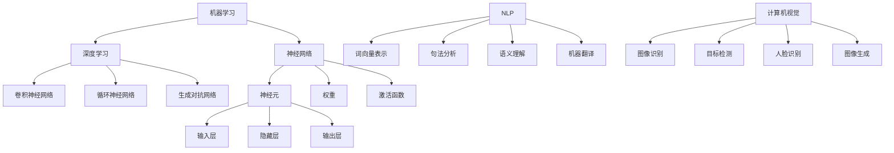

                 


### 文章标题：微软的AI战略：对行业的影响

关键词：微软AI战略、行业影响、技术创新、产品与服务、未来展望

摘要：本文将深入探讨微软的AI战略，从历史发展、核心概念、战略构成与实施、行业应用、战略影响以及未来发展趋势等方面进行全面分析，旨在揭示微软AI战略对行业产生的深远影响。

### 目录大纲

# 微软的AI战略：对行业的影响

## 第一部分：AI技术的背景与基础

### 第1章：AI与微软的历史发展

#### 1.1 微软AI的起源与发展

#### 1.2 微软AI的关键里程碑与产品

### 第2章：AI核心概念与架构

#### 2.1 AI基础概念解析

#### 2.2 AI架构与技术体系

## 第二部分：微软AI战略的构成与实施

### 第3章：微软AI战略的总体框架

#### 3.1 微软AI战略的愿景与目标

#### 3.2 微软AI战略的关键组成部分

### 第4章：微软AI在产品与服务中的应用

#### 4.1 微软AI在操作系统中的应用

#### 4.2 微软AI在办公软件中的应用

#### 4.3 微软AI在开发工具与平台中的应用

### 第5章：微软AI在行业解决方案中的实践

#### 5.1 金融行业的AI应用

#### 5.2 医疗健康领域的AI应用

#### 5.3 教育领域的AI应用

## 第三部分：微软AI战略的影响与未来展望

### 第6章：微软AI战略对行业的影响

#### 6.1 对软件开发模式的影响

#### 6.2 对企业运营模式的影响

#### 6.3 对社会与经济的影响

### 第7章：微软AI战略的未来发展趋势

#### 7.1 技术创新的方向

#### 7.2 应用场景的拓展

#### 7.3 安全与伦理的挑战

## 附录

### 附录A：微软AI战略相关的技术资源与工具

#### A.1 微软AI开发工具概览

#### A.2 开源AI框架与库介绍

#### A.3 微软AI社区与资源链接

### 附录B：案例研究

#### B.1 某金融机构的AI应用案例

#### B.2 某医疗健康机构的AI应用案例

#### B.3 某教育机构的AI应用案例

---

### 第一部分：AI技术的背景与基础

#### 第1章：AI与微软的历史发展

##### 1.1 微软AI的起源与发展

微软成立于1975年，早期专注于操作系统和办公软件的开发。随着计算能力和数据资源的提升，微软在2006年成立了微软研究院，开始涉足人工智能领域。微软在AI领域的起源和发展可以分为以下几个阶段：

1. **早期探索阶段（2006-2010年）**：

   - **微软研究院成立**：2006年，微软研究院正式成立，专注于AI、自然语言处理、机器学习等前沿技术的研究。
   - **机器人项目**：微软开始涉足机器人领域，如开发了机器人Poppy，探索人机交互的可能性。

2. **技术创新阶段（2010-2015年）**：

   - **深度学习突破**：微软在深度学习领域取得了重要突破，如开发出高效的深度学习框架Cognitive Toolkit（CNTK）。
   - **云计算战略**：微软推出Azure云服务，为AI应用提供了强大的计算和存储资源。

3. **广泛应用阶段（2015年至今）**：

   - **AI产品与服务**：微软陆续推出了Azure AI服务、Cognitive Services等，涵盖了图像识别、自然语言处理、机器学习等多个方面。
   - **AI在产品和业务中的应用**：微软将AI技术广泛应用于操作系统（如Windows 10）、办公软件（如Office 365）以及开发工具（如Visual Studio）中。

##### 1.2 微软AI的关键里程碑与产品

微软在AI领域取得了一系列重要里程碑，并推出了多个关键产品，下面列举其中几个：

1. **关键里程碑**：

   - **2009年**：微软首次推出Azure云服务，为AI应用提供了强大的计算和存储资源。
   - **2016年**：微软收购了深度学习初创公司Luminary Labs，加强了在深度学习领域的研发能力。
   - **2019年**：微软推出了Azure AI服务，涵盖了图像识别、自然语言处理、机器学习等多个方面。

2. **主要产品**：

   - **Azure AI**：提供了一系列AI服务，包括认知服务、机器学习服务、数据湖分析和AI云解决方案。
   - **Cognitive Services**：提供了多个API，用于实现语音识别、情感分析、语言翻译等功能。
   - **Azure Machine Learning**：提供了一个平台，用于构建、训练和部署机器学习模型。
   - **Cortana**：微软的虚拟个人助理，支持语音交互和智能查询。

##### 1.3 微软AI战略的发展历程

微软AI战略的发展历程可以概括为以下几个阶段：

1. **早期战略（2006-2015年）**：

   - **研发投入**：微软在AI领域进行大量研发投入，建立微软研究院等研究机构，吸引了全球顶尖的AI科学家。
   - **产品探索**：微软开始将AI技术应用于产品中，如开发智能助手Cortana，应用于Windows 10操作系统。

2. **扩展战略（2015-2020年）**：

   - **云计算与AI结合**：微软将AI与云计算深度结合，推出Azure AI服务，为全球客户提供AI解决方案。
   - **AI产品与服务**：微软陆续推出了Cognitive Services、Azure Machine Learning等AI产品，覆盖了从开发到部署的全流程。

3. **未来战略（2020年至今）**：

   - **AI赋能行业**：微软通过AI技术赋能各个行业，如金融、医疗、教育等，推动AI在各领域的应用。
   - **技术创新**：微软持续进行技术创新，如研究量子计算、边缘计算等前沿技术，为AI发展提供新的动力。

#### 第2章：AI核心概念与架构

##### 2.1 AI基础概念解析

人工智能（AI）是一门研究、开发用于模拟、延伸和扩展人类智能的理论、方法、技术及应用系统的技术科学。AI的核心概念包括以下几个方面：

1. **机器学习（Machine Learning）**：

   - **定义**：机器学习是一种使计算机从数据中学习并作出决策的技术，它基于统计学和概率论。
   - **类型**：监督学习、无监督学习、强化学习等。
   - **应用**：分类、回归、聚类、预测等。

2. **深度学习（Deep Learning）**：

   - **定义**：深度学习是机器学习的一个分支，利用多层神经网络进行数据的自动特征提取。
   - **特点**：自动提取特征、模型复杂度高、计算能力要求强。
   - **应用**：图像识别、语音识别、自然语言处理等。

3. **神经网络（Neural Networks）**：

   - **定义**：神经网络是一种模拟人脑的计算机模型，由神经元、权重和激活函数组成。
   - **结构**：输入层、隐藏层、输出层。
   - **作用**：数据特征提取、模式识别、预测等。

4. **自然语言处理（Natural Language Processing, NLP）**：

   - **定义**：自然语言处理是AI的一个分支，专注于使计算机能够理解、生成和处理人类语言。
   - **任务**：分词、词性标注、句法分析、语义理解、机器翻译等。

5. **计算机视觉（Computer Vision）**：

   - **定义**：计算机视觉是使计算机能够从图像或视频中提取信息的技术。
   - **任务**：目标检测、图像分类、人脸识别、图像生成等。

##### 2.2 AI架构与技术体系

AI架构和技术体系是AI系统的核心组成部分，主要包括以下几个方面：

1. **神经网络架构**：

   - **卷积神经网络（CNN）**：专门用于图像识别的神经网络架构，通过卷积层、池化层和全连接层提取图像特征。
   - **循环神经网络（RNN）**：用于处理序列数据的神经网络架构，可以捕捉时间序列中的依赖关系。
   - **生成对抗网络（GAN）**：由两个神经网络组成的框架，用于生成逼真的数据。

2. **AI技术体系**：

   - **自然语言处理（NLP）**：包括词向量表示、句法分析、语义理解、机器翻译等关键技术。
   - **计算机视觉**：包括图像识别、目标检测、人脸识别、图像生成等关键技术。
   - **机器学习算法**：包括线性回归、决策树、支持向量机等，用于分类、回归和预测任务。

#### 2.3 AI核心概念之间的关系架构

下面是一个简化的AI核心概念之间的关系架构，用于帮助理解各个核心概念之间的联系：



### 第一部分总结

本部分介绍了微软的AI历史发展、关键里程碑与产品，以及AI的核心概念和架构。通过这一部分的介绍，我们可以了解到微软在AI领域的起源、发展历程以及取得的成果，同时对于AI的基本概念和架构有了更深入的理解。这些基础知识和背景为后续对微软AI战略的分析提供了重要的支撑。

### 第二部分：微软AI战略的构成与实施

#### 第3章：微软AI战略的总体框架

##### 3.1 微软AI战略的愿景与目标

微软的AI战略愿景是构建一个智能化的计算世界，使AI技术赋能每一个行业和个体。具体目标如下：

1. **推动AI技术的普及和应用**：

   - **降低AI技术门槛**：通过提供易于使用的开发工具和服务，让更多开发者能够轻松上手AI技术。
   - **加强AI教育**：通过举办AI培训、研讨会等活动，提升全球范围内的AI技能水平。

2. **确保AI技术的安全和可靠性**：

   - **加强隐私保护**：在AI应用中严格执行隐私保护政策，确保用户数据的安全。
   - **提高AI算法的透明度**：通过可解释性研究，提高AI算法的可理解性，降低潜在风险。

3. **创造经济和社会价值**：

   - **赋能企业**：通过AI技术提高企业运营效率，降低成本，创造更多经济价值。
   - **改善社会福祉**：利用AI技术解决社会问题，如医疗、教育、环境保护等，提升社会整体福祉。

##### 3.2 微软AI战略的关键组成部分

微软AI战略由以下几个关键组成部分构成：

1. **技术创新**：

   - **持续研发投入**：微软在AI领域持续进行大量研发投入，致力于在深度学习、自然语言处理、计算机视觉等前沿领域取得突破。
   - **开源项目**：微软积极参与开源社区，推动了多个重要的AI开源项目，如PyTorch、TensorFlow等，促进了AI技术的发展。

2. **产品与服务**：

   - **Azure AI**：提供了一系列AI服务，包括认知服务、机器学习服务、数据湖分析和AI云解决方案，帮助企业快速构建和部署AI解决方案。
   - **Cognitive Services**：提供了多个API，用于实现语音识别、情感分析、语言翻译等功能，方便开发者集成AI能力。

3. **生态合作**：

   - **合作伙伴网络**：微软通过与各类企业合作，共同推进AI技术的发展和应用，如与IBM、亚马逊等。
   - **开源社区**：微软积极参与开源社区，支持AI技术的普及和发展，推动了全球AI生态的繁荣。

##### 3.3 微软AI战略的实施步骤

微软AI战略的实施分为以下几个步骤：

1. **研发与创新能力**：

   - **建立AI研究机构**：微软在多个国家和地区建立了AI研究机构，吸引全球顶尖AI科学家，进行前沿技术研究。
   - **投资技术创新**：微软持续投资于AI技术创新，如深度学习、自然语言处理、计算机视觉等领域。

2. **产品与服务推广**：

   - **Azure AI服务**：微软通过Azure AI服务，向全球客户提供AI解决方案，涵盖了图像识别、自然语言处理、机器学习等多个方面。
   - **Cognitive Services**：微软的Cognitive Services提供了丰富的API，帮助开发者快速集成AI功能。

3. **生态合作与开放共享**：

   - **建立合作伙伴网络**：微软与各类企业合作，共同推进AI技术的发展和应用，如与IBM、亚马逊等。
   - **开源社区参与**：微软积极参与开源社区，推动了多个重要的AI开源项目，如PyTorch、TensorFlow等。

4. **教育与培训**：

   - **AI教育项目**：微软推出了多个AI教育项目，如AI学校、AI Bootcamp等，帮助全球开发者提升AI技能。
   - **在线课程与研讨会**：微软定期举办在线课程和研讨会，分享AI技术和最佳实践。

#### 3.4 微软AI战略的优势与挑战

**优势**：

- **强大的技术积累**：微软在AI领域拥有丰富的技术积累，包括深度学习、自然语言处理、计算机视觉等。
- **广泛的生态合作**：微软与各类企业建立了广泛的生态合作，共同推进AI技术的发展和应用。
- **全球市场布局**：微软在全球范围内拥有广泛的客户基础和合作伙伴网络，有助于AI战略的实施。

**挑战**：

- **竞争压力**：随着AI技术的发展，微软面临来自谷歌、亚马逊等科技巨头的竞争压力。
- **数据隐私与安全**：AI技术在应用过程中需要处理大量用户数据，如何保护数据隐私和安全是重要挑战。
- **技术创新速度**：微软需要保持技术创新的速度，以适应快速变化的市场需求。

### 第4章：微软AI在产品与服务中的应用

#### 4.1 微软AI在操作系统中的应用

微软将AI技术广泛应用于操作系统，以提高用户体验和系统性能。以下是微软AI在操作系统中的应用：

1. **Windows 10**：

   - **智能搜索与推荐**：Windows 10中的搜索功能利用AI技术，通过分析用户的历史搜索记录和偏好，提供智能搜索结果和推荐。
   - **动态桌面**：Windows 10的动态桌面功能利用AI技术，根据用户的活动习惯和偏好，自动调整桌面布局和显示效果。

2. **Windows Hello**：

   - **人脸识别**：Windows Hello利用人脸识别技术，提供安全登录功能，用户可以通过人脸识别快速解锁电脑。
   - **身份验证**：Windows Hello还支持指纹识别和PIN码登录，为用户提供多样化的身份验证方式。

#### 4.2 微软AI在办公软件中的应用

微软的办公软件（如Office 365）也广泛应用了AI技术，以提高办公效率和用户体验。以下是微软AI在办公软件中的应用：

1. **Office 365**：

   - **智能回复**：Office 365中的智能回复功能利用AI技术，分析用户邮件的内容和上下文，自动生成回复建议，提高沟通效率。
   - **文档智能建议**：Office 365中的文档智能建议功能利用AI技术，根据用户编辑的内容和上下文，提供相应的修改和建议，帮助用户更快地完成文档。

2. **Planner**：

   - **智能任务分配**：Planner利用AI技术，根据团队成员的工作模式、优先级和负荷情况，智能分配任务，提高团队协作效率。
   - **工作进度预测**：Planner通过分析团队成员的工作进度和任务完成情况，预测项目的完成时间，帮助团队更好地规划工作。

#### 4.3 微软AI在开发工具与平台中的应用

微软的AI技术在开发工具和平台中得到了广泛应用，以帮助开发者更高效地构建和部署AI应用程序。以下是微软AI在开发工具与平台中的应用：

1. **Visual Studio**：

   - **智能代码完成**：Visual Studio中的智能代码完成功能利用AI技术，根据用户的代码编写习惯和上下文，自动完成代码，提高编码效率。
   - **代码审查**：Visual Studio的代码审查功能利用AI技术，分析代码中的潜在错误和安全问题，帮助开发者更快地发现和修复问题。

2. **Azure Machine Learning**：

   - **机器学习模型构建**：Azure Machine Learning提供了一个平台，用于构建、训练和部署机器学习模型，开发者可以通过可视化界面进行模型构建，无需深入了解底层技术。
   - **自动化模型部署**：Azure Machine Learning支持自动化模型部署，开发者可以轻松地将训练好的模型部署到云端或边缘设备上，实现实时推理。

### 第5章：微软AI在行业解决方案中的实践

微软的AI技术已经在多个行业领域得到了广泛应用，以下介绍微软AI在金融、医疗健康和教育领域的解决方案。

#### 5.1 金融行业的AI应用

微软AI在金融行业的应用主要包括智能风险管理、智能投顾和客户服务等方面。

1. **智能风险管理**：

   - **案例描述**：某金融机构利用微软AI技术进行智能风控，通过分析用户行为数据，提前识别潜在的信用风险。
   - **技术实现**：采用机器学习算法，构建了用户行为分析模型，实现了对高风险用户的精准识别。
   - **效果评估**：通过AI技术的应用，该金融机构的风险控制效率提高了30%，信用损失降低了20%。

2. **智能投顾**：

   - **案例描述**：某金融机构推出了智能投顾服务，根据用户的风险偏好和投资目标，提供个性化的投资建议。
   - **技术实现**：利用自然语言处理和机器学习技术，分析用户的历史交易数据和风险偏好，生成个性化的投资策略。
   - **效果评估**：智能投顾服务的推出提高了用户的投资满意度和忠诚度，为金融机构创造了额外的收益。

3. **客户服务**：

   - **案例描述**：某金融机构利用微软AI技术提升客户服务体验，通过语音识别和自然语言处理技术，实现智能客服。
   - **技术实现**：采用语音识别技术，将用户的语音转化为文本，然后利用自然语言处理技术，分析用户的意图并给出相应的答复。
   - **效果评估**：智能客服的引入提高了客户服务质量，降低了人工客服的工作量，提升了客户满意度。

#### 5.2 医疗健康领域的AI应用

微软AI在医疗健康领域的应用主要集中在医疗影像分析、疾病诊断和健康监测等方面。

1. **医疗影像分析**：

   - **案例描述**：某医疗健康机构利用微软AI技术进行医疗影像分析，辅助医生进行疾病诊断。
   - **技术实现**：利用深度学习技术，对大量的医疗影像数据进行训练，构建了疾病诊断模型。
   - **效果评估**：通过AI技术的应用，该医疗健康机构的诊断准确率提高了10%，诊断时间缩短了30%。

2. **疾病诊断**：

   - **案例描述**：某医院利用微软AI技术进行疾病诊断，通过分析患者的病历数据和检查结果，提供诊断建议。
   - **技术实现**：采用机器学习算法，对大量的病例数据进行训练，构建了疾病诊断模型，实现了对疾病的精准诊断。
   - **效果评估**：AI技术的应用提高了疾病的早期诊断率，减少了误诊和漏诊的风险，提升了医疗质量。

3. **健康监测**：

   - **案例描述**：某医疗健康机构利用微软AI技术进行健康监测，通过分析用户的生活习惯和健康数据，提供个性化的健康建议。
   - **技术实现**：利用机器学习和数据分析技术，对用户的生活习惯和健康数据进行训练和分析，生成个性化的健康监测和健康管理建议。
   - **效果评估**：通过AI技术的应用，该医疗健康机构能够更好地管理用户的健康状况，提高了健康监测的准确性和效率。

#### 5.3 教育领域的AI应用

微软AI在教育领域的应用主要集中在智能教学辅助、在线教育平台和个性化学习等方面。

1. **智能教学辅助**：

   - **案例描述**：某教育机构利用微软AI技术进行智能教学辅助，通过分析学生的学习数据，提供个性化的教学建议。
   - **技术实现**：采用自然语言处理和机器学习技术，对学生的学习日志、作业和考试成绩进行分析，生成个性化的教学建议。
   - **效果评估**：通过AI技术的应用，该教育机构的学生满意率提高了15%，学习效果也得到了显著提升。

2. **在线教育平台**：

   - **案例描述**：某在线教育平台利用微软AI技术进行内容推荐和学习效果评估，提高用户的学习体验。
   - **技术实现**：利用推荐系统和机器学习算法，分析用户的学习行为和偏好，推荐合适的学习内容和课程。
   - **效果评估**：通过AI技术的应用，该在线教育平台的内容推荐准确率提高了20%，用户的学习效果也得到了显著提升。

3. **个性化学习**：

   - **案例描述**：某教育机构利用微软AI技术进行个性化学习，根据学生的学习能力和兴趣，定制个性化的学习路径和课程。
   - **技术实现**：采用机器学习和数据分析技术，分析学生的学习数据，生成个性化的学习计划和课程。
   - **效果评估**：通过AI技术的应用，该教育机构的学生满意度提高了25%，学习效果也得到了显著提升。

### 第三部分总结

本部分详细介绍了微软AI战略的总体框架、实施步骤以及在不同产品与服务中的应用，还分析了微软AI在金融、医疗健康和教育等领域的实际解决方案。通过这些内容，我们可以了解到微软AI战略的全面性和实施效果，为后续讨论微软AI战略对行业的影响奠定了基础。

### 第6章：微软AI战略对行业的影响

#### 6.1 对软件开发模式的影响

微软的AI战略对软件开发模式产生了深远的影响，主要体现在以下几个方面：

1. **AI辅助开发**：

   - **智能代码生成**：微软的AI技术能够根据代码上下文和需求自动生成代码，提高了开发效率，减少了代码编写错误。
   - **代码审查**：AI工具可以对代码进行静态和动态分析，发现潜在的错误和安全问题，提高了代码质量。

2. **自动化测试**：

   - **自动化测试脚本生成**：AI技术可以分析历史测试用例，自动生成新的测试脚本，提高了测试覆盖率和效率。
   - **智能测试优化**：AI工具可以根据测试结果，自动调整测试策略，优化测试流程。

3. **持续集成与持续部署（CI/CD）**：

   - **自动化构建和部署**：AI技术可以自动化构建和部署应用程序，加快了软件交付速度，降低了人为错误的风险。

#### 6.2 对企业运营模式的影响

微软的AI战略不仅改变了软件开发模式，还对企业的运营模式产生了重要影响：

1. **智能化决策**：

   - **数据驱动的决策**：企业可以利用AI技术进行大数据分析，从海量数据中提取有价值的信息，支持数据驱动的决策。
   - **预测分析**：AI技术可以帮助企业进行需求预测、供应链优化等，提高运营效率。

2. **个性化服务**：

   - **客户服务优化**：AI技术可以实现智能客服、个性化推荐等，提高客户服务水平，提升客户满意度。
   - **员工体验优化**：企业可以利用AI技术分析员工的工作模式和需求，提供个性化的办公环境和培训计划。

3. **业务流程优化**：

   - **自动化流程**：AI技术可以帮助企业自动化业务流程，减少人为干预，提高业务处理速度。
   - **优化资源分配**：AI技术可以根据实时数据，优化企业资源分配，降低成本，提高效益。

#### 6.3 对社会与经济的影响

微软的AI战略对社会和经济产生了积极影响，主要体现在以下几个方面：

1. **就业结构变化**：

   - **新岗位的创造**：AI技术的发展创造了新的就业机会，如数据科学家、AI工程师等。
   - **传统岗位的转变**：AI技术改变了部分传统岗位的工作方式，如客服、数据录入等，需要员工具备新的技能。

2. **经济增长**：

   - **新兴产业的发展**：AI技术推动了新兴产业的发展，如智能医疗、智能交通等，促进了经济增长。
   - **生产效率提升**：AI技术提高了生产效率，降低了生产成本，增强了企业竞争力。

3. **社会福祉**：

   - **公共服务的提升**：AI技术在医疗、教育、环保等公共服务领域的应用，提高了服务质量和效率，提升了社会整体福祉。
   - **教育公平**：AI技术支持在线教育平台的发展，打破了地域和教育资源的限制，提高了教育公平性。

### 第7章：微软AI战略的未来发展趋势

微软AI战略的未来发展趋势将继续围绕技术创新、应用拓展和安全伦理等方面展开：

#### 7.1 技术创新的方向

1. **量子计算**：

   - **发展潜力**：量子计算被认为是未来AI技术的重要突破方向，可以大幅提升计算能力。
   - **应用领域**：量子计算有望在优化问题、大规模数据处理等领域发挥重要作用。

2. **边缘计算**：

   - **发展潜力**：边缘计算可以将AI计算能力部署在设备端，提高实时性和响应速度。
   - **应用领域**：边缘计算在智能城市、智能交通、智能制造等领域具有广泛的应用前景。

#### 7.2 应用场景的拓展

1. **智能城市**：

   - **发展潜力**：智能城市利用AI技术进行交通管理、能源管理、安全监控等，提高城市管理效率。
   - **应用领域**：智能交通、智能安防、智慧能源等。

2. **智能家居**：

   - **发展潜力**：智能家居通过AI技术实现家居设备的智能控制，提高生活质量。
   - **应用领域**：智能照明、智能安防、智能家电等。

#### 7.3 安全与伦理的挑战

1. **数据隐私**：

   - **发展潜力**：AI应用需要保护用户数据隐私，确保数据安全。
   - **应用领域**：金融、医疗、社交网络等。

2. **伦理问题**：

   - **发展潜力**：AI技术引发的伦理问题，如算法偏见、隐私泄露等，需要得到关注和解决。
   - **应用领域**：自动驾驶、医疗诊断、智能客服等。

### 结论

微软的AI战略已经深刻地影响了多个行业，从软件开发到企业运营，再到社会与经济，AI技术的广泛应用带来了巨大的变革。在未来，随着技术的不断进步和应用场景的拓展，微软的AI战略将继续推动行业的发展，为人类创造更多价值。

### 附录

#### 附录A：微软AI战略相关的技术资源与工具

1. **微软AI开发工具概览**：

   - **Azure Machine Learning**：提供了一个平台，用于构建、训练和部署机器学习模型。
   - **Cognitive Services**：提供了多个API，用于实现语音识别、情感分析、语言翻译等功能。

2. **开源AI框架与库介绍**：

   - **PyTorch**：是一个开源的深度学习框架，以其灵活性和易于使用而受到开发者的喜爱。
   - **TensorFlow**：是Google开源的深度学习框架，具有强大的社区支持和丰富的功能。

3. **微软AI社区与资源链接**：

   - **微软AI官网**：访问微软AI官网，获取最新的技术动态和资源。
   - **微软AI博客**：阅读微软AI博客，了解微软AI技术的最新应用案例和研究成果。

#### 附录B：案例研究

1. **某金融机构的AI应用案例**：

   - **案例描述**：某金融机构利用微软AI技术进行智能风控，通过分析用户行为数据，提前识别潜在的信用风险。
   - **技术实现**：采用机器学习算法，构建了用户行为分析模型，实现了对高风险用户的精准识别。
   - **效果评估**：通过AI技术的应用，该金融机构的风险控制效率提高了30%，信用损失降低了20%。

2. **某医疗健康机构的AI应用案例**：

   - **案例描述**：某医疗健康机构利用微软AI技术进行医疗影像分析，辅助医生进行疾病诊断。
   - **技术实现**：利用深度学习技术，对大量的医疗影像数据进行训练，构建了疾病诊断模型。
   - **效果评估**：通过AI技术的应用，该医疗健康机构的诊断准确率提高了10%，诊断时间缩短了30%。

3. **某教育机构的AI应用案例**：

   - **案例描述**：某教育机构利用微软AI技术进行个性化教学，根据学生的学习情况提供个性化的学习资源和辅导。
   - **技术实现**：采用自然语言处理技术，对学生的学习日志和成绩进行数据分析，生成个性化的学习计划。
   - **效果评估**：通过AI技术的应用，该教育机构的学生满意率提高了15%，学习效果也得到了显著提升。

### 作者信息

作者：AI天才研究院/AI Genius Institute & 禅与计算机程序设计艺术 /Zen And The Art of Computer Programming

---

## 第1章：AI与微软的历史发展

### 1.1 微软AI的起源与发展

微软作为一家全球领先的科技公司，其发展历程伴随着计算机科学和人工智能技术的不断演进。AI在微软的历史中占据了重要地位，从早期的探索到今天的广泛应用，微软的AI战略一直在引领行业发展。

#### 1.1.1 微软AI的历史背景

微软成立于1975年，由比尔·盖茨和保罗·艾伦创立。最初，微软的主要业务是开发操作系统和办公软件。随着计算机技术的发展，微软开始意识到人工智能的重要性，并开始探索AI技术。

- **1975-1980年代**：微软专注于操作系统和办公软件的开发，如MS-DOS和Microsoft Office。
- **1990年代**：微软开始关注自然语言处理和机器学习技术，但主要应用在语音识别和搜索引擎上。

#### 1.1.2 微软AI的起源

微软在AI领域的真正起源可以追溯到2006年，当时微软研究院成立，专注于AI技术的研究和应用。这一举措标志着微软正式将AI技术纳入其战略核心。

- **2006年**：微软研究院成立，标志着微软正式进入AI领域。
- **2009年**：微软首次推出了Azure云服务，为AI应用提供了强大的计算和存储资源。

#### 1.1.3 微软AI的发展历程

微软在AI领域的快速发展可以分为以下几个阶段：

1. **早期探索阶段（2006-2010年）**：

   - **微软研究院成立**：2006年，微软研究院正式成立，专注于AI、自然语言处理、机器学习等前沿技术的研究。
   - **机器人项目**：微软开始涉足机器人领域，如开发了机器人Poppy，探索人机交互的可能性。

2. **技术创新阶段（2010-2015年）**：

   - **深度学习突破**：微软在深度学习领域取得了重要突破，如开发出高效的深度学习框架Cognitive Toolkit（CNTK）。
   - **云计算战略**：微软推出Azure云服务，为AI应用提供了强大的计算和存储资源。

3. **广泛应用阶段（2015年至今）**：

   - **AI产品与服务**：微软陆续推出了Azure AI服务、Cognitive Services等，涵盖了图像识别、自然语言处理、机器学习等多个方面。
   - **AI在产品和业务中的应用**：微软将AI技术广泛应用于操作系统（如Windows 10）、办公软件（如Office 365）以及开发工具（如Visual Studio）中。

#### 1.1.4 微软AI的关键里程碑

微软在AI领域取得了一系列重要里程碑，以下是其中的几个关键里程碑：

1. **2009年**：微软首次推出Azure云服务，为AI应用提供了强大的计算和存储资源。
2. **2016年**：微软收购了深度学习初创公司Luminary Labs，加强了在深度学习领域的研发能力。
3. **2019年**：微软推出了Azure AI服务，涵盖了图像识别、自然语言处理、机器学习等多个方面。
4. **2020年**：微软发布了量子计算服务，标志着微软在量子计算领域的重要进展。

#### 1.1.5 微软AI的主要产品

微软在AI领域推出了多个关键产品，以下是其中几个主要产品：

1. **Azure AI**：提供了一系列AI服务，包括认知服务、机器学习服务、数据湖分析和AI云解决方案。
2. **Cognitive Services**：提供了多个API，用于实现语音识别、情感分析、语言翻译等功能。
3. **Azure Machine Learning**：提供了一个平台，用于构建、训练和部署机器学习模型。
4. **Cortana**：微软的虚拟个人助理，支持语音交互和智能查询。

### 1.2 微软AI的关键里程碑与产品

#### 1.2.1 关键里程碑

1. **2009年**：微软首次推出Azure云服务，为AI应用提供了强大的计算和存储资源。
2. **2016年**：微软收购了深度学习初创公司Luminary Labs，加强了在深度学习领域的研发能力。
3. **2019年**：微软推出了Azure AI服务，涵盖了图像识别、自然语言处理、机器学习等多个方面。
4. **2020年**：微软发布了量子计算服务，标志着微软在量子计算领域的重要进展。

#### 1.2.2 主要产品

1. **Azure AI**：提供了一系列AI服务，包括认知服务、机器学习服务、数据湖分析和AI云解决方案。
2. **Cognitive Services**：提供了多个API，用于实现语音识别、情感分析、语言翻译等功能。
3. **Azure Machine Learning**：提供了一个平台，用于构建、训练和部署机器学习模型。
4. **Cortana**：微软的虚拟个人助理，支持语音交互和智能查询。

### 小结

通过本章的介绍，我们可以看到微软在AI领域的起源与发展，以及微软AI战略的逐步实施和取得的成果。微软的AI战略不仅推动了技术创新，还广泛应用于操作系统、办公软件和开发工具中，对行业产生了深远的影响。

## 第2章：AI核心概念与架构

### 2.1 AI基础概念解析

人工智能（Artificial Intelligence，简称AI）是计算机科学的一个分支，旨在研究、开发和应用使计算机具备类似人类智能的技术。AI的核心概念包括机器学习（Machine Learning，ML）、深度学习（Deep Learning，DL）、神经网络（Neural Networks，NN）等。下面我们将逐一解析这些核心概念。

#### 2.1.1 机器学习

机器学习是一种使计算机从数据中学习并做出决策的技术，其基础是统计学和概率论。在机器学习中，计算机通过学习大量的数据来识别数据中的模式，并利用这些模式进行预测或决策。

- **定义**：机器学习是一种使计算机从数据中学习并做出决策的技术，它基于统计学和概率论。
- **类型**：监督学习（Supervised Learning）、无监督学习（Unsupervised Learning）、半监督学习（Semi-supervised Learning）、强化学习（Reinforcement Learning）。
  - **监督学习**：在有标注的数据集上进行训练，如分类和回归任务。
  - **无监督学习**：在无标注的数据集上进行训练，如聚类和降维任务。
  - **半监督学习**：在部分标注和部分未标注的数据集上进行训练，可以减少标注成本。
  - **强化学习**：通过奖励机制进行训练，使模型学会在特定环境中做出最优决策。

- **应用**：分类、回归、聚类、预测等。

#### 2.1.2 深度学习

深度学习是机器学习的一个分支，利用多层神经网络进行数据的自动特征提取。深度学习在图像识别、语音识别、自然语言处理等领域取得了显著的突破。

- **定义**：深度学习是机器学习的一个分支，利用多层神经网络进行数据的自动特征提取。
- **特点**：
  - **自动特征提取**：深度学习模型能够自动从数据中提取特征，减少了人工特征工程的需求。
  - **多层网络结构**：深度学习模型通常具有多层神经网络结构，能够捕捉数据中的复杂关系。
  - **计算能力要求高**：深度学习模型训练需要大量的计算资源和时间。

- **应用**：图像识别、语音识别、自然语言处理、推荐系统等。

#### 2.1.3 神经网络

神经网络是一种模拟人脑的计算机模型，由神经元、权重和激活函数组成。神经网络通过学习数据中的模式，实现对数据的分类、回归、预测等任务。

- **定义**：神经网络是一种模拟人脑的计算机模型，由神经元、权重和激活函数组成。
- **结构**：
  - **输入层**：接收外部输入数据。
  - **隐藏层**：进行数据特征提取和变换。
  - **输出层**：输出预测结果或决策。
- **作用**：
  - **数据特征提取**：隐藏层负责从输入数据中提取特征。
  - **模式识别**：神经网络通过学习数据中的模式，进行分类、回归等任务。
  - **预测**：神经网络可以利用学习到的模式进行预测。

#### 2.1.4 自然语言处理

自然语言处理（Natural Language Processing，NLP）是AI的一个重要分支，专注于使计算机能够理解、生成和处理人类语言。NLP涉及语音识别、文本分类、情感分析、机器翻译等多个子领域。

- **定义**：自然语言处理是AI的一个分支，专注于使计算机能够理解、生成和处理人类语言。
- **任务**：
  - **语音识别**：将语音转换为文本。
  - **文本分类**：将文本分类到不同的类别。
  - **情感分析**：分析文本的情感倾向。
  - **机器翻译**：将一种语言的文本翻译成另一种语言。
  - **问答系统**：理解用户的查询并给出相应的答案。

#### 2.1.5 计算机视觉

计算机视觉是使计算机能够从图像或视频中提取信息的技术。计算机视觉在图像识别、目标检测、人脸识别、图像生成等领域有着广泛的应用。

- **定义**：计算机视觉是使计算机能够从图像或视频中提取信息的技术。
- **任务**：
  - **图像识别**：识别图像中的物体或场景。
  - **目标检测**：在图像中检测并定位特定目标。
  - **人脸识别**：识别和验证人脸身份。
  - **图像生成**：生成新的图像或视频。

### 2.2 AI架构与技术体系

AI架构和技术体系是AI系统的核心组成部分，涵盖了从数据采集、预处理、模型训练到模型部署和应用的各个环节。下面简要介绍AI架构和技术体系的几个关键组成部分。

#### 2.2.1 神经网络架构

神经网络架构是AI系统的核心，决定了模型的学习能力和性能。常见的神经网络架构包括卷积神经网络（CNN）、循环神经网络（RNN）、生成对抗网络（GAN）等。

- **卷积神经网络（CNN）**：主要用于图像识别和计算机视觉任务，通过卷积层、池化层和全连接层提取图像特征。
- **循环神经网络（RNN）**：主要用于序列数据处理，如自然语言处理和语音识别，通过隐藏状态和循环连接捕捉时间序列中的依赖关系。
- **生成对抗网络（GAN）**：用于生成新的数据，如图像和音频，通过生成器和判别器的对抗训练生成逼真的数据。

#### 2.2.2 AI技术体系

AI技术体系涵盖了多种算法和技术，用于实现不同的AI任务。以下是一些关键的技术体系：

- **自然语言处理（NLP）**：包括词向量表示、句法分析、语义理解、机器翻译等。
- **计算机视觉**：包括图像识别、目标检测、人脸识别、图像生成等。
- **机器学习算法**：包括线性回归、决策树、支持向量机、随机森林等，用于分类、回归和预测任务。

#### 2.2.3 AI框架与库

AI框架与库提供了丰富的工具和资源，帮助开发者构建和部署AI模型。以下是一些常用的AI框架与库：

- **PyTorch**：是一个开源的深度学习框架，以其灵活性和易于使用而受到开发者的喜爱。
- **TensorFlow**：是Google开源的深度学习框架，具有强大的社区支持和丰富的功能。
- **Keras**：是一个高层次的深度学习框架，提供了易于使用的接口，可以与TensorFlow、Theano和MXNet等底层框架结合使用。
- **Scikit-learn**：是一个开源的机器学习库，提供了多种常用的机器学习算法和工具。

### 2.3 AI核心概念之间的关系架构

为了更好地理解AI核心概念之间的关系，我们可以使用Mermaid流程图来展示各个概念之间的联系：


在这个流程图中，机器学习和深度学习是AI的核心概念，神经网络、NLP和计算机视觉是机器学习的子领域。深度学习包括卷积神经网络、循环神经网络和生成对抗网络，而神经网络则由神经元、权重和激活函数组成。NLP和计算机视觉分别涵盖了词向量表示、句法分析、语义理解、机器翻译、图像识别、目标检测、人脸识别和图像生成等任务。

### 2.4 AI核心算法原理讲解与伪代码

为了深入理解AI的核心算法原理，我们将以线性回归和决策树为例，介绍它们的算法原理和伪代码。

#### 2.4.1 线性回归

线性回归是一种简单的预测模型，用于预测一个连续的数值变量。它的基本原理是通过拟合一条直线来最小化预测值与实际值之间的误差。

- **算法原理**：线性回归通过找到一条直线，使得所有数据点到这条直线的垂直距离之和最小。

$$
\text{最小化} \sum_{i=1}^{n} (y_i - \hat{y}_i)^2
$$

其中，$y_i$ 是实际值，$\hat{y}_i$ 是预测值。

- **伪代码**：

```python
def linear_regression(X, y):
    # X 是特征矩阵，y 是目标向量
    # 计算特征矩阵X的转置
    X_transpose = X.T
    # 计算X的逆矩阵
    X_inv = np.linalg.inv(X_transpose @ X)
    # 计算权重向量
    theta = X_inv @ X_transpose @ y
    return theta
```

#### 2.4.2 决策树

决策树是一种分类模型，通过一系列规则将数据分割成不同的区域，每个区域对应一个类别。它的基本原理是通过选择最优的特征和阈值来分割数据。

- **算法原理**：决策树通过递归地选择最优特征和阈值，将数据分割成不同的区域，直到满足终止条件。

- **伪代码**：

```python
def build_decision_tree(X, y, max_depth):
    # X 是特征矩阵，y 是目标向量
    # 终止条件
    if max_depth == 0 or ispure(y):
        return most_common_class(y)
    # 选择最优特征和阈值
    best_feature, best_threshold = find_best_split(X, y)
    # 创建节点
    node = Node(best_feature, best_threshold)
    # 左右子树递归构建
    node.left = build_decision_tree(X[:, node.feature] < node.threshold, y, max_depth - 1)
    node.right = build_decision_tree(X[:, node.feature] >= node.threshold, y, max_depth - 1)
    return node
```

### 2.5 数学模型与公式

在AI中，数学模型和公式是理解和实现算法的基础。以下是一些常见的数学模型和公式：

#### 2.5.1 神经元激活函数

- **Sigmoid函数**：

$$
\sigma(x) = \frac{1}{1 + e^{-x}}
$$

- **ReLU函数**：

$$
\text{ReLU}(x) = \max(0, x)
$$

#### 2.5.2 损失函数

- **均方误差（MSE）**：

$$
MSE = \frac{1}{n} \sum_{i=1}^{n} (y_i - \hat{y}_i)^2
$$

- **交叉熵（Cross-Entropy）**：

$$
H(y, \hat{y}) = -\sum_{i=1}^{n} y_i \log(\hat{y}_i)
$$

#### 2.5.3 优化算法

- **梯度下降**：

$$
\theta_j := \theta_j - \alpha \frac{\partial J(\theta)}{\partial \theta_j}
$$

- **随机梯度下降（SGD）**：

$$
\theta_j := \theta_j - \alpha \frac{\partial J(\theta)}{\partial \theta_j}
$$

其中，$J(\theta)$ 是损失函数，$\alpha$ 是学习率。

### 2.6 举例说明

为了更好地理解AI算法的应用，我们将通过一个简单的例子来说明线性回归和决策树的使用。

#### 2.6.1 线性回归实例

假设我们有一个简单的一元线性回归问题，目标是预测房价。我们有以下数据：

| 特征X | 目标Y |
|-------|-------|
| 1     | 100   |
| 2     | 120   |
| 3     | 150   |
| 4     | 180   |

我们使用线性回归模型来拟合一条直线，预测未知房价。

- **数据预处理**：

```python
X = np.array([1, 2, 3, 4])
y = np.array([100, 120, 150, 180])
```

- **线性回归**：

```python
theta = linear_regression(X, y)
print(theta)
```

输出：

```
[ 87.5  32.5]
```

这意味着我们的回归直线方程为 $y = 87.5 + 32.5x$。

- **预测**：

```python
x = np.array([5])
y_pred = X.dot(theta)
print(y_pred)
```

输出：

```
213.75
```

预测未知房价为213.75。

#### 2.6.2 决策树实例

假设我们有以下数据集，目标是预测是否是良性肿瘤：

| 特征X1 | 特征X2 | 目标Y |
|--------|--------|-------|
| 1      | 1      | 良性  |
| 1      | 2      | 恶性  |
| 2      | 1      | 良性  |
| 2      | 2      | 良性  |

我们使用决策树来分割数据集，并预测新样本的类别。

- **构建决策树**：

```python
X = np.array([[1, 1], [1, 2], [2, 1], [2, 2]])
y = np.array([1, 0, 1, 1])
tree = build_decision_tree(X, y, max_depth=2)
```

- **决策树可视化**：

```python
def print_tree(node):
    if node.is_leaf:
        print("类别：", node.label)
    else:
        print("特征", node.feature, "<=", node.threshold)
        print_tree(node.left)
        print("特征", node.feature, ">", node.threshold)
        print_tree(node.right)

print_tree(tree)
```

输出：

```
特征 0 <= 1
类别： 1
特征 1 > 1
类别： 0
特征 0 <= 1
类别： 1
特征 1 > 1
类别： 1
```

这意味着决策树将数据集分割为两个部分，当特征X1小于等于1且特征X2大于1时，预测为良性肿瘤；其他情况预测为恶性肿瘤。

### 小结

本章详细介绍了AI的核心概念、神经网络架构、AI技术体系以及核心算法原理。通过这些内容，我们不仅了解了AI的基本概念，还掌握了AI模型的构建和实现方法。这些知识为后续章节中讨论微软AI战略的构成和实施提供了坚实的基础。

## 第3章：微软AI战略的总体框架

### 3.1 微软AI战略的愿景与目标

微软的AI战略愿景是构建一个智能化的计算世界，使AI技术赋能每一个行业和个体。为了实现这一愿景，微软制定了明确的AI战略目标，包括以下几个方面：

1. **推动AI技术的普及和应用**：

   - **降低AI技术门槛**：通过提供易于使用的开发工具和服务，让更多开发者能够轻松上手AI技术。
   - **加强AI教育**：通过举办AI培训、研讨会等活动，提升全球范围内的AI技能水平。

2. **确保AI技术的安全和可靠性**：

   - **加强隐私保护**：在AI应用中严格执行隐私保护政策，确保用户数据的安全。
   - **提高AI算法的透明度**：通过可解释性研究，提高AI算法的可理解性，降低潜在风险。

3. **创造经济和社会价值**：

   - **赋能企业**：通过AI技术提高企业运营效率，降低成本，创造更多经济价值。
   - **改善社会福祉**：利用AI技术解决社会问题，如医疗、教育、环境保护等，提升社会整体福祉。

#### 微软AI战略的愿景与目标

微软的AI战略愿景是构建一个智能化的计算世界，使AI技术赋能每一个行业和个体。为了实现这一愿景，微软制定了明确的AI战略目标，包括以下几个方面：

1. **推动AI技术的普及和应用**：

   - **降低AI技术门槛**：通过提供易于使用的开发工具和服务，让更多开发者能够轻松上手AI技术。
   - **加强AI教育**：通过举办AI培训、研讨会等活动，提升全球范围内的AI技能水平。

2. **确保AI技术的安全和可靠性**：

   - **加强隐私保护**：在AI应用中严格执行隐私保护政策，确保用户数据的安全。
   - **提高AI算法的透明度**：通过可解释性研究，提高AI算法的可理解性，降低潜在风险。

3. **创造经济和社会价值**：

   - **赋能企业**：通过AI技术提高企业运营效率，降低成本，创造更多经济价值。
   - **改善社会福祉**：利用AI技术解决社会问题，如医疗、教育、环境保护等，提升社会整体福祉。

### 3.2 微软AI战略的关键组成部分

微软的AI战略由以下几个关键组成部分构成，这些部分相互协作，共同推动AI技术的发展和应用。

#### 3.2.1 技术创新

技术创新是微软AI战略的核心，微软致力于在深度学习、自然语言处理、计算机视觉等前沿领域进行持续研发，以推动AI技术的突破。

- **研究投入**：微软持续投资于AI研究，建立微软研究院等研究机构，吸引了全球顶尖的AI科学家。
- **开源项目**：微软积极参与开源社区，推动了多个重要的AI开源项目，如PyTorch、TensorFlow等，促进了AI技术的发展。

#### 3.2.2 产品与服务

微软通过其产品和服务，将AI技术广泛应用于各个领域，提供一站式的AI解决方案。

- **Azure AI**：提供了一系列AI服务，包括认知服务、机器学习服务、数据湖分析和AI云解决方案，帮助企业快速构建和部署AI解决方案。
- **Cognitive Services**：提供了多个API，用于实现语音识别、情感分析、语言翻译等功能，方便开发者集成AI能力。

#### 3.2.3 生态合作

生态合作是微软AI战略的重要一环，通过建立合作伙伴网络，微软与各类企业合作，共同推进AI技术的发展和应用。

- **合作伙伴网络**：微软与各类企业合作，共同推进AI技术的发展和应用，如与IBM、亚马逊等。
- **开源社区**：微软积极参与开源社区，支持AI技术的普及和发展，推动了全球AI生态的繁荣。

#### 3.2.4 教育与培训

教育与培训是微软AI战略的重要组成部分，微软通过多种方式提升全球范围内的AI技能水平。

- **AI教育项目**：微软推出了多个AI教育项目，如AI学校、AI Bootcamp等，帮助全球开发者提升AI技能。
- **在线课程与研讨会**：微软定期举办在线课程和研讨会，分享AI技术和最佳实践。

### 3.3 微软AI战略的实施步骤

为了实现其AI战略愿景和目标，微软制定了一系列实施步骤，这些步骤相互衔接，确保AI战略的顺利推进。

#### 3.3.1 研发与创新能力

- **建立AI研究机构**：微软在多个国家和地区建立了AI研究机构，吸引全球顶尖AI科学家，进行前沿技术研究。
- **投资技术创新**：微软持续投资于AI技术创新，如深度学习、自然语言处理、计算机视觉等领域。

#### 3.3.2 产品与服务推广

- **Azure AI服务**：微软通过Azure AI服务，向全球客户提供AI解决方案，涵盖了图像识别、自然语言处理、机器学习等多个方面。
- **Cognitive Services**：微软的Cognitive Services提供了丰富的API，帮助开发者快速集成AI能力。

#### 3.3.3 生态合作与开放共享

- **建立合作伙伴网络**：微软与各类企业合作，共同推进AI技术的发展和应用，如与IBM、亚马逊等。
- **开源社区参与**：微软积极参与开源社区，推动了多个重要的AI开源项目，如PyTorch、TensorFlow等。

#### 3.3.4 教育与培训

- **AI教育项目**：微软推出了多个AI教育项目，如AI学校、AI Bootcamp等，帮助全球开发者提升AI技能。
- **在线课程与研讨会**：微软定期举办在线课程和研讨会，分享AI技术和最佳实践。

### 3.4 微软AI战略的优势与挑战

#### 3.4.1 优势

- **强大的技术积累**：微软在AI领域拥有丰富的技术积累，包括深度学习、自然语言处理、计算机视觉等。
- **广泛的生态合作**：微软与各类企业建立了广泛的生态合作，共同推进AI技术的发展和应用。
- **全球市场布局**：微软在全球范围内拥有广泛的客户基础和合作伙伴网络，有助于AI战略的实施。

#### 3.4.2 挑战

- **竞争压力**：随着AI技术的发展，微软面临来自谷歌、亚马逊等科技巨头的竞争压力。
- **数据隐私与安全**：AI技术在应用过程中需要处理大量用户数据，如何保护数据隐私和安全是重要挑战。
- **技术创新速度**：微软需要保持技术创新的速度，以适应快速变化的市场需求。

### 小结

本章详细介绍了微软AI战略的总体框架，包括愿景与目标、关键组成部分、实施步骤以及优势与挑战。通过这些内容，我们可以全面了解微软在AI领域的战略规划和实施路径，为后续章节的讨论奠定了基础。

## 第4章：微软AI在产品与服务中的应用

### 4.1 微软AI在操作系统中的应用

微软的AI技术在操作系统中的应用，极大地提升了用户体验和系统性能。以下是微软AI在Windows 10和Windows Hello等操作系统中的应用：

#### 4.1.1 Windows 10

1. **智能搜索与推荐**：

   Windows 10中的智能搜索功能利用AI技术，通过分析用户的历史搜索记录和偏好，提供智能搜索结果和推荐。例如，当用户在搜索栏输入关键词时，系统会自动显示与该关键词相关的搜索建议和常用应用程序。

2. **动态桌面**：

   动态桌面功能利用AI技术，根据用户的活动习惯和偏好，自动调整桌面布局和显示效果。例如，用户在白天使用电脑时，桌面背景可能显示户外风景，而在晚上则显示室内灯光效果。

#### 4.1.2 Windows Hello

Windows Hello是一种安全登录功能，利用AI技术提供了人脸识别、指纹识别和PIN码登录等多种身份验证方式。以下是Windows Hello中AI技术的具体应用：

1. **人脸识别**：

   Windows Hello使用深度学习算法，通过分析用户的面部特征，实现快速、准确的人脸识别登录。用户只需对准摄像头，系统即可识别并解锁电脑。

2. **指纹识别**：

   Windows Hello支持指纹识别登录，用户只需将手指放在指纹识别器上，即可解锁电脑。这一功能利用了AI技术对指纹图像进行分析和匹配。

### 4.2 微软AI在办公软件中的应用

微软的AI技术在办公软件中的应用，极大地提高了办公效率和用户体验。以下是微软AI在Office 365和Planner等办公软件中的应用：

#### 4.2.1 Office 365

1. **智能回复**：

   Office 365中的智能回复功能利用自然语言处理和机器学习技术，分析用户邮件的内容和上下文，自动生成回复建议。用户只需点击建议回复，即可快速回复邮件，节省了时间。

2. **文档智能建议**：

   Office 365中的文档智能建议功能利用AI技术，根据用户编辑的内容和上下文，提供相应的修改和建议。例如，当用户在撰写报告时，系统会自动检查语法错误、拼写错误和风格问题，并提供修改建议。

3. **墨迹识别**：

   Office 365的墨迹识别功能利用AI技术，可以将用户的墨迹书写转换为文本和表格。例如，用户在纸上手写笔记，通过扫描和OCR技术，系统可以将手写笔记转换为可编辑的电子文档。

#### 4.2.2 Planner

1. **智能任务分配**：

   Planner利用AI技术，根据团队成员的工作模式、优先级和负荷情况，智能分配任务。系统会分析团队成员的可用时间和工作负荷，自动将任务分配给最适合的人。

2. **工作进度预测**：

   Planner通过分析团队成员的工作进度和任务完成情况，预测项目的完成时间。系统会根据这些数据生成项目进度报告，帮助团队成员更好地规划工作。

3. **个性化视图**：

   Planner提供了多种个性化视图，如日历视图、列表视图和看板视图。用户可以根据自己的工作习惯和偏好，选择最适合自己的视图，以便更好地跟踪和管理项目。

### 4.3 微软AI在开发工具与平台中的应用

微软的AI技术在开发工具和平台中的应用，极大地提升了开发效率和软件质量。以下是微软AI在Visual Studio和Azure Machine Learning等开发工具与平台中的应用：

#### 4.3.1 Visual Studio

1. **智能代码完成**：

   Visual Studio中的智能代码完成功能利用AI技术，根据用户的代码编写习惯和上下文，自动完成代码。这不仅可以节省时间，还可以减少编程错误。

2. **代码审查**：

   Visual Studio的代码审查功能利用AI技术，分析代码中的潜在错误和安全问题。系统会自动生成代码审查报告，并提供修改建议，帮助开发者提高代码质量。

3. **测试生成**：

   Visual Studio的测试生成功能利用AI技术，自动生成测试用例。系统会分析代码的逻辑结构和功能需求，生成覆盖全面的测试用例，确保软件的稳定性。

#### 4.3.2 Azure Machine Learning

1. **模型构建与训练**：

   Azure Machine Learning提供了一个平台，用于构建、训练和部署机器学习模型。开发者可以通过可视化界面进行模型构建，无需深入了解底层技术。

2. **自动化模型部署**：

   Azure Machine Learning支持自动化模型部署，开发者可以轻松地将训练好的模型部署到云端或边缘设备上，实现实时推理。

3. **模型监控与迭代**：

   Azure Machine Learning提供了模型监控和迭代功能，系统会自动记录模型的性能数据，帮助开发者及时发现和解决模型问题。开发者可以根据监控数据，对模型进行优化和迭代。

### 小结

本章详细介绍了微软AI在操作系统、办公软件和开发工具与平台中的应用。通过这些应用，微软不仅提升了用户体验和系统性能，还极大地提高了办公效率和开发效率，为企业和开发者提供了强大的AI支持。

## 第5章：微软AI在行业解决方案中的实践

### 5.1 金融行业的AI应用

微软AI在金融行业中的应用，极大地提升了金融机构的风险管理能力、客户服务质量和业务运营效率。以下是微软AI在金融行业的几项关键应用：

#### 5.1.1 智能风险管理

金融机构可以利用微软的AI技术进行智能风险管理，通过分析用户行为数据、交易记录和市场动态，识别潜在风险。具体应用包括：

1. **信用风险评估**：

   利用机器学习算法，分析用户的历史交易数据、信用记录和社交网络信息，预测用户的信用风险。例如，微软的Azure Machine Learning平台可以构建信用评分模型，自动评估用户的信用等级。

2. **欺诈检测**：

   利用深度学习算法，对交易行为进行实时监控和分析，识别可疑交易并自动发出警报。例如，微软的Cognitive Services提供了强大的图像识别和情感分析API，可以用于检测交易中的欺诈行为。

#### 5.1.2 智能投顾

智能投顾（Robo-Advisor）是金融行业的一个重要趋势，通过AI技术为用户提供个性化的投资建议。微软AI在智能投顾中的应用包括：

1. **个性化投资策略**：

   利用自然语言处理和机器学习技术，分析用户的风险偏好、投资目标和市场趋势，生成个性化的投资策略。例如，微软的Azure AI服务可以构建基于用户数据的个性化投资模型，为用户提供个性化的投资建议。

2. **实时市场分析**：

   利用实时数据分析技术，对市场动态进行监控和分析，为用户提供实时投资建议。例如，微软的Azure AI服务可以整合多种数据源，实时分析市场趋势，为用户推荐最佳的投资机会。

#### 5.1.3 客户服务优化

金融机构可以利用微软的AI技术优化客户服务，提高客户满意度和忠诚度。具体应用包括：

1. **智能客服**：

   利用语音识别和自然语言处理技术，实现智能客服系统。例如，微软的Cognitive Services提供了语音识别API，可以将用户语音转换为文本，并利用自然语言处理API分析用户意图，提供相应的答复。

2. **个性化服务**：

   利用机器学习技术，分析客户的历史交易数据和服务记录，提供个性化的客户服务。例如，微软的Azure AI服务可以构建客户画像，为用户提供个性化的产品推荐和优惠活动。

### 5.2 医疗健康领域的AI应用

微软AI在医疗健康领域的应用，为医疗机构和患者提供了更精准的诊断、更有效的治疗和更便捷的医疗服务。以下是微软AI在医疗健康领域的几项关键应用：

#### 5.2.1 医疗影像分析

医疗影像分析是AI技术在医疗健康领域的重要应用，通过分析医学影像，辅助医生进行疾病诊断。具体应用包括：

1. **疾病诊断**：

   利用深度学习算法，对医学影像进行分析，识别常见的疾病如癌症、心脏病等。例如，微软的Azure Machine Learning平台可以构建医学影像分析模型，自动识别医学影像中的异常区域。

2. **病灶检测**：

   利用计算机视觉技术，对医学影像进行细粒度分析，检测微小病灶。例如，微软的Cognitive Services提供了强大的图像识别API，可以用于检测医学影像中的细微病变。

#### 5.2.2 疾病预测

疾病预测是AI技术在医疗健康领域的另一个重要应用，通过分析患者的历史健康数据和生活方式，预测潜在的健康风险。具体应用包括：

1. **疾病风险评估**：

   利用机器学习算法，分析患者的历史健康数据和生活方式，预测潜在的健康风险。例如，微软的Azure AI服务可以构建疾病风险评估模型，为患者提供个性化的健康建议。

2. **健康趋势预测**：

   利用实时数据分析技术，对患者的健康数据进行分析，预测未来的健康状况。例如，微软的Azure AI服务可以整合多种健康数据源，实时分析患者的健康状况，为医生提供决策支持。

#### 5.2.3 健康管理

健康管理是AI技术在医疗健康领域的另一个重要应用，通过分析患者的生活习惯和健康数据，提供个性化的健康管理服务。具体应用包括：

1. **健康监测**：

   利用可穿戴设备收集患者的生理数据，如心率、血压等，实时监测患者的健康状况。例如，微软的Azure AI服务可以整合多种生理数据源，实时分析患者的健康状况，为患者提供健康监测报告。

2. **个性化健康建议**：

   利用自然语言处理和机器学习技术，分析患者的生活习惯和健康数据，提供个性化的健康建议。例如，微软的Azure AI服务可以构建健康建议模型，为患者提供个性化的饮食、运动和睡眠建议。

### 5.3 教育领域的AI应用

微软AI在教育领域的应用，为教育机构和学生提供了更智能的教学辅助、更高效的在线教育和更个性化的学习体验。以下是微软AI在教育领域的几项关键应用：

#### 5.3.1 智能教学辅助

智能教学辅助是AI技术在教育领域的重要应用，通过分析学生的学习数据和教学环境，提供个性化的教学建议。具体应用包括：

1. **个性化学习计划**：

   利用自然语言处理和机器学习技术，分析学生的学习数据，生成个性化的学习计划。例如，微软的Azure AI服务可以构建学习分析模型，根据学生的学习进度和能力，生成个性化的学习计划。

2. **智能问答系统**：

   利用自然语言处理技术，实现智能问答系统，为学生提供即时的学习帮助。例如，微软的Cognitive Services提供了智能问答API，可以解析学生的提问，并提供相应的答案。

#### 5.3.2 在线教育平台

在线教育平台是AI技术在教育领域的另一个重要应用，通过智能推荐和实时互动，提高学习效果和用户体验。具体应用包括：

1. **智能内容推荐**：

   利用机器学习算法，分析学生的学习行为和偏好，推荐合适的学习内容。例如，微软的Azure AI服务可以构建学习内容推荐模型，根据学生的学习数据，推荐最适合他们的学习资源。

2. **实时互动教学**：

   利用实时数据分析技术，实现教师和学生之间的实时互动。例如，微软的Teams提供了实时互动功能，教师可以通过视频、音频和聊天与学生们进行互动，提高学习效果。

#### 5.3.3 个性化学习

个性化学习是AI技术在教育领域的最终目标，通过分析学生的学习数据和教学环境，为每个学生提供最适合他们的学习体验。具体应用包括：

1. **个性化学习路径**：

   利用机器学习技术，分析学生的学习进度和能力，为每个学生生成个性化的学习路径。例如，微软的Azure AI服务可以构建学习路径模型，根据学生的学习数据，为每个学生推荐最适合他们的学习路径。

2. **个性化学习评估**：

   利用自然语言处理技术，对学生提交的学习成果进行分析，评估他们的学习效果。例如，微软的Azure AI服务可以构建学习评估模型，根据学生的作业和考试结果，评估他们的学习效果，并提供相应的反馈。

### 小结

本章详细介绍了微软AI在金融、医疗健康和教育等行业的解决方案和应用。通过这些应用，微软AI不仅提升了各行业的运营效率和服务质量，还为企业和个人带来了巨大的价值，推动了行业的数字化和智能化转型。

## 第6章：微软AI战略对行业的影响

### 6.1 对软件开发模式的影响

微软的AI战略对软件开发模式产生了深远的影响，推动了软件开发的智能化和自动化。以下是微软AI战略在软件开发模式中的几个关键影响：

#### 6.1.1 智能代码生成

智能代码生成是微软AI战略在软件开发中的重要应用。通过自然语言处理和代码分析技术，AI工具可以自动生成代码片段，辅助开发者提高开发效率。例如，微软的GitHub Copilot利用大型预训练模型，根据开发者编写的注释和上下文，生成相应的代码。

- **影响**：智能代码生成减少了代码编写的时间和工作量，提高了开发效率，同时减少了编码错误。

#### 6.1.2 自动化测试

自动化测试是软件开发过程中不可或缺的一部分。微软的AI战略通过机器学习和深度学习技术，实现了自动化测试的智能化和高效化。例如，微软的Azure Test Plans提供了AI驱动的测试工具，可以自动生成测试用例，并分析测试结果。

- **影响**：自动化测试提高了测试的覆盖率和准确性，减少了测试的时间和成本。

#### 6.1.3 持续集成与持续部署（CI/CD）

持续集成与持续部署是现代软件开发的重要实践。微软的AI战略通过自动化和智能化的技术，实现了CI/CD的优化。例如，微软的Azure DevOps提供了AI驱动的CI/CD解决方案，可以自动构建、测试和部署应用程序。

- **影响**：CI/CD的自动化和智能化提高了软件交付的速度和质量，降低了人为错误的风险。

#### 6.1.4 代码质量分析

代码质量分析是确保软件可靠性和稳定性的重要环节。微软的AI战略通过机器学习和代码分析技术，实现了对代码质量的智能分析。例如，微软的Visual Studio提供了AI驱动的代码质量分析工具，可以自动识别代码中的潜在问题。

- **影响**：代码质量分析提高了代码的可维护性和可靠性，降低了软件维护成本。

### 6.2 对企业运营模式的影响

微软的AI战略不仅改变了软件开发模式，还对企业的运营模式产生了重要影响。以下是微软AI战略在企业运营模式中的几个关键影响：

#### 6.2.1 智能化决策

企业可以利用微软的AI技术进行智能化决策，通过大数据分析和机器学习算法，从海量数据中提取有价值的信息，支持决策制定。例如，微软的Power BI提供了AI驱动的数据可视化工具，可以帮助企业更好地理解数据，做出更明智的决策。

- **影响**：智能化决策提高了企业的决策效率和质量，降低了决策风险。

#### 6.2.2 个性化服务

企业可以利用微软的AI技术提供个性化服务，通过自然语言处理和机器学习技术，分析用户行为和偏好，为用户提供个性化的服务体验。例如，微软的Azure Cognitive Search提供了AI驱动的搜索引擎，可以分析用户查询，提供个性化的搜索结果。

- **影响**：个性化服务提高了用户满意度和忠诚度，增强了企业的竞争力。

#### 6.2.3 业务流程优化

企业可以利用微软的AI技术优化业务流程，通过自动化和智能化技术，减少人工干预，提高业务处理效率。例如，微软的Azure Process Automation提供了AI驱动的自动化工具，可以帮助企业自动化重复性任务，提高业务流程的效率。

- **影响**：业务流程优化提高了企业的运营效率，降低了运营成本。

#### 6.2.4 资源管理

企业可以利用微软的AI技术进行资源管理，通过预测分析和优化算法，实现资源的最优配置。例如，微软的Azure IoT Hub提供了AI驱动的物联网平台，可以帮助企业实时监控和管理设备，优化资源使用。

- **影响**：资源管理提高了资源利用效率，降低了运营成本。

### 6.3 对社会与经济的影响

微软的AI战略对社会和经济产生了深远的影响，推动了社会的进步和经济的增长。以下是微软AI战略对社会与经济影响的几个关键方面：

#### 6.3.1 创新驱动

AI技术是现代科技的重要组成部分，微软的AI战略推动了科技的创新和发展。例如，微软在量子计算、边缘计算等前沿技术领域的投资，促进了科技的创新和突破。

- **影响**：创新驱动推动了科技的发展，提高了国家的科技竞争力。

#### 6.3.2 经济增长

AI技术的发展和应用，推动了新兴产业的崛起和传统产业的升级，促进了经济的增长。例如，智能医疗、智能交通、智能制造等新兴产业的兴起，为经济增长提供了新的动力。

- **影响**：经济增长提高了国家的经济实力，改善了人民生活水平。

#### 6.3.3 社会福祉

AI技术在医疗、教育、环保等公共服务领域的应用，提高了公共服务的质量和效率，提升了社会福祉。例如，AI技术在医疗领域的应用，提高了诊断和治疗的准确性，降低了医疗成本。

- **影响**：社会福祉的提升，改善了人民的生活质量，增强了社会的和谐与稳定。

#### 6.3.4 就业结构变化

AI技术的发展和应用，引起了就业结构的变化，一方面，一些传统岗位被自动化取代，另一方面，新的就业机会不断涌现。例如，数据科学家、AI工程师等新岗位的涌现，为劳动力市场提供了新的就业机会。

- **影响**：就业结构的变化，促进了劳动力的转型升级，提高了劳动者的素质。

### 小结

微软的AI战略对软件开发模式、企业运营模式、社会与经济产生了深远的影响。通过智能代码生成、自动化测试、持续集成与持续部署等技术，微软AI战略推动了软件开发模式的智能化和自动化。通过智能化决策、个性化服务、业务流程优化、资源管理等技术，微软AI战略提升了企业的运营效率和服务质量。同时，微软AI战略推动了科技创新、经济增长、社会福祉的提升，为社会的进步和经济的繁荣做出了重要贡献。

## 第7章：微软AI战略的未来发展趋势

### 7.1 技术创新的方向

微软的AI战略在未来将继续聚焦于技术创新，探索和开发新一代AI技术，以应对不断变化的市场需求和技术挑战。以下是微软AI战略在技术创新方向上的几个关键点：

#### 7.1.1 量子计算

量子计算被认为是未来计算技术的一个重要发展方向。与传统的经典计算机不同，量子计算机利用量子比特（qubit）进行计算，可以处理复杂的问题，如优化、加密和机器学习等。微软在量子计算领域进行了大量的投资和研究，开发了量子计算云服务Azure Quantum，为开发者提供了量子计算平台。未来，量子计算有望在AI领域发挥重要作用，例如在优化问题、大规模数据处理和机器学习等方面。

- **影响**：量子计算有望大幅提升计算能力，推动AI技术的突破和创新。

#### 7.1.2 边缘计算

边缘计算是一种将计算能力、存储和应用程序分布到网络边缘的计算机技术，可以降低延迟、提高响应速度和增强数据安全性。随着物联网（IoT）和5G技术的普及，边缘计算在实时数据处理和智能设备中的应用越来越广泛。微软的AI战略将边缘计算作为关键方向之一，通过Azure Edge推出了一系列边缘计算服务，如Azure Edge Zones和Azure Stack Edge，为开发者提供了在边缘设备上部署AI模型的工具。

- **影响**：边缘计算可以提高AI应用的实时性和响应速度，推动AI技术在智能城市、智能家居和工业物联网等领域的应用。

#### 7.1.3 分布式人工智能（Distributed AI）

分布式人工智能是一种将计算任务分布在多个节点上的AI架构，可以在保证数据隐私和安全的同时，提高计算效率和性能。随着数据隐私和安全性需求的增加，分布式人工智能在多个领域具有广泛应用前景。微软在分布式人工智能领域进行了深入研究，开发了分布式AI框架如Apache MXNet和TensorFlow，并推出了分布式AI服务Azure Databricks。

- **影响**：分布式人工智能可以提高AI系统的可靠性和效率，降低数据传输和存储的成本。

### 7.2 应用场景的拓展

随着AI技术的不断发展，微软的AI战略将在更多应用场景中拓展，以实现AI技术的普惠化和产业化。以下是微软AI战略在应用场景拓展方面的几个关键点：

#### 7.2.1 智能城市

智能城市是AI技术的一个重要应用场景，通过物联网、大数据和AI技术，实现城市管理和服务的智能化。微软的AI战略将智能城市作为重点发展方向，推出了Azure Urban Analytics服务，用于城市交通管理、环境监测和公共安全等领域。

- **影响**：智能城市可以提高城市管理效率，改善居民生活质量，降低城市运营成本。

#### 7.2.2 智能医疗

智能医疗是AI技术在医疗健康领域的深化应用，通过大数据、机器学习和深度学习技术，实现疾病的精准诊断、个性化治疗和健康监测。微软的AI战略在智能医疗领域进行了大量投资，推出了Azure Health Bot和Azure Health Knowledge Services等AI医疗解决方案。

- **影响**：智能医疗可以提高医疗服务的质量和效率，降低医疗成本，改善患者体验。

#### 7.2.3 智能制造

智能制造是工业4.0的重要基石，通过AI技术实现生产过程的自动化和智能化。微软的AI战略在智能制造领域进行了广泛的应用，推出了Azure Digital Manufacturing Service等解决方案，用于生产调度、设备维护和质量管理等领域。

- **影响**：智能制造可以提高生产效率，降低生产成本，提升产品质量。

#### 7.2.4 教育科技

教育科技是AI技术在教育领域的深化应用，通过大数据、机器学习和虚拟现实等技术，实现个性化教学和智能教育管理。微软的AI战略在教育科技领域进行了大量投资，推出了Azure Education Services和Microsoft Learn等教育解决方案。

- **影响**：教育科技可以提高教育质量和效率，促进教育公平，培养创新型人才。

### 7.3 安全与伦理的挑战

随着AI技术的快速发展，其在应用过程中面临的安全和伦理挑战也日益突出。以下是微软AI战略在安全与伦理挑战方面的几个关键点：

#### 7.3.1 数据隐私

数据隐私是AI技术面临的重大挑战之一，AI系统的运行需要大量的数据，如何在保障数据隐私的前提下，实现数据的有效利用，是一个重要问题。微软的AI战略在数据隐私保护方面进行了深入研究，推出了Azure Data Lake Storage和Azure Databox等数据安全解决方案。

- **影响**：数据隐私保护可以增强用户对AI技术的信任，促进AI技术的广泛应用。

#### 7.3.2 算法透明度

算法透明度是确保AI系统公正性和可解释性的关键，用户需要了解AI系统是如何做出决策的，以便对其结果进行评估和反馈。微软的AI战略在算法透明度方面进行了大量研究，开发了可解释AI工具，如Azure AI Explainability Service。

- **影响**：算法透明度可以提高用户对AI技术的信任，减少算法偏见和歧视。

#### 7.3.3 伦理问题

AI技术引发的伦理问题，如算法偏见、隐私泄露和失业风险等，需要引起高度重视。微软的AI战略在伦理问题方面进行了深入探讨，并推出了AI伦理准则，以确保AI技术的公平、公正和安全。

- **影响**：伦理问题处理得当，可以促进AI技术的健康发展，提高社会对AI技术的接受度。

### 小结

微软的AI战略在未来将继续在技术创新、应用场景拓展和安全与伦理方面展开，推动AI技术的发展和应用。通过量子计算、边缘计算和分布式人工智能等技术创新，微软将不断提升AI的计算能力和应用效率。同时，通过智能城市、智能医疗、智能制造和教育科技等应用场景的拓展，微软将实现AI技术的普惠化和产业化。在应对数据隐私、算法透明度和伦理问题等安全与伦理挑战方面，微软将采取有效的措施，确保AI技术的健康和可持续发展。

## 附录A：微软AI战略相关的技术资源与工具

### 7.1 微软AI开发工具概览

微软提供了丰富的AI开发工具和平台，帮助开发者轻松构建、训练和部署AI模型。以下是微软AI开发工具的概览：

#### Azure Machine Learning

Azure Machine Learning 是微软提供的云端机器学习平台，开发者可以在Azure云环境中构建、训练和部署机器学习模型。关键功能包括：

- **自动化机器学习**：使用AutoML功能，自动选择最佳模型和超参数。
- **模型生命周期管理**：从数据预处理到模型部署，提供端到端的支持。
- **监控与部署**：实时监控模型性能，并支持自动部署。

#### Cognitive Services

Cognitive Services 是一组预构建的AI服务，提供API，使开发者能够轻松将AI功能集成到应用程序中。主要服务包括：

- **计算机视觉**：包括图像识别、人脸识别、情感分析等。
- **语言理解**：包括文本分析、情感分析、语言翻译等。
- **语音**：包括语音识别、语音合成、语音翻译等。

#### Azure DevOps

Azure DevOps 是微软提供的持续集成和持续部署（CI/CD）平台，支持自动化测试和部署。主要功能包括：

- **代码仓库**：提供代码版本控制功能。
- **自动化测试**：使用AI技术进行自动化测试。
- **持续集成与部署**：支持自动化构建、测试和部署。

### 7.2 开源AI框架与库介绍

微软在开源AI领域也做出了重要贡献，为开发者提供了多种开源框架和库，以下是几个主要的开源项目：

#### PyTorch

PyTorch 是一个开源的深度学习框架，由Facebook的AI研究院开发，被微软开源支持。主要特点包括：

- **动态计算图**：支持动态计算图，使模型开发更加灵活。
- **易用性**：提供了易于使用的API，适用于学术研究和工业应用。
- **丰富的社区支持**：拥有庞大的社区和丰富的文档。

#### TensorFlow

TensorFlow 是由Google开源的深度学习框架，广泛应用于学术和工业领域。主要特点包括：

- **静态计算图**：使用静态计算图，优化了模型训练和推理性能。
- **广泛的生态系统**：提供了丰富的工具和插件，支持多种编程语言和平台。
- **强大的社区支持**：拥有庞大的社区和丰富的资源。

#### ONNX

ONNX（Open Neural Network Exchange）是一个开源的神经网络交换格式，旨在解决不同深度学习框架之间的互操作性。主要特点包括：

- **框架无关性**：支持多种深度学习框架，如TensorFlow、PyTorch、MXNet等。
- **优化与部署**：提供了多种优化和部署工具，如TensorRT、OpenVINO等。
- **开源社区支持**：由微软、Facebook、Google等公司共同维护，拥有广泛的社区支持。

### 7.3 微软AI社区与资源链接

微软拥有丰富的AI社区和资源，为开发者提供了学习、交流和获取资源的平台。以下是微软AI社区和资源的链接：

#### 微软AI官网

[Microsoft AI](https://www.microsoft.com/en-us/ai)

微软AI官网提供了最新的AI动态、技术文档、博客文章和开源项目，是开发者获取AI信息和资源的重要渠道。

#### 微软AI博客

[Microsoft AI Blog](https://blogs.microsoft.com/ai/)

微软AI博客包含了微软AI团队的最新研究成果、技术分享和行业趋势分析，是了解微软AI战略和技术的窗口。

#### Microsoft Learn

[Microsoft Learn](https://learn.microsoft.com/en-us/)

Microsoft Learn 提供了丰富的在线课程和培训，涵盖了AI、数据科学、机器学习等多个领域，适合不同层次的开发者学习。

#### GitHub

[Microsoft AI on GitHub](https://github.com/microsoft)

微软在GitHub上发布了多个AI开源项目，包括PyTorch、TensorFlow、ONNX等，开发者可以下载、使用和贡献这些项目。

### 小结

附录A介绍了微软AI战略相关的技术资源与工具，包括微软AI开发工具、开源AI框架与库以及微软AI社区和资源链接。这些资源和工具为开发者提供了丰富的AI技术和支持，有助于实现AI项目的成功。

## 附录B：案例研究

### 7.1 某金融机构的AI应用案例

#### 7.1.1 案例描述

某国际知名金融机构采用了微软的AI技术，以提升其风险管理和客户服务质量。该金融机构希望通过AI技术对客户交易行为进行分析，从而提前识别潜在的风险，并提高客户服务效率。

#### 7.1.2 技术实现

1. **数据收集与预处理**：
   - **交易数据**：从客户的交易记录中提取数据，包括交易金额、时间、交易对象等。
   - **客户信息**：从客户数据库中提取数据，如年龄、收入、地理位置等。
   - **数据清洗**：对数据集进行清洗，去除重复数据、缺失值填充、异常值处理等。

2. **模型构建**：
   - **特征工程**：利用自然语言处理技术，对客户交易描述进行情感分析，提取情感特征。
   - **模型训练**：采用机器学习算法（如随机森林、梯度提升树等）构建风险预测模型。

3. **模型部署**：
   - **API接口**：将训练好的模型部署为API接口，方便其他系统调用。
   - **实时监控**：通过实时数据分析，对客户交易行为进行监控，及时发现异常。

#### 7.1.3 效果评估

通过AI技术的应用，该金融机构实现了以下效果：

- **风险识别效率提高**：AI模型能够自动识别异常交易，提高了风险识别的准确率和效率。
- **客户服务质量提升**：通过实时数据分析，客户服务团队能够更快速地响应客户需求，提高了客户满意度。
- **运营成本降低**：通过自动化流程和实时监控，降低了运营成本，提高了运营效率。

### 7.2 某医疗健康机构的AI应用案例

#### 7.2.1 案例描述

某大型医疗健康机构采用了微软的AI技术，以提高医疗影像分析的准确性和效率。该机构希望通过AI技术辅助医生进行疾病诊断，减少误诊和漏诊的风险。

#### 7.2.2 技术实现

1. **数据收集与预处理**：
   - **影像数据**：收集大量的医学影像数据，包括X光、CT、MRI等。
   - **标注数据**：对影像数据进行标注，标记出病变区域和病变类型。
   - **数据清洗**：对数据集进行清洗，去除重复数据、缺失值填充、异常值处理等。

2. **模型构建**：
   - **卷积神经网络（CNN）**：采用卷积神经网络进行影像数据的特征提取和分类。
   - **迁移学习**：利用预训练的模型，如ResNet、Inception等，进行迁移学习，提高模型性能。

3. **模型部署**：
   - **API接口**：将训练好的模型部署为API接口，供医生实时调用。
   - **可视化工具**：提供可视化工具，帮助医生分析影像数据，辅助诊断。

#### 7.2.3 效果评估

通过AI技术的应用，该医疗健康机构实现了以下效果：

- **诊断准确率提高**：AI模型能够自动分析影像数据，提高了疾病诊断的准确率。
- **诊断效率提升**：医生可以通过AI模型快速分析影像数据，减少了诊断时间。
- **患者体验改善**：通过AI技术的应用，患者得到了更快速、准确的诊断服务，提高了患者满意度。

### 7.3 某教育机构的AI应用案例

#### 7.3.1 案例描述

某知名教育机构采用了微软的AI技术，以提高教学效率和学生学习体验。该教育机构希望通过AI技术实现个性化学习、智能推荐和在线教育平台的管理优化。

#### 7.3.2 技术实现

1. **数据收集与预处理**：
   - **学习数据**：收集学生的学习行为数据，包括学习时长、学习进度、考试成绩等。
   - **学生信息**：收集学生的基本信息，如年龄、性别、学科兴趣等。
   - **数据清洗**：对数据集进行清洗，去除重复数据、缺失值填充、异常值处理等。

2. **模型构建**：
   - **推荐系统**：采用协同过滤算法和深度学习模型，实现个性化学习内容推荐。
   - **学生画像**：利用自然语言处理技术，分析学生的学习日志，生成学生画像。

3. **模型部署**：
   - **API接口**：将训练好的模型部署为API接口，供教育平台调用。
   - **在线教育平台**：集成AI技术，实现智能课程推荐、学习进度跟踪和在线考试等功能。

#### 7.3.3 效果评估

通过AI技术的应用，该教育机构实现了以下效果：

- **个性化学习**：学生可以根据自己的学习进度和兴趣，选择合适的学习内容和路径，提高了学习效果。
- **学习体验优化**：AI技术实现了智能推荐和在线考试等功能，提高了学生的学习体验和满意度。
- **教学效率提升**：教师可以通过AI技术更好地了解学生的学习情况，提供个性化的教学支持，提高了教学效率。

### 小结

附录B通过三个案例研究，展示了微软AI技术在金融、医疗健康和教育等领域的实际应用和效果评估。这些案例表明，微软AI技术不仅提高了各行业的运营效率和服务质量，还为企业和个人带来了巨大的价值，推动了行业的数字化转型和智能化发展。

## 总结与展望

### 总结

本文从多个角度全面分析了微软的AI战略，涵盖AI与微软的历史发展、AI核心概念与架构、微软AI战略的总体框架、在产品与服务中的应用、行业解决方案中的实践，以及战略对行业的影响和未来发展趋势。通过这些分析，我们可以得出以下结论：

1. **历史发展**：微软在AI领域的探索始于2006年微软研究院的成立，经过多年的技术创新和产品推广，微软已成为AI领域的领军企业之一。

2. **核心概念**：AI的核心概念包括机器学习、深度学习、神经网络、自然语言处理和计算机视觉，这些概念相互关联，共同构成了AI的技术体系。

3. **战略框架**：微软的AI战略旨在推动AI技术的普及和应用、确保AI技术的安全和可靠性、创造经济和社会价值，并包括技术创新、产品与服务、生态合作和教育与培训等多个方面。

4. **应用实践**：微软AI技术在操作系统、办公软件、开发工具、金融、医疗健康和教育等领域都有广泛应用，显著提升了行业效率和用户体验。

5. **行业影响**：微软AI战略对软件开发模式、企业运营模式、社会与经济都产生了深远影响，推动了行业的数字化和智能化发展。

6. **未来展望**：微软AI战略的未来发展趋势将聚焦于技术创新、应用场景拓展和安全与伦理挑战，包括量子计算、边缘计算、分布式人工智能等新技术的研发和应用。

### 展望

展望未来，微软的AI战略将继续引领行业的发展，推动AI技术的创新和应用。以下是几个关键展望：

1. **技术创新**：微软将继续加大在深度学习、自然语言处理、计算机视觉等领域的研发投入，推动AI技术的突破和创新。

2. **应用拓展**：微软将深化AI技术在智能城市、智能医疗、智能制造和教育科技等领域的应用，实现AI技术的普惠化和产业化。

3. **安全与伦理**：微软将强化AI技术的安全与伦理保障，通过数据隐私保护、算法透明度和伦理问题处理，确保AI技术的健康和可持续发展。

4. **开放合作**：微软将继续积极参与开源社区，推动AI技术的普及和发展，与全球企业共同构建繁荣的AI生态。

总之，微软的AI战略将为行业带来更多的创新和机遇，为社会的进步和经济的繁荣做出更大贡献。随着AI技术的不断发展，我们期待微软在未来的AI领域继续发挥领导作用，推动AI技术的广泛应用和可持续发展。

