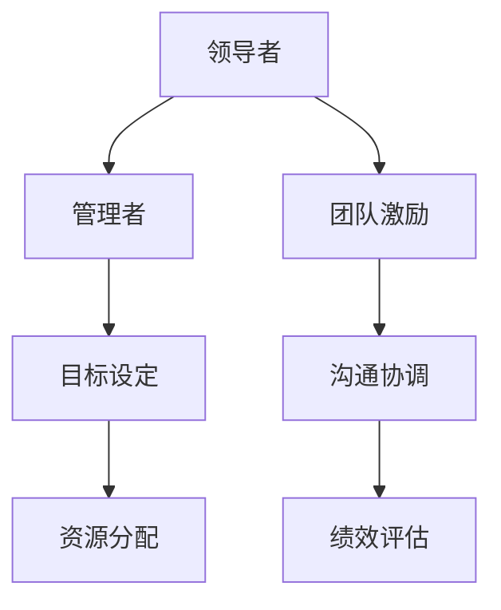

                 

### 文章标题

**《怎样培养出色的领导和管理能力》**

> 关键词：领导能力、管理能力、领导风格、情商、决策力、团队建设

> 摘要：本文将深入探讨如何培养出色的领导和管理能力。我们将从基础概念入手，逐步分析领导与管理的区别、领导风格的类型、管理层次的划分，并详细讲解自我认识与自我提升、情商与人际沟通、决策与问题解决等关键环节。同时，本文还将介绍目标设定与时间管理、团队建设与激励、人力资源管理、项目管理与风险控制等管理能力提升策略，并通过实际案例剖析领导和管理技巧，帮助读者在实际工作中有效提升领导力和管理能力。

### 引言

在快速变化的现代商业环境中，领导和管理能力成为企业成功的关键因素。出色的领导者不仅能够激发团队的潜力，推动组织实现战略目标，还能在逆境中带领团队找到突破口，实现持续发展。然而，培养出色的领导和管理能力并非一蹴而就，它需要系统的方法和实践经验的积累。本文旨在为读者提供一套科学、实用的领导和管理能力培养方案，帮助您从基础理论到实际应用全面提升自己的领导和管理水平。

### 领导与管理的区别

在探讨领导和管理能力之前，我们首先需要明确领导和管理的定义及区别。领导是一种激发他人追随和实现共同目标的过程，它关注的是如何引导和激励团队。而管理则是一种通过规划和执行组织任务来实现目标的过程，它关注的是如何有效地配置资源、控制风险并确保目标的达成。

#### 核心概念与联系

我们可以通过Mermaid流程图来展示领导与管理的不同角色和职责：



#### 核心算法原理讲解

为了更好地理解领导与管理的方法论，我们可以使用伪代码来详细阐述：

```python
# 领导力培养伪代码
def lead(self, team):
    self.set_goals()
    self.encourage_team()
    self.communicate_clearly()

# 管理能力提升伪代码
def manage(self, team):
    self.assign_resources()
    self.control_risks()
    self.evaluate_performance()
```

#### 数学模型和数学公式 & 详细讲解 & 举例说明

虽然领导和管理能力培养过程中不直接涉及复杂的数学模型和公式，但我们可以介绍一些领导力相关的理论模型。例如，情境领导模型（Hersey-Blanchard Model）是理解领导行为的重要工具：

$$
L = f(M, E)
$$

其中，$L$代表领导力，$M$代表员工成熟度，$E$代表领导者对员工的支持和指导。

假设一个团队中的员工成熟度为$M_1$，领导者对员工的支持和指导为$E_1$，那么根据情境领导模型，我们可以计算出领导力$L_1$：

$$
L_1 = f(M_1, E_1)
$$

在实际应用中，领导力$L_1$会影响团队的表现和员工的工作满意度。例如，当员工成熟度较高时，领导者可以采用授权型领导风格，让员工自主完成任务，从而提高团队的工作效率和员工的自主性。

#### 项目实战

为了更好地理解领导与管理的实际应用，我们可以通过以下实战案例来深入探讨：

**实战案例：如何在团队中推动变革？**

1. **识别变革的需求**：首先，领导者需要通过调查和沟通了解团队中存在的问题和改进的机会，明确变革的必要性。
2. **设计变革计划**：根据变革需求，制定详细的变革计划，包括变革的目标、实施步骤、预期成果等。
3. **沟通变革的愿景**：通过有效的沟通，将变革的愿景和目标传达给团队成员，让他们理解变革的重要性和意义。
4. **提供必要的支持和资源**：为团队成员提供必要的培训和资源，帮助他们适应变革并克服困难。
5. **监测变革的进展和效果**：持续监测变革的进展，收集反馈，并根据实际情况进行调整，确保变革目标的实现。

通过以上步骤，领导者可以有效地推动团队变革，提高组织的适应能力和竞争力。

#### 最佳实践 tips、小结、注意事项、拓展阅读等内容

- **最佳实践 tips**：在培养领导和管理能力时，以下是一些实用的技巧：
  - **持续学习**：不断学习新的管理理论和实践方法，与时俱进。
  - **实践反思**：通过实践中的反思和总结，不断提升自己的领导和管理水平。
  - **倾听和沟通**：倾听团队成员的意见和建议，建立良好的沟通机制。

- **小结**：本文通过对领导与管理的定义、核心算法原理、数学模型和实际案例的详细讲解，帮助读者理解了领导和管理能力培养的关键环节和方法。
- **注意事项**：在实际工作中，领导者和管理者需要根据具体情况灵活运用不同的领导和管理策略，确保团队的高效运行和目标的实现。
- **拓展阅读**：对于希望深入了解领导和管理能力的读者，以下书籍和资源可以提供进一步的指导和启示：
  - 《领导力的五项修炼》（Patrick Lencioni）
  - 《管理者的实践》（Peter Drucker）
  - 《领导力的觉醒》（Daniel Goleman）

通过以上内容，我们希望读者能够对如何培养出色的领导和管理能力有更深刻的理解和实际操作的能力。希望本文能对您的领导和管理实践提供有益的启示和帮助。

### 自我认识与自我提升

自我认识与自我提升是领导力培养的基础。一个成功的领导者首先需要深入了解自己的优点和不足，并持续努力提升自己的能力。

#### 自我评估的重要性

自我评估是一个持续的过程，它可以帮助我们认识到自己的优势和劣势，找到提升的方向。以下是一个简单的自我评估流程：

1. **收集反馈**：从同事、下属和管理层收集关于自己工作表现和行为表现的反馈。
2. **反思和分析**：对收集到的反馈进行深入反思，分析哪些是真实的、需要改进的方面。
3. **制定改进计划**：根据分析结果，制定具体的改进计划，包括学习新技能、改进工作习惯等。

#### 自我提升的策略

自我提升需要明确的目标和方法。以下是一些有效的自我提升策略：

1. **持续学习**：通过阅读书籍、参加培训课程、参与研讨会等方式不断充实自己的知识储备。
2. **技能提升**：根据自我评估的结果，针对性地提升自己的技能，如沟通技巧、时间管理能力等。
3. **反思与总结**：定期反思自己的工作和行为，总结经验教训，不断改进。

#### 实践案例

**案例：提升沟通技巧**

某技术团队的领导意识到自己在沟通方面存在一些问题，例如在团队会议中往往无法清晰地传达任务要求。为此，他采取了以下措施：

1. **参加沟通技巧培训**：报名参加了一次关于沟通技巧的培训课程，学习如何有效地传达信息和倾听他人意见。
2. **练习表达**：在工作之余，他开始练习如何用简洁明了的语言表达自己的想法，并在日常工作中不断实践。
3. **反馈与调整**：在团队会议后，他主动向团队成员征求关于沟通效果的反馈，并根据反馈进行调整。

通过持续的努力，这位领导的沟通技巧得到了显著提升，团队的工作效率也得到了提高。

#### 最佳实践 tips、小结、注意事项、拓展阅读等内容

- **最佳实践 tips**：
  - **制定明确的学习目标**：在自我提升过程中，明确目标有助于集中精力，提高学习效果。
  - **定期进行自我评估**：自我评估是一个持续的过程，可以帮助我们及时发现问题并进行调整。
  - **寻求专业指导**：在自我提升的过程中，可以寻求专业人士的指导和建议，以获得更全面的视角。

- **小结**：自我认识与自我提升是领导力培养的关键环节，通过自我评估、持续学习和技能提升，我们可以不断提升自己的能力，更好地履行领导职责。

- **注意事项**：
  - **避免盲目追求**：在自我提升的过程中，不要盲目追求某些技能或知识，应根据自身需求和实际情况有针对性地进行提升。
  - **保持耐心**：自我提升是一个长期的过程，需要耐心和毅力。

- **拓展阅读**：
  - 《如何赢得朋友与影响他人》（Dale Carnegie）
  - 《高效能人士的七个习惯》（Stephen R. Covey）

通过以上内容，我们希望读者能够认识到自我认识与自我提升的重要性，并在实际工作中积极实践，不断提升自己的领导力。

### 情商与人际沟通

情商（Emotional Intelligence，简称EQ）在领导和管理能力中扮演着至关重要的角色。情商高的人能够更好地理解和管理自己的情绪，也能有效地识别和影响他人的情绪，从而提升人际沟通的效果。

#### 情商的重要性

情商包括自我意识、自我管理、社交意识和关系管理四个关键方面。这些能力在领导和管理工作中具有以下重要作用：

1. **自我意识**：领导者需要认识自己的情绪，理解情绪对决策和行为的影响。
2. **自我管理**：在压力和挑战面前，领导者能够保持冷静，做出理性的决策。
3. **社交意识**：领导者需要敏锐地感知他人的情绪和需求，建立良好的人际关系。
4. **关系管理**：领导者能够通过有效沟通和冲突管理，维护团队的和谐与协作。

#### 提高情商的方法

提高情商需要系统性的学习和实践。以下是一些有效的方法：

1. **自我反思**：通过定期反思自己的情绪和行为，识别情绪反应的模式，并学会调整。
2. **情绪管理训练**：通过冥想、深呼吸等技巧，学会放松和缓解压力。
3. **人际沟通技能培训**：参加相关培训，学习如何有效表达自己的观点和倾听他人的意见。
4. **模拟练习**：通过角色扮演和模拟场景，提高自己在不同情境下的沟通能力和情绪控制能力。

#### 实践案例

**案例：有效解决团队冲突**

在一个技术团队中，由于项目进度紧张，团队成员之间出现了严重的冲突。团队领导意识到问题后，采取了以下措施：

1. **冷静沟通**：在与团队成员沟通时，领导首先保持了冷静，避免情绪化的回应。
2. **倾听**：领导给予团队成员充分的时间表达自己的观点，认真倾听他们的担忧和意见。
3. **中立调解**：在了解双方的意见后，领导提出了中立的建议，帮助双方找到共识。
4. **建立信任**：通过后续的沟通和支持，领导逐渐恢复了团队的信任和协作。

通过有效的情绪管理和沟通技巧，这位领导成功解决了团队冲突，提高了团队的士气和效率。

#### 最佳实践 tips、小结、注意事项、拓展阅读等内容

- **最佳实践 tips**：
  - **培养情绪意识**：在日常生活中，培养对自己情绪的敏锐感知，及时识别和处理负面情绪。
  - **定期进行情感反馈**：与同事和朋友定期交流，获取关于自己情绪和行为的反馈，并据此进行调整。
  - **积极应对压力**：学会通过运动、阅读等放松方式来缓解工作压力。

- **小结**：情商和人际沟通能力是领导力的核心组成部分，通过自我反思、情绪管理训练和人际沟通技能提升，领导者可以更好地应对各种挑战，提升团队的整体效能。

- **注意事项**：
  - **避免过度自我反思**：过度自我反思可能导致自我怀疑和内耗，应保持适度。
  - **注意平衡工作与生活**：在提高情商的过程中，要注意平衡工作与生活，避免因过度投入而忽视身心健康。

- **拓展阅读**：
  - 《情商：为什么它比智商更重要》（Daniel Goleman）
  - 《高情商是这样练成的》（Daniel Goleman）

通过以上内容，我们希望读者能够认识到情商与人际沟通能力的重要性，并在实际工作中不断实践，提升自己的领导和管理能力。

### 决策与问题解决

在领导和管理工作中，决策和问题解决是两个不可或缺的环节。一个优秀的领导者不仅需要做出明智的决策，还要能够有效地解决各种复杂的问题，推动团队和组织的持续发展。

#### 决策的重要性

决策是领导者的核心职责之一。良好的决策能够为组织带来竞争优势，而错误的决策则可能导致资源浪费和业务失败。因此，领导者需要具备以下决策能力：

1. **信息收集和分析**：在做出决策之前，领导者需要收集全面、准确的信息，并对信息进行分析。
2. **风险评估**：领导者需要评估决策的风险，并制定相应的应对策略。
3. **快速反应**：在紧急情况下，领导者需要迅速做出决策，并有效地实施。

#### 问题解决的方法

问题解决是领导和管理工作中常见的挑战。以下是一些有效的问题解决方法：

1. **明确问题**：首先要明确问题的性质和范围，避免在解决问题的过程中偏离方向。
2. **分析原因**：通过分析问题的根本原因，找到解决问题的关键点。
3. **制定方案**：根据分析结果，制定具体的解决方案，并评估各种方案的优缺点。
4. **实施和监测**：将方案付诸实施，并持续监测方案的效果，根据反馈进行调整。

#### 实践案例

**案例：应对突发事件**

某公司的一项重要项目在实施过程中突然遇到了技术难题，导致项目进度严重滞后。公司领导采取了以下措施：

1. **迅速响应**：在发现问题后，领导立即召集项目团队成员，召开紧急会议，讨论解决方案。
2. **信息收集**：领导要求技术团队尽快收集有关问题的详细信息和数据。
3. **分析原因**：在收集到足够的信息后，领导与技术团队一起分析问题的根本原因。
4. **制定方案**：根据分析结果，领导制定了详细的解决方案，包括调整项目计划、增加资源投入等。
5. **实施和监控**：领导监督项目团队的执行情况，并定期召开会议，检查项目的进度和效果。

通过有效的决策和问题解决，领导成功地应对了突发事件，确保了项目的最终成功。

#### 最佳实践 tips、小结、注意事项、拓展阅读等内容

- **最佳实践 tips**：
  - **充分准备**：在做出决策之前，确保信息收集和分析的充分性，避免盲目决策。
  - **多方意见**：在决策过程中，充分考虑团队成员的意见和建议，以避免个人偏见。
  - **持续学习**：不断学习和掌握新的决策方法和工具，提高决策的准确性。

- **小结**：决策和问题解决是领导和管理的重要技能。通过明确问题、分析原因、制定方案和实施监控，领导者可以有效应对各种挑战。

- **注意事项**：
  - **避免拖延**：在问题出现时，应迅速采取行动，避免拖延导致问题扩大。
  - **关注团队**：在问题解决过程中，关注团队成员的感受和需求，确保团队的凝聚力和积极性。

- **拓展阅读**：
  - 《决策与判断》（Dan Ariely）
  - 《问题解决与决策》（Herbert A. Simon）

通过以上内容，我们希望读者能够掌握有效的决策和问题解决方法，在实际工作中运用这些技能，提升领导和管理能力。

### 领导力的实践

领导力的实践是提升领导能力的关键环节。一个成功的领导者不仅需要具备理论知识，还需要在具体工作中不断实践，积累经验。以下是一些关于领导力实践的建议和策略。

#### 实践的重要性

实践是检验理论的唯一标准。只有在实际工作中运用领导理论，才能真正提升自己的领导能力。通过实践，领导者可以：

1. **验证理论**：将理论知识应用到实际情境中，验证其有效性和适用性。
2. **发现不足**：在实践中，领导者可以发现自身存在的不足，并通过反思和改进不断提升。
3. **积累经验**：通过不断实践，领导者可以积累丰富的管理经验，为未来的领导工作打下坚实基础。

#### 领导力实践的方法

以下是一些具体的领导力实践方法：

1. **建立信任**：信任是领导力的基石。通过透明沟通、履行承诺和关心团队成员，建立和维护信任关系。
2. **有效沟通**：沟通是领导力的核心。领导者需要学会倾听、表达清晰，并确保信息的有效传达。
3. **激励团队**：领导者需要了解团队成员的需求和动机，通过激励措施激发他们的积极性和创造力。
4. **培养下属**：通过培训和指导，帮助团队成员提升技能和知识，增强团队的整体能力。

#### 实践案例

**案例：推动团队创新**

某公司的项目经理李明希望通过推动团队创新来提升项目竞争力。他采取了以下措施：

1. **建立创新文化**：李明在团队中倡导创新思维，鼓励成员提出新的想法和解决方案。
2. **设立创新奖项**：为了激励团队创新，李明设立了创新奖项，对有创新贡献的团队成员进行表彰。
3. **提供资源支持**：李明为团队成员提供了必要的资源和培训，帮助他们掌握创新技能。
4. **建立反馈机制**：李明定期与团队成员交流，收集关于创新项目的反馈，并根据反馈进行调整。

通过以上措施，李明的团队在创新方面取得了显著成果，项目竞争力得到了显著提升。

#### 最佳实践 tips、小结、注意事项、拓展阅读等内容

- **最佳实践 tips**：
  - **持续学习**：领导者应不断学习新的管理理论和实践方法，保持知识的更新和进步。
  - **以身作则**：领导者应通过自己的行为树立榜样，影响和激励团队成员。
  - **关注团队动态**：领导者需要密切关注团队的变化和需求，灵活调整领导策略。

- **小结**：领导力的实践是提升领导能力的关键。通过建立信任、有效沟通、激励团队和培养下属，领导者可以在实际工作中不断提升自己的领导力。

- **注意事项**：
  - **避免过度干预**：领导者应在适当的时候介入，避免过度干预团队的工作。
  - **保持耐心**：领导力的提升是一个长期的过程，需要耐心和毅力。

- **拓展阅读**：
  - 《领导力实践》（John P. Kotter）
  - 《管理实践》（Peter Drucker）

通过以上内容，我们希望读者能够认识到领导力实践的重要性，并在实际工作中不断尝试和应用，提升自己的领导能力。

### 目标设定与时间管理

目标设定与时间管理是领导和管理工作中至关重要的一环。有效的目标设定和时间管理不仅能够帮助领导者明确方向，提高工作效率，还能确保团队目标的实现。

#### 目标设定的重要性

目标设定是管理工作的起点。一个明确、具体的目标能够为团队成员提供清晰的指引，激发他们的工作动力。以下是目标设定的几个关键点：

1. **明确性**：目标应具体、清晰，避免模糊和含糊的描述。
2. **可行性**：目标应具有可行性，既不能过于简单，也不能过于困难。
3. **可衡量性**：目标应具备可衡量性，以便评估目标的实现程度。
4. **时限性**：目标应设定明确的完成时限，以推动工作进展。

#### 时间管理的方法

时间管理是确保目标实现的关键。以下是一些有效的时间管理方法：

1. **优先级排序**：将任务按照优先级排序，优先处理重要且紧急的任务。
2. **时间块**：将工作时间划分为不同的时间块，每个时间块专注于一项任务，提高工作效率。
3. **避免拖延**：设定具体的截止日期，避免拖延，确保任务按时完成。
4. **高效会议**：通过提前准备、明确议程和限制会议时间，提高会议效率。

#### 实践案例

**案例：实现项目目标**

某项目经理王明在负责一个重要项目时，通过以下措施实现了项目目标：

1. **明确目标**：王明与团队一起制定了具体、明确的项目目标，并确定了每个成员的职责。
2. **时间规划**：王明将项目分为多个阶段，并为每个阶段设定了明确的时间表。
3. **优先级排序**：王明根据任务的优先级，合理安排工作计划，确保关键任务优先完成。
4. **定期监控**：王明定期检查项目的进展，及时调整计划和资源，确保项目按时完成。

通过有效的目标设定和时间管理，王明成功实现了项目目标。

#### 最佳实践 tips、小结、注意事项、拓展阅读等内容

- **最佳实践 tips**：
  - **定期回顾**：定期回顾目标和时间管理的效果，根据实际情况进行调整。
  - **灵活应对**：在目标设定和时间管理过程中，保持灵活性，根据变化及时调整计划。
  - **团队合作**：鼓励团队成员参与目标设定和时间管理，提高团队的合作效率。

- **小结**：目标设定与时间管理是领导和管理的重要技能。通过明确目标、有效规划和灵活应对，领导者可以确保团队目标的实现。

- **注意事项**：
  - **避免目标过多**：目标过多可能导致资源分散，影响目标实现。
  - **关注实际执行**：目标设定只是第一步，关键在于实际执行和监控。

- **拓展阅读**：
  - 《高效能人士的七个习惯》（Stephen R. Covey）
  - 《时间管理》（Peter F. Drucker）

通过以上内容，我们希望读者能够掌握有效的目标设定和时间管理方法，并在实际工作中运用，提升团队的工作效率和目标实现能力。

### 团队建设与激励

团队建设与激励是领导者提升团队凝聚力和工作效率的关键。一个有效的团队不仅能够提高工作效率，还能激发团队成员的潜能，实现组织目标。

#### 团队建设的重要性

团队建设是领导工作的重要组成部分。一个良好的团队具有以下特点：

1. **共同目标**：团队成员共同明确并追求组织目标。
2. **有效沟通**：团队成员之间能够有效沟通，分享信息，协调工作。
3. **相互信任**：团队成员之间相互信任，能够相互支持和帮助。
4. **积极氛围**：团队内部氛围积极，鼓励创新和尝试。

#### 激励团队成员的方法

激励团队成员是提升团队绩效的关键。以下是一些激励团队成员的方法：

1. **认可与表扬**：对团队成员的出色表现给予认可和表扬，增强他们的自信心和动力。
2. **设立目标**：为团队成员设立明确的个人和团队目标，激发他们的工作热情。
3. **提供培训与发展机会**：为团队成员提供培训和发展机会，帮助他们提升技能和职业发展。
4. **关注个人需求**：关注团队成员的个人需求和职业规划，提供个性化的激励措施。

#### 实践案例

**案例：激发团队创新**

某公司的研发团队在项目推进过程中面临技术瓶颈。团队领导采取了以下措施来激发团队创新：

1. **建立创新文化**：团队领导倡导创新思维，鼓励团队成员提出新的想法和解决方案。
2. **设立创新奖项**：为激发团队的积极性，领导设立了创新奖项，对有创新贡献的团队成员进行表彰。
3. **提供资源支持**：领导为团队成员提供了必要的资源和培训，帮助他们掌握创新技能。
4. **建立反馈机制**：领导建立了反馈机制，定期与团队成员交流，收集关于创新项目的反馈，并根据反馈进行调整。

通过以上措施，团队的创新氛围得到了显著提升，项目技术难题也得到了有效解决。

#### 最佳实践 tips、小结、注意事项、拓展阅读等内容

- **最佳实践 tips**：
  - **鼓励团队参与**：在团队建设中，鼓励团队成员参与决策和目标设定，提高团队的凝聚力和归属感。
  - **建立有效的沟通渠道**：确保团队成员之间有畅通的沟通渠道，促进信息的共享和协作。
  - **持续关注团队成员的成长**：关注团队成员的职业发展，提供持续的支持和激励。

- **小结**：团队建设与激励是提升团队绩效的关键。通过建立共同目标、有效沟通、相互信任和积极氛围，领导者可以打造一个高效的团队。

- **注意事项**：
  - **避免过度竞争**：过度竞争可能导致团队内耗，影响团队合作。
  - **关注团队成员的身心健康**：关注团队成员的身心健康，提供必要的支持和关怀。

- **拓展阅读**：
  - 《团队协作的力量》（Sydney Finkelstein）
  - 《激励心理学》（Rick Creative）

通过以上内容，我们希望读者能够掌握有效的团队建设与激励方法，并在实际工作中运用，提升团队的整体绩效。

### 人力资源管理

人力资源管理是领导和管理工作中不可或缺的一环。有效的人力资源管理能够提升团队的整体效能，确保组织的可持续发展。以下将详细探讨人力资源管理的关键方面。

#### 人才招聘与选拔

人才招聘与选拔是人力资源管理的基础。以下是一些关键步骤和策略：

1. **明确招聘需求**：在招聘前，明确岗位需求和公司的人才战略，确保招聘目标的准确性。
2. **多元化招聘渠道**：通过多种渠道发布招聘信息，如招聘网站、社交媒体、专业猎头等，扩大招聘范围。
3. **科学选拔方法**：采用面试、笔试、情景模拟等多种选拔方法，全面评估应聘者的能力、经验和潜力。
4. **背景调查与验证**：对候选人进行背景调查和验证，确保其信息的真实性和可靠性。

#### 职业发展与培训

职业发展与培训是留住人才和提升团队能力的重要手段。以下是一些关键策略：

1. **职业发展规划**：为员工提供明确的职业发展规划，帮助他们设定职业目标和成长路径。
2. **个性化培训**：根据员工的需求和岗位要求，提供个性化的培训方案，提升员工的技能和知识。
3. **导师制度**：建立导师制度，为新人提供指导和支持，帮助他们快速融入团队和胜任工作。
4. **持续学习与成长**：鼓励员工持续学习和成长，提供学习资源和学习机会，激发他们的学习动力。

#### 绩效评估与激励

绩效评估与激励是激发员工积极性和提高工作效率的重要手段。以下是一些关键策略：

1. **明确绩效标准**：制定明确的绩效标准和评估指标，确保评估的客观性和公正性。
2. **定期绩效评估**：定期进行绩效评估，及时反馈员工的绩效情况，帮助他们找到改进的方向。
3. **激励措施**：通过奖金、晋升、培训等多种激励措施，激发员工的积极性和创造力。
4. **公平竞争**：建立公平的竞争机制，确保员工的努力得到公正的评价和回报。

#### 实践案例

**案例：提升员工满意度**

某公司的HR团队为了提升员工的满意度，采取了以下措施：

1. **员工调查**：通过问卷调查了解员工的需求和意见，收集关于公司管理和工作环境的反馈。
2. **反馈与改进**：根据员工调查的结果，对存在的问题进行改进，如优化工作流程、提供更灵活的工作安排等。
3. **职业发展机会**：为员工提供更多的职业发展机会，包括晋升、转岗和培训等。
4. **激励措施**：设立绩效奖金和员工表彰制度，激励员工在工作中取得优异成绩。

通过以上措施，该公司的员工满意度显著提升，员工的积极性和工作效率也得到了提高。

#### 最佳实践 tips、小结、注意事项、拓展阅读等内容

- **最佳实践 tips**：
  - **建立透明沟通渠道**：确保员工与管理层之间的沟通畅通，建立透明的信息传递机制。
  - **关注员工心理健康**：关注员工的心理健康，提供心理支持和咨询服务。
  - **建立激励机制**：根据公司的实际情况，设计有效的激励机制，激励员工的积极性和创造力。

- **小结**：人力资源管理是领导和管理的重要环节。通过人才招聘与选拔、职业发展与培训、绩效评估与激励，领导者可以打造一个高效、稳定的团队。

- **注意事项**：
  - **避免过度依赖绩效考核**：绩效考核只是激励员工的一部分，不应过度依赖。
  - **关注员工个体差异**：每个员工都有其独特性，应关注个体差异，提供个性化的管理和激励。

- **拓展阅读**：
  - 《人力资源管理学》（Stephen P. Robbins）
  - 《员工满意度研究》（R. Edward Freeman）

通过以上内容，我们希望读者能够掌握有效的人力资源管理方法，并在实际工作中运用，提升团队的整体效能。

### 项目管理与风险控制

项目管理与风险控制是领导和管理工作中至关重要的部分。有效的项目管理和风险控制能够确保项目按计划顺利推进，降低不确定性对项目的负面影响，从而实现项目目标。

#### 项目管理的重要性

项目管理涉及规划、执行、监控和收尾等各个环节，是确保项目成功的关键。以下为项目管理的重要方面：

1. **项目规划**：明确项目目标、范围、时间表和资源需求，为项目实施提供清晰的蓝图。
2. **团队协作**：建立有效的团队协作机制，确保团队成员之间的沟通和协调，提高工作效率。
3. **进度监控**：定期监控项目进度，及时发现并解决问题，确保项目按计划推进。
4. **质量保证**：确保项目交付的产品或服务符合预定的质量标准，满足客户需求。

#### 风险控制的方法

风险控制是项目管理中的关键环节，以下是一些有效的风险控制方法：

1. **风险识别**：识别项目可能面临的风险，包括技术风险、市场风险、财务风险等。
2. **风险评估**：对识别出的风险进行评估，确定其发生的概率和可能带来的影响。
3. **风险应对策略**：根据风险评估结果，制定相应的风险应对策略，包括风险规避、减轻、转移和接受等。
4. **持续监控**：在项目执行过程中，持续监控风险的变化，及时调整风险应对策略。

#### 实践案例

**案例：应对市场变化**

某公司正开发一款新产品，市场部预测市场需求将大幅增长。然而，在项目进行过程中，市场部发现市场变化导致需求下降。项目领导采取了以下措施：

1. **风险预警**：在项目启动时，市场部已预测到市场变化的可能性，并制定了相应的预警机制。
2. **调整计划**：项目领导及时调整项目计划，减少开发投入，以应对市场需求下降的风险。
3. **沟通与协作**：项目领导与市场部、技术部等部门进行密切沟通，确保风险应对策略的有效实施。
4. **持续监控**：项目领导持续监控市场变化，根据实际情况调整项目策略，确保项目在新的市场环境中仍然具备竞争力。

通过有效的项目管理和风险控制，项目最终成功应对了市场变化，避免了潜在的风险和损失。

#### 最佳实践 tips、小结、注意事项、拓展阅读等内容

- **最佳实践 tips**：
  - **早期识别风险**：在项目初期就识别潜在风险，制定应对策略，降低风险发生的概率。
  - **透明沟通**：确保项目团队成员之间的沟通畅通，及时分享风险信息，共同应对挑战。
  - **持续改进**：项目结束后，进行项目回顾和评估，总结经验教训，持续改进项目管理流程。

- **小结**：项目管理和风险控制是确保项目成功的关键环节。通过规划、监控和风险应对，领导者可以确保项目按计划推进，实现预期目标。

- **注意事项**：
  - **避免过度规划**：过度的规划可能导致资源浪费，应保持适度。
  - **关注团队成员的反馈**：关注团队成员的反馈，及时发现和解决问题，提高项目执行效果。

- **拓展阅读**：
  - 《项目管理知识体系指南》（Project Management Institute）
  - 《风险管理与决策》（Howard Rauch）

通过以上内容，我们希望读者能够掌握有效的项目管理和风险控制方法，并在实际工作中运用，提升项目管理的整体水平。

### 演讲与表达技巧

演讲与表达技巧在领导和管理工作中起着至关重要的作用。一个优秀的领导者需要具备清晰、有说服力的表达技能，以有效地传达信息、激励团队并建立信任。

#### 演讲的重要性

演讲不仅是一种沟通方式，更是一种领导工具。以下是演讲在领导工作中的重要性：

1. **传达信息**：演讲是领导者传达战略目标、工作计划和政策的重要途径。
2. **激励团队**：通过演讲，领导者可以激发团队成员的积极性和创造力，增强团队凝聚力。
3. **建立信任**：清晰、有说服力的演讲能够建立领导者的权威和信任，增强团队的信任感。
4. **决策支持**：演讲是领导者在决策过程中争取支持、达成共识的有效手段。

#### 提高演讲技巧的方法

以下是一些提高演讲技巧的方法：

1. **内容准备**：确保演讲内容的逻辑清晰、条理分明，提前准备演讲稿和幻灯片。
2. **语言表达**：使用简单明了的语言，避免使用过于复杂的术语和专业词汇。
3. **肢体语言**：运用肢体语言，如眼神交流、手势、站立姿势等，增强演讲的表现力。
4. **练习与反馈**：多次练习演讲，并邀请他人提供反馈，不断改进演讲技巧。

#### 实践案例

**案例：成功的产品发布演讲**

某公司的CEO在发布新产品时，通过以下措施提升了演讲效果：

1. **内容准备**：提前准备详细的演讲稿，并设计具有吸引力的幻灯片，确保演讲内容充实、生动。
2. **语言表达**：使用简单易懂的语言，将复杂的科技概念转化为大众能理解的内容。
3. **肢体语言**：保持自信的姿态，与观众保持眼神交流，通过手势和姿态增强演讲的表现力。
4. **互动与反馈**：在演讲过程中，邀请观众提问，增加互动，并根据观众的反馈调整演讲内容。

通过以上措施，CEO成功吸引了观众的关注，有效传达了产品信息，并赢得了观众的支持。

#### 最佳实践 tips、小结、注意事项、拓展阅读等内容

- **最佳实践 tips**：
  - **提前准备**：确保演讲内容充分准备，提前演练，以增强自信心和演讲效果。
  - **注重互动**：在演讲过程中，与观众互动，增加演讲的趣味性和吸引力。
  - **持续学习**：学习优秀的演讲者，借鉴他们的经验和技巧，不断提升自己的演讲能力。

- **小结**：演讲与表达技巧是领导力的重要组成部分。通过内容准备、语言表达、肢体语言和互动与反馈，领导者可以提升演讲效果，增强领导力。

- **注意事项**：
  - **避免照搬照抄**：在借鉴他人经验时，应根据自身情况适当调整，确保演讲的个性化和真实性。
  - **注意节奏和语气**：在演讲过程中，注意语速和语调的变化，以增强演讲的感染力。

- **拓展阅读**：
  - 《演讲的力量》（Christian Science Monitor）
  - 《如何演讲》（Dale Carnegie）

通过以上内容，我们希望读者能够掌握有效的演讲与表达技巧，在实际工作中提升领导力，更好地履行领导职责。

### 团队合作与协作

团队合作与协作是领导和管理工作中至关重要的因素。一个高效的团队不仅能够提高工作效率，还能激发创新思维，实现组织目标。以下将详细探讨团队合作与协作的关键方面。

#### 团队合作的重要性

团队合作在领导和管理工作中具有以下重要性：

1. **资源整合**：团队合作能够整合团队成员的知识、技能和经验，实现资源的最优配置。
2. **提高效率**：通过团队合作，可以分担工作任务，提高工作效率，缩短项目周期。
3. **激发创新**：团队成员之间的互动和协作能够激发新的思维和创意，促进创新。
4. **增强凝聚力**：团队合作能够增强团队成员之间的信任和凝聚力，提升团队的士气。

#### 协作工具与方法

以下是一些常用的协作工具和方法：

1. **项目管理工具**：如Trello、JIRA等，帮助团队制定任务计划、跟踪进度和协作。
2. **即时通讯工具**：如Slack、Microsoft Teams等，方便团队成员实时沟通和协作。
3. **文档协作工具**：如Google Docs、Notion等，支持团队成员实时编辑和共享文档。
4. **视频会议工具**：如Zoom、Microsoft Teams等，便于远程团队进行面对面的交流和讨论。

#### 实践案例

**案例：远程团队协作**

某公司在全球设立了多个研发中心，为了有效协作，采取了以下措施：

1. **统一协作平台**：公司采用统一的项目管理工具和即时通讯平台，确保团队成员能够实时沟通和协作。
2. **定期视频会议**：每周举行一次远程视频会议，汇报项目进展、讨论问题解决方案。
3. **文档共享与协作**：使用文档协作工具，团队成员可以实时编辑和共享文档，提高工作效率。
4. **团队文化建设**：通过线上团建活动、虚拟咖啡会议等方式，增强团队成员之间的互动和信任。

通过以上措施，该公司的远程团队协作效率显著提升，项目进度和质量得到了保障。

#### 最佳实践 tips、小结、注意事项、拓展阅读等内容

- **最佳实践 tips**：
  - **明确目标与责任**：确保每个团队成员都明确自己的目标和工作责任，避免职责不清和任务重叠。
  - **培养沟通能力**：定期进行团队沟通技巧培训，提升团队成员的沟通能力和协作效率。
  - **关注团队建设**：通过团队建设活动，增强团队成员之间的信任和凝聚力。

- **小结**：团队合作与协作是领导和管理工作中不可或缺的一部分。通过资源整合、提高效率和激发创新，团队合作能够提升团队的绩效和整体效能。

- **注意事项**：
  - **避免过度依赖工具**：虽然协作工具有助于团队协作，但不应过度依赖，关键在于团队成员之间的有效沟通和协作。
  - **保持灵活性**：根据团队和项目的实际情况，灵活调整协作工具和方法。

- **拓展阅读**：
  - 《团队协作的艺术》（Sydney Finkelstein）
  - 《敏捷团队协作指南》（Jason Little）

通过以上内容，我们希望读者能够掌握有效的团队合作与协作方法，并在实际工作中运用，提升团队的整体效能。

### 冲突管理

冲突管理是领导和管理工作中不可避免的一部分。有效的冲突管理不仅能够化解紧张局势，还能促进团队和谐，提高工作效率。以下将详细探讨冲突管理的原则和策略。

#### 冲突管理的原则

有效的冲突管理应遵循以下原则：

1. **公平公正**：在处理冲突时，应保持公平公正的态度，避免偏袒任何一方。
2. **积极主动**：冲突发生时，应积极主动采取措施，避免冲突升级。
3. **沟通理解**：通过有效沟通，理解双方的立场和需求，找到解决问题的方法。
4. **寻求共赢**：在冲突管理过程中，寻求双方都能接受的解决方案，实现共赢。

#### 冲突管理的策略

以下是一些有效的冲突管理策略：

1. **倾听与理解**：在冲突发生时，首先倾听对方的观点，理解他们的立场和感受。
2. **事实导向**：基于事实进行讨论，避免情绪化的回应，确保冲突解决的客观性。
3. **求同存异**：在冲突双方观点存在差异时，寻求共同点，找到可以妥协的部分。
4. **协商解决**：通过协商和讨论，找到双方都能接受的解决方案，避免单方面的决定。

#### 实践案例

**案例：化解团队内部的冲突**

某团队在项目执行过程中，由于任务分配不均，导致团队成员之间产生了矛盾。团队领导采取了以下措施化解冲突：

1. **倾听双方意见**：领导首先与团队成员沟通，了解双方的立场和感受。
2. **平衡任务分配**：根据团队成员的能力和兴趣，重新调整任务分配，确保公平合理。
3. **开展团队建设**：组织团队建设活动，增强团队成员之间的信任和沟通。
4. **定期沟通**：建立定期沟通机制，确保团队成员之间的意见和问题能够及时传达和解决。

通过以上措施，团队内部的冲突得到了有效化解，团队协作和效率显著提升。

#### 最佳实践 tips、小结、注意事项、拓展阅读等内容

- **最佳实践 tips**：
  - **避免情绪化**：在冲突管理过程中，避免情绪化的反应，保持冷静和专业。
  - **明确沟通渠道**：建立明确的沟通渠道，确保团队成员之间的意见和问题能够及时传达和解决。
  - **持续跟进**：在冲突解决后，持续跟进，确保问题不会再次发生。

- **小结**：冲突管理是领导和管理工作中不可或缺的一部分。通过倾听、理解、事实导向和协商解决，领导者可以有效地化解冲突，促进团队和谐。

- **注意事项**：
  - **避免忽视**：忽视冲突可能导致问题升级，应及时采取措施解决。
  - **尊重个体差异**：尊重团队成员的个体差异，避免以统一标准处理所有冲突。

- **拓展阅读**：
  - 《冲突管理》（K. Stephen Cook）
  - 《团队冲突处理技巧》（Kurt Lewin）

通过以上内容，我们希望读者能够掌握有效的冲突管理策略，在实际工作中运用，提升团队的整体效能。

### 变革领导

变革领导是领导者在组织变革过程中发挥的关键作用。有效的变革领导能够推动组织适应外部环境的变化，实现持续发展。以下将详细探讨变革领导的原则、方法和策略。

#### 变革领导的重要性

在快速变化的商业环境中，组织需要不断进行变革以保持竞争力。变革领导的重要性体现在以下几个方面：

1. **引领变革方向**：变革领导者能够明确组织变革的目标和方向，为组织指明前进的道路。
2. **激励团队成员**：变革领导者能够激发团队成员的积极性和创造力，共同迎接变革挑战。
3. **克服变革阻力**：变革领导者能够识别和应对变革过程中的阻力，确保变革的顺利推进。
4. **促进持续发展**：有效的变革领导能够推动组织不断创新，实现持续发展。

#### 变革领导的原则

变革领导应遵循以下原则：

1. **明确目标**：明确组织变革的目标和愿景，确保团队成员对变革有共同的理解和认同。
2. **充分沟通**：通过有效的沟通，确保团队成员了解变革的原因、目的和预期效果，减少误解和猜疑。
3. **积极引导**：鼓励团队成员参与变革，提供必要的支持和资源，激发他们的积极性和创造力。
4. **持续跟进**：在变革过程中，持续跟进和评估变革的效果，及时调整变革策略，确保变革目标的实现。

#### 变革领导的方法

以下是一些有效的变革领导方法：

1. **制定变革计划**：明确变革的目标、时间表和关键步骤，确保变革有计划、有步骤地推进。
2. **建立变革团队**：组建一支由关键利益相关者组成的变革团队，共同推动变革的顺利实施。
3. **培训与支持**：为团队成员提供必要的培训和资源支持，帮助他们适应变革并克服挑战。
4. **激励与奖励**：通过激励措施，如奖金、晋升和表彰等，鼓励团队成员积极参与变革并取得成果。

#### 实践案例

**案例：推动企业数字化转型**

某企业面临着数字化转型的大趋势，决定进行全面的数字化转型。企业领导采取了以下措施：

1. **明确目标**：领导明确提出了数字化转型的愿景和目标，确保所有团队成员对变革有共同的理解和认同。
2. **制定计划**：领导制定了详细的数字化转型计划，包括技术升级、流程优化和人才培养等关键步骤。
3. **建立团队**：领导组建了一支由IT、业务和人力资源等部门组成的变革团队，共同推动数字化转型的顺利实施。
4. **培训与支持**：领导为团队成员提供了数字化转型相关的培训和支持，帮助他们掌握新的技能和知识。
5. **激励与奖励**：领导通过激励措施，如奖金和晋升等，鼓励团队成员积极参与数字化转型并取得成果。

通过以上措施，企业成功实现了数字化转型，提升了整体竞争力。

#### 最佳实践 tips、小结、注意事项、拓展阅读等内容

- **最佳实践 tips**：
  - **及时沟通**：在变革过程中，及时沟通变革的进展和成果，确保团队成员对变革有持续的关注和支持。
  - **灵活调整**：根据变革的实际情况，灵活调整变革策略和计划，确保变革能够适应外部环境的变化。
  - **持续激励**：通过持续激励措施，保持团队成员的积极性和创造力，推动变革的顺利进行。

- **小结**：变革领导是推动组织变革的关键。通过明确目标、充分沟通、积极引导和持续跟进，领导者可以有效地推动组织变革，实现持续发展。

- **注意事项**：
  - **避免一刀切**：在变革过程中，避免一刀切的做法，应根据不同部门和团队的特点，制定个性化的变革策略。
  - **关注员工需求**：关注员工在变革过程中的需求和感受，提供必要的支持和关怀，确保他们的积极性和参与度。

- **拓展阅读**：
  - 《变革之舞》（John P. Kotter）
  - 《领导变革》（Jeffrey Pfeffer）

通过以上内容，我们希望读者能够掌握有效的变革领导策略，并在实际工作中运用，推动组织的持续发展。

### 领导和管理案例分析

在实际工作中，领导和管理案例的分析能够帮助我们更好地理解和应用领导与管理理论。以下将介绍几个成功的领导和管理案例，并对这些案例进行详细剖析，以提供启示和借鉴。

#### 案例一：苹果公司的领导变革

**案例背景**：在史蒂夫·乔布斯回归苹果公司后，他通过一系列领导变革措施，使苹果公司重新焕发生机，成为全球最具价值的公司之一。

**案例分析**：

1. **明确愿景**：乔布斯明确了苹果公司的愿景，即“创造世界上最伟大的产品”。这一愿景为团队成员提供了共同的目标和方向。

2. **创新驱动**：乔布斯重视创新，推动苹果公司不断推出具有颠覆性的产品，如iPhone、iPad等，使公司在竞争激烈的市场中保持领先地位。

3. **团队建设**：乔布斯通过选拔和培养优秀的人才，建立了一支高效的团队。他强调团队合作，鼓励团队成员之间相互支持和学习。

4. **激励措施**：乔布斯通过奖金、晋升和公开表彰等方式，激励团队成员追求卓越，不断推动公司创新和发展。

**启示与借鉴**：领导者应明确愿景，推动创新，建设高效团队，并通过激励措施激发员工的积极性和创造力。

#### 案例二：丰田汽车的生产管理革新

**案例背景**：丰田汽车通过实施精益生产管理，实现了生产效率和质量的大幅提升，成为全球汽车行业的领导者。

**案例分析**：

1. **持续改进**：丰田汽车倡导持续改进的理念，鼓励员工在工作中不断寻求改进的机会，提高生产效率和产品质量。

2. **员工参与**：丰田汽车重视员工的参与和反馈，通过员工建议制度和员工培训，激发员工的积极性和创造力。

3. **优化流程**：丰田汽车通过优化生产流程，减少浪费，提高生产效率。例如，通过看板管理系统，实现实时监控和调整生产进度。

4. **质量控制**：丰田汽车建立了严格的质量控制体系，从原材料采购到生产过程，每一个环节都严格把关，确保产品的质量。

**启示与借鉴**：领导者应倡导持续改进，鼓励员工参与，优化生产流程，建立严格的质量控制体系，以提高生产效率和产品质量。

#### 案例三：谷歌的人才管理策略

**案例背景**：谷歌通过一系列独特的人才管理策略，吸引了全球顶尖人才，成为科技行业的佼佼者。

**案例分析**：

1. **灵活的工作环境**：谷歌为员工提供了灵活的工作环境，如自由选择工作时间、远程办公等，以吸引和留住优秀人才。

2. **人才培养和发展**：谷歌通过内部培训、职业发展机会和导师制度，为员工提供全面的发展平台，激发他们的潜能。

3. **激励措施**：谷歌采用股票期权等激励措施，使员工能够分享公司成长的成果，提高他们的工作积极性。

4. **创新文化**：谷歌倡导创新文化，鼓励员工提出新想法和解决方案，推动公司的持续创新。

**启示与借鉴**：领导者应提供灵活的工作环境，重视人才培养和发展，采用有效的激励措施，营造创新文化，以吸引和留住优秀人才。

#### 案例四：阿里巴巴的电子商务战略

**案例背景**：阿里巴巴通过创新电子商务模式，成功转型为全球领先的电子商务平台。

**案例分析**：

1. **战略定位**：阿里巴巴明确了以电子商务为核心的战略定位，积极拓展市场，提高市场份额。

2. **技术创新**：阿里巴巴不断推动技术创新，如云计算、大数据等，提高平台的竞争力。

3. **客户服务**：阿里巴巴注重客户体验，通过提供优质的客户服务，增强客户的忠诚度。

4. **多元化发展**：阿里巴巴通过多元化发展，如进入金融、物流等领域，实现业务的持续增长。

**启示与借鉴**：领导者应明确战略定位，推动技术创新，提供优质客户服务，实现多元化发展，以增强企业的市场竞争力。

### 案例分析与启示

通过对以上案例的分析，我们可以得出以下启示和借鉴：

1. **明确愿景和目标**：领导者应明确组织的愿景和目标，为团队成员提供清晰的方向和动力。

2. **推动创新**：领导者应重视创新，鼓励团队成员提出新想法和解决方案，推动组织的持续发展。

3. **重视团队建设**：领导者应建设高效的团队，通过选拔和培养优秀人才，提高团队的整体能力。

4. **激励员工**：领导者应采用有效的激励措施，激发员工的积极性和创造力，提高工作效率。

5. **关注客户需求**：领导者应关注客户需求，提供优质的客户服务，增强客户的忠诚度。

6. **持续改进**：领导者应倡导持续改进的理念，鼓励员工在工作中不断寻求改进的机会，提高生产效率和产品质量。

7. **灵活应变**：领导者应具备灵活应变的能力，根据外部环境的变化，及时调整战略和策略，确保组织的持续发展。

### 最佳实践 tips、小结、注意事项、拓展阅读等内容

- **最佳实践 tips**：

  - **定期评估**：定期评估领导和管理实践的效果，根据实际情况进行调整。

  - **学习借鉴**：学习行业内的成功案例，结合自身实际情况，借鉴有效的管理经验和策略。

  - **关注员工反馈**：关注员工的反馈和建议，及时解决问题，提高员工的满意度和工作积极性。

- **小结**：通过分析成功的领导和管理案例，我们可以得出许多有益的启示和借鉴，帮助我们在实际工作中提升领导力和管理能力。

- **注意事项**：

  - **避免盲目模仿**：在借鉴成功案例时，应结合自身组织的实际情况，避免盲目模仿。

  - **持续学习**：领导和管理是一个持续的过程，领导者应不断学习新的管理理论和实践方法，保持与时俱进。

- **拓展阅读**：

  - 《领导者的素质》（Warren Bennis）
  - 《管理实践》（Peter Drucker）

通过以上内容，我们希望读者能够从案例中汲取经验和启示，结合自身实际，不断提升领导力和管理能力。

### 附录

在领导和管理能力培养的过程中，掌握相关的书籍、资源和工具将有助于提升学习效果和实践能力。以下是一些推荐的书籍、网站和工具，供读者参考。

#### 书籍推荐

1. **《领导力的五项修炼》（Patrick Lencioni）**
   - 本书深入探讨了领导力的重要方面，包括沟通、团队建设、决策等，为领导者提供了实用的建议。

2. **《管理者的实践》（Peter Drucker）**
   - 本书是管理学经典之作，详细阐述了管理者应该如何进行工作规划、目标设定和绩效评估。

3. **《高效能人士的七个习惯》（Stephen R. Covey）**
   - 本书介绍了七个高效能习惯，帮助读者提升个人和团队效能，实现目标。

4. **《领导力的觉醒》（Daniel Goleman）**
   - 本书探讨了情商在领导力中的重要性，为领导者提供了提升情商的方法和实践策略。

5. **《团队协作的力量》（Sydney Finkelstein）**
   - 本书通过分析成功和失败的团队案例，探讨了团队协作的关键要素和策略。

#### 网站推荐

1. **LinkedIn Learning（领英学习）**
   - LinkedIn Learning提供了丰富的在线课程，涵盖领导力、管理、沟通等多个领域，适合不同层次的读者。

2. **Coursera（可汗学院）**
   - Coursera提供了全球知名大学和机构的在线课程，包括领导力和管理方面的课程，适合自学和实践。

3. **Harvard Business Review（哈佛商业评论）**
   - 哈佛商业评论提供了丰富的商业和管理文章，包括领导力、创新、营销等方面的内容，有助于提升管理能力。

4. **LinkedIn（领英）**
   - 领英是一个专业的社交网络平台，通过加入相关的领导力和管理群组，可以获取最新的行业动态和经验分享。

#### 工具推荐

1. **Trello**
   - Trello是一款功能强大的项目管理工具，可以帮助团队制定任务计划、跟踪进度和协作。

2. **Slack**
   - Slack是一款即时通讯工具，支持团队内部的实时沟通和协作，提高工作效率。

3. **Google Workspace（谷歌工作空间）**
   - Google Workspace包括Google Docs、Google Sheets等在线协作工具，支持多人实时编辑和共享文档，方便团队协作。

4. **Asana**
   - Asana是一款专业的任务管理工具，可以帮助团队制定任务计划、分配任务和跟踪进度。

通过以上书籍、网站和工具的学习和实践，读者可以不断提升自己的领导和管理能力，更好地应对各种挑战。希望这些推荐能为读者的学习和工作提供有益的参考和帮助。作者：AI天才研究院/AI Genius Institute & 禅与计算机程序设计艺术 /Zen And The Art of Computer Programming

