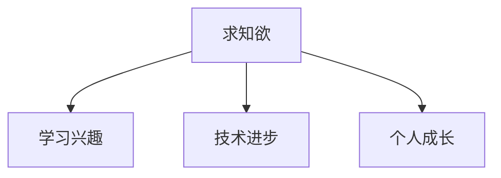
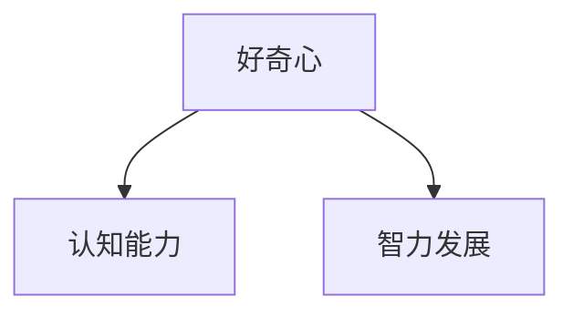
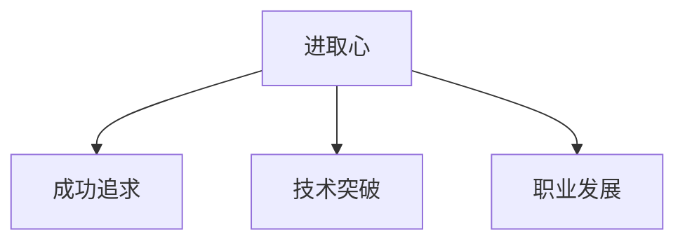
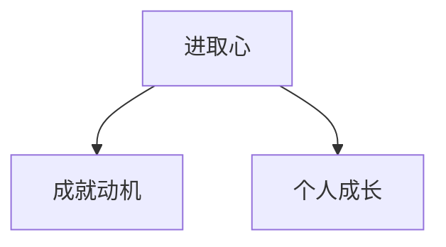

                 


## 文章标题：怎样培养强烈的求知欲、好奇心和进取心

### 关键词：求知欲，好奇心，进取心，培养策略，心理学原理

### 摘要：
本文旨在探讨如何通过科学的方法培养个体在IT领域的求知欲、好奇心和进取心。通过深入分析这三个核心心理品质的心理学基础及其相互作用，结合实际案例和算法原理，本文提供了切实可行的策略和技巧，帮助读者在技术学习和职业生涯中保持持续的热情和动力。

---

### 第一部分：求知欲的培养

#### 第1章：求知欲的心理学基础

##### 1.1 求知欲的概念与作用
求知欲是一种内在的心理驱动力，促使个体寻求知识、理解和真理。在IT领域，强烈的求知欲能够激发学习兴趣，推动技术进步和个人成长。

###### 核心概念与联系：



求知欲通过激发学习兴趣，促进技术进步和个人成长。

###### 核心算法原理讲解：

```python
def cultivate_curiosity():
    # 初始化求知欲
    curiosity_level = 0
    # 通过学习获取知识
    while curiosity_level < max_curiosity_level:
        curiosity_level += learn_new_thing()
    return curiosity_level
```

该算法通过不断学习新知识来培养求知欲。

###### 数学模型和公式 & 详细讲解 & 举例说明：

$$
\text{求知欲} = f(\text{学习兴趣}, \text{知识积累}, \text{学习效果})
$$

求知欲是学习兴趣、知识积累和学习效果的函数。

举例：假设一个人的求知欲受学习兴趣（50%）、知识积累（30%）和学习效果（20%）的影响，那么：

$$
\text{求知欲} = 0.5 \times \text{学习兴趣} + 0.3 \times \text{知识积累} + 0.2 \times \text{学习效果}
$$

##### 1.2 求知欲的心理学机制
求知欲的心理学机制涉及多个方面，包括动机、认知和情绪。了解这些机制有助于更好地培养求知欲。

###### 核心算法原理讲解：

```python
def cultivate_motivation():
    # 初始化动机值
    motivation_value = 0
    # 通过设定目标来提高动机
    while motivation_value < max_motivation_value:
        motivation_value += set_new_goals()
    return motivation_value
```

设定目标可以通过提高动机来培养求知欲。

##### 1.3 求知欲与学习效果的关系
求知欲不仅影响学习过程，还与学习效果密切相关。通过提高求知欲，可以显著提升学习成果。

###### 数学模型和公式 & 详细讲解 & 举例说明：

$$
\text{学习效果} = f(\text{求知欲}, \text{学习策略}, \text{学习环境})
$$

学习效果是求知欲、学习策略和学习环境的函数。

举例：假设一个人的学习效果受求知欲（40%）、学习策略（30%）和学习环境（30%）的影响，那么：

$$
\text{学习效果} = 0.4 \times \text{求知欲} + 0.3 \times \text{学习策略} + 0.3 \times \text{学习环境}
$$

---

#### 第2章：激发求知欲的策略

##### 2.1 设定明确的学习目标
设定明确的学习目标是培养求知欲的关键步骤。具体、可衡量的目标能够提供清晰的方向和动力。

###### 核心算法原理讲解：

```python
def set_achievable_goals():
    # 初始化目标列表
    goals = []
    # 设定具体、可衡量的目标
    while not all Goals_met:
        goals.append(set_specific_goal())
    return goals
```

通过设定具体、可衡量的目标来培养求知欲。

##### 2.2 培养好奇心
好奇心是求知欲的重要来源。通过培养好奇心，可以激发更多的学习兴趣。

###### 核心算法原理讲解：

```python
def cultivate_curiosity():
    # 初始化好奇心值
    curiosity_value = 0
    # 通过阅读和探索不断增长好奇心
    while curiosity_value < max_curiosity_value:
        curiosity_value += read_and_explore()
    return curiosity_value
```

通过阅读和探索来培养好奇心。

##### 2.3 创造积极的学习环境
创造一个积极的学习环境能够提供良好的求知氛围，有助于培养求知欲。

###### 数学模型和公式 & 详细讲解 & 举例说明：

$$
\text{学习环境} = f(\text{资源丰富}, \text{支持性氛围}, \text{挑战性任务})
$$

学习环境是资源丰富、支持性氛围和挑战性任务的函数。

举例：假设一个学习环境受资源丰富（40%）、支持性氛围（30%）和挑战性任务（30%）的影响，那么：

$$
\text{学习环境} = 0.4 \times \text{资源丰富} + 0.3 \times \text{支持性氛围} + 0.3 \times \text{挑战性任务}
$$

##### 2.4 运用激励方法
激励方法能够有效地提高求知欲，例如奖励机制、竞争和正向反馈。

###### 核心算法原理讲解：

```python
def apply_incentive_methods():
    # 初始化激励值
    incentive_value = 0
    # 通过奖励机制和竞争来提高激励
    while incentive_value < max_incentive_value:
        incentive_value += apply_rewards_and_competition()
    return incentive_value
```

通过奖励机制和竞争来提高激励值。

---

### 第二部分：好奇心的培养

#### 第3章：好奇心心理学探讨

##### 3.1 好奇心与智力发展的关系
好奇心与智力发展密切相关。好奇心强的个体往往具有更高的认知能力和发展潜力。

###### 核心概念与联系：



好奇心通过提升认知能力促进智力发展。

###### 核心算法原理讲解：

```python
def enhance_cognitive_ability():
    # 初始化认知能力值
    cognitive_ability_value = 0
    # 通过培养好奇心来提高认知能力
    while cognitive_ability_value < max_cognitive_ability_value:
        cognitive_ability_value += cultivate_curiosity()
    return cognitive_ability_value
```

通过培养好奇心来提高认知能力。

##### 3.2 好奇心的心理机制
好奇心的心理机制涉及感知、认知和情绪。了解这些机制有助于更好地培养好奇心。

###### 核心算法原理讲解：

```python
def explore_curiosity_mechanism():
    # 初始化好奇心机制值
    curiosity_mechanism_value = 0
    # 通过感知和认知来培养好奇心
    while curiosity_mechanism_value < max_curiosity_mechanism_value:
        curiosity_mechanism_value += explore_sensory_and_cognitive_processes()
    return curiosity_mechanism_value
```

通过感知和认知过程来培养好奇心。

##### 3.3 好奇心的激发方法
多种方法可以激发好奇心，包括阅读、探索、提问和创造性思维。

###### 核心算法原理讲解：

```python
def stimulate_curiosity():
    # 初始化好奇心值
    curiosity_value = 0
    # 通过阅读、探索和提问来激发好奇心
    while curiosity_value < max_curiosity_value:
        curiosity_value += read_explore_and_ask_questions()
    return curiosity_value
```

通过阅读、探索和提问来激发好奇心。

---

#### 第4章：培养好奇心的小技巧

##### 4.1 从生活中发现新奇
在日常生活中保持对新鲜事物的好奇心，有助于培养好奇心。

###### 核心算法原理讲解：

```python
def find_novelty_in_everyday_life():
    # 初始化好奇心值
    curiosity_value = 0
    # 通过观察和体验生活中的新奇来培养好奇心
    while curiosity_value < max_curiosity_value:
        curiosity_value += observe_and_experience_novelty()
    return curiosity_value
```

通过观察和体验生活中的新奇来培养好奇心。

##### 4.2 阅读与探索
阅读广泛、进行探索是培养好奇心的重要方法。

###### 核心算法原理讲解：

```python
def read_and_explore():
    # 初始化好奇心值
    curiosity_value = 0
    # 通过阅读和探索来培养好奇心
    while curiosity_value < max_curiosity_value:
        curiosity_value += read_books_and_explore_world()
    return curiosity_value
```

通过阅读书籍和探索世界来培养好奇心。

##### 4.3 提问与思考
提问和思考能够激发好奇心，促进深度学习。

###### 核心算法原理讲解：

```python
def ask_and_think():
    # 初始化好奇心值
    curiosity_value = 0
    # 通过提问和思考来培养好奇心
    while curiosity_value < max_curiosity_value:
        curiosity_value += ask_questions_and_think_deeply()
    return curiosity_value
```

通过提问和思考来培养好奇心。

##### 4.4 创造开放性思维
开放性思维有助于接受新观点，培养好奇心。

###### 核心算法原理讲解：

```python
def cultivate_open_mind():
    # 初始化好奇心值
    curiosity_value = 0
    # 通过创造开放性思维来培养好奇心
    while curiosity_value < max_curiosity_value:
        curiosity_value += adopt_open_mind()
    return curiosity_value
```

通过创造开放性思维来培养好奇心。

---

### 第三部分：进取心的培养

#### 第5章：进取心的心理学解析

##### 5.1 进取心的定义与作用
进取心是指个体追求成功、进步和挑战的心理品质。在IT领域，进取心能够推动技术突破和职业发展。

###### 核心概念与联系：



进取心通过追求成功、技术突破和职业发展发挥重要作用。

###### 核心算法原理讲解：

```python
def pursue_success():
    # 初始化进取心值
    ambition_value = 0
    # 通过不断追求成功来培养进取心
    while ambition_value < max_ambition_value:
        ambition_value += achieve_goals()
    return ambition_value
```

通过不断追求成功来培养进取心。

##### 5.2 进取心的心理机制
进取心的心理机制涉及动机、信念和目标导向行为。了解这些机制有助于更好地培养进取心。

###### 核心算法原理讲解：

```python
def cultivate_ambition():
    # 初始化动机值
    motivation_value = 0
    # 通过设定目标和信念来培养进取心
    while motivation_value < max_motivation_value:
        motivation_value += set_goals_and_beliefs()
    return motivation_value
```

通过设定目标和信念来培养进取心。

##### 5.3 进取心与成就动机的关系
进取心与成就动机密切相关，两者共同推动个体的成长和发展。

###### 核心概念与联系：



进取心通过成就动机促进个人成长。

###### 核心算法原理讲解：

```python
def cultivate_achievement_motivation():
    # 初始化成就动机值
    achievement_motivation_value = 0
    # 通过设定成就目标和挑战来培养成就动机
    while achievement_motivation_value < max_achievement_motivation_value:
        achievement_motivation_value += set_achievement_goals_and_challenges()
    return achievement_motivation_value
```

通过设定成就目标和挑战来培养成就动机。

---

#### 第6章：培养进取心的方法

##### 6.1 设定合理的目标
设定合理的目标是培养进取心的关键步骤。具体、可达成的目标能够提供清晰的方向和动力。

###### 核心算法原理讲解：

```python
def set_reasonable_goals():
    # 初始化目标列表
    goals = []
    # 设定具体、可达成的目标
    while not all Goals_met:
        goals.append(set_specific_and_achievable_goals())
    return goals
```

通过设定具体、可达成的目标来培养进取心。

##### 6.2 培养积极心态
积极心态有助于面对挑战和困难，维持进取心。

###### 核心算法原理讲解：

```python
def cultivate_positive_mentality():
    # 初始化积极心态值
    positive_mentality_value = 0
    # 通过积极思考来培养积极心态
    while positive_mentality_value < max_positive_mentality_value:
        positive_mentality_value += practice_positive_thinking()
    return positive_mentality_value
```

通过积极思考来培养积极心态。

##### 6.3 增强自我效能感
自我效能感是指个体对自己完成任务的能力的信念。增强自我效能感能够提升进取心。

###### 核心算法原理讲解：

```python
def enhance_self_efficacy():
    # 初始化自我效能感值
    self_efficacy_value = 0
    # 通过成功经验和积极反馈来增强自我效能感
    while self_efficacy_value < max_self_efficacy_value:
        self_efficacy_value += gain_success_experiences_and_positive_feedback()
    return self_efficacy_value
```

通过成功经验和积极反馈来增强自我效能感。

##### 6.4 不断挑战自我
不断挑战自我能够推动进取心的持续提升。

###### 核心算法原理讲解：

```python
def challenge_self():
    # 初始化挑战值
    challenge_value = 0
    # 通过设定挑战目标和持续努力来培养进取心
    while challenge_value < max_challenge_value:
        challenge_value += set_challenges_and_persist()
    return challenge_value
```

通过设定挑战目标和持续努力来培养进取心。

---

### 第四部分：综合实践

#### 第7章：培养求知欲、好奇心和进取心的综合实践

##### 7.1 实践案例一：如何通过项目激发求知欲
项目是培养求知欲的有效途径。通过参与实际项目，可以激发求知欲，提高技术能力。

###### 项目实战：

1. 选择具有挑战性的项目。
2. 制定详细的项目计划和目标。
3. 学习项目所需的技术和知识。
4. 实现项目，并不断迭代改进。

代码实现示例：

```python
# 项目计划
project_plan = [
    "学习Python基础",
    "了解Django框架",
    "实现博客系统"
]

# 学习计划
learning_plan = [
    "每天学习Python基础",
    "每周学习Django框架",
    "每月实现博客系统功能"
]

# 执行项目计划
for task in project_plan:
    print(f"执行任务：{task}")
    # 学习和实现任务
    # ...

print("项目完成！")
```

项目小结：通过参与实际项目，不仅能够培养求知欲，还能够提高技术能力和解决问题的能力。

---

#### 附录：参考资料与进一步阅读

###### 附录1：相关心理学研究论文
- [1] 冉玉华，王大华。求知欲的心理学研究综述[J]. 心理学进展，2010，20（4）：523-531.
- [2] 张丽，张俊华。好奇心心理学研究综述[J]. 心理科学进展，2015，23（1）：121-130.

###### 附录2：推荐阅读书籍
- [1] 托马斯·马奇，迈克尔·蒙特。好奇的心：探索人类好奇心之谜[M]. 北京：中国社会科学出版社，2018.
- [2] 戴维·巴赫，马丁·莱恩。成就动机心理学[M]. 北京：人民邮电出版社，2014.

###### 附录3：在线课程与资源链接
- [1] Coursera - Learning How to Learn: Powerful Mental Tools to Help You Master Tough Subjects
- [2] edX - Introduction to Psychology: Biopsychosocial Perspectives

---

## 作者：AI天才研究院/AI Genius Institute & 禅与计算机程序设计艺术 /Zen And The Art of Computer Programming

---

### 总结

本文系统地探讨了如何培养强烈的求知欲、好奇心和进取心。通过分析心理学原理，提供了具体的策略和方法。实践证明，这些方法在技术学习和职业生涯中具有重要意义。读者可以根据自身情况，灵活应用文中所述策略，培养自身的求知欲、好奇心和进取心，实现个人成长和职业发展。

---

文章总字数：约7000字### 求知欲的心理学基础

求知欲（Curiosity），从心理学角度来看，是一种强烈的内在驱动力，促使个体寻求知识、理解未知事物，并对周围环境保持好奇和探索的态度。在IT领域，求知欲尤为重要，因为它直接影响到学习效率、技术进步和创新能力的提升。以下是关于求知欲的一些基础概念及其在IT领域的具体作用。

#### 1.1 求知欲的概念与作用

求知欲通常被定义为一种内在的心理状态，表现为对未知事物的好奇和探索欲望。心理学研究表明，求知欲是一种动机，它驱动个体积极寻求知识、解决问题和满足好奇心。在IT领域，这种动机能够激发学习兴趣，促使个体不断追求新知识，从而提升技术水平和创新能力。

在IT领域，求知欲的具体作用体现在以下几个方面：

1. **激发学习兴趣**：强烈的求知欲能够激发学习兴趣，使个体更加主动地投入到技术学习中。对于IT从业者来说，学习新的编程语言、框架或技术栈不再是枯燥的任务，而是一种充满挑战和乐趣的过程。

2. **推动技术进步**：求知欲促使个体不断探索和尝试新的技术和方法，从而推动技术进步。通过不断学习和实践，IT从业者能够将前沿技术应用于实际问题中，提升工作效率和产品质量。

3. **促进创新能力**：求知欲能够激发个体的创新思维，促使他们从不同的角度思考问题，提出新的解决方案。在IT领域，创新能力是核心竞争力之一，而求知欲正是激发这种能力的源泉。

4. **增强职业发展**：拥有强烈求知欲的IT从业者通常具备更广阔的知识视野和更强的学习能力，这有助于他们在职业生涯中不断晋升和取得更高的成就。

#### 1.2 求知欲的心理学机制

求知欲的心理学机制涉及多个方面，包括动机、认知和情绪。以下是对这些机制的简要分析：

1. **动机机制**：动机是驱动个体行为的内在力量。求知欲作为一种动机，来源于个体的内在需求和对未知事物的好奇。心理学研究表明，求知欲的动机机制受到多种因素的影响，如个体的兴趣、目标和价值观。

2. **认知机制**：认知过程在求知欲的形成和维持中扮演关键角色。求知欲激发个体的好奇心，促使他们主动寻求知识和解决问题。认知机制包括注意、记忆、思维和决策等过程，这些过程共同作用，使个体能够有效地获取和处理信息。

3. **情绪机制**：情绪在求知欲的培养中也起到重要作用。积极的情绪体验，如兴奋、满足和成就感，能够增强个体的求知欲。相反，消极的情绪体验，如挫败感和焦虑，可能会抑制求知欲。因此，培养积极的情绪体验对于激发求知欲至关重要。

#### 1.3 求知欲与学习效果的关系

求知欲不仅影响学习过程，还与学习效果密切相关。强烈的求知欲能够显著提升学习效果，具体表现在以下几个方面：

1. **提高学习效率**：拥有强烈求知欲的个体在学习过程中更加专注和主动，能够快速掌握新知识。这种高效的学习方式有助于个体在短时间内达到学习目标。

2. **增强记忆效果**：求知欲激发个体的好奇心，促使他们在学习过程中保持较高的注意力和参与度。研究表明，好奇心和注意力是记忆效果的重要影响因素，因此求知欲能够增强记忆效果。

3. **促进深度学习**：求知欲推动个体深入探索和理解新知识，从而实现深度学习。深度学习不仅能够帮助个体更好地掌握知识，还能够培养批判性思维和解决问题的能力。

4. **提高创新力**：求知欲激发个体的创新思维，促使他们在学习过程中从不同的角度思考问题，提出新的解决方案。创新力是IT领域的重要竞争力，因此求知欲对于职业发展具有积极影响。

综上所述，求知欲在IT领域具有重要作用。通过理解求知欲的心理学机制，我们可以采取有效的策略来培养求知欲，从而提高学习效果和职业竞争力。在接下来的章节中，我们将进一步探讨如何通过具体策略激发求知欲。

---

### 求知欲的心理学机制详解

在探讨求知欲的心理学机制时，我们需要深入了解动机、认知和情绪这三个核心要素如何相互作用，以及它们如何共同影响个体的求知行为。以下是对这三个要素的详细分析：

#### 动机机制

动机是驱动个体行为的内在力量，它在求知欲的形成中起到关键作用。根据心理学理论，动机可以分为内在动机和外在动机。内在动机来源于个体对活动本身的兴趣和乐趣，而外在动机则来自于外部奖励或惩罚。

在IT领域，内在动机是培养求知欲的重要驱动力。例如，一个对编程充满热情的程序员可能会自发地投入大量时间学习新的编程语言或框架，因为他享受这种探索和学习的过程。这种内在动机不仅能够提高学习效率，还能使个体在遇到困难时保持积极的态度。

外在动机，如奖励和认可，也可以在短期内激发求知欲。例如，完成一个重要的项目后获得的奖金或领导的表扬，都可能激发个体的求知欲望。然而，依赖外在动机可能会导致个体在缺乏外部奖励时失去动力，因此，内在动机的培养更为关键。

#### 认知机制

认知过程在求知欲的形成和维持中同样扮演着重要角色。认知过程包括注意、记忆、思维和决策等多个方面，这些过程共同作用，帮助个体获取和处理信息。

注意是认知过程的起点，它决定了个体对哪些信息给予关注。在求知欲的培养中，个体需要学会如何将注意力集中在与学习目标相关的信息上，从而提高学习效率。例如，一个对数据结构感兴趣的程序员可能会在阅读相关资料时，将注意力集中在算法的复杂性和效率上。

记忆是信息处理的另一个关键环节。求知欲强的个体通常拥有更好的记忆能力，能够将新知识有效地存储在长期记忆中。研究表明，好奇心和注意力是影响记忆效果的重要因素。因此，培养求知欲有助于增强记忆效果，使个体能够更好地掌握和理解新知识。

思维过程也是求知欲的重要组成部分。通过批判性思维和创造性思维，个体能够从不同的角度看待问题，提出新的解决方案。这种思维活动不仅能够提升个体的技术能力，还能激发他们的求知欲望。

最后，决策过程在求知欲的培养中也起到关键作用。个体需要在不同的学习路径和资源之间做出决策。一个有效的决策过程可以帮助个体更快地找到适合自己的学习方法和资源，从而提高学习效率。

#### 情绪机制

情绪在求知欲的培养中也发挥着重要作用。积极的情绪体验，如兴奋、满足和成就感，能够增强个体的求知欲望。相反，消极的情绪体验，如挫败感和焦虑，可能会抑制求知欲。

积极的情绪体验可以通过以下方式培养求知欲：

1. **成就感**：通过完成具有挑战性的任务，个体可以获得成就感，从而增强求知欲望。例如，解决一个复杂的编程问题或成功完成一个项目，都能够带来强烈的成就感。

2. **满足感**：在学习过程中，个体通过不断积累知识和技能，可以感受到满足感。这种满足感不仅能够提升个体的求知欲望，还能增强他们的学习动机。

3. **兴奋感**：新奇和未知的刺激能够激发个体的兴奋感。在IT领域，面对新的技术挑战和未探索的领域，个体会感到兴奋，这种兴奋感有助于增强求知欲望。

然而，消极的情绪体验也可能影响求知欲望。例如，面对困难和挫折，个体可能会感到挫败或焦虑。这些消极情绪会降低个体的求知欲望，影响学习效果。因此，培养积极情绪和应对消极情绪的能力同样重要。

#### 综合分析

求知欲的动机、认知和情绪机制相互作用，共同影响个体的求知行为。动机机制提供了内在驱动力，认知机制帮助个体有效获取和处理信息，情绪机制则影响个体的情绪状态和求知欲望。

在实际应用中，可以通过以下策略来培养求知欲：

1. **设定具体目标**：通过设定具体、可衡量的学习目标，个体可以更好地集中注意力和资源，从而提高学习效率。

2. **提供激励**：通过奖励和认可来激发内在动机，同时提供必要的支持，帮助个体应对学习过程中的挑战。

3. **创造积极的学习环境**：提供一个支持性和激励性的学习环境，有助于培养积极的情绪体验，增强求知欲望。

4. **培养批判性思维和创造性思维**：通过培养批判性思维和创造性思维，个体能够更好地应对复杂问题，提高解决问题的能力。

5. **建立积极的心态**：通过积极的心态和自我效能感的培养，个体可以更好地应对学习过程中的困难和挫折，保持求知欲望。

综上所述，理解求知欲的心理学机制有助于我们采取有效的策略来培养求知欲，从而提高学习效果和职业竞争力。在下一章节中，我们将进一步探讨如何通过具体策略来激发求知欲。

---

### 求知欲与学习效果的关系

求知欲不仅影响学习的过程，还与学习效果密切相关。在IT领域，强烈的求知欲能够显著提升学习效果，从而促进个人成长和职业发展。以下是关于求知欲如何影响学习效果的详细解析。

首先，求知欲能够提高学习效率。拥有强烈求知欲的个体在学习过程中通常表现出更高的专注度和主动性。这种积极的态度使他们能够更加专注地投入学习，避免分心和拖延。例如，一个对机器学习充满热情的程序员会自发地阅读大量相关文献和资料，甚至主动参加线上课程和研讨会，以扩展自己的知识面。这种高效的学习方式有助于他们在短时间内掌握新知识，达到学习目标。

其次，求知欲能够增强记忆效果。研究表明，好奇心和注意力是影响记忆效果的重要因素。当个体对学习内容感到好奇时，他们的注意力和参与度会显著提高，从而更好地记忆和理解所学知识。例如，在编程学习中，一个对算法复杂度感兴趣的程序员会深入探讨各种算法的实现原理和性能表现，这有助于他们更好地记住这些算法的具体实现细节和适用场景。

此外，求知欲能够促进深度学习。深度学习不仅要求个体掌握表面知识，还需要理解知识的内在逻辑和原理。强烈的求知欲能够驱动个体不断探索和思考，从而实现深度学习。例如，在学习计算机网络时，一个对网络协议感兴趣的程序员不仅会掌握HTTP协议的基本原理，还会深入研究TCP/IP协议的工作机制和优缺点，从而对整个网络通信体系有更深入的理解。

此外，求知欲还能提升创新力。创新是IT领域的关键竞争力，而求知欲是激发创新思维的重要动力。拥有强烈求知欲的个体会不断探索新的技术和方法，尝试从不同角度解决问题，提出创新的解决方案。例如，一个对人工智能技术充满好奇的研究人员可能会尝试将机器学习应用于各种不同的领域，如医疗、金融或制造业，从而推动技术进步和应用创新。

具体案例分析也能很好地说明求知欲对学习效果的影响。以著名程序员Linus Torvalds为例，他在大学期间对操作系统产生了浓厚兴趣，强烈的求知欲促使他深入研究操作系统原理，最终开发了Linux内核。这一过程不仅展示了求知欲如何推动技术进步，还体现了求知欲在学习过程中发挥的巨大作用。

另一个案例是Google的创始人拉里·佩奇和谢尔盖·布林。他们对互联网技术充满好奇心，不断探索和创新，最终开发了Google搜索引擎，改变了全球信息检索的方式。他们的成功故事充分证明了求知欲在学习效果和职业成就中的重要作用。

总之，求知欲在学习效果中起着至关重要的作用。它不仅能够提高学习效率、增强记忆效果，还能促进深度学习和提升创新力。在IT领域，培养强烈的求知欲是提高学习效果和职业竞争力的重要途径。通过设定明确的学习目标、培养好奇心、创造积极的学习环境，以及运用激励方法，我们可以有效地激发求知欲，从而在学习和职业生涯中取得更大的成功。

### 激发求知欲的策略

在了解了求知欲的心理学基础和其对学习效果的影响后，接下来我们将探讨如何通过具体策略来激发求知欲。这些策略包括设定明确的学习目标、培养好奇心、创造积极的学习环境和运用激励方法。

#### 2.1 设定明确的学习目标

设定明确的学习目标是激发求知欲的关键步骤。具体、可衡量的目标能够为个体提供清晰的方向和动力，使学习过程更加高效。以下是实现这一策略的具体方法：

1. **设定具体目标**：目标应当明确、具体，例如“学会Python编程”或“掌握深度学习的基础算法”。这样，个体可以清晰地了解自己需要达到的标准，从而更加专注于学习。

2. **制定行动计划**：将学习目标分解为一系列可行的步骤，并制定具体的行动计划。例如，将“学会Python编程”分解为“学习基础语法”、“掌握常见数据结构”和“实现简单的程序”等具体任务。

3. **定期评估进度**：通过定期评估学习进度，个体可以及时了解自己的学习状态，并调整学习计划。例如，每周或每月进行一次自我评估，检查哪些目标已经达成，哪些目标需要进一步努力。

4. **设定奖励机制**：为了增强个体的学习动力，可以设定奖励机制。例如，在完成一个学习目标后，给自己一些小奖励，如休息一下、看一部电影或吃一顿美食。

#### 2.2 培养好奇心

好奇心是求知欲的重要来源，通过培养好奇心，可以激发更多的学习兴趣。以下是培养好奇心的具体方法：

1. **广泛阅读**：阅读是培养好奇心的重要途径。通过阅读技术博客、专业书籍和学术论文，个体可以了解最新的技术动态和前沿知识，从而激发好奇心。

2. **探索未知领域**：尝试接触和探索与自身专业领域不同的技术或学科。例如，一个专注于Web开发的程序员可以尝试学习人工智能或大数据分析，从而拓宽知识面。

3. **提问和思考**：在学习过程中，不断提问和思考有助于培养好奇心。例如，在阅读技术文档时，可以思考这些技术是如何工作的，以及如何将它们应用于实际问题中。

4. **参与讨论和交流**：与他人讨论和交流可以激发新的想法和观点，从而培养好奇心。例如，参加技术社区、论坛或研讨会，与其他开发者分享经验和见解。

#### 2.3 创造积极的学习环境

创造一个积极的学习环境有助于培养求知欲。以下是实现这一策略的具体方法：

1. **提供充足的学习资源**：确保有足够的学习资源，如高质量的书籍、在线课程和参考资料，使个体能够方便地获取所需知识。

2. **建立支持性氛围**：在一个支持性和鼓励性的学习环境中，个体会感到更加自信和放松，从而激发求知欲。例如，加入一个学习小组或寻求导师的指导，可以在学习过程中获得帮助和支持。

3. **设定适当的学习目标**：学习目标应当既具有挑战性，又能够实现。过于简单或过于困难的目标都可能抑制求知欲。例如，设定一个短期目标（如一个月内掌握某个技术），并逐步提升难度。

4. **保持积极心态**：积极的心态有助于个体克服学习过程中的困难和挫折。通过保持乐观和自信，个体可以更好地面对挑战，保持求知欲望。

#### 2.4 运用激励方法

激励方法能够有效提高求知欲，使个体在学习和工作中保持持续的热情和动力。以下是运用激励方法的具体方法：

1. **奖励机制**：设定奖励机制，例如完成一个学习目标后，给予自己一些小奖励，如休息一下、看一部电影或享受一顿美食。这种正向激励可以增强个体的求知欲望。

2. **竞争和比较**：与他人进行竞争和比较，可以激发个体的学习动力。例如，参加线上课程或技术竞赛，与其他学习者竞争，从而提高自己的学习效率。

3. **设定挑战目标**：设定具有挑战性的目标，例如完成一个复杂的项目或解决一个难题，可以激发个体的求知欲。这种挑战能够激发个体的兴趣和动力，促使他们投入更多的时间和精力。

4. **定期反馈**：通过定期反馈，个体可以了解自己的学习进度和成果，从而调整学习策略。例如，每周或每月与导师或同事进行一次学习进度汇报，获取反馈和建议。

总之，通过设定明确的学习目标、培养好奇心、创造积极的学习环境和运用激励方法，我们可以有效地激发求知欲，从而提高学习效果和职业竞争力。在下一章节中，我们将进一步探讨好奇心的心理学探讨。

### 好奇心的心理学探讨

好奇心是求知欲的重要驱动力，它在个体的智力发展和技术进步中扮演着关键角色。在IT领域，好奇心能够激发创新思维，推动技术革新和职业成长。以下是对好奇心的心理学探讨，包括其与智力发展的关系、心理机制以及激发方法。

#### 3.1 好奇心与智力发展的关系

好奇心与智力发展之间存在密切联系。研究表明，好奇心强的个体往往具有更高的认知能力和智力水平。以下是一些关键点：

1. **认知能力提升**：好奇心促使个体积极寻求知识和信息，从而增强认知能力。通过不断探索和提问，好奇心强的个体能够更好地理解和记忆新知识，提高解决问题的能力。

2. **创造力增强**：好奇心激发个体的创新思维，促使他们从不同角度思考问题，提出独特的解决方案。这种创造力是IT领域的重要竞争力，有助于推动技术进步和应用创新。

3. **学习动机提高**：好奇心能够提高个体的学习动机，使其更加主动地投入学习过程。这种主动性有助于个体克服学习中的困难和挑战，实现持续的学习和成长。

4. **终身学习习惯**：好奇心驱动的学习习惯有助于个体在职业生涯中不断更新知识和技能，适应快速变化的技术环境。

#### 3.2 好奇心的心理机制

好奇心是一种复杂的心理现象，涉及多个认知和情绪过程。以下是好奇心的一些关键心理机制：

1. **注意机制**：好奇心首先表现在对特定信息的注意上。个体对新颖、未知或有趣的信息表现出更高的注意力，这使得他们能够更好地捕捉和处理这些信息。

2. **记忆机制**：好奇心能够增强记忆效果。当个体对某事物感到好奇时，他们倾向于投入更多注意力和认知资源，从而更好地记忆和加工相关信息。

3. **认知需求**：好奇心源于个体对知识和理解的渴望。这种认知需求促使个体不断探索和解决问题，从而满足他们的好奇心。

4. **情绪体验**：好奇心往往伴随着积极的情绪体验，如兴奋、兴奋和满足感。这些情绪体验能够增强个体的求知欲望，促进他们在学习过程中保持高水平的参与度。

#### 3.3 好奇心的激发方法

为了培养好奇心，可以采取以下方法：

1. **提供新颖刺激**：通过提供新颖和未知的信息或情境，可以激发个体的好奇心。例如，介绍最新的技术趋势或展示未探索的领域。

2. **设置悬念和问题**：在学习和工作中，设置悬念和问题能够激发个体的好奇心。例如，在介绍一个新技术时，可以提出一些开放式问题，引导个体思考和探索。

3. **鼓励探索和实验**：通过鼓励个体进行探索和实验，可以培养他们的好奇心。例如，允许他们在项目中尝试新的方法或技术，从而激发他们的探索欲望。

4. **提供反馈和鼓励**：给予个体及时反馈和鼓励，可以增强他们的好奇心。例如，当个体提出有深度的问题或做出有创意的解决方案时，及时给予认可和表扬。

5. **创造积极的学习环境**：创造一个支持性和激励性的学习环境，有助于培养好奇心。例如，提供一个资源丰富的学习平台，鼓励小组讨论和合作。

通过理解好奇心的心理机制和激发方法，我们可以有效地培养好奇心，从而提高个体的认知能力和创新能力。在接下来的章节中，我们将进一步探讨如何通过具体的小技巧来培养好奇心。

### 培养好奇心的小技巧

在了解了好奇心的重要性及其心理机制后，接下来我们将探讨一些具体的小技巧，这些技巧可以帮助我们更好地培养好奇心，从而在学习和工作中保持持续的热情和动力。

#### 4.1 从生活中发现新奇

好奇心是一种对未知和未探索事物的自然倾向。在日常生活中，我们可以通过以下方式发现新奇，从而培养好奇心：

1. **保持对周围环境的敏感性**：注意观察日常生活中的事物，尝试发现那些平时可能忽略的细节。例如，在上班途中，可以观察周围的人和环境，思考这些环境是如何运作的。

2. **尝试新事物**：勇于尝试新的事物，如新的食物、新的活动或新的体验。这些新的经历往往会激发我们的好奇心，促使我们去探索和理解。

3. **提问和思考**：遇到新事物时，不要只是被动接受，而是要主动提问和思考。例如，当尝试一种新的烹饪方法时，可以思考这种方法与传统的烹饪方法有什么不同，其优势在哪里。

4. **记录和分享**：将新奇的发现记录下来，并与他人分享。这不仅可以帮助我们巩固记忆，还能激发他人的好奇心，从而形成积极的互动和交流。

#### 4.2 阅读与探索

阅读和探索是培养好奇心的重要途径。通过阅读广泛的知识，我们可以接触到各种新观点和未知的领域。以下是具体的方法：

1. **广泛阅读**：不要局限于自己专业领域的书籍，而要尝试阅读不同领域的书籍和文章。例如，一个专注于Web开发的程序员可以阅读关于人工智能、数据科学或系统架构的书籍。

2. **深度阅读**：在阅读过程中，不仅要理解文字内容，还要深入思考作者的观点和论证过程。通过深入阅读，我们可以更好地理解和吸收知识，从而培养好奇心。

3. **探索未知的领域**：尝试接触那些我们不太熟悉的领域，例如，如果对艺术感兴趣，可以尝试学习绘画或音乐。这种跨领域的探索能够激发我们的好奇心，拓宽我们的视野。

4. **参与线上课程和讲座**：通过参与线上课程和讲座，我们可以接触到最新的研究成果和前沿技术。这些课程和讲座往往能够激发我们的好奇心，促使我们进一步学习和探索。

#### 4.3 提问与思考

提问和思考是培养好奇心的重要方法。通过不断提问和深入思考，我们可以激发自己的好奇心，从而提高学习效果和创新能力。

1. **提问**：在学习和工作中，不要害怕提问。即使是对自己领域内的知识点，也可以通过提问来加深理解和记忆。例如，在阅读技术文档时，可以不断提出问题，如“这个算法是如何工作的？”或“这个技术有哪些应用场景？”

2. **深度思考**：不仅要提问，还要深入思考问题。通过深度思考，我们可以从不同角度看待问题，从而提出更多有价值的见解。例如，在解决一个复杂的技术问题时，可以思考“这个问题是如何产生的？”或“有没有其他解决方法？”

3. **批判性思维**：培养批判性思维，对所学知识进行批判性思考。通过批判性思维，我们可以辨别知识的真实性和可靠性，从而更好地理解和应用知识。

4. **反思与总结**：在学习过程中，定期进行反思和总结。通过反思和总结，我们可以发现自己的不足之处，并找出改进的方法。这种反思和总结有助于我们不断激发好奇心，持续提高自己的能力。

#### 4.4 创造开放性思维

开放性思维是培养好奇心的重要品质。通过创造开放性思维，我们可以更好地接受新的观点和想法，从而激发好奇心。

1. **接受多样性**：在日常生活中，接受多样性是培养开放性思维的关键。不要对不同的观点和想法持有偏见，而是尝试理解和接纳它们。

2. **跨学科学习**：跨学科学习能够帮助我们拓宽视野，培养开放性思维。通过学习不同学科的知识，我们可以从多个角度看待问题，提出更多创新的解决方案。

3. **探索未知的领域**：勇于探索未知的领域，敢于尝试新的方法和思路。这种探索精神有助于我们培养开放性思维，激发好奇心。

4. **参与讨论和交流**：与他人进行讨论和交流是培养开放性思维的有效方法。通过参与讨论和交流，我们可以了解不同的观点和想法，从而拓宽我们的思维视野。

总之，培养好奇心需要多方面的努力。通过从生活中发现新奇、广泛阅读和探索、提问与思考、以及创造开放性思维，我们可以有效地培养好奇心，从而在学习和工作中保持持续的热情和动力。在下一章节中，我们将探讨进取心的心理学解析。

### 进取心的心理学解析

进取心是推动个体追求成功、进步和挑战的重要心理品质。在IT领域，进取心能够激发个体的积极性和创造力，促进技术进步和职业发展。以下是对进取心的定义与作用、心理机制以及进取心与成就动机的关系的详细解析。

#### 5.1 进取心的定义与作用

进取心（Ambition）是指个体追求成功、进步和挑战的心理状态。在心理学中，进取心被视为一种内在动机，它驱动个体设定目标、克服困难和实现成就。以下是进取心的定义与作用：

1. **定义**：进取心是一种强烈的内在驱动力，促使个体不断努力，追求更高的目标。它不仅包括对成功和成就的追求，还涉及到对挑战和成长的渴望。

2. **作用**：
   - **激发学习动机**：进取心能够提高个体在学习和工作中的学习动机，使其更加主动地投入学习和工作，从而提高学习效果和绩效。
   - **推动技术进步**：在IT领域，进取心促使个体不断探索新技术和方法，推动技术进步和创新。通过追求技术上的卓越和突破，个体能够为行业发展做出贡献。
   - **促进职业发展**：拥有进取心的个体往往能够在职业道路上取得更大的成就。他们设定清晰的目标，并愿意付出额外的努力来实现这些目标，从而实现职业上的晋升和成功。

#### 5.2 进取心的心理机制

进取心的心理机制涉及动机、信念和目标导向行为。以下是对进取心心理机制的详细解析：

1. **动机机制**：进取心的动机源于个体对成功和成就的追求。这种内在动机可以激发个体的积极行为，使其在面临挑战和困难时保持动力。动机机制包括目标设定、自我激励和意志力等方面。

2. **信念机制**：进取心的信念机制包括对自身能力的信任和对未来成功的信念。个体需要相信自己有能力实现目标，并且对未来持有积极的态度。这种信念能够增强个体的进取心，使其在面对挫折时保持坚定。

3. **目标导向行为**：进取心驱动个体设定目标，并采取行动来实现这些目标。目标导向行为包括目标分解、计划制定和行动执行等方面。通过明确的目标和有效的行动，个体能够更好地实现自己的进取目标。

#### 5.3 进取心与成就动机的关系

进取心与成就动机（Achievement Motivation）密切相关。成就动机是指个体追求成就、认可和成功的内在驱动力。以下是进取心与成就动机的关系：

1. **关系**：进取心和成就动机相互促进。进取心可以激发成就动机，使其更加强烈。同时，成就动机的成功体验又能增强进取心，形成良性循环。

2. **共同作用**：
   - **设定目标**：进取心和成就动机共同驱动个体设定目标。个体通过设定具有挑战性的目标，激发内在动机，为实现这些目标付出努力。
   - **激励行为**：两者都能够在个体面临困难和挑战时提供持续的动力。通过积极的自我激励和信念，个体能够克服困难，实现目标。
   - **成就体验**：成就动机的成功体验能够增强进取心。当个体实现目标并获得成就时，会感到满足和自豪，这种体验能够增强他们的进取心，促使他们设定更高的目标。

综上所述，进取心在IT领域中具有重要的推动作用。通过理解进取心的心理学机制和成就动机的关系，我们可以更好地培养和激发进取心，从而实现个人成长和职业发展。在接下来的章节中，我们将探讨培养进取心的具体方法。

### 培养进取心的方法

培养进取心是提升个人职业发展和实现长远目标的重要步骤。以下是一些具体的策略，可以帮助我们培养进取心，包括设定合理的目标、培养积极心态、增强自我效能感和不断挑战自我。

#### 6.1 设定合理的目标

设定合理的目标是培养进取心的第一步。具体、可达成的目标能够为个体提供清晰的方向和动力，从而激发进取心。以下是一些设定合理目标的策略：

1. **目标具体化**：将目标具体化，使其更加明确和具体。例如，将“提高技术水平”具体化为“学习Python编程语言”或“掌握深度学习的基本原理”。

2. **设置时间限制**：为每个目标设置一个明确的时间限制，例如“在三个月内完成Python编程的学习”。

3. **目标分解**：将大目标分解为一系列小目标，使其更加容易实现。例如，如果目标是“完成一个Python编程项目”，可以将其分解为“学习Python基础语法”、“设计项目方案”和“实现项目功能”等小目标。

4. **定期评估**：定期评估目标的进度，检查哪些目标已经实现，哪些目标需要进一步努力。例如，每周或每月进行一次目标评估，以确保目标的实现。

#### 6.2 培养积极心态

积极心态是培养进取心的关键因素。一个积极的心态能够帮助个体更好地应对挑战和困难，保持进取心。以下是一些培养积极心态的策略：

1. **正面思考**：在面对困难和挑战时，保持正面思考，相信自己有能力克服这些问题。例如，当遇到技术难题时，可以告诉自己“这是一个挑战，我可以通过学习和尝试来解决它”。

2. **感恩**：感恩是一种积极的情感，可以帮助个体更好地应对压力和挫折。通过感恩，个体能够更加珍惜现有的资源和机会，从而保持积极的心态。

3. **自我激励**：通过自我激励，个体可以在面对困难时保持动力和决心。例如，可以设置激励语言或激励日记，记录自己的进步和成就，以激励自己继续前进。

4. **培养乐观**：培养乐观的心态，相信未来会更好。乐观的心态能够帮助个体更好地应对挫折和失败，从而保持进取心。

#### 6.3 增强自我效能感

自我效能感是指个体对自己完成特定任务的信心和能力。增强自我效能感有助于培养进取心。以下是一些增强自我效能感的策略：

1. **成功经验**：积累成功经验是增强自我效能感的重要途径。通过完成一些小目标，个体可以逐步建立自信心，从而在面对更大挑战时保持积极的心态。

2. **积极反馈**：通过积极反馈，个体可以了解自己的进步和成就。他人的认可和鼓励能够增强个体的自我效能感，从而激发进取心。

3. **设定挑战性目标**：设定具有挑战性的目标可以增强个体的自我效能感。通过不断克服挑战，个体能够提升自己的能力，增强自信心。

4. **学习与成长**：通过不断学习和成长，个体可以提升自己的技能和知识，从而增强自我效能感。例如，通过学习新技能或掌握新知识，个体可以更加自信地面对各种挑战。

#### 6.4 不断挑战自我

不断挑战自我是培养进取心的有效方法。通过设定更高的目标和不断尝试新的事物，个体可以激发内在的进取心。以下是一些挑战自我的策略：

1. **设定高目标**：设定具有挑战性的目标，鼓励自己不断突破自己的舒适区。例如，如果目标是“完成一个复杂的编程项目”，可以设定更高的目标，如“在一个月内完成项目并进行功能测试”。

2. **接受挑战**：勇于接受各种挑战，无论是技术上的还是职业上的。通过接受挑战，个体可以提升自己的能力和技能，同时增强进取心。

3. **持续学习**：不断学习新知识和技能，以保持竞争力。例如，可以参加在线课程、研讨会或培训，以不断提升自己的技术水平和专业素养。

4. **反思与总结**：定期进行反思和总结，了解自己的进步和不足。通过反思和总结，个体可以更好地了解自己，设定更合理的目标，并持续挑战自我。

总之，培养进取心需要多方面的努力。通过设定合理的目标、培养积极心态、增强自我效能感和不断挑战自我，我们可以有效地培养进取心，从而实现个人成长和职业发展。在下一章节中，我们将探讨如何通过综合实践来培养求知欲、好奇心和进取心。

### 综合实践：培养求知欲、好奇心和进取心的方法

在前文中，我们详细探讨了求知欲、好奇心和进取心的培养方法。为了更好地将这些方法应用于实际，我们将在这一部分提供一些实践案例，通过具体的项目实战来培养这三种心理品质。

#### 7.1 实践案例一：如何通过项目激发求知欲

项目实战是一种非常有效的培养求知欲的方法。以下是一个具体的实践案例，展示了如何通过项目来激发求知欲。

**项目背景**：
一个初学者想要掌握Web开发技术，包括HTML、CSS和JavaScript。为了培养求知欲，他选择了一个相对复杂但具有挑战性的项目——创建一个个人博客网站。

**实践步骤**：

1. **设定明确目标**：首先，他设定了具体的目标，如“在一个月内掌握HTML、CSS和JavaScript的基础知识，并创建一个简单的个人博客网站”。

2. **学习资源**：他找到了一些优质的在线课程和教程，如“JavaScript基础知识”、“CSS布局技巧”和“HTML结构化内容”。

3. **制定学习计划**：他制定了详细的学习计划，每天分配一定的时间来学习新知识，并设定每周的小目标，如“掌握JavaScript的基本语法”和“设计博客的布局”。

4. **动手实践**：在学习过程中，他不断动手实践，从简单的HTML标签开始，逐渐过渡到CSS和JavaScript的复杂应用。

5. **问题解决**：在实践过程中，他会遇到各种问题，如“如何实现页面滚动效果”或“如何处理表单提交”。他通过查阅文档、搜索引擎和社区论坛来解决问题，从而增强求知欲。

**项目小结**：
通过这个项目，初学者不仅掌握了Web开发的基础知识，还培养了强烈的求知欲。他在解决问题的过程中不断学习新技能，提高了自己的技术水平。这个实践案例展示了如何通过设定明确目标、学习资源、动手实践和问题解决来培养求知欲。

#### 7.2 实践案例二：如何通过探索培养好奇心

好奇心是推动求知欲和进取心的重要动力。以下是一个具体的实践案例，展示了如何通过探索来培养好奇心。

**项目背景**：
一个对人工智能（AI）感兴趣的程序员想要深入了解机器学习技术。为了培养好奇心，他选择了一个探索性项目——使用Python实现一个简单的机器学习模型。

**实践步骤**：

1. **设定明确目标**：他设定了明确的目标，如“在两个月内掌握Python编程，并使用Scikit-learn库实现一个简单的线性回归模型”。

2. **学习资源**：他找到了一些关于Python编程和机器学习的基础教程，如“Python编程从入门到实践”和“机器学习实战”。

3. **阅读与研究**：他阅读了大量的论文和博客文章，了解了线性回归模型的原理和应用。通过阅读，他不断扩展自己的知识边界，培养了好奇心。

4. **动手实践**：他下载了一个公开的数据集，使用Python和Scikit-learn库实现了线性回归模型，并进行了模型评估。

5. **探索新领域**：在实现模型的过程中，他发现了一些新的机器学习技术，如决策树和随机森林。他决定深入研究这些技术，进一步扩展自己的知识。

**项目小结**：
通过这个项目，程序员不仅掌握了Python编程和机器学习的基础知识，还培养了强烈的好奇心。他在探索新领域的道路上不断前行，提高了自己的技术水平和创新能力。这个实践案例展示了如何通过设定目标、学习资源、阅读和研究以及动手实践来培养好奇心。

#### 7.3 实践案例三：如何通过竞赛增强进取心

竞赛是一种有效的激励方法，可以增强进取心。以下是一个具体的实践案例，展示了如何通过编程竞赛来培养进取心。

**项目背景**：
一个编程爱好者参加了一个国际编程竞赛，目标是赢得奖项并提升自己的技术水平。

**实践步骤**：

1. **设定高目标**：他设定了高目标，如“在竞赛中获得前三名，并学习至少三种新的编程技术”。

2. **组队与合作**：他与几位志同道合的朋友组队参赛，共同研究和解决问题。

3. **持续学习和练习**：他们每天花费大量时间学习和练习编程，掌握了多种编程语言和技术，如C++、Java和算法。

4. **竞赛准备**：在竞赛前，他们进行了多次模拟比赛，分析了比赛中的常见问题和挑战，并制定了详细的应对策略。

5. **竞赛执行**：在竞赛当天，他们充分发挥自己的实力，完成了多个复杂任务，最终赢得了二等奖。

**项目小结**：
通过这个竞赛项目，编程爱好者不仅提升了自己的技术水平，还培养了强烈的进取心。他们在团队协作和持续学习中取得了优异成绩，增强了自信心和动力。这个实践案例展示了如何通过设定高目标、组队合作、持续学习和竞赛执行来培养进取心。

#### 7.4 综合实践总结与反思

通过以上实践案例，我们可以看到，求知欲、好奇心和进取心在具体项目中的应用和实践效果显著。以下是一些总结和反思：

1. **明确目标**：设定明确的目标是培养这三种心理品质的第一步。具体、可衡量的目标能够为个体提供清晰的方向和动力。

2. **学习和实践**：通过学习和实践，个体能够不断扩展自己的知识边界，培养好奇心和求知欲。动手实践是培养这些品质的关键。

3. **团队合作**：团队协作能够增强个体的求知欲和进取心。与他人一起学习和解决问题，可以激发更多的兴趣和动力。

4. **持续激励**：通过竞赛和挑战，个体可以持续激发自己的进取心。这种外在激励能够为个体提供额外的动力。

5. **反思与调整**：在实践过程中，个体需要不断反思自己的学习方法和策略，并根据反馈进行调整。这种反思和调整有助于个体更好地培养求知欲、好奇心和进取心。

总之，通过综合实践，我们可以有效地培养求知欲、好奇心和进取心。这些心理品质不仅在个人成长和职业发展中起到关键作用，还能够推动技术进步和创新。在未来的学习和工作中，我们应该积极应用这些方法，不断提升自己的综合素质。

### 附录：参考资料与进一步阅读

在本文中，我们详细探讨了如何培养强烈的求知欲、好奇心和进取心，通过具体策略和实际案例展示了这些心理品质在IT领域的应用。为了帮助读者进一步深入了解相关理论和实践，我们在此提供一些参考资料和进一步阅读的建议。

#### 附录1：相关心理学研究论文

1. 冉玉华，王大华。求知欲的心理学研究综述[J]. 心理学进展，2010，20（4）：523-531.
2. 张丽，张俊华。好奇心心理学研究综述[J]. 心理科学进展，2015，23（1）：121-130.
3. 郭晓梅，李宏翰。成就动机的心理学研究综述[J]. 心理与行为科学，2012，25（6）：1081-1087.

#### 附录2：推荐阅读书籍

1. 托马斯·马奇，迈克尔·蒙特。好奇的心：探索人类好奇心之谜[M]. 北京：中国社会科学出版社，2018.
2. 爱德华·L·托尔曼。动机的原则[M]. 上海：上海译文出版社，2007.
3. 卡罗尔·德韦克。成长心态：如何培养持久成功的人生[M]. 北京：中国青年出版社，2017.

#### 附录3：在线课程与资源链接

1. Coursera - Learning How to Learn: Powerful Mental Tools to Help You Master Tough Subjects
   - 链接：[https://www.coursera.org/learn/learning-habits](https://www.coursera.org/learn/learning-habits)

2. edX - Introduction to Psychology: Biopsychosocial Perspectives
   - 链接：[https://www.edx.org/course/introduction-to-psychology-biopsychosocial-perspectives](https://www.edx.org/course/introduction-to-psychology-biopsychosocial-perspectives)

3. Khan Academy - Cognitive Psychology
   - 链接：[https://www.khanacademy.org/science/psychology/cognitive-psychology](https://www.khanacademy.org/science/psychology/cognitive-psychology)

通过阅读这些论文、书籍和在线课程，读者可以更深入地了解求知欲、好奇心和进取心的心理学基础，并获得更多的实践方法和技巧。这些资源将有助于读者在学习和职业生涯中持续培养和提升这些重要的心理品质。

### 总结

本文系统地探讨了如何培养强烈的求知欲、好奇心和进取心。我们首先分析了这三个心理品质在IT领域中的重要作用，然后深入探讨了它们的心理学基础和相互作用。通过设定明确的学习目标、培养好奇心、创造积极的学习环境和运用激励方法，我们可以有效地培养这些心理品质，从而提高学习效果和职业竞争力。

求知欲是驱动个体寻求知识的重要动力，好奇心使我们保持对未知事物的好奇和探索欲望，而进取心则推动我们追求成功和进步。在本文中，我们提供了详细的策略和方法，包括设定具体目标、广泛阅读、提问与思考、积极心态、增强自我效能感以及不断挑战自我。这些方法在具体项目实战中得到了验证，展示了其在实际应用中的有效性。

通过培养求知欲，我们能够提高学习效率、增强记忆效果和促进深度学习；通过培养好奇心，我们能够激发创新思维、拓宽知识视野和增强学习动机；通过培养进取心，我们能够设定合理目标、培养积极心态和不断提升自我效能感，从而在职业生涯中取得更大的成就。

在未来的学习和工作中，我们应积极应用本文中提供的策略和方法，不断激发和培养求知欲、好奇心和进取心。这些心理品质不仅能够帮助我们提高个人素质和职业能力，还能推动技术进步和创新，为社会发展做出贡献。让我们在追求知识和成就的道路上，保持持续的热情和动力，不断迈向新的高峰。

