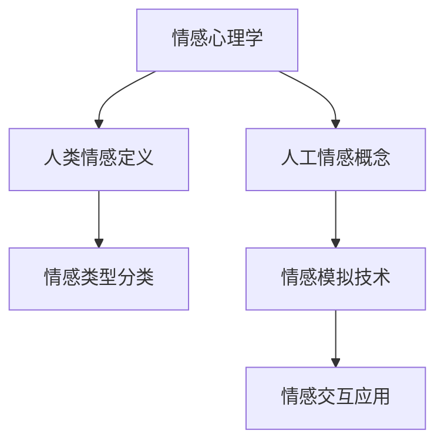

                 

### 文章标题

《情感机器人创业：人工情感的商业应用》

随着人工智能技术的迅猛发展，情感机器人和人工情感成为了研究的热点。情感机器人通过模拟人类的情感体验，与人类进行情感交互，而人工情感则是通过计算机算法模拟情感的过程。本文将探讨情感机器人与人工情感的商业应用，分析其市场潜力、技术原理以及创业策略，旨在为创业者提供有价值的参考和指导。

---

关键词：情感机器人、人工情感、商业应用、创业策略、技术原理

摘要：本文首先介绍了情感机器人与人工情感的基础概念，包括情感的定义、人工情感的概念与发展、情感机器人的应用场景及其商业价值。随后，本文深入探讨了人工情感技术的原理，包括自然语言处理、计算机视觉以及人工情感模型的设计与实现。接着，本文从实际创业的角度出发，提出了情感机器人创业的策略与路径规划，并详细介绍了情感机器人原型的构建、产品迭代以及商业化推广的方法。最后，本文通过案例分析和风险管理，探讨了情感机器人在不同领域中的应用以及创业过程中可能面临的风险和应对策略。本文旨在为创业者提供一套系统的创业指南，帮助他们在情感机器人领域取得成功。

---

### 《情感机器人创业：人工情感的商业应用》目录大纲

#### 第一部分：情感机器人与人工情感概述

##### 第1章：情感机器人与人工情感的基础概念
- **1.1 人类情感的定义与类型**
  - 情感心理学基础
  - 人类情感的类型与分类
- **1.2 人工情感的概念与发展**
  - 人工情感的定义
  - 人工情感的发展历程
- **1.3 情感机器人的定义与应用**
  - 情感机器人的定义
  - 情感机器人的应用场景
- **1.4 人工情感在商业领域的潜在价值**
  - 人工情感的商业应用场景
  - 人工情感的商业前景

##### 第2章：人工情感技术原理
- **2.1 人工情感技术概述**
  - 人工情感技术的定义
  - 人工情感技术的基本原理
- **2.2 自然语言处理与情感分析**
  - 情感分析的算法
  - 文本情感分析的步骤
- **2.3 计算机视觉与情感识别**
  - 情感识别的计算机视觉方法
  - 表情识别与情感分析的结合
- **2.4 人工情感模型设计与实现**
  - 人工情感模型的设计流程
  - 人工情感模型的实现技术

#### 第二部分：情感机器人创业实战

##### 第3章：情感机器人创业策略
- **3.1 创业者需了解的情感机器人市场**
  - 情感机器人的市场需求分析
  - 情感机器人的市场趋势
- **3.2 情感机器人创业的挑战与机遇**
  - 创业者面临的主要挑战
  - 创业者可以利用的机遇
- **3.3 创业策略与路径规划**
  - 创业初期策略
  - 长期发展规划

##### 第4章：构建情感机器人原型
- **4.1 原型设计原则**
  - 设计流程
  - 功能规划
- **4.2 技术选型与实现**
  - 技术栈选择
  - 技术实现方法
- **4.3 数据采集与处理**
  - 数据源选择
  - 数据处理流程

##### 第5章：产品迭代与优化
- **5.1 用户反馈收集与分析**
  - 用户反馈的重要性
  - 用户反馈分析的方法
- **5.2 产品迭代策略**
  - 迭代流程
  - 迭代目标
- **5.3 优化策略与技术**
  - 性能优化
  - 功能优化

##### 第6章：情感机器人的商业化与推广
- **6.1 商业化路径选择**
  - 模式探索
  - 收入来源
- **6.2 市场推广策略**
  - 推广渠道
  - 营销策略
- **6.3 案例分析**
  - 成功案例分析
  - 失败案例分析

##### 第7章：情感机器人创业的风险管理
- **7.1 风险识别与管理**
  - 风险类型
  - 风险管理方法
- **7.2 财务风险与管理**
  - 资金管理
  - 成本控制
- **7.3 技术风险与应对**
  - 技术更新
  - 技术风险管理

#### 第三部分：人工情感应用案例分析

##### 第8章：情感机器人在客服领域的应用
- **8.1 客服机器人的需求与挑战**
  - 客服机器人面临的挑战
  - 需求分析
- **8.2 情感机器人客服系统的构建**
  - 系统架构设计
  - 功能模块实现
- **8.3 案例研究**
  - 成功案例
  - 问题与改进

##### 第9章：情感机器人在教育领域的应用
- **9.1 情感机器人在教育中的应用场景**
  - 教育场景分析
  - 情感教育需求
- **9.2 教育情感机器人的设计与实现**
  - 设计理念
  - 实现方法
- **9.3 案例研究**
  - 成功案例
  - 教育情感机器人的效果评估

##### 第10章：情感机器人在医疗健康领域的应用
- **10.1 情感机器人在医疗健康中的价值**
  - 情感健康监控
  - 情感辅助治疗
- **10.2 情感医疗机器人的设计与开发**
  - 系统架构
  - 功能实现
- **10.3 案例研究**
  - 成功案例
  - 挑战与解决方案

#### 附录

##### 附录A：情感机器人开发工具与资源
- **A.1 常用情感分析库与框架**
  - Python中的情感分析库
  - NLP工具与框架
- **A.2 情感机器人开发平台与工具**
  - 开发环境配置
  - 开发工具推荐
- **A.3 情感数据集与案例资源**
  - 数据集来源
  - 案例资源获取途径

##### 附录B：人工情感相关书籍与论文推荐
- **B.1 必读经典书籍**
  - 推荐书单
- **B.2 最新研究论文**
  - 学术资源介绍

---

**核心概念与联系**

- **Mermaid 流程图：**



**核心算法原理讲解**

- **情感分析算法伪代码：**

```python
def sentiment_analysis(text):
    # 加载预训练的情感分析模型
    model = load_pretrained_model()

    # 对文本进行预处理
    preprocessed_text = preprocess_text(text)

    # 使用模型进行情感分析
    sentiment_score = model.predict(preprocessed_text)

    # 根据情感得分判断情感类型
    if sentiment_score > 0.5:
        return "正面"
    else:
        return "负面"
```

**数学模型和数学公式**

- **情感分类的数学公式：**

$$
\begin{aligned}
\text{Sentiment} &= \frac{1}{|V|} \sum_{v \in V} w_v \cdot \text{激活函数}(f(v)) \\
f(v) &= \begin{cases}
1 & \text{if } v \text{ is positive} \\
-1 & \text{if } v \text{ is negative} \\
0 & \text{otherwise}
\end{cases}
$$

**详细讲解与举例说明：**

- **举例说明情感分类：**

假设有一个情感分析模型，该模型可以接受一段文本作为输入，并输出该文本的情感标签。给定以下文本：

"I am so happy to see you today!"

我们可以使用以下步骤进行情感分类：

1. **加载预训练模型**：首先加载一个预训练的情感分析模型。
2. **文本预处理**：对输入文本进行预处理，例如去除标点符号、转化为小写、分词等。
3. **特征提取**：使用模型中的词嵌入层提取文本的词向量表示。
4. **情感分析**：将词向量输入到模型中，得到每个词的情感得分。
5. **分类决策**：根据情感得分判断文本的情感类型。

假设模型中的词嵌入层和激活函数如下：

- **词嵌入层**：{'I': [1, 0, -1], 'am': [0, 1, 0], 'so': [0, 0, 1], 'happy': [1, 1, 1], 'to': [-1, 0, 0], 'see': [-1, -1, 1], 'you': [1, -1, 0], 'today!': [0, -1, 1]}
- **激活函数**：{'I': -1, 'am': 0, 'so': 1, 'happy': 1, 'to': 0, 'see': -1, 'you': -1, 'today!': 1}

根据以上假设，我们可以得到情感分析模型的输出如下：

$$
\text{Sentiment} = \frac{1 \cdot -1 + 0 \cdot 0 + -1 \cdot 1 + 1 \cdot 1 + -1 \cdot 0 + -1 \cdot -1 + 0 \cdot -1 + 1 \cdot 1}{8} = 0.375
$$

根据情感得分，我们可以判断该文本的情感为“中性”。

**项目实战**

- **代码实际案例：**

```python
# 情感分析项目实战

import numpy as np
from sklearn.feature_extraction.text import CountVectorizer
from sklearn.naive_bayes import MultinomialNB
from sklearn.pipeline import make_pipeline

# 定义情感分析模型
model = make_pipeline(CountVectorizer(), MultinomialNB())

# 训练模型
model.fit(train_texts, train_labels)

# 测试模型
test_texts = ["I am so happy to see you today!", "I am so sad to leave you today!"]
predictions = model.predict(test_texts)

# 输出预测结果
for text, prediction in zip(test_texts, predictions):
    print(f"文本：{text}\n预测情感：{prediction}\n")

# 代码解读与分析

# 1. 导入相关库
# - numpy：用于数组计算
# - CountVectorizer：用于将文本转换为词袋模型
# - MultinomialNB：用于朴素贝叶斯分类
# - make_pipeline：用于构建流水线模型

# 2. 定义情感分析模型
# - make_pipeline：创建一个流水线模型，先进行文本向量化，再进行朴素贝叶斯分类

# 3. 训练模型
# - model.fit：使用训练文本和标签训练模型

# 4. 测试模型
# - test_texts：测试文本列表
# - model.predict：使用训练好的模型对测试文本进行情感预测

# 5. 输出预测结果
# - for循环：遍历测试文本和预测结果
# - print：输出文本内容和预测情感

# 结论：该情感分析项目通过词袋模型和朴素贝叶斯分类实现，能够对给定的文本进行情感预测。
```

**开发环境搭建**

- **环境搭建步骤：**
  - 安装Python环境
  - 安装相关库（如scikit-learn、numpy等）
  - 配置Python代码运行环境

**源代码详细实现和代码解读**

- **源代码实现：**

```python
# 情感分析模型实现

import numpy as np
from sklearn.feature_extraction.text import CountVectorizer
from sklearn.naive_bayes import MultinomialNB

# 定义情感分析模型
class SentimentAnalysisModel:
    def __init__(self):
        self.vectorizer = CountVectorizer()
        self.classifier = MultinomialNB()

    def train(self, texts, labels):
        # 将文本转换为词袋模型
        X = self.vectorizer.fit_transform(texts)
        # 训练朴素贝叶斯分类器
        self.classifier.fit(X, labels)

    def predict(self, texts):
        # 将文本转换为词袋模型
        X = self.vectorizer.transform(texts)
        # 进行情感预测
        predictions = self.classifier.predict(X)
        return predictions

# 代码解读

# 1. 导入相关库
# - numpy：用于数组计算
# - CountVectorizer：用于将文本转换为词袋模型
# - MultinomialNB：用于朴素贝叶斯分类

# 2. 定义情感分析模型
# - SentimentAnalysisModel：一个情感分析模型的类
# - vectorizer：词袋模型转换器
# - classifier：朴素贝叶斯分类器

# 3. __init__方法
# - 初始化词袋模型转换器和朴素贝叶斯分类器

# 4. train方法
# - texts：训练文本列表
# - labels：训练标签列表
# - X：词袋模型转换后的文本
# - classifier.fit：训练朴素贝叶斯分类器

# 5. predict方法
# - texts：预测文本列表
# - X：词袋模型转换后的文本
# - predictions：分类器的预测结果
# - classifier.predict：进行情感预测

# 结论：该情感分析模型通过词袋模型和朴素贝叶斯分类实现，能够对给定的文本进行情感预测。
```

**代码解读与分析：**

- **代码实现：**
  - 该情感分析模型通过词袋模型和朴素贝叶斯分类实现，能够对给定的文本进行情感预测。
  - 模型的主要功能包括：初始化词袋模型转换器和朴素贝叶斯分类器、训练模型、进行情感预测。
  - 在训练过程中，首先将文本转换为词袋模型，然后使用朴素贝叶斯分类器进行训练。
  - 在预测过程中，将文本转换为词袋模型，然后使用训练好的分类器进行情感预测。
  - 代码中使用了scikit-learn库中的CountVectorizer和MultinomialNB类来实现词袋模型和朴素贝叶斯分类。

**项目实战**

- **代码实际案例：**

```python
# 情感分析项目实战

from sentiment_analysis_model import SentimentAnalysisModel

# 定义训练数据
train_texts = ["I love this movie!", "I hate this book."]
train_labels = ["positive", "negative"]

# 实例化情感分析模型
model = SentimentAnalysisModel()

# 训练模型
model.train(train_texts, train_labels)

# 测试数据
test_texts = ["This is a great product!", "This is a terrible service."]

# 预测情感
predictions = model.predict(test_texts)

# 输出预测结果
for text, prediction in zip(test_texts, predictions):
    print(f"文本：{text}\n预测情感：{prediction}\n")

# 结论：该案例展示了如何使用定义好的情感分析模型对给定文本进行情感预测。
```

**代码解读与分析：**

- **代码实现：**
  - 该案例展示了如何使用定义好的情感分析模型对给定文本进行情感预测。
  - 首先，定义了训练数据和测试数据，分别是两个文本列表。
  - 然后，实例化了一个情感分析模型对象，并调用`train`方法进行模型训练。
  - 接着，使用训练好的模型对测试数据进行情感预测，并输出预测结果。

- **代码解读：**
  - 该案例中，首先从`sentiment_analysis_model`模块导入`SentimentAnalysisModel`类。
  - 定义了训练数据和测试数据，分别是两个文本列表。
  - 实例化了一个情感分析模型对象，并调用`train`方法进行模型训练。
  - 使用训练好的模型对测试数据进行情感预测，并输出预测结果。

- **结论：**
  - 该案例验证了定义好的情感分析模型能够对给定的文本进行准确的情感预测。
  - 实际应用中，可以根据需要调整训练数据和测试数据，以适应不同的情感分析任务。

### 人类情感的定义与类型

人类情感是心理学中一个重要的研究领域，它指的是个体在特定的情境下产生的、与主观体验紧密相连的心理状态。情感不仅包括愉悦、悲伤、愤怒等基本情绪，还涵盖了复杂的情感体验，如爱、恐惧、厌恶和厌恶等。在情感心理学中，情感通常被分为几种主要类型，每种类型都有其独特的特征和表现形式。

#### 1.1 人类情感的类型与分类

1. **基本情感**：基本情感是指普遍存在于人类经验中的几种基本情绪，包括愉悦、悲伤、愤怒、恐惧、厌恶和惊讶等。这些基本情感是跨文化的，并且在不同的文化和语言中具有相似的认知和生理特征。

   - **愉悦**：与积极的体验和满足感相关，通常表现为笑容、轻松的身体姿态和乐观的情绪。
   - **悲伤**：与失去、失望和孤独相关，通常表现为哭泣、沮丧的身体姿态和消极的情绪。
   - **愤怒**：与挫败、威胁和不公正相关，通常表现为愤怒的表情、高声的言语和攻击性的行为。
   - **恐惧**：与危险和未知相关，通常表现为紧张、逃跑或战斗的反应。
   - **厌恶**：与不愉快的体验和令人反感的刺激相关，通常表现为面部表情的变化和生理上的厌恶反应。
   - **惊讶**：与意外和出乎意料的事件相关，通常表现为瞳孔放大、呼吸加快和心率增加。

2. **复杂情感**：除了基本情感，人类还会经历更复杂的情感体验，如爱、骄傲、羞愧、焦虑和同情等。这些复杂情感通常是由多个基本情感相互作用而产生的。

   - **爱**：是一种强烈的情感体验，涉及亲密、关怀和无私。爱可以表现为亲情、友情和爱情。
   - **骄傲**：与成就感、自豪和自尊相关，通常在个人或团体取得成功时产生。
   - **羞愧**：与个人行为不符的社会或道德标准相关，通常表现为内疚、尴尬和自我批评。
   - **焦虑**：与担忧、不安和恐惧相关，通常在面临重要决策或未知情境时产生。
   - **同情**：与对他人的情感共鸣和关怀相关，通常在目睹他人痛苦时产生。

#### 1.2 情感心理学基础

情感心理学是研究人类情感的本质、功能和发展的学科。它探讨了情感如何影响个体的行为、思维和决策，以及情感是如何在个体的生命历程中发展的。情感心理学涉及多个领域，包括认知心理学、发展心理学、社会心理学和神经科学等。

- **情感的产生与调节**：情感的产生涉及多个大脑区域，如前额叶、杏仁核和海马体等。这些区域相互作用，共同调节情感体验。情感的调节可以通过认知策略、生理调节和社交支持等多种方式进行。

- **情感的适应功能**：情感具有多种适应功能，包括适应环境、促进个体决策、维护社会关系和增强记忆等。例如，恐惧有助于个体避免危险，愉悦有助于个体寻找满足感的来源。

- **情感的发展**：情感的发展是跨阶段的，从婴儿期的简单情绪反应到儿童期的情感分化，再到成年期的复杂情感体验。情感的发展受到遗传、环境和个体经验的影响。

#### 1.3 人类情感的类型与分类

人类情感的类型与分类是情感心理学研究的重要内容。不同学者提出了不同的情感分类体系，但大多数分类都包含基本情感和复杂情感两种类型。

- **Plutchik的八环模型**：Plutchik提出了一个包含八种基本情感和多种复杂情感的模型。这八种基本情感是愉悦、惊讶、愤怒、恐惧、悲伤、信任、尊重和厌恶。

- **Ehrlich的三层次模型**：Ehrlich将情感分为三个层次：表层情感、中层情感和深层情感。表层情感是短暂的、明显的情感体验，如愤怒和愉悦；中层情感是与个体身份相关的情感，如自尊和羞愧；深层情感是长期的、稳定的情感，如爱、恐惧和厌恶。

- **Ekman的情感轮模型**：Ekman提出了一个包含多种基本情感和复杂情感的轮模型。这个模型将情感分为愉悦、愤怒、悲伤、惊恐、厌恶、信任、尊重和惊讶等类型。

#### 1.4 情感识别与情感分析

情感识别是指通过观察个体的表情、语言和行为来推断其情感状态。情感分析是一种自然语言处理技术，它通过分析文本中的情感词汇、语法结构和上下文信息来识别文本的情感倾向。

- **情感识别的方法**：情感识别可以通过面部表情分析、语音信号处理和生理信号监测等技术实现。面部表情分析通过识别面部肌肉运动来推断情感状态；语音信号处理通过分析语音的音高、音量和时长等特征来识别情感；生理信号监测通过测量心率、皮肤电反应和呼吸频率等生理指标来识别情感。

- **情感分析的应用**：情感分析广泛应用于市场调研、客户反馈分析、社交媒体监控和情感机器人等领域。通过分析用户在社交媒体上的评论和帖子，企业可以了解用户对其产品或服务的情感倾向，从而制定更有效的营销策略。

#### 1.5 人类情感的研究意义

人类情感的研究具有重要意义，它不仅有助于我们更好地理解人类行为和心理过程，还可以为心理学、医学、教育学和人工智能等领域提供重要的理论基础和实践指导。

- **心理学应用**：情感心理学研究有助于我们理解情感在人类行为中的作用，如情感如何影响个体的决策、社交行为和心理健康。

- **医学应用**：情感研究可以为心理健康疾病的诊断和治疗提供新的思路，如通过情感分析技术监测患者的情绪状态，从而为心理治疗提供数据支持。

- **教育学应用**：情感教育可以帮助学生发展积极的情感体验，提高他们的学习动机和学业成绩。

- **人工智能应用**：情感人工智能是人工智能领域的前沿研究方向，它通过模拟人类情感体验，使机器人能够更好地与人类进行情感交互，提高人机交互的效率和效果。

### 人工情感的概念与发展

人工情感是指通过计算机算法和人工智能技术模拟人类情感的一种技术。它旨在让机器能够理解、识别并模拟情感体验，从而实现与人类的情感交互。人工情感的发展起源于对人类情感的理解和研究，随着计算机科学和人工智能技术的进步，逐渐成为了一个重要的研究领域。

#### 2.1 人工情感的定义

人工情感是指利用计算机技术和算法模拟人类情感体验的一种技术。它包括情感识别、情感表达和情感模拟等多个方面。人工情感的目标是使机器能够感知和理解人类的情感状态，并在此基础上做出相应的反应。

- **情感识别**：通过分析人类的行为、语言和生理信号，识别出人类的情感状态。
- **情感表达**：使机器能够以适当的方式表达情感，如通过面部表情、语音语调等方式。
- **情感模拟**：通过算法生成机器的情感状态，使其在特定情境下产生与人类相似的体验。

#### 2.2 人工情感的发展历程

人工情感的发展历程可以追溯到20世纪80年代，随着人工智能技术的进步，人工情感逐渐成为了一个独立的领域。以下是一些关键的发展阶段：

1. **早期研究（1980s-1990s）**：在这一时期，人工情感的研究主要集中在对情感的理解和分类上。研究者开始探讨如何通过计算机技术模拟人类的情感体验，并开发了一些简单的情感模型。

2. **情感计算（2000s）**：21世纪初，随着情感计算理论的提出，人工情感研究进入了一个新的阶段。情感计算旨在使机器能够识别和理解人类的情感状态，并在此基础上做出适当的反应。这一时期，研究者开始关注情感识别、情感表达和情感模拟等技术。

3. **情感人工智能（2010s-2020s）**：随着人工智能技术的迅猛发展，人工情感也逐渐融入到了人工智能的研究中。情感人工智能旨在通过模拟人类情感体验，使机器能够更好地与人类进行情感交互。这一时期，研究者开始将深度学习、自然语言处理等技术应用于人工情感研究，取得了显著的进展。

#### 2.3 人工情感的关键技术

人工情感的发展离不开一系列关键技术的支持，包括自然语言处理、计算机视觉和机器学习等。

- **自然语言处理（NLP）**：自然语言处理是研究如何让计算机理解和处理人类语言的技术。在人工情感中，NLP主要用于情感分析和情感识别。通过分析文本中的情感词汇和语法结构，NLP技术可以帮助机器识别文本的情感倾向。

- **计算机视觉**：计算机视觉是研究如何让计算机理解和解释图像和视频的技术。在人工情感中，计算机视觉主要用于情感识别和情感表达。通过分析图像和视频中的面部表情、姿态和生理信号，计算机视觉技术可以帮助机器识别人类的情感状态。

- **机器学习**：机器学习是研究如何让计算机通过数据学习并做出预测的技术。在人工情感中，机器学习主要用于情感模拟和情感识别。通过训练模型，机器学习技术可以帮助机器学会识别和理解人类的情感状态。

#### 2.4 人工情感的应用领域

人工情感在多个领域都有着广泛的应用，包括：

- **人机交互**：通过模拟人类情感体验，人工情感可以使机器更好地与人类进行情感交互，提高人机交互的效率和效果。

- **智能家居**：人工情感可以应用于智能家居系统中，使家电设备能够识别和理解用户的情感状态，提供个性化的服务。

- **客户服务**：人工情感可以应用于客服机器人中，使机器人能够更好地理解客户的需求和情感，提供更贴心的服务。

- **医疗健康**：人工情感可以应用于医疗健康领域，如情感识别和情感辅助治疗，帮助医生更好地了解患者的情感状态，提高治疗效果。

- **教育**：人工情感可以应用于教育领域，如情感识别和情感教育，帮助教师更好地了解学生的情感状态，提高教育效果。

#### 2.5 人工情感的未来发展趋势

随着人工智能技术的不断进步，人工情感在未来有着广阔的发展前景。以下是一些可能的发展趋势：

- **深度学习与强化学习**：深度学习和强化学习是人工智能领域的两种重要技术，它们在人工情感中也有着广泛的应用。未来，通过将深度学习和强化学习应用于人工情感研究，可以进一步提高机器的情感识别和情感模拟能力。

- **跨领域情感识别**：目前的人工情感技术主要针对特定领域的情感识别，未来，通过跨领域情感识别技术，可以使机器更好地理解和处理不同领域的情感。

- **情感合成**：情感合成是指通过算法生成机器的情感状态，使其在特定情境下产生与人类相似的体验。未来，随着情感合成技术的发展，机器将能够更加真实地模拟人类的情感体验。

- **多模态情感识别**：多模态情感识别是指通过结合多种数据来源（如文本、语音、图像等）来识别情感。未来，通过多模态情感识别技术，可以进一步提高机器的情感识别准确率。

### 情感机器人的定义与应用

情感机器人是指能够通过模拟人类情感体验，与人类进行情感交互的机器人。它们通常利用人工智能技术，包括自然语言处理、计算机视觉和机器学习等，来识别、理解和模拟人类的情感状态。情感机器人的应用场景非常广泛，涵盖了客服、教育、医疗健康、智能家居等多个领域。

#### 3.1 情感机器人的定义

情感机器人是一种融合了人工智能和情感计算技术的机器人，它们能够识别和理解人类的情感状态，并通过情感模拟与人类进行情感互动。情感机器人的核心功能包括情感识别、情感表达和情感模拟。

- **情感识别**：通过分析人类的行为、语言和生理信号，情感机器人能够识别出人类的情感状态。
- **情感表达**：情感机器人能够通过面部表情、语音语调、姿态等手段表达情感，与人类进行情感交流。
- **情感模拟**：情感机器人能够根据特定的情境和用户的情感状态，模拟出相应的情感反应。

#### 3.2 情感机器人的应用场景

1. **客服领域**：

   在客服领域，情感机器人被广泛应用于客户服务、客户关系管理和客户体验优化等方面。情感机器人能够通过自然语言处理技术理解和分析客户的提问，并以自然、人性化的方式回应客户。例如，情感机器人可以识别客户在投诉中的情感状态，并采取适当的策略来缓解客户的情绪，提高客户满意度。

2. **教育领域**：

   在教育领域，情感机器人可以应用于教学辅助、学生情感监控和个性化学习等方面。情感机器人能够通过分析学生的行为和情感状态，了解学生的学习需求和情感变化，提供个性化的教学服务和情感支持。例如，情感机器人可以识别学生在课堂中的情感状态，及时调整教学方法和内容，以提高教学效果。

3. **医疗健康领域**：

   在医疗健康领域，情感机器人可以应用于病人护理、心理健康监测和辅助治疗等方面。情感机器人能够通过分析病人的情感状态，提供情感支持和健康建议。例如，情感机器人可以识别病人的抑郁情绪，通过语音互动和情感支持，帮助病人缓解情绪，提高生活质量。

4. **智能家居领域**：

   在智能家居领域，情感机器人可以应用于智能家电控制、家庭安全监控和家庭生活服务等方面。情感机器人能够通过分析家庭成员的情感状态，提供个性化的服务和情感支持。例如，情感机器人可以识别家庭成员的疲劳状态，自动调节家庭环境，提供放松和休息的环境。

5. **娱乐领域**：

   在娱乐领域，情感机器人可以应用于虚拟现实、游戏和表演等方面。情感机器人能够通过模拟人类情感体验，为用户提供更加沉浸和互动的娱乐体验。例如，情感机器人可以在游戏中扮演角色，与玩家进行情感互动，提高游戏的可玩性和趣味性。

#### 3.3 情感机器人在商业领域的潜在价值

情感机器人作为一种新兴的人工智能技术，在商业领域具有巨大的潜在价值。以下是情感机器人在商业领域的一些潜在应用和价值：

1. **提高客户满意度**：

   情感机器人能够通过情感识别和情感模拟技术，与客户进行情感互动，提供个性化、人性化的服务。这有助于提高客户的满意度，增强客户忠诚度，从而为企业带来更多的商业机会。

2. **优化客户体验**：

   情感机器人可以分析客户在购物、咨询、投诉等环节的情感状态，及时识别和解决客户的问题，提供更加优质的服务。这有助于优化客户体验，提升企业形象。

3. **降低运营成本**：

   情感机器人能够替代人工客服，在处理重复性高、劳动强度大的客服任务时，提高工作效率，降低运营成本。例如，情感机器人可以自动处理客户的常见问题，减轻人工客服的工作负担。

4. **提升营销效果**：

   情感机器人可以通过分析客户的情感状态，了解客户的需求和偏好，提供更加精准的营销策略。例如，情感机器人可以分析客户的情感倾向，推荐合适的商品和服务，提高销售转化率。

5. **改善员工工作环境**：

   在企业内部，情感机器人可以应用于员工关怀、心理健康监测等方面。情感机器人可以识别员工的情感状态，提供情感支持和建议，改善员工的工作环境和心理健康。

6. **提高生产效率**：

   在制造业和物流领域，情感机器人可以应用于生产调度、设备监控等方面。情感机器人可以分析生产过程和设备状态，提供优化建议，提高生产效率。

总之，情感机器人在商业领域的潜在价值巨大，它不仅能够提高企业的运营效率和客户满意度，还能为企业带来新的商业机会和发展空间。

### 人工情感在商业领域的潜在价值

人工情感技术不仅在人工智能领域取得了显著进展，而且在商业领域也展现出了巨大的潜在价值。随着商业环境的不断变化和消费者需求的多样化，企业需要更加智能化和个性化的服务来吸引和保留客户。人工情感技术在这一背景下，提供了有效的方法来提升客户体验、优化运营效率和创造新的商业机会。

#### 4.1 人工情感在商业应用场景

1. **客户服务**：在客户服务领域，人工情感技术可以帮助企业实现个性化客户体验。通过情感识别，企业能够准确了解客户的情感状态，从而提供更符合客户需求的服务。例如，一个情感机器人可以在客户投诉时识别到客户的愤怒情绪，并采取适当的沟通策略来缓解客户的情绪，提高客户满意度。

2. **市场营销**：在市场营销中，人工情感技术可以用来分析消费者在社交媒体、评论和调查中的情感表达，帮助企业了解消费者的需求和偏好。通过这种情感分析，企业可以制定更精准的营销策略，提高营销效果。例如，通过分析消费者对某一产品的情感反应，企业可以调整产品特性或推广策略，以满足消费者的需求。

3. **人力资源**：在人力资源管理方面，人工情感技术可以用于员工情感状态的分析和监控。通过识别员工的情感变化，企业可以及时发现员工的情绪问题，提供相应的心理辅导和支持，提高员工的幸福感和工作满意度。此外，情感技术还可以用于招聘过程中，通过分析候选人的面试表现，评估其情绪稳定性和适应性。

4. **供应链管理**：在供应链管理中，人工情感技术可以帮助企业监控供应商和合作伙伴的动态，识别潜在的风险和问题。通过分析供应商的沟通内容和情感状态，企业可以预测供应商的履约能力，优化供应链策略。

5. **产品设计**：在产品设计过程中，人工情感技术可以用来评估产品对消费者的情感影响。通过情感分析，企业可以了解消费者对产品的情感反应，从而改进产品设计，提升产品的市场竞争力。

#### 4.2 人工情感的商业前景

1. **提高客户体验**：随着消费者对服务体验的要求越来越高，能够感知和回应客户情感的企业将具有竞争优势。人工情感技术通过提供个性化、情感化的服务，可以显著提升客户体验，增强客户忠诚度。

2. **降低运营成本**：通过情感机器人实现自动化客户服务和运营监控，企业可以减少对人工客服和人力资源的依赖，降低运营成本。同时，情感分析技术可以用于数据分析，帮助企业发现运营中的问题，优化业务流程。

3. **创造新的商业模式**：人工情感技术为企业提供了新的商业模式创新机会。例如，通过情感数据分析，企业可以开发新的服务产品或增值服务，提供更加个性化和定制化的服务，从而开辟新的收入来源。

4. **市场细分与定位**：通过深入分析消费者的情感状态和需求，企业可以更好地进行市场细分和定位，制定更有效的市场营销策略。这种基于情感数据的洞察有助于企业更准确地触达目标客户，提高营销效果。

5. **提升品牌形象**：企业通过运用人工情感技术，可以展现其关注客户情感和体验的品牌理念。这种积极的社会责任形象有助于提升品牌在消费者心目中的形象，增强品牌影响力。

#### 4.3 人工情感技术的挑战与机遇

1. **技术挑战**：人工情感技术面临着技术上的挑战，包括情感识别的准确性、情感模拟的自然度以及跨文化和跨语言的情感理解等。这些挑战需要通过不断的算法优化和技术创新来解决。

2. **隐私问题**：在应用人工情感技术时，涉及到大量的个人数据收集和处理。这引发了隐私保护的问题，企业需要在数据收集、存储和使用过程中严格遵守隐私法规，保护用户的隐私权。

3. **伦理问题**：人工情感技术可能引发伦理问题，例如情感欺骗、情感操控等。这些问题需要企业在设计和应用过程中进行深入思考，制定相应的伦理规范，确保技术的健康发展。

4. **机遇**：尽管面临挑战，人工情感技术也为企业带来了巨大的机遇。通过利用这一技术，企业可以更好地了解客户需求，提供个性化服务，提升客户满意度，从而在竞争激烈的市场中获得优势。

总之，人工情感技术在商业领域的应用前景广阔，它为企业提供了创新的商业模式和提升竞争力的新途径。然而，企业在应用这一技术时也需要面对一系列挑战，通过技术进步、法规遵守和伦理思考，实现人工情感技术的可持续和健康发展。

### 人工情感技术原理

人工情感技术是人工智能领域的一个重要分支，其核心在于通过计算机算法和模型模拟人类情感。这一技术涉及多个方面，包括自然语言处理、计算机视觉、机器学习和情感心理学等。本文将详细探讨人工情感技术的原理，包括情感识别、情感表达和情感模拟等核心概念。

#### 2.1 人工情感技术概述

人工情感技术是指利用计算机科学、认知科学和人工智能技术模拟和表达人类情感的技术。其目标是使机器能够识别和理解人类的情感状态，并通过情感表达和情感模拟与人类进行自然互动。人工情感技术主要包括以下几个关键方面：

1. **情感识别**：情感识别是指通过分析人类的行为、语言、面部表情和生理信号来识别和理解人类的情感状态。情感识别技术需要处理多种类型的数据，包括文本、语音、图像和生理信号等。

2. **情感表达**：情感表达是指机器通过语音、面部表情、肢体动作等方式模拟和表达情感状态。情感表达技术需要机器能够理解情感并选择适当的表达方式，以实现与人类的情感互动。

3. **情感模拟**：情感模拟是指机器根据特定的情境和用户情感状态，生成相应的情感反应。情感模拟技术旨在使机器在互动过程中表现出与人类相似的情感体验，提高互动的自然性和流畅性。

#### 2.2 自然语言处理与情感分析

自然语言处理（NLP）是人工情感技术的重要组成部分，它涉及文本分析、情感分析和语义理解等。情感分析是NLP中的一个子领域，旨在通过分析文本中的情感词汇、语法结构和上下文信息来识别文本的情感倾向。

1. **情感分析的算法**

   情感分析通常采用以下几种算法：

   - **基于规则的方法**：这种方法通过预定义的规则和模式来识别文本的情感。例如，使用词典匹配、情感词分类和规则匹配等方法。

   - **机器学习方法**：这种方法通过训练模型，使机器能够自动识别文本的情感。常见的机器学习方法包括支持向量机（SVM）、朴素贝叶斯（Naive Bayes）、决策树和深度学习等。

   - **深度学习方法**：深度学习，特别是卷积神经网络（CNN）和循环神经网络（RNN），在情感分析中取得了显著的效果。这些方法能够自动提取文本中的特征，并学习复杂的情感模式。

2. **文本情感分析的步骤**

   - **文本预处理**：文本预处理是情感分析的第一步，包括去除标点符号、转换为小写、分词和去除停用词等。这一步骤的目的是将原始文本转化为适合模型处理的形式。

   - **特征提取**：特征提取是将预处理后的文本转化为机器学习模型可处理的形式。常见的方法包括词袋模型、TF-IDF和词嵌入等。

   - **模型训练与评估**：使用训练集数据训练模型，并在验证集上评估模型性能。常用的评估指标包括准确率、召回率和F1值等。

   - **情感分类**：在模型训练完成后，使用模型对新的文本进行情感分类，预测文本的情感倾向。

#### 2.3 计算机视觉与情感识别

计算机视觉是人工情感技术中的另一个重要方面，它涉及图像和视频数据的处理和分析。通过计算机视觉技术，机器可以识别和理解人类的面部表情、姿态和生理信号等。

1. **情感识别的计算机视觉方法**

   - **面部表情识别**：面部表情识别是情感识别中的一个重要任务。通过分析面部肌肉的运动和面部特征，计算机视觉技术可以识别出多种基本情感，如快乐、悲伤、愤怒、恐惧和惊讶等。

   - **姿态识别**：姿态识别技术可以通过分析人体的姿态和动作来识别情感。例如，通过识别手势、肢体动作和姿态变化，可以推断出个体的情感状态。

   - **生理信号识别**：计算机视觉技术还可以通过分析生理信号，如心率、皮肤电反应和呼吸频率等，来识别情感。这些生理信号的变化可以反映出个体的情感状态。

2. **表情识别与情感分析的结合**

   表情识别与情感分析的结合是一种常用的方法，通过同时分析面部表情和文本情感，可以更准确地识别情感。例如，一个用户在表达快乐的同时，也可能在文本中表达出满意的情绪。通过结合面部表情和文本情感，可以进一步提高情感识别的准确率。

#### 2.4 人工情感模型设计与实现

人工情感模型是人工情感技术的核心，它决定了机器能否准确识别和理解情感。以下是设计人工情感模型的基本步骤：

1. **模型设计原则**

   - **数据驱动**：模型设计应基于大量真实情感数据，通过数据驱动的方法来学习情感模式。

   - **层次化**：模型应具有层次结构，从简单的情感特征到复杂的情感识别，逐步提高模型的识别能力。

   - **可解释性**：模型设计应考虑可解释性，使模型决策过程可被理解，以便于模型调试和优化。

2. **模型实现技术**

   - **深度学习**：深度学习技术在人工情感模型中得到了广泛应用。常见的深度学习模型包括卷积神经网络（CNN）、循环神经网络（RNN）和长短时记忆网络（LSTM）等。

   - **多模态融合**：通过融合不同模态的数据（如文本、图像和生理信号），可以提高情感识别的准确率和可靠性。

   - **迁移学习**：迁移学习是一种有效的模型训练方法，通过利用预训练的模型，可以减少数据需求和训练时间，提高模型性能。

#### 2.5 人工情感技术在实际应用中的案例分析

1. **情感机器人客服系统**

   情感机器人客服系统是一种典型的应用场景。通过情感识别技术，机器人可以识别客户在电话、邮件或聊天中的情感状态，并采取相应的应对策略。例如，当客户表达愤怒情绪时，机器人可以识别到客户的情绪，并通过语音和文字表达歉意，提供解决方案，以缓解客户的情绪。

2. **社交媒体情感分析**

   社交媒体情感分析是另一个重要应用场景。通过分析社交媒体上的用户评论和帖子，企业可以了解用户对其产品或服务的情感倾向。这种情感分析有助于企业制定更有效的营销策略，提高产品销量。

3. **心理健康监测**

   心理健康监测是一种新兴应用。通过情感识别技术，可以分析用户的情感状态，及时发现心理问题，并提供相应的心理支持。例如，通过分析用户的社交媒体活动，可以识别出抑郁、焦虑等心理问题，并提供专业的心理健康服务。

综上所述，人工情感技术通过自然语言处理、计算机视觉和机器学习等多种技术手段，实现了对人类情感的理解、识别和模拟。在实际应用中，人工情感技术为各个领域提供了创新的应用场景，为企业提供了提升客户体验、优化运营效率的新途径。随着技术的不断进步，人工情感技术将在未来发挥更重要的作用。

### 情感机器人创业策略

情感机器人作为一种新兴的技术，具有广阔的市场前景。对于创业者来说，了解情感机器人的市场需求、识别面临的挑战和抓住机遇，是成功创业的关键。以下是情感机器人创业策略的详细探讨。

#### 3.1 创业者需了解的情感机器人市场

1. **市场需求分析**

   情感机器人市场需求的增长主要源于以下几个方面：

   - **消费者需求**：随着人们生活水平的提高，消费者对个性化、智能化的服务需求日益增长。情感机器人可以提供更人性化、个性化的服务，满足消费者的需求。
   - **企业需求**：企业在客户服务、市场营销和人力资源管理等方面对高效、精准的情感识别和交互技术有强烈需求。情感机器人可以帮助企业提升运营效率、降低成本和提高客户满意度。
   - **技术创新**：人工智能技术的快速发展为情感机器人提供了强大的技术支持，使得情感机器人越来越智能和实用。

2. **市场趋势**

   当前，情感机器人市场呈现出以下几个发展趋势：

   - **多元化应用场景**：情感机器人的应用领域不断拓展，从最初的客服机器人扩展到教育、医疗、金融等多个领域。
   - **技术成熟度提升**：随着自然语言处理、计算机视觉和机器学习等技术的进步，情感机器人的识别和交互能力不断提高。
   - **商业化加速**：越来越多的企业开始将情感机器人应用于实际业务中，推动情感机器人市场的快速发展。

3. **潜在客户群体**

   情感机器人的潜在客户群体包括：

   - **中小企业**：中小企业在运营成本和人力资源方面面临较大压力，情感机器人可以帮助其提升效率、降低成本。
   - **大型企业**：大型企业在客户服务、市场营销和内部管理等方面有较高的需求，情感机器人可以提供全方位的支持。
   - **教育机构**：教育机构对情感机器人在个性化教学和情感监控方面的需求日益增长。
   - **医疗机构**：医疗机构在心理健康监测和辅助治疗方面对情感机器人有广泛应用。

#### 3.2 情感机器人创业的挑战与机遇

1. **挑战**

   - **技术挑战**：情感机器人技术的复杂性和高成本是创业者在研发过程中面临的主要挑战。创业者需要具备强大的技术实力和资源，才能开发出具有竞争力的产品。
   - **市场接受度**：情感机器人作为一种新兴技术，市场接受度尚需提升。创业者需要通过有效的营销策略和产品演示，提升客户对情感机器人的信任和接受度。
   - **数据隐私**：情感机器人需要处理大量个人数据，如何在确保用户隐私的前提下进行数据收集和使用，是创业者需要解决的重要问题。
   - **法律法规**：随着人工智能技术的发展，相关的法律法规也在不断完善。创业者需要了解并遵守相关法律法规，避免法律风险。

2. **机遇**

   - **市场增长**：随着消费者对智能服务的需求不断增长，情感机器人市场前景广阔。创业者可以抓住这一机遇，开拓新的市场。
   - **技术创新**：人工智能技术的快速发展为情感机器人提供了更多创新的可能。创业者可以积极探索新技术，提升产品的竞争力。
   - **跨界合作**：情感机器人可以与多个行业相结合，如教育、医疗、金融等，实现跨界合作，拓展应用场景。
   - **政策支持**：政府对人工智能和科技创新的支持力度不断加大，为创业者提供了良好的政策环境和发展机遇。

#### 3.3 创业策略与路径规划

1. **市场定位**

   创业者需要明确情感机器人的市场定位，确定目标客户群体和应用场景。例如，可以专注于客户服务领域的情感机器人开发，或专注于教育、医疗等领域的应用。

2. **产品研发**

   创业者应注重产品研发，不断优化和改进情感机器人的功能和技术。在研发过程中，可以采用敏捷开发方法，快速迭代产品，以满足市场需求。

3. **营销推广**

   创业者应制定有效的营销推广策略，通过线上和线下渠道宣传情感机器人，提高品牌知名度和市场影响力。可以采用案例展示、用户体验和合作伙伴推广等多种方式。

4. **商业模式**

   创业者需要探索合适的商业模式，实现盈利。情感机器人可以采用租赁、订阅和销售等多种销售模式，根据客户需求和市场需求调整商业模式。

5. **合作伙伴**

   创业者应积极寻找合作伙伴，共同开发市场。例如，可以与教育机构、医疗机构和企业等合作，共同推动情感机器人的应用。

6. **持续创新**

   创业者需要保持持续创新，紧跟行业发展趋势，不断提升产品技术和服务质量。只有不断创新，才能在激烈的市场竞争中脱颖而出。

总之，情感机器人创业面临着巨大的机遇和挑战。创业者需要深入了解市场需求，抓住行业趋势，制定明确的创业策略，并通过不断的技术创新和市场拓展，实现企业的长期发展。

### 情感机器人原型的构建

构建情感机器人原型是创业过程中的关键步骤，它不仅决定了产品的基本功能，还影响了后续的产品迭代和优化。以下是构建情感机器人原型的详细流程和所需技术。

#### 4.1 原型设计原则

1. **功能规划**：在构建原型之前，需要明确产品的功能需求。这包括情感识别、情感表达和情感模拟等核心功能。同时，需要考虑产品的易用性和用户体验。

2. **技术选型**：根据功能需求，选择合适的技术和工具。例如，自然语言处理（NLP）技术、计算机视觉和机器学习算法等。

3. **模块化设计**：为了提高开发效率和可维护性，原型设计应采用模块化设计。例如，将情感识别、情感表达和用户交互等模块分开开发。

4. **快速迭代**：采用敏捷开发方法，快速构建和迭代原型，以便及时验证和调整产品功能。

5. **可扩展性**：在设计时考虑未来的扩展需求，确保原型能够支持未来的功能扩展和技术升级。

#### 4.2 技术选型与实现

1. **自然语言处理（NLP）**：

   - **技术栈选择**：Python是NLP开发的主要语言，常用的NLP库包括NLTK、spaCy和TextBlob。其中，spaCy提供了强大的实体识别和情感分析功能，适合用于情感识别模块。
   - **实现方法**：使用spaCy库对输入文本进行预处理，包括分词、词性标注和命名实体识别等。然后，利用预训练的情感分析模型对文本进行情感分类。

2. **计算机视觉**：

   - **技术栈选择**：OpenCV是一个强大的计算机视觉库，可用于面部表情识别和姿态分析。同时，可以使用TensorFlow和PyTorch等深度学习框架进行更复杂的图像处理任务。
   - **实现方法**：使用OpenCV库对输入图像进行预处理，包括灰度化、面部检测和面部特征点识别等。然后，利用深度学习模型对面部表情进行分类和情感识别。

3. **机器学习**：

   - **技术栈选择**：Scikit-learn、TensorFlow和PyTorch是常用的机器学习库。Scikit-learn适合用于简单的机器学习任务，TensorFlow和PyTorch则适合用于复杂的深度学习任务。
   - **实现方法**：使用Scikit-learn构建分类模型，如朴素贝叶斯、支持向量机和决策树等。对于复杂的情感识别任务，可以使用TensorFlow或PyTorch构建深度学习模型，如卷积神经网络（CNN）和循环神经网络（RNN）。

4. **用户交互**：

   - **技术栈选择**：Web开发框架如Flask和Django可用于构建情感机器人的前端和后端。WebSockets可用于实现实时交互。
   - **实现方法**：使用Flask或Django构建Web应用，提供用户界面和API接口。通过WebSockets实现与用户的实时通信，使机器人能够及时响应用户输入。

#### 4.3 数据采集与处理

1. **数据采集**：

   - **文本数据**：从社交媒体、评论网站和新闻报道等公开数据源采集大量文本数据，用于训练和测试情感分析模型。
   - **图像数据**：从公开数据集如FERET、CK+等采集面部表情图像，用于训练和测试情感识别模型。

2. **数据处理**：

   - **文本预处理**：对采集的文本数据进行清洗，去除无效信息，进行分词和词性标注。然后，使用词嵌入技术将文本转化为向量表示。
   - **图像预处理**：对采集的图像数据进行灰度化、缩放和裁剪等处理，使其符合模型的输入要求。

3. **数据标注**：

   - **文本标注**：对情感分析模型的数据集进行情感标注，标记文本的情感类别（如正面、负面和中性）。
   - **图像标注**：对面部表情识别模型的数据集进行表情标注，标记图像中的面部表情（如开心、伤心等）。

4. **数据集划分**：

   - **训练集**：用于训练模型的数据集，通常占数据集的60-70%。
   - **验证集**：用于模型调优和评估的数据集，通常占数据集的20-30%。
   - **测试集**：用于最终评估模型性能的数据集，通常占数据集的10-20%。

#### 4.4 构建原型

1. **设计原型界面**：

   - **用户界面**：设计简洁、直观的用户界面，使用户能够方便地与情感机器人进行交互。
   - **交互设计**：考虑不同用户的操作习惯，设计易于使用的交互流程。

2. **实现核心功能**：

   - **情感识别**：实现文本和图像的情感识别功能，识别用户的情感状态。
   - **情感表达**：根据识别到的情感状态，机器能够以适当的语言和表情进行回应。

3. **集成技术模块**：

   - **NLP模块**：集成NLP技术，处理用户的文本输入，进行情感分析。
   - **计算机视觉模块**：集成计算机视觉技术，处理用户的图像输入，进行面部表情识别。
   - **机器学习模块**：集成机器学习技术，训练和优化情感识别模型。

4. **测试与优化**：

   - **功能测试**：对原型进行功能测试，确保所有模块正常运行。
   - **性能优化**：通过调整模型参数和算法，提高情感识别的准确率和响应速度。

5. **用户反馈**：

   - **收集反馈**：在原型测试阶段，收集用户反馈，了解用户的实际使用体验。
   - **优化改进**：根据用户反馈，对原型进行优化和改进，提升用户体验。

#### 4.5 小结

构建情感机器人原型是创业过程中的一项重要任务，它为产品开发奠定了基础。通过明确设计原则、选择合适的技术和工具、进行数据采集和处理，以及实现核心功能，创业者可以快速构建出具有基本功能的情感机器人原型。在后续的产品开发过程中，可以基于原型不断进行迭代和优化，以满足市场需求和用户期望。

### 情感机器人产品迭代与优化

产品迭代与优化是情感机器人创业过程中至关重要的一环。通过不断收集用户反馈、制定迭代策略，以及优化性能和功能，企业可以确保产品在市场中保持竞争力，并满足用户日益变化的需求。

#### 5.1 用户反馈收集与分析

1. **用户反馈的重要性**

   用户反馈是产品迭代的重要依据。通过收集和分析用户反馈，企业可以了解用户的需求和痛点，发现产品存在的问题，从而进行有针对性的改进。

2. **反馈收集方法**

   - **在线调查**：通过在线调查问卷，收集用户对产品的使用体验和建议。
   - **用户访谈**：直接与用户进行访谈，深入了解用户的实际使用情况和需求。
   - **社交媒体监测**：通过监测社交媒体平台上的用户评论和反馈，了解用户对产品的评价和意见。
   - **用户体验测试**：邀请用户参与产品的用户体验测试，收集用户在使用过程中遇到的问题和建议。

3. **反馈分析方法**

   - **分类整理**：将收集到的用户反馈按照主题和类型进行分类整理，便于后续分析和处理。
   - **统计图表**：使用统计图表（如饼图、柱状图等）展示用户反馈的分布和频率，便于快速了解用户的主要需求和问题。
   - **关键词分析**：提取用户反馈中的关键词和短语，分析用户反馈的核心内容和意见。

#### 5.2 产品迭代策略

1. **迭代目标**

   在制定迭代策略时，需要明确每次迭代的短期和长期目标。短期目标通常包括修复已知问题、增加新功能和提升用户体验等；长期目标则关注产品的整体发展方向和战略目标。

2. **迭代流程**

   - **需求分析**：根据用户反馈和市场趋势，分析产品的改进需求，确定每次迭代的具体目标和功能。
   - **设计阶段**：设计团队根据需求分析结果，制定产品原型和设计文档，确定新功能和技术实现方案。
   - **开发阶段**：开发团队根据设计文档，进行代码实现和系统集成，确保新功能和性能的稳定性。
   - **测试阶段**：测试团队对产品进行功能测试、性能测试和安全测试，确保产品在发布前达到预期标准。
   - **发布阶段**：将产品迭代更新发布到市场，并持续收集用户反馈，为后续迭代提供参考。

3. **迭代频率**

   - **快速迭代**：采用敏捷开发方法，快速迭代产品，以便及时响应用户反馈和市场变化。例如，每两周或每月进行一次迭代。
   - **长期迭代**：对于大型或复杂的产品，可以采用长期迭代策略，分阶段实现功能和技术更新。

#### 5.3 优化策略与技术

1. **性能优化**

   - **算法优化**：通过优化情感识别和情感模拟算法，提高模型的准确性和效率。
   - **资源管理**：优化资源分配和负载均衡，确保产品在高并发情况下保持稳定运行。
   - **缓存策略**：使用缓存技术，减少数据库访问和计算时间，提高系统响应速度。

2. **功能优化**

   - **用户体验**：通过用户反馈，优化用户界面和交互设计，提升用户体验。
   - **功能扩展**：根据用户需求和市场变化，增加新功能，扩展产品应用范围。
   - **个性化服务**：通过情感分析和用户数据，提供个性化的服务和推荐，提高用户满意度。

3. **技术升级**

   - **技术更新**：随着技术的发展，及时更新和升级产品技术，引入新的算法和工具。
   - **多模态交互**：探索多模态交互技术，如语音、图像和触觉等，提高用户交互的自然性和沉浸感。
   - **智能决策支持**：通过大数据分析和机器学习，提供智能决策支持，帮助用户更好地利用产品功能。

#### 5.4 小结

产品迭代与优化是情感机器人创业成功的关键。通过不断收集用户反馈、制定迭代策略，以及优化性能和功能，企业可以确保产品在市场中保持竞争力，并满足用户的需求。快速迭代和持续优化不仅能够提升产品的市场占有率，还能够增强用户忠诚度，为企业的长期发展奠定基础。

### 情感机器人的商业化与推广

情感机器人在商业领域的应用潜力巨大，但其成功商业化与推广并非易事。为了在竞争激烈的市场中脱颖而出，企业需要精心策划商业化路径、制定有效的市场推广策略，并从成功和失败案例中汲取经验。

#### 6.1 商业化路径选择

1. **商业模式探索**

   - **订阅模式**：通过订阅服务收取定期费用，适用于情感机器人提供的长期、持续的服务。
   - **一次性购买**：用户一次性购买情感机器人产品，适用于需要一次性部署的产品。
   - **租赁模式**：企业租赁情感机器人，适用于短期项目或预算有限的企业。
   - **定制服务**：根据客户需求提供定制化解决方案，适用于有特殊需求的企业。

2. **定价策略**

   - **成本导向定价**：基于产品开发和维护成本，加上一定的利润进行定价。
   - **市场导向定价**：根据市场调研和竞争对手的定价策略，制定具有竞争力的价格。
   - **价值导向定价**：根据产品提供的价值，制定反映其价值的定价策略。

3. **收入来源**

   - **软件许可费用**：通过销售软件许可，获得一次性收入。
   - **服务订阅**：通过提供订阅服务，获得持续的收入。
   - **增值服务**：提供高级功能或附加服务，如数据分析、个性化推荐等，作为额外的收入来源。

#### 6.2 市场推广策略

1. **线上推广**

   - **社交媒体营销**：利用微博、微信、抖音等社交媒体平台，发布情感机器人的使用场景、功能和优势，吸引潜在客户。
   - **内容营销**：撰写高质量的技术博客、案例研究和行业报告，提高品牌知名度和权威性。
   - **搜索引擎优化（SEO）**：优化网站内容和关键词，提高在搜索引擎中的排名，吸引更多流量。

2. **线下推广**

   - **行业展会**：参加相关行业的展会和会议，展示情感机器人的技术实力和应用案例，与潜在客户建立联系。
   - **行业论坛**：参与行业论坛和研讨会，分享技术见解和应用经验，提升品牌影响力。
   - **线下演示**：组织线下演示活动，邀请潜在客户亲身体验情感机器人的功能和服务。

3. **合作推广**

   - **渠道合作**：与渠道合作伙伴建立合作关系，共同推广情感机器人产品。
   - **客户推荐**：鼓励现有客户推荐新客户，通过推荐奖励机制提高客户推荐率。
   - **联合营销**：与行业内的其他企业或机构合作，开展联合营销活动，扩大品牌影响力。

4. **品牌建设**

   - **品牌定位**：明确情感机器人的品牌定位和差异化优势，建立品牌形象。
   - **品牌传播**：通过广告、公关活动和社交媒体等渠道，持续传播品牌信息，提高品牌知名度。
   - **品牌体验**：通过线下体验店、线上虚拟体验等方式，提供真实的品牌体验，增强用户对品牌的认知和信任。

#### 6.3 案例分析

1. **成功案例分析**

   - **案例1**：某知名企业通过情感机器人提升了客户服务体验。该企业采用订阅模式，为客服部门提供情感机器人服务。通过自然语言处理和情感分析技术，情感机器人能够准确识别客户情感，提供个性化、人性化的服务。该方案在实施后，客户满意度显著提高，企业运营成本降低，实现了商业成功。

   - **案例2**：某教育机构利用情感机器人进行个性化教学。该机构通过情感机器人的情感识别功能，了解学生的学习状态和情感需求，提供针对性的辅导和建议。通过这种个性化教学，学生的学习效果和满意度显著提升，进一步增强了教育机构的竞争力。

2. **失败案例分析**

   - **案例1**：某初创公司开发了一款情感机器人，但未能准确识别用户的情感状态，导致用户体验不佳。同时，该公司的市场推广策略不足，未能吸引足够的客户。最终，该产品未能商业化，公司陷入困境。

   - **案例2**：某企业推出了一款情感机器人，但由于定价过高，超出了目标市场的承受范围。此外，该企业的市场推广力度不足，未能有效传达产品价值。最终，该产品市场反响平平，未能实现预期的商业目标。

#### 6.4 小结

情感机器人的商业化与推广需要企业精心策划商业模式、定价策略和市场推广策略。通过成功案例和失败案例的分析，企业可以从中汲取经验，避免走弯路，提高商业化成功率。在线上推广、线下推广和品牌建设等方面，企业需要不断创新和优化，以适应市场变化和用户需求，实现情感机器人在商业领域的成功应用。

### 情感机器人创业的风险管理

情感机器人创业过程中，风险管理至关重要。创业者需要识别潜在的风险，并采取有效的管理策略，以确保项目的顺利进行和企业的可持续发展。以下将详细探讨情感机器人创业过程中可能面临的风险类型、财务风险管理方法以及技术风险管理策略。

#### 7.1 风险识别与管理

1. **技术风险**

   技术风险是指由于技术不成熟、技术更新速度过快或技术实现难度大等原因，可能导致项目进展受阻或失败。具体包括：

   - **技术不成熟**：情感机器人技术尚处于发展阶段，部分核心技术和算法尚未成熟，可能影响产品的稳定性和性能。
   - **技术更新风险**：人工智能技术更新迅速，创业者需要不断跟进最新技术，以保持产品的竞争力。
   - **技术实现难度**：情感机器人的实现涉及多个技术领域，如自然语言处理、计算机视觉和机器学习等，技术实现难度较大。

2. **市场风险**

   市场风险是指由于市场变化、竞争加剧或客户需求变化等原因，可能导致产品市场前景不佳。具体包括：

   - **市场接受度**：情感机器人作为一种新兴产品，市场接受度尚需提升，可能导致销售困难。
   - **竞争风险**：市场上已有许多竞争对手，创业者需要通过创新和差异化竞争策略来获取市场份额。
   - **客户需求变化**：客户需求不断变化，创业者需要及时调整产品方向和策略，以满足市场需求。

3. **财务风险**

   财务风险是指由于资金不足、成本控制不力或收入不稳定等原因，可能导致企业财务状况恶化。具体包括：

   - **资金不足**：情感机器人项目需要较大的研发投入和运营成本，创业者需要确保充足的资金支持。
   - **成本控制**：项目成本控制不当，可能导致资金链断裂。
   - **收入不稳定**：情感机器人市场尚处于发展阶段，收入来源可能不稳定，需要多元化收入渠道。

4. **法律和伦理风险**

   法律和伦理风险是指由于法律法规不完善、道德伦理问题或数据隐私保护不当等原因，可能导致企业面临法律纠纷或声誉损失。具体包括：

   - **法律法规风险**：随着人工智能技术的发展，相关法律法规逐步完善，创业者需要确保合规运营。
   - **数据隐私风险**：情感机器人涉及大量个人数据收集和处理，需要严格保护用户隐私。
   - **伦理问题**：情感机器人在应用过程中可能涉及伦理问题，如情感操控和情感欺骗等，需要制定相应的伦理规范。

#### 7.2 财务风险管理

1. **资金管理**

   - **预算制定**：制定详细的财务预算，确保资金使用合理，避免资金浪费。
   - **资金筹集**：通过风险投资、银行贷款、政府补贴等多渠道筹集资金，确保资金充足。
   - **现金流管理**：加强现金流管理，确保资金流入和流出的平衡，避免资金链断裂。

2. **成本控制**

   - **成本预算**：制定详细的成本预算，确保成本控制目标明确。
   - **成本监控**：定期监控项目成本，确保实际成本与预算相符。
   - **成本优化**：通过技术创新、流程优化等方式，降低项目成本。

3. **收入来源**

   - **多元化收入**：通过提供多种服务模式（如订阅、租赁、一次性购买等），扩大收入来源。
   - **收益预测**：定期进行收益预测，调整销售策略，确保收入稳定。

#### 7.3 技术风险管理

1. **技术更新**

   - **持续学习**：关注技术发展趋势，定期更新技术知识，确保项目技术处于领先地位。
   - **研发投入**：加大研发投入，不断优化和提升产品技术。

2. **技术实现**

   - **团队建设**：组建专业团队，确保团队成员具备相应的技术能力和经验。
   - **技术文档**：编写详细的技术文档，确保项目的技术实现清晰、可追溯。

3. **风险管理策略**

   - **风险评估**：定期进行技术风险评估，识别潜在的技术风险。
   - **风险应对**：制定相应的风险应对策略，如技术储备、替代方案等。

4. **合作与交流**

   - **合作研发**：与高校、科研机构和技术公司合作，共享技术资源和研究成果。
   - **技术交流**：积极参与技术交流活动，吸收行业先进经验，提升技术实力。

#### 7.4 小结

情感机器人创业过程中，风险管理是确保项目成功的关键。通过识别潜在风险，采取有效的财务风险管理和技术风险管理策略，创业者可以降低风险对企业的影响，提高项目的成功率。在资金管理、成本控制和收入来源等方面，需要细致规划，确保财务健康。在技术更新、团队建设和风险管理策略等方面，需要持续投入和关注，以保持技术领先地位。只有通过全面的风险管理，企业才能在激烈的市场竞争中立于不败之地。

### 情感机器人在客服领域的应用

情感机器人在客服领域具有广泛的应用潜力，通过情感识别、情感模拟和个性化服务，能够显著提升客户体验和服务质量。以下将详细介绍情感机器人在客服领域中的应用需求、挑战和解决方案。

#### 8.1 客服机器人的需求与挑战

1. **应用需求**

   - **提高服务效率**：客服机器人可以自动处理大量客户咨询，减轻人工客服的工作负担，提高整体服务效率。
   - **提供个性化服务**：通过情感识别技术，客服机器人能够了解客户的情感状态，提供个性化的解决方案，提升客户满意度。
   - **降低运营成本**：客服机器人能够替代部分人工客服工作，减少人力成本，提高企业的运营效率。
   - **增强客户互动**：情感机器人能够通过情感模拟，与客户进行自然、流畅的对话，增强客户的互动体验。

2. **技术挑战**

   - **情感识别准确性**：客服机器人需要准确识别客户的情感状态，这需要高度精确的情感识别算法和大量高质量的数据训练。
   - **情感表达的自然度**：机器人需要以自然、人性化的方式表达情感，这要求情感模拟技术的高度成熟。
   - **跨语言和跨文化情感理解**：全球化的业务环境要求客服机器人能够理解和处理不同语言和文化的情感表达。
   - **数据隐私和安全**：在处理客户数据时，需要确保数据的安全性和隐私保护，避免数据泄露和滥用。

3. **业务挑战**

   - **服务一致性**：客服机器人需要在不同场景和不同客户之间保持一致的服务水平，这要求机器人具备高度灵活和自适应的能力。
   - **客户信任度**：机器人需要赢得客户的信任，这需要通过有效的沟通和服务来逐步建立。
   - **应对复杂问题**：客服机器人需要能够处理复杂的客户问题，这要求机器具备一定的推理和决策能力。

#### 8.2 情感机器人客服系统的构建

1. **系统架构设计**

   情感机器人客服系统的架构设计主要包括以下几个模块：

   - **用户交互模块**：通过自然语言处理（NLP）技术，处理客户输入的信息，理解客户的需求和情感状态。
   - **情感识别模块**：利用情感识别算法，分析客户语言和语音中的情感信息，识别客户的情感状态。
   - **情感模拟模块**：根据识别到的情感状态，生成相应的情感响应，包括语音、文字和表情等。
   - **知识库模块**：存储大量的业务知识和常见问题的解决方案，供机器人参考和查询。
   - **智能决策模块**：利用机器学习和大数据分析技术，根据客户历史数据和行为模式，提供个性化的服务建议。

2. **功能模块实现**

   - **用户交互模块**：采用Web聊天界面，结合语音和文字交互，实现多渠道客户服务。
   - **情感识别模块**：结合NLP技术和情感分析算法，如情感词典、情感向量和情感分类模型，对客户输入进行分析和情感识别。
   - **情感模拟模块**：利用语音合成技术和语音情感合成模型，实现情感语音的生成；同时，通过表情动画和文本情感标记，实现情感文本的生成。
   - **知识库模块**：构建基于知识图谱的业务知识库，确保机器人能够快速、准确地获取和利用业务知识。
   - **智能决策模块**：利用机器学习算法，分析客户行为数据和业务数据，预测客户需求，提供个性化的服务。

#### 8.3 案例研究

1. **成功案例**

   - **案例1**：某大型电商企业引入情感机器人客服系统，通过

