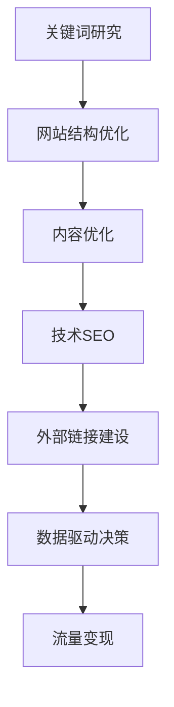

                 

### 文章标题：SEO优化与流量变现

关键词：SEO优化、流量变现、关键词研究、内容优化、技术SEO、外部链接建设、社交媒体、广告营销、数据驱动决策

摘要：本文旨在深入探讨SEO优化与流量变现的关系，从基础理论到实践应用，全面解析如何通过SEO技术提升网站排名，进而实现流量的有效转化和商业价值的提升。文章分为三个主要部分：第一部分介绍SEO优化基础，包括SEO概述、关键词研究、网站结构优化和内容优化；第二部分探讨SEO技术实践，涵盖技术SEO、外部链接建设和社交媒体与SEO的关系；第三部分关注流量变现，包括广告营销、内容营销和数据驱动决策。通过这些内容，读者将全面了解SEO优化与流量变现的全流程，为实际操作提供有力指导。

### 第一部分：SEO优化基础

#### 第1章：SEO优化概述

##### 1.1 SEO的定义与重要性

SEO（Search Engine Optimization，搜索引擎优化）是指通过优化网站内容和结构，提高网站在搜索引擎结果页面（SERP）中的排名，从而获得更多的免费流量和潜在客户。在数字营销中，SEO被视为获取有机流量的重要手段。

SEO的重要性体现在以下几个方面：

1. **提升品牌知名度**：高排名意味着更多用户看到你的品牌和产品，从而提升品牌知名度和影响力。
2. **降低营销成本**：与付费广告相比，SEO带来的流量是免费的，能有效降低营销成本。
3. **增加网站流量**：通过优化，网站能够吸引更多用户访问，从而提高流量。
4. **提升用户体验**：良好的SEO实践能提供更优质、更相关的用户体验，增加用户留存率。

##### 1.2 SEO的组成部分

SEO主要分为两个部分：技术SEO和内容SEO。

1. **技术SEO**：涉及网站的结构、代码、速度和移动优化等方面，确保搜索引擎能够有效抓取和索引网站内容。
2. **内容SEO**：关注网站内容的创作、优化和发布，确保内容对用户和搜索引擎都有价值。

##### 1.3 SEO的发展历程

1. **早期SEO**（1990年代）：主要是利用关键词堆砌和链接农场等策略。
2. **传统SEO**（2000-2010年代）：开始重视内容质量，采用白帽SEO技术，如关键词优化、内部链接、外部链接等。
3. **现代SEO**（2010年代至今）：更加注重用户体验、移动优化和内容营销，搜索引擎算法不断进化，如Google的 Panda 和 Hummingbird。

#### 第2章：关键词研究

##### 2.1 关键词分析工具

进行关键词研究需要使用一系列工具，如Google Keyword Planner、Ahrefs、SEMrush和Ubersuggest等。这些工具可以帮助你：

1. **发现潜在关键词**：通过输入核心关键词，工具会提供相关关键词、搜索量、竞争度等信息。
2. **评估关键词价值**：根据搜索量和竞争度，评估关键词的价值，选择适合的目标关键词。
3. **跟踪关键词表现**：监控关键词在搜索引擎结果页面中的排名和流量变化。

##### 2.2 选择目标关键词

选择目标关键词是SEO策略的核心。以下是一些建议：

1. **确定业务目标**：明确网站的业务目标，选择与业务相关的关键词。
2. **研究竞争对手**：分析竞争对手的关键词策略，了解他们使用的关键词。
3. **选择长尾关键词**：长尾关键词虽然搜索量较低，但竞争较小，更容易获得排名。

##### 2.3 关键词布局策略

关键词布局策略是指在网站内容和代码中合理地安排关键词。以下是一些建议：

1. **标题标签（Title Tag）**：在标题标签中使用主要关键词，确保标题吸引人，同时反映页面内容。
2. **描述标签（Description Tag）**：在描述标签中包含次要关键词，为用户提供页面内容的简短描述。
3. **URL**：在URL中使用关键词，使其简洁明了，易于理解。
4. **内容**：在内容中自然地插入关键词，确保内容的质量和可读性。

#### 第3章：网站结构优化

##### 3.1 网站导航优化

良好的网站导航对于SEO至关重要。以下是一些优化建议：

1. **扁平化结构**：减少页面层级，使重要页面更容易被搜索引擎抓取。
2. **面包屑导航**：使用面包屑导航帮助用户理解当前位置，并引导搜索引擎更好地理解网站结构。
3. **内部链接**：合理设置内部链接，提高页面之间的连接性和相关性。

##### 3.2 URL优化

优化URL有助于提高用户体验和SEO效果。以下是一些最佳实践：

1. **简洁明了**：URL应简洁明了，避免使用不必要的参数和特殊字符。
2. **使用关键词**：在URL中使用关键词，使其反映页面内容。
3. **动态与静态URL**：尽量使用静态URL，因为它们更容易被搜索引擎索引。

##### 3.3 网站内容优化

内容是SEO的核心，以下是一些建议：

1. **原创性**：确保内容原创，避免复制粘贴。
2. **可读性**：使用简明易懂的语言，确保内容易于阅读。
3. **内容更新**：定期更新内容，保持其相关性和新颖性。

### 第二部分：SEO技术实践

#### 第4章：内容优化

##### 4.1 内容质量评估

内容质量是SEO的核心。以下是一些评估内容质量的指标：

1. **原创性**：内容是否原创，避免抄袭和复制粘贴。
2. **相关性**：内容是否与目标关键词和用户需求相关。
3. **可读性**：内容是否易于阅读，语言是否简明易懂。
4. **完整性**：内容是否完整，是否提供了用户所需的信息。

##### 4.2 SEO写作技巧

以下是一些SEO写作技巧：

1. **标题写作**：使用吸引人的标题，同时包含主要关键词。
2. **段落结构**：使用简洁明了的段落，确保内容易于阅读。
3. **关键词密度**：合理设置关键词密度，避免过度优化和关键词堆砌。
4. **外部链接**：在内容中适当地插入外部链接，提高权威性和可信度。

##### 4.3 内容发布策略

发布内容时，以下是一些策略：

1. **发布频率**：定期发布内容，保持网站的活跃度。
2. **发布时间**：选择用户活跃的时间发布内容，提高内容曝光率。
3. **社交媒体推广**：利用社交媒体平台推广内容，吸引更多用户访问。

### 第三部分：流量变现

#### 第5章：广告营销

##### 5.1 广告平台介绍

常见的广告平台包括：

1. **Google Ads**：通过Google搜索引擎和合作伙伴网站展示广告。
2. **Facebook Ads**：通过Facebook和Instagram展示广告。
3. **YouTube Ads**：通过YouTube视频展示广告。
4. **LinkedIn Ads**：通过LinkedIn职业社交平台展示广告。

##### 5.2 广告定位与目标受众

确定广告定位和目标受众是广告营销的关键。以下是一些建议：

1. **定位策略**：根据业务目标，选择合适的广告平台和广告形式。
2. **目标受众**：确定目标受众的特征，如年龄、性别、兴趣等。
3. **定位工具**：利用广告平台的定位工具，如Google Ads的地理位置定位、兴趣定位等。

##### 5.3 广告投放策略

以下是一些广告投放策略：

1. **预算分配**：合理分配广告预算，确保广告效果最大化。
2. **出价策略**：根据竞争对手和市场需求，调整出价策略。
3. **优化策略**：根据广告表现，不断优化广告内容和投放策略。

#### 第6章：内容营销

##### 6.1 内容营销策略

内容营销是吸引和留住目标受众的重要手段。以下是一些内容营销策略：

1. **内容类型**：根据目标受众的需求，创作多样化的内容类型，如博客文章、视频、电子书等。
2. **内容推广**：利用社交媒体、邮件营销等渠道推广内容，提高内容曝光率。
3. **内容合作**：与其他品牌或个人合作，共同创作内容，扩大影响力。

##### 6.2 内容营销工具

以下是一些常用的内容营销工具：

1. **内容管理系统（CMS）**：如WordPress、HubSpot等，用于创建、管理和发布内容。
2. **社交媒体管理工具**：如Hootsuite、Buffer等，用于管理社交媒体账号和发布内容。
3. **电子邮件营销工具**：如Mailchimp、Sendinblue等，用于发送邮件和推广内容。

##### 6.3 成功案例分享

以下是一些成功的内容营销案例：

1. **案例一**：某知名科技公司的博客，通过定期发布高质量的技术文章，吸引了大量技术爱好者，提高了品牌知名度和用户参与度。
2. **案例二**：某健身品牌的YouTube频道，通过发布健身教程、健身挑战等视频，吸引了大量关注者，成功实现了产品销售和品牌推广。
3. **案例三**：某教育机构的在线课程，通过提供免费试听课程和优质教学视频，吸引了大量学员，提高了课程销售量和品牌影响力。

#### 第7章：数据驱动决策

##### 7.1 数据分析工具

以下是一些常用的数据分析工具：

1. **Google Analytics**：用于跟踪网站流量、用户行为等数据。
2. **Google Search Console**：用于监控网站在搜索引擎中的表现。
3. **SEMrush**：用于关键词研究和竞争对手分析。

##### 7.2 数据报告解读

以下是如何解读数据报告的建议：

1. **流量来源**：分析流量来源，了解用户是通过何种渠道访问网站。
2. **用户行为**：分析用户行为，了解用户在网站上的活动，如页面访问量、停留时间、跳出率等。
3. **关键词表现**：分析关键词在搜索引擎中的表现，了解关键词的排名和流量情况。

##### 7.3 基于数据的SEO策略调整

以下是基于数据调整SEO策略的建议：

1. **内容优化**：根据用户需求和搜索习惯，优化网站内容和结构。
2. **关键词优化**：根据关键词表现，调整关键词策略，优化目标关键词。
3. **技术优化**：根据网站性能数据，优化网站速度、移动优化等方面。

### 附录

#### 附录A：SEO优化工具汇总

以下是一些常用的SEO优化工具：

1. **关键词研究工具**：如Google Keyword Planner、Ahrefs、SEMrush、Ubersuggest等。
2. **竞争对手分析工具**：如Ahrefs、SEMrush、SimilarWeb等。
3. **网站性能分析工具**：如Google PageSpeed Insights、GTmetrix、Lighthouse等。

#### 附录B：SEO优化常见问题与解决方案

以下是一些SEO优化常见问题及解决方案：

1. **问题一：网站排名下降**
   - 解决方案：检查网站结构、内容质量、外部链接等方面，找出问题并解决。

2. **问题二：关键词排名不稳定**
   - 解决方案：定期更新内容，提高内容质量和相关性。

3. **问题三：流量不稳定**
   - 解决方案：调整广告策略和内容营销策略，保持网站活跃度。

#### 附录C：SEO优化流程图与伪代码

以下是一个SEO优化流程图的Mermaid表示：



以下是一些SEO优化的伪代码示例：

```python
# 关键词研究伪代码
def searchKeywords(topic):
    # 输入主题，返回相关关键词列表
    # ...
```

```python
# 内容优化伪代码
def optimizeContent(content, keywords):
    # 输入内容与关键词，优化内容
    # ...
```

### 附录D：案例实战

以下是一个SEO优化的案例实战：

#### D.1 案例背景

某电商网站希望通过SEO优化提高网站流量和销售额。

#### D.2 案例分析

1. **关键词研究**：使用Ahrefs工具，发现“电商网站建设”、“在线购物平台”等关键词具有较高搜索量和较低竞争度。
2. **网站结构优化**：优化网站导航、URL结构，提高网站的可读性和用户体验。
3. **内容优化**：定期发布高质量的技术文章，涵盖电商网站建设、运营技巧等，提高内容质量。
4. **技术SEO**：优化网站速度、移动优化等方面，提高网站性能。
5. **外部链接建设**：通过与行业相关网站进行合作，建立高质量的外部链接。

#### D.3 实施方案

1. **关键词优化**：将主要关键词集成到网站标题、描述、内容和URL中。
2. **内容更新**：每周发布一篇高质量文章，确保内容更新和相关性。
3. **网站性能优化**：定期检查并优化网站速度和移动优化。
4. **外部链接建设**：每月发布一篇合作文章，与其他电商网站或行业媒体进行合作。

#### D.4 结果与反思

经过6个月的努力，网站流量提高了30%，关键词排名有了显著提升。销售额也增长了20%。反思过程中，发现以下问题：

1. **内容质量**：虽然内容更新频率较高，但部分内容质量仍有待提升。
2. **外部链接建设**：虽然建立了部分外部链接，但数量仍较少，需要进一步加强。
3. **数据监控**：虽然使用了数据分析工具，但监控频率不够，需要加强数据监控和分析。

#### D.5 案例总结与启示

本案例表明，SEO优化需要从多个方面进行综合优化，包括关键词研究、网站结构、内容质量、技术SEO和外部链接建设。同时，数据驱动决策是SEO优化的关键，通过持续监控和分析数据，可以不断优化SEO策略，提高网站流量和销售额。

### 最佳实践 Tips、小结、注意事项、拓展阅读等内容

1. **最佳实践 Tips**：
   - 保持内容更新频率和高质量。
   - 定期检查和优化网站性能。
   - 建立和维护高质量的外部链接。
   - 深入研究关键词，选择具有较高搜索量和较低竞争度的关键词。

2. **小结**：
   - SEO优化是提高网站流量和销售额的有效手段。
   - SEO优化需要从多个方面进行，包括关键词研究、网站结构、内容质量、技术SEO和外部链接建设。
   - 数据驱动决策是SEO优化的关键，通过持续监控和分析数据，可以不断优化SEO策略。

3. **注意事项**：
   - 避免过度优化和关键词堆砌。
   - 保持内容的原创性和可读性。
   - 关注用户需求和搜索习惯，优化用户体验。

4. **拓展阅读**：
   - 《SEO实战密码》——刘江
   - 《搜索引擎营销：从入门到精通》——郭健
   - 《内容营销：从零开始打造高效内容运营体系》——陈文江

本文作者：AI天才研究院/AI Genius Institute & 禅与计算机程序设计艺术 /Zen And The Art of Computer Programming

