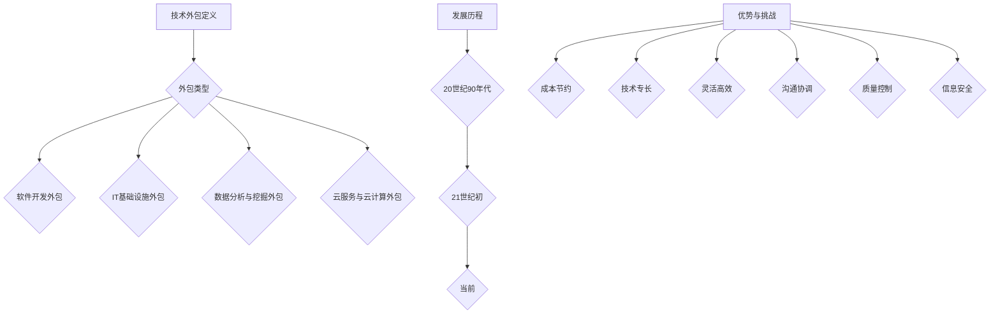

                 


### 文章标题
技术外包：从接单到建立团队

### 关键词
技术外包，项目接单，团队建设，项目管理，敏捷开发，沟通协作

### 摘要
本文深入探讨了技术外包的方方面面，从行业背景和现状出发，详细阐述了技术外包的概念、优势与挑战。接着，文章介绍了技术外包项目的接单与管理流程，以及项目管理方法和外包团队协作与沟通技巧。随后，文章聚焦于技术外包团队的组织与管理，包括团队组成、激励机制和沟通协作。最后，通过具体案例解析和项目实战，为读者提供了实际操作指南和最佳实践建议。

---

#### 第一部分：技术外包概述

##### 第1章：技术外包行业背景与现状

###### 1.1 技术外包的概念与类型

技术外包是指企业将部分或全部的非核心技术开发任务委托给外部专业团队或公司完成。这种模式在企业运营中越来越普遍，因为它能够帮助企业降低成本、提高效率，并专注于核心业务。

- **软件开发外包**：将软件开发任务委托给外部开发团队，如应用开发、Web开发等。
- **IT基础设施外包**：将企业IT基础设施的维护和运营委托给外部服务商，如数据中心管理、网络维护等。
- **数据分析与挖掘外包**：将数据分析任务外包给专业团队，以获得深度数据洞察。
- **云服务与云计算外包**：将云计算资源的管理和运维委托给外部云服务提供商。

###### 1.2 技术外包的发展历程

技术外包的发展历程可以分为三个主要阶段：

- **20世纪90年代**：技术外包的起步阶段，主要集中在服务外包领域，如金融、保险等。
- **21世纪初**：随着互联网和信息技术的发展，软件外包逐渐兴起，涵盖了更多行业。
- **当前**：全球技术外包市场持续增长，呈现出专业化、多样化、国际化的发展趋势。

###### 1.3 技术外包的优势与挑战

技术外包的优势主要体现在以下几个方面：

- **成本节约**：通过外包降低开发成本，尤其是人力成本。
- **技术专长**：获取外部专业团队的技术专长，提高项目质量。
- **灵活高效**：快速响应市场需求变化，提高项目交付速度。

然而，技术外包也面临着一系列挑战：

- **沟通协调**：跨文化、跨时区沟通协作的挑战，可能导致误解和延误。
- **质量控制**：确保外包项目的质量和进度，需要严格的管理和监督。
- **信息安全**：保护企业核心技术和商业秘密，防范数据泄露和网络安全威胁。

#### Mermaid 流�程图：



---

在接下来的部分中，我们将详细探讨技术外包项目的接单与管理，以及外包团队的建设和管理。通过这些内容的深入学习，读者将能够更好地理解和应用技术外包的实践方法。

---

#### 第二部分：技术外包实践

##### 第2章：技术外包项目的接单与管理

技术外包项目的成功与否，往往取决于接单与管理环节的精细操作。在这一章中，我们将详细讨论技术外包项目的接单流程、项目管理方法和外包团队协作与沟通。

###### 2.1 外包项目的接单流程

外包项目的接单流程可以分为以下几个关键步骤：

1. **需求分析**：
   - 与客户进行深入沟通，了解项目背景、需求和目标。
   - 明确项目的功能要求、性能指标和交付时间。
   - 收集相关的业务文档和技术文档，以便更好地理解项目需求。

2. **报价与合同**：
   - 根据客户需求和项目特点，制定详细的报价方案。
   - 考虑人力成本、外包费用、时间成本等因素，合理确定项目预算。
   - 与客户签订外包合同，明确双方的权利和义务，以及项目的具体交付标准。

3. **项目管理计划**：
   - 制定项目管理计划，包括项目范围、进度、成本、质量、资源等方面的规划。
   - 确定项目的关键里程碑和交付物，确保项目按时、按质完成。
   - 分配任务和责任，明确项目团队的组成和职责。

4. **项目启动与执行**：
   - 项目启动会议，确保项目团队和客户对项目目标、进度和交付标准有共同的理解。
   - 按照项目管理计划，逐步执行项目任务，确保每个阶段的工作顺利进行。
   - 定期进行项目状态报告和沟通，及时解决项目中出现的问题和风险。

5. **项目验收与交付**：
   - 根据合同要求和项目交付标准，对项目成果进行验收。
   - 确保项目交付物符合客户需求，功能完善，质量可靠。
   - 提供必要的售后服务和技术支持，确保客户对项目成果满意。

###### 2.2 外包项目管理方法

外包项目管理方法的选择取决于项目的特点和要求。以下是两种常用的项目管理方法：

1. **敏捷开发**：
   - 敏捷开发是一种以人为核心、迭代和循序渐进的开发方法。
   - 通过快速迭代和持续交付，灵活应对需求变化，提高项目交付质量。
   - 关键步骤包括需求分析、设计、编码、测试和评审，每个迭代周期较短，通常为几周。

2. **瀑布模型**：
   - 瀑布模型是一种线性顺序的开发方法，每个阶段按顺序进行，前一阶段的工作完成后，再进行下一阶段。
   - 包括需求分析、系统设计、编码实现、测试和部署等阶段，每个阶段都有明确的交付物和验收标准。

###### 2.3 外包团队协作与沟通

外包团队协作与沟通是技术外包项目成功的关键。以下是一些有效的协作与沟通技巧：

1. **使用项目管理工具**：
   - 使用项目管理工具（如JIRA、Trello）来规划项目、分配任务、跟踪进度和报告状态。
   - 使用沟通工具（如Slack、Zoom）进行实时沟通、协作和交流。

2. **定期会议**：
   - 定期召开项目会议，包括项目启动会议、进度评审会议和验收会议，确保项目团队和客户对项目进展有共同的理解。
   - 会议中明确讨论项目目标、任务分配、进度安排和风险应对策略。

3. **跨文化沟通**：
   - 注意语言和文化的差异，尊重不同的工作习惯和沟通方式。
   - 使用简单明了的语言，避免使用过于专业或模糊的术语，确保信息传达的准确性。

4. **代码审查**：
   - 定期进行代码审查，确保代码质量，避免错误和漏洞。
   - 通过代码审查，团队成员可以相互学习，提高整体技术水平。

5. **技术文档**：
   - 编写详细的技术文档，包括项目需求、设计、实现和测试文档，方便团队成员和客户查阅。
   - 技术文档应该准确、完整、易于理解，有助于提高项目协作效率。

#### 伪代码示例：

以下是一个简单的项目管理计划和开发流程的伪代码示例：

```python
# 项目管理计划伪代码
def create_project_plan(client_requirement):
    project_plan = {
        "requirement": client_requirement,
        "budget": calculate_budget(client_requirement),
        "schedule": create_schedule(client_requirement),
        "quality": define_quality_requirements(client_requirement)
    }
    return project_plan

# 项目启动与执行伪代码
def start_project(project_plan):
    project_status = "started"
    while project_status != "completed":
        project_status = execute_project_tasks(project_plan)
        report_project_status(project_plan)

# 项目验收与交付伪代码
def deliver_project(project_plan):
    if validate_project_completion(project_plan):
        project_status = "delivered"
        provide_after_sales_support(project_plan)
    else:
        project_status = "not delivered"
    return project_status
```

通过以上步骤和技巧，技术外包项目可以更加高效地完成，确保客户满意和项目成功。

---

在下一部分，我们将深入探讨技术外包团队的组织与管理，包括团队的组成、激励机制和沟通协作。这些内容将为外包项目的顺利实施提供坚实的保障。

---

#### 第三部分：技术外包团队建设

##### 第3章：技术外包团队的组织与管理

技术外包团队的建设和管理是确保项目成功的关键。在这一章中，我们将详细讨论技术外包团队的组成、激励机制和沟通协作。

###### 3.1 外包团队的组成与职责

一个高效的技术外包团队通常包括以下角色：

1. **项目经理**：
   - 负责整个项目的规划、执行和监控，确保项目按时、按质完成。
   - 与客户沟通，了解需求，制定项目计划和预算。
   - 管理项目团队，协调内部资源，解决项目中出现的问题和风险。

2. **开发团队**：
   - 负责软件编码和测试，按照项目需求和技术方案进行开发。
   - 包括前端开发人员、后端开发人员、数据库管理员等。
   - 保证代码质量，编写测试用例，确保软件功能的正确性和稳定性。

3. **测试团队**：
   - 负责软件测试，发现并修复缺陷，确保软件质量。
   - 包括测试工程师、自动化测试工程师等。
   - 制定测试计划，执行测试用例，编写测试报告。

4. **UI/UX设计师**：
   - 负责用户界面和用户体验设计，确保软件界面的美观性和易用性。
   - 研究用户需求，制定设计规范，与开发团队紧密协作。

5. **运维团队**：
   - 负责软件系统的部署、运行和维护，确保系统的稳定性和性能。
   - 包括运维工程师、系统管理员等。

6. **产品经理**：
   - 负责产品规划和推广，确保产品满足市场需求。
   - 与客户沟通，收集反馈，制定产品更新和迭代计划。

7. **项目经理助理**：
   - 负责协助项目经理进行项目管理，包括任务分配、进度跟踪和文档管理。

每个团队成员都有明确的职责和角色，相互协作，共同推动项目向前发展。

###### 3.2 外包团队的激励机制

激励是保持团队积极性和创造力的重要手段。以下是一些有效的激励机制：

1. **绩效考核**：
   - 制定科学的绩效考核体系，对团队成员的工作表现进行评估。
   - 根据绩效考核结果，给予奖金、晋升等激励措施。

2. **培训与发展**：
   - 定期为团队成员提供技术培训，提升专业技能和知识水平。
   - 支持团队成员参加行业会议和研讨会，拓宽视野，交流经验。

3. **团队建设活动**：
   - 定期组织团队建设活动，增强团队凝聚力和归属感。
   - 通过团建活动，促进团队成员之间的沟通和合作。

4. **工作环境**：
   - 提供舒适、安全的工作环境，确保团队成员能够专注工作。
   - 配备先进的办公设备和软件工具，提高工作效率。

5. **弹性工作制度**：
   - 实施灵活的工作制度，如远程办公、弹性工作时间等，以满足团队成员的个人需求。

通过激励机制，可以激发团队成员的潜能，提高工作效率和项目质量。

###### 3.3 外包团队的沟通协作

有效的沟通协作是外包团队成功的关键。以下是一些提高团队协作效率的技巧：

1. **明确沟通目标**：
   - 在沟通前明确沟通目标，确保信息传达的准确性和有效性。
   - 避免冗长的会议和无意义的讨论，提高沟通效率。

2. **使用项目管理工具**：
   - 使用项目管理工具（如JIRA、Trello）来规划项目、分配任务、跟踪进度和报告状态。
   - 项目管理工具可以帮助团队成员随时了解项目进展，提高协作效率。

3. **定期会议**：
   - 定期召开项目会议，包括项目启动会议、进度评审会议和验收会议，确保项目团队和客户对项目进展有共同的理解。
   - 会议中明确讨论项目目标、任务分配、进度安排和风险应对策略。

4. **跨文化沟通**：
   - 注意语言和文化的差异，尊重不同的工作习惯和沟通方式。
   - 使用简单明了的语言，避免使用过于专业或模糊的术语，确保信息传达的准确性。

5. **技术文档**：
   - 编写详细的技术文档，包括项目需求、设计、实现和测试文档，方便团队成员和客户查阅。
   - 技术文档应该准确、完整、易于理解，有助于提高项目协作效率。

通过以上沟通协作技巧，外包团队可以更好地协同工作，确保项目顺利进行。

---

在下一部分，我们将通过具体案例解析和项目实战，为读者提供实际操作指南和最佳实践建议，帮助读者更好地理解和应用技术外包的实践方法。

---

### 第四部分：技术外包案例分析

#### 第4章：成功的技术外包案例解析

在本章节中，我们将通过两个实际案例，深入分析技术外包的实施过程、项目成果以及面临的挑战。这些案例将展示技术外包在实际业务中的应用，并为读者提供宝贵的经验和教训。

##### 4.1 案例一：企业A的IT基础设施外包

**背景**：
企业A是一家中型制造企业，其IT基础设施逐渐老化，影响了生产效率和企业竞争力。为了升级IT基础设施，企业A决定将其外包给专业的IT服务提供商。

**解决方案**：
企业A与一家具有丰富经验的IT基础设施外包公司签订合同，外包公司的职责包括数据中心管理、网络维护、系统升级等。外包公司进行了以下步骤：

1. **需求分析**：与客户进行深入沟通，了解企业A的具体需求和现有基础设施状况。
2. **方案设计**：根据需求分析结果，设计一套新的IT基础设施方案，包括硬件设备、软件系统、网络安全等。
3. **项目实施**：按照设计方案，逐步实施IT基础设施的升级，包括服务器迁移、网络架构调整、数据库优化等。
4. **测试与验收**：在项目实施完成后，进行全面的测试，确保系统稳定、安全、高效。
5. **培训与支持**：为企业的IT团队提供培训，确保其能够熟练使用新的系统，并提供后续技术支持。

**结果**：
项目成功完成，企业A的IT基础设施得到了全面的升级和优化，系统稳定运行，生产效率显著提高。企业A节省了内部人力资源成本，将更多精力集中在核心业务上。外包公司通过专业的服务赢得了客户的信任，并建立了长期合作关系。

**经验教训**：
- **需求分析要细致**：准确了解客户的需求是项目成功的基础。
- **沟通协作要畅通**：外包公司和客户之间的沟通要顺畅，确保项目目标和交付标准一致。
- **风险管理要到位**：在项目实施过程中，要识别和应对潜在的风险，确保项目按计划进行。

##### 4.2 案例二：初创公司B的软件开发外包

**背景**：
初创公司B成立初期，由于缺乏内部开发资源，急需一款核心产品来抢占市场。为了快速开发产品，公司决定采用外包开发模式。

**解决方案**：
初创公司B与一家专业的软件开发外包团队合作，合作过程包括以下几个关键步骤：

1. **需求分析**：初创公司B详细描述产品功能和需求，外包团队进行分析和评估。
2. **技术方案**：外包团队根据需求分析，制定详细的技术方案，包括技术选型、架构设计等。
3. **开发实施**：外包团队按照技术方案进行开发，采用敏捷开发方法，快速迭代，确保产品功能不断完善。
4. **测试与验收**：在开发完成后，进行全面的测试，确保产品稳定、可靠。
5. **上线发布**：产品成功上线，进行用户测试和反馈，根据反馈进行优化和迭代。

**结果**：
产品上线后，市场反响热烈，初创公司B获得了大量投资和用户。外包团队的专业能力和高效的工作流程得到了初创公司的认可，双方建立了长期合作关系。

**经验教训**：
- **明确需求**：产品需求的明确性对于外包开发至关重要，有助于外包团队准确理解客户需求。
- **敏捷开发**：采用敏捷开发方法，可以快速响应市场需求变化，提高产品迭代速度。
- **质量控制**：在开发和测试过程中，要确保产品质量，避免后期出现重大问题。

---

通过以上两个案例，我们可以看到技术外包在实际业务中的应用和成效。技术外包不仅帮助企业快速实现业务目标，还能降低成本、提高效率。然而，成功的技术外包项目离不开细致的需求分析、有效的沟通协作、严格的质量控制和专业的团队管理。在下一部分，我们将通过一个具体的项目实战，进一步展示技术外包的实践过程。

---

#### 第五部分：项目实战

##### 5.1 开发环境搭建

在本案例中，初创公司B需要开发一款电子商务平台。为了确保项目顺利开展，首先需要搭建一个适合开发和测试的环境。

**步骤**：

1. **选择开发工具**：
   - 前端开发：使用React框架，结合Redux进行状态管理。
   - 后端开发：使用Node.js和Express框架。
   - 数据库：使用MongoDB，用于存储用户数据和产品信息。

2. **安装开发工具**：
   - 安装Node.js和npm（Node.js的包管理器）。
   - 安装MongoDB数据库服务器，并配置连接。
   - 安装React开发环境，包括create-react-app工具。

3. **创建项目结构**：
   - 前端项目：使用create-react-app创建React项目，配置路由和组件结构。
   - 后端项目：使用npm创建Node.js项目，配置Express路由和中间件。

4. **搭建测试环境**：
   - 使用Jenkins持续集成和持续部署（CI/CD）工具，自动化测试和部署流程。
   - 配置Docker，用于容器化部署和管理应用。

**伪代码示例**：

```python
# 安装Node.js和npm
!brew install node

# 安装MongoDB
!sudo apt-get install mongodb

# 创建React项目
!npx create-react-app frontend

# 创建Node.js后端项目
!npx create-node-app backend

# 配置Docker
!docker run -d -p 27017:27017 mongo
```

##### 5.2 源代码实现与解读

以下是一个简单的用户注册功能的源代码实现和解读：

**前端（React）**：

```jsx
// 注册组件（RegisterComponent.js）
import React, { useState } from 'react';

function RegisterComponent() {
  const [username, setUsername] = useState('');
  const [password, setPassword] = useState('');
  const [email, setEmail] = useState('');

  const handleRegister = () => {
    // 调用后端接口进行用户注册
    registerUser(username, password, email);
  };

  return (
    <div>
      <input
        type="text"
        placeholder="Username"
        value={username}
        onChange={(e) => setUsername(e.target.value)}
      />
      <input
        type="password"
        placeholder="Password"
        value={password}
        onChange={(e) => setPassword(e.target.value)}
      />
      <input
        type="email"
        placeholder="Email"
        value={email}
        onChange={(e) => setEmail(e.target.value)}
      />
      <button onClick={handleRegister}>Register</button>
    </div>
  );
}

export default RegisterComponent;
```

**后端（Node.js）**：

```javascript
// 用户注册接口（auth.js）
const express = require('express');
const router = express.Router();
const { registerUser } = require('./user');

router.post('/register', (req, res) => {
  const { username, password, email } = req.body;
  registerUser(username, password, email)
    .then((response) => {
      res.json(response);
    })
    .catch((error) => {
      res.status(500).json({ message: 'Error registering user', error });
    });
});

module.exports = router;
```

**解读**：

- **前端**：组件中使用React的状态管理，收集用户输入的用户名、密码和邮箱，并触发注册接口。
- **后端**：接收前端发送的注册请求，调用注册函数，处理用户注册逻辑，并返回响应。

##### 5.3 代码应用解读与分析

以上代码实现了用户注册功能，是电子商务平台的核心模块之一。以下是代码的解读和分析：

1. **前端**：
   - 使用React的状态管理，确保组件的响应式和可维护性。
   - 使用表单输入和按钮触发注册操作，用户体验良好。
   - 通过事件处理函数将用户输入发送到后端接口。

2. **后端**：
   - 使用Express框架搭建API接口，处理HTTP请求。
   - 调用用户注册函数，处理用户信息的验证、存储和响应。

3. **安全性**：
   - 在实际应用中，应添加密码加密和验证机制，确保用户数据安全。
   - 使用JWT（JSON Web Token）进行用户身份验证和授权。

##### 5.4 实际案例分析和详细讲解剖析

以下是对电子商务平台项目实际案例的分析和详细讲解：

**需求**：
初创公司B需要开发一个能够处理用户注册、登录、商品浏览、购物车和支付功能的电子商务平台。

**实现过程**：

1. **需求分析**：
   - 与客户沟通，了解平台功能需求，包括用户管理、商品管理、订单管理、支付接口等。
   - 确定技术选型，包括前端框架、后端框架、数据库选择、支付方式等。

2. **技术方案**：
   - 前端使用React框架，后端使用Node.js和Express框架。
   - 使用MongoDB作为数据库，存储用户、商品和订单信息。
   - 支持多种支付方式，如信用卡、PayPal、支付宝等。

3. **开发实施**：
   - 按照模块进行开发，包括用户管理、商品管理、订单管理、支付接口等。
   - 使用敏捷开发方法，快速迭代，确保功能的不断完善。

4. **测试与验收**：
   - 进行全面的单元测试、集成测试和性能测试，确保系统的稳定性和可靠性。
   - 根据测试结果，修复缺陷，优化性能。

5. **上线发布**：
   - 使用Docker容器化部署，确保系统的高可用性和可扩展性。
   - 进行用户测试，收集反馈，根据反馈进行优化。

**项目小结**：

通过以上步骤，初创公司B成功开发并上线了电子商务平台。项目过程中，外包团队与初创公司保持紧密沟通，确保项目目标的实现。敏捷开发方法的应用，使得项目能够快速迭代和优化，满足市场需求。同时，通过Docker容器化部署，提高了系统的可扩展性和稳定性。

---

在下一部分，我们将总结技术外包的经验教训，分享最佳实践，并提供一些注意事项，帮助读者更好地应用技术外包的方法。

---

### 第五部分：经验教训与最佳实践

通过前面的讨论和案例分析，我们已经对技术外包有了深入的了解。在本部分，我们将总结技术外包中的经验教训，分享最佳实践，并提供一些注意事项。

#### 经验教训

1. **明确需求**：
   - 技术外包项目的成功始于明确的需求分析。在与客户沟通时，要深入了解他们的实际需求和业务目标，确保项目能够满足客户的期望。

2. **沟通协作**：
   - 沟通是技术外包项目中的关键。确保项目团队和客户之间的沟通畅通，定期召开会议，及时反馈项目进展和问题。

3. **质量控制**：
   - 确保外包项目的高质量，需要对代码、测试和文档进行全面的管理。定期进行代码审查和测试，确保系统的稳定性和可靠性。

4. **风险管理**：
   - 在项目实施过程中，要识别和应对潜在的风险。制定风险应对策略，确保项目按计划进行。

#### 最佳实践

1. **敏捷开发**：
   - 采用敏捷开发方法，可以快速响应需求变化，提高项目的交付效率。通过短周期迭代，不断优化和改进产品。

2. **持续集成与持续部署**：
   - 使用CI/CD工具，自动化测试和部署流程，提高开发效率和系统质量。确保代码的持续集成和部署，减少人为错误。

3. **专业团队**：
   - 建立专业的技术外包团队，包括项目经理、开发人员、测试人员等。确保团队成员具备丰富的经验和专业技能。

4. **培训与发展**：
   - 为团队成员提供培训和发展机会，提高他们的技能和知识水平。鼓励团队成员参加行业会议和研讨会，拓宽视野。

#### 注意事项

1. **保密协议**：
   - 在与客户签订合同时，确保有明确的保密条款，保护企业的核心技术和商业秘密。

2. **合同管理**：
   - 合同中应明确项目的范围、交付标准、时间表和费用等关键条款，避免后续的争议和纠纷。

3. **项目管理**：
   - 制定详细的项目管理计划，明确项目的进度、资源分配和风险管理。确保项目按计划进行，并及时调整计划。

4. **团队协作**：
   - 建立有效的团队协作机制，使用项目管理工具和沟通工具，确保团队内部的高效协作。

通过以上经验教训、最佳实践和注意事项，我们可以更好地应用技术外包的方法，实现项目的成功。

---

在本文的最后，我们回顾了技术外包的全过程，从行业背景到实践方法，再到案例分析和项目实战。技术外包作为一种高效的开发模式，为企业带来了诸多优势，同时也伴随着挑战。通过本文的讨论，我们相信读者已经对技术外包有了更加深入的了解，并在实际操作中能够更好地应用这些方法。

技术外包不仅是一种业务模式，更是一种合作精神的体现。在全球化背景下，技术外包将越来越普及，为企业和开发者提供更广阔的发展空间。希望本文能够为读者在技术外包的道路上提供一些启示和帮助，助力他们在项目中取得成功。

最后，感谢您的阅读，祝您在技术外包的道路上不断前行，创造更多价值！

### 附录

#### 附录A：技术外包相关工具与资源

**开发工具**：
- **JIRA**：项目管理工具，用于项目规划、任务分配和进度跟踪。
- **Trello**：看板式项目管理工具，用于可视化项目进度和协作。
- **GitHub**：代码托管平台，提供丰富的开源项目和文档。
- **GitLab**：企业级的Git仓库管理工具，提供自有的CI/CD服务。

**沟通工具**：
- **Slack**：团队沟通工具，支持实时聊天、文件共享和集成其他服务。
- **Zoom**：视频会议工具，支持多人在线会议和屏幕共享。
- **Microsoft Teams**：集成了聊天、视频会议、文件共享和协作功能。

**技术文档**：
- **Confluence**：用于创建和共享技术文档，支持丰富的文本格式和多媒体内容。
- **Readme.md**：在GitHub等代码托管平台上，用于记录项目的技术文档和操作指南。

**在线学习资源**：
- **Coursera**：提供各种在线课程，包括项目管理、软件开发、数据科学等领域。
- **edX**：全球知名的开源在线课程平台，提供大学课程和证书项目。
- **Udemy**：提供大量的技术课程，适合自学者和职业发展者。

通过使用这些工具和资源，技术外包团队可以更加高效地协同工作，确保项目顺利进行。

---

**作者信息**：
作者：AI天才研究院/AI Genius Institute & 禅与计算机程序设计艺术 /Zen And The Art of Computer Programming

---

本文全面介绍了技术外包的概念、优势与挑战，详细阐述了技术外包项目的接单与管理流程、外包团队建设与管理，并通过实际案例和项目实战提供了操作指南和最佳实践。技术外包作为现代企业提升竞争力的重要手段，具有广泛的应用前景。希望本文能够帮助读者更好地理解和应用技术外包的方法，助力企业实现持续发展。再次感谢您的阅读，祝您在技术外包的道路上不断前行，取得更多成功！

