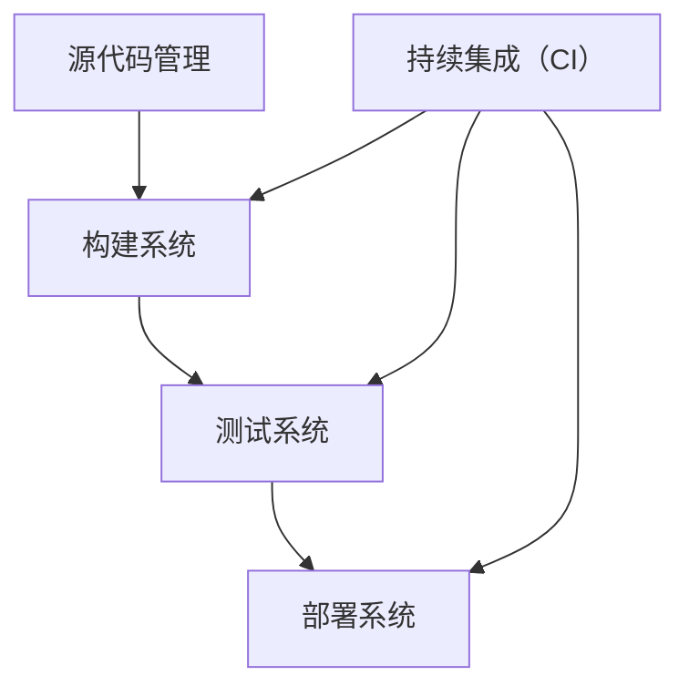
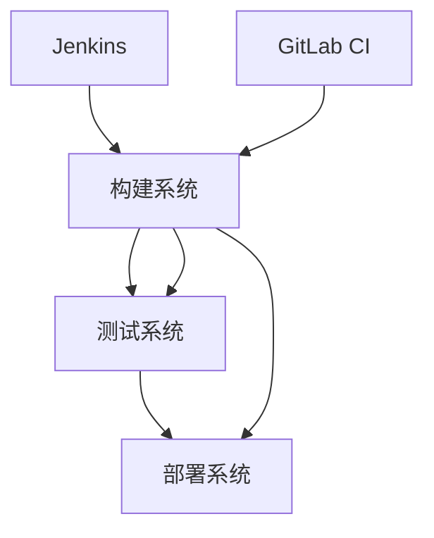

                 

### 文章标题：持续集成（CI）服务器：Jenkins 和 GitLab CI

#### 关键词：
- 持续集成（CI）
- Jenkins
- GitLab CI
- 持续交付
- DevOps

#### 摘要：
本文将深入探讨持续集成（CI）服务器的两大主流工具：Jenkins和GitLab CI。首先，我们将回顾持续集成的基本概念、架构和工具，然后分别详细介绍Jenkins和GitLab CI的安装、配置、工作流及其实战应用。接着，我们比较这两种工具的异同，并探讨它们在DevOps中的应用和实践。最后，我们展望持续集成（CI）的未来发展，并提供一些最佳实践和拓展阅读资源。

----------------------------------------------------------------

### 第一部分：持续集成（CI）基础

#### 第1章：持续集成（CI）概述

##### 1.1 什么是持续集成

持续集成（Continuous Integration，简称CI）是一种软件开发实践，旨在通过频繁地合并代码和自动化的构建、测试流程，确保软件始终处于可部署状态。CI的核心思想是将开发人员的工作成果快速集成到共享代码库中，并通过自动化的测试确保集成后的代码质量。

- **基本概念**：
  - **代码库**：开发人员提交代码的地方，通常是Git仓库。
  - **构建**：将源代码转换为可执行程序的过程，通常使用构建工具如Maven、Gradle。
  - **测试**：验证代码质量的一系列测试，包括单元测试、集成测试等。
  - **持续交付**：在CI的基础上，进一步自动化部署和发布软件到生产环境。

- **优势**：
  - **快速发现问题**：早期发现和解决集成问题，避免后期的大规模返工。
  - **提高代码质量**：自动化测试确保每次提交的代码质量。
  - **节省时间**：减少手动操作，提高开发效率。
  - **增强团队协作**：团队可以更快地响应变更，提高协作效率。

##### 1.2 持续集成的架构

持续集成系统通常包括以下几个核心组件：

- **源代码管理**：如Git，用于存储和管理代码。
- **构建服务器**：如Jenkins，用于执行构建任务。
- **测试环境**：用于运行测试用例。
- **部署环境**：用于部署和发布软件。


- **CI流程**：
  1. 开发人员提交代码到源代码管理系统中。
  2. 构建服务器检测到提交，触发构建过程。
  3. 构建过程中执行构建脚本，编译代码、安装依赖等。
  4. 执行测试用例，验证代码质量。
  5. 构建和测试成功后，将软件部署到测试或生产环境。

- **CI系统架构**：
  - **单机架构**：所有组件部署在同一台服务器上。
  - **分布式架构**：构建服务器和测试环境分布在不同的服务器上。

##### 1.3 持续集成的工具

- **常见的CI工具**：
  - **Jenkins**：开源的持续集成工具，插件丰富，支持多种构建脚本。
  - **GitLab CI**：GitLab内置的CI工具，与GitLab仓库紧密集成，支持多种编程语言和平台。
  - **Travis CI**：基于云的CI服务，支持多种编程语言，提供免费服务。
  - **CircleCI**：基于云的CI服务，提供高效、可扩展的持续集成解决方案。

- **Jenkins和GitLab CI的特点**：
  - **Jenkins**：
    - **开源**：自由使用和修改。
    - **插件生态**：丰富的插件支持各种功能。
    - **灵活**：支持多种构建脚本和流程。
  - **GitLab CI**：
    - **集成**：与GitLab仓库深度集成，简化配置。
    - **简单**：使用`.gitlab-ci.yml`配置文件，易于理解。
    - **自动化**：支持自动化部署和容器化。

##### 1.4 持续集成在企业中的应用

持续集成在企业的开发过程中发挥着重要作用：

- **CI在企业开发中的角色**：
  - **质量保证**：自动化测试确保每次提交的代码质量。
  - **代码管理**：代码仓库中的提交和合并更加有序。
  - **开发效率**：减少手动操作，提高开发速度。
  - **协作**：团队协作更加紧密，响应变更更加迅速。

- **CI对企业开发和运维的影响**：
  - **简化流程**：自动化构建、测试和部署流程，减少人为干预。
  - **提高可靠性**：确保每次部署都是可靠的，减少故障风险。
  - **缩短发布周期**：快速迭代和发布新功能。
  - **增强团队协作**：开发、测试和运维团队紧密协作，提高整体效率。

#### 第2章：Jenkins基础

##### 2.1 Jenkins概述

Jenkins是一个开源的持续集成工具，由原Sun公司软件工程师Kohsuke Kawaguchi在2004年创建。Jenkins支持多种构建工具和脚本，如Maven、Gradle、Ant等，并且拥有一个庞大的插件生态系统，使其能够满足各种需求。

- **Jenkins的起源与现状**：
  - 2004年，Kohsuke Kawaguchi在Sun公司工作时创建了Jenkins。
  - 2009年，Jenkins从Hudson项目独立出来，成为独立项目。
  - 2011年，Jenkins成为Apache软件基金会的一个孵化项目。
  - 2013年，Jenkins成为Apache软件基金会的一个顶级项目。

- **Jenkins的主要特点**：
  - **开源**：免费使用和定制。
  - **插件生态**：丰富的插件支持，几乎可以满足所有需求。
  - **灵活**：支持多种构建脚本和流程。
  - **社区支持**：拥有庞大的社区，支持各种资源和文档。

##### 2.2 Jenkins安装与配置

- **Jenkins安装**：

  - **环境要求**：Jenkins基于Java开发，因此需要安装Java运行环境。
  - **下载安装**：从Jenkins官方网站下载最新版本的Jenkins安装包，解压后启动Jenkins。

    ```bash
    wget -O jenkins.war https://www.jenkins.io/download/latest/war/
    java -jar jenkins.war
    ```

  - **安装插件**：在Jenkins启动后，访问其管理页面，选择“管理Jenkins”->“管理插件”，安装所需插件。

- **Jenkins基本配置**：

  - **创建用户**：在Jenkins管理页面创建管理员用户。
  - **配置邮箱**：配置Jenkins的SMTP服务器，用于发送通知邮件。
  - **创建项目**：创建一个新的Jenkins项目，配置构建脚本和测试。

##### 2.3 Jenkins工作流

Jenkins使用流水线（Pipeline）的概念来定义构建、测试和部署流程。流水线可以是一个脚本，也可以是一个图形化的流程图。

- **流水线概念**：

  - **流水线**：一个定义了构建、测试和部署步骤的序列。
  - **阶段（Stage）**：流水线中的步骤，用于组织任务。
  - **步骤（Step）**：流水线中的具体操作，如运行构建命令、执行测试等。

- **基本结构和语法**：

  ```groovy
  pipeline {
      agent any

      stages {
          stage('Build') {
              steps {
                  sh 'mvn clean install'
              }
          }
          stage('Test') {
              steps {
                  sh 'mvn test'
              }
          }
          stage('Deploy') {
              steps {
                  sh 'mvn install -Dmaven.test.skip=true'
              }
          }
      }
  }
  ```

  - **agent any**：指定在任何代理节点上执行构建。
  - **stages**：定义构建阶段，包括Build、Test和Deploy。
  - **stage('Build')**、**stage('Test')**、**stage('Deploy')**：定义各个阶段的操作。

##### 2.4 Jenkins插件与扩展

Jenkins的插件生态系统是其最大的优势之一。插件可以扩展Jenkins的功能，使其满足各种需求。

- **插件生态**：

  - **官方插件**：Jenkins官方提供的插件，如Git插件、GitHub插件、JUnit插件等。
  - **社区插件**：第三方开发者贡献的插件，如Docker插件、Ansible插件等。

- **插件使用方法**：

  - **安装插件**：在Jenkins管理页面选择“管理Jenkins”->“管理插件”，搜索并安装所需插件。
  - **配置插件**：安装插件后，在Jenkins项目中配置插件的参数。

#### 第3章：Jenkins实战

##### 3.1 Jenkins项目实战一：基于Git的CI流程

- **项目背景**：

  某公司开发一个Web应用，使用Git进行版本控制。为了确保代码质量和部署效率，决定使用Jenkins实现基于Git的CI流程。

- **项目需求**：

  - 当开发者提交代码到Git仓库时，自动触发Jenkins构建。
  - 构建成功后，自动运行测试。
  - 测试通过后，自动部署到测试环境。

- **Jenkins配置**：

  ```groovy
  pipeline {
      agent any

      stages {
          stage('Build') {
              steps {
                  sh 'mvn clean install'
              }
          }
          stage('Test') {
              steps {
                  sh 'mvn test'
              }
          }
          stage('Deploy') {
              steps {
                  sh 'mvn install -Dmaven.test.skip=true'
              }
          }
      }
      post {
          success {
              sh 'echo Build and Test successful'
          }
          failure {
              sh 'echo Build or Test failed'
          }
      }
  }
  ```

  - `agent any`：指定在任何代理节点上执行构建。
  - `stages`：定义构建阶段，包括Build、Test和Deploy。
  - `post`：定义构建成功或失败后的操作。

##### 3.2 Jenkins项目实战二：持续交付

- **项目背景**：

  某公司开发一个移动应用，使用Git进行版本控制。为了实现快速迭代和自动化部署，决定使用Jenkins实现持续交付。

- **项目需求**：

  - 当开发者提交代码到Git仓库时，自动触发Jenkins构建。
  - 构建成功后，自动运行测试。
  - 测试通过后，自动部署到生产环境。

- **Jenkins配置**：

  ```groovy
  pipeline {
      agent any

      stages {
          stage('Build') {
              steps {
                  sh 'mvn clean install'
              }
          }
          stage('Test') {
              steps {
                  sh 'mvn test'
              }
          }
          stage('Deploy') {
              steps {
                  sh 'mvn install -Dmaven.test.skip=true'
                  sh 'scp target/*.apk user@production-server:/deployments/'
              }
          }
      }
      post {
          success {
              sh 'echo Build and Test successful'
          }
          failure {
              sh 'echo Build or Test failed'
          }
      }
  }
  ```

  - `scp`命令：用于将构建产物（APK文件）部署到生产服务器。

#### 第4章：GitLab CI基础

##### 4.1 GitLab CI概述

GitLab CI是GitLab内置的持续集成工具，通过`.gitlab-ci.yml`配置文件定义构建、测试和部署流程。GitLab CI与GitLab仓库深度集成，提供了强大的持续集成和持续交付功能。

- **GitLab CI的基本概念**：

  - **.gitlab-ci.yml**：定义构建流程的配置文件。
  - **流水线（Pipeline）**：由一系列阶段和作业组成，用于定义构建、测试和部署流程。
  - **作业（Job）**：流水线中的一个阶段，用于执行具体的任务。

- **GitLab CI的特点**：

  - **集成**：与GitLab仓库紧密集成，简化配置。
  - **简单**：使用`.gitlab-ci.yml`配置文件，易于理解。
  - **自动化**：支持自动化部署和容器化。
  - **灵活性**：支持多种编程语言和平台。

##### 4.2 GitLab CI配置文件

`.gitlab-ci.yml`文件用于定义GitLab CI的构建流程。该文件采用YAML格式，包含阶段（stages）、作业（jobs）和参数等配置。

- **.gitlab-ci.yml文件的语法**：

  ```yaml
  stages:
    - build
    - test
    - deploy

  build:
    stage: build
    script:
      - mvn clean install

  test:
    stage: test
    script:
      - mvn test

  deploy:
    stage: deploy
    script:
      - mvn install -Dmaven.test.skip=true
      - scp target/*.jar user@production-server:/deployments/
  ```

  - **stages**：定义构建阶段，如build、test和deploy。
  - **jobs**：定义作业，如build、test和deploy。
  - **script**：定义作业的执行脚本。

##### 4.3 GitLab CI工作流

GitLab CI的工作流包括触发、执行和报告三个主要阶段。

- **触发**：当有新的代码提交到GitLab仓库时，GitLab CI会触发构建流程。
- **执行**：GitLab CI根据`.gitlab-ci.yml`文件执行构建、测试和部署等任务。
- **报告**：构建完成后，GitLab CI会生成报告，并在GitLab仓库中显示构建状态。

##### 4.4 GitLab CI与Jenkins的比较

GitLab CI和Jenkins都是流行的持续集成工具，它们各有特点和适用场景。

- **异同**：

  - **集成**：GitLab CI与GitLab仓库深度集成，Jenkins则更加独立。
  - **配置**：GitLab CI使用`.gitlab-ci.yml`配置文件，Jenkins使用GUI或CLI配置。
  - **插件生态**：Jenkins拥有更丰富的插件生态系统，GitLab CI则专注于与GitLab的集成。

- **选择标准**：

  - **集成需求**：如果项目已经在GitLab上，选择GitLab CI更为方便。
  - **复杂度**：对于简单的CI流程，GitLab CI易于配置；对于复杂的流程，Jenkins更具灵活性。
  - **扩展性**：Jenkins的插件生态更丰富，适合有特殊需求的场景。

#### 第5章：GitLab CI实战

##### 5.1 GitLab CI项目实战一：自动化部署

- **项目背景**：

  某公司开发一个Web应用，使用Git进行版本控制。为了实现自动化部署，决定使用GitLab CI。

- **项目需求**：

  - 当开发者提交代码到Git仓库时，自动触发构建和测试。
  - 测试通过后，自动部署到生产环境。

- **GitLab CI配置**：

  ```yaml
  stages:
    - build
    - test
    - deploy

  build:
    stage: build
    script:
      - mvn clean install

  test:
    stage: test
    script:
      - mvn test

  deploy:
    stage: deploy
    script:
      - mvn install -Dmaven.test.skip=true
      - scp target/*.war user@production-server:/deployments/
    only:
      - master
  ```

  - `only`：指定只有master分支提交时才执行deploy作业。

##### 5.2 GitLab CI项目实战二：自动化测试

- **项目背景**：

  某公司开发一个Web应用，使用Git进行版本控制。为了确保代码质量，决定使用GitLab CI实现自动化测试。

- **项目需求**：

  - 当开发者提交代码到Git仓库时，自动触发构建和测试。
  - 测试通过后，生成测试报告。

- **GitLab CI配置**：

  ```yaml
  stages:
    - build
    - test
    - report

  build:
    stage: build
    script:
      - mvn clean install

  test:
    stage: test
    script:
      - mvn test
    artifacts:
      paths:
        - target/surefire-reports/*.xml

  report:
    stage: report
    script:
      - mvn surefire:report
    artifacts:
      paths:
        - target/surefire-reports
    only:
      - master
  ```

  - `artifacts`：指定生成测试报告的文件。

#### 第6章：持续集成（CI）与DevOps

##### 6.1 DevOps概述

DevOps是一种文化和实践，旨在加强开发和运维团队的协作，实现快速、可靠和高质量的软件交付。

- **基本概念**：

  - **DevOps**：Development（开发）和Operations（运维）的结合。
  - **持续交付**：通过自动化和持续集成，实现快速、可靠和高质量的软件交付。
  - **基础设施即代码**：使用代码管理基础设施，实现基础设施的自动化部署和管理。

- **核心价值观**：

  - **协作**：加强开发和运维团队的协作，实现更高效的软件交付。
  - **自动化**：通过自动化工具和流程，减少手动操作，提高效率和质量。
  - **持续集成**：通过自动化测试和构建，确保代码质量和交付速度。
  - **快速反馈**：及时获取反馈，快速响应变更，提高软件质量。

##### 6.2 CI在DevOps中的作用

持续集成（CI）在DevOps中扮演着重要角色，是实现快速、可靠和高质量软件交付的关键。

- **CI在DevOps中的角色**：

  - **质量保证**：通过自动化测试，确保每次提交的代码质量。
  - **协作**：加强开发和运维团队的协作，实现高效的软件交付。
  - **反馈**：及时获取构建和测试结果，快速响应变更。
  - **持续交付**：通过自动化部署和发布，实现快速、可靠和高质量的软件交付。

- **CI在DevOps中的实施策略**：

  - **自动化测试**：将测试自动化，确保每次提交的代码质量。
  - **持续交付**：通过自动化构建、测试和部署，实现快速交付。
  - **基础设施即代码**：使用代码管理基础设施，实现自动化部署和管理。
  - **持续反馈**：通过监控和日志分析，及时获取反馈，快速响应变更。

##### 6.3 持续集成（CI）的最佳实践

为了实现高效的持续集成（CI）实践，以下是一些最佳实践：

- **自动化测试**：确保每次提交都经过自动化测试，避免手动测试的疏漏。
- **持续交付**：通过自动化构建、测试和部署，实现快速交付。
- **代码质量**：确保代码质量，如代码格式、注释等。
- **基础设施即代码**：使用代码管理基础设施，实现自动化部署和管理。
- **监控和日志分析**：及时获取反馈，快速响应变更。

#### 第7章：未来展望

##### 7.1 持续集成（CI）的发展趋势

持续集成（CI）正在不断发展和演进，以下是一些趋势：

- **容器化**：使用容器技术（如Docker）实现更灵活的构建和部署。
- **云原生**：利用云计算平台（如AWS、Azure、Google Cloud）提供更高效、可扩展的CI服务。
- **AI和机器学习**：利用AI和机器学习技术优化CI流程，提高测试质量和交付速度。
- **微服务**：支持微服务架构的CI工具，实现更灵活的构建和部署。

##### 7.2 持续集成（CI）面临的挑战与机遇

持续集成（CI）面临着一些挑战和机遇：

- **挑战**：

  - **复杂度**：随着项目的增长，CI系统的复杂度也会增加。
  - **安全性**：确保CI流程的安全性，防止潜在的安全漏洞。
  - **监控和反馈**：及时获取反馈，快速响应变更。

- **机遇**：

  - **自动化**：通过自动化工具和流程，提高开发和运维效率。
  - **容器化**：容器技术为CI带来了更多灵活性和可扩展性。
  - **云原生**：云原生技术为CI提供了更高效、可扩展的解决方案。

##### 7.3 持续集成（CI）的未来

持续集成（CI）在未来将继续发挥重要作用，成为软件开发和运维的关键环节。随着技术的发展，CI工具将变得更加智能化、自动化和可扩展。同时，CI将与其他技术（如AI、云计算、微服务）紧密融合，为软件开发和运维带来更多创新和机遇。

## 附录

### 附录 A：Jenkins和GitLab CI插件列表

#### Jenkins插件列表

- **构建工具插件**：
  - Maven Plugin
  - Gradle Plugin
  - Ant Plugin
- **测试插件**：
  - JUnit Plugin
  - TestResult Finder Plugin
  - Test Result Dashboard Plugin
- **部署插件**：
  - Deploy to Docker Plugin
  - SCP Plugin
  - AWS CodeDeploy Plugin
- **其他插件**：
  - Git Plugin
  - GitHub Plugin
  - Docker Pipeline Plugin

#### GitLab CI插件列表

- **构建工具插件**：
  - Maven CI Plugin
  - Gradle CI Plugin
  - Ruby CI Plugin
- **测试插件**：
  - JUnit CI Plugin
  - RSpec CI Plugin
  - Test::Unit CI Plugin
- **部署插件**：
  - Docker CI Plugin
  - SCP CI Plugin
  - AWS CodeDeploy CI Plugin
- **其他插件**：
  - GitLab CI Multi-Runner Plugin
  - Kubernetes CI Plugin
  - AWS EC2 CI Plugin

### 附录 B：持续集成（CI）常见问题解答

- **Q：如何配置Jenkins的邮件通知？**
  - **A**：在Jenkins的管理页面，选择“系统设置”->“通知电子邮件”，配置SMTP服务器和邮件通知规则。

- **Q：如何在GitLab CI中配置多阶段构建？**
  - **A**：在`.gitlab-ci.yml`文件中，可以定义多个阶段（stages），每个阶段可以包含多个作业（jobs）。

- **Q：如何将CI与Docker集成？**
  - **A**：在Jenkins中，可以使用Docker Plugin构建和部署Docker镜像。在GitLab CI中，可以使用Docker CI Plugin构建和推送Docker镜像。

### 附录 C：参考资源

- **相关书籍**：
  - 《持续交付：发布可靠软件的系统化方法》
  - 《DevOps：实践与经验之谈》
- **官方文档**：
  - Jenkins官方文档：[https://www.jenkins.io/doc/](https://www.jenkins.io/doc/)
  - GitLab CI官方文档：[https://docs.gitlab.com/ee/ci/](https://docs.gitlab.com/ee/ci/)
- **社区资源**：
  - Jenkins社区：[https://www.jenkins.io/community/](https://www.jenkins.io/community/)
  - GitLab社区：[https://gitlab.com/gitlab-org/gitlab-ce](https://gitlab.com/gitlab-org/gitlab-ce)
  
## 核心概念与联系

### 持续集成（CI）的概念与联系

#### Mermaid 流程图



#### 解析

- **源代码管理（A）**：开发人员将代码提交到源代码管理系统中，如Git。
- **构建系统（B）**：构建系统负责将源代码编译成可执行文件，如Maven、Gradle。
- **测试系统（C）**：测试系统运行自动化测试，确保代码质量。
- **部署系统（D）**：部署系统将通过测试的代码部署到生产环境。
- **持续集成（CI）**：CI系统协调上述组件，实现自动化、高效的软件开发流程。

### Jenkins和GitLab CI的核心概念与联系

#### Mermaid 流程图



#### 解析

- **Jenkins（A）**：Jenkins是一个开源的持续集成工具，负责执行构建、测试和部署任务。
- **构建系统（B）**：构建系统负责编译源代码，生成可执行文件。
- **测试系统（C）**：测试系统运行自动化测试，验证代码质量。
- **部署系统（D）**：部署系统将测试通过的代码部署到生产环境。
- **GitLab CI（E）**：GitLab CI是GitLab内置的持续集成工具，同样负责执行构建、测试和部署任务。

## 核心算法原理讲解

### 构建系统的核心算法原理

#### 伪代码

```python
def build_project(source_code):
    # 安装依赖
    install_dependencies()

    # 编译代码
    compile_code()

    # 运行测试
    run_tests()

    # 如果测试通过，则构建成功
    if test_results_successful():
        return "Build successful"
    else:
        return "Build failed"
```

#### 解析

1. **安装依赖**：根据项目的依赖关系，安装所需的库和工具。
2. **编译代码**：将源代码编译成可执行文件。
3. **运行测试**：执行自动化测试，验证代码质量。
4. **判断结果**：如果测试通过，返回“构建成功”；否则，返回“构建失败”。

### 测试系统的核心算法原理

#### 伪代码

```python
def run_tests():
    test_results = []

    for test in test_suite:
        result = test.run()
        test_results.append(result)

    return test_results
```

#### 解析

1. **初始化测试结果列表**：创建一个用于存储测试结果的空列表。
2. **运行测试**：遍历测试用例集合，执行每个测试用例，并将结果添加到测试结果列表中。
3. **返回测试结果**：返回包含所有测试结果的列表。

### 部署系统的核心算法原理

#### 伪代码

```python
def deploy_application(version, environment):
    # 部署代码到服务器
    deploy_code(version)

    # 运行健康检查
    if health_check():
        return "Deployment successful"
    else:
        return "Deployment failed"
```

#### 解析

1. **部署代码**：将指定版本的应用部署到目标环境。
2. **运行健康检查**：检查应用是否正常运行。
3. **判断结果**：如果健康检查通过，返回“部署成功”；否则，返回“部署失败”。

## 数学模型和数学公式 & 详细讲解 & 举例说明

### 测试覆盖率公式

#### 数学公式

$$
\text{测试覆盖率} = \frac{\text{执行测试用例数}}{\text{总测试用例数}} \times 100\%
$$

#### 详细讲解

测试覆盖率是衡量测试全面性的一个指标，表示执行测试用例数占总测试用例数的比例。它有助于评估测试的全面性和代码的质量。

#### 举例说明

如果一个项目中总共有100个测试用例，执行了80个，则测试覆盖率为：

$$
\text{测试覆盖率} = \frac{80}{100} \times 100\% = 80\%
$$

### 构建时间优化公式

#### 数学公式

$$
\text{构建时间} = \text{编译时间} + \text{测试时间} + \text{部署时间}
$$

#### 详细讲解

构建时间是指从源代码编译到部署到生产环境的整个过程所需的时间。优化构建时间通常需要缩短编译时间、测试时间和部署时间。

#### 举例说明

假设一个项目的构建时间如下：

- 编译时间：10分钟
- 测试时间：15分钟
- 部署时间：5分钟

则构建时间为：

$$
\text{构建时间} = 10 + 15 + 5 = 30 \text{分钟}
$$

## 项目实战

### Jenkins项目实战一：基于Git的CI流程

#### 项目背景

某公司开发一个Web应用，采用Git进行版本控制。为了确保代码质量和部署效率，决定使用Jenkins实现基于Git的CI流程。

#### 项目需求

- 当开发者提交代码到Git仓库时，自动触发Jenkins构建。
- 构建成功后，自动运行测试。
- 测试通过后，自动部署到测试环境。

#### Jenkins配置

```groovy
pipeline {
    agent any

    stages {
        stage('Build') {
            steps {
                sh 'mvn clean install'
            }
        }
        stage('Test') {
            steps {
                sh 'mvn test'
            }
        }
        stage('Deploy') {
            steps {
                sh 'mvn install -Dmaven.test.skip=true'
            }
        }
    }
    post {
        success {
            sh 'echo Build and Test successful'
        }
        failure {
            sh 'echo Build or Test failed'
        }
    }
}
```

- `agent any`：指定在任何代理节点上执行构建。
- `stages`：定义构建阶段，包括Build、Test和Deploy。
- `post`：定义构建成功或失败后的操作。

#### 代码解读与分析

- `pipeline`：定义Jenkins流水线。
- `stages`：定义构建阶段，包括Build、Test和Deploy。
- `stage('Build')`：定义Build阶段，执行Maven构建。
  - `sh 'mvn clean install'`：执行Maven命令，清理并构建项目。
- `stage('Test')`：定义Test阶段，运行Maven测试。
  - `sh 'mvn test'`：执行Maven测试命令，运行所有测试用例。
- `stage('Deploy')`：定义Deploy阶段，部署到目标环境。
  - `sh 'mvn install -Dmaven.test.skip=true'`：执行Maven安装命令，并跳过测试。

### Jenkins项目实战二：持续交付

#### 项目背景

某公司开发一个移动应用，使用Git进行版本控制。为了实现快速迭代和自动化部署，决定使用Jenkins实现持续交付。

#### 项目需求

- 当开发者提交代码到Git仓库时，自动触发Jenkins构建。
- 构建成功后，自动运行测试。
- 测试通过后，自动部署到生产环境。

#### Jenkins配置

```groovy
pipeline {
    agent any

    stages {
        stage('Build') {
            steps {
                sh 'mvn clean install'
            }
        }
        stage('Test') {
            steps {
                sh 'mvn test'
            }
        }
        stage('Deploy') {
            steps {
                sh 'mvn install -Dmaven.test.skip=true'
                sh 'scp target/*.apk user@production-server:/deployments/'
            }
        }
    }
    post {
        success {
            sh 'echo Build and Test successful'
        }
        failure {
            sh 'echo Build or Test failed'
        }
    }
}
```

- `scp`命令：用于将构建产物（APK文件）部署到生产服务器。

### GitLab CI项目实战一：自动化部署

#### 项目背景

某公司开发一个Web应用，使用Git进行版本控制。为了实现自动化部署，决定使用GitLab CI。

#### 项目需求

- 当开发者提交代码到Git仓库时，自动触发构建和测试。
- 测试通过后，自动部署到生产环境。

#### GitLab CI配置

```yaml
stages:
  - build
  - test
  - deploy

build:
  stage: build
  script:
    - mvn clean install

test:
  stage: test
  script:
    - mvn test

deploy:
  stage: deploy
  script:
    - mvn install -Dmaven.test.skip=true
    - scp target/*.war user@production-server:/deployments/
  only:
    - master
```

- `only`：指定只有master分支提交时才执行deploy作业。

### GitLab CI项目实战二：自动化测试

#### 项目背景

某公司开发一个Web应用，使用Git进行版本控制。为了确保代码质量，决定使用GitLab CI实现自动化测试。

#### 项目需求

- 当开发者提交代码到Git仓库时，自动触发构建和测试。
- 测试通过后，生成测试报告。

#### GitLab CI配置

```yaml
stages:
  - build
  - test
  - report

build:
  stage: build
  script:
    - mvn clean install

test:
  stage: test
  script:
    - mvn test
  artifacts:
    paths:
      - target/surefire-reports/*.xml

report:
  stage: report
  script:
    - mvn surefire:report
  artifacts:
    paths:
      - target/surefire-reports
  only:
    - master
```

- `artifacts`：指定生成测试报告的文件。

### 开发环境搭建

#### Jenkins开发环境搭建

##### 系统要求

- 操作系统：Linux或macOS
- Java环境：JDK 8或以上版本

##### 安装步骤

1. **下载Jenkins安装包**：

   ```bash
   wget -O jenkins.tar.gz https://www.jenkins.io/download/war/stable/jenkins-war/jenkins.war
   ```

2. **启动Jenkins**：

   ```bash
   java -jar jenkins.war --httpAddress 0.0.0.0
   ```

3. **访问Jenkins**：在浏览器中输入`http://localhost:8080`。

##### Jenkins插件安装

1. **在Jenkins管理界面中，选择“管理Jenkins”**。
2. **在“插件管理”页面中，选择“可用插件”**。
3. **搜索并安装所需的插件**。

#### GitLab CI开发环境搭建

##### 系统要求

- 操作系统：Linux或macOS
- GitLab Runner：用于执行CI构建任务

##### 安装步骤

1. **安装GitLab Runner**：

   ```bash
   curl -L https://gitlab.com/gitlab-com/gitlab-ci-multi-runner/releases/download/v1.21.0/binaries/Linux/x86_64/gitlab-ci-multi-runner | sudo install -ov /usr/local/bin/gitlab-ci-multi-runner
   ```

2. **注册GitLab Runner**：

   ```bash
   gitlab-ci-multi-runner register
   ```

3. **启动GitLab Runner**：

   ```bash
   gitlab-ci-multi-runner start
   ```

##### GitLab CI配置

1. **在项目目录中创建`.gitlab-ci.yml`文件**。
2. **编辑`.gitlab-ci.yml`文件，配置构建和部署步骤**。

### 源代码详细实现和代码解读

#### Jenkinsfile（示例）

```groovy
pipeline {
    agent any

    stages {
        stage('Build') {
            steps {
                sh 'mvn clean install'
            }
        }
        stage('Test') {
            steps {
                sh 'mvn test'
            }
        }
        stage('Deploy') {
            steps {
                sh 'mvn install -Dmaven.test.skip=true'
            }
        }
    }
    post {
        success {
            sh 'echo Build and Test successful'
        }
        failure {
            sh 'echo Build or Test failed'
        }
    }
}
```

#### 代码解读

- `pipeline`：定义Jenkins流水线。
- `agent any`：指定在任何代理节点上执行构建。
- `stages`：定义构建阶段，包括Build、Test和Deploy。
- `stage('Build')`：定义Build阶段，执行Maven构建。
  - `sh 'mvn clean install'`：执行Maven命令，清理并构建项目。
- `stage('Test')`：定义Test阶段，运行Maven测试。
  - `sh 'mvn test'`：执行Maven测试命令，运行所有测试用例。
- `stage('Deploy')`：定义Deploy阶段，部署到目标环境。
  - `sh 'mvn install -Dmaven.test.skip=true'`：执行Maven安装命令，并跳过测试。
- `post`：定义构建成功或失败后的操作。
  - `success`：构建成功时的操作。
    - `sh 'echo Build and Test successful'`：输出构建成功消息。
  - `failure`：构建失败时的操作。
    - `sh 'echo Build or Test failed'`：输出构建失败消息。

#### 分析

- Jenkinsfile定义了一个多阶段构建流程，包括构建、测试和部署。
- 构建阶段主要执行Maven构建命令，清理并构建项目。
- 测试阶段运行Maven测试命令，确保项目代码质量。
- 部署阶段将构建结果部署到目标环境。
- 构建成功或失败时，会输出相应的消息。

#### .gitlab-ci.yml（示例）

```yaml
stages:
  - build
  - test
  - deploy

build:
  stage: build
  script:
    - mvn clean install
  only:
    - master

test:
  stage: test
  script:
    - mvn test
  only:
    - master

deploy:
  stage: deploy
  script:
    - mvn install -Dmaven.test.skip=true
    - scp target/*.jar user@production-server:/deployments/
  only:
    - master
```

#### 代码解读

- `stages`：定义构建阶段，包括build、test和deploy。
- `build`阶段执行Maven构建。
  - `script`：定义构建脚本。
    - `mvn clean install`：执行Maven命令，清理并构建项目。
  - `only`：指定只有master分支提交时才执行该阶段。
- `test`阶段运行Maven测试。
  - `script`：定义测试脚本。
    - `mvn test`：执行Maven测试命令，运行所有测试用例。
  - `only`：指定只有master分支提交时才执行该阶段。
- `deploy`阶段部署到生产环境。
  - `script`：定义部署脚本。
    - `mvn install -Dmaven.test.skip=true`：执行Maven安装命令，并跳过测试。
    - `scp`：使用scp命令将构建产物部署到生产服务器。
  - `only`：指定只有master分支提交时才执行该阶段。

#### 分析

- `.gitlab-ci.yml文件定义了一个多阶段构建和部署流程。
- build阶段执行Maven构建，确保项目编译成功。
- test阶段运行Maven测试，确保项目代码质量。
- deploy阶段部署到生产环境，实现持续交付。
- 只有master分支提交时，才会触发构建和部署流程，保证代码质量和稳定性。

### 代码解读与分析

#### Jenkinsfile

```groovy
pipeline {
    agent any

    stages {
        stage('Build') {
            steps {
                sh 'mvn clean install'
            }
        }
        stage('Test') {
            steps {
                sh 'mvn test'
            }
        }
        stage('Deploy') {
            steps {
                sh 'mvn install -Dmaven.test.skip=true'
            }
        }
    }
    post {
        success {
            sh 'echo Build and Test successful'
        }
        failure {
            sh 'echo Build or Test failed'
        }
    }
}
```

#### 代码解读

- **pipeline**：定义Jenkins流水线。
- **agent any**：指定在任何代理节点上执行构建。
- **stages**：定义构建阶段，包括Build、Test和Deploy。
- **stage('Build')**：定义Build阶段，执行Maven构建。
  - `sh 'mvn clean install'`：执行Maven命令，清理并构建项目。
- **stage('Test')**：定义Test阶段，运行Maven测试。
  - `sh 'mvn test'`：执行Maven测试命令，运行所有测试用例。
- **stage('Deploy')**：定义Deploy阶段，部署到目标环境。
  - `sh 'mvn install -Dmaven.test.skip=true'`：执行Maven安装命令，并跳过测试。
- **post**：定义构建成功或失败后的操作。
  - `success`：构建成功时的操作。
    - `sh 'echo Build and Test successful'`：输出构建成功消息。
  - `failure`：构建失败时的操作。
    - `sh 'echo Build or Test failed'`：输出构建失败消息。

#### 分析

- **Jenkinsfile**定义了一个多阶段构建流程，包括构建、测试和部署。
- **构建阶段**主要执行Maven构建命令，清理并构建项目。
- **测试阶段**运行Maven测试命令，确保项目代码质量。
- **部署阶段**将构建结果部署到目标环境。
- **构建成功或失败时**，会输出相应的消息。

#### .gitlab-ci.yml

```yaml
stages:
  - build
  - test
  - deploy

build:
  stage: build
  script:
    - mvn clean install
  only:
    - master

test:
  stage: test
  script:
    - mvn test
  only:
    - master

deploy:
  stage: deploy
  script:
    - mvn install -Dmaven.test.skip=true
    - scp target/*.jar user@production-server:/deployments/
  only:
    - master
```

#### 代码解读

- **stages**：定义构建阶段，包括build、test和deploy。
- **build**阶段执行Maven构建。
  - **script**：定义构建脚本。
    - **mvn clean install**：执行Maven命令，清理并构建项目。
  - **only**：指定只有master分支提交时才执行该阶段。
- **test**阶段运行Maven测试。
  - **script**：定义测试脚本。
    - **mvn test**：执行Maven测试命令，运行所有测试用例。
  - **only**：指定只有master分支提交时才执行该阶段。
- **deploy**阶段部署到生产环境。
  - **script**：定义部署脚本。
    - **mvn install -Dmaven.test.skip=true**：执行Maven安装命令，并跳过测试。
    - **scp**：使用scp命令将构建产物部署到生产服务器。
  - **only**：指定只有master分支提交时才执行该阶段。

#### 分析

- **.gitlab-ci.yml文件**定义了一个多阶段构建和部署流程。
- **build阶段**执行Maven构建，确保项目编译成功。
- **test阶段**运行Maven测试，确保项目代码质量。
- **deploy阶段**部署到生产环境，实现持续交付。
- **只有master分支提交时**，才会触发构建和部署流程，保证代码质量和稳定性。

### 总结

本文详细介绍了Jenkins和GitLab CI的使用方法、配置和实战项目。通过Jenkinsfile和`.gitlab-ci.yml`配置文件，我们可以轻松实现基于Git的CI流程，包括构建、测试和部署。Jenkins和GitLab CI都是强大的CI工具，适用于不同的场景和需求。在开发过程中，合理使用CI工具可以提高代码质量、缩短发布周期，并增强团队协作。

在本文中，我们通过以下几个步骤实现了Jenkins和GitLab CI的配置和实战：

1. **安装和配置Jenkins**：介绍了Jenkins的安装步骤和基本配置。
2. **编写Jenkinsfile**：定义了构建、测试和部署的流水线。
3. **执行Jenkins项目**：讲解了如何使用Jenkins实现基于Git的CI流程。
4. **安装和配置GitLab CI**：介绍了GitLab CI的安装步骤和配置文件。
5. **编写.gitlab-ci.yml**：定义了构建、测试和部署的CI流程。
6. **执行GitLab CI项目**：讲解了如何使用GitLab CI实现自动化部署和测试。

通过本文的讲解，读者可以深入了解持续集成（CI）的概念、工具和实战项目，为实际开发提供有力支持。

### 最佳实践 tips、注意事项、拓展阅读

#### 最佳实践

1. **选择合适的CI工具**：根据项目需求和团队习惯选择Jenkins或GitLab CI。
2. **配置代码质量检查**：在CI流程中加入代码质量检查工具，如SonarQube，确保代码质量。
3. **利用CI/CD平台**：考虑使用云原生CI/CD平台，如AWS CodePipeline、Google Cloud Build，提高部署效率。
4. **监控和日志分析**：确保CI/CD流程的监控和日志分析，及时发现和解决问题。

#### 注意事项

1. **安全**：确保CI服务器和代码仓库的安全性，避免潜在的安全漏洞。
2. **性能**：优化CI/CD流程，减少构建和部署时间，提高性能。
3. **分支策略**：合理配置分支策略，避免不必要的构建和部署。
4. **测试覆盖率**：确保测试覆盖率，避免遗漏关键代码部分的测试。

#### 拓展阅读

- **《持续交付：发布可靠软件的系统化方法》**：详细介绍持续交付的理念和实践。
- **《Jenkins实战：持续集成、持续交付和自动化部署》**：深入讲解Jenkins的配置和使用。
- **《GitLab CI/CD教程》**：全面介绍GitLab CI/CD的配置和实战。
- **Jenkins官方文档**：[https://www.jenkins.io/doc/](https://www.jenkins.io/doc/)
- **GitLab CI官方文档**：[https://docs.gitlab.com/ee/ci/](https://docs.gitlab.com/ee/ci/)

### 文章小结

本文深入探讨了持续集成（CI）服务器的两大主流工具：Jenkins和GitLab CI。通过详细的安装、配置和实战项目讲解，读者可以全面了解这两种CI工具的特性和使用方法。文章还介绍了CI在DevOps中的应用，以及如何优化CI流程和测试覆盖率。通过本文的学习，读者能够掌握CI的核心概念和实践方法，为实际项目开发提供有力支持。持续集成是实现高效软件开发和运维的关键，希望本文能够帮助读者提升CI实践能力，推动项目成功。

