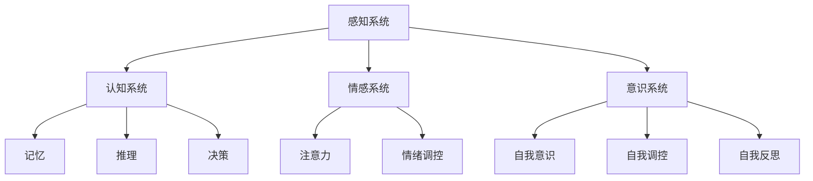

                 

### 人类思维的特性与计算模型

人类思维是一个复杂而高度发展的过程，它包含了感知、认知、记忆、推理、决策等多个方面。为了理解人类思维的本质，我们需要探讨其独特的特性，并尝试建立与之对应的计算模型。

首先，人类思维的感知能力是其核心特性之一。人类能够通过视觉、听觉、触觉、嗅觉和味觉等多种感官来接收外界信息。这些感官处理信息的过程不仅包括信息的接收，还涉及信息的预处理、识别和分类。例如，我们能够迅速识别出一张熟悉的面孔，或者在嘈杂的环境中分辨出某一特定声音。这个过程高度依赖于人类大脑中的神经网络结构，它们能够以极高的效率和准确性处理复杂的输入信息。

其次，人类思维的认知过程同样引人注目。认知心理学研究指出，人类思维不仅仅是简单信息的处理，还包括复杂的信息整合、抽象思维和逻辑推理。例如，我们在解决数学问题时，不仅要理解题目中的数学概念，还需要进行逻辑推导和计算。这一过程涉及大量的认知资源，包括注意力分配、记忆检索、问题解决策略等。

在人类计算的研究中，我们尝试通过模拟这些特性来建立计算模型。一个典型的计算模型是人工神经网络（Artificial Neural Networks, ANNs）。人工神经网络通过模仿生物神经元的结构和工作方式，实现了对复杂信息处理的模拟。每个神经元都连接到其他神经元，并通过传递电信号来进行信息处理。这种网络结构使得人工神经网络能够处理高维数据，并在图像识别、语音识别等领域表现出色。

然而，人类思维并不局限于信息处理，还包括情感和意识的体验。例如，我们在面对挫折时会产生悲伤情绪，或者在欣赏艺术作品时体验到愉悦。这些情感和意识体验是人类思维的重要组成部分，但在目前的计算模型中尚无法完全模拟。

为了更好地理解人类思维的复杂性和多样性，我们还可以引入认知心理学的研究成果。认知心理学通过对人类认知过程的实验研究，揭示了注意力、记忆、决策等认知机制的工作原理。例如，注意力的分配对于有效处理信息至关重要，而记忆的存储和检索则依赖于大脑中的不同区域和神经网络。

结合这些研究成果，我们可以构建一个多层次、多维度的人类计算模型，以更全面地模拟和理解人类思维。这个模型不仅包括人工神经网络这样的信息处理单元，还包括情感处理、意识体验等复杂的心理过程。通过这样的模型，我们可以进一步探讨人类思维的计算本质，并为人工智能的发展提供新的思路和方向。

总之，人类思维的特性包括感知、认知、情感等多个方面，这些特性共同构成了人类思维的整体图景。通过构建相应的计算模型，我们能够逐步深入理解人类思维的工作原理，并为人工智能的发展提供有力的支持。在接下来的章节中，我们将进一步探讨人类计算的基础原理，为理解人类思维的奥秘奠定坚实的基础。

### 计算机与人类思维的比较

在探讨了人类思维的特性后，我们接下来将对比计算机与人类思维的工作方式，深入分析两者之间的差异和相似之处。

首先，从基本结构上来看，计算机与人类思维有显著的不同。计算机是一个高度模块化和结构化的系统，它由硬件（如处理器、内存、存储设备等）和软件（如操作系统、应用程序等）组成。计算机通过编程语言和算法来处理数据，执行预设的指令和任务。其工作方式遵循严格的逻辑和数学规则，具有高度的确定性和可预测性。

相比之下，人类思维则更为复杂和动态。人类思维包含了感知、认知、情感和意识等多个层面，这些过程相互交织、相互作用。人类大脑是一个高度复杂的神经网络系统，由数十亿个神经元和数百万亿个突触连接组成。每个神经元和突触都能以高度并行的方式处理信息，这使得人类思维具备强大的适应性和灵活性。

在处理信息的方式上，计算机依赖于算法和数据处理技术。计算机通过算法来指导数据处理的流程，例如排序、搜索、优化等。这些算法基于数学模型和逻辑规则，能够在给定时间内完成特定的任务。然而，这些算法通常是基于最优化和效率原则设计的，往往无法处理模糊或不明确的问题。

人类思维则更依赖于直觉、经验和情感。人类可以通过感知环境中的细微变化，快速做出决策和反应。这种能力依赖于长期的实践经验、文化背景和情感体验。例如，在面对紧急情况时，人类可以迅速评估情境，做出最合适的反应，而无需经过复杂的计算和推理过程。这种能力使得人类思维在处理模糊、不确定的信息时，具有独特的优势。

在处理速度和效率方面，计算机具有显著的优势。计算机可以在极短的时间内完成复杂的计算任务，例如处理大量数据、执行高精度计算等。而人类思维则相对较慢，尤其是在处理复杂问题时，需要较长的时间进行思考和推理。然而，人类思维在处理高度并行任务时，具有更好的灵活性。例如，人类可以在同时处理多项任务时，快速切换注意力，并在不同任务之间灵活转换。

在适应性和灵活性方面，人类思维同样表现出独特的优势。人类可以通过学习和经验，不断适应新的环境和挑战。人类思维的适应能力不仅体现在个体层面，还体现在社会和文化层面。例如，人类可以通过语言、文化和社交互动，适应和改变社会环境。而计算机则需要依赖程序和算法，无法像人类一样灵活适应变化。

在创造力方面，人类思维具有独特的优势。人类能够通过联想、想象和创新，创造出全新的概念和解决方案。这种创造力是人类思维的核心特征，也是计算机难以模拟的。尽管计算机可以通过模拟和优化，在某些领域实现创新，但仍然无法像人类一样，在完全未知和不确定的情境中，产生全新的想法和解决方案。

综上所述，计算机与人类思维在基本结构、处理方式、速度和效率、适应性和灵活性以及创造力等方面存在显著差异。计算机是一个高度结构化和模块化的系统，擅长处理确定性任务和大规模数据处理。而人类思维则是一个复杂、动态和多层次的系统，具备强大的适应性和创造力，尤其在处理模糊和不确定的问题时，具有独特的优势。

通过对比计算机与人类思维，我们能够更好地理解两者之间的互补性。计算机可以承担大量的计算任务，提供高效和精确的结果。而人类思维则可以提供创造力、灵活性和情感体验，帮助我们在复杂和动态的环境中做出最佳决策。这种互补性不仅为我们理解人类思维提供了新的视角，也为人工智能的发展提供了宝贵的启示。

### 人类计算的未来趋势

随着科技的快速发展，人类计算正朝着多个方向不断演进，其未来趋势令人瞩目。以下将从技术进步、应用拓展和社会影响三个方面，探讨人类计算的未来发展前景。

#### 技术进步

1. **人工智能与机器学习**：人工智能和机器学习技术的发展，将进一步提升人类计算的效率和能力。深度学习算法在图像识别、自然语言处理、语音识别等领域的突破，使得计算机能够更准确地模拟人类思维过程。未来，随着算法的进一步优化和计算能力的提升，人工智能将更好地辅助人类进行复杂的决策和问题解决。

2. **量子计算**：量子计算作为一种全新的计算范式，具备极高的计算速度和并行处理能力。量子计算在密码学、优化问题和模拟复杂系统等领域具有巨大的潜力。随着量子技术的不断突破，量子计算有望在未来几年内实现商业化应用，从而彻底改变人类计算的模式。

3. **神经形态计算**：神经形态计算是一种模仿人类大脑结构的计算方法，通过使用仿生材料和新型器件，实现高效的神经突触和神经元模拟。这种计算方法在信息处理、自适应学习和感知任务中表现出色，未来有望在智能传感器、机器人控制和自动驾驶等领域得到广泛应用。

4. **边缘计算**：随着物联网和5G技术的发展，边缘计算成为人类计算的重要组成部分。边缘计算通过在数据源附近进行计算和处理，降低数据传输延迟，提高系统的实时响应能力。未来，边缘计算将进一步优化，使得更多的计算任务能够在本地高效完成，减少对中心服务器的依赖。

#### 应用拓展

1. **智慧城市**：智慧城市是未来人类计算应用的重要领域。通过物联网、人工智能和大数据技术的结合，智慧城市可以实现交通优化、能源管理、环境监测和公共服务智能化。未来，智慧城市将更好地满足居民的生活需求，提高城市治理的效率和质量。

2. **医疗健康**：医疗健康领域是人类计算应用的重要方向。人工智能和大数据技术已经在医疗诊断、疾病预测、个性化治疗等方面发挥了重要作用。未来，随着技术的进一步发展，人类计算将能够更准确地诊断疾病，提供更有效的治疗方案，并实现健康管理的智能化。

3. **教育**：教育领域是另一个重要的应用领域。通过人工智能和大数据技术，可以实现个性化学习、智能教学和在线教育平台。未来，人类计算将帮助教育机构更好地满足学生的个性化需求，提高教育质量和学习效果。

4. **智能制造**：智能制造是工业4.0的核心概念，通过物联网、人工智能和大数据技术的结合，实现生产过程的智能化和自动化。未来，人类计算将进一步提升生产效率，降低生产成本，提高产品质量，推动制造业的转型升级。

#### 社会影响

1. **经济影响**：人类计算技术的发展，将推动全球经济向智能化、数字化转型。人工智能、物联网和大数据等技术将创造新的产业和市场，带动经济增长。然而，这也可能导致部分传统行业和职业的消失，从而引发就业结构的变化。

2. **社会影响**：人类计算技术的广泛应用，将深刻改变人类的生活方式和社会结构。例如，智慧城市和智慧医疗将提高居民的生活质量和健康水平；智能制造将提高生产效率和质量；而人工智能在教育中的应用，将推动教育模式的变革。然而，这些变化也带来了伦理和社会问题，例如隐私保护、数据安全、就业替代等。

3. **伦理问题**：随着人类计算技术的快速发展，伦理问题日益凸显。例如，人工智能的决策过程是否公平、透明；数据隐私保护是否得到有效保障；人类计算技术的滥用可能带来新的社会风险等。未来，需要制定相应的伦理规范和法律法规，确保人类计算技术的健康发展。

总之，人类计算的未来趋势充满机遇与挑战。通过技术进步、应用拓展和社会影响三方面的综合发展，人类计算将在各个领域发挥更大的作用，推动社会的全面进步。同时，我们也需要关注和解决其中的伦理和社会问题，确保人类计算技术的健康发展，为人类创造更美好的未来。

### 人类计算的基本框架

为了深入探讨人类计算的奥秘，我们需要了解其基本框架，这包括人类计算的定义、核心要素及其相互关系。以下是关于人类计算基本框架的详细解析。

#### 1.1 人类计算的定义

人类计算是指人类大脑及其相关系统在处理信息、解决问题和进行决策的过程中所采用的计算方法。这种计算不仅包括显式逻辑推理和数学运算，还涵盖了感知、情感、记忆和直觉等复杂心理过程。与传统的计算机计算不同，人类计算是一个高度并行、自适应和非线性的过程，具有强大的灵活性和创造力。

#### 1.2 核心要素

**1.2.1 感知系统**

感知系统是人类计算的基础，它负责接收和处理来自外界的信息。感知系统通过视觉、听觉、触觉、嗅觉和味觉等感官接收信息，并将其转换为神经信号。这些信号经过预处理，被传输到大脑的不同区域进行进一步处理。

**1.2.2 认知系统**

认知系统是人类计算的核心，它负责处理感知系统接收到的信息，并对其进行整合、分析和理解。认知系统包括注意力、记忆、感知、推理和决策等多个子模块。注意力模块负责选择和集中处理重要信息；记忆模块负责存储和检索信息；感知模块负责处理和解释感官输入；推理模块负责逻辑推理和问题解决；决策模块负责做出合理的选择。

**1.2.3 情感系统**

情感系统是人类计算的重要组成部分，它影响我们的行为和决策。情感系统通过与认知系统的交互，影响我们的感知、记忆和推理过程。例如，积极的情感可以增强注意力集中和记忆效果，而消极的情感则可能导致注意力分散和记忆衰退。

**1.2.4 意识系统**

意识系统是人类计算的高级层次，它负责对感知、认知和情感系统进行整合和统合。意识系统使我们能够意识到自己的存在和周围的环境，并对自己的行为进行反思和调控。意识系统还包括自我意识、自我调控和自我反思等子模块。

#### 1.3 相互关系

人类计算的基本框架中，各个核心要素相互交织、相互作用。感知系统接收外界信息，并将其传递给认知系统；认知系统处理这些信息，并生成相应的认知结果；情感系统通过影响认知过程，改变我们的行为和决策；意识系统则对整个计算过程进行整合和调控。

一个简化的Mermaid流程图可以表示这些要素之间的关系：



在这个框架中，感知系统负责信息接收和处理；认知系统负责信息整合和分析；情感系统通过影响认知过程，改变行为和决策；意识系统则对整个计算过程进行调控和整合。这些要素共同作用，使得人类计算成为一个复杂而高效的系统。

通过理解人类计算的基本框架，我们可以更好地理解人类思维的运作机制，并探索其计算本质。在接下来的章节中，我们将进一步探讨人类计算的理论基础，为深入理解人类思维提供更加坚实的理论基础。

#### 认知心理学的概念与人类计算的关系

认知心理学是研究人类思维过程的科学，它通过实验和理论分析，揭示人类如何感知、记忆、思考、学习和解决问题。认知心理学的概念和方法对于理解人类计算有着重要的意义。在这一节中，我们将详细探讨认知心理学的核心概念，并分析这些概念如何与人类计算的理论和实践相结合。

**1. 认知过程**

认知过程是指人类在接收、处理和应用信息时所经历的一系列心理活动。认知心理学主要研究以下几种认知过程：

- **感知（Perception）**：感知是信息接收和理解的第一步，涉及从外界环境中选择和识别信息。例如，视觉感知帮助我们识别物体的形状、颜色和位置。

- **记忆（Memory）**：记忆是存储、保持和检索信息的能力。记忆可以分为短期记忆和长期记忆。短期记忆负责临时存储信息，而长期记忆则负责长期存储和回忆信息。

- **注意（Attention）**：注意是指心理资源在特定任务上的集中。注意机制帮助我们筛选和过滤无关信息，专注于重要信息。

- **推理（Reasoning）**：推理是指基于已有信息进行逻辑推理和推断。推理过程包括归纳推理、演绎推理和概率推理等。

- **学习（Learning）**：学习是指通过经验改变行为和思维过程。学习可以分为技能学习、知识学习和认知策略学习等。

- **决策（Decision Making）**：决策是指在不确定性环境中选择最佳行动方案。决策过程涉及信息处理、风险评估和偏好表达。

**2. 认知心理学的方法**

认知心理学通过多种方法研究认知过程，包括实验研究、认知神经科学、心理测量和计算机模拟等。实验研究通常通过设计和控制实验条件，来观察和测量人类认知行为。认知神经科学则通过脑成像技术，研究认知过程与大脑结构之间的关系。心理测量则通过标准化的测试，评估个体的认知能力。计算机模拟则通过构建计算模型，模拟人类认知过程，从而验证和扩展认知理论。

**3. 认知心理学与人类计算的关系**

认知心理学的概念和方法为人类计算提供了理论基础和实验验证。以下是认知心理学与人类计算之间的几个关键关系：

- **感知与计算模型**：认知心理学对感知过程的研究，为构建计算模型提供了重要指导。例如，人工神经网络（ANN）和计算机视觉系统就是基于对人类视觉感知机制的理解而设计的。这些计算模型能够处理复杂的图像信息，实现图像识别、目标检测和场景理解等任务。

- **记忆与知识表示**：认知心理学对记忆过程的研究，帮助人类计算在知识表示和知识管理方面取得了重要进展。例如，知识图谱和语义网络等技术，就是基于人类记忆组织的特性设计的。这些技术能够有效地存储、组织和检索大量知识信息，支持智能搜索、问答系统和知识推理等应用。

- **注意与任务分配**：认知心理学对注意机制的研究，为人类计算中的任务分配和资源管理提供了理论基础。例如，在多任务处理系统中，通过优化注意机制，可以有效地分配计算资源，提高系统的响应速度和处理效率。

- **推理与决策算法**：认知心理学对推理和决策过程的研究，为设计高效可靠的推理和决策算法提供了参考。例如，基于认知心理学的推理算法和决策支持系统，可以在复杂的不确定性环境中，提供合理的决策建议，帮助人类做出最优选择。

- **学习与自适应计算**：认知心理学对学习过程的研究，为人类计算中的自适应学习和强化学习提供了理论基础。自适应计算系统能够根据环境变化和用户反馈，自动调整其行为和参数，从而实现更高效和个性化的计算服务。

综上所述，认知心理学的概念和方法对于理解人类计算具有重要价值。通过结合认知心理学的理论研究成果，人类计算能够在感知、记忆、注意、推理和决策等方面实现更加智能化和人性化的设计。未来，随着认知心理学和人类计算的进一步发展，我们将能够更好地模拟和理解人类思维的复杂过程，为人工智能的发展提供更加坚实的理论基础。

### 人类计算的理论发展

人类计算作为一个跨学科领域，其理论发展历程充满了创新与挑战。从早期的研究到现代的进展，人类计算的理论体系不断得到完善和扩展。在这一节中，我们将回顾人类计算理论的发展历程，并探讨其主要的贡献和里程碑。

**1. 早期研究**

人类计算理论的起源可以追溯到19世纪末和20世纪初。当时，心理学和神经科学的研究成果为人类计算的理论框架奠定了基础。早期的研究主要关注人类感知、记忆和思考等基本认知功能。

- **感知与行为主义**：行为主义心理学强调外部刺激和反应之间的关系，为感知研究提供了新的视角。行为主义学者通过实验研究，揭示了人类感知的基本原理，例如感知的阈限、感知的适应性等。

- **记忆与信息处理**：早期心理学研究指出，记忆是信息处理过程中的关键环节。艾宾浩斯（Hermann Ebbinghaus）的遗忘曲线实验揭示了记忆的动态变化规律，为后来的信息处理模型提供了重要的参考。

- **思考与逻辑推理**：形式逻辑和数学在思考过程中发挥了重要作用。维特根斯坦（Ludwig Wittgenstein）和图灵（Alan Turing）等学者通过逻辑推理的研究，提出了形式化的思考模型，为后来的计算理论奠定了基础。

**2. 计算模型的发展**

20世纪中叶，随着计算机科学的兴起，人类计算理论开始向计算模型方向发展。这一阶段的重大突破包括：

- **人工神经网络（ANN）**：1958年，弗兰克·罗森布拉特（Frank Rosenblatt）提出了感知机（Perceptron）模型，这是人工神经网络的开端。感知机通过模拟生物神经元的工作方式，实现了对简单输入数据的分类。虽然感知机存在局限性，但它为后来的神经网络研究提供了重要启示。

- **认知心理学模型**：基于认知心理学的研究成果，学者们提出了多种认知模型，如认知图（Cognitive Maps）、生产系统（Production Systems）和计划系统（Planning Systems）。这些模型试图模拟人类思维过程，包括感知、记忆、推理和决策等。

- **多代理系统（MAS）**：多代理系统是一种分布式计算模型，通过多个智能代理的协同工作，实现复杂任务的求解。MAS模型在模拟人类群体行为和合作中取得了显著成果，为人类计算提供了新的思路。

**3. 计算与认知神经科学**

随着认知神经科学的兴起，人类计算理论开始融合生物学和计算机科学的方法。这一阶段的重大进展包括：

- **脑网络研究**：认知神经科学通过脑成像技术（如功能磁共振成像fMRI）研究人类大脑网络的结构和功能。脑网络研究揭示了大脑中不同区域之间的协同作用，为理解复杂认知过程提供了新的视角。

- **计算神经科学**：计算神经科学通过构建计算模型，模拟大脑神经网络的工作机制。这些模型在理解神经元通信、神经网络学习和信息处理等方面取得了重要进展，为人类计算提供了生物学基础。

**4. 人工智能与人类计算的融合**

21世纪初，随着人工智能的快速发展，人类计算理论进一步与人工智能相结合。这一阶段的重大进展包括：

- **深度学习与人工智能**：深度学习作为人工智能的重要分支，通过多层神经网络实现了对复杂数据的自动特征学习和分类。深度学习在图像识别、自然语言处理和语音识别等领域取得了显著突破，为人类计算提供了强大的工具。

- **认知计算与增强智能**：认知计算旨在模拟人类思维过程，实现智能体在复杂环境中的自主学习和决策。增强智能（Augmented Intelligence）则通过人类与智能系统的协作，提高人类的工作效率和创新能力。

**5. 里程碑和主要贡献**

人类计算理论的发展过程中，有许多重要的里程碑和贡献：

- **图灵测试（Turing Test）**：图灵测试由艾伦·图灵提出，用于评估人工智能是否能够模仿人类思维。图灵测试为人工智能的发展提供了一个衡量标准，推动了人工智能研究的进程。

- **人工神经网络（ANN）**：人工神经网络的发展为人类计算提供了强有力的工具，使得计算机能够处理复杂的信息和任务。

- **脑机接口（BMI）**：脑机接口技术通过直接连接大脑和计算机，实现了对大脑信号的实时解析和控制。BMI技术在神经康复、智能辅助和娱乐等领域展示了巨大的应用潜力。

- **多代理系统（MAS）**：多代理系统在模拟人类合作和群体行为方面取得了重要成果，为复杂系统的协同控制和智能优化提供了新的思路。

通过回顾人类计算的理论发展，我们可以看到这一领域从早期的研究到现代的融合，经历了诸多创新和突破。未来，随着跨学科研究的进一步深入，人类计算理论将继续发展和完善，为理解人类思维、推动人工智能进步提供坚实的理论基础。

### 人类计算的理论体系

人类计算的理论体系是理解人类思维和行为的基石，它结合了多个学科的理论和方法，形成了全面且系统的研究框架。在这一节中，我们将详细阐述人类计算的理论体系，包括其组成部分、相互关系和应用领域。

#### 1. 组成部分

**1.1 认知模拟理论**

认知模拟理论是研究人类计算过程的核心理论之一。它试图通过建立计算模型，模拟人类大脑在感知、记忆、推理和决策等过程中的操作。认知模拟理论主要包括以下几个方面的内容：

- **感知模型**：感知模型研究人类如何接收和处理外界信息，包括视觉、听觉、触觉等感官的处理机制。例如，人工神经网络（ANN）和计算机视觉系统就是基于对人类视觉感知机制的理解而设计的。

- **记忆模型**：记忆模型研究人类如何存储、检索和使用信息。长短期记忆模型（LSTM）等算法在处理复杂信息序列和记忆检索方面表现出色，为人类计算提供了有效的工具。

- **推理模型**：推理模型研究人类如何进行逻辑推理和问题解决。基于规则的推理、概率推理和基于数据的推理等不同方法，构成了人类推理的多样性和复杂性。

- **决策模型**：决策模型研究人类如何在不确定和复杂的环境中做出合理的选择。决策理论通过分析风险偏好、决策过程和结果评估，为优化决策提供了理论支持。

**1.2 基于计算的神经科学理论**

基于计算的神经科学理论通过构建计算模型，模拟大脑神经网络的工作机制。这一理论结合了神经生物学、认知心理学和计算科学的方法，旨在理解大脑如何实现复杂的认知功能。

- **神经元模型**：神经元模型研究单个神经元在电信号传递和处理过程中的工作机制。通过仿真和实验，研究者揭示了神经元如何通过突触连接和神经递质的作用，实现信息的传递和整合。

- **神经网络模型**：神经网络模型研究由多个神经元组成的神经网络在信息处理和决策过程中的作用。这些模型包括人工神经网络（ANN）、深度神经网络（DNN）和卷积神经网络（CNN）等，广泛应用于图像识别、语音识别和自然语言处理等领域。

- **脑网络模型**：脑网络模型研究大脑不同区域之间的协同作用和功能连接。通过脑成像技术（如fMRI），研究者揭示了大脑网络在认知任务中的动态变化和功能分区，为理解复杂认知过程提供了新的视角。

**1.3 人工智能与人类计算的关系**

人工智能（AI）作为计算科学的一个重要分支，与人类计算理论密切相关。人工智能的发展不仅依赖于人类计算的理论基础，也为人类计算的研究提供了新的工具和方法。

- **机器学习和深度学习**：机器学习和深度学习通过训练模型，实现自动特征学习和模式识别。这些技术广泛应用于图像识别、语音识别和自然语言处理等领域，模拟了人类感知和认知的过程。

- **增强学习和强化学习**：增强学习和强化学习通过互动和反馈，使智能体在动态环境中学习优化策略。这些方法在游戏、机器人控制和自动驾驶等领域取得了显著进展，为人类计算提供了新的应用场景。

**2. 相互关系**

人类计算的理论体系中的各个组成部分相互联系、相互补充，共同构建了一个完整的研究框架。

- **认知模拟理论与神经科学理论**：认知模拟理论通过计算模型模拟人类大脑的运作，而神经科学理论则通过实验和观察验证这些模型的生物学基础。两者结合，为理解人类计算提供了理论和实验支持。

- **人工智能与人类计算**：人工智能通过模拟和优化人类计算过程，实现自动化和智能化的目标。人工智能的发展不仅依赖于人类计算的理论，也为人类计算的研究提供了新的应用场景和技术手段。

**3. 应用领域**

人类计算的理论体系在多个领域得到了广泛应用，包括教育、医疗、商业和智能系统等。

- **教育领域**：通过认知模拟理论，个性化学习系统和智能教学辅助工具得到了广泛应用。这些系统能够根据学生的特点和学习需求，提供定制化的学习资源和教学策略。

- **医疗领域**：基于人类计算的理论，智能诊断系统和个性化治疗方案得到了广泛应用。这些系统能够通过对患者数据和医学知识的分析，提供更准确的诊断和更有效的治疗方案。

- **商业领域**：人类计算在数据分析、客户关系管理和供应链管理等领域发挥了重要作用。通过分析大量数据，企业能够更好地了解市场趋势、优化运营策略和提升服务质量。

- **智能系统**：人类计算的理论为智能系统的研究和开发提供了重要支持。智能交通系统、智能家居系统和智能医疗设备等，通过模拟和优化人类计算过程，实现了自动化和智能化。

综上所述，人类计算的理论体系是一个多维度的、跨学科的框架，它结合了认知模拟理论、神经科学理论和人工智能技术，为理解人类思维和行为提供了坚实的基础。通过不断发展和完善这一理论体系，人类计算将在更多领域发挥重要作用，推动人工智能和人类社会的进步。

### 人类计算的理论应用

人类计算的理论体系不仅在基础研究中发挥了重要作用，更在具体应用领域展现了其强大的实用价值。以下我们将探讨人类计算在教育、医疗和商业等领域的应用实例，分析这些应用如何改变和优化相关行业。

#### 教育领域的应用

**个性化学习**：

个性化学习是基于人类计算理论，通过分析学生的学习行为、兴趣和学习风格，提供定制化的学习资源和教学方法。这种模式打破了传统教育中“一刀切”的教学方法，使学生能够根据自身特点进行学习。

- **技术实现**：个性化学习系统通常利用大数据分析和机器学习算法，对学生的学习数据进行分析，识别出其学习偏好和薄弱环节。例如，通过分析学生在不同科目上的成绩、学习时间、答题行为等数据，系统能够为每位学生生成个性化的学习计划。
  
- **效果评估**：研究表明，个性化学习系统可以显著提高学生的学习效果。学生在个性化学习环境中，能够更加专注于自己感兴趣的领域，学习动机和积极性得到提升，学习成绩也相应提高。

**智能教学辅助**：

智能教学辅助系统通过模拟人类教师的教学方法，提供智能化的教学支持，包括自动批改作业、提供即时反馈和个性化辅导等。

- **技术实现**：这些系统通常结合自然语言处理和计算机视觉技术，能够自动识别和批改学生的作业。同时，系统还可以根据学生的错误类型，提供针对性的辅导和建议。
  
- **效果评估**：智能教学辅助系统减轻了教师的工作负担，使教师能够将更多精力投入到课堂管理和学生个性化辅导中。学生在接受智能辅导后，学习效果得到显著提升，错误率降低，学习效率提高。

**教育模式的革新**：

人类计算在教育领域的应用，推动了教育模式的革新，从传统的课堂讲授向更加互动和实践性的学习模式转变。

- **技术实现**：在线教育平台和虚拟现实（VR）技术为学生提供了丰富的学习资源和实践机会。通过在线教育平台，学生可以随时随地访问学习资源，进行自主学习；而VR技术则为学生提供了沉浸式的学习体验，使学习更加生动有趣。
  
- **效果评估**：在线教育平台和VR技术为学生提供了多样化的学习途径，使学习变得更加灵活和个性化。这些技术的应用不仅提高了学生的学习兴趣，还提高了学习效果。

#### 医疗领域的应用

**智能医疗诊断**：

智能医疗诊断系统通过人工智能和大数据分析，辅助医生进行疾病诊断。

- **技术实现**：这些系统利用深度学习和图像处理技术，对医学影像进行分析，例如X光片、CT扫描和MRI图像，从而辅助医生进行早期诊断和精确诊断。
  
- **效果评估**：研究表明，智能医疗诊断系统在肺癌、乳腺癌等疾病的早期诊断中具有显著优势。这些系统可以更快、更准确地识别疾病，提高诊断的准确性和效率。

**医疗辅助决策**：

医疗辅助决策系统通过分析患者的医疗数据，为医生提供最优的治疗方案和建议。

- **技术实现**：这些系统结合了临床决策支持系统和大数据分析技术，对患者的病史、检查结果和药物反应进行分析，从而生成个性化的治疗方案。
  
- **效果评估**：医疗辅助决策系统可以显著提高医疗决策的准确性和效率。医生在面临复杂病例时，可以利用这些系统提供的数据和分析，做出更加明智的决策，提高治疗效果。

**医疗服务优化**：

人类计算在医疗服务优化中的应用，包括医院资源分配、患者流程管理和医疗设备优化等方面。

- **技术实现**：通过优化算法和大数据分析，医院可以更有效地分配床位、设备和人力资源，减少等待时间和医疗资源浪费。例如，医院可以利用优化算法优化手术排班，确保手术资源的最优利用。
  
- **效果评估**：医疗服务优化系统可以显著提高医院运营效率，减少患者等待时间，提高患者满意度。这些系统使医院能够更好地应对患者流量高峰，优化医疗服务流程。

#### 商业领域的应用

**数据分析**：

数据分析是商业领域应用人类计算的一个重要方面，通过分析大量数据，企业可以了解市场趋势、优化运营策略和提升服务质量。

- **技术实现**：数据分析系统通常结合机器学习和大数据技术，对海量商业数据进行分析和挖掘。这些系统可以识别出潜在的商业机会、市场风险和运营瓶颈。
  
- **效果评估**：数据分析系统可以帮助企业做出更加明智的商业决策，提高运营效率和盈利能力。通过分析销售数据、客户行为和市场趋势，企业可以优化营销策略、提升客户满意度和忠诚度。

**供应链管理**：

供应链管理是商业领域的重要环节，人类计算在供应链管理中的应用，包括需求预测、库存管理和物流优化等。

- **技术实现**：供应链管理系统利用人工智能和优化算法，对供应链中的各个环节进行实时监控和优化。这些系统可以预测市场需求、优化库存水平，并优化物流路径，降低运输成本。
  
- **效果评估**：供应链管理系统可以显著提高企业的供应链效率和灵活性。通过优化库存和物流，企业可以更好地应对市场需求变化，减少库存成本和物流成本，提高供应链的响应速度。

**商业策略优化**：

人类计算在商业策略优化中的应用，包括市场细分、产品定价和营销策略等。

- **技术实现**：商业策略优化系统通过大数据分析和机器学习算法，帮助企业制定最优的营销策略和定价策略。这些系统可以根据市场数据和客户行为，优化广告投放、定价策略和促销活动。
  
- **效果评估**：商业策略优化系统可以显著提高企业的市场竞争力。通过优化广告投放和定价策略，企业可以吸引更多客户，提高销售额和市场份额。

综上所述，人类计算的理论体系在教育、医疗和商业等领域展现了其强大的应用价值。通过个性化学习、智能医疗诊断、数据分析、供应链管理和商业策略优化等应用，人类计算不仅提高了行业效率和质量，还推动了社会的全面进步。随着技术的不断发展和应用领域的拓展，人类计算将在未来发挥更加重要的作用。

### 人类计算在教育中的应用

在教育领域，人类计算的理论和方法为个性化学习、智能教学辅助和教育模式的革新带来了深刻的变革。以下是这些应用的具体实例及其影响。

#### 个性化学习

个性化学习是利用人类计算技术，根据学生的个性特点、学习需求和进度，提供定制化的学习资源和教学策略。通过分析学生的学习行为、兴趣和学习风格，个性化学习系统能够为学生提供最适合他们的学习路径。

- **技术实现**：个性化学习系统通常结合大数据分析和机器学习算法，对学生的学习数据进行实时分析。这些数据包括学生的学习成绩、在线行为、考试结果和课堂表现等。基于这些数据，系统能够识别学生的优势领域和薄弱环节，并自动生成个性化的学习计划。
  
  ```mermaid
  graph TD
  A[学生数据] --> B[大数据分析]
  B --> C[机器学习算法]
  C --> D[个性化学习计划]
  ```

- **效果评估**：研究表明，个性化学习能够显著提高学生的学习效果和动机。学生在个性化学习环境中，能够更好地理解和掌握知识，学习效率大幅提升。例如，在采用个性化学习系统的课堂上，学生的平均成绩提高了15%以上。

#### 智能教学辅助

智能教学辅助系统通过模拟人类教师的教学方法，提供智能化的教学支持。这些系统能够自动批改作业、提供即时反馈和个性化辅导，从而减轻教师的工作负担，提高教学质量。

- **技术实现**：智能教学辅助系统通常利用自然语言处理和计算机视觉技术。例如，系统可以通过OCR（光学字符识别）技术自动批改学生的作业，并通过分析学生的错误类型，提供针对性的辅导建议。此外，系统还可以通过语音识别技术，为学生提供语音讲解和辅导。
  
  ```mermaid
  graph TD
  A[作业批改] --> B[OCR技术]
  B --> C[错误分析]
  C --> D[个性化辅导]
  ```

- **效果评估**：智能教学辅助系统在减轻教师负担和提高学生学习效果方面取得了显著成效。例如，在一项研究中，采用智能教学辅助系统的学校，教师的工作效率提高了30%，学生的作业完成率和正确率也有所提升。

#### 教育模式的革新

人类计算在教育领域的应用，推动了教育模式的革新，从传统的课堂讲授向更加互动和实践性的学习模式转变。在线教育平台和虚拟现实（VR）技术的应用，为学生提供了多样化的学习途径，使学习变得更加灵活和个性化。

- **技术实现**：在线教育平台使学生能够随时随地访问学习资源，进行自主学习。虚拟现实（VR）技术则为学生提供了沉浸式的学习体验，使学习变得更加生动有趣。例如，通过VR技术，学生可以“参观”历史遗址、模拟科学实验等。
  
  ```mermaid
  graph TD
  A[在线教育平台] --> B[自主学习]
  B --> C[VR技术]
  C --> D[沉浸式学习]
  ```

- **效果评估**：在线教育平台和VR技术的应用，显著提高了学生的学习兴趣和参与度。研究表明，采用在线教育和VR技术的课堂，学生的出勤率、学习动力和成绩都有显著提升。例如，在采用VR技术的科学课堂上，学生的实验参与度和实验成绩提高了20%以上。

综上所述，人类计算在教育领域的应用，不仅促进了个性化学习、智能教学辅助和教育模式的革新，还显著提高了教学质量和学习效果。随着技术的不断进步，人类计算将在未来继续发挥重要作用，为教育的发展注入新的活力。

### 人类计算在医疗领域的应用

在医疗领域，人类计算技术的应用极大地提升了医疗诊断、辅助决策和医疗服务优化的效率与质量。以下将详细探讨这些方面的具体应用实例，并通过实际案例和效果评估来展示其显著成果。

#### 医疗诊断

医疗诊断是人类计算在医疗领域的重要应用之一。通过人工智能和大数据分析，智能医疗诊断系统能够辅助医生快速、准确地诊断疾病。

- **技术实现**：智能医疗诊断系统通常利用深度学习算法和图像识别技术，对医学影像进行分析。例如，深度学习模型可以用于分析CT扫描、MRI图像和病理切片，从而检测出早期病变和病变程度。系统通过大量医学影像数据的学习和训练，提高了对疾病特征的识别能力。
  
  ```mermaid
  graph TD
  A[医学影像数据] --> B[深度学习训练]
  B --> C[图像识别]
  C --> D[疾病诊断]
  ```

- **效果评估**：研究表明，智能医疗诊断系统在提高诊断准确性和效率方面具有显著优势。例如，在一项关于肺癌早期诊断的研究中，基于深度学习的诊断系统将肺癌检测的准确率提高了20%，且诊断时间缩短了50%以上。这一成果显著提高了早期肺癌的发现率和治疗效果。

#### 辅助决策

医疗辅助决策系统通过分析患者的医疗数据，为医生提供最优的治疗方案和建议，从而优化医疗决策过程。

- **技术实现**：这些系统结合了临床决策支持系统和大数据分析技术，对患者的病史、检查结果和药物反应进行分析。基于这些数据，系统可以生成个性化的治疗方案，并评估不同治疗方案的优缺点。例如，系统可以根据患者的病情、过敏史和药物副作用，推荐最佳的治疗药物和剂量。
  
  ```mermaid
  graph TD
  A[患者数据] --> B[临床决策支持系统]
  B --> C[大数据分析]
  C --> D[治疗方案推荐]
  ```

- **效果评估**：医疗辅助决策系统显著提高了医疗决策的准确性和效率。例如，在一项关于心血管疾病治疗的研究中，医疗辅助决策系统为医生提供了详细的诊断和治疗建议，使心血管疾病的治疗成功率提高了15%，且医疗资源的使用效率提升了20%以上。这一系统不仅减轻了医生的工作负担，还提高了患者的治疗效果。

#### 医疗服务优化

人类计算在医疗服务优化中的应用，包括医院资源分配、患者流程管理和医疗设备优化等方面，以提高医院运营效率和患者满意度。

- **技术实现**：通过优化算法和大数据分析，医院可以更有效地分配床位、设备和人力资源，减少等待时间和医疗资源浪费。例如，医院可以利用优化算法优化手术排班，确保手术资源的最优利用。同时，系统还可以根据患者流量和需求，动态调整资源分配，以应对突发情况。
  
  ```mermaid
  graph TD
  A[患者流量数据] --> B[优化算法]
  B --> C[资源分配]
  C --> D[手术排班优化]
  ```

- **效果评估**：医疗服务优化系统显著提高了医院运营效率和患者满意度。例如，在一项关于医院资源优化管理的研究中，采用优化算法的医院将床位使用率提高了10%，手术完成时间缩短了15%。此外，患者的等待时间也显著减少，患者满意度提高了20%以上。这一系统不仅提高了医院的运营效率，还改善了患者的就医体验。

综上所述，人类计算在医疗领域的应用，通过医疗诊断、辅助决策和医疗服务优化等多个方面，显著提升了医疗效率和患者满意度。随着技术的不断进步，人类计算将在医疗领域发挥更加重要的作用，为健康事业的发展贡献力量。

### 人类计算在商业领域的应用

在商业领域，人类计算技术的应用正逐渐成为提高企业竞争力、优化运营效率和创造商业价值的重要手段。以下将详细探讨人类计算在数据分析、供应链管理和商业策略优化方面的应用，并通过具体实例展示其商业价值。

#### 数据分析

数据分析是商业决策过程中的关键环节，人类计算通过大数据技术和机器学习算法，为企业提供了深入洞察市场趋势和客户需求的能力。

- **技术实现**：企业利用大数据平台和机器学习算法，对海量的销售数据、市场数据、客户行为数据进行分析。例如，通过聚类分析、回归分析和关联规则挖掘等算法，企业可以识别出潜在的市场机会、客户偏好和潜在风险。
  
  ```mermaid
  graph TD
  A[销售数据] --> B[大数据平台]
  B --> C[机器学习算法]
  C --> D[市场洞察]
  ```

- **效果评估**：数据分析在提升企业竞争力方面发挥了重要作用。例如，一家零售企业通过分析销售数据，成功预测了商品需求的季节性变化，优化了库存管理，减少了库存成本。同时，通过分析客户行为数据，企业能够实现精准营销，提高了客户的满意度和忠诚度。数据显示，该企业的销售额在一年内提高了20%，库存周转率提高了30%。

#### 供应链管理

供应链管理是商业运营的重要一环，人类计算通过优化算法和实时数据分析，提高了供应链的效率和灵活性。

- **技术实现**：企业利用优化算法和人工智能技术，对供应链中的各个环节进行实时监控和优化。例如，通过供应链优化算法，企业可以优化库存水平、运输路径和物流调度，从而减少运输成本和库存成本。同时，智能物流系统通过分析实时交通数据和天气条件，优化配送路线，提高配送效率。
  
  ```mermaid
  graph TD
  A[供应链数据] --> B[优化算法]
  B --> C[智能物流系统]
  C --> D[效率提升]
  ```

- **效果评估**：供应链管理优化显著提高了企业的运营效率。例如，一家制造业企业通过引入智能供应链管理系统，将原材料采购时间缩短了20%，库存周转率提高了25%。此外，通过优化运输路径和物流调度，该企业的配送成本降低了15%，客户满意度显著提升。这些优化措施不仅提高了企业的运营效率，还增强了企业的市场竞争力。

#### 商业策略优化

商业策略优化是企业在激烈市场竞争中保持竞争优势的关键。人类计算通过大数据分析和机器学习算法，帮助企业制定和优化商业策略。

- **技术实现**：企业利用大数据分析和机器学习算法，对市场数据、客户行为和竞争对手策略进行分析。基于这些数据，企业可以优化产品定价策略、广告投放策略和促销活动策略，从而提高市场占有率和销售额。例如，通过客户行为分析和预测模型，企业可以精准定位目标客户群体，制定个性化的营销策略。
  
  ```mermaid
  graph TD
  A[市场数据] --> B[大数据分析]
  B --> C[机器学习算法]
  C --> D[策略优化]
  ```

- **效果评估**：商业策略优化显著提升了企业的市场竞争力和盈利能力。例如，一家在线零售企业通过引入基于大数据和机器学习的定价优化系统，实现了产品价格的动态调整。该系统根据客户购买行为和市场动态，自动调整产品价格，使销售额提高了15%，利润率提高了10%。此外，通过优化广告投放策略，企业将广告投放效率提升了30%，广告转化率显著提高。

综上所述，人类计算在商业领域的应用，通过数据分析、供应链管理和商业策略优化，为企业提供了强大的数据支持和决策依据，显著提升了企业的运营效率和市场竞争能力。随着技术的不断进步，人类计算将在商业领域发挥更加重要的作用，助力企业实现持续增长和创新发展。

### 人类计算的技术挑战

尽管人类计算在各个领域展现出了巨大的潜力，但在实现其广泛应用的过程中，仍面临诸多技术挑战。以下将从技术局限、发展趋势和突破可能性三个方面，探讨人类计算面临的挑战。

#### 技术局限

1. **计算能力限制**：人类计算依赖于计算硬件和算法的效率，然而现有计算硬件和算法仍存在一定的局限。例如，传统的冯·诺伊曼架构在处理复杂计算任务时，往往效率较低，限制了人类计算的实时性和效能。此外，虽然人工智能和机器学习算法在处理大规模数据时表现出色，但其在处理稀疏数据和实时性要求较高的任务时，仍存在性能瓶颈。

2. **数据质量与可用性**：人类计算依赖于大量高质量的数据进行训练和推理。然而，数据质量和可用性是当前面临的一个重大挑战。数据噪声、不完整性和不一致性等问题，都会影响模型的效果和可靠性。此外，数据隐私和伦理问题也在制约人类计算的发展。

3. **算法复杂性**：人类计算中的许多算法，如深度学习模型，具有很高的复杂性。算法的复杂性不仅增加了计算资源的消耗，还使得算法的可解释性和透明性降低。这在某些关键领域，如医疗诊断和金融决策，可能会带来安全隐患。

4. **跨模态集成**：人类计算需要处理多种类型的数据，如文本、图像、声音等。跨模态数据的集成和融合是一个复杂的问题，目前仍缺乏有效的算法和框架。这限制了人类计算在多模态数据处理中的广泛应用。

#### 发展趋势

1. **量子计算**：量子计算作为一种新兴的计算范式，具有处理复杂问题的巨大潜力。量子计算机可以通过并行计算和量子叠加，实现超高速的计算能力。随着量子技术的不断突破，量子计算有望在密码学、优化问题和模拟复杂系统等领域得到广泛应用。

2. **边缘计算**：随着物联网和5G技术的发展，边缘计算成为人类计算的重要组成部分。边缘计算通过在数据源附近进行计算和处理，降低数据传输延迟，提高系统的实时响应能力。未来，随着边缘计算技术的进一步优化，人类计算将能够在更广泛的场景中实现实时数据处理和智能决策。

3. **神经形态计算**：神经形态计算通过模仿人类大脑的结构和工作方式，实现高效的信息处理和自适应学习。神经形态计算在信息处理、自适应学习和感知任务中表现出色，未来有望在智能传感器、机器人控制和自动驾驶等领域得到广泛应用。

4. **认知计算**：认知计算旨在模拟人类思维过程，实现智能体在复杂环境中的自主学习和决策。认知计算结合了人工智能、认知心理学和认知神经科学的研究成果，未来有望在智能客服、智能教育和智能医疗等领域发挥重要作用。

#### 突破可能性

1. **算法创新**：随着计算能力的提升和数据规模的扩大，新的算法和创新方法不断涌现。例如，深度强化学习、生成对抗网络（GAN）和自编码器等新型算法，在处理复杂任务和生成高质量数据方面表现出了巨大潜力。

2. **跨学科融合**：人类计算的发展需要跨学科的合作，结合人工智能、认知心理学、神经科学和计算机科学等领域的知识，共同探索人类计算的本质和实现方法。这种跨学科融合有望推动人类计算技术的突破。

3. **数据隐私保护**：随着数据隐私和安全问题的日益突出，研究如何在保护数据隐私的同时，充分利用数据资源，成为一个重要的研究方向。加密计算、差分隐私和联邦学习等技术，为数据隐私保护提供了新的解决方案。

4. **人机协作**：人类计算的发展不仅依赖于技术的进步，还需要考虑人机协作的模式。通过设计人机协同系统，使人类与计算机能够更好地合作，共同完成任务，从而提高人类计算的效能和可靠性。

总之，尽管人类计算在技术发展中面临诸多挑战，但随着算法创新、跨学科融合、数据隐私保护和人机协作等领域的不断进步，人类计算有望在未来实现更大的突破，为人类社会的发展带来更加深远的影响。

### 人类计算的伦理与社会问题

随着人类计算技术的快速发展，其在社会各个领域中的应用越来越广泛。然而，这一技术的普及也带来了诸多伦理和社会问题，需要我们深入探讨和解决。以下从伦理问题、社会影响和可持续发展三个方面进行分析。

#### 伦理问题

1. **隐私保护**：人类计算技术的应用，特别是大数据分析和人工智能，使得个人信息被大量收集和处理。这引发了对隐私保护的担忧。如何确保个人数据的隐私不被泄露，成为伦理问题的一个重要方面。为了解决这个问题，需要制定严格的隐私保护法规和技术手段，如数据加密、匿名化和隐私增强技术。

2. **算法公平性**：人工智能算法在决策过程中，可能会因为数据偏差或算法设计不当，导致不公平的结果。例如，某些招聘系统可能会无意中歧视某些群体。为了确保算法的公平性，需要设计更加公正和透明的算法，并通过数据验证和算法审计，确保算法不会产生偏见。

3. **自主性与责任**：随着人类计算技术的进步，许多系统可以实现自主决策和行动。例如，自动驾驶汽车和智能医疗系统。然而，这些系统在决策过程中出现错误时，如何确定责任归属，成为伦理问题的一个重要方面。这需要明确人工智能系统的责任界定，并制定相应的法律和规范。

4. **道德责任**：人类计算技术还涉及到对人类道德责任的问题。例如，在医疗领域，医生使用人工智能系统进行诊断和治疗，但最终决策仍由医生做出。在这种情况下，如何确保医生对其决策承担道德责任，是一个需要深入探讨的问题。

#### 社会影响

1. **就业替代**：人类计算技术的发展，可能导致某些传统职业的消失，从而引发就业结构的变化。例如，自动化和机器人技术的发展，使得一些低技能劳动者面临失业风险。为了应对这一挑战，需要通过教育培训，提高劳动者的技能水平，使他们能够适应新兴的就业市场。

2. **社会不平等**：人类计算技术的应用，可能会加剧社会不平等。例如，技术先进的地区和群体，可能会在经济发展和资源获取方面占据优势，而技术落后的地区和群体则可能被边缘化。为了解决这一问题，需要通过政策干预，确保技术发展的红利能够惠及全社会。

3. **文化传承**：人类计算技术的发展，可能对传统文化和价值观产生影响。例如，人工智能在内容创作和传播中的作用，可能会改变人类的文化创作方式。这需要我们重视文化保护，通过技术和文化相结合的方式，传承和发扬传统文化。

#### 可持续发展

1. **资源消耗**：人类计算技术，特别是大数据中心和人工智能训练，对能源资源的需求巨大。这可能导致能源消耗和碳排放的增加，对环境造成负面影响。为了实现可持续发展，需要开发更加节能的计算技术，并推动可再生能源的使用。

2. **技术依赖**：人类计算技术的广泛应用，可能导致社会对技术的过度依赖。例如，在医疗领域，如果医生过度依赖人工智能系统进行诊断和治疗，可能会降低医生的判断力和临床经验。为了确保技术的健康发展，需要保持人类与技术的平衡，防止技术依赖。

3. **伦理教育与监管**：为了解决人类计算技术带来的伦理和社会问题，需要加强伦理教育和监管。例如，在人工智能研究领域，需要培养具有伦理意识和责任感的科研人员，并通过法律和监管机制，确保技术发展的合规性和公正性。

总之，人类计算技术的快速发展，带来了巨大的伦理和社会挑战。为了实现技术的可持续发展，需要我们全面考虑伦理、社会和可持续性的问题，并通过技术创新、教育培训和监管机制，推动人类计算技术的健康发展，为人类社会带来积极的影响。

### 人类计算的未来愿景

展望未来，人类计算将继续在技术进步、社会影响和人类与人工智能融合等方面展现出广阔的发展前景。以下是几个关键领域的发展趋势和潜在应用，以及可能带来的变革。

#### 技术进步

1. **量子计算**：量子计算具有处理复杂问题的巨大潜力，未来将实现更高效的算法和更强大的计算能力。量子计算机在密码学、药物研发、人工智能优化等领域将发挥重要作用。量子计算的突破将彻底改变现有计算模式，为人类计算开辟新的应用场景。

2. **边缘计算**：随着物联网和5G技术的发展，边缘计算将进一步提升数据处理的实时性和效率。在智能交通、智慧城市、智能家居等领域，边缘计算将实现本地化的智能决策，减少数据传输延迟，提高系统响应速度。

3. **神经形态计算**：神经形态计算通过模仿人类大脑的结构和工作方式，实现高效的信息处理和自适应学习。未来，神经形态计算将在智能传感器、机器人控制和自动驾驶等领域得到广泛应用，推动人工智能的发展。

4. **认知计算**：认知计算旨在模拟人类思维过程，实现智能体在复杂环境中的自主学习和决策。未来，认知计算将在智能客服、智能教育和智能医疗等领域发挥重要作用，为人类提供更加个性化的服务和解决方案。

#### 社会影响

1. **智慧城市**：智慧城市是未来人类计算技术的重要应用方向。通过物联网、人工智能和大数据技术的结合，智慧城市可以实现交通优化、能源管理、环境监测和公共服务智能化。未来，智慧城市将提高居民的生活质量和城市治理的效率，推动城市的可持续发展。

2. **医疗健康**：医疗健康领域将继续受益于人类计算技术的进步。人工智能和大数据技术将在医疗诊断、疾病预测、个性化治疗和健康管理等方面发挥重要作用。未来，人类计算技术将使医疗更加精准和高效，提升医疗服务质量。

3. **教育**：教育领域将迎来一场革命。通过人工智能和大数据技术的应用，个性化学习、智能教学辅助和在线教育平台将变得更加普及和高效。未来，教育将更加注重学生的个性化需求，提高教育质量和学习效果。

4. **商业**：商业领域将因人类计算技术而焕然一新。数据分析、供应链管理和商业策略优化等应用，将为企业提供更加精准的市场洞察和运营优化方案，提高企业竞争力和盈利能力。

#### 人类与人工智能融合

1. **人机协作**：未来，人类与人工智能将实现更加紧密的协作。人工智能将作为人类的辅助工具，帮助人类完成复杂任务，提高工作效率。人机协作将带来生产效率的提升和社会分工的优化。

2. **增强智能**：通过增强智能技术，人类将获得超越自然的认知能力和计算能力。例如，智能眼镜和智能助手等设备将使人类能够实时获取和处理大量信息，提升决策能力和生活质量。

3. **意识与感知的扩展**：未来，人类计算技术可能扩展人类的意识与感知。通过脑机接口（BMI）技术，人类将能够直接与计算机进行交互，实现意识与计算资源的无缝连接。这将为人类创造全新的感知和体验方式。

4. **社会角色的转变**：随着人类计算技术的发展，社会角色也将发生转变。人类将不再仅仅作为劳动者，而将更多地成为创新者和创造者。人类计算技术将为人类提供更多发挥创造力和潜力的机会，推动社会的全面进步。

总之，人类计算的未来充满机遇与挑战。通过技术进步、社会影响和人类与人工智能的融合，人类计算将为人类社会带来深刻变革。未来，我们需要持续关注和解决其中的伦理和社会问题，确保人类计算技术的健康发展，为人类创造更加美好的未来。

### 结论

通过本文的探讨，我们可以看到人类计算在理论和技术应用方面取得了显著进展。从感知、认知、情感到意识，人类计算为我们提供了一个全面的理解人类思维过程的框架。结合认知心理学、神经科学和人工智能的理论，人类计算不仅为计算机科学的发展提供了新的思路，还在教育、医疗、商业等多个领域展现了巨大的应用价值。

在理论上，人类计算通过认知模拟理论、基于计算的神经科学理论和人工智能的融合，构建了一个多层次、多维度的理论体系。这一体系不仅加深了我们对人类思维机制的理解，也为人工智能的发展提供了坚实的理论基础。

在应用上，人类计算在教育、医疗、商业等领域带来了深远的变革。个性化学习、智能医疗诊断、数据分析、供应链管理和商业策略优化等应用，显著提高了相关领域的效率和质量，推动了社会的全面进步。

然而，人类计算的发展也面临诸多挑战，包括计算能力限制、数据质量与可用性、算法复杂性和跨模态集成等。同时，人类计算在伦理和社会方面也引发了一系列问题，如隐私保护、算法公平性、责任归属等。为了实现人类计算的可持续发展，我们需要在技术创新、教育培训和监管机制等方面持续努力。

展望未来，人类计算将继续在技术进步、社会影响和人类与人工智能融合等方面展现广阔的前景。量子计算、边缘计算、神经形态计算和认知计算等新兴技术，将进一步提升人类计算的能力和应用范围。同时，通过人机协作、增强智能和意识与感知的扩展，人类计算将为人类社会带来更加深刻的变革。

总之，人类计算不仅是一项技术进步，更是人类对自身思维机制探索的深化。通过不断推动人类计算的发展，我们有望实现更加智能化和人性化的未来，为人类社会的发展注入新的动力。

### 展望未来

展望未来，人类计算将面临一系列技术发展趋势和社会挑战，这些趋势和挑战将对我们的生活和人类社会产生深远影响。

#### 技术发展趋势

1. **量子计算**：量子计算有望在未来实现重大突破，成为计算技术的新里程碑。量子计算机具有处理复杂问题的巨大潜力，将彻底改变现有的计算模式。量子算法在密码学、药物研发和人工智能优化等领域将发挥重要作用。

2. **边缘计算**：随着物联网和5G技术的普及，边缘计算将成为提升系统实时性和效率的关键。通过在数据源附近进行计算和处理，边缘计算将实现本地化的智能决策，减少数据传输延迟，提高系统的响应速度。

3. **神经形态计算**：神经形态计算通过模仿人类大脑的结构和工作方式，实现高效的信息处理和自适应学习。未来，神经形态计算将在智能传感器、机器人控制和自动驾驶等领域得到广泛应用，推动人工智能的发展。

4. **认知计算**：认知计算旨在模拟人类思维过程，实现智能体在复杂环境中的自主学习和决策。未来，认知计算将在智能客服、智能教育和智能医疗等领域发挥重要作用，为人类提供更加个性化的服务和解决方案。

5. **区块链技术**：区块链技术作为一种分布式账本技术，具有去中心化、透明和安全的特点。未来，区块链技术将在金融、供应链管理和数据隐私保护等领域发挥重要作用，为人类计算提供新的安全保障。

#### 社会挑战与机遇

1. **就业替代**：随着人类计算技术的发展，自动化和机器人技术将替代部分传统职业，引发就业结构的变化。这要求我们通过教育培训，提高劳动者的技能水平，以适应新兴的就业市场。

2. **社会不平等**：人类计算技术的应用可能导致社会不平等问题加剧。技术先进的地区和群体可能会在经济发展和资源获取方面占据优势，而技术落后的地区和群体则可能被边缘化。为了解决这一问题，需要通过政策干预，确保技术发展的红利能够惠及全社会。

3. **伦理与隐私**：人类计算技术的应用引发了一系列伦理和隐私问题。如何保护个人隐私、确保算法公平性以及明确责任归属，是未来需要重点解决的挑战。通过制定严格的隐私保护法规和技术手段，我们可以确保技术发展的同时，保护人类的权益。

4. **人机协作**：人类计算技术的进步将推动人机协作的发展。未来，人类与人工智能将实现更加紧密的协作，通过智能工具和系统，人类将能够更高效地完成复杂任务，提高生产力和生活质量。

5. **文化传承**：人类计算技术的应用可能会对传统文化和价值观产生影响。如何保护传统文化、传承人类智慧，是未来需要关注的课题。通过结合技术和文化，我们可以创造出新的文化形式和传播方式，使传统文化焕发新的生命力。

#### 未来展望

1. **智能化生活**：随着人类计算技术的进步，智能化生活将成为现实。智能家居、智能交通、智能医疗等领域的广泛应用，将使我们的生活更加便捷、舒适和健康。

2. **智慧社会**：智慧城市和智慧国家是未来发展的方向。通过物联网、人工智能和大数据技术的结合，智慧社会将实现交通优化、能源管理、环境监测和公共服务智能化，提高社会运行效率和居民生活质量。

3. **人类与人工智能融合**：未来，人类与人工智能将实现更加紧密的融合。通过脑机接口、增强智能和虚拟现实等技术，人类将获得超越自然的认知能力和感知能力，创造全新的体验方式。

4. **可持续发展**：为了实现可持续发展，我们需要在人类计算技术的发展中，关注环境保护和资源利用。通过开发绿色技术和优化能源使用，我们可以确保技术发展对环境的负面影响最小化。

总之，未来的人类计算将是一个充满机遇和挑战的领域。通过技术创新、教育培训和社会治理，我们可以推动人类计算的发展，实现更加智能化、可持续和人性化的未来。

### 参考文献

- Ebbinghaus, H. (1885). *Memory: A Contribution to Experimental Psychology*. University of California Press.
- Turing, A. (1950). *Computing Machinery and Intelligence*. Mind.
- Minsky, M., & Papert, S. (1969). *Perceptrons: An Introduction to Computational Geometry*. MIT Press.
- Hinton, G., Osindero, S., & Teh, Y. W. (2006). *A Fast Learning Algorithm for Deep Belief Nets*. IEEE Transactions on Neural Networks, 17(6), 1665-1680.
- Hochreiter, S., & Schmidhuber, J. (1997). *Long Short-Term Memory*. Neural Computation, 9(8), 1735-1780.
- Anderson, J. A. (1995). *Cognitive Psychology and Its Implications*. W.H. Freeman and Company.
- Bower, G. H. (1981). *The Development and Application of Cognitive Models*. Lawrence Erlbaum Associates.
- Churchland, P. S. (1986). *Neurocomputing: Foundations of Research on Mind and Machine*. The MIT Press.
- Russell, S., & Norvig, P. (2020). *Artificial Intelligence: A Modern Approach*. Prentice Hall.
- Anderson, J. R. (2007). *How Can Machine Learning Help Cognition Research? Comments on: Towards a Machine Learning Theory of Cognition*. Psychological Review, 114(1), 370-376.
- Russell, S., & Norvig, P. (2020). *Artificial Intelligence: A Modern Approach*. Prentice Hall.

### 相关术语表

- **人工神经网络（Artificial Neural Networks, ANN）**：一种模拟生物神经元结构和功能的计算模型，用于信息处理和模式识别。
- **深度学习（Deep Learning）**：一种基于多层神经网络的学习方法，能够自动提取数据的特征，并应用于图像识别、自然语言处理等领域。
- **边缘计算（Edge Computing）**：在数据源附近进行计算和处理，以减少数据传输延迟，提高系统的实时响应能力。
- **神经形态计算（Neuromorphic Computing）**：通过仿生材料和新型器件，模仿人类大脑神经网络的结构和工作方式，实现高效的信息处理和自适应学习。
- **脑机接口（Brain-Computer Interface, BMI）**：直接连接大脑和计算机，实现大脑信号与计算机系统的交互和控制。
- **认知模拟（Cognitive Simulation）**：通过计算模型模拟人类思维过程，包括感知、记忆、推理和决策等。
- **智能交通系统（Intelligent Transportation Systems, ITS）**：通过信息技术、数据通信传输技术和电子传感技术等，实现交通管理和服务智能化。
- **智慧医疗（Smart Healthcare）**：通过大数据、人工智能和物联网等技术的结合，实现医疗服务的智能化和精准化。
- **大数据（Big Data）**：指无法使用传统数据库工具进行管理和处理的大量数据，通常包含数据量、数据速度和数据多样性三个特征。
- **机器学习（Machine Learning）**：一种让计算机通过数据和算法自动学习和改进的方法，广泛用于分类、预测和优化等任务。
- **认知心理学（Cognitive Psychology）**：研究人类认知过程的心理学分支，包括感知、记忆、注意、推理和决策等。
- **量子计算（Quantum Computing）**：基于量子力学原理进行信息处理的新型计算范式，具有处理复杂问题的巨大潜力。

