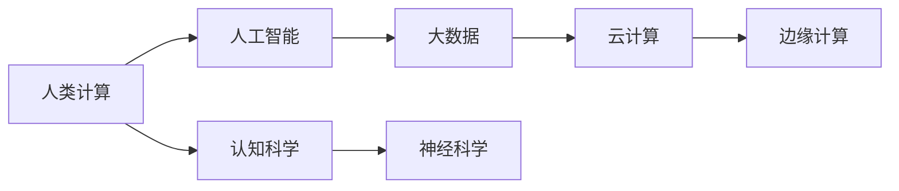

                 

### 文章标题: 《探索人类潜力的无限可能：人类计算的新征程》

> 关键词：人类计算、人工智能、大数据、云计算、边缘计算、认知科学、神经科学

> 摘要：本文以《探索人类潜力的无限可能：人类计算的新征程》为主题，系统性地探讨了人类计算领域的核心概念、技术基础、应用实践及未来展望。文章旨在揭示人类计算的无尽可能，引导读者深入理解这一领域的深刻内涵与广阔前景。

在当今技术飞速发展的时代，人类计算作为计算机科学和人工智能的核心领域，正引领着科技革命的浪潮。从计算机科学的基础理论，到人工智能的算法原理，再到大数据与云计算的实践应用，人类计算正不断拓展我们的认知边界，推动社会进步。本文将带领读者踏上一场探索人类计算无限可能的全新征程。

### 引言与核心概念

#### 第1章: 引言

##### 1.1 人类计算的背景与发展

人类计算的历史可以追溯到计算机科学的诞生。随着计算机硬件和软件技术的进步，人类计算从最初的简单计算演变为复杂的计算系统。从20世纪40年代的图灵机理论，到20世纪60年代的人工智能初探，再到21世纪的大数据和云计算，人类计算经历了多个发展阶段。

##### 1.2 书籍的主题与目标

本书的主题是探索人类计算的无限可能。我们旨在深入分析人类计算的核心概念、技术基础和应用实践，揭示其背后的科学原理和创新实践。通过本书，读者将了解人类计算的最新发展动态，掌握核心概念和技术，启发对未来的思考。

#### 第2章: 核心概念与联系

##### 2.1 人类计算的定义与分类

人类计算是指利用计算机硬件和软件技术，模拟和扩展人类智能的过程。根据计算目标和任务的不同，人类计算可以划分为多个类别，如人工智能、大数据、云计算、边缘计算等。

##### 2.2 人类计算与人工智能的关系

人工智能是现代人类计算的核心领域，旨在通过算法和计算模型模拟人类智能。人工智能的发展不仅依赖于计算机科学的基础理论，还涉及到认知科学、神经科学等多个学科领域。

##### 2.3 人类计算的重要原则

人类计算遵循一系列重要原则，包括计算的可扩展性、可依赖性、灵活性和可持续性。这些原则指导着人类计算技术的发展和应用。

##### 2.4 人类计算的未来趋势

随着科技的不断进步，人类计算的未来趋势将包括人工智能的深度学习、大数据的实时处理、云计算的边缘计算等。这些新趋势将为人类计算带来更加广阔的应用前景。

#### 

通过上述核心概念与联系的分析，我们可以看到人类计算是一个庞大而复杂的体系，涵盖了多个相关领域。在接下来的章节中，我们将进一步探讨这些领域的具体内容和技术原理。

### 人类计算的技术基础

#### 第3章: 计算机科学基础

##### 3.1 计算机组成原理

计算机组成原理是计算机科学的基础，它涵盖了计算机硬件和软件的基本结构和功能。计算机硬件包括中央处理器（CPU）、内存、输入输出设备等，而计算机软件则包括操作系统、编译器、解释器等。

##### 3.2 编程语言基础

编程语言是人与计算机进行交流的工具。常见的编程语言包括C、C++、Java、Python等。每种编程语言都有其独特的语法和特点，适用于不同的应用场景。

##### 3.3 数据结构与算法

数据结构是存储和管理数据的方式，而算法则是解决问题的方法。常见的数据结构有数组、链表、树、图等，而常见的算法有排序、查找、动态规划等。

##### 3.4 操作系统与计算机网络

操作系统是计算机系统的核心软件，负责管理和调度计算机资源。计算机网络则是连接多个计算机系统，实现数据传输和共享的通信网络。

#### 第4章: 人工智能基础

##### 4.1 机器学习概述

机器学习是人工智能的核心技术，它通过算法让计算机从数据中学习规律和模式。常见的机器学习算法有监督学习、无监督学习和强化学习等。

##### 4.2 深度学习原理

深度学习是机器学习的一个分支，它通过多层神经网络模拟人类大脑的神经元连接结构。深度学习在图像识别、自然语言处理等领域取得了显著成果。

##### 4.3 自然语言处理

自然语言处理是人工智能的一个重要应用方向，它旨在让计算机理解和处理人类自然语言。常见的自然语言处理技术包括分词、语法分析、机器翻译等。

##### 4.4 计算机视觉

计算机视觉是人工智能的另一个重要应用方向，它通过计算机对图像和视频进行分析和处理。计算机视觉在人脸识别、图像分类等领域具有广泛的应用。

##### 4.5 强化学习

强化学习是机器学习的一种方法，它通过试错和奖励机制让计算机学习如何做出最优决策。强化学习在游戏、推荐系统等领域有广泛的应用。

#### 第5章: 大数据与云计算基础

##### 5.1 大数据技术概述

大数据是指数据量巨大、类型繁多、价值密度低的数据集合。大数据技术包括数据采集、存储、处理和分析等环节。

##### 5.2 云计算平台与服务

云计算是一种通过互联网提供计算资源的服务模式。常见的云计算平台有亚马逊AWS、微软Azure、谷歌云等。

##### 5.3 数据存储与处理技术

数据存储与处理技术是大数据的核心技术，包括分布式存储、分布式计算、实时处理等。

##### 5.4 分布式计算与处理

分布式计算与处理是大数据技术的关键，它通过将数据分布在多个节点上进行并行处理，提高计算效率和性能。

通过以上对人类计算技术基础的分析，我们可以看到人类计算是一个庞大而复杂的体系，涉及到多个相关领域的技术原理和应用。在接下来的章节中，我们将进一步探讨人类计算的应用实践。

### 人类计算的应用实践

#### 第6章: 人工智能应用实践

##### 6.1 人工智能在医疗领域的应用

人工智能在医疗领域的应用广泛，包括疾病预测、诊断辅助、治疗规划等。例如，利用深度学习算法可以自动分析医学影像，提高疾病诊断的准确性。

##### 6.2 人工智能在金融领域的应用

人工智能在金融领域被广泛应用于风险管理、投资策略、客户服务等方面。例如，通过自然语言处理技术，可以自动分析市场报告和新闻，为投资决策提供支持。

##### 6.3 人工智能在制造业的应用

人工智能在制造业中的应用包括生产优化、质量控制、供应链管理等方面。例如，通过计算机视觉技术，可以对生产过程中的产品进行质量检测，提高生产效率。

##### 6.4 人工智能在农业领域的应用

人工智能在农业领域可以帮助提高农作物的产量和质量。例如，利用无人机和计算机视觉技术，可以对农田进行精准施肥和喷药。

##### 6.5 人工智能在教育领域的应用

人工智能在教育领域被广泛应用于在线教育、个性化教学、学习分析等方面。例如，通过自适应学习系统，可以根据学生的学习情况和进度，提供个性化的学习资源和指导。

#### 第7章: 云计算与大数据应用实践

##### 7.1 云计算在企业中的实际应用案例

云计算在企业中的应用包括企业资源规划（ERP）、客户关系管理（CRM）、数据分析等。例如，一家大型企业可以通过使用云计算平台，将企业内部的IT资源进行整合和管理，提高工作效率和灵活性。

##### 7.2 大数据在商业分析中的应用案例

大数据在商业分析中的应用可以帮助企业更好地了解市场和客户需求。例如，通过大数据分析，一家零售企业可以了解不同产品的销售趋势和消费者偏好，从而制定更有效的营销策略。

##### 7.3 云计算与大数据在智慧城市中的应用

云计算与大数据在智慧城市中的应用包括智能交通管理、环境监测、公共安全等方面。例如，通过使用云计算和大数据技术，一个城市可以实现智能交通管理，优化交通流量，减少拥堵。

##### 7.4 边缘计算在物联网中的应用

边缘计算在物联网中的应用可以帮助实现实时数据处理和响应。例如，在智能家居系统中，通过边缘计算，可以实现智能设备之间的实时通信和协作，提高生活便利性。

通过以上对人类计算应用实践的分析，我们可以看到人类计算在不同领域的广泛应用和巨大潜力。在未来的发展中，人类计算将继续推动各领域的创新和进步。

### 认知科学与人类计算

#### 第8章: 认知科学与人类计算

##### 8.1 认知科学的基本原理

认知科学是研究人类认知过程的学科，它关注人类的思维、感知、记忆、学习等认知活动。认知科学的基本原理包括信息加工理论、符号主义理论和连接主义理论等。

##### 8.2 认知科学与人工智能的结合

认知科学与人工智能的结合为人工智能的发展提供了新的理论基础。通过将认知科学的方法和理论应用于人工智能研究，可以更好地模拟和扩展人类智能。

##### 8.3 认知科学与教育

认知科学在教育领域的应用包括教学设计、学习评估、学习策略等方面。通过认知科学的理论，可以更好地理解学生的学习过程，提高教学效果。

##### 8.4 认知科学与心理健康

认知科学在心理健康领域的应用包括认知行为疗法、认知康复等。通过认知科学的理论和方法，可以更好地理解和治疗心理疾病。

### 人类计算的挑战与机遇

#### 第9章: 人类计算的挑战与机遇

##### 9.1 人类计算的伦理与道德问题

随着人类计算的发展，伦理和道德问题日益凸显。例如，人工智能的决策透明性和公平性、大数据的隐私保护等问题都需要得到解决。

##### 9.2 人类计算的安全与隐私问题

人类计算的安全和隐私问题关系到用户的利益和社会的稳定。例如，数据泄露、网络攻击等安全威胁对人类计算的发展构成了挑战。

##### 9.3 人类计算的可持续发展

人类计算的可持续发展需要考虑资源的合理利用、环境的保护等问题。通过技术创新和制度设计，可以促进人类计算的可持续发展。

##### 9.4 人类计算的未来发展趋势

人类计算的未来发展趋势包括人工智能的自主性、大数据的实时处理、云计算的边缘计算等。这些新趋势将为人类计算带来更加广阔的应用前景。

### 人类计算的新征程

#### 第10章: 人类计算的新征程

##### 10.1 新技术的崛起

新技术的崛起将推动人类计算的发展。例如，量子计算、脑机接口等新兴技术将为人类计算带来全新的变革。

##### 10.2 跨学科融合

跨学科融合将推动人类计算的发展。通过将认知科学、神经科学等学科的理论和方法应用于人类计算研究，可以更好地理解和模拟人类智能。

##### 10.3 创新与实践

创新与实践是人类计算发展的重要动力。通过不断的创新和实践，人类计算将不断突破现有的技术瓶颈，实现新的突破。

##### 10.4 人类计算的社会影响

人类计算的发展将对社会产生深远的影响。通过改善医疗、教育、金融等领域的服务质量，人类计算将为社会的可持续发展做出贡献。

### 附录

#### 附录 A: 技术资源与工具

##### A.1 人工智能开发工具

- TensorFlow: 一个开源的机器学习框架，适用于各种机器学习和深度学习应用。
- PyTorch: 一个开源的机器学习库，特别适合于深度学习研究。

##### A.2 大数据与分析工具

- Hadoop: 一个开源的大数据处理框架，适用于海量数据的存储和处理。
- Spark: 一个开源的分布式计算系统，适用于大数据的实时处理和分析。

##### A.3 云计算平台介绍

- 亚马逊AWS: 提供全面的云计算服务，包括计算、存储、数据库、人工智能等。
- 微软Azure: 提供广泛的云计算服务，包括开发工具、数据库、人工智能等。

##### A.4 人类计算相关的开源项目

- OpenCV: 一个开源的计算机视觉库，适用于图像和视频处理。
- Keras: 一个开源的深度学习框架，特别适合于快速实验和原型开发。

### 作者信息

作者：AI天才研究院/AI Genius Institute & 禅与计算机程序设计艺术 /Zen And The Art of Computer Programming

本文由AI天才研究院的专家团队撰写，旨在为读者提供关于人类计算的全面而深入的见解。通过本文，我们希望激发读者对人类计算领域的兴趣，共同探索这一领域的无限可能。

