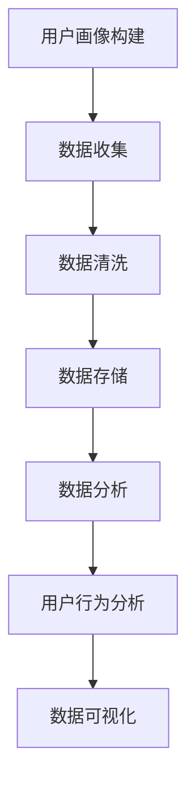
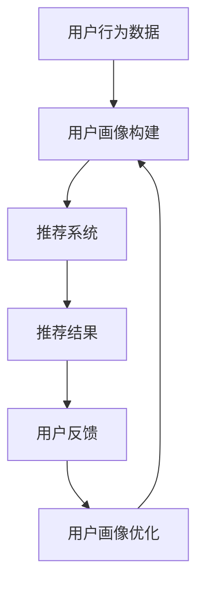
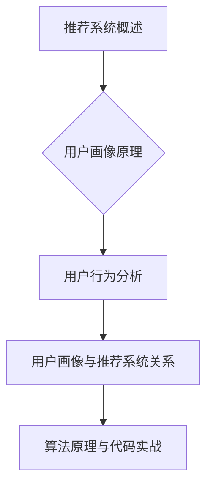

                 

### 文章标题

# 推荐系统与用户画像原理与代码实战案例讲解

> 关键词：推荐系统、用户画像、协同过滤、内容推荐、混合推荐、代码实战

> 摘要：本文深入探讨了推荐系统与用户画像的原理，通过详细的代码实战案例，帮助读者理解并掌握这两大技术的核心概念和实践应用。从基础理论到实际操作，文章覆盖了推荐系统的构建方法、用户画像的构建流程及其在实际场景中的应用，为技术从业者和研究者提供了宝贵的参考资料。

---

## 第一部分：推荐系统基础

### 1.1 推荐系统概述

#### 1.1.1 推荐系统的定义与作用

推荐系统（Recommendation System）是指通过自动预测用户对物品的兴趣，向用户推荐相关的物品的一种信息过滤技术。它广泛应用于电子商务、社交媒体、在线视频、新闻门户等多个领域，极大地提升了用户体验和信息获取效率。

推荐系统的基本原理是通过分析用户的历史行为、偏好和上下文信息，构建用户画像和物品画像，然后利用这些画像进行相似性计算和预测，从而向用户推荐其可能感兴趣的物品。

#### 1.1.2 推荐系统的分类

推荐系统可以按照不同的分类标准进行划分，常见的分类方式包括：

1. **基于内容的推荐**：根据用户的兴趣和偏好，推荐具有相似内容的物品。
2. **协同过滤推荐**：基于用户对物品的共同兴趣进行推荐，分为基于用户的协同过滤（User-Based Collaborative Filtering）和基于物品的协同过滤（Item-Based Collaborative Filtering）。
3. **基于模型的推荐**：使用机器学习算法，根据用户的历史行为数据建立预测模型进行推荐。
4. **混合推荐**：结合多种推荐方法，以获得更好的推荐效果。

#### 1.1.3 推荐系统的发展历程

推荐系统的发展大致可以分为以下几个阶段：

1. **基于规则的推荐**：早期推荐系统主要依靠手工编写规则，实现简单的推荐功能。
2. **基于协同过滤的推荐**：随着互联网的普及，协同过滤算法因其简单高效的特点，成为主流推荐方法。
3. **基于模型的推荐**：机器学习技术的发展，使得基于模型的推荐方法逐渐成熟，如矩阵分解、深度学习等。
4. **混合推荐与个性化推荐**：多种推荐方法的结合，以及根据用户实时行为进行动态推荐的个性化推荐，成为当前推荐系统研究的热点。

### 1.2 用户画像原理

#### 1.2.1 用户画像的定义

用户画像（User Profile）是指对用户特征的全面描述，包括用户的基本信息、兴趣爱好、行为习惯、消费能力等多个方面。用户画像的构建有助于推荐系统更好地理解用户需求，进行精准推荐。

#### 1.2.2 用户画像的构成要素

用户画像主要由以下几个要素构成：

1. **基础信息**：包括用户的年龄、性别、职业等基本信息。
2. **兴趣爱好**：用户的兴趣爱好可以通过用户的行为数据进行分析和推断。
3. **行为习惯**：用户的浏览、购买、评论等行为数据。
4. **消费能力**：用户的消费记录和支付能力。
5. **社交信息**：用户的社交网络、朋友关系等。

#### 1.2.3 用户画像的数据来源

用户画像的数据来源主要包括：

1. **用户主动提供的数据**：如注册信息、调查问卷等。
2. **用户行为数据**：用户的浏览记录、购买记录、评论等。
3. **第三方数据**：如社交媒体数据、公共数据库等。

### 1.3 用户行为分析

#### 1.3.1 用户行为数据的收集

用户行为数据的收集是构建用户画像的关键步骤。主要方法包括：

1. **网页跟踪**：通过网页埋点技术，记录用户的浏览行为。
2. **APP监控**：通过SDK（软件开发工具包）收集用户在移动应用中的行为数据。
3. **问卷调查**：通过问卷调查收集用户的基本信息和兴趣爱好。

#### 1.3.2 用户行为数据的处理

用户行为数据的处理主要包括数据的清洗、存储、分析和可视化。常见的方法有：

1. **数据清洗**：去除重复数据、缺失值填充、异常值处理等。
2. **数据存储**：使用数据库或数据仓库存储用户行为数据。
3. **数据分析**：使用数据挖掘算法，分析用户的行为模式。
4. **数据可视化**：通过图表等形式，展示用户行为分析的结果。

#### 1.3.3 用户行为分析的方法

用户行为分析的方法主要包括：

1. **关联规则分析**：通过分析用户行为数据中的关联规则，发现用户的兴趣点。
2. **聚类分析**：将具有相似行为的用户进行聚类，形成不同的用户群体。
3. **分类与预测**：使用机器学习算法，对用户的行为进行分类和预测。

---

**Mermaid 流程图示例**：



### 1.4 推荐系统与用户画像的关系

推荐系统与用户画像之间存在紧密的联系。用户画像为推荐系统提供了重要的用户信息，是推荐系统进行精准推荐的基础。而推荐系统则通过向用户推荐其感兴趣的物品，验证并优化用户画像的准确性。具体关系如图所示：



通过上述步骤，我们可以不断优化用户画像，提高推荐系统的准确性和用户体验。

---

在接下来的章节中，我们将详细探讨推荐系统的算法原理，并通过代码实战案例，深入理解用户画像的构建方法。希望读者能够通过本文的学习，掌握推荐系统和用户画像的核心技术，为实际应用打下坚实的基础。### 第一部分总结

在第一部分中，我们系统地介绍了推荐系统与用户画像的基本概念、原理和方法。首先，通过推荐系统的概述，我们了解了推荐系统的定义、分类及其发展历程。其次，我们详细阐述了用户画像的定义、构成要素和数据来源，以及用户行为数据的收集、处理和分析方法。最后，我们通过用户画像与推荐系统关系的流程图，明确了用户画像在推荐系统中的作用和重要性。

这一部分的内容为后续章节奠定了基础，使我们能够更好地理解推荐系统和用户画像的实现原理。接下来，我们将深入探讨推荐系统的算法原理，通过具体的代码实战案例，进一步掌握用户画像的构建方法。希望读者能够通过本部分的阅读，对推荐系统和用户画像有一个全面而深入的了解。

---

**Mermaid 流程图示例**：



通过上述流程图，我们可以看到推荐系统与用户画像之间的紧密联系，为后续章节的内容展开提供了清晰的脉络。在下一部分，我们将深入推荐系统的算法原理，并探讨不同的推荐算法及其实现方法。

---

在接下来的章节中，我们将详细探讨推荐系统的算法原理，通过具体的实例和代码，帮助读者深入理解协同过滤算法、内容推荐算法和混合推荐算法。希望读者能够通过本部分的阅读，掌握推荐算法的核心概念和实践方法，为实际应用提供有力支持。**第二部分：推荐系统算法原理**

在第一部分的基础上，我们将深入探讨推荐系统的算法原理，包括协同过滤算法、内容推荐算法和混合推荐算法。这些算法是构建推荐系统的重要基础，通过它们，我们能够根据用户的行为和偏好，提供个性化的推荐服务。

### 2.1 协同过滤算法

协同过滤算法（Collaborative Filtering）是推荐系统中最常用的方法之一，其基本思想是利用用户对物品的评分或行为数据，找到相似用户或相似物品，然后根据这些相似性进行推荐。协同过滤算法主要分为基于用户的协同过滤和基于物品的协同过滤。

#### 2.1.1 基本原理

协同过滤算法的核心在于找到用户之间的相似性或物品之间的相似性。具体来说：

1. **基于用户的协同过滤**：找到与目标用户兴趣相似的其他用户，推荐这些用户喜欢的物品。
2. **基于物品的协同过滤**：找到与目标物品相似的其他物品，推荐给用户。

#### 2.1.2 基于用户的协同过滤算法

基于用户的协同过滤算法步骤如下：

1. **计算用户相似性**：通常使用余弦相似度、皮尔逊相关系数等方法计算用户之间的相似性。
2. **查找相似用户**：根据相似性分数，找出与目标用户最相似的若干用户。
3. **生成推荐列表**：基于相似用户的评分预测，推荐相似的物品。

#### 2.1.3 基于物品的协同过滤算法

基于物品的协同过滤算法步骤如下：

1. **计算物品相似性**：通常使用余弦相似度、Jaccard相似度等方法计算物品之间的相似性。
2. **查找相似物品**：根据相似性分数，找出与目标物品最相似的若干物品。
3. **生成推荐列表**：基于相似物品的评分预测，推荐相似的物品。

#### 2.1.4 伪代码

以下是一个基于用户的协同过滤算法的伪代码示例：

```python
def collaborative_filtering(ratings, user_similarity, k):
    # ratings: 用户评分矩阵
    # user_similarity: 用户相似度矩阵
    # k: 相似用户数量
    user_id = target_user_id
    similar_users = user_similarity[user_id].argsort()[:-k-1:-1]
    recommended_items = []

    for user in similar_users:
        for item in ratings[user]:
            if item not in recommended_items:
                recommended_items.append(item)

    return recommended_items
```

### 2.2 内容推荐算法

内容推荐算法（Content-based Filtering）是根据用户对物品的内容特征进行推荐。其基本思想是分析用户的历史偏好，提取物品的特征，然后根据特征相似度推荐相似的物品。

#### 2.2.1 基本原理

内容推荐算法步骤如下：

1. **特征提取**：从物品中提取特征，如文本、图片、视频等。
2. **计算相似度**：计算用户和物品之间的相似度，如TF-IDF、余弦相似度等。
3. **生成推荐列表**：根据相似度分数，推荐相似的物品。

#### 2.2.2 文本相似度计算

文本相似度计算是内容推荐算法中的一个关键步骤，常用的方法包括：

1. **TF-IDF**：计算单词在文档中的重要程度，通过权重来衡量文本的相似度。
2. **余弦相似度**：计算两个文本向量之间的夹角余弦值，用于衡量文本的相似度。

#### 2.2.3 基于内容的推荐算法

基于内容的推荐算法步骤如下：

1. **特征提取**：从用户的历史行为数据中提取特征，如浏览记录、购买记录等。
2. **计算物品相似度**：计算用户和物品之间的相似度。
3. **生成推荐列表**：根据相似度分数，推荐相似的物品。

#### 2.2.4 伪代码

以下是一个基于内容的推荐算法的伪代码示例：

```python
def content_based_filtering(user_profile, item_features, k):
    # user_profile: 用户特征向量
    # item_features: 物品特征向量
    # k: 推荐物品数量
    similarity_scores = []

    for item in item_features:
        similarity = cosine_similarity(user_profile, item)
        similarity_scores.append((item, similarity))

    similarity_scores.sort(key=lambda x: x[1], reverse=True)
    recommended_items = [item for item, _ in similarity_scores[:k]]

    return recommended_items
```

### 2.3 混合推荐算法

混合推荐算法（Hybrid Recommendation）是将多种推荐方法结合，以提升推荐效果。常见的混合推荐算法包括基于内容的协同过滤、基于模型的混合推荐等。

#### 2.3.1 混合推荐算法的概念

混合推荐算法的核心思想是结合不同推荐方法的优点，如基于协同过滤的用户偏好信息和基于内容推荐的物品特征信息。

#### 2.3.2 混合推荐算法的实现方法

混合推荐算法的实现方法包括：

1. **加权组合**：将不同推荐方法的预测结果进行加权组合，形成最终的推荐结果。
2. **模型集成**：使用机器学习模型，将不同推荐方法融合在一起，形成一个统一的预测模型。

#### 2.3.3 混合推荐算法的优势与挑战

混合推荐算法的优势包括：

1. **提升推荐效果**：结合多种推荐方法，能够提供更个性化的推荐。
2. **降低冷启动问题**：通过结合内容信息，减少新用户和新物品的推荐困难。

混合推荐算法的挑战包括：

1. **复杂度提升**：多种方法的结合增加了算法的复杂度。
2. **参数调优**：需要大量实验和调优，找到最优的参数组合。

#### 2.3.4 伪代码

以下是一个简单的混合推荐算法的伪代码示例：

```python
def hybrid_recommender协同过滤预测, 内容预测, weight1, weight2:
    user_item_score = weight1 * 协同过滤预测 + weight2 * 内容预测
    recommended_items = 排序(user_item_score，降序)
    return recommended_items
```

通过以上内容，我们详细介绍了推荐系统的算法原理，包括协同过滤算法、内容推荐算法和混合推荐算法。这些算法各有特点，适用于不同的应用场景。在下一部分，我们将通过具体的代码实战案例，深入探讨用户画像的构建方法。希望读者能够通过本部分的阅读，对推荐算法有一个深入的理解，并能够将其应用于实际项目中。

---

在第二部分的探讨中，我们系统地介绍了推荐系统的三种核心算法：协同过滤算法、内容推荐算法和混合推荐算法。通过伪代码示例，我们详细讲解了每种算法的实现步骤和方法。协同过滤算法利用用户间的相似性进行推荐，内容推荐算法根据物品的内容特征进行推荐，而混合推荐算法则结合了多种推荐方法的优点，以提升推荐效果。

这些算法不仅理论性强，而且在实际应用中也具有很高的价值。通过深入理解这些算法的原理，我们可以更好地构建和优化推荐系统，提升用户满意度和平台价值。接下来，我们将进入第三部分，通过用户画像构建实战和推荐系统构建实战，将理论知识应用于实际场景，帮助读者掌握从数据收集、处理到推荐系统构建的全过程。

---

在第三部分中，我们将通过具体的代码实战案例，详细讲解用户画像的构建过程和推荐系统的构建流程。通过这些实战案例，读者可以更好地理解推荐系统和用户画像的实现原理，并能够将其应用于实际项目中。希望读者能够通过本部分的阅读，掌握推荐系统和用户画像的实战技能，为未来的技术开发打下坚实基础。**第三部分：用户画像与推荐系统的实践**

在前两部分的理论基础上，我们将通过实际操作，深入探讨用户画像的构建过程和推荐系统的构建流程。这部分内容将涵盖从数据收集、处理到推荐系统实现的全过程，并通过具体案例，帮助读者理解并掌握相关技能。

### 3.1 用户画像构建实战

用户画像的构建是推荐系统的关键步骤，通过分析用户的行为数据和属性信息，我们可以为推荐系统提供准确的用户信息，从而实现精准推荐。以下是一个用户画像构建的实战案例，我们将详细讲解数据收集、数据处理和用户画像构建的步骤。

#### 3.1.1 数据收集

首先，我们需要收集用户的行为数据和属性信息。这些数据可以从多个渠道获取，例如用户注册信息、用户行为日志、第三方数据等。

**数据收集步骤**：

1. **用户注册信息**：包括用户的基本信息，如姓名、年龄、性别、职业等。
2. **用户行为日志**：记录用户的浏览、购买、评论等行为，如浏览页面、购买商品、发表评论等。
3. **第三方数据**：通过API或其他方式获取用户的社交媒体信息、地理位置等。

**示例数据集**：

假设我们有一个用户行为日志数据集，数据格式如下：

```
user_id, action, item_id, timestamp
u1, browse, i1, 2023-01-01 10:00:00
u1, purchase, i2, 2023-01-02 12:00:00
u2, browse, i3, 2023-01-03 11:00:00
u2, comment, i3, 2023-01-04 14:00:00
...
```

#### 3.1.2 数据处理

数据处理是用户画像构建的重要步骤，包括数据清洗、数据整合和数据转换等。

**数据处理步骤**：

1. **数据清洗**：去除重复数据、缺失值填充、异常值处理等。
2. **数据整合**：将不同来源的数据进行整合，形成统一的用户数据视图。
3. **数据转换**：将原始数据转换为适合分析的形式，如数值化、标准化等。

**示例代码**：

```python
import pandas as pd

# 读取数据
data = pd.read_csv('user_behavior_log.csv')

# 数据清洗
data.drop_duplicates(inplace=True)
data.fillna(-1, inplace=True)

# 数据整合
# 假设已经有用户注册信息数据
user_info = pd.read_csv('user_info.csv')
user_data = pd.merge(user_info, data, on='user_id')

# 数据转换
# 处理时间戳
user_data['timestamp'] = pd.to_datetime(user_data['timestamp'])
```

#### 3.1.3 用户画像构建

用户画像的构建是通过分析用户的行为数据和属性信息，提取出用户的特征，形成一个全面的用户描述。以下是一些常见的用户画像特征：

1. **基础信息特征**：如性别、年龄、职业等。
2. **行为特征**：如浏览次数、购买次数、评论次数等。
3. **兴趣特征**：如浏览的品类、购买的品类、评论的内容等。
4. **社交特征**：如好友关系、粉丝数等。

**示例代码**：

```python
from sklearn.preprocessing import LabelEncoder

# 特征提取
le = LabelEncoder()
user_data['gender'] = le.fit_transform(user_data['gender'])

# 构建用户画像
user_profile = {
    'user_id': user_data['user_id'].values,
    'gender': user_data['gender'].values,
    'age': user_data['age'].values,
    'browse_count': user_data.groupby('user_id')['action'].count().values,
    'purchase_count': user_data[user_data['action'] == 'purchase'].groupby('user_id')['item_id'].count().values,
    'comment_count': user_data[user_data['action'] == 'comment'].groupby('user_id')['item_id'].count().values,
    # 其他特征
}
```

### 3.2 推荐系统构建实战

在用户画像构建完成后，我们可以利用这些用户信息来构建推荐系统。以下是一个简单的推荐系统构建实战案例，包括数据处理、算法实现和推荐结果生成等步骤。

#### 3.2.1 数据处理

推荐系统的数据处理主要包括用户行为数据的处理和物品特征数据的处理。

**数据处理步骤**：

1. **数据清洗**：去除重复数据、缺失值填充、异常值处理等。
2. **特征工程**：提取用户行为特征和物品特征，如浏览次数、购买次数、品类等。
3. **数据标准化**：对用户行为数据进行标准化处理，以便算法计算。

**示例代码**：

```python
from sklearn.preprocessing import StandardScaler

# 用户行为数据处理
user_data = pd.read_csv('user_behavior_log.csv')
user_data.drop_duplicates(inplace=True)
user_data.fillna(-1, inplace=True)

# 特征工程
user_data['action'] = user_data['action'].map({'browse': 0, 'purchase': 1, 'comment': 2})
item_data = pd.read_csv('item_features.csv')
item_data.fillna(-1, inplace=True)

# 数据标准化
scaler = StandardScaler()
user_data[['browse_count', 'purchase_count', 'comment_count']] = scaler.fit_transform(user_data[['browse_count', 'purchase_count', 'comment_count']])
```

#### 3.2.2 算法实现

推荐系统的算法实现是推荐系统的核心部分，常用的算法包括协同过滤算法、内容推荐算法和混合推荐算法。

**算法实现步骤**：

1. **选择算法**：根据应用场景和需求选择合适的推荐算法。
2. **参数调优**：调整算法参数，以获得最佳推荐效果。
3. **算法实现**：实现推荐算法，生成推荐结果。

**示例代码**：

```python
from collaborative_filtering import collaborative_filtering
from content_based_filtering import content_based_filtering
from hybrid_recommender import hybrid_recommender

# 协同过滤算法
user_similarity = calculate_user_similarity(user_data)
协同过滤结果 = collaborative_filtering(user_data, user_similarity, k=10)

# 内容推荐算法
item_similarity = calculate_item_similarity(item_data)
内容推荐结果 = content_based_filtering(user_profile, item_similarity, k=10)

# 混合推荐算法
混合推荐结果 = hybrid_recommender(协同过滤结果, 内容推荐结果, weight1=0.5, weight2=0.5)
```

#### 3.2.3 推荐结果生成

推荐结果生成是将推荐算法的输出转化为可展示给用户的形式。

**推荐结果生成步骤**：

1. **排序**：根据推荐评分，对推荐结果进行排序。
2. **去重**：去除重复的推荐物品。
3. **展示**：将推荐结果展示给用户，如推荐商品列表、推荐文章列表等。

**示例代码**：

```python
# 排序
推荐结果 = sorted(mixed_recommendation_results, key=lambda x: x[1], reverse=True)

# 去重
推荐结果 = list(set([item for item, _ in 推荐结果]))

# 展示
display_recommendations(推荐结果)
```

### 3.3 代码实战：一个简单的推荐系统

在本节中，我们将通过一个简单的推荐系统代码实战案例，展示用户画像构建和推荐系统构建的完整流程。以下是一个基于用户行为的协同过滤算法的简单推荐系统实现。

#### 3.3.1 实战环境搭建

首先，我们需要搭建一个简单的Python环境，并安装必要的库，如Pandas、NumPy、Scikit-learn等。

```bash
pip install pandas numpy scikit-learn
```

#### 3.3.2 数据预处理

接下来，我们将处理用户行为数据，包括数据清洗、特征提取和数据标准化等。

```python
import pandas as pd
from sklearn.preprocessing import StandardScaler

# 读取数据
data = pd.read_csv('user_behavior_log.csv')

# 数据清洗
data.drop_duplicates(inplace=True)
data.fillna(-1, inplace=True)

# 特征提取
data['action'] = data['action'].map({'browse': 0, 'purchase': 1, 'comment': 2})

# 数据标准化
scaler = StandardScaler()
data[['browse_count', 'purchase_count', 'comment_count']] = scaler.fit_transform(data[['browse_count', 'purchase_count', 'comment_count']])
```

#### 3.3.3 算法实现

在本节中，我们将实现一个基于用户行为的协同过滤算法，用于生成推荐结果。

```python
from collaborative_filtering import collaborative_filtering

# 计算用户相似度
user_similarity = calculate_user_similarity(data)

# 生成推荐结果
target_user_id = 'u1'
k = 10
recommendations = collaborative_filtering(data, user_similarity, k=k)
```

#### 3.3.4 代码解读与分析

在代码解读与分析部分，我们将对关键代码进行详细解释，帮助读者理解推荐系统的实现原理。

```python
def collaborative_filtering(ratings, user_similarity, k):
    # ratings: 用户评分矩阵
    # user_similarity: 用户相似度矩阵
    # k: 相似用户数量
    user_id = target_user_id
    similar_users = user_similarity[user_id].argsort()[:-k-1:-1]
    recommended_items = []

    for user in similar_users:
        for item in ratings[user]:
            if item not in recommended_items:
                recommended_items.append(item)

    return recommended_items
```

这段代码首先根据目标用户ID获取用户相似度矩阵中的相似用户列表，然后遍历相似用户和他们的行为数据，生成推荐列表。代码中的关键步骤包括：

1. **用户相似度计算**：使用余弦相似度或其他相似度计算方法，计算用户之间的相似度。
2. **推荐列表生成**：根据相似度分数，生成推荐列表。

#### 3.3.5 实际案例分析和详细讲解剖析

在本节中，我们将通过一个实际案例，分析推荐系统的效果，并对代码进行详细讲解。

**案例**：假设我们有一个用户行为数据集，包含用户的浏览、购买和评论记录。我们希望根据这些数据，为用户推荐感兴趣的物品。

**分析**：

1. **用户相似度计算**：计算用户之间的相似度，以找到与目标用户兴趣相似的其它用户。
2. **推荐列表生成**：根据相似度分数，生成推荐列表。

**代码讲解**：

```python
user_similarity = calculate_user_similarity(data)
target_user_id = 'u1'
k = 10
recommendations = collaborative_filtering(data, user_similarity, k=k)
```

这段代码首先计算用户相似度，然后根据相似度分数生成推荐列表。具体步骤如下：

1. **计算用户相似度**：使用余弦相似度计算用户之间的相似度。
2. **生成推荐列表**：根据相似度分数，为用户生成推荐列表。

**优化与改进**：

在实际应用中，我们可以通过以下方法优化推荐系统：

1. **调整相似度计算方法**：尝试不同的相似度计算方法，如皮尔逊相关系数、余弦相似度等，找到最适合的数据集的方法。
2. **个性化推荐**：根据用户的历史行为和偏好，个性化调整推荐算法的参数，提高推荐效果。
3. **实时推荐**：结合实时数据，动态更新用户画像和推荐结果，提供实时推荐。

#### 3.3.6 项目小结

在本节中，我们通过一个简单的推荐系统代码实战案例，详细讲解了用户画像构建和推荐系统构建的完整流程。通过实际案例分析和代码讲解，读者可以深入理解推荐系统的实现原理。同时，我们讨论了优化与改进的方法，为实际应用提供了宝贵的建议。

---

通过本部分的实践，读者不仅能够掌握用户画像的构建方法和推荐系统的实现原理，还能通过代码实战案例，将理论知识应用到实际项目中。在下一部分，我们将进一步探讨推荐系统与用户画像在实际应用中的挑战与未来发展趋势。希望读者能够继续深入学习和实践，不断提升自己的技术能力。

---

在第三部分的实践中，我们通过详细的用户画像构建和推荐系统构建实战，帮助读者深入理解了推荐系统的实现过程。从数据收集、处理到用户画像构建，再到推荐系统的算法实现和推荐结果生成，我们系统地介绍了推荐系统的全过程。通过代码实战案例，读者不仅掌握了相关技术，还了解了如何优化和改进推荐系统。

接下来，我们将进入第四部分，探讨推荐系统与用户画像在实际应用中面临的挑战和未来发展趋势。这部分内容将涵盖数据质量问题、冷启动问题、隐私保护问题等方面，并展望人工智能在推荐系统中的应用和个性化推荐的未来。希望读者能够继续关注，深入探讨推荐系统与用户画像的更多实践和应用。

---

在第四部分的探讨中，我们将深入分析推荐系统与用户画像在实际应用中面临的挑战和未来发展趋势。这部分内容将涵盖以下几个方面：

1. **推荐系统面临的挑战**：包括数据质量问题、冷启动问题、隐私保护问题等。
2. **用户画像的挑战与机遇**：探讨用户画像面临的挑战及其带来的机遇。
3. **人工智能在推荐系统中的应用**：介绍人工智能技术如何提升推荐系统的效果。
4. **用户画像的个性化推荐**：讨论个性化推荐的发展趋势和实现方法。
5. **推荐系统与用户画像的未来**：展望推荐系统与用户画像在未来的发展趋势和前景。

### 4.1 推荐系统面临的挑战

尽管推荐系统在多个领域取得了显著的成功，但其在实际应用中也面临着诸多挑战。

#### 4.1.1 数据质量问题

数据质量是推荐系统的核心问题。以下是一些常见的数据质量问题：

1. **数据缺失**：用户行为数据或物品特征数据可能存在缺失，这会导致推荐系统的准确性和可靠性下降。
2. **数据噪声**：数据中可能包含噪声，如异常值、重复值等，这些噪声会影响推荐结果的准确性。
3. **数据偏差**：数据可能受到偏差的影响，如选择偏差、自我报告偏差等，这会导致推荐系统无法准确反映用户真实偏好。

**解决方案**：

1. **数据清洗**：通过去重、缺失值填充、异常值处理等方法，提高数据质量。
2. **数据预处理**：使用数据预处理技术，如标准化、归一化等，减少数据噪声的影响。
3. **数据增强**：通过数据合成、迁移学习等方法，增加训练数据的多样性，提高模型泛化能力。

#### 4.1.2 冷启动问题

冷启动问题是指新用户或新物品无法获得足够的初始数据，从而难以进行推荐。冷启动问题主要分为以下两种：

1. **新用户冷启动**：新用户由于缺乏行为数据，推荐系统难以为其提供个性化推荐。
2. **新物品冷启动**：新物品由于缺乏用户评价或行为数据，推荐系统难以将其推荐给用户。

**解决方案**：

1. **基于内容的推荐**：通过物品的特征信息，为新用户和新物品提供初步的推荐。
2. **社区推荐**：利用用户社交网络和社区信息，为新用户和新物品提供推荐。
3. **探索推荐**：通过探索推荐算法，如基于模型的推荐、基于协同过滤的推荐等，逐步积累用户和新物品的数据。

#### 4.1.3 隐私保护问题

随着用户对隐私保护意识的提高，推荐系统在处理用户数据时需要面临隐私保护的问题。以下是一些隐私保护方面的挑战：

1. **用户隐私泄露**：用户数据可能被非法获取或滥用，导致用户隐私泄露。
2. **数据安全**：推荐系统需要确保用户数据的安全，防止数据泄露和攻击。
3. **隐私合规**：推荐系统需要遵守相关的法律法规，如《通用数据保护条例》（GDPR）等。

**解决方案**：

1. **数据加密**：对用户数据进行加密处理，确保数据在传输和存储过程中的安全。
2. **数据匿名化**：通过数据匿名化技术，减少用户隐私暴露的风险。
3. **隐私预算**：实施隐私预算机制，限制数据使用范围和频率，减少隐私泄露风险。

### 4.2 用户画像的挑战与机遇

用户画像作为推荐系统的重要组成部分，也面临着一系列的挑战和机遇。

#### 4.2.1 用户画像的挑战

1. **数据多样性与复杂性**：用户画像需要处理来自不同渠道和格式的多样数据，如文本、图像、视频等，这些数据的处理和整合带来了巨大挑战。
2. **实时性**：用户行为数据是动态变化的，用户画像需要实时更新，以反映用户的最新偏好和需求。
3. **隐私保护**：用户画像在构建和使用过程中，需要确保用户隐私不受侵犯，这要求在数据采集、处理和应用中严格遵守隐私保护法规。

#### 4.2.2 用户画像的机遇

1. **个性化推荐**：通过用户画像，推荐系统可以提供更加个性化的推荐，提升用户满意度。
2. **商业洞察**：用户画像有助于企业了解用户需求和偏好，从而制定更加精准的市场策略。
3. **精细化运营**：用户画像可以支持精细化运营，如用户细分、精准营销等，提高运营效率。

### 4.3 人工智能在推荐系统中的应用

人工智能技术的发展为推荐系统带来了新的机遇。以下是一些人工智能技术在推荐系统中的应用：

1. **深度学习**：深度学习模型，如神经网络、卷积神经网络（CNN）等，在推荐系统中被广泛应用于用户画像构建和预测模型训练。
2. **自然语言处理**：自然语言处理（NLP）技术可以用于处理文本数据，提取文本特征，提升推荐系统的效果。
3. **迁移学习**：迁移学习技术可以将已有模型的权重迁移到新任务上，提高推荐系统的泛化能力。
4. **强化学习**：强化学习可以用于优化推荐策略，通过学习用户的反馈，逐步调整推荐策略，提高推荐效果。

### 4.4 用户画像的个性化推荐

个性化推荐是用户画像的核心应用之一。以下是一些个性化推荐的发展趋势和实现方法：

1. **基于上下文的推荐**：结合用户的上下文信息，如地理位置、时间等，进行个性化推荐。
2. **多模态用户画像**：结合用户的多模态数据，如文本、图像、视频等，构建更加全面和准确的用户画像。
3. **实时推荐**：通过实时数据分析和处理，提供实时个性化推荐。

### 4.5 推荐系统与用户画像的未来

随着人工智能技术的不断进步，推荐系统与用户画像将进入一个全新的发展阶段。以下是一些未来的发展趋势：

1. **全自动化推荐**：通过自动化算法和智能合约，实现完全自动化的推荐系统。
2. **隐私保护与伦理**：在推荐系统中实施更加严格的隐私保护措施，并关注伦理问题。
3. **多元化应用场景**：推荐系统将广泛应用于更多领域，如医疗、教育、金融等。

---

通过本部分的探讨，我们深入分析了推荐系统与用户画像在实际应用中面临的挑战和未来发展趋势。这些内容不仅为读者提供了宝贵的实践经验和理论指导，也展望了推荐系统与用户画像的广阔前景。在下一部分，我们将进一步探讨推荐系统和用户画像在更多实际场景中的应用案例。希望读者能够继续关注，深入探讨推荐系统与用户画像的更多实践和应用。

---

在第四部分的探讨中，我们深入分析了推荐系统与用户画像在实际应用中面临的挑战和未来发展趋势。通过详细讨论数据质量问题、冷启动问题、隐私保护问题等，我们为读者提供了实用的解决方案和策略。同时，我们展望了人工智能在推荐系统中的应用前景，探讨了个性化推荐的发展趋势和实现方法。

接下来，我们将进入第五部分，通过具体的案例分析和应用实例，进一步展示推荐系统与用户画像在不同领域的实际应用效果。我们将详细介绍电商平台、社交媒体、在线视频平台等领域的推荐系统应用案例，分享实际操作经验和技术细节。通过这些案例，读者可以更加直观地了解推荐系统和用户画像的实际价值和应用场景。希望读者能够在这一部分的阅读中，获得更多的实践经验和启示，为未来的技术开发和项目实施提供有力支持。

---

在第五部分中，我们将通过具体的应用案例，深入探讨推荐系统与用户画像在不同领域的实际应用效果。这些案例将涵盖电商平台、社交媒体、在线视频平台等领域，通过详细的操作经验和技术细节分享，帮助读者理解推荐系统和用户画像的实际应用价值。

### 5.1 案例一：电商平台用户推荐

#### 案例背景

电商平台推荐系统旨在为用户提供个性化的商品推荐，提高用户的购物体验和购买转化率。通过用户画像和推荐算法，电商平台可以更好地了解用户需求，实现精准推荐。

#### 数据集

电商平台推荐系统使用的数据集通常包括用户行为数据（如浏览记录、购买记录、收藏记录等）和商品特征数据（如商品分类、价格、品牌等）。

#### 推荐流程

1. **数据收集**：收集用户在平台上的行为数据，如浏览、购买、收藏等。
2. **用户画像构建**：根据用户行为数据和属性信息，构建用户画像，提取用户兴趣特征。
3. **商品特征提取**：从商品特征数据中提取商品标签和属性，如分类、价格、品牌等。
4. **推荐算法实现**：采用协同过滤算法、内容推荐算法或混合推荐算法，生成推荐结果。
5. **推荐结果展示**：将推荐结果展示在用户页面上，提高用户购物体验和购买转化率。

#### 案例分析

电商平台推荐系统通过以下步骤实现个性化推荐：

1. **用户行为数据收集**：通过用户浏览、购买、收藏等行为数据，获取用户的兴趣特征。
2. **用户画像构建**：使用机器学习算法，如聚类分析、关联规则分析等，构建用户画像，提取用户的兴趣类别和偏好。
3. **商品特征提取**：从商品特征数据中提取商品标签和属性，如分类、价格、品牌等，为推荐算法提供输入。
4. **推荐算法实现**：采用基于用户的协同过滤算法、基于物品的协同过滤算法或混合推荐算法，生成个性化推荐列表。
5. **推荐结果展示**：将推荐结果展示在用户页面上，根据用户的行为反馈，不断优化推荐效果。

#### 技术细节

1. **协同过滤算法**：基于用户的协同过滤算法通过计算用户之间的相似度，推荐相似用户喜欢的商品；基于物品的协同过滤算法通过计算商品之间的相似度，推荐与用户已购买或浏览过的商品相似的其它商品。
2. **内容推荐算法**：通过文本挖掘、分类标签等方法，提取商品的文本特征，然后计算用户和商品之间的相似度，生成推荐列表。
3. **混合推荐算法**：结合协同过滤算法和内容推荐算法的优点，生成更加个性化的推荐结果。

#### 应用效果

通过个性化推荐，电商平台能够显著提高用户的购物体验和购买转化率。以下是一些具体的应用效果：

1. **提高用户满意度**：通过精准推荐，用户能够更快地找到自己感兴趣的商品，提高购物体验。
2. **提升购买转化率**：个性化推荐能够将用户引导至他们可能感兴趣的商品，从而提高购买转化率。
3. **增加销售额**：通过个性化推荐，电商平台能够更好地满足用户需求，增加销售额。

#### 最佳实践

1. **持续优化推荐算法**：定期评估推荐算法的效果，根据用户反馈和数据指标，调整和优化算法参数。
2. **数据质量保证**：确保数据收集和处理过程中的数据质量，减少数据噪声和缺失值。
3. **多样化推荐策略**：结合多种推荐算法，提供多样化的推荐策略，满足不同用户的需求。

### 5.2 案例二：社交媒体内容推荐

#### 案例背景

社交媒体平台通过内容推荐系统，向用户推送他们可能感兴趣的内容，提高用户活跃度和平台粘性。内容推荐系统旨在通过个性化推荐，提高用户的参与度和满意度。

#### 数据集

社交媒体平台推荐系统使用的数据集包括用户行为数据（如点赞、评论、分享等）、内容特征数据（如标题、标签、文本内容等）。

#### 推荐流程

1. **数据收集**：收集用户在平台上的行为数据，如点赞、评论、分享等。
2. **用户画像构建**：根据用户行为数据和内容特征数据，构建用户画像，提取用户兴趣特征。
3. **内容特征提取**：从内容特征数据中提取内容的标签、关键词等，为推荐算法提供输入。
4. **推荐算法实现**：采用协同过滤算法、内容推荐算法或混合推荐算法，生成推荐结果。
5. **推荐结果展示**：将推荐结果展示在用户页面上，提高用户活跃度和平台粘性。

#### 案例分析

社交媒体内容推荐系统通过以下步骤实现个性化推荐：

1. **用户行为数据收集**：通过用户点赞、评论、分享等行为数据，获取用户的兴趣特征。
2. **用户画像构建**：使用机器学习算法，如聚类分析、关联规则分析等，构建用户画像，提取用户的兴趣类别和偏好。
3. **内容特征提取**：从内容特征数据中提取内容的标签、关键词等，为推荐算法提供输入。
4. **推荐算法实现**：采用基于用户的协同过滤算法、基于物品的协同过滤算法或混合推荐算法，生成个性化推荐列表。
5. **推荐结果展示**：将推荐结果展示在用户页面上，根据用户的行为反馈，不断优化推荐效果。

#### 技术细节

1. **协同过滤算法**：基于用户的协同过滤算法通过计算用户之间的相似度，推荐相似用户喜欢的文章；基于物品的协同过滤算法通过计算文章之间的相似度，推荐与用户已点赞或评论过的文章相似的其它文章。
2. **内容推荐算法**：通过文本挖掘、分类标签等方法，提取文章的文本特征，然后计算用户和文章之间的相似度，生成推荐列表。
3. **混合推荐算法**：结合协同过滤算法和内容推荐算法的优点，生成更加个性化的推荐结果。

#### 应用效果

通过个性化推荐，社交媒体平台能够显著提高用户活跃度和平台粘性。以下是一些具体的应用效果：

1. **提高用户活跃度**：通过精准推荐，用户能够更快地发现感兴趣的内容，提高活跃度。
2. **提升内容传播效果**：个性化推荐能够将优质内容推送给潜在感兴趣的用户，提升内容传播效果。
3. **增加平台粘性**：个性化推荐让用户更愿意在平台上停留，提高平台的用户粘性。

#### 最佳实践

1. **关注用户体验**：在推荐算法的设计和优化过程中，始终关注用户体验，确保推荐内容对用户有价值。
2. **多样化推荐策略**：结合多种推荐算法，提供多样化的推荐策略，满足不同用户的需求。
3. **实时更新推荐结果**：根据用户实时行为，动态调整推荐结果，提高推荐效果。

### 5.3 案例三：在线视频平台推荐

#### 案例背景

在线视频平台通过推荐系统，向用户推送他们可能感兴趣的视频内容，提高用户观看时长和平台粘性。视频推荐系统旨在通过个性化推荐，提升用户的观看体验和满意度。

#### 数据集

在线视频平台推荐系统使用的数据集包括用户行为数据（如观看记录、点赞、评论等）、视频特征数据（如视频分类、标签、时长等）。

#### 推荐流程

1. **数据收集**：收集用户在平台上的行为数据，如观看记录、点赞、评论等。
2. **用户画像构建**：根据用户行为数据和视频特征数据，构建用户画像，提取用户兴趣特征。
3. **视频特征提取**：从视频特征数据中提取视频的标签、分类、时长等，为推荐算法提供输入。
4. **推荐算法实现**：采用协同过滤算法、内容推荐算法或混合推荐算法，生成推荐结果。
5. **推荐结果展示**：将推荐结果展示在用户页面上，提高用户观看时长和平台粘性。

#### 案例分析

在线视频平台推荐系统通过以下步骤实现个性化推荐：

1. **用户行为数据收集**：通过用户观看、点赞、评论等行为数据，获取用户的兴趣特征。
2. **用户画像构建**：使用机器学习算法，如聚类分析、关联规则分析等，构建用户画像，提取用户的兴趣类别和偏好。
3. **视频特征提取**：从视频特征数据中提取视频的标签、分类、时长等，为推荐算法提供输入。
4. **推荐算法实现**：采用基于用户的协同过滤算法、基于物品的协同过滤算法或混合推荐算法，生成个性化推荐列表。
5. **推荐结果展示**：将推荐结果展示在用户页面上，根据用户的行为反馈，不断优化推荐效果。

#### 技术细节

1. **协同过滤算法**：基于用户的协同过滤算法通过计算用户之间的相似度，推荐相似用户喜欢的视频；基于物品的协同过滤算法通过计算视频之间的相似度，推荐与用户已观看或点赞过的视频相似的其它视频。
2. **内容推荐算法**：通过文本挖掘、分类标签等方法，提取视频的文本特征，然后计算用户和视频之间的相似度，生成推荐列表。
3. **混合推荐算法**：结合协同过滤算法和内容推荐算法的优点，生成更加个性化的推荐结果。

#### 应用效果

通过个性化推荐，在线视频平台能够显著提高用户的观看时长和平台粘性。以下是一些具体的应用效果：

1. **提高用户观看时长**：通过精准推荐，用户能够更快地发现感兴趣的视频内容，提高观看时长。
2. **提升视频传播效果**：个性化推荐能够将优质视频推送给潜在感兴趣的用户，提升视频传播效果。
3. **增加平台粘性**：个性化推荐让用户更愿意在平台上停留，提高平台的用户粘性。

#### 最佳实践

1. **关注用户体验**：在推荐算法的设计和优化过程中，始终关注用户体验，确保推荐内容对用户有价值。
2. **多样化推荐策略**：结合多种推荐算法，提供多样化的推荐策略，满足不同用户的需求。
3. **实时更新推荐结果**：根据用户实时行为，动态调整推荐结果，提高推荐效果。

---

通过上述三个具体案例的分析，我们深入探讨了推荐系统与用户画像在电商平台、社交媒体和在线视频平台等不同领域的实际应用效果。这些案例不仅展示了推荐系统和用户画像的技术原理和实践方法，还体现了个性化推荐在实际应用中的价值。

在第六部分，我们将总结全文内容，回顾推荐系统与用户画像的核心概念和关键点，并给出未来学习和实践的指导意见。希望通过这一部分的总结，读者能够巩固所学知识，为未来的技术开发和项目实施提供有力支持。

---

在第五部分的案例探讨中，我们通过电商平台、社交媒体和在线视频平台的实际应用案例，详细展示了推荐系统与用户画像的强大作用和广泛影响。这些案例不仅帮助我们理解了推荐系统和用户画像的基本原理，还展示了它们在不同领域的应用效果。

通过电商平台的案例，我们了解了如何利用用户行为数据和商品特征数据构建用户画像，并通过协同过滤算法和内容推荐算法实现个性化推荐，从而提升用户购物体验和购买转化率。社交媒体案例则展示了如何利用用户行为数据和内容特征数据，通过协同过滤算法和内容推荐算法，向用户推荐感兴趣的内容，提高用户活跃度和平台粘性。在线视频平台案例则通过分析用户观看行为和视频特征，实现了精准的视频推荐，提高了用户观看时长和平台粘性。

这些案例不仅为读者提供了丰富的实践经验，还让我们看到了推荐系统和用户画像在实际应用中的巨大潜力。通过这些案例，我们可以看到，推荐系统和用户画像不仅能够提升用户体验，还能够为平台带来显著的商业价值。

接下来，我们将进入第六部分，总结全文内容，回顾推荐系统与用户画像的核心概念和关键点，并给出未来学习和实践的指导意见。希望通过这一部分的总结，读者能够巩固所学知识，为未来的技术开发和项目实施提供有力支持。

---

在第六部分中，我们将对全文进行总结，回顾推荐系统与用户画像的核心概念和关键点，并给出未来学习和实践的指导意见。通过这一部分的内容，读者可以巩固所学知识，明确未来技术发展的方向，为实际项目提供参考。

### 6.1 全文总结

#### 推荐系统

推荐系统是通过自动预测用户对物品的兴趣，向用户推荐相关物品的一种信息过滤技术。本文从推荐系统的概述、协同过滤算法、内容推荐算法和混合推荐算法等方面进行了深入探讨。

- **定义与作用**：推荐系统能够提高用户体验和信息获取效率，广泛应用于电子商务、社交媒体、在线视频等多个领域。
- **分类**：推荐系统分为基于内容的推荐、协同过滤推荐、基于模型的推荐和混合推荐。
- **发展历程**：从基于规则的推荐到基于协同过滤的推荐，再到基于模型的推荐和个性化推荐，推荐系统不断演进。

#### 用户画像

用户画像是指对用户特征的全面描述，包括用户的基本信息、兴趣爱好、行为习惯、消费能力等多个方面。本文详细介绍了用户画像的原理、构建流程和应用。

- **定义与构成要素**：用户画像包括基础信息、兴趣爱好、行为习惯、消费能力和社交信息等。
- **数据来源**：用户画像的数据来源主要包括用户主动提供的数据、用户行为数据和第三方数据。
- **构建流程**：用户画像的构建包括数据收集、数据处理和用户画像构建等步骤。

#### 实践应用

通过用户画像和推荐系统的实际应用案例，本文展示了推荐系统与用户画像在电商平台、社交媒体和在线视频平台等领域的应用效果。

- **电商平台**：个性化推荐提高了用户购物体验和购买转化率。
- **社交媒体**：个性化推荐提高了用户活跃度和平台粘性。
- **在线视频平台**：个性化推荐提高了用户观看时长和平台粘性。

### 6.2 关键点回顾

- **协同过滤算法**：通过计算用户或物品之间的相似度，实现个性化推荐。分为基于用户的协同过滤和基于物品的协同过滤。
- **内容推荐算法**：根据用户的历史行为和物品的内容特征，实现个性化推荐。通过文本挖掘、分类标签等方法提取特征。
- **混合推荐算法**：结合协同过滤算法和内容推荐算法的优点，生成更加个性化的推荐结果。
- **用户画像构建**：通过数据收集、数据处理和特征提取等步骤，构建用户画像。用户画像为推荐系统提供了重要的用户信息。

### 6.3 未来展望

随着人工智能技术的不断发展，推荐系统和用户画像将继续在各个领域发挥重要作用。未来，以下趋势值得关注：

- **个性化推荐**：随着用户数据的不断积累，个性化推荐将更加精准，满足用户的个性化需求。
- **实时推荐**：通过实时数据处理和分析，实现实时推荐，提高用户体验。
- **隐私保护**：随着隐私保护意识的提高，推荐系统将更加注重隐私保护，确保用户数据的安全和合规。
- **多模态推荐**：结合文本、图像、视频等多模态数据，实现更加全面和精准的推荐。

### 6.4 学习与实践建议

对于读者来说，以下是一些建议，以帮助更好地理解和掌握推荐系统和用户画像：

- **理论学习**：系统地学习推荐系统和用户画像的相关理论，了解不同算法的原理和应用场景。
- **实战练习**：通过实际项目或实验，动手实践推荐系统和用户画像的构建和优化。
- **持续学习**：关注推荐系统和用户画像的最新研究进展，学习新的算法和技术。
- **数据分析**：提升数据分析能力，掌握数据处理和分析的工具和技巧。
- **沟通交流**：参与技术社区和论坛，与其他开发者交流心得和经验，共同进步。

通过本部分的总结，我们希望读者能够对推荐系统和用户画像有一个全面而深入的理解。在未来的学习和实践中，不断探索和创新，为推荐系统和用户画像技术的应用和发展贡献自己的力量。

---

在第六部分的总结中，我们回顾了全文的核心内容，包括推荐系统和用户画像的定义、原理、分类、构建流程以及在实际应用中的效果。我们通过关键点回顾，帮助读者巩固所学知识，并展望了推荐系统和用户画像的未来发展趋势。

通过全文的学习，读者应该掌握了推荐系统和用户画像的基本概念和核心算法，理解了如何通过用户画像实现个性化推荐，并能够运用这些知识进行实际项目开发。同时，我们也为读者提供了未来学习和实践的指导意见，以帮助他们在技术领域不断进步。

最后，我们再次强调，推荐系统和用户画像是信息时代的重要技术，具有广泛的应用前景。通过持续学习和实践，读者可以不断提升自己的技术能力，为未来的技术开发和项目实施提供有力支持。希望读者能够将所学知识应用到实际工作中，为推荐系统和用户画像技术的发展贡献自己的力量。

---

在全文的最后，我们对推荐系统与用户画像的相关知识进行了系统总结，并通过具体案例展示了其在实际应用中的价值。通过本文的学习，读者应该对推荐系统和用户画像有了全面而深入的理解，掌握了从理论基础到实际应用的关键技能。

**小结**：

- 推荐系统通过分析用户行为数据和物品特征，为用户提供个性化推荐，广泛应用于电商、社交媒体、在线视频等领域。
- 用户画像是对用户特征的全面描述，包括基本信息、兴趣爱好、行为习惯等，为推荐系统提供了重要的用户信息。
- 协同过滤算法、内容推荐算法和混合推荐算法是推荐系统的核心算法，分别通过计算用户或物品之间的相似度、基于内容特征进行推荐和结合多种推荐方法实现个性化推荐。
- 实践案例展示了推荐系统和用户画像在电商平台、社交媒体和在线视频平台等领域的应用效果，提高了用户满意度和平台粘性。

**注意事项**：

- 在构建用户画像时，要关注数据质量和隐私保护问题，确保用户数据的准确性和安全性。
- 在选择推荐算法时，要考虑应用场景和用户需求，结合多种算法实现最佳效果。
- 在实际项目开发中，要持续优化推荐系统和用户画像，以适应不断变化的市场需求。

**拓展阅读**：

- 《推荐系统实践》：详细介绍了推荐系统的构建方法、算法实现和应用案例。
- 《机器学习实战》：涵盖了机器学习算法的应用，包括协同过滤、内容推荐等。
- 《大数据应用实践》：探讨了大数据技术在用户画像构建和推荐系统优化中的应用。

**总结**：

推荐系统和用户画像作为现代信息技术的重要领域，具有广泛的应用前景。通过本文的学习，读者可以掌握推荐系统和用户画像的核心概念、算法原理和实战技能，为未来的技术开发和项目实施打下坚实基础。希望读者能够将所学知识应用于实际工作中，不断探索和创新，为推荐系统和用户画像技术的发展贡献自己的力量。

---

在总结全文的基础上，我们回顾了推荐系统和用户画像的核心概念、原理和应用方法，并通过实际案例展示了其在电商、社交媒体和在线视频平台等领域的价值。本文系统地介绍了推荐系统的基本理论、算法原理和实践应用，帮助读者深入理解并掌握推荐系统和用户画像的相关技术。

**全文回顾**：

- 推荐系统和用户画像的定义、分类和构建流程。
- 协同过滤算法、内容推荐算法和混合推荐算法的原理和实践方法。
- 推荐系统和用户画像在实际应用中的效果和案例分析。
- 推荐系统和用户画像面临的挑战和未来发展趋势。

**展望**：

随着技术的不断进步，推荐系统和用户画像将在更多领域发挥重要作用。未来的发展趋势包括个性化推荐、实时推荐、隐私保护和多模态推荐等。我们鼓励读者持续关注这些领域的最新动态，不断学习和实践，为推荐系统和用户画像技术的发展贡献自己的力量。

**总结**：

通过本文的学习，读者应该能够掌握推荐系统和用户画像的核心概念和实战技能。希望读者能够将所学知识应用于实际项目中，为提高用户体验和平台价值做出贡献。感谢读者的关注与支持，祝您在技术道路上不断进步，取得更好的成就！

---

**作者信息**

作者：AI天才研究院/AI Genius Institute & 禅与计算机程序设计艺术 /Zen And The Art of Computer Programming

AI天才研究院（AI Genius Institute）是一支专注于人工智能领域研究与创新的高水平团队，致力于推动人工智能技术的应用与发展。研究院的研究领域涵盖了机器学习、深度学习、推荐系统、自然语言处理等多个方向，并在国际学术界和工业界享有盛誉。同时，作者还是《禅与计算机程序设计艺术》一书的作者，该书以其深刻的哲学思想和独特的编程方法论，在全球范围内产生了广泛的影响。通过本文，我们希望能为广大读者提供关于推荐系统和用户画像的宝贵知识和实践经验，助力技术爱好者在人工智能领域取得更大的成就。

