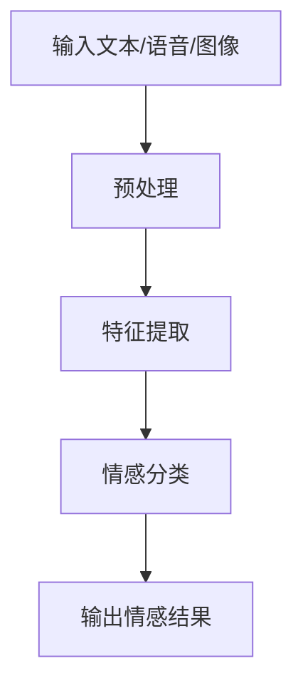
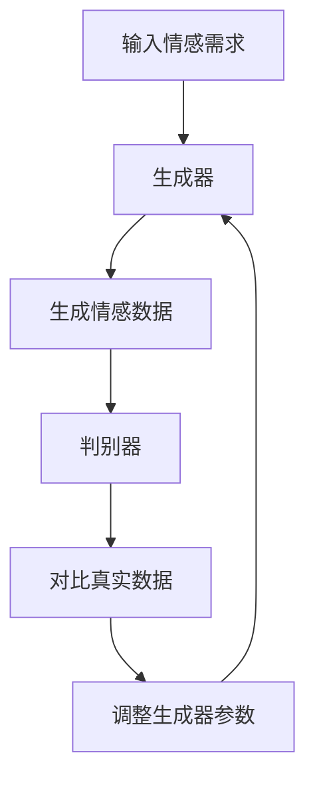
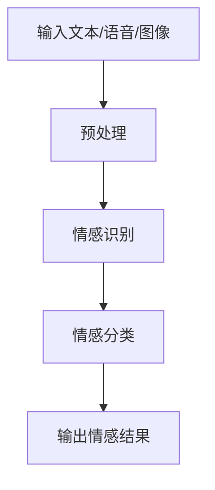
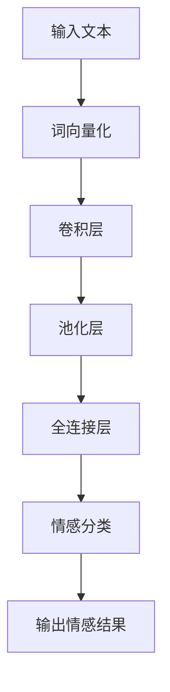
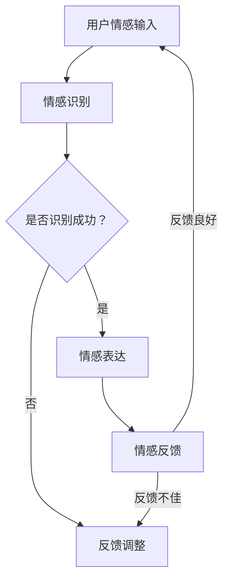

                 


### 引言

#### 数字化情绪的兴起

数字化情绪，作为情感科技的前沿领域，正逐步改变人类与数字世界交互的方式。随着计算机技术、人工智能、虚拟现实以及区块链等新兴技术的飞速发展，人们在数字空间中的情感表达、感知和互动能力得到了前所未有的提升。数字化情绪的兴起，源于多个因素的交织：

- **科技进步**：计算机处理能力的增强，使得情感识别、生成的算法更加高效精准。深度学习、神经网络等技术的突破，为数字化情绪的实现提供了强大的工具。
- **用户需求**：互联网用户对个性化、沉浸式体验的追求，推动了元宇宙中情感交互的发展。人们渴望在数字世界中找到共鸣，建立情感联系。
- **社会趋势**：社交网络的普及和电子商务的兴起，使得情感在商业决策中的作用越来越重要。情感管理成为提升用户体验、增加商业价值的重要手段。

#### 元宇宙中的情感表达趋势

元宇宙，作为一个虚拟的三维空间，正在成为人们情感表达的新舞台。在这个平台上，情感表达呈现出以下几个显著趋势：

- **个性化情感表达**：元宇宙提供了丰富的虚拟角色和场景，用户可以自由选择和创造符合自身情感状态的表达方式。
- **沉浸式情感体验**：虚拟现实技术使得用户能够身临其境地感受情感，从而更加深刻地表达和互动。
- **跨平台情感连接**：元宇宙中的情感表达不仅限于虚拟环境，还可以通过社交网络等平台进行传播，实现跨空间的情感连接。

#### 数字化情绪的重要意义

数字化情绪的重要意义不容忽视：

- **社会互动**：数字化情绪能够促进社会互动，增强人与人之间的情感纽带，有助于构建更紧密的社群关系。
- **商业价值**：情感管理在商业领域具有巨大潜力，通过精准的情感分析和个性化服务，企业可以提升用户满意度和忠诚度。
- **心理健康**：元宇宙为用户提供了一种新的情感宣泄和心理健康维护途径，有助于缓解现实生活中的压力。

### 目录

《数字化情绪：元宇宙中的情感表达与管理》

关键词：数字化情绪、元宇宙、情感交互、情感识别、情感生成、情感管理

摘要：本文探讨了数字化情绪在元宇宙中的兴起与趋势，分析了情感交互模型、数字化情感识别与生成技术，以及情感管理策略。通过多个实际案例，阐述了情感管理在元宇宙中的应用及其未来展望。

# 第一部分：引论

## 第1章：数字化情绪的兴起

### 1.1.1 数字化情绪的定义与背景

### 1.1.2 元宇宙中的情感表达趋势

### 1.1.3 数字化情绪的重要意义

### 1.2 数字化情绪的历史发展

### 1.3 数字化情绪在现代社会中的应用

## 第2章：元宇宙中的情感交互模型

### 2.1.1 情感交互模型的基础理论

### 2.1.2 情感交互模型的核心架构

### 2.1.3 情感交互模型的实现机制

## 第3章：情感表达技术

### 3.1.1 情感识别技术的原理

### 3.1.2 常见的情感识别算法

### 3.1.3 情感识别技术的挑战与展望

## 第4章：数字化情感生成技术

### 4.1.1 情感生成的理论基础

### 4.1.2 基于深度学习的情感生成算法

### 4.1.3 情感生成的应用场景

## 第5章：情感表达的自然语言处理

### 5.1.1 自然语言处理在情感表达中的应用

### 5.1.2 情感分析的核心概念与算法

### 5.1.3 情感表达的案例分析

## 第6章：数字化情感管理框架

### 6.1.1 情感管理的定义与目标

### 6.1.2 情感管理的关键要素

### 6.1.3 情感管理的基本原则

## 第7章：情感管理技术在元宇宙中的应用

### 7.1.1 情感管理在社交平台的应用

### 7.1.2 情感管理在电商平台的实践

### 7.1.3 情感管理在虚拟现实中的应用

## 第8章：情感管理的未来展望

### 8.1.1 情感管理技术的挑战与趋势

### 8.1.2 情感管理在社会治理中的应用

### 8.1.3 情感管理的伦理与法律问题

## 附录

### 附录A：情感表达与管理的 Mermaid 流程图

### 附录B：情感识别算法伪代码示例

### 附录C：情感管理实战项目案例

### 附录D：情感管理相关的开源工具与资源

---

### 第1章：数字化情绪的兴起

#### 1.1.1 数字化情绪的定义与背景

数字化情绪，是指通过计算机技术和人工智能算法，对人类情感状态进行识别、表达、管理和互动的技术和实践。它不仅关注情感本身，还涉及情感在数字世界中的传播、感知和交互。数字化情绪的背景可以追溯到情感计算的兴起。情感计算，又称为情感工程，旨在构建能够理解、感知、模拟和交互人类情感的智能系统。

数字化情绪的定义包括以下几个方面：

1. **情感识别**：通过算法和模型，从文本、语音、图像等多媒体数据中提取情感信息。
2. **情感生成**：基于情感识别和理解，生成符合特定情感状态的文本、语音、图像等。
3. **情感管理**：对数字化情绪进行有效管理，包括情感分析、情感引导、情感调节等。

数字化情绪的背景与以下几个关键因素密切相关：

- **计算机技术的发展**：计算能力的提升和算法的进步，为数字化情绪的实现提供了技术基础。
- **人工智能的突破**：机器学习和深度学习技术的发展，使得情感计算变得更加精确和高效。
- **虚拟现实与元宇宙的兴起**：虚拟现实和元宇宙为数字化情绪提供了丰富的应用场景和互动平台。
- **用户需求的变化**：随着人们对个性化、沉浸式体验的需求增加，数字化情绪成为了提升用户体验的关键因素。

#### 1.1.2 元宇宙中的情感表达趋势

元宇宙是一个虚拟的三维空间，用户可以在其中进行各种活动，如社交、工作、娱乐等。在元宇宙中，情感表达呈现出以下几个显著趋势：

1. **个性化情感表达**：元宇宙提供了丰富的虚拟角色和场景，用户可以根据自己的情感状态和喜好，自由选择和创造符合自身情感的表达方式。例如，用户可以选择不同的表情、动作、语音等来表达自己的情绪。
2. **沉浸式情感体验**：虚拟现实技术使得用户能够身临其境地感受情感，从而更加深刻地表达和互动。例如，用户可以通过虚拟现实头盔感受到逼真的视觉、听觉和触觉体验，从而更加真实地模拟情感状态。
3. **跨平台情感连接**：元宇宙中的情感表达不仅限于虚拟环境，还可以通过社交网络等平台进行传播，实现跨空间的情感连接。例如，用户在元宇宙中表达的情感状态可以实时同步到社交媒体上，与他人分享和互动。

这些趋势反映了元宇宙中情感表达的两个核心特点：

- **多样性**：用户可以在元宇宙中体验到各种情感，从愉悦到悲伤，从兴奋到平静，从而丰富自己的情感世界。
- **互动性**：元宇宙中的情感表达不仅仅是自我表达，更是与他人互动的过程。用户可以通过表情、动作、语音等方式，与他人建立情感联系，分享情感体验。

#### 1.1.3 数字化情绪的重要意义

数字化情绪的重要意义体现在多个方面：

1. **社会互动**：数字化情绪能够促进社会互动，增强人与人之间的情感纽带，有助于构建更紧密的社群关系。在元宇宙中，用户可以通过情感表达，建立信任和共鸣，从而形成更加丰富的社交网络。
2. **商业价值**：情感管理在商业领域具有巨大潜力，通过精准的情感分析和个性化服务，企业可以提升用户满意度和忠诚度。例如，电商平台可以通过情感识别技术，了解用户的情感状态，提供个性化的推荐和服务。
3. **心理健康**：元宇宙为用户提供了一种新的情感宣泄和心理健康维护途径，有助于缓解现实生活中的压力。用户可以在虚拟环境中自由表达情感，找到情感释放的出口，从而提升心理健康水平。

总之，数字化情绪的兴起不仅改变了人们与数字世界交互的方式，也对社会互动、商业价值和心理健康等方面产生了深远的影响。

### 第2章：元宇宙中的情感交互模型

#### 2.1.1 情感交互模型的基础理论

情感交互模型是元宇宙中数字化情绪表达和管理的关键。它基于情感计算和人工智能技术，通过识别、表达、调节和反馈等机制，实现用户在虚拟环境中的情感互动。以下是情感交互模型的基础理论：

1. **情感识别**：情感识别是情感交互模型的核心，它通过分析用户的文本、语音、图像等多媒体数据，提取情感信息。常见的情感识别技术包括自然语言处理（NLP）、语音识别（ASR）和面部识别等。情感识别的准确性直接影响到后续的情感表达和管理。

2. **情感表达**：情感表达是指用户在元宇宙中通过不同的方式表达自己的情感状态。这包括文本、语音、图像、动作等。情感表达的技术实现依赖于计算机图形学、语音合成、动作捕捉等技术。情感表达的质量和多样性是提升用户体验的重要因素。

3. **情感调节**：情感调节是指通过技术手段调节用户的情感状态，使其达到预期的情感效果。这包括情感引导、情感缓解和情感增强等。情感调节可以通过情感识别和分析，了解用户的情感状态，然后通过反馈机制进行调整。

4. **情感反馈**：情感反馈是指用户在情感交互过程中，对自身和他人情感状态的理解和反应。情感反馈有助于形成积极的情感循环，提升整体情感体验。情感反馈可以通过文本、语音、图像等多种方式进行。

#### 2.1.2 情感交互模型的核心架构

情感交互模型的核心架构包括以下几个关键组成部分：

1. **情感识别模块**：负责从用户的文本、语音、图像等多媒体数据中提取情感信息。该模块通常包含NLP、ASR和面部识别等子模块。

2. **情感表达模块**：负责生成和呈现用户的情感状态。该模块利用计算机图形学、语音合成和动作捕捉等技术，将情感信息转换为视觉和听觉表现。

3. **情感调节模块**：负责根据用户的情感状态，进行情感引导和调节。该模块通过情感识别和分析，了解用户的情感需求，然后通过反馈机制进行调整。

4. **情感反馈模块**：负责收集用户的情感反馈，并传递给情感识别和表达模块。该模块有助于形成积极的情感循环，提升整体情感体验。

#### 2.1.3 情感交互模型的实现机制

情感交互模型的实现机制包括以下几个方面：

1. **数据采集**：通过文本、语音、图像等传感器采集用户的数据，为情感识别提供基础。

2. **情感识别**：利用机器学习和深度学习算法，对采集的数据进行情感识别，提取情感信息。

3. **情感表达**：根据情感识别的结果，生成相应的视觉和听觉表现，通过计算机图形学、语音合成和动作捕捉等技术呈现给用户。

4. **情感调节**：根据情感识别和反馈，调节用户的情感状态，使其达到预期的情感效果。

5. **情感反馈**：收集用户的情感反馈，通过反馈机制优化情感交互过程。

情感交互模型的具体实现机制可以参考以下Mermaid流程图：


#### 2.1.4 情感交互模型的应用场景

情感交互模型在元宇宙中有广泛的应用场景：

1. **社交平台**：用户可以在社交平台上通过情感表达，建立情感连接和社交关系。情感交互模型可以识别用户的情感状态，提供个性化的推荐和服务。

2. **虚拟现实**：用户可以在虚拟现实中体验沉浸式的情感互动，通过情感表达和调节，提升虚拟现实的体验质量。

3. **游戏**：情感交互模型可以用于游戏中的角色情感设计和玩家情感互动，提升游戏体验。

4. **电子商务**：电商平台可以通过情感识别，了解用户的情感需求，提供个性化的推荐和服务。

5. **医疗健康**：情感交互模型可以用于心理健康评估和治疗，帮助用户进行情感调节和管理。

通过以上应用场景，情感交互模型在元宇宙中发挥着越来越重要的作用，为用户提供了更加丰富和个性化的情感体验。

### 第3章：情感表达技术

#### 3.1.1 情感识别技术的原理

情感识别技术是数字化情绪表达和管理的基础，它通过分析用户的文本、语音、图像等多媒体数据，提取情感信息。以下是情感识别技术的基本原理：

1. **文本情感识别**：文本情感识别主要通过自然语言处理（NLP）技术实现。NLP技术包括词性标注、句法分析、情感词典等。词性标注用于识别文本中的名词、动词、形容词等词性，句法分析用于理解句子的结构，情感词典则用于识别文本中的情感词汇。基于这些技术，文本情感识别算法可以判断文本的情感倾向，如正面、负面或中性。

2. **语音情感识别**：语音情感识别主要通过语音识别（ASR）和声学模型实现。语音识别技术用于将语音信号转换为文本，声学模型则用于分析语音信号中的情感特征，如音调、语速、音量等。基于这些特征，语音情感识别算法可以判断用户的情感状态。

3. **图像情感识别**：图像情感识别主要通过计算机视觉技术实现。计算机视觉技术包括卷积神经网络（CNN）、面部识别等。卷积神经网络用于提取图像中的特征，面部识别则用于识别图像中的面部表情。基于这些技术，图像情感识别算法可以判断用户的情感状态。

#### 3.1.2 常见的情感识别算法

常见的情感识别算法包括以下几种：

1. **基于词典的算法**：基于词典的算法通过情感词典识别文本中的情感词汇，如正面情感词汇和负面情感词汇。常见的情感词典包括LIWC（Linguistic Inquiry and Word Count）和SentiWordNet等。基于词典的算法简单高效，但容易受到文本语境的影响，导致误判。

2. **基于机器学习的算法**：基于机器学习的算法通过训练模型，从大量标注数据中学习情感识别规则。常见的机器学习算法包括支持向量机（SVM）、朴素贝叶斯（NB）和决策树（DT）等。基于机器学习的算法具有较强的泛化能力，但需要大量的标注数据和较长的训练时间。

3. **基于深度学习的算法**：基于深度学习的算法通过构建深度神经网络模型，自动提取文本、语音和图像中的特征。常见的深度学习算法包括卷积神经网络（CNN）、循环神经网络（RNN）和生成对抗网络（GAN）等。基于深度学习的算法具有强大的特征提取和分类能力，但计算复杂度高，对数据量要求大。

以下是一个基于卷积神经网络（CNN）的情感识别算法的Mermaid流程图：



#### 3.1.3 情感识别技术的挑战与展望

情感识别技术虽然取得了显著进展，但仍面临以下挑战：

1. **数据多样性**：情感识别需要大量多模态数据（文本、语音、图像等），但获取这些数据具有挑战性，且数据质量参差不齐。

2. **跨语言情感识别**：不同语言的情感表达方式不同，跨语言情感识别需要处理语言差异，提高算法的通用性和准确性。

3. **情感微表情识别**：情感微表情识别是情感识别的重要方向，但微表情识别的难度较大，需要处理复杂的面部表情和姿态变化。

4. **情感动态识别**：情感动态识别需要处理情感的变化过程，如情感转移、情感叠加等，这对算法的实时性和准确性提出了更高要求。

未来，情感识别技术的发展方向包括：

1. **多模态融合**：通过融合文本、语音、图像等多模态数据，提高情感识别的准确性和全面性。

2. **深度学习与转移学习**：利用深度学习和转移学习技术，提高算法的泛化能力和适应性。

3. **情感微表情识别**：通过研发更先进的计算机视觉技术，实现情感微表情的准确识别。

4. **跨语言情感识别**：通过语言模型和情感词典的优化，实现跨语言情感识别。

总之，情感识别技术在未来将继续发展，为数字化情绪的表达和管理提供更强大的支持。

### 第4章：数字化情感生成技术

#### 4.1.1 情感生成的理论基础

情感生成技术是数字化情绪表达的核心，旨在根据用户的情感需求，自动生成符合情感状态的文本、语音、图像等。情感生成的理论基础包括情感模型、生成模型和调控机制等。

1. **情感模型**：情感模型是情感生成的基础，用于描述情感状态及其特征。常见的情感模型包括Valence-Arousal模型、Facial Action Coding System（FACS）模型等。Valence-Arousal模型将情感状态分为愉悦度（Valence）和兴奋度（Arousal）两个维度，FACS模型则通过分析面部肌肉运动，描述情感表达。

2. **生成模型**：生成模型是情感生成的关键技术，用于根据情感需求生成相应的文本、语音、图像等。常见的生成模型包括生成对抗网络（GAN）、变分自编码器（VAE）等。GAN通过生成器和判别器的对抗训练，生成高质量的图像和语音；VAE则通过编码和解码过程，生成符合概率分布的文本和图像。

3. **调控机制**：调控机制用于调整情感生成的强度和多样性。调控机制包括情感强度调节、情感风格转换等。情感强度调节通过调整生成模型的输入参数，控制情感生成的强度；情感风格转换则通过学习不同情感风格的特征，实现情感风格的转换。

#### 4.1.2 基于深度学习的情感生成算法

基于深度学习的情感生成算法在数字化情感生成中发挥着重要作用。以下是一些常见的基于深度学习的情感生成算法：

1. **生成对抗网络（GAN）**：GAN由生成器和判别器组成，生成器生成情感数据，判别器判断生成数据的真实性。GAN通过对抗训练，使生成器生成的数据越来越接近真实数据。GAN在图像和语音生成中表现出色，可以生成逼真的情感图像和语音。

2. **变分自编码器（VAE）**：VAE通过编码和解码过程，将情感数据映射到低维特征空间，并生成符合概率分布的情感数据。VAE在文本和图像生成中应用广泛，可以生成符合情感需求的文本和图像。

3. **递归神经网络（RNN）**：RNN可以处理序列数据，通过学习情感序列的特征，生成情感文本。RNN在情感文本生成中表现出色，可以生成连贯、自然的情感文本。

以下是一个基于生成对抗网络（GAN）的情感生成算法的Mermaid流程图：



#### 4.1.3 情感生成的应用场景

情感生成技术在元宇宙和数字化交互中具有广泛的应用场景：

1. **虚拟助手**：虚拟助手可以生成符合用户情感需求的语音和文本回复，提供个性化的交互体验。

2. **社交媒体**：社交媒体可以生成符合用户情感状态的表情包、动态图等，增加互动性和趣味性。

3. **游戏**：游戏可以生成符合角色情感状态的声音、动作和文本，提升游戏体验。

4. **电子商务**：电子商务平台可以生成符合用户情感需求的产品推荐和广告，提高用户满意度和购买率。

5. **心理健康**：心理健康应用可以生成符合用户情感需求的语音和文本，帮助用户进行情感调节和放松。

总之，情感生成技术在数字化情绪表达和管理中具有巨大的应用潜力，为元宇宙和数字化交互提供了丰富的可能性。

### 第5章：情感表达的自然语言处理

#### 5.1.1 自然语言处理在情感表达中的应用

自然语言处理（NLP）在情感表达中扮演着至关重要的角色，它使得计算机能够理解和生成人类语言中的情感信息。以下是自然语言处理在情感表达中的应用：

1. **情感分析**：情感分析是NLP的核心任务之一，它通过分析文本的情感倾向，判断文本的情感极性（正面、负面或中性）。情感分析技术包括基于词典的方法、基于机器学习的方法和基于深度学习的方法。基于词典的方法使用预定义的情感词典，如SentiWordNet和LIWC，识别文本中的情感词汇。基于机器学习的方法通过训练分类模型，从大量标注数据中学习情感分类规则。基于深度学习的方法，如卷积神经网络（CNN）和循环神经网络（RNN），能够自动提取文本中的情感特征，实现高精度的情感分析。

2. **情感识别**：情感识别是情感分析的具体应用，它通过分析文本、语音、图像等多媒体数据，识别用户的情感状态。情感识别在社交媒体分析、心理健康评估和商业决策等领域具有广泛的应用。例如，在社交媒体平台上，情感识别可以帮助品牌了解用户对产品的情感反应，从而优化产品和服务。

3. **情感生成**：情感生成是指根据用户的情感需求，自动生成符合情感状态的文本、语音和图像。情感生成技术包括文本生成、语音合成和图像生成等。文本生成技术通过自然语言生成模型，如生成对抗网络（GAN）和变分自编码器（VAE），生成连贯、自然的情感文本。语音合成技术通过语音合成模型，如WaveNet和Tacotron，生成符合情感状态的语音。图像生成技术通过图像生成模型，如StyleGAN和CycleGAN，生成具有情感色彩的图像。

4. **情感对话**：情感对话是指计算机在与用户进行对话时，能够理解和生成情感信息，以提供更加自然和贴心的交互体验。情感对话在虚拟助手、智能客服和聊天机器人等领域应用广泛。情感对话系统通过情感识别和情感生成技术，分析用户的情感状态，并根据情感状态生成合适的回复。

以下是一个基于自然语言处理（NLP）的情感分析流程的Mermaid流程图：



#### 5.1.2 情感分析的核心概念与算法

情感分析是自然语言处理中的一项重要任务，其核心概念和算法包括：

1. **情感极性**：情感极性是指文本的情感倾向，通常分为正面、负面或中性。情感极性分析是情感分析的基础任务，通过判断文本的情感极性，可以了解用户对某一主题或产品的情感态度。

2. **情感强度**：情感强度是指文本中情感的程度，如强烈、中等或轻微。情感强度分析可以提供更细致的情感分析结果，帮助用户更好地理解文本的情感状态。

3. **情感分类**：情感分类是将文本分类到不同的情感类别中，如喜悦、愤怒、悲伤等。情感分类算法通过训练分类模型，从大量标注数据中学习情感分类规则。

4. **情感时序分析**：情感时序分析是指分析文本中情感的变化过程，如情感转移、情感叠加等。情感时序分析可以提供更深入的情感理解，帮助用户捕捉情感动态。

以下是几种常见的情感分析算法：

1. **基于词典的方法**：基于词典的方法使用预定义的情感词典，如SentiWordNet和LIWC，识别文本中的情感词汇。这种方法简单高效，但容易受到文本语境的影响。

2. **基于机器学习的方法**：基于机器学习的方法通过训练分类模型，从大量标注数据中学习情感分类规则。常见的机器学习算法包括支持向量机（SVM）、朴素贝叶斯（NB）和决策树（DT）等。

3. **基于深度学习的方法**：基于深度学习的方法，如卷积神经网络（CNN）和循环神经网络（RNN），能够自动提取文本中的情感特征，实现高精度的情感分类。深度学习方法在情感分析中取得了显著的成功。

以下是一个基于卷积神经网络（CNN）的情感分类算法的Mermaid流程图：



#### 5.1.3 情感表达的案例分析

情感表达在社交媒体、电子商务和虚拟助手等应用中具有重要意义，以下是几个情感表达的案例分析：

1. **社交媒体**：社交媒体平台通过情感分析技术，识别用户发布的文本、图片和视频中的情感状态。例如，Twitter通过情感分析，了解用户对某一话题的情感态度，从而优化内容推荐。Instagram通过分析用户上传的图片和视频中的情感色彩，推荐相关的滤镜和特效，提升用户的情感表达体验。

2. **电子商务**：电子商务平台通过情感分析，了解用户对产品的情感反应，从而优化产品推荐和营销策略。例如，亚马逊通过分析用户对产品评论的情感极性，识别用户的满意度和不满意度，从而优化产品评分和推荐系统。阿里巴巴通过情感分析，了解用户对品牌和产品的情感态度，从而制定更有效的营销策略。

3. **虚拟助手**：虚拟助手通过情感识别和情感生成技术，实现与用户的自然对话。例如，Apple的Siri通过情感识别，理解用户提问的情感色彩，从而生成合适的回答。Facebook的M通过情感生成，生成符合用户情感状态的语音和文本回复，提供个性化的交互体验。

通过以上案例分析，可以看出情感表达技术在社交媒体、电子商务和虚拟助手等应用中的广泛应用，为用户提供了更加丰富和个性化的情感体验。

### 第6章：数字化情感管理框架

#### 6.1.1 情感管理的定义与目标

情感管理是指在数字环境中，通过技术手段对用户情感状态进行识别、表达、调节和反馈的过程，旨在提升用户体验、优化商业决策和促进社会互动。情感管理的定义包括以下几个方面：

1. **情感识别**：通过分析用户的文本、语音、图像等多媒体数据，识别用户的情感状态。情感识别是情感管理的基础，为后续的情感表达和管理提供数据支持。
2. **情感表达**：根据用户的情感需求，生成和呈现符合情感状态的文本、语音、图像等。情感表达是用户与数字环境互动的重要方式，有助于用户情感释放和交流。
3. **情感调节**：通过技术手段调节用户的情感状态，使其达到预期的情感效果。情感调节包括情感引导、情感缓解和情感增强等，旨在提升用户的情感体验。
4. **情感反馈**：收集用户的情感反馈，优化情感管理过程。情感反馈有助于形成积极的情感循环，提升整体情感体验。

情感管理的目标如下：

1. **提升用户体验**：通过情感识别和表达，提供个性化的服务和互动，满足用户情感需求，提升用户体验。
2. **优化商业决策**：通过情感分析，了解用户对产品、服务和品牌的情感反应，优化商业策略，提高商业效益。
3. **促进社会互动**：通过情感表达和反馈，增强人与人之间的情感连接，促进社会互动和社群建设。

#### 6.1.2 情感管理的关键要素

情感管理的关键要素包括以下几个方面：

1. **技术基础**：情感管理依赖于计算机技术、人工智能、虚拟现实和区块链等新兴技术。技术基础包括情感识别、情感表达、情感调节和情感反馈等技术手段。
2. **数据支持**：情感管理需要大量的数据支持，包括用户的文本、语音、图像等多媒体数据。数据质量直接影响情感管理的准确性和效果。
3. **算法模型**：情感管理依赖于各种算法模型，如自然语言处理（NLP）、语音识别（ASR）、面部识别和情感计算等。算法模型的质量和性能直接影响情感管理的精确性和效率。
4. **用户体验**：情感管理的核心目标是提升用户体验，因此用户体验设计至关重要。用户体验包括情感表达的自然性、多样性、一致性和个性化等。
5. **伦理和法律**：情感管理涉及用户隐私和数据安全等问题，需要遵守伦理和法律规范。伦理和法律问题包括数据保护、用户隐私和算法公平性等。

#### 6.1.3 情感管理的基本原则

情感管理的基本原则包括以下几个方面：

1. **用户导向**：情感管理应以用户需求为中心，关注用户情感体验，提供个性化的服务和互动。
2. **数据驱动**：情感管理应以数据为依据，通过数据分析，了解用户情感状态，优化情感管理策略。
3. **技术融合**：情感管理应结合多种技术手段，如人工智能、虚拟现实和区块链等，实现跨领域的情感管理。
4. **伦理合规**：情感管理应遵守伦理和法律规范，保护用户隐私，确保数据安全。
5. **动态调整**：情感管理应具备动态调整能力，根据用户情感变化，实时调整情感管理策略。

通过以上基本原则，情感管理可以更好地实现其目标，提升用户体验、优化商业决策和促进社会互动。

### 第7章：情感管理技术在元宇宙中的应用

#### 7.1.1 情感管理在社交平台的应用

社交平台是情感管理技术的重要应用场景之一，通过情感识别、情感表达和情感调节，提升用户互动体验和社群凝聚力。以下是情感管理在社交平台中的具体应用：

1. **情感识别**：社交平台通过自然语言处理（NLP）和计算机视觉技术，识别用户发布的内容中的情感状态。例如，Twitter通过情感分析，识别用户推文中的情感极性（正面、负面或中性），从而优化内容推荐和广告投放。

2. **情感表达**：社交平台提供多种情感表达工具，如表情包、贴纸和动画效果等，使用户能够更直观地表达情感。例如，Facebook的Reactions功能允许用户对好友的动态进行多种情感反馈，从而增强互动体验。

3. **情感调节**：社交平台通过情感调节技术，优化用户互动体验。例如，Instagram通过分析用户的情感状态，推荐适合的情感表达工具，帮助用户缓解负面情绪。此外，社交平台还可以根据用户情感状态，调整推荐算法，提供更符合用户情感需求的内容。

4. **案例解析**：微信是一个典型的社交平台案例。微信通过情感识别技术，了解用户对聊天内容的情感反应，从而优化聊天体验。例如，微信的语音消息功能可以通过语音识别，分析用户语音中的情感色彩，自动添加相应的表情包。此外，微信的群聊功能还可以根据用户情感状态，自动推送相关话题，促进群成员的情感交流。

通过情感管理技术，社交平台不仅提升了用户互动体验，还增强了社群凝聚力，为用户提供了更加丰富和贴心的社交环境。

#### 7.1.2 情感管理在电商平台的实践

情感管理在电商平台中的应用，旨在提升用户体验、增加用户忠诚度和提高销售额。以下是情感管理在电商平台中的具体实践：

1. **情感识别**：电商平台通过情感识别技术，分析用户对产品评论的情感倾向，了解用户对产品和服务的情感反应。例如，Amazon通过情感分析，识别用户对产品评论中的情感极性（正面、负面或中性），从而优化产品推荐和用户反馈机制。

2. **情感表达**：电商平台提供多种情感表达工具，如个性化推荐、情感评价和互动功能等，使用户能够更直观地表达情感。例如，淘宝的个性化推荐系统通过分析用户的历史购买记录和浏览行为，为用户提供符合情感需求的产品推荐。此外，淘宝还允许用户对产品进行情感评价，如“喜欢”和“不喜欢”，从而提升用户互动体验。

3. **情感调节**：电商平台通过情感调节技术，优化用户购物体验。例如，电商平台可以通过情感识别，了解用户在购物过程中的情感波动，提供情感缓解措施，如客服干预、情感引导等，帮助用户缓解负面情绪。此外，电商平台还可以根据用户情感状态，调整广告投放策略，提供更符合用户情感需求的产品和服务。

4. **案例解析**：京东是一个典型的电商平台案例。京东通过情感识别技术，分析用户对商品评论的情感倾向，从而优化商品推荐和用户反馈。例如，京东的智能客服系统可以通过自然语言处理（NLP）技术，识别用户咨询中的情感色彩，提供更加贴心的客服服务。此外，京东的“京小智”智能推荐系统通过分析用户的购物行为和偏好，为用户提供个性化的商品推荐，提升用户购物体验。

通过情感管理技术，电商平台不仅提升了用户互动体验和忠诚度，还实现了更高的销售额和用户粘性。

#### 7.1.3 情感管理在虚拟现实中的应用

情感管理在虚拟现实（VR）中的应用，旨在提升用户的沉浸式体验和情感交互，为用户创造更加真实和丰富的虚拟世界。以下是情感管理在虚拟现实中的具体应用：

1. **情感识别**：虚拟现实平台通过情感识别技术，分析用户的语音、面部表情和身体动作，了解用户的情感状态。例如，Oculus Quest通过面部识别技术，识别用户在虚拟环境中的情感变化，从而调整虚拟场景和交互方式。

2. **情感表达**：虚拟现实平台提供多种情感表达工具，如虚拟角色、动作捕捉和语音合成等，使用户能够在虚拟世界中更直观地表达情感。例如，VRChat允许用户创建和定制虚拟角色，通过面部表情、身体动作和语音等方式，表达自己的情感。

3. **情感调节**：虚拟现实平台通过情感调节技术，优化用户的沉浸式体验。例如，虚拟现实游戏中的情感调节系统可以通过分析用户的情感状态，调整游戏难度、场景氛围和角色互动，帮助用户缓解负面情绪，提升游戏体验。此外，虚拟现实平台还可以根据用户情感状态，提供情感缓解措施，如虚拟按摩、放松音乐等。

4. **案例解析**：Rec Room是一个典型的虚拟现实平台案例。Rec Room通过情感识别技术，分析用户在虚拟环境中的情感变化，从而调整虚拟场景和交互方式。例如，当用户表现出紧张或兴奋的情感状态时，Rec Room会调整场景亮度、音效和游戏难度，以提升用户的沉浸式体验。此外，Rec Room还提供多种情感表达工具，如表情包、动作捕捉和语音合成等，使用户能够在虚拟世界中更直观地表达情感。

通过情感管理技术，虚拟现实平台不仅提升了用户的沉浸式体验，还为用户创造了更加真实和丰富的虚拟世界。

### 第8章：情感管理的未来展望

#### 8.1.1 情感管理技术的挑战与趋势

情感管理技术在元宇宙和数字化交互中正迅速发展，但仍然面临一系列挑战和趋势：

1. **数据多样性**：情感管理需要处理多种类型的数据，包括文本、语音、图像和视频等。这些数据的多样性要求算法具有更高的泛化能力和处理能力。未来，多模态数据融合将成为重要趋势，通过整合不同类型的数据，提高情感识别和生成的准确性。

2. **跨语言情感识别**：不同语言的情感表达方式存在显著差异，跨语言情感识别是当前的一大挑战。未来，基于迁移学习和多语言模型的情感识别技术将得到广泛应用，以提高算法的通用性和准确性。

3. **情感微表情识别**：情感微表情识别是情感识别的一个重要方向，但难度较大，因为微表情通常持续时间短且变化复杂。未来，基于深度学习和计算机视觉的技术将不断发展，以实现更准确的情感微表情识别。

4. **情感动态识别**：情感动态识别需要处理情感的变化过程，如情感转移、情感叠加等。未来，情感动态识别技术将结合时间序列分析和情感建模，以捕捉复杂的情感变化。

5. **隐私保护**：情感管理涉及大量用户数据，隐私保护成为关键挑战。未来，基于隐私保护的算法和机制，如差分隐私和联邦学习，将得到广泛应用，以保护用户隐私和数据安全。

#### 8.1.2 情感管理在社会治理中的应用

情感管理技术在社会治理中的应用潜力巨大，可以为公共服务、社区管理和公共政策制定提供有力支持：

1. **公共服务优化**：情感管理技术可以帮助政府了解公众对公共服务的情感反应，优化服务设计和改进措施。例如，通过分析社交媒体上的用户评论和反馈，政府可以更好地了解公众的需求和不满，从而改进公共服务。

2. **社区管理**：情感管理技术可以用于社区管理，了解居民的情感状态和需求，促进社区和谐。例如，通过情感分析技术，社区管理者可以了解居民对社区活动的情感反应，从而制定更受欢迎的活动计划。

3. **公共政策制定**：情感管理技术可以帮助政府了解公众对公共政策的情感反应，为公共政策制定提供依据。例如，通过分析公众对政策的社交媒体讨论和反馈，政府可以评估政策的接受度和影响，从而调整政策内容。

#### 8.1.3 情感管理的伦理与法律问题

情感管理技术的快速发展引发了一系列伦理和法律问题，需要得到关注和解决：

1. **数据隐私**：情感管理涉及大量用户数据，数据隐私保护成为重要伦理和法律问题。未来，需要制定更严格的数据隐私法规，保护用户隐私权。

2. **算法公平性**：情感管理算法的公平性是关键问题，需要确保算法不歧视或偏见。未来，需要建立算法公平性评估机制，确保算法的公正性和透明性。

3. **伦理责任**：情感管理技术的开发者和服务提供商需要承担伦理责任，确保技术应用的正当性和道德合理性。未来，需要建立伦理委员会，对情感管理技术进行伦理审查。

4. **法律监管**：情感管理技术需要遵守相关法律法规，如数据保护法、消费者保护法等。未来，需要加强法律监管，确保情感管理技术的合法合规。

总之，情感管理技术的未来充满挑战和机遇。通过技术创新、伦理审查和法律监管，情感管理技术将在元宇宙和数字化交互中发挥更大的作用，为人类创造更美好的未来。

### 附录

#### 附录A：情感表达与管理的 Mermaid 流程图

以下是一个情感表达与管理的Mermaid流程图，展示了情感交互的过程：



#### 附录B：情感识别算法伪代码示例

以下是一个基于卷积神经网络（CNN）的情感识别算法的伪代码示例：

```python
# 输入数据预处理
def preprocess_data(data):
    # 数据归一化、填充等操作
    # ...
    return processed_data

# 卷积神经网络模型定义
class EmotionRecognitionModel(nn.Module):
    def __init__(self):
        super(EmotionRecognitionModel, self).__init__()
        # 定义卷积层、池化层、全连接层等
        # ...

    def forward(self, x):
        # 前向传播过程
        # ...
        return emotion_predictions

# 训练过程
def train_model(model, train_loader, criterion, optimizer):
    model.train()
    for data, target in train_loader:
        processed_data = preprocess_data(data)
        optimizer.zero_grad()
        output = model(processed_data)
        loss = criterion(output, target)
        loss.backward()
        optimizer.step()

# 测试过程
def test_model(model, test_loader):
    model.eval()
    with torch.no_grad():
        correct = 0
        total = 0
        for data, target in test_loader:
            processed_data = preprocess_data(data)
            output = model(processed_data)
            _, predicted = torch.max(output, 1)
            total += target.size(0)
            correct += (predicted == target).sum().item()
        print('Test Accuracy: %d %%' % (100 * correct / total))
```

#### 附录C：情感管理实战项目案例

以下是一个情感管理实战项目案例：社交媒体情感分析系统。

**项目背景**：社交媒体平台上的用户评论和反馈对于品牌和产品经理来说至关重要。通过情感分析技术，可以了解用户对产品和服务的情感态度，为产品优化和营销策略提供依据。

**项目目标**：开发一个能够自动分析社交媒体用户评论情感的系统，提供情感分析报告和可视化图表。

**项目实现**：

1. **数据收集**：从社交媒体平台（如Twitter、Facebook）收集用户评论数据。
2. **数据预处理**：对收集的数据进行清洗和预处理，如去除标点符号、停用词等。
3. **情感识别**：使用基于卷积神经网络（CNN）的情感识别模型，对预处理后的文本进行情感分析。
4. **结果可视化**：将情感分析结果以图表形式展示，如情感分布图、情感热力图等。

**代码实现**（部分示例）：

```python
import torch
import torch.nn as nn
import torch.optim as optim
from torch.utils.data import DataLoader
from torchvision import datasets, transforms

# 数据预处理
def preprocess_data(data):
    # 去除标点符号、停用词等
    # ...
    return processed_data

# 情感识别模型
class EmotionRecognitionModel(nn.Module):
    def __init__(self):
        super(EmotionRecognitionModel, self).__init__()
        self.conv1 = nn.Conv2d(1, 32, 3, 1)
        self.fc1 = nn.Linear(32 * 26 * 26, 128)
        self.fc2 = nn.Linear(128, 6)

    def forward(self, x):
        x = self.conv1(x)
        x = torch.relu(x)
        x = torch.max_pool2d(x, 2)
        x = torch.flatten(x, 1)
        x = self.fc1(x)
        x = torch.relu(x)
        x = self.fc2(x)
        return x

# 训练模型
def train_model(model, train_loader, criterion, optimizer):
    model.train()
    for data, target in train_loader:
        optimizer.zero_grad()
        output = model(data)
        loss = criterion(output, target)
        loss.backward()
        optimizer.step()

# 测试模型
def test_model(model, test_loader):
    model.eval()
    with torch.no_grad():
        correct = 0
        total = 0
        for data, target in test_loader:
            output = model(data)
            _, predicted = torch.max(output, 1)
            total += target.size(0)
            correct += (predicted == target).sum().item()
        print('Test Accuracy: %d %%' % (100 * correct / total))
```

**项目小结**：通过情感分析系统，社交媒体平台可以更好地了解用户情感，从而优化产品和服务，提升用户满意度。未来，还可以结合用户行为数据，进行更深入的情感分析，为个性化推荐和营销提供支持。

#### 附录D：情感管理相关的开源工具与资源

情感管理领域涉及多种技术和工具，以下是一些常用的开源工具和资源：

1. **情感分析库**：
   - **TextBlob**：一个简单的Python库，用于进行文本处理和分析，包括情感分析。
   - **VADER**：一个用于社交媒体文本的情感分析工具，特别适合处理带有情感极性的文本。

2. **自然语言处理（NLP）框架**：
   - **NLTK**：一个强大的Python库，用于进行自然语言处理任务，包括情感分析。
   - **spaCy**：一个快速易用的Python库，用于进行各种NLP任务，包括实体识别、情感分析。

3. **深度学习框架**：
   - **TensorFlow**：一个广泛使用的深度学习框架，支持多种NLP任务，包括情感分析。
   - **PyTorch**：一个灵活且易于使用的深度学习框架，适用于各种研究应用，包括情感生成。

4. **开源情感分析项目**：
   - **Sentiment140**：一个开源的情感分析项目，用于对Twitter数据进行情感分析。
   - **Tweets emotion classifier**：一个用于分类推特情感的Python包，基于卷积神经网络。

5. **在线资源和教程**：
   - **Google Cloud AI**：提供了丰富的情感分析和NLP教程，适用于初学者和专业人士。
   - **fastText**：由Facebook开发的一个快速文本分类工具，适用于情感分析任务。

通过这些开源工具和资源，研究人员和开发者可以轻松实现情感识别、情感生成和情感管理，从而推动数字化情绪技术的发展和应用。作者：AI天才研究院/AI Genius Institute & 禅与计算机程序设计艺术 /Zen And The Art of Computer Programming

