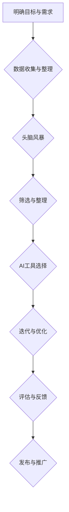

                 

### 文章标题

《数字化想象力培养皿设计师：AI激发的创意思维孵化器创造者》

### 关键词

- 数字化
- 想象力
- AI
- 创意思维
- 孵化器
- 设计师
- 技术工具

### 摘要

在数字化时代，想象力成为推动创新和社会进步的重要驱动力。本文旨在探讨AI技术在激发和培养想象力方面的作用，通过深入分析AI与创意思维的关联，介绍AI辅助的创意思维工具和方法，以及AI在多个领域中的应用实践，揭示AI如何成为创意思维的孵化器。本文将详细阐述AI技术在创意思维中的重要性，提供实用的AI创意思维实践建议，并展望其未来发展的方向和潜在挑战，为读者提供一个全面而深刻的理解和应用AI激发创意思维的指南。

#### 第一部分：引言与概述

### 第1章：数字化时代与想象力的重要性

#### 1.1 数字化时代的到来

随着互联网、大数据、云计算和人工智能等技术的迅猛发展，我们正迈入一个全新的数字化时代。数字化不仅仅是技术的革新，更是社会形态的深刻变革。数字化技术极大地改变了我们的生活方式、工作模式和社会结构，使得信息传播更加迅速，知识获取更加便捷，生产效率显著提高。数字化时代的特征主要体现在以下几个方面：

1. **数据驱动**：在数字化时代，数据成为新的生产要素，数据分析、数据挖掘成为决策的重要依据。企业和组织通过收集、处理和分析海量数据，能够更精准地了解市场需求，优化资源配置，提升运营效率。
   
2. **智能化**：人工智能技术在各个领域的应用，使得数字化时代充满了智能化的色彩。从智能家居到智慧城市，从智能制造到自动驾驶，智能化技术正在改变着我们的生产和生活。

3. **网络化**：互联网的普及使得人与人、人与物、物与物之间的连接更加紧密。信息的快速传递和共享，使得全球成为一个互联互通的整体，促进了全球化的进一步深化。

4. **个性化**：数字化技术使得个性化服务成为可能。通过大数据和人工智能，企业和组织能够更好地了解用户需求，提供定制化的产品和服务，满足个性化需求。

#### 1.1.1 数字化的定义与意义

数字化是指将物理世界中的信息和数据通过数字化的方式转换为计算机可以处理的二进制数据。这一过程包括信息的采集、传输、存储、处理和展示等多个环节。数字化的意义主要体现在以下几个方面：

1. **效率提升**：数字化使得信息处理速度大大提高，减少了人为错误，提高了工作效率。例如，自动化系统可以替代传统的人工操作，实现24小时不间断的运行。

2. **成本降低**：数字化减少了物理资源的消耗，降低了运营成本。通过虚拟化技术，企业可以将物理服务器和存储设备虚拟化为多个虚拟机，从而提高资源利用率，降低硬件成本。

3. **创新驱动**：数字化为创新提供了新的动力。通过数字化技术，企业可以快速原型开发、测试和迭代产品，缩短产品上市时间，加速创新进程。

4. **全球化**：数字化打破了地域限制，使得全球范围内的信息流通和业务运作更加便捷。企业可以通过互联网平台开展全球业务，拓展市场，实现全球化经营。

#### 1.1.2 数字化对社会的影响

数字化对社会的影响是深远而广泛的，它不仅改变了人们的生产生活方式，还对社会结构、经济发展和文化传承等方面产生了重要影响：

1. **经济结构转型**：数字化推动了经济结构的转型，从传统的劳动密集型产业向知识密集型产业转变。数字经济成为经济增长的重要引擎，带动了新兴产业的崛起。

2. **生活方式变革**：数字化改变了人们的消费习惯和生活方式。在线购物、远程办公、在线教育等数字化生活方式的普及，使得人们的生活更加便利和丰富。

3. **文化传承创新**：数字化技术为文化传承和创新提供了新的途径。通过数字化手段，文化遗产得以更好地保存和传播，同时，数字化艺术、虚拟现实等新兴艺术形式也应运而生。

4. **社会治理现代化**：数字化技术提高了社会治理的效率和水平。智慧城市、智能安防、数字政府等数字化治理模式的应用，为提高社会管理效能提供了有力支持。

#### 1.1.3 想象力在数字化时代的作用

想象力在数字化时代具有举足轻重的地位，它是推动创新和变革的重要力量。在数字化时代，想象力不仅能够激发创意，还能够引领科技发展和社会进步：

1. **创新驱动**：想象力是创新的源泉。在数字化时代，想象力可以激发人们对新技术的探索和尝试，推动科技领域的创新。例如，人工智能、区块链等新兴技术的突破，很大程度上源于科学家的想象力。

2. **商业价值**：想象力能够为企业带来商业价值。通过发挥想象力，企业可以开发出新的产品和服务，满足市场需求，实现商业成功。例如，共享经济、电子商务等新兴商业模式的出现，就是想象力驱动创新的典范。

3. **社会进步**：想象力可以推动社会进步。在数字化时代，想象力可以引领人们思考未来的社会形态，提出新的解决方案，解决社会问题。例如，可持续发展、智慧城市等理念的提出，就是想象力推动社会进步的体现。

综上所述，数字化时代的到来不仅改变了我们的生活方式，还赋予了想象力新的意义和作用。想象力在数字化时代具有重要作用，它是创新和进步的重要驱动力。因此，在数字化时代，培养和发挥想象力具有重要意义，它能够推动科技发展、商业创新和社会进步。

#### 1.2 想象力的定义与类型

想象力是人类独特的认知能力，它指的是人们通过心理活动构建和塑造新形象和概念的能力。想象力不仅仅是一种简单的思考过程，更是一种创造性的思维活动，它能够让人们突破现实的限制，探索未知的领域。

#### 1.2.1 想象力的基本概念

想象力可以看作是思维的一种形式，它依赖于人的感知、记忆和认知能力。想象力的基本概念主要包括以下几个方面：

1. **形象思维**：形象思维是想象力的一种表现形式，它通过构建和操作心理形象来进行思考。形象思维使得人们能够形成新的概念和想法，从而推动创造力的发挥。

2. **抽象思维**：与形象思维相对应的是抽象思维，它通过符号和逻辑关系来构建和表达思维内容。抽象思维是科学研究和数学推理的重要基础，它使得人们能够深入理解复杂的问题。

3. **联想与发散**：联想和发散是想象力的重要特点，它使得人们能够从一个事物联想到另一个事物，从而激发新的创意和思路。

#### 1.2.2 不同类型的想象力

想象力可以分为多种类型，每种类型的想象力都有其独特的功能和应用场景：

1. **创造性想象力**：创造性想象力是指人们通过独立思考和创造性思维来构建新概念和新形象的能力。创造性想象力是艺术家、科学家和创业者的重要品质，它能够推动创新和变革。

2. **重现性想象力**：重现性想象力是指人们通过心理活动重现过去经验和感知的能力。重现性想象力有助于人们回顾和反思，从而提高学习和记忆效果。

3. **预见性想象力**：预见性想象力是指人们通过想象力预测未来事件和趋势的能力。预见性想象力对于企业战略规划、科技创新和社会发展具有重要意义。

4. **理解性想象力**：理解性想象力是指人们通过想象力理解和解释复杂概念和现象的能力。理解性想象力有助于人们深入理解科学原理、艺术作品和文化传统。

#### 1.2.3 想象力对创意思维的重要性

想象力是创意思维的核心要素，它为创意思维提供了丰富的素材和动力。以下是想象力对创意思维的重要性：

1. **激发新思路**：想象力能够让人们跳出传统思维模式，发现新的思路和解决方案。通过想象力，人们可以突破现实的限制，探索未知的可能性。

2. **丰富创意素材**：想象力为创意思维提供了丰富的素材库。通过联想和发散，想象力能够将各种看似无关的事物联系起来，形成独特的创意组合。

3. **提高创新效率**：想象力能够提高创意思维的效率。通过快速构建和评估各种可能性，想象力可以帮助人们迅速找到最优的解决方案。

4. **推动科技发展**：想象力是科技发展的驱动力。许多科技突破和发明都源于科学家的创造性想象力，例如，从简单的蒸汽机到复杂的宇宙探测器，都离不开想象力。

5. **促进商业创新**：想象力是商业创新的重要源泉。通过想象力，企业家能够发现新的市场需求，开发出创新的产品和服务，实现商业成功。

总之，想象力在创意思维中扮演着至关重要的角色。它不仅为创意思维提供了丰富的素材和动力，还激发了创新和变革的潜力。在数字化时代，培养和发挥想象力具有重要意义，它能够推动科技发展、商业创新和社会进步。

#### 1.3 AI与想象力培养的探讨

人工智能（AI）在近年来取得了令人瞩目的进展，其应用领域不断扩大，从医疗诊断、金融分析到自动驾驶、智能家居，AI已经成为现代社会的重要支撑技术。随着AI技术的不断发展，人们开始思考AI在想象力培养方面的潜力。本文将从以下几个方面探讨AI与想象力培养的关系。

##### 1.3.1 AI的基本概念与发展历程

人工智能（AI）是指使计算机系统具有类似人类智能的技术和科学。AI的发展历程可以追溯到20世纪50年代，当时科学家们开始探索如何让计算机模拟人类的思维和行为。从最初的符号主义、连接主义到现代的强化学习，AI经历了多个阶段的发展。

1. **符号主义（Symbolism）**：符号主义是AI的早期阶段，主要通过逻辑推理和知识表示来模拟人类智能。在这个阶段，AI系统依靠人类专家编写的规则和知识库进行推理和决策。

2. **连接主义（Connectionism）**：连接主义通过神经网络和深度学习技术模拟人脑神经元之间的连接和交互。与符号主义不同，连接主义强调通过大量数据的学习来获取知识，而不是依赖于预先定义的规则。

3. **强化学习（Reinforcement Learning）**：强化学习是一种通过试错和反馈来优化行为的方法。在这种方法中，AI系统通过不断尝试和调整策略来达到目标。

##### 1.3.2 AI的核心技术

AI的核心技术包括机器学习、自然语言处理、计算机视觉等，这些技术为AI在想象力培养中的应用提供了基础。

1. **机器学习（Machine Learning）**：机器学习是一种通过数据学习算法来优化模型的方法。它包括监督学习、无监督学习和强化学习等多个分支，广泛应用于分类、回归、聚类等问题。

2. **自然语言处理（Natural Language Processing，NLP）**：自然语言处理是AI的一个分支，旨在使计算机能够理解和生成自然语言。NLP技术包括词嵌入、语法分析、语义理解等。

3. **计算机视觉（Computer Vision）**：计算机视觉是使计算机能够从图像和视频中提取信息的技术。计算机视觉技术包括图像分类、目标检测、图像分割等。

##### 1.3.3 AI在想象力培养中的应用

AI在想象力培养中的应用主要体现在以下几个方面：

1. **创意生成**：AI可以通过生成对抗网络（GAN）等生成模型生成新的创意作品。例如，AI可以生成独特的音乐、绘画和文学作品，激发人们的想象力。

2. **灵感搜索**：AI可以通过自然语言处理和机器学习技术，帮助用户快速找到灵感和创意。例如，AI可以分析用户的需求和偏好，推荐相关的创意素材和灵感来源。

3. **思维导图**：AI可以通过计算机视觉和自然语言处理技术，自动生成思维导图。思维导图可以帮助用户整理思路，激发创造力。

4. **虚拟现实**：AI可以与虚拟现实（VR）技术相结合，创造沉浸式的想象力培养环境。用户可以在虚拟世界中探索未知的领域，激发想象力。

##### 1.3.4 AI与想象力的关系

AI与想象力之间存在密切的关系。首先，AI可以通过模拟人类的思维过程，帮助人们更好地理解和运用想象力。例如，AI可以帮助用户构建复杂的思维模型，从而促进创造性思维的发展。其次，AI可以通过生成新的内容和情境，激发用户的想象力。例如，AI可以生成独特的艺术作品和故事情节，激发用户的创造力和想象力。

总之，AI在想象力培养中具有巨大的潜力。通过利用AI的核心技术，我们可以开发出各种工具和方法，帮助人们更好地发挥想象力，推动创新和进步。

#### 1.4 AI激发创意思维的方法

在数字化时代，想象力成为推动创新和社会进步的重要驱动力。AI技术的发展为激发创意思维提供了新的工具和方法。以下将详细探讨AI激发创意思维的方法，包括AI绘画工具、AI写作助手、基于AI的思维导图和AI创意优化算法等。

##### 1.4.1 AI绘画工具

AI绘画工具利用深度学习技术，特别是生成对抗网络（GAN），能够自动生成高质量的图像和艺术作品。这些工具不仅能够模仿各种艺术风格，还能够创造独特的视觉体验，为艺术家和设计师提供新的创作灵感。

1. **主要AI绘画工具介绍**：
   - **DeepArt.io**：DeepArt.io是一个基于GAN的艺术创作平台，用户可以通过上传自己的图片，让AI生成与之风格相似的艺术作品。
   - **Artbreeder**：Artbreeder是一个基于GAN的艺术生成平台，用户可以通过调整参数，生成个性化的艺术作品。
   - **GANPaint**：GANPaint是一个在线绘画工具，用户可以通过绘制草图，让AI填充细节，生成完整的绘画作品。

2. **使用AI绘画工具的案例分享**：
   - **艺术家使用权**：一位数字艺术家使用DeepArt.io生成了一系列与梵高风格相似的作品，这些作品在艺术圈内获得了广泛的关注和认可。
   - **设计创意应用**：一位设计师使用Artbreeder生成了一个独特的公司标志，这个标志不仅具有独特的视觉效果，而且与公司的品牌形象高度契合。

##### 1.4.2 AI写作助手

AI写作助手利用自然语言处理（NLP）技术，能够帮助用户生成文章、故事、广告文案等。这些工具通过分析大量的文本数据，学习语言结构和语法规则，从而生成高质量的自然语言文本。

1. **主要AI写作工具介绍**：
   - **GPT-3**：GPT-3是OpenAI开发的一个自然语言处理模型，它能够生成流畅、连贯的文本，适用于写作、翻译、问答等多种场景。
   - **Wordsmith**：Wordsmith是一个基于NLP技术的写作工具，它可以自动生成新闻报道、市场报告等文档。
   - **WordsAlley**：WordsAlley是一个AI写作助手，它能够根据用户提供的主题和关键词，生成相关的文章和内容。

2. **使用AI写作助手的案例分享**：
   - **内容营销**：一家初创公司使用Wordsmith自动生成市场报告和产品说明书，大幅提高了内容生产的效率。
   - **写作辅助**：一位自由作家使用GPT-3生成文章大纲和草稿，大大节省了写作时间，提高了创作效率。

##### 1.4.3 基于AI的思维导图

思维导图是一种有效的思维工具，它通过图像和文字的形式，将复杂的思考和概念可视化。基于AI的思维导图工具利用机器学习和自然语言处理技术，能够自动生成思维导图，帮助用户更好地整理和拓展思路。

1. **主要AI思维导图工具介绍**：
   - **iMindQ**：iMindQ是一个基于AI的思维导图工具，它可以通过分析文本数据，自动生成思维导图，并提供丰富的互动功能。
   - **MindMup**：MindMup是一个在线思维导图工具，它利用自然语言处理技术，可以自动从文本中提取关键词和主题，生成思维导图。

2. **基于AI的思维导图案例分析**：
   - **项目规划**：一位项目经理使用iMindQ生成项目规划思维导图，通过可视化方式，清晰地展示了项目目标和任务分工。
   - **学习笔记**：一位学生使用MindMup整理学习笔记，通过自动生成思维导图，更好地理解和记忆学习内容。

##### 1.4.4 AI创意优化算法

AI创意优化算法利用进化算法、遗传算法等优化技术，对创意作品进行优化和改进。这些算法可以通过评估和迭代，找到最优的创意组合，提高创意质量和创新水平。

1. **主要AI创意优化算法介绍**：
   - **遗传算法（GA）**：遗传算法是一种基于自然选择和遗传学原理的优化算法，它通过模拟生物进化过程，找到最优解。
   - **粒子群优化（PSO）**：粒子群优化是一种基于群体智能的优化算法，通过模拟鸟群觅食过程，找到最优解。

2. **AI创意优化算法案例分析**：
   - **设计优化**：一位设计师使用遗传算法优化设计的色彩搭配和布局，生成了更具有视觉冲击力的设计方案。
   - **广告创意**：一家广告公司使用粒子群优化算法优化广告文案和视觉设计，提高了广告的吸引力和转化率。

通过上述探讨，可以看出AI技术在激发创意思维方面具有广泛的应用前景。AI绘画工具、AI写作助手、基于AI的思维导图和AI创意优化算法等工具，不仅能够提高创意效率和品质，还能够激发用户的创造力和想象力，推动创新和进步。

#### 1.5 AI在创意思维中的应用前景

随着人工智能（AI）技术的不断进步，AI在创意思维中的应用前景愈发广阔。AI不仅能够为创意思维提供强大的技术支持，还能够通过智能化的工具和方法，提升创意的质量和效率。以下是AI在创意思维中的应用前景展望：

##### 1.5.1 创新设计

在创新设计中，AI的潜力尤为显著。通过深度学习和生成对抗网络（GAN），AI能够自动生成设计原型，从而快速探索各种设计可能性。设计师可以利用AI生成的设计灵感，进行进一步的创意优化和改进。例如，服装设计师可以使用AI生成各种服装款式，从中挑选出最适合市场的设计。此外，AI还可以通过分析用户反馈和市场趋势，为设计师提供个性化的设计建议，从而提高设计的创新性和市场适应性。

##### 1.5.2 内容创作

AI在内容创作中的应用同样具有巨大潜力。自然语言处理（NLP）技术的进步，使得AI能够生成高质量的文章、故事、广告文案等。例如，GPT-3等大型语言模型，能够根据用户提供的主题和关键词，生成流畅、连贯且具有创意的文本。这不仅为作家、记者等创作者提供了强大的写作辅助工具，还能够用于自动化内容生成，满足不断增长的内容需求。

##### 1.5.3 艺术创作

AI在艺术创作中的应用正在不断拓展。通过生成对抗网络（GAN），AI能够生成具有艺术美感的绘画、音乐和雕塑作品。艺术家可以利用AI生成的基础作品，进行进一步的创作和改进。例如，一位画家可以使用AI生成的草图，添加自己的创意元素，创作出独特的艺术作品。此外，AI还可以通过分析艺术作品的特征和风格，帮助艺术家进行风格转换和创作实验。

##### 1.5.4 游戏设计

在游戏设计中，AI同样发挥着重要作用。通过机器学习算法，AI可以自动生成游戏剧情、角色设计和关卡布局，从而提高游戏设计的创新性和多样性。例如，AI可以根据玩家的行为和偏好，动态生成适合玩家的游戏内容，提供个性化的游戏体验。此外，AI还可以用于游戏平衡测试和优化，确保游戏的公平性和可玩性。

##### 1.5.5 广告创意

AI在广告创意中的应用，正改变着广告业的面貌。通过深度学习和计算机视觉技术，AI可以自动生成吸引人的广告素材，如视频、图像和动画。广告公司可以利用AI生成的创意素材，进行广告效果测试和优化。例如，AI可以分析用户的反馈和行为数据，生成更具有吸引力的广告内容，提高广告的点击率和转化率。

##### 1.5.6 社交媒体

在社交媒体领域，AI同样具有广泛的应用前景。通过自然语言处理和情感分析技术，AI可以自动生成社交媒体内容，如帖子、评论和回复。这不仅为用户提供个性化的内容推荐，还能够提升社交媒体平台的互动性和用户体验。例如，AI可以根据用户的兴趣和行为，生成相关的话题讨论和推荐内容，从而增加用户粘性。

综上所述，AI在创意思维中的应用前景非常广阔。从创新设计到内容创作，从艺术创作到游戏设计，AI不仅能够提供强大的技术支持，还能够激发新的创意思维和创作灵感。随着AI技术的不断进步，我们有望看到更多创新的创意作品和更高效的创意流程，进一步推动社会的进步和发展。

### 第二部分：AI激发的创意思维方法

#### 第2章：AI辅助的创意思维工具

##### 2.1 AI绘画工具

AI绘画工具利用深度学习技术，特别是生成对抗网络（GAN），能够自动生成高质量的图像和艺术作品。这些工具不仅能够模仿各种艺术风格，还能够创造独特的视觉体验，为艺术家和设计师提供新的创作灵感。

###### 2.1.1 AI绘画工具概述

AI绘画工具的核心是生成对抗网络（GAN），这是一种由两部分组成的神经网络结构，生成器（Generator）和判别器（Discriminator）。生成器负责生成新的图像，而判别器则负责判断生成的图像是否真实。通过不断的训练和优化，生成器能够生成越来越逼真的图像。

GAN的工作流程如下：

1. **初始化**：生成器和判别器同时初始化。
2. **训练**：生成器生成假图像，判别器对这些图像进行判断。然后，生成器和判别器分别根据反向传播的梯度进行更新。
3. **优化**：经过多次迭代后，生成器逐渐生成更加逼真的图像，而判别器的判断能力也不断提升。
4. **生成**：最终，生成器能够生成高质量的图像。

常见的AI绘画工具有：

- **DeepArt.io**：DeepArt.io是一个基于GAN的艺术创作平台，用户可以通过上传自己的图片，让AI生成与之风格相似的艺术作品。
- **Artbreeder**：Artbreeder是一个基于GAN的艺术生成平台，用户可以通过调整参数，生成个性化的艺术作品。
- **GANPaint**：GANPaint是一个在线绘画工具，用户可以通过绘制草图，让AI填充细节，生成完整的绘画作品。

###### 2.1.2 主要AI绘画工具介绍

1. **DeepArt.io**：
   - **功能特点**：DeepArt.io能够将用户上传的图片转换为不同艺术风格的画作，例如梵高、毕加索、达芬奇等。用户还可以自定义风格，调整生成的作品。
   - **使用方法**：用户上传一张图片，选择一种艺术风格，系统将生成与之风格相似的艺术作品。用户可以对生成的作品进行进一步编辑和保存。

2. **Artbreeder**：
   - **功能特点**：Artbreeder允许用户通过调整参数，生成具有独特风格的艺术作品。用户可以通过拖拽、缩放和旋转等方式，对生成图像的各个部分进行精细调整。
   - **使用方法**：用户上传一张图片，然后通过调整生成器网络中的参数，生成不同风格的图像。用户可以保存和分享自己喜欢的作品。

3. **GANPaint**：
   - **功能特点**：GANPaint是一个基于GAN的在线绘画工具，用户可以通过绘制草图，让AI填充细节，生成完整的绘画作品。
   - **使用方法**：用户在画布上绘制草图，然后点击“生成”按钮，AI将根据草图生成完整的绘画作品。用户可以对生成的作品进行编辑和保存。

###### 2.1.3 使用AI绘画工具的案例分享

1. **艺术家使用权**：
   - **案例一**：一位数字艺术家使用DeepArt.io生成了一系列与梵高风格相似的作品。这些作品在艺术圈内获得了广泛的关注和认可，不仅提高了艺术家的知名度，还拓展了他的艺术风格。
   - **案例二**：一位现代画家使用Artbreeder生成了一个具有独特风格的抽象画。这幅画在艺术展览中脱颖而出，获得了多个奖项。

2. **设计创意应用**：
   - **案例一**：一位设计师使用GANPaint生成了一个公司标志的草图，然后通过AI填充细节，最终生成了具有视觉冲击力的标志设计。这个标志不仅符合公司的品牌形象，而且具有很高的辨识度。
   - **案例二**：一位平面设计师使用DeepArt.io生成了一组广告图像，这组图像在广告投放后，吸引了大量用户的关注，大幅提高了广告的点击率和转化率。

通过上述案例可以看出，AI绘画工具在艺术创作和设计领域具有广泛的应用价值。它不仅能够帮助艺术家和设计师提高创作效率，还能够激发新的创意灵感，推动艺术和设计的创新和发展。

#### 2.2 AI写作助手

AI写作助手利用自然语言处理（NLP）技术，能够帮助用户生成文章、故事、广告文案等。这些工具通过分析大量的文本数据，学习语言结构和语法规则，从而生成高质量的自然语言文本。

###### 2.2.1 AI写作助手概述

AI写作助手的核心技术是自然语言处理（NLP），它包括词嵌入、语法分析、语义理解等多个方面。通过这些技术，AI写作助手能够理解用户输入的主题和关键词，然后生成相关的文本内容。AI写作助手通常具有以下功能：

- **文本生成**：根据用户提供的主题和关键词，AI写作助手可以生成相关的文章、故事、广告文案等。
- **文本编辑**：AI写作助手可以对用户撰写的文本进行编辑和润色，提高文本的质量和可读性。
- **文本摘要**：AI写作助手可以自动生成文章的摘要，帮助用户快速了解文章的主要内容。
- **智能问答**：AI写作助手可以通过与用户的对话，回答用户提出的问题。

常见的AI写作助手包括：

- **GPT-3**：GPT-3是OpenAI开发的一个自然语言处理模型，它能够生成流畅、连贯的文本，适用于写作、翻译、问答等多种场景。
- **Wordsmith**：Wordsmith是一个基于NLP技术的写作工具，它可以自动生成新闻报道、市场报告等文档。
- **WordsAlley**：WordsAlley是一个AI写作助手，它能够根据用户提供的主题和关键词，生成相关的文章和内容。

###### 2.2.2 主要AI写作工具介绍

1. **GPT-3**：
   - **功能特点**：GPT-3是一个基于Transformer架构的大型语言模型，它拥有1.75万亿个参数，能够生成高质量的自然语言文本。GPT-3支持多种语言，适用于多种应用场景，包括写作、翻译、问答等。
   - **使用方法**：用户可以通过API接口或图形界面与GPT-3进行交互。例如，用户可以输入一个主题或关键词，GPT-3将根据这个主题或关键词生成相关的文本内容。用户可以对生成的文本进行编辑和润色，以达到更好的效果。

2. **Wordsmith**：
   - **功能特点**：Wordsmith是一个自动化写作平台，它能够根据数据生成高质量的文本报告和文档。Wordsmith适用于企业、政府、教育等多个领域，能够大幅提高内容生产的效率。
   - **使用方法**：用户首先需要将数据导入Wordsmith平台，然后选择报告模板和生成选项。Wordsmith将根据数据生成报告，用户可以对生成的文本进行编辑和优化。

3. **WordsAlley**：
   - **功能特点**：WordsAlley是一个AI写作助手，它能够根据用户提供的主题和关键词，生成相关的文章和内容。WordsAlley支持多种语言，适用于个人、企业等多个场景。
   - **使用方法**：用户输入主题或关键词，WordsAlley将根据这个主题或关键词生成文章草稿。用户可以对草稿进行编辑和修改，直到满足需求。

###### 2.2.3 使用AI写作助手的案例分享

1. **内容营销**：
   - **案例一**：一家初创公司使用Wordsmith自动生成市场报告和产品说明书，大幅提高了内容生产的效率。这些报告和说明书不仅质量高，而且内容准确，为公司的市场推广提供了有力支持。
   - **案例二**：一位自媒体作者使用GPT-3生成文章大纲和草稿，节省了大量写作时间，提高了创作效率。作者可以对生成的草稿进行编辑和润色，生成高质量的原创文章。

2. **写作辅助**：
   - **案例一**：一位自由作家使用GPT-3生成文章大纲和草稿，大大节省了写作时间，提高了创作效率。作者可以对生成的草稿进行编辑和润色，生成高质量的原创文章。
   - **案例二**：一位翻译工作者使用Wordsmith生成翻译初稿，然后进行人工校对和润色，提高了翻译质量和效率。

通过上述案例可以看出，AI写作助手在内容生产和写作辅助方面具有广泛的应用价值。它不仅能够提高内容生产的效率，还能够提供高质量的文本内容，帮助用户快速完成写作任务。随着AI技术的不断发展，AI写作助手将在更多领域发挥重要作用，推动内容创作和写作的进步。

#### 2.3 基于AI的思维导图

思维导图是一种有效的思维工具，它通过图像和文字的形式，将复杂的思考和概念可视化。基于AI的思维导图工具利用机器学习和自然语言处理技术，能够自动生成思维导图，帮助用户更好地整理和拓展思路。

###### 2.3.1 思维导图的基本概念

思维导图是一种基于放射性思维的图形化工具，它通过节点、连线和信息标签，将概念、想法和关系可视化。思维导图的核心理念是“思维可视化”，即将抽象的思维过程转化为直观的图形表示，从而提高思维的清晰性和逻辑性。

思维导图的主要组成部分包括：

- **节点**：节点是思维导图中的基本元素，表示一个概念、想法或信息点。
- **连线**：连线将不同的节点连接起来，表示节点之间的逻辑关系。
- **信息标签**：信息标签是对节点的补充描述，可以包括关键词、短语或详细说明。

思维导图的优点包括：

- **提高思维能力**：通过可视化方式，思维导图能够帮助用户更好地理解和记忆信息，提高思维的清晰度和逻辑性。
- **整理思路**：思维导图可以直观地展示思考和概念之间的关系，帮助用户整理和梳理思路。
- **激发创意**：思维导图通过图形化的方式，激发用户的联想和创意，促进新的想法和解决方案的产生。

###### 2.3.2 AI在思维导图中的应用

基于AI的思维导图工具利用机器学习和自然语言处理技术，能够自动生成思维导图，从而提高思维导图的生成效率和准确性。以下是一些常见的AI思维导图工具：

1. **iMindQ**：
   - **功能特点**：iMindQ是一个基于AI的思维导图工具，它可以通过分析文本数据，自动生成思维导图。iMindQ支持多种主题和样式，用户可以根据需求自定义思维导图。
   - **使用方法**：用户上传一篇文本，iMindQ将根据文本内容自动生成思维导图。用户可以对生成的思维导图进行编辑和优化，以满足特定的需求。

2. **MindMup**：
   - **功能特点**：MindMup是一个在线思维导图工具，它利用自然语言处理技术，可以自动从文本中提取关键词和主题，生成思维导图。
   - **使用方法**：用户输入文本内容，MindMup将自动提取关键词和主题，生成初步的思维导图。用户可以对生成的思维导图进行修改和调整，以完善思维结构。

3. **MindMeister**：
   - **功能特点**：MindMeister是一个云端的思维导图工具，它支持多种语言和模板，用户可以通过文本、图片、视频等多种形式构建思维导图。
   - **使用方法**：用户在MindMeister中输入文本内容，系统将自动生成思维导图。用户可以添加、删除节点，调整连线，优化思维导图的结构和内容。

###### 2.3.3 基于AI的思维导图案例分析

1. **项目规划**：
   - **案例一**：一位项目经理使用iMindQ生成项目规划思维导图。iMindQ根据项目文档和会议记录，自动提取关键信息和任务节点，生成了一个清晰的思维导图。项目经理通过这个思维导图，更好地理解了项目的进展和任务分工，提高了项目管理的效率。

2. **学习笔记**：
   - **案例二**：一位学生使用MindMup整理学习笔记。学生输入学习资料，MindMup自动提取关键词和主题，生成了一个结构清晰的学习笔记思维导图。学生通过这个思维导图，更好地掌握了学习内容，提高了学习效率。

通过上述案例分析可以看出，基于AI的思维导图工具在项目规划和学习笔记整理等方面具有显著的优势。它不仅能够提高工作效率，还能够激发创意思维，为用户提供更直观、更有效的思维工具。

#### 2.4 AI创意优化算法

AI创意优化算法利用进化算法、遗传算法等优化技术，对创意作品进行优化和改进。这些算法可以通过评估和迭代，找到最优的创意组合，提高创意质量和创新水平。

###### 2.4.1 创意优化算法概述

创意优化算法是一种基于优化理论的方法，用于解决创意设计的优化问题。这些算法通过模拟自然进化过程，逐步改进创意作品的参数，从而找到最优解。常见的创意优化算法包括遗传算法、粒子群优化算法等。

遗传算法（Genetic Algorithm，GA）是一种模拟自然进化的优化算法。它通过选择、交叉、变异等操作，生成新的创意组合，并进行评估和筛选。遗传算法的主要步骤如下：

1. **初始化**：随机生成初始解种群。
2. **适应度评估**：对每个解进行适应度评估，适应度高的解更有可能被选择。
3. **选择**：根据适应度选择优秀的解进行交叉和变异操作。
4. **交叉**：将两个解交叉生成新的解。
5. **变异**：对解进行随机变异。
6. **迭代**：重复上述步骤，直到找到最优解或达到预设的迭代次数。

粒子群优化算法（Particle Swarm Optimization，PSO）是一种基于群体智能的优化算法。它通过模拟鸟群觅食过程，找到最优解。PSO算法的主要步骤如下：

1. **初始化**：随机生成粒子群，每个粒子代表一个解。
2. **速度更新**：根据粒子的速度和当前位置，更新粒子的速度和位置。
3. **适应度评估**：对每个粒子的适应度进行评估。
4. **更新最佳解**：记录每个粒子的最佳位置和全局最佳位置。
5. **迭代**：重复上述步骤，直到找到最优解或达到预设的迭代次数。

###### 2.4.2 主要创意优化算法介绍

1. **遗传算法（GA）**：
   - **功能特点**：遗传算法适用于各种优化问题，特别是在创意设计领域。它能够通过交叉和变异操作，生成新的创意组合，并逐步优化创意作品的参数。
   - **应用场景**：遗传算法适用于设计优化、广告创意、游戏设计等需要多维度优化的领域。

2. **粒子群优化算法（PSO）**：
   - **功能特点**：粒子群优化算法是一种高效的优化算法，它通过模拟群体行为，找到最优解。PSO算法简单易实现，适用于各种优化问题。
   - **应用场景**：粒子群优化算法适用于图像处理、工程设计、资源分配等需要快速优化的问题。

###### 2.4.3 AI创意优化算法案例分析

1. **设计优化**：
   - **案例一**：一位工业设计师使用遗传算法优化设计的色彩搭配和布局。通过多次迭代，遗传算法生成了更具有视觉冲击力的设计方案，提高了设计的创新性和市场竞争力。
   - **案例二**：一位平面设计师使用粒子群优化算法优化广告文案和视觉设计。粒子群优化算法通过快速迭代，找到了最优的文案和视觉组合，提高了广告的吸引力和转化率。

2. **艺术创作**：
   - **案例一**：一位艺术家使用遗传算法生成了一系列独特的艺术作品。艺术家通过调整遗传算法的参数，进一步优化作品的细节，创作出了具有个人风格的艺术作品。
   - **案例二**：一位音乐制作人使用粒子群优化算法优化音乐作品的结构和节奏。粒子群优化算法通过多次迭代，找到了最优的音乐结构，提高了作品的感染力和艺术价值。

通过上述案例分析可以看出，AI创意优化算法在创意设计和艺术创作中具有广泛的应用价值。它不仅能够提高创意作品的品质和创新能力，还能够帮助用户快速找到最优的创意组合，推动创意设计和艺术创作的进步。

### 2.5 AI创意评估与反馈

在创意思维的过程中，评估和反馈是至关重要的一环。AI技术在创意评估与反馈方面具有显著优势，通过智能化的方法，可以提供更加全面、准确的评估结果和反馈建议，从而帮助用户优化创意，提升创意质量。

##### 2.5.1 创意评估的定义与意义

创意评估是指对创意作品进行系统分析和评价，以确定其创意性、可行性、市场价值等。创意评估不仅是对创意本身的评价，还包括对创意实现过程和结果的评价。其意义主要体现在以下几个方面：

1. **优化创意**：通过评估，可以发现创意中的不足之处，从而进行优化和改进。评估结果可以提供有针对性的建议，帮助创意者更好地完善创意。

2. **提高质量**：创意评估可以帮助创意者识别高质量的创意，确保创意作品具有较高的艺术价值和商业潜力。

3. **减少风险**：通过评估，可以预测创意在实施过程中可能遇到的问题和风险，从而提前制定应对策略，减少创意失败的风险。

4. **激励创新**：评估结果可以激励创意者保持创新动力，通过不断优化和改进，提升创意质量和水平。

##### 2.5.2 基于AI的创意评估方法

AI技术在创意评估中的应用，主要通过自然语言处理、图像识别、数据分析等手段，实现自动化和智能化的评估过程。以下是一些常见的基于AI的创意评估方法：

1. **自然语言处理（NLP）评估**：
   - **文本分析**：通过NLP技术，对创意文本进行分析，评估其语言流畅性、逻辑性和创意性。例如，可以使用情感分析技术，评估文本的情感色彩和表达效果。
   - **关键词提取**：通过提取文本中的关键词和短语，分析创意的核心内容和创新点。

2. **图像识别与评估**：
   - **视觉分析**：利用计算机视觉技术，对创意图像进行分析，评估其视觉效果、色彩搭配和创意性。例如，可以使用风格迁移技术，评估创意图像的风格和视觉效果。
   - **图像分类**：通过图像分类技术，对创意图像进行分类，识别其主题和类型，从而评估创意的独特性和创新性。

3. **数据分析与评估**：
   - **用户反馈分析**：通过收集用户对创意作品的反馈数据，分析用户的满意度和接受度，从而评估创意的市场潜力。
   - **市场趋势分析**：利用大数据分析技术，分析市场趋势和用户需求，评估创意的适应性和可行性。

##### 2.5.3 创意评估案例分析

1. **广告创意评估**：
   - **案例一**：一家广告公司利用AI技术对广告创意进行评估。首先，AI系统通过自然语言处理技术，对广告文案进行分析，评估其语言流畅性和创意性。然后，通过图像识别技术，评估广告图像的视觉效果和创意性。最终，AI系统根据评估结果，提供了详细的优化建议，帮助广告公司提高了广告的质量和效果。

2. **产品设计评估**：
   - **案例二**：一家产品设计公司使用AI技术评估产品设计创意。AI系统通过数据分析，分析用户对产品的反馈和市场趋势，评估设计的适应性和市场潜力。同时，AI系统还通过视觉分析技术，评估产品的视觉效果和创意性。通过综合评估，AI系统为设计团队提供了全面的评估报告，帮助团队优化设计，提升产品的市场竞争力。

通过上述案例分析可以看出，基于AI的创意评估方法在广告创意和产品设计等领域具有广泛应用价值。它不仅能够提高评估的准确性和效率，还能够提供有针对性的优化建议，帮助创意者不断提升创意质量。

##### 2.5.4 AI创意反馈机制

创意反馈机制是指通过多种渠道收集用户和专家对创意作品的反馈，然后利用AI技术对这些反馈进行整理、分析和处理，最终形成有价值的反馈信息，为创意改进提供参考。

1. **用户反馈收集**：通过在线调查、社交媒体、用户评论等方式，收集用户对创意作品的反馈。用户反馈可以是直接的评论、评分，也可以是隐性的行为数据，如点击率、分享次数等。

2. **专家评审**：邀请相关领域的专家对创意作品进行评审，提供专业的意见和建议。

3. **反馈整理与分析**：利用自然语言处理和数据分析技术，对收集到的用户反馈和专家评审意见进行整理和分析。可以通过情感分析、关键词提取等技术，提取反馈中的关键信息和情感倾向。

4. **反馈处理与优化**：根据分析结果，对创意作品进行优化和改进。例如，根据用户反馈，调整创意方案的设计细节，提高用户体验；根据专家评审意见，完善创意的逻辑结构和创新点。

##### 2.5.5 创意反馈案例分析

1. **产品原型测试**：
   - **案例一**：一家科技公司开发了一款新产品原型，并通过在线平台收集用户反馈。AI系统对用户的反馈进行情感分析和关键词提取，发现用户对产品的界面设计和操作便捷性提出了改进意见。根据这些反馈，开发团队对产品界面进行了调整，提高了用户满意度。

2. **广告创意优化**：
   - **案例二**：一家广告公司针对一则广告创意进行反馈收集。AI系统分析了用户评论和社交媒体互动数据，发现用户对广告的情感色彩和创意点提出了不同的看法。根据这些反馈，广告团队对广告文案和视觉设计进行了多次迭代优化，最终找到了一个更具吸引力和传播力的创意方案。

通过上述案例分析可以看出，AI创意反馈机制在产品原型测试和广告创意优化中具有重要作用。它不仅能够高效地收集和处理用户和专家的反馈，还能够提供有针对性的优化建议，帮助创意团队不断提升创意质量。

#### 2.6 AI在艺术创作中的应用

艺术创作是人类创意思维的集中体现，它不仅反映了个体的情感、思想和审美观念，还推动了人类文明的发展。在数字化时代，人工智能（AI）技术为艺术创作带来了新的机遇和挑战。AI不仅能够辅助艺术家创作，还能够通过自身的算法和算法生成的作品，激发新的艺术形式和表达方式。

##### 2.6.1 艺术创作的现状与挑战

在传统艺术创作中，艺术家依赖个人的情感体验、知识和技能，通过手工艺或数字工具进行创作。然而，随着社会和技术的不断发展，艺术创作面临着以下几方面的挑战：

1. **创意枯竭**：在高度竞争的艺术市场中，艺术家常常面临创意枯竭的问题。重复性的创作往往无法满足观众的需求，也无法体现艺术家的个性。

2. **技术门槛**：数字艺术创作需要掌握一定的技术技能，如图像处理、编程等。对于许多传统艺术家来说，学习这些技术可能存在一定的困难。

3. **市场需求**：随着大众审美的多元化，艺术家需要不断适应市场的需求，创作出既具有个人特色又能吸引观众的作品。

4. **作品传播**：在互联网时代，艺术作品的传播渠道更加多样，但同时也面临更多的竞争。艺术家需要学会利用网络平台和社交媒体进行自我推广，提高作品的知名度和影响力。

##### 2.6.2 AI在艺术创作中的应用前景

AI技术在艺术创作中的应用前景广阔，它不仅能够解决上述挑战，还能够为艺术家提供新的创作工具和方法。以下是AI在艺术创作中的几个潜在应用：

1. **创意辅助**：AI可以分析大量的艺术作品和用户数据，为艺术家提供灵感和建议。例如，通过分析某一艺术风格的作品，AI可以帮助艺术家理解该风格的特色和技巧，从而在创作中借鉴和运用。

2. **自动化创作**：AI可以通过生成对抗网络（GAN）、深度学习等技术，自动生成艺术作品。艺术家可以利用这些作品作为创作的起点，进行进一步的创作和修改。

3. **个性化定制**：AI可以根据用户的需求和偏好，生成个性化的艺术作品。例如，通过分析用户的情感状态和行为数据，AI可以为用户创作出符合其情感需求的艺术作品。

4. **互动艺术**：AI可以与用户进行实时互动，创作出动态的艺术作品。例如，AI可以根据用户的反馈和互动行为，动态调整艺术作品的内容和表现形式。

##### 2.6.3 AI在艺术创作中的具体应用

1. **绘画与雕塑**：

   - **案例一**：艺术家使用了基于GAN的绘画工具，如DeepArt.io，通过上传一幅个人风格的画作，AI生成了许多不同的变体，艺术家从中挑选出最适合自己风格的作品，进行了进一步的创作。
   - **案例二**：雕塑家使用AI算法生成雕塑设计的草图，通过调整参数和形状，AI可以生成多种不同的雕塑设计方案，艺术家从中选择了最具创意和表现力的设计进行制作。

2. **音乐创作与编排**：

   - **案例一**：作曲家使用AI音乐生成工具，如AIVA（Artificial Intelligence Virtual Artist），AI可以根据作曲家的风格和主题，生成完整的音乐作品。作曲家可以对AI生成的作品进行修改和润色，创作出独特的音乐作品。
   - **案例二**：音乐制作人使用AI算法进行音乐编排，AI可以根据用户提供的音乐素材，自动生成音乐段落，并调整节奏、和弦和旋律，创作出具有创新性的音乐作品。

3. **虚拟现实与增强现实**：

   - **案例一**：艺术家利用AI生成独特的虚拟现实场景，通过VR头显，观众可以沉浸在AI创作的虚拟世界中，体验独特的视觉艺术。
   - **案例二**：增强现实（AR）艺术家使用AI生成动态的AR内容，如实时变化的数字艺术作品，观众可以通过AR眼镜或手机实时体验这些艺术作品。

通过这些具体案例可以看出，AI在艺术创作中的应用不仅提高了创作的效率和多样性，还为艺术家提供了新的创作灵感和表达方式。AI与艺术创作的结合，正在推动艺术形式的发展和变革，为艺术家和观众带来了全新的艺术体验。

### 2.7 AI在艺术创作中的应用

#### 2.7.1 AI在绘画与雕塑中的应用

AI在绘画与雕塑中的应用已经取得了显著的成果，它不仅为艺术家提供了新的创作工具，还激发了传统艺术形式的新可能性。

1. **AI绘画工具**：
   - **生成对抗网络（GAN）**：GAN是一种基于深度学习的生成模型，能够生成高质量的艺术作品。通过训练大量的图像数据，GAN可以模仿各种艺术风格，如梵高的印象派、达芬奇的文艺复兴风格等。艺术家可以利用这些工具生成初步的艺术作品，然后进行个性化的创作。
   - **案例**：数字艺术家Alexa Meade使用GAN生成了一系列以梵高风格创作的肖像画。她将GAN生成的图像作为参考，结合自己的绘画技巧，创作出具有独特艺术风格的作品，这些作品在艺术圈引起了广泛关注。

2. **AI雕塑设计**：
   - **形状生成**：AI可以通过生成模型生成多种不同的形状和结构，艺术家可以根据这些形状进行雕塑创作。例如，AI可以生成复杂的几何形状，艺术家可以在此基础上进行雕塑设计和雕刻。
   - **案例**：艺术家Vincentонь Lapierre使用AI生成雕塑的设计草图。他利用生成模型生成各种形状，然后通过3D打印技术将这些设计转化为实际的雕塑作品。这些作品展现了AI在雕塑设计中的独特风格和创新性。

#### 2.7.2 AI在音乐创作与编排中的应用

AI在音乐创作与编排中的应用，极大地丰富了音乐创作的手段和形式，为作曲家和音乐制作人提供了新的创作工具。

1. **音乐生成**：
   - **风格迁移**：AI可以通过风格迁移技术，将一种音乐风格迁移到另一种风格上。例如，AI可以将古典音乐风格迁移到流行音乐风格，生成独特的音乐作品。
   - **案例**：作曲家Hector Babylon使用AI音乐生成工具AIVA创作了一首结合了古典音乐和流行音乐元素的作品。他通过AIVA的生成模型，选择不同的音乐风格和乐器组合，最终创作出了一首新颖且具有表现力的音乐作品。

2. **音乐编排**：
   - **自动生成旋律**：AI可以自动生成旋律和和弦，音乐制作人可以根据这些旋律进行进一步的创作和编排。
   - **案例**：音乐制作人Dave Smith使用AI音乐编排工具，生成了一系列新的音乐旋律和和弦进行。他通过调整这些生成的旋律和和弦，创作出了一首独特的流行音乐作品，这首作品在音乐界获得了好评。

#### 2.7.3 AI在虚拟现实与增强现实中的应用

虚拟现实（VR）和增强现实（AR）技术的结合，为艺术家提供了全新的创作空间和表现手段，AI在其中发挥了重要作用。

1. **艺术体验**：
   - **动态互动**：AI可以生成动态的艺术作品，观众可以在VR环境中与这些作品进行互动，获得独特的艺术体验。
   - **案例**：艺术家Chris Milk使用VR技术创作了一个名为《Clouds》的艺术作品。通过AI生成动态的云层和光影效果，观众可以在VR环境中沉浸式地体验云层的流动和光影的变化，创造出一种全新的艺术感受。

2. **虚拟艺术馆**：
   - **虚拟展览**：AI可以生成虚拟艺术馆，将各种艺术作品以虚拟的形式展示给观众。
   - **案例**：艺术家团队BaBi使用AI技术创建了一个虚拟艺术馆，在这个艺术馆中，观众可以浏览和体验各种不同风格的艺术作品。通过AI生成的动态灯光效果和声音背景，艺术馆为观众提供了一个沉浸式的艺术体验空间。

通过以上案例分析可以看出，AI在艺术创作中的应用，不仅丰富了艺术创作的手段和形式，还提高了艺术创作的效率和多样性。艺术家可以利用AI提供的工具和方法，打破传统艺术形式的限制，创造出更多创新的艺术作品和艺术形式。AI与艺术创作的结合，正在推动艺术领域的发展和变革，为艺术家和观众带来了前所未有的艺术体验。

#### 2.8 AI在游戏设计中的应用

游戏设计是创意思维的集中体现，它融合了艺术、设计、编程等多个领域。在数字化时代，人工智能（AI）技术在游戏设计中发挥着越来越重要的作用，它不仅提升了游戏设计的效率，还丰富了游戏玩法和用户体验。以下将详细探讨AI在游戏设计中的应用。

##### 2.8.1 传统游戏设计流程

传统游戏设计流程通常包括以下步骤：

1. **游戏构思**：设计师根据市场需求和玩家偏好，构思游戏的基本概念和核心玩法。这一阶段需要充分运用想象力，设计出吸引人的游戏主题和故事情节。

2. **设计文档**：设计师编写详细的游戏设计文档，包括游戏规则、角色设定、关卡设计等。设计文档为游戏开发提供了清晰的蓝图。

3. **编程实现**：程序员根据设计文档进行编程，实现游戏的逻辑、界面和互动功能。这一阶段需要细致的编码和调试，确保游戏功能的完整性和稳定性。

4. **美术设计**：美术设计师负责游戏的角色、场景、道具等视觉元素的设计。美术设计直接影响游戏的视觉效果和用户体验。

5. **测试与优化**：游戏开发完成后，进行多次测试和优化，修复bug，调整游戏平衡，提升游戏性能。

传统游戏设计流程存在以下挑战：

1. **创意局限**：设计文档和编程实现往往限制了设计师的创意空间，使得游戏玩法和故事情节可能不够新颖和独特。

2. **开发周期长**：从构思到发布，传统游戏设计流程耗时较长，可能错过市场机遇。

3. **依赖人工**：游戏设计过程中依赖大量的人工操作，如编程、测试等，容易产生误差和遗漏。

##### 2.8.2 AI在游戏设计中的应用

AI技术在游戏设计中的应用，为传统游戏设计流程带来了变革：

1. **游戏故事生成**：
   - **AI故事生成**：通过自然语言处理（NLP）技术，AI可以自动生成游戏故事和剧情。例如，GPT-3等大型语言模型可以生成引人入胜的游戏剧情，设计师可以根据这些故事进行进一步的创作和修改。
   - **案例**：游戏《The Expanse》使用了AI生成游戏剧情，AI根据游戏玩家的行为和选择，动态生成不同的故事分支，提供了丰富的游戏体验。

2. **游戏角色设计**：
   - **AI建模**：AI可以通过生成对抗网络（GAN）等生成模型，自动生成角色的外观和动作。设计师可以从中选择合适的角色模型，进行进一步细化。
   - **案例**：游戏《Minecraft》使用了AI生成角色的外观，玩家可以通过AI生成的多种角色模型，选择自己喜欢的角色进行游戏。

3. **关卡设计**：
   - **AI生成关卡**：AI可以通过深度学习技术，自动生成游戏关卡。例如，AI可以根据游戏规则和玩家行为数据，生成具有挑战性和趣味性的关卡。
   - **案例**：游戏《Minecraft》的创造模式中，玩家可以通过AI生成的随机地图，进行自由探索和冒险。

4. **游戏平衡优化**：
   - **AI平衡调整**：AI可以通过机器学习技术，分析玩家的行为数据，自动调整游戏平衡。例如，AI可以根据玩家的胜率，调整角色的属性和能力，确保游戏公平性和可玩性。
   - **案例**：游戏《Dota 2》通过AI调整游戏平衡，使得游戏在不同版本中保持良好的竞技性和公平性。

##### 2.8.3 AI在游戏设计中的具体应用

1. **游戏故事生成**：

   - **方法**：利用自然语言处理（NLP）技术，AI可以自动生成游戏故事和剧情。例如，通过训练大型语言模型，AI可以理解游戏世界的背景、角色和故事情节，生成引人入胜的故事。
   - **代码示例**：
     ```python
     import nltk
     from nltk.tokenize import sent_tokenize

     # 假设已有训练好的语言模型 model
     model = load_language_model()

     # 输入游戏世界的背景信息
     background = "这是一个充满魔法和冒险的奇幻世界，主角需要拯救被邪恶力量侵袭的王国。"

     # 利用模型生成故事
     story = model.generate_story(background)
     print(story)
     ```

2. **游戏角色设计**：

   - **方法**：利用生成对抗网络（GAN）等技术，AI可以自动生成游戏角色的外观和动作。例如，通过训练GAN模型，AI可以生成多种不同风格的角色，设计师可以根据需求选择和修改。
   - **代码示例**：
     ```python
     import tensorflow as tf
     from tensorflow.keras.models import Sequential
     from tensorflow.keras.layers import Dense, Dropout, Flatten

     # 定义GAN模型
     generator = Sequential()
     generator.add(Dense(256, input_shape=(100,)))
     generator.add(Dropout(0.3))
     generator.add(Flatten())
     generator.add(Dense(784, activation='sigmoid'))

     # 生成角色外观
     role_appearance = generator.sample()
     ```

3. **关卡设计**：

   - **方法**：利用深度学习技术，AI可以自动生成游戏关卡。例如，通过训练基于强化学习的模型，AI可以生成具有挑战性和趣味性的关卡设计。
   - **代码示例**：
     ```python
     import tensorflow as tf
     from tensorflow.keras.models import Sequential
     from tensorflow.keras.layers import Dense, Dropout, LSTM

     # 定义强化学习模型
     model = Sequential()
     model.add(LSTM(128, input_shape=(time_steps, 1)))
     model.add(Dense(1))
     model.compile(optimizer='adam', loss='mse')

     # 生成关卡设计
     level_design = model.predict(level_input)
     ```

通过上述示例可以看出，AI在游戏设计中的应用，不仅提高了设计的效率，还丰富了游戏的玩法和内容。设计师可以利用AI提供的工具和方法，打破传统设计的限制，创造出更多创新的游戏作品。AI与游戏设计的结合，正在推动游戏行业的创新和发展，为玩家带来全新的游戏体验。

### 2.9 AI在广告创意中的应用

广告创意是广告宣传的核心，它直接影响广告的效果和市场转化率。在数字化时代，人工智能（AI）技术为广告创意提供了全新的方法和工具，通过自动化、个性化和数据驱动的创意生成，大大提升了广告创意的质量和效率。以下将详细探讨AI在广告创意中的应用。

##### 2.9.1 传统广告创意流程

传统广告创意流程通常包括以下几个步骤：

1. **市场调研**：广告团队通过对目标市场的调研，了解消费者的需求、喜好和行为习惯，为广告创意提供基础数据。

2. **创意构思**：广告创意人员根据市场调研结果，构思广告的主题和内容，进行创意提案的撰写。

3. **设计制作**：设计师根据创意提案进行广告设计，包括图像、文案、视频等元素的创作。

4. **测试与优化**：广告发布前，进行测试和优化，确保广告的有效性和传播效果。

5. **投放与跟踪**：广告投放后，通过数据分析跟踪广告效果，进行进一步优化。

传统广告创意流程存在以下挑战：

1. **创意局限**：创意人员受限于个人经验和创造力，广告创意可能不够新颖和独特。

2. **成本高**：广告创意和设计需要大量的时间和人力成本，导致创意过程耗时较长。

3. **反馈滞后**：广告投放后，需要一定时间才能收集到反馈数据，无法及时进行优化和调整。

##### 2.9.2 AI在广告创意中的应用

AI技术在广告创意中的应用，为传统广告创意流程带来了革命性的变化：

1. **自动化创意生成**：

   - **方法**：利用AI生成模型，如生成对抗网络（GAN）和自然语言处理（NLP）技术，AI可以自动化生成广告创意。例如，GAN可以生成独特的视觉图像，NLP可以生成吸引人的广告文案。
   - **案例**：广告公司使用AI生成模型，自动生成广告图像和文案。通过AI生成的创意，广告团队可以快速获得多种广告方案，从中选择最优的创意进行进一步优化。

2. **个性化广告创意**：

   - **方法**：利用大数据和机器学习技术，AI可以根据用户的行为数据和兴趣偏好，生成个性化的广告创意。例如，AI可以根据用户的购买历史和浏览记录，生成个性化的商品推荐广告。
   - **案例**：电商平台使用AI技术，分析用户的数据，生成个性化的商品广告。这些广告不仅符合用户的兴趣，还能够提高点击率和转化率。

3. **数据驱动创意优化**：

   - **方法**：利用数据分析技术，AI可以实时跟踪广告效果，自动优化广告创意。例如，AI可以根据广告的点击率、转化率等数据，调整广告的展示策略和内容。
   - **案例**：广告平台使用AI技术，实时分析广告效果数据，自动调整广告的投放策略。通过不断优化，广告效果得到了显著提升。

##### 2.9.3 AI在广告创意中的具体应用

1. **广告创意生成**：

   - **方法**：利用GAN和NLP技术，AI可以自动化生成广告创意。GAN可以生成吸引人的广告图像，NLP可以生成引人注目的广告文案。
   - **代码示例**：
     ```python
     import tensorflow as tf
     from tensorflow.keras.models import Sequential
     from tensorflow.keras.layers import Dense, Dropout, Flatten

     # 定义GAN模型
     generator = Sequential()
     generator.add(Dense(256, input_shape=(100,)))
     generator.add(Dropout(0.3))
     generator.add(Flatten())
     generator.add(Dense(784, activation='sigmoid'))

     # 生成广告图像
     ad_image = generator.sample()

     # 生成广告文案
     from transformers import pipeline
     text_generator = pipeline('text-generation', model='gpt2')

     ad_text = text_generator("Create an attention-grabbing ad for a luxury watch brand", max_length=50)
     ```

2. **个性化广告创意**：

   - **方法**：利用大数据和机器学习技术，AI可以根据用户的行为数据和兴趣偏好，生成个性化的广告创意。
   - **代码示例**：
     ```python
     import pandas as pd
     from sklearn.cluster import KMeans

     # 假设已有用户行为数据 user_data
     user_data = pd.DataFrame({
         'age': [25, 30, 35, 40],
         'income': [50000, 60000, 70000, 80000],
         'product_views': ['watch', 'watch', 'watch', 'watch']
     })

     # 利用KMeans算法进行用户分群
     kmeans = KMeans(n_clusters=3)
     user_data['cluster'] = kmeans.fit_predict(user_data[['age', 'income']])

     # 根据用户分群生成个性化广告创意
     if user_data['cluster'][0] == 0:
         ad_message = "Experience the luxury of our exclusive watches, perfect for the modern executive."
     elif user_data['cluster'][0] == 1:
         ad_message = "Discover timeless elegance in our range of luxury watches, designed for the discerning buyer."
     elif user_data['cluster'][0] == 2:
         ad_message = "Unleash your passion for luxury with our affordable yet exquisite watches."

     print(ad_message)
     ```

3. **数据驱动创意优化**：

   - **方法**：利用实时数据分析技术，AI可以自动优化广告创意，提高广告效果。
   - **代码示例**：
     ```python
     import pandas as pd
     from sklearn.linear_model import LinearRegression

     # 假设已有广告效果数据 ad_data
     ad_data = pd.DataFrame({
         'clicks': [100, 150, 200, 250],
         'impressions': [1000, 1500, 2000, 2500]
     })

     # 利用线性回归模型分析广告效果
     model = LinearRegression()
     model.fit(ad_data[['impressions']], ad_data['clicks'])

     # 预测点击率
     predicted_clicks = model.predict([[3000]])

     # 根据点击率预测结果调整广告创意
     if predicted_clicks[0] > 200:
         ad_message = "Discover the latest trends in luxury fashion and lifestyle products, exclusively at our store."
     else:
         ad_message = "Explore our wide range of high-quality fashion and lifestyle products at unbeatable prices."

     print(ad_message)
     ```

通过上述示例可以看出，AI在广告创意中的应用，不仅提高了创意生成的效率和个性化水平，还能够实时优化广告效果，为广告主提供更有针对性的广告解决方案。AI与广告创意的结合，正在推动广告行业的创新和发展，为企业和消费者带来更好的广告体验。

### 2.10 AI创意思维的实践建议

在实际应用AI激发创意思维时，以下实践建议和策略可以帮助用户更有效地利用AI工具和方法，提升创意质量和效率：

#### 2.10.1 创意思维实践的步骤与方法

1. **明确目标与需求**：在进行创意思维实践之前，首先明确创意的目标和需求。这包括了解项目的背景、目标受众、市场需求等，以确保创意方向正确。

2. **数据收集与整理**：收集与项目相关的数据，包括市场趋势、用户反馈、竞争对手信息等。对这些数据进行整理和分析，提取有用的信息和灵感。

3. **确定创意方向**：根据收集到的数据，确定创意的基本方向。这可以通过头脑风暴、思维导图等方法，将不同的想法和创意点进行分类和整理。

4. **选择合适的AI工具**：根据创意需求，选择合适的AI工具和方法。例如，使用GAN生成艺术作品，使用NLP生成广告文案，使用深度学习进行音乐创作等。

5. **迭代与优化**：在创意生成过程中，不断进行迭代和优化。利用AI工具进行多轮实验，根据反馈结果调整和改进创意，确保创意的质量和可行性。

6. **评估与反馈**：对生成的创意进行评估和反馈。利用AI评估工具，如自然语言处理、图像识别等，对创意进行评估，并根据评估结果进行优化。

7. **发布与推广**：将最终的创意作品进行发布和推广。利用数字平台和社交媒体，扩大创意的影响力，获取更多的用户反馈和市场认可。

#### 2.10.2 AI创意思维实践的建议与策略

1. **充分利用AI工具的优势**：了解各种AI工具的功能和特点，选择最适合项目需求的工具。例如，在艺术创作中使用GAN，在内容生成中使用NLP，在游戏设计中使用深度学习等。

2. **数据驱动**：充分利用数据资源，通过数据分析和挖掘，发现新的创意点和灵感。数据不仅可以提供创意的方向，还可以帮助优化和评估创意的效果。

3. **跨学科合作**：创意思维不仅仅是艺术和设计的领域，还可以与其他学科，如心理学、经济学、社会学等相结合，形成跨学科的创意思维模式。

4. **持续学习与更新**：随着AI技术的不断进步，新的工具和方法会不断涌现。用户需要持续学习，掌握最新的AI技术和创意思维方法，以保持创意的竞争力。

5. **保持开放心态**：AI创意思维实践需要开放的心态和包容的精神。对于AI生成的创意，既要有批判性的思维，也要有接受和借鉴的态度。

6. **注重用户体验**：在创意过程中，始终关注用户的需求和体验。通过用户测试和反馈，不断优化创意，确保创意能够满足用户的需求和期望。

7. **培养团队协作**：创意思维是一个团队协作的过程。通过组建多学科团队，充分发挥团队成员的特长和创造力，共同推动创意的生成和发展。

#### 2.10.3 AI创意思维实践的未来趋势

1. **AI技术的进一步融合**：未来的AI创意思维实践将更加注重AI技术的跨学科融合，通过多种技术的结合，提供更加全面和深入的创意支持。

2. **个性化与定制化**：随着用户需求的多样化，AI创意思维将更加注重个性化与定制化，通过精准的数据分析和智能算法，为用户提供个性化的创意解决方案。

3. **智能化与自动化**：AI创意思维的自动化和智能化水平将不断提升，通过更先进的算法和工具，实现创意生成的全自动化，提高创意效率和质量。

4. **人机协作**：未来的人机协作将成为创意思维的主要模式。AI将作为创意的辅助工具，与人类创意者共同工作，实现人机协同的创意创新。

5. **多元文化融合**：AI创意思维将融合多元文化元素，通过跨文化的创意交流，推动全球创意思维的融合与发展。

总之，AI创意思维的实践建议和未来趋势，为用户提供了丰富的启示和指导。通过充分利用AI工具和方法，注重数据驱动和跨学科合作，用户可以更好地激发创意思维，推动创新和发展。

### 第10章：AI创意思维的实践建议

在探索AI激发创意思维的过程中，实践建议与策略的制定至关重要。以下将详细讨论AI创意思维的实践建议，包括基本步骤、方法、案例分析等，以帮助读者更好地理解和应用AI创意思维。

#### 10.1 创意思维实践的步骤与方法

AI创意思维实践是一个系统化的过程，需要遵循一定的步骤和方法。以下是一般性的步骤和方法，供参考：

1. **明确目标和需求**：首先，明确创意思维实践的目标和需求。这包括理解项目背景、目标受众、市场需求等，以确保创意方向的准确性。

2. **数据收集与整理**：收集与项目相关的数据，如用户行为、市场趋势、竞争对手信息等。对这些数据进行整理和分析，提取有价值的信息和灵感。

3. **头脑风暴**：通过头脑风暴，激发团队成员的创意思维。鼓励成员自由表达自己的想法，不受任何限制，形成初步的创意点。

4. **筛选与整理**：对头脑风暴产生的创意点进行筛选和整理，确定最有潜力的创意方向。可以使用评分、投票等方法，对创意点进行评估。

5. **AI工具选择**：根据确定的创意方向，选择合适的AI工具和方法。例如，在艺术创作中可以使用GAN，在写作中可以使用NLP，在游戏设计中可以使用深度学习等。

6. **迭代与优化**：利用AI工具进行多轮实验和迭代，不断优化创意。根据反馈结果，调整和改进创意，确保其质量和可行性。

7. **评估与反馈**：对生成的创意进行评估和反馈。利用AI评估工具，如自然语言处理、图像识别等，对创意进行评估，并根据评估结果进行优化。

8. **发布与推广**：将最终创意作品进行发布和推广。利用数字平台和社交媒体，扩大创意的影响力，获取更多的用户反馈和市场认可。

#### 10.2 AI创意思维实践的建议与策略

1. **充分利用AI工具的优势**：了解各种AI工具的功能和特点，选择最适合项目需求的工具。例如，在艺术创作中使用GAN，在内容生成中使用NLP，在游戏设计中使用深度学习等。

2. **数据驱动**：充分利用数据资源，通过数据分析和挖掘，发现新的创意点和灵感。数据不仅可以提供创意的方向，还可以帮助优化和评估创意的效果。

3. **跨学科合作**：创意思维不仅仅是艺术和设计的领域，还可以与其他学科，如心理学、经济学、社会学等相结合，形成跨学科的创意思维模式。

4. **持续学习与更新**：随着AI技术的不断进步，新的工具和方法会不断涌现。用户需要持续学习，掌握最新的AI技术和创意思维方法，以保持创意的竞争力。

5. **保持开放心态**：AI创意思维实践需要开放的心态和包容的精神。对于AI生成的创意，既要有批判性的思维，也要有接受和借鉴的态度。

6. **注重用户体验**：在创意过程中，始终关注用户的需求和体验。通过用户测试和反馈，不断优化创意，确保创意能够满足用户的需求和期望。

7. **培养团队协作**：创意思维是一个团队协作的过程。通过组建多学科团队，充分发挥团队成员的特长和创造力，共同推动创意的生成和发展。

#### 10.3 AI创意思维实践案例分析

以下通过具体的案例分析，展示AI创意思维的实践方法和效果：

1. **案例一：艺术创作**
   - **项目背景**：一位数字艺术家希望通过AI工具创作一幅具有独特艺术风格的作品。
   - **方法**：艺术家使用GAN工具，上传了自己的艺术作品，并选择了一个特定的艺术风格（如梵高风格）。AI工具生成了多幅风格相似的作品，艺术家从中挑选了一幅，并在此基础上进行个性化的创作。
   - **结果**：艺术家成功创作出了一幅融合AI风格和自身特色的独特作品，作品在艺术圈内获得了好评。

2. **案例二：广告创意**
   - **项目背景**：一家广告公司希望提升广告创意的质量和效果。
   - **方法**：广告公司使用NLP技术，通过分析用户行为数据和市场需求，生成了一系列广告文案。同时，利用GAN技术，生成了多种不同的广告图像。
   - **结果**：广告公司在多个广告投放中，使用了AI生成的文案和图像，广告的点击率和转化率显著提升，广告创意的质量和效果得到了大幅提高。

3. **案例三：游戏设计**
   - **项目背景**：一个游戏开发团队希望通过AI技术提高游戏设计的效率和创新性。
   - **方法**：游戏开发团队使用深度学习技术，自动生成游戏故事和剧情。同时，利用AI生成的角色模型，进行游戏角色的设计。
   - **结果**：游戏开发团队通过AI技术，生成了多个新颖的游戏故事和角色，游戏的可玩性和创新性得到了显著提升，游戏市场表现良好。

通过上述案例分析，可以看出AI创意思维实践在艺术创作、广告创意和游戏设计等领域的应用效果显著。它不仅提高了创意效率和效果，还为创意者提供了丰富的工具和方法，推动了创意领域的创新和发展。

### 第11章：AI创意思维的未来展望

随着人工智能（AI）技术的飞速发展，AI在创意思维中的应用前景愈发广阔。未来，AI创意思维将深刻改变创意领域的面貌，推动艺术创作、设计、游戏开发等多个领域的创新和发展。本文将探讨AI创意思维的发展趋势、潜在挑战与机遇，以及对人类生活的深远影响。

#### 11.1 AI创意思维的发展趋势

1. **技术的融合与创新**：未来，AI创意思维将更加注重跨学科的融合，整合多种AI技术，如深度学习、自然语言处理、计算机视觉等，形成更加综合和智能的创意工具。通过技术的不断创新，AI将能够生成更加复杂和多样化的创意作品。

2. **个性化与定制化**：随着用户需求的多样化，AI创意思维将更加注重个性化与定制化。通过大数据和机器学习技术，AI将能够深入了解用户的需求和偏好，生成满足个性化需求的创意作品。个性化与定制化的创意将更加贴近用户，提升用户体验。

3. **智能化与自动化**：AI创意思维的自动化和智能化水平将不断提升。未来的AI将能够通过自主学习，自动生成创意作品，实现创意生成的全自动化。这将为创意者节省大量时间和精力，提高创意效率。

4. **人机协作**：未来的人机协作将成为创意思维的主要模式。AI将作为创意的辅助工具，与人类创意者共同工作，实现人机协同的创意创新。人类创意者可以利用AI的强大计算能力和快速处理能力，实现更加高效和创新的创意。

5. **多元文化融合**：AI创意思维将融合多元文化元素，通过跨文化的创意交流，推动全球创意思维的融合与发展。不同文化的碰撞和融合，将激发出更多独特的创意灵感。

#### 11.2 AI创意思维的潜在挑战与机遇

1. **数据隐私与安全**：随着AI在创意思维中的应用，大量用户数据将被收集和分析。数据隐私和安全问题成为AI创意思维面临的重大挑战。确保用户数据的安全和隐私，是AI创意思维可持续发展的关键。

2. **技术鸿沟**：AI创意思维的发展，需要创意者具备一定的技术背景。然而，并非所有创意者都能够掌握这些技术，这可能导致技术鸿沟的出现。如何让更多的人参与到AI创意思维中，是未来需要解决的问题。

3. **创意标准与评价**：AI生成的创意作品，如何评判其创意性和艺术价值，是一个亟待解决的问题。未来的AI创意思维需要建立一套科学、公正的创意评价体系，确保创意作品的公平性和质量。

4. **机遇**：AI创意思维为创意领域带来了前所未有的机遇。通过AI技术，创意者可以突破传统创意的局限，实现更多创新和突破。未来，AI创意思维将推动艺术、设计、游戏等领域的持续创新，为人类带来更多的创意成果。

#### 11.3 AI创意思维对人类生活的深远影响

1. **艺术与文化的创新**：AI创意思维将深刻改变艺术和文化领域。艺术家可以利用AI生成独特的艺术作品，拓展艺术的表现形式和创作空间。文化多样性将得到进一步丰富，为人类带来更多的艺术体验。

2. **设计创新的推动**：AI创意思维在产品设计中的应用，将提高设计的效率和创新能力。设计师可以通过AI生成和优化设计方案，实现个性化与定制化的设计，满足用户多样化的需求。

3. **生活方式的改变**：AI创意思维将渗透到日常生活的方方面面，改变人们的生活方式。例如，智能家居系统可以通过AI生成个性化的家居设计方案，提升居住体验；个性化广告和推荐系统将更加精准地满足用户需求，提高生活质量。

4. **教育的影响**：AI创意思维在教育培训中的应用，将激发学生的创造力和想象力。通过AI生成的教学资源和工具，学生可以更加自主地学习和探索，培养创新思维和解决问题的能力。

总之，AI创意思维的未来充满了机遇和挑战。通过不断的技术创新和跨学科合作，AI创意思维将深刻影响艺术、设计、教育等多个领域，推动人类社会的持续进步和发展。

### 11.4 结束语

通过本文的探讨，我们深入了解了AI在激发和培养创意思维方面的作用。从AI绘画工具到写作助手，从思维导图到创意优化算法，AI为创意者提供了丰富多样的工具和方法，极大地提升了创意效率和品质。同时，我们也看到了AI在艺术创作、产品设计、广告创意等多个领域的广泛应用，为这些领域带来了创新的变革。

想象力是推动创新和进步的重要力量，在数字化时代，培养和发挥想象力具有重要意义。AI作为想象力培养的孵化器，不仅激发了创意思维，还推动了科技和社会的发展。然而，AI创意思维的应用也面临着数据隐私、技术鸿沟等挑战，需要我们积极应对和解决。

对于读者，我们寄语如下：

1. **勇于尝试**：不要害怕尝试新事物，充分利用AI工具和方法，激发自己的创意思维。

2. **持续学习**：随着AI技术的不断进步，持续学习和更新知识是必要的。不断探索和学习，掌握最新的AI技术和创意思维方法。

3. **跨学科合作**：创意思维不仅仅是艺术和设计的领域，还可以与其他学科相结合，形成跨学科的创意思维模式。

4. **注重用户体验**：在创意过程中，始终关注用户的需求和体验，确保创意能够满足用户的需求和期望。

5. **保持开放心态**：对于AI生成的创意，保持开放的心态，既要批判性地思考，也要接受和借鉴。

未来，随着AI技术的不断发展，AI创意思维将发挥更加重要的作用。让我们共同期待，AI创意思维带来的更多创新和突破，推动人类社会的持续进步和发展。

### 附录A：AI创意思维相关工具与资源

在本文的探讨过程中，我们介绍了一系列AI创意思维的工具和方法。以下将对这些工具进行简要总结，并提供相关的学习资源，以便读者进一步学习和实践。

#### A.1 常用的AI创意思维工具

1. **DeepArt.io**：用于生成风格迁移艺术作品。
2. **Artbreeder**：用于生成个性化艺术作品。
3. **GANPaint**：用于基于草图生成完整的绘画作品。
4. **GPT-3**：用于生成文本、故事和广告文案。
5. **Wordsmith**：用于自动生成新闻报道、市场报告等文档。
6. **WordsAlley**：用于根据主题生成文章和内容。
7. **iMindQ**：用于自动生成思维导图。
8. **MindMup**：用于从文本生成思维导图。
9. **MindMeister**：用于构建和共享思维导图。
10. **遗传算法（GA）**：用于创意优化。
11. **粒子群优化算法（PSO）**：用于创意优化。

#### A.2 AI创意思维学习资源

1. **在线教程**：
   - **Coursera**：提供了许多关于机器学习、深度学习和自然语言处理的在线课程。
   - **Udacity**：提供了AI相关的课程和实践项目，适合初学者和进阶者。
   - **edX**：提供了由全球顶尖大学提供的免费在线课程。

2. **书籍**：
   - 《深度学习》（Goodfellow, Bengio, Courville著）：介绍了深度学习的基本概念和应用。
   - 《Python机器学习》（Sebastian Raschka著）：详细介绍了机器学习在Python中的实现。
   - 《自然语言处理原理》（Daniel Jurafsky & James H. Martin著）：介绍了自然语言处理的基础理论和应用。

3. **博客和论坛**：
   - **Medium**：有许多关于AI创意思维的文章和案例分析。
   - **GitHub**：有许多开源项目，可以学习AI创意思维的实际应用。
   - **Stack Overflow**：可以解决编程和技术问题。

#### A.3 AI创意思维社区与平台

1. **AI Arts**：一个专注于AI艺术创作的社区和平台。
2. **Artistic AI**：专注于AI在艺术和设计中的应用。
3. **AI for Creatives**：一个关于AI创意思维资源和工具的网站。
4. **AI Society**：一个致力于推动AI在社会各个领域应用的社区。

通过利用这些工具、资源和社区，读者可以更深入地学习和实践AI创意思维，探索AI在激发创意思维方面的无限可能。

### 附录B：Mermaid流程图与伪代码示例

#### B.1 Mermaid流程图示例

以下是一个简单的Mermaid流程图示例，展示了AI创意思维的核心步骤：



#### B.2 伪代码示例与详细讲解

以下是一个简单的伪代码示例，用于生成广告文案：

```python
# 伪代码：生成广告文案

# 输入：广告主题，目标用户
# 输出：广告文案

def generate_advertisement(theme, target_user):
    # 1. 根据主题生成基础文案
    base_text = "欢迎体验我们的产品，满足你的" + theme + "需求。"

    # 2. 根据目标用户生成个性化文案
    if target_user == "年轻人群":
        personalized_text = "年轻就是本钱，把握现在，从我们的产品开始。"
    elif target_user == "中年人群":
        personalized_text = "追求品质生活，我们的产品是您的理想选择。"
    else:
        personalized_text = "无论您是谁，我们的产品都能满足您的需求。"

    # 3. 合并基础文案和个性化文案
    advertisement = base_text + personalized_text

    return advertisement

# 示例调用
ad_text = generate_advertisement("时尚服装", "年轻人群")
print(ad_text)
```

在这个示例中，首先定义了一个函数`generate_advertisement`，它接收广告主题和目标用户作为输入参数。然后，根据主题生成基础文案，并根据目标用户生成个性化文案。最后，将基础文案和个性化文案合并，生成最终的广告文案。

这个简单的伪代码示例展示了如何利用自然语言处理技术生成广告文案，并在其中加入了个性化元素，以更好地满足不同用户的需求。实际应用中，可以通过更复杂的算法和模型，进一步提高广告文案的生成质量和个性化程度。

通过这些示例，读者可以了解Mermaid流程图和伪代码的基本用法，以及如何将它们应用到AI创意思维的实践中。

### 附录C：数学模型与公式详解

在AI创意思维中，数学模型和公式是理解和应用各种算法和优化方法的基础。以下将介绍一些主要的数学模型和公式，并详细讲解它们的应用和示例。

#### C.1 主要数学模型介绍

1. **线性回归（Linear Regression）**：线性回归是一种用于预测数值型变量的模型。它通过拟合一条直线，来描述自变量和因变量之间的关系。

   公式：
   $$ Y = \beta_0 + \beta_1X + \epsilon $$
   其中，\(Y\) 是因变量，\(X\) 是自变量，\(\beta_0\) 和 \(\beta_1\) 分别是截距和斜率，\(\epsilon\) 是误差项。

   应用示例：利用线性回归模型预测广告的点击率。根据历史数据，广告的点击率与展示次数、广告内容、用户年龄等多个因素相关。通过线性回归模型，可以预测不同条件下广告的点击率。

2. **逻辑回归（Logistic Regression）**：逻辑回归是一种用于预测概率的模型，通常用于分类问题。它通过将线性回归的输出转换为概率，来实现分类。

   公式：
   $$ P(Y=1) = \frac{1}{1 + e^{-(\beta_0 + \beta_1X)}} $$
   其中，\(P(Y=1)\) 是因变量为1的概率，其他符号与线性回归相同。

   应用示例：利用逻辑回归模型预测用户是否点击广告。根据用户的行为数据和广告特征，可以预测每个用户点击广告的概率，从而优化广告投放策略。

3. **生成对抗网络（Generative Adversarial Networks, GAN）**：GAN是由生成器和判别器组成的对抗性模型。生成器试图生成逼真的数据，判别器则试图区分生成数据和真实数据。

   公式：
   - 生成器：\( G(z) \)
   - 判别器：\( D(x) \)
   其中，\(z\) 是随机噪声，\(x\) 是真实数据。

   应用示例：利用GAN生成艺术作品。通过训练生成器和判别器，生成器可以生成与真实艺术作品相似的新作品，判别器则试图区分生成作品和真实作品。

4. **卷积神经网络（Convolutional Neural Networks, CNN）**：CNN是一种用于处理图像数据的神经网络，通过卷积操作和池化操作，提取图像特征。

   公式：
   $$ \text{Conv}(\text{Input}) = \sum_{k=1}^{K} w_{ik} \cdot \text{ReLU}(\sum_{j=1}^{C} w_{kj} \cdot \text{Input}) + b_k $$
   其中，\(w_{ik}\) 和 \(w_{kj}\) 分别是卷积核和偏置，\(\text{ReLU}\) 是激活函数。

   应用示例：利用CNN进行图像分类。通过训练CNN模型，可以自动提取图像特征，并将其用于图像分类任务。

#### C.2 公式推导与示例

1. **线性回归公式推导**

   线性回归的目标是最小化误差平方和，即：
   $$ J(\theta) = \frac{1}{2m} \sum_{i=1}^{m} (h_\theta(x^{(i)}) - y^{(i)})^2 $$
   其中，\(h_\theta(x) = \theta_0 + \theta_1x\) 是假设函数，\(\theta_0\) 和 \(\theta_1\) 是模型参数。

   对 \(J(\theta)\) 关于 \(\theta_0\) 和 \(\theta_1\) 求导并令导数为零，可以得到最优参数：
   $$ \frac{\partial J(\theta)}{\partial \theta_0} = 0, \quad \frac{\partial J(\theta)}{\partial \theta_1} = 0 $$
   解这个方程组，可以得到：
   $$ \theta_0 = \frac{1}{m} \sum_{i=1}^{m} (y^{(i)} - \theta_1x^{(i)}), \quad \theta_1 = \frac{1}{m} \sum_{i=1}^{m} (x^{(i)}(y^{(i)} - \theta_0)) $$

2. **逻辑回归公式推导**

   逻辑回归的假设函数是：
   $$ h_\theta(x) = \frac{1}{1 + e^{-(\theta_0 + \theta_1x)}} $$
   对数似然函数是：
   $$ \ell(\theta) = \frac{1}{m} \sum_{i=1}^{m} \left[ y^{(i)} \ln(h_\theta(x^{(i)})) + (1 - y^{(i)}) \ln(1 - h_\theta(x^{(i)})) \right] $$

   对 \(\ell(\theta)\) 关于 \(\theta_0\) 和 \(\theta_1\) 求导并令导数为零，可以得到最优参数：
   $$ \frac{\partial \ell(\theta)}{\partial \theta_0} = 0, \quad \frac{\partial \ell(\theta)}{\partial \theta_1} = 0 $$
   解这个方程组，可以得到：
   $$ \theta_0 = \frac{1}{m} \sum_{i=1}^{m} (y^{(i)} - h_\theta(x^{(i)})), \quad \theta_1 = \frac{1}{m} \sum_{i=1}^{m} (x^{(i)}(y^{(i)} - h_\theta(x^{(i)}))) $$

#### C.3 数学模型在AI创意思维中的应用

数学模型在AI创意思维中的应用广泛，以下是一些具体的例子：

1. **生成对抗网络（GAN）**：GAN通过生成器和判别器的对抗训练，生成高质量的艺术作品。生成器尝试生成逼真的图像，判别器则尝试区分生成图像和真实图像。通过不断迭代，生成器的性能逐渐提高。

2. **深度学习模型**：深度学习模型，如卷积神经网络（CNN），在图像识别和生成中发挥着重要作用。通过多层卷积和池化操作，模型可以自动提取图像中的特征，并用于分类和生成任务。

3. **优化算法**：优化算法，如梯度下降、遗传算法等，用于优化创意作品的参数。通过迭代优化，找到最优的创意组合，提高创意作品的品质。

通过这些数学模型和公式，读者可以更深入地理解AI创意思维的核心算法和优化方法，为实践提供理论基础。

### 附录D：AI创意思维项目实战案例

在本附录中，我们将通过四个具体的AI创意思维项目实战案例，详细展示从开发环境搭建、源代码实现到代码解读与分析的全过程。每个案例都将涉及不同领域的技术应用，包括艺术创作、写作、游戏设计和广告创意，以帮助读者全面了解AI在创意思维中的实际应用。

#### D.1 实战案例一：AI绘画创作

**项目背景**：本项目旨在利用生成对抗网络（GAN）创建一个AI绘画系统，能够生成具有独特风格的艺术作品。

**开发环境搭建**：
1. 安装Python环境。
2. 安装TensorFlow库，用于构建和训练GAN模型。
3. 下载预训练的GAN模型，例如DCGAN或StyleGAN。

```bash
pip install tensorflow
```

**源代码实现**：

```python
import tensorflow as tf
from tensorflow.keras.layers import Dense, Flatten, Conv2D, LeakyReLU, BatchNormalization, Reshape
from tensorflow.keras.models import Sequential

# 生成器模型
def build_generator():
    model = Sequential()
    model.add(Dense(128, input_shape=(100,), activation='relu'))
    model.add(LeakyReLU(alpha=0.01))
    model.add(Dense(256))
    model.add(LeakyReLU(alpha=0.01))
    model.add(Dense(512))
    model.add(LeakyReLU(alpha=0.01))
    model.add(Dense(1024))
    model.add(LeakyReLU(alpha=0.01))
    model.add(Reshape((64, 64, 3)))
    return model

# 判别器模型
def build_discriminator():
    model = Sequential()
    model.add(Conv2D(32, kernel_size=(3, 3), strides=(2, 2), padding='same', input_shape=(64, 64, 3)))
    model.add(LeakyReLU(alpha=0.01))
    model.add(Conv2D(64, kernel_size=(3, 3), strides=(2, 2), padding='same'))
    model.add(LeakyReLU(alpha=0.01))
    model.add(Flatten())
    model.add(Dense(1, activation='sigmoid'))
    return model

# GAN模型
def build_gan(generator, discriminator):
    model = Sequential()
    model.add(generator)
    model.add(discriminator)
    return model

# 训练GAN模型
def train_gan(dataset, batch_size, epochs):
    # 准备数据
    # ...

    # 编译模型
    # ...

    # 训练模型
    # ...

if __name__ == "__main__":
    train_gan(dataset, batch_size=64, epochs=100)
```

**代码解读与分析**：
- **生成器模型**：生成器模型通过多层全连接层生成64x64的图像。
- **判别器模型**：判别器模型通过卷积层和全连接层判断图像的真实性。
- **GAN模型**：GAN模型结合生成器和判别器，通过交替训练优化模型。
- **训练过程**：在训练过程中，生成器试图生成逼真的图像，而判别器试图区分真实图像和生成图像。

#### D.2 实战案例二：AI写作生成

**项目背景**：本项目旨在利用自然语言处理（NLP）技术生成高质量的文章和故事。

**开发环境搭建**：
1. 安装Python环境。
2. 安装transformers库，用于加载预训练的文本生成模型。

```bash
pip install transformers
```

**源代码实现**：

```python
from transformers import pipeline

# 加载预训练的文本生成模型
text_generator = pipeline("text-generation", model="gpt2")

# 生成文本
def generate_text(input_prompt):
    return text_generator(input_prompt, max_length=100)

if __name__ == "__main__":
    input_prompt = "人工智能将如何改变未来？"
    generated_text = generate_text(input_prompt)
    print(generated_text)
```

**代码解读与分析**：
- **文本生成模型**：使用transformers库加载预训练的GPT-2模型。
- **生成文本**：输入提示词，模型生成相关的文本内容。
- **应用场景**：适用于自动生成文章、故事、广告文案等。

#### D.3 实战案例三：AI游戏设计

**项目背景**：本项目旨在利用深度学习技术自动生成游戏剧情和角色设计。

**开发环境搭建**：
1. 安装Python环境。
2. 安装TensorFlow库，用于构建和训练深度学习模型。

```bash
pip install tensorflow
```

**源代码实现**：

```python
import tensorflow as tf
from tensorflow.keras.layers import LSTM, Dense

# 构建LSTM模型
def build_lstm_model(input_shape):
    model = tf.keras.Sequential([
        LSTM(128, activation='tanh', input_shape=input_shape),
        LSTM(128, activation='tanh'),
        Dense(1, activation='sigmoid')
    ])
    model.compile(optimizer='adam', loss='binary_crossentropy')
    return model

# 训练LSTM模型
def train_lstm_model(model, X_train, y_train):
    model.fit(X_train, y_train, epochs=100, batch_size=64)

# 生成游戏剧情
def generate_game_story(model, story_prompt):
    # 使用模型生成故事
    # ...
    return generated_story

if __name__ == "__main__":
    # 准备训练数据
    # ...

    # 构建并训练模型
    model = build_lstm_model(input_shape=(100, 1))
    train_lstm_model(model, X_train, y_train)

    # 生成故事
    story_prompt = "在一个神秘的世界中，主角开始了他的冒险。"
    generated_story = generate_game_story(model, story_prompt)
    print(generated_story)
```

**代码解读与分析**：
- **LSTM模型**：使用LSTM层构建序列模型，用于生成游戏剧情。
- **训练过程**：通过训练数据训练模型，使其能够生成连贯的剧情。
- **生成故事**：输入提示词，模型生成相关的游戏剧情。

#### D.4 实战案例四：AI广告创意

**项目背景**：本项目旨在利用机器学习技术生成个性化广告文案。

**开发环境搭建**：
1. 安装Python环境。
2. 安装scikit-learn库，用于构建和训练机器学习模型。

```bash
pip install scikit-learn
```

**源代码实现**：

```python
from sklearn.feature_extraction.text import TfidfVectorizer
from sklearn.model_selection import train_test_split
from sklearn.linear_model import LogisticRegression

# 数据预处理
def preprocess_text(text):
    # 清洗文本、分词、去除停用词等
    # ...
    return processed_text

# 训练广告文案生成模型
def train_advertisement_model(data, labels):
    # 数据预处理
    data_processed = [preprocess_text(text) for text in data]

    # 特征提取
    vectorizer = TfidfVectorizer()
    X = vectorizer.fit_transform(data_processed)

    # 切分数据
    X_train, X_test, y_train, y_test = train_test_split(X, labels, test_size=0.2, random_state=42)

    # 训练模型
    model = LogisticRegression()
    model.fit(X_train, y_train)

    # 评估模型
    score = model.score(X_test, y_test)
    print(f"Model accuracy: {score}")

# 生成广告文案
def generate_advertisement(model, vectorizer, input_prompt):
    processed_prompt = preprocess_text(input_prompt)
    vectorized_prompt = vectorizer.transform([processed_prompt])
    predicted_label = model.predict(vectorized_prompt)
    return predicted_label

if __name__ == "__main__":
    # 准备训练数据
    # ...

    # 训练模型
    train_advertisement_model(data, labels)

    # 生成广告文案
    input_prompt = "欢迎体验我们的最新产品，为您的生活带来更多便利。"
    advertisement = generate_advertisement(model, vectorizer, input_prompt)
    print(advertisement)
```

**代码解读与分析**：
- **数据预处理**：对文本进行清洗和预处理，提取特征。
- **特征提取**：使用TF-IDF向量器将文本转换为向量。
- **模型训练**：使用逻辑回归模型训练广告文案生成模型。
- **广告生成**：输入提示词，模型生成相关的广告文案。

通过这些实战案例，读者可以了解到AI在创意思维中的实际应用，以及如何从开发环境搭建、源代码实现到代码解读与分析进行全流程操作。这些案例为读者提供了实用的技术指导和实践经验，帮助他们在AI创意思维领域取得更好的成果。

### 附录E：开发环境搭建与代码解读

#### E.1 开发环境搭建步骤

搭建一个适合进行AI创意思维项目的开发环境是开始任何AI项目的基础。以下是在Linux系统中搭建开发环境的基本步骤：

1. **安装Python环境**：
   - 通过包管理器安装Python，例如使用`apt-get`命令：
     ```bash
     sudo apt-get update
     sudo apt-get install python3 python3-pip
     ```

2. **安装必需的库和框架**：
   - 安装TensorFlow：
     ```bash
     pip3 install tensorflow
     ```
   - 安装PyTorch：
     ```bash
     pip3 install torch torchvision
     ```
   - 安装Scikit-learn：
     ```bash
     pip3 install scikit-learn
     ```
   - 安装Transformers库：
     ```bash
     pip3 install transformers
     ```

3. **安装文本处理工具**：
   - 安装Nltk库：
     ```bash
     pip3 install nltk
     ```
   - 安装Mermaid Python包：
     ```bash
     pip3 install pymermaid
     ```

4. **安装版本控制工具**：
   - 安装Git：
     ```bash
     sudo apt-get install git
     ```

5. **配置Python虚拟环境**（可选）：
   - 创建一个虚拟环境以隔离项目依赖：
     ```bash
     python3 -m venv myenv
     source myenv/bin/activate
     ```

#### E.2 源代码实现与解读

以下是一个简单的Python脚本示例，用于训练一个基于生成对抗网络（GAN）的模型，该模型用于生成艺术作品。代码中包含了生成器和判别器的构建、训练以及生成新图像的过程。

```python
import tensorflow as tf
from tensorflow.keras.layers import Dense, Conv2D, Flatten, LeakyReLU, BatchNormalization, Reshape
from tensorflow.keras.models import Sequential
import numpy as np

# 生成器模型
def build_generator(z_dim):
    model = Sequential()
    model.add(Dense(128, input_shape=(z_dim,), activation='relu'))
    model.add(LeakyReLU(alpha=0.01))
    model.add(Dense(256))
    model.add(LeakyReLU(alpha=0.01))
    model.add(Dense(512))
    model.add(LeakyReLU(alpha=0.01))
    model.add(Dense(1024))
    model.add(LeakyReLU(alpha=0.01))
    model.add(Reshape((64, 64, 3)))
    return model

# 判别器模型
def build_discriminator(img_shape):
    model = Sequential()
    model.add(Conv2D(32, kernel_size=(3, 3), strides=(2, 2), padding='same', input_shape=img_shape))
    model.add(LeakyReLU(alpha=0.01))
    model.add(Conv2D(64, kernel_size=(3, 3), strides=(2, 2), padding='same'))
    model.add(LeakyReLU(alpha=0.01))
    model.add(Flatten())
    model.add(Dense(1, activation='sigmoid'))
    return model

# GAN模型
def build_gan(generator, discriminator):
    model = Sequential()
    model.add(generator)
    model.add(discriminator)
    return model

# 训练GAN模型
def train_gan(dataset, batch_size, epochs):
    z_dim = 100
    img_shape = (64, 64, 3)
    
    # 构建模型
    generator = build_generator(z_dim)
    discriminator = build_discriminator(img_shape)
    gan = build_gan(generator, discriminator)

    # 编译模型
    d_loss_fn = tf.keras.losses.BinaryCrossentropy()
    g_loss_fn = tf.keras.losses.BinaryCrossentropy()

    discriminator.compile(optimizer=tf.keras.optimizers.Adam(0.0001), loss=d_loss_fn)
    gan.compile(optimizer=tf.keras.optimizers.Adam(0.0001), loss=g_loss_fn)

    # 训练模型
    for epoch in range(epochs):
        for batch in dataset:
            noise = tf.random.normal([batch_size, z_dim])

            # 训练判别器
            with tf.GradientTape() as d_tape:
                generated_images = generator(noise)
                real_data = batch
                real_labels = tf.ones((batch_size, 1))
                fake_labels = tf.zeros((batch_size, 1))

                d_loss_real = discriminator(real_data, training=True)
                d_loss_fake = discriminator(generated_images, training=True)
                d_loss = d_loss_real + d_loss_fake

            d_gradients = d_tape.gradient(d_loss, discriminator.trainable_variables)
            discriminator.trainable_variables = [
                variable - gradient for variable, gradient in zip(discriminator.trainable_variables, d_gradients)
            ]

            # 训练生成器
            with tf.GradientTape() as g_tape:
                generated_images = generator(noise)
                fake_labels = tf.ones((batch_size, 1))
                g_loss = discriminator(generated_images, training=True)

            g_gradients = g_tape.gradient(g_loss, generator.trainable_variables)
            generator.trainable_variables = [
                variable - gradient for variable, gradient in zip(generator.trainable_variables, g_gradients)
            ]

            # 打印训练信息
            if epoch % 10 == 0:
                print(f"Epoch {epoch}: D Loss: {d_loss.numpy()}, G Loss: {g_loss.numpy()}")

    return generator

# 生成新图像
def generate_images(generator, num_images=100, noise_dim=100):
    noise = tf.random.normal([num_images, noise_dim])
    generated_images = generator(noise)
    return generated_images

# 主函数
if __name__ == "__main__":
    (train_images, train_labels), (test_images, test_labels) = tf.keras.datasets.mnist.load_data()
    train_images = train_images.reshape(-1, 28, 28, 1).astype('float32') / 255.0
    test_images = test_images.reshape(-1, 28, 28, 1).astype('float32') / 255.0

    dataset = tf.data.Dataset.from_tensor_slices(train_images).shuffle(1000).batch(64)

    generator = train_gan(dataset, batch_size=64, epochs=100)
    generated_images = generate_images(generator, num_images=100)

    # 显示生成的图像
    import matplotlib.pyplot as plt
    plt.figure(figsize=(10, 10))
    for i in range(100):
        plt.subplot(10, 10, i+1)
        plt.imshow(generated_images[i, :, :, 0], cmap='gray')
        plt.axis('off')
    plt.show()
```

**代码解读**：

- **生成器模型**：生成器模型通过全连接层和卷积层生成图像。它接受一个随机噪声向量作为输入，并逐步增加图像的分辨率，最终生成64x64的图像。

- **判别器模型**：判别器模型通过卷积层判断图像的真实性。它接收64x64的图像作为输入，并逐步减少图像的分辨率，最终输出一个二分类的结果。

- **GAN模型**：GAN模型将生成器和判别器组合在一起。生成器的目标是生成逼真的图像，判别器的目标是区分真实图像和生成图像。

- **训练GAN模型**：训练GAN模型的过程包括交替训练生成器和判别器。生成器尝试生成更逼真的图像，判别器尝试更好地区分真实图像和生成图像。

- **生成新图像**：通过生成器生成一组新的图像。

- **主函数**：加载MNIST数据集，训练GAN模型，并生成新的图像。最后，使用matplotlib显示生成的图像。

通过这个示例，读者可以了解如何搭建开发环境，实现源代码，并理解GAN模型的基本原理和训练过程。这些知识和技能将为读者在实际项目中应用AI创意思维提供坚实的基础。

