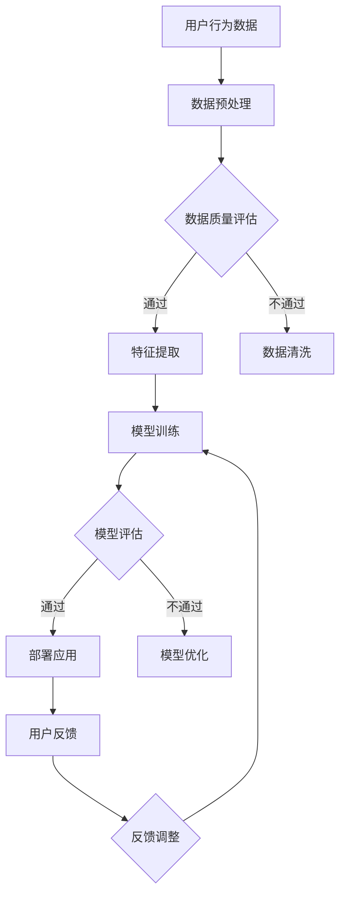

                 

### 文章标题：数字化意志力：AI增强的自我控制

在数字化时代的浪潮中，人工智能（AI）技术的迅猛发展为我们的生活带来了翻天覆地的变化。从智能助手到自动驾驶，AI似乎无所不能。然而，你是否想过，AI技术能否在我们的日常生活中扮演更重要的角色——增强我们的意志力？本文将探讨数字化意志力的概念，分析AI技术在自我控制中的应用，并深入讨论这一领域的挑战与伦理问题。通过理性和实践的双重探讨，我们希望能够为您揭示数字化意志力与AI增强自我控制的无限可能性。

### 关键词

- 数字化意志力
- AI增强自我控制
- 行为改变
- 智能算法
- 健康管理
- 教育培训
- 工作效率

### 摘要

本文旨在探讨数字化意志力与AI增强自我控制这一新兴领域。首先，我们将详细解析意志力的基本概念，并引入数字化意志力的概念及其背景。接着，我们将探讨AI技术在意志力管理中的应用，包括智能算法的角色以及成功案例。随后，文章将分析数字化意志力在不同场景下的应用，如健康管理、教育培训和工作效率提升。在此过程中，我们将讨论数字化意志力面临的挑战与伦理问题，并提出应对策略。最后，文章将通过具体的AI增强自我控制的实现方法和实战案例，展示其在实际应用中的效果。希望通过本文的探讨，能够为读者提供一个全面而深刻的理解，为未来数字化意志力的发展奠定基础。

### 《数字化意志力：AI增强的自我控制》目录大纲

#### 第一部分：数字化意志力理论

#### 第1章：意志力的定义与数字化
##### 1.1 意志力的基本概念
##### 1.2 数字化意志力的背景
##### 1.3 意志力与行为改变的关联

#### 第2章：AI技术对意志力的增强
##### 2.1 AI在自我控制中的应用
##### 2.2 智能算法在意志力管理中的角色
##### 2.3 案例分析：AI与意志力的成功结合

#### 第3章：数字化意志力的应用场景
##### 3.1 健康管理
##### 3.2 教育培训
##### 3.3 工作效率提升

#### 第4章：数字化意志力的挑战与伦理
##### 4.1 挑战与风险
##### 4.2 伦理问题与隐私保护
##### 4.3 挑战与应对策略

#### 第二部分：AI增强自我控制实践

#### 第5章：AI增强自我控制的原理
##### 5.1 AI算法原理
##### 5.2 自我控制的神经机制
##### 5.3 Mermaid流程图：AI与自我控制的结合

#### 第6章：AI在自我控制中的实现方法
##### 6.1 数据收集与预处理
##### 6.2 模型训练与优化
##### 6.3 伪代码：AI增强自我控制的核心算法

#### 第7章：自我控制的数学模型
##### 7.1 数学模型的基本原理
##### 7.2 LaTeX公式：关键数学公式
##### 7.3 举例说明：模型在实践中的应用

#### 第8章：AI增强自我控制的实战案例
##### 8.1 案例一：健康管理
##### 8.2 案例二：教育培训
##### 8.3 案例三：工作效率提升

#### 第9章：开发环境搭建与源代码实现
##### 9.1 开发环境搭建
##### 9.2 源代码详细实现
##### 9.3 代码解读与分析

#### 第三部分：未来展望

#### 第10章：数字化意志力的发展趋势
##### 10.1 未来发展趋势
##### 10.2 技术进步的挑战
##### 10.3 潜在的应用场景扩展

#### 第11章：数字化意志力的社会责任
##### 11.1 社会责任与伦理
##### 11.2 长期影响与未来思考
##### 11.3 建议与展望

#### 附录

##### 附录A：AI增强自我控制工具与资源
##### A.1 工具介绍
##### A.2 资源链接
##### A.3 常见问题与解答

### 第一部分：数字化意志力理论

#### 第1章：意志力的定义与数字化

**1.1 意志力的基本概念**

意志力，通常被描述为个体在面对诱惑和挑战时，维持目标并抵制即时满足的能力。它不仅关乎决策，还涉及自控、毅力和耐力。在心理学中，意志力被认为是“执行功能”的一部分，即大脑用来规划、执行和监控复杂行为的能力。意志力的重要性不言而喻，它影响个人的成功、健康和幸福。

- **自控**：抵抗即时诱惑，如抵制美食、拖延或过度消费。
- **坚持目标**：在长期目标与短期欲望之间做出理性选择，如坚持锻炼或学习。
- **毅力和耐力**：在面对挫折和困难时保持持续的努力。

**1.2 数字化意志力的背景**

随着数字技术的快速发展，我们进入了数字化时代。智能手机、社交媒体、在线游戏和购物平台等数字化工具已深入到我们的日常生活中。这些工具在方便我们的同时，也带来了新的挑战。例如，过度使用社交媒体可能导致注意力分散和情绪波动，在线购物的便利性可能导致消费过度。

为了应对这些挑战，数字化意志力这一概念被提了出来。数字化意志力是指个体在数字化环境中维持自我控制、实现目标的能力。它不仅要求我们抵制即时诱惑，还需要我们适应数字化生活方式带来的新挑战。

**1.3 意志力与行为改变的关联**

意志力与行为改变紧密相关。许多研究表明，意志力是改变不良习惯和形成良好习惯的关键。例如，减肥、戒烟和锻炼等行为改变都需要强大的意志力支持。

- **动机**：意志力帮助个体设定明确的目标，并提供动力去实现这些目标。
- **计划与执行**：意志力使个体能够制定详细的计划，并坚持执行。
- **自我监控**：意志力使个体能够及时调整行为，避免回到不良习惯。

数字化意志力提供了新的工具和策略，帮助我们更有效地管理自己的意志力。通过AI技术，我们可以实现个性化干预，提高自我控制的效率。例如，AI助手可以提醒我们保持锻炼、避免过度购物或减少社交媒体使用时间。

总之，数字化意志力不仅是一个重要的理论概念，更是我们在数字化时代应对各种挑战的重要工具。接下来，我们将深入探讨AI技术如何增强我们的意志力。

### 第2章：AI技术对意志力的增强

**2.1 AI在自我控制中的应用**

随着人工智能技术的不断发展，AI在自我控制领域中的应用变得越来越广泛。AI可以通过数据分析和模式识别，帮助我们更好地理解自己的行为，并提供个性化的解决方案。以下是AI在自我控制中的一些主要应用：

- **行为预测**：通过分析历史数据，AI可以预测个体在特定情境下可能的行为模式。例如，分析用户的购物记录和社交媒体使用习惯，AI可以预测用户何时可能进行冲动购物，从而提前发出提醒。

- **个性化建议**：基于对用户行为和需求的了解，AI可以提供个性化的建议。例如，对于经常拖延的用户，AI助手可以提醒他们制定时间表，并督促他们按时完成任务。

- **反馈机制**：AI可以实时监测用户的行为，并提供即时反馈。例如，通过智能手环监测用户的运动数据，AI可以给出运动建议，帮助用户保持健康。

- **自我监控**：AI可以帮助用户记录和分析自己的行为，从而提高自我监控的能力。例如，AI应用可以记录用户的社交媒体使用时间，并提醒他们减少不必要的使用。

**2.2 智能算法在意志力管理中的角色**

智能算法在意志力管理中扮演着关键角色。这些算法可以通过数据分析和模式识别，帮助我们更好地理解自己的行为，并提供个性化的解决方案。

- **强化学习**：强化学习算法通过奖励和惩罚机制，帮助用户建立良好的行为习惯。例如，用户每完成一个任务，就会获得一定的积分，这些积分可以兑换成实际的奖励。

- **决策树和随机森林**：决策树和随机森林算法可以用于预测用户的行为，并提供相应的建议。例如，分析用户的购物历史和偏好，算法可以预测用户可能购买的商品，并推荐相应的促销活动。

- **神经网络**：神经网络算法可以通过深度学习，从大量数据中提取有用的信息。例如，通过分析用户的社交媒体活动，神经网络可以识别用户的心理状态，并提供相应的支持。

**2.3 案例分析：AI与意志力的成功结合**

许多实际案例表明，AI与意志力的成功结合可以带来显著的效益。

- **健康管理**：通过AI技术，用户可以实时监控自己的健康状况，并收到个性化的健康建议。例如，智能手环可以记录用户的心率、步数和睡眠质量，AI算法可以分析这些数据，并给出健康建议，如调整饮食、增加运动等。

- **教育培训**：AI技术在教育培训中的应用也非常广泛。通过智能学习平台，学生可以根据自己的学习进度和需求，选择合适的课程和资源。AI算法可以分析学生的学习行为，并提供个性化的学习建议，从而提高学习效果。

- **工作效率提升**：在职场中，AI助手可以帮助员工管理时间、任务和资源。通过分析员工的工作习惯和效率，AI可以提供优化建议，如调整工作时间、优化工作流程等，从而提高工作效率。

总之，AI技术在自我控制领域中的应用前景广阔。通过智能算法和数据分析，AI可以帮助我们更好地管理自己的意志力，实现个人目标。随着技术的不断进步，AI与意志力的结合将为我们的生活带来更多的便利和效益。

### 第3章：数字化意志力的应用场景

**3.1 健康管理**

数字化意志力在健康管理中的应用非常广泛。通过AI技术，我们可以实现对个人健康数据的实时监控和管理，从而更好地管理我们的健康。以下是数字化意志力在健康管理中的几个应用案例：

- **健康数据监控**：通过智能手环、智能手表等设备，用户可以实时监控自己的心率、血压、睡眠质量、运动量等健康指标。AI算法可以对这些数据进行分析，并提供个性化的健康建议。例如，如果用户的睡眠质量不佳，AI助手可以建议他们调整作息时间，增加运动量，甚至提供具体的锻炼方案。

- **个性化健康计划**：基于对用户健康数据的分析，AI可以制定个性化的健康计划。例如，根据用户的历史健康数据和当前健康状况，AI助手可以为用户提供合适的饮食建议、运动计划和健康检查提醒。

- **健康行为反馈**：AI技术可以帮助用户建立健康行为反馈机制。例如，用户每天按时完成运动任务，AI助手会给予一定的奖励，如积分、虚拟货币等，这些奖励可以用于兑换健康产品或服务。通过这种机制，用户可以更积极地参与到健康管理中来。

**3.2 教育培训**

数字化意志力在教育领域中的应用同样具有重要意义。通过AI技术，教育可以更加个性化和高效。以下是数字化意志力在教育培训中的几个应用案例：

- **个性化学习**：AI技术可以帮助学生根据自身的知识水平和学习进度，选择合适的课程和资源。例如，AI学习平台可以通过分析学生的学习行为和成绩，推荐最适合他们的学习内容，从而提高学习效果。

- **学习行为分析**：AI可以实时监控学生的学习行为，如学习时间、学习内容、做题情况等，并提供反馈。例如，如果学生在某个知识点上存在薄弱环节，AI助手可以提供额外的练习题或视频讲解，帮助学生巩固知识。

- **学习动机激励**：AI技术可以帮助教师或家长监控学生的学习进度和成果，并提供激励措施。例如，学生每完成一个学习任务，AI助手会给予一定的奖励，如虚拟奖励、积分等，这些奖励可以用于兑换实物奖励或特权。

**3.3 工作效率提升**

在职场中，数字化意志力可以帮助我们提高工作效率，实现工作目标。以下是数字化意志力在工作效率提升中的几个应用案例：

- **任务管理**：AI助手可以帮助员工管理任务和工作流程。例如，员工可以将任务分配给AI助手，AI助手会根据任务的优先级和截止时间，自动安排员工的工作计划，并提供提醒。

- **时间管理**：AI技术可以帮助员工更好地管理时间，提高工作效率。例如，AI助手可以分析员工的工作习惯和任务需求，为他们制定合理的时间表，确保他们在关键任务上有足够的时间。

- **行为反馈**：AI可以监控员工的工作行为，并提供反馈。例如，如果员工在某个时间段内的工作效率较低，AI助手会提醒他们调整工作状态，并提供相应的建议，如休息、调整工作方式等。

总之，数字化意志力在健康管理、教育培训和工作效率提升中的应用前景广阔。通过AI技术的支持，我们可以更有效地管理自己的意志力，实现个人目标，提高生活质量和工作效率。随着技术的不断进步，数字化意志力将在更多领域发挥重要作用。

### 第4章：数字化意志力的挑战与伦理

**4.1 挑战与风险**

尽管数字化意志力在各个领域展现出了巨大的潜力，但这一领域也面临着诸多挑战和风险。首先，技术依赖性是一个不可忽视的问题。随着AI技术的广泛应用，人们可能过度依赖这些技术，从而削弱自身的意志力。例如，过分依赖AI助手进行任务管理和决策，可能会导致个人判断力和决策能力的下降。

其次，数据隐私保护也是一大挑战。数字化意志力的实现依赖于对大量个人数据的收集和分析，这些数据包括健康数据、行为数据等敏感信息。如何确保这些数据的隐私和安全，防止数据泄露或被滥用，是一个亟待解决的问题。

此外，技术的不完善和误用风险也是一个重要的挑战。AI技术在自我控制中的应用尚处于发展阶段，可能存在算法偏见、数据错误等问题，这些缺陷可能导致错误的决策和干预，从而对用户产生负面影响。

**4.2 伦理问题与隐私保护**

数字化意志力的应用涉及到一系列伦理问题，其中最为突出的是隐私保护和个人自主权的平衡。在收集和处理个人数据时，必须确保用户的隐私权不受侵犯。以下是一些具体的伦理问题：

- **数据收集与使用**：在数字化意志力的实现过程中，必须明确数据的收集范围和使用目的。用户应该有权知道自己的数据被如何使用，并且有权选择是否提供这些数据。

- **算法偏见与公平性**：AI算法在数据处理和决策过程中，可能存在偏见和不公平性。例如，基于历史数据的分析可能导致对某些群体的歧视，这需要我们在算法设计和数据预处理阶段进行严格的审查和纠正。

- **个人自主权**：数字化意志力可能会对用户的行为进行干预和指导，这涉及到个人自主权的问题。用户应该有权决定是否接受这些干预，以及干预的程度和方式。

**4.3 挑战与应对策略**

面对数字化意志力带来的挑战和风险，我们需要采取一系列的应对策略，以确保技术的健康发展和社会的公平与正义。

- **加强法律法规**：制定和完善相关的法律法规，明确数字化意志力的应用边界，规范数据收集、处理和使用的标准和流程，保护用户的隐私权和合法权益。

- **透明化与用户参与**：提高AI技术的透明度，让用户了解自己的数据是如何被使用的，并给予他们参与决策的机会。通过用户教育和参与，增强用户对数字化意志力的信任和接受度。

- **伦理审查与监督**：建立独立的伦理审查委员会，对AI技术的应用进行严格的伦理审查和监督，确保技术的公平性、公正性和道德性。

- **技术完善与改进**：加强AI技术的研发和改进，提高算法的准确性和可靠性，减少误用和偏见的风险。同时，通过不断的测试和优化，确保技术在实际应用中的有效性和安全性。

总之，数字化意志力的发展和应用不仅需要技术的进步，更需要伦理的指导和社会的监督。只有通过全面的应对策略，才能确保数字化意志力的健康发展，为人类带来更多的福祉。

### 第5章：AI增强自我控制的原理

**5.1 AI算法原理**

人工智能（AI）的核心在于其算法原理。AI算法主要包括机器学习（ML）和深度学习（DL）两种类型。机器学习是一种通过从数据中学习规律和模式的技术，而深度学习则是机器学习的一种特殊形式，它通过构建多层神经网络来模拟人类大脑的学习过程。

- **机器学习**：机器学习算法通过训练数据集来学习规律，并基于这些规律对新的数据进行预测或分类。常见的机器学习算法包括线性回归、决策树、随机森林、支持向量机（SVM）等。这些算法可以用于分析用户的行为数据，预测其未来的行为模式。

- **深度学习**：深度学习算法通过多层神经网络进行学习，能够处理复杂的非线性问题。常见的深度学习算法包括卷积神经网络（CNN）、循环神经网络（RNN）、长短期记忆网络（LSTM）等。这些算法在图像识别、语音识别和自然语言处理等领域取得了显著成果，也可以用于分析用户的行为数据，提供个性化的自我控制建议。

**5.2 自我控制的神经机制**

自我控制的神经机制涉及到大脑中的多个区域和系统。其中，前额叶皮层（Prefrontal Cortex，PFC）被认为是自我控制的核心区域。PFC主要负责规划、决策和执行，具有高度的认知功能。

- **前额叶皮层**：前额叶皮层中的前扣带皮层（Anterior Cingulate Cortex，ACC）和背内侧前额叶皮层（Dorsolateral Prefrontal Cortex，DLPFC）在自我控制中起着关键作用。ACC主要负责处理冲突和错误，而DLPFC则参与目标设定和决策。

- **基底神经节（Basal Ganglia）**：基底神经节是一个复杂的神经网络，涉及运动控制和决策。它通过调节大脑其他区域的活动，帮助实现自我控制。

- **边缘系统**：边缘系统包括杏仁核（Amygdala）和海马体（Hippocampus），它们在情绪和记忆中起着重要作用。边缘系统与自我控制有关，因为它处理与诱惑和奖励相关的情绪和记忆。

**5.3 Mermaid流程图：AI与自我控制的结合**

为了更好地理解AI与自我控制的结合，我们可以使用Mermaid流程图来展示这一过程。以下是AI增强自我控制的Mermaid流程图：



- **数据预处理**：用户行为数据首先经过预处理，包括数据清洗和格式化。
- **特征提取**：预处理后的数据通过特征提取算法提取出有用的特征。
- **模型训练**：使用提取的特征训练AI模型，如神经网络。
- **模型评估**：对训练好的模型进行评估，以确定其性能是否符合预期。
- **部署应用**：评估通过后，模型将被部署到实际应用中，如智能助手。
- **用户反馈**：用户在使用过程中提供反馈。
- **反馈调整**：根据用户反馈调整模型，以提高其性能。

通过这一流程，AI可以不断优化，以提供更有效的自我控制建议。

总之，AI增强自我控制的原理基于机器学习和深度学习算法，结合神经科学的自我控制机制。通过Mermaid流程图，我们可以清晰地理解这一过程的各个环节。接下来，我们将探讨如何实现AI增强自我控制的具体方法。

### 第6章：AI在自我控制中的实现方法

**6.1 数据收集与预处理**

AI在自我控制中的应用首先需要大量的用户行为数据。这些数据可以来自各种来源，如智能设备、社交媒体、在线平台等。以下是数据收集与预处理的关键步骤：

- **数据收集**：通过传感器、应用日志、用户输入等方式收集用户行为数据。例如，智能手环可以收集用户的运动数据，社交媒体可以收集用户的活动记录。
  
- **数据清洗**：数据收集后，需要进行清洗，以去除重复数据、缺失值和异常值。数据清洗包括以下步骤：
  - 去除重复数据：确保每个数据点只被记录一次。
  - 处理缺失值：使用插值、均值替代或删除缺失值。
  - 处理异常值：检测并处理异常数据点，以避免对模型训练的干扰。

- **数据格式化**：将数据转换为统一的格式，便于后续处理。常见的数据格式有CSV、JSON等。

**6.2 模型训练与优化**

数据预处理完成后，接下来是模型训练与优化。以下是关键步骤：

- **特征选择**：从收集的数据中选择与自我控制相关的特征。特征选择可以通过统计方法（如皮尔逊相关系数、卡方检验）或机器学习方法（如特征重要性评估）进行。

- **模型选择**：选择合适的机器学习模型进行训练。常见的模型包括线性回归、决策树、随机森林、支持向量机（SVM）和神经网络。选择模型时，需要考虑数据的特点和问题的性质。

- **模型训练**：使用收集的数据对模型进行训练。训练过程包括前向传播和反向传播，通过不断调整模型参数，使模型在训练数据上表现更好。

- **模型评估**：使用验证集对训练好的模型进行评估。常用的评估指标包括准确率、召回率、F1分数等。

- **模型优化**：根据模型评估结果，对模型进行调整和优化。优化方法包括调整超参数、增加训练数据、使用更复杂的模型等。

**6.3 伪代码：AI增强自我控制的核心算法**

以下是AI增强自我控制的核心算法的伪代码：

```python
# 数据预处理
def preprocess_data(data):
    # 数据清洗
    cleaned_data = clean_data(data)
    # 数据格式化
    formatted_data = format_data(cleaned_data)
    return formatted_data

# 特征提取
def extract_features(data):
    # 特征选择
    selected_features = select_features(data)
    # 特征提取
    extracted_features = extract(selected_features)
    return extracted_features

# 模型训练
def train_model(features, labels):
    # 模型选择
    model = select_model()
    # 模型训练
    model.train(features, labels)
    return model

# 模型评估
def evaluate_model(model, features, labels):
    # 模型评估
    performance = model.evaluate(features, labels)
    return performance

# 模型优化
def optimize_model(model, features, labels):
    # 调整超参数
    optimized_model = adjust_hyperparameters(model)
    # 再次训练
    optimized_model.train(features, labels)
    return optimized_model

# 主程序
def main():
    # 收集数据
    data = collect_data()
    # 数据预处理
    preprocessed_data = preprocess_data(data)
    # 特征提取
    features = extract_features(preprocessed_data)
    # 训练模型
    model = train_model(features, labels)
    # 评估模型
    performance = evaluate_model(model, features, labels)
    # 模型优化
    optimized_model = optimize_model(model, features, labels)
    # 部署应用
    deploy_application(optimized_model)

if __name__ == "__main__":
    main()
```

通过上述伪代码，我们可以看到AI增强自我控制的核心流程，包括数据收集、预处理、特征提取、模型训练、评估和优化。接下来，我们将讨论自我控制的数学模型，进一步深入理解这一领域。

### 第7章：自我控制的数学模型

**7.1 数学模型的基本原理**

自我控制的数学模型旨在通过数学方法描述和模拟人类自我控制的过程。这些模型通常基于决策理论和概率论，结合神经科学的研究成果，以捕捉个体在面临诱惑和决策时的行为模式。

- **决策理论**：决策理论提供了一个框架来分析个体在不同情境下的决策过程。其中，效用函数（Utility Function）是核心概念，它用于评估不同选择的价值和风险。

- **概率论**：概率论用于描述不确定性，特别是当个体需要预测未来的情况时。概率分布和贝叶斯推理是常见的工具，用于更新个体的信念和决策。

**7.2 LaTeX公式：关键数学公式**

以下是几个在自我控制领域中常用的数学公式，使用LaTeX格式进行表示：

```latex
\documentclass{article}
\usepackage{amsmath}
\begin{document}

\section{关键数学公式}

\subsection{效用函数}
\[ U(X) = \sum_{i=1}^{n} p_i \cdot u_i \]
其中，\( p_i \) 是选择 \( i \) 的概率，\( u_i \) 是选择 \( i \) 的效用值。

\subsection{贝叶斯推理}
\[ P(H|E) = \frac{P(E|H) \cdot P(H)}{P(E)} \]
其中，\( P(H|E) \) 是在证据 \( E \) 出现的条件下假设 \( H \) 的概率，\( P(E|H) \) 是在假设 \( H \) 成立的条件下证据 \( E \) 出现的概率，\( P(H) \) 是假设 \( H \) 的先验概率，\( P(E) \) 是证据 \( E \) 出现的概率。

\end{document}
```

**7.3 举例说明：模型在实践中的应用**

为了更好地理解自我控制的数学模型，我们可以通过一个简单的例子来展示模型在实践中的应用。

**例子：减肥决策**

假设一个人（用户）需要在饮食和运动之间做出决策，以实现减肥目标。我们可以使用效用函数来评估不同选择的效用值。

- **饮食**：选择健康饮食，每天摄入500卡路里。
  - 效用值 \( u_{饮食} = 5 \)

- **运动**：每天进行30分钟的有氧运动。
  - 效用值 \( u_{运动} = 3 \)

- **休息**：不进行任何运动或饮食控制。
  - 效用值 \( u_{休息} = 0 \)

假设用户选择饮食和运动的概率分别为 \( p_{饮食} = 0.6 \) 和 \( p_{运动} = 0.4 \)，那么其效用函数为：

\[ U = p_{饮食} \cdot u_{饮食} + p_{运动} \cdot u_{运动} \]

\[ U = 0.6 \cdot 5 + 0.4 \cdot 3 \]

\[ U = 3 + 1.2 \]

\[ U = 4.2 \]

因此，用户选择饮食和运动的效用值为4.2。

**贝叶斯推理**可以用于更新用户的信念，假设用户最初对健康饮食和运动的信念分别为 \( P(H_{饮食}) = 0.5 \) 和 \( P(H_{运动}) = 0.5 \)。当用户观察到持续一周的饮食和运动数据后，可以使用贝叶斯推理更新这些信念。

假设一周内，用户有6天选择了饮食和运动，1天选择了休息。我们可以计算在观察到这些数据后，用户对饮食和运动的信念：

\[ P(H_{饮食}|E) = \frac{P(E|H_{饮食}) \cdot P(H_{饮食})}{P(E)} \]

\[ P(E|H_{饮食}) = \frac{6}{7} \]

\[ P(H_{饮食}) = \frac{1}{2} \]

\[ P(E) = 1 \]

\[ P(H_{饮食}|E) = \frac{\frac{6}{7} \cdot \frac{1}{2}}{1} \]

\[ P(H_{饮食}|E) = \frac{3}{7} \]

同理，我们可以计算 \( P(H_{运动}|E) \)：

\[ P(H_{运动}|E) = \frac{P(E|H_{运动}) \cdot P(H_{运动})}{P(E)} \]

\[ P(E|H_{运动}) = \frac{4}{7} \]

\[ P(H_{运动}) = \frac{1}{2} \]

\[ P(H_{运动}|E) = \frac{\frac{4}{7} \cdot \frac{1}{2}}{1} \]

\[ P(H_{运动}|E) = \frac{2}{7} \]

通过上述计算，用户对健康饮食和运动的信念分别更新为 \( P(H_{饮食}|E) = \frac{3}{7} \) 和 \( P(H_{运动}|E) = \frac{2}{7} \)。这表明用户在观察到连续的饮食和运动行为后，更倾向于选择这些行为。

总之，自我控制的数学模型为理解人类自我控制行为提供了有力的工具。通过效用函数和贝叶斯推理，我们可以量化个体的决策过程，并为自我控制提供科学依据。接下来，我们将探讨AI增强自我控制的实战案例。

### 第8章：AI增强自我控制的实战案例

**8.1 案例一：健康管理**

健康管理是AI增强自我控制的一个典型应用场景。通过智能设备收集用户的健康数据，AI模型可以实时监控并给出个性化的健康建议。以下是一个具体的案例：

**背景**：某用户希望减肥并保持健康的生活方式。他使用了一款智能手环，该手环可以记录用户的步数、心率、睡眠质量和饮食摄入等信息。

**数据收集**：智能手环每天收集用户的数据，并将其上传到云端。数据包括步数、心率、睡眠时长和深度、饮食摄入量等。

**数据预处理**：收集到的数据经过清洗和格式化，去除重复和异常数据，并转换为适合模型训练的格式。

**模型训练**：基于收集到的数据，AI模型使用机器学习算法（如线性回归、决策树）进行训练。模型的目标是预测用户未来几天内的体重变化，并提供健康建议。

**模型评估**：使用验证集对训练好的模型进行评估，以确保其预测准确性和稳定性。常用的评估指标包括预测误差、准确率等。

**个性化建议**：基于模型预测结果，系统会给出个性化的健康建议。例如，如果预测用户未来几天体重会增加，系统会建议用户增加运动量、减少高热量食物摄入等。

**反馈与优化**：用户可以根据健康建议调整自己的行为，并将调整后的结果反馈给系统。AI模型会根据反馈数据进行重新训练和优化，以提高预测准确性和建议质量。

**效果**：通过AI增强自我控制，用户的体重逐渐下降，并保持在一个健康的范围内。同时，用户的运动习惯和饮食习惯也得到了改善。

**8.2 案例二：教育培训**

教育培训是另一个AI增强自我控制的广泛应用领域。通过AI技术，教育可以更加个性化和高效。以下是一个具体的案例：

**背景**：某学生希望提高数学成绩，他使用了一款基于AI的个性化学习平台。

**数据收集**：学习平台通过在线测试、作业和课堂表现等数据收集学生的学习情况。

**数据预处理**：收集到的数据经过清洗和格式化，去除重复和异常数据，并转换为适合模型训练的格式。

**模型训练**：AI模型使用机器学习算法（如神经网络、决策树）进行训练，以预测学生的学习进度和效果。模型的目标是提供个性化的学习路径和资源，以帮助学生提高成绩。

**模型评估**：使用验证集对训练好的模型进行评估，以确保其预测准确性和稳定性。常用的评估指标包括预测误差、学习进度提升等。

**个性化学习路径**：基于模型预测结果，系统会为学生提供个性化的学习建议，如推荐适合的学习材料、调整学习计划等。

**反馈与优化**：学生可以根据学习建议调整自己的学习策略，并将调整后的结果反馈给系统。AI模型会根据反馈数据进行重新训练和优化，以提高预测准确性和建议质量。

**效果**：通过AI增强自我控制，学生的数学成绩显著提高。学生不仅能够更好地掌握知识点，还能够更加自主和高效地学习。

**8.3 案例三：工作效率提升**

在职场中，AI增强自我控制可以帮助提高工作效率，实现工作目标。以下是一个具体的案例：

**背景**：某公司员工希望提高工作效率，减少工作时间内的分心行为。

**数据收集**：公司使用AI技术监控员工的工作行为，如任务完成时间、工作时长、邮件和社交媒体使用情况等。

**数据预处理**：收集到的数据经过清洗和格式化，去除重复和异常数据，并转换为适合模型训练的格式。

**模型训练**：AI模型使用机器学习算法（如线性回归、决策树）进行训练，以预测员工的工作效率。模型的目标是提供个性化的时间管理建议，以帮助员工更好地规划工作任务。

**模型评估**：使用验证集对训练好的模型进行评估，以确保其预测准确性和稳定性。常用的评估指标包括工作效率提升、任务完成时间减少等。

**个性化时间管理建议**：基于模型预测结果，系统会为员工提供个性化的时间管理建议，如优化工作时间表、减少不必要的会议等。

**反馈与优化**：员工可以根据时间管理建议调整自己的工作习惯，并将调整后的结果反馈给系统。AI模型会根据反馈数据进行重新训练和优化，以提高预测准确性和建议质量。

**效果**：通过AI增强自我控制，员工的工作效率显著提升。员工不仅能够更有效地完成任务，还能够减少工作时间内的分心行为，提高整体的工作满意度。

总之，AI增强自我控制在不同领域都展现出了巨大的潜力。通过数据分析和个性化建议，AI技术可以帮助我们更好地管理自己的意志力，实现个人目标。随着技术的不断进步，AI增强自我控制将在更多领域发挥重要作用。

### 第9章：开发环境搭建与源代码实现

**9.1 开发环境搭建**

要在本地搭建一个用于AI增强自我控制的开发环境，我们需要安装以下工具和库：

- **Python**：Python是AI开发的主要语言，版本建议为3.8及以上。
- **Jupyter Notebook**：Jupyter Notebook是一个交互式计算平台，可用于编写和运行Python代码。
- **Anaconda**：Anaconda是一个Python数据科学和机器学习平台，提供了丰富的库和工具。
- **TensorFlow**：TensorFlow是一个开源机器学习库，适用于构建和训练神经网络。
- **Scikit-learn**：Scikit-learn是一个开源机器学习库，提供了多种机器学习算法和工具。

安装步骤如下：

1. 安装Python和Anaconda：在[Anaconda官方网站](https://www.anaconda.com/products/individual)下载并安装Anaconda。
2. 安装TensorFlow和Scikit-learn：在终端中运行以下命令：
   ```shell
   conda install tensorflow
   conda install scikit-learn
   ```

**9.2 源代码详细实现**

以下是一个简单的AI增强自我控制的Python源代码示例，包括数据预处理、模型训练和评估：

```python
# 导入所需的库
import numpy as np
import pandas as pd
from sklearn.model_selection import train_test_split
from sklearn.preprocessing import StandardScaler
from sklearn.neural_network import MLPClassifier
from sklearn.metrics import accuracy_score

# 加载数据
data = pd.read_csv('self_control_data.csv')

# 数据预处理
X = data.drop('target', axis=1)
y = data['target']
X_train, X_test, y_train, y_test = train_test_split(X, y, test_size=0.2, random_state=42)

scaler = StandardScaler()
X_train = scaler.fit_transform(X_train)
X_test = scaler.transform(X_test)

# 模型训练
model = MLPClassifier(hidden_layer_sizes=(100,), max_iter=1000)
model.fit(X_train, y_train)

# 模型评估
y_pred = model.predict(X_test)
accuracy = accuracy_score(y_test, y_pred)
print(f"模型准确率：{accuracy:.2f}")
```

**9.3 代码解读与分析**

- **数据加载**：使用`pandas`库加载CSV格式的数据文件。
- **数据预处理**：将数据集分为特征和目标变量。使用`train_test_split`函数将数据集分为训练集和测试集。使用`StandardScaler`对特征进行标准化处理，以提高模型的性能。
- **模型训练**：使用`MLPClassifier`创建多层感知器（MLP）分类器。设置隐藏层大小和最大迭代次数。使用`fit`函数训练模型。
- **模型评估**：使用`predict`函数对测试集进行预测。使用`accuracy_score`计算模型准确率。

通过上述步骤，我们实现了AI增强自我控制的基本流程。在实际应用中，可以根据具体需求和数据集进行调整和优化。

### 第三部分：未来展望

#### 第10章：数字化意志力的发展趋势

**10.1 未来发展趋势**

随着人工智能和大数据技术的不断进步，数字化意志力领域正迎来快速发展。以下是几个关键的发展趋势：

- **个性化干预**：未来的数字化意志力系统将更加注重个性化干预。通过深度学习和个性化算法，系统能够更好地理解用户的需求和行为模式，提供量身定制的建议和策略。

- **跨平台整合**：数字化意志力将实现跨平台的整合，用户可以在多个设备上无缝切换，获取一致的服务和体验。

- **增强现实（AR）和虚拟现实（VR）**：AR和VR技术的结合将为数字化意志力提供新的交互方式。通过虚拟环境和实时反馈，用户能够更直观地感受到自我控制的效果。

- **生物识别技术的融合**：结合生物识别技术，如脑波检测、心率监测等，数字化意志力系统将能够更准确地捕捉用户的心理状态和行为变化。

**10.2 技术进步的挑战**

尽管数字化意志力的发展前景广阔，但技术进步也带来了一系列挑战：

- **算法偏见**：机器学习算法在处理数据时可能引入偏见，导致对某些群体的不公平对待。如何确保算法的公平性和透明性是一个重要课题。

- **数据隐私**：在数字化意志力系统中，大量个人数据被收集和分析。如何保护用户的隐私和数据安全是亟待解决的问题。

- **技术依赖性**：过度依赖数字化意志力系统可能导致用户自身意志力的下降，甚至产生依赖性。因此，如何平衡技术干预与个体自主性是未来的关键挑战。

**10.3 潜在的应用场景扩展**

随着技术的不断进步，数字化意志力的应用场景将进一步扩展：

- **心理健康管理**：通过数字化意志力系统，用户可以更有效地管理自己的心理健康，如焦虑、抑郁等。

- **职业发展**：数字化意志力可以帮助职场人士提高工作效率，实现职业目标，如项目管理、职业规划等。

- **公共安全**：在公共安全领域，数字化意志力可以用于监控和预测犯罪行为，提高公共安全水平。

总之，数字化意志力的发展将带来巨大的变革。通过技术创新和跨领域合作，我们有望实现更高效、更智能的自我控制，为人类社会带来更多福祉。

### 第11章：数字化意志力的社会责任

**11.1 社会责任与伦理**

随着数字化意志力的快速发展，其社会责任和伦理问题也日益凸显。数字化意志力不仅关乎个体，更影响整个社会。以下是一些关键的社会责任和伦理问题：

- **隐私保护**：数字化意志力依赖于大量个人数据的收集和分析。如何确保用户隐私不被侵犯，防止数据泄露和滥用，是一个重大的伦理挑战。

- **算法公平性**：机器学习算法在数据处理和决策过程中可能引入偏见，导致对某些群体的不公平对待。如何确保算法的公平性和透明性，避免歧视和不公正，是数字化意志力发展的关键伦理问题。

- **用户自主性**：数字化意志力系统可能过度干预用户的自由意志，影响个体的自主性。如何平衡技术干预与个体自主性，尊重用户的自由选择，是一个重要的社会责任问题。

**11.2 长期影响与未来思考**

数字化意志力的长期影响将对社会产生深远的影响。以下是几个方面的未来思考：

- **个人生活**：数字化意志力可以帮助个体更好地管理自己的健康、教育和职业发展，提高生活质量。然而，过度依赖数字化工具可能削弱个人的意志力和自我管理能力。

- **社会结构**：数字化意志力的普及可能会改变社会结构和人际互动方式。例如，智能助手和自动化系统可能减少人与人之间的直接交流，影响社会关系。

- **公共管理**：数字化意志力在公共管理中的应用，如犯罪预测、公共卫生监控等，将提高公共管理效率。然而，这也可能引发新的伦理和社会问题，如隐私权、数据安全等。

**11.3 建议与展望**

为了确保数字化意志力的健康发展，以下是一些建议：

- **加强法律法规**：制定和完善相关的法律法规，明确数字化意志力的应用边界，保护用户的隐私权和合法权益。

- **透明化与用户参与**：提高AI技术的透明度，让用户了解自己的数据是如何被使用的，并给予他们参与决策的机会。通过用户教育和参与，增强用户对数字化意志力的信任和接受度。

- **伦理审查与监督**：建立独立的伦理审查委员会，对AI技术的应用进行严格的伦理审查和监督，确保技术的公平性、公正性和道德性。

- **技术创新与社会责任并重**：在推动技术进步的同时，关注社会责任和伦理问题，通过技术创新和社会责任并重，实现数字化意志力的可持续发展。

总之，数字化意志力的发展具有巨大的潜力，但也面临诸多挑战。通过合理的法律法规、透明化与用户参与、伦理审查与监督，我们可以确保数字化意志力的健康发展，为人类社会带来更多福祉。

### 附录A：AI增强自我控制工具与资源

**A.1 工具介绍**

在AI增强自我控制领域，以下是一些常用的工具和资源，有助于开发者和研究人员搭建和优化系统：

1. **TensorFlow**：由Google开发的开源机器学习框架，适用于构建和训练深度学习模型。
2. **Scikit-learn**：一个强大的Python库，提供了多种机器学习算法和工具，适用于数据分析和模型评估。
3. **Keras**：一个基于TensorFlow的高级神经网络API，提供了简单而灵活的接口，便于快速搭建和实验模型。
4. **PyTorch**：由Facebook开发的深度学习框架，具有动态计算图和灵活的接口，广泛应用于研究和开发。
5. **Jupyter Notebook**：一个交互式计算平台，适用于编写、运行和分享代码，特别适合机器学习和数据科学项目。

**A.2 资源链接**

以下是一些推荐的在线资源，提供了丰富的学习材料、教程和工具，有助于深入理解和应用AI增强自我控制：

- **TensorFlow官网**：[https://www.tensorflow.org/](https://www.tensorflow.org/)
- **Scikit-learn官网**：[https://scikit-learn.org/](https://scikit-learn.org/)
- **Keras官网**：[https://keras.io/](https://keras.io/)
- **PyTorch官网**：[https://pytorch.org/](https://pytorch.org/)
- **Jupyter Notebook官网**：[https://jupyter.org/](https://jupyter.org/)
- **Google AI博客**：[https://ai.googleblog.com/](https://ai.googleblog.com/)
- **Machine Learning Mastery**：[https://machinelearningmastery.com/](https://machinelearningmastery.com/)

**A.3 常见问题与解答**

1. **什么是数字化意志力？**
   - 数字化意志力是指个体在数字化环境中维持自我控制、实现目标的能力。它通过AI技术和数据分析，帮助我们更好地管理自己的意志力。

2. **AI如何增强自我控制？**
   - AI可以通过行为预测、个性化建议和反馈机制等手段，帮助我们更好地了解自己的行为模式，并提供针对性的干预和支持，从而增强自我控制。

3. **数字化意志力在哪些领域应用广泛？**
   - 数字化意志力在健康管理、教育培训和工作效率提升等领域应用广泛，如通过智能手环监控健康数据、个性化学习平台提高学习效果、AI助手优化工作任务等。

4. **数字化意志力面临的挑战有哪些？**
   - 数字化意志力面临的挑战包括技术依赖性、数据隐私保护、算法偏见和技术不完善等。确保技术的透明性、伦理审查和用户参与是应对这些挑战的关键。

5. **如何确保AI系统的公平性和透明性？**
   - 确保AI系统的公平性和透明性可以通过以下方法实现：数据预处理阶段去除偏见、算法设计和优化过程中进行严格的伦理审查、提高算法的可解释性等。

通过这些工具和资源，开发者和研究人员可以更深入地探索AI增强自我控制的应用，为解决现实生活中的问题提供有效的解决方案。

