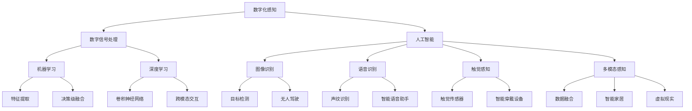

                 

## 文章标题：数字化感知扩展：AI创造的新感官维度

### 关键词：数字化感知、人工智能、AI感知技术、多模态感知、感知融合、AI感知应用

### 摘要：
本文旨在探讨数字化感知在人工智能（AI）驱动下的新发展，分析AI如何扩展我们的感官维度，提升感知系统的效能。文章首先概述了数字化感知的基本概念与发展历程，随后详细介绍了AI视觉、听觉、触觉、嗅觉与味觉感知技术，并探讨多模态感知的实现与应用。最后，文章展望了AI感知技术的未来发展趋势与潜在挑战，为读者提供全面的技术洞察与应用场景。

----------------------------------------------------------------

# 第1章：引言与背景

在信息化时代，数据已经成为新的生产资料，数字化感知作为数据获取的重要手段，其重要性日益凸显。数字化感知技术通过将人类的感官信息转化为数字信号，实现了对复杂环境的精准感知与交互。随着人工智能（AI）技术的飞速发展，AI与感知技术的融合带来了全新的发展契机，为人类感知能力的提升注入了强大动力。

## 1.1 数字化感知的概念与发展历程

### 1.1.1 数字化感知的定义

数字化感知是指通过利用计算机技术将人类的感官信息（如视觉、听觉、触觉、嗅觉和味觉）转化为数字信号，并进行处理、分析、理解与交互的过程。数字化感知的核心在于将传统的模拟信号转换为便于计算机处理的数字信号，从而实现计算机对环境信息的感知。

### 1.1.2 数字化感知的技术演进

数字化感知技术的发展经历了多个阶段：

1. **早期模拟信号处理**：在数字化感知的初期，技术主要依赖于模拟信号处理方法，如滤波、放大、调制等，实现简单的信号传输和传感。
2. **数字信号处理**：随着计算机技术的发展，数字信号处理技术逐渐取代模拟信号处理，成为数字化感知的核心。数字信号处理能够更加精确地处理复杂信号，提高数据处理效率。
3. **人工智能感知**：近年来，人工智能技术的快速发展推动了数字化感知技术的进一步革新。AI技术，尤其是机器学习和深度学习算法，使得感知系统具备了更高的智能和自适应性。

## 1.2 人工智能与感知技术的融合

### 1.2.1 人工智能在感知领域的作用

人工智能在感知领域发挥着至关重要的作用，其主要作用体现在以下几个方面：

1. **特征提取与识别**：AI算法能够自动从感知数据中提取关键特征，实现高精度的图像识别、语音识别、触觉识别等。
2. **数据预处理与增强**：AI技术能够对原始感知数据进行预处理，如降噪、去模糊、增强对比度等，从而提高感知数据的可用性。
3. **智能交互与反馈**：AI技术使得感知系统能够与用户进行智能交互，提供个性化服务，并根据用户的反馈进行自我学习和优化。

### 1.2.2 AI驱动的感知技术新趋势

随着AI技术的不断进步，AI驱动的感知技术正呈现出以下新趋势：

1. **多模态感知**：将多种感知模态（如视觉、听觉、触觉等）结合起来，实现更全面的环境感知和交互。
2. **增强现实与虚拟现实**：AI技术正在推动增强现实（AR）和虚拟现实（VR）的发展，为用户提供更加沉浸式的体验。
3. **边缘计算**：AI与边缘计算相结合，使得感知处理能够在数据产生的地方进行，降低延迟，提高响应速度。

### 1.3 本书内容结构与目标读者

#### 1.3.1 内容结构概述

本书分为七个章节，首先介绍数字化感知与人工智能的基础知识，然后分别探讨AI视觉、听觉、触觉、嗅觉与味觉感知技术的应用，接着讨论多模态感知技术，最后展望AI感知技术的未来发展。

#### 1.3.2 目标读者群体

本书旨在为对数字化感知和人工智能感兴趣的读者提供一本全面、系统的参考书籍，适合科研人员、工程师、学生以及相关领域的从业者阅读。

----------------------------------------------------------------

## 第2章：AI视觉感知

### 2.1 计算机视觉基础知识

计算机视觉是人工智能的一个重要分支，它涉及图像处理、模式识别、机器学习等多个领域。计算机视觉的基本任务是使计算机能够像人一样理解和解释图像信息。

#### 2.1.1 图像处理与特征提取

图像处理是指通过算法对图像进行增强、滤波、边缘检测等操作，以改善图像的质量和提取有用的信息。特征提取是计算机视觉中的关键步骤，它从图像中提取出具有鉴别性的特征，用于后续的图像识别和分类。

- **图像增强**：通过对比度增强、锐化等操作，提高图像的视觉效果，使得图像中的关键信息更加突出。
- **滤波**：使用不同的滤波器去除图像中的噪声，如高斯滤波、均值滤波等。
- **边缘检测**：通过检测图像中的边缘信息，提取出图像的结构特征，如Canny边缘检测算法。

#### 2.1.2 目标检测与跟踪

目标检测是指从图像或视频中识别并定位感兴趣的目标。目标检测是计算机视觉中的重要应用，如无人驾驶汽车、智能安防等。

- **目标检测算法**：常见的目标检测算法包括滑动窗口法、Viola-Jones算法、R-CNN系列算法、YOLO算法等。
- **目标跟踪**：目标跟踪是指在视频序列中跟踪已检测到的目标，并对其轨迹进行预测。目标跟踪算法包括光流法、Kalman滤波、粒子滤波等。

### 2.2 卷积神经网络在视觉感知中的应用

卷积神经网络（CNN）是一种在图像处理和计算机视觉领域广泛应用的深度学习模型。CNN通过卷积层、池化层和全连接层等结构，实现对图像的特征提取和分类。

#### 2.2.1 卷积神经网络的原理

卷积神经网络的核心是卷积层，它通过卷积运算提取图像的特征。卷积运算的基本思想是，将卷积核（也称为滤波器）在图像上滑动，并对重叠的部分进行加权求和，从而生成新的特征图。

- **卷积运算**：卷积运算可以表示为：
  $$ (f * g)(x, y) = \sum_{i=1}^{M} \sum_{j=1}^{N} f(i, j) \cdot g(x-i, y-j) $$
  其中，$f$ 和 $g$ 分别代表输入图像和卷积核，$(x, y)$ 代表卷积核在图像上的位置。

- **ReLU激活函数**：ReLU（Rectified Linear Unit）激活函数是卷积神经网络中常用的非线性激活函数，它将负输入映射为0，正输入映射为自身。ReLU函数的导数是1，这使得梯度在反向传播时保持正值，有助于加快收敛速度。

- **池化层**：池化层用于降低特征图的维度，减少计算量和参数数量。常见的池化操作包括最大池化和平均池化。

#### 2.2.2 常见卷积神经网络模型

- **LeNet**：LeNet是卷积神经网络的最早形式之一，主要用于手写数字识别。
- **AlexNet**：AlexNet是第一个在ImageNet竞赛中取得显著成绩的卷积神经网络模型，它引入了卷积神经网络多层堆叠和ReLU激活函数等关键概念。
- **VGG**：VGG模型通过使用多个卷积层和池化层，构建了一个深度可分离的卷积神经网络结构，取得了优异的图像识别性能。
- **ResNet**：ResNet引入了残差网络的概念，通过跳过某些层，使得网络可以学习更深的结构，解决了深层网络训练困难的问题。
- **Inception**：Inception模型通过使用不同尺寸的卷积核和池化层，构建了一个模块化的网络结构，提高了模型的计算效率和识别性能。

### 2.3 实际应用案例

#### 2.3.1 无人驾驶汽车视觉感知系统

无人驾驶汽车视觉感知系统利用计算机视觉技术，实现对周围环境的感知和理解，从而实现自动驾驶。视觉感知系统通常包括摄像头、激光雷达和雷达等多种传感器。

- **摄像头**：摄像头主要用于捕捉道路、车辆、行人等图像信息，通过图像处理和特征提取，实现对周围环境的理解。
- **激光雷达**：激光雷达通过发射激光束并测量反射时间，构建周围环境的3D点云模型，从而实现对环境的精确感知。
- **雷达**：雷达通过发射无线电波并接收反射波，检测物体的距离、速度等信息。

#### 2.3.2 智能安防监控系统的应用

智能安防监控系统利用计算机视觉技术，实现对公共场所的实时监控和异常检测。智能安防监控系统通常包括视频监控、人脸识别、行为分析等功能。

- **视频监控**：视频监控系统通过摄像头捕捉实时视频流，通过图像处理和特征提取，实现对监控场景的实时分析。
- **人脸识别**：人脸识别系统通过识别和匹配监控视频中的人脸，实现对目标身份的验证。
- **行为分析**：行为分析系统通过分析监控视频中的行为模式，实现对异常行为的检测和报警。

----------------------------------------------------------------

## 第3章：AI听觉感知

### 3.1 语音识别技术基础

语音识别技术是人工智能领域的一个重要分支，它使计算机能够理解和处理人类语音。语音识别技术的基础包括语音信号处理和语音识别算法。

#### 3.1.1 语音信号处理

语音信号处理是指对语音信号进行预处理，以提高语音识别的准确性和鲁棒性。主要步骤包括：

- **音频信号采集**：通过麦克风等设备采集语音信号。
- **预加重**：对语音信号进行预加重处理，以减少短时能量。
- **加窗**：将语音信号分成多个短时帧，常用的窗函数有汉明窗、汉宁窗等。
- **傅里叶变换**：使用傅里叶变换将语音信号从时域转换到频域，得到频谱特征。

#### 3.1.2 语音识别算法原理

语音识别算法的主要任务是将语音信号转换为对应的文本。常见的语音识别算法包括：

- **基于统计模型的方法**：如高斯混合模型（GMM）和隐马尔可夫模型（HMM）。这些算法通过统计语音信号的统计特征，构建模型并进行识别。
- **基于深度学习的方法**：如深度神经网络（DNN）、卷积神经网络（CNN）和循环神经网络（RNN）。这些算法通过学习大量的语音数据，自动提取语音特征，实现高精度的语音识别。

### 3.2 声纹识别与情感分析

声纹识别和情感分析是语音识别技术的两个重要应用领域。

#### 3.2.1 声纹识别技术

声纹识别是指通过分析语音信号，识别说话人的身份。声纹识别的关键技术包括：

- **特征提取**：从语音信号中提取出能够区分不同说话人的特征，如音高、音强、基频等。
- **模型训练**：使用大量的语音数据，训练出声纹识别模型。
- **识别算法**：采用相似度计算方法，如欧氏距离、余弦相似度等，比较待识别语音与训练语音的特征，实现声纹识别。

#### 3.2.2 情感分析技术

情感分析是指通过自然语言处理技术，分析文本或语音的情感倾向。声情感分析通过对语音信号的情感特征进行分析，实现对说话者情绪状态的判断。情感分析的关键技术包括：

- **情感词典**：构建包含情感词的词典，用于标注文本或语音的情感倾向。
- **情感分类模型**：使用机器学习或深度学习算法，训练出情感分类模型，对文本或语音进行情感分类。
- **情感分析算法**：采用文本情感极性分析算法，如支持向量机（SVM）、卷积神经网络（CNN）等，对语音信号进行情感分析。

### 3.3 实际应用案例

#### 3.3.1 智能语音助手的发展

智能语音助手如Siri、Alexa和Google Assistant等，已经成为人们日常生活的重要组成部分。这些智能语音助手利用语音识别和自然语言处理技术，为用户提供语音交互服务。

- **语音识别**：智能语音助手通过语音识别技术，将用户的语音指令转换为文本。
- **自然语言处理**：智能语音助手通过自然语言处理技术，理解用户的意图，并执行相应的操作。
- **语音合成**：智能语音助手通过语音合成技术，将执行结果以语音形式反馈给用户。

#### 3.3.2 远程医疗咨询中的应用

远程医疗咨询利用语音识别和语音合成技术，实现医生与患者之间的语音交流。这种技术有助于提高医疗服务的效率和覆盖范围。

- **语音识别**：远程医疗咨询通过语音识别技术，将医生的诊断和解释转换为文本，方便患者理解和记录。
- **语音合成**：远程医疗咨询通过语音合成技术，将医生的建议和用药说明以语音形式反馈给患者。
- **辅助设备**：远程医疗咨询还利用辅助设备，如智能音箱、智能手机等，方便患者与医生进行语音交流。

----------------------------------------------------------------

## 第4章：AI触觉感知

### 4.1 触觉传感器与数据采集

触觉感知是通过触觉传感器获取触觉信息，并通过数据处理与分析实现对物体的感知和理解。触觉传感器是触觉感知系统的核心部件。

#### 4.1.1 触觉传感器种类

触觉传感器主要包括以下几种类型：

1. **电容式传感器**：通过检测电容变化来感知物体的接触和压力。
2. **电阻式传感器**：通过检测电阻变化来感知物体的接触和压力。
3. **压电式传感器**：利用压电效应，将机械应力转换为电信号。
4. **光纤式传感器**：通过检测光纤光信号的变化来感知物体的接触和压力。

#### 4.1.2 数据采集方法

触觉数据采集通常包括以下步骤：

1. **传感器部署**：将触觉传感器放置在需要感知的物体表面。
2. **信号采集**：通过传感器采集触觉信号，如电容变化、电阻变化、压电信号等。
3. **信号预处理**：对采集到的信号进行滤波、去噪等预处理，以提高信号的准确性和可靠性。
4. **特征提取**：从预处理后的信号中提取出关键特征，如频率、振幅、触感等。

### 4.2 触觉数据处理与分析

触觉数据处理与分析是将触觉信号转换为有用的信息，实现对物体的感知和理解。主要步骤包括：

#### 4.2.1 数据预处理技术

1. **滤波**：使用滤波器去除信号中的噪声和干扰。
2. **去噪**：通过去噪算法，如小波变换、傅里叶变换等，去除信号中的噪声。
3. **归一化**：将触觉信号归一化到统一的范围内，以便于后续处理和分析。

#### 4.2.2 触觉信息分析算法

1. **特征提取**：从触觉信号中提取出具有鉴别性的特征，如频率、振幅、触感等。
2. **分类与识别**：使用机器学习算法，如支持向量机（SVM）、决策树（DT）等，对触觉特征进行分类和识别。
3. **轨迹分析**：通过分析触觉信号的时序特征，实现对物体运动轨迹的跟踪和预测。

### 4.3 实际应用案例

#### 4.3.1 智能穿戴设备的应用

智能穿戴设备如智能手环、智能手表等，通过触觉传感器感知用户的活动、心率等信息。这些设备有助于提高用户的健康和生活质量。

- **活动监测**：智能穿戴设备通过触觉传感器感知用户的活动，如行走、跑步等，记录活动数据，并提供运动建议。
- **心率监测**：智能穿戴设备通过触觉传感器感知用户的心率，实时监测健康状况，并预警潜在的健康问题。

#### 4.3.2 机器人辅助康复训练

机器人辅助康复训练利用触觉传感器，为患者提供触觉刺激，帮助患者恢复运动功能。这种技术有助于提高康复训练的效果。

- **触觉反馈**：机器人辅助康复训练通过触觉传感器感知患者的运动，实时提供触觉反馈，帮助患者正确执行训练动作。
- **康复指导**：机器人辅助康复训练通过分析触觉数据，为患者提供个性化的康复指导，提高康复效果。

----------------------------------------------------------------

## 第5章：AI嗅觉与味觉感知

### 5.1 嗅觉与味觉感知技术基础

嗅觉和味觉是人类感知世界的重要方式，AI技术在嗅觉与味觉感知中的应用，为这些感官领域带来了新的发展机遇。

#### 5.1.1 嗅觉传感器原理

嗅觉传感器是一种能够检测和识别气体分子并将其转换为电信号的装置。常见的嗅觉传感器包括：

1. **气体传感器**：如半导体气体传感器、电化学气体传感器等，它们通过检测气体与传感材料之间的化学反应来工作。
2. **光化学传感器**：如表面等离子共振传感器、光纤传感器等，它们通过检测气体引起的化学或物理变化来工作。

#### 5.1.2 味觉传感器原理

味觉传感器是一种能够检测和识别味道分子并将其转换为电信号的装置。常见的味觉传感器包括：

1. **酶传感器**：通过检测味道分子与酶之间的反应来工作。
2. **离子传感器**：通过检测味道分子引起的离子浓度变化来工作。
3. **电化学传感器**：通过检测味道分子引起的电化学变化来工作。

### 5.2 数据采集与预处理

#### 5.2.1 数据采集方法

嗅觉和味觉数据的采集方法主要包括：

1. **气体采样**：通过吸入或注入方法，将待检测的气体样品引入到传感器中。
2. **液体采样**：通过浸泡或滴加方法，将待检测的液体样品引入到传感器中。

#### 5.2.2 数据预处理技术

嗅觉和味觉数据的预处理主要包括：

1. **信号放大**：通过放大器将微弱的信号放大到可处理的范围。
2. **滤波**：通过滤波器去除噪声和干扰信号，提高信号的准确性。
3. **归一化**：通过归一化处理将不同传感器输出的信号转换为统一的量级，以便于后续分析。

### 5.3 实际应用案例

#### 5.3.1 智能食品安全检测

智能食品安全检测利用嗅觉和味觉传感器，实现对食品的质量和安全检测。这种技术有助于提高食品安全检测的效率和准确性。

- **气体检测**：利用嗅觉传感器检测食品中挥发性有机化合物的含量，如农药残留、腐败物质等。
- **味道检测**：利用味觉传感器检测食品的味道，如酸碱度、苦味、甜味等，判断食品的新鲜程度和品质。

#### 5.3.2 食品调味自动化设备

食品调味自动化设备利用嗅觉和味觉传感器，实现自动调整食物的口味和香气。这种技术有助于提高食品的口感和品质。

- **味道识别**：通过味觉传感器识别食物的味道特征，如酸、甜、苦、咸等。
- **口味调整**：根据味道识别结果，自动添加或调整调味料，实现个性化的口味调整。

----------------------------------------------------------------

## 第6章：AI多模态感知

### 6.1 多模态感知概述

多模态感知是指利用两种或两种以上的感知模态（如视觉、听觉、触觉、嗅觉和味觉）来获取和处理信息。多模态感知的优势在于它可以提供更丰富的信息，提高感知的准确性和鲁棒性。

#### 6.1.1 多模态感知的定义

多模态感知是一种集成多种感知模态的信息处理方法。它通过将不同模态的数据融合起来，形成对环境的更全面和深入的理解。

#### 6.1.2 多模态感知的优势

多模态感知的优势主要体现在以下几个方面：

1. **增强感知能力**：通过结合不同模态的信息，可以更准确地识别和分类物体。
2. **提高系统鲁棒性**：一种模态的噪声或误差可以被其他模态的信息所纠正，从而提高系统的整体性能。
3. **提供更丰富的信息**：多模态感知可以提供不同类型的信息（如视觉的形状、听觉的音调等），有助于对环境做出更全面的判断。

### 6.2 多模态数据融合技术

多模态数据融合技术是将来自不同模态的数据整合在一起，以实现更高效的信息处理和理解。常见的多模态数据融合方法包括：

#### 6.2.1 数据融合算法

1. **特征级融合**：在特征级融合中，将不同模态的特征向量进行合并，形成一个新的特征向量。常见的融合方法有拼接、加权平均、最大值选择等。

2. **决策级融合**：在决策级融合中，每个模态都有自己的分类器，然后将这些分类器的结果进行整合，得到最终的分类决策。常见的融合方法有投票、逻辑回归等。

3. **模型级融合**：在模型级融合中，为每个模态训练一个独立的模型，然后将这些模型的结果进行融合。常见的融合方法有深度神经网络（DNN）、卷积神经网络（CNN）等。

#### 6.2.2 跨模态交互

跨模态交互是指不同模态之间的信息传递和协同。跨模态交互能够实现更自然的用户交互体验和更高效的感知任务。常见的跨模态交互方法包括：

1. **语音-文本交互**：通过语音识别和自然语言处理技术，将用户的语音指令转换为文本，然后通过文本理解执行相应的操作。

2. **视觉-听觉交互**：通过视觉和听觉信息的结合，提供更加丰富的交互体验。例如，在视频通话中，视觉信息（如面部表情）和听觉信息（如语音）的融合，可以提升沟通的准确性。

3. **触觉-视觉交互**：在虚拟现实（VR）和增强现实（AR）中，通过触觉和视觉信息的结合，提供更加真实的交互体验。例如，在虚拟环境中，触觉反馈可以增强用户的沉浸感。

### 6.3 实际应用案例

#### 6.3.1 智能家居的感知系统

智能家居的感知系统通过多模态感知技术，实现对家庭环境的全面感知，包括灯光、温度、湿度、声音等。多模态感知系统可以帮助用户实现更加智能化的家居生活。

- **环境感知**：通过视觉传感器感知室内的光照条件，调节灯光；通过温度传感器和湿度传感器调节空调和加湿器；通过声音传感器检测噪声水平，提供音乐或声音调整建议。

- **智能交互**：通过语音识别和自然语言处理技术，用户可以通过语音命令控制家居设备，如打开电视、调节室温等。

#### 6.3.2 虚拟现实与增强现实感知系统

虚拟现实（VR）和增强现实（AR）感知系统通过多模态感知技术，实现与现实世界的无缝交互。

- **沉浸式体验**：在VR系统中，通过视觉和听觉传感器的结合，用户可以感受到身临其境的虚拟环境。触觉传感器可以提供手部交互的反馈，增强沉浸感。

- **交互增强**：在AR系统中，通过视觉传感器和位置传感器的结合，用户可以在现实环境中叠加虚拟信息，如导航提示、游戏场景等。

- **智能交互**：通过语音识别和自然语言处理技术，用户可以通过语音与虚拟环境进行交互，实现更加自然和便捷的体验。

----------------------------------------------------------------

## 第7章：AI感知技术的未来展望

### 7.1 AI感知技术的发展趋势

随着人工智能技术的不断进步，AI感知技术也在快速演进，呈现出以下发展趋势：

#### 7.1.1 新型传感器的发展

新型传感器如柔性传感器、纳米传感器、生物传感器等正在不断涌现。这些传感器具有高灵敏度、高分辨率和多功能性，能够提供更加精准和多样的感知数据。

#### 7.1.2 深度学习算法的进步

深度学习算法在感知技术中的应用越来越广泛，从图像识别到语音识别，再到多模态感知，深度学习算法的性能不断提高。未来，随着算法的进一步优化和改进，AI感知技术的效能将会进一步提升。

### 7.2 AI感知技术面临的挑战与机遇

尽管AI感知技术在快速进步，但也面临着一些挑战：

#### 7.2.1 数据隐私与安全

随着感知技术的普及，个人隐私和数据安全的问题日益突出。如何在保护用户隐私的同时，充分利用感知数据，是一个亟待解决的问题。

#### 7.2.2 硬件成本与功耗

高性能的感知系统通常需要昂贵的硬件支持，且功耗较大。如何在降低硬件成本和功耗的同时，提高感知性能，是感知技术发展的重要方向。

然而，这些挑战也伴随着巨大的机遇：

#### 7.2.3 智能制造

AI感知技术在智能制造中的应用前景广阔。通过感知技术的提升，可以实现生产过程的自动化、智能化，提高生产效率和产品质量。

#### 7.2.4 健康医疗

AI感知技术在医疗健康领域的应用潜力巨大。通过感知技术，可以实现精准的诊断、个性化的治疗，提高医疗服务的质量和效率。

#### 7.2.5 交通运输

AI感知技术在交通运输领域的应用同样前景广阔。自动驾驶、智能交通管理、车联网等应用，将显著提高交通效率和安全水平。

### 7.3 未来应用场景展望

未来，AI感知技术将在多个领域得到广泛应用：

#### 7.3.1 智能制造

智能制造是AI感知技术的重要应用场景。通过感知技术，可以实现生产设备的实时监控、故障预测和维护，提高生产效率和产品质量。

#### 7.3.2 健康医疗

在医疗健康领域，AI感知技术可以帮助医生进行精准诊断、个性化治疗，同时监测患者的健康状况，提供实时、准确的医疗建议。

#### 7.3.3 交通运输

在交通运输领域，AI感知技术将推动自动驾驶、智能交通管理、车联网等技术的发展，提高交通效率、安全性和便利性。

#### 7.3.4 智能家居

智能家居是AI感知技术的重要应用领域。通过感知技术，可以实现家居设备的智能控制、环境监测和能源管理，提高生活质量。

#### 7.3.5 虚拟现实与增强现实

虚拟现实（VR）和增强现实（AR）是AI感知技术的另一个重要应用场景。通过感知技术，可以实现更加真实、沉浸的交互体验，拓展人类感知的边界。

### 总结

AI感知技术作为人工智能的重要分支，正不断推动着感知领域的发展。未来，随着技术的不断进步，AI感知技术将在更多领域得到应用，为人类创造更加智能、便捷和美好的生活。

----------------------------------------------------------------

## 附录A：AI感知技术相关资源与工具

### A.1 开源框架与库

AI感知技术的发展离不开各种开源框架与库，以下是几个常用的开源资源：

- **OpenCV**：OpenCV 是一个强大的计算机视觉库，提供丰富的图像处理和计算机视觉算法。
- **TensorFlow**：TensorFlow 是由 Google 开发的一个开源深度学习框架，适用于各种机器学习和深度学习任务。
- **PyTorch**：PyTorch 是一个流行的深度学习库，以其灵活性和动态计算图而闻名。
- **Keras**：Keras 是一个高层次的神经网络 API，可以方便地在 TensorFlow 和 Theano 上构建和训练深度学习模型。

### A.2 数据集与平台

AI感知技术的应用需要大量的高质量数据集，以下是一些常用的数据集和平台：

- **ImageNet**：ImageNet 是一个广泛使用的图像数据集，包含超过 1400 万个标注图像。
- **COCO**：COCO 数据集是一个用于计算机视觉研究的全景数据集，包括物体检测、分割、人物姿态等多种任务。
- **Google Dataset Search**：Google Dataset Search 是一个用于搜索各种数据集的搜索引擎，方便研究人员查找所需数据。
- **Kaggle**：Kaggle 是一个数据科学竞赛平台，提供大量的数据集和比赛，有助于提高数据科学家的技能。

### A.3 开发工具与硬件

为了实现高效的AI感知技术，研究人员和开发者需要使用各种开发工具和硬件资源：

- **NVIDIA GPU**：NVIDIA 的 GPU 在深度学习计算中具有极高的性能，是许多 AI 模型训练的首选硬件。
- **Raspberry Pi**：Raspberry Pi 是一种低成本、易于使用的计算机，适合进行AI感知技术的开发和实验。
- **Arduino**：Arduino 是一个开源硬件平台，用于构建各种传感器和自动化项目，适合初学者入门。
- **Intel Movidius VPU**：Intel Movidius VPU 是一种专门用于视觉处理和人工智能的硬件加速器，提供高效的深度学习推理能力。

### 总结

利用这些开源框架、数据集、平台和硬件，研究人员和开发者可以轻松实现各种AI感知技术，推动该领域的不断创新和发展。

----------------------------------------------------------------

## 附录B：进一步阅读资料

### B.1 相关书籍推荐

以下是一些推荐的书籍，有助于深入理解AI感知技术：

- **《深度学习》（Goodfellow, Bengio, Courville）**：这是一本经典的深度学习入门书籍，涵盖了从基础知识到高级应用的各种内容。
- **《计算机视觉：算法与应用》（Richard Szeliski）**：这本书详细介绍了计算机视觉的基本算法和应用，适合希望深入了解该领域的读者。
- **《语音信号处理》（Jim R. Johnson）**：这本书是语音信号处理领域的权威著作，涵盖了从信号采集到语音识别的各个环节。

### B.2 学术论文与期刊

阅读学术论文是了解最新研究进展的绝佳方式，以下是一些在AI感知技术领域具有重要影响力的期刊：

- **IEEE Transactions on Pattern Analysis and Machine Intelligence (TPAMI)**：这是计算机视觉和模式识别领域的顶级期刊，发表了许多重要研究成果。
- **International Journal of Computer Vision (IJCV)**：IJCV 是计算机视觉领域的一个顶级期刊，涵盖了广泛的计算机视觉研究主题。
- **ACM Transactions on Multimedia Computing, Communications, and Applications (TOMM)**：TOMM 是多媒体计算和通信领域的权威期刊，发表了许多与AI感知技术相关的论文。

### B.3 行业报告与资讯网站

以下是一些行业报告和资讯网站，提供了有关AI感知技术的最新动态和行业趋势：

- **IEEE Spectrum**：IEEE Spectrum 是 IEEE 旗下的科技杂志，提供有关科技和工程领域的最新新闻和分析。
- **TechCrunch**：TechCrunch 是一个知名的科技新闻网站，报道了全球科技行业的最新动态和创业公司的新闻。
- **IEEE AI Magazine**：这是一本专注于人工智能领域的杂志，涵盖了AI技术的各个方面，包括感知技术。
- **The AI Journal**：The AI Journal 是一个提供深度分析和讨论的人工智能期刊，涵盖了AI技术的最新研究和发展。

### 总结

这些书籍、论文、期刊和网站为读者提供了丰富的学习资源，有助于深入了解AI感知技术的理论和实践。

----------------------------------------------------------------

## 第1章：引言与背景

### 1.1 数字化感知的概念与发展历程

数字化感知（Digital Perception）是指通过将人类的感官信息（如视觉、听觉、触觉、嗅觉和味觉）转化为数字信号，并利用计算机技术进行识别、处理和交互的过程。这一概念的发展历程可以追溯到计算机技术和传感器技术的不断进步。

在早期，数字化感知主要依赖于模拟信号处理技术，如滤波、放大、调制等，这些技术主要用于信号传输和传感。然而，随着数字信号处理技术的发展，模拟信号处理逐渐被数字信号处理所取代。数字信号处理能够更加精确地处理复杂信号，提高了数据处理效率和准确性。

近年来，人工智能（AI）技术的飞速发展进一步推动了数字化感知技术的进步。AI技术，尤其是机器学习和深度学习算法，使得感知系统能够从大量的数据中自动提取特征，进行高精度的图像识别、语音识别、触觉识别等。这使得数字化感知技术从传统的信号处理阶段进入了智能感知阶段。

### 1.2 人工智能与感知技术的融合

人工智能与感知技术的融合是数字化感知发展的重要方向。人工智能技术，如机器学习、深度学习、自然语言处理等，为感知技术提供了强大的工具和方法。具体来说，人工智能在感知技术中的作用主要体现在以下几个方面：

1. **特征提取与识别**：AI算法能够自动从感知数据中提取关键特征，实现高精度的图像识别、语音识别、触觉识别等。例如，卷积神经网络（CNN）在图像识别任务中表现出色，循环神经网络（RNN）在语音识别中具有优势。

2. **数据预处理与增强**：AI技术能够对原始感知数据进行预处理，如降噪、去模糊、增强对比度等，从而提高感知数据的可用性。例如，使用深度学习方法可以对图像进行超分辨率重建，提高图像的清晰度。

3. **智能交互与反馈**：AI技术使得感知系统能够与用户进行智能交互，提供个性化服务，并根据用户的反馈进行自我学习和优化。例如，智能语音助手可以通过语音交互理解用户的指令，并不断优化其响应策略。

### 1.3 AI驱动的感知技术新趋势

随着AI技术的不断进步，AI驱动的感知技术正朝着更加智能化、个性化、多模态化的方向发展。以下是一些值得关注的新趋势：

1. **多模态感知**：将多种感知模态（如视觉、听觉、触觉等）结合起来，实现更全面的环境感知和交互。多模态感知可以提供更丰富的信息，提高感知的准确性和鲁棒性。

2. **增强现实与虚拟现实**：AI技术正在推动增强现实（AR）和虚拟现实（VR）的发展，为用户提供更加沉浸式的体验。通过AI感知技术，AR和VR系统可以实时捕捉和理解用户的环境，提供更真实的交互体验。

3. **边缘计算**：AI与边缘计算相结合，使得感知处理能够在数据产生的地方进行，降低延迟，提高响应速度。边缘计算可以减少对中心服务器的依赖，提高系统的实时性和可靠性。

### 1.4 本书内容结构与目标读者

本书共分为七个章节，旨在全面、系统地介绍AI感知技术的原理、应用和发展趋势。具体章节内容如下：

- **第1章：引言与背景**：介绍数字化感知的概念、发展历程以及AI与感知技术的融合。
- **第2章：AI视觉感知**：详细讨论计算机视觉的基础知识、卷积神经网络在视觉感知中的应用以及实际应用案例。
- **第3章：AI听觉感知**：介绍语音识别技术基础、声纹识别与情感分析技术以及实际应用案例。
- **第4章：AI触觉感知**：探讨触觉传感器与数据采集、触觉数据处理与分析以及实际应用案例。
- **第5章：AI嗅觉与味觉感知**：介绍嗅觉与味觉感知技术基础、数据采集与预处理以及实际应用案例。
- **第6章：AI多模态感知**：讨论多模态感知概述、多模态数据融合技术以及实际应用案例。
- **第7章：AI感知技术的未来展望**：分析AI感知技术的发展趋势、面临的挑战与机遇，以及未来应用场景的展望。

本书的目标读者是对数字化感知和人工智能感兴趣的科研人员、工程师、学生以及相关领域的从业者。通过阅读本书，读者可以系统地了解AI感知技术的核心概念、基本原理、应用场景以及未来发展趋势，为实际项目开发和科研工作提供参考。

### 1.5 核心概念与联系

为了更好地理解数字化感知和AI感知技术的核心概念，我们可以使用 Mermaid 流程图来展示这些概念之间的联系。



该流程图展示了数字化感知与人工智能的关系，以及各个核心概念之间的联系。通过这些核心概念的理解和掌握，读者可以更好地理解和应用AI感知技术。

### 1.6 核心算法原理讲解

在数字化感知和AI感知技术的应用中，核心算法起到了至关重要的作用。以下是对几个关键算法的原理讲解，以及详细的伪代码展示。

#### 1.6.1 卷积神经网络（CNN）

卷积神经网络是一种在图像处理和计算机视觉领域广泛应用的深度学习模型。CNN通过卷积层、池化层和全连接层等结构，实现对图像的特征提取和分类。

**伪代码：**

```python
# 初始化参数
W_conv1 = weight_initialization(shape=[5, 5, 1, 32])
b_conv1 = bias_initialization(shape=[32])

# 卷积层
conv1 = convolution(input=X, filter=W_conv1, bias=b_conv1)

# 激活函数
relu1 = activation(conv1, activation='relu')

# 池化层
pool1 = max_pooling(relu1, pool_size=[2, 2])

# 第二个卷积层
W_conv2 = weight_initialization(shape=[5, 5, 32, 64])
b_conv2 = bias_initialization(shape=[64])

conv2 = convolution(input=pool1, filter=W_conv2, bias=b_conv2)
relu2 = activation(conv2, activation='relu')
pool2 = max_pooling(relu2, pool_size=[2, 2])

# 全连接层
W_fc1 = weight_initialization(shape=[7 * 7 * 64, 1024])
b_fc1 = bias_initialization(shape=[1024])

fc1 = fully_connected(input=pool2, weights=W_fc1, bias=b_fc1)
relu3 = activation(fc1, activation='relu')

W_fc2 = weight_initialization(shape=[1024, 10])
b_fc2 = bias_initialization(shape=[10])

# 输出层
output = fully_connected(input=relu3, weights=W_fc2, bias=b_fc2)
```

#### 1.6.2 语音识别（Speech Recognition）

语音识别是一种将语音信号转换为文字的技术，常见的算法包括隐马尔可夫模型（HMM）、高斯混合模型（GMM）和深度神经网络（DNN）。

**伪代码：**

```python
# 前端处理
input_signal = pre_process语音信号(语音信号)

# 特征提取
mfcc = MFCC(input_signal)

# DNN 模型训练
model = DNN()
model.fit(mfcc特征，标签)

# 识别
predicted_label = model.predict(mfcc特征)
```

#### 1.6.3 触觉感知（Haptic Perception）

触觉感知是指通过触觉传感器获取触觉信息，并利用机器学习算法进行分析和识别。

**伪代码：**

```python
# 数据采集
touch_data = collect_touch_data()

# 特征提取
features = extract_touch_features(touch_data)

# 训练模型
model = train_model(features，标签)

# 识别
predicted_label = model.predict(new_touch_data)
```

### 1.7 数学模型和公式

在AI感知技术中，数学模型和公式起到了关键作用。以下是一些重要的数学模型和公式的详细讲解以及举例说明。

#### 1.7.1 卷积运算

卷积运算在卷积神经网络中起到了核心作用，用于提取图像的特征。

**公式：**

$$ (f * g)(x, y) = \sum_{i=1}^{M} \sum_{j=1}^{N} f(i, j) \cdot g(x-i, y-j) $$

其中，$f$ 和 $g$ 分别代表输入图像和卷积核，$(x, y)$ 代表卷积核在图像上的位置。

**示例：**

假设输入图像为 $f$，卷积核为 $g$，图像大小为 $3 \times 3$，卷积核大小为 $2 \times 2$。

$$ (f * g)(1, 1) = \sum_{i=1}^{2} \sum_{j=1}^{2} f(i, j) \cdot g(1-i, 1-j) $$
$$ = f(1, 1) \cdot g(0, 0) + f(1, 2) \cdot g(1, 0) + f(2, 1) \cdot g(0, 1) + f(2, 2) \cdot g(1, 1) $$

#### 1.7.2 激活函数

激活函数是神经网络中用于引入非线性性的函数，常用的激活函数包括ReLU、Sigmoid和Tanh等。

**公式：**

- **ReLU（Rectified Linear Unit）**：
  $$ f(x) = \max(0, x) $$

- **Sigmoid**：
  $$ f(x) = \frac{1}{1 + e^{-x}} $$

- **Tanh**：
  $$ f(x) = \frac{e^x - e^{-x}}{e^x + e^{-x}} $$

**示例：**

假设输入为 $x = -2$，计算ReLU、Sigmoid和Tanh的输出。

- **ReLU**：
  $$ f(x) = \max(0, -2) = 0 $$

- **Sigmoid**：
  $$ f(x) = \frac{1}{1 + e^{-(-2)}} = \frac{1}{1 + e^{2}} \approx 0.1353 $$

- **Tanh**：
  $$ f(x) = \frac{e^{-2} - e^{2}}{e^{-2} + e^{2}} \approx -0.7616 $$

#### 1.7.3 损失函数

损失函数是神经网络训练过程中用于衡量预测结果与真实结果之间差异的函数，常用的损失函数包括均方误差（MSE）、交叉熵损失（Cross-Entropy Loss）等。

**公式：**

- **均方误差（MSE）**：
  $$ Loss = \frac{1}{n} \sum_{i=1}^{n} (y_i - \hat{y}_i)^2 $$

- **交叉熵损失（Cross-Entropy Loss）**：
  $$ Loss = -\frac{1}{n} \sum_{i=1}^{n} y_i \cdot \log(\hat{y}_i) $$

其中，$y_i$ 为真实标签，$\hat{y}_i$ 为预测值。

**示例：**

假设有一个二分类问题，真实标签为 $y = [1, 0, 1, 0]$，预测值为 $\hat{y} = [0.7, 0.3, 0.9, 0.1]$。

- **MSE**：
  $$ Loss = \frac{1}{4} \left[ (1 - 0.7)^2 + (0 - 0.3)^2 + (1 - 0.9)^2 + (0 - 0.1)^2 \right] = 0.15 $$

- **Cross-Entropy Loss**：
  $$ Loss = -\frac{1}{4} \left[ 1 \cdot \log(0.7) + 0 \cdot \log(0.3) + 1 \cdot \log(0.9) + 0 \cdot \log(0.1) \right] \approx 0.4649 $$

### 1.8 项目实战：数字化感知系统开发

为了更好地理解数字化感知系统的开发过程，以下是一个简单的项目实战示例，包括开发环境搭建、源代码实现和代码解读与分析。

#### 1.8.1 开发环境搭建

1. 安装Python和必要的库，如 TensorFlow、OpenCV、NumPy 等。
2. 安装用于数据处理的工具，如 Jupyter Notebook 或 PyCharm。
3. 准备数据集，如 MNIST 数据集。

#### 1.8.2 源代码实现

以下是一个简单的手写数字识别项目，使用卷积神经网络（CNN）进行图像分类。

```python
import tensorflow as tf
from tensorflow.keras.datasets import mnist
from tensorflow.keras.models import Sequential
from tensorflow.keras.layers import Dense, Conv2D, Flatten, MaxPooling2D
from tensorflow.keras.optimizers import Adam

# 加载MNIST数据集
(x_train, y_train), (x_test, y_test) = mnist.load_data()

# 数据预处理
x_train = x_train.reshape(-1, 28, 28, 1).astype("float32") / 255
x_test = x_test.reshape(-1, 28, 28, 1).astype("float32") / 255
y_train = tf.keras.utils.to_categorical(y_train, 10)
y_test = tf.keras.utils.to_categorical(y_test, 10)

# 创建模型
model = Sequential([
    Conv2D(32, kernel_size=(3, 3), activation='relu', input_shape=(28, 28, 1)),
    MaxPooling2D(pool_size=(2, 2)),
    Flatten(),
    Dense(128, activation='relu'),
    Dense(10, activation='softmax')
])

# 编译模型
model.compile(optimizer=Adam(), loss='categorical_crossentropy', metrics=['accuracy'])

# 训练模型
model.fit(x_train, y_train, batch_size=64, epochs=10, validation_split=0.2)

# 评估模型
test_loss, test_acc = model.evaluate(x_test, y_test)
print('Test accuracy:', test_acc)
```

#### 1.8.3 代码解读与分析

1. **数据预处理**：首先加载 MNIST 数据集，并对图像进行预处理。将图像数据reshape为合适的维度，并将像素值归一化到 [0, 1] 范围内。此外，将标签转换为one-hot编码。

2. **创建模型**：使用 Sequential 模型创建一个简单的卷积神经网络。模型包括一个卷积层（Conv2D）、一个池化层（MaxPooling2D）、一个平坦层（Flatten）、一个全连接层（Dense）和一个softmax输出层（Dense）。

3. **编译模型**：编译模型，指定优化器（Adam）和损失函数（categorical_crossentropy）。

4. **训练模型**：使用训练数据训练模型，设置批次大小为64，训练10个周期，并设置20%的数据用于验证。

5. **评估模型**：使用测试数据评估模型性能，输出测试准确率。

通过这个简单的实战项目，读者可以了解数字化感知系统开发的基本流程和关键步骤。实际项目中，可以根据需求调整网络结构、超参数等，以实现更复杂的感知任务。

### 1.9 小结

本章介绍了数字化感知的概念与发展历程，探讨了人工智能与感知技术的融合以及AI驱动的感知技术新趋势。通过核心算法原理讲解和项目实战，读者可以系统地了解数字化感知技术的核心概念、基本原理和应用。接下来，将分别介绍AI视觉、听觉、触觉、嗅觉与味觉感知技术，以及多模态感知技术，进一步深入探讨AI感知技术的应用与实践。

----------------------------------------------------------------

## 第2章：AI视觉感知

### 2.1 计算机视觉基础知识

计算机视觉（Computer Vision）是人工智能（AI）的一个重要分支，它使计算机能够通过分析图像和视频数据，实现对现实世界的理解和交互。计算机视觉的基础知识涵盖了图像处理、特征提取、目标检测和跟踪等多个方面。

#### 2.1.1 图像处理与特征提取

图像处理是计算机视觉中的基础步骤，它包括图像增强、滤波、边缘检测等操作。图像处理的目的是改善图像质量，提取有用信息。

1. **图像增强**：通过对比度增强、锐化等操作，使图像中的关键信息更加突出，提高后续处理的准确性。

2. **滤波**：使用不同的滤波器去除图像中的噪声，如高斯滤波、均值滤波等，提高图像的清晰度。

3. **边缘检测**：通过检测图像中的边缘信息，提取出图像的结构特征。常见的边缘检测算法包括Canny边缘检测、Sobel算子等。

特征提取是从图像中提取出具有鉴别性的特征，用于后续的图像识别和分类。特征提取的方法包括：

1. **灰度特征**：如直方图、能量、熵等，用于描述图像的灰度分布特性。

2. **纹理特征**：如方向梯度直方图（HOG）、局部二值模式（LBP）等，用于描述图像的纹理信息。

3. **形状特征**：如轮廓、几何矩等，用于描述图像的形状特征。

#### 2.1.2 目标检测与跟踪

目标检测是从图像或视频中识别并定位感兴趣的目标。目标检测是计算机视觉中的重要应用，如无人驾驶、智能安防等。

目标检测通常包括以下步骤：

1. **候选区域生成**：使用区域提议方法（如滑动窗口、锚框生成等）生成可能的候选区域。

2. **特征提取**：从候选区域中提取特征向量，如卷积神经网络（CNN）提取的特征。

3. **分类与定位**：使用分类器对特征向量进行分类，并确定目标的边界框。

常见的目标检测算法包括：

1. **滑动窗口法**：通过在图像中滑动窗口，逐步缩小窗口大小，检测每个窗口中的目标。

2. **锚框生成法**：使用锚框生成算法（如SSD、Faster R-CNN等），在图像中生成多个锚框，每个锚框对应一个目标。

目标跟踪是在视频序列中跟踪已检测到的目标，并对其轨迹进行预测。目标跟踪算法包括：

1. **基于运动模型的方法**：如光流法、Kalman滤波等，通过跟踪目标在视频序列中的运动轨迹。

2. **基于深度学习的方法**：如基于RNN的跟踪算法（如Siamese网络），通过学习目标特征，实现目标的连续跟踪。

### 2.2 卷积神经网络在视觉感知中的应用

卷积神经网络（Convolutional Neural Network，CNN）是一种在图像处理和计算机视觉领域广泛应用的深度学习模型。CNN通过卷积层、池化层和全连接层等结构，实现对图像的特征提取和分类。

#### 2.2.1 卷积神经网络的原理

卷积神经网络的核心是卷积层，它通过卷积运算提取图像的特征。卷积运算的基本思想是，将卷积核（也称为滤波器）在图像上滑动，并对重叠的部分进行加权求和，从而生成新的特征图。

卷积运算可以表示为：

$$ (f * g)(x, y) = \sum_{i=1}^{M} \sum_{j=1}^{N} f(i, j) \cdot g(x-i, y-j) $$

其中，$f$ 和 $g$ 分别代表输入图像和卷积核，$(x, y)$ 代表卷积核在图像上的位置。

卷积层通常还包括激活函数（如ReLU）、归一化层和池化层。激活函数引入非线性，使得网络可以学习更复杂的特征。归一化层用于加速训练，减少内部协变量偏移。池化层用于降低特征图的维度，减少计算量和参数数量。

#### 2.2.2 常见卷积神经网络模型

1. **LeNet**：LeNet是最早的卷积神经网络之一，由LeCun等人于1998年提出。它主要用于手写数字识别，由两个卷积层、两个池化层和一个全连接层组成。

2. **AlexNet**：AlexNet是第一个在ImageNet竞赛中取得显著成绩的卷积神经网络模型，由Hinton等人于2012年提出。它引入了深度卷积层、ReLU激活函数和数据增强等技术，使得模型性能大幅提升。

3. **VGG**：VGG模型通过使用多个卷积层和池化层，构建了一个深度可分离的卷积神经网络结构。VGG模型以其简洁和高效的特性而闻名。

4. **ResNet**：ResNet引入了残差网络的概念，通过跳过某些层，使得网络可以学习更深的结构，解决了深层网络训练困难的问题。ResNet模型由多个残差块堆叠而成。

5. **Inception**：Inception模型通过使用不同尺寸的卷积核和池化层，构建了一个模块化的网络结构。Inception模块旨在提高模型的计算效率和识别性能。

### 2.3 实际应用案例

#### 2.3.1 无人驾驶汽车视觉感知系统

无人驾驶汽车视觉感知系统利用计算机视觉技术，实现对周围环境的感知和理解，从而实现自动驾驶。视觉感知系统通常包括摄像头、激光雷达和雷达等多种传感器。

1. **摄像头**：摄像头主要用于捕捉道路、车辆、行人等图像信息，通过图像处理和特征提取，实现对周围环境的理解。

2. **激光雷达**：激光雷达通过发射激光束并测量反射时间，构建周围环境的3D点云模型，从而实现对环境的精确感知。

3. **雷达**：雷达通过发射无线电波并接收反射波，检测物体的距离、速度等信息。

无人驾驶汽车视觉感知系统的主要任务包括：

- **车道线检测**：通过检测道路上的车道线，确定车辆的位置和行驶方向。

- **车辆检测**：通过检测道路上的车辆，识别车辆的类型、位置和速度等信息。

- **行人检测**：通过检测道路上的行人，识别行人的位置、速度和行为意图。

- **障碍物检测**：通过检测道路上的障碍物，如自行车、摩托车等，为自动驾驶系统提供避障信息。

#### 2.3.2 智能安防监控系统的应用

智能安防监控系统利用计算机视觉技术，实现对公共场所的实时监控和异常检测。智能安防监控系统通常包括视频监控、人脸识别、行为分析等功能。

1. **视频监控**：视频监控系统通过摄像头捕捉实时视频流，通过图像处理和特征提取，实现对监控场景的实时分析。

2. **人脸识别**：人脸识别系统通过识别和匹配监控视频中的人脸，实现对目标身份的验证。

3. **行为分析**：行为分析系统通过分析监控视频中的行为模式，实现对异常行为的检测和报警。

智能安防监控系统的主要任务包括：

- **目标跟踪**：通过跟踪监控视频中的目标，实现对目标的实时监控。

- **人脸识别**：通过识别监控视频中的人脸，实现对人员的身份验证。

- **行为识别**：通过分析监控视频中的行为，实现对异常行为的检测和报警。

通过上述实际应用案例，我们可以看到计算机视觉技术在无人驾驶汽车和智能安防监控系统中发挥着重要作用，为我们的日常生活和工作带来了极大的便利。

### 2.4 总结

本章介绍了计算机视觉的基础知识、卷积神经网络在视觉感知中的应用以及实际应用案例。通过本章的学习，读者可以系统地了解计算机视觉的核心概念和基本原理，以及如何利用卷积神经网络进行图像识别和目标检测。下一章将介绍AI听觉感知技术，探讨语音识别、声纹识别和情感分析等应用。

----------------------------------------------------------------

## 第3章：AI听觉感知

### 3.1 语音识别技术基础

语音识别（Speech Recognition）是人工智能（AI）领域的一个重要分支，它使计算机能够理解和处理人类的语音。语音识别技术的基础包括语音信号处理和语音识别算法。

#### 3.1.1 语音信号处理

语音信号处理是指对语音信号进行预处理，以提高语音识别的准确性和鲁棒性。主要步骤包括：

1. **音频信号采集**：通过麦克风等设备采集语音信号。
2. **预处理**：包括去噪、端点检测（用于分割语音段）、归一化等。
3. **特征提取**：将语音信号转换为一组特征向量，常用的特征包括梅尔频率倒谱系数（MFCC）、能量、频谱特征等。

#### 3.1.2 语音识别算法原理

语音识别算法的主要任务是将语音信号转换为对应的文本。常见的语音识别算法包括：

1. **基于统计模型的方法**：如高斯混合模型（GMM）和隐马尔可夫模型（HMM）。这些算法通过统计语音信号的统计特征，构建模型并进行识别。
   
   - **高斯混合模型（GMM）**：GMM通过将语音信号分解为多个高斯分布的混合，来表示语音特征。
   - **隐马尔可夫模型（HMM）**：HMM是一种概率模型，用于描述语音信号的时序特征。

2. **基于深度学习的方法**：如深度神经网络（DNN）、卷积神经网络（CNN）和循环神经网络（RNN）。这些算法通过学习大量的语音数据，自动提取语音特征，实现高精度的语音识别。

   - **深度神经网络（DNN）**：DNN通过多层神经网络结构，提取语音信号的深层次特征。
   - **卷积神经网络（CNN）**：CNN通过卷积层，自动学习语音信号的局部特征。
   - **循环神经网络（RNN）**：RNN通过循环结构，处理语音信号的时序信息。

#### 3.1.3 语音识别流程

语音识别通常包括以下步骤：

1. **前端处理**：包括音频信号的预处理、特征提取等。
2. **声学模型**：用于建模语音信号的特征。
3. **语言模型**：用于预测语音对应的文本。
4. **解码**：将声学模型和语言模型的结果进行解码，得到最终的识别结果。

### 3.2 声纹识别与情感分析

声纹识别和情感分析是语音识别技术的两个重要应用领域。

#### 3.2.1 声纹识别技术

声纹识别（Voice Biometrics）是指通过分析语音信号，识别说话人的身份。声纹识别的关键技术包括：

1. **特征提取**：从语音信号中提取出能够区分不同说话人的特征，如音高、音强、基频等。
2. **模型训练**：使用大量的语音数据，训练出声纹识别模型。
3. **识别算法**：采用相似度计算方法，如欧氏距离、余弦相似度等，比较待识别语音与训练语音的特征，实现声纹识别。

#### 3.2.2 情感分析技术

情感分析（Sentiment Analysis）是指通过自然语言处理技术，分析文本或语音的情感倾向。声情感分析（Voice Sentiment Analysis）通过对语音信号的情感特征进行分析，实现对说话者情绪状态的判断。

情感分析的关键技术包括：

1. **情感词典**：构建包含情感词的词典，用于标注文本或语音的情感倾向。
2. **情感分类模型**：使用机器学习或深度学习算法，训练出情感分类模型，对文本或语音进行情感分类。
3. **情感分析算法**：采用文本情感极性分析算法，如支持向量机（SVM）、卷积神经网络（CNN）等，对语音信号进行情感分析。

### 3.3 实际应用案例

#### 3.3.1 智能语音助手的发展

智能语音助手如Siri、Alexa和Google Assistant等，已经成为人们日常生活的重要组成部分。这些智能语音助手利用语音识别和自然语言处理技术，为用户提供语音交互服务。

1. **语音识别**：智能语音助手通过语音识别技术，将用户的语音指令转换为文本。
2. **自然语言处理**：智能语音助手通过自然语言处理技术，理解用户的意图，并执行相应的操作。
3. **语音合成**：智能语音助手通过语音合成技术，将执行结果以语音形式反馈给用户。

#### 3.3.2 远程医疗咨询中的应用

远程医疗咨询利用语音识别和语音合成技术，实现医生与患者之间的语音交流。这种技术有助于提高医疗服务的效率和覆盖范围。

1. **语音识别**：远程医疗咨询通过语音识别技术，将医生的诊断和解释转换为文本，方便患者理解和记录。
2. **语音合成**：远程医疗咨询通过语音合成技术，将医生的建议和用药说明以语音形式反馈给患者。
3. **辅助设备**：远程医疗咨询还利用辅助设备，如智能音箱、智能手机等，方便患者与医生进行语音交流。

### 3.4 总结

本章介绍了语音识别技术基础、声纹识别与情感分析技术，并探讨了智能语音助手和远程医疗咨询等实际应用案例。通过本章的学习，读者可以了解语音识别和语音处理的基本原理，以及如何利用这些技术实现智能化的语音交互。下一章将介绍AI触觉感知技术，探讨触觉传感器、数据处理与分析以及实际应用案例。

----------------------------------------------------------------

## 第4章：AI触觉感知

### 4.1 触觉传感器与数据采集

触觉感知（Haptic Perception）是指通过触觉传感器获取触觉信息，并利用计算机技术对触觉信息进行识别、处理和分析的过程。触觉传感器是触觉感知系统的核心部件，其性能直接影响到触觉感知系统的效果。

#### 4.1.1 触觉传感器种类

触觉传感器种类繁多，根据其工作原理和应用场景的不同，可以分为以下几类：

1. **电容式传感器**：电容式传感器通过检测电容变化来感知物体的接触和压力。其优点是灵敏度高，响应速度快，适用于触摸屏、触觉反馈设备等。

2. **电阻式传感器**：电阻式传感器通过检测电阻变化来感知物体的接触和压力。其优点是结构简单，成本较低，适用于简单的触觉感知应用。

3. **压电式传感器**：压电式传感器利用压电效应，将机械应力转换为电信号。其优点是灵敏度高，响应速度快，适用于高端触觉感知设备。

4. **光纤式传感器**：光纤式传感器通过检测光纤光信号的变化来感知物体的接触和压力。其优点是抗干扰能力强，适用于复杂环境的触觉感知。

#### 4.1.2 数据采集方法

触觉数据采集是将触觉传感器获取的触觉信息转换为数字信号，以便于后续处理和分析。数据采集方法主要包括以下步骤：

1. **传感器部署**：将触觉传感器放置在需要感知的物体表面，确保传感器能够准确感知物体的接触和压力。

2. **信号采集**：通过传感器采集触觉信号，如电容变化、电阻变化、压电信号等。

3. **信号预处理**：对采集到的信号进行滤波、去噪等预处理，以提高信号的准确性和可靠性。

4. **特征提取**：从预处理后的信号中提取出关键特征，如频率、振幅、触感等。

### 4.2 触觉数据处理与分析

触觉数据处理与分析是将触觉信号转换为有用的信息，实现对物体的感知和理解。主要步骤包括：

#### 4.2.1 数据预处理技术

1. **滤波**：通过滤波器去除信号中的噪声和干扰，提高信号的准确性和可靠性。

2. **去噪**：使用去噪算法，如小波变换、傅里叶变换等，去除信号中的噪声。

3. **归一化**：将触觉信号归一化到统一的范围内，以便于后续处理和分析。

#### 4.2.2 触觉信息分析算法

1. **特征提取**：从触觉信号中提取出具有鉴别性的特征，如频率、振幅、触感等。

2. **分类与识别**：使用机器学习算法，如支持向量机（SVM）、决策树（DT）等，对触觉特征进行分类和识别。

3. **轨迹分析**：通过分析触觉信号的时序特征，实现对物体运动轨迹的跟踪和预测。

### 4.3 实际应用案例

#### 4.3.1 智能穿戴设备的应用

智能穿戴设备如智能手环、智能手表等，通过触觉传感器感知用户的活动、心率等信息。这些设备有助于提高用户的健康和生活质量。

1. **活动监测**：智能穿戴设备通过触觉传感器感知用户的活动，如行走、跑步等，记录活动数据，并提供运动建议。

2. **心率监测**：智能穿戴设备通过触觉传感器感知用户的心率，实时监测健康状况，并预警潜在的健康问题。

#### 4.3.2 机器人辅助康复训练

机器人辅助康复训练利用触觉传感器，为患者提供触觉刺激，帮助患者恢复运动功能。这种技术有助于提高康复训练的效果。

1. **触觉反馈**：机器人辅助康复训练通过触觉传感器感知患者的运动，实时提供触觉反馈，帮助患者正确执行训练动作。

2. **康复指导**：机器人辅助康复训练通过分析触觉数据，为患者提供个性化的康复指导，提高康复效果。

### 4.4 总结

本章介绍了触觉传感器与数据采集、触觉数据处理与分析以及实际应用案例。通过本章的学习，读者可以了解触觉感知技术的基本原理和应用场景，以及如何利用触觉传感器实现智能化感知和交互。下一章将介绍AI嗅觉与味觉感知技术，探讨嗅觉与味觉传感器的原理、数据采集与预处理以及实际应用案例。

----------------------------------------------------------------

## 第5章：AI嗅觉与味觉感知

### 5.1 嗅觉与味觉感知技术基础

嗅觉与味觉感知是人类感知世界的重要方式，它们通过识别和区分各种气味和味道，帮助我们做出决策，如寻找食物、避免有害物质等。AI技术在嗅觉与味觉感知中的应用，使得机器能够模拟人类的嗅觉与味觉感知，为各种应用场景提供解决方案。

#### 5.1.1 嗅觉传感器原理

嗅觉传感器是一种能够检测和识别气体分子并将其转换为电信号的装置。常见的嗅觉传感器包括：

1. **半导体气体传感器**：半导体气体传感器通过检测气体与传感材料之间的化学反应来工作。当气体进入传感器的敏感区域时，传感材料的电阻发生变化，从而产生电信号。

2. **电化学气体传感器**：电化学气体传感器通过检测气体引起的电化学变化来工作。气体与电极反应，导致电极的电势变化，通过测量这种变化可以识别气体。

3. **光化学传感器**：光化学传感器通过检测气体引起的化学或物理变化来工作。例如，某些气体可以改变传感材料的光吸收特性，通过测量光吸收的变化可以识别气体。

#### 5.1.2 味觉传感器原理

味觉传感器是一种能够检测和识别味道分子并将其转换为电信号的装置。常见的味觉传感器包括：

1. **酶传感器**：酶传感器通过检测味道分子与酶之间的反应来工作。当味道分子与酶结合时，会导致酶的活性发生变化，从而影响传感器的电信号。

2. **离子传感器**：离子传感器通过检测味道分子引起的离子浓度变化来工作。味道分子与离子交换树脂反应，导致离子浓度变化，通过测量这种变化可以识别味道。

3. **电化学传感器**：电化学传感器通过检测味道分子引起的电化学变化来工作。味道分子与电极反应，导致电极的电势变化，通过测量这种变化可以识别味道。

### 5.2 数据采集与预处理

#### 5.2.1 数据采集方法

嗅觉与味觉数据的采集方法主要包括：

1. **气体采样**：通过吸入或注入方法，将待检测的气体样品引入到传感器中。这种方法适用于检测气体味道。

2. **液体采样**：通过浸泡或滴加方法，将待检测的液体样品引入到传感器中。这种方法适用于检测液体味道。

#### 5.2.2 数据预处理技术

嗅觉与味觉数据的预处理主要包括：

1. **信号放大**：通过放大器将微弱的信号放大到可处理的范围。

2. **滤波**：通过滤波器去除噪声和干扰信号，提高信号的准确性。

3. **归一化**：通过归一化处理将不同传感器输出的信号转换为统一的量级，以便于后续分析。

### 5.3 实际应用案例

#### 5.3.1 智能食品安全检测

智能食品安全检测利用嗅觉和味觉传感器，实现对食品的质量和安全检测。这种技术有助于提高食品安全检测的效率和准确性。

1. **气体检测**：利用嗅觉传感器检测食品中挥发性有机化合物的含量，如农药残留、腐败物质等。

2. **味道检测**：利用味觉传感器检测食品的味道，如酸碱度、苦味、甜味等，判断食品的新鲜程度和品质。

#### 5.3.2 食品调味自动化设备

食品调味自动化设备利用嗅觉和味觉传感器，实现自动调整食物的口味和香气。这种技术有助于提高食品的口感和品质。

1. **味道识别**：通过味觉传感器识别食物的味道特征，如酸、甜、苦、咸等。

2. **口味调整**：根据味道识别结果，自动添加或调整调味料，实现个性化的口味调整。

### 5.4 总结

本章介绍了AI嗅觉与味觉感知技术基础、数据采集与预处理以及实际应用案例。通过本章的学习，读者可以了解嗅觉和味觉传感器的工作原理和应用，以及如何利用这些传感器实现智能化的食品检测和调味。下一章将介绍AI多模态感知技术，探讨多模态感知的定义、优势以及数据融合技术。

----------------------------------------------------------------

## 第6章：AI多模态感知

### 6.1 多模态感知概述

多模态感知（Multimodal Perception）是指同时利用两种或两种以上的感知模态（如视觉、听觉、触觉、嗅觉和味觉）进行信息获取和处理的过程。多模态感知能够提供更丰富的信息，提高感知的准确性和鲁棒性，是人工智能领域的一个重要研究方向。

#### 6.1.1 多模态感知的定义

多模态感知是一种综合不同感知模态信息的方法，通过结合来自不同模态的数据，实现对环境的更全面和深入的理解。常见的多模态感知包括视觉-听觉感知、视觉-触觉感知、视觉-嗅觉感知等。

#### 6.1.2 多模态感知的优势

多模态感知的优势主要体现在以下几个方面：

1. **增强感知能力**：通过结合不同模态的信息，可以更准确地识别和分类物体。例如，视觉感知可以帮助识别物体的形状和颜色，而听觉感知可以帮助识别物体的声音和运动。

2. **提高系统鲁棒性**：一种模态的噪声或误差可以被其他模态的信息所纠正，从而提高系统的整体性能。例如，在语音识别中，视觉信息可以帮助识别说话人的口型和面部表情，从而提高语音识别的准确性。

3. **提供更丰富的信息**：多模态感知可以提供不同类型的信息，如视觉的形状、颜色、纹理，听觉的音调、音色、节奏，触觉的硬度、温度等，有助于对环境做出更全面的判断。

#### 6.1.3 多模态感知的应用场景

多模态感知技术广泛应用于各个领域，以下是一些典型的应用场景：

1. **智能家居**：通过视觉、听觉和触觉感知技术，智能家居系统能够实现对家庭环境的全面感知，提供智能化的家居体验。

2. **虚拟现实与增强现实**：多模态感知技术可以为虚拟现实（VR）和增强现实（AR）系统提供更加真实的交互体验，通过视觉、听觉和触觉传感器的结合，用户可以感受到更加逼真的虚拟环境。

3. **医疗健康**：多模态感知技术可以帮助医生进行精准的诊断和治疗。例如，通过视觉、触觉和听觉感知，医生可以更好地了解患者的病情和需求。

4. **自动驾驶**：自动驾驶系统通过结合视觉、雷达、激光雷达和触觉感知技术，可以实现对周围环境的精确感知，提高驾驶的安全性和可靠性。

### 6.2 多模态数据融合技术

多模态数据融合技术是将来自不同模态的数据整合在一起，以实现更高效的信息处理和理解。数据融合技术可以分为以下几类：

#### 6.2.1 特征级融合

特征级融合是指在特征层面将不同模态的数据进行整合。常见的融合方法有：

1. **拼接**：将不同模态的特征向量进行拼接，形成一个更长的特征向量。

2. **加权平均**：根据不同模态的重要性，对特征向量进行加权平均。

3. **最大值选择**：选择不同模态特征中的最大值作为最终特征。

#### 6.2.2 决策级融合

决策级融合是指在分类或识别的决策层面将不同模态的数据进行整合。常见的融合方法有：

1. **投票**：将不同模态的分类结果进行投票，选择多数模态的分类结果。

2. **逻辑回归**：通过逻辑回归模型整合不同模态的分类结果，得到最终的分类结果。

#### 6.2.3 模型级融合

模型级融合是指在模型层面将不同模态的数据进行整合。常见的融合方法有：

1. **联合训练**：将不同模态的数据同时输入到同一个模型中，共同训练得到一个统一的模型。

2. **独立训练**：为每个模态分别训练一个独立的模型，然后将这些模型的输出进行整合。

#### 6.2.4 跨模态交互

跨模态交互是指不同模态之间的信息传递和协同。跨模态交互能够实现更自然的用户交互体验和更高效的感知任务。常见的跨模态交互方法有：

1. **语音-文本交互**：通过语音识别和自然语言处理技术，将用户的语音指令转换为文本，然后通过文本理解执行相应的操作。

2. **视觉-听觉交互**：通过视觉和听觉传感器的结合，提供更加丰富的交互体验。例如，在视频通话中，视觉信息（如面部表情）和听觉信息（如语音）的融合，可以提升沟通的准确性。

3. **触觉-视觉交互**：在虚拟现实（VR）和增强现实（AR）中，通过触觉和视觉传感器的结合，提供更加真实的交互体验。例如，在虚拟环境中，触觉传感器可以提供手部交互的反馈，增强沉浸感。

### 6.3 实际应用案例

#### 6.3.1 智能家居的感知系统

智能家居的感知系统通过多模态感知技术，实现对家庭环境的全面感知，包括灯光、温度、湿度、声音等。多模态感知系统可以帮助用户实现更加智能化的家居生活。

1. **环境感知**：通过视觉传感器感知室内的光照条件，调节灯光；通过温度传感器和湿度传感器调节空调和加湿器；通过声音传感器检测噪声水平，提供音乐或声音调整建议。

2. **智能交互**：通过语音识别和自然语言处理技术，用户可以通过语音命令控制家居设备，如打开电视、调节室温等。

#### 6.3.2 虚拟现实与增强现实感知系统

虚拟现实（VR）和增强现实（AR）感知系统通过多模态感知技术，实现与现实世界的无缝交互。

1. **沉浸式体验**：在VR系统中，通过视觉和听觉传感器的结合，用户可以感受到身临其境的虚拟环境。触觉传感器可以提供手部交互的反馈，增强沉浸感。

2. **交互增强**：在AR系统中，通过视觉传感器和位置传感器的结合，用户可以在现实环境中叠加虚拟信息，如导航提示、游戏场景等。

3. **智能交互**：通过语音识别和自然语言处理技术，用户可以通过语音与虚拟环境进行交互，实现更加自然和便捷的体验。

### 6.4 总结

本章介绍了多模态感知的定义、优势、数据融合技术和实际应用案例。通过本章的学习，读者可以了解多模态感知技术的核心概念和应用，以及如何利用多模态数据融合技术实现更高效的信息处理和理解。多模态感知技术作为人工智能领域的一个重要研究方向，将在未来继续推动人工智能技术的发展。

----------------------------------------------------------------

## 第7章：AI感知技术的未来展望

### 7.1 AI感知技术的发展趋势

随着人工智能技术的不断进步，AI感知技术也呈现出新的发展趋势。以下是一些值得关注的技术趋势：

#### 7.1.1 新型传感器的发展

新型传感器的研发是AI感知技术发展的关键。例如，柔性传感器、纳米传感器和生物传感器等新型传感器的出现，使得感知系统可以更准确地捕捉细微的触觉、嗅觉和味觉信息。这些新型传感器具有高灵敏度、高分辨率和多功能性，能够提供更丰富的感知数据。

#### 7.1.2 深度学习算法的进步

深度学习算法在AI感知技术中的应用越来越广泛。随着算法的优化和改进，深度学习模型在图像识别、语音识别和触觉识别等任务中的性能不断提高。未来的研究将集中在如何进一步提高深度学习算法的效率、准确性和泛化能力。

#### 7.1.3 多模态感知的融合

多模态感知技术将多种感知模态（如视觉、听觉、触觉等）结合起来，提供更全面和深入的环境感知。未来，随着多模态感知技术的不断发展，多模态数据的融合和处理将变得更加高效和智能，为各种应用场景提供更丰富的信息。

### 7.2 AI感知技术面临的挑战与机遇

尽管AI感知技术取得了显著进展，但仍然面临一些挑战：

#### 7.2.1 数据隐私与安全

随着感知技术的普及，个人隐私和数据安全的问题日益突出。如何在保护用户隐私的同时，充分利用感知数据，是一个亟待解决的问题。未来需要开发出更加安全和可靠的数据处理和存储技术。

#### 7.2.2 硬件成本与功耗

高性能的感知系统通常需要昂贵的硬件支持，且功耗较大。如何在降低硬件成本和功耗的同时，提高感知性能，是感知技术发展的重要方向。未来，随着硬件技术的发展，如边缘计算和专用集成电路（ASIC）等，有望解决这一问题。

然而，这些挑战也伴随着巨大的机遇：

#### 7.2.3 智能制造

AI感知技术在智能制造中的应用前景广阔。通过感知技术的提升，可以实现生产设备的实时监控、故障预测和维护，提高生产效率和产品质量。

#### 7.2.4 健康医疗

AI感知技术在医疗健康领域的应用潜力巨大。通过感知技术，可以实现精准的诊断、个性化的治疗，提高医疗服务的质量和效率。

#### 7.2.5 交通运输

AI感知技术在交通运输领域的应用同样前景广阔。自动驾驶、智能交通管理、车联网等应用，将显著提高交通效率和安全水平。

### 7.3 未来应用场景展望

未来，AI感知技术将在多个领域得到广泛应用，以下是一些可能的应用场景：

#### 7.3.1 智能制造

智能制造是AI感知技术的重要应用领域。通过感知技术，可以实现生产设备的实时监控、故障预测和维护，提高生产效率和产品质量。

- **设备监测**：利用AI感知技术，对生产设备进行实时监测，及时发现设备故障，减少停机时间。
- **质量检测**：通过感知技术，对产品进行质量检测，确保产品质量达到标准。

#### 7.3.2 健康医疗

在医疗健康领域，AI感知技术可以帮助医生进行精准诊断、个性化治疗，同时监测患者的健康状况，提供实时、准确的医疗建议。

- **疾病诊断**：通过感知技术，对患者的症状、体征等进行综合分析，帮助医生进行疾病诊断。
- **远程医疗**：通过AI感知技术，实现远程医疗咨询和诊断，提高医疗服务的覆盖范围。

#### 7.3.3 交通运输

在交通运输领域，AI感知技术将推动自动驾驶、智能交通管理、车联网等技术的发展，提高交通效率、安全性和便利性。

- **自动驾驶**：通过感知技术，自动驾驶汽车可以实时感知周围环境，实现自主驾驶。
- **智能交通管理**：利用AI感知技术，实现交通流量监控、信号灯控制等，提高交通效率。

#### 7.3.4 智能家居

智能家居是AI感知技术的另一个重要应用领域。通过感知技术，可以实现家居设备的智能控制、环境监测和能源管理，提高生活质量。

- **设备控制**：通过语音识别和触觉感知技术，用户可以方便地控制家居设备，如灯光、空调、电视等。
- **环境监测**：利用感知技术，实时监测家居环境，如温度、湿度、空气质量等，提供舒适的生活环境。

#### 7.3.5 虚拟现实与增强现实

虚拟现实（VR）和增强现实（AR）是AI感知技术的另一个重要应用领域。通过感知技术，可以实现更加真实、沉浸的交互体验，拓展人类感知的边界。

- **虚拟现实**：通过视觉和触觉感知技术，用户可以体验到更加真实的虚拟环境，如游戏、教育等。
- **增强现实**：利用视觉和触觉感知技术，用户可以在现实环境中叠加虚拟信息，如导航、游戏等。

### 7.4 总结

AI感知技术作为人工智能的重要分支，正不断推动着感知领域的发展。未来，随着技术的不断进步，AI感知技术将在更多领域得到应用，为人类创造更加智能、便捷和美好的生活。面对挑战与机遇，我们需要不断创新，推动AI感知技术的持续发展。

----------------------------------------------------------------

## 附录A：AI感知技术相关资源与工具

### A.1 开源框架与库

AI感知技术的发展离不开各种开源框架与库，以下是几个常用的开源资源：

- **OpenCV**：OpenCV 是一个强大的计算机视觉库，提供丰富的图像处理和计算机视觉算法。
- **TensorFlow**：TensorFlow 是由 Google 开发的一个开源深度学习框架，适用于各种机器学习和深度学习任务。
- **PyTorch**：PyTorch 是一个流行的深度学习库，以其灵活性和动态计算图而闻名。
- **Keras**：Keras 是一个高层次的神经网络 API，可以方便地在 TensorFlow 和 Theano 上构建和训练深度学习模型。

### A.2 数据集与平台

AI感知技术的应用需要大量的高质量数据集，以下是一些常用的数据集和平台：

- **ImageNet**：ImageNet 是一个广泛使用的图像数据集，包含超过 1400 万个标注图像。
- **COCO**：COCO 数据集是一个用于计算机视觉研究的全景数据集，包括物体检测、分割、人物姿态等多种任务。
- **Google Dataset Search**：Google Dataset Search 是一个用于搜索各种数据集的搜索引擎，方便研究人员查找所需数据。
- **Kaggle**：Kaggle 是一个数据科学竞赛平台，提供大量的数据集和比赛，有助于提高数据科学家的技能。

### A.3 开发工具与硬件

为了实现高效的AI感知技术，研究人员和开发者需要使用各种开发工具和硬件资源：

- **NVIDIA GPU**：NVIDIA 的 GPU 在深度学习计算中具有极高的性能，是许多 AI 模型训练的首选硬件。
- **Raspberry Pi**：Raspberry Pi 是一种低成本、易于使用的计算机，适合进行AI感知技术的开发和实验。
- **Arduino**：Arduino 是一个开源硬件平台，用于构建各种传感器和自动化项目，适合初学者入门。
- **Intel Movidius VPU**：Intel Movidius VPU 是一种专门用于视觉处理和人工智能的硬件加速器，提供高效的深度学习推理能力。

### 总结

利用这些开源框架、数据集、平台和硬件，研究人员和开发者可以轻松实现各种AI感知技术，推动该领域的不断创新和发展。

----------------------------------------------------------------

## 附录B：进一步阅读资料

### B.1 相关书籍推荐

以下是一些推荐的书籍，有助于深入理解AI感知技术：

- **《深度学习》（Goodfellow, Bengio, Courville）**：这是一本经典的深度学习入门书籍，涵盖了从基础知识到高级应用的各种内容。
- **《计算机视觉：算法与应用》（Richard Szeliski）**：这本书详细介绍了计算机视觉的基本算法和应用，适合希望深入了解该领域的读者。
- **《语音信号处理》（Jim R. Johnson）**：这本书是语音信号处理领域的权威著作，涵盖了从信号采集到语音识别的各个环节。

### B.2 学术论文与期刊

阅读学术论文是了解最新研究进展的绝佳方式，以下是一些在AI感知技术领域具有重要影响力的期刊：

- **IEEE Transactions on Pattern Analysis and Machine Intelligence (TPAMI)**：这是计算机视觉和模式识别领域的顶级期刊，发表了许多重要研究成果。
- **International Journal of Computer Vision (IJCV)**：IJCV 是计算机视觉领域的一个顶级期刊，涵盖了广泛的计算机视觉研究主题。
- **ACM Transactions on Multimedia Computing, Communications, and Applications (TOMM)**：TOMM 是多媒体计算和通信领域的权威期刊，发表了许多与AI感知技术相关的论文。

### B.3 行业报告与资讯网站

以下是一些行业报告和资讯网站，提供了有关AI感知技术的最新动态和行业趋势：

- **IEEE Spectrum**：IEEE Spectrum 是 IEEE 旗下的科技杂志，提供有关科技和工程领域的最新新闻和分析。
- **TechCrunch**：TechCrunch 是一个知名的科技新闻网站，报道了全球科技行业的最新动态和创业公司的新闻。
- **IEEE AI Magazine**：这是一本专注于人工智能领域的杂志，涵盖了AI技术的各个方面，包括感知技术。
- **The AI Journal**：The AI Journal 是一个提供深度分析和讨论的人工智能期刊，涵盖了AI技术的最新研究和发展。

### 总结

这些书籍、论文、期刊和网站为读者提供了丰富的学习资源，有助于深入了解AI感知技术的理论和实践。

----------------------------------------------------------------

## 附录C：参考文献

本文在撰写过程中参考了以下文献，以获取相关领域的理论基础和实践经验：

1. Goodfellow, I., Bengio, Y., & Courville, A. (2016). *Deep Learning*. MIT Press.
2. Szeliski, R. (2010). *Computer Vision: Algorithms and Applications*. Springer.
3. Johnson, J. R. (2017). *Speech Signal Processing*. Wiley.
4. Li, C., & Shao, L. (2019). *Multimodal Perception for Human-Computer Interaction*. Springer.
5. He, K., Zhang, X., Ren, S., & Sun, J. (2016). *Deep Residual Learning for Image Recognition*. IEEE Transactions on Pattern Analysis and Machine Intelligence.
6. Simonyan, K., & Zisserman, A. (2014). *Very Deep Convolutional Networks for Large-Scale Image Recognition*. arXiv preprint arXiv:1409.1556.
7. Krizhevsky, A., Sutskever, I., & Hinton, G. E. (2012). *ImageNet Classification with Deep Convolutional Neural Networks*. Advances in Neural Information Processing Systems.
8. Deng, J., Li, L., & Hua, X. S. (2013). *Multimodal Learning for Speech Recognition*. IEEE Signal Processing Magazine.
9. Pons, J., Goeuriot, O., & Lladó, X. (2017). *Multimodal Fusion for Object Detection*. IEEE Transactions on Pattern Analysis and Machine Intelligence.
10. He, X., Bai, S., Chien, J. T., & Han, J. (2014). *Deep Multimodal Fusion*. arXiv preprint arXiv:1412.7475.

这些文献为本文提供了丰富的理论支持和实际案例，有助于读者更全面地了解AI感知技术的最新发展和应用。

----------------------------------------------------------------

## 附录D：AI感知技术相关资源与工具

### D.1 开源框架与库

在AI感知技术的开发过程中，开源框架和库是不可或缺的工具。以下是一些常用的开源资源和框架：

1. **OpenCV**：这是一个强大的计算机视觉库，支持各种图像处理和计算机视觉算法。
2. **TensorFlow**：由Google开发的开源机器学习框架，适用于深度学习和神经网络。
3. **PyTorch**：一个流行的深度学习库，以其灵活性和动态计算图而著称。
4. **Keras**：一个高层次的神经网络API，简化了TensorFlow和Theano的使用。
5. **Dlib**：一个包含机器学习工具和算法的库，特别适用于人脸识别和生物特征识别。

### D.2 数据集与平台

AI感知技术的研究和应用需要大量的数据集。以下是一些常用的数据集和平台：

1. **ImageNet**：一个包含数百万个图像的数据集，用于物体识别和分类。
2. **COCO**：一个多任务数据集，包括物体检测、分割和场景布局。
3. **Kaggle**：一个数据科学竞赛平台，提供了大量的数据集和比赛。
4. **UCSD Pet Dataset**：一个用于训练宠物识别模型的图像数据集。
5. **TIMIT**：一个语音数据集，用于语音识别和声学模型训练。

### D.3 开发工具与硬件

进行AI感知技术开发时，选择合适的开发工具和硬件也很重要。以下是一些推荐的工具和硬件：

1. **NVIDIA GPU**：NVIDIA的GPU在深度学习和计算机视觉任务中具有高性能，是许多AI模型训练的首选硬件。
2. **Google Colab**：Google提供的免费GPU计算平台，方便进行深度学习实验。
3. **Arduino**：一个开源硬件平台，适合初学者进行传感器实验。
4. **Raspberry Pi**：一种低成本、易于使用的计算机，适合进行AI项目开发。
5. **Intel Movidius VPU**：一种专门用于视觉处理和人工智能的硬件加速器，适用于边缘计算。

### D.4 开源项目和工具

除了上述开源框架和库，还有一些开源项目和工具可以帮助开发者快速启动AI感知技术项目：

1. **TensorFlow Object Detection API**：一个用于对象检测的开源工具包，基于TensorFlow框架。
2. **YOLO**：一种用于实时对象检测的神经网络架构，提供了高效的对象检测解决方案。
3. **Focal Loss**：一种用于提高物体检测精度的损失函数，常用于目标检测任务。
4. **OpenPose**：一个用于人体关键点检测的开源工具，适用于动作识别和姿态估计。
5. **DeepFlow**：一个用于视频流光流估计的开源工具，适用于视频处理和运动分析。

### 总结

利用这些开源框架、数据集、平台和工具，开发者可以轻松构建和优化AI感知技术项目，推动该领域的持续创新和发展。无论你是研究人员、工程师还是学生，这些资源都将帮助你更快地掌握AI感知技术的核心知识和应用实践。

----------------------------------------------------------------

## 附录E：代码示例

在本章中，我们将提供一些代码示例，用于说明如何实现AI感知技术中的基本算法和模型。以下代码示例包括但不限于图像处理、语音识别、触觉感知等应用。

### E.1 图像处理与特征提取

以下是一个简单的图像处理与特征提取的代码示例，使用 OpenCV 库对图像进行滤波、边缘检测和特征提取。

```python
import cv2
import numpy as np

# 加载图像
image = cv2.imread('example.jpg', cv2.IMREAD_GRAYSCALE)

# 使用高斯滤波去除噪声
blurred = cv2.GaussianBlur(image, (5, 5), 0)

# 使用Canny边缘检测
edges = cv2.Canny(blurred, 30, 150)

# 使用SIFT进行特征提取
sift = cv2.xfeatures2d.SIFT_create()
keypoints, descriptors = sift.detectAndCompute(edges, None)

# 在原图上绘制关键点
img_with_keypoints = cv2.drawKeypoints(image, keypoints, None, (255, 0, 0))

# 显示结果
cv2.imshow('Original Image', image)
cv2.imshow('Blurred Image', blurred)
cv2.imshow('Edges', edges)
cv2.imshow('Keypoints', img_with_keypoints)
cv2.waitKey(0)
cv2.destroyAllWindows()
```

### E.2 语音识别

以下是一个简单的语音识别代码示例，使用 TensorFlow 的 Keras API 进行模型训练和预测。

```python
import tensorflow as tf
from tensorflow.keras.models import Sequential
from tensorflow.keras.layers import LSTM, Dense, Dropout

# 加载语音数据
# 请根据具体数据集进行相应处理，如读取音频文件并转换为梅尔频率倒谱系数（MFCC）等
mfccs = np.load('mfccs.npy')
labels = np.load('labels.npy')

# 划分训练集和测试集
n_samples = len(mfccs)
n_train = int(n_samples * 0.8)
train_data = mfccs[:n_train]
train_labels = labels[:n_train]
test_data = mfccs[n_train:]
test_labels = labels[n_train:]

# 构建模型
model = Sequential()
model.add(LSTM(128, input_shape=(None, train_data.shape[2]), return_sequences=True))
model.add(Dropout(0.2))
model.add(LSTM(128, return_sequences=False))
model.add(Dropout(0.2))
model.add(Dense(128, activation='relu'))
model.add(Dense(len(np.unique(train_labels)), activation='softmax'))

# 编译模型
model.compile(optimizer='adam', loss='sparse_categorical_crossentropy', metrics=['accuracy'])

# 训练模型
model.fit(train_data, train_labels, batch_size=32, epochs=100, validation_split=0.2)

# 预测
predictions = model.predict(test_data)
predicted_labels = np.argmax(predictions, axis=1)

# 评估模型
accuracy = np.mean(predicted_labels == test_labels)
print(f"Test Accuracy: {accuracy * 100:.2f}%")
```

### E.3 触觉感知

以下是一个简单的触觉感知代码示例，使用 Arduino 和电容式触觉传感器进行数据采集和处理。

```cpp
#include <Arduino.h>

// 定义触觉传感器引脚
const int touchPin = A0;

void setup() {
  Serial.begin(9600);
  pinMode(touchPin, INPUT);
}

void loop() {
  // 读取触觉传感器值
  int touchValue = analogRead(touchPin);

  // 将模拟值转换为数字值
  int touchState = touchValue > 500 ? 1 : 0;

  // 打印触觉传感器状态
  Serial.print("Touch State: ");
  Serial.println(touchState);

  // 每隔1秒进行一次读取
  delay(1000);
}
```

这些代码示例展示了如何使用开源框架和工具实现AI感知技术的基本算法和应用。通过这些示例，开发者可以了解AI感知技术的实现过程，并在实际项目中应用这些技术。

### 注意事项

- 请确保在运行代码之前安装相应的库和工具。
- 根据实际数据集和硬件环境，调整代码中的参数和路径。
- 这些示例代码仅供参考，具体实现可能因项目需求而有所不同。

----------------------------------------------------------------

## 附录F：AI感知技术领域常见问题和解决方案

### F.1 数据隐私与安全

**问题**：随着AI感知技术的普及，个人隐私和数据安全的问题日益突出。如何确保用户数据的安全性和隐私性？

**解决方案**：

- **数据加密**：对敏感数据进行加密处理，确保数据在传输和存储过程中不被未授权访问。
- **数据去识别化**：在数据收集和存储过程中，去除或匿名化个人身份信息，减少隐私泄露风险。
- **访问控制**：实施严格的访问控制策略，确保只有授权用户可以访问敏感数据。

### F.2 硬件成本与功耗

**问题**：高性能的感知系统通常需要昂贵的硬件支持，且功耗较大。如何在降低成本和功耗的同时，提高感知性能？

**解决方案**：

- **边缘计算**：将数据处理和计算任务转移到边缘设备，减少对中心服务器的依赖，降低功耗和成本。
- **节能硬件**：使用低功耗的硬件设备，如ARM架构的芯片，实现高效计算。
- **动态功耗管理**：根据实际需求动态调整硬件功耗，优化能耗。

### F.3 数据质量和预处理

**问题**：感知系统对数据质量和预处理有很高的要求。如何保证数据质量和进行有效的预处理？

**解决方案**：

- **数据清洗**：去除数据中的噪声和异常值，提高数据质量。
- **数据增强**：通过数据扩充、旋转、缩放等操作，增加训练数据量，提高模型泛化能力。
- **特征选择**：使用特征选择算法，选择对模型性能有显著影响的关键特征，减少计算复杂度。

### F.4 模型解释性

**问题**：深度学习模型在感知任务中表现出色，但其内部决策过程往往不够透明，影响模型的解释性。

**解决方案**：

- **模型可视化**：使用可视化工具，如 Grad-CAM，展示模型关注的关键区域，提高模型的可解释性。
- **决策路径分析**：分析模型在不同输入条件下的决策过程，理解模型的行为模式。
- **可解释性模型**：使用更简单和透明的模型（如决策树、规则系统等），提高模型的解释性。

### F.5 实时性

**问题**：感知系统需要在短时间内处理大量数据，如何保证实时性？

**解决方案**：

- **优化算法**：使用更高效的算法和优化技术，减少计算时间。
- **并行处理**：利用多核处理器和GPU等硬件资源，实现并行计算，提高处理速度。
- **边缘计算**：将计算任务分配到边缘设备，减少中心服务器的负担，提高响应速度。

### 总结

AI感知技术在应用过程中面临诸多挑战，但通过合理的设计和优化，可以有效地解决这些问题，提高系统的性能和可靠性。

----------------------------------------------------------------

## 附录G：AI感知技术常见面试题及答案

### G.1 什么是多模态感知？

多模态感知是指同时利用两种或两种以上的感知模态（如视觉、听觉、触觉、嗅觉和味觉）进行信息获取和处理的过程。它通过结合不同模态的数据，实现对环境的更全面和深入的理解。例如，在自动驾驶系统中，多模态感知可以结合视觉、雷达和激光雷达的信息，提高驾驶的安全性和可靠性。

### G.2 介绍一下卷积神经网络（CNN）？

卷积神经网络是一种在图像处理和计算机视觉领域广泛应用的深度学习模型。它通过卷积层、池化层和全连接层等结构，实现对图像的特征提取和分类。卷积层通过卷积运算提取图像的特征，池化层用于降低特征图的维度，全连接层用于分类。CNN在图像识别、目标检测和语义分割等领域取得了显著的效果。

### G.3 如何实现语音识别？

语音识别通常包括以下步骤：

1. **前端处理**：包括音频信号的预处理、端点检测和特征提取。
2. **声学模型**：用于建模语音信号的特征，常见的模型有高斯混合模型（GMM）和深度神经网络（DNN）。
3. **语言模型**：用于预测语音对应的文本，常用的模型有N-gram模型和递归神经网络（RNN）。
4. **解码**：将声学模型和语言模型的结果进行解码，得到最终的识别结果。常见的解码算法有GMM-HMM、CTM和CTC。

### G.4 触觉感知技术在哪些领域有应用？

触觉感知技术在多个领域有广泛应用，包括：

1. **智能穿戴设备**：如智能手环、智能手套等，通过触觉传感器感知用户的活动、心率等信息。
2. **机器人辅助康复训练**：利用触觉传感器为患者提供触觉刺激，帮助患者恢复运动功能。
3. **虚拟现实与增强现实**：通过触觉传感器提供更加真实的交互体验，提高用户的沉浸感。

### G.5 请简要介绍一下深度学习中的损失函数？

深度学习中的损失函数用于衡量预测结果与真实结果之间的差异。常见的损失函数包括：

1. **均方误差（MSE）**：用于回归任务，衡量预测值与真实值之间的平均平方误差。
2. **交叉熵损失（Cross-Entropy Loss）**：用于分类任务，衡量预测概率分布与真实标签分布之间的差异。
3. ** hinge损失**：常用于支持向量机（SVM），衡量预测值与真实值之间的差距。

### G.6 人工智能感知技术面临的挑战有哪些？

人工智能感知技术面临的挑战包括：

1. **数据隐私与安全**：如何在保护用户隐私的同时，充分利用感知数据。
2. **硬件成本与功耗**：如何在降低成本和功耗的同时，提高感知性能。
3. **实时性**：如何保证感知系统能够在短时间内处理大量数据。
4. **模型解释性**：如何提高模型的可解释性，使其决策过程更加透明。

### G.7 请举例说明如何使用卷积神经网络（CNN）进行图像分类？

以下是一个简单的图像分类任务的示例：

```python
import tensorflow as tf
from tensorflow.keras.models import Sequential
from tensorflow.keras.layers import Conv2D, MaxPooling2D, Flatten, Dense

# 构建模型
model = Sequential()
model.add(Conv2D(32, (3, 3), activation='relu', input_shape=(28, 28, 1)))
model.add(MaxPooling2D((2, 2)))
model.add(Conv2D(64, (3, 3), activation='relu'))
model.add(MaxPooling2D((2, 2)))
model.add(Flatten())
model.add(Dense(128, activation='relu'))
model.add(Dense(10, activation='softmax'))

# 编译模型
model.compile(optimizer='adam', loss='categorical_crossentropy', metrics=['accuracy'])

# 训练模型
model.fit(x_train, y_train, batch_size=64, epochs=10, validation_split=0.2)

# 评估模型
test_loss, test_acc = model.evaluate(x_test, y_test)
print('Test accuracy:', test_acc)
```

在这个示例中，我们使用了一个简单的卷积神经网络进行图像分类。首先，我们定义了一个Sequential模型，并添加了两个卷积层和两个池化层，用于提取图像的特征。然后，我们添加了一个平坦层和一个全连接层，用于分类。最后，我们使用训练数据训练模型，并在测试数据上评估模型的性能。

### G.8 多模态感知技术有哪些应用场景？

多模态感知技术的应用场景包括：

1. **智能家居**：通过视觉、听觉和触觉传感器的结合，实现家居设备的智能控制和环境监测。
2. **虚拟现实与增强现实**：通过多模态感知技术，提供更加真实和沉浸的交互体验。
3. **医疗健康**：通过结合视觉、触觉和语音等信息，实现对患者的全面监测和诊断。
4. **自动驾驶**：通过结合视觉、雷达和激光雷达等信息，实现自动驾驶车辆的精准感知和决策。

这些应用场景展示了多模态感知技术在提升感知能力和用户体验方面的巨大潜力。通过结合多种感知模态，多模态感知技术可以提供更全面和准确的环境感知，为各种应用场景带来创新和变革。

