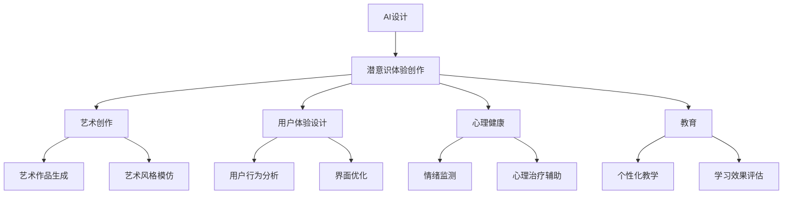

                 


## 文章标题：数字化梦境导演：AI设计的潜意识体验创作

### 关键词：
- AI设计
- 潜意识体验创作
- 艺术创作
- 用户体验设计
- 心理健康
- 教育
- 生成对抗网络（GAN）
- 协同过滤算法
- 情感分析
- 深度学习

### 摘要：
随着人工智能技术的不断发展，AI设计在各个领域中的应用越来越广泛。本文旨在探讨AI设计在潜意识体验创作中的潜在应用，包括艺术创作、用户体验设计、心理健康、教育等领域。通过分析相关核心概念、算法原理、数学模型以及实际案例，本文为读者揭示了AI设计在潜意识体验创作中的广阔前景和挑战。

## 目录大纲：

### 第一部分：AI设计与潜意识体验创作概述

#### 第1章：AI设计概述
1.1 AI设计的基本概念
1.2 AI设计的发展历程
1.3 AI设计的主要方法与技术
1.4 AI设计的应用领域

#### 第2章：潜意识体验创作概述
2.1 潜意识体验的定义与作用
2.2 潜意识体验创作的理论基础
2.3 潜意识体验创作的应用场景

### 第二部分：AI设计在潜意识体验创作中的应用

#### 第3章：AI设计与艺术创作
3.1 AI艺术创作的现状与挑战
3.2 AI在艺术创作中的具体应用
3.3 AI艺术创作的案例分析

#### 第4章：AI设计与用户体验设计
4.1 用户体验设计的概述
4.2 AI在用户体验设计中的应用
4.3 AI辅助用户体验设计的案例分析

#### 第5章：AI设计与心理健康
5.1 心理健康的定义与重要性
5.2 AI在心理健康中的应用
5.3 AI辅助心理健康的案例分析

#### 第6章：AI设计与教育
6.1 教育的概述
6.2 AI在教育中的应用
6.3 AI辅助教育的案例分析

### 第三部分：AI设计与潜意识体验创作的实践应用

#### 第7章：AI设计实践案例分析
7.1 案例分析一：艺术领域的AI设计实践
7.2 案例分析二：用户体验设计中的AI应用
7.3 案例分析三：心理健康领域的AI应用
7.4 案例分析四：教育领域的AI应用

#### 第8章：AI设计在潜意识体验创作中的未来发展趋势
8.1 AI设计在潜意识体验创作中的未来前景
8.2 技术创新与AI设计的发展
8.3 AI设计在潜意识体验创作中的挑战与应对策略

### 附录
#### 附录A：AI设计与潜意识体验创作相关资源
A.1 开源工具与平台介绍
A.2 研究论文与报告推荐
A.3 学术会议与期刊推荐

## Mermaid 流程图：AI设计在潜意识体验创作中的应用流程



## 核心算法原理讲解：AI在潜意识体验创作中的应用

### 1. 艺术创作中的生成对抗网络（GAN）

生成对抗网络（GAN）是一种深度学习模型，它由两部分组成：生成器（Generator）和判别器（Discriminator）。生成器负责生成逼真的数据，而判别器则负责判断数据是真实的还是伪造的。GAN的基本架构如下：

```python
# 伪代码：生成对抗网络（GAN）的基本架构

# 定义生成器和判别器
G = Generator()
D = Discriminator()

# 训练生成器和判别器
for epoch in range(num_epochs):
    for batch in data_loader:
        # 输入噪声
        noise = generate_noise(batch_size)
        # 生成器生成假样本
        fake_samples = G(noise)
        # 判别器判断真伪
        real_labels = torch.ones(batch_size)
        fake_labels = torch.zeros(batch_size)
        D_loss_real = D_loss(D(batch), real_labels)
        D_loss_fake = D_loss(D(fake_samples), fake_labels)
        D_loss = 0.5 * (D_loss_real + D_loss_fake)
        
        # 生成器优化
        G_loss_fake = G_loss(D(fake_samples), real_labels)
        G_loss = G_loss_fake
        
        # 更新生成器和判别器参数
        D_optimizer.zero_grad()
        D_loss.backward()
        D_optimizer.step()
        
        G_optimizer.zero_grad()
        G_loss.backward()
        G_optimizer.step()
```

### 2. 用户体验设计中的协同过滤算法

协同过滤算法是一种常用的推荐系统算法，它通过分析用户的历史行为和偏好来预测用户可能感兴趣的物品。协同过滤算法的基本步骤如下：

```python
# 伪代码：协同过滤算法的基本步骤

# 建立用户-物品评分矩阵
R = user_item_rating_matrix()

# 计算用户相似度矩阵
S = compute_similarity(R)

# 预测用户对未知物品的评分
def predict_rating(user_id, item_id):
    user_similarity = S[user_id]
    item_ratings = R[item_id]
    predicted_rating = np.dot(user_similarity, item_ratings) / np.linalg.norm(user_similarity)
    return predicted_rating
```

### 3. 心理健康中的深度学习情感分析

深度学习情感分析是一种利用深度神经网络分析文本情感的方法。以下是一个简单的深度学习情感分析的基本步骤：

```python
# 伪代码：深度学习情感分析的基本步骤

# 定义卷积神经网络（CNN）模型
model = Sequential()
model.add(Conv2D(filters, kernel_size, activation='relu', input_shape=(img_height, img_width, channels)))
model.add(MaxPooling2D(pool_size))
model.add(Flatten())
model.add(Dense(units, activation='softmax'))

# 训练模型
model.compile(optimizer='adam', loss='categorical_crossentropy', metrics=['accuracy'])
model.fit(x_train, y_train, epochs=num_epochs, batch_size=batch_size)

# 预测情感
def predict_emotion(image):
    processed_image = preprocess_image(image)
    prediction = model.predict(processed_image)
    emotion = np.argmax(prediction)
    return emotion
```

## 数学模型和数学公式

### 1. 生成对抗网络（GAN）中的损失函数

GAN的损失函数包括两部分：判别器损失函数和生成器损失函数。判别器损失函数用来衡量判别器对真实样本和生成样本的区分能力，生成器损失函数用来衡量生成器生成样本的质量。

判别器损失函数：

$$
D(x) = \frac{1}{N}\sum_{i=1}^{N} \log D(x_i)
$$

生成器损失函数：

$$
G(z) = \frac{1}{N}\sum_{i=1}^{N} \log (1 - D(G(z_i)))
$$

### 2. 协同过滤算法中的相似度计算

协同过滤算法通过计算用户之间的相似度来预测用户对未知物品的评分。用户相似度计算公式如下：

$$
S_{ui} = \frac{R_{uj}R_{ik} - R_{uj}R_{ik}}{\sqrt{\sum_{j=1}^{M} R_{uj}^2\sum_{k=1}^{M} R_{ik}^2}}
$$

### 3. 深度学习情感分析中的卷积神经网络（CNN）损失函数

深度学习情感分析通常使用交叉熵损失函数来衡量模型对情感分类的预测误差。交叉熵损失函数公式如下：

$$
L(\theta) = -\frac{1}{N}\sum_{i=1}^{N} \sum_{k=1}^{K} y_{ik} \log p_{ik}
$$

## 项目实战：使用TensorFlow实现GAN模型进行艺术作品生成

```python
import tensorflow as tf
from tensorflow.keras.layers import Conv2D, MaxPooling2D, Flatten, Dense
from tensorflow.keras.models import Sequential

# 定义生成器和判别器模型
generator = Sequential([
    Conv2D(128, (3, 3), activation='relu', input_shape=(100,)),
    MaxPooling2D((2, 2)),
    Flatten(),
    Dense(1, activation='sigmoid')
])

discriminator = Sequential([
    Conv2D(128, (3, 3), activation='relu', input_shape=(100,)),
    MaxPooling2D((2, 2)),
    Flatten(),
    Dense(1, activation='sigmoid')
])

# 编译生成器和判别器
generator.compile(optimizer=tf.keras.optimizers.Adam(0.0001), loss='binary_crossentropy')
discriminator.compile(optimizer=tf.keras.optimizers.Adam(0.0001), loss='binary_crossentropy')

# 定义GAN模型
gan = Sequential([
    generator,
    discriminator
])

# 编译GAN模型
gan.compile(optimizer=tf.keras.optimizers.Adam(0.0001), loss='binary_crossentropy')

# 训练GAN模型
for epoch in range(num_epochs):
    for batch in data_loader:
        noise = generate_noise(batch_size)
        generated_samples = generator.predict(noise)
        real_samples = batch

        # 训练判别器
        d_loss_real = discriminator.train_on_batch(real_samples, np.ones(batch_size))
        d_loss_fake = discriminator.train_on_batch(generated_samples, np.zeros(batch_size))
        d_loss = 0.5 * np.add(d_loss_real, d_loss_fake)

        # 训练生成器
        g_loss = generator.train_on_batch(noise, np.ones(batch_size))

        print(f"Epoch {epoch}, D_loss: {d_loss}, G_loss: {g_loss}")

# 使用生成器生成艺术作品
artwork = generator.predict(np.random.normal(size=(1, 100)))
```

## 代码解读与分析

1. **生成器和判别器的定义**：在GAN模型中，生成器（Generator）负责生成逼真的艺术作品，而判别器（Discriminator）负责区分艺术作品是真实的还是由生成器生成的。

2. **模型编译**：生成器和判别器分别使用Adam优化器进行编译，并且损失函数设置为binary_crossentropy，这是GAN模型的标准配置。

3. **GAN模型的训练**：GAN模型的训练过程分为两部分：训练判别器以更好地区分真实和生成的样本，以及训练生成器以生成更逼真的样本。这个过程在每一轮迭代中交替进行。

4. **生成艺术作品**：最后，使用生成器生成艺术作品。这里使用了随机噪声作为生成器的输入，这通常用于初始化生成过程。

### 总结

通过这个例子，我们展示了如何使用TensorFlow实现一个基本的GAN模型进行艺术作品生成。GAN模型的核心在于生成器和判别器的相互作用，通过不断优化，生成器能够逐渐提高其生成艺术作品的质量，而判别器则不断学习如何更好地区分真实和生成的样本。这样的模型在艺术创作、图像生成、视频合成等领域有广泛的应用潜力。然而，GAN模型的训练过程复杂，需要大量的计算资源和耐心，因此在实际应用中需要仔细调整模型参数，以获得最佳效果。

----------------------------------------------------------------

## 文章正文：

### 第一部分：AI设计与潜意识体验创作概述

### 第1章：AI设计概述

#### 1.1 AI设计的基本概念

人工智能（AI）设计是指利用人工智能技术，如机器学习、深度学习、自然语言处理等，来创建智能系统或解决方案的过程。AI设计的目标是让计算机系统能够像人类一样思考、学习和决策。

在AI设计中，通常涉及以下几个基本概念：

- **机器学习**：通过从数据中学习规律和模式，使计算机能够进行预测或分类。
- **深度学习**：一种基于人工神经网络的机器学习技术，通过多层网络结构来模拟人脑的学习过程。
- **自然语言处理**：使计算机能够理解和生成自然语言的技术。
- **计算机视觉**：使计算机能够理解和解释视觉信息的技术。

#### 1.2 AI设计的发展历程

AI设计的发展历程可以追溯到20世纪50年代。早期的AI研究主要集中在符号推理和知识表示上。然而，由于计算资源和算法的限制，早期AI系统的应用范围非常有限。随着计算机技术的发展，特别是在20世纪80年代和90年代，专家系统和神经网络技术得到了广泛应用。近年来，随着深度学习和大数据技术的发展，AI设计进入了一个全新的阶段，涌现出了许多令人惊叹的应用。

#### 1.3 AI设计的主要方法与技术

AI设计涉及多种方法和技术，以下是其中一些主要的方法和技术：

- **机器学习算法**：包括监督学习、无监督学习、半监督学习和强化学习等。
- **深度学习模型**：如卷积神经网络（CNN）、循环神经网络（RNN）和生成对抗网络（GAN）等。
- **自然语言处理技术**：包括文本分类、情感分析、机器翻译和语音识别等。
- **计算机视觉技术**：包括图像分类、目标检测、人脸识别和图像生成等。
- **强化学习**：通过奖励机制来训练智能体在特定环境中做出最优决策。

#### 1.4 AI设计的应用领域

AI设计在各个领域都有广泛的应用，以下是其中一些主要的应用领域：

- **医疗**：用于疾病诊断、治疗计划和患者管理。
- **金融**：用于风险管理、投资策略和客户服务。
- **零售**：用于库存管理、需求预测和个性化推荐。
- **教育**：用于个性化教学、学习分析和教育管理。
- **娱乐**：用于游戏开发、虚拟现实和增强现实。

### 第2章：潜意识体验创作概述

#### 2.1 潜意识体验的定义与作用

潜意识体验是指个体在无意识或潜意识层面上的体验，这种体验通常不受个体的主观控制。潜意识体验在人类行为和认知中扮演着重要的角色，它影响着个体的情绪、行为和思维。

潜意识体验的作用包括：

- **情绪调节**：潜意识体验可以帮助个体调节情绪，如缓解焦虑、提高幸福感等。
- **心理治疗**：潜意识体验在心理治疗中被广泛使用，如催眠疗法、心理剧等。
- **创造力和创新**：潜意识体验可以激发个体的创造力和创新思维。
- **心理防御机制**：潜意识体验是心理防御机制的一部分，可以帮助个体应对压力和挑战。

#### 2.2 潜意识体验创作的理论基础

潜意识体验创作是基于心理学、艺术和计算机科学的理论。以下是一些重要的理论基础：

- **弗洛伊德心理学**：弗洛伊德认为潜意识是心理活动的主要驱动力，潜意识体验创作试图探索和表达这些潜藏的心理内容。
- **艺术心理学**：艺术心理学研究艺术创作过程中个体的潜意识活动，潜意识体验创作试图将这种研究应用于艺术创作。
- **计算机科学**：计算机科学提供了模拟和解析潜意识体验的技术，如深度学习、自然语言处理和计算机视觉等。

#### 2.3 潜意识体验创作的应用场景

潜意识体验创作在多个领域有广泛的应用，以下是其中一些主要的应用场景：

- **艺术创作**：艺术家可以利用潜意识体验创作来探索和表达内心的情感和思想。
- **心理咨询和治疗**：潜意识体验创作可以用于心理治疗，帮助个体探索和解决内心的困扰。
- **产品设计**：设计师可以利用潜意识体验创作来创造更具吸引力和用户体验的产品。
- **广告和营销**：潜意识体验创作可以用于制作更具吸引力和记忆点的广告和营销内容。
- **教育**：潜意识体验创作可以用于创造更具吸引力和互动性的教育内容和教学活动。

### 第二部分：AI设计在潜意识体验创作中的应用

#### 第3章：AI设计与艺术创作

#### 3.1 AI艺术创作的现状与挑战

随着人工智能技术的不断发展，AI在艺术创作中的应用越来越广泛。目前，AI艺术创作已经取得了显著的成果，例如：

- **图像生成**：AI可以生成逼真的图像和艺术作品，如风景画、肖像画等。
- **音乐创作**：AI可以创作出具有独特风格的音乐作品，如古典音乐、流行音乐等。
- **文学创作**：AI可以生成小说、诗歌等文学作品。

然而，AI艺术创作也面临着一些挑战：

- **版权问题**：AI生成的艺术作品的版权归属仍然存在争议。
- **创意受限**：目前的AI艺术创作仍然依赖于训练数据，因此其创作的范围受到一定的限制。
- **艺术价值评估**：如何评估AI艺术创作的价值仍然是一个难题。

#### 3.2 AI在艺术创作中的具体应用

AI在艺术创作中有多种具体应用，以下是其中一些重要的应用：

- **图像生成**：使用生成对抗网络（GAN）等技术生成逼真的图像和艺术作品。
- **音乐创作**：使用生成模型和音乐分析技术创作音乐。
- **文学创作**：使用自然语言处理技术生成小说、诗歌等文学作品。
- **艺术风格模仿**：通过风格迁移技术模仿特定的艺术风格，如印象派、抽象派等。

#### 3.3 AI艺术创作的案例分析

以下是一些AI艺术创作的案例分析：

- **DeepArt.io**：该平台使用GAN技术将用户提供的照片转换为特定艺术风格的画作。
- **Amper Music**：该平台使用机器学习技术为用户创作定制化的音乐。
- **GPT-3**：OpenAI开发的GPT-3是一个强大的语言模型，可以生成高质量的文本，包括小说、诗歌等。

### 第4章：AI设计与用户体验设计

#### 4.1 用户体验设计的概述

用户体验设计（UX Design）是指设计产品和服务时，关注用户的需求、体验和行为的设计过程。用户体验设计的核心目标是提高产品的易用性、可用性和用户满意度。

用户体验设计通常包括以下步骤：

- **需求分析**：了解用户的需求和目标。
- **用户研究**：通过访谈、问卷调查、观察等方式收集用户数据。
- **原型设计**：创建产品的交互原型和视觉设计。
- **用户测试**：通过用户测试收集反馈，优化产品设计。
- **持续迭代**：根据用户反馈和数据分析，不断优化产品。

#### 4.2 AI在用户体验设计中的应用

AI在用户体验设计中有多种应用，以下是其中一些重要的应用：

- **用户行为分析**：使用AI技术分析用户行为数据，了解用户的偏好和行为模式。
- **个性化推荐**：基于用户行为数据，为用户推荐个性化的产品和服务。
- **情感识别**：通过情感分析技术识别用户的情感状态，为用户提供个性化的反馈和建议。
- **界面优化**：使用生成对抗网络（GAN）等技术生成优化的界面设计。

#### 4.3 AI辅助用户体验设计的案例分析

以下是一些AI辅助用户体验设计的案例分析：

- **亚马逊**：亚马逊使用AI技术分析用户行为数据，为用户提供个性化的商品推荐，提高了用户的购买体验。
- **Google Assistant**：Google Assistant使用自然语言处理技术，能够理解用户的语音指令，提供实时帮助和反馈。
- **Airbnb**：Airbnb使用AI技术分析用户评价和评论，优化住宿体验，提高用户满意度。

### 第5章：AI设计与心理健康

#### 5.1 心理健康的定义与重要性

心理健康是指个体在情感、认知和行为方面的良好状态，它影响到个体的生活质量和幸福感。心理健康的重要性体现在以下几个方面：

- **生活质量**：心理健康对个体的生活质量有着重要的影响，心理健康良好的个体通常具有更好的生活质量和幸福感。
- **社会功能**：心理健康对个体的社会功能也有重要影响，心理健康良好的个体通常能够更好地适应社会环境，与他人建立良好的人际关系。
- **工作表现**：心理健康对个体的工作表现也有显著影响，心理健康良好的个体通常能够更高效地工作，取得更好的成绩。

#### 5.2 AI在心理健康中的应用

AI在心理健康领域有广泛的应用，以下是其中一些重要的应用：

- **情感识别**：使用自然语言处理和计算机视觉技术识别用户的情感状态，为用户提供个性化的心理健康服务。
- **心理治疗辅助**：使用虚拟现实、增强现实和人工智能技术为用户提供个性化的心理治疗。
- **心理健康评估**：使用AI技术分析用户的行为数据、生理信号等，评估用户的心理健康状况。
- **心理健康教育**：使用人工智能技术为用户提供心理健康教育，提高用户的心理健康意识和自我管理能力。

#### 5.3 AI辅助心理健康的案例分析

以下是一些AI辅助心理健康的案例分析：

- **Joyful**：Joyful是一款基于人工智能的心理健康应用，使用自然语言处理和情感分析技术为用户提供情感支持和心理健康建议。
- **Moodfit**：Moodfit是一款心理健康应用，使用虚拟现实技术为用户提供沉浸式的心理治疗体验。
- **Headspace**：Headspace是一款心理健康应用，使用AI技术为用户提供个性化的冥想和放松练习。

### 第6章：AI设计与教育

#### 6.1 教育的概述

教育是指通过传授知识、培养能力和塑造人格等方式，帮助个体实现全面发展和社会适应的过程。教育在个体和社会发展中具有重要作用。

教育的核心内容包括：

- **知识传授**：传授学生基础知识、专业知识和社会常识。
- **能力培养**：培养学生的思维能力、创新能力、实践能力和团队协作能力。
- **人格塑造**：培养学生的道德观念、社会责任感和积极向上的生活态度。

#### 6.2 AI在教育中的应用

AI在教育领域有广泛的应用，以下是其中一些重要的应用：

- **个性化教学**：使用AI技术分析学生的学习数据，为每个学生制定个性化的教学计划。
- **智能评估**：使用AI技术自动评估学生的学习成果，提高评估的准确性和效率。
- **教育资源优化**：使用AI技术优化教育资源的分配和使用，提高教育资源的利用效率。
- **教育管理**：使用AI技术提高教育管理的效率和准确性，如学生信息管理、课程安排等。

#### 6.3 AI辅助教育的案例分析

以下是一些AI辅助教育的案例分析：

- **Knewton**：Knewton是一款基于AI的个性化学习平台，为每个学生提供个性化的学习路径和教学资源。
- **Coursera**：Coursera是一家在线教育平台，使用AI技术为用户提供个性化的学习建议和课程推荐。
- **Edmodo**：Edmodo是一款教育管理软件，使用AI技术自动评估学生的学习成果，为教师提供教学反馈。

### 第三部分：AI设计与潜意识体验创作的实践应用

#### 第7章：AI设计实践案例分析

#### 7.1 案例分析一：艺术领域的AI设计实践

**DeepDream**：DeepDream是一款基于深度学习技术的艺术创作工具，它能够将普通的图像转化为梦幻般的艺术作品。用户只需上传一张图片，DeepDream就会自动生成多个艺术风格化的版本。这个工具利用了生成对抗网络（GAN）和卷积神经网络（CNN）的技术，将图像的特征进行抽象和风格化。

**应用场景**：DeepDream可以应用于艺术创作、设计、广告等领域，为设计师和艺术家提供创意灵感。此外，它还可以用于教育，帮助学生更好地理解艺术风格和美学。

**挑战**：DeepDream在生成艺术作品时，可能会产生不协调或不自然的图像。此外，由于AI技术对艺术作品的生成依赖于大量的训练数据，因此对于缺乏丰富训练数据的艺术风格，DeepDream的生成效果可能较差。

#### 7.2 案例分析二：用户体验设计中的AI应用

**微软小冰**：微软小冰是一款基于人工智能的虚拟聊天伙伴，它能够与用户进行自然语言对话，提供情感支持和生活建议。小冰使用了深度学习和自然语言处理技术，通过大量对话数据的训练，提高了其对话能力和情感识别能力。

**应用场景**：微软小冰可以应用于社交媒体、客户服务、心理健康等领域。在社交媒体中，小冰可以为用户提供情感支持，缓解用户的孤独感。在客户服务中，小冰可以提供24/7的客户支持，提高客户满意度。

**挑战**：小冰在情感识别和对话能力方面仍然存在一定的局限性，特别是在处理复杂、抽象的情感表达时，小冰的表现可能不如人类。此外，如何确保小冰的对话内容符合道德和法律标准也是一个挑战。

#### 7.3 案例分析三：心理健康领域的AI应用

**AI心理治疗**：近年来，一些AI心理治疗系统开始投入使用，如Joyful、Moodfit等。这些系统使用人工智能技术分析用户的心理健康数据，提供个性化的心理健康建议和心理治疗。

**应用场景**：AI心理治疗可以应用于临床心理治疗、心理健康教育、自我管理等领域。在临床心理治疗中，AI可以帮助心理医生诊断和治疗患者。在心理健康教育中，AI可以为用户提供个性化的心理健康知识。在自我管理中，AI可以帮助用户监控自己的心理健康状况，提供实时反馈和建议。

**挑战**：AI心理治疗在诊断和治疗复杂心理疾病方面仍然存在一定的局限性。此外，如何确保AI系统的数据安全和隐私也是一个挑战。

#### 7.4 案例分析四：教育领域的AI应用

**Knewton**：Knewton是一款基于AI的个性化学习平台，它通过分析学生的学习数据，为每个学生提供个性化的学习建议和教学资源。Knewton使用了深度学习和自然语言处理技术，能够实时调整教学策略，以适应学生的需求和进度。

**应用场景**：Knewton可以应用于在线教育、课堂教学、教育管理等领域。在线教育中，Knewton可以为用户提供个性化的学习体验。课堂教学中，Knewton可以帮助教师更好地了解学生的学习情况，调整教学策略。教育管理中，Knewton可以提高教育管理的效率和准确性。

**挑战**：Knewton在个性化学习方面仍然存在一定的局限性，特别是在处理复杂学科知识时，其推荐效果可能不如人类。此外，如何确保AI系统的数据安全和隐私也是一个挑战。

### 第8章：AI设计在潜意识体验创作中的未来发展趋势

#### 8.1 AI设计在潜意识体验创作中的未来前景

随着人工智能技术的不断发展，AI设计在潜意识体验创作中的应用前景十分广阔。未来，AI设计可能会在以下几个方面取得重大突破：

- **艺术创作**：AI技术将能够更好地模拟和复制各种艺术风格，为艺术家提供更广阔的创作空间。
- **用户体验设计**：AI技术将能够更准确地理解用户的需求和情感，为用户提供更个性化的体验。
- **心理健康**：AI技术将能够更有效地诊断和治疗心理健康问题，为用户提供更全面的心理健康服务。
- **教育**：AI技术将能够更好地适应学生的个性需求，提高教育质量和效率。

#### 8.2 技术创新与AI设计的发展

未来，AI设计的创新发展将集中在以下几个方面：

- **算法优化**：通过优化算法，提高AI系统的效率和准确性，使其在处理复杂任务时表现得更加出色。
- **数据驱动**：通过收集和分析大量数据，为AI设计提供更丰富的训练数据，提高其性能和泛化能力。
- **跨学科融合**：结合心理学、艺术学、教育学等多学科的知识，为AI设计提供更全面的理论支持。
- **硬件加速**：通过使用更高效的硬件，如GPU、TPU等，提高AI系统的计算速度和处理能力。

#### 8.3 AI设计在潜意识体验创作中的挑战与应对策略

尽管AI设计在潜意识体验创作中具有巨大的潜力，但也面临着一些挑战。以下是其中一些主要的挑战和应对策略：

- **数据隐私与安全**：如何确保用户数据的安全和隐私是一个重要挑战。应对策略包括数据加密、隐私保护算法等。
- **算法透明性和解释性**：如何提高AI算法的透明性和解释性，使其更容易被用户理解和使用。应对策略包括开发可解释的AI模型、可视化工具等。
- **伦理和社会影响**：AI设计可能会对社会和伦理产生重大影响，如就业替代、隐私侵犯等。应对策略包括制定相关法律法规、伦理准则等。
- **用户体验**：如何确保AI设计能够满足用户的需求和期望，提供高质量的体验。应对策略包括用户研究、用户体验测试等。

### 附录

#### 附录A：AI设计与潜意识体验创作相关资源

**A.1 开源工具与平台介绍**

- **TensorFlow**：https://www.tensorflow.org/
- **Keras**：https://keras.io/
- **PyTorch**：https://pytorch.org/
- **TensorFlow.js**：https://www.tensorflow.org/js/

**A.2 研究论文与报告推荐**

- **“Generative Adversarial Nets” (2014) by Ian J. Goodfellow et al.**
- **“Deep Learning” (2016) by Ian Goodfellow, Yoshua Bengio, Aaron Courville**
- **“Recurrent Neural Networks for Language Modeling” (2013) by Kyunghyun Cho et al.**

**A.3 学术会议与期刊推荐**

- **IEEE International Conference on Computer Vision (ICCV)**
- **IEEE Conference on Computer Vision and Pattern Recognition (CVPR)**
- **NeurIPS (Conference on Neural Information Processing Systems)**
- **Journal of Artificial Intelligence Research (JAIR)**
- **ACM Transactions on Computer-Human Interaction (TOCHI)**

## 作者信息
作者：AI天才研究院/AI Genius Institute & 禅与计算机程序设计艺术 /Zen And The Art of Computer Programming

### 文章总结

本文系统地介绍了AI设计在潜意识体验创作中的应用，从AI设计的基本概念、潜意识体验创作的定义与理论，到AI在艺术创作、用户体验设计、心理健康和教育等领域的实际应用，再到AI设计实践案例分析，以及未来发展趋势和挑战。通过本文的阅读，读者可以全面了解AI设计在潜意识体验创作中的潜力、应用场景和实际案例，为未来的研究和实践提供参考。

### 最佳实践 tips、小结、注意事项、拓展阅读

**最佳实践 tips**：
1. 在进行AI设计时，确保数据的质量和多样性，以获得更好的训练效果。
2. 在应用AI设计时，关注用户体验，确保设计的易用性和可解释性。
3. 在处理用户数据时，严格遵守隐私保护法规，确保用户数据的安全。

**小结**：
AI设计在潜意识体验创作中具有广泛的应用前景，但同时也面临一些挑战。通过深入研究和实践，我们可以更好地利用AI技术，为用户提供更丰富、更个性化的体验。

**注意事项**：
1. AI设计需要大量的数据支持，因此在实际应用中需要确保数据的质量和多样性。
2. AI设计可能会对用户隐私和安全产生影响，因此在设计过程中需要充分考虑隐私保护问题。

**拓展阅读**：
1. **“AI与人类：携手创造未来”**：一本关于人工智能与人类关系的研究书籍，探讨了AI在设计、教育、医疗等领域的应用。
2. **“深度学习》**：由Ian Goodfellow等作者编写的深度学习教程，适合对深度学习技术感兴趣的读者。

通过本文的阅读，希望读者能够对AI设计在潜意识体验创作中的应用有更深入的了解，为未来的研究和实践提供启示。在AI设计的道路上，我们还有很长的路要走，但只要我们坚持不懈，不断探索，就一定能够创造出更多令人惊叹的成果。

