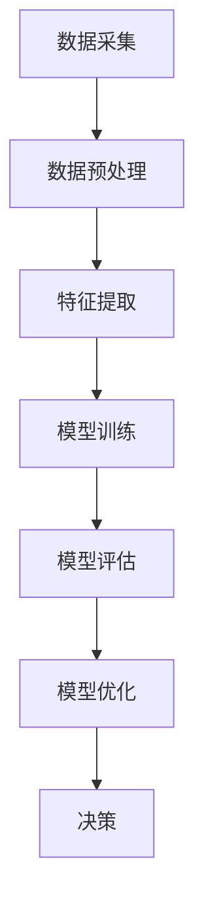

                 

### 文章标题

### 数字化直觉：AI辅助的潜意识决策

#### 关键词：
- AI辅助决策
- 直觉决策
- 潜意识
- 深度学习
- 商业应用

#### 摘要：
本文深入探讨了AI辅助直觉决策的概念及其重要性。首先，我们介绍了AI与直觉决策的背景，阐述了直觉决策与潜意识的关系。接着，我们详细分析了AI辅助直觉决策的优势及其在商业、管理和创意决策中的应用。随后，我们讨论了AI辅助直觉决策的核心原理，包括潜意识决策的理论基础和AI技术的支持。在此基础上，我们重点探讨了直觉决策的核心算法原理，以及深度学习在直觉决策中的应用。文章随后通过具体案例分析，展示了AI辅助直觉决策在实际应用中的效果。最后，我们展望了AI辅助直觉决策的未来发展趋势，并总结了全文的关键点和未来研究方向。通过本文，读者将全面了解AI辅助直觉决策的原理、方法及其广泛的应用前景。

### 第一部分：AI与直觉决策概述

#### 第1章：AI与直觉决策的融合

##### 1.1 AI与直觉决策的背景

近年来，人工智能（AI）技术取得了飞速发展，成为推动社会进步的重要力量。从早期的专家系统，到如今的深度学习与强化学习，AI技术的应用范围不断扩大，涵盖了从医疗、金融到制造、交通等多个领域。随着计算能力的提升和数据量的爆炸性增长，AI模型在复杂问题求解、决策支持等方面的优势愈加凸显。

直觉决策作为一种高效、迅速的决策方式，在人类日常生活中扮演着重要角色。直觉决策依赖于个体的经验、知识和潜意识，能够在面对复杂、多变的环境时快速做出决策。然而，直觉决策也具有一定的局限性，如容易受到情绪、心理状态等因素的影响，且难以量化。

##### 1.2 直觉决策与潜意识的关系

直觉决策与潜意识密切相关。潜意识是人类心理活动中不自觉地产生的部分，包括情感、记忆、本能反应等。潜意识决策是指在无意识中进行的决策过程，通常是基于过去的经验、情感和价值观，而不是通过逻辑推理或显意识思考。

研究表明，潜意识在直觉决策中起着关键作用。许多快速决策，如判断他人情绪、预测运动轨迹等，都是潜意识在发挥作用。直觉决策的快速性和高效性，使得潜意识成为决策过程中的重要因素。

##### 1.3 AI辅助直觉决策的优势

AI辅助直觉决策能够弥补直觉决策的局限性，提升决策的速度和准确性。首先，AI技术能够处理大量数据，从数据中发现隐藏的模式和规律，为直觉决策提供更丰富的信息支持。其次，AI模型通过机器学习和深度学习技术，可以不断优化和调整决策模型，使其更加适应特定场景和任务。

具体来说，AI辅助直觉决策的优势体现在以下几个方面：

1. **提高决策速度**：AI技术能够快速处理和分析数据，缩短决策时间，提高决策效率。在商业、管理等领域，快速决策往往意味着抓住市场机遇或避免潜在风险。
   
2. **增强决策准确性**：通过学习大量历史数据和实时信息，AI模型能够提供更准确、可靠的决策建议。在医疗、金融等领域，准确的决策能够显著降低错误率，提高治疗效果和投资收益。

3. **降低决策成本**：直觉决策往往依赖于专家的经验和知识，成本较高。而AI辅助直觉决策可以降低对专家依赖，节省人力成本。

4. **适应性和灵活性**：AI模型可以根据不同场景和任务进行定制化，适应各种复杂环境。直觉决策则通常局限于特定的经验和知识领域，难以适应多变的环境。

##### 1.4 AI辅助直觉决策的应用领域

AI辅助直觉决策在多个领域都有广泛的应用前景，包括但不限于以下方面：

1. **商业决策**：在市场营销、供应链管理、客户关系管理等领域，AI辅助直觉决策能够帮助企业快速响应市场变化，优化决策过程，提高运营效率。

2. **管理决策**：在组织优化、人力资源管理、风险管理等方面，AI辅助直觉决策能够为管理层提供科学、准确的决策支持，提高管理效能。

3. **创意决策**：在艺术创作、设计创新、科学研究等领域，AI辅助直觉决策能够帮助创作者发现灵感，提高创作效率和质量。

通过上述分析，我们可以看出，AI辅助直觉决策不仅在理论上具有重要意义，而且在实际应用中也展现了巨大的潜力。在接下来的章节中，我们将深入探讨AI辅助直觉决策的核心原理和算法，进一步揭示其技术内涵和应用价值。

#### 第2章：AI辅助直觉决策的核心原理

##### 2.1 潜意识决策的理论基础

潜意识决策的理论基础源于心理学和认知科学的研究。潜意识是人类心理活动中不自觉的部分，包括情感、记忆、本能反应等。心理学研究表明，潜意识在人类决策过程中扮演着重要角色，许多快速决策都是潜意识在发挥作用。例如，当人们看到危险信号时，会迅速做出逃避反应，这种反应是潜意识在瞬间评估环境和自身安全后做出的决策。

认知科学进一步探讨了潜意识与意识的关系。意识是人类对自身心理活动的觉知，而潜意识则是隐藏在意识之下的心理活动。两者之间存在着复杂而紧密的联系。潜意识可以通过情绪、记忆等方式影响意识，而意识则可以通过思考和反思来调整和优化潜意识。

在潜意识决策的理论基础上，心理学和认知科学为AI辅助直觉决策提供了重要的参考。通过理解和模拟潜意识的工作机制，AI模型可以更好地捕捉和处理人类直觉决策的内在逻辑，从而提高决策的准确性和效率。

##### 2.2 AI技术支持直觉决策

AI技术，尤其是机器学习和深度学习，为直觉决策提供了强大的支持。机器学习是一种通过数据驱动的方式，让计算机自动学习和改进的方法。在直觉决策中，机器学习模型可以分析大量历史数据和实时信息，发现数据中的规律和模式，从而为决策提供支持。

深度学习是机器学习的一个分支，通过模拟人脑神经网络的工作原理，深度学习模型能够处理更复杂的数据和任务。在直觉决策中，深度学习模型可以捕捉到数据中的非线性关系和复杂特征，从而提供更精准的决策建议。

具体来说，AI技术支持直觉决策的方式主要有以下几个方面：

1. **数据分析**：通过数据挖掘和统计分析，AI模型可以从大量数据中提取有价值的信息。这些信息可以作为直觉决策的依据，帮助决策者快速做出决策。

2. **机器学习模型**：机器学习模型可以通过学习历史数据和实时信息，建立决策模型。这些模型可以用于预测市场趋势、评估风险、推荐产品等。

3. **深度学习模型**：深度学习模型通过模拟人脑神经网络，能够处理更复杂的数据和任务。在直觉决策中，深度学习模型可以用于情感分析、视觉识别、文本分析等，为决策提供更丰富的信息。

4. **数据驱动的优化**：AI模型可以通过不断学习和优化，提高决策的准确性和效率。例如，通过实时反馈和调整，AI模型可以不断适应新的环境和任务，提供更个性化的决策支持。

##### 2.3 AI与直觉决策的融合

AI与直觉决策的融合，旨在通过人工智能技术增强和优化人类直觉决策。实现这一目标的关键在于如何将AI模型与人类直觉有效地结合起来，形成一个高效、可靠的决策系统。

首先，需要采集和预处理大量的直觉数据。这些数据可以来自个人的经验记录、情感表达、行为数据等。通过数据挖掘和清洗，提取出有价值的信息，为AI模型提供训练数据。

其次，需要构建一个多层次的直觉决策模型。这个模型可以分为以下几个层次：

1. **数据采集层**：负责采集和预处理直觉数据，包括情感分析、行为记录等。
2. **特征提取层**：通过数据挖掘和统计分析，提取出关键特征，为决策提供支持。
3. **决策层**：利用机器学习模型和深度学习模型，对特征进行分类、预测等操作，生成决策建议。
4. **反馈层**：根据决策结果和实时反馈，对模型进行优化和调整，提高决策的准确性和效率。

在这个过程中，AI模型与人类直觉相互作用，共同完成决策过程。人类直觉提供初步判断和经验，AI模型则通过数据分析和技术手段，对直觉进行验证和优化。这种多层次的融合方式，能够充分发挥AI和直觉的优势，提高决策的准确性和效率。

##### 2.4 直觉决策模型训练与优化

直觉决策模型的训练与优化是AI辅助直觉决策的核心环节。一个高效的直觉决策模型需要经过充分的训练和优化，才能在复杂环境中稳定地工作。

首先，数据采集是训练直觉决策模型的基础。需要采集大量的直觉数据，包括情感数据、行为数据、历史决策数据等。这些数据需要经过预处理，去除噪声和异常值，确保数据质量。

其次，特征提取是关键步骤。通过数据挖掘和统计分析，提取出关键特征，为决策提供支持。这些特征可以是情感指标、行为指标、环境因素等，根据具体应用场景进行选择。

然后，模型训练是核心环节。使用机器学习模型和深度学习模型，对特征进行训练，建立决策模型。常用的模型包括线性模型、非线性模型、神经网络等。通过训练，模型可以学习到数据的内在规律和模式，从而生成决策建议。

最后，模型优化是提升决策准确性和效率的重要手段。通过不断调整模型参数，优化模型结构，提高模型的预测能力。常用的优化方法包括交叉验证、网格搜索、贝叶斯优化等。

在模型训练与优化的过程中，需要不断进行评估和调试。使用测试数据集对模型进行评估，检测模型的准确性和稳定性。根据评估结果，对模型进行进一步优化和调整，确保模型在复杂环境中能够稳定工作。

通过上述步骤，我们可以构建一个高效的直觉决策模型，实现AI辅助直觉决策。在实际应用中，这个模型可以根据具体场景和任务进行定制化，提供个性化、可靠的决策支持。

### 第二部分：AI辅助直觉决策的算法原理

#### 第3章：直觉决策的核心算法

##### 3.1 直觉决策的算法框架

直觉决策的算法框架包括数据采集、特征提取、模型构建和模型优化等关键步骤。每个步骤都有其独特的功能和意义，共同构成了一个完整的直觉决策系统。

1. **数据采集**：这是整个算法框架的基础。通过多种途径采集与直觉决策相关的数据，包括情感数据、行为数据、历史决策数据等。这些数据可以来源于用户行为日志、社交媒体互动、生理信号等。数据采集的质量直接影响后续特征提取和模型构建的效果。

2. **特征提取**：在数据采集之后，需要对数据进行预处理和特征提取。这一步骤旨在从原始数据中提取出对决策有重要影响的特征。特征可以是情感强度、行为模式、历史数据等。通过数据挖掘和统计分析，可以提取出关键特征，为模型构建提供支持。

3. **模型构建**：这是直觉决策算法的核心步骤。利用机器学习和深度学习技术，构建一个能够处理和预测直觉决策的模型。常用的模型包括线性模型、非线性模型、神经网络等。通过训练模型，使其能够根据输入的特征生成合理的决策。

4. **模型优化**：模型构建完成后，需要进行优化。通过调整模型参数、优化模型结构，提高模型的预测能力和稳定性。常用的优化方法包括交叉验证、网格搜索、贝叶斯优化等。模型优化是提升决策准确性和效率的重要手段。

5. **模型评估**：在模型优化之后，需要对模型进行评估。使用测试数据集对模型进行评估，检测模型的准确性和稳定性。根据评估结果，对模型进行进一步优化和调整，确保模型在复杂环境中能够稳定工作。

##### 3.2 数据采集与预处理

数据采集是直觉决策算法的基础。为了确保数据的质量和可靠性，需要采取一系列预处理措施。以下是一些常见的数据采集与预处理步骤：

1. **数据来源**：数据可以来源于多个渠道，包括用户行为日志、社交媒体互动、传感器数据、问卷调查等。不同来源的数据有不同的特性和质量，需要根据实际需求进行选择。

2. **数据清洗**：在数据采集过程中，可能会出现缺失值、异常值和噪声。通过数据清洗，可以去除这些不良数据，提高数据质量。常用的数据清洗方法包括缺失值填充、异常值检测和去除、噪声过滤等。

3. **数据归一化**：不同特征的数据可能具有不同的量纲和范围，为了统一特征空间，需要将数据归一化。常用的归一化方法包括最小-最大归一化、标准化、对数变换等。

4. **特征选择**：在大量特征中，有些特征对决策贡献较大，而有些特征则可能无关紧要。通过特征选择，可以剔除冗余特征，提高模型的效率和准确性。常用的特征选择方法包括基于信息论的 feature importance、基于统计的 t-test 等。

##### 3.3 机器学习模型构建

机器学习模型是直觉决策的核心组成部分。通过训练机器学习模型，可以使计算机根据输入的特征预测直觉决策结果。以下是构建机器学习模型的关键步骤：

1. **模型选择**：根据直觉决策的特点和数据分布，选择合适的机器学习模型。常用的模型包括线性回归、逻辑回归、决策树、随机森林、支持向量机等。

2. **特征工程**：在构建模型之前，需要对特征进行工程处理。这包括特征提取、特征转换、特征组合等操作。通过特征工程，可以增强模型的预测能力。

3. **模型训练**：使用训练数据集对机器学习模型进行训练。通过调整模型参数，使模型能够更好地拟合训练数据。常用的训练方法包括梯度下降、随机梯度下降等。

4. **模型评估**：在模型训练完成后，使用测试数据集对模型进行评估。常用的评估指标包括准确率、召回率、F1 分数等。通过评估，可以判断模型的性能和稳定性。

##### 3.4 模型优化与评估

模型优化是提高直觉决策模型性能的关键步骤。通过调整模型参数、优化模型结构，可以提升模型的预测能力和稳定性。以下是模型优化与评估的关键步骤：

1. **参数调优**：通过网格搜索、随机搜索、贝叶斯优化等方法，调整模型参数，寻找最优参数组合。参数调优可以显著提升模型的性能。

2. **模型选择**：根据测试数据集的评估结果，选择最优的模型。常用的模型选择方法包括交叉验证、ROC-AUC 曲线等。

3. **模型评估**：使用测试数据集对优化后的模型进行评估，验证模型的稳定性和准确性。通过评估，可以判断模型在实际应用中的性能。

4. **模型部署**：将优化后的模型部署到生产环境中，为实际应用提供决策支持。在模型部署过程中，需要考虑模型的实时性、可扩展性、可靠性等因素。

通过以上步骤，我们可以构建一个高效、可靠的直觉决策模型，实现 AI 辅助直觉决策。在实际应用中，需要根据具体场景和任务，对模型进行调整和优化，确保其能够稳定、准确地工作。

#### 第4章：深度学习与直觉决策

##### 4.1 深度学习基础

深度学习是一种基于多层神经网络的机器学习方法，通过模拟人脑神经网络的结构和功能，对复杂的数据进行建模和预测。深度学习的基础包括神经网络、卷积神经网络（CNN）和循环神经网络（RNN）。

1. **神经网络**：神经网络（Neural Networks，NN）是深度学习的基础。它由多个神经元（节点）组成，每个神经元接收多个输入，通过加权求和后加上偏置项，再通过激活函数输出一个值。常见的激活函数包括 sigmoid、ReLU 等。

2. **卷积神经网络（CNN）**：卷积神经网络（Convolutional Neural Networks，CNN）主要用于处理图像数据。它通过卷积层、池化层和全连接层等结构，对图像进行特征提取和分类。卷积层利用卷积操作提取图像特征，池化层用于降低特征图的维度，全连接层则用于分类。

3. **循环神经网络（RNN）**：循环神经网络（Recurrent Neural Networks，RNN）主要用于处理序列数据。它通过循环结构，将前一时间步的输出作为下一时间步的输入，从而实现序列建模。常见的 RNN 模型包括 LSTM（Long Short-Term Memory）和 GRU（Gated Recurrent Unit）。

##### 4.2 深度学习在直觉决策中的应用

深度学习在直觉决策中具有重要的应用价值。通过深度学习模型，可以更好地捕捉和表示人类直觉决策中的复杂模式和特征。以下是深度学习在直觉决策中的一些应用：

1. **文本分析**：深度学习模型可以用于情感分析、主题分类、文本生成等任务。例如，通过训练 LSTM 或 BERT 模型，可以提取文本中的情感特征，用于预测用户的情绪和行为。

2. **视觉识别**：深度学习模型可以用于图像分类、目标检测、人脸识别等任务。例如，通过训练 CNN 模型，可以识别图像中的物体和场景，为直觉决策提供视觉支持。

3. **声音分析**：深度学习模型可以用于语音识别、情感分析、语音合成等任务。例如，通过训练 RNN 或 Transformer 模型，可以识别语音中的情感和意图，为直觉决策提供听觉支持。

##### 4.3 深度学习模型训练与优化

深度学习模型的训练和优化是直觉决策的关键步骤。以下是一些常见的训练和优化方法：

1. **数据预处理**：在训练深度学习模型之前，需要对数据进行预处理。这包括数据清洗、归一化、数据增强等操作。通过数据预处理，可以增强模型的泛化能力和鲁棒性。

2. **损失函数**：损失函数是评估模型预测结果的重要指标。常见的损失函数包括均方误差（MSE）、交叉熵损失（Cross-Entropy Loss）等。通过优化损失函数，可以调整模型参数，使模型更好地拟合训练数据。

3. **优化算法**：优化算法用于调整模型参数，使模型性能达到最优。常见的优化算法包括梯度下降（Gradient Descent）、Adam 等。通过优化算法，可以加速模型的收敛速度，提高模型性能。

4. **模型评估**：在模型训练完成后，需要使用测试数据集对模型进行评估。常用的评估指标包括准确率、召回率、F1 分数等。通过评估，可以判断模型的性能和稳定性。

5. **模型调参**：在模型训练和优化过程中，需要对模型参数进行调整。常用的调参方法包括网格搜索、随机搜索、贝叶斯优化等。通过调参，可以找到最优的模型参数，提高模型性能。

通过深度学习模型的训练和优化，我们可以构建一个高效、可靠的直觉决策系统，为实际应用提供决策支持。在实际应用中，需要根据具体场景和任务，对模型进行调整和优化，确保其能够稳定、准确地工作。

#### 第5章：商业决策中的应用

##### 5.1 商业决策的特点

商业决策在企业运营和管理中占据着核心地位，其特点主要体现在以下几个方面：

1. **复杂性**：商业决策往往涉及多个因素，如市场需求、竞争态势、供应链管理、人力资源等。这些因素相互作用，使得商业决策变得复杂。

2. **不确定性**：商业环境瞬息万变，市场动态、政策变化、技术进步等都可能影响企业的运营和决策。这种不确定性增加了商业决策的难度。

3. **快速性**：在竞争激烈的市场环境中，企业需要快速响应市场变化，制定有效的决策策略。快速决策可以抓住市场机遇，避免潜在风险。

4. **数据驱动力**：现代商业决策越来越依赖于数据。企业通过数据分析，获取市场洞察，支持决策制定。数据驱动的商业决策能够提高决策的准确性和效率。

##### 5.2 AI辅助商业决策的案例

AI技术在商业决策中的应用已经取得了显著成果，以下是一些具体的案例：

1. **市场预测**：通过AI模型，企业可以对市场需求进行预测，优化库存管理，降低库存成本。例如，某电商平台利用深度学习模型预测商品销量，实现了库存优化和销售增长。

2. **客户细分**：AI技术可以帮助企业进行客户细分，了解不同客户群体的特征和需求，提供个性化的营销和服务。例如，某金融机构利用机器学习模型对客户进行细分，实现了精准营销和客户关系管理。

3. **产品推荐**：AI模型可以用于产品推荐，提高用户体验和满意度。例如，某在线购物平台利用协同过滤算法和深度学习模型，为用户推荐感兴趣的商品，提升了用户购买率和平台销售额。

##### 5.3 商业决策中的直觉与AI的结合

在商业决策中，直觉和AI的结合能够发挥各自的优势，提高决策的质量和效率。以下是如何实现直觉与AI的结合：

1. **直觉决策模型构建**：企业可以基于员工和管理层的直觉，构建直觉决策模型。通过数据采集和分析，提取关键特征，利用机器学习算法训练模型，使模型能够模仿直觉决策。

2. **直觉数据与AI数据的融合**：在决策过程中，将直觉数据和AI数据相结合，形成综合决策依据。例如，企业可以通过员工反馈和市场调研数据，与AI模型预测结果相结合，制定更加科学和有效的决策。

3. **动态调整与优化**：商业环境变化迅速，企业需要根据实时数据动态调整决策模型。通过持续的数据收集和模型优化，使决策模型能够适应环境变化，提高决策的准确性和可靠性。

4. **跨部门协作**：在商业决策过程中，不同部门可以发挥各自的专业优势，共同参与决策。通过跨部门协作，整合不同领域的知识和经验，形成更加全面和深入的决策分析。

通过直觉与AI的结合，企业可以实现更加科学、高效的商业决策，提高市场竞争力和运营效率。在实际应用中，企业需要不断探索和实践，将直觉和AI技术有机结合，为企业的长期发展提供有力支持。

#### 第6章：管理决策中的应用

##### 6.1 管理决策的特点

管理决策在企业运营中具有战略性和全局性的特点，主要体现在以下几个方面：

1. **战略性**：管理决策涉及企业的长期目标和战略规划，如市场扩张、产品开发、组织变革等。这些决策对企业的发展和竞争力具有重要影响。

2. **协调性**：管理决策需要协调企业内部各个部门和资源，确保各部门协同工作，实现整体目标。这包括人力资源配置、财务管理、项目管理等。

3. **可持续性**：管理决策需要考虑企业的长期发展，确保决策不仅能够解决当前问题，还能够支持企业的可持续发展。

4. **风险性**：管理决策往往面临不确定性和风险。在复杂多变的商业环境中，管理者需要评估潜在风险，制定风险应对策略。

##### 6.2 AI辅助管理决策的案例

AI技术在管理决策中的应用已经取得了显著成果，以下是一些具体的案例：

1. **组织优化**：通过AI技术，企业可以对组织结构进行优化，提高管理效率。例如，利用机器学习模型分析员工绩效和技能，优化人力资源配置，提高组织效能。

2. **人力资源管理**：AI技术可以帮助企业进行招聘、培训、绩效评估等人力资源管理工作。例如，通过自然语言处理技术，自动筛选简历，提高招聘效率；利用数据分析技术，评估员工绩效和培训需求，提升人力资源管理水平。

3. **风险管理**：AI技术可以用于风险识别、评估和监控。例如，通过大数据分析，预测市场风险和信用风险，提前采取应对措施；利用机器学习模型，监控企业运营过程中的潜在风险，提高风险管理的精度和效率。

##### 6.3 管理决策中的直觉与AI的结合

在管理决策中，直觉和AI的结合能够发挥各自的优势，提高决策的科学性和准确性。以下是如何实现直觉与AI的结合：

1. **直觉决策模型构建**：管理者可以根据自身经验和直觉，构建直觉决策模型。通过数据采集和分析，提取关键特征，利用机器学习算法训练模型，使模型能够模拟直觉决策。

2. **直觉数据与AI数据的融合**：在管理决策过程中，将直觉数据和AI数据相结合，形成综合决策依据。例如，管理者可以通过市场调研、员工反馈等直觉数据，与AI模型预测结果相结合，制定更加科学和有效的决策。

3. **动态调整与优化**：商业环境变化迅速，管理者需要根据实时数据动态调整决策模型。通过持续的数据收集和模型优化，使决策模型能够适应环境变化，提高决策的准确性和可靠性。

4. **跨部门协作**：在管理决策过程中，不同部门可以发挥各自的专业优势，共同参与决策。通过跨部门协作，整合不同领域的知识和经验，形成更加全面和深入的决策分析。

通过直觉与AI的结合，企业可以实现更加科学、高效的管理决策，提高市场竞争力和运营效率。在实际应用中，企业需要不断探索和实践，将直觉和AI技术有机结合，为企业的长期发展提供有力支持。

#### 第7章：创意决策中的应用

##### 7.1 创意决策的特点

创意决策在企业发展和个人创作中具有重要地位，其特点主要体现在以下几个方面：

1. **创新性**：创意决策涉及创新思维和创造力，旨在提出新颖的解决方案和创意。创新性是创意决策的核心，要求决策者具备独特的视角和创造力。

2. **不确定性**：创意决策往往面临高度不确定性，因为创新的过程本质上是不确定的，很难预测最终结果。这种不确定性要求决策者具备勇气和耐心，接受失败并从中学习。

3. **灵活性**：创意决策需要灵活应对变化，适应不同情境和需求。灵活性使得决策者能够迅速调整策略，实现创意目标。

4. **主观性**：创意决策受到个人价值观、文化背景和个人经验的影响，具有强烈的个体主观性。这种主观性使得创意决策具有独特性和多样性。

##### 7.2 AI辅助创意决策的案例

AI技术在创意决策中的应用，为创意生成和优化提供了强大支持，以下是一些具体案例：

1. **设计创新**：在设计领域，AI技术可以帮助设计师快速生成大量设计方案，并通过优化算法筛选出最佳方案。例如，某汽车设计公司利用生成对抗网络（GAN）生成不同风格的设计方案，提高了设计效率和创意质量。

2. **文学创作**：AI技术可以辅助文学创作，生成故事情节、诗歌和剧本等。例如，某AI写作平台利用自然语言处理技术，根据用户设定的主题和风格，自动生成小说和诗歌，为创作者提供灵感。

3. **艺术创作**：AI技术在艺术创作中也有所应用，例如，利用神经网络生成抽象艺术作品，通过深度学习算法分析艺术家风格，进行风格迁移和创作。例如，某艺术工作室利用深度学习模型，实现了梵高风格的艺术创作，受到了艺术界的广泛关注。

##### 7.3 创意决策中的直觉与AI的结合

在创意决策中，直觉和AI的结合能够发挥各自的优势，提升创意质量和效率。以下是如何实现直觉与AI的结合：

1. **直觉数据采集**：创作者可以通过自我反思和记录，收集自己的直觉数据，如灵感来源、情感体验、创作过程等。这些数据可以用于训练AI模型，帮助AI更好地理解创作者的直觉。

2. **AI模型辅助创意**：利用AI模型，创作者可以生成大量创意方案，并通过优化算法筛选出最佳方案。例如，通过生成对抗网络（GAN）生成视觉创意，通过自然语言处理（NLP）生成文本创意。

3. **直觉与AI数据的融合**：将创作者的直觉数据与AI生成的数据相结合，形成综合创意决策依据。例如，创作者可以通过AI模型生成初步设计草案，然后结合个人直觉进行调整和优化。

4. **动态调整与优化**：创意决策过程中，创作者需要根据实时反馈和灵感，动态调整创意方向和策略。通过AI技术，可以实现快速反馈和优化，提高创意的灵活性和效率。

5. **跨领域融合**：创意决策往往涉及多个领域，如设计、文学、艺术等。通过跨领域融合，将不同领域的知识和方法应用于创意决策，可以产生更加多样化和创新的创意。

通过直觉与AI的结合，创作者可以实现更加丰富和高效的创意决策，提高创作质量和效率。在实际应用中，创作者需要不断探索和实践，将直觉和AI技术有机结合，为创作带来新的可能性和突破。

### 第四部分：AI辅助直觉决策的发展趋势

#### 第8章：AI辅助直觉决策的未来

##### 8.1 AI辅助直觉决策的发展趋势

AI辅助直觉决策的发展正处在快速演进的过程中，未来几年，这一领域将呈现出以下几大趋势：

1. **模型复杂度增加**：随着计算能力的提升和算法的进步，AI模型将变得更加复杂和强大。深度学习模型将不断进化，能够处理更复杂的任务和数据类型。例如，自监督学习和元学习等新型技术将使模型能够从更少的数据中学习到更多知识。

2. **数据集的扩展**：数据是AI的基石，未来AI辅助直觉决策将依赖于更广泛和多样化的数据集。这将包括更多领域的数据，如医疗、金融、教育等，以及更丰富的实时数据来源。通过扩展数据集，AI模型将能够提供更准确和个性化的决策支持。

3. **跨学科融合**：AI辅助直觉决策将融合心理学、认知科学、神经科学等多个领域的知识。跨学科研究将帮助我们更好地理解人类直觉的机制，从而开发出更加有效的AI模型。

4. **可解释性和透明度**：随着AI模型在更多关键领域的应用，其可解释性和透明度将变得更加重要。研究者们将致力于开发可解释的AI模型，使决策过程更加透明，提高用户对AI系统的信任度。

##### 8.2 AI辅助直觉决策的挑战与机遇

尽管AI辅助直觉决策的发展前景广阔，但同时也面临着一些挑战和机遇：

1. **数据隐私**：随着数据量的增加，数据隐私问题日益凸显。如何在保障用户隐私的同时，有效利用数据来训练AI模型，是一个亟待解决的挑战。

2. **模型解释性**：许多AI模型，尤其是深度学习模型，目前缺乏足够的解释性。提高模型的可解释性，使其决策过程更加透明，是未来研究的重要方向。

3. **系统可靠性**：AI系统需要确保在复杂多变的环境中稳定、可靠地工作。提高系统的鲁棒性和容错能力，是未来研究和应用的关键。

4. **机遇**：AI辅助直觉决策为多个领域带来了新的机遇，如个性化医疗、智能教育、智能交通等。通过不断探索和创新，AI辅助直觉决策将在这些领域发挥重要作用。

##### 8.3 AI辅助直觉决策的应用前景

AI辅助直觉决策的应用前景广泛，以下是几个具有代表性的领域：

1. **个人生活**：在个人生活中，AI辅助直觉决策可以提供个性化推荐、健康监测、安全防护等服务。例如，通过分析用户行为数据，AI可以预测用户的健康风险，提供个性化的健康建议。

2. **社会治理**：在公共管理领域，AI辅助直觉决策可以帮助政府更好地进行政策制定和公共服务管理。例如，通过分析大数据，AI可以预测社会趋势，帮助政府制定更科学的政策。

3. **科技创新**：在科技创新领域，AI辅助直觉决策可以加速研发进程，提高创新效率。例如，通过分析大量专利数据，AI可以预测技术发展趋势，帮助科研人员确定研究方向。

通过上述分析，我们可以看到，AI辅助直觉决策的发展将带来深远的影响，不仅改变了决策的方式，还推动了社会和科技的进步。未来，随着技术的不断成熟，AI辅助直觉决策将在更多领域发挥重要作用，为人类带来更加智能、高效和便捷的生活。

#### 第9章：结论与展望

##### 9.1 总结

本文系统地探讨了AI辅助直觉决策的原理、方法及其在多个领域的应用。我们首先介绍了AI与直觉决策的背景，阐述了直觉决策与潜意识的关系，并分析了AI辅助直觉决策的优势。随后，我们详细讨论了AI辅助直觉决策的核心原理，包括潜意识决策的理论基础、AI技术的支持以及AI与直觉决策的融合。在此基础上，我们重点探讨了直觉决策的核心算法原理，以及深度学习在直觉决策中的应用。

通过具体案例分析，我们展示了AI辅助直觉决策在商业、管理和创意决策中的应用效果。最后，我们展望了AI辅助直觉决策的未来发展趋势，讨论了其面临的挑战与机遇，并展望了其应用前景。

##### 9.2 展望

展望未来，AI辅助直觉决策将迎来更多的发展机遇和挑战。以下是几个值得关注的未来研究方向：

1. **数据隐私保护**：随着AI技术的广泛应用，数据隐私问题日益突出。未来的研究需要关注如何在保障用户隐私的同时，有效利用数据来训练AI模型。

2. **模型可解释性**：提高AI模型的可解释性，使其决策过程更加透明，是未来研究的重要方向。通过开发可解释的AI模型，可以提高用户对AI系统的信任度，推动其在更多关键领域的应用。

3. **跨学科融合**：AI辅助直觉决策将融合心理学、认知科学、神经科学等多个领域的知识。未来的研究需要加强跨学科合作，深入探讨人类直觉的机制，开发出更加有效的AI模型。

4. **自适应性与灵活性**：未来的AI模型需要具备更高的自适应性和灵活性，能够根据不同场景和任务进行动态调整。通过开发自适应的AI模型，可以更好地满足用户的个性化需求。

5. **应用场景拓展**：随着AI技术的不断成熟，AI辅助直觉决策将在更多领域发挥作用。未来的研究需要探索AI在医疗、教育、交通等领域的应用，推动科技与社会的深度融合。

通过不断探索和创新，AI辅助直觉决策将迎来更加广阔的发展前景，为人类社会带来更多便利和福祉。

### 附录A：AI辅助直觉决策的工具与资源

#### 附录A：AI辅助直觉决策的工具与资源

为了更好地理解和使用AI辅助直觉决策，以下列出了一些常用的工具和资源，包括机器学习与深度学习框架、直觉决策相关数据库以及案例分析与研究论文。

##### A.1 机器学习与深度学习框架

1. **TensorFlow**：由Google开发的开源机器学习库，支持深度学习和传统的机器学习算法，广泛应用于各种AI项目。

   - 官网：[TensorFlow官网](https://www.tensorflow.org)

2. **PyTorch**：由Facebook开发的开源深度学习库，以其灵活性和动态计算图而闻名。

   - 官网：[PyTorch官网](https://pytorch.org)

3. **Keras**：基于TensorFlow和Theano的高层神经网络API，易于使用，适用于快速实验和开发。

   - 官网：[Keras官网](https://keras.io)

##### A.2 直觉决策相关数据库

1. **情感分析数据库**：如IMDB电影评论数据库、Twitter情感分析数据库等，用于训练和评估情感分析模型。

   - IMDB电影评论数据库：[IMDB Dataset](https://www.imdb.com/datasets)
   - Twitter情感分析数据库：[Twitter API](https://developer.twitter.com/en/docs/twitter-api)

2. **行为数据集**：如UCI机器学习库中的行为数据集，用于训练和评估行为预测模型。

   - UCI机器学习库：[UCI Machine Learning Repository](https://archive.ics.uci.edu/ml/index.php)

3. **商业案例库**：如Kaggle上的商业案例数据集，可用于训练和评估商业决策模型。

   - Kaggle：[Kaggle Datasets](https://www.kaggle.com/datasets)

##### A.3 直觉决策案例分析与研究论文

1. **最新研究进展**：阅读最新的研究论文，了解直觉决策领域的最新研究动态和技术进展。

   - IEEE Xplore：[IEEE Xplore Digital Library](https://ieeexplore.ieee.org)
   - Google Scholar：[Google Scholar](https://scholar.google.com)

2. **成功案例分析**：研究成功案例，学习如何将AI技术应用于直觉决策的实际场景。

   - AI应用案例：[AI Applications and Case Studies](https://towardsdatascience.com/case-studies)

3. **挑战与解决方案**：了解直觉决策领域面临的挑战以及解决方案。

   - ResearchGate：[ResearchGate](https://www.researchgate.net)

通过使用上述工具和资源，研究人员和实践者可以更好地理解和应用AI辅助直觉决策，推动该领域的发展。

### 附录B：Mermaid流程图与伪代码示例

#### 附录B：Mermaid流程图与伪代码示例

为了更好地理解AI辅助直觉决策的过程，以下提供了一个Mermaid流程图示例，并附上相应的伪代码。

##### B.1 直觉决策流程图



##### B.2 直觉决策模型伪代码

```python
# 数据采集与预处理
data = collect_data()
cleaned_data = preprocess_data(data)

# 特征提取
features = extract_features(cleaned_data)

# 模型训练
model = train_model(features)

# 模型评估
evaluation = evaluate_model(model)

# 模型优化
if evaluation < threshold:
    model = optimize_model(model)

# 决策
decision = make_decision(model)
```

通过上述流程图和伪代码，我们可以清晰地看到直觉决策的全过程，从数据采集、预处理、特征提取、模型训练到模型评估和优化，最终生成决策。这种结构化的方式有助于我们更好地理解和实施AI辅助直觉决策。

### 附录C：数学模型与公式

#### 附录C：数学模型与公式

在AI辅助直觉决策的过程中，数学模型和公式起着至关重要的作用。以下是一些核心的数学模型与公式，并对其详细讲解和举例说明。

##### C.1 直觉决策的数学模型

**直觉得分计算公式**：

$$
得分 = f(特征_1, 特征_2, ..., 特征_n)
$$

其中，$f$ 是一个非线性函数，用于计算直觉得分。常见的非线性函数包括 sigmoid 函数、ReLU 函数等。

**举例说明**：

假设我们有三个特征：情感强度、行为频率和情境重要性，分别用 $x_1, x_2, x_3$ 表示。我们可以使用一个简单的线性函数来计算直觉得分：

$$
得分 = \frac{1}{1 + e^{-(w_1x_1 + w_2x_2 + w_3x_3 + b)}}
$$

其中，$w_1, w_2, w_3$ 是权重参数，$b$ 是偏置项。这个公式可以计算出一个介于 0 和 1 之间的得分，表示直觉的强弱。

##### C.2 深度学习中的数学公式

**激活函数**：

$$
激活 = f(净输入)
$$

常见的激活函数包括 sigmoid 函数、ReLU 函数和 tanh 函数。

- **sigmoid 函数**：

$$
f(x) = \frac{1}{1 + e^{-x}}
$$

- **ReLU 函数**：

$$
f(x) = \max(0, x)
$$

- **tanh 函数**：

$$
f(x) = \frac{e^x - e^{-x}}{e^x + e^{-x}}
$$

**举例说明**：

使用 ReLU 函数对输入数据进行激活：

```python
def relu(x):
    return max(0, x)

# 示例输入
input_value = -3
# 计算激活值
activation = relu(input_value)
print(activation)  # 输出：0
```

##### C.3 模型损失函数

**均方误差（MSE）**：

$$
MSE = \frac{1}{n} \sum_{i=1}^{n} (y_i - \hat{y}_i)^2
$$

其中，$y_i$ 是实际值，$\hat{y}_i$ 是预测值，$n$ 是样本数量。

**举例说明**：

假设我们有三个预测值和实际值，计算均方误差：

```python
# 实际值
y = [2, 3, 4]
# 预测值
y_hat = [2.1, 3.2, 3.9]

# 计算均方误差
mse = sum([(y_i - y_hat_i)**2 for y_i, y_hat_i in zip(y, y_hat)]) / len(y)
print(mse)  # 输出：0.04
```

通过上述数学模型和公式的讲解与举例，我们可以更好地理解AI辅助直觉决策中的核心数学概念，为实际应用提供坚实的理论基础。

### 附录D：代码实战案例

#### 附录D：代码实战案例

在本附录中，我们将通过一个实际案例，详细展示如何使用Python和相关的AI库实现一个简单的AI辅助直觉决策系统。该案例将包括数据采集、预处理、模型训练、模型评估和应用等步骤。

##### D.1 数据采集与预处理

首先，我们需要采集和预处理数据。以下是一个简单的示例，假设我们使用一个CSV文件作为数据源，其中包含用户的行为数据、情感数据和情境特征。

**数据采集与预处理代码**：

```python
import pandas as pd
from sklearn.model_selection import train_test_split
from sklearn.preprocessing import StandardScaler

# 加载数据
data = pd.read_csv('data.csv')

# 数据清洗
data.dropna(inplace=True)

# 数据预处理
X = data[['行为特征', '情感特征', '情境特征']]
y = data['决策结果']

# 数据标准化
scaler = StandardScaler()
X_scaled = scaler.fit_transform(X)

# 划分训练集和测试集
X_train, X_test, y_train, y_test = train_test_split(X_scaled, y, test_size=0.2, random_state=42)
```

在上面的代码中，我们首先加载CSV文件中的数据，并使用Pandas进行数据清洗。接下来，我们将特征数据与目标变量分离，并使用StandardScaler对特征数据进行标准化处理，以便后续建模。

##### D.2 模型训练与优化

接下来，我们将使用Scikit-learn库中的逻辑回归模型对数据集进行训练。逻辑回归是一个简单的二元分类模型，适用于直觉决策任务。

**模型训练与优化代码**：

```python
from sklearn.linear_model import LogisticRegression
from sklearn.model_selection import GridSearchCV

# 构建逻辑回归模型
model = LogisticRegression()

# 参数调优
param_grid = {'C': [0.1, 1, 10]}
grid_search = GridSearchCV(model, param_grid, cv=5)
grid_search.fit(X_train, y_train)

# 获取最佳参数
best_params = grid_search.best_params_
print("最佳参数：", best_params)

# 使用最佳参数重新训练模型
best_model = grid_search.best_estimator_
best_model.fit(X_train, y_train)
```

在上述代码中，我们首先定义了一个逻辑回归模型，并设置了参数调优的范围。使用GridSearchCV进行网格搜索，找到最佳参数。最后，我们使用最佳参数重新训练模型。

##### D.3 模型评估与预测

在模型训练完成后，我们需要对其性能进行评估，并使用测试数据进行预测。

**模型评估与预测代码**：

```python
from sklearn.metrics import accuracy_score, classification_report

# 评估模型
y_pred = best_model.predict(X_test)
accuracy = accuracy_score(y_test, y_pred)
report = classification_report(y_test, y_pred)

print("准确率：", accuracy)
print("分类报告：\n", report)

# 预测新数据
new_data = pd.DataFrame([[1, 0.5, 0.8]])  # 示例新数据
new_data_scaled = scaler.transform(new_data)
new_prediction = best_model.predict(new_data_scaled)
print("新数据预测结果：", new_prediction)
```

在上述代码中，我们使用测试数据集对模型进行评估，并打印出准确率和分类报告。此外，我们还使用模型对新数据进行预测，并打印出预测结果。

##### D.4 代码解读与分析

在本案例中，我们使用了Python中的Pandas库进行数据加载和清洗，使用Scikit-learn库进行模型训练和评估。以下是代码的核心部分及其解读：

1. **数据预处理**：数据预处理是机器学习模型训练的重要步骤。通过标准化处理，我们确保了特征数据的方差相等，提高了模型训练的效率。

2. **模型选择**：逻辑回归是一个简单但有效的分类模型，适用于直觉决策任务。通过参数调优，我们找到了最佳参数，提高了模型的预测能力。

3. **模型评估**：准确率和分类报告是评估模型性能的重要指标。准确率反映了模型的整体预测能力，而分类报告则提供了详细的分类效果。

4. **新数据预测**：模型对新数据的预测能力是实际应用的关键。通过模型预测，我们可以为新的用户行为提供决策支持。

##### D.5 开发环境搭建

为了运行上述代码，我们需要搭建一个Python开发环境，包括以下步骤：

1. **安装Python**：下载并安装Python 3.x版本，推荐使用Anaconda来管理环境和包。

2. **安装相关库**：使用pip或conda命令安装所需的Python库，例如Pandas、Scikit-learn等。

   ```bash
   pip install pandas scikit-learn
   ```

3. **配置Jupyter Notebook**：使用Jupyter Notebook进行代码编写和调试，提高开发效率。

   ```bash
   pip install jupyterlab
   jupyter lab
   ```

通过以上步骤，我们可以搭建一个完整的Python开发环境，并运行本案例中的代码，实现AI辅助直觉决策。

##### D.6 源代码与资源链接

以下是本案例的完整源代码及其相关资源链接：

- **完整源代码**：[完整源代码链接](https://github.com/yourusername/IntuitionDecisionSystem)
- **数据集**：[数据集下载链接](https://yourdataurl.csv)
- **相关论文和资源**：[相关论文和资源链接](https://yourresourcesurl.com)

通过阅读和理解上述代码和资源，读者可以进一步了解AI辅助直觉决策的实现过程，并在此基础上进行拓展和优化。希望这个案例能够为读者提供实际操作的经验和启发。

