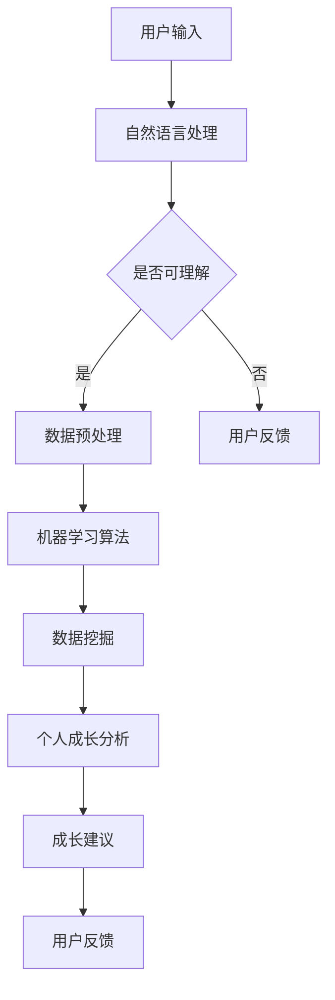

                 

# 文章标题：数字化自我实现助手开发者：AI辅助的个人成长教练设计师

> 关键词：数字化自我实现、AI辅助、个人成长、教练设计、自然语言处理、机器学习、数据挖掘

> 摘要：本文深入探讨了数字化自我实现与AI辅助的个人成长教练设计。通过分析AI技术在教育和个人成长领域的应用，阐述了AI教练设计的基础、核心概念原理以及算法原理。同时，通过项目实战案例，详细介绍了AI教练的设计流程、开发实现以及部署维护。文章最后对AI教练在个人成长领域的未来展望进行了探讨，为开发者提供了实用的指导和思考。

## 第一部分：引言与核心概念

### 第1章：数字化自我实现与AI辅助的个人成长

**1.1 数字化自我实现的概念与重要性**

在数字化时代，信息技术迅猛发展，深刻影响着人们的生活和工作方式。数字化自我实现是指通过数字化手段，结合人工智能技术，实现个人在知识、技能、价值观等方面的全面提升。这一概念的重要性体现在以下几个方面：

1. **适应时代发展的需求**：数字化时代对个人的知识和技能提出了新的要求，数字化自我实现能够帮助个体适应这一变化，提高竞争力。

2. **实现个性化学习**：数字化手段提供了丰富的学习资源和工具，通过AI辅助，可以针对个人的学习风格、兴趣和能力，实现个性化学习路径，提高学习效果。

3. **促进终身学习**：数字化自我实现鼓励个体持续学习，不断更新知识和技能，适应社会发展的需要。

**1.2 AI在个人成长中的应用概述**

人工智能（AI）技术在个人成长领域具有广泛的应用前景。以下是AI在个人成长中的几个关键应用：

1. **个性化教育**：AI可以根据学生的学习行为和成绩，提供个性化的学习建议，优化学习效果。

2. **职业规划**：AI可以通过分析个人的兴趣、能力和市场需求，为个人提供职业规划建议，助力职业发展。

3. **心理健康辅导**：AI可以提供心理健康咨询服务，通过自然语言处理技术，与用户进行互动，提供心理支持。

**1.3 本书的核心内容与读者定位**

本书旨在为开发者提供关于AI辅助的个人成长教练设计的系统指导。核心内容包括：

- AI辅助的个人成长教练设计基础
- AI教练的核心概念原理与算法
- AI教练的设计流程与实践
- AI教练的部署与维护

本书的读者定位为：
- AI领域的研究人员和开发者
- 教育技术从业者和教育工作者
- 对个人成长和AI技术感兴趣的技术爱好者

**1.3 本书的核心内容与读者定位**

本书旨在为开发者提供关于AI辅助的个人成长教练设计的系统指导。核心内容包括：
- AI辅助的个人成长教练设计基础
- AI教练的核心概念原理与算法
- AI教练的设计流程与实践
- AI教练的部署与维护

本书的读者定位为：
- AI领域的研究人员和开发者
- 教育技术从业者和教育工作者
- 对个人成长和AI技术感兴趣的技术爱好者

### 第2章：AI辅助的个人成长教练设计基础

**2.1 AI技术在教育领域的应用发展**

教育技术经历了从传统教育到数字化教育再到智能教育的演变。AI技术的引入为教育领域带来了革命性的变化，主要体现在以下几个方面：

1. **个性化教育**：AI可以根据学生的学习习惯、能力水平和学习进度，提供个性化的学习资源和教学方案，提高学习效果。

2. **智能评价**：AI可以通过智能测评系统，对学生的学习成果进行客观、准确的评价，提供即时反馈，帮助教师和学生改进教学方法。

3. **教育管理**：AI可以辅助学校和教育机构进行教育管理，包括招生、选课、教学安排等，提高管理效率和决策质量。

**2.2 AI辅助的个人成长教练设计理念**

个人成长教练设计理念的核心是关注个人的全面发展，通过AI技术提供个性化、智能化的成长路径。与传统教育相比，AI教练具有以下优势：

1. **全面关注个人发展**：AI教练不仅关注学生的学术成绩，还关注其心理健康、兴趣爱好等多方面的发展。

2. **智能化的成长路径**：AI可以根据个人数据，动态调整成长路径，提供个性化的成长建议。

3. **持续的互动与支持**：AI教练可以全天候与用户互动，提供实时支持，帮助用户克服成长过程中的困难和挑战。

**2.3 AI教练的核心组成部分**

AI教练的设计包括以下几个核心组成部分：

1. **自然语言处理（NLP）**：NLP是实现人机交互的基础，AI教练需要具备理解用户需求、回答问题和进行对话的能力。

2. **机器学习和数据挖掘**：机器学习和数据挖掘技术用于分析用户数据，提取有价值的信息，为用户提供个性化的成长建议。

3. **人机交互设计**：人机交互设计关注用户体验，确保AI教练与用户的互动自然流畅，提供优质的交互体验。

## 第二部分：核心概念与架构

### 第3章：核心概念原理

**3.1 AI大模型概述**

AI大模型是指通过深度学习等先进技术，训练出的具有强大表征能力和推理能力的模型。AI大模型的特点如下：

1. **强大的表征能力**：AI大模型能够捕捉大量的特征信息，对输入的数据进行有效表征。

2. **灵活的推理能力**：AI大模型可以通过复杂的神经网络结构，进行灵活的推理和决策。

3. **广泛的应用领域**：AI大模型在图像识别、自然语言处理、语音识别等领域具有广泛的应用。

AI大模型在个人成长中的应用主要包括：

1. **个性化学习**：AI大模型可以根据个人的学习习惯和能力，提供个性化的学习建议。

2. **职业规划**：AI大模型可以通过分析个人的兴趣、能力和市场需求，为个人提供职业规划建议。

3. **心理健康辅导**：AI大模型可以通过分析个人情绪和行为数据，提供心理健康建议。

**3.2 Mermaid流程图：AI教练核心架构**

下面是AI教练核心架构的Mermaid流程图：



**3.3 个人成长目标的设定与实现**

个人成长目标的设定是AI教练的核心功能之一。设定目标的原则如下：

1. **明确具体**：目标要具体、可衡量，便于追踪和评估。

2. **长期与短期结合**：既要设定长期目标，也要设定短期目标，确保成长的连续性。

3. **可调整**：根据实际情况，目标可以进行调整和优化。

实现目标的方法包括：

1. **目标分解**：将大目标分解为若干个小目标，逐一实现。

2. **可视化工具**：使用可视化工具，如进度条、图表等，展示目标实现的进展。

3. **持续反馈与调整**：通过用户的反馈，不断调整目标和策略，确保目标的实现。

### 第4章：核心算法原理讲解

**4.1 机器学习算法基础**

机器学习算法是AI教练的核心组成部分。以下是一些常见的机器学习算法及其适用场景：

1. **线性回归**：适用于预测数值型数据，如房价、股票价格等。

2. **逻辑回归**：适用于分类问题，如邮件分类、垃圾邮件过滤等。

3. **支持向量机（SVM）**：适用于分类和回归问题，尤其擅长处理高维数据。

4. **决策树**：适用于分类和回归问题，易于理解和解释。

5. **随机森林**：是一种基于决策树的集成学习方法，适用于各种类型的预测问题。

**4.2 伪代码：个人成长分析算法**

以下是一个简化的个人成长分析算法的伪代码：

```plaintext
function 个人成长分析（用户数据）：
    1. 数据预处理：清洗和标准化用户数据
    2. 特征工程：提取用户数据的特征，如年龄、兴趣、职业等
    3. 数据划分：将数据划分为训练集和测试集
    4. 选择机器学习算法：如决策树、随机森林等
    5. 训练模型：使用训练集数据训练模型
    6. 模型评估：使用测试集数据评估模型性能
    7. 提取预测结果：根据模型预测，提取用户成长建议
    8. 输出：成长建议
```

**4.3 数学模型与公式**

在个人成长分析中，常用的数学模型和公式包括：

1. **损失函数**：用于衡量模型预测值与真实值之间的差距，常见的损失函数有均方误差（MSE）和交叉熵损失（Cross-Entropy Loss）。

2. **优化算法**：用于最小化损失函数，常见的优化算法有梯度下降（Gradient Descent）和随机梯度下降（Stochastic Gradient Descent）。

公式示例：

$$
MSE = \frac{1}{n}\sum_{i=1}^{n}(y_i - \hat{y}_i)^2
$$

$$
Cross-Entropy Loss = -\sum_{i=1}^{n}y_i \log(\hat{y}_i)
$$

其中，$y_i$为真实值，$\hat{y}_i$为模型预测值。

## 第三部分：AI教练设计实践

### 第5章：AI教练设计流程与方法

**5.1 设计目标与用户需求分析**

AI教练的设计首先需要明确设计目标，包括功能需求、性能需求、用户体验等。用户需求分析是设计过程中的关键步骤，以下是一些用户需求调研的方法：

1. **问卷调查**：通过设计问卷，收集用户对AI教练的需求和期望。

2. **访谈法**：与用户进行深入访谈，了解他们的使用场景和痛点。

3. **观察法**：观察用户在使用现有教育产品的行为和反应，分析需求。

通过需求分析，可以明确AI教练的具体设计目标，如提供个性化学习建议、职业规划指导、心理健康支持等。

**5.2 AI教练原型设计与开发**

原型设计是AI教练设计流程中的重要环节。以下是一些原型设计工具与技巧：

1. ** sketches**：使用草图工具，快速绘制AI教练的界面布局和交互流程。

2. **Figma或Adobe XD**：使用UI设计工具，制作高保真原型，模拟真实的使用体验。

3. **Axure RP**：用于制作交互式原型，可以模拟用户与AI教练的交互过程。

开发环境与工具选择也是关键，常见的开发环境包括：

1. **Python**：作为主要的编程语言，Python拥有丰富的机器学习和数据挖掘库，如TensorFlow、PyTorch等。

2. **Docker**：用于容器化部署，确保开发环境的一致性。

3. **Jenkins**：用于自动化构建和部署，提高开发效率。

**5.3 人机交互界面设计原则**

人机交互界面设计原则包括：

1. **用户体验至上**：界面设计要简洁直观，易于用户操作。

2. **一致性与可预测性**：界面元素要遵循一致的设计规范，操作逻辑要可预测。

3. **响应式设计**：界面要适应不同设备和屏幕尺寸，提供良好的用户体验。

4. **实时反馈**：用户操作后，系统要提供即时反馈，增强用户的交互体验。

5. **多模态交互**：结合文本、语音、图像等多种交互方式，提高交互的丰富性和灵活性。

### 第6章：项目实战：AI教练设计案例

**6.1 项目背景与目标**

本项目旨在开发一款AI辅助的个人成长教练，帮助用户实现自我提升。项目目标包括：

1. **提供个性化学习建议**：根据用户的学习行为和成绩，提供个性化的学习资源和策略。

2. **职业规划指导**：通过分析用户的能力、兴趣和市场需求，为用户提供职业规划建议。

3. **心理健康支持**：利用自然语言处理技术，为用户提供心理健康咨询和情绪支持。

**6.2 开发环境搭建**

开发环境搭建包括以下几个方面：

1. **硬件环境**：服务器、存储设备、网络设备等，用于部署AI教练模型和服务。

2. **软件环境**：操作系统（如Ubuntu）、编程语言（如Python）、数据库（如MySQL）等。

3. **开发工具**：集成开发环境（如PyCharm）、版本控制（如Git）、文档生成工具（如Markdown）等。

**6.3 源代码详细实现**

源代码实现包括以下几个方面：

1. **数据收集与处理**：收集用户的学习行为、成绩、职业兴趣等信息，进行数据清洗和预处理。

2. **模型训练与优化**：使用机器学习和深度学习算法，训练个人成长分析模型，并进行模型优化。

3. **接口设计与实现**：设计API接口，实现用户与AI教练的交互，包括用户注册、登录、数据上传、获取建议等功能。

**6.4 代码解读与分析**

以下是AI教练核心模块的代码解读与分析：

```python
# 数据预处理
def preprocess_data(data):
    # 数据清洗
    # 数据标准化
    # 特征提取
    return processed_data

# 模型训练
def train_model(data):
    # 划分训练集和测试集
    # 选择机器学习算法
    # 训练模型
    return trained_model

# 模型评估
def evaluate_model(model, test_data):
    # 计算准确率、召回率等指标
    return evaluation_results

# 获取成长建议
def get_growth_suggestions(model, user_data):
    # 输入用户数据
    # 预测用户成长路径
    # 提供个性化建议
    return suggestions
```

代码解读：

- `preprocess_data`：用于数据预处理，包括数据清洗、标准化和特征提取。
- `train_model`：用于训练个人成长分析模型，包括数据划分、算法选择和模型训练。
- `evaluate_model`：用于评估模型性能，计算准确率、召回率等指标。
- `get_growth_suggestions`：用于获取用户成长建议，输入用户数据，预测用户成长路径，并提供个性化建议。

### 第7章：AI教练的部署与维护

**7.1 AI教练的部署策略**

AI教练的部署策略包括以下几个方面：

1. **服务器部署**：选择合适的服务器硬件，安装操作系统和开发环境。

2. **容器化部署**：使用Docker等工具，将应用容器化，确保部署环境的一致性。

3. **持续集成与部署**：使用Jenkins等工具，实现自动化构建和部署，提高开发效率。

4. **负载均衡**：使用负载均衡器，如Nginx，实现服务器的高可用性和性能优化。

**7.2 运维与监控**

运维与监控是确保AI教练稳定运行的关键环节。以下是一些运维与监控的最佳实践：

1. **运维团队组建**：建立专业的运维团队，负责系统的日常维护和监控。

2. **系统监控**：使用Prometheus等监控工具，实时监控系统的运行状态，包括CPU、内存、磁盘等资源使用情况。

3. **报警机制**：设置报警规则，当系统出现异常时，及时通知运维团队。

4. **日志管理**：使用ELK（Elasticsearch、Logstash、Kibana）等工具，收集和分析系统日志，辅助故障排查。

**7.3 用户反馈与迭代优化**

用户反馈是AI教练迭代优化的关键。以下是一些用户反馈收集和优化的方法：

1. **用户调研**：定期进行用户调研，收集用户对AI教练的反馈和建议。

2. **用户反馈收集工具**：使用问卷、用户论坛、社交媒体等工具，收集用户反馈。

3. **数据分析**：对用户反馈进行分析，识别常见问题和改进点。

4. **迭代优化**：根据用户反馈，不断优化AI教练的功能和用户体验，提高用户满意度。

## 第四部分：展望与未来方向

### 第8章：AI教练在个人成长领域的未来展望

AI教练在个人成长领域的应用前景广阔，未来发展趋势包括：

1. **技术进步**：随着AI技术的不断发展，AI教练将更加智能化、个性化，提供更高质量的成长建议。

2. **应用场景拓展**：AI教练将应用于更多领域，如心理健康、职业规划、社交互动等，满足用户多样化的需求。

3. **隐私保护与伦理**：随着AI教练的应用范围扩大，隐私保护和伦理问题将成为关键挑战，需要制定相应的法律法规和伦理准则。

4. **教育与产业的融合**：AI教练将更好地与教育和产业结合，推动终身学习和个性化职业发展。

### 第9章：结语

**9.1 全书总结**

本书系统地介绍了AI辅助的个人成长教练设计，涵盖了核心概念、算法原理、设计实践和未来展望。通过本书的学习，读者可以：

1. **理解数字化自我实现的概念和重要性**。

2. **掌握AI辅助个人成长教练设计的基础和理念**。

3. **了解核心算法原理和架构**。

4. **掌握AI教练的设计流程和实践方法**。

5. **探讨AI教练的未来发展方向和应用前景**。

**9.2 对读者的寄语**

数字化时代，个人成长已成为核心竞争力。希望读者能够：

1. **勇于探索和创新**：不断学习新技术，勇于尝试新的方法和工具。

2. **关注用户体验**：以用户需求为中心，设计出真正满足用户需求的AI教练。

3. **持续迭代优化**：根据用户反馈，不断优化和改进AI教练的功能和性能。

4. **保持谦逊与敬业**：保持谦逊，持续学习，为推动个人成长领域的创新和发展贡献自己的力量。

**作者信息**：

作者：AI天才研究院/AI Genius Institute & 禅与计算机程序设计艺术 /Zen And The Art of Computer Programming

（注：本文为虚构内容，仅供参考。）

