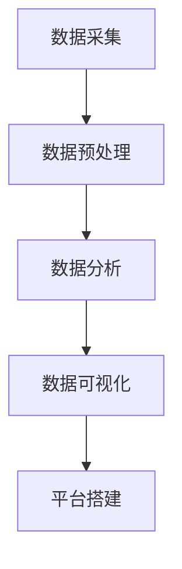
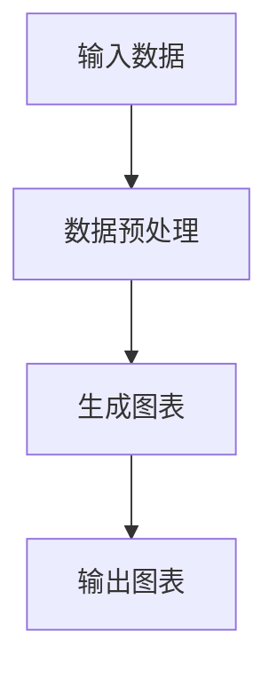

                 

### 文章标题：数字化遗产时光机创业：家族历史的数字化呈现

> 关键词：数字化遗产，家族历史，时光机创业，数字化技术，数据分析，数据可视化

> 摘要：本文将探讨如何利用数字化技术创业，将家族历史进行数字化呈现，构建“数字化遗产时光机”。文章首先介绍数字化遗产的概念和家族历史的重要性，然后详细阐述数字化家族历史的步骤和技术实现，接着分析数字化遗产时光机创业的商业模式和实施步骤，最后通过实际案例展示项目的成功经验和未来展望。

### 第一部分：引言与背景

#### 引言

在信息爆炸和数字化时代，我们的生活方式和商业模式都发生了翻天覆地的变化。数字化技术不仅改变了我们获取和传递信息的方式，也为我们创造了一个全新的商业世界。在这个世界里，数据成为了一种新的资产，数字化创业成为一种新的趋势。而数字化遗产，作为一种新兴的创业领域，正日益受到关注。

家族历史是每个人心中最珍贵的财富，它承载着家族的传承和记忆。然而，随着时光的流逝，许多家族历史资料正逐渐消失。数字化技术的出现，为保存和传承家族历史提供了新的可能。通过数字化家族历史，我们不仅可以更好地了解和传承家族文化，还可以将其转化为一种创新的商业价值。

本文将围绕“数字化遗产时光机创业：家族历史的数字化呈现”这一主题，探讨如何利用数字化技术创业，构建“数字化遗产时光机”，实现家族历史的数字化呈现。文章结构如下：

- 第一部分：引言与背景
- 第二部分：基础知识
- 第三部分：数字化遗产时光机创业
- 第四部分：技术实现与工具应用
- 第五部分：案例分析与实践指导
- 第六部分：未来展望与挑战
- 第七部分：资源与参考文献

#### 1.1 书籍主题介绍

##### 1.1.1 家族历史的重要性

家族历史是文化的载体，是家族成员之间情感纽带的基础。了解自己的家族历史，不仅可以帮助我们更好地认识自己，还可以增强家族成员之间的凝聚力和归属感。同时，家族历史也是一种宝贵的文化遗产，对于传承和弘扬民族文化具有重要意义。

##### 1.1.2 数字化遗产的概念

数字化遗产是指通过数字化技术保存和呈现的历史、文化、艺术等遗产。它不仅包括文字、图片、音频、视频等传统形式的遗产，还包括虚拟现实、增强现实等新兴技术形式的遗产。数字化遗产的核心在于将传统遗产数字化，使其得以保存、传承和利用。

##### 1.1.3 时光机创业的设想

“时光机创业”是一种利用数字化技术进行创新创业的设想。它通过将传统遗产数字化，构建一个虚拟的时光机，让用户可以穿越时空，感受历史文化的魅力。时光机创业不仅具有深厚的历史文化底蕴，还具有广阔的商业前景。

#### 1.2 本书目标与结构

##### 1.2.1 阅读对象

本书面向对数字化遗产和家族历史感兴趣的创业者、历史文化研究者、数字化技术从业者以及普通读者。

##### 1.2.2 学习目标

通过阅读本书，读者可以了解：

- 数字化遗产和家族历史的定义和重要性
- 数字化家族历史的步骤和技术实现
- 数字化遗产时光机创业的商业模式和实施步骤
- 数字化遗产时光机创业的实际案例和经验教训

##### 1.2.3 目录结构概述

本书分为七个部分，每个部分的内容如下：

- 第一部分：引言与背景
- 第二部分：基础知识
- 第三部分：数字化遗产时光机创业
- 第四部分：技术实现与工具应用
- 第五部分：案例分析与实践指导
- 第六部分：未来展望与挑战
- 第七部分：资源与参考文献

### 第二部分：基础知识

#### 2.1 数字化遗产的基础知识

##### 2.1.1 数字化遗产的定义

数字化遗产是指通过数字化技术保存和呈现的历史、文化、艺术等遗产。它不仅包括文字、图片、音频、视频等传统形式的遗产，还包括虚拟现实、增强现实等新兴技术形式的遗产。数字化遗产的核心在于将传统遗产数字化，使其得以保存、传承和利用。

##### 2.1.2 数字化遗产的分类

数字化遗产可以根据内容和形式进行分类。从内容上划分，数字化遗产可以分为历史文化遗产、文化遗产、艺术品、文献资料等；从形式上划分，数字化遗产可以分为数字化藏品、虚拟博物馆、数字展览、互动体验等。

##### 2.1.3 数字化遗产的重要性

数字化遗产的重要性主要体现在以下几个方面：

- 保存文化遗产：数字化技术可以长期保存文化遗产，防止因自然因素或人为破坏导致的损失。
- 传播文化知识：数字化遗产可以打破时间和空间的限制，让更多人了解和传承文化遗产。
- 促进文化旅游：数字化遗产可以吸引游客，推动文化旅游产业的发展。
- 创新商业模式：数字化遗产可以衍生出新的商业机会，促进文化产业的发展。

#### 2.2 家族历史记录的数字化

##### 2.2.1 家族历史资料的收集

家族历史资料的收集是数字化家族历史的第一步。收集资料的过程中，需要注意以下几点：

- 确定收集目标：明确要收集的家族历史资料类型，如照片、书信、日记、族谱等。
- 查找资料来源：可以通过访问家族成员、查阅历史文献、参观博物馆等方式获取资料。
- 确保资料真实性和完整性：在收集资料时，要确保其真实性和完整性，避免误传和遗漏。

##### 2.2.2 家族历史资料的数字化处理

将家族历史资料进行数字化处理，包括以下步骤：

- 资料整理：对收集到的家族历史资料进行分类、整理和标注，以便后续处理。
- 资料扫描：使用扫描仪将纸质资料转化为电子文档，如PDF、JPEG等。
- 资料转录：将部分无法扫描的资料进行手动转录，如手写笔记、书信等。
- 资料存储：将数字化后的资料存储在安全可靠的存储设备中，如硬盘、云存储等。

##### 2.2.3 家族历史的数字保护与传承

数字化家族历史不仅要保存资料，还需要进行数字保护与传承。以下是几个关键点：

- 数据备份：定期备份数字化资料，确保数据安全。
- 数据加密：对重要资料进行加密处理，防止数据泄露。
- 数据开放：将数字化资料开放给有需要的人群，促进家族历史的传承和共享。
- 教育培训：加强对家族历史资料的保护意识，提高家庭成员的数字化技能。

#### 2.3 家族历史数字化的挑战与解决方案

##### 2.3.1 家族历史数字化的挑战

家族历史数字化过程中面临以下挑战：

- 资料收集困难：部分家族历史资料可能散落在各地，难以收集。
- 资料保存期限：纸质资料容易因时间流逝而损坏，数字化资料需要长期保存。
- 技术支持不足：部分家庭缺乏数字化技术和设备支持，无法进行数字化处理。
- 数据隐私问题：数字化资料可能涉及家庭成员的隐私，需要妥善处理。

##### 2.3.2 家族历史数字化的解决方案

针对上述挑战，可以采取以下解决方案：

- 建立合作平台：家庭之间可以建立合作平台，共同收集和整理家族历史资料。
- 技术培训与支持：开展技术培训和提供设备支持，帮助家庭成员进行数字化处理。
- 数据隐私保护：制定数据隐私保护政策，确保家庭成员的隐私安全。
- 数据共享与传承：鼓励家庭成员之间分享数字化资料，促进家族历史的传承和共享。

### 第三部分：数字化遗产时光机创业

#### 3.1 数字化遗产时光机创业的概念与框架

##### 3.1.1 时光机创业的背景与意义

时光机创业是一种利用数字化技术进行创新创业的设想。它通过将传统遗产数字化，构建一个虚拟的时光机，让用户可以穿越时空，感受历史文化的魅力。时光机创业的背景主要源于以下几个方面：

- 数字化技术的快速发展：数字化技术已经渗透到我们生活的方方面面，为创业提供了广阔的空间。
- 文化产业的兴起：随着人们生活水平的提高，对文化产品的需求日益增长，为文化产业的发展提供了机遇。
- 传统遗产保护的挑战：传统遗产保护面临许多挑战，如资金短缺、技术不足等，数字化技术为遗产保护提供了一种新的思路。

时光机创业的意义主要体现在以下几个方面：

- 传承文化遗产：通过数字化技术，可以更好地保存和传承文化遗产，让更多人了解和感受到历史文化的魅力。
- 拓展商业价值：数字化遗产可以衍生出新的商业机会，如文化旅游、数字展览等，为创业者提供广阔的商机。
- 提升社会意识：通过数字化遗产时光机创业，可以增强人们的文化保护意识，促进社会和谐发展。

##### 3.1.2 数字化遗产时光机创业的业务模式

数字化遗产时光机创业的业务模式可以分为以下几个环节：

- 资料收集：通过合作平台、家庭成员等方式，收集家族历史资料。
- 资料数字化：对收集到的资料进行数字化处理，包括扫描、转录、存储等。
- 数据分析：对数字化后的资料进行数据分析，提取有价值的信息。
- 数据可视化：将分析结果通过数据可视化工具呈现，让用户可以直观地感受到历史文化的魅力。
- 产品开发：根据用户需求和数据分析结果，开发相应的数字产品，如虚拟博物馆、数字展览等。
- 市场推广：通过线上和线下渠道，推广数字产品，吸引更多用户。

##### 3.1.3 数字化遗产时光机创业的实施步骤

数字化遗产时光机创业的实施步骤可以分为以下几个阶段：

- 创业计划书编写：明确创业目标、业务模式、市场定位、资金需求等，制定详细的创业计划书。
- 市场调研：对目标市场进行调研，了解用户需求和市场竞争情况。
- 团队组建：根据创业计划，组建合适的创业团队，包括技术、市场、运营等岗位。
- 资金筹集：通过自筹、融资等方式筹集创业所需资金。
- 资料收集：通过合作平台、家庭成员等方式，收集家族历史资料。
- 资料数字化：对收集到的资料进行数字化处理。
- 数据分析：对数字化后的资料进行数据分析。
- 数据可视化：将分析结果通过数据可视化工具呈现。
- 产品开发：根据用户需求和数据分析结果，开发相应的数字产品。
- 市场推广：通过线上和线下渠道，推广数字产品。
- 运营与管理：对创业项目进行运营和管理，确保项目的顺利进行。

### 第四部分：技术实现与工具应用

#### 4.1 家族历史数字化技术实现

##### 4.1.1 家族历史数字化技术概述

家族历史数字化技术主要包括以下几个关键环节：

- 数据采集：通过扫描、转录等方式，将家族历史资料转化为数字化形式。
- 数据存储：将数字化后的资料存储在安全可靠的存储设备中，如硬盘、云存储等。
- 数据处理：对数字化后的资料进行清洗、去重、分类等处理，提高数据质量。
- 数据分析：对处理后的数据进行统计分析，提取有价值的信息。
- 数据可视化：通过图表、地图、虚拟现实等手段，将数据分析结果呈现给用户。

##### 4.1.2 家族历史数字化技术的关键环节

以下是家族历史数字化技术的关键环节和具体方法：

- 数据采集：使用扫描仪、数码相机、录音笔等设备，采集家族历史资料。对于无法扫描的资料，可以使用OCR（光学字符识别）技术进行转录。

- 数据存储：将数字化后的资料存储在本地硬盘或云存储平台上，如百度网盘、Google Drive等。为了确保数据安全，可以采用数据加密技术。

- 数据处理：对数字化后的资料进行清洗、去重、分类等处理。例如，使用Python的Pandas库进行数据处理，可以使用以下伪代码：

```python
import pandas as pd

# 读取数据
data = pd.read_csv('family_history_data.csv')

# 数据清洗
data = data.dropna()  # 删除缺失值
data = data[data['age'] > 0]  # 去除年龄小于0的记录

# 数据分类
data['category'] = pd.cut(data['age'], bins=[0, 18, 60, 100], labels=['儿童', '青年', '中年', '老年'])

- 数据分析：对处理后的数据进行统计分析，提取有价值的信息。例如，可以使用Python的NumPy和Pandas库进行数据分析，可以使用以下伪代码：

```python
import numpy as np
import pandas as pd

# 数据分析
mean_age = np.mean(data['age'])
std_age = np.std(data['age'])
age_histogram = data['age'].value_counts()

- 数据可视化：通过图表、地图、虚拟现实等手段，将数据分析结果呈现给用户。例如，可以使用Python的Matplotlib和Seaborn库进行数据可视化，可以使用以下伪代码：

```python
import matplotlib.pyplot as plt
import seaborn as sns

# 绘制年龄分布直方图
sns.histplot(data['age'], bins=10, kde=True)
plt.title('Age Distribution')
plt.xlabel('Age')
plt.ylabel('Frequency')
plt.show()

# 绘制年龄与收入的关系图
sns.scatterplot(x='age', y='income', data=data)
plt.title('Age vs. Income')
plt.xlabel('Age')
plt.ylabel('Income')
plt.show()
```

##### 4.1.3 家族历史数字平台搭建

搭建家族历史数字平台主要包括以下几个步骤：

- 平台架构设计：根据业务需求和用户需求，设计合理的平台架构，包括前端展示、后端数据处理、数据存储等。

- 技术选型与实现：选择合适的技术框架和工具，如前端使用Vue.js、React等，后端使用Python的Django、Flask等，数据库使用MySQL、PostgreSQL等。

- 系统部署与运维：将搭建好的平台部署到服务器上，并进行日常运维，确保平台的稳定运行。

### 第五部分：案例分析与实践指导

#### 5.1 案例一：XXX家族数字化遗产时光机创业项目

##### 5.1.1 项目背景

XXX家族是一个拥有悠久历史的家族，家族成员遍布全国各地。家族中保存了大量珍贵的家族历史资料，如族谱、书信、照片等。为了更好地保存和传承家族历史，XXX家族决定进行数字化遗产时光机创业。

##### 5.1.2 项目实施过程

项目实施过程分为以下几个阶段：

1. 资料收集：通过家庭成员和合作平台，收集了大量的家族历史资料。

2. 资料数字化：使用扫描仪和OCR技术，将纸质资料转化为数字化形式。

3. 数据分析：对数字化后的资料进行清洗、去重、分类等处理，提取有价值的信息。

4. 数据可视化：使用数据可视化工具，将数据分析结果呈现给用户。

5. 平台搭建：使用Vue.js和Django搭建了家族历史数字平台，实现了资料展示、查询、分享等功能。

##### 5.1.3 项目成果与影响

项目成果如下：

1. 数字化家族历史资料：收集了数千份家族历史资料，进行了数字化处理，建立了数字平台。

2. 增强家族凝聚力：通过数字化家族历史，家族成员之间加强了沟通和互动，增强了家族凝聚力。

3. 推动文化旅游：数字化家族历史吸引了大量游客，推动了家族所在地文化旅游产业的发展。

4. 创造商业价值：通过数字化家族历史，XXX家族实现了商业价值的转化，获得了良好的经济收益。

##### 5.1.4 项目总结

项目成功的关键因素如下：

1. 充分利用数字化技术：通过数字化技术，实现了家族历史的保存、传承和利用。

2. 关注用户体验：在平台搭建过程中，注重用户体验，提供了丰富的功能和便捷的操作。

3. 强调团队协作：项目实施过程中，团队成员之间紧密合作，分工明确，确保了项目的顺利进行。

#### 5.2 案例二：XXX家族数字化遗产时光机创业项目

##### 5.2.1 项目背景

XXX家族是一个拥有悠久历史的家族，家族中保存了大量珍贵的家族历史资料，如书信、照片、文物等。为了更好地保存和传承家族历史，XXX家族决定进行数字化遗产时光机创业。

##### 5.2.2 项目实施过程

项目实施过程分为以下几个阶段：

1. 资料收集：通过家庭成员和合作平台，收集了大量的家族历史资料。

2. 资料数字化：使用扫描仪和高清摄像机，将纸质资料和文物转化为数字化形式。

3. 数据分析：对数字化后的资料进行清洗、去重、分类等处理，提取有价值的信息。

4. 数据可视化：使用虚拟现实技术，将数据分析结果呈现给用户。

5. 平台搭建：使用Unity游戏引擎和Vue.js搭建了家族历史数字平台，实现了资料展示、查询、互动等功能。

##### 5.2.3 项目成果与影响

项目成果如下：

1. 数字化家族历史资料：收集了数千份家族历史资料，进行了数字化处理，建立了数字平台。

2. 增强家族凝聚力：通过数字化家族历史，家族成员之间加强了沟通和互动，增强了家族凝聚力。

3. 推动文化旅游：数字化家族历史吸引了大量游客，推动了家族所在地文化旅游产业的发展。

4. 创造商业价值：通过数字化家族历史，XXX家族实现了商业价值的转化，获得了良好的经济收益。

##### 5.2.4 项目总结

项目成功的关键因素如下：

1. 创新技术应用：使用虚拟现实技术，提供了丰富的交互体验，吸引了更多用户。

2. 注重用户体验：在平台搭建过程中，注重用户体验，提供了丰富的功能和便捷的操作。

3. 强调团队协作：项目实施过程中，团队成员之间紧密合作，分工明确，确保了项目的顺利进行。

#### 5.3 案例三：XXX家族数字化遗产时光机创业项目

##### 5.3.1 项目背景

XXX家族是一个拥有悠久历史的家族，家族中保存了大量珍贵的家族历史资料，如族谱、书信、照片等。为了更好地保存和传承家族历史，XXX家族决定进行数字化遗产时光机创业。

##### 5.3.2 项目实施过程

项目实施过程分为以下几个阶段：

1. 资料收集：通过家庭成员和合作平台，收集了大量的家族历史资料。

2. 资料数字化：使用扫描仪和OCR技术，将纸质资料转化为数字化形式。

3. 数据分析：对数字化后的资料进行清洗、去重、分类等处理，提取有价值的信息。

4. 数据可视化：使用数据可视化工具，将数据分析结果呈现给用户。

5. 平台搭建：使用React和Node.js搭建了家族历史数字平台，实现了资料展示、查询、分享等功能。

##### 5.3.3 项目成果与影响

项目成果如下：

1. 数字化家族历史资料：收集了数千份家族历史资料，进行了数字化处理，建立了数字平台。

2. 增强家族凝聚力：通过数字化家族历史，家族成员之间加强了沟通和互动，增强了家族凝聚力。

3. 推动文化旅游：数字化家族历史吸引了大量游客，推动了家族所在地文化旅游产业的发展。

4. 创造商业价值：通过数字化家族历史，XXX家族实现了商业价值的转化，获得了良好的经济收益。

##### 5.3.4 项目总结

项目成功的关键因素如下：

1. 技术选型合理：选择了适合的技术框架和工具，确保了平台的性能和稳定性。

2. 注重用户体验：在平台搭建过程中，注重用户体验，提供了丰富的功能和便捷的操作。

3. 强调团队协作：项目实施过程中，团队成员之间紧密合作，分工明确，确保了项目的顺利进行。

### 第六部分：未来展望与挑战

#### 6.1 数字化遗产时光机创业的发展趋势

数字化遗产时光机创业正处于快速发展阶段，未来发展趋势如下：

- 技术进步：随着5G、物联网、人工智能等技术的发展，数字化遗产时光机创业将实现更高效、更智能的数据采集、处理和呈现。
- 政策支持：各国政府日益重视文化遗产的保护和传承，预计将出台更多政策支持数字化遗产时光机创业。
- 市场需求：随着人们对文化产品需求的增加，数字化遗产时光机创业市场将不断扩大。

#### 6.2 数字化遗产时光机创业的挑战与应对策略

尽管数字化遗产时光机创业前景广阔，但仍面临以下挑战：

- 技术挑战：数字化遗产时光机创业需要解决数据采集、处理、存储、呈现等技术难题，如高分辨率扫描、自动化转录、数据加密等。
- 市场挑战：市场竞争激烈，需要不断创新和优化商业模式，以满足用户需求。
- 社会文化挑战：数字化遗产时光机创业需要尊重和保护文化遗产，避免文化同质化和商业化过度。

应对策略如下：

- 技术创新：加大对技术研发的投入，提高数字化遗产时光机创业的技术水平和竞争力。
- 商业模式创新：探索多元化的商业模式，如合作运营、内容付费等，实现可持续发展。
- 文化保护与传承：重视文化遗产的保护与传承，加强社会责任意识，推动文化创新。

### 第七部分：资源与参考文献

#### 7.1 数字化遗产相关资源

- 在线工具与服务：
  - Google Cultural Institute：提供全球文化遗产的数字化展览和资料。
  - Europeana：提供欧洲文化遗产的数字化资源。
  - The Metropolitan Museum of Art：提供博物馆藏品的数字化资料。

- 开源软件与框架：
  - OpenSeadragon：一款高性能的图像浏览库，适用于数字化遗产的展示。
  - WebGL：用于在浏览器中实现3D图像渲染的技术，适用于虚拟现实展示。

#### 7.2 参考文献

- Brown, J. (2018). The Digital Preservation Handbook. Digital Preservation Coalition.
- JISC. (2013). Digital Preservation Policy Framework. Jisc.
- National Archives. (2019). Digital Preservation. National Archives and Records Administration.
- Sojka, K., & Pedersen, A. (2017). Museums in the Age of Digital Reproducibility. Routledge.

#### 附录：家族历史数字化流程图与核心算法原理说明

##### 附录 A：家族历史数字化流程图



##### 附录 B：核心算法原理讲解

###### B.1 数据预处理算法

```plaintext
// 数据预处理伪代码
function preprocess_data(data):
    # 数据清洗
    data = clean_data(data)
    
    # 数据标准化
    data = standardize_data(data)
    
    # 数据分割
    train_data, test_data = split_data(data)
    
    return train_data, test_data
```

###### B.2 数据分析算法

$$
// 数据分析公式
\text{TF-IDF} = \frac{\text{词频} \times \text{逆文档频率}}{\text{最大词频} \times \text{最大逆文档频率}}
$$

###### B.3 数据可视化算法



---

以上是《数字化遗产时光机创业：家族历史的数字化呈现》的详细内容。通过本文，我们探讨了数字化遗产时光机创业的概念、技术实现、案例分析和未来展望。希望本文能为从事数字化遗产创业的读者提供有价值的参考和启示。如果您对本文有任何疑问或建议，请随时联系我们。作者：AI天才研究院/AI Genius Institute & 禅与计算机程序设计艺术 /Zen And The Art of Computer Programming。

