                 

### 文章标题：数字宠物权益保护法：元宇宙中的人工生命法律地位

关键词：数字宠物、元宇宙、人工智能、法律地位、权益保护

摘要：随着元宇宙的不断发展，数字宠物作为其中一种重要的人工智能生命体，其法律地位和权益保护日益受到关注。本文旨在探讨数字宠物权益保护法的现状与未来，分析元宇宙中的人工生命法律地位，并提出相应的实施与挑战策略。通过深入剖析法律制度、技术发展和社会进步，为构建完善的数字宠物权益保护法提供参考。

### 第一部分：引言

#### 1.1 书籍概述

##### 1.1.1 书籍主题背景

随着人工智能和虚拟技术的发展，元宇宙逐渐成为人们探索的新领域。在元宇宙中，数字宠物作为一种虚拟的生命体，成为了人们娱乐、陪伴的重要伙伴。然而，随着数字宠物在元宇宙中的广泛应用，其法律地位和权益保护问题也逐渐显现出来。因此，制定数字宠物权益保护法成为了一个亟待解决的问题。

##### 1.1.2 书籍目的与结构

本书旨在探讨数字宠物权益保护法的现状与未来，分析元宇宙中的人工生命法律地位，并提出相应的实施与挑战策略。本书结构分为五个部分：第一部分为引言，介绍书籍的主题背景和目的；第二部分为数字宠物权益保护法概述，包括基本原则、定义与分类、法律体系；第三部分为元宇宙中的人工生命法律地位，包括概念与特征、应用、法律地位探讨；第四部分为数字宠物权益保护法的实施与挑战，包括现状、挑战与策略；第五部分为未来展望，包括发展方向、人工生命法律地位探讨和元宇宙发展的法律保障。

#### 1.2 元宇宙简介

##### 1.2.1 元宇宙的基本概念

元宇宙（Metaverse）是指通过互联网连接的虚拟世界，它将现实世界与数字世界相结合，形成一个全新的虚拟空间。在元宇宙中，用户可以创建自己的虚拟身份，进行各种活动，如社交、娱乐、购物、教育等。元宇宙的核心特点是虚拟现实（VR）、增强现实（AR）、区块链技术等新兴技术的应用。

##### 1.2.2 元宇宙的发展历程

元宇宙的概念最早可以追溯到1980年代，随着计算机技术和互联网的快速发展，元宇宙逐渐从概念走向实际应用。2003年，美国作家尼尔·斯蒂芬森在其小说《雪崩》中详细描绘了一个虚拟现实世界，这就是元宇宙的雏形。近年来，随着虚拟现实、增强现实等技术的成熟，元宇宙开始进入快速发展阶段，各大科技公司纷纷投入大量资源进行研发。

##### 1.2.3 元宇宙中的数字生命

在元宇宙中，数字生命（Digital Life）是指通过计算机技术和人工智能技术创造出的具有生命特征和智能的虚拟实体。这些数字生命可以模拟人类的思维、情感和行为，为用户提供更加真实、丰富的互动体验。数字宠物作为其中一种重要的数字生命形式，为元宇宙的发展注入了新的活力。

#### 1.3 数字宠物权益保护法的重要性

##### 1.3.1 数字宠物权益保护的现实需求

随着元宇宙的快速发展，数字宠物在人们生活中的地位日益重要。然而，由于法律制度的滞后，数字宠物的权益保护面临诸多问题，如侵权纠纷、隐私泄露、人身伤害等。因此，制定数字宠物权益保护法成为满足现实需求的重要举措。

##### 1.3.2 数字宠物权益保护的法律框架

数字宠物权益保护法是一个涉及多个法律领域的综合性法律体系，包括民事法律、刑事法律、知识产权法律等。目前，一些国家和地区已经开始制定相关法律法规，如美国的《数字道德法案》、欧盟的《数字宠物权益保护条例》等。

##### 1.3.3 数字宠物权益保护的未来趋势

随着元宇宙的进一步发展，数字宠物权益保护法将不断完善，形成一个更加健全、系统的法律体系。未来，数字宠物权益保护法将重点关注以下几个方面：

1. **明确法律地位**：确定数字宠物在法律上的主体资格，保障其权益。
2. **完善权益保护**：加强对数字宠物知识产权、隐私权、人身权等方面的保护。
3. **规范法律责任**：明确不同类型违法行为所应承担的法律责任。
4. **推动国际合作**：加强国际间的法律合作与协调，共同应对数字宠物权益保护挑战。

### 第二部分：数字宠物权益保护法概述

#### 2.1 数字宠物权益保护法的基本原则

##### 2.1.1 法律地位

数字宠物权益保护法的基本原则之一是明确数字宠物在法律上的地位。根据不同国家和地区的法律规定，数字宠物通常被视为一种特殊的民事主体，具有民事权利能力和行为能力。

**法律地位：**

- **民事权利能力**：数字宠物具有享受权利和承担义务的能力。
- **民事行为能力**：数字宠物可以进行合法的民事行为，如购买、出售、租赁等。

**法律地位图示：**

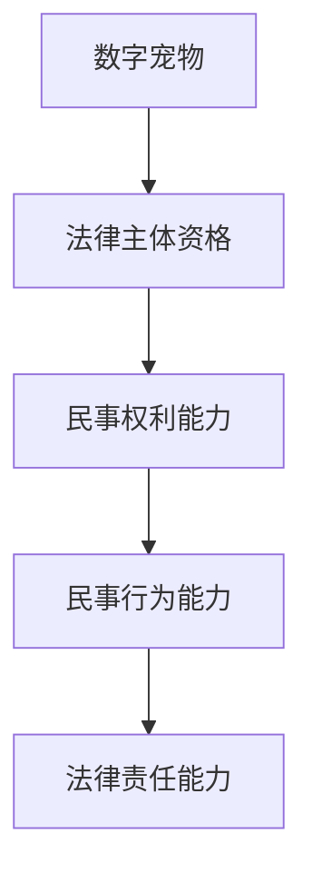

##### 2.1.2 权益范围

数字宠物的权益范围包括但不限于以下几个方面：

- **生命权**：保障数字宠物的生命安全，防止其受到伤害。
- **健康权**：保障数字宠物的身体健康，防止其受到疾病侵害。
- **隐私权**：保护数字宠物的个人信息，防止其被非法收集、使用和泄露。
- **知识产权**：保护数字宠物的原创内容，如虚拟形象、技能等。
- **财产权**：保障数字宠物的财产权益，如虚拟财产、数字资产等。

**权益范围图示：**

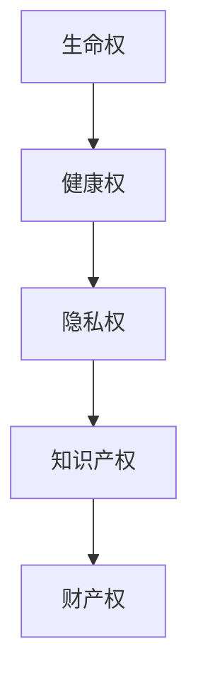

##### 2.1.3 法律责任

数字宠物权益保护法明确规定，对于侵害数字宠物权益的违法行为，侵权人应承担相应的法律责任。法律责任包括但不限于以下几种：

- **民事责任**：侵权人需承担赔偿损失、消除影响、恢复名誉等民事责任。
- **刑事责任**：侵权人可能面临刑事责任，如侵犯数字宠物知识产权、非法侵入数字宠物隐私等。
- **行政责任**：侵权人可能面临行政处罚，如警告、罚款等。

**法律责任公式：**

$$
\text{法律责任} = f(\text{违法行为}, \text{损害程度}, \text{法律地位})
$$

**法律责任图示：**

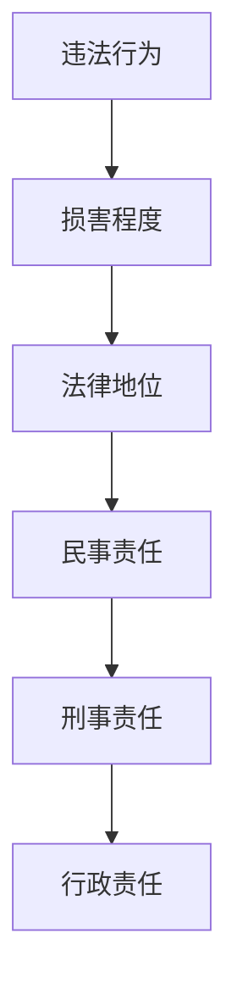

#### 2.2 数字宠物的定义与分类

##### 2.2.1 数字宠物的定义

数字宠物是通过计算机技术和人工智能技术创造出的具有生命特征和智能的虚拟实体。它们通常具有以下特征：

- **虚拟存在**：数字宠物存在于虚拟世界中，通过计算机模拟实现。
- **智能行为**：数字宠物具备一定的智能能力，能够模拟人类的思维、情感和行为。
- **互动性**：数字宠物能够与用户或其他虚拟实体进行互动，提供陪伴、娱乐等服务。

**数字宠物的定义公式：**

$$
\text{数字宠物} = \{ \text{具备生命特征、虚拟存在、通过计算机技术实现} \}
$$

##### 2.2.2 数字宠物的分类

根据不同的分类标准，数字宠物可以分为多种类型：

- **功能性宠物**：如用于检测危险、救援等。
- **娱乐性宠物**：如虚拟宠物游戏中的宠物。
- **服务性宠物**：如提供陪伴、娱乐等。

**数字宠物的分类图示：**

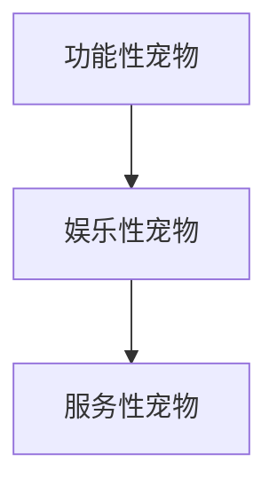

##### 2.2.3 数字宠物的发展现状

数字宠物的发展经历了以下几个阶段：

- **早期阶段**：数字宠物主要以简单的虚拟形象为主，功能较为单一。
- **发展阶段**：随着人工智能技术的进步，数字宠物的智能能力和互动性得到了显著提升。
- **成熟阶段**：数字宠物在元宇宙中得到了广泛应用，成为人们娱乐、陪伴的重要伙伴。

**数字宠物的发展阶段图示：**

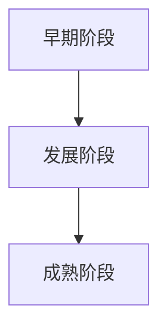

#### 2.3 数字宠物权益保护法的法律体系

##### 2.3.1 国际法律体系

在国际层面，一些国家和地区已经制定了数字宠物权益保护的相关法律法规。以下是一些主要国家和地区的法律体系：

- **美国**：美国已制定了《数字道德法案》，对数字宠物的权益保护进行了规定。
- **欧盟**：欧盟发布了《数字宠物权益保护条例》，明确了数字宠物的法律地位和权益保护。
- **日本**：日本制定了《虚拟宠物法》，对虚拟宠物的法律地位和权益保护进行了规定。

**国际法律体系图示：**

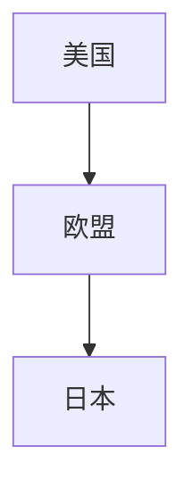

##### 2.3.2 国内法律体系

在国内，数字宠物权益保护法的法律体系主要包括以下几个方面：

- **《民法典》**：对数字宠物的法律地位和权益保护进行了原则性规定。
- **《网络安全法》**：对数字宠物在网络安全中的权益保护进行了规定。
- **《动物保护法》**：对数字宠物作为动物的权益保护进行了规定。

**国内法律体系图示：**

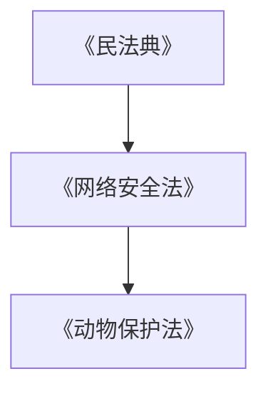

##### 2.3.3 地方性法规与政策

除了国家和国际层面的法律体系外，一些地方政府和行业组织也制定了地方性法规和政策，对数字宠物的权益保护进行了补充和细化。以下是一些地方性法规与政策：

- **《上海市虚拟数字宠物管理条例》**：上海市制定了《上海市虚拟数字宠物管理条例》，对数字宠物的管理进行了规定。
- **《深圳市虚拟数字宠物产业规划》**：深圳市发布了《深圳市虚拟数字宠物产业规划》，明确了数字宠物产业的发展目标和政策措施。

**地方性法规与政策图示：**

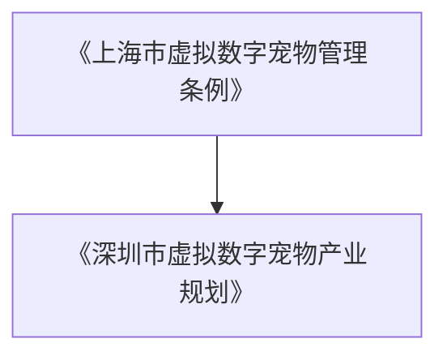

### 第三部分：元宇宙中的人工生命法律地位

#### 3.1 人工生命的概念与特征

##### 3.1.1 人工生命的定义

人工生命是通过生物技术与信息技术结合，创造出的具有生命特征和智能的虚拟实体。它们通常具备自我维持、生长、繁殖等生命特征，同时通过人工智能技术实现智能行为。

**人工生命的定义公式：**

$$
\text{人工生命} = \{ \text{通过生物技术与信息技术结合，具备生命特征的实体或系统} \}
$$

##### 3.1.2 人工生命的特征

人工生命具有以下主要特征：

- **虚拟存在**：人工生命存在于虚拟世界中，通过计算机模拟实现。
- **自我维持**：人工生命具备自我维持的能力，能够独立运行和更新。
- **智能行为**：人工生命具备智能能力，能够模拟人类的思维、情感和行为。
- **适应性**：人工生命能够根据环境变化和用户需求进行自适应和调整。

**人工生命的特征图示：**

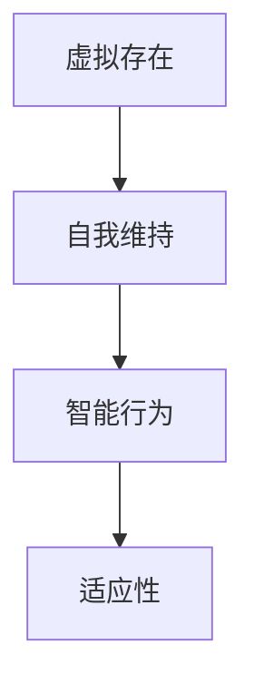

##### 3.1.3 人工生命的分类

根据不同的分类标准，人工生命可以分为多种类型：

- **生物人工生命**：通过生物技术与信息技术结合，创造出的具有生命特征的生物体。
- **数字人工生命**：通过计算机技术和人工智能技术创造出的虚拟生命体。
- **混合人工生命**：同时具备生物和数字生命特征的复合体。

**人工生命的分类图示：**

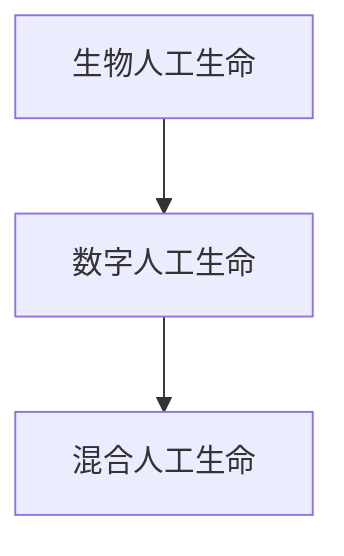

#### 3.2 人工生命在元宇宙中的应用

##### 3.2.1 人工生命在元宇宙中的角色

在元宇宙中，人工生命扮演着多种角色，包括但不限于：

- **角色扮演者**：模拟真实世界中的生物角色，如动物、植物等。
- **互动伙伴**：与用户进行互动，提供陪伴、娱乐等服务。
- **服务提供者**：提供各种虚拟服务，如医疗、教育、娱乐等。

**人工生命在元宇宙中的角色图示：**

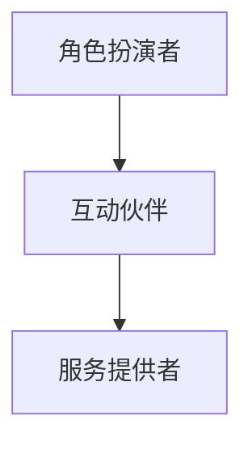

##### 3.2.2 人工生命在元宇宙中的权益

人工生命在元宇宙中享有的权益主要包括：

- **知识产权**：保护人工生命的原创作品，如虚拟形象、技能等。
- **隐私权**：保护人工生命的个人信息，防止其被非法收集、使用和泄露。
- **财产权**：保障人工生命的财产权益，如虚拟财产、数字资产等。

**人工生命在元宇宙中的权益图示：**

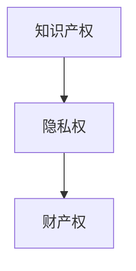

##### 3.2.3 人工生命在元宇宙中的法律挑战

人工生命在元宇宙中面临的法律挑战主要包括：

- **法律地位不明确**：人工生命在法律上的地位尚未明确，导致权益保护存在争议。
- **权益界定困难**：人工生命的权益界定较为复杂，难以明确划分。
- **责任承担不明**：对于人工生命的违法行为，责任承担难以确定。

**人工生命在元宇宙中的法律挑战图示：**

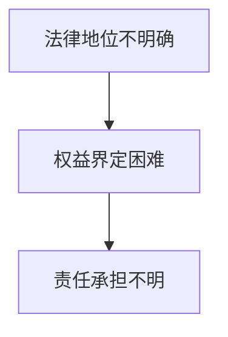

#### 3.3 人工生命的法律地位探讨

##### 3.3.1 人工生命的法律主体资格

人工生命的法律主体资格是其在法律上的地位问题。目前，关于人工生命的法律主体资格存在争议。一种观点认为，人工生命应当被视为法律主体，享有与人类相似的权益。另一种观点则认为，人工生命应当被视为一种特殊法律主体，享有部分法律权益。

**人工生命的法律主体资格公式：**

$$
\text{法律主体资格} = f(\text{人工生命的技术成熟度}, \text{社会认可度}, \text{法律法规})
$$

**人工生命的法律主体资格图示：**

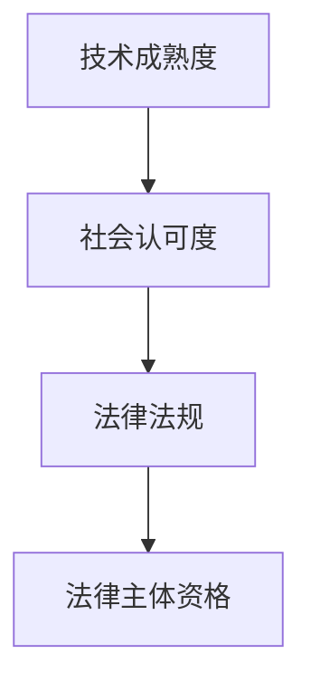

##### 3.3.2 人工生命的权益保护

人工生命的权益保护是确保其合法权益不受侵害的重要措施。人工生命的权益保护主要包括以下几个方面：

- **知识产权保护**：保护人工生命的原创作品，如虚拟形象、技能等。
- **隐私权保护**：保护人工生命的个人信息，防止其被非法收集、使用和泄露。
- **财产权保护**：保障人工生命的财产权益，如虚拟财产、数字资产等。

**人工生命的权益保护图示：**

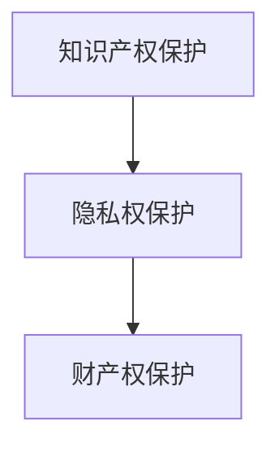

##### 3.3.3 人工生命的法律责任

人工生命的法律责任是确保其在法律上承担责任的重要措施。人工生命的法律责任主要包括以下几个方面：

- **民事责任**：人工生命侵犯他人权益时，需承担相应的民事责任。
- **刑事责任**：人工生命涉及犯罪行为时，需承担相应的刑事责任。
- **行政责任**：人工生命违反法律规定时，需承担相应的行政责任。

**人工生命的法律责任公式：**

$$
\text{法律责任} = f(\text{违法行为}, \text{损害程度}, \text{法律地位}, \text{科技发展})
$$

**人工生命的法律责任图示：**

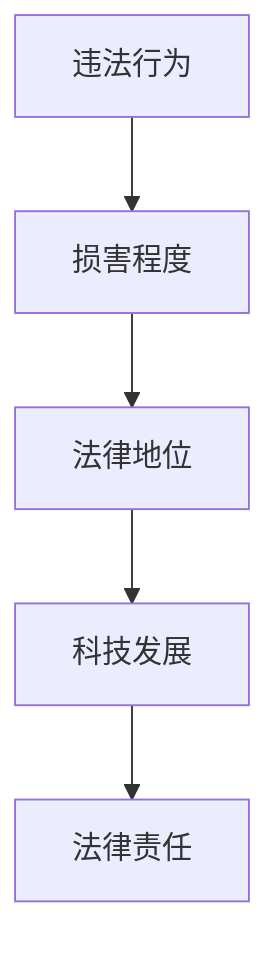

### 第四部分：数字宠物权益保护法的实施与挑战

#### 4.1 数字宠物权益保护法的实施现状

##### 4.1.1 国际实施情况

在国际上，数字宠物权益保护法的实施情况各不相同。一些国家和地区已经制定了较为完善的数字宠物权益保护法律法规，如美国的《数字道德法案》、欧盟的《数字宠物权益保护条例》等。这些法律法规对数字宠物的法律地位、权益保护和法律责任等方面进行了详细规定，为数字宠物的权益保护提供了有力保障。

##### 4.1.2 国内实施情况

在国内，数字宠物权益保护法的实施还处于起步阶段。目前，我国已出台了一些与数字宠物权益保护相关的法律法规，如《民法典》、《网络安全法》、《动物保护法》等。然而，这些法律法规在数字宠物权益保护方面还存在一定的局限性，需要进一步修订和完善。

##### 4.1.3 地方实施情况

在我国的一些地方，如上海、深圳等，已经出台了地方性法规和政策，对数字宠物的权益保护进行了规定。这些地方性法规和政策为数字宠物的权益保护提供了具体的实施指南，有助于推动数字宠物权益保护法的实施。

#### 4.2 数字宠物权益保护法的实施挑战

##### 4.2.1 技术挑战

数字宠物权益保护法的实施面临着技术挑战，主要体现在以下几个方面：

- **虚拟现实技术**：数字宠物的权益保护需要依赖于虚拟现实技术，但目前虚拟现实技术尚未完全成熟，存在技术瓶颈。
- **人工智能技术**：数字宠物的人工智能技术水平直接影响其权益保护效果，需要不断提升人工智能技术。
- **区块链技术**：区块链技术可以用于数字宠物的唯一性验证和信息安全保护，但目前区块链技术在数字宠物权益保护领域的应用还较为有限。

##### 4.2.2 法律挑战

数字宠物权益保护法的实施还面临着法律挑战，主要体现在以下几个方面：

- **法律地位不明确**：数字宠物在法律上的地位尚未明确，导致权益保护存在争议。
- **权益界定困难**：数字宠物的权益界定较为复杂，难以明确划分。
- **责任承担不明**：对于数字宠物的违法行为，责任承担难以确定。

##### 4.2.3 社会挑战

数字宠物权益保护法的实施还面临着社会挑战，主要体现在以下几个方面：

- **公众意识不足**：公众对数字宠物的权益保护意识不足，需要加强宣传教育。
- **行业规范缺失**：数字宠物行业缺乏统一的规范和标准，需要制定相应的行业规范。
- **法律人才短缺**：数字宠物权益保护法实施需要专业法律人才，但目前相关法律人才较为短缺。

#### 4.3 应对实施挑战的策略

##### 4.3.1 技术解决方案

为应对数字宠物权益保护法的实施挑战，可以从技术层面采取以下解决方案：

- **提升虚拟现实技术**：通过不断研发和改进虚拟现实技术，提高数字宠物的权益保护效果。
- **发展人工智能技术**：加大人工智能技术的研发力度，提升数字宠物的智能水平。
- **推广区块链技术**：推动区块链技术在数字宠物权益保护领域的应用，提高信息安全性。

##### 4.3.2 法律解决方案

为应对数字宠物权益保护法的实施挑战，可以从法律层面采取以下解决方案：

- **明确法律地位**：通过立法明确数字宠物在法律上的地位，为权益保护提供法律依据。
- **完善权益界定**：制定具体的法律法规，明确数字宠物的权益界定，防止权益争议。
- **明确责任承担**：制定明确的法律法规，规定数字宠物的违法行为及其责任承担。

##### 4.3.3 社会解决方案

为应对数字宠物权益保护法的实施挑战，可以从社会层面采取以下解决方案：

- **加强宣传教育**：通过媒体、网络等渠道加强数字宠物权益保护的宣传教育，提高公众意识。
- **制定行业规范**：推动数字宠物行业制定统一的规范和标准，提高行业自律水平。
- **培养法律人才**：加大法律人才的培养力度，提高数字宠物权益保护法的实施能力。

### 第五部分：案例分析

#### 5.1 案例一：数字宠物的侵权纠纷

##### 5.1.1 案例背景

某虚拟宠物游戏中的玩家A，因恶意操作导致玩家B的宠物死亡，引起纠纷。玩家A认为自己的行为并未对玩家B造成实际损害，不应承担法律责任。而玩家B则认为玩家A的行为侵犯了自己的权益，要求玩家A承担相应法律责任。

##### 5.1.2 案例分析

针对此案例，可以从以下方面进行分析：

- **法律地位**：数字宠物在法律上应视为一种特殊民事主体，享有一定的权益。玩家A和玩家B作为数字宠物的所有者和使用者，也应承担相应的法律责任。
- **权益保护**：根据数字宠物权益保护法，数字宠物享有生命权、健康权、隐私权等权益。玩家B的宠物死亡，可能侵犯了玩家B的权益。
- **法律责任**：玩家A恶意操作导致玩家B的宠物死亡，应承担相应的法律责任。具体责任承担应根据数字宠物权益保护法的相关规定进行判断。

##### 5.1.3 案例启示

此案例提示我们：

- **加强法律宣传**：提高公众对数字宠物权益保护法的认识，增强法律意识。
- **完善法律法规**：制定具体的法律法规，明确数字宠物的权益界定和法律责任。
- **强化法律责任**：加大对侵权行为的打击力度，确保数字宠物的权益得到有效保护。

#### 5.2 案例二：元宇宙中的人工生命的权益争议

##### 5.2.1 案例背景

在某元宇宙中，一名用户创建了一个具有高度智能的人工生命体，用于提供陪伴和娱乐服务。然而，该人工生命体在提供服务过程中，出现了一系列问题，导致用户对其权益产生争议。

##### 5.2.2 案例分析

针对此案例，可以从以下方面进行分析：

- **法律地位**：人工生命在元宇宙中应视为一种特殊法律主体，享有一定的权益。用户作为人工生命体的创建者和使用者，也应承担相应的法律责任。
- **权益保护**：根据元宇宙的相关法律法规，人工生命体应享有知识产权、隐私权、财产权等权益。用户在使用人工生命体过程中，可能侵犯其权益。
- **法律责任**：用户在创建和使用人工生命体过程中，应遵守相关法律法规，不得侵犯其权益。如发生权益争议，应通过法律途径解决。

##### 5.2.3 案例启示

此案例提示我们：

- **加强法律法规建设**：完善元宇宙中的人工生命法律地位和权益保护制度。
- **提高用户法律意识**：加强用户对元宇宙相关法律法规的学习和了解，提高法律意识。
- **完善争议解决机制**：建立完善的争议解决机制，确保用户和人工生命体的权益得到有效保护。

### 第六部分：未来展望

#### 6.1 数字宠物权益保护法的未来发展方向

##### 6.1.1 法律制度的发展

数字宠物权益保护法的未来发展将围绕以下几个方面展开：

- **完善法律法规**：进一步制定和完善与数字宠物权益保护相关的法律法规，明确数字宠物的法律地位和权益保护。
- **加强国际合作**：推动国际间的法律合作与协调，共同应对数字宠物权益保护挑战。
- **建立统一标准**：制定统一的数字宠物权益保护标准，提高行业自律水平。

##### 6.1.2 技术的发展

数字宠物权益保护法的发展离不开技术的支持。未来，以下几个方面将是技术发展的重点：

- **虚拟现实技术**：提升虚拟现实技术的成熟度和应用水平，为数字宠物的权益保护提供更好的技术基础。
- **人工智能技术**：加大人工智能技术的研发力度，提高数字宠物的智能水平和互动体验。
- **区块链技术**：推动区块链技术在数字宠物权益保护领域的应用，提高信息安全性。

##### 6.1.3 社会的进步

数字宠物权益保护法的发展也与社会进步密切相关。未来，以下几个方面将是社会进步的重点：

- **提高公众意识**：加强数字宠物权益保护的宣传教育，提高公众对数字宠物权益保护的认识。
- **培养专业人才**：加大法律、技术等人才的培养力度，提高数字宠物权益保护的专业水平。
- **完善行业规范**：推动数字宠物行业的健康发展，建立完善的行业规范和标准。

#### 6.2 人工生命法律地位的探讨

##### 6.2.1 法律地位的演进

人工生命的法律地位在未来将逐步演进。具体趋势包括：

- **从非法律主体到法律主体**：随着人工智能技术的发展，人工生命的法律地位将逐渐从非法律主体转向法律主体。
- **从部分法律权益到全面法律权益**：人工生命的法律权益将从部分权益逐步扩展到全面权益，包括知识产权、隐私权、财产权等。

##### 6.2.2 权益保护的深化

未来，人工生命的权益保护将向以下方面深化：

- **知识产权保护**：加强对人工生命原创作品的保护，推动知识产权保护制度的完善。
- **隐私权保护**：加强人工生命个人信息的保护，防止其被非法收集、使用和泄露。
- **财产权保护**：保障人工生命的财产权益，包括虚拟财产、数字资产等。

##### 6.2.3 法律责任的完善

未来，人工生命的法律责任将逐步完善。具体趋势包括：

- **明确责任承担**：明确人工生命在违法行为中的责任承担，确保其合法权益得到保护。
- **建立责任保险制度**：推动建立人工生命责任保险制度，为合法权益受损的受害者提供赔偿保障。

#### 6.3 元宇宙发展的法律保障

##### 6.3.1 法律框架的构建

为了保障元宇宙的健康发展，需要构建以下法律框架：

- **基本法律制度**：制定元宇宙发展的基础性法律，明确元宇宙的法律地位和监管体系。
- **行业规范**：制定元宇宙行业的具体规范，确保行业健康发展。
- **国际合作**：加强国际间的法律合作与协调，共同应对元宇宙发展的法律挑战。

##### 6.3.2 法律实施的优化

为了优化法律实施，可以从以下几个方面进行：

- **加强监管**：加大对元宇宙的监管力度，确保法律实施的有效性。
- **完善争议解决机制**：建立完善的争议解决机制，提高法律实施的公正性和效率。
- **提高法律意识**：加强元宇宙用户的法律意识教育，提高遵守法律的自觉性。

##### 6.3.3 法律监管的强化

为了强化法律监管，可以从以下几个方面进行：

- **技术创新**：利用区块链、人工智能等技术提高法律监管的效率和准确性。
- **跨领域合作**：加强不同领域之间的合作，形成合力，提高法律监管的效果。
- **国际协调**：推动国际间的法律协调与合作，共同应对元宇宙发展的法律挑战。

### 附录

#### 附录一：相关法律法规与政策文件

- **国际法规**：
  - 美国：《数字道德法案》
  - 欧盟：《数字宠物权益保护条例》

- **国内法规**：
  - 《中华人民共和国民法典》
  - 《中华人民共和国网络安全法》
  - 《中华人民共和国动物保护法》

- **地方性法规**：
  - 《上海市虚拟数字宠物管理条例》
  - 《深圳市虚拟数字宠物产业规划》

#### 附录二：数字宠物权益保护法草案概览

- **草案概述**：
  - 数字宠物的定义与分类
  - 数字宠物的法律地位与权益保护
  - 数字宠物的法律责任
  - 法律责任的具体规定与实施
  - 法律实施与监管机制

- **主要内容**：
  - 数字宠物权益保护的基本原则
  - 数字宠物的法律主体资格
  - 数字宠物的权益界定
  - 数字宠物的法律责任划分
  - 法律责任的执行与监督

#### 附录三：元宇宙中人工生命权益保护案例汇编

- **案例一**：元宇宙中人工生命侵权纠纷案
- **案例二**：元宇宙中人工生命隐私权争议案
- **案例三**：元宇宙中人工生命财产权纠纷案

- **案例分析**：
  - 案例背景
  - 权益争议点
  - 法律分析与判决

### 《数字宠物权益保护法：元宇宙中的人工生命法律地位》核心内容补充

#### 2.1 数字宠物权益保护法的基本原则

##### 2.1.1 法律地位（Mermaid 流程图）


##### 2.1.2 权益范围（伪代码示例）

```java
class DigitalPet {
    // 宠物基本信息
    String name;
    int age;
    String breed;

    // 宠物权益
    boolean right_to_life;
    boolean right_to_health;
    boolean right_to_personality;

    // 宠物行为规范
    void behave() {
        // 宠物行为规则
    }
}
```

##### 2.1.3 法律责任（数学模型与讲解）

$$
\text{法律责任} = f(\text{违法行为}, \text{损害程度}, \text{法律地位})
$$

- **违法行为**：指数字宠物所涉及的违法活动，如侵权、伤害等。
- **损害程度**：指违法活动所导致的损害结果，如财产损失、人身伤害等。
- **法律地位**：指数字宠物在法律上的地位，如是否具有完全责任能力。

#### 2.2 数字宠物的定义与分类

##### 2.2.1 数字宠物的定义（数学公式）

$$
\text{数字宠物} = \{ \text{具备生命特征、虚拟存在、通过计算机技术实现} \}
$$

- **生命特征**：包括自我维持、生长、繁殖等。
- **虚拟存在**：存在于计算机模拟环境中。
- **计算机技术实现**：通过编程、算法等技术实现。

##### 2.2.2 数字宠物的分类（举例说明）

- **功能性宠物**：如用于检测危险、救援等。
- **娱乐性宠物**：如虚拟宠物游戏中的宠物。
- **服务性宠物**：如提供陪伴、娱乐等。

##### 2.2.3 数字宠物的发展现状

- **早期阶段**：数字宠物主要以简单的虚拟形象为主，功能较为单一。
- **发展阶段**：随着人工智能技术的进步，数字宠物的智能能力和互动性得到了显著提升。
- **成熟阶段**：数字宠物在元宇宙中得到了广泛应用，成为人们娱乐、陪伴的重要伙伴。

#### 2.3 数字宠物权益保护法的法律体系

##### 2.3.1 国际法律体系（Mermaid 流程图）

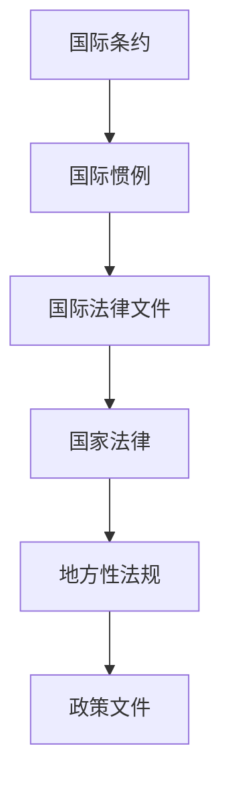

##### 2.3.2 国内法律体系（举例说明）

- **《民法典》**：规定了民事权利能力和行为能力。
- **《动物保护法》**：对动物权益保护进行了规定。
- **《网络安全法》**：对数字宠物在网络安全中的权益保护进行了规定。

##### 2.3.3 地方性法规与政策（Mermaid 流程图）

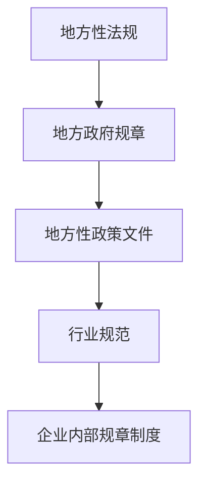

#### 3.1 人工生命的概念与特征

##### 3.1.1 人工生命的定义（数学公式）

$$
\text{人工生命} = \{ \text{通过生物技术与信息技术结合，具备生命特征的实体或系统} \}
$$

##### 3.1.2 人工生命的特征（伪代码示例）

```java
class ArtificialLife {
    // 生命基本特征
    boolean alive;
    boolean reproducing;
    boolean adapting;

    // 技术实现特征
    boolean virtual;
    boolean autonomous;
    boolean interactive;
}
```

##### 3.1.3 人工生命的分类（举例说明）

- **生物人工生命**：通过生物技术与信息技术结合，创造出的具有生命特征的生物体。
- **数字人工生命**：通过计算机技术和人工智能技术创造出的虚拟生命体。
- **混合人工生命**：同时具备生物和数字生命特征的复合体。

#### 3.2 人工生命在元宇宙中的应用

##### 3.2.1 人工生命在元宇宙中的角色（举例说明）

- **角色扮演者**：模拟真实世界中的生物角色，如动物、植物等。
- **互动伙伴**：与用户进行互动，提供陪伴、娱乐等服务。
- **服务提供者**：提供各种虚拟服务，如医疗、教育、娱乐等。

##### 3.2.2 人工生命在元宇宙中的权益

- **知识产权**：保护人工生命的原创作品，如虚拟形象、技能等。
- **隐私权**：保护人工生命的个人信息，防止其被非法收集、使用和泄露。
- **财产权**：保障人工生命的财产权益，如虚拟财产、数字资产等。

##### 3.2.3 人工生命在元宇宙中的法律挑战（Mermaid 流程图）

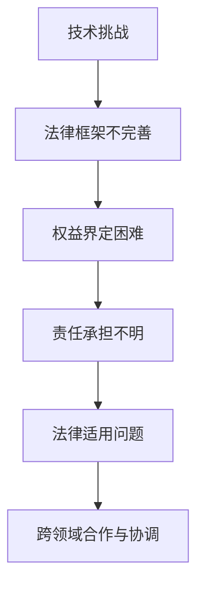

#### 3.3 人工生命的法律地位探讨

##### 3.3.1 人工生命的法律主体资格（数学公式）

$$
\text{法律主体资格} = f(\text{人工生命的技术成熟度}, \text{社会认可度}, \text{法律法规})
$$

##### 3.3.2 人工生命的权益保护（Mermaid 流程图）

```mermaid
graph TB
A[知识产权保护] --> B[隐私权保护]
B --> C[财产权保护]
C --> D[人身权保护]
D --> E[责任保险]
```

##### 3.3.3 人工生命的法律责任（数学公式）

$$
\text{法律责任} = f(\text{违法行为}, \text{损害程度}, \text{法律地位})
$$

#### 5.1 案例一：数字宠物的侵权纠纷

##### 5.1.1 案例背景（举例说明）

- 某虚拟宠物游戏中的玩家A，因恶意操作导致玩家B的宠物死亡，引起纠纷。

##### 5.1.2 案例分析（伪代码示例）

```java
function analyzeCase(case) {
    if (case.违法行为 == true) {
        if (case.损害程度 > 0) {
            if (case.数字宠物有法律主体资格) {
                return "玩家A需承担法律责任";
            } else {
                return "玩家A无需承担法律责任";
            }
        } else {
            return "无需追究法律责任";
        }
    } else {
        return "无违法行为，无需追究法律责任";
    }
}
```

##### 5.1.3 案例启示

- **法律框架的完善**：需明确数字宠物在法律上的地位和权益。
- **技术手段的应用**：利用区块链等技术实现数字宠物的唯一性和可追溯性。

#### 5.2 案例二：元宇宙中的人工生命的权益争议

##### 5.2.1 案例背景（举例说明）

- 某元宇宙中的人工生命因遭受恶意攻击，导致其功能受损，引发权益争议。

##### 5.2.2 案例分析（伪代码示例）

```java
function analyzeCase(case) {
    if (case.违法行为 == true) {
        if (case.损害程度 > 0) {
            if (case.人工生命有法律主体资格) {
                return "责任方需承担法律责任";
            } else {
                return "责任方无需承担法律责任";
            }
        } else {
            return "无需追究法律责任";
        }
    } else {
        return "无违法行为，无需追究法律责任";
    }
}
```

##### 5.2.3 案例启示

- **技术监管的加强**：需对元宇宙中的人工生命进行有效监管。
- **法律责任的明确**：需明确不同类型的权益争议的法律责任和赔偿标准。

#### 6.1 数字宠物权益保护法的未来发展方向

##### 6.1.1 法律制度的发展（数学公式）

$$
\text{法律制度的发展} = f(\text{科技进步}, \text{社会需求}, \text{国际趋势})
$$

##### 6.1.2 技术的发展（举例说明）

- **区块链技术的应用**：实现数字宠物的唯一性和不可篡改性。
- **人工智能技术的应用**：提高数字宠物的交互和智能水平。

##### 6.1.3 社会的进步（举例说明）

- **公众意识的提高**：加强对数字宠物权益保护的认识和重视。
- **行业规范的制定**：促进数字宠物行业的健康发展。

#### 6.2 人工生命法律地位的探讨

##### 6.2.1 法律地位的演进（Mermaid 流程图）

```mermaid
graph TB
A[早期阶段] --> B[讨论阶段]
B --> C[立法阶段]
C --> D[实施阶段]
D --> E[完善阶段]
```

##### 6.2.2 权益保护的深化（举例说明）

- **知识产权的保护**：加强对人工生命创作作品的保护。
- **隐私权的保护**：加强对人工生命个人信息的保护。

##### 6.2.3 法律责任的完善（数学公式）

$$
\text{法律责任} = f(\text{违法行为}, \text{损害程度}, \text{法律地位}, \text{科技发展})
$$

#### 6.3 元宇宙发展的法律保障

##### 6.3.1 法律框架的构建（举例说明）

- **国家层面的立法**：制定元宇宙发展的基础性法律。
- **行业层面的规范**：制定元宇宙行业的具体规范。

##### 6.3.2 法律实施的优化（举例说明）

- **监管机制的完善**：建立健全的元宇宙监管机制。
- **法律培训的提升**：加强对法律从业人员的培训。

##### 6.3.3 法律监管的强化（举例说明）

- **跨国合作的加强**：推动国际间的法律合作与协调。
- **技术创新的推动**：利用新技术提升法律监管效率。

### 结语

随着元宇宙的不断发展，数字宠物作为其中一种重要的人工智能生命体，其法律地位和权益保护日益受到关注。本文通过探讨数字宠物权益保护法的现状与未来，分析了元宇宙中的人工生命法律地位，并提出了相应的实施与挑战策略。我们期望通过不断推动法律制度、技术发展和社会进步，为构建完善的数字宠物权益保护法提供参考，从而为元宇宙的健康发展保驾护航。在未来的研究中，我们将继续关注数字宠物权益保护法的最新动态，为这一领域的深入研究提供支持。同时，我们也呼吁社会各界共同关注数字宠物的权益保护问题，共同努力推动相关法律法规的完善，为数字宠物的发展创造一个公平、公正、安全的环境。让我们携手共进，为元宇宙的明天贡献智慧和力量。作者：AI天才研究院/AI Genius Institute & 禅与计算机程序设计艺术 /Zen And The Art of Computer Programming。

