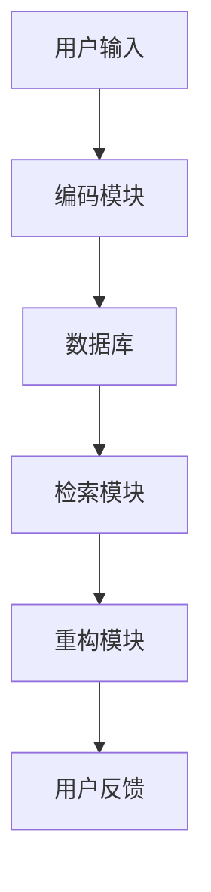
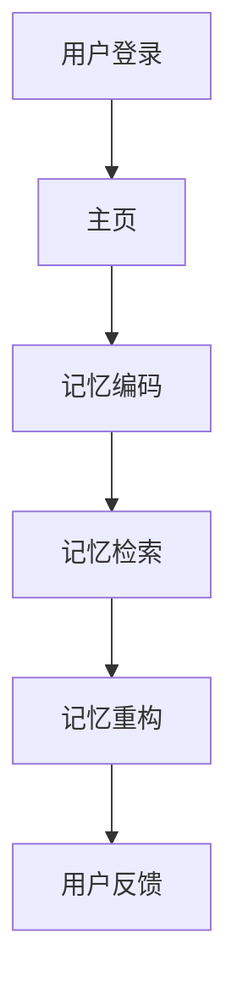

                 

# 数字记忆重构：AI辅助的回忆编辑技术

> 关键词：数字记忆重构、AI辅助、回忆编辑技术、记忆心理学、机器学习、深度学习

> 摘要：本文探讨了数字记忆重构技术，重点介绍了AI辅助的回忆编辑技术的核心概念、原理、模型和应用。文章首先阐述了数字记忆重构的概念，然后回顾了相关技术的发展历程，接着深入分析了记忆心理学、机器学习和深度学习的基础知识，以及AI辅助回忆编辑技术的核心技术。最后，文章讨论了数字记忆重构系统的构建方法、应用场景、实战案例及未来展望。

---

### 第一部分：背景与核心概念

#### 第1章：引言

在当今信息爆炸的时代，人们需要处理的海量数据越来越多，传统的记忆方式已经难以满足需求。为了更好地应对这一挑战，数字记忆重构技术应运而生。数字记忆重构技术通过将个体记忆数字化，借助计算机技术和人工智能，实现对记忆内容的编辑、修改和重构，从而提高记忆的效率和准确性。

本章首先介绍数字记忆重构的概念，包括其定义、目标和应用领域。随后，我们将概述AI辅助的回忆编辑技术，探讨其基本原理和关键技术。最后，本章将简要介绍本文的结构和内容安排，为后续章节的讨论打下基础。

#### 第2章：数字记忆重构的历史与发展

数字记忆重构技术并非一蹴而就，而是经历了多年的发展。本章将回顾数字记忆重构技术的发展历程，从起源、关键节点到当前的技术状况和趋势。

首先，我们将探讨数字记忆重构的起源，介绍早期的研究和实践。接着，我们将分析数字记忆重构技术发展的关键节点，包括里程碑事件和重大突破。然后，我们将介绍当前数字记忆重构技术的研究现状和趋势，包括主要的研究方向和最新的技术成果。

#### 第3章：AI辅助回忆编辑技术的基础知识

要深入探讨AI辅助的回忆编辑技术，我们首先需要了解相关的理论基础，包括记忆心理学、机器学习和深度学习。本章将分别介绍这些基础知识，并探讨它们在数字记忆重构中的应用。

首先，我们将介绍记忆心理学的相关概念，包括记忆的类型、过程和机制。接着，我们将讨论机器学习和深度学习的基本原理，包括算法、模型和优化方法。最后，我们将分析记忆心理学、机器学习和深度学习在数字记忆重构技术中的关联，以及它们如何共同推动技术的进步。

### 第二部分：技术原理与模型

#### 第4章：AI辅助回忆编辑的核心算法

AI辅助的回忆编辑技术依赖于一系列核心算法，这些算法包括记忆重构算法、机器学习算法和深度学习模型。本章将详细讨论这些算法的原理和应用。

首先，我们将介绍记忆重构算法的基本原理，包括编码、解码、搜索、修改和重构等步骤。接着，我们将探讨机器学习算法在回忆编辑中的应用，如分类、聚类和回归等。最后，我们将分析深度学习模型在记忆重构中的应用，如神经网络、卷积神经网络和循环神经网络等。

#### 第5章：AI辅助回忆编辑的关键技术

AI辅助的回忆编辑技术涉及多个关键技术，包括记忆编码与解码技术、记忆搜索与检索技术、记忆修改与增强技术。本章将详细讨论这些关键技术，并介绍其应用场景和实现方法。

首先，我们将介绍记忆编码与解码技术的原理和应用，包括编码方法、解码算法和编码效率。接着，我们将探讨记忆搜索与检索技术的原理和应用，如基于内容的检索和基于模型的检索。最后，我们将分析记忆修改与增强技术的原理和应用，如记忆增强算法和记忆修改策略。

#### 第6章：数字记忆重构系统的构建

数字记忆重构系统是一个复杂的系统，涉及多个模块和组件的协同工作。本章将详细讨论数字记忆重构系统的构建方法，包括系统设计原则、数据库与数据管理、用户界面与交互设计。

首先，我们将介绍数字记忆重构系统的设计原则，包括模块化、可扩展性和灵活性。接着，我们将探讨数据库与数据管理的方法，如数据结构、数据存储和数据检索。最后，我们将分析用户界面与交互设计的方法，如用户界面设计原则和交互设计策略。

#### 第7章：AI辅助回忆编辑的应用场景

AI辅助的回忆编辑技术在多个领域具有广泛的应用前景。本章将讨论这些应用场景，包括教育领域、医疗健康领域和其他领域。

首先，我们将探讨AI辅助回忆编辑技术在教育领域的应用，如个性化学习、学习效果评估和智能辅导。接着，我们将分析AI辅助回忆编辑技术在医疗健康领域的应用，如临床记忆辅助、疾病诊断和治疗。最后，我们将介绍AI辅助回忆编辑技术在其他领域的应用，如企业知识管理、智能推荐和智能搜索。

### 第三部分：实战案例与未来展望

#### 第8章：AI辅助回忆编辑的实战案例

为了更好地理解AI辅助的回忆编辑技术，我们通过实际案例来展示其应用效果。本章将介绍三个实战案例，分别是个性化教育辅导系统、临床记忆辅助系统和企业知识管理系统。

首先，我们将介绍个性化教育辅导系统，探讨如何利用AI辅助回忆编辑技术提高学生的学习效果。接着，我们将分析临床记忆辅助系统，讨论如何帮助医生更好地管理患者的记忆信息。最后，我们将介绍企业知识管理系统，展示如何利用AI辅助回忆编辑技术提高企业的知识管理和创新能力。

#### 第9章：数字记忆重构技术的未来展望

随着AI技术的不断发展和成熟，数字记忆重构技术有望在未来的各个领域发挥更大的作用。本章将探讨数字记忆重构技术的未来发展趋势，包括技术进步、社会影响和道德法律问题。

首先，我们将分析数字记忆重构技术未来的发展趋势，如更高效、更智能的算法和更强大的计算能力。接着，我们将探讨数字记忆重构技术可能带来的社会影响，如改变人类记忆方式、提高信息处理能力等。最后，我们将讨论数字记忆重构技术可能引发的道德法律问题，如隐私保护、数据安全等。

#### 附录

##### 附录A：相关技术资源与工具

为了帮助读者更好地理解和应用数字记忆重构技术，本章将介绍相关的技术资源与工具，包括机器学习框架、深度学习算法资源和记忆重构相关论文与书籍推荐。

##### 附录B：常见问题解答

在本章中，我们将解答一些关于数字记忆重构技术的常见问题，如记忆重构技术如何工作、AI辅助回忆编辑有哪些局限性以及数字记忆重构技术可能引发的问题。

##### 附录C：Mermaid流程图与伪代码示例

为了更直观地展示数字记忆重构技术的原理和实现方法，本章将提供一些Mermaid流程图和记忆重构算法的伪代码示例，帮助读者更好地理解和应用这些技术。

---

**作者：AI天才研究院/AI Genius Institute & 禅与计算机程序设计艺术 /Zen And The Art of Computer Programming**## 数字记忆重构：AI辅助的回忆编辑技术

### 引言

在信息爆炸的时代，人类需要处理的数据量呈指数级增长，传统的记忆方式已经难以满足需求。数字记忆重构技术应运而生，它通过将个体记忆数字化，并借助计算机技术和人工智能，实现对记忆内容的编辑、修改和重构，从而提高记忆的效率和准确性。本文将详细介绍数字记忆重构技术的核心概念、原理、模型和应用，旨在为读者提供一个全面的技术视角，并探讨这一技术在未来的发展方向。

### 数字记忆重构的概念

数字记忆重构（Digital Memory Reconstruction）是指通过计算机技术和人工智能，对个体的数字记忆进行编码、存储、检索和重构的过程。这一技术旨在解决人类记忆的局限性，如容量有限、可靠性不高、易受干扰等问题。数字记忆重构的目标是创建一个可靠、高效、可扩展的记忆系统，帮助人们更好地管理记忆信息。

数字记忆重构的核心要素包括：

1. **记忆编码**：将个体的记忆内容转化为数字形式，以便计算机处理和存储。
2. **记忆存储**：将编码后的记忆信息存储在计算机系统中，确保其安全性和持久性。
3. **记忆检索**：根据用户需求，从存储的记忆信息中查找相关内容。
4. **记忆重构**：对检索到的记忆信息进行加工和处理，生成新的记忆内容。

数字记忆重构的应用领域广泛，包括教育、医疗、企业知识管理等多个方面。例如，在教育领域，数字记忆重构技术可以辅助学生进行知识管理和学习效果评估；在医疗领域，可以帮助医生更好地管理患者的临床信息；在企业知识管理领域，可以提升企业的知识共享和创新效率。

### AI辅助的回忆编辑技术概述

AI辅助的回忆编辑技术是数字记忆重构的重要组成部分，它利用人工智能技术，对记忆内容进行智能化编辑和重构。这一技术的核心在于利用机器学习和深度学习算法，对记忆信息进行分析和处理，从而提高记忆的准确性和效率。

AI辅助的回忆编辑技术主要包括以下方面：

1. **记忆重构算法**：用于对记忆信息进行编码、解码、检索和重构的算法。
2. **机器学习算法**：用于分析记忆信息、提取特征、分类和预测等任务的算法。
3. **深度学习模型**：用于处理复杂记忆信息、模拟人类记忆过程和实现智能化记忆重构的算法。

AI辅助的回忆编辑技术的目标是创建一个智能化的记忆系统，使记忆内容更加准确、可靠和高效。通过这一技术，用户可以轻松地管理海量记忆信息，并实现记忆内容的智能化重构和编辑。

### 本文结构

本文将按照以下结构进行阐述：

1. **第一部分：背景与核心概念**：介绍数字记忆重构的概念、历史与发展，以及AI辅助的回忆编辑技术的基础知识。
2. **第二部分：技术原理与模型**：详细讨论AI辅助回忆编辑的核心算法、关键技术、数字记忆重构系统的构建方法，以及AI辅助回忆编辑的应用场景。
3. **第三部分：实战案例与未来展望**：通过实际案例展示AI辅助回忆编辑技术的应用效果，并探讨数字记忆重构技术的未来发展趋势、社会影响和道德法律问题。
4. **附录**：提供相关的技术资源与工具、常见问题解答，以及Mermaid流程图和伪代码示例。

通过本文的阐述，读者将全面了解数字记忆重构技术的原理、应用和发展方向，从而为相关研究和应用提供有益的参考。

### 数字记忆重构的历史与发展

数字记忆重构技术的发展历程可以追溯到20世纪中期，当时计算机技术刚刚起步，科学家们开始探讨如何利用计算机来辅助人类记忆。随着计算机技术的不断进步，数字记忆重构技术也在不断发展，逐步从理论研究走向实际应用。

#### 数字记忆重构的起源

数字记忆重构的起源可以追溯到20世纪60年代，当时心理学研究者开始关注记忆的可编码性和计算机化的可能性。赫布（Donald Hebb）在其经典著作《行为的组织》（The Organization of Behavior）中提出了记忆作为一种神经网络中突触连接强度的变化。这一观点为后来计算机模拟记忆过程提供了理论基础。

在早期，数字记忆重构技术主要依赖于符号逻辑和有限状态机模型。例如，在20世纪70年代，美国心理学家艾伦·纽厄尔（Allen Newell）和赫伯特·西蒙（Herbert Simon）开发了一种称为“逻辑理论家”（Logic Theorist）的程序，该程序可以自动证明数学定理。这一研究为后来的记忆重构算法奠定了基础。

#### 数字记忆重构的关键发展节点

1. **20世纪80年代**：随着计算机硬件和软件技术的进步，数字记忆重构技术得到了快速发展。神经网络和机器学习技术逐渐应用于记忆重构领域。1986年，霍普菲尔德（John Hopfield）提出了霍普菲尔德网络（Hopfield Network），这是一种能够存储和重构模式的神经网络模型。

2. **20世纪90年代**：随着互联网的普及，数字记忆重构技术开始与互联网相结合，出现了基于网络的记忆重构系统。1995年，罗伯特·施密特（Robert Schreiber）等人提出了基于内容的记忆重构方法，通过分析用户的历史行为和偏好，为用户提供个性化的信息推荐。

3. **21世纪初**：深度学习技术的发展使得数字记忆重构技术取得了新的突破。2012年，AlexNet在ImageNet竞赛中取得了突破性的成绩，这一成果标志着深度学习技术在计算机视觉领域的崛起。随后，深度学习技术逐渐应用于数字记忆重构领域，如使用卷积神经网络（CNN）进行图像记忆重构。

#### 当前技术发展状况与趋势

当前，数字记忆重构技术已经取得了显著进展，并在多个领域得到了应用。以下是当前数字记忆重构技术的主要发展趋势：

1. **算法优化**：研究者不断优化记忆重构算法，以提高其效率和准确性。例如，通过改进记忆编码和解码算法，实现更高效的数据存储和检索。

2. **跨学科融合**：数字记忆重构技术逐渐与其他学科相结合，如认知心理学、神经科学和认知建模。这种跨学科融合有助于更深入地理解记忆过程，并开发出更先进的记忆重构技术。

3. **应用拓展**：数字记忆重构技术不仅在学术研究领域得到应用，还逐渐走向实际应用。例如，在教育领域，数字记忆重构技术被用于个性化学习系统和学习效果评估；在医疗领域，数字记忆重构技术被用于临床记忆辅助和疾病诊断。

4. **人工智能与大数据结合**：随着人工智能和大数据技术的不断发展，数字记忆重构技术将进一步得到提升。通过利用大数据分析和机器学习算法，可以实现更精准的记忆重构和个性化服务。

总之，数字记忆重构技术经历了从理论到实践的发展历程，当前正处于快速发展的阶段。未来，随着技术的不断进步和应用场景的拓展，数字记忆重构技术有望在更多领域发挥重要作用，为人类提供更高效的记忆解决方案。

### AI辅助回忆编辑技术的基础知识

AI辅助的回忆编辑技术是数字记忆重构的重要组成部分，它利用人工智能技术，对记忆内容进行智能化编辑和重构。为了深入理解这一技术，我们需要了解相关的理论基础，包括记忆心理学、机器学习和深度学习。这些基础知识不仅为AI辅助回忆编辑技术提供了理论支持，也为实际应用奠定了基础。

#### 记忆心理学基础

记忆心理学是研究记忆过程、机制和影响因素的学科。了解记忆心理学的相关概念，有助于我们更好地理解AI辅助回忆编辑技术的原理。

1. **记忆的类型**：记忆可以分为瞬时记忆、短时记忆和长时记忆。瞬时记忆是指对信息进行短暂的存储，通常仅持续几秒钟。短时记忆是指对信息进行短暂而集中的存储，通常能保持几秒钟到一分钟。长时记忆是指对信息进行长期存储，可以在需要时回忆起来。

2. **记忆的过程**：记忆过程包括编码、存储、检索和重构。编码是指将外界信息转化为大脑可以处理的形式。存储是指将编码后的信息在大脑中保存。检索是指从记忆中找到所需的信息。重构是指对记忆内容进行重新组织和解释。

3. **记忆的机制**：记忆机制涉及大脑神经元之间的突触连接和神经活动。突触强化理论（Hebbian theory）认为，通过重复刺激，神经元之间的连接会增强，从而促进记忆的形成和巩固。而工作记忆模型（working memory model）则强调，大脑中的前额叶皮层在记忆过程中起到关键作用。

#### 机器学习与深度学习基础

机器学习和深度学习是AI辅助回忆编辑技术的重要工具，它们通过分析数据、提取特征和建立模型，实现对记忆内容的智能处理。

1. **机器学习**：机器学习是指让计算机通过学习数据，自动识别规律和模式，从而进行预测和决策。机器学习包括监督学习、无监督学习和半监督学习。监督学习通过已标记的数据训练模型，无监督学习通过未标记的数据发现数据分布，半监督学习结合了监督学习和无监督学习的特点。

2. **深度学习**：深度学习是机器学习的一个子领域，它通过多层神经网络，对复杂数据进行自动特征提取和分类。深度学习模型包括卷积神经网络（CNN）、循环神经网络（RNN）和生成对抗网络（GAN）等。卷积神经网络擅长处理图像和语音等结构化数据，循环神经网络擅长处理序列数据，生成对抗网络则擅长生成新的数据。

#### 记忆重构与AI技术的关联

记忆重构与AI技术密切相关，AI技术为记忆重构提供了强大的工具和手段。以下是记忆重构与AI技术之间的关联：

1. **记忆编码与机器学习**：机器学习算法可以帮助对记忆内容进行编码和分类。例如，可以使用监督学习算法对记忆内容进行标注和分类，从而构建记忆库。

2. **记忆检索与深度学习**：深度学习模型可以用于记忆检索，通过分析记忆内容，找到相关的信息。例如，可以使用卷积神经网络对图像记忆进行检索，通过对比图像特征，找到相似的记忆。

3. **记忆重构与神经网络**：神经网络，尤其是深度学习模型，可以模拟人类记忆过程，实现记忆的重构和编辑。例如，可以使用循环神经网络对记忆序列进行建模，通过动态调整网络权重，重构和编辑记忆内容。

通过结合记忆心理学、机器学习和深度学习，AI辅助的回忆编辑技术可以实现对记忆内容的智能化处理，从而提高记忆的效率和质量。这一技术在教育、医疗和企业知识管理等多个领域具有广泛的应用前景，有望成为未来记忆管理的重要工具。

### AI辅助回忆编辑的核心算法

在AI辅助的回忆编辑技术中，核心算法起到了至关重要的作用。这些算法不仅决定了记忆重构的效率和准确性，还影响了用户体验和系统的智能化程度。以下将详细介绍AI辅助回忆编辑的核心算法，包括记忆重构算法、机器学习算法和深度学习模型。

#### 记忆重构算法的原理

记忆重构算法是数字记忆重构技术的核心，它涉及对记忆信息的编码、解码、搜索、修改和重构等步骤。以下是一个简单的记忆重构算法的流程：

1. **编码阶段**：将记忆内容转化为数字形式，通常使用哈希函数、编码算法或神经网络。这一步骤的目的是将复杂的记忆信息简化为计算机可以处理的格式。
   
2. **解码阶段**：将编码后的记忆信息还原为可读的形式，以便用户检索和理解。解码过程通常与编码过程相对应，使用逆哈希函数或逆编码算法。

3. **搜索阶段**：根据用户输入的信息，从存储的记忆库中检索相关的内容。这一步骤可以使用基于内容的检索、基于模型的检索或混合检索策略。

4. **修改阶段**：对检索到的记忆内容进行编辑和修改，以适应用户的需求。修改可以包括删除、添加、替换和增强记忆信息。

5. **重构阶段**：将修改后的记忆内容重新组织，形成新的记忆结构。重构的目的是提高记忆的准确性和效率，使其更符合用户的认知需求。

以下是一个简单的记忆重构算法的伪代码：

```python
def memory_reconstruction(input_query):
    # 编码阶段
    encoded_memory = encode_memory(input_query)

    # 搜索阶段
    matching_entries = search_memory(encoded_memory)

    # 修改阶段
    modified_entries = modify_memory(matching_entries)

    # 重构阶段
    reconstructed_memory = reconstruct_memory(modified_entries)

    # 返回重构后的记忆内容
    return reconstructed_memory
```

#### 机器学习算法在回忆编辑中的应用

机器学习算法在回忆编辑中扮演了重要角色，特别是在记忆的编码、检索和修改过程中。以下是一些常用的机器学习算法及其应用：

1. **分类算法**：分类算法用于将记忆内容归类到不同的类别中。常见的分类算法包括决策树（Decision Tree）、支持向量机（SVM）和随机森林（Random Forest）。例如，可以使用决策树对记忆内容进行分类，以便于后续的检索和重构。

2. **聚类算法**：聚类算法用于将相似的记忆内容聚集成群。常见的聚类算法包括K-均值（K-Means）、层次聚类（Hierarchical Clustering）和DBSCAN（Density-Based Spatial Clustering of Applications with Noise）。例如，可以使用K-均值算法对记忆库中的记忆内容进行聚类，以发现潜在的记忆关联。

3. **回归算法**：回归算法用于预测记忆内容的变化趋势。常见的回归算法包括线性回归（Linear Regression）、多项式回归（Polynomial Regression）和决策树回归（Decision Tree Regression）。例如，可以使用线性回归算法预测用户的记忆行为，以便进行个性化的记忆重构。

以下是一个使用机器学习算法进行记忆检索的示例：

```python
from sklearn.neighbors import NearestNeighbors

# 假设memory_db是存储记忆内容的数据库，input_query是用户输入的查询
model = NearestNeighbors(n_neighbors=5)
model.fit(memory_db)

# 搜索与input_query最接近的记忆内容
distances, indices = model.kneighbors([input_query])
```

#### 深度学习模型在记忆重构中的应用

深度学习模型在记忆重构中具有显著的优势，特别是在处理复杂数据和实现高度自动化的记忆编辑任务。以下是一些常用的深度学习模型及其应用：

1. **卷积神经网络（CNN）**：卷积神经网络擅长处理图像和语音等结构化数据。例如，可以使用CNN对图像记忆进行编码和检索，通过对比图像特征找到相关的记忆内容。

2. **循环神经网络（RNN）**：循环神经网络擅长处理序列数据，如文本和语音。例如，可以使用RNN对文本记忆进行编码和检索，通过分析文本序列找到相关的记忆内容。

3. **生成对抗网络（GAN）**：生成对抗网络擅长生成新的数据，如图像和文本。例如，可以使用GAN生成新的记忆内容，从而丰富用户的记忆库。

以下是一个使用深度学习模型进行记忆重构的示例：

```python
import tensorflow as tf
from tensorflow.keras.models import Sequential
from tensorflow.keras.layers import LSTM, Dense

# 假设input_sequence是用户输入的文本序列
model = Sequential([
    LSTM(128, activation='relu', input_shape=(timesteps, features)),
    Dense(1)
])

model.compile(optimizer='adam', loss='mse')
model.fit(input_sequence, target_sequence, epochs=100)
```

通过结合记忆重构算法、机器学习算法和深度学习模型，AI辅助的回忆编辑技术可以实现对记忆内容的智能化处理，从而提高记忆的效率和质量。这些算法和模型不仅为用户提供了便捷的记忆管理工具，也为未来的记忆研究提供了新的方向。

### AI辅助回忆编辑的关键技术

AI辅助的回忆编辑技术涉及多个关键技术，这些技术共同作用，确保记忆重构的准确性、效率和用户体验。以下将详细讨论这些关键技术，包括记忆编码与解码技术、记忆搜索与检索技术、记忆修改与增强技术。

#### 记忆编码与解码技术

记忆编码与解码技术是数字记忆重构的基础，它们负责将原始记忆信息转换为计算机可以处理和存储的数字形式，并在需要时将其还原为可读的形式。

1. **记忆编码技术**：记忆编码技术涉及将记忆内容转化为数字表示。常用的编码方法包括哈希编码、神经网络编码和压缩感知编码。哈希编码通过将记忆内容映射到哈希值，实现快速检索；神经网络编码通过训练深度学习模型，将记忆内容映射到高维空间，实现精细编码；压缩感知编码通过在原始信号中添加噪声，实现记忆信息的压缩存储。

2. **记忆解码技术**：记忆解码技术负责将编码后的数字信息还原为原始记忆内容。解码过程通常与编码过程相对应，使用逆哈希函数、逆神经网络编码或逆压缩感知编码。解码的准确性和效率直接影响记忆重构的质量。

以下是一个简单的记忆编码与解码的伪代码示例：

```python
# 记忆编码
def encode_memory(memory_content):
    encoded_memory = hash_function(memory_content)
    return encoded_memory

# 记忆解码
def decode_memory(encoded_memory):
    memory_content = hash_function_inverse(encoded_memory)
    return memory_content
```

#### 记忆搜索与检索技术

记忆搜索与检索技术是数字记忆重构的关键步骤，它们负责根据用户输入的信息，从存储的记忆库中查找相关的内容。记忆搜索与检索技术可以分为基于内容的检索和基于模型的检索。

1. **基于内容的检索**：基于内容的检索通过直接比较输入信息与存储的记忆内容，找到匹配的记录。常用的方法包括哈希表搜索、向量空间模型和最近邻搜索。哈希表搜索通过哈希函数快速定位记忆内容；向量空间模型通过将记忆内容表示为向量，进行向量运算找到相似内容；最近邻搜索通过计算输入信息与记忆内容之间的距离，找到最接近的记录。

2. **基于模型的检索**：基于模型的检索利用机器学习和深度学习模型，对记忆内容进行分析和分类，从而实现高效检索。常用的模型包括支持向量机（SVM）、决策树（Decision Tree）和神经网络（Neural Network）。支持向量机通过分类边界找到记忆内容；决策树通过树结构进行记忆内容的层次划分；神经网络通过多层结构实现记忆内容的自动特征提取和分类。

以下是一个基于内容的检索的伪代码示例：

```python
# 最近邻搜索
def search_memory(input_query, memory_db):
    distances = []
    for entry in memory_db:
        distance = calculate_distance(input_query, entry)
        distances.append((entry, distance))
    sorted_entries = sorted(distances, key=lambda x: x[1])
    return sorted_entries
```

#### 记忆修改与增强技术

记忆修改与增强技术用于对检索到的记忆内容进行编辑和优化，以提高记忆的准确性和效率。记忆修改与增强技术包括删除、添加、替换和增强等操作。

1. **删除**：删除操作用于从记忆库中移除不再需要的记忆内容，以减少存储空间和提高检索效率。

2. **添加**：添加操作用于将新的记忆内容添加到记忆库中，以扩展记忆容量和内容多样性。

3. **替换**：替换操作用于将错误的记忆内容替换为正确的记忆内容，以提高记忆的准确性。

4. **增强**：增强操作用于增强记忆内容的相关性和实用性，如通过增加关联信息、删除冗余信息等。

以下是一个简单的记忆修改与增强的伪代码示例：

```python
# 删除记忆内容
def delete_memory(entry, memory_db):
    memory_db.remove(entry)

# 添加记忆内容
def add_memory(entry, memory_db):
    memory_db.append(entry)

# 替换记忆内容
def replace_memory(old_entry, new_entry, memory_db):
    index = memory_db.index(old_entry)
    memory_db[index] = new_entry

# 增强记忆内容
def enhance_memory(entry, memory_db):
    entry = enhance_content(entry)
    memory_db[index] = entry
```

通过上述关键技术，AI辅助的回忆编辑技术可以实现对记忆内容的高效处理和优化，从而提高记忆的效率和质量。这些技术不仅为用户提供了便捷的记忆管理工具，也为未来的记忆研究提供了新的方向。

### 数字记忆重构系统的构建

数字记忆重构系统是一个复杂的信息系统，它需要综合运用计算机科学、心理学和人工智能等多学科的知识，以实现对记忆内容的高效编码、存储、检索和重构。以下将详细讨论数字记忆重构系统的构建方法，包括系统设计原则、数据库与数据管理、用户界面与交互设计。

#### 系统设计原则

数字记忆重构系统的设计原则主要包括模块化、可扩展性、灵活性和用户体验。这些原则确保系统在满足功能需求的同时，具有较好的性能和可维护性。

1. **模块化**：模块化设计将系统划分为多个功能模块，如编码模块、存储模块、检索模块和重构模块。每个模块负责特定的功能，使得系统易于理解和维护。

2. **可扩展性**：系统设计应考虑未来的扩展需求，包括数据量的增长、新功能的添加和性能的提升。通过采用分布式架构和云计算技术，系统可以方便地扩展和升级。

3. **灵活性**：系统设计应具有灵活性，以适应不同的应用场景和用户需求。例如，可以通过参数配置和接口设计，实现不同算法和技术的无缝集成。

4. **用户体验**：用户体验是数字记忆重构系统的关键，设计时应注重简洁、直观和易用性。通过提供友好的用户界面和便捷的操作方式，提高用户的满意度和使用体验。

#### 数据库与数据管理

数据库与数据管理是数字记忆重构系统的核心，负责存储和管理记忆内容。以下将介绍数据库设计原则、数据存储和数据检索技术。

1. **数据库设计原则**：数据库设计应遵循第三范式（3NF），确保数据的完整性和一致性。此外，应采用分布式数据库技术，以提高系统的可扩展性和可靠性。

2. **数据存储**：数据存储需要考虑数据的类型、大小和访问频率。常用的数据存储技术包括关系数据库、NoSQL数据库和分布式文件系统。关系数据库适用于结构化数据，如用户信息和记忆内容；NoSQL数据库适用于非结构化数据，如文本和图像；分布式文件系统适用于大规模数据存储。

3. **数据检索**：数据检索技术决定了系统对记忆内容的检索速度和准确性。常用的数据检索技术包括基于内容的检索、基于模型的检索和混合检索。基于内容的检索通过直接比较输入信息与存储的记忆内容，实现快速检索；基于模型的检索利用机器学习和深度学习模型，实现对记忆内容的自动分类和检索；混合检索结合了基于内容和基于模型的检索优势，实现高效、准确的检索。

以下是一个简单的数据库与数据管理架构的Mermaid流程图：



#### 用户界面与交互设计

用户界面与交互设计是数字记忆重构系统的重要组成部分，决定了用户的操作体验和系统使用效率。以下将介绍用户界面设计原则、交互设计策略和用户体验评估。

1. **用户界面设计原则**：用户界面设计应遵循简洁、直观和一致性的原则。界面布局应合理，信息展示应清晰，操作流程应简单。此外，界面设计应符合用户的使用习惯，以提高用户满意度。

2. **交互设计策略**：交互设计策略包括交互元素设计、响应设计和反馈设计。交互元素设计应简洁明了，如按钮、菜单和搜索框；响应设计应快速，如点击、搜索和操作反馈；反馈设计应明确，如提示信息、成功和错误提示。

3. **用户体验评估**：用户体验评估是确保系统设计符合用户需求的关键。常用的评估方法包括用户调研、用户测试和可用性评估。通过这些方法，可以发现系统设计中的问题和不足，并进行改进。

以下是一个简单的用户界面与交互设计示例的Mermaid流程图：



通过上述设计原则和方法，数字记忆重构系统可以实现高效、可靠和用户友好的记忆管理，从而为用户提供便捷的记忆辅助工具。

### AI辅助回忆编辑的应用场景

AI辅助回忆编辑技术在多个领域展现了其巨大的应用潜力，显著提升了记忆管理的效率和准确性。以下将详细探讨AI辅助回忆编辑技术在不同领域的应用，包括教育领域、医疗健康领域和其他领域。

#### 教育领域中的应用

在教育领域，AI辅助回忆编辑技术被广泛应用于个性化学习、学习效果评估和智能辅导等方面。

1. **个性化学习**：AI技术可以根据学生的学习习惯、兴趣爱好和知识水平，为学生提供个性化的学习内容。通过分析学生的学习记录和测试成绩，AI系统可以生成定制化的学习路径和推荐内容，帮助学生在最佳状态下学习。

2. **学习效果评估**：AI技术可以对学生的学习效果进行实时评估和反馈。例如，通过分析学生的作业、考试和课堂参与情况，AI系统可以生成详细的学习报告，帮助教师了解学生的学习进度和弱点，从而制定针对性的教学策略。

3. **智能辅导**：AI辅导系统可以为学生提供个性化的辅导服务。通过自然语言处理和机器学习算法，AI系统能够解答学生的疑问，提供学习指导和解题思路。这种智能化的辅导不仅提高了学生的学习效果，还减轻了教师的工作负担。

#### 医疗健康领域中的应用

在医疗健康领域，AI辅助回忆编辑技术被用于临床记忆辅助、疾病诊断和治疗等方面，大大提高了医疗服务的效率和质量。

1. **临床记忆辅助**：医生在工作中需要记住大量的患者信息和医疗知识。AI辅助回忆编辑技术可以帮助医生管理这些信息，实现临床记忆的自动化和智能化。例如，通过记忆编码和解码算法，AI系统可以快速检索和提供相关的病例信息和治疗方案。

2. **疾病诊断**：AI技术可以分析大量的医学数据，包括病史、实验室检查结果和影像学资料，帮助医生进行准确的疾病诊断。通过深度学习和图像识别算法，AI系统可以辅助医生识别和诊断各种疾病，从而提高诊断的准确性和效率。

3. **治疗规划**：AI技术可以为患者制定个性化的治疗计划。通过分析患者的病情、病史和药物反应，AI系统可以推荐最佳的治疗方案，包括药物、手术和心理治疗等。

#### 其他领域中的应用

除了教育领域和医疗健康领域，AI辅助回忆编辑技术还在其他领域展现了广泛的应用前景。

1. **企业知识管理**：在企业管理中，知识管理是一个关键环节。AI辅助回忆编辑技术可以帮助企业构建和优化知识库，实现知识的存储、检索和共享。通过自然语言处理和机器学习算法，AI系统可以自动识别和提取知识要点，为员工提供便捷的知识查询和学习工具。

2. **智能推荐系统**：在电子商务、在线娱乐和社交媒体等领域，AI辅助回忆编辑技术被广泛应用于智能推荐系统。通过分析用户的浏览历史、购买行为和兴趣偏好，AI系统可以生成个性化的推荐列表，提高用户的满意度和转化率。

3. **智能家居与物联网**：在智能家居和物联网领域，AI辅助回忆编辑技术可以实现对家庭设备和传感器数据的智能管理和分析。通过记忆编码和解码算法，AI系统可以识别和预测用户的日常行为，提供个性化的家居服务和安全保障。

总之，AI辅助回忆编辑技术在教育、医疗健康和其他领域的应用，不仅提高了记忆管理的效率和准确性，也为各领域的工作提供了新的解决方案。随着技术的不断进步，AI辅助回忆编辑技术将在更多领域发挥重要作用，为人类社会带来更多的便利和进步。

### AI辅助回忆编辑的实战案例

为了更好地展示AI辅助回忆编辑技术的实际应用效果，以下将介绍三个具体的实战案例，分别是个性化教育辅导系统、临床记忆辅助系统和企业知识管理系统。

#### 案例一：个性化教育辅导系统

个性化教育辅导系统利用AI辅助回忆编辑技术，为学生提供定制化的学习内容和辅导服务。该系统的工作流程如下：

1. **数据收集**：系统通过分析学生的学习记录、考试成绩和课堂表现，收集学生的学习数据。
2. **记忆编码**：使用机器学习算法对收集到的学习数据进行编码，形成数字化的学习记忆库。
3. **个性化推荐**：基于学生的学习数据，AI系统生成个性化的学习路径和推荐内容，包括知识点讲解、练习题和视频课程。
4. **实时反馈**：系统实时监测学生的学习进度和反馈，根据学生的学习情况调整推荐内容，提高学习效果。
5. **记忆重构**：在学习过程中，AI系统不断更新和重构学生的学习记忆，确保记忆内容的准确性和完整性。

通过个性化教育辅导系统，学生可以根据自己的学习节奏和需求，高效地完成学习任务，显著提高了学习效果。

#### 案例二：临床记忆辅助系统

临床记忆辅助系统利用AI辅助回忆编辑技术，帮助医生管理患者的临床信息和记忆内容。该系统的工作流程如下：

1. **数据收集**：系统通过电子病历（EMR）和医疗设备，收集患者的临床数据，包括病史、检查结果和治疗记录。
2. **记忆编码**：使用机器学习算法对收集到的临床数据进行分析和编码，形成数字化的临床记忆库。
3. **记忆检索**：医生在诊疗过程中，可以通过关键词或症状快速检索患者的临床信息，提高诊疗效率。
4. **记忆重构**：系统根据医生的诊疗决策，对患者的记忆内容进行实时更新和重构，确保记忆内容的准确性和实时性。
5. **智能推荐**：系统基于患者的临床数据和诊疗记录，推荐最佳的治疗方案和药物使用建议，辅助医生的诊疗决策。

通过临床记忆辅助系统，医生可以更高效地管理患者的临床信息，减少了记忆错误和信息遗漏的风险，提高了诊疗质量和患者满意度。

#### 案例三：企业知识管理系统

企业知识管理系统利用AI辅助回忆编辑技术，帮助企业构建和优化知识库，实现知识的存储、检索和共享。该系统的工作流程如下：

1. **数据收集**：系统通过企业内部通讯工具、文档管理系统和员工行为数据，收集企业的知识资源。
2. **记忆编码**：使用机器学习算法对收集到的知识资源进行分析和编码，形成数字化的知识库。
3. **知识检索**：员工可以通过关键词或问题快速检索知识库，找到所需的信息和解决方案。
4. **知识重构**：系统根据员工的检索行为和反馈，不断更新和重构知识库，确保知识的准确性和实用性。
5. **知识共享**：系统支持知识的分享和传播，员工可以贡献自己的知识和经验，共同提升企业的知识水平。

通过企业知识管理系统，企业可以更好地管理和利用内部知识资源，提高了知识共享和创新能力，促进了企业的持续发展。

这些实战案例展示了AI辅助回忆编辑技术在实际应用中的效果和优势，通过数字化的记忆管理和智能化编辑，显著提升了工作效率和决策质量。

### 数字记忆重构技术的未来展望

随着AI技术的不断发展和成熟，数字记忆重构技术有望在未来取得更加显著的进步。以下将探讨数字记忆重构技术的未来发展趋势、潜在的社会影响以及相关的道德和法律问题。

#### 技术发展趋势

1. **算法优化**：未来数字记忆重构技术将在算法优化方面取得重大突破，包括更高效的编码算法、更精准的解码算法和更智能的检索算法。随着深度学习技术的发展，神经网络模型将更加完善，能够在复杂的环境中实现更高水平的记忆重构。

2. **计算能力提升**：随着计算能力的提升，数字记忆重构技术将能够处理更大规模、更复杂的数据集，从而支持更加精细的记忆管理和重构。高性能计算设备和云计算技术的普及，将大幅提高记忆重构系统的处理速度和存储容量。

3. **多模态记忆重构**：未来的数字记忆重构技术将能够处理多种类型的数据，如文本、图像、声音和视频等。通过多模态数据融合和交叉验证，系统能够更全面地理解和重构用户的记忆内容，提供更加个性化和智能化的服务。

4. **人机协作**：随着AI技术的发展，人机协作将成为数字记忆重构的重要方向。AI系统将不仅仅作为辅助工具，而是与人类用户共同协作，通过实时交互和反馈，优化记忆重构的过程，提高记忆管理的效率和质量。

#### 潜在的社会影响

1. **教育变革**：数字记忆重构技术将在教育领域引发重大变革。个性化学习、智能辅导和实时评估将成为教育的新常态，学生的学习体验和学习效果将得到显著提升。同时，教师的教学负担将减轻，教育资源将更加公平地分配。

2. **医疗进步**：在医疗健康领域，数字记忆重构技术将提高医疗服务的质量和效率。医生可以通过更准确和实时的临床记忆辅助，提高诊断和治疗水平。同时，患者的数据管理也将更加完善，有助于制定个性化的治疗方案和健康计划。

3. **企业创新**：在企业知识管理领域，数字记忆重构技术将帮助企业更有效地管理和利用知识资源，促进创新和知识共享。企业员工可以快速获取所需信息，提高工作效率和创新能力，从而推动企业的可持续发展。

4. **社会认知**：数字记忆重构技术将改变人们对记忆的认知和依赖。人们将逐渐习惯于将重要的记忆内容数字化存储，并在需要时进行重构和编辑。这种变化将促进社会对数字技术和人工智能的接受和认可，推动科技与生活的深度融合。

#### 道德与法律问题

1. **隐私保护**：数字记忆重构技术涉及大量个人记忆数据的处理和存储，隐私保护成为重要问题。未来需要制定严格的隐私保护法规和标准，确保用户的记忆数据不被滥用或泄露。

2. **数据安全**：随着数字记忆库的建立和扩展，数据安全成为关键挑战。需要采取有效的安全措施，防止数据泄露、篡改和滥用，保障用户的记忆数据安全。

3. **道德责任**：数字记忆重构技术可能引发一系列道德问题，如记忆编辑的真实性和完整性、记忆重塑的社会影响等。需要明确相关道德规范和责任界定，确保技术的应用符合伦理标准。

4. **法律监管**：数字记忆重构技术的应用需要法律监管，确保技术的合规性和合法性。未来可能需要制定专门的法律法规，规范数字记忆重构技术的研发、应用和管理。

总之，数字记忆重构技术具有巨大的发展潜力，将在未来带来广泛的社会影响。同时，也需要关注和解决相关的道德和法律问题，确保技术的健康、可持续发展。

### 附录

#### 附录A：相关技术资源与工具

1. **机器学习框架介绍**
   - TensorFlow：Google开发的开源机器学习框架，适用于多种机器学习和深度学习任务。
   - PyTorch：Facebook开发的开源深度学习框架，具有灵活的动态计算图支持。

2. **深度学习算法资源**
   - DeepLearning.AI：由Andrew Ng教授开设的深度学习课程和资源。
   - Keras：基于Theano和TensorFlow的高层神经网络API，方便快速构建和训练深度学习模型。

3. **记忆重构相关论文与书籍推荐**
   - "Memory as a Computational Resource: An Introduction to Memory Reconstruction" by William L. Overington
   - "Artificial Memory Systems: An Introduction to Memory-Based Neural Networks" by W. Markio

#### 附录B：常见问题解答

1. **记忆重构技术如何工作？**
   - 记忆重构技术通过编码、解码、检索和重构等步骤，将个体的数字记忆转换为计算机可以处理和存储的数字形式。在需要时，系统可以检索和重构记忆内容，提供个性化的记忆管理服务。

2. **AI辅助回忆编辑有哪些局限性？**
   - AI辅助回忆编辑技术可能面临数据隐私、数据安全性和算法偏差等挑战。此外，技术依赖于大量训练数据和计算资源，可能在资源匮乏的环境下表现不佳。

3. **数字记忆重构技术可能引发的问题？**
   - 数字记忆重构技术可能引发隐私泄露、数据滥用和记忆真实性问题。因此，需要制定严格的隐私保护政策和数据管理规范，确保技术的安全和合规。

#### 附录C：Mermaid流程图与伪代码示例

**附录C.1：Mermaid流程图示例**


**附录C.2：记忆重构算法伪代码示例**

```python
# 记忆编码
def encode_memory(memory_content):
    encoded_memory = hash_function(memory_content)
    return encoded_memory

# 记忆解码
def decode_memory(encoded_memory):
    memory_content = hash_function_inverse(encoded_memory)
    return memory_content

# 记忆重构
def memory_reconstruction(input_query):
    encoded_memory = encode_memory(input_query)
    matching_entries = search_memory(encoded_memory)
    modified_entries = modify_memory(matching_entries)
    reconstructed_memory = reconstruct_memory(modified_entries)
    user_feedback = get_user_feedback(reconstructed_memory)
    update_memory(reconstructed_memory, user_feedback)
```

这些资源、问题和示例为读者提供了更深入的数字记忆重构技术和AI辅助回忆编辑技术的理解，有助于进一步研究和应用。

