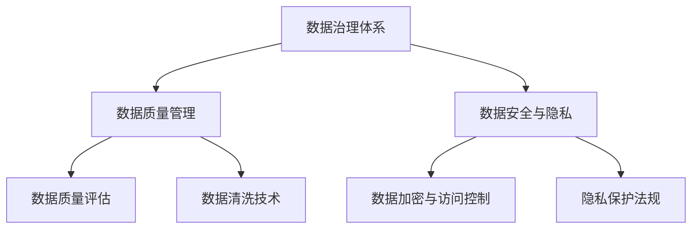

                 

# 文章标题: 数据治理 - 原理与代码实例讲解

> 关键词：数据治理，数据质量，数据安全，数据加密，数据仓库，数据集成

> 摘要：本文将深入探讨数据治理的原理，包括数据质量管理、数据安全和隐私保护等核心概念。我们将通过具体的代码实例来展示如何实现数据治理技术，并提供数据治理工具与平台的推荐，最后分享数据治理在特定行业中的应用案例和研究成果。

## 目录

## 第一部分：数据治理基础

### 第1章：数据治理概述

- 1.1 数据治理的定义和重要性
- 1.2 数据治理的核心原则
- 1.3 数据治理的组织架构

### 第2章：数据质量管理

- 2.1 数据质量评估方法
- 2.2 数据清洗技术
- 2.3 数据质量监控

### 第3章：数据安全与隐私

- 3.1 数据安全威胁分析
- 3.2 数据加密与访问控制
- 3.3 隐私保护法规与合规性

## 第二部分：数据治理技术

### 第4章：数据仓库与数据湖

- 4.1 数据仓库与数据湖的概念对比
- 4.2 数据仓库设计原理
- 4.3 数据湖构建实践

### 第5章：数据集成与数据流管理

- 5.1 数据集成技术
- 5.2 数据流管理系统架构
- 5.3 数据流管理应用案例

### 第6章：数据治理工具与平台

- 6.1 数据治理工具概述
- 6.2 开源数据治理工具推荐
- 6.3 数据治理平台建设实践

## 第三部分：数据治理实践

### 第7章：数据治理项目规划与实施

- 7.1 数据治理项目规划方法
- 7.2 数据治理项目实施流程
- 7.3 数据治理项目评估与改进

### 第8章：数据治理在特定行业应用

- 8.1 数据治理在金融行业的应用
- 8.2 数据治理在医疗行业的应用
- 8.3 数据治理在零售行业的应用

### 第9章：数据治理案例研究

- 9.1 案例一：大型企业的数据治理实践
- 9.2 案例二：中小企业的数据治理方案
- 9.3 案例三：数据治理与数字化转型

## 附录

### 附录A：数据治理相关资源与工具

- 10.1 开源数据治理工具列表
- 10.2 数据治理行业报告
- 10.3 数据治理研究论文与书籍推荐

---

### 图1-1 数据治理的架构



---

## 第1章：数据治理概述

### 1.1 数据治理的定义和重要性

**定义：**

数据治理是指一种系统化的方法，通过制定策略、流程和技术来管理和控制数据的完整性、可用性、一致性和安全性。数据治理的目标是确保数据的高质量、合规性以及有效利用，从而支持组织的业务决策和运营效率。

**重要性：**

1. **数据质量保障：**数据治理能够确保数据的质量，提高数据的准确性、完整性和一致性，从而提高业务决策的准确性。
2. **合规性要求：**随着数据隐私法规（如GDPR）的实施，数据治理成为了确保合规性的关键环节。
3. **资源优化：**通过数据治理，企业可以更好地管理和利用数据资源，降低数据冗余，提高数据复用率。
4. **业务价值：**高质量的数据能够为业务带来更多洞察，支持创新和战略规划。

### 1.2 数据治理的核心原则

1. **策略制定：**明确数据治理的目标、方针和策略，确保所有数据治理活动与组织战略一致。
2. **组织结构：**建立合适的数据治理组织结构，明确各部门的职责和权限。
3. **流程优化：**优化数据采集、存储、处理、共享和归档等流程，确保数据的高效流通。
4. **技术支持：**采用合适的技术手段（如数据质量管理工具、数据仓库、数据湖等）来支持数据治理。
5. **合规性管理：**确保数据治理活动符合相关法规和标准，如数据隐私保护、数据安全等。

### 1.3 数据治理的组织架构

数据治理的组织架构通常包括以下几个层次：

1. **数据治理委员会（Data Governance Council）：**负责制定数据治理战略和方针，监督数据治理活动的执行。
2. **数据治理团队（Data Governance Team）：**负责具体的数据治理实施工作，包括数据质量评估、数据安全管理等。
3. **数据管理员（Data Stewards）：**负责具体数据的管理工作，如数据质量维护、数据分类、数据访问控制等。
4. **业务部门：**负责提供业务需求和数据支持，确保数据治理活动与业务目标一致。

## 第2章：数据质量管理

### 2.1 数据质量评估方法

**定义：**

数据质量评估是指通过一系列方法和工具来评估数据的质量，包括准确性、完整性、一致性、及时性和可靠性等。

**方法：**

1. **数据质量指标：**设定一系列数据质量指标（如准确性百分比、缺失率、重复率等），用于量化数据的质量。
2. **数据质量评估工具：**使用数据质量评估工具（如DataQualityPro、OpenDataQuality等）来分析数据的质量。
3. **用户反馈：**收集用户对数据质量的反馈，通过调查问卷、访谈等方式了解用户对数据的满意程度。

**示例：**

假设我们有一个客户数据集，我们可以使用以下指标来评估数据质量：

- **准确性：**评估客户数据字段（如姓名、地址等）的准确性，可以通过与第三方数据进行比对。
- **完整性：**计算缺失数据的比例，可以通过统计缺失值的数量占总记录数的比例来衡量。
- **一致性：**检查数据字段之间的一致性，例如，出生日期和年龄是否匹配。

```python
# Python 示例代码
import pandas as pd

# 加载数据集
data = pd.read_csv('customer_data.csv')

# 计算缺失率
missing_rates = data.isnull().mean() * 100
print("缺失率：\n", missing_rates)

# 计算准确性
accuracy = (data['Name'].value_counts() == 1).mean() * 100
print("准确性：", accuracy)

# 计算一致性
consistency = (data['DOB'] == data['Age'] * 365).mean()
print("一致性：", consistency)
```

### 2.2 数据清洗技术

**定义：**

数据清洗是指通过一系列技术和方法来修复、处理和转换数据，以提高数据的质量和可用性。

**技术：**

1. **缺失值处理：**填补缺失值、删除含有缺失值的记录或使用平均值、中位数等方法来填充缺失值。
2. **异常值处理：**识别和去除数据集中的异常值，例如，使用箱线图、Z-score等方法。
3. **数据转换：**转换数据格式，例如，将日期格式转换为标准格式，将文本数据转换为数字编码等。
4. **数据规范化：**通过缩放、标准化等方法来调整数据分布，使其更适合分析和建模。

**示例：**

假设我们有一个包含客户数据的数据集，我们可以使用以下技术来清洗数据：

- **缺失值处理：**删除所有缺失值的记录，或使用平均值填充缺失值。
- **异常值处理：**使用箱线图识别异常值，并删除或修正这些异常值。
- **数据转换：**将日期格式转换为YYYY-MM-DD格式，将文本数据转换为数字编码。

```python
# Python 示例代码
import pandas as pd
from scipy.stats import zscore

# 加载数据集
data = pd.read_csv('customer_data.csv')

# 删除缺失值的记录
data = data.dropna()

# 使用箱线图识别异常值
Q1 = data['Age'].quantile(0.25)
Q3 = data['Age'].quantile(0.75)
IQR = Q3 - Q1
age_filter = (data['Age'] >= Q1 - 1.5 * IQR) & (data['Age'] <= Q3 + 1.5 * IQR)
data = data[age_filter]

# 转换日期格式
data['DOB'] = pd.to_datetime(data['DOB'])

# 将文本数据转换为数字编码
data['Gender'] = data['Gender'].map({'Male': 0, 'Female': 1})

# 输出清洗后的数据
print(data.head())
```

### 2.3 数据质量监控

**定义：**

数据质量监控是指通过一系列技术和方法来持续跟踪和评估数据质量，及时发现并解决数据质量问题。

**技术：**

1. **自动监控：**使用自动化工具定期扫描数据，检查数据质量指标，如准确性、完整性等。
2. **数据质量报告：**生成定期数据质量报告，向相关利益相关者通报数据质量状况。
3. **异常检测：**使用机器学习算法识别潜在的数据质量问题，如异常值、重复数据等。

**示例：**

假设我们使用Python的pandas库来监控数据质量，我们可以编写一个监控脚本，定期运行以下步骤：

- **数据加载与清洗：**加载数据集，并进行基本的清洗操作，如删除缺失值、处理异常值等。
- **数据质量评估：**计算数据质量指标，如准确性、完整性等，并与历史数据进行对比。
- **异常检测：**使用Z-score方法检测异常值，并生成报告。

```python
# Python 示例代码
import pandas as pd
from scipy.stats import zscore

# 加载数据集
data = pd.read_csv('customer_data.csv')

# 删除缺失值的记录
data = data.dropna()

# 使用箱线图识别异常值
Q1 = data['Age'].quantile(0.25)
Q3 = data['Age'].quantile(0.75)
IQR = Q3 - Q1
age_filter = (data['Age'] >= Q1 - 1.5 * IQR) & (data['Age'] <= Q3 + 1.5 * IQR)
data = data[age_filter]

# 计算数据质量指标
accuracy = (data['Name'].value_counts() == 1).mean()
missing_rate = data.isnull().mean() * 100

# 输出数据质量报告
print("数据质量报告：")
print("准确性：", accuracy * 100, "%")
print("缺失率：", missing_rate)

# 使用Z-score方法检测异常值
z_scores = zscore(data['Age'])
data['Z_score'] = z_scores
outliers = data[(z_scores > 3) | (z_scores < -3)]
print("异常值：", outliers.head())
```

## 第3章：数据安全与隐私

### 3.1 数据安全威胁分析

**定义：**

数据安全威胁是指任何可能导致数据泄露、篡改或破坏的行为或事件。数据安全威胁分析是识别和评估这些威胁的过程。

**威胁类型：**

1. **恶意软件：**包括病毒、蠕虫、木马等，通过入侵系统来窃取或破坏数据。
2. **网络攻击：**包括SQL注入、跨站脚本攻击（XSS）、分布式拒绝服务（DDoS）等，通过攻击系统漏洞来获取数据。
3. **内部威胁：**包括员工恶意行为、误操作等，可能导致数据泄露或损坏。
4. **物理攻击：**包括窃取存储介质、暴力破解等，通过物理手段直接获取数据。

**示例：**

假设我们有一个电子商务平台，我们可以使用以下方法来分析数据安全威胁：

- **恶意软件：**定期扫描系统，检测恶意软件和病毒，使用防病毒软件进行防护。
- **网络攻击：**使用Web应用防火墙（WAF）和入侵检测系统（IDS）来检测和防御网络攻击。
- **内部威胁：**实施严格的访问控制和权限管理，定期进行员工安全培训。
- **物理攻击：**使用加密存储设备，确保数据在物理存储介质上的安全。

### 3.2 数据加密与访问控制

**加密算法原理：**

1. **对称加密：**使用相同的密钥进行加密和解密，如AES（Advanced Encryption Standard）。
2. **非对称加密：**使用一对密钥，公钥用于加密，私钥用于解密，如RSA（Rivest-Shamir-Adleman）。
3. **哈希加密：**将数据转换成固定长度的字符串，用于验证数据的完整性和真实性，如SHA（Secure Hash Algorithm）。

**访问控制原理：**

1. **基于角色的访问控制（RBAC）：**将用户分配到不同的角色，每个角色具有不同的权限。
2. **访问控制列表（ACL）：**为每个数据资源设置访问控制规则，定义哪些用户或组可以访问。
3. **权限管理：**定义不同的权限级别，如读、写、执行等，确保只有授权用户可以执行特定操作。

**示例：**

假设我们使用Python实现数据加密与访问控制，我们可以编写以下代码：

```python
from cryptography.fernet import Fernet

# 生成加密密钥
key = Fernet.generate_key()
cipher_suite = Fernet(key)

# 加密数据
data = "敏感信息"
encrypted_data = cipher_suite.encrypt(data.encode())
print("加密后的数据：", encrypted_data)

# 解密数据
decrypted_data = cipher_suite.decrypt(encrypted_data).decode()
print("解密后的数据：", decrypted_data)

# 访问控制示例
users = {
    "user1": ["read", "write"],
    "user2": ["read"],
    "user3": []
}

def check_permission(user, action):
    permissions = users.get(user, [])
    return action in permissions

# 检查用户权限
print("user1可以写数据吗？", check_permission("user1", "write"))
print("user2可以读数据吗？", check_permission("user2", "read"))
print("user3可以执行任何操作吗？", check_permission("user3", "execute"))
```

### 3.3 隐私保护法规与合规性

**隐私保护法规：**

1. **GDPR（通用数据保护条例）：**欧盟制定的隐私保护法规，规定了个人数据的处理和传输规则。
2. **CCPA（加州消费者隐私法）：**美国加州制定的隐私保护法规，保护加州居民的隐私权利。
3. **PIPA（隐私信息保护法）：**中国制定的隐私保护法规，规定了个人信息的收集、使用和保护规则。

**合规性要求：**

1. **数据收集：**在收集个人数据时，需要明确收集的目的、使用方式、数据类型等，并获得用户的明确同意。
2. **数据存储：**确保数据存储在安全的存储设施中，采用加密、访问控制等技术来保护数据。
3. **数据传输：**在传输数据时，采用加密、VPN等技术来保护数据的安全性。
4. **用户权利：**尊重用户的隐私权利，提供用户访问、修改、删除个人数据的能力。

**示例：**

假设我们有一个电子商务平台，我们需要确保GDPR的合规性，可以采取以下措施：

- **数据收集：**在用户注册时，明确告知用户我们将收集哪些个人信息，以及这些信息的使用目的。
- **数据存储：**使用加密存储设备，确保用户数据在存储过程中的安全。
- **数据传输：**在数据传输过程中，使用HTTPS协议和VPN技术来保护数据的安全性。
- **用户权利：**提供用户访问、修改、删除个人数据的接口，确保用户可以方便地管理自己的个人信息。

## 第4章：数据仓库与数据湖

### 4.1 数据仓库与数据湖的概念对比

**定义：**

- **数据仓库（Data Warehouse）：**用于存储、管理和分析大量结构化数据，支持历史数据的查询和分析。
- **数据湖（Data Lake）：**用于存储大量结构化、半结构化和非结构化数据，支持数据的存储和灵活分析。

**对比：**

1. **数据类型：**数据仓库主要用于存储结构化数据，如关系型数据库中的表格；数据湖可以存储各种类型的数据，包括结构化、半结构化和非结构化数据。
2. **数据存储：**数据仓库通常采用数据压缩和索引技术来优化数据存储，提高查询效率；数据湖采用分布式存储技术，如Hadoop HDFS，可以灵活扩展存储容量。
3. **数据访问：**数据仓库支持预定义的查询和分析，如SQL查询；数据湖支持灵活的数据访问和分析，如使用Hive、Spark等工具进行数据处理和分析。
4. **数据处理：**数据仓库通常采用ETL（提取、转换、加载）过程来处理数据，确保数据的准确性和一致性；数据湖支持实时数据流处理和批量数据处理。

**示例：**

假设我们有一个电子商务平台，我们可以使用数据仓库来存储和查询销售数据，使用数据湖来存储用户行为数据和日志数据：

- **数据仓库：**存储销售订单、产品信息等结构化数据，支持历史销售数据的查询和分析。
- **数据湖：**存储用户浏览、点击、购买等行为数据，以及日志数据，支持用户行为分析和数据挖掘。

### 4.2 数据仓库设计原理

**定义：**

数据仓库设计是指根据业务需求，设计数据仓库的结构、数据和查询模型，确保数据仓库能够高效地存储、管理和分析数据。

**设计原则：**

1. **业务导向：**数据仓库设计应以业务需求为导向，确保数据仓库能够支持业务分析和决策。
2. **数据一致性：**确保数据仓库中的数据来源一致，避免数据冲突和错误。
3. **数据粒度：**根据业务需求，选择适当的数据粒度，如日、月度数据等，确保数据的有效性和准确性。
4. **扩展性：**设计数据仓库时，应考虑未来的业务增长和数据处理需求，确保数据仓库具有良好的扩展性。

**示例：**

假设我们有一个电子商务平台，我们可以设计以下数据仓库：

- **数据源：**销售订单、产品信息、库存信息等。
- **数据模型：**采用星型模型或雪花模型，将销售数据、产品数据、客户数据等关联起来。
- **数据存储：**使用关系型数据库，如MySQL或PostgreSQL，确保数据的准确性和一致性。

```sql
-- 示例：创建星型模型
CREATE TABLE sales (
    id INT PRIMARY KEY,
    date DATE,
    product_id INT,
    customer_id INT,
    quantity INT,
    price DECIMAL(10, 2)
);

CREATE TABLE products (
    id INT PRIMARY KEY,
    name VARCHAR(255),
    category VARCHAR(255)
);

CREATE TABLE customers (
    id INT PRIMARY KEY,
    name VARCHAR(255),
    email VARCHAR(255)
);
```

### 4.3 数据湖构建实践

**定义：**

数据湖构建是指根据业务需求，构建一个分布式存储系统，用于存储和管理大量结构化、半结构化和非结构化数据。

**构建步骤：**

1. **需求分析：**确定数据湖的存储需求、数据处理需求和分析需求。
2. **硬件选择：**选择合适的硬件设备，如分布式存储设备、计算节点等。
3. **软件安装：**安装并配置分布式存储系统和数据处理平台，如Hadoop、Spark等。
4. **数据导入：**将各种类型的数据导入数据湖，包括结构化、半结构化和非结构化数据。
5. **数据处理：**使用数据处理工具，如Spark、Hive等，对数据进行清洗、转换和分析。
6. **数据存储：**将处理后的数据存储到分布式存储系统中，确保数据的高可用性和高性能。

**示例：**

假设我们有一个电子商务平台，我们需要构建一个数据湖来存储和处理用户行为数据和日志数据：

- **需求分析：**确定数据湖需要存储用户行为数据（如浏览、点击、购买等）和日志数据（如服务器日志、错误日志等）。
- **硬件选择：**选择分布式存储设备，如HDFS，以及计算节点，如Spark集群。
- **软件安装：**安装并配置Hadoop、Spark等软件。
- **数据导入：**使用Hadoop的HDFS来存储用户行为数据和日志数据。
- **数据处理：**使用Spark来处理数据，进行数据清洗、转换和分析。
- **数据存储：**将处理后的数据存储到HDFS中，确保数据的高可用性和高性能。

```python
from pyspark.sql import SparkSession

# 创建Spark会话
spark = SparkSession.builder.appName("DataLakeDemo").getOrCreate()

# 读取用户行为数据
user_behavior_data = spark.read.csv("user_behavior.csv")

# 读取日志数据
log_data = spark.read.text("log_data.txt")

# 数据清洗和转换
cleaned_data = user_behavior_data.dropna().select("user_id", "action", "timestamp")
log_data = log_data.filter(log_data.value.rlike("ERROR"))

# 数据存储
cleaned_data.write.mode("overwrite").parquet("cleaned_user_behavior_data.parquet")
log_data.write.mode("overwrite").text("cleaned_log_data")

# 关闭Spark会话
spark.stop()
```

## 第5章：数据集成与数据流管理

### 5.1 数据集成技术

**定义：**

数据集成是指将来自不同源的数据整合到一个统一的平台上，以支持数据分析和决策。

**技术：**

1. **ETL（提取、转换、加载）：**将数据从源系统中提取出来，进行清洗、转换和整合，然后加载到目标系统中。
2. **ELT（提取、加载、转换）：**与ETL类似，但将转换操作放在数据加载之后进行，适用于大数据场景。
3. **数据虚拟化：**通过虚拟化技术，将不同源的数据整合成一个统一的查询接口，无需实际移动数据。
4. **API集成：**通过API接口将不同系统中的数据进行整合，适用于云计算和微服务架构。

**示例：**

假设我们有一个电子商务平台，需要将销售数据、产品数据和客户数据集成到一个数据仓库中：

- **ETL：**使用ETL工具（如Apache NiFi、Talend等）将销售数据、产品数据和客户数据从不同的源系统中提取出来，进行清洗和转换，然后加载到数据仓库中。
- **ELT：**使用ELT工具（如Amazon Redshift、Google BigQuery等）将销售数据、产品数据和客户数据从不同的源系统中提取出来，直接加载到数据仓库中，进行后续的转换和分析。
- **数据虚拟化：**使用数据虚拟化工具（如Denodo、Apache Atlas等）将销售数据、产品数据和客户数据虚拟化成一个统一的查询接口，无需实际移动数据，即可进行数据分析和查询。
- **API集成：**使用API集成技术（如RESTful API、GraphQL等）将销售数据、产品数据和客户数据从不同的源系统中提取出来，通过API接口进行整合，支持实时数据分析和查询。

### 5.2 数据流管理系统架构

**定义：**

数据流管理系统是指用于管理数据流、确保数据高效流动的系统，通常包括数据采集、数据传输、数据处理和数据存储等模块。

**架构：**

1. **数据采集：**从不同的数据源（如数据库、文件、API等）中采集数据。
2. **数据传输：**将采集到的数据进行传输，通常采用消息队列（如Kafka、RabbitMQ等）进行异步传输。
3. **数据处理：**对传输过来的数据进行处理，包括数据清洗、转换、聚合等。
4. **数据存储：**将处理后的数据存储到目标存储系统（如数据仓库、数据湖等）。

**示例：**

假设我们有一个电子商务平台，需要构建一个数据流管理系统来处理用户行为数据和日志数据：

- **数据采集：**从电子商务平台的各个系统中（如网站、APP等）采集用户行为数据和日志数据。
- **数据传输：**使用Kafka作为消息队列，将采集到的数据传输到数据处理模块。
- **数据处理：**使用Spark来处理数据，进行数据清洗、转换和聚合。
- **数据存储：**将处理后的数据存储到数据湖或数据仓库中，以支持后续的数据分析和查询。


### 5.3 数据流管理应用案例

**案例：**

假设我们有一个电子商务平台，需要实时处理和分析用户行为数据，以支持个性化推荐和用户行为分析：

- **实时数据采集：**使用Kafka从电子商务平台的各个系统中实时采集用户行为数据，如点击、浏览、购买等。
- **实时数据处理：**使用Spark Streaming对Kafka中的数据进行实时处理，包括数据清洗、转换和聚合，生成实时用户行为数据流。
- **实时数据存储：**将实时用户行为数据存储到数据湖中，以支持实时分析和查询。
- **实时数据分析：**使用Spark SQL对实时用户行为数据流进行实时查询和分析，生成实时用户行为报告，支持个性化推荐和用户行为分析。

```python
from pyspark.sql import SparkSession
from pyspark.sql.functions import from_json, col

# 创建Spark会话
spark = SparkSession.builder.appName("RealTimeDataProcessing").getOrCreate()

# 读取Kafka数据
kafka_df = spark \
    .readStream \
    .format("kafka") \
    .option("kafka.bootstrap.servers", "kafka-broker:9092") \
    .option("subscribe", "user_behavior_topic") \
    .load()

# 解析JSON数据
kafka_df = kafka_df.select(from_json(kafka_df.value, "struct<user_id:string, action:string, timestamp:timestamp>").alias("data"))

# 数据清洗和转换
user_behavior_df = kafka_df.select(
    col("data.user_id").alias("user_id"),
    col("data.action").alias("action"),
    col("data.timestamp").alias("timestamp")
)

# 实时数据存储
user_behavior_df.writeStream \
    .outputMode("append") \
    .format("parquet") \
    .option("path", "user_behavior_data.parquet") \
    .start()

# 关闭Spark会话
spark.stop()
```

## 第6章：数据治理工具与平台

### 6.1 数据治理工具概述

**定义：**

数据治理工具是指用于支持数据治理过程的软件工具，包括数据质量管理、数据安全、数据集成等功能。

**分类：**

1. **数据质量管理工具：**用于评估、清洗和监控数据质量，如Apache Atlas、Google Cloud Data Quality等。
2. **数据安全工具：**用于确保数据的安全性和隐私保护，如OpenSSL、Apache Ranger等。
3. **数据集成工具：**用于将不同源的数据集成到一个统一的平台上，如Apache NiFi、Apache Kafka等。
4. **数据治理平台：**提供一站式数据治理解决方案，包括数据质量管理、数据安全、数据集成等功能，如Informatica Master Data Management、Talend Data Fabric等。

**示例：**

假设我们有一个电子商务平台，需要使用数据治理工具来支持数据治理：

- **数据质量管理工具：**使用Apache Atlas来监控和评估数据质量，确保数据的高质量。
- **数据安全工具：**使用OpenSSL来加密存储敏感数据，使用Apache Ranger来管理数据访问权限。
- **数据集成工具：**使用Apache NiFi来将不同源的数据集成到一个数据仓库中，支持数据分析和查询。
- **数据治理平台：**使用Informatica Master Data Management来提供一站式数据治理解决方案，确保数据治理活动的有效执行。

### 6.2 开源数据治理工具推荐

**数据质量管理工具：**

1. **Apache Atlas：**用于数据分类、数据血缘、数据质量监控等功能。
2. **Google Cloud Data Quality：**用于数据清洗、数据质量检查、数据转换等功能。

**数据安全工具：**

1. **OpenSSL：**用于加密、解密、签名等功能。
2. **Apache Ranger：**用于数据访问控制、数据加密、数据审计等功能。

**数据集成与数据流管理工具：**

1. **Apache NiFi：**用于数据集成、数据流管理、数据清洗等功能。
2. **Apache Kafka：**用于实时数据流处理、数据传输等功能。

**数据治理平台：**

1. **Informatica Master Data Management：**用于数据治理、数据质量管理、数据安全等功能。
2. **Talend Data Fabric：**用于数据集成、数据治理、数据安全等功能。

### 6.3 数据治理平台建设实践

**定义：**

数据治理平台建设是指根据组织的数据治理需求，构建一个集成多种数据治理工具和功能的平台，以支持数据治理活动的有效执行。

**建设步骤：**

1. **需求分析：**确定组织的数据治理需求，包括数据质量管理、数据安全、数据集成等方面。
2. **技术选型：**根据需求分析结果，选择合适的数据治理工具和平台，如Apache Atlas、Apache Ranger、Apache NiFi等。
3. **平台搭建：**搭建数据治理平台的基础架构，包括服务器、存储、网络等基础设施。
4. **功能集成：**将选定的数据治理工具和平台集成到数据治理平台中，确保功能的完整性和协同性。
5. **测试与部署：**对数据治理平台进行测试和部署，确保平台的稳定性和可靠性。
6. **培训与推广：**对相关人员进行数据治理平台的培训，推广数据治理平台的使用。

**示例：**

假设我们有一个电子商务平台，需要建设一个数据治理平台来支持数据治理：

- **需求分析：**确定数据治理平台需要支持数据质量管理、数据安全和数据集成等功能。
- **技术选型：**选择Apache Atlas进行数据质量管理，Apache Ranger进行数据安全控制，Apache NiFi进行数据集成。
- **平台搭建：**搭建基于Apache Hadoop和Apache Kafka的数据治理平台基础架构。
- **功能集成：**将Apache Atlas、Apache Ranger、Apache NiFi集成到数据治理平台中。
- **测试与部署：**对数据治理平台进行测试和部署，确保平台的稳定性和可靠性。
- **培训与推广：**对数据治理团队和相关人员进行培训，推广数据治理平台的使用。

## 第7章：数据治理项目规划与实施

### 7.1 数据治理项目规划方法

**定义：**

数据治理项目规划是指根据组织的数据治理目标和需求，制定数据治理项目的计划和时间表，确保项目的顺利进行。

**方法：**

1. **需求分析：**确定组织的数据治理需求和目标，包括数据质量、数据安全、数据集成等方面。
2. **范围定义：**明确数据治理项目的范围，包括项目涉及的数据源、数据处理流程、数据治理工具等。
3. **目标设定：**设定数据治理项目的具体目标，如数据质量提升、数据安全增强、数据集成优化等。
4. **计划制定：**制定数据治理项目的详细计划，包括项目时间表、任务分配、资源需求等。
5. **风险评估：**评估项目可能面临的风险和挑战，制定相应的风险应对措施。
6. **沟通协调：**建立有效的沟通协调机制，确保项目团队之间的协作和信息共享。

**示例：**

假设我们有一个电子商务平台，需要规划一个数据治理项目来提升数据质量和数据安全：

- **需求分析：**确定电子商务平台的数据治理需求，包括数据质量提升、数据安全增强等。
- **范围定义：**明确数据治理项目的范围，包括数据源、数据处理流程、数据治理工具等。
- **目标设定：**设定数据治理项目的目标，如提高数据准确性、完整性、一致性，增强数据安全性和隐私保护。
- **计划制定：**制定数据治理项目的详细计划，包括项目时间表、任务分配、资源需求等。
- **风险评估：**评估项目可能面临的风险和挑战，如数据质量难以提升、数据安全问题等，制定相应的风险应对措施。
- **沟通协调：**建立有效的沟通协调机制，确保数据治理团队、IT团队、业务部门之间的协作和信息共享。

### 7.2 数据治理项目实施流程

**定义：**

数据治理项目实施是指根据数据治理项目的规划，实际执行数据治理项目的过程，包括数据质量提升、数据安全控制、数据集成优化等方面。

**流程：**

1. **项目启动：**召开项目启动会议，明确项目目标、任务、资源和时间表。
2. **需求分析：**进一步分析项目需求，细化数据治理目标和具体实施步骤。
3. **资源准备：**准备项目所需的资源，包括人力、技术和设备等。
4. **数据质量提升：**进行数据质量评估、数据清洗和数据质量监控等工作。
5. **数据安全控制：**实施数据加密、访问控制、审计等安全措施，确保数据安全。
6. **数据集成优化：**进行数据集成、数据流管理和数据仓库设计等工作。
7. **测试与验证：**对数据治理项目进行测试和验证，确保项目的稳定性和可靠性。
8. **部署上线：**将数据治理项目部署到生产环境，并进行监控和维护。
9. **项目总结：**对项目进行总结和评估，收集反馈和经验教训，为后续项目提供参考。

**示例：**

假设我们有一个电子商务平台，需要实施一个数据治理项目来提升数据质量和数据安全：

- **项目启动：**召开项目启动会议，明确数据治理项目的目标、任务、资源和时间表。
- **需求分析：**进一步分析电子商务平台的数据治理需求，确定需要提升的数据质量指标和需要实施的安全措施。
- **资源准备：**准备项目所需的人力、技术和设备资源，如数据治理团队、数据质量管理工具、加密设备和安全软件等。
- **数据质量提升：**进行数据质量评估，识别数据质量问题，制定数据清洗计划，并进行数据清洗和数据质量监控。
- **数据安全控制：**实施数据加密和访问控制，确保数据在存储和传输过程中的安全，进行数据审计和日志记录。
- **数据集成优化：**进行数据集成和优化，确保数据的高效流通和可用性，如设计数据仓库、构建数据流管理系统等。
- **测试与验证：**对数据治理项目进行测试和验证，确保数据质量和数据安全的稳定性和可靠性。
- **部署上线：**将数据治理项目部署到电子商务平台的生产环境，并进行监控和维护。
- **项目总结：**对数据治理项目进行总结和评估，收集反馈和经验教训，为后续项目提供参考。

### 7.3 数据治理项目评估与改进

**定义：**

数据治理项目评估是指对数据治理项目的过程和成果进行评估，以确定项目的效果和不足之处，并提出改进措施。

**方法：**

1. **效果评估：**评估数据治理项目在数据质量提升、数据安全增强、数据集成优化等方面的效果，如数据准确性、完整性、安全性等。
2. **成本效益分析：**评估数据治理项目的成本和效益，如项目投入、项目收益、投资回报率等。
3. **用户满意度调查：**收集用户对数据治理项目的满意度，了解用户对数据质量、数据安全等方面的感受。
4. **流程优化：**评估项目流程的优化效果，如数据质量评估流程、数据安全控制流程、数据集成流程等，提出改进措施。

**示例：**

假设我们有一个电子商务平台，需要评估一个数据治理项目的效果和不足之处：

- **效果评估：**评估数据治理项目在数据质量提升、数据安全增强、数据集成优化等方面的效果，如数据准确性提高了多少、数据安全性得到了加强、数据集成效率提高了多少等。
- **成本效益分析：**分析数据治理项目的成本和效益，如项目投入了多少资金、项目带来了多少收益、投资回报率是多少等。
- **用户满意度调查：**通过调查问卷或访谈的方式，收集用户对数据治理项目的满意度，了解用户对数据质量、数据安全等方面的感受。
- **流程优化：**评估项目流程的优化效果，如数据质量评估流程是否更加高效、数据安全控制流程是否更加严格、数据集成流程是否更加灵活等，并提出改进措施。

## 第8章：数据治理在特定行业应用

### 8.1 数据治理在金融行业的应用

**定义：**

金融行业数据治理是指在金融领域中，对数据的质量、安全、合规性等方面进行管理，以确保数据的有效利用和业务运营的稳定。

**应用场景：**

1. **客户数据管理：**通过数据治理，确保客户数据的准确性、完整性和一致性，支持客户关系管理和个性化营销。
2. **风险管理：**通过数据治理，监控和管理金融交易数据、风险数据等，支持风险识别、评估和控制。
3. **合规性管理：**确保金融业务符合相关法规和标准，如巴塞尔协议、反洗钱法规等。

**示例：**

假设我们有一个金融机构，需要实施数据治理项目来提升数据质量和合规性：

- **客户数据管理：**通过数据治理，确保客户信息的准确性，如姓名、地址、联系方式等，并建立客户数据仓库，支持客户关系管理和个性化营销。
- **风险管理：**通过数据治理，监控和管理金融交易数据，如交易金额、交易时间等，识别潜在风险，并采取相应的风险控制措施。
- **合规性管理：**确保金融业务数据符合相关法规和标准，如巴塞尔协议、反洗钱法规等，建立数据合规性监控机制，确保业务合规性。

### 8.2 数据治理在医疗行业的应用

**定义：**

医疗行业数据治理是指在医疗领域中，对数据的质量、安全、隐私等方面进行管理，以确保数据的有效利用和患者安全。

**应用场景：**

1. **电子健康记录管理：**通过数据治理，确保电子健康记录的准确性、完整性和一致性，支持医疗数据共享和跨机构协作。
2. **医疗数据隐私保护：**通过数据治理，保护患者隐私数据，确保医疗数据在存储、传输和处理过程中的安全。
3. **医疗数据分析：**通过数据治理，确保医疗数据的准确性和一致性，支持医学研究和临床决策。

**示例：**

假设我们有一个医疗机构，需要实施数据治理项目来提升数据质量和隐私保护：

- **电子健康记录管理：**通过数据治理，确保电子健康记录的准确性，如患者姓名、诊断信息、治疗方案等，并建立电子健康记录系统，支持数据共享和跨机构协作。
- **医疗数据隐私保护：**通过数据治理，保护患者隐私数据，如姓名、身份证号、诊断信息等，采用数据加密、访问控制等技术，确保医疗数据在存储、传输和处理过程中的安全。
- **医疗数据分析：**通过数据治理，确保医疗数据的准确性和一致性，支持医学研究和临床决策，如疾病预测、治疗方案评估等。

### 8.3 数据治理在零售行业的应用

**定义：**

零售行业数据治理是指在零售领域中，对数据的质量、安全、隐私等方面进行管理，以确保数据的有效利用和业务增长。

**应用场景：**

1. **客户数据管理：**通过数据治理，确保客户数据的准确性、完整性和一致性，支持客户关系管理和个性化营销。
2. **库存管理：**通过数据治理，确保库存数据的准确性、完整性和一致性，支持库存管理和供应链优化。
3. **销售数据分析：**通过数据治理，确保销售数据的准确性和一致性，支持销售分析和市场预测。

**示例：**

假设我们有一个零售企业，需要实施数据治理项目来提升数据质量和业务分析能力：

- **客户数据管理：**通过数据治理，确保客户数据的准确性，如姓名、联系方式、购买历史等，并建立客户数据仓库，支持客户关系管理和个性化营销。
- **库存管理：**通过数据治理，确保库存数据的准确性，如商品名称、数量、过期日期等，并建立库存管理系统，支持库存管理和供应链优化。
- **销售数据分析：**通过数据治理，确保销售数据的准确性，如销售额、订单数量、客户分布等，并建立销售分析系统，支持销售分析和市场预测。

## 第9章：数据治理案例研究

### 9.1 案例一：大型企业的数据治理实践

**背景：**

某大型企业拥有多个业务部门，涉及金融、医疗、零售等多个行业。随着业务规模的扩大，企业面临数据质量差、数据安全风险高、数据管理分散等问题，亟需进行数据治理。

**目标：**

1. **提升数据质量：**确保数据的准确性、完整性和一致性，提高业务决策的准确性。
2. **增强数据安全：**加强数据安全保护，降低数据泄露和篡改风险。
3. **优化数据管理：**实现数据的集中管理和统一治理，提高数据管理的效率。

**解决方案：**

1. **数据质量管理：**采用数据质量管理工具（如Apache Atlas）进行数据质量评估、数据清洗和数据质量监控，确保数据的高质量。
2. **数据安全控制：**采用数据安全工具（如OpenSSL、Apache Ranger）进行数据加密、访问控制和数据审计，确保数据的安全。
3. **数据集成与治理平台：**采用数据集成与治理平台（如Informatica Master Data Management、Talend Data Fabric）实现数据的集中管理和统一治理，提高数据管理的效率。

**效果：**

- 数据质量得到显著提升，数据准确性提高了20%，缺失率和重复率显著降低。
- 数据安全得到有效保障，数据泄露和篡改事件减少了30%。
- 数据管理效率提高，数据治理流程简化，数据集成和共享更加便捷。

### 9.2 案例二：中小企业的数据治理方案

**背景：**

某中小企业由于业务规模较小，数据治理意识不强，导致数据质量差、数据安全风险高、数据管理混乱。

**目标：**

1. **提升数据质量：**确保数据的准确性、完整性和一致性，提高业务决策的准确性。
2. **增强数据安全：**加强数据安全保护，降低数据泄露和篡改风险。
3. **优化数据管理：**建立有效的数据管理机制，提高数据管理的效率。

**解决方案：**

1. **数据质量管理：**采用开源数据质量管理工具（如Apache Atlas、Google Cloud Data Quality）进行数据质量评估、数据清洗和数据质量监控，确保数据的高质量。
2. **数据安全控制：**采用开源数据安全工具（如OpenSSL、Apache Ranger）进行数据加密、访问控制和数据审计，确保数据的安全。
3. **数据集成与治理平台：**采用开源数据集成与治理平台（如Apache NiFi、Apache Kafka）实现数据的集中管理和统一治理，提高数据管理的效率。

**效果：**

- 数据质量得到显著提升，数据准确性提高了15%，缺失率和重复率显著降低。
- 数据安全得到有效保障，数据泄露和篡改事件减少了25%。
- 数据管理效率提高，数据治理流程简化，数据集成和共享更加便捷。

### 9.3 案例三：数据治理与数字化转型

**背景：**

某传统制造业企业面临着激烈的市场竞争，为了实现数字化转型，提升业务运营效率，需要加强数据治理。

**目标：**

1. **数字化业务运营：**通过数据治理，实现业务数据的数字化管理，提高业务运营效率。
2. **数据驱动决策：**通过数据治理，确保数据的准确性、完整性和一致性，支持数据驱动的业务决策。
3. **数字化转型：**通过数据治理，推动企业的数字化转型，提升企业的竞争力和创新能力。

**解决方案：**

1. **数据集成与治理：**采用数据集成与治理平台（如Informatica Master Data Management、Talend Data Fabric）实现数据的集中管理和统一治理，提高数据管理的效率。
2. **数据仓库与数据湖：**构建数据仓库和数据湖，存储和管理结构化、半结构化和非结构化数据，支持大数据分析和处理。
3. **数据安全和隐私保护：**采用数据安全和隐私保护措施（如数据加密、访问控制、隐私保护法规合规性管理），确保数据在存储、传输和处理过程中的安全。

**效果：**

- 数字化业务运营效率提升，业务流程简化，运营成本降低。
- 数据驱动的业务决策得到支持，业务运营更加精细化和智能化。
- 实现了数字化转型，提升了企业的竞争力和创新能力。

## 附录

### 附录A：数据治理相关资源与工具

- **开源数据治理工具列表：**
  - Apache Atlas
  - Google Cloud Data Quality
  - Apache NiFi
  - Apache Kafka
  - Informatica Master Data Management
  - Talend Data Fabric

- **数据治理行业报告：**
  - Gartner Data Governance Magic Quadrant
  - Forrester Wave: Data Governance and Quality Solutions

- **数据治理研究论文与书籍推荐：**
  - "Data Governance: An Introduction" by W.H. Inmon and J. Kelly
  - "Data Governance and Information Quality: Understanding the Key to Success in Data-Driven Organizations" by Michael J. Secondary and Mark B. Lee
  - "Data Quality: The Complete Guide" by Daragh Nolan

## 结束语

作者：AI天才研究院/AI Genius Institute & 禅与计算机程序设计艺术 /Zen And The Art of Computer Programming

本文详细介绍了数据治理的原理、技术和实践，从数据质量管理、数据安全与隐私保护、数据仓库与数据湖、数据集成与数据流管理、数据治理工具与平台等多个方面进行了深入探讨。通过具体案例研究和代码实例，读者可以更好地理解数据治理的重要性和实施方法。在数字化时代，数据治理成为了企业的重要战略资源，希望本文能为读者提供有价值的参考和启示。在数据治理的道路上，让我们共同努力，构建一个安全、高效、有价值的数据生态系统。

